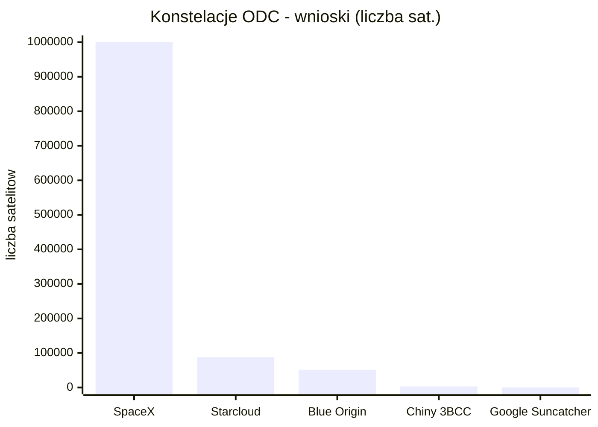
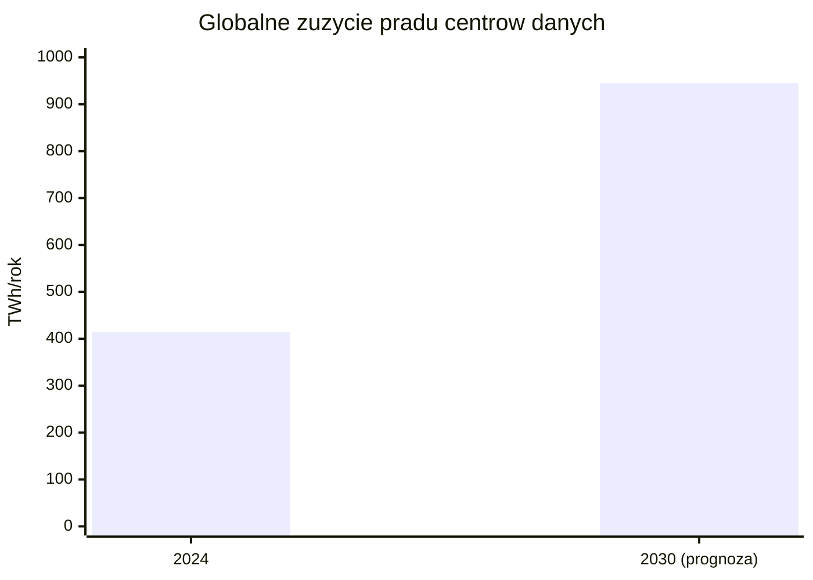
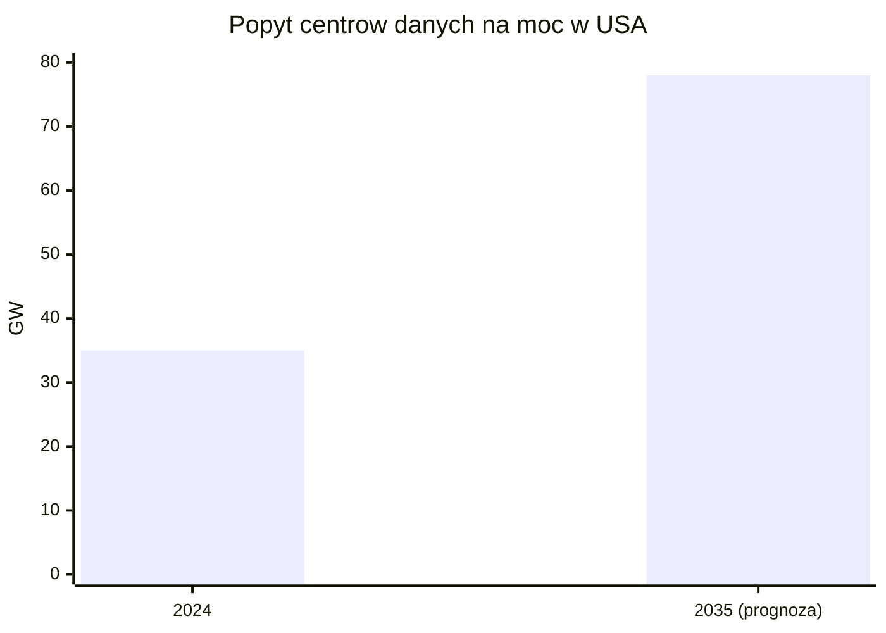
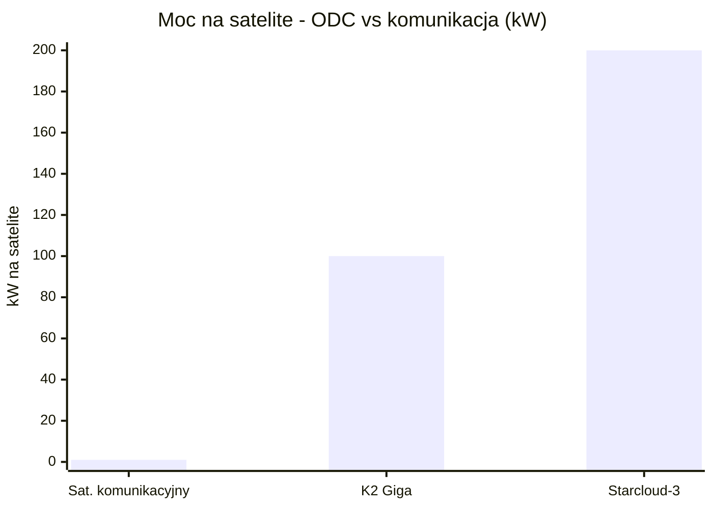

# Wprowadzenie, definicje i architektury

> Notatka raportu "Orbitalne centra danych". Kluczowe źródła: [źródło 1](https://researchintelo.com/report/orbital-space-based-data-center-and-ai-compute-market), [źródło 2](https://www.adlittle.com/en/insights/viewpoints/data-centers-go-orbital).

## W skrócie

Orbitalne (kosmiczne) centrum danych to po prostu sprzęt obliczeniowy - procesory, pamięć, dyski - umieszczony na satelicie lub grupie połączonych satelitów krążących nad Ziemią, zwykle na niskiej orbicie (<abbr title="obszar orbity do około 2000 km wysokości, gdzie zwykle umieszcza się te satelity.">LEO</abbr>, 400-2000 km), zamiast w hali na powierzchni planety. Inwestor powinien rozumieć, że to dziś przede wszystkim wyścig o tanią energię słoneczną i o omijanie wieloletnich kolejek na przyłącze prądu: naziemne centrum danych w USA potrzebuje około 7 lat od pomysłu do uruchomienia, a kolejki na podłączenie do sieci sięgają 3-5 lat. Po stronie przychodów stawka jest ogromna - globalne zużycie prądu przez centra danych ma się podwoić z 415 <abbr title="jednostka ilości zużytej energii; miara rocznego poboru prądu przez centra danych.">TWh</abbr> (2024) do około 945 TWh (2030) według Międzynarodowej Agencji Energii. Kluczowe ryzyko: prawie wszystko jest dziś demonstratorem (Starcloud-1 to jeden satelita z jednym GPU), a opłacalność zależy w całości od drastycznego spadku kosztów startu rakiet, których operatorzy w większości nie kontrolują. Wygrywają na razie sprzedawcy "kilofów i łopat" (producenci platform satelitarnych jak K2 Space, dostawcy laserów), a największym przegranym mogą być inwestorzy kupujący wizję gigawatowych chmur "do 2028 roku", które eksperci nazywają science fiction.

<!-- network:watki:start -->
## Powiązane wątki

> Mapa powiązań tematycznych - jak ten wątek łączy się z resztą raportu.

- [[03 - fizyka-orbitalna-orbity-i-operacje|Fizyka orbitalna]] - architektury free-flyer i konstelacji wynikają z wyboru orbity i operacji
- [[04 - energetyka-kosmiczna-i-fotowoltaika-orbitalna|Energetyka kosmiczna]] - głównym motorem napędowym jest tania, ciągła energia słoneczna
- [[09 - ekonomika-i-koszty-calkowite-tco|Ekonomika i TCO]] - czy wizja gigawatowych chmur jest opłacalna rozstrzyga rachunek TCO
- [[10 - gracze-i-projekty|Gracze i projekty]] - kto realnie buduje opisane tu architektury (SpaceX, Google, Starcloud)
- [[12 - naziemny-bottleneck-energetyczny-i-sieciowy|Naziemny bottleneck]] - motywacja popytowa: niedobór mocy i kolejki przyłączeniowe na Ziemi
<!-- network:watki:end -->
## Czym jest orbitalne centrum danych i jak je klasyfikować

Najprostsza definicja brzmi: orbitalne centrum danych (ang. orbital / space-based data center, <abbr title="sprzęt obliczeniowy (procesory, pamięć, dyski) umieszczony na satelicie lub grupie satelitów krążących nad Ziemią, zamiast w naziemnej hali.">ODC</abbr>) to obiekt obliczeniowy umieszczony na niskiej orbicie okołoziemskiej (LEO - Low Earth Orbit, czyli orbita do około 2000 km wysokości), na pokładzie satelity lub klastra połączonych satelitów, zaprojektowany do wykonywania zadań AI: wnioskowania (inference - uruchamianie gotowych modeli), trenowania modeli (training) lub analityki danych w kosmosie. 🟠 Tak definiuje go firma analityczna ResearchIntelo, podając typowy zakres wysokości 400-2000 km ([źródło](https://researchintelo.com/report/orbital-space-based-data-center-and-ai-compute-market)). 🟠 Firma doradcza Arthur D. Little zawęża ten zakres do 400-1400 km i podkreśla, że chodzi o "sprzęt obliczeniowy (procesory, pamięć, dyski) ulokowany na pokładzie tych satelitów" ([źródło](https://www.adlittle.com/en/insights/viewpoints/data-centers-go-orbital)). Dla inwestora termin "data center" jest tu więc rozciągliwy - od pojedynczego procesora po wyobrażenie miliona satelitów.

Taksonomia (czyli klasyfikacja zastosowań) ma znaczenie, bo decyduje o tym, które obietnice są już realne, a które odległe. 🟠 Arthur D. Little wyróżnia trzy wczesne kategorie zastosowań: (1) edge compute na orbicie - przetwarzanie danych tam, gdzie powstają, czyli przy obserwacji Ziemi (EO, Earth Observation); (2) odporne i suwerenne przechowywanie danych (storage/backup); (3) tolerujące opóźnienia przetwarzanie wsadowe (batch compute), gdzie nie liczy się szybka odpowiedź ([źródło](https://www.adlittle.com/en/insights/viewpoints/data-centers-go-orbital)). Implikacja inwestorska: storage i edge są najbliżej komercjalizacji, bo są "lekkie energetycznie", a trening modeli frontier (największych, najnowszych) jest najdroższy energetycznie i najdalszy.

Dlaczego storage jest łatwiejszy? 🟠 Według eksperta cytowanego przez Satellite Today przechowywanie danych "pobiera bardzo mało mocy - mniej niż 15 procent mocy typowego centrum danych", a dane mogą być rozproszone na wielu satelitach dla odporności ([źródło](https://www.satellitetoday.com/technology/2026/06/02/are-orbital-data-centers-the-next-frontier-of-ai-infrastructure/)). Dla porównania, trening modeli frontier pochłania 🟠 30-80 MW (megawatów - milionów watów) ciągłej mocy przez 30-90 dni ([źródło](https://researchintelo.com/report/orbital-space-based-data-center-and-ai-compute-market)). Różnica rzędu wielkości tłumaczy, czemu pierwsze realne wdrożenia to backup i obserwacja Ziemi, a nie chmura AI.

Argument za przetwarzaniem przy źródle danych: 🟠 globalny strumień surowych zdjęć satelitarnych przekroczył w 2025 roku 2,8 <abbr title="jednostka ilości danych równa miliardowi gigabajtów.">EB</abbr>/dzień (eksabajta na dobę; eksabajt to miliard gigabajtów) ([źródło](https://researchintelo.com/report/orbital-space-based-data-center-and-ai-compute-market)). Przetwarzanie tych danych na orbicie zamiast ściągania ich na Ziemię oszczędza pasmo. Co do opóźnień - 🟠 klaster na LEO na 600 km może obsłużyć użytkowników naziemnych w swoim zasięgu z opóźnieniem <abbr title="czas, w jakim sygnał dociera do celu i wraca, czyli miara opóźnienia łącza (w milisekundach).">RTT</abbr> (round-trip time, czas tam i z powrotem) około 8-15 ms (milisekund) ([źródło](https://researchintelo.com/report/orbital-space-based-data-center-and-ai-compute-market)). To pokazuje, że niektóre zastosowania są fizycznie wykonalne; pytanie brzmi - po jakim koszcie.

Fizyczna przewaga kosmosu, która przewija się przez całą dziedzinę: 🔵 według white papera firmy Starcloud "głęboka przestrzeń jest zimna - efektywna temperatura otoczenia to około -270°C, odpowiadająca temperaturze mikrofalowego promieniowania tła" ([źródło](https://starcloudinc.github.io/wp.pdf)). To teoretycznie darmowa chłodnica, choć - jak pokaże sekcja o kontrowersjach - w praktyce wymaga ciężkich radiatorów.

## Warianty architektury

### Free-flyer LEO i konstelacje węzłów obliczeniowych

Dominujący pomysł to "free-flyer" - swobodnie latający satelita lub cała konstelacja (sieć wielu satelitów) pełniących rolę węzłów obliczeniowych. Skala deklarowanych wniosków jest skrajnie rozbieżna. 🔵 30 stycznia 2026 SpaceX złożył do amerykańskiego regulatora FCC wniosek o autoryzację systemu "do jednego miliona satelitów" pod nazwą "SpaceX Orbital Data Center system" ([źródło](https://docs.fcc.gov/public/attachments/DA-26-113A1.pdf)). 🔵 System ma działać na wysokościach 500-2000 km, w inklinacjach 30 stopni oraz heliosynchronicznej (<abbr title="orbita, na której satelita przelatuje nad danym punktem Ziemi zawsze o tej samej porze słonecznej.">SSO</abbr> - orbita, na której satelita przelatuje nad danym punktem zawsze o tej samej porze słonecznej) ([źródło](https://docs.fcc.gov/public/attachments/DA-26-113A1.pdf)). Implikacja: milion satelitów to liczba bezprecedensowa - dla porównania kontekst skali pojawi się w sekcji o kontrowersjach.

Inni gracze składają własne, również gigantyczne wnioski. 🟠 Starcloud złożył do FCC wniosek na konstelację 88 000 satelitów (3 lutego 2026, dzień po SpaceX) ([źródło](https://siliconvalleyinvestclub.com/starcloud/)). 🟠 Blue Origin (firma Jeffa Bezosa) wnioskuje o "do 51 600 satelitów-centrów danych" w projekcie nazwanym Project Sunrise, działającym na orbitach kołowych SSO od 500 do 1800 km ([źródło](https://www.geekwire.com/2026/blue-origin-data-center-space-race-project-sunrise/)). Implikacja inwestorska: liczby we wnioskach regulacyjnych to deklaracje maksymalnych pułapów, nie zobowiązania - traktuj je jako "rezerwacje miejsca", nie jako biznesplan.

*Rys. 1 - skala deklarowanych konstelacji ODC wg graczy: wnioski FCC i projekty (SpaceX milion, Starcloud 88 tys., Blue Origin Project Sunrise 51,6 tys., chiński Three-Body 2800, klaster Google Suncatcher 81). Dane: FCC DA-26-113A1, siliconvalleyinvestclub (Starcloud), GeekWire (Blue Origin), dig.watch (Chiny), arXiv 2511.19468 (Google).*

Najbardziej dopracowaną technicznie architekturę free-flyer pokazał Google w projekcie Suncatcher. 🔵 W publikacji naukowej (preprint arXiv autorstwa Google Research) opisano klaster 81 satelitów o promieniu 1 km na średniej wysokości 650 km, lecących w formacji ([źródło](https://arxiv.org/html/2511.19468v1)). 🔵 Aby taki klaster działał jak jedno centrum danych, każde łącze międzysatelitarne potrzebuje przepustowości rzędu 10 Tbps (terabitów na sekundę), co Google uznaje za osiągalne komercyjnymi komponentami <abbr title="technika gęstego zwielokrotnienia falowego, upychająca wiele kanałów świetlnych w jedno łącze optyczne dla większej przepustowości.">DWDM</abbr> (technika gęstego zwielokrotnienia falowego, pozwalająca wepchnąć wiele kanałów w jedno łącze optyczne) ([źródło](https://arxiv.org/html/2511.19468v1)). 🔵 Demonstrator laboratoryjny osiągnął 800 Gbps w jedną stronę, czyli 1,6 Tbps dwukierunkowo, na krótkim odcinku w wolnej przestrzeni ([źródło](https://arxiv.org/html/2511.19468v1)). Implikacja: łączenie satelitów w "jeden komputer" jest sercem problemu - i wymaga przepustowości jeszcze 6 razy wyższej niż osiągnięto w labie.

Chiny realizują podejście konstelacyjne najszybciej w praktyce. 🟠 W maju 2025 Zhejiang Lab wystrzelił 12 satelitów LEO jako pierwszą fazę "Three-Body Computing Constellation", docelowo planowanej na około 2800 satelitów o łącznej mocy obliczeniowej 1000 peta operacji na sekundę ([źródło](https://dig.watch/updates/china-moves-toward-data-centres-in-orbit)).

### Moduł przy komercyjnej stacji - Axiom Space (POTWIERDZONE)

Alternatywą dla free-flyerów jest doczepienie centrum danych do załogowanej stacji kosmicznej. Robi to Axiom Space - i wbrew oznaczeniu "do potwierdzenia" w briefie, źródła pierwotne to potwierdzają. 🔵 Axiom oficjalnie ogłosił, że pracuje nad ODC od 2022 roku, od wyniesienia urządzenia AWS Snowcone (przenośna jednostka obliczeniowa Amazona) na Międzynarodową Stację Kosmiczną ISS ([źródło](https://www.axiomspace.com/release/axiom-space-to-launch-orbital-data-center-nodes-to-support-national-security-commercial-international-customers)). 🔵 Firma zapowiedziała wyniesienie pierwszych dwóch węzłów ODC (free-flyer) na LEO do końca 2025 roku, z optycznymi łączami o przepustowości 2,5 Gbps do satelitów przekaźnikowych Kepler Communications ([źródło](https://www.axiomspace.com/release/axiom-space-to-launch-orbital-data-center-nodes-to-support-national-security-commercial-international-customers)). 🔵 Docelowo, do 2027 roku, Axiom planuje pełną szafę serwerową o rozmiarze około pół metra sześciennego (0,5 m³) na swojej stacji Axiom Station, z łączami optycznymi <abbr title="laserowe połączenie między satelitami pozwalające im wymieniać dane bez pośrednictwa Ziemi.">OISL</abbr> do 10 Gbps spełniającymi standardy interoperacyjności agencji SDA ([źródło](https://www.axiomspace.com/release/orbital-data-center)). Implikacja: Axiom to przykład realnej, etapowej, mniejszej skali - od jednego urządzenia AWS po pół metra sześciennego sprzętu, daleko od miliona satelitów.

![[assets/x00-1-c6f8b80a-5a7b-427d-a2c7-0c0bc2806a.png]]
*Rys. 2 - Architektura Axiom Space Orbital Data Center (modul przy stacji komercyjnej). Źródło: Axiom Space / ITHome, licencja: materialy prasowe - do uzytku wlasnego.*
#grafika #wprowadzenie-definicje-i-architektury #architektura #Axiom #ODC

### Inne architektury - storage księżycowy i cislunarny

Osobna gałąź to przechowywanie danych daleko od Ziemi. 🔵 Lonestar Data Holdings podpisał z firmą Sidus Space umowę wartości 120 mln USD na sześć statków przeznaczonych do księżycowego przechowywania danych ([źródło](https://sidusspace.com/2025/04/02/sidus-space-signs-extended-and-amended-preliminary-120m-agreement-with-lonestar-for-lunar-data-storage-spacecraft/)). 🟠 Kolejnym krokiem ma być seria wielopetabajtowych pamięci operujących z punktu libracyjnego L1 układu Ziemia-Księżyc, z pierwszym startem w 2027 roku ([źródło](https://www.factoriesinspace.com/lonestar)). 🟠 <abbr title="stabilny grawitacyjnie punkt między Ziemią a Księżycem (około 300 000 km od Ziemi), rozważany pod dalekie archiwa danych.">Punkt L1</abbr> znajduje się około 300 000 km od Ziemi ([źródło](https://www.datacenterdynamics.com/en/news/sidus-space-advances-120m-agreement-with-lonestar-brings-in-atomic-6/)). Implikacja: to nisza "archiwum poza zasięgiem katastrof", a nie chmura AI - inny profil ryzyka i przychodu.

## Motywacja popytowa - boom na moc obliczeniową AI

Cała dziedzina opiera się na założeniu, że popyt na moc obliczeniową rośnie szybciej, niż Ziemia jest w stanie dostarczyć prąd. 🔵 Według Międzynarodowej Agencji Energii (IEA) centra danych zużyły w 2024 roku około 415 TWh (terawatogodzin) energii, czyli około 1,5% światowego zużycia prądu ([źródło](https://www.iea.org/reports/energy-and-ai/energy-demand-from-ai)). 🔵 W scenariuszu bazowym IEA prognozuje podwojenie tej liczby do około 945 TWh do 2030 roku, przy wzroście około 15% rocznie - ponad cztery razy szybciej niż cała reszta zapotrzebowania na prąd ([źródło](https://www.iea.org/reports/energy-and-ai/energy-demand-from-ai)). 🔵 Samo zużycie serwerów akcelerowanych (czyli napędzanych głównie przez AI) ma rosnąć około 30% rocznie ([źródło](https://www.iea.org/reports/energy-and-ai/energy-demand-from-ai)). Implikacja inwestorska: to jest twardy, niezależny od entuzjastów kosmosu dowód na realny niedobór mocy - paliwo dla całej narracji ODC.

*Rys. 3 - podwojenie globalnego zużycia prądu przez centra danych w scenariuszu bazowym IEA (415 TWh w 2024 do ok. 945 TWh w 2030). Dane: IEA - Energy and AI.*

Rynek amerykański pokazuje to jeszcze ostrzej. 🟠 BloombergNEF prognozuje, że zapotrzebowanie centrów danych na moc w USA ponad się podwoi - z prawie 35 GW (gigawatów) w 2024 do 78 GW w 2035 ([źródło](https://about.bnef.com/insights/commodities/power-for-ai-easier-said-than-built/)). 🟠 Udział centrów danych w całym popycie na prąd w USA ma wzrosnąć z 3,5% dziś do 8,6% w 2035 ([źródło](https://about.bnef.com/insights/commodities/power-for-ai-easier-said-than-built/)).

*Rys. 4 - ponad dwukrotny wzrost zapotrzebowania centrów danych na moc w USA (z prawie 35 GW w 2024 do 78 GW w 2035). Dane: BloombergNEF - Power for AI.*

## Motywacja energetyczna i administracyjna

### Tania, ciągła energia słoneczna

To najmocniejszy argument zwolenników. 🔵 Starcloud twierdzi, że "capacity factor" (czyli udział czasu, w którym panel realnie produkuje pełną moc) jego kosmicznej matrycy solarnej przekracza 95%, bez cyklu dzień/noc, z idealną orientacją paneli i bez wpływu pogody czy pór roku ([źródło](https://starcloudinc.github.io/wp.pdf)). 🔵 Szczytowa generacja ma być około 40% wyższa niż na Ziemi, bo atmosfera osłabia i rozprasza promieniowanie nawet w pogodny dzień ([źródło](https://starcloudinc.github.io/wp.pdf)). 🔵 W sumie ten sam panel ma w kosmosie wytworzyć ponad 5 razy więcej energii niż na Ziemi ([źródło](https://starcloudinc.github.io/wp.pdf)). 🔵 Google podaje ostrożniejszą, ale zbieżną liczbę: w odpowiednich orbitach panel otrzymuje do 8 razy więcej energii słonecznej rocznie niż na Ziemi w średnich szerokościach geograficznych ([źródło](https://arxiv.org/html/2511.19468v1)). 🟠 Fizyczne tło: irradiancja słoneczna w kosmosie to 1361 W/m², wobec efektywnych 150-300 W/m² na Ziemi ([źródło](https://introl.com/blog/orbital-data-centers-space-computing-race-2026)).

Z tych przewag Starcloud wyprowadza spektakularne deklaracje kosztowe. 🔵 Firma twierdzi, że docelowo zaoferuje "równoważny koszt energii około 0,002 USD/kWh", czyli energię 22 razy tańszą niż dzisiejsze ceny ([źródło](https://starcloudinc.github.io/wp.pdf)). 🔴 Bardziej powściągliwa, wtórna liczba mówi o 0,05 USD/kWh dla satelity Starcloud-3 ([źródło](https://tech-insider.org/starcloud-170-million-series-a-space-data-center-2026/)). Implikacja: rozrzut od 0,002 do 0,05 USD/kWh (25-krotny) sam w sobie pokazuje, jak niepewne są te projekcje - inwestor powinien traktować dolny koniec jako marketing.

### Chłodzenie bez wody

🔵 Studium ASCEND (Thales Alenia Space) podkreśla, że kosmiczne centra danych "nie wymagałyby wody do chłodzenia - kluczowa przewaga w czasach rosnących susz" ([źródło](https://www.thalesaleniaspace.com/en/press-releases/thales-alenia-space-reveals-results-ascend-feasibility-study-space-data-centers-0)). 🟠 Na Ziemi chłodzenie potrafi pochłaniać do 40% budżetu energetycznego centrum danych ([źródło](https://researchintelo.com/report/orbital-space-based-data-center-and-ai-compute-market)). Ale chłodzenie w próżni nie jest darmowe - ciepło trzeba wypromieniować radiatorami. 🔵 Starcloud podaje, że czarna płyta 1x1 m o temperaturze 20°C wypromieniowuje około 838 W do głębokiej przestrzeni (z obu stron) ([źródło](https://starcloudinc.github.io/wp.pdf)). 🟠 W praktyce masa radiatora potrzebnego do oddania ciepła z około 10 MW obliczeń na orbicie szacowana jest na około 529 ton ([źródło](https://www.insiderfinance.io/news/google-spacex-orbital-data-centers-talks)). Implikacja: "darmowa zimna kosmiczna chłodnica" w realu oznacza setki ton sprzętu do wyniesienia - koszt, który wraca w rachunku startowym.

### Omijanie przyłączy, pozwoleń i protestów

To argument administracyjny, często niedoceniany. 🟠 Według analizy Introl orbitalne centra danych "nie wymagają przyłącza do sieci elektrycznej, pozwoleń na użytkowanie gruntu pod kampusy serwerów, praw do wody na chłodzenie ani wieloletnich umów przyłączeniowych z dostawcami prądu" ([źródło](https://introl.com/blog/orbital-data-centers-space-computing-race-2026)). 🔵 Starcloud podkreśla, że w krajach zachodnich nowe wielkoskalowe projekty energetyczne "często zajmują dekadę lub więcej" z powodu wymogów pozwoleniowych, praw drogi i ocen środowiskowych ([źródło](https://starcloudinc.github.io/wp.pdf)). 🔵 Orbitalne DC mają te przeszkody niemal w całości omijać, co - według firmy - przynosi istotne oszczędności ([źródło](https://starcloudinc.github.io/wp.pdf)). To łączy się z naziemnymi wąskimi gardłami: 🔵 Starcloud wskazuje, że pozwolenia i budowa nowych centrów danych oraz projektów energetycznych na Ziemi mogą trwać do 5 lat ([źródło](https://www.businesswire.com/news/home/20260330024111/en/)); 🟠 BNEF szacuje typowy czas rozwoju DC w USA na około 7 lat (4,8 roku przed budową, 2,4 roku budowy) ([źródło](https://about.bnef.com/insights/commodities/power-for-ai-easier-said-than-built/)); 🟠 kolejki na przyłącze sięgają 3-5 lat na kluczowych rynkach jak Północna Wirginia, Dublin i Singapur ([źródło](https://researchintelo.com/report/orbital-space-based-data-center-and-ai-compute-market)). Implikacja: gdyby tempo wdrożenia w kosmosie biło te 5-7 lat, byłoby to realne źródło przewagi konkurencyjnej, niezależne od kosztu energii.

## Analogia do Starlink jako "kolejny krok"

Narracja "po terminalach komunikacyjnych przychodzi czas na komputery na orbicie" opiera się na sukcesie Starlink. 🟠 SpaceX ma już ponad 10 000 satelitów w konstelacji Starlink, wyniesionych od 2019 roku ([źródło](https://www.geekwire.com/2026/blue-origin-data-center-space-race-project-sunrise/)). 🟠 W styczniu 2026 aktywnych było około 9500 z 14 500 wszystkich satelitów na orbicie ([źródło](https://repo.enc.edu/2026/02/03/why-did-spacex-just-ask-to-launch-1-million-satellites/)). 🟠 Sam 2025 rok przyniósł 3000 satelitów V2 Mini Optimized, dodających ponad 270 Tbps pojemności ([źródło](https://orbitaltoday.com/2026/01/03/starlink-progress-2025-report-part-ii-satellites/)). Kluczowy łącznik z ODC to sieć optyczna: 🟠 każdy V2 Mini ma trzy lasery, a cała sieć ponad 24 000 laserów ([źródło](https://orbitaltoday.com/2026/01/03/starlink-progress-2025-report-part-ii-satellites/)); 🟠 każdy laser nadaje z prędkością do 200 Gbps ([źródło](https://www.fierce-network.com/cloud/opinion-spacexs-satellite-data-center-plan-unhinged)). 🔵 We wniosku FCC SpaceX wprost zapowiada, że łącza optyczne ODC będą kierować ruch "do satelitów w konstelacji Starlink, przez jej wysokoprzepustową (petabitową) i niezawodną siatkę laserową", która przekaże ruch do stacji naziemnych ([źródło](https://docs.fcc.gov/public/attachments/DA-26-113A1.pdf)). Implikacja: dla SpaceX orbitalne DC nie jest projektem od zera, lecz nadbudową nad istniejącym, działającym backbonem - to realna przewaga, ale tylko dla jednego gracza.

## Skala odniesienia - typowe naziemne DC

Brief prosi o benchmark "~200 MW". W źródłach precyzyjna liczba 200 MW jest NIE UJAWNIONA - dostępne są za to liczby okalające ten rząd wielkości. 🟠 Nowy obiekt hyperscale (najwiekszej klasy) potrzebuje co najmniej 50-100 MW ([źródło](https://cc-techgroup.com/how-much-power-does-a-hyperscale-data-center-use/)). 🟠 Pojedynczy duży obiekt hyperscale zużywa około 100 MW - tyle, co setki tysięcy domów ([źródło](https://cc-techgroup.com/how-much-power-does-a-hyperscale-data-center-use/)). 🟠 Inne źródło podaje ciągle 20-100+ MW, a największe obiekty ponad 650 MW ([źródło](https://iaeimagazine.org/electrical-fundamentals/how-much-electricity-does-a-data-center-use-complete-2025-analysis/)). 🔵 Starcloud przyjmuje za punkt odniesienia 100 MW dla dużego DC dziś, z planami zbliżenia się do 1 GW ([źródło](https://starcloudinc.github.io/wp.pdf)), i wskazuje, że klaster potrzebny do treningu modeli pokroju Llama 5 lub GPT-6 to aż 5 GW ([źródło](https://starcloudinc.github.io/wp.pdf)). 🔵 Studium ASCEND szacuje rynek mocy DC na 23 GW do 2030 i celuje w 1 GW na orbicie przed 2050 rokiem ([źródło](https://www.thalesaleniaspace.com/en/press-releases/thales-alenia-space-reveals-results-ascend-feasibility-study-space-data-centers-0)). Implikacja: dzisiejsze orbitalne demonstratory działają na poziomie kilowatów - od pojedynczych setek megawatów naziemnego DC dzieli je pięć rzędów wielkości.

![[assets/x00-2-station-data-center-v2-1036-light.jpg]]
*Rys. 5 - Koncepcja modularnego orbitalnego DC Thales Alenia Space ASCEND. Źródło: Thales Alenia Space / Satellite Today, licencja: materialy prasowe - do uzytku wlasnego.*
#grafika #wprowadzenie-definicje-i-architektury #architektura #ASCEND

## Kontrowersje

**1. Czy to prawdziwe data center, czy demonstrator, storage, edge lub etykieta marketingowa?**

To najważniejszy spór dziedziny, bo decyduje, czy inwestor kupuje produkt, czy obietnicę.

**Strona "to jeszcze nie są prawdziwe DC":** 🟠 Starcloud-1 to pojedynczy satelita z jednym GPU Nvidia H100, a nie klaster centrum danych ([źródło](https://siliconcanals.com/sc-w-one-satellite-one-gpu-1-1-billion-valuation-the-reality-behind-starclouds-orbital-data-center-ambitions/)). 🟠 Ta sama analiza podaje, że łączna moc największej sieci satelitarnej w historii to mniej niż 1% pojemności centrów danych obecnie budowanych na Ziemi ([źródło](https://siliconcanals.com/sc-w-one-satellite-one-gpu-1-1-billion-valuation-the-reality-behind-starclouds-orbital-data-center-ambitions/)). 🟠 Blog Per Aspera: dzisiejsze demonstratory działają w skali kilowatów i kilku teraflopów - "efektywnie równowartość szafy lub dwóch serwerów na Ziemi, a nie całego centrum danych" ([źródło](https://peraspera.us/realities-of-space-based-compute/)). 🟠 Według tego samego źródła "ktokolwiek macha biznesplanem stumegawatowej chmury LEO do 2028 roku wciąż uprawia science fiction" ([źródło](https://peraspera.us/realities-of-space-based-compute/)). Dokłada problemy fizyczne: 🟠 na LEO każde 90-minutowe okrążenie zawiera 25-35% czasu zaćmienia (brak słońca) ([źródło](https://peraspera.us/realities-of-space-based-compute/)); 🟠 sam osprzęt zasilania dla systemu 100 kW waży około 1,4 tony, bez kabli i elektroniki sterującej ([źródło](https://peraspera.us/realities-of-space-based-compute/)); 🟠 140 kW wymaga około 700 m² paneli ([źródło](https://peraspera.us/realities-of-space-based-compute/)).

**Strona "to pierwszy krok ku prawdziwym DC":** 🔵 Starcloud-1 dostarczył pierwszy H100 na orbicie, ze 100-krotnym wzrostem mocy obliczeniowej AI względem wcześniejszych GPU w kosmosie ([źródło](https://www.businesswire.com/news/home/20260330024111/en/)). 🔵 Starcloud-2 ma mieć największy komercyjny rozkładany radiator w historii i 100-krotnie większą generację mocy niż Starcloud-1 ([źródło](https://www.businesswire.com/news/home/20260330024111/en/)). 🔴 Starcloud-3 ma osiągnąć 200 kW przy masie 3 ton ([źródło](https://tech-insider.org/starcloud-170-million-series-a-space-data-center-2026/)). 🔵 K2 Space deklaruje 100 kW mocy na satelitę na platformie Giga, "umożliwiając misje, które wcześniej istniały tylko w science fiction: obliczenia w skali AI na orbicie" ([źródło](https://www.prnewswire.com/news-releases/k2-space-raises-250m-at-3b-valuation-to-roll-out-a-new-class-of-high-capability-satellites-302638936.html)). 🔵 Starcloud argumentuje, że przy gęstości 120 kW na szafę jeden start Starship może wynieść około 40 MW obliczeń, a 5 GW dałyby się wynieść mniej niż 100 startami ([źródło](https://starcloudinc.github.io/wp.pdf)). 🔵 ASCEND celuje w 1 GW na orbicie przed 2050 ([źródło](https://www.thalesaleniaspace.com/en/press-releases/thales-alenia-space-reveals-results-ascend-feasibility-study-space-data-centers-0)). Wniosek: obie strony zgadzają się co do faktów dzisiejszej skali (kilowaty, jeden GPU); różnią się interpretacją tempa - sceptycy mówią o science fiction do 2028, optymiści o uzasadnionej trajektorii do 2050.

**2. Czy orbitalne DC to logiczne następstwo Starlink, czy osobna kategoria?**

**Strona "logiczne następstwo":** 🔵 ODC SpaceX ma jawnie korzystać z petabitowej siatki laserowej Starlink jako backbone ([źródło](https://docs.fcc.gov/public/attachments/DA-26-113A1.pdf)). 🟠 Istniejące ponad 9500 aktywnych satelitów Starlink tworzy gotowy szkielet ([źródło](https://repo.enc.edu/2026/02/03/why-did-spacex-just-ask-to-launch-1-million-satellites/)), z infrastrukturą 3 laserów na satelitę i ponad 24 000 laserów w sieci ([źródło](https://orbitaltoday.com/2026/01/03/starlink-progress-2025-report-part-ii-satellites/)).

**Strona "osobna kategoria" (komunikacja to nie obliczenia):** 🟠 Skala jest innego rzędu: ODC to wniosek na 1 milion satelitów wobec pierwotnego wniosku Starlink na 42 000 z 2019 roku ([źródło](https://repo.enc.edu/2026/02/03/why-did-spacex-just-ask-to-launch-1-million-satellites/)). 🔴 Moc satelity ODC liczy się w setkach kW (np. 100 kW), wobec mniej niż 1 kW dla satelity komunikacyjnego - inne wymagania zasilania i chłodzenia ([źródło](https://www.spacewar.com/reports/Orbital_Data_Centers_The_175_Trillion_Bridge_To_Nowhere_999.html)). 🔴 Wykonalność wdrożenia jest pod znakiem zapytania: w 2025 wyniesiono na świecie 4526 satelitów; w tym tempie milion satelitów zająłby ponad 220 lat ([źródło](https://www.yahoo.com/news/articles/amazon-urges-fcc-deny-spacex-001720630.html)). 🔴 Przy 5-letnim życiu satelity utrzymanie konstelacji 1 mln wymagałoby wymiany 200 000 satelitów rocznie - ponad 44-krotność całej światowej produkcji startów z 2025 ([źródło](https://www.yahoo.com/news/articles/amazon-urges-fcc-deny-spacex-001720630.html)). Wniosek: technicznie ODC dziedziczy backbone Starlink (następstwo), ale energetycznie, kosztowo i logistycznie jest kategorią osobną, o skali fizycznie niewykonalnej obecnymi środkami.

*Rys. 6 - przepaść mocy między satelitą komunikacyjnym (poniżej 1 kW) a satelitami ODC (platforma K2 Giga 100 kW, Starcloud-3 200 kW). Dane: spacewar.com (sat. komunikacyjny), PR Newswire (K2 Space Giga), tech-insider (Starcloud-3).*

## Słowniczek pojęć

- **ODC (orbitalne centrum danych)** - sprzęt obliczeniowy (procesory, pamięć, dyski) umieszczony na satelicie lub grupie satelitów krążących nad Ziemią, zamiast w naziemnej hali.
- **LEO (Low Earth Orbit, niska orbita okołoziemska)** - obszar orbity do około 2000 km wysokości, gdzie zwykle umieszcza się te satelity.
- **SSO (orbita heliosynchroniczna)** - orbita, na której satelita przelatuje nad danym punktem Ziemi zawsze o tej samej porze słonecznej.
- **Punkt L1 (punkt libracyjny)** - stabilny grawitacyjnie punkt między Ziemią a Księżycem (około 300 000 km od Ziemi), rozważany pod dalekie archiwa danych.
- **Konstelacja** - sieć wielu współpracujących ze sobą satelitów działających jak jeden system.
- **Free-flyer** - swobodnie latający, samodzielny satelita pełniący rolę węzła obliczeniowego (w odróżnieniu od modułu doczepionego do stacji).
- **Edge compute (przetwarzanie przy źródle)** - analiza danych tam, gdzie powstają (np. zdjęć satelitarnych), zamiast przesyłania surowych danych na Ziemię.
- **Inference / training (wnioskowanie / trenowanie)** - dwa tryby pracy AI: uruchamianie gotowego modelu (tańsze) oraz uczenie nowego modelu (znacznie droższe energetycznie).
- **Downlink / stacja naziemna** - łącze i naziemny punkt odbioru, przez który dane z orbity trafiają na Ziemię.
- **OISL (optyczne łącze międzysatelitarne)** - laserowe połączenie między satelitami pozwalające im wymieniać dane bez pośrednictwa Ziemi.
- **DWDM** - technika gęstego zwielokrotnienia falowego, upychająca wiele kanałów świetlnych w jedno łącze optyczne dla większej przepustowości.
- **RTT (round-trip time)** - czas, w jakim sygnał dociera do celu i wraca, czyli miara opóźnienia łącza (w milisekundach).
- **Capacity factor (współczynnik wykorzystania mocy)** - udział czasu, w którym panel lub urządzenie realnie produkuje pełną moc.
- **Irradiancja słoneczna** - moc promieniowania Słońca padająca na metr kwadratowy (w kosmosie 1361 W/m², na Ziemi efektywnie 150-300 W/m²).
- **Radiator** - płyta odprowadzająca ciepło z urządzeń poprzez wypromieniowanie go w przestrzeń (w próżni nie ma chłodzenia powietrzem ani wodą).
- **Hyperscale** - naziemne centrum danych największej klasy, o mocy zwykle od kilkudziesięciu do ponad stu megawatów.
- **MW / GW (megawat / gigawat)** - jednostki mocy; 1 GW to 1000 MW, miara skali zapotrzebowania na prąd.
- **TWh (terawatogodzina)** - jednostka ilości zużytej energii; miara rocznego poboru prądu przez centra danych.
- **Tbps / Gbps** - jednostki przepustowości łącza (terabity i gigabity na sekundę); ile danych przepływa w ciągu sekundy.
- **EB (eksabajt)** - jednostka ilości danych równa miliardowi gigabajtów.

## Źródła

- 🔵 [FCC Public Notice DA-26-113A1](https://docs.fcc.gov/public/attachments/DA-26-113A1.pdf) - oficjalny dokument regulatora USA o wniosku SpaceX Orbital Data Center System (milion satelitów, 500-2000 km, petabitowa siatka laserowa).
- 🔵 [Starcloud white paper](https://starcloudinc.github.io/wp.pdf) - firmowe uzasadnienie energetyczne, kosztowe i termiczne (95% capacity factor, 0,002 USD/kWh, -270°C, radiatory, 40 MW na start).
- 🔵 [arXiv 2511.19468 - Google Project Suncatcher](https://arxiv.org/html/2511.19468v1) - publikacja Google Research o klastrze 81 satelitów, OISL 10 Tbps, kosztach 200 USD/kg i żywotności TPU.
- 🔵 [Business Wire - Starcloud Series A](https://www.businesswire.com/news/home/20260330024111/en/) - komunikat prasowy o finansowaniu, Starcloud-1/2/3, pierwszym H100 na orbicie.
- 🔵 [Axiom Space - Orbital Data Center](https://www.axiomspace.com/release/orbital-data-center) i [ODC Nodes](https://www.axiomspace.com/release/axiom-space-to-launch-orbital-data-center-nodes-to-support-national-security-commercial-international-customers) - komunikaty o module 0,5 m³, łączach 10 Gbps i 2,5 Gbps, starcie od 2022.
- 🔵 [Thales Alenia Space - ASCEND](https://www.thalesaleniaspace.com/en/press-releases/thales-alenia-space-reveals-results-ascend-feasibility-study-space-data-centers-0) - wyniki studium UE (1 GW do 2050, 23 GW rynek, brak wody, 10x mniej emisyjny launcher).
- 🔵 [PR Newswire - K2 Space Series C](https://www.prnewswire.com/news-releases/k2-space-raises-250m-at-3b-valuation-to-roll-out-a-new-class-of-high-capability-satellites-302638936.html) - platforma Giga 100 kW, fabryka 100 sat./rok.
- 🔵 [Sidus Space / Lonestar](https://sidusspace.com/2025/04/02/sidus-space-signs-extended-and-amended-preliminary-120m-agreement-with-lonestar-for-lunar-data-storage-spacecraft/) - umowa 120 mln USD na 6 statków storage cislunarnego.
- 🔵 [IEA - Energy and AI](https://www.iea.org/reports/energy-and-ai/energy-demand-from-ai) - globalne zużycie prądu DC (415 -> 945 TWh, 15%/rok).
- 🟠 [ResearchIntelo - rynek ODC](https://researchintelo.com/report/orbital-space-based-data-center-and-ai-compute-market) - definicje, taksonomia, 30-80 MW trening, 8-15 ms RTT, 2,8 EB/dzień.
- 🟠 [Arthur D. Little - Data centers go orbital](https://www.adlittle.com/en/insights/viewpoints/data-centers-go-orbital) - definicja i trzy kategorie zastosowań.
- 🟠 [GeekWire - Blue Origin Project Sunrise](https://www.geekwire.com/2026/blue-origin-data-center-space-race-project-sunrise/) - 51 600 satelitów, 500-1800 km, ponad 10 000 Starlink.
- 🟠 [BNEF - Power for AI](https://about.bnef.com/insights/commodities/power-for-ai-easier-said-than-built/) - 35 -> 78 GW popytu DC w USA, 7 lat budowy.
- 🟠 [Satellite Today](https://www.satellitetoday.com/technology/2026/06/02/are-orbital-data-centers-the-next-frontier-of-ai-infrastructure/) - storage <15% mocy DC.
- 🟠 [Orbital Today - Starlink 2025](https://orbitaltoday.com/2026/01/03/starlink-progress-2025-report-part-ii-satellites/) - 3000 V2 Mini, 270 Tbps, 24 000 laserów.
- 🟠 [dig.watch - Chiny](https://dig.watch/updates/china-moves-toward-data-centres-in-orbit) - Three-Body Computing Constellation (12 -> 2800 satelitów).
- 🟠 [repo.enc.edu](https://repo.enc.edu/2026/02/03/why-did-spacex-just-ask-to-launch-1-million-satellites/) - 9500 aktywnych Starlink, porównanie 1 mln vs 42 000.
- 🟠 [Introl](https://introl.com/blog/orbital-data-centers-space-computing-race-2026) - brak przyłączy/pozwoleń/wody, irradiancja 1361 vs 150-300 W/m².
- 🟠 [insiderfinance.io](https://www.insiderfinance.io/news/google-spacex-orbital-data-centers-talks) - 529 t radiatora na 10 MW, 7000 USD/kg.
- 🟠 [cc-techgroup](https://cc-techgroup.com/how-much-power-does-a-hyperscale-data-center-use/) i [iaeimagazine](https://iaeimagazine.org/electrical-fundamentals/how-much-electricity-does-a-data-center-use-complete-2025-analysis/) - skala mocy naziemnych DC.
- 🟠 [siliconcanals](https://siliconcanals.com/sc-w-one-satellite-one-gpu-1-1-billion-valuation-the-reality-behind-starclouds-orbital-data-center-ambitions/) - "jeden satelita, jeden GPU", <1% mocy.
- 🟠 [Per Aspera](https://peraspera.us/realities-of-space-based-compute/) - krytyka skali, zaćmienia 25-35%, masa zasilania.
- 🟠 [spacewar.com](https://www.spacewar.com/reports/Orbital_Data_Centers_The_175_Trillion_Bridge_To_Nowhere_999.html) - brak harmonogramu/budżetu we wniosku SpaceX.
- 🟠 [Yahoo - Amazon vs SpaceX](https://www.yahoo.com/news/articles/amazon-urges-fcc-deny-spacex-001720630.html) - 4526 startów/2025, 220 lat, 200 000 wymian/rok.
- 🟠 [siliconvalleyinvestclub](https://siliconvalleyinvestclub.com/starcloud/) i [tech-insider](https://tech-insider.org/starcloud-170-million-series-a-space-data-center-2026/) - 88 000 satelitów Starcloud, Starcloud-3 200 kW/3 t/0,05 USD/kWh.
- 🟠 [factoriesinspace](https://www.factoriesinspace.com/lonestar) i [datacenterdynamics](https://www.datacenterdynamics.com/en/news/sidus-space-advances-120m-agreement-with-lonestar-brings-in-atomic-6/) - L1 storage 2027, 300 000 km.
- 🟠 [fierce-network](https://www.fierce-network.com/cloud/opinion-spacexs-satellite-data-center-plan-unhinged) - 200 Gbps na laser Starlink.

## Dane źródłowe

- `400-2000 km` | https://researchintelo.com/report/orbital-space-based-data-center-and-ai-compute-market | secondary | "An orbital space-based data center is a compute facility deployed in low Earth orbit (typically at altitudes of 400-2,000 km) aboard a satellite or a cluster of interconnected satellites, designed to execute AI inference, model training, or data analytics workloads in space."
- `400-1400 km` | https://www.adlittle.com/en/insights/viewpoints/data-centers-go-orbital | secondary | "Satellites in LEO operate at altitudes of 400-1,400 km above the Earth's surface... Orbital data centers are compute hardware (processors, memory, storage) hosted aboard these satellites."
- `3 kategorie` | https://www.adlittle.com/en/insights/viewpoints/data-centers-go-orbital | secondary | "Most early space-based applications fall into one of the following three categories: 1. In-orbit edge compute... 2. Resilience and sovereign storage... 3. Latency-tolerant batch compute..."
- `~-270 °C` | https://starcloudinc.github.io/wp.pdf | primary | "Additionally, deep space is cold, which is accurate in that the 'effective' ambient temperature is around -270°C, corresponding to the temperature of the cosmic microwave background."
- `30-80 MW` | https://researchintelo.com/report/orbital-space-based-data-center-and-ai-compute-market | secondary | "leading frontier model training runs consuming between 30 and 80 megawatts of continuous power for 30 to 90 days"
- `8-15 ms` | https://researchintelo.com/report/orbital-space-based-data-center-and-ai-compute-market | secondary | "an orbital cluster in LEO at 600 km altitude can serve ground users within its footprint with round-trip latencies of approximately 8-15 milliseconds"
- `2.8 EB/dzien` | https://researchintelo.com/report/orbital-space-based-data-center-and-ai-compute-market | secondary | "The volume of raw satellite imagery data generated globally in 2025 exceeded 2.8 exabytes per day"
- `<15 %` | https://www.satellitetoday.com/technology/2026/06/02/are-orbital-data-centers-the-next-frontier-of-ai-infrastructure/ | secondary | "Storage is very low power. It takes up less than 15 percent of a typical data center's power"
- `100x` | https://www.businesswire.com/news/home/20260330024111/en/ | primary | "First NVIDIA H100 in orbit: Successfully deployed the most powerful GPU in space, delivering a 100x increase in AI compute."
- `1000000 szt.` | https://docs.fcc.gov/public/attachments/DA-26-113A1.pdf | primary | "On January 30, 2026, SpaceX filed an application seeking authority to launch and operate a new NGSO satellite system of up to one million satellites to operate as the 'SpaceX Orbital Data Center system' (System)."
- `500-2000 km` | https://docs.fcc.gov/public/attachments/DA-26-113A1.pdf | primary | "The System will operate at altitudes ranging from 500 km to 2,000 km and in 30 degree and sun-synchronous orbit inclinations within orbital shells spanning up to 50 km each."
- `88000 szt.` | https://siliconvalleyinvestclub.com/starcloud/ | secondary | "FCC filing for 88,000-satellite orbital constellation (Feb 3, 2026)"
- `51600 szt.` | https://www.geekwire.com/2026/blue-origin-data-center-space-race-project-sunrise/ | secondary | "Blue Origin's Blue Origin space venture is asking the Federal Communications Commission for authority to send up to 51,600 data center satellites into low Earth orbit... The proposed constellation, dubbed Project Sunrise"
- `500-1800 km` | https://www.geekwire.com/2026/blue-origin-data-center-space-race-project-sunrise/ | secondary | "Project Sunrise's satellites would operate in circular, sun-synchronous orbits ranging from 500 to 1,800 kilometers (310 to 1,120 miles) in altitude."
- `81 satelitow` | https://arxiv.org/html/2511.19468v1 | primary | "We illustrate the basic approach to formation flight via a 81-satellite cluster of 1 km radius"
- `650 km` | https://arxiv.org/html/2511.19468v1 | primary | "Figure 2 shows one possible configuration for an illustrative, planar 81-satellite constellation... at a mean cluster altitude of 650 km."
- `10 Tbps` | https://arxiv.org/html/2511.19468v1 | primary | "Our analysis shows that the required aggregate bandwidth per link, on the order of 10 Tbps, is achievable by using Commercial Off-The-Shelf (COTS) Dense Wavelength Division Multiplexing (DWDM) transceiver technology"
- `1.6 Tbps` | https://arxiv.org/html/2511.19468v1 | primary | "A bench-scale demonstrator using off-the-shelf components successfully achieved 800 Gbps unidirectional (1.6 Tbps bidirectional) transmission across a short free-space path"
- `2800 satelitow` | https://dig.watch/updates/china-moves-toward-data-centres-in-orbit | secondary | "The research institute plans to eventually deploy around 2,800 satellites, targeting a total computing power of 1,000 peta operations per second."
- `12 satelitow` | https://dig.watch/updates/china-moves-toward-data-centres-in-orbit | secondary | "In May 2025, Zhejiang Lab launched 12 low Earth orbit satellites to form the first phase of its 'Three-Body Computing Constellation.'"
- `0.5 m³` | https://www.axiomspace.com/release/orbital-data-center | primary | "Having a prototype on the ISS will serve as a building block toward the roughly half-cubic-meter sized data server rack we plan to launch by 2027."
- `2027 rok` | https://www.axiomspace.com/release/orbital-data-center | primary | "ODC T1 is planned to launch by 2027"
- `10 Gbps` | https://www.axiomspace.com/release/orbital-data-center | primary | "The OISLs will allow for up to 10 gigabits-per-second data throughput and meet Space Development Agency (SDA) interoperability standards."
- `2 wezly ODC` | https://www.axiomspace.com/release/axiom-space-to-launch-orbital-data-center-nodes-to-support-national-security-commercial-international-customers | primary | "announced today the upcoming launch of its first two Orbital Data Center (ODC) nodes to low-Earth orbit (LEO), by the end of this year."
- `2.5 Gbps` | https://www.axiomspace.com/release/axiom-space-to-launch-orbital-data-center-nodes-to-support-national-security-commercial-international-customers | primary | "These ODC Nodes will feature high-speed, 2.5Gbps-capable optical links to other Kepler Communications optical relay assets in LEO or other satellites"
- `2022 rok` | https://www.axiomspace.com/release/axiom-space-to-launch-orbital-data-center-nodes-to-support-national-security-commercial-international-customers | primary | "We have been developing ODC capabilities since 2022 with the launch of an AWS Snowcone to the International Space Station (ISS)"
- `120 mln USD` | https://sidusspace.com/2025/04/02/sidus-space-signs-extended-and-amended-preliminary-120m-agreement-with-lonestar-for-lunar-data-storage-spacecraft/ | primary | "The agreement defines the collaboration between Sidus and Lonestar to design, build and provide on-orbit support for six lunar data storage spacecraft."
- `6 statkow` | https://sidusspace.com/2025/04/02/sidus-space-signs-extended-and-amended-preliminary-120m-agreement-with-lonestar-for-lunar-data-storage-spacecraft/ | primary | "design, build and provide on-orbit support for six lunar data storage spacecraft"
- `2027 rok (L1)` | https://www.factoriesinspace.com/lonestar | secondary | "Next steps are a series of multi-petabyte purpose-built data storage to operate from the L1 Earth Moon Lagrange Point. The first is launching in 2027."
- `300000 km` | https://www.datacenterdynamics.com/en/news/sidus-space-advances-120m-agreement-with-lonestar-brings-in-atomic-6/ | secondary | "The L1 Lagrange Point is a strategic orbital position in between the Earth and the Moon, 300,000km away from Earth."
- `415 TWh` | https://www.iea.org/reports/energy-and-ai/energy-demand-from-ai | primary | "Today, electricity consumption from data centres is estimated to amount to around 415 terawatt hours (TWh), or about 1.5% of global electricity consumption in 2024."
- `945 TWh` | https://www.iea.org/reports/energy-and-ai/energy-demand-from-ai | primary | "Our Base Case finds that global electricity consumption for data centres is projected to double to reach around 945 TWh by 2030 in the Base Case"
- `15 %/rok` | https://www.iea.org/reports/energy-and-ai/energy-demand-from-ai | primary | "From 2024 to 2030, data centre electricity consumption grows by around 15% per year, more than four times faster than the growth of total electricity consumption from all other sectors."
- `30 %/rok` | https://www.iea.org/reports/energy-and-ai/energy-demand-from-ai | primary | "Electricity consumption in accelerated servers, which is mainly driven by AI adoption, is projected to grow by 30% annually in the Base Case"
- `35 -> 78 GW` | https://about.bnef.com/insights/commodities/power-for-ai-easier-said-than-built/ | secondary | "BloombergNEF (BNEF) forecasts US data-center power demand will more than double by 2035, rising from almost 35 gigawatts in 2024 to 78 gigawatts."
- `3.5 -> 8.6 %` | https://about.bnef.com/insights/commodities/power-for-ai-easier-said-than-built/ | secondary | "By 2035, data centers are projected to account for 8.6% of all US electricity demand, more than double their 3.5% share today."
- `5 lat` | https://www.businesswire.com/news/home/20260330024111/en/ | primary | "Permitting and building new data centers and energy projects on Earth can take up to five years."
- `7 lat` | https://about.bnef.com/insights/commodities/power-for-ai-easier-said-than-built/ | secondary | "In the US, BNEF estimates that data-center development typically takes about seven years from the initial steps to full operation - 4.8 years pre-construction and 2.4 years for construction."
- `3-5 lat` | https://researchintelo.com/report/orbital-space-based-data-center-and-ai-compute-market | secondary | "grid interconnection waitlists stretching 3 to 5 years in major data center markets like Northern Virginia, Dublin, and Singapore"
- `95 %` | https://starcloudinc.github.io/wp.pdf | primary | "By contrast, the capacity factor of our proposed space-based solar array is greater than 95%, with no day/night cycle, optimal panel orientation perpendicular to the sun's rays, and no effects from seasons or weather."
- `~40 %` | https://starcloudinc.github.io/wp.pdf | primary | "Additionally, the peak power generation will be ~40% higher than terrestrial solar farms as the atmosphere attenuates and scatters solar radiation, even on a clear day."
- `>5x` | https://starcloudinc.github.io/wp.pdf | primary | "Therefore a given solar array in space will generate over 5 times the energy as the same array on Earth."
- `~0.002 USD/kWh` | https://starcloudinc.github.io/wp.pdf | primary | "we will be able to offer an equivalent energy cost of ~$0.002/kWh."
- `22x` | https://starcloudinc.github.io/wp.pdf | primary | "Orbital data centers can therefore offer energy 22 times lower cost than today's energy prices."
- `8x` | https://arxiv.org/html/2511.19468v1 | primary | "solar panels in certain orbits are exposed to nearly continuous sunshine, and receive up to 8x more solar energy per year than a panel located on Earth at mid-latitude"
- `150-300 vs 1361 W/m²` | https://introl.com/blog/orbital-data-centers-space-computing-race-2026 | secondary | "Solar irradiance: 150-300 W/m^2 (effective) vs 1,361 W/m^2"
- `0 l wody` | https://www.thalesaleniaspace.com/en/press-releases/thales-alenia-space-reveals-results-ascend-feasibility-study-space-data-centers-0 | primary | "Moreover, space data centers would not require water to cool them, a key advantage in times of increasing drought."
- `40 %` | https://researchintelo.com/report/orbital-space-based-data-center-and-ai-compute-market | secondary | "eliminating the need for water-intensive cooling towers or chillers that account for up to 40% of a ground-based data center's energy budget"
- `838 W` | https://starcloudinc.github.io/wp.pdf | primary | "A 1m x 1m black plate kept at 20°C will radiate about 838 watts to deep space (radiating from both sides)"
- `~529 t` | https://www.insiderfinance.io/news/google-spacex-orbital-data-centers-talks | secondary | "Radiator mass to dissipate heat from about 10 megawatts of on-orbit computing is estimated at roughly 529 metric tons."
- `10 lat+` | https://starcloudinc.github.io/wp.pdf | primary | "In Western countries, new large-scale energy and infrastructure projects often take a decade or more to complete due to myriad permitting requirements, rights of way and utility/transmission line restrictions, and environmental reviews."
- `brak przylaczy` | https://introl.com/blog/orbital-data-centers-space-computing-race-2026 | secondary | "Orbital data centers require no electrical grid connection, no land-use permits for server campuses, no water rights for cooling systems, and no multi-year interconnection agreements with utilities."
- `>10000 szt.` | https://www.geekwire.com/2026/blue-origin-data-center-space-race-project-sunrise/ | secondary | "SpaceX, which now has more than 10,000 satellites in its Starlink constellation"
- `~9500 szt.` | https://repo.enc.edu/2026/02/03/why-did-spacex-just-ask-to-launch-1-million-satellites/ | secondary | "This system accounts for approximately 9,500 of the 14,500 satellites currently in orbit."
- `3000 V2 Mini` | https://orbitaltoday.com/2026/01/03/starlink-progress-2025-report-part-ii-satellites/ | secondary | "SpaceX launched 3000 of them in 2025, and the company says this added more than 270 Tbps of capacity to the Starlink constellation."
- `270 Tbps` | https://orbitaltoday.com/2026/01/03/starlink-progress-2025-report-part-ii-satellites/ | secondary | "this added more than 270 Tbps of capacity to the Starlink constellation"
- `>24 tys. laserow` | https://orbitaltoday.com/2026/01/03/starlink-progress-2025-report-part-ii-satellites/ | secondary | "Each V2 Mini has three lasers on it for optical communications, and overall, the optical network includes over 24,000 lasers."
- `200 Gbps/laser` | https://www.fierce-network.com/cloud/opinion-spacexs-satellite-data-center-plan-unhinged | secondary | "Each Starlink satellite holds three lasers, each transmitting at up to 200 Gbps, according to the company's website."
- `petabit` | https://docs.fcc.gov/public/attachments/DA-26-113A1.pdf | primary | "optical links will route traffic within the network and to satellites in the Starlink constellation, via its high capacity (petabit) and high reliability laser mesh, which in turn will transmit traffic to authorized earth stations on the ground."
- `50-100 MW` | https://cc-techgroup.com/how-much-power-does-a-hyperscale-data-center-use/ | secondary | "A new hyperscale facility usually needs at least 50-100 megawatts (MW) of power capacity."
- `100 MW` | https://cc-techgroup.com/how-much-power-does-a-hyperscale-data-center-use/ | secondary | "A single hyperscale data center can use around 100 megawatts of power-enough to supply electricity to hundreds of thousands of homes"
- `20-100+ MW` | https://iaeimagazine.org/electrical-fundamentals/how-much-electricity-does-a-data-center-use-complete-2025-analysis/ | secondary | "Hyperscale data centers... Consume 20-100+ MW of power continuously"
- `>650 MW` | https://iaeimagazine.org/electrical-fundamentals/how-much-electricity-does-a-data-center-use-complete-2025-analysis/ | secondary | "The largest hyperscale facilities can consume over 650 MW-equivalent to a medium-sized power plant's entire output."
- `100 MW / 1 GW` | https://starcloudinc.github.io/wp.pdf | primary | "For reference, large hyperscale data centers today reach 100 megawatts (MW), with some plans to approach 1 GW."
- `5 GW` | https://starcloudinc.github.io/wp.pdf | primary | "Consider a 5GW cluster, which will be needed to train models like Llama 5 or GPT-6."
- `23 GW / 1 GW 2050` | https://www.thalesaleniaspace.com/en/press-releases/thales-alenia-space-reveals-results-ascend-feasibility-study-space-data-centers-0 | primary | "The market for data centers by 2030 is estimated at 23 gigawatts of capacity; ASCEND aims to deploy one gigawatt before 2050."
- `170 mln USD` | https://www.businesswire.com/news/home/20260330024111/en/ | primary | "Starcloud... today announced it has raised a $170 million Series A, at a $1.1 billion valuation."
- `1 GPU` | https://siliconcanals.com/sc-w-one-satellite-one-gpu-1-1-billion-valuation-the-reality-behind-starclouds-orbital-data-center-ambitions/ | secondary | "the company reportedly launched its first satellite carrying an Nvidia H100 GPU in late 2025"
- `<1 %` | https://siliconcanals.com/sc-w-one-satellite-one-gpu-1-1-billion-valuation-the-reality-behind-starclouds-orbital-data-center-ambitions/ | secondary | "the power output of the largest satellite network ever built is less than 1% of the data center capacity currently being constructed on Earth."
- `kilka kW` | https://peraspera.us/realities-of-space-based-compute/ | secondary | "The scale here will be on the order of kilowatts of power and perhaps a few teraflops (TOPS) of computing-effectively equivalent to a rack or two of servers on Earth, not the whole dang data center."
- `100 MW 2028 = SF` | https://peraspera.us/realities-of-space-based-compute/ | secondary | "Anyone waving a business plan for a hundred-megawatt LEO cloud by 2028 is still pushing science fiction."
- `25-35 %` | https://peraspera.us/realities-of-space-based-compute/ | secondary | "in LEO-our latency sweet-spot-every 90-minute lap includes a 25-35% blackout"
- `~1.4 t` | https://peraspera.us/realities-of-space-based-compute/ | secondary | "Already, we're at ~1.4 metric tons in power hardware alone for a 100 kW system, and we haven't included power control electronics, cabling, and the like."
- `700 m²` | https://peraspera.us/realities-of-space-based-compute/ | secondary | "So 140 kW requires on the order of 700 m^2 of solar panels"
- `40 MW/start` | https://starcloudinc.github.io/wp.pdf | primary | "Assuming a power density of 120 kW per rack... one launch can deploy ~40 MW of compute"
- `5 GW <100 startow` | https://starcloudinc.github.io/wp.pdf | primary | "It is, therefore, conceivable that 5 GW of compute could be deployed with fewer than 100 launches"
- `200 kW / 3 t` | https://tech-insider.org/starcloud-170-million-series-a-space-data-center-2026/ | secondary | "Starcloud-3: 200kW, 3-ton spacecraft designed for SpaceX Starship 'Pez Dispenser' launch"
- `~0.05 USD/kWh` | https://tech-insider.org/starcloud-170-million-series-a-space-data-center-2026/ | secondary | "Starcloud-3... targeting cost-competitive compute at roughly $0.05/kWh"
- `100 kW/sat (Giga)` | https://www.prnewswire.com/news-releases/k2-space-raises-250m-at-3b-valuation-to-roll-out-a-new-class-of-high-capability-satellites-302638936.html | primary | "Giga will deliver 100kW of power per satellite, enabling missions that previously only existed in science fiction: AI scale compute on orbit"
- `1 mln vs 42000` | https://repo.enc.edu/2026/02/03/why-did-spacex-just-ask-to-launch-1-million-satellites/ | secondary | "The previous largest FCC filing, also by SpaceX, involved 42,000 Starlink satellites back in 2019."
- `220 lat` | https://www.yahoo.com/news/articles/amazon-urges-fcc-deny-spacex-001720630.html | secondary | "In 2025 -a record-breaking year for global spaceflight- 4,526 satellites were launched into orbit worldwide. At that pace, deploying one million satellites would take more than 220 years"
- `200000 szt./rok` | https://www.yahoo.com/news/articles/amazon-urges-fcc-deny-spacex-001720630.html | secondary | "sustaining a million-satellite constellation would require replacing 200,000 satellites per year-more than 44 times the entire global satellite launch output in 2025"
- `brak harmonogramu` | https://www.spacewar.com/reports/Orbital_Data_Centers_The_175_Trillion_Bridge_To_Nowhere_999.html | secondary | "What the filing contained no reference to was a deployment schedule, a satellite design, a thermal management architecture, a cost estimate, a launch cadence, a power budget, or a revenue model."
