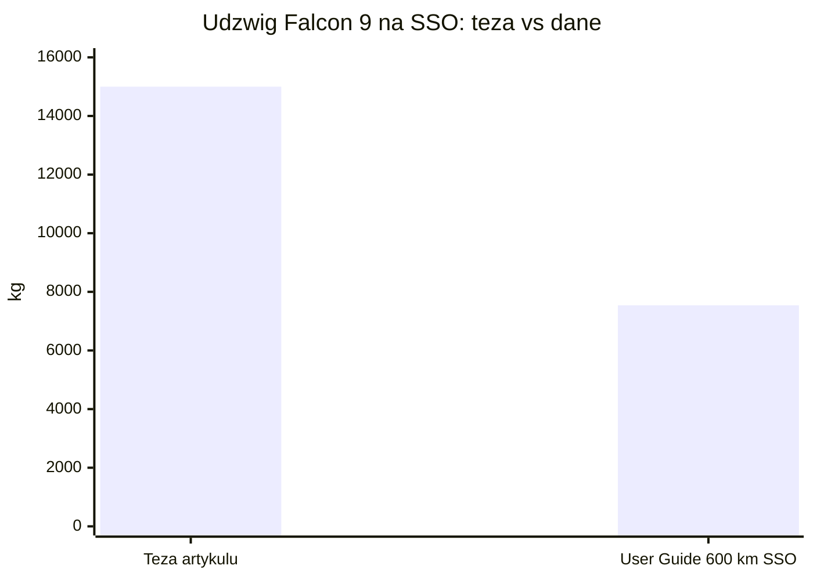
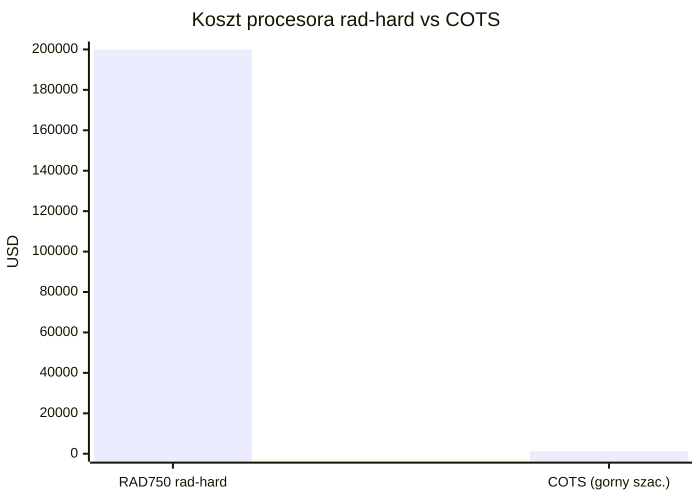
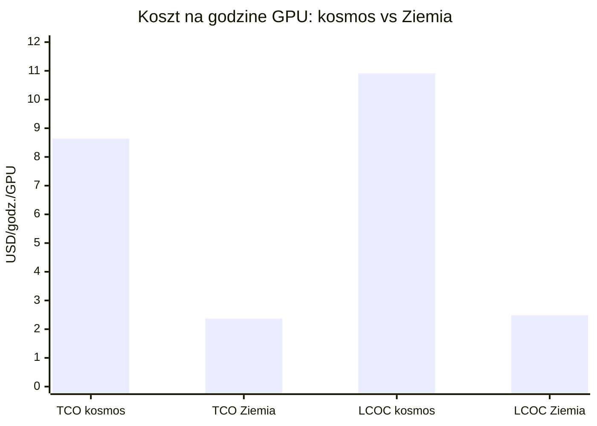
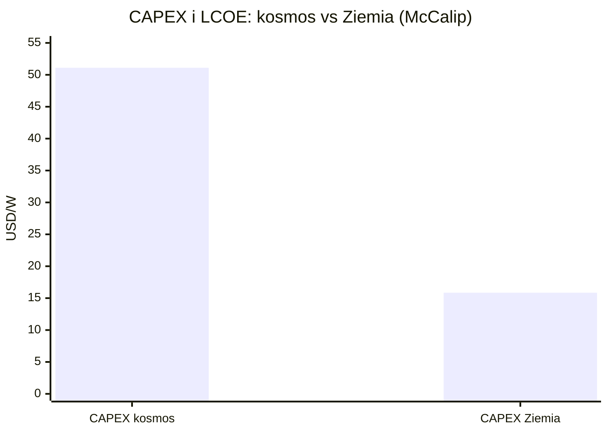

# Weryfikacja tez sceptycznego artykułu

> Notatka raportu "Orbitalne centra danych". Kluczowe źródła: [źródło 1](https://newsletter.semianalysis.com/p/to-boldly-go-the-case-for-space-datacenters), [źródło 2](https://starcloudinc.github.io/wp.pdf).

## W skrócie

Sceptyczny artykuł "Centra przetwarzania danych na orbicie nie mają sensu" formułuje osiem tez, które po sprawdzeniu okazują się mieszanką prawdy częściowej, faktów wyrwanych z kontekstu i kilku jawnych błędów. Dla inwestora najważniejszy wniosek brzmi: orbitalne centra danych (<abbr title="centrum danych umieszczone na satelicie lub konstelacji na orbicie okołoziemskiej.">ODC</abbr> - data center umieszczony na satelicie/konstelacji na orbicie okołoziemskiej) są dziś rzeczywiście drogie, ale skala tej drożyzny jest dokładnie mierzona. SemiAnalysis liczy, że całkowity koszt posiadania (<abbr title="całkowity koszt posiadania przez cały cykl życia, nie tylko zakup.">TCO</abbr> - total cost of ownership, czyli pełny rachunek przez cały cykl życia, nie tylko zakup) w kosmosie wynosi 8,64 USD/godz./GPU wobec 2,37 USD/godz./GPU na Ziemi, a więc około 3,6x drożej (a nie "co najmniej 2x", jak ostrożnie pisze artykuł) [źródło](https://newsletter.semianalysis.com/p/to-boldly-go-the-case-for-space-datacenters). Kto zyskuje: gracze tnący koszt wynoszenia (SpaceX) i koszt energii orbitalnej (Starcloud twierdzi ~0,002 USD/kWh). Kto traci: każdy, kto wchodzi przed spadkiem kosztów Starship. Tempo zmian: artykuł najczęściej myli cztery pary pojęć (moc elektryczna a IT load, masa paneli a masa systemu, <abbr title="nakłady inwestycyjne, czyli jednorazowy koszt zbudowania i wyniesienia systemu.">CAPEX</abbr> a TCO, pojedynczy satelita a konstelacja), więc jego pesymizm jest miejscami przesadzony, a miejscami zbyt łagodny.

> Uwaga źródłowa: oryginalny polski artykuł nie został zlokalizowany w publicznie dostępnych źródłach podczas researchu, więc poszczególne tezy weryfikujemy wobec ich treści opisanej w zleceniu, oznaczając POTWIERDZENIE / CZĘŚCIOWE / OBALENIE / NIE UJAWNIONE [źródło](https://starcloudinc.github.io/wp.pdf).

<!-- network:watki:start -->
## Powiązane wątki

> Mapa powiązań tematycznych - jak ten wątek łączy się z resztą raportu.

- [[09 - ekonomika-i-koszty-calkowite-tco|Ekonomika i TCO]] - tezy o koszcie wyniesienia i "2x drożej" rozwija analiza TCO
- [[04 - energetyka-kosmiczna-i-fotowoltaika-orbitalna|Energetyka kosmiczna]] - teza o panelach 200 MW = masa/powierzchnia paneli to fizyka PV
- [[05 - chlodzenie-i-radiacyjne-odprowadzanie-ciepla|Chłodzenie]] - teza o chłodzeniu w próżni to mechanizm radiacyjnego oddawania ciepła
- [[06 - promieniowanie-i-elektronika-rad-hard-vs-cots|Promieniowanie i elektronika]] - teza o drogiej elektronice rad-hard to koszt vs COTS
- [[07 - lacznosc-optyczne-isl-downlink-i-latencja|Łączność optyczna]] - tezy o Starlink i latencji to warstwa łączności ISL/downlink
- [[03 - fizyka-orbitalna-orbity-i-operacje|Fizyka orbitalna]] - teza o widoczności 5 minut to geometria przelotu SSO
<!-- network:watki:end -->
## Teza 1: udźwig Falcon 9 na SSO ~15 t i koszt ~5500 USD/kg rideshare

Werdykt: częściowe potwierdzenie z kontekstem historycznym. <abbr title="orbita synchroniczna ze Słońcem, na której satelita przelatuje nad danym punktem zawsze o tej samej porze.">SSO</abbr> (Sun-Synchronous Orbit - orbita synchroniczna ze Słońcem, na której satelita przelatuje nad danym punktem zawsze o tej samej porze) ma niższy udźwig niż zwykłe <abbr title="niska orbita okołoziemska o okresie obiegu rzędu 90-110 minut.">LEO</abbr> (Low Earth Orbit - niska orbita okołoziemska). Cena 5500 <abbr title="koszt wyniesienia jednego kilograma ładunku na orbitę, kluczowy wskaźnik ekonomiki kosmosu.">USD/kg</abbr> odpowiada cennikowi <abbr title="lot współdzielony, w którym wielu klientów dzieli koszt jednej rakiety.">rideshare</abbr> (rideshare - lot współdzielony, gdy wielu klientów dzieli jedną rakietę) z marca 2022, gdy 200 kg kosztowało 1,1 mln USD, czyli właśnie 5500 USD/kg 🟠 [źródło](https://satbase.com/articles/spacex-falcon-9-price-increase-2026). Aktualny oficjalny cennik SpaceX jest jednak wyższy: dodatkowa masa na SSO to 7000 USD/kg (przy bazie 350 tys. USD za 50 kg) 🔵 [źródło](https://www.spacex.com/rideshare). Liczba 15 t na SSO nie znajduje potwierdzenia w przewodniku SpaceX: dla orbity kołowej 600 km SSO podawano udźwig 7541 kg 🔵 [źródło](https://www.spaceflightnow.com/falcon9/001/f9guide.pdf), a wartości rzędu 22 000 kg dotyczą LEO z Cape Canaveral, nie SSO 🟠 [źródło](https://nextspaceflight.com/launches/details/7138/). Dla skali wykorzystania: SpaceX wozi już średnio 16 850 kg ładunku Starlink, co stanowi 96% maksymalnej pojemności 17,5 t do LEO 🟠 [źródło](https://payloadspace.com/underutilized-capacity-on-dedicated-customer-falcon-9-rides-payload-research/). NIE UJAWNIONE: brak publicznego potwierdzenia, że artykuł użył dokładnie 15 t na SSO - liczba może pochodzić z zaokrąglenia danych LEO. Implikacja dla inwestora: koszt wynoszenia jest dziś wyższy niż w tezie artykułu, więc business case ODC stoi i upada wraz z tańszym Starshipem, nie z Falconem 9.

![[assets/x01-1-x4.png]]
*Rys. 7 - Krzywa kosztu wynoszenia SpaceX - weryfikacja tezy o oplacalnosci. Źródło: Google Research / arXiv 2511.19468, licencja: arXiv open access - do uzytku wlasnego.*
#grafika #weryfikacja-tez-sceptycznego-artykulu #koszt #launch

*Rys. 8 - Teza artykułu (15 t = 15000 kg) wobec udźwigu z przewodnika SpaceX dla orbity kołowej 600 km SSO (7541 kg). Dane: Falcon 9 User Guide (Spaceflight Now).*

## Teza 2: panele 200 MW = min. 80 ha i min. 8 tys. ton

Werdykt: częściowe potwierdzenie przy starej technologii ISS, obalenie przy nowoczesnych ogniwach cienkowarstwowych. To kluczowy przykład mylenia masy paneli z masą systemu. Stare panele ISS (8 skrzydeł, ~2500 m²) miały łączną masę systemu rzędu 60 000 kg i dawały zaledwie ~100 kWe średniej mocy 🟠 [źródło](https://scholar.colorado.edu/downloads/jw827c636) - to przekłada się na ~24 kg/m² i charakterystykę 0,6 kg/W przy 1 AU (jednostka astronomiczna - odległość Ziemia-Słońce) 🟠 [źródło](https://scholar.colorado.edu/downloads/jw827c636). Przy takiej archaicznej technologii 200 MW rzeczywiście wymagałoby ~80 ha (hektar = 10 000 m²) i kilkunastu tysięcy ton, więc teza artykułu jest zbliżona - ale tylko dla technologii sprzed dwóch dekad. Starcloud projektuje na ogniwach cienkowarstwowych o gęstości mocy >1000 W/kg 🔵 [źródło](https://starcloudinc.github.io/wp.pdf), przy których data center 5 GW potrzebuje tablicy ~4 km na 4 km, czyli 16 km² 🔵 [źródło](https://starcloudinc.github.io/wp.pdf). To daje ~320 W/m², więc 200 MW zajęłoby kilkanaście razy mniej powierzchni i masy niż w tezie. NIE UJAWNIONE: brak źródła, z którego artykuł wziął dokładnie 80 ha i 8 tys. ton - wygląda na estymatę z technologii ISS. Implikacja dla inwestora: teza "panele są ciężkie" jest prawdziwa dla wczoraj, ale gęstość mocy ogniw rośnie, a to ona decyduje o masie wynoszonej na orbitę, czyli o koszcie.

## Teza 3: chłodzenie w próżni trudniejsze niż na Ziemi

Werdykt: częściowe potwierdzenie. W próżni nie ma konwekcji (przekazywania ciepła przez ruch powietrza), więc każdy wat ciepła trzeba odprowadzić wyłącznie przez promieniowanie - to wymaga dużych radiatorów. Z drugiej strony kosmos jest bardzo zimnym zlewem ciepła i nie ma atmosfery hamującej wymianę. Starcloud podaje, że radiator utrzymany w 20°C emituje 385,24 W/m² z jednej strony 🔵 [źródło](https://starcloudinc.github.io/wp.pdf), a płyta 1 m² promieniująca z obu stron oddaje 770,48 W 🔵 [źródło](https://starcloudinc.github.io/wp.pdf) - to liczba korzystna. Trudność jest jednak realna kosztowo: SemiAnalysis wlicza chłodzenie/radiatory w CAPEX, który dla data center w kosmosie startuje od 8x wyższego niż naziemny 🟠 [źródło](https://newsletter.semianalysis.com/p/to-boldly-go-the-case-for-space-datacenters), a miesięczne zlewelizowane koszty kapitałowe są nawet 18x wyższe niż naziemnie 🟠 [źródło](https://newsletter.semianalysis.com/p/to-boldly-go-the-case-for-space-datacenters). NIE UJAWNIONE: brak bezpośredniego porównania "łatwości chłodzenia" w liczbach - trudność wynika z braku konwekcji i konieczności radiatorów, nie z temperatury otoczenia. Implikacja dla inwestora: chłodzenie nie jest barierą fizyczną nie do przejścia, lecz pozycją kosztową i masową, która podbija CAPEX.

## Teza 4: Starlink nie jest internetem szerokopasmowym

Werdykt: obalenie. Oficjalnie i w praktyce Starlink jest klasyfikowany jako szerokopasmowy. SpaceX reklamuje go jako "high-speed, low-latency broadband internet", a oficjalne specyfikacje mówią o 25-220 Mbps pobierania 🟠 [źródło](https://www.starlinkinfo.com/starlink-slow-speed). Pomiary Ookla za Q1 2025 w USA: mediana pobierania 104,71 Mbps (wzrost niemal dwukrotny z 53,95 Mbps w Q3 2022) 🟠 [źródło](https://www.ookla.com/articles/starlink-us-performance-2025) i mediana opóźnienia 45 ms 🟠 [źródło](https://www.ookla.com/articles/starlink-us-performance-2025). FCC (amerykański regulator) definiuje szerokopasmowość jako 100/20 Mbps i 17,42% użytkowników Starlink w USA spełnia ten próg - ograniczeniem jest głównie upload, nie download 🟠 [źródło](https://www.ookla.com/articles/starlink-us-performance-2025). Po stronie sprzętu: Starlink V2 Mini ma 96 Gbps zagregowanego pasma na satelitę 🔵 [źródło](https://indico.esa.int/event/552/contributions/11462/attachments/7144/13485/Radio%20Frequency%20Payloads%20Tutorial%20EDHPC%202025%20Public.pdf), a planowany V3 ma oferować 1 Tbps downlinku i 160 Gbps uplinku na satelitę 🟠 [źródło](https://cordcuttersnews.com/spacexs-new-satellites-that-will-improve-starlinks-internet-speeds-by-offering-1-terabyte-downlink-bandwidth/). Implikacja dla inwestora: jeśli artykuł kwestionuje przepustowość downlinku ODC, robi to wbrew danym - Starlink udowadnia, że łącze satelitarne może być szybkie i nisko-opóźnieniowe.

## Teza 5: satelity SSO widoczne nad obszarem tylko 5 minut

Werdykt: potwierdzenie dla pojedynczej stacji naziemnej, obalenie dla konstelacji/relay. NASA już w 1994 pisała, że pojedyncza stała stacja naziemna daje 2-4 sensowne kontakty dziennie po maksymalnie 5 minut na kontakt dla tej wysokości orbity 🔵 [źródło](https://ntrs.nasa.gov/api/citations/19950016527/downloads/19950016527.pdf). Przy typowej orbicie LEO o okresie 90-110 minut 🟠 [źródło](https://ijirt.org/publishedpaper/IJIRT100687_PAPER.pdf) kontakt z jedną stacją jest faktycznie krótki. Ale stacje polarne (koncepcja Kinuvik SSC) potrafią wydłużyć kontakt do 25 minut lub więcej na przelot 🔵 [źródło](https://sscspace.com/wp-content/uploads/The-Kinuvik-concept_100521_763K.pdf), a konstelacja z laserowymi łączami zapewnia uptime łącza >99% na flocie terminali 100G w LEO 🔵 [źródło](https://ntrs.nasa.gov/api/citations/20250002668/downloads/250401%20Robinson%20OFC%20Plenary%20v1.pdf). Co najważniejsze: ograniczona widoczność z jednej stacji to NIE jest problem zasilania - tablica słoneczna na orbicie ma współczynnik wykorzystania >95%, bez cyklu dzień/noc 🔵 [źródło](https://starcloudinc.github.io/wp.pdf). Implikacja dla inwestora: "5 minut" dotyczy łączności z jednym punktem, nie ciągłości pracy data center - mylenie tych dwóch rzeczy zaniża realny potencjał ODC.

## Teza 6: elektronika rad-hard kilkaset razy droższa

Werdykt: potwierdzenie dla tradycyjnej <abbr title="elektronika specjalnie utwardzona, aby przetrwać promieniowanie kosmiczne.">rad-hard</abbr>, obalenie dla nowoczesnej <abbr title="tańsza metoda uodparniania układów poprzez sam projekt, na zwykłym procesie produkcyjnym.">RHBD</abbr>/COTS w LEO. Rad-hard (radiation hardened - utwardzony radiacyjnie, odporny na promieniowanie kosmiczne) procesor BAE RAD750 kosztuje ponad 200 000 USD 🔵 [źródło](https://dspace.mit.edu/bitstream/handle/1721.1/144977/novak-jgnovak-sm-tpp-May-2022.pdf), podczas gdy <abbr title="tanie układy komercyjne z półki, używane zamiast drogiej elektroniki rad-hard.">COTS</abbr> (Commercial Off-The-Shelf - układy komercyjne z półki) kosztują kilkaset USD - to różnica setek do kilku tysięcy razy dla procesorów. Dla FPGA (programowalny układ logiczny) różnica jest mniejsza: rad-hard 25 000 EUR wobec COTS 2500 EUR, czyli 10x 🟠 [źródło](https://helit.org/mm/docList/public/AcubeSAT-SYE-BH-021.pdf). Nowoczesne podejście RHBD (Radiation Hardening by Design - utwardzanie poprzez projekt na zwykłym procesie) tnie ten koszt: Microchip rozwija space-grade FPGA dla komercyjnych satelitów LEO za 800-1200 USD za sztukę 🟠 [źródło](https://www.factmr.com/report/radiation-hardened-electronics-market). Starlink stosuje COTS z redundancją i ECC (Error-Correcting Code - korekcja błędów pamięci), a nie drogiej elektroniki rad-hard. NIE UJAWNIONE: brak źródła potwierdzającego dosłownie "kilkaset razy droższa" - najbliżej jest 10x dla FPGA i setki-kilka tysięcy razy dla procesorów. Implikacja dla inwestora: koszt elektroniki nie jest stały - architektura COTS plus redundancja (model Starlink) może drastycznie obniżyć tę pozycję w ODC.

*Rys. 9 - Procesor rad-hard BAE RAD750 (ponad 200 000 USD) wobec górnego szacunku układu COTS/RHBD (1200 USD za sztukę). Dane: RAD750 cost (MIT DSpace), FactMR rad-hard market.*

## Teza 7: orbitalne DC co najmniej 2x droższe niż naziemne

Werdykt: potwierdzenie, a nawet wzmocnienie - w 2026 jest znacznie drożej niż 2x. To kluczowy obszar mylenia CAPEX z TCO. SemiAnalysis liczy TCO dla GPU B300 na 8,64 USD/godz./GPU w kosmosie wobec 2,37 USD/godz./GPU naziemnie (~3,6x) 🟠 [źródło](https://newsletter.semianalysis.com/p/to-boldly-go-the-case-for-space-datacenters), a zlewelizowany koszt obliczeń <abbr title="zlewelizowany koszt obliczeń w przeliczeniu na godzinę pracy GPU.">LCOC</abbr> z redundancją i radiacją to 10,91 USD/godz./GPU wobec 2,49 USD/godz./GPU (~4,4x) 🟠 [źródło](https://newsletter.semianalysis.com/p/to-boldly-go-the-case-for-space-datacenters); różnica startuje od ponad 4x w 2026 🟠 [źródło](https://newsletter.semianalysis.com/p/to-boldly-go-the-case-for-space-datacenters). Niezależna analiza pierwszych zasad Andrew McCalipa daje <abbr title="zlewelizowany koszt energii w przeliczeniu na MWh.">LCOE</abbr> (Levelized Cost of Energy - zlewelizowany koszt energii) 1167 USD/MWh orbitalnie wobec 426 USD/MWh naziemnie oraz CAPEX 51,10 USD/W wobec 15,85 USD/W (>3x) 🟠 [źródło](https://andrewmccalip.com/space-datacenters). Starcloud kontruje, że długoterminowo (po ~2040) koszty mogą się zrównać dzięki Starship i tańszej energii słonecznej. Implikacja dla inwestora: teza "2x" jest ostrożnym minimum - realna przewaga kosztowa Ziemi jest dziś 3-4x, więc ODC potrzebują albo radykalnego spadku kosztów wynoszenia, albo nisz, gdzie liczy się darmowa energia i chłodzenie, nie cena za GPU.

*Rys. 10 - TCO (8,64 vs 2,37; ~3,6x) i LCOC z redundancją i radiacją (10,91 vs 2,49; ~4,4x) dla GPU B300 w 2026. Dane: SemiAnalysis - space datacenters.*

*Rys. 11 - CAPEX na wat: orbitalnie 51,10 USD/W wobec 15,85 USD/W naziemnie (ponad 3x); analiza pierwszych zasad. Dane: Andrew McCalip - space datacenters.*

## Teza 8: konstelacja wymaga ciężkich systemów komunikacyjnych i ma dużą latencję

Werdykt: częściowe potwierdzenie co do masy, obalenie co do latencji i przepustowości. Masa rośnie: Starlink V3 waży ~1900 kg wobec ~575 kg V2 Mini, głównie przez większą moc i komunikację 🟠 [źródło](https://cordcuttersnews.com/spacexs-new-satellites-that-will-improve-starlinks-internet-speeds-by-offering-1-terabyte-downlink-bandwidth/). Ale latencja LEO jest niska: mediana Starlink 28-45 ms 🟠 [źródło](https://www.pcmag.com/news/spacex-chips-away-at-starlink-latency-with-new-record), wobec 45 ms zmierzonych przez Ookla 🟠 [źródło](https://www.ookla.com/articles/starlink-us-performance-2025), czyli porównywalnie z LTE/kablem i znacznie poniżej <abbr title="wysoka orbita, na której satelita stoi nieruchomo nad jednym punktem, ale kosztem dużej latencji (600+ ms).">GEO</abbr> (orbita geostacjonarna, 600+ ms). Przepustowość międzysatelitarna <abbr title="laserowe łącze między satelitami, pozwalające przesyłać dane bez schodzenia na Ziemię.">ISL</abbr> (Inter-Satellite Link - łącze laserowe między satelitami) to 200 Gbps na link 🔵 [źródło](https://ntrs.nasa.gov/api/citations/20250002668/downloads/250401%20Robinson%20OFC%20Plenary%20v1.pdf) i >42 PB (petabajtów) ruchu dziennie przez łącza lasercom 🔵 [źródło](https://ntrs.nasa.gov/api/citations/20250002668/downloads/250401%20Robinson%20OFC%20Plenary%20v1.pdf), a V3 ma mieć ~4 Tbps łącznego backhaulu RF i laserowego 🟠 [źródło](https://cordcuttersnews.com/spacexs-new-satellites-that-will-improve-starlinks-internet-speeds-by-offering-1-terabyte-downlink-bandwidth/). Implikacja dla inwestora: "duża latencja" nie dotyczy konstelacji LEO z laserowymi ISL - krytyka jest aktualna tylko dla GEO lub pojedynczego satelity.

## Kontrowersje

**K1: artykuł myli moc elektryczną z IT load, masę paneli z masą systemu, CAPEX z TCO, satelitę z konstelacją**

Strona sceptyczna (implikowana): koszt i masa paneli równa się kosztowi i masie całego systemu, a CAPEX równa się całkowitemu kosztowi. Strona przeciwna (dane): TCO w kosmosie to 8,64 USD/godz./GPU wobec 2,37 USD/godz./GPU naziemnie 🟠 [źródło](https://newsletter.semianalysis.com/p/to-boldly-go-the-case-for-space-datacenters), ale sam koszt operacyjny zasilania to zaledwie 0,21 USD/godz./GPU 🟠 [źródło](https://newsletter.semianalysis.com/p/to-boldly-go-the-case-for-space-datacenters), a alokowane koszty operacji 0,36 USD/godz./GPU 🟠 [źródło](https://newsletter.semianalysis.com/p/to-boldly-go-the-case-for-space-datacenters); Starcloud deklaruje ekwiwalentny koszt energii ~0,002 USD/kWh 🔵 [źródło](https://starcloudinc.github.io/wp.pdf). Wniosek: energia orbitalna jest praktycznie darmowa po poniesieniu CAPEX, a wysoki TCO bierze się głównie z wynoszenia i redundancji, nie z samej energii - artykuł, zrównując panele z systemem i CAPEX z TCO, błędnie lokuje źródło kosztu.

**K2: artykuł myli widoczność z naziemnej stacji z nasłonecznieniem orbity dawn-dusk**

Strona sceptyczna (implikowana): SSO = krótki kontakt = brak ciągłości zasilania. Dane potwierdzające krótki kontakt: do 5 minut na kontakt z pojedynczej stacji 🔵 [źródło](https://ntrs.nasa.gov/api/citations/19950016527/downloads/19950016527.pdf). Dane obalające brak ciągłości zasilania: współczynnik wykorzystania tablicy słonecznej >95% 🔵 [źródło](https://starcloudinc.github.io/wp.pdf) oraz "high-intensity 24/7 solar power unhindered by day/night cycles" 🔵 [źródło](https://starcloudinc.github.io/wp.pdf). Wniosek: orbity dawn-dusk SSO (przebiegające wzdłuż granicy dnia i nocy) dają prawie ciągłe nasłonecznienie; krótki kontakt z konkretną stacją naziemną nie jest problemem zasilania, lecz tylko łączności, którą rozwiązują stacje polarne i laserowe ISL.

**K3: satelita vs konstelacja**

Strona sceptyczna (implikowana): pojedynczy satelita ma małą przepustowość i dużą latencję. Dane o pojedynczym satelicie: 96 Gbps na satelitę V2 🔵 [źródło](https://indico.esa.int/event/552/contributions/11462/attachments/7144/13485/Radio%20Frequency%20Payloads%20Tutorial%20EDHPC%202025%20Public.pdf). Dane o konstelacji: >42 PB ruchu dziennie przez łącza lasercom 🔵 [źródło](https://ntrs.nasa.gov/api/citations/20250002668/downloads/250401%20Robinson%20OFC%20Plenary%20v1.pdf) oraz >9000 terminali lasercom na orbicie 🔵 [źródło](https://ntrs.nasa.gov/api/citations/20250002668/downloads/250401%20Robinson%20OFC%20Plenary%20v1.pdf). Wniosek: krytyka pojedynczego satelity nie przenosi się na konstelację z laserowymi ISL, której zagregowana przepustowość idzie w setki Tbps przy niskiej latencji LEO.

## Słowniczek pojęć

- **ODC (Orbital Data Center)** - centrum danych umieszczone na satelicie lub konstelacji na orbicie okołoziemskiej.
- **SSO (Sun-Synchronous Orbit)** - orbita synchroniczna ze Słońcem, na której satelita przelatuje nad danym punktem zawsze o tej samej porze.
- **LEO (Low Earth Orbit)** - niska orbita okołoziemska o okresie obiegu rzędu 90-110 minut.
- **GEO (orbita geostacjonarna)** - wysoka orbita, na której satelita stoi nieruchomo nad jednym punktem, ale kosztem dużej latencji (600+ ms).
- **rideshare** - lot współdzielony, w którym wielu klientów dzieli koszt jednej rakiety.
- **USD/kg** - koszt wyniesienia jednego kilograma ładunku na orbitę, kluczowy wskaźnik ekonomiki kosmosu.
- **CAPEX** - nakłady inwestycyjne, czyli jednorazowy koszt zbudowania i wyniesienia systemu.
- **TCO (Total Cost of Ownership)** - całkowity koszt posiadania przez cały cykl życia, nie tylko zakup.
- **LCOC (Levelized Cost of Compute)** - zlewelizowany koszt obliczeń w przeliczeniu na godzinę pracy GPU.
- **LCOE (Levelized Cost of Energy)** - zlewelizowany koszt energii w przeliczeniu na MWh.
- **rad-hard (radiation hardened)** - elektronika specjalnie utwardzona, aby przetrwać promieniowanie kosmiczne.
- **RHBD (Radiation Hardening by Design)** - tańsza metoda uodparniania układów poprzez sam projekt, na zwykłym procesie produkcyjnym.
- **COTS (Commercial Off-The-Shelf)** - tanie układy komercyjne z półki, używane zamiast drogiej elektroniki rad-hard.
- **ISL (Inter-Satellite Link)** - laserowe łącze między satelitami, pozwalające przesyłać dane bez schodzenia na Ziemię.
- **capacity factor** - współczynnik wykorzystania, czyli jaką część czasu instalacja realnie pracuje na pełnej mocy.
