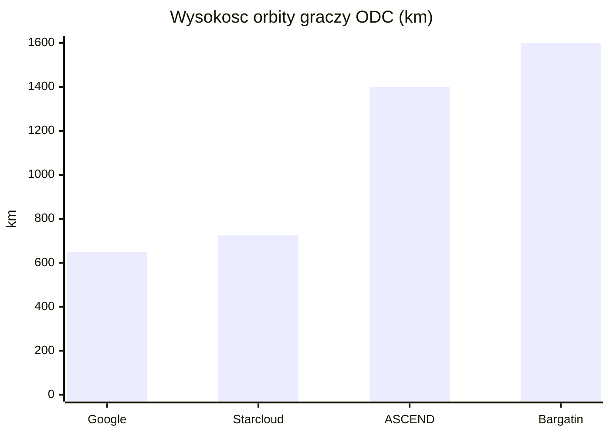
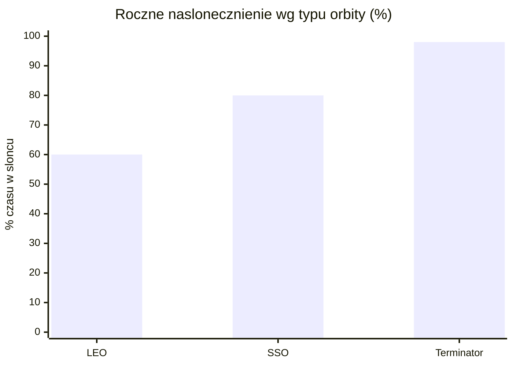
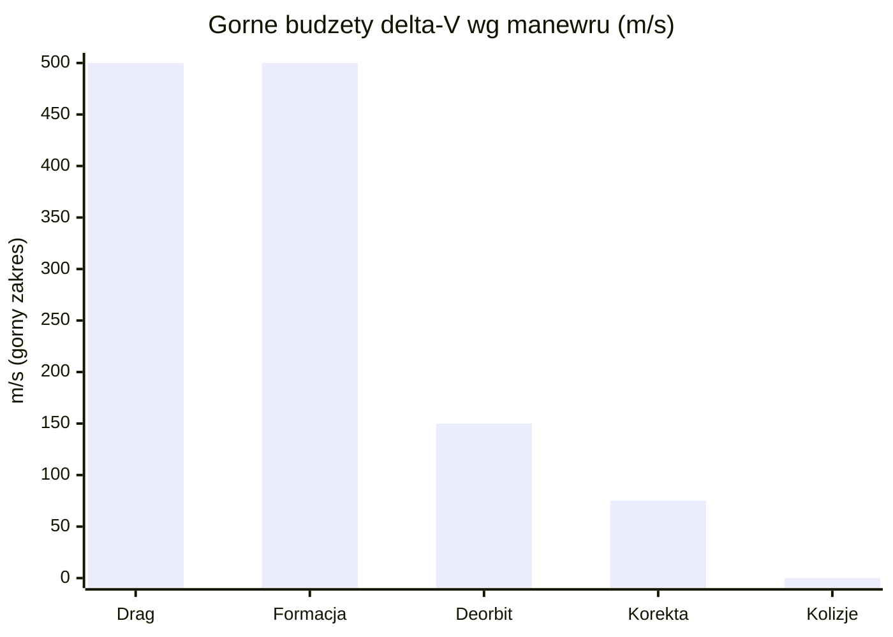
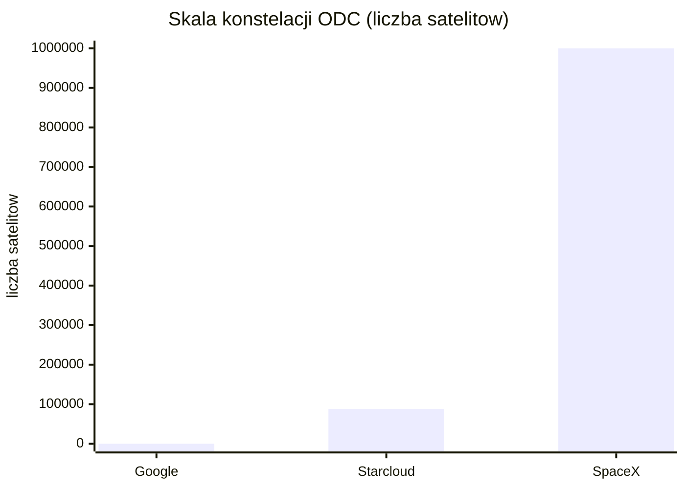

# Fizyka orbitalna, orbity i operacje

> Notatka raportu "Orbitalne centra danych". Kluczowe źródła: [źródło 1](https://cdn.geekwire.com/wp-content/uploads/2026/01/SpaceX-Center.pdf), [źródło 2](https://arxiv.org/pdf/2512.09044.pdf).

## W skrócie

Cała teza orbitalnych centrów danych stoi i upada na fizyce orbity: gdzie umieścisz satelitę, decyduje o tym, czy panele świecą prąd przez prawie całą dobę (a więc bez ciężkich i drogich baterii), jak szybko atmosfera ściąga sprzęt w dół oraz ile paliwa trzeba spalić, by utrzymać szyk konstelacji. Najwięksi gracze (SpaceX, Starcloud, Google Project Suncatcher, Thales/ASCEND) celują w orbity heliosynchroniczne typu <abbr title="wariant SSO biegnący wzdłuż granicy dnia i nocy, gdzie panele są oświetlone niemal cały czas i nie potrzeba baterii.">dawn-dusk</abbr> ("brzask-zmierzch"), gdzie nasłonecznienie sięga 🔵 ponad 99% czasu [źródło](https://cdn.geekwire.com/wp-content/uploads/2026/01/SpaceX-Center.pdf) - to fundament ekonomiki, bo eliminuje magazynowanie energii. Dla inwestora kluczowe: im wyżej (1000-1600 km), tym dłuższy czas życia orbity i mniej dragu, ale tym wyższy koszt startu (do 🔵 ~11 km/s <abbr title="przyrost prędkości (m/s), jaki napęd musi dostarczyć na dany manewr; miara zużycia paliwa i kosztu operacyjnego.">delta-V</abbr> dla 1600 km) [źródło](https://arxiv.org/pdf/2512.09044.pdf) oraz dłuższa, kosztowna <abbr title="kontrolowane sprowadzenie satelity z orbity na koniec misji, by spłonął w atmosferze i nie został śmieciem kosmicznym.">deorbitacja</abbr> na koniec życia. Ryzyko nie jest fizyczne tylko inżynieryjno-skalowe: utrzymanie setek tysięcy platform w ciasnym szyku to, słowami branży, "nieustanna walka z dynamiką orbitalną", a montaż GW-skali budzi twarde wątpliwości kosztowe (potrzeba spadku poniżej 🟠 200 USD/kg) [źródło](https://tech.yahoo.com/science/articles/data-centers-space-even-more-161500684.html). Tempo: pierwsze węzły już latają (Axiom, 11 stycznia 2026), prototypy Google planowane na 2027, pełne GW dopiero około 2050.

<!-- spolki:related:start -->
## Spółki powiązane

> Notowane spółki produkujące podzespoły/technologie związane z tym tematem. Pełne omówienie: spółki, dla których nisza to >=33% przychodów; skrótowe: zdywersyfikowane konglomeraty. Zob. też [[Spolki/_slownik]] i [[Spolki/_widok-gpw-eu]].

**Producenci kluczowi (>=33% przychodów z niszy - omówienie pełne):**
- [[Spolki/rocket-lab|Rocket Lab Corporation (RKLB)]] - Launch (Electron/Neutron) + Space Systems: bus, ogniwa SolAero, komponenty
- [[Spolki/redwire|Redwire Corporation (RDW)]] - Panele ROSA, struktury rozkładane, montaż on-orbit, radiatory Q-Rad
- [[Spolki/voyager-technologies|Voyager Technologies, Inc. (VOYG)]] - Stacje kosmiczne (Starlab), systemy kosmiczne i obronne
- [[Spolki/mda-space|MDA Space Ltd. (MDA)]] - Robotyka kosmiczna (Canadarm), busy, anteny

**Pozostali dominujący gracze (nisza to ułamek przychodów - omówienie skrótowe):**
- [[Spolki/northrop-grumman|Northrop Grumman Corporation (NOC)]] - Serwis GEO (MEV/MRV), busy, radiatory, ogniwa
- [[Spolki/airbus|Airbus SE (AIR)]] 🇪🇺 - PV (Sparkwing), optyka (Tesat), busy, serwis (EU)
- [[Spolki/rtx|RTX Corporation (RTX)]] - ADCS (Blue Canyon), termika (Collins Aerospace)
- [[Spolki/lockheed-martin|Lockheed Martin Corporation (LMT)]] - Busy satelitarne, serwisowanie, ULA (launch)
<!-- spolki:related:end -->

<!-- network:watki:start -->
## Powiązane wątki

> Mapa powiązań tematycznych - jak ten wątek łączy się z resztą raportu.

- [[04 - energetyka-kosmiczna-i-fotowoltaika-orbitalna|Energetyka kosmiczna]] - wybór orbity (dawn-dusk vs LEO) decyduje o nasłonecznieniu 24/7
- [[05 - chlodzenie-i-radiacyjne-odprowadzanie-ciepla|Chłodzenie]] - orientacja platformy steruje celowaniem radiatorów w zimną przestrzeń
- [[06 - promieniowanie-i-elektronika-rad-hard-vs-cots|Promieniowanie i elektronika]] - wysokość orbity wprost wyznacza roczną dawkę promieniowania
- [[08 - niezawodnosc-serwisowanie-i-cykl-zycia-sprzetu|Niezawodność i serwisowanie]] - deorbitacja, EOL i serwis to operacje cyklu życia platformy
- [[11 - regulacje-prawo-kosmiczne-debris-i-itu|Regulacje i debris]] - zasada 5 lat na deorbit i ryzyko debris to ramy regulacyjne operacji
<!-- network:watki:end -->
## Trade-off orbit: LEO vs SSO dawn-dusk vs MEO vs GEO

Orbita to nie szczegół techniczny, lecz najważniejsza decyzja biznesowa całego projektu, bo determinuje koszt, opóźnienia i czas życia sprzętu. Najniższa warstwa to <abbr title="niska orbita okołoziemska (ok. 160-2000 km), najbliżej Ziemi, daje najniższe opóźnienie i najtańszy start.">LEO</abbr> (Low Earth Orbit, niska orbita okołoziemska), zwykle definiowana jako pas 🔴 160-2000 km nad powierzchnią Ziemi [źródło](https://leodatacenters.com/). Satelita w LEO okrąża Ziemię raz na 🔴 ~90-120 minut [źródło](https://leodatacenters.com/) i daje bardzo niskie opóźnienie sygnału - 🔴 ~20 ms round-trip (czas przelotu sygnału tam i z powrotem) dla 300-600 km [źródło](https://leodatacenters.com/). Dla porównania <abbr title="orbita 35786 km nad równikiem, gdzie satelita &quot;wisi&quot; nad jednym punktem, ale opóźnienie ponad 500 ms dyskwalifikuje ją z obliczeń w czasie rzeczywistym.">GEO</abbr> (orbita geostacjonarna), położona 🔴 35786 km nad równikiem [źródło](https://leodatacenters.com/), daje 🔴 ponad 500 ms round-trip, co dyskwalifikuje ją z aplikacji czasu rzeczywistego [źródło](https://leodatacenters.com/). Implikacja dla inwestora: nikt poważny nie celuje w GEO do obliczeń AI - opóźnienie zabija użyteczność.

Szczególnym typem LEO jest orbita heliosynchroniczna (<abbr title="orbita, której płaszczyzna utrzymuje stały kąt względem Słońca, dzięki czemu satelita przelatuje nad danym miejscem zawsze o tej samej porze.">SSO</abbr>, sun-synchronous orbit), a w jej ramach wariant dawn-dusk (zwany też terminator orbit - płaszczyzna orbity biegnie wzdłuż granicy dnia i nocy). To właśnie tutaj koncentruje się cała branża, bo daje niemal ciągłe nasłonecznienie. SpaceX w swoim wniosku do FCC deklaruje pracę 🔵 między 500 a 2000 km i inklinacje od 30 stopni do orbity heliosynchronicznej [źródło](https://cdn.geekwire.com/wp-content/uploads/2026/01/SpaceX-Center.pdf), z konstelacją podzieloną na wąskie powłoki orbitalne o szerokości 🔵 do 50 km każda [źródło](https://cdn.geekwire.com/wp-content/uploads/2026/01/SpaceX-Center.pdf). Starcloud proponuje SSO na 🔵 600-850 km [źródło](https://docs.fcc.gov/public/attachments/DOC-419509A1.pdf), Google Project Suncatcher modeluje klastry na 🔵 ~650 km [źródło](https://arxiv.org/html/2604.07760v1), a projekt akademicki Bargatina (tethered ODC, czyli centrum danych złożone z węzłów połączonych "uwięzią"/liną) lokuje się w orbicie DDSS (dawn-dusk sun-synchronous) na 🔵 ~1600 km przy inklinacji 102.5 stopnia [źródło](https://arxiv.org/pdf/2512.09044.pdf). ASCEND od Thales celuje w 🟠 ~1400 km, wybierając tę wysokość m.in. dla niskiego zagęszczenia śmieci kosmicznych [źródło](https://hellofuture.orange.com/en/lower-emissions-and-reinforced-digital-sovereignty-the-plan-for-datacentres-in-space/).

Gracze rozkładają się na wysokościach od ~650 km (Google) po ~1600 km (Bargatin) - wyżej oznacza mniej dragu i dłuższe życie aktywa, ale droższy start (delta-V ~11 km/s na 1600 km).

*Rys. 12 - Wysokości orbit: Google Suncatcher ~650 km, Starcloud (środek pasma 600-850 km), ASCEND/Thales ~1400 km, Bargatin DDSS ~1600 km. Dane: ISCR arXiv 2604.07760; FCC DOC-419509A1; Hello Future / Orange - ASCEND; Bargatin et al. arXiv 2512.09044.*

A <abbr title="średnia orbita (2000-35786 km), dla centrów danych gorsza od LEO: wyższe promieniowanie, droższy start i większe opóźnienie.">MEO</abbr> (Medium Earth Orbit, średnia orbita, 2000-35786 km)? Dla centrów danych jest po prostu gorszym wyborem niż LEO. Dokładne latency MEO dla ODC jest NIE UJAWNIONE w źródłach (proxy: MEO ma wyższe opóźnienie i wyższe koszty startu niż LEO); jak ujmuje to źródło, "dla zastosowań data center MEO oferuje niewiele zalet względem LEO - wyższa ekspozycja na promieniowanie, wyższe koszty startu i dłuższe opóźnienie komunikacji" 🔴 [źródło](https://leodatacenters.com/). Implikacja dla inwestora: rynek de facto skonsolidował się wokół LEO/SSO; GEO i MEO to ślepe zaułki dla obliczeń.

## Nasłonecznienie 24/7 na dawn-dusk vs cykle eklips w zwykłym LEO

Tutaj kryje się największa oszczędność całej koncepcji. W kosmosie panel słoneczny odbiera pełny strumień słoneczny <abbr title="widmo światła słonecznego w kosmosie (poza atmosferą), o stałej słonecznej ok. 1361 W/m2, mocniejsze niż na powierzchni Ziemi.">AM0</abbr> o stałej słonecznej 🔵 ~1361 W/m2 (~1.36 kW/m2) [źródło](https://arxiv.org/pdf/2512.09044.pdf) - znacznie więcej niż na Ziemi, bo bez atmosfery i chmur. Problem w tym, że w zwykłym LEO satelita wpada w cień Ziemi (eklipsę) przy każdym okrążeniu, co wymusza ciężkie i drogie baterie. Rozwiązaniem jest geometria: gdy <abbr title="kąt między płaszczyzną orbity a kierunkiem na Słońce; przy 90 stopniach (dawn-dusk) orbita nie ma eklips niezależnie od wysokości.">kąt beta</abbr> (kąt między płaszczyzną orbity a kierunkiem na Słońce) wynosi 🟠 90 stopni, czyli dla orbity dawn-dusk, "płaszczyzna orbity jest prostopadła do promieni Słońca i nie ma eklips, niezależnie od wysokości" [źródło](https://www.sciencedirect.com/topics/engineering/low-earth-orbit). Dodatkowo, jak pokazują symulacje akademickie, "jeśli wysokość wynosi 🔵 co najmniej 1060 km, okres eklipsy w ogóle nie występuje" [źródło](https://exploration.engin.umich.edu/wp-content/uploads/sites/578/2022/08/MDOCubeSat-Workshop_ver.Final_Presentation.pdf).

Liczby na ciągłe nasłonecznienie są zgodne między graczami. SpaceX deklaruje nasłonecznienie 🔵 do ponad 99% czasu dla wysokich orbit heliosynchronicznych [źródło](https://cdn.geekwire.com/wp-content/uploads/2026/01/SpaceX-Center.pdf). Google Project Suncatcher zakłada 🔴 99% rocznej ekspozycji słonecznej w dawn-dusk SSO [źródło](https://www.ainvest.com/news/emergence-space-based-ai-infrastructure-investment-potential-2512/). Projekt Bargatina argumentuje, że pozostając w świetle słonecznym przez 🔵 niemal 100% czasu, orbita DDSS na ~1600 km "eliminuje potrzebę magazynowania energii i unika cyklowania termicznego" [źródło](https://arxiv.org/pdf/2512.09044.pdf). Implikacja dla inwestora: brak baterii i brak cyklowania termicznego to ogromna oszczędność masy i wzrost niezawodności - to właśnie ta przewaga uzasadnia cały model biznesowy.

Niezależna analiza ekonomiczna McCalipa daje użyteczną skalę porównawczą całej hierarchii: terminator orbit 🟠 ~98%, zwykła SSO (nie terminator) 🟠 ~80%, a zwykłe LEO zaledwie 🟠 ~60% rocznego czasu w słońcu [źródło](https://andrewmccalip.com/space-datacenters). Dokładny ułamek czasu w cieniu dla zwykłego LEO 300-600 km jest NIE UJAWNIONY jako pojedyncza liczba (proxy: <abbr title="przejście satelity przez cień Ziemi, gdy panele tracą światło; na orbitach dawn-dusk praktycznie nie występuje.">eklipsa</abbr> zależy od kąta beta i potrafi trwać do ~35-40 min na orbitę) - jak opisuje źródło, satelita "spędza drugą połowę orbity po przeciwnej stronie Ziemi w cieniu" 🟠 [źródło](https://www.sciencedirect.com/topics/engineering/low-earth-orbit). Roczny capacity factor paneli w DDSS z uwzględnieniem strat też jest NIE UJAWNIONY jako twarda liczba (proxy: ~99% w idealnym DDSS) [źródło](https://arxiv.org/pdf/2512.09044.pdf).

Roczny czas paneli w słońcu rośnie wraz z typem orbity - i to różnica decydująca o tym, czy potrzeba baterii. Zwykłe LEO daje tylko ~60% (ciężkie baterie konieczne), a terminator orbit ~98% (baterie zbędne).

*Rys. 13 - Roczny udział czasu w świetle słonecznym dla zwykłego LEO, zwykłej SSO i orbity terminatorowej (dawn-dusk). Dane: Andrew McCalip - space datacenters.*

## Opór atmosferyczny (drag), station-keeping, napęd i paliwo

Atmosfera nie kończy się ostro - na niskich orbitach jej resztki nieustannie hamują satelitę (<abbr title="hamowanie satelity przez resztki atmosfery na niskich orbitach, które stopniowo ściąga go w dół.">drag</abbr>, opór aerodynamiczny), ściągając go w dół. Skala jest dramatyczna: gęstość atmosfery na 200 km jest "niemal 🔵 milion razy wyższa niż na 800 km" [źródło](https://arxiv.org/html/2508.19549v2). Stąd twarda hierarchia czasów życia orbity bez aktywnego napędu: na 🔵 ~200 km satelita rozpada się (deorbituje) w ciągu tygodni [źródło](https://arxiv.org/html/2508.19549v2), na 🔵 ~300 km przeżyje może kilka miesięcy [źródło](https://arxiv.org/html/2508.19549v2), na 🔵 ~600 km może działać wiele lat [źródło](https://arxiv.org/html/2508.19549v2), a na 🔵 800-1000 km czas życia rozciąga się do kilku dekad [źródło](https://arxiv.org/html/2508.19549v2). Powyżej 🔵 1000 km drag staje się pomijalny względem innych zaburzeń (spłaszczenie Ziemi, grawitacja Słońca i Księżyca) [źródło](https://arxiv.org/html/2508.19549v2). Implikacja dla inwestora: wybór wysokości to wybór między tańszym startem (niżej) a dłuższym życiem aktywa i mniejszym zużyciem paliwa (wyżej) - to klasyczny trade-off CAPEX vs koszt operacyjny.

"Utrzymanie pozycji" (<abbr title="ciągłe korygowanie orbity napędem, by satelita pozostał na zadanej wysokości i pozycji.">station-keeping</abbr>) kosztuje paliwo, mierzone w delta-V (przyrost prędkości, m/s, jaki napęd musi dostarczyć rocznie). Praca dyplomowa Jonesa podaje budżety: kompensacja dragu w LEO 🔵 60-500 m/s/rok [źródło](https://espace.rmc.ca/jspui/bitstream/11264/1602/1/jones-thesis-final-dec2023-compressed.pdf), roczna korekta orbity 🔵 15-75 m/s [źródło](https://espace.rmc.ca/jspui/bitstream/11264/1602/1/jones-thesis-final-dec2023-compressed.pdf), <abbr title="utrzymywanie wielu satelitów blisko siebie w stabilnej formacji, by działały jak jedno centrum danych połączone łączami optycznymi.">formation flying</abbr> (lot w szyku) 🔵 1-500 m/s [źródło](https://espace.rmc.ca/jspui/bitstream/11264/1602/1/jones-thesis-final-dec2023-compressed.pdf), unikanie kolizji 🔵 0.01-0.05 m/s [źródło](https://espace.rmc.ca/jspui/bitstream/11264/1602/1/jones-thesis-final-dec2023-compressed.pdf) i deorbitacja na koniec życia 🔵 120-150 m/s [źródło](https://espace.rmc.ca/jspui/bitstream/11264/1602/1/jones-thesis-final-dec2023-compressed.pdf). Napęd to głównie silniki elektryczne: projekt ISCR planuje dwa silniki Halla Busek BHT-600 o ciągu 🔵 39 mN każdy do kompensacji dragu na wysokościach LEO [źródło](https://arxiv.org/html/2604.07760v1), SpaceX deklaruje "zwinny i wysoce niezawodny <abbr title="silnik o małym ciągu, ale dużej oszczędności paliwa, używany do kompensacji dragu i precyzyjnych manewrów.">napęd elektryczny</abbr>" do precyzyjnych manewrów 🔵 [źródło](https://cdn.geekwire.com/wp-content/uploads/2026/01/SpaceX-Center.pdf), a Bargatin proponuje silnik jonowy do delikatnego "wyciągnięcia" łańcucha węzłów przy rozkładaniu 🔵 [źródło](https://arxiv.org/pdf/2512.09044.pdf). Koszt wejścia na wysoką orbitę jest realny: wyniesienie na 1600 km o dużej inklinacji wymaga delta-V 🔵 ~11 km/s [źródło](https://arxiv.org/pdf/2512.09044.pdf). Dokładny roczny budżet delta-V dla klastra Google Suncatcher (81 sat) jest NIE UJAWNIONY (proxy: ogólna klasa LEO drag negation 60-500 m/s/rok) [źródło](https://espace.rmc.ca/jspui/bitstream/11264/1602/1/jones-thesis-final-dec2023-compressed.pdf). Implikacja dla inwestora: paliwo to powracający koszt operacyjny, który na niskich orbitach może szybko zjeść marżę - dlatego wyższe, bezdragowe orbity są atrakcyjne mimo droższego startu.

Roczny budżet delta-V (a więc paliwa) zdominowany jest przez kompensację dragu i lot w szyku; deorbitacja EOL i korekta orbity są mniejsze, a unikanie kolizji wręcz pomijalne. To mapa, gdzie ucieka koszt operacyjny.

*Rys. 14 - Górne wartości budżetów delta-V: kompensacja dragu w LEO, lot w szyku, deorbitacja EOL, roczna korekta orbity, unikanie kolizji. Dane: Jones thesis (RMC).*

## Deorbitacja i koniec życia (EOL), zasada 5 lat

Regulator wymusza sprzątanie po sobie. FCC przyjęło zasadę, że stacje kosmiczne kończące misję w regionie LEO muszą dokonać utylizacji "tak szybko, jak to wykonalne, i nie później niż 🔵 pięć lat po zakończeniu misji" [źródło](https://docs.fcc.gov/public/attachments/FCC-22-74A1.pdf). To znaczące zaostrzenie względem poprzedniej wytycznej NASA/IADC, która dopuszczała deorbitację w ciągu 🔵 25 lat [źródło](https://docs.fcc.gov/public/attachments/FCC-22-74A1.pdf). Reguła została przyjęta 🔵 29 września 2022 [źródło](https://docs.fcc.gov/public/attachments/FCC-22-74A1.pdf) i obowiązuje dla nowych wniosków złożonych po 🔵 29 września 2024 [źródło](https://docs.fcc.gov/public/attachments/FCC-22-74A1.pdf). Implikacja dla inwestora: każda konstelacja ODC musi planować (i finansować) deorbitację w 5 lat - to wbudowany koszt <abbr title="moment zakończenia misji satelity, po którym regulator (FCC) wymaga deorbitacji w ciągu 5 lat.">EOL</abbr>, który podnosi budżet delta-V i wpływa na ekonomikę całego aktywa.

Gracze projektują zgodnie z tą zasadą. Bargatin zakłada operacyjny czas życia tethered ODC 🔵 ~5 lat, po czym węzeł "może być bezpiecznie deorbitowany" [źródło](https://arxiv.org/pdf/2512.09044.pdf); nawet bez sterowania wysoki współczynnik balistyczny (~2 m2/kg) płaskich węzłów sprawia, że powrót nastąpi 🔵 w ciągu około 30 lat nawet z 1600 km [źródło](https://arxiv.org/pdf/2512.09044.pdf). SpaceX deklaruje przewidywany operacyjny czas życia centrów danych 🔵 pięć lat (przy chłodzeniu radiacyjnym) [źródło](https://cdn.geekwire.com/wp-content/uploads/2026/01/SpaceX-Center.pdf) oraz niezawodność utrzymania orbity 🔵 ponad 99% na blisko dziesięciu tysiącach satelitów [źródło](https://cdn.geekwire.com/wp-content/uploads/2026/01/SpaceX-Center.pdf). Dokładny czas deorbitacji Starcloud jest NIE UJAWNIONY (proxy: 5-letnia reguła FCC dla nowych satelitów LEO) [źródło](https://docs.fcc.gov/public/attachments/FCC-22-74A1.pdf).

## Formation flying / utrzymanie szyku konstelacji

Pojedynczy satelita to za mało na centrum danych - potrzebny jest szyk wielu platform lecących blisko siebie i wymieniających dane łączami optycznymi. Sztandarowy przykład to Google Project Suncatcher: 🔵 81 satelitów w formacji o promieniu 🔵 1 km [źródło](https://arxiv.org/html/2604.07760v1), modelowanych na 🟠 ~650 km, "rozstawionych setki metrów od siebie i stabilnych przy ograniczonym station-keeping" [źródło](https://introl.com/blog/orbital-data-centers-space-computing-race-2026). Inne źródła podają jeszcze ciaśniejszy rozstaw 🔴 100-200 m między sąsiednimi węzłami [źródło](https://www.reflections.live/articles/7289/the-orbital-compute-revolution-solving-ais-3-trillion-thirst-by-arpita-sen-28186-mkway9f4.html). Google ocenia, że "skromne station-keeping powinno utrzymać klaster razem" 🟠 [źródło](https://kingy.ai/ai/data-centers-in-space-the-sober-case-for-and-against-putting-ai-in-orbit/), z planem startu 🟠 2 prototypów na początek 2027 [źródło](https://introl.com/blog/orbital-data-centers-space-computing-race-2026).

![[assets/x02-1-x2.png]]
*Rys. 15 - Google Suncatcher: konfiguracja klastra 81 satelitow na orbicie. Źródło: Google Research / arXiv 2511.19468, licencja: arXiv open access - do uzytku wlasnego.*
#grafika #fizyka-orbitalna-orbity-i-operacje #Suncatcher #konstelacja

![[assets/x02-2-x3.png]]
*Rys. 16 - Google Suncatcher: dynamika formacji satelitow w klastrze. Źródło: Google Research / arXiv 2511.19468, licencja: arXiv open access - do uzytku wlasnego.*
#grafika #fizyka-orbitalna-orbity-i-operacje #Suncatcher #formacja

Sercem szyku są łącza optyczne (laserowe). Google potwierdził w demonstratorze laboratoryjnym przepustowość 🔵 1.6 Tbps i wykonalność łączy ponad 1 Tbps przy separacji rzędu kilometra [źródło](https://arxiv.org/html/2604.07760v1), choć docelowo łącza międzysatelitarne potrzebują agregatu rzędu 🟠 10 Tbps na łącze [źródło](https://techcrunch.com/2026/02/11/why-the-economics-of-orbital-ai-are-so-brutal/), podczas gdy najszybsze dostępne dziś komercyjnie łącza laserowe dają zaledwie 🟠 ~100 Gbps [źródło](https://techcrunch.com/2026/02/11/why-the-economics-of-orbital-ai-are-so-brutal/). Implikacja dla inwestora: istnieje ~100-krotna luka między dostępną a docelową przepustowością - to ryzyko techniczne, ale i pole na wartość, jeśli ktoś je zamknie.

Skala konstelacji konkurentów jest oszałamiająca: Starcloud wnioskuje o 🔵 do 88000 satelitów jako rozproszone centrum danych [źródło](https://docs.fcc.gov/public/attachments/DOC-419509A1.pdf), a SpaceX o 🔵 do 1000000 satelitów [źródło](https://cdn.geekwire.com/wp-content/uploads/2026/01/SpaceX-Center.pdf), oba operując w powłokach orbitalnych o szerokości 🔵 do 50 km [źródło](https://docs.fcc.gov/public/attachments/DOC-419509A1.pdf). Branża zwraca jednak uwagę, że formacja Suncatcher to konstelacja "ciaśniej upakowana niż cokolwiek, co kiedykolwiek latało" 🟠 [źródło](https://kingy.ai/ai/data-centers-in-space-the-sober-case-for-and-against-putting-ai-in-orbit/). Implikacja dla inwestora: dotychczasowe konstelacje (np. Starlink) lecą rzadko rozstawione; ciasny szyk to nowa, nieprzetestowana w skali klasa ryzyka operacyjnego.

Skala wnioskowanych konstelacji różni się o rzędy wielkości: od 81 satelitów Google Suncatcher (formacja zademonstrowana koncepcyjnie) po milion platform SpaceX. To pokazuje przepaść między tym, co dziś wiarygodne, a deklaracjami GW-skali.

*Rys. 17 - Wnioskowana liczba satelitów: Google Suncatcher (81), Starcloud (88 000), SpaceX (1 000 000). Dane: ISCR arXiv 2604.07760; FCC DOC-419509A1; SpaceX Center / wniosek FCC.*

## Montaż on-orbit / in-space assembly vs wynoszenie gotowych modułów, ograniczenie fairingu

Największe ograniczenie startu to <abbr title="osłona ładunkowa na szczycie rakiety, która limituje wymiary tego, co da się wynieść w jednym starcie.">fairing</abbr> - osłona ładunkowa rakiety, która limituje wymiary tego, co da się wynieść w całości. Falcon 9 ma fairing 🔵 5.2 m średnicy x 13.1 m wysokości [źródło](https://www.spacex.com/vehicles/falcon-9) i ładowność 🔵 ~22800 kg na LEO [źródło](https://www.spacex.com/vehicles/falcon-9). Starship podnosi poprzeczkę: 🟠 9 m średnicy [źródło](https://www.universetoday.com/articles/want-to-buy-flights-on-starship-heres-the-new-spacex-payload-users-guide-no-prices-unfortunately), z rozszerzoną objętością do 🟠 22 m [źródło](https://www.universetoday.com/articles/want-to-buy-flights-on-starship-heres-the-new-spacex-payload-users-guide-no-prices-unfortunately) i ładownością 🟠 100000-150000 kg na LEO w wersji wielokrotnego użytku [źródło](https://newspaceeconomy.ca/2025/06/30/a-guide-to-2025s-operational-orbital-rockets/).

Są dwie strategie obejścia limitu fairingu. Pierwsza: wynieś składane, samorozwijalne moduły w jednym starcie. ISCR pokazuje skrajny przykład - pełny satelita obliczeniowy 🔵 16 MW (150 ton), złożony z siatki 20 m x 2200 m i 16000 paneli, mieści się w jednej ładowni Starship [źródło](https://arxiv.org/html/2604.07760v1), a rozwinięta tablica ma 🔵 2.2 km długości [źródło](https://arxiv.org/html/2604.07760v1). Druga strategia: montaż na orbicie (<abbr title="składanie dużej konstrukcji z osobno wyniesionych części już w kosmosie, by obejść ograniczenie fairingu.">in-space assembly</abbr>). NASA w programie ISAM stwierdza wprost, że zestaw zdolności montażowych pozwala "wynosić części osobno i łączyć je razem, przezwyciężając ograniczenia objętości fairingu" 🔵 [źródło](https://www.nasa.gov/isam/). Misja demonstracyjna OSAM-1/SPIDER używa ramienia robota 🟠 5 m [źródło](https://www.eoportal.org/satellite-missions/osam-1), montuje funkcjonalną antenę 🟠 3 m z siedmiu elementów [źródło](https://www.eoportal.org/satellite-missions/osam-1) i wytwarza w kosmosie belkę kompozytową 🟠 10 m [źródło](https://www.eoportal.org/satellite-missions/osam-1). Europejski ASCEND/Thales stawia na montaż robotyczny w ramach demonstratora EROSS IOD, którego pierwsza demonstracja planowana jest 🔵 do 2026 [źródło](https://www.thalesaleniaspace.com/fr/press-releases/thales-alenia-space-devoile-les-resultats-de-letude-de-faisabilite-ascend-dediee-0), z wdrożeniem pierwszego centrum danych 🟠 do 2036 [źródło](https://hellofuture.orange.com/en/lower-emissions-and-reinforced-digital-sovereignty-the-plan-for-datacentres-in-space/). Masa satelitów Google Suncatcher jest NIE UJAWNIONA (proxy: koncepcja 81 sat w klastrze 1 km) [źródło](https://arxiv.org/html/2604.07760v1), a masa Starcloud-1 poza modułem H100 jest NIE UJAWNIONA (proxy: cały satelita 60 kg, wielkości mini-lodówki) [źródło](https://www.nextbigfuture.com/2025/11/nvidia-h100-is-in-space-on-starcloud-1.html). Implikacja dla inwestora: strategia "jeden start, samorozwijalny moduł" jest mniej ryzykowna niż montaż robotyczny GW-skali, który wciąż jest na etapie demonstratorów.

## Skalowanie mocy do MW-GW: liczba modułów na 1 MW, gęstość upakowania

Tu konkretyzuje się pytanie "ile sprzętu na megawat". Bargatin podaje dwa warianty tethered ODC: mniejszy 🔵 ~2 MW wynoszony Falcon 9 i większy 🔵 ~20 MW dla Starship [źródło](https://arxiv.org/pdf/2512.09044.pdf). Pojedynczy węzeł to 🔵 ~10 kg masy generujący 🔵 ~2 kW mocy [źródło](https://arxiv.org/pdf/2512.09044.pdf), co daje 🔵 500 węzłów na 1 MW (proxy: 1 MW / 2 kW) [źródło](https://arxiv.org/pdf/2512.09044.pdf). ISCR liczy inaczej: satelita 🔵 16 MW ma 🔵 16000 paneli 1-kW [źródło](https://arxiv.org/html/2604.07760v1), czyli 🔵 1000 paneli na 1 MW (proxy: 16000 / 16) [źródło](https://arxiv.org/html/2604.07760v1), na łączną powierzchnię 🔵 45000 m2 [źródło](https://arxiv.org/html/2604.07760v1), co daje gęstość 🔵 ~2744 m2/MW (proxy: 45000 m2 / 16.4 MW) [źródło](https://arxiv.org/html/2604.07760v1). Specyficzna moc paneli ISCR sięga 🔵 506 W/kg, "ponad pięciokrotnie więcej niż typowe 100 W/kg istniejących satelitów" [źródło](https://arxiv.org/html/2604.07760v1), a specyficzna moc obliczeniowa 🔵 112.5 kW/ton [źródło](https://arxiv.org/html/2604.07760v1) mieści się w celu SpaceX 🔵 100-150 kW/ton [źródło](https://arxiv.org/html/2604.07760v1). Implikacja dla inwestora: te liczby (W/kg, kW/ton) to właściwa "wydajność na koszt startu" - im wyższe, tym tańsza moc obliczeniowa w przeliczeniu na kilogram wyniesiony w kosmos.

W skali makro SpaceX twierdzi, że wynoszenie 🔵 1 mln ton/rok satelitów przy 🔵 100 kW mocy obliczeniowej na tonę dodawałoby 🔵 100 GW mocy AI rocznie [źródło](https://cdn.geekwire.com/wp-content/uploads/2026/01/SpaceX-Center.pdf). ASCEND celuje w 🔵 1 GW przed 2050 [źródło](https://www.thalesaleniaspace.com/fr/press-releases/thales-alenia-space-devoile-les-resultats-de-letude-de-faisabilite-ascend-dediee-0). Starcloud przedstawia wizję 🟠 5 GW "orbitalnego hiperklastra" zasilanego tablicą słoneczną o powierzchni 🟠 4 km2 [źródło](https://introl.com/blog/orbital-data-centers-space-computing-race-2026). Gęstość upakowania paneli w GW-skali dla Starcloud jest NIE UJAWNIONA jako twarda liczba (proxy: 4 km2 na 5 GW, czyli ~0.8 km2/GW) [źródło](https://introl.com/blog/orbital-data-centers-space-computing-race-2026). Implikacja dla inwestora: deklarowane GW są odległe (2050) i zależne od taniej, masowej rakiety (Starship) - krótkoterminowo liczy się raczej kilowatowo-megawatowa ścieżka.

## Kontrowersje

**Realizm dawn-dusk ~99% nasłonecznienia vs teza o 5-minutowych oknach**

ZA wysokim nasłonecznieniem stoi spójny front liczb i fizyki: Google Suncatcher deklaruje 🔴 99% ekspozycji słonecznej w dawn-dusk SSO [źródło](https://www.ainvest.com/news/emergence-space-based-ai-infrastructure-investment-potential-2512/), SpaceX 🔵 ponad 99% dla wysokich SSO [źródło](https://cdn.geekwire.com/wp-content/uploads/2026/01/SpaceX-Center.pdf), Bargatin "niemal 100% czasu" bez eklips na DDSS ~1600 km [źródło](https://arxiv.org/pdf/2512.09044.pdf), a teoria potwierdza, że przy beta=90 stopni "nie ma eklips niezależnie od wysokości" 🟠 [źródło](https://www.sciencedirect.com/topics/engineering/low-earth-orbit) oraz że powyżej 🔵 1060 km eklipsa nie występuje [źródło](https://exploration.engin.umich.edu/wp-content/uploads/sites/578/2022/08/MDOCubeSat-Workshop_ver.Final_Presentation.pdf).

PRZECIW: teza o "5-minutowych oknach" pojawia się w polskim artykule sceptycznym, lecz sama liczba 5 minut jest NIE UJAWNIONA w źródłach pierwotnych - to roszczenie bez potwierdzenia. Uzasadniony zarzut ostrożnościowy brzmi jednak inaczej: dawn-dusk SSO nie eliminuje cienia dla każdej konfiguracji - w niskim LEO (<600 km) i przy odchyleniu od idealnego beta=90 stopni eklipsy nadal występują, a "nawet niewielki wzrost wysokości może drastycznie wydłużyć czas życia orbity" 🔵 [źródło](https://arxiv.org/html/2508.19549v2). W typowym LEO 300-600 km satelita "spędza połowę orbity po przeciwnej stronie Ziemi w cieniu" 🟠 [źródło](https://www.sciencedirect.com/topics/engineering/low-earth-orbit). Wniosek: ~99% jest realne, ale tylko dla starannie dobranej, wysokiej dawn-dusk SSO - nie dla dowolnego LEO. Konkretna liczba "5 minut" pozostaje niepotwierdzona.

**Wykonalność formation-flying setek/platform w dekadę**

ZA: Google modeluje 🔵 81 sat w klastrze 1 km [źródło](https://arxiv.org/html/2604.07760v1) z konkluzją, że "skromne station-keeping powinno utrzymać klaster" 🟠 [źródło](https://kingy.ai/ai/data-centers-in-space-the-sober-case-for-and-against-putting-ai-in-orbit/); SpaceX planuje 🔵 1 mln satelitów [źródło](https://cdn.geekwire.com/wp-content/uploads/2026/01/SpaceX-Center.pdf), Starcloud 🔵 88000 [źródło](https://docs.fcc.gov/public/attachments/DOC-419509A1.pdf).

PRZECIW: branża ostrzega, że nawet formacja Suncatcher to coś "ciaśniej upakowanego niż cokolwiek, co kiedykolwiek latało" 🟠 [źródło](https://kingy.ai/ai/data-centers-in-space-the-sober-case-for-and-against-putting-ai-in-orbit/), a lot w tak ciasnym szyku to "nieustanna walka z dynamiką orbitalną, w tym drobnymi lecz uporczywymi siłami aerodynamicznymi i zaburzeniami pola grawitacyjnego Ziemi i Słońca" 🟠 [źródło](https://www.spacedaily.com/reports/Space_debris_looms_over_Googles_ambitious_orbital_AI_data_center_plan_999.html). Sam Altman (OpenAI) nazwał traktowanie orbity jako obejścia "śmiesznym", a orbitalne centra danych określono jako "wiele lat, być może dekad, oddalone" 🟠 [źródło](https://tech.yahoo.com/science/articles/data-centers-space-even-more-161500684.html). Matt Garman (AWS) dodaje wprost: "nie ma jeszcze dość rakiet, by wynieść milion satelitów, jesteśmy od tego dalecy" 🟠 [źródło](https://www.pcmag.com/news/data-center-space-race-heats-up-as-starcloud-startup-requests-88000-satellites). Wniosek: 81 sat w dekadę jest wiarygodne, ale skok do dziesiątków tysięcy czy miliona platform napotyka na ograniczenie liczby startów i nieprzetestowaną dynamikę ciasnego szyku.

**Czy montaż orbitalny GW-skali jest realny**

ZA: ASCEND deklaruje 🔵 1 GW do 2050 z montażem robotycznym EROSS IOD [źródło](https://www.thalesaleniaspace.com/fr/press-releases/thales-alenia-space-devoile-les-resultats-de-letude-de-faisabilite-ascend-dediee-0); ISCR pokazuje, że 🔵 16 MW da się wynieść w jednym starcie Starship bez montażu [źródło](https://arxiv.org/html/2604.07760v1); NASA ISAM/OSAM-1 demonstruje montaż anteny 🟠 3 m i belki 10 m [źródło](https://www.eoportal.org/satellite-missions/osam-1) oraz deklaruje "przezwyciężanie ograniczeń objętości fairingu" 🔵 [źródło](https://www.nasa.gov/isam/).

PRZECIW: krytyka FT wskazuje, że wymiana sprzętu na orbicie "wymaga albo zaawansowanego serwisowania w kosmosie, albo akceptacji degradacji wydajności i uwięzionego kapitału, który staje się śmieciem orbitalnym" 🟠 [źródło](https://tech.yahoo.com/science/articles/data-centers-space-even-more-161500684.html). Ekonomiczna wykonalność wymagałaby spadku kosztów poniżej 🟠 200 USD/kg, czyli "siedmiokrotnej redukcji względem obecnych poziomów" [źródło](https://tech.yahoo.com/science/articles/data-centers-space-even-more-161500684.html). Praca Saarland University (cytowana w FT) ostrzega, że systemy orbitalne "ponoszą znacząco wyższe koszty węglowe - do rzędu wielkości więcej niż odpowiedniki naziemne" 🟠 [źródło](https://tech.yahoo.com/science/articles/data-centers-space-even-more-161500684.html). Rosyjska prasa branżowa cytuje opinie, że schłodzenie farmy serwerów w próżni wymagałoby gigantycznych radiatorów, a to "biliony dolarów i dekady badań" 🔴 [źródło](https://prokosmos.ru/2026/03/16/optimizm-i-bezumie-startap-starcloud-planiruet-razmestit-88000-data-tsentrov-na-orbite). Wniosek: pojedynczy samorozwijalny moduł MW-skali jest wiarygodny dziś; montaż robotyczny GW-skali pozostaje koncepcją zależną od radykalnego spadku kosztów startu i niedowiedzionego serwisowania na orbicie.

## Słowniczek pojęć

- **LEO (Low Earth Orbit)** - niska orbita okołoziemska (ok. 160-2000 km), najbliżej Ziemi, daje najniższe opóźnienie i najtańszy start.
- **SSO (orbita heliosynchroniczna)** - orbita, której płaszczyzna utrzymuje stały kąt względem Słońca, dzięki czemu satelita przelatuje nad danym miejscem zawsze o tej samej porze.
- **dawn-dusk (brzask-zmierzch)** - wariant SSO biegnący wzdłuż granicy dnia i nocy, gdzie panele są oświetlone niemal cały czas i nie potrzeba baterii.
- **MEO (Medium Earth Orbit)** - średnia orbita (2000-35786 km), dla centrów danych gorsza od LEO: wyższe promieniowanie, droższy start i większe opóźnienie.
- **GEO (orbita geostacjonarna)** - orbita 35786 km nad równikiem, gdzie satelita "wisi" nad jednym punktem, ale opóźnienie ponad 500 ms dyskwalifikuje ją z obliczeń w czasie rzeczywistym.
- **drag (opór atmosferyczny)** - hamowanie satelity przez resztki atmosfery na niskich orbitach, które stopniowo ściąga go w dół.
- **station-keeping (utrzymanie pozycji)** - ciągłe korygowanie orbity napędem, by satelita pozostał na zadanej wysokości i pozycji.
- **delta-V** - przyrost prędkości (m/s), jaki napęd musi dostarczyć na dany manewr; miara zużycia paliwa i kosztu operacyjnego.
- **deorbitacja** - kontrolowane sprowadzenie satelity z orbity na koniec misji, by spłonął w atmosferze i nie został śmieciem kosmicznym.
- **EOL (koniec życia)** - moment zakończenia misji satelity, po którym regulator (FCC) wymaga deorbitacji w ciągu 5 lat.
- **formation flying (lot w szyku)** - utrzymywanie wielu satelitów blisko siebie w stabilnej formacji, by działały jak jedno centrum danych połączone łączami optycznymi.
- **eklipsa** - przejście satelity przez cień Ziemi, gdy panele tracą światło; na orbitach dawn-dusk praktycznie nie występuje.
- **kąt beta** - kąt między płaszczyzną orbity a kierunkiem na Słońce; przy 90 stopniach (dawn-dusk) orbita nie ma eklips niezależnie od wysokości.
- **fairing** - osłona ładunkowa na szczycie rakiety, która limituje wymiary tego, co da się wynieść w jednym starcie.
- **in-space assembly (montaż na orbicie)** - składanie dużej konstrukcji z osobno wyniesionych części już w kosmosie, by obejść ograniczenie fairingu.
- **AM0** - widmo światła słonecznego w kosmosie (poza atmosferą), o stałej słonecznej ok. 1361 W/m2, mocniejsze niż na powierzchni Ziemi.
- **napęd elektryczny (silnik Halla, silnik jonowy)** - silnik o małym ciągu, ale dużej oszczędności paliwa, używany do kompensacji dragu i precyzyjnych manewrów.

## Źródła

- 🔵 [SpaceX Center / wniosek FCC](https://cdn.geekwire.com/wp-content/uploads/2026/01/SpaceX-Center.pdf) - konstelacja ODC SpaceX: 1 mln satelitów, 500-2000 km, 100 kW/ton, 100 GW/rok, >99% nasłonecznienia.
- 🔵 [FCC public notice DOC-419509A1 (Starcloud)](https://docs.fcc.gov/public/attachments/DOC-419509A1.pdf) - wniosek o 88000 satelitów, SSO 600-850 km, powłoki 50 km.
- 🔵 [FCC-22-74A1 - 5-letnia reguła deorbitacji](https://docs.fcc.gov/public/attachments/FCC-22-74A1.pdf) - zasada 5 lat vs poprzednie 25 lat, daty przyjęcia i wejścia w życie.
- 🔵 [Bargatin et al., arXiv 2512.09044](https://arxiv.org/pdf/2512.09044.pdf) - tethered ODC, DDSS 1600 km, 2/20 MW, 2 kW/10 kg node, delta-V ~11 km/s, deorbitacja.
- 🔵 [ISCR, arXiv 2604.07760](https://arxiv.org/html/2604.07760v1) - 16 MW single-launch Starship, 16000 paneli, 506 W/kg, Suncatcher 81 sat, silniki Busek.
- 🔵 [Orbital lifetimes vs altitude, arXiv 2508.19549](https://arxiv.org/html/2508.19549v2) - czasy życia orbity 200-1000 km, gęstość atmosfery, drag.
- 🔵 [Jones thesis (RMC)](https://espace.rmc.ca/jspui/bitstream/11264/1602/1/jones-thesis-final-dec2023-compressed.pdf) - budżety delta-V: drag, korekta orbity, formation flying, deorbitacja.
- 🔵 [MDOCubeSat Workshop (UMich)](https://exploration.engin.umich.edu/wp-content/uploads/sites/578/2022/08/MDOCubeSat-Workshop_ver.Final_Presentation.pdf) - brak eklipsy w SSO dawn-dusk powyżej 1060 km.
- 🔵 [SpaceX Falcon 9](https://www.spacex.com/vehicles/falcon-9) - wymiary fairingu i ładowność LEO.
- 🔵 [NASA ISAM](https://www.nasa.gov/isam/) - montaż orbitalny i przezwyciężanie ograniczeń fairingu.
- 🔵 [Thales Alenia Space - ASCEND](https://www.thalesaleniaspace.com/fr/press-releases/thales-alenia-space-devoile-les-resultats-de-letude-de-faisabilite-ascend-dediee-0) - 1 GW do 2050, montaż robotyczny EROSS IOD do 2026.
- 🟠 [ScienceDirect - Low Earth Orbit](https://www.sciencedirect.com/topics/engineering/low-earth-orbit) - kąt beta=90 stopni i brak eklips, cykle eklips w LEO.
- 🟠 [Andrew McCalip - space datacenters](https://andrewmccalip.com/space-datacenters) - porównanie nasłonecznienia LEO/SSO/Terminator.
- 🟠 [Hello Future / Orange - ASCEND](https://hellofuture.orange.com/en/lower-emissions-and-reinforced-digital-sovereignty-the-plan-for-datacentres-in-space/) - orbita 1400 km, wdrożenie 2036.
- 🟠 [Introl - orbital data centers race 2026](https://introl.com/blog/orbital-data-centers-space-computing-race-2026) - Suncatcher 650 km, prototypy 2027, Starcloud 5 GW / 4 km2.
- 🟠 [TechCrunch - economics of orbital AI](https://techcrunch.com/2026/02/11/why-the-economics-of-orbital-ai-are-so-brutal/) - 10 Tbps cel vs 100 Gbps dostępne.
- 🟠 [Universe Today - Starship payload guide](https://www.universetoday.com/articles/want-to-buy-flights-on-starship-heres-the-new-spacex-payload-users-guide-no-prices-unfortunately) - fairing Starship 9 m / 22 m.
- 🟠 [New Space Economy - 2025 rockets guide](https://newspaceeconomy.ca/2025/06/30/a-guide-to-2025s-operational-orbital-rockets/) - ładowność Starship LEO 100-150 t.
- 🟠 [eoportal - OSAM-1](https://www.eoportal.org/satellite-missions/osam-1) - ramię 5 m, antena 3 m, belka 10 m.
- 🟠 [Kingy.ai - sober case](https://kingy.ai/ai/data-centers-in-space-the-sober-case-for-and-against-putting-ai-in-orbit/) - "modest station-keeping" i "more tightly packed than anything that has ever flown".
- 🟠 [SpaceDaily - debris over Suncatcher](https://www.spacedaily.com/reports/Space_debris_looms_over_Googles_ambitious_orbital_AI_data_center_plan_999.html) - "continual fight against orbital dynamics".
- 🟠 [tech.yahoo / FT - Rebekah Reed](https://tech.yahoo.com/science/articles/data-centers-space-even-more-161500684.html) - "decades away", 200 USD/kg, ślad węglowy, serwisowanie.
- 🟠 [PCMag - 88000 satellites](https://www.pcmag.com/news/data-center-space-race-heats-up-as-starcloud-startup-requests-88000-satellites) - Matt Garman: "not enough rockets".
- 🟠 [NextBigFuture - H100 in space](https://www.nextbigfuture.com/2025/11/nvidia-h100-is-in-space-on-starcloud-1.html) - Starcloud-1 60 kg z H100.
- 🔴 [LEO Data Centers](https://leodatacenters.com/) - zakres LEO, latency LEO/GEO, MEO vs LEO.
- 🔴 [Ainvest - space-based AI infrastructure](https://www.ainvest.com/news/emergence-space-based-ai-infrastructure-investment-potential-2512/) - Suncatcher 99% solar exposure.
- 🔴 [Reflections.live - orbital compute](https://www.reflections.live/articles/7289/the-orbital-compute-revolution-solving-ais-3-trillion-thirst-by-arpita-sen-28186-mkway9f4.html) - rozstaw 100-200 m.
- 🔴 [ProKosmos - Starcloud krytyka](https://prokosmos.ru/2026/03/16/optimizm-i-bezumie-startap-starcloud-planiruet-razmestit-88000-data-tsentrov-na-orbite) - "biliony dolarów i dekady badań" na radiatory.

## Dane źródłowe

- `160-2000 km` | https://leodatacenters.com/ | weak | "Low Earth Orbit (LEO) data centers are computing facilities deployed on satellites or orbital platforms operating between 160 to 2,000 kilometers above Earth's surface."
- `500-2000 km` | https://cdn.geekwire.com/wp-content/uploads/2026/01/SpaceX-Center.pdf | primary | "This system will operate between 500 km and 2,000 km altitude and 30 degrees and sun-synchronous orbit inclinations."
- `50 km` | https://cdn.geekwire.com/wp-content/uploads/2026/01/SpaceX-Center.pdf | primary | "SpaceX aims to deploy a system of up to one million satellites to operate within narrow orbital shells spanning up to 50 km each."
- `600-850 km` | https://docs.fcc.gov/public/attachments/DOC-419509A1.pdf | primary | "Starcloud proposes to operate these satellites in sun synchronous orbit at altitudes between 600 km and 850 km."
- `~650 km` | https://arxiv.org/html/2604.07760v1 | primary | "The project modeled formation-flying clusters of up to 81 satellites at approximately 650 kilometers altitude."
- `~1600 km` | https://arxiv.org/pdf/2512.09044.pdf | primary | "The data centers can be placed in a dawn-dusk sun-synchronous (DDSS) orbit at ~1600 km altitude."
- `102.5 stopnia` | https://arxiv.org/pdf/2512.09044.pdf | primary | "a DDSS orbit at approximately 1600 km altitude and the corresponding 102.5 degrees inclination eliminates the need for energy storage and avoids thermal cycling."
- `~1400 km` | https://hellofuture.orange.com/en/lower-emissions-and-reinforced-digital-sovereignty-the-plan-for-datacentres-in-space/ | secondary | "The orbit selected for the project, which is at an altitude of 1400 km, has a relatively low space debris population."
- `35786 km` | https://leodatacenters.com/ | weak | "Unlike geostationary satellites positioned 35,786 kilometers above the equator, LEO data centers orbit much closer to Earth."
- `~90-120 min` | https://leodatacenters.com/ | weak | "Satellites in Low Earth Orbit complete one revolution every 90-120 minutes."
- `~20 ms` | https://leodatacenters.com/ | weak | "LEO satellites at 300-600 kilometer altitudes provide approximately 20 millisecond round-trip latency."
- `500+ ms` | https://leodatacenters.com/ | weak | "GEO satellites ... offer ... 500+ millisecond round-trip latency unsuitable for real-time applications."
- `MEO few advantages` | https://leodatacenters.com/ | weak | "For data center applications, MEO offers few advantages over LEO-higher radiation exposure, increased launch costs, and longer communication latency."
- `~1361 W/m2` | https://arxiv.org/pdf/2512.09044.pdf | primary | "full AM0 solar flux (~1.36 kW/m2)"
- `beta = 90 stopni` | https://www.sciencedirect.com/topics/engineering/low-earth-orbit | secondary | "When beta = 90 degrees (dawn/dusk orbit), the orbit plane is placed perpendicular to the Sun's rays, and there are no eclipses, regardless of the altitude."
- `>=1060 km` | https://exploration.engin.umich.edu/wp-content/uploads/sites/578/2022/08/MDOCubeSat-Workshop_ver.Final_Presentation.pdf | primary | "If altitude is >=1,060 km, the eclipse period will not appear."
- `niemal 100% (DDSS 1600 km)` | https://arxiv.org/pdf/2512.09044.pdf | primary | "By remaining in sunlight nearly 100% of the time, a DDSS orbit at approximately 1600 km altitude ... eliminates the need for energy storage and avoids thermal cycling."
- `>99%` | https://cdn.geekwire.com/wp-content/uploads/2026/01/SpaceX-Center.pdf | primary | "up to more than 99% of the time for high-altitude, sun-synchronous orbits."
- `99%` | https://www.ainvest.com/news/emergence-space-based-ai-infrastructure-investment-potential-2512/ | weak | "By deploying solar-powered satellites in dawn-dusk sun-synchronous low-Earth orbit (LEO), the project ensures 99% solar exposure."
- `98% (Terminator)` | https://andrewmccalip.com/space-datacenters | secondary | "Terminator (~98%)"
- `~80% (SSO)` | https://andrewmccalip.com/space-datacenters | secondary | "SSO (~80%)"
- `~60% (LEO)` | https://andrewmccalip.com/space-datacenters | secondary | "LEO (~60%)"
- `eklipsa polowa orbity` | https://www.sciencedirect.com/topics/engineering/low-earth-orbit | secondary | "The other half of the orbit, meanwhile, is spent on the opposite side of Earth in eclipse."
- `~200 km tygodnie` | https://arxiv.org/html/2508.19549v2 | primary | "At 200 km, satellites typically decay within weeks."
- `~300 km kilka miesiecy` | https://arxiv.org/html/2508.19549v2 | primary | "a satellite at 300 km may only survive for a few months."
- `~600 km wiele lat` | https://arxiv.org/html/2508.19549v2 | primary | "a satellite at 600 km could remain operational for many years under otherwise identical conditions."
- `800-1000 km dekady` | https://arxiv.org/html/2508.19549v2 | primary | "at 800-1000 km, lifetimes extend to several decades."
- `>1000 km drag znikomy` | https://arxiv.org/html/2508.19549v2 | primary | "Beyond 1000 km, drag becomes negligible compared to perturbations from Earth's oblateness and lunar-solar gravitational effects."
- `1 000 000x gestosc` | https://arxiv.org/html/2508.19549v2 | primary | "The density at 200 km is nearly a million times higher than that at 800 km."
- `60-500 m/s/rok` | https://espace.rmc.ca/jspui/bitstream/11264/1602/1/jones-thesis-final-dec2023-compressed.pdf | primary | "LEO drag negation: 60-500 [m/s]"
- `15-75 m/s/rok` | https://espace.rmc.ca/jspui/bitstream/11264/1602/1/jones-thesis-final-dec2023-compressed.pdf | primary | "Annual orbit correction: 15-75 [m/s]"
- `1-500 m/s` | https://espace.rmc.ca/jspui/bitstream/11264/1602/1/jones-thesis-final-dec2023-compressed.pdf | primary | "Formation flying: 1-500 [m/s]"
- `0.01-0.05 m/s` | https://espace.rmc.ca/jspui/bitstream/11264/1602/1/jones-thesis-final-dec2023-compressed.pdf | primary | "Collision avoidance: 0.01-0.05 [m/s]"
- `120-150 m/s` | https://espace.rmc.ca/jspui/bitstream/11264/1602/1/jones-thesis-final-dec2023-compressed.pdf | primary | "End of life deorbit: 120-150 [m/s]"
- `39 mN` | https://arxiv.org/html/2604.07760v1 | primary | "two Busek BHT-600 Hall thrusters (39 mN each) for drag compensation at LEO altitudes."
- `~11 km/s` | https://arxiv.org/pdf/2512.09044.pdf | primary | "Launching into a 1600 km high-inclination orbit requires a delta V of approximately 11 km/s."
- `ion engine` | https://arxiv.org/pdf/2512.09044.pdf | primary | "deployment sequence ... can be achieved by using a high-specific-impulse thruster, such as an ion engine, to gently 'tug' the chain of nodes."
- `electric propulsion` | https://cdn.geekwire.com/wp-content/uploads/2026/01/SpaceX-Center.pdf | primary | "agile and highly-reliable electric propulsion systems that enable precise and efficient maneuvers."
- `5 lat (FCC)` | https://docs.fcc.gov/public/attachments/FCC-22-74A1.pdf | primary | "we adopt a rule requiring space stations ending their mission in, or passing through, the LEO region ... to complete disposal as soon as practicable, and no later than five years after the end of the mission."
- `25 lat (poprzednie)` | https://docs.fcc.gov/public/attachments/FCC-22-74A1.pdf | primary | "it is recommended that operators with objects in LEO ensure that their spacecraft are either removed from orbit immediately post-mission or left in an orbit that will decay and re-enter Earth's atmosphere within no more than 25 years."
- `29 wrzesnia 2022` | https://docs.fcc.gov/public/attachments/FCC-22-74A1.pdf | primary | "Adopted: September 29, 2022"
- `29 wrzesnia 2024` | https://docs.fcc.gov/public/attachments/FCC-22-74A1.pdf | primary | "Effective for all new applications filed after September 29, 2024."
- `~5 lat (Bargatin)` | https://arxiv.org/pdf/2512.09044.pdf | primary | "At the end of a data center's ~5-year operational life, it can be safely de-orbited."
- `~30 lat` | https://arxiv.org/pdf/2512.09044.pdf | primary | "the high ballistic coefficient (~2 m2/kg) of the flat nodes ensures that atmospheric drag will eventually cause reentry within about 30 years even from 1600 km altitude."
- `99% niezawodnosc` | https://cdn.geekwire.com/wp-content/uploads/2026/01/SpaceX-Center.pdf | primary | "Together these strategies have resulted in higher than 99% satellite reliability across nearly ten thousand satellites."
- `5 lat (SpaceX ODC)` | https://cdn.geekwire.com/wp-content/uploads/2026/01/SpaceX-Center.pdf | primary | "The data centers will use radiative cooling, and are expected to have an operational life of five years."
- `81` | https://arxiv.org/html/2604.07760v1 | primary | "Their proposed 81-satellite formation at 1-km radius represents a constellation approach."
- `1 km` | https://arxiv.org/html/2604.07760v1 | primary | "Their proposed 81-satellite formation at 1-km radius represents a constellation approach."
- `setki metrow` | https://introl.com/blog/orbital-data-centers-space-computing-race-2026 | secondary | "spaced hundreds of meters apart and stable with limited station-keeping."
- `1.6 Tbps` | https://arxiv.org/html/2604.07760v1 | primary | "Google confirms >>1 Tbps optical inter-satellite links are feasible at km-scale separations ... bench-scale demonstrator."
- `10 Tbps` | https://techcrunch.com/2026/02/11/why-the-economics-of-orbital-ai-are-so-brutal/ | secondary | "inter-satellite links need aggregate bandwidth on the order of 10 Tbps per link."
- `100 Gbps` | https://techcrunch.com/2026/02/11/why-the-economics-of-orbital-ai-are-so-brutal/ | secondary | "The fastest off-the-shelf inter-satellite comms links today, which use lasers, can only get up to about 100 Gbps."
- `100-200 m` | https://www.reflections.live/articles/7289/the-orbital-compute-revolution-solving-ais-3-trillion-thirst-by-arpita-sen-28186-mkway9f4.html | weak | "In orbit, these satellites will fly in tight formations (just 100-200 meters apart)."
- `2 prototypy 2027` | https://introl.com/blog/orbital-data-centers-space-computing-race-2026 | secondary | "Two prototype satellites will launch in early 2027."
- `88 000` | https://docs.fcc.gov/public/attachments/DOC-419509A1.pdf | primary | "Starcloud, Inc. requests authority to deploy and operate a constellation of up to 88,000 satellites to operate as a distributed datacenter in space."
- `1 000 000` | https://cdn.geekwire.com/wp-content/uploads/2026/01/SpaceX-Center.pdf | primary | "SpaceX aims to deploy a system of up to one million satellites."
- `modest station-keeping` | https://kingy.ai/ai/data-centers-in-space-the-sober-case-for-and-against-putting-ai-in-orbit/ | secondary | "Their conclusion is cautiously optimistic: modest station-keeping should hold the cluster together."
- `tightly packed` | https://kingy.ai/ai/data-centers-in-space-the-sober-case-for-and-against-putting-ai-in-orbit/ | secondary | "this is still a constellation more tightly packed than anything that has ever flown."
- `5.2 m x 13.1 m` | https://www.spacex.com/vehicles/falcon-9 | primary | "Height 13.1 m / 43 ft | Diameter 5.2 m / 17.1 ft"
- `~22 800 kg` | https://www.spacex.com/vehicles/falcon-9 | primary | "Payload to LEO 22,800 kg / 50,265 lbs"
- `9 m` | https://www.universetoday.com/articles/want-to-buy-flights-on-starship-heres-the-new-spacex-payload-users-guide-no-prices-unfortunately | secondary | "Measuring 9 meters (29.5 ft) in diameter from the outside, SpaceX claims their fairing is the largest usable payload volume of any current or in development launcher."
- `22 m` | https://www.universetoday.com/articles/want-to-buy-flights-on-starship-heres-the-new-spacex-payload-users-guide-no-prices-unfortunately | secondary | "the geometry of the Starship allows for a 22 m (72 ft) extended payload volume."
- `100 000-150 000 kg` | https://newspaceeconomy.ca/2025/06/30/a-guide-to-2025s-operational-orbital-rockets/ | secondary | "Payload to LEO (Reusable): 100,000 - 150,000 kg"
- `assembly overcomes fairing` | https://www.nasa.gov/isam/ | primary | "A suite of assembly capabilities allows us to launch individual parts to space separately and bring them together, thereby overcoming the constraints of rocket fairing volume limitations."
- `5 m ramie` | https://www.eoportal.org/satellite-missions/osam-1 | secondary | "The payload includes a lightweight 16-foot (5-meter) robotic arm."
- `3 m antena` | https://www.eoportal.org/satellite-missions/osam-1 | secondary | "SPIDER will assemble seven elements to form a functional 9-foot (3-meter) communications antenna."
- `10 m belka` | https://www.eoportal.org/satellite-missions/osam-1 | secondary | "The payload also will manufacture a 32-foot (10 m) lightweight composite beam."
- `2026 EROSS IOD` | https://www.thalesaleniaspace.com/fr/press-releases/thales-alenia-space-devoile-les-resultats-de-letude-de-faisabilite-ascend-dediee-0 | primary | "Les infrastructures spatiales modulaires seraient assemblees en orbite grace aux technologies robotisees qui feront l'objet du demonstrateur EROSS IOD ... dont la premiere demonstration est prevue d'ici 2026."
- `2036` | https://hellofuture.orange.com/en/lower-emissions-and-reinforced-digital-sovereignty-the-plan-for-datacentres-in-space/ | secondary | "we will move ahead with the design and construction phase of an initial space datacentre, which will be deployed by 2036."
- `150 ton (ISCR)` | https://arxiv.org/html/2604.07760v1 | primary | "A full 16 MW computational satellite (150 tons) comprising a 20 m x 2200 m grid of 16,000 panels can fit in a single Starship hold."
- `2.2 km` | https://arxiv.org/html/2604.07760v1 | primary | "The total length of the rolled out arrays would be 2.2 km."
- `60 kg (Starcloud-1)` | https://www.nextbigfuture.com/2025/11/nvidia-h100-is-in-space-on-starcloud-1.html | secondary | "The 60 kg satellite, about the size of a mini-fridge, carries an NVIDIA H100 GPU."
- `2 MW (Bargatin Falcon 9)` | https://arxiv.org/pdf/2512.09044.pdf | primary | "We consider two variants: a smaller ~2 MW system deployable via medium-lift launchers like Falcon 9."
- `20 MW (Bargatin Starship)` | https://arxiv.org/pdf/2512.09044.pdf | primary | "and a larger ~20 MW version suited for heavy-lift vehicles such as Starship."
- `~2 kW/node` | https://arxiv.org/pdf/2512.09044.pdf | primary | "these panels generate approximately 2 kW of electrical power per node ... This power sustains the node's onboard computing units."
- `~10 kg/node` | https://arxiv.org/pdf/2512.09044.pdf | primary | "A single 10-kg, 2-kW node launched on a partly reusable (first stage only) Falcon 9."
- `500 wezlow/MW` | https://arxiv.org/pdf/2512.09044.pdf | primary | "these panels generate approximately 2 kW of electrical power per node ... This power sustains the node's onboard computing units."
- `16 MW (ISCR)` | https://arxiv.org/html/2604.07760v1 | primary | "A full 16 MW computational satellite (150 tons) comprising a 20 m x 2200 m grid of 16,000 panels."
- `16 000 paneli` | https://arxiv.org/html/2604.07760v1 | primary | "comprising a 20 m x 2200 m grid of 16,000 panels."
- `1000 paneli/MW` | https://arxiv.org/html/2604.07760v1 | primary | "A full 16 MW computational satellite (150 tons) comprising a 20 m x 2200 m grid of 16,000 panels."
- `45 000 m2` | https://arxiv.org/html/2604.07760v1 | primary | "150 ton single-launch satellite with 45,000 m2 of integrated solar/compute/radiator area."
- `2744 m2/MW` | https://arxiv.org/html/2604.07760v1 | primary | "150 ton single-launch satellite with 45,000 m2 of integrated solar/compute/radiator area, and 16.4 MW of solar power."
- `112.5 kW/ton` | https://arxiv.org/html/2604.07760v1 | primary | "Specific compute power kW/ton: 112.5"
- `100-150 kW/ton (cel SpaceX)` | https://arxiv.org/html/2604.07760v1 | primary | "which is within the SpaceX goal of 100 to 150 kW/ton."
- `100 kW/ton` | https://cdn.geekwire.com/wp-content/uploads/2026/01/SpaceX-Center.pdf | primary | "launching 1 million tonnes per year of satellites generating 100 kW of compute power per tonne would add 100 gigawatts of AI compute capacity annually."
- `100 GW/rok` | https://cdn.geekwire.com/wp-content/uploads/2026/01/SpaceX-Center.pdf | primary | "launching 1 million tonnes per year of satellites generating 100 kW of compute power per tonne would add 100 gigawatts of AI compute capacity annually."
- `1 GW do 2050` | https://www.thalesaleniaspace.com/fr/press-releases/thales-alenia-space-devoile-les-resultats-de-letude-de-faisabilite-ascend-dediee-0 | primary | "ASCEND ambitionne le deploiement de 1 gigawatt avant 2050."
- `5 GW (Starcloud)` | https://introl.com/blog/orbital-data-centers-space-computing-race-2026 | secondary | "Starcloud envisions a five-gigawatt orbital hypercluster powered by a solar array spanning four square kilometers."
- `4 km2` | https://introl.com/blog/orbital-data-centers-space-computing-race-2026 | secondary | "Starcloud envisions a five-gigawatt orbital hypercluster powered by a solar array spanning four square kilometers."
- `506 W/kg` | https://arxiv.org/html/2604.07760v1 | primary | "yielding an array-level specific power of approximately 506 W/kg - more than five times the 100 W/kg typical of existing satellites."
- `200 USD/kg` | https://tech.yahoo.com/science/articles/data-centers-space-even-more-161500684.html | secondary | "To become 'economically viable' would require costs to fall below $200 per kilogram, a 'sevenfold reduction from current levels.'"
- `order of magnitude carbon` | https://tech.yahoo.com/science/articles/data-centers-space-even-more-161500684.html | secondary | "in-orbit systems incur significantly higher carbon costs - up to an order of magnitude more than terrestrial equivalents - primarily due to embodied emissions from launch and re-entry."
- `decades away` | https://tech.yahoo.com/science/articles/data-centers-space-even-more-161500684.html | secondary | "Orbital data centers are many years, perhaps decades, away."
- `not enough rockets` | https://www.pcmag.com/news/data-center-space-race-heats-up-as-starcloud-startup-requests-88000-satellites | secondary | "There are not enough rockets to launch a million satellites yet. So we're pretty far from that."
- `continual fight` | https://www.spacedaily.com/reports/Space_debris_looms_over_Googles_ambitious_orbital_AI_data_center_plan_999.html | secondary | "flying a cluster with such tight spacing is a continual fight against orbital dynamics, including tiny but persistent aerodynamic forces and perturbations from Earth's gravity field and the Sun."
- `trillions / decades radiators` | https://prokosmos.ru/2026/03/16/optimizm-i-bezumie-startap-starcloud-planiruet-razmestit-88000-data-tsentrov-na-orbite | weak | "to cool a server farm in vacuum, the startup would need giant radiators, requiring trillions of dollars and decades of research."
