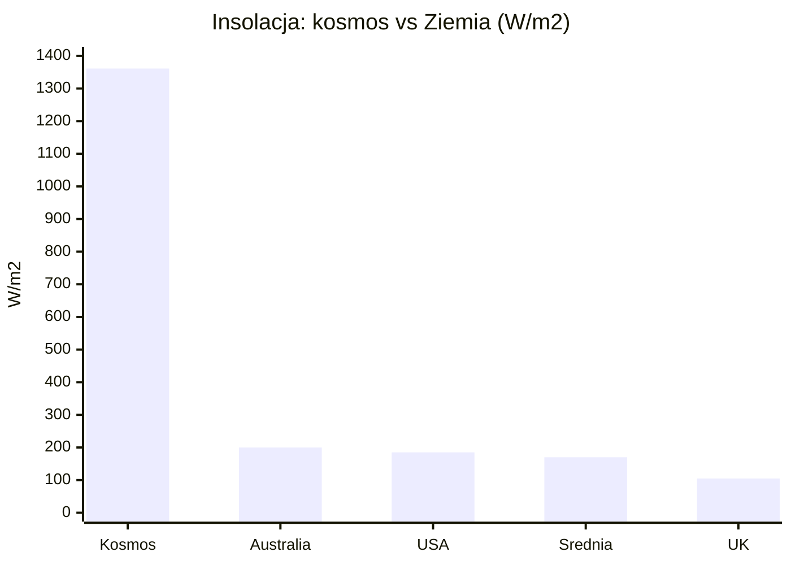
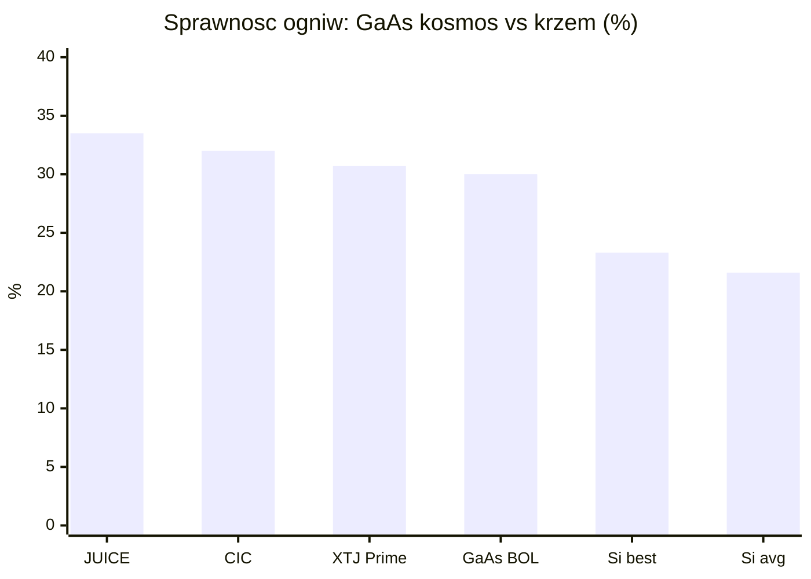
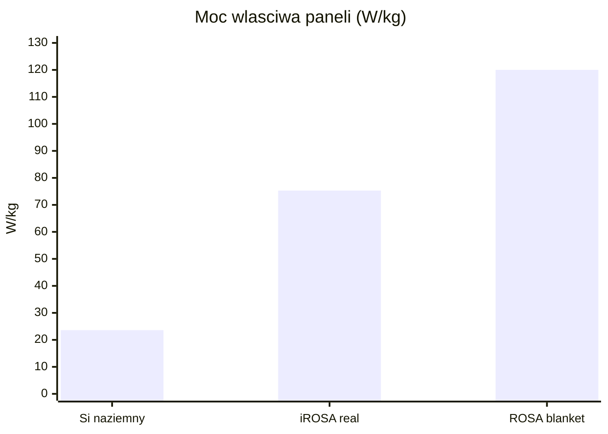
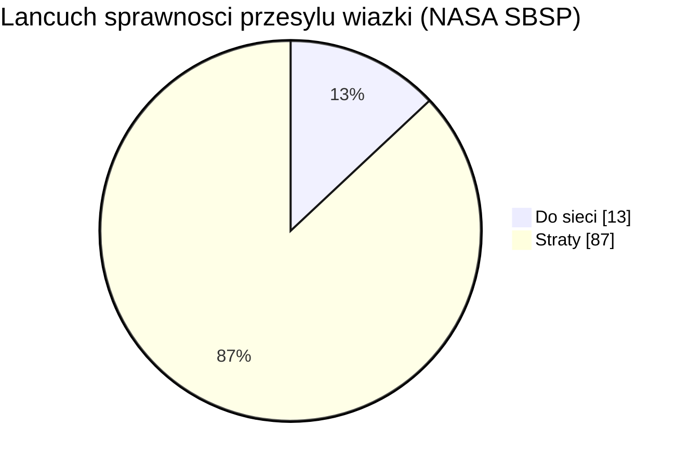

# Energetyka kosmiczna i fotowoltaika orbitalna

> Notatka raportu "Orbitalne centra danych". Kluczowe źródła: [źródło 1](https://earth.gsfc.nasa.gov/climate/projects/solar-irradiance/science), [źródło 2](https://www.worldenergy.org/assets/images/imported/2013/10/WER_2013_8_Solar_revised.pdf).

## W skrócie

Energia to fundament każdej tezy o orbitalnych centrach danych - i jednocześnie miejsce, gdzie najłatwiej o błąd liczbowy, który zmienia opłacalność o rząd wielkości. Na orbicie Słońce świeci niemal bez przerwy i znacznie mocniej niż na Ziemi (stała słoneczna 1361 <abbr title="jednostka gęstości mocy promieniowania, czyli ile watów przypada na każdy metr kwadratowy powierzchni.">W/m2</abbr> wobec ~170-200 W/m2 średniej naziemnej), a kosmiczne ogniwa GaAs mają ~30% sprawności wobec ~22% krzemu naziemnego - więc panel orbitalny produkuje z metra kwadratowego wielokrotnie więcej energii niż naziemny. Klucz dla inwestora: jeśli ktoś liczy powierzchnię i masę paneli "po naziemnemu" (np. ~20 <abbr title="moc właściwa, czyli ile watów daje każdy kilogram konstrukcji; im wyższa, tym lżejszy i tańszy w wyniesieniu jest system.">W/kg</abbr>, ~200 W/m2), otrzyma wynik 4-6x zawyżony i fałszywie uzna projekt za absurd. Realne nowoczesne macierze rolowane (<abbr title="elastyczne panele słoneczne w formie &quot;rolet&quot; rozwijanych na orbicie, lekkie i kompaktowe w transporcie.">ROSA</abbr>) deklarują 100-120 W/kg, choć cały statek schodzi do ~24-41 <abbr title="odwrotność mocy właściwej: ile kilogramów masy całego statku przypada na każdy kilowat mocy (im niżej, tym lepiej).">kg/kW</abbr> po doliczeniu baterii na zaćmienia, busów wysokonapięciowych i radiatorów. Trzecia oś to "energia jako usługa": startupy power beamingu (Star Catcher, Cowboy Space/Aetherflux, Space Solar, Virtus Solis) ścigają się o przesył wiązki mocy, gdzie sprawność całkowita to dziś wąskie gardło (~13% w modelu NASA, ~5% w obecnych systemach naziemnych) i decyduje o tym, kto na tym zarobi, a kto przepali kapitał.

<!-- spolki:related:start -->
## Spółki powiązane

> Notowane spółki produkujące podzespoły/technologie związane z tym tematem. Pełne omówienie: spółki, dla których nisza to >=33% przychodów; skrótowe: zdywersyfikowane konglomeraty. Zob. też [[Spolki/_slownik]] i [[Spolki/_widok-gpw-eu]].

**Producenci kluczowi (>=33% przychodów z niszy - omówienie pełne):**
- [[Spolki/rocket-lab|Rocket Lab Corporation (RKLB)]] - Launch (Electron/Neutron) + Space Systems: bus, ogniwa SolAero, komponenty
- [[Spolki/redwire|Redwire Corporation (RDW)]] - Panele ROSA, struktury rozkładane, montaż on-orbit, radiatory Q-Rad

**Pozostali dominujący gracze (nisza to ułamek przychodów - omówienie skrótowe):**
- [[Spolki/northrop-grumman|Northrop Grumman Corporation (NOC)]] - Serwis GEO (MEV/MRV), busy, radiatory, ogniwa
- [[Spolki/airbus|Airbus SE (AIR)]] 🇪🇺 - PV (Sparkwing), optyka (Tesat), busy, serwis (EU)
<!-- spolki:related:end -->

<!-- network:watki:start -->
## Powiązane wątki

> Mapa powiązań tematycznych - jak ten wątek łączy się z resztą raportu.

- [[03 - fizyka-orbitalna-orbity-i-operacje|Fizyka orbitalna]] - insolacja i cykle eklips zależą od geometrii orbity
- [[05 - chlodzenie-i-radiacyjne-odprowadzanie-ciepla|Chłodzenie]] - bilans mocy zamyka się dopiero z bilansem cieplnym (radiatory)
- [[09 - ekonomika-i-koszty-calkowite-tco|Ekonomika i TCO]] - koszt i masa systemu energetycznego wchodzą wprost do TCO
- [[12 - naziemny-bottleneck-energetyczny-i-sieciowy|Naziemny bottleneck]] - przewaga energetyczna orbity ma sens wobec niedoboru mocy na Ziemi
- [[14 - zrownowazony-rozwoj-i-srodowisko|Środowisko]] - carbon intensity solar orbital vs naziemny miks energetyczny
<!-- network:watki:end -->
## Stała słoneczna i przewaga insolacji orbitalnej

<abbr title="moc promieniowania Słońca padająca na metr kwadratowy powierzchni prostopadłej ponad atmosferą, około 1361 W/m2.">Stała słoneczna</abbr> - czyli moc promieniowania Słońca padająca na metr kwadratowy powierzchni prostopadłej, mierzona ponad atmosferą - wynosi według aktualnych pomiarów NASA 1361,6 ± 0,3 W/m2 (instrument TSIS-1, minimum słoneczne 2019) [źródło](https://earth.gsfc.nasa.gov/climate/projects/solar-irradiance/science), zaokrąglane też do 1361 W/m2 [źródło](https://earth.gsfc.nasa.gov/climate/projects/solar-irradiance/science). Na Ziemi w grę wchodzą noc, chmury, kąt padania i straty atmosferyczne, więc średnia roczna insolacja na powierzchni poziomej to zaledwie ~170 W/m2 [źródło](https://www.worldenergy.org/assets/images/imported/2013/10/WER_2013_8_Solar_revised.pdf), a nawet w dobrych lokalizacjach ~200 W/m2 w Australii, 185 W/m2 w USA i tylko 105 W/m2 w Wielkiej Brytanii [źródło](https://www.worldenergy.org/assets/images/imported/2013/10/WER_2013_8_Solar_revised.pdf). Stosunek tych wartości to ~6,8-8x na korzyść orbity [proxy obliczeniowy autora raportu](https://earth.gsfc.nasa.gov/climate/projects/solar-irradiance/science). Implikacja dla inwestora: każdy metr kwadratowy panela na orbicie pracuje "za kilka" naziemnych - to właśnie ta przewaga ma rekompensować horrendalne koszty wyniesienia masy. Każda analiza, która tego nie uwzględni i liczy panele orbitalne naziemną insolacją, jest z gruntu wadliwa.

*Rys. 18 - Stała słoneczna na orbicie wobec naziemnej insolacji w wybranych lokalizacjach; przewaga orbity to rząd 7-8x. Dane: NASA GSFC; World Energy Council 2013.*

## Sprawność ogniw kosmicznych vs krzem naziemny

W kosmosie nie używa się tanich modułów krzemowych, lecz drogich, ale sprawnych ogniw wielozłączowych z arsenku galu (GaAs) - tzw. triple-junction, gdzie trzy warstwy półprzewodnika łapią różne zakresy widma. Producenci podają ~30% sprawności na początku życia (BOL, beginning of life) w standardowych warunkach kosmicznych <abbr title="standardowe warunki nasłonecznienia w kosmosie (bez filtrującej atmosfery), używane do podawania sprawności ogniw kosmicznych.">AM0</abbr> [CAVU Aerospace](https://cavuaerospace.uk/space-solar-cells/30-triple-junction-gaas-solar-cell/), a często >30% [satsearch/Kingsoon](https://satsearch.co/products/kingsoon-optoelectronics-solar-cell-chips). Ogniwa XTJ Prime od Spectrolab (Boeing) mają 30,7% i zasilają macierze iROSA stacji ISS [Redwire IR](https://ir.redwirespace.com/news-events/press-releases/detail/61/redwire-successfully-delivers-second-pair-of-irosa-solar). Dla wymagających misji (ESA JUICE) sprawność sięga 33,5% przy BOL [E3S/ESPC 2017](https://www.e3s-conferences.org/articles/e3sconf/abs/2017/04/e3sconf_espc2017_03011.html), a typowe ogniwa CIC podają 32% [Mindway](https://www.mindwaybattery.com/products/triple-junction-gaas-solar-cics-40mm-x-80mm-space-grade-30-efficiency.html). Dla porównania naziemny krzem krystaliczny ma średnią ważoną sprawność 21,6% (Q4-2023), a najlepsze moduły 23,3% [Fraunhofer ISE](https://www.ise.fraunhofer.de/content/dam/ise/de/documents/publications/studies/Photovoltaics-Report.pdf). Implikacja: ogniwo kosmiczne łapie ~30% z 1361 W/m2, naziemne ~22% z ~200 W/m2 - łączna przewaga energetyczna z metra kwadratowego sięga rzędu ~9-10x, co bezpośrednio przekłada się na mniejszą wymaganą powierzchnię (a więc masę i koszt wyniesienia).

*Rys. 19 - Sprawność kosmicznych ogniw GaAs (triple-junction, AM0/BOL) wobec krzemu naziemnego. Dane: E3S/ESPC 2017; Mindway; Redwire IR; CAVU; Fraunhofer ISE.*

## Gęstość masowa: W/kg, masa/m2 i przeliczenie "200 MW"

Najważniejszy parametr dla budżetu masy to moc właściwa (W/kg) - ile watów daje kilogram konstrukcji. Tu kryje się przepaść między technologiami. Naziemny moduł krzemowy "schudł" z ~8,5 W/kg na początku lat 2000 do 23,6 W/kg dziś [pv-magazine](https://www.pv-magazine.com/2026/04/08/solar-keep-slimming-down-while-power-rises/). Kosmiczne macierze rolowane (ROSA - Roll-Out Solar Array, elastyczne "rolety" PV rozwijane na orbicie) Redwire deklarują 100-120 W/kg na poziomie samego "koca" (blanket) [Redwire flysheet](https://redwirespace.com/wp-content/uploads/2023/06/redwire-roll-out-solar-array-flysheet.pdf), gęstość pakowania ~40 kW/m3 [Redwire flysheet](https://redwirespace.com/wp-content/uploads/2023/06/redwire-roll-out-solar-array-flysheet.pdf) i pracę w zakresie napięć od 12 V do >300 V [Redwire flysheet](https://redwirespace.com/wp-content/uploads/2023/06/redwire-roll-out-solar-array-flysheet.pdf).

Realna wartość zmierzona dla iROSA na ISS jest jednak niższa: każdy moduł waży ~340 kg, rozkłada się do 6 m x 19,2 m i osiąga 75,3 W/kg [ScienceDirect/Yan 2025](https://www.sciencedirect.com/science/article/pii/S2950104025000161); to ~115,2 m2 powierzchni [proxy z wymiarów](https://www.sciencedirect.com/science/article/pii/S2950104025000161), czyli masa/m2 ≈ 2,95 kg/m2 (proxy: 340 kg / 115,2 m2). Każda macierz iROSA dostarcza ponad 28 kW (w innej wersji Redwire ">20 kW") [Redwire IR](https://ir.redwirespace.com/news-events/press-releases/detail/61/redwire-successfully-delivers-second-pair-of-irosa-solar). Skrajnie lekkie ogniwa cienkowarstwowe (CdTe na poliimidzie) ważą poniżej 0,7 kg/m2 przy ~10% sprawności i ~2 kW na węzeł [arXiv 2512.09044](https://arxiv.org/pdf/2512.09044). Implikacja: różnica między 23,6 W/kg (krzem naziemny) a 75-120 W/kg (kosmos) to mnożnik 3-5x na masie - kluczowy, bo wyniesienie masy to gros kosztu.

![[assets/y03-1-iss065e125924.jpg]]
*Rys. 20 - Energetyka: iss065e125924. Źródło: NASA, licencja: public domain.*
#grafika #energetyka-kosmiczna-i-fotowoltaika-orbitalna #panele-sloneczne #ROSA

![[assets/y03-2-iss065e144542.jpg]]
*Rys. 21 - Energetyka: iss065e144542. Źródło: NASA, licencja: public domain.*
#grafika #energetyka-kosmiczna-i-fotowoltaika-orbitalna #panele-sloneczne #ROSA

*Rys. 22 - Moc właściwa: krzem naziemny wobec kosmicznych macierzy rolowanych (zmierzone iROSA i deklarowany blanket ROSA); mnożnik 3-5x na masie. Dane: pv-magazine; ScienceDirect/Yan 2025; Redwire flysheet.*

Tezę z polskiego artykułu sceptycznego ("200 MW = 80 ha = 8 tys. ton") da się przeliczyć tylko proxy, bo oryginał nie został zlokalizowany publicznie [brak dostępnego oryginału - liczby z instrukcji](https://polskieradio24.pl/artykul/3511306,orbitalne-centra-danych-dla-ai-firmy-patrza-w-niebo-naukowcy-przestrzegaja). Kontekst medialny: Thales Alenia Space mówi o konstelacji 13 satelitów składanych w farmę 200 x 80 m dającą ~10 MW mocy obliczeniowej [Polskie Radio 24/PAP](https://polskieradio24.pl/artykul/3511306,orbitalne-centra-danych-dla-ai-firmy-patrza-w-niebo-naukowcy-przestrzegaja), a próg "sensowności" dla narastającego popytu AI to ~200 MW [Polskie Radio 24/PAP](https://polskieradio24.pl/artykul/3511306,orbitalne-centra-danych-dla-ai-firmy-patrza-w-niebo-naukowcy-przestrzegaja). Proxy powierzchni: przy 1361 W/m2 i 30% sprawności 200 MW wymaga ~490 tys. m2 ≈ 49 ha; po stratach temperaturowych/kątowych (~25%) ~65 ha; po marginie eklipsowym ~38% ~90 ha - wartość 80 ha mieści się w tym zakresie [proxy obliczeniowy](https://earth.gsfc.nasa.gov/climate/projects/solar-irradiance/science). Proxy masy: same panele ROSA przy 100-120 W/kg to ~1,7-2,0 tys. t dla 200 MW, ale modele całych statków ODC (Star Catcher ~41 kg/kW -> ~8,2 tys. t; McCalip ~30 kg/kW -> ~6 tys. t) wskazują, że 8 tys. ton to wiarygodna estymata masy całkowitej na orbitę, a nie tylko paneli [proxy obliczeniowy](https://www.star-catcher.com/news/the-orbital-data-center-power-problem-and-how-to-solve-it). Dla porównania McCalip podaje dla 1 GW orbital solar: 29,4 mln kg masy do LEO [McCalip](https://andrewmccalip.com/space-datacenters), 51,10 USD/W kosztu [McCalip](https://andrewmccalip.com/space-datacenters) i <abbr title="uśredniony koszt energii w całym cyklu życia instalacji (USD za kWh lub MWh), kluczowa miara opłacalności.">LCOE</abbr> 1167 USD/MWh [McCalip](https://andrewmccalip.com/space-datacenters). Implikacja: liczby "80 ha / 8 tys. ton" same w sobie nie są niedorzeczne - błędem jest dopiero ich wyprowadzanie z założeń naziemnych (patrz Kontrowersje).

## Degradacja PV od promieniowania: BOL vs EOL

Na orbicie ogniwa starzeją się szybciej niż na Ziemi, bo bombardują je naładowane cząstki (pasy Van Allena, wiatr słoneczny). Producent GaAs podaje, że po dawce 1x10^15 e/cm2 retencja mocy spada do 0,84 [CAVU](https://cavuaerospace.uk/space-solar-cells/30-triple-junction-gaas-solar-cell/), prądu do 0,93 [CAVU](https://cavuaerospace.uk/space-solar-cells/30-triple-junction-gaas-solar-cell/) i napięcia do 0,90 [CAVU](https://cavuaerospace.uk/space-solar-cells/30-triple-junction-gaas-solar-cell/) (BOL - początek życia, EOL - koniec życia). Tempa rocznej degradacji rozjeżdżają się mocno w literaturze: 2,66%/rok dla LEO [ResearchGate](https://www.researchgate.net/publication/331212559_Optimal_Orbit_Parameters_for_Power_Subsystem_of_LEO_Satellites), 0,275%/rok dla GaAs i 0,375%/rok dla krzemu [SJSU/Raman](https://www.sjsu.edu/ae/docs/project-thesis/Subhiksha.Raman-S21.pdf), 0,92%/rok (87% przez 15 lat) [core.ac.uk](https://core.ac.uk/download/234925230.pdf), a analityk branżowy szacuje 200-300 punktów bazowych (2-3%) rocznie zależnie od orbity [Per Aspera](https://peraspera.us/realities-of-space-based-compute/). Sprawność JUICE startuje od 33,5% BOL [E3S](https://www.e3s-conferences.org/articles/e3sconf/abs/2017/04/e3sconf_espc2017_03011.html), a jednej liczby EOL źródło nie podaje - jedynie mechanizm, że spadek mocy maksymalnej Pmp jest silniejszy niż prądu Isc i napięcia Voc [E3S](https://www.e3s-conferences.org/articles/e3sconf/abs/2017/04/e3sconf_espc2017_03011.html). Uniwersalnej wartości degradacji NIE UJAWNIONO - zależy od orbity, osłony (coverglass) i technologii; w LEO typowo 1-3%/rok [proxy z literatury](https://www.sjsu.edu/ae/docs/project-thesis/Subhiksha.Raman-S21.pdf). Implikacja: degradacja bezpośrednio skraca żywotność farmy i podnosi LCOE - inwestor musi pytać o konkretną orbitę i osłonę, bo różnica między 0,28% a 2,66% rocznie to różnica między 15-letnim a kilkuletnim aktywem.

## Bilans mocy, magazynowanie na zaćmienia i busy wysokonapięciowe

W LEO satelita co ~90 minut wpada w cień Ziemi - ciemność trwa ~25-35% orbity [Per Aspera](https://peraspera.us/realities-of-space-based-compute/), czyli ~30 min na okrążenie [Per Aspera](https://peraspera.us/realities-of-space-based-compute/); ISS używa dużych baterii na swoją ~35-minutową "noc" [Per Aspera](https://peraspera.us/realities-of-space-based-compute/). W ujęciu dobowym obiekt w LEO ma światło ~60% czasu [SemiAnalysis](https://newsletter.semianalysis.com/p/to-boldly-go-the-case-for-space-datacenters), a orbita synchroniczna ze Słońcem (SSO) ogranicza zaćmienie do ~35 min/dobę [SemiAnalysis](https://newsletter.semianalysis.com/p/to-boldly-go-the-case-for-space-datacenters). NASA podaje dla LEO głębokość rozładowania baterii (<abbr title="głębokość rozładowania baterii, czyli jaki procent jej pojemności jest zużywany w jednym cyklu.">DOD</abbr>) ~30-40% [NASA NTRS](https://ntrs.nasa.gov/api/citations/20070018197/downloads/20070018197.pdf), cykl rozładowania 30/36 min [NASA NTRS](https://ntrs.nasa.gov/api/citations/20070018197/downloads/20070018197.pdf) i ładowania 55/60 min [NASA NTRS](https://ntrs.nasa.gov/api/citations/20070018197/downloads/20070018197.pdf). Baterie litowe klasy kosmicznej magazynują ~100 Wh/kg [Per Aspera](https://peraspera.us/realities-of-space-based-compute/) - to ciężki, drogi balast. Elegancki obejście: orbita "świtu-zmierzchu" (DDSS) na ~1600 km i nachyleniu 102,5 stopnia eliminuje potrzebę magazynowania energii [arXiv 2512.09044](https://arxiv.org/pdf/2512.09044), redukując baterie do zera i unikając cykli termicznych [arXiv 2512.09044](https://arxiv.org/pdf/2512.09044). Implikacja: każdy procent czasu w cieniu trzeba "przykryć" bateriami, które dorzucają ~10 kg/kW masy (patrz niżej) - dobór orbity to dźwignia kosztowa, a nie detal inżynierski.

Drugie wąskie gardło to elektryka wysokonapięciowa w próżni. Centrum danych potrzebuje setek kW-MW, co wymusza wysokie napięcia busa (300-1000 V) [NASA GRC](https://ntrs.nasa.gov/api/citations/20030022705/downloads/20030022705.pdf), ale w plazmie orbitalnej grozi to łukowaniem (arcing) - wyładowaniami niszczącymi panele. Już od wprowadzenia systemów 100 V w późnych latach 80. obserwowano łuki uszkadzające satelity [NASA GRC](https://ntrs.nasa.gov/api/citations/20030022705/downloads/20030022705.pdf); progi wyzwolenia łuku to -100 do -250 V [NASA GRC](https://ntrs.nasa.gov/api/citations/20030022705/downloads/20030022705.pdf), łuki obserwowano nawet przy -75 V [NASA GRC](https://ntrs.nasa.gov/api/citations/20030022705/downloads/20030022705.pdf), a łuki podtrzymywane mogą wystąpić już od 40 V przy 1 A [NASA GRC](https://ntrs.nasa.gov/api/citations/20030022705/downloads/20030022705.pdf). Z drugiej strony pojedyncza duża szyba osłonowa (coverglass) odgradzająca panel od plazmy pozwala wytrzymać nawet -1100 V [NASA GRC](https://ntrs.nasa.gov/api/citations/20030022705/downloads/20030022705.pdf). Implikacja: skalowanie napięcia to ostry kompromis - wyższe napięcie zmniejsza straty i masę kabli, ale podnosi ryzyko awarii łukowej, co jest realnym ryzykiem niezawodności (i ubezpieczeniowym) dla inwestora.

## Power beaming i "energia jako usługa": kto walczy o ten rynek

Najgorętszy segment to firmy oferujące energię jako usługę - zamiast każdy satelita budował własne wielkie panele, dostawca "doświetla" je wiązką. Star Catcher buduje orbitalną sieć energetyczną bezprzewodowo przesyłającą moc do istniejących paneli, dając im do 10x więcej mocy [Star Catcher](https://www.star-catcher.com/news/the-orbital-data-center-power-problem-and-how-to-solve-it). Przykład: 20 MW ODC łatwo osiągalne w konfiguracji 81 satelitów po ~250 kW każdy [Star Catcher](https://www.star-catcher.com/news/the-orbital-data-center-power-problem-and-how-to-solve-it). Bez wiązki 250 kW wymagałoby 1100 m2 paneli na statek, a z 10x fluxem tylko 110 m2 [Star Catcher](https://www.star-catcher.com/news/the-orbital-data-center-power-problem-and-how-to-solve-it). To redukuje masę: 2x flux obniża masę ODC o ponad 50% [Star Catcher](https://www.star-catcher.com/news/the-orbital-data-center-power-problem-and-how-to-solve-it), a 10x flux schodzi do ~37% masy pierwotnej [Star Catcher](https://www.star-catcher.com/news/the-orbital-data-center-power-problem-and-how-to-solve-it), co daje "do 3,5 centrum danych za cenę jednego" [Star Catcher](https://www.star-catcher.com/news/the-orbital-data-center-power-problem-and-how-to-solve-it). Star Catcher modeluje <abbr title="wskaźnik efektywności energetycznej centrum danych: stosunek całej zużytej energii do energii samych serwerów.">PUE</abbr> 1,3 [Star Catcher](https://www.star-catcher.com/news/the-orbital-data-center-power-problem-and-how-to-solve-it), system termiczny ~2,5 kg/kW [Star Catcher](https://www.star-catcher.com/news/the-orbital-data-center-power-problem-and-how-to-solve-it) i mniejszą powierzchnię paneli redukującą ryzyko kolizji o 30-85% [Star Catcher](https://www.star-catcher.com/news/the-orbital-data-center-power-problem-and-how-to-solve-it). Finansowo zebrali 65 mln USD Series A [The Engineer](https://www.theengineer.co.uk/content/news/floridas-star-catcher-raises-65-million-for-space-based-power-grid) (łącznie 88 mln USD) [The Engineer](https://www.theengineer.co.uk/content/news/floridas-star-catcher-raises-65-million-for-space-based-power-grid), w 2025 dostarczyli ponad 1,1 kW mocy elektrycznej laserami do komercyjnych paneli na KSC [pv-magazine-usa](https://pv-magazine-usa.com/2026/06/08/star-catcher-is-building-a-space-based-solar-grid-for-orbital-infrastructure/), podpisali 7 umów PPA [SpaceQ](https://spaceq.ca/star-catcher-secures-us65m-series-a-to-develop-orbital-power-grid/) i deklarują pipeline >3 mld USD rocznego przychodu powtarzalnego [SpaceQ](https://spaceq.ca/star-catcher-secures-us65m-series-a-to-develop-orbital-power-grid/), z konstelacją na ~1000 mil [pv-magazine-usa](https://pv-magazine-usa.com/2026/06/08/star-catcher-is-building-a-space-based-solar-grid-for-orbital-infrastructure/) i adaptacyjnymi lustrami beamującymi do 50 satelitów naraz [The Engineer](https://www.theengineer.co.uk/content/news/floridas-star-catcher-raises-65-million-for-space-based-power-grid). Bez wiązki gigawatowe centra danych wymagałyby >600 boisk piłkarskich paneli [Star Catcher](https://www.star-catcher.com/news/the-orbital-data-center-power-problem-and-how-to-solve-it). Implikacja: jeśli power beaming zadziała w skali, radykalnie zmienia <abbr title="całkowity koszt posiadania, suma wszystkich kosztów budowy i eksploatacji aktywa przez cały okres jego życia.">TCO</abbr> - to opcja na "wygranego biorącego wszystko" lub na spalenie kapitału, jeśli sprawność wiązki rozczaruje.

Cowboy Space (dawniej Aetherflux, założona w 2024 przez współzałożyciela Robinhooda) zamknęła Series B na 275 mln USD przy wycenie post-money 2 mld USD [TechCrunch](https://techcrunch.com/2026/05/11/there-arent-enough-rockets-for-space-data-centers-cowboy-space-raised-275-million-to-build-them/), po wcześniejszych 80 mln USD [TechCrunch](https://techcrunch.com/2026/05/11/there-arent-enough-rockets-for-space-data-centers-cowboy-space-raised-275-million-to-build-them/) (łącznie ~355 mln USD finansowania zewnętrznego) [datagrom](https://www.datagrom.com/ai-news/cowboy-space-raises-275m-for-orbital-ai-data-centers-4ee4ce30). Każdy satelita ma ważyć 20 000-25 000 kg i dawać 1 MW mocy dla niespełna 800 GPU [TechCrunch](https://techcrunch.com/2026/05/11/there-arent-enough-rockets-for-space-data-centers-cowboy-space-raised-275-million-to-build-them/), z pierwszym satelitą power beamingu jeszcze w 2026 [Evertiq](https://evertiq.com/news/2026-05-22-cowboy-space-raises-275m-to-advance-orbital-data-centers) i własną rakietą przed końcem 2028 [TechCrunch](https://techcrunch.com/2026/05/11/there-arent-enough-rockets-for-space-data-centers-cowboy-space-raised-275-million-to-build-them/); pierwszy moduł centrum danych (projekt Galactic Brain) ma trafić na orbitę w I kwartale 2027 z użyciem laserów podczerwonych [tech.wp.pl](https://tech.wp.pl/amerykanska-firma-zbuduje-centra-danych-na-orbicie-niezbedne-dla-ai,7231249826438080a). Firma współpracuje z NVIDIA przy modułach Space-1 Vera Rubin [Evertiq](https://evertiq.com/news/2026-05-22-cowboy-space-raises-275m-to-advance-orbital-data-centers). Sprawność beamingu Cowboy Space NIE UJAWNIONA [TechCrunch](https://techcrunch.com/2026/05/11/there-arent-enough-rockets-for-space-data-centers-cowboy-space-raised-275-million-to-build-them/).

Brytyjski Space Solar celuje w przesył energii z kosmosu na Ziemię: pierwsza elektrownia 30 MW do 2030 dla Reykjavik Energy (Islandia), we współpracy z Transition Labs [Space Solar](https://www.spacesolar.co.uk/space-solar-and-transition-labs-to-deliver-space-based-solar-power-to-iceland-by-2030/), skalowanie do GW do 2036 [Space Solar](https://www.spacesolar.co.uk/space-solar-and-transition-labs-to-deliver-space-based-solar-power-to-iceland-by-2030/) i 180 MW w 2033 [SatelliteToday](https://www.satellitetoday.com/space-economy/2025/03/28/space-based-solar-power-will-fuel-transition-to-net-zero-space-solar-ceo-says/). System 30 MW ma kosztować ~400 mln USD [SatelliteToday](https://www.satellitetoday.com/space-economy/2025/03/28/space-based-solar-power-will-fuel-transition-to-net-zero-space-solar-ceo-says/), przyszłe do 2,25 mld USD [SatelliteToday](https://www.satellitetoday.com/space-economy/2025/03/28/space-based-solar-power-will-fuel-transition-to-net-zero-space-solar-ceo-says/). Demonstrator to 64 t [NSS/OSA](https://osa.nss.org/Update2411.pdf), zasili ~3000 domów [NSS/OSA](https://osa.nss.org/Update2411.pdf). Technologia przesyłu dopracowana przez 5 mln GBP badań [Space Solar](https://www.spacesolar.co.uk/space-solar-and-transition-labs-to-deliver-space-based-solar-power-to-iceland-by-2030/), a projekt CASSiDi trwał 18 mies. i kosztował 1,7 mln GBP (~2,26 mln USD) [SatelliteToday](https://www.satellitetoday.com/space-economy/2025/04/28/space-solar-completes-design-study-for-cassiopeia-satellite/); przesył wiązką radiową wysokiej częstotliwości, sprawność NIE UJAWNIONA [Space Solar](https://www.spacesolar.co.uk/space-solar-and-transition-labs-to-deliver-space-based-solar-power-to-iceland-by-2030/).

Virtus Solis (z Orbital Composites) stawia na modularne kafelki: heksagon 1,65 m [Virtus Solis](https://www.virtussolis.space/blog/virtus-solis-space-based-solar-and-power-beaming-white-paper-2023) dający 1 kW na ziemię [NextBigFuture](https://www.nextbigfuture.com/2024/02/comparison-of-current-space-based-solar-power-proposals.html), architektura skalowalna od 100 MW do 20 GW [Virtus Solis](https://www.virtussolis.space/blog/virtus-solis-space-based-solar-and-power-beaming-white-paper-2023), przesył RF 10 GHz [Virtus Solis](https://www.virtussolis.space/blog/virtus-solis-space-based-solar-and-power-beaming-white-paper-2023). Demo naziemne: 68 W przez 100 m za pomocą 6400 anten [Virtus Solis](https://www.virtussolis.space/blog/virtus-solis-space-based-solar-and-power-beaming-white-paper-2023). Finansowanie ~2 mln USD z ARPA-E [Space Frontier](https://www.spacefrontier.org/sbsp-company-reports/virtus-solis), pilotaż 2027-2028 [Space Frontier](https://www.spacefrontier.org/sbsp-company-reports/virtus-solis), pierwszy system operacyjny 2030 [Space Frontier](https://www.spacefrontier.org/sbsp-company-reports/virtus-solis), cel ceny 30 USD/MWh [Space Frontier](https://www.spacefrontier.org/sbsp-company-reports/virtus-solis), rektenna o średnicy 2 km [Space Frontier](https://www.spacefrontier.org/sbsp-company-reports/virtus-solis). Demonstrator 100 kW (koszt 25 mln USD), z czego na ziemię dotrze tylko ~4 kW [Engineering.com](https://www.engineering.com/how-virtus-solis-plans-to-build-a-solar-power-plant-in-space/) - co obnaża skalę strat przesyłu. Demo z Orbital Composites: ponad 1 kW beamingu do 2027, klasa MW do 2030 [PayloadSpace](https://payloadspace.com/orbital-composites-virtus-solis-team-on-space-based-solar-power-station/). Implikacja inwestorska: fakt, że z 100 kW dociera 4 kW (~4%), pokazuje, że sprawność end-to-end to dziś główny hamulec ekonomii i wszelkie deklaracje 30 USD/MWh trzeba ważyć tym ryzykiem.

## Sprawność przesyłu wiązki - benchmark i wpływ na TCO

Łańcuch strat jest długi. Model NASA SBSP rozkłada go: ogniwo 35% [NASA SBSP](https://www.nasa.gov/wp-content/uploads/2024/01/otps-sbsp-report-final-tagged-approved-1-8-24-tagged-v2.pdf), konwersja w kosmosie DC-DC 90% i DC-RF 70% [NASA SBSP](https://www.nasa.gov/wp-content/uploads/2024/01/otps-sbsp-report-final-tagged-approved-1-8-24-tagged-v2.pdf), emisja anteny 90% [NASA SBSP](https://www.nasa.gov/wp-content/uploads/2024/01/otps-sbsp-report-final-tagged-approved-1-8-24-tagged-v2.pdf), przejście atmosferyczne 98% [NASA SBSP](https://www.nasa.gov/wp-content/uploads/2024/01/otps-sbsp-report-final-tagged-approved-1-8-24-tagged-v2.pdf), zbieranie wiązki 95% [NASA SBSP](https://www.nasa.gov/wp-content/uploads/2024/01/otps-sbsp-report-final-tagged-approved-1-8-24-tagged-v2.pdf), rektenna 78% [NASA SBSP](https://www.nasa.gov/wp-content/uploads/2024/01/otps-sbsp-report-final-tagged-approved-1-8-24-tagged-v2.pdf), DC-DC na ziemi 90% [NASA SBSP](https://www.nasa.gov/wp-content/uploads/2024/01/otps-sbsp-report-final-tagged-approved-1-8-24-tagged-v2.pdf) - co daje ~13% energii padającego Słońca trafiające do sieci [NASA SBSP](https://www.nasa.gov/wp-content/uploads/2024/01/otps-sbsp-report-final-tagged-approved-1-8-24-tagged-v2.pdf). Eksperyment orbitalny MAPLE: sprawność rektenny 40% względem mocy padającej na aperturę [arXiv MAPLE](https://arxiv.org/html/2401.15267v2), moc szczytowa 231 mW (ścianka) i 251 mW (czoło) [arXiv MAPLE](https://arxiv.org/html/2401.15267v2), częstotliwość 9,984 GHz [arXiv MAPLE](https://arxiv.org/html/2401.15267v2), wysokość 527 km [arXiv MAPLE](https://arxiv.org/html/2401.15267v2), strata wolnoprzestrzenna 167 dB [arXiv MAPLE](https://arxiv.org/html/2401.15267v2). Historyczny rekord: NASA Goldstone 1975 przesłała 30 kW z 82% sprawnością [Sirotin Intelligence](https://www.sirotinintelligence.com/space-solar-martin-soltau-interview/). Naziemne demonstracje: DARPA POWER 800 W na 8,6 km laserem [Energy Solutions](https://energy-solutions.co/articles/sub/wireless-power-transmission-long-distance-2026), US Army Scope-M 1,6 kW przy 95% sprawności na 1 km mikrofalą [Energy Solutions](https://energy-solutions.co/articles/sub/wireless-power-transmission-long-distance-2026), NTT/MHI 15% laserem na 1 km [Energy Solutions](https://energy-solutions.co/articles/sub/wireless-power-transmission-long-distance-2026). Realistyczny obraz: obecne systemy ~5% sprawności, do praktyki potrzeba ~20% [Yahoo Tech](https://www.yahoo.com/tech/spacexs-starship-could-help-start-100029185.html). Sprawność space-to-space Star Catcher i Cowboy Space pozostają NIE UJAWNIONE [Star Catcher](https://www.star-catcher.com/news/the-orbital-data-center-power-problem-and-how-to-solve-it).

*Rys. 23 - Udział energii padającego Słońca docierający do sieci po pełnym łańcuchu strat przesyłu wiązki w modelu NASA SBSP. Dane: NASA SBSP report 2024.*

Wpływ na TCO widać w modelu NASA: koszt życia energii (LCOE) bazowo 0,61 USD/kWh (RD1) i 1,59 USD/kWh (RD2) [NASA SBSP](https://www.nasa.gov/wp-content/uploads/2024/01/otps-sbsp-report-final-tagged-approved-1-8-24-tagged-v2.pdf), gdzie wyniesienie to 71% (RD1) i 77% (RD2) kosztu [NASA SBSP](https://www.nasa.gov/wp-content/uploads/2024/01/otps-sbsp-report-final-tagged-approved-1-8-24-tagged-v2.pdf) - bo trzeba 23 216 startów dla 5,9 mln kg (RD1) i 3960 dla 10 mln kg (RD2) [NASA SBSP](https://www.nasa.gov/wp-content/uploads/2024/01/otps-sbsp-report-final-tagged-approved-1-8-24-tagged-v2.pdf). Przy korzystnych założeniach (start 500 USD/kg, 50 mln USD/lot, 15 lat życia) LCOE spada do 0,03 USD/kWh (RD1) i 0,08 USD/kWh (RD2) [NASA SBSP](https://www.nasa.gov/wp-content/uploads/2024/01/otps-sbsp-report-final-tagged-approved-1-8-24-tagged-v2.pdf). Powierzchnia paneli to 11,5 km2 (RD1) i 19 km2 (RD2) [NASA SBSP](https://www.nasa.gov/wp-content/uploads/2024/01/otps-sbsp-report-final-tagged-approved-1-8-24-tagged-v2.pdf), emisyjność 26-40 gCO2eq/kWh [NASA SBSP](https://www.nasa.gov/wp-content/uploads/2024/01/otps-sbsp-report-final-tagged-approved-1-8-24-tagged-v2.pdf). Implikacja: ekonomia stoi i upada na koszcie wyniesienia - 20-krotny spread LCOE (0,03 vs 0,61 USD/kWh) zależy głównie od tego, czy starty potanieją tak, jak zakładają optymiści.

## Kontrowersje

**Główny błąd liczbowy artykułu sceptycznego: założenia naziemne czy orbitalne?**

Oryginał polskiego artykułu sceptycznego nie został zlokalizowany publicznie, co uniemożliwia bezpośrednią weryfikację jego założeń [brak dostępu do oryginału](https://polskieradio24.pl/artykul/3511306,orbitalne-centra-danych-dla-ai-firmy-patrza-w-niebo-naukowcy-przestrzegaja). Strona "krytyczna" (jeśli liczono naziemnie): moc właściwa naziemnego krzemu to ~23,6 W/kg [pv-magazine](https://www.pv-magazine.com/2026/04/08/solar-keep-slimming-down-while-power-rises/), a insolacja ~170-200 W/m2 [World Energy Council](https://www.worldenergy.org/assets/images/imported/2013/10/WER_2013_8_Solar_revised.pdf) - przy takich liczbach 200 MW faktycznie wymagałoby ogromnej powierzchni i masy. Strona "orbitalna": ROSA daje 100-120 W/kg [Redwire](https://redwirespace.com/wp-content/uploads/2023/06/redwire-roll-out-solar-array-flysheet.pdf), realne iROSA 75,3 W/kg [ScienceDirect](https://www.sciencedirect.com/science/article/pii/S2950104025000161), a insolacja 1361 W/m2 [NASA](https://earth.gsfc.nasa.gov/climate/projects/solar-irradiance/science) przy 30% sprawności. Wniosek: jeśli autor policzył masę przy ~20 W/kg zamiast ~75-120 W/kg, wynik byłby 4-6x przeszacowany; przy parametrach orbitalnych powierzchnia dla 200 MW to rząd 50-90 ha, a nie setki ha [proxy obliczeniowy](https://redwirespace.com/wp-content/uploads/2023/06/redwire-roll-out-solar-array-flysheet.pdf). Rozbieżności nie da się jednoznacznie rozstrzygnąć bez oryginału - obie strony są spójne wewnętrznie, różnią się tylko wyborem zestawu założeń.

**Spór o realne W/kg roll-out arrays**

Strona producencka: Redwire deklaruje 100-120 W/kg dla blanketu ROSA [Redwire](https://redwirespace.com/wp-content/uploads/2023/06/redwire-roll-out-solar-array-flysheet.pdf), a Star Catcher cytuje ~10 kg/kW (=100 W/kg) dla najnowocześniejszych macierzy [Star Catcher](https://www.star-catcher.com/news/the-orbital-data-center-power-problem-and-how-to-solve-it). Strona "rzeczywista": zmierzone iROSA to tylko 75,3 W/kg [ScienceDirect](https://www.sciencedirect.com/science/article/pii/S2950104025000161), a cały statek ODC schodzi do 41,1 kg/kW (=24,3 W/kg) [Star Catcher](https://www.star-catcher.com/news/the-orbital-data-center-power-problem-and-how-to-solve-it), z czego system elektryczny to ~23,8 kg/kW [Star Catcher](https://www.star-catcher.com/news/the-orbital-data-center-power-problem-and-how-to-solve-it) (macierze ~13,8 kg/kW po marginie eklipsowym +38% [Star Catcher](https://www.star-catcher.com/news/the-orbital-data-center-power-problem-and-how-to-solve-it), baterie ~10 kg/kW [Star Catcher](https://www.star-catcher.com/news/the-orbital-data-center-power-problem-and-how-to-solve-it)). Starlink v2 Mini-O to ~30-40 kg/kW [Star Catcher](https://www.star-catcher.com/news/the-orbital-data-center-power-problem-and-how-to-solve-it). Wniosek: W/kg blanketu nie przekłada się 1:1 na W/kg statku - spór dotyczy tego, którą warstwę liczy się w analizie. Dla inwestora to ostrzeżenie: deklaracje "100+ W/kg" odnoszą się do samego koca, a budżet masy całego aktywa jest 3-4x gorszy.

**Spór o tempo degradacji ogniw**

Strona "szybkiej degradacji": 2,66%/rok dla LEO [ResearchGate](https://www.researchgate.net/publication/331212559_Optimal_Orbit_Parameters_for_Power_Subsystem_of_LEO_Satellites) i 200-300 bp/rok [Per Aspera](https://peraspera.us/realities-of-space-based-compute/). Strona "wolnej degradacji": 0,92%/rok [core.ac.uk](https://core.ac.uk/download/234925230.pdf) oraz 0,275%/rok dla GaAs [SJSU](https://www.sjsu.edu/ae/docs/project-thesis/Subhiksha.Raman-S21.pdf). Wniosek: tempo zależy silnie od orbity (pasy Van Allena) i osłony (coverglass) - w LEO typowo 1-3%/rok, w GEO i z grubą szybą mniej; nie ma jednej obowiązującej liczby, co jest realnym źródłem sporu o żywotność orbitalnych farm PV i tym samym o LCOE. Rozbieżność jest realna i nieusunięta - różne źródła mierzą różne orbity i konfiguracje osłon.

## Słowniczek pojęć

- **Stała słoneczna** - moc promieniowania Słońca padająca na metr kwadratowy powierzchni prostopadłej ponad atmosferą, około 1361 W/m2.
- **Insolacja** - średnia ilość energii słonecznej docierająca do danej powierzchni; na Ziemi mocno obniżona przez noc, chmury i atmosferę (~170-200 W/m2).
- **W/m2 (wat na metr kwadratowy)** - jednostka gęstości mocy promieniowania, czyli ile watów przypada na każdy metr kwadratowy powierzchni.
- **W/kg (wat na kilogram)** - moc właściwa, czyli ile watów daje każdy kilogram konstrukcji; im wyższa, tym lżejszy i tańszy w wyniesieniu jest system.
- **kg/kW** - odwrotność mocy właściwej: ile kilogramów masy całego statku przypada na każdy kilowat mocy (im niżej, tym lepiej).
- **GaAs triple-junction** - kosmiczne ogniwo z arsenku galu o trzech warstwach półprzewodnika łapiących różne zakresy widma, dające około 30% sprawności.
- **AM0** - standardowe warunki nasłonecznienia w kosmosie (bez filtrującej atmosfery), używane do podawania sprawności ogniw kosmicznych.
- **ROSA (Roll-Out Solar Array)** - elastyczne panele słoneczne w formie "rolet" rozwijanych na orbicie, lekkie i kompaktowe w transporcie.
- **BOL / EOL** - sprawność na początku życia (Beginning of Life) i na końcu życia (End of Life); różnica pokazuje, jak ogniwo zużywa się od promieniowania.
- **Degradacja PV** - stopniowy spadek mocy ogniw pod wpływem promieniowania kosmicznego, podawany zwykle jako procent rocznie (w LEO typowo 1-3%).
- **LEO / GEO / SSO** - typy orbit: niska okołoziemska (LEO), geostacjonarna (GEO) i synchroniczna ze Słońcem (SSO), różniące się nasłonecznieniem i długością cienia.
- **Eklipsa (zaćmienie)** - czas, gdy satelita wchodzi w cień Ziemi i traci dopływ Słońca, zmuszając do zasilania z baterii.
- **DOD (Depth of Discharge)** - głębokość rozładowania baterii, czyli jaki procent jej pojemności jest zużywany w jednym cyklu.
- **Arcing (łukowanie)** - niszczące wyładowania elektryczne na panelach w plazmie orbitalnej, groźne przy wysokich napięciach busa zasilającego.
- **Power beaming** - bezprzewodowy przesył energii wiązką (laserową lub mikrofalową) do satelity lub na Ziemię, zamiast budowy własnych dużych paneli.
- **Rektenna** - antena odbiorcza zamieniająca przesłaną wiązkę mikrofalową z powrotem na prąd elektryczny.
- **LCOE** - uśredniony koszt energii w całym cyklu życia instalacji (USD za kWh lub MWh), kluczowa miara opłacalności.
- **PUE (Power Usage Effectiveness)** - wskaźnik efektywności energetycznej centrum danych: stosunek całej zużytej energii do energii samych serwerów.
- **TCO** - całkowity koszt posiadania, suma wszystkich kosztów budowy i eksploatacji aktywa przez cały okres jego życia.
