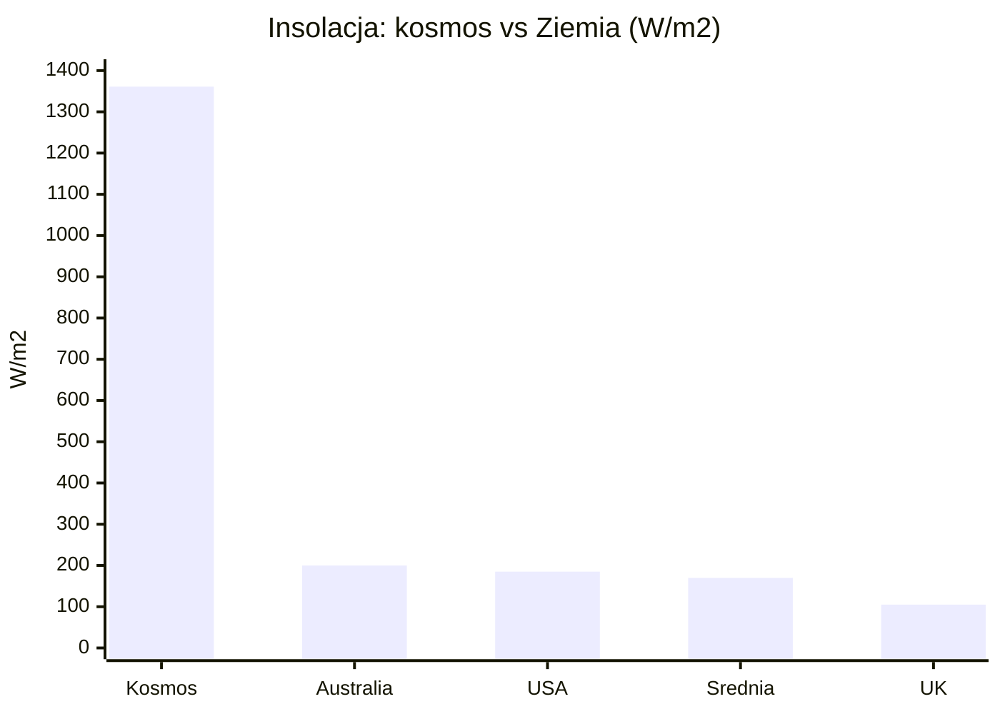
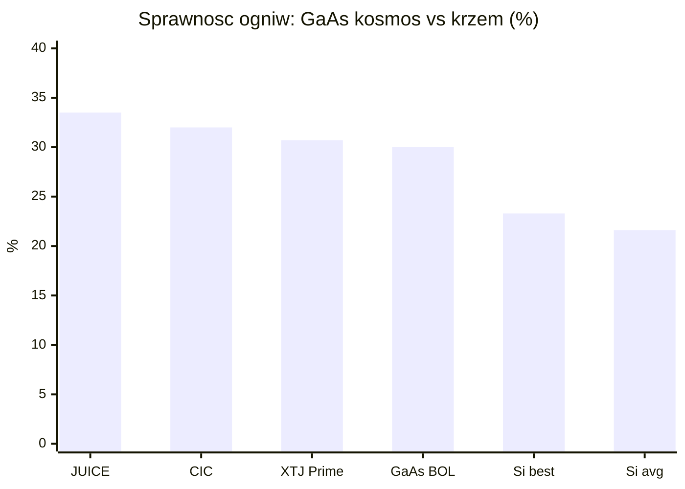
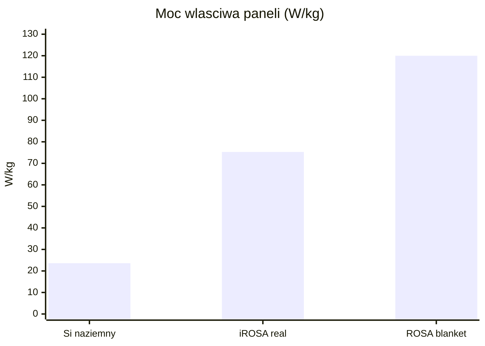
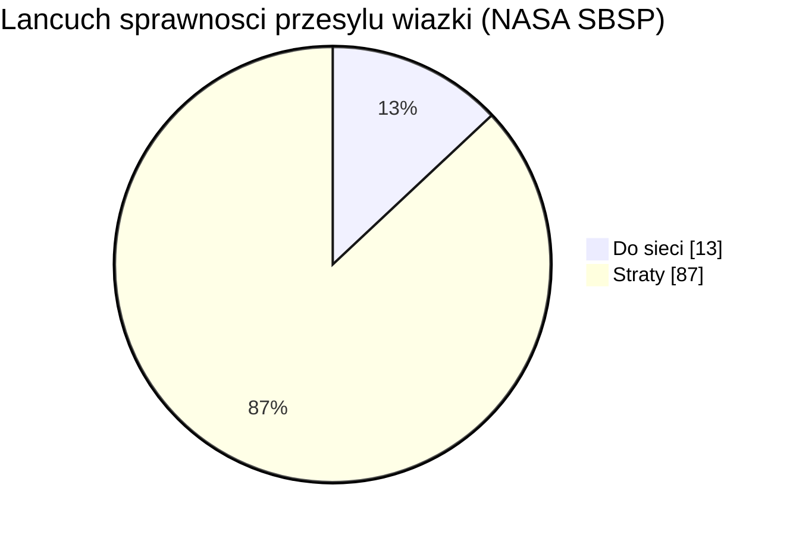

# Energetyka kosmiczna i fotowoltaika orbitalna

> Notatka raportu "Orbitalne centra danych". Kluczowe źródła: [źródło 1](https://earth.gsfc.nasa.gov/climate/projects/solar-irradiance/science), [źródło 2](https://www.worldenergy.org/assets/images/imported/2013/10/WER_2013_8_Solar_revised.pdf).

## W skrócie

Energia to fundament każdej tezy o orbitalnych centrach danych - i jednocześnie miejsce, gdzie najłatwiej o błąd liczbowy, który zmienia opłacalność o rząd wielkości. Na orbicie Słońce świeci niemal bez przerwy i znacznie mocniej niż na Ziemi (stała słoneczna 1361 <abbr title="jednostka gęstości mocy promieniowania, czyli ile watów przypada na każdy metr kwadratowy powierzchni.">W/m2</abbr> wobec ~170-200 W/m2 średniej naziemnej), a kosmiczne ogniwa GaAs mają ~30% sprawności wobec ~22% krzemu naziemnego - więc panel orbitalny produkuje z metra kwadratowego wielokrotnie więcej energii niż naziemny. Klucz dla inwestora: jeśli ktoś liczy powierzchnię i masę paneli "po naziemnemu" (np. ~20 <abbr title="moc właściwa, czyli ile watów daje każdy kilogram konstrukcji; im wyższa, tym lżejszy i tańszy w wyniesieniu jest system.">W/kg</abbr>, ~200 W/m2), otrzyma wynik 4-6x zawyżony i fałszywie uzna projekt za absurd. Realne nowoczesne macierze rolowane (<abbr title="elastyczne panele słoneczne w formie &quot;rolet&quot; rozwijanych na orbicie, lekkie i kompaktowe w transporcie.">ROSA</abbr>) deklarują 100-120 W/kg, choć cały statek schodzi do ~24-41 <abbr title="odwrotność mocy właściwej: ile kilogramów masy całego statku przypada na każdy kilowat mocy (im niżej, tym lepiej).">kg/kW</abbr> po doliczeniu baterii na zaćmienia, busów wysokonapięciowych i radiatorów. Trzecia oś to "energia jako usługa": startupy power beamingu (Star Catcher, Cowboy Space/Aetherflux, Space Solar, Virtus Solis) ścigają się o przesył wiązki mocy, gdzie sprawność całkowita to dziś wąskie gardło (~13% w modelu NASA, ~5% w obecnych systemach naziemnych) i decyduje o tym, kto na tym zarobi, a kto przepali kapitał.

<!-- spolki:related:start -->
## Spółki powiązane

> Notowane spółki produkujące podzespoły/technologie związane z tym tematem. Pełne omówienie: spółki, dla których nisza to >=33% przychodów; skrótowe: zdywersyfikowane konglomeraty. Zob. też [[Spolki/_slownik]] i [[Spolki/_widok-gpw-eu]].

**Producenci kluczowi (>=33% przychodów z niszy - omówienie pełne):**
- [[Spolki/rocket-lab|Rocket Lab Corporation (RKLB)]] - Launch (Electron/Neutron) + Space Systems: bus, ogniwa SolAero, komponenty
- [[Spolki/redwire|Redwire Corporation (RDW)]] - Panele ROSA, struktury rozkładane, montaż on-orbit, radiatory Q-Rad

**Pozostali dominujący gracze (nisza to ułamek przychodów - omówienie skrótowe):**
- [[Spolki/northrop-grumman|Northrop Grumman Corporation (NOC)]] - Serwis GEO (MEV/MRV), busy, radiatory, ogniwa
- [[Spolki/airbus|Airbus SE (AIR)]] 🇪🇺 - PV (Sparkwing), optyka (Tesat), busy, serwis (EU)
<!-- spolki:related:end -->

<!-- network:watki:start -->
## Powiązane wątki

> Mapa powiązań tematycznych - jak ten wątek łączy się z resztą raportu.

- [[03 - fizyka-orbitalna-orbity-i-operacje|Fizyka orbitalna]] - insolacja i cykle eklips zależą od geometrii orbity
- [[05 - chlodzenie-i-radiacyjne-odprowadzanie-ciepla|Chłodzenie]] - bilans mocy zamyka się dopiero z bilansem cieplnym (radiatory)
- [[09 - ekonomika-i-koszty-calkowite-tco|Ekonomika i TCO]] - koszt i masa systemu energetycznego wchodzą wprost do TCO
- [[12 - naziemny-bottleneck-energetyczny-i-sieciowy|Naziemny bottleneck]] - przewaga energetyczna orbity ma sens wobec niedoboru mocy na Ziemi
- [[14 - zrownowazony-rozwoj-i-srodowisko|Środowisko]] - carbon intensity solar orbital vs naziemny miks energetyczny
<!-- network:watki:end -->
## Stała słoneczna i przewaga insolacji orbitalnej

<abbr title="moc promieniowania Słońca padająca na metr kwadratowy powierzchni prostopadłej ponad atmosferą, około 1361 W/m2.">Stała słoneczna</abbr> - czyli moc promieniowania Słońca padająca na metr kwadratowy powierzchni prostopadłej, mierzona ponad atmosferą - wynosi według aktualnych pomiarów NASA 1361,6 ± 0,3 W/m2 (instrument TSIS-1, minimum słoneczne 2019) 🔵 [źródło](https://earth.gsfc.nasa.gov/climate/projects/solar-irradiance/science), zaokrąglane też do 1361 W/m2 🔵 [źródło](https://earth.gsfc.nasa.gov/climate/projects/solar-irradiance/science). Na Ziemi w grę wchodzą noc, chmury, kąt padania i straty atmosferyczne, więc średnia roczna insolacja na powierzchni poziomej to zaledwie ~170 W/m2 🔵 [źródło](https://www.worldenergy.org/assets/images/imported/2013/10/WER_2013_8_Solar_revised.pdf), a nawet w dobrych lokalizacjach ~200 W/m2 w Australii, 185 W/m2 w USA i tylko 105 W/m2 w Wielkiej Brytanii 🔵 [źródło](https://www.worldenergy.org/assets/images/imported/2013/10/WER_2013_8_Solar_revised.pdf). Stosunek tych wartości to ~6,8-8x na korzyść orbity 🔴 [proxy obliczeniowy autora raportu](https://earth.gsfc.nasa.gov/climate/projects/solar-irradiance/science). Implikacja dla inwestora: każdy metr kwadratowy panela na orbicie pracuje "za kilka" naziemnych - to właśnie ta przewaga ma rekompensować horrendalne koszty wyniesienia masy. Każda analiza, która tego nie uwzględni i liczy panele orbitalne naziemną insolacją, jest z gruntu wadliwa.

*Rys. 18 - Stała słoneczna na orbicie wobec naziemnej insolacji w wybranych lokalizacjach; przewaga orbity to rząd 7-8x. Dane: NASA GSFC; World Energy Council 2013.*

## Sprawność ogniw kosmicznych vs krzem naziemny

W kosmosie nie używa się tanich modułów krzemowych, lecz drogich, ale sprawnych ogniw wielozłączowych z arsenku galu (GaAs) - tzw. triple-junction, gdzie trzy warstwy półprzewodnika łapią różne zakresy widma. Producenci podają ~30% sprawności na początku życia (BOL, beginning of life) w standardowych warunkach kosmicznych <abbr title="standardowe warunki nasłonecznienia w kosmosie (bez filtrującej atmosfery), używane do podawania sprawności ogniw kosmicznych.">AM0</abbr> 🔵 [CAVU Aerospace](https://cavuaerospace.uk/space-solar-cells/30-triple-junction-gaas-solar-cell/), a często >30% 🔵 [satsearch/Kingsoon](https://satsearch.co/products/kingsoon-optoelectronics-solar-cell-chips). Ogniwa XTJ Prime od Spectrolab (Boeing) mają 30,7% i zasilają macierze iROSA stacji ISS 🔵 [Redwire IR](https://ir.redwirespace.com/news-events/press-releases/detail/61/redwire-successfully-delivers-second-pair-of-irosa-solar). Dla wymagających misji (ESA JUICE) sprawność sięga 33,5% przy BOL 🔵 [E3S/ESPC 2017](https://www.e3s-conferences.org/articles/e3sconf/abs/2017/04/e3sconf_espc2017_03011.html), a typowe ogniwa CIC podają 32% 🔵 [Mindway](https://www.mindwaybattery.com/products/triple-junction-gaas-solar-cics-40mm-x-80mm-space-grade-30-efficiency.html). Dla porównania naziemny krzem krystaliczny ma średnią ważoną sprawność 21,6% (Q4-2023), a najlepsze moduły 23,3% 🔵 [Fraunhofer ISE](https://www.ise.fraunhofer.de/content/dam/ise/de/documents/publications/studies/Photovoltaics-Report.pdf). Implikacja: ogniwo kosmiczne łapie ~30% z 1361 W/m2, naziemne ~22% z ~200 W/m2 - łączna przewaga energetyczna z metra kwadratowego sięga rzędu ~9-10x, co bezpośrednio przekłada się na mniejszą wymaganą powierzchnię (a więc masę i koszt wyniesienia).

*Rys. 19 - Sprawność kosmicznych ogniw GaAs (triple-junction, AM0/BOL) wobec krzemu naziemnego. Dane: E3S/ESPC 2017; Mindway; Redwire IR; CAVU; Fraunhofer ISE.*

## Gęstość masowa: W/kg, masa/m2 i przeliczenie "200 MW"

Najważniejszy parametr dla budżetu masy to moc właściwa (W/kg) - ile watów daje kilogram konstrukcji. Tu kryje się przepaść między technologiami. Naziemny moduł krzemowy "schudł" z ~8,5 W/kg na początku lat 2000 do 23,6 W/kg dziś 🟠 [pv-magazine](https://www.pv-magazine.com/2026/04/08/solar-keep-slimming-down-while-power-rises/). Kosmiczne macierze rolowane (ROSA - Roll-Out Solar Array, elastyczne "rolety" PV rozwijane na orbicie) Redwire deklarują 100-120 W/kg na poziomie samego "koca" (blanket) 🔵 [Redwire flysheet](https://redwirespace.com/wp-content/uploads/2023/06/redwire-roll-out-solar-array-flysheet.pdf), gęstość pakowania ~40 kW/m3 🔵 [Redwire flysheet](https://redwirespace.com/wp-content/uploads/2023/06/redwire-roll-out-solar-array-flysheet.pdf) i pracę w zakresie napięć od 12 V do >300 V 🔵 [Redwire flysheet](https://redwirespace.com/wp-content/uploads/2023/06/redwire-roll-out-solar-array-flysheet.pdf).

Realna wartość zmierzona dla iROSA na ISS jest jednak niższa: każdy moduł waży ~340 kg, rozkłada się do 6 m x 19,2 m i osiąga 75,3 W/kg 🔵 [ScienceDirect/Yan 2025](https://www.sciencedirect.com/science/article/pii/S2950104025000161); to ~115,2 m2 powierzchni 🔵 [proxy z wymiarów](https://www.sciencedirect.com/science/article/pii/S2950104025000161), czyli masa/m2 ≈ 2,95 kg/m2 (proxy: 340 kg / 115,2 m2). Każda macierz iROSA dostarcza ponad 28 kW (w innej wersji Redwire ">20 kW") 🔵 [Redwire IR](https://ir.redwirespace.com/news-events/press-releases/detail/61/redwire-successfully-delivers-second-pair-of-irosa-solar). Skrajnie lekkie ogniwa cienkowarstwowe (CdTe na poliimidzie) ważą poniżej 0,7 kg/m2 przy ~10% sprawności i ~2 kW na węzeł 🔵 [arXiv 2512.09044](https://arxiv.org/pdf/2512.09044). Implikacja: różnica między 23,6 W/kg (krzem naziemny) a 75-120 W/kg (kosmos) to mnożnik 3-5x na masie - kluczowy, bo wyniesienie masy to gros kosztu.

![[assets/y03-1-iss065e125924.jpg]]
*Rys. 20 - Energetyka: iss065e125924. Źródło: NASA, licencja: public domain.*
#grafika #energetyka-kosmiczna-i-fotowoltaika-orbitalna #panele-sloneczne #ROSA

![[assets/y03-2-iss065e144542.jpg]]
*Rys. 21 - Energetyka: iss065e144542. Źródło: NASA, licencja: public domain.*
#grafika #energetyka-kosmiczna-i-fotowoltaika-orbitalna #panele-sloneczne #ROSA

*Rys. 22 - Moc właściwa: krzem naziemny wobec kosmicznych macierzy rolowanych (zmierzone iROSA i deklarowany blanket ROSA); mnożnik 3-5x na masie. Dane: pv-magazine; ScienceDirect/Yan 2025; Redwire flysheet.*

Tezę z polskiego artykułu sceptycznego ("200 MW = 80 ha = 8 tys. ton") da się przeliczyć tylko proxy, bo oryginał nie został zlokalizowany publicznie 🔴 [brak dostępnego oryginału - liczby z instrukcji](https://polskieradio24.pl/artykul/3511306,orbitalne-centra-danych-dla-ai-firmy-patrza-w-niebo-naukowcy-przestrzegaja). Kontekst medialny: Thales Alenia Space mówi o konstelacji 13 satelitów składanych w farmę 200 x 80 m dającą ~10 MW mocy obliczeniowej 🟠 [Polskie Radio 24/PAP](https://polskieradio24.pl/artykul/3511306,orbitalne-centra-danych-dla-ai-firmy-patrza-w-niebo-naukowcy-przestrzegaja), a próg "sensowności" dla narastającego popytu AI to ~200 MW 🟠 [Polskie Radio 24/PAP](https://polskieradio24.pl/artykul/3511306,orbitalne-centra-danych-dla-ai-firmy-patrza-w-niebo-naukowcy-przestrzegaja). Proxy powierzchni: przy 1361 W/m2 i 30% sprawności 200 MW wymaga ~490 tys. m2 ≈ 49 ha; po stratach temperaturowych/kątowych (~25%) ~65 ha; po marginie eklipsowym ~38% ~90 ha - wartość 80 ha mieści się w tym zakresie 🔴 [proxy obliczeniowy](https://earth.gsfc.nasa.gov/climate/projects/solar-irradiance/science). Proxy masy: same panele ROSA przy 100-120 W/kg to ~1,7-2,0 tys. t dla 200 MW, ale modele całych statków ODC (Star Catcher ~41 kg/kW -> ~8,2 tys. t; McCalip ~30 kg/kW -> ~6 tys. t) wskazują, że 8 tys. ton to wiarygodna estymata masy całkowitej na orbitę, a nie tylko paneli 🔴 [proxy obliczeniowy](https://www.star-catcher.com/news/the-orbital-data-center-power-problem-and-how-to-solve-it). Dla porównania McCalip podaje dla 1 GW orbital solar: 29,4 mln kg masy do LEO 🟠 [McCalip](https://andrewmccalip.com/space-datacenters), 51,10 USD/W kosztu 🟠 [McCalip](https://andrewmccalip.com/space-datacenters) i <abbr title="uśredniony koszt energii w całym cyklu życia instalacji (USD za kWh lub MWh), kluczowa miara opłacalności.">LCOE</abbr> 1167 USD/MWh 🟠 [McCalip](https://andrewmccalip.com/space-datacenters). Implikacja: liczby "80 ha / 8 tys. ton" same w sobie nie są niedorzeczne - błędem jest dopiero ich wyprowadzanie z założeń naziemnych (patrz Kontrowersje).

## Degradacja PV od promieniowania: BOL vs EOL

Na orbicie ogniwa starzeją się szybciej niż na Ziemi, bo bombardują je naładowane cząstki (pasy Van Allena, wiatr słoneczny). Producent GaAs podaje, że po dawce 1x10^15 e/cm2 retencja mocy spada do 0,84 🔵 [CAVU](https://cavuaerospace.uk/space-solar-cells/30-triple-junction-gaas-solar-cell/), prądu do 0,93 🔵 [CAVU](https://cavuaerospace.uk/space-solar-cells/30-triple-junction-gaas-solar-cell/) i napięcia do 0,90 🔵 [CAVU](https://cavuaerospace.uk/space-solar-cells/30-triple-junction-gaas-solar-cell/) (BOL - początek życia, EOL - koniec życia). Tempa rocznej degradacji rozjeżdżają się mocno w literaturze: 2,66%/rok dla LEO 🔵 [ResearchGate](https://www.researchgate.net/publication/331212559_Optimal_Orbit_Parameters_for_Power_Subsystem_of_LEO_Satellites), 0,275%/rok dla GaAs i 0,375%/rok dla krzemu 🔵 [SJSU/Raman](https://www.sjsu.edu/ae/docs/project-thesis/Subhiksha.Raman-S21.pdf), 0,92%/rok (87% przez 15 lat) 🔵 [core.ac.uk](https://core.ac.uk/download/234925230.pdf), a analityk branżowy szacuje 200-300 punktów bazowych (2-3%) rocznie zależnie od orbity 🟠 [Per Aspera](https://peraspera.us/realities-of-space-based-compute/). Sprawność JUICE startuje od 33,5% BOL 🔵 [E3S](https://www.e3s-conferences.org/articles/e3sconf/abs/2017/04/e3sconf_espc2017_03011.html), a jednej liczby EOL źródło nie podaje - jedynie mechanizm, że spadek mocy maksymalnej Pmp jest silniejszy niż prądu Isc i napięcia Voc 🔵 [E3S](https://www.e3s-conferences.org/articles/e3sconf/abs/2017/04/e3sconf_espc2017_03011.html). Uniwersalnej wartości degradacji NIE UJAWNIONO - zależy od orbity, osłony (coverglass) i technologii; w LEO typowo 1-3%/rok 🔴 [proxy z literatury](https://www.sjsu.edu/ae/docs/project-thesis/Subhiksha.Raman-S21.pdf). Implikacja: degradacja bezpośrednio skraca żywotność farmy i podnosi LCOE - inwestor musi pytać o konkretną orbitę i osłonę, bo różnica między 0,28% a 2,66% rocznie to różnica między 15-letnim a kilkuletnim aktywem.

## Bilans mocy, magazynowanie na zaćmienia i busy wysokonapięciowe

W LEO satelita co ~90 minut wpada w cień Ziemi - ciemność trwa ~25-35% orbity 🟠 [Per Aspera](https://peraspera.us/realities-of-space-based-compute/), czyli ~30 min na okrążenie 🟠 [Per Aspera](https://peraspera.us/realities-of-space-based-compute/); ISS używa dużych baterii na swoją ~35-minutową "noc" 🟠 [Per Aspera](https://peraspera.us/realities-of-space-based-compute/). W ujęciu dobowym obiekt w LEO ma światło ~60% czasu 🟠 [SemiAnalysis](https://newsletter.semianalysis.com/p/to-boldly-go-the-case-for-space-datacenters), a orbita synchroniczna ze Słońcem (SSO) ogranicza zaćmienie do ~35 min/dobę 🟠 [SemiAnalysis](https://newsletter.semianalysis.com/p/to-boldly-go-the-case-for-space-datacenters). NASA podaje dla LEO głębokość rozładowania baterii (<abbr title="głębokość rozładowania baterii, czyli jaki procent jej pojemności jest zużywany w jednym cyklu.">DOD</abbr>) ~30-40% 🔵 [NASA NTRS](https://ntrs.nasa.gov/api/citations/20070018197/downloads/20070018197.pdf), cykl rozładowania 30/36 min 🔵 [NASA NTRS](https://ntrs.nasa.gov/api/citations/20070018197/downloads/20070018197.pdf) i ładowania 55/60 min 🔵 [NASA NTRS](https://ntrs.nasa.gov/api/citations/20070018197/downloads/20070018197.pdf). Baterie litowe klasy kosmicznej magazynują ~100 Wh/kg 🟠 [Per Aspera](https://peraspera.us/realities-of-space-based-compute/) - to ciężki, drogi balast. Elegancki obejście: orbita "świtu-zmierzchu" (DDSS) na ~1600 km i nachyleniu 102,5 stopnia eliminuje potrzebę magazynowania energii 🔵 [arXiv 2512.09044](https://arxiv.org/pdf/2512.09044), redukując baterie do zera i unikając cykli termicznych 🔵 [arXiv 2512.09044](https://arxiv.org/pdf/2512.09044). Implikacja: każdy procent czasu w cieniu trzeba "przykryć" bateriami, które dorzucają ~10 kg/kW masy (patrz niżej) - dobór orbity to dźwignia kosztowa, a nie detal inżynierski.

Drugie wąskie gardło to elektryka wysokonapięciowa w próżni. Centrum danych potrzebuje setek kW-MW, co wymusza wysokie napięcia busa (300-1000 V) 🔵 [NASA GRC](https://ntrs.nasa.gov/api/citations/20030022705/downloads/20030022705.pdf), ale w plazmie orbitalnej grozi to łukowaniem (arcing) - wyładowaniami niszczącymi panele. Już od wprowadzenia systemów 100 V w późnych latach 80. obserwowano łuki uszkadzające satelity 🔵 [NASA GRC](https://ntrs.nasa.gov/api/citations/20030022705/downloads/20030022705.pdf); progi wyzwolenia łuku to -100 do -250 V 🔵 [NASA GRC](https://ntrs.nasa.gov/api/citations/20030022705/downloads/20030022705.pdf), łuki obserwowano nawet przy -75 V 🔵 [NASA GRC](https://ntrs.nasa.gov/api/citations/20030022705/downloads/20030022705.pdf), a łuki podtrzymywane mogą wystąpić już od 40 V przy 1 A 🔵 [NASA GRC](https://ntrs.nasa.gov/api/citations/20030022705/downloads/20030022705.pdf). Z drugiej strony pojedyncza duża szyba osłonowa (coverglass) odgradzająca panel od plazmy pozwala wytrzymać nawet -1100 V 🔵 [NASA GRC](https://ntrs.nasa.gov/api/citations/20030022705/downloads/20030022705.pdf). Implikacja: skalowanie napięcia to ostry kompromis - wyższe napięcie zmniejsza straty i masę kabli, ale podnosi ryzyko awarii łukowej, co jest realnym ryzykiem niezawodności (i ubezpieczeniowym) dla inwestora.

## Power beaming i "energia jako usługa": kto walczy o ten rynek

Najgorętszy segment to firmy oferujące energię jako usługę - zamiast każdy satelita budował własne wielkie panele, dostawca "doświetla" je wiązką. Star Catcher buduje orbitalną sieć energetyczną bezprzewodowo przesyłającą moc do istniejących paneli, dając im do 10x więcej mocy 🔵 [Star Catcher](https://www.star-catcher.com/news/the-orbital-data-center-power-problem-and-how-to-solve-it). Przykład: 20 MW ODC łatwo osiągalne w konfiguracji 81 satelitów po ~250 kW każdy 🔵 [Star Catcher](https://www.star-catcher.com/news/the-orbital-data-center-power-problem-and-how-to-solve-it). Bez wiązki 250 kW wymagałoby 1100 m2 paneli na statek, a z 10x fluxem tylko 110 m2 🔵 [Star Catcher](https://www.star-catcher.com/news/the-orbital-data-center-power-problem-and-how-to-solve-it). To redukuje masę: 2x flux obniża masę ODC o ponad 50% 🔵 [Star Catcher](https://www.star-catcher.com/news/the-orbital-data-center-power-problem-and-how-to-solve-it), a 10x flux schodzi do ~37% masy pierwotnej 🔵 [Star Catcher](https://www.star-catcher.com/news/the-orbital-data-center-power-problem-and-how-to-solve-it), co daje "do 3,5 centrum danych za cenę jednego" 🔵 [Star Catcher](https://www.star-catcher.com/news/the-orbital-data-center-power-problem-and-how-to-solve-it). Star Catcher modeluje <abbr title="wskaźnik efektywności energetycznej centrum danych: stosunek całej zużytej energii do energii samych serwerów.">PUE</abbr> 1,3 🔵 [Star Catcher](https://www.star-catcher.com/news/the-orbital-data-center-power-problem-and-how-to-solve-it), system termiczny ~2,5 kg/kW 🔵 [Star Catcher](https://www.star-catcher.com/news/the-orbital-data-center-power-problem-and-how-to-solve-it) i mniejszą powierzchnię paneli redukującą ryzyko kolizji o 30-85% 🔵 [Star Catcher](https://www.star-catcher.com/news/the-orbital-data-center-power-problem-and-how-to-solve-it). Finansowo zebrali 65 mln USD Series A 🟠 [The Engineer](https://www.theengineer.co.uk/content/news/floridas-star-catcher-raises-65-million-for-space-based-power-grid) (łącznie 88 mln USD) 🟠 [The Engineer](https://www.theengineer.co.uk/content/news/floridas-star-catcher-raises-65-million-for-space-based-power-grid), w 2025 dostarczyli ponad 1,1 kW mocy elektrycznej laserami do komercyjnych paneli na KSC 🟠 [pv-magazine-usa](https://pv-magazine-usa.com/2026/06/08/star-catcher-is-building-a-space-based-solar-grid-for-orbital-infrastructure/), podpisali 7 umów PPA 🟠 [SpaceQ](https://spaceq.ca/star-catcher-secures-us65m-series-a-to-develop-orbital-power-grid/) i deklarują pipeline >3 mld USD rocznego przychodu powtarzalnego 🟠 [SpaceQ](https://spaceq.ca/star-catcher-secures-us65m-series-a-to-develop-orbital-power-grid/), z konstelacją na ~1000 mil 🟠 [pv-magazine-usa](https://pv-magazine-usa.com/2026/06/08/star-catcher-is-building-a-space-based-solar-grid-for-orbital-infrastructure/) i adaptacyjnymi lustrami beamującymi do 50 satelitów naraz 🟠 [The Engineer](https://www.theengineer.co.uk/content/news/floridas-star-catcher-raises-65-million-for-space-based-power-grid). Bez wiązki gigawatowe centra danych wymagałyby >600 boisk piłkarskich paneli 🔵 [Star Catcher](https://www.star-catcher.com/news/the-orbital-data-center-power-problem-and-how-to-solve-it). Implikacja: jeśli power beaming zadziała w skali, radykalnie zmienia <abbr title="całkowity koszt posiadania, suma wszystkich kosztów budowy i eksploatacji aktywa przez cały okres jego życia.">TCO</abbr> - to opcja na "wygranego biorącego wszystko" lub na spalenie kapitału, jeśli sprawność wiązki rozczaruje.

Cowboy Space (dawniej Aetherflux, założona w 2024 przez współzałożyciela Robinhooda) zamknęła Series B na 275 mln USD przy wycenie post-money 2 mld USD 🟠 [TechCrunch](https://techcrunch.com/2026/05/11/there-arent-enough-rockets-for-space-data-centers-cowboy-space-raised-275-million-to-build-them/), po wcześniejszych 80 mln USD 🟠 [TechCrunch](https://techcrunch.com/2026/05/11/there-arent-enough-rockets-for-space-data-centers-cowboy-space-raised-275-million-to-build-them/) (łącznie ~355 mln USD finansowania zewnętrznego) 🔴 [datagrom](https://www.datagrom.com/ai-news/cowboy-space-raises-275m-for-orbital-ai-data-centers-4ee4ce30). Każdy satelita ma ważyć 20 000-25 000 kg i dawać 1 MW mocy dla niespełna 800 GPU 🟠 [TechCrunch](https://techcrunch.com/2026/05/11/there-arent-enough-rockets-for-space-data-centers-cowboy-space-raised-275-million-to-build-them/), z pierwszym satelitą power beamingu jeszcze w 2026 🟠 [Evertiq](https://evertiq.com/news/2026-05-22-cowboy-space-raises-275m-to-advance-orbital-data-centers) i własną rakietą przed końcem 2028 🟠 [TechCrunch](https://techcrunch.com/2026/05/11/there-arent-enough-rockets-for-space-data-centers-cowboy-space-raised-275-million-to-build-them/); pierwszy moduł centrum danych (projekt Galactic Brain) ma trafić na orbitę w I kwartale 2027 z użyciem laserów podczerwonych 🔴 [tech.wp.pl](https://tech.wp.pl/amerykanska-firma-zbuduje-centra-danych-na-orbicie-niezbedne-dla-ai,7231249826438080a). Firma współpracuje z NVIDIA przy modułach Space-1 Vera Rubin 🟠 [Evertiq](https://evertiq.com/news/2026-05-22-cowboy-space-raises-275m-to-advance-orbital-data-centers). Sprawność beamingu Cowboy Space NIE UJAWNIONA 🟠 [TechCrunch](https://techcrunch.com/2026/05/11/there-arent-enough-rockets-for-space-data-centers-cowboy-space-raised-275-million-to-build-them/).

Brytyjski Space Solar celuje w przesył energii z kosmosu na Ziemię: pierwsza elektrownia 30 MW do 2030 dla Reykjavik Energy (Islandia), we współpracy z Transition Labs 🔵 [Space Solar](https://www.spacesolar.co.uk/space-solar-and-transition-labs-to-deliver-space-based-solar-power-to-iceland-by-2030/), skalowanie do GW do 2036 🔵 [Space Solar](https://www.spacesolar.co.uk/space-solar-and-transition-labs-to-deliver-space-based-solar-power-to-iceland-by-2030/) i 180 MW w 2033 🟠 [SatelliteToday](https://www.satellitetoday.com/space-economy/2025/03/28/space-based-solar-power-will-fuel-transition-to-net-zero-space-solar-ceo-says/). System 30 MW ma kosztować ~400 mln USD 🟠 [SatelliteToday](https://www.satellitetoday.com/space-economy/2025/03/28/space-based-solar-power-will-fuel-transition-to-net-zero-space-solar-ceo-says/), przyszłe do 2,25 mld USD 🟠 [SatelliteToday](https://www.satellitetoday.com/space-economy/2025/03/28/space-based-solar-power-will-fuel-transition-to-net-zero-space-solar-ceo-says/). Demonstrator to 64 t 🔴 [NSS/OSA](https://osa.nss.org/Update2411.pdf), zasili ~3000 domów 🔴 [NSS/OSA](https://osa.nss.org/Update2411.pdf). Technologia przesyłu dopracowana przez 5 mln GBP badań 🔵 [Space Solar](https://www.spacesolar.co.uk/space-solar-and-transition-labs-to-deliver-space-based-solar-power-to-iceland-by-2030/), a projekt CASSiDi trwał 18 mies. i kosztował 1,7 mln GBP (~2,26 mln USD) 🟠 [SatelliteToday](https://www.satellitetoday.com/space-economy/2025/04/28/space-solar-completes-design-study-for-cassiopeia-satellite/); przesył wiązką radiową wysokiej częstotliwości, sprawność NIE UJAWNIONA 🔵 [Space Solar](https://www.spacesolar.co.uk/space-solar-and-transition-labs-to-deliver-space-based-solar-power-to-iceland-by-2030/).

Virtus Solis (z Orbital Composites) stawia na modularne kafelki: heksagon 1,65 m 🔵 [Virtus Solis](https://www.virtussolis.space/blog/virtus-solis-space-based-solar-and-power-beaming-white-paper-2023) dający 1 kW na ziemię 🟠 [NextBigFuture](https://www.nextbigfuture.com/2024/02/comparison-of-current-space-based-solar-power-proposals.html), architektura skalowalna od 100 MW do 20 GW 🔵 [Virtus Solis](https://www.virtussolis.space/blog/virtus-solis-space-based-solar-and-power-beaming-white-paper-2023), przesył RF 10 GHz 🔵 [Virtus Solis](https://www.virtussolis.space/blog/virtus-solis-space-based-solar-and-power-beaming-white-paper-2023). Demo naziemne: 68 W przez 100 m za pomocą 6400 anten 🔵 [Virtus Solis](https://www.virtussolis.space/blog/virtus-solis-space-based-solar-and-power-beaming-white-paper-2023). Finansowanie ~2 mln USD z ARPA-E 🟠 [Space Frontier](https://www.spacefrontier.org/sbsp-company-reports/virtus-solis), pilotaż 2027-2028 🟠 [Space Frontier](https://www.spacefrontier.org/sbsp-company-reports/virtus-solis), pierwszy system operacyjny 2030 🟠 [Space Frontier](https://www.spacefrontier.org/sbsp-company-reports/virtus-solis), cel ceny 30 USD/MWh 🟠 [Space Frontier](https://www.spacefrontier.org/sbsp-company-reports/virtus-solis), rektenna o średnicy 2 km 🟠 [Space Frontier](https://www.spacefrontier.org/sbsp-company-reports/virtus-solis). Demonstrator 100 kW (koszt 25 mln USD), z czego na ziemię dotrze tylko ~4 kW 🟠 [Engineering.com](https://www.engineering.com/how-virtus-solis-plans-to-build-a-solar-power-plant-in-space/) - co obnaża skalę strat przesyłu. Demo z Orbital Composites: ponad 1 kW beamingu do 2027, klasa MW do 2030 🟠 [PayloadSpace](https://payloadspace.com/orbital-composites-virtus-solis-team-on-space-based-solar-power-station/). Implikacja inwestorska: fakt, że z 100 kW dociera 4 kW (~4%), pokazuje, że sprawność end-to-end to dziś główny hamulec ekonomii i wszelkie deklaracje 30 USD/MWh trzeba ważyć tym ryzykiem.

## Sprawność przesyłu wiązki - benchmark i wpływ na TCO

Łańcuch strat jest długi. Model NASA SBSP rozkłada go: ogniwo 35% 🔵 [NASA SBSP](https://www.nasa.gov/wp-content/uploads/2024/01/otps-sbsp-report-final-tagged-approved-1-8-24-tagged-v2.pdf), konwersja w kosmosie DC-DC 90% i DC-RF 70% 🔵 [NASA SBSP](https://www.nasa.gov/wp-content/uploads/2024/01/otps-sbsp-report-final-tagged-approved-1-8-24-tagged-v2.pdf), emisja anteny 90% 🔵 [NASA SBSP](https://www.nasa.gov/wp-content/uploads/2024/01/otps-sbsp-report-final-tagged-approved-1-8-24-tagged-v2.pdf), przejście atmosferyczne 98% 🔵 [NASA SBSP](https://www.nasa.gov/wp-content/uploads/2024/01/otps-sbsp-report-final-tagged-approved-1-8-24-tagged-v2.pdf), zbieranie wiązki 95% 🔵 [NASA SBSP](https://www.nasa.gov/wp-content/uploads/2024/01/otps-sbsp-report-final-tagged-approved-1-8-24-tagged-v2.pdf), rektenna 78% 🔵 [NASA SBSP](https://www.nasa.gov/wp-content/uploads/2024/01/otps-sbsp-report-final-tagged-approved-1-8-24-tagged-v2.pdf), DC-DC na ziemi 90% 🔵 [NASA SBSP](https://www.nasa.gov/wp-content/uploads/2024/01/otps-sbsp-report-final-tagged-approved-1-8-24-tagged-v2.pdf) - co daje ~13% energii padającego Słońca trafiające do sieci 🔵 [NASA SBSP](https://www.nasa.gov/wp-content/uploads/2024/01/otps-sbsp-report-final-tagged-approved-1-8-24-tagged-v2.pdf). Eksperyment orbitalny MAPLE: sprawność rektenny 40% względem mocy padającej na aperturę 🔵 [arXiv MAPLE](https://arxiv.org/html/2401.15267v2), moc szczytowa 231 mW (ścianka) i 251 mW (czoło) 🔵 [arXiv MAPLE](https://arxiv.org/html/2401.15267v2), częstotliwość 9,984 GHz 🔵 [arXiv MAPLE](https://arxiv.org/html/2401.15267v2), wysokość 527 km 🔵 [arXiv MAPLE](https://arxiv.org/html/2401.15267v2), strata wolnoprzestrzenna 167 dB 🔵 [arXiv MAPLE](https://arxiv.org/html/2401.15267v2). Historyczny rekord: NASA Goldstone 1975 przesłała 30 kW z 82% sprawnością 🟠 [Sirotin Intelligence](https://www.sirotinintelligence.com/space-solar-martin-soltau-interview/). Naziemne demonstracje: DARPA POWER 800 W na 8,6 km laserem 🔴 [Energy Solutions](https://energy-solutions.co/articles/sub/wireless-power-transmission-long-distance-2026), US Army Scope-M 1,6 kW przy 95% sprawności na 1 km mikrofalą 🔴 [Energy Solutions](https://energy-solutions.co/articles/sub/wireless-power-transmission-long-distance-2026), NTT/MHI 15% laserem na 1 km 🔴 [Energy Solutions](https://energy-solutions.co/articles/sub/wireless-power-transmission-long-distance-2026). Realistyczny obraz: obecne systemy ~5% sprawności, do praktyki potrzeba ~20% 🟠 [Yahoo Tech](https://www.yahoo.com/tech/spacexs-starship-could-help-start-100029185.html). Sprawność space-to-space Star Catcher i Cowboy Space pozostają NIE UJAWNIONE 🔵 [Star Catcher](https://www.star-catcher.com/news/the-orbital-data-center-power-problem-and-how-to-solve-it).

*Rys. 23 - Udział energii padającego Słońca docierający do sieci po pełnym łańcuchu strat przesyłu wiązki w modelu NASA SBSP. Dane: NASA SBSP report 2024.*

Wpływ na TCO widać w modelu NASA: koszt życia energii (LCOE) bazowo 0,61 USD/kWh (RD1) i 1,59 USD/kWh (RD2) 🔵 [NASA SBSP](https://www.nasa.gov/wp-content/uploads/2024/01/otps-sbsp-report-final-tagged-approved-1-8-24-tagged-v2.pdf), gdzie wyniesienie to 71% (RD1) i 77% (RD2) kosztu 🔵 [NASA SBSP](https://www.nasa.gov/wp-content/uploads/2024/01/otps-sbsp-report-final-tagged-approved-1-8-24-tagged-v2.pdf) - bo trzeba 23 216 startów dla 5,9 mln kg (RD1) i 3960 dla 10 mln kg (RD2) 🔵 [NASA SBSP](https://www.nasa.gov/wp-content/uploads/2024/01/otps-sbsp-report-final-tagged-approved-1-8-24-tagged-v2.pdf). Przy korzystnych założeniach (start 500 USD/kg, 50 mln USD/lot, 15 lat życia) LCOE spada do 0,03 USD/kWh (RD1) i 0,08 USD/kWh (RD2) 🔵 [NASA SBSP](https://www.nasa.gov/wp-content/uploads/2024/01/otps-sbsp-report-final-tagged-approved-1-8-24-tagged-v2.pdf). Powierzchnia paneli to 11,5 km2 (RD1) i 19 km2 (RD2) 🔵 [NASA SBSP](https://www.nasa.gov/wp-content/uploads/2024/01/otps-sbsp-report-final-tagged-approved-1-8-24-tagged-v2.pdf), emisyjność 26-40 gCO2eq/kWh 🔵 [NASA SBSP](https://www.nasa.gov/wp-content/uploads/2024/01/otps-sbsp-report-final-tagged-approved-1-8-24-tagged-v2.pdf). Implikacja: ekonomia stoi i upada na koszcie wyniesienia - 20-krotny spread LCOE (0,03 vs 0,61 USD/kWh) zależy głównie od tego, czy starty potanieją tak, jak zakładają optymiści.

## Kontrowersje

**Główny błąd liczbowy artykułu sceptycznego: założenia naziemne czy orbitalne?**

Oryginał polskiego artykułu sceptycznego nie został zlokalizowany publicznie, co uniemożliwia bezpośrednią weryfikację jego założeń 🔴 [brak dostępu do oryginału](https://polskieradio24.pl/artykul/3511306,orbitalne-centra-danych-dla-ai-firmy-patrza-w-niebo-naukowcy-przestrzegaja). Strona "krytyczna" (jeśli liczono naziemnie): moc właściwa naziemnego krzemu to ~23,6 W/kg 🟠 [pv-magazine](https://www.pv-magazine.com/2026/04/08/solar-keep-slimming-down-while-power-rises/), a insolacja ~170-200 W/m2 🔵 [World Energy Council](https://www.worldenergy.org/assets/images/imported/2013/10/WER_2013_8_Solar_revised.pdf) - przy takich liczbach 200 MW faktycznie wymagałoby ogromnej powierzchni i masy. Strona "orbitalna": ROSA daje 100-120 W/kg 🔵 [Redwire](https://redwirespace.com/wp-content/uploads/2023/06/redwire-roll-out-solar-array-flysheet.pdf), realne iROSA 75,3 W/kg 🔵 [ScienceDirect](https://www.sciencedirect.com/science/article/pii/S2950104025000161), a insolacja 1361 W/m2 🔵 [NASA](https://earth.gsfc.nasa.gov/climate/projects/solar-irradiance/science) przy 30% sprawności. Wniosek: jeśli autor policzył masę przy ~20 W/kg zamiast ~75-120 W/kg, wynik byłby 4-6x przeszacowany; przy parametrach orbitalnych powierzchnia dla 200 MW to rząd 50-90 ha, a nie setki ha 🔴 [proxy obliczeniowy](https://redwirespace.com/wp-content/uploads/2023/06/redwire-roll-out-solar-array-flysheet.pdf). Rozbieżności nie da się jednoznacznie rozstrzygnąć bez oryginału - obie strony są spójne wewnętrznie, różnią się tylko wyborem zestawu założeń.

**Spór o realne W/kg roll-out arrays**

Strona producencka: Redwire deklaruje 100-120 W/kg dla blanketu ROSA 🔵 [Redwire](https://redwirespace.com/wp-content/uploads/2023/06/redwire-roll-out-solar-array-flysheet.pdf), a Star Catcher cytuje ~10 kg/kW (=100 W/kg) dla najnowocześniejszych macierzy 🟠 [Star Catcher](https://www.star-catcher.com/news/the-orbital-data-center-power-problem-and-how-to-solve-it). Strona "rzeczywista": zmierzone iROSA to tylko 75,3 W/kg 🔵 [ScienceDirect](https://www.sciencedirect.com/science/article/pii/S2950104025000161), a cały statek ODC schodzi do 41,1 kg/kW (=24,3 W/kg) 🟠 [Star Catcher](https://www.star-catcher.com/news/the-orbital-data-center-power-problem-and-how-to-solve-it), z czego system elektryczny to ~23,8 kg/kW 🟠 [Star Catcher](https://www.star-catcher.com/news/the-orbital-data-center-power-problem-and-how-to-solve-it) (macierze ~13,8 kg/kW po marginie eklipsowym +38% 🟠 [Star Catcher](https://www.star-catcher.com/news/the-orbital-data-center-power-problem-and-how-to-solve-it), baterie ~10 kg/kW 🟠 [Star Catcher](https://www.star-catcher.com/news/the-orbital-data-center-power-problem-and-how-to-solve-it)). Starlink v2 Mini-O to ~30-40 kg/kW 🟠 [Star Catcher](https://www.star-catcher.com/news/the-orbital-data-center-power-problem-and-how-to-solve-it). Wniosek: W/kg blanketu nie przekłada się 1:1 na W/kg statku - spór dotyczy tego, którą warstwę liczy się w analizie. Dla inwestora to ostrzeżenie: deklaracje "100+ W/kg" odnoszą się do samego koca, a budżet masy całego aktywa jest 3-4x gorszy.

**Spór o tempo degradacji ogniw**

Strona "szybkiej degradacji": 2,66%/rok dla LEO 🔵 [ResearchGate](https://www.researchgate.net/publication/331212559_Optimal_Orbit_Parameters_for_Power_Subsystem_of_LEO_Satellites) i 200-300 bp/rok 🟠 [Per Aspera](https://peraspera.us/realities-of-space-based-compute/). Strona "wolnej degradacji": 0,92%/rok 🔵 [core.ac.uk](https://core.ac.uk/download/234925230.pdf) oraz 0,275%/rok dla GaAs 🔵 [SJSU](https://www.sjsu.edu/ae/docs/project-thesis/Subhiksha.Raman-S21.pdf). Wniosek: tempo zależy silnie od orbity (pasy Van Allena) i osłony (coverglass) - w LEO typowo 1-3%/rok, w GEO i z grubą szybą mniej; nie ma jednej obowiązującej liczby, co jest realnym źródłem sporu o żywotność orbitalnych farm PV i tym samym o LCOE. Rozbieżność jest realna i nieusunięta - różne źródła mierzą różne orbity i konfiguracje osłon.

## Słowniczek pojęć

- **Stała słoneczna** - moc promieniowania Słońca padająca na metr kwadratowy powierzchni prostopadłej ponad atmosferą, około 1361 W/m2.
- **Insolacja** - średnia ilość energii słonecznej docierająca do danej powierzchni; na Ziemi mocno obniżona przez noc, chmury i atmosferę (~170-200 W/m2).
- **W/m2 (wat na metr kwadratowy)** - jednostka gęstości mocy promieniowania, czyli ile watów przypada na każdy metr kwadratowy powierzchni.
- **W/kg (wat na kilogram)** - moc właściwa, czyli ile watów daje każdy kilogram konstrukcji; im wyższa, tym lżejszy i tańszy w wyniesieniu jest system.
- **kg/kW** - odwrotność mocy właściwej: ile kilogramów masy całego statku przypada na każdy kilowat mocy (im niżej, tym lepiej).
- **GaAs triple-junction** - kosmiczne ogniwo z arsenku galu o trzech warstwach półprzewodnika łapiących różne zakresy widma, dające około 30% sprawności.
- **AM0** - standardowe warunki nasłonecznienia w kosmosie (bez filtrującej atmosfery), używane do podawania sprawności ogniw kosmicznych.
- **ROSA (Roll-Out Solar Array)** - elastyczne panele słoneczne w formie "rolet" rozwijanych na orbicie, lekkie i kompaktowe w transporcie.
- **BOL / EOL** - sprawność na początku życia (Beginning of Life) i na końcu życia (End of Life); różnica pokazuje, jak ogniwo zużywa się od promieniowania.
- **Degradacja PV** - stopniowy spadek mocy ogniw pod wpływem promieniowania kosmicznego, podawany zwykle jako procent rocznie (w LEO typowo 1-3%).
- **LEO / GEO / SSO** - typy orbit: niska okołoziemska (LEO), geostacjonarna (GEO) i synchroniczna ze Słońcem (SSO), różniące się nasłonecznieniem i długością cienia.
- **Eklipsa (zaćmienie)** - czas, gdy satelita wchodzi w cień Ziemi i traci dopływ Słońca, zmuszając do zasilania z baterii.
- **DOD (Depth of Discharge)** - głębokość rozładowania baterii, czyli jaki procent jej pojemności jest zużywany w jednym cyklu.
- **Arcing (łukowanie)** - niszczące wyładowania elektryczne na panelach w plazmie orbitalnej, groźne przy wysokich napięciach busa zasilającego.
- **Power beaming** - bezprzewodowy przesył energii wiązką (laserową lub mikrofalową) do satelity lub na Ziemię, zamiast budowy własnych dużych paneli.
- **Rektenna** - antena odbiorcza zamieniająca przesłaną wiązkę mikrofalową z powrotem na prąd elektryczny.
- **LCOE** - uśredniony koszt energii w całym cyklu życia instalacji (USD za kWh lub MWh), kluczowa miara opłacalności.
- **PUE (Power Usage Effectiveness)** - wskaźnik efektywności energetycznej centrum danych: stosunek całej zużytej energii do energii samych serwerów.
- **TCO** - całkowity koszt posiadania, suma wszystkich kosztów budowy i eksploatacji aktywa przez cały okres jego życia.

## Źródła

- 🔵 [NASA GSFC - stała słoneczna TSI](https://earth.gsfc.nasa.gov/climate/projects/solar-irradiance/science) - aktualna wartość TSI 1361,6 W/m2.
- 🔵 [World Energy Council 2013](https://www.worldenergy.org/assets/images/imported/2013/10/WER_2013_8_Solar_revised.pdf) - średnia insolacja naziemna 170-200 W/m2.
- 🔵 [CAVU Aerospace](https://cavuaerospace.uk/space-solar-cells/30-triple-junction-gaas-solar-cell/) - 30% GaAs BOL, retencja mocy po promieniowaniu.
- 🔵 [satsearch/Kingsoon](https://satsearch.co/products/kingsoon-optoelectronics-solar-cell-chips) - ogniwa >30% AM0.
- 🔵 [Redwire IR - iROSA](https://ir.redwirespace.com/news-events/press-releases/detail/61/redwire-successfully-delivers-second-pair-of-irosa-solar) - XTJ Prime 30,7%, iROSA >28 kW.
- 🔵 [E3S/ESPC 2017](https://www.e3s-conferences.org/articles/e3sconf/abs/2017/04/e3sconf_espc2017_03011.html) - 33,5% BOL (JUICE), mechanizm degradacji EOL.
- 🔵 [Mindway](https://www.mindwaybattery.com/products/triple-junction-gaas-solar-cics-40mm-x-80mm-space-grade-30-efficiency.html) - ogniwo CIC 32%.
- 🔵 [Fraunhofer ISE](https://www.ise.fraunhofer.de/content/dam/ise/de/documents/publications/studies/Photovoltaics-Report.pdf) - krzem naziemny 21,6%/23,3%.
- 🟠 [pv-magazine](https://www.pv-magazine.com/2026/04/08/solar-keep-slimming-down-while-power-rises/) - krzem naziemny 23,6 W/kg.
- 🔵 [Redwire flysheet ROSA](https://redwirespace.com/wp-content/uploads/2023/06/redwire-roll-out-solar-array-flysheet.pdf) - 100-120 W/kg, 40 kW/m3, 12-300 V.
- 🔵 [ScienceDirect/Yan 2025](https://www.sciencedirect.com/science/article/pii/S2950104025000161) - iROSA 340 kg, 75,3 W/kg.
- 🟠 [Star Catcher - the orbital data center power problem](https://www.star-catcher.com/news/the-orbital-data-center-power-problem-and-how-to-solve-it) - bilans masy ODC, 10x flux, 81 sat x 250 kW.
- 🟠 [McCalip - space datacenters](https://andrewmccalip.com/space-datacenters) - 29,4 mln kg, 51,10 USD/W, LCOE 1167 USD/MWh.
- 🔵 [arXiv 2512.09044](https://arxiv.org/pdf/2512.09044) - CdTe <0,7 kg/m2, DDSS 1600 km bez baterii.
- 🔵 [ResearchGate - LEO degradacja](https://www.researchgate.net/publication/331212559_Optimal_Orbit_Parameters_for_Power_Subsystem_of_LEO_Satellites) - 2,66%/rok.
- 🔵 [SJSU/Raman](https://www.sjsu.edu/ae/docs/project-thesis/Subhiksha.Raman-S21.pdf) - 0,275% GaAs, 0,375% krzem.
- 🔵 [core.ac.uk](https://core.ac.uk/download/234925230.pdf) - 0,92%/rok, 87% przez 15 lat.
- 🟠 [Per Aspera](https://peraspera.us/realities-of-space-based-compute/) - eklipsy LEO 25-35%, 200-300 bp/rok, ~100 Wh/kg.
- 🟠 [SemiAnalysis](https://newsletter.semianalysis.com/p/to-boldly-go-the-case-for-space-datacenters) - LEO 60% światła, SSO 35 min/dobę.
- 🔵 [NASA NTRS bateria LEO](https://ntrs.nasa.gov/api/citations/20070018197/downloads/20070018197.pdf) - DOD 30-40%, cykle ładowania.
- 🔵 [NASA GRC arcing](https://ntrs.nasa.gov/api/citations/20030022705/downloads/20030022705.pdf) - progi łukowania 40-1100 V.
- 🟠 [The Engineer - Star Catcher 65M](https://www.theengineer.co.uk/content/news/floridas-star-catcher-raises-65-million-for-space-based-power-grid) - finansowanie, 50 satelitów naraz.
- 🟠 [pv-magazine-usa - Star Catcher](https://pv-magazine-usa.com/2026/06/08/star-catcher-is-building-a-space-based-solar-grid-for-orbital-infrastructure/) - 1,1 kW laser, 1000 mil.
- 🟠 [SpaceQ - Star Catcher Series A](https://spaceq.ca/star-catcher-secures-us65m-series-a-to-develop-orbital-power-grid/) - 7 PPA, pipeline 3 mld USD.
- 🟠 [TechCrunch - Cowboy Space 275M](https://techcrunch.com/2026/05/11/there-arent-enough-rockets-for-space-data-centers-cowboy-space-raised-275-million-to-build-them/) - Series B, masa modułu, 800 GPU.
- 🟠 [Evertiq - Cowboy Space](https://evertiq.com/news/2026-05-22-cowboy-space-raises-275m-to-advance-orbital-data-centers) - pierwszy sat 2026, NVIDIA Space-1.
- 🔴 [datagrom](https://www.datagrom.com/ai-news/cowboy-space-raises-275m-for-orbital-ai-data-centers-4ee4ce30) - 355 mln USD total.
- 🔴 [tech.wp.pl](https://tech.wp.pl/amerykanska-firma-zbuduje-centra-danych-na-orbicie-niezbedne-dla-ai,7231249826438080a) - moduł Q1 2027, lasery podczerwone.
- 🔵 [Space Solar - Islandia 2030](https://www.spacesolar.co.uk/space-solar-and-transition-labs-to-deliver-space-based-solar-power-to-iceland-by-2030/) - 30 MW, Reykjavik Energy, 5 mln GBP.
- 🟠 [SatelliteToday - Space Solar CEO](https://www.satellitetoday.com/space-economy/2025/03/28/space-based-solar-power-will-fuel-transition-to-net-zero-space-solar-ceo-says/) - 400 mln USD, 180 MW 2033.
- 🟠 [SatelliteToday - CASSiDi](https://www.satellitetoday.com/space-economy/2025/04/28/space-solar-completes-design-study-for-cassiopeia-satellite/) - 18 mies., 1,7 mln GBP.
- 🔴 [NSS/OSA](https://osa.nss.org/Update2411.pdf) - demonstrator 64 t, 3000 domów.
- 🔵 [Virtus Solis white paper 2023](https://www.virtussolis.space/blog/virtus-solis-space-based-solar-and-power-beaming-white-paper-2023) - kafelek 1,65 m, 10 GHz, demo 68 W.
- 🟠 [NextBigFuture](https://www.nextbigfuture.com/2024/02/comparison-of-current-space-based-solar-power-proposals.html) - 1 kW/kafelek, Orbital Composites.
- 🟠 [Space Frontier - Virtus Solis](https://www.spacefrontier.org/sbsp-company-reports/virtus-solis) - ARPA-E 2 mln USD, 30 USD/MWh, rektenna 2 km.
- 🟠 [Engineering.com - Virtus Solis](https://www.engineering.com/how-virtus-solis-plans-to-build-a-solar-power-plant-in-space/) - 100 kW demo, 4 kW na ziemię.
- 🟠 [PayloadSpace](https://payloadspace.com/orbital-composites-virtus-solis-team-on-space-based-solar-power-station/) - demo >1 kW 2027, MW 2030.
- 🔵 [NASA SBSP report 2024](https://www.nasa.gov/wp-content/uploads/2024/01/otps-sbsp-report-final-tagged-approved-1-8-24-tagged-v2.pdf) - łańcuch sprawności 13%, LCOE, masa, starty.
- 🔵 [arXiv MAPLE](https://arxiv.org/html/2401.15267v2) - rektenna 40%, 9,984 GHz, 527 km.
- 🟠 [Sirotin Intelligence](https://www.sirotinintelligence.com/space-solar-martin-soltau-interview/) - Goldstone 1975: 30 kW, 82%.
- 🔴 [Energy Solutions WPT](https://energy-solutions.co/articles/sub/wireless-power-transmission-long-distance-2026) - DARPA, Scope-M, NTT/MHI.
- 🟠 [Yahoo Tech](https://www.yahoo.com/tech/spacexs-starship-could-help-start-100029185.html) - WPT 5% obecnie, 20% potrzebne.
- 🟠 [Polskie Radio 24/PAP](https://polskieradio24.pl/artykul/3511306,orbitalne-centra-danych-dla-ai-firmy-patrza-w-niebo-naukowcy-przestrzegaja) - Thales 13 sat, 200x80 m, 10 MW, próg 200 MW.

## Dane źródłowe

- `1361.6 W/m2` | https://earth.gsfc.nasa.gov/climate/projects/solar-irradiance/science | primary | "The current TSI value from the TSIS-1 is 1361.6 ± 0.3 Wm-2 for the 2019 solar minimum."
- `1361 W/m2` | https://earth.gsfc.nasa.gov/climate/projects/solar-irradiance/science | primary | "observations from the currently operational NASA Solar Radiation and Climate Experiment (SORCE) have determined to be 1,361 watts per square meter (W/m2)."
- `170 W/m2` | https://www.worldenergy.org/assets/images/imported/2013/10/WER_2013_8_Solar_revised.pdf | primary | "the annual average horizontal surface irradiance is approximately 170 W/m2."
- `200 W/m2` | https://www.worldenergy.org/assets/images/imported/2013/10/WER_2013_8_Solar_revised.pdf | primary | "typical values are about 200 W/m2 in Australia, 185 W/m2 in the United States and 105 W/m2 in the United Kingdom."
- `~6.8-8 x` | https://earth.gsfc.nasa.gov/climate/projects/solar-irradiance/science | proxy | "Stosunek TSI 1361 W/m2 do sredniej naziemnej 170-200 W/m2 (proxy obliczeniowy autora raportu)."
- `30 %` | https://cavuaerospace.uk/space-solar-cells/30-triple-junction-gaas-solar-cell/ | primary | "30% efficiency at the beginning of life (BOL) under standard AM0 conditions."
- `>30 %` | https://satsearch.co/products/kingsoon-optoelectronics-solar-cell-chips | primary | "Products come in with several standard configurations ... all with >30% efficiency at AM0 test condition."
- `30.7 %` | https://ir.redwirespace.com/news-events/press-releases/detail/61/redwire-successfully-delivers-second-pair-of-irosa-solar | primary | "Using 30.7% efficient XTJ Prime solar cells from Boeing's Spectrolab, each iROSA array ... will provide more than 28 kilowatts of power."
- `33.5 %` | https://www.e3s-conferences.org/articles/e3sconf/abs/2017/04/e3sconf_espc2017_03011.html | primary | "At these conditions, which are relevant for the anticipated ESA JUICE mission, the cell efficiency reaches 33.5 % at BOL."
- `32 %` | https://www.mindwaybattery.com/products/triple-junction-gaas-solar-cics-40mm-x-80mm-space-grade-30-efficiency.html | primary | "Bare Cell Efficiency (eta bare) - 32%"
- `21.6 %` | https://www.ise.fraunhofer.de/content/dam/ise/de/documents/publications/studies/Photovoltaics-Report.pdf | primary | "Total weighted average efficiency of crystalline Silicon(c-Si) wafer-based modules is 21.6% in Q4-2023"
- `23.3 %` | https://www.ise.fraunhofer.de/content/dam/ise/de/documents/publications/studies/Photovoltaics-Report.pdf | primary | "highest value is 23.3%"
- `23.6 W/kg` | https://www.pv-magazine.com/2026/04/08/solar-keep-slimming-down-while-power-rises/ | secondary | "The specific power of commercial silicon solar modules increased from around 8.5 W/kg in the early 2000s to 23.6 W/kg today."
- `100-120 W/kg` | https://redwirespace.com/wp-content/uploads/2023/06/redwire-roll-out-solar-array-flysheet.pdf | primary | "Lightweight flex blanket array typically produces 100W-120W/kg"
- `40 kW/m3` | https://redwirespace.com/wp-content/uploads/2023/06/redwire-roll-out-solar-array-flysheet.pdf | primary | "Rolls up and stows into a very compact volume, typically producing approximately 40kW/m3"
- `75.3 W/kg` | https://www.sciencedirect.com/science/article/pii/S2950104025000161 | primary | "Each iROSA unit weighs approximately 340 kg and expands to dimensions of 6 m x 19.2 m, achieving a power-to-mass ratio of 75.3 W/kg."
- `340 kg` | https://www.sciencedirect.com/science/article/pii/S2950104025000161 | primary | "Each iROSA unit weighs approximately 340 kg"
- `115.2 m2` | https://www.sciencedirect.com/science/article/pii/S2950104025000161 | proxy | "6 m x 19.2 m (proxy obliczeniowy powierzchni iROSA)."
- `>20 kW` | https://ir.redwirespace.com/news-events/press-releases/detail/61/redwire-successfully-delivers-second-pair-of-irosa-solar | primary | "each iROSA array ... will provide more than 28 kilowatts of power (w innej wersji Redwire: more than 20 kilowatts)."
- `28 kW` | https://ir.redwirespace.com/news-events/press-releases/detail/61/redwire-successfully-delivers-second-pair-of-irosa-solar | primary | "Using 30.7% efficient XTJ Prime solar cells from Boeing's Spectrolab, each iROSA array ... will provide more than 28 kilowatts of power."
- `30-40 kg/kW` | https://www.star-catcher.com/news/the-orbital-data-center-power-problem-and-how-to-solve-it | secondary | "enables them to achieve ~28 kW of peak power, and ~15-20 kW average power which results in ~30-40 kg/kW mass-per-power (Starlink v2 Mini-O)."
- `~10 kg/kW (macierze)` | https://www.star-catcher.com/news/the-orbital-data-center-power-problem-and-how-to-solve-it | secondary | "State-of-the-art deployable structured solar arrays achieve roughly ~10 kg/kW, comparable to systems like Starlink v2 Mini-O."
- `~13.8 kg/kW` | https://www.star-catcher.com/news/the-orbital-data-center-power-problem-and-how-to-solve-it | secondary | "Eclipse recharge margins increase required array sizing by ~38%, for the total solar array at ~13.8 kg/kW."
- `~10 kg/kW (baterie)` | https://www.star-catcher.com/news/the-orbital-data-center-power-problem-and-how-to-solve-it | secondary | "Batteries sized for worst-case eclipses in LEO add another ~10 kg/kW."
- `~23.8 kg/kW` | https://www.star-catcher.com/news/the-orbital-data-center-power-problem-and-how-to-solve-it | secondary | "Altogether, the electrical power system contributes roughly ~23.8 kg/kW."
- `41.1 kg/kW` | https://www.star-catcher.com/news/the-orbital-data-center-power-problem-and-how-to-solve-it | secondary | "overall spacecraft mass-per-power of approximately 41.1 kg/kW"
- `29.4 mln kg` | https://andrewmccalip.com/space-datacenters | secondary | "Mass to LEO 29.4M kg (dla 1 GW nameplate orbital solar w modelu McCalipa)."
- `51.10 USD/W` | https://andrewmccalip.com/space-datacenters | secondary | "Cost per Watt $51.10/W (orbital solar, 1 GW)."
- `1167 USD/MWh` | https://andrewmccalip.com/space-datacenters | secondary | "LCOE $1167/MWh (orbital solar)."
- `<0.7 kg/m2` | https://arxiv.org/pdf/2512.09044 | primary | "A 3um-thick CdTe cell on a 25um polyimide support, with a 25um polyimide front-side cover ... weighs under 0.7kg/m2"
- `~10 % CdTe` | https://arxiv.org/pdf/2512.09044 | primary | "With ~10% efficient CdTe cells (as demonstrated in prior flexible thin-film arrays)"
- `~2 kW/node` | https://arxiv.org/pdf/2512.09044 | primary | "these panels generate approximately 2kW of electrical power per node under full sunlight"
- `10 MW (Thales)` | https://polskieradio24.pl/artykul/3511306,orbitalne-centra-danych-dla-ai-firmy-patrza-w-niebo-naukowcy-przestrzegaja | secondary | "konstelacja 13 satelitow, skladana w kosmosie w farme o wymiarach 200 na 80 metrow, dalaby moc obliczeniowa rzedu 10 MW"
- `200 MW (prog)` | https://polskieradio24.pl/artykul/3511306,orbitalne-centra-danych-dla-ai-firmy-patrza-w-niebo-naukowcy-przestrzegaja | secondary | "by orbitalne bazy danych sprostaly narastajacemu zapotrzebowaniu, ich wydajnosc musialaby siegac 200 MW"
- `~80 ha (proxy)` | https://earth.gsfc.nasa.gov/climate/projects/solar-irradiance/science | proxy | "Powierzchnia paneli dla 200 MW przy orbitalnej insolacji 1361 W/m2 i sprawnosci 30% = ~49 ha; po stratach ~65 ha; po marginie eklipsowym ~90 ha. Wartosc 80 ha miesci sie w tym zakresie."
- `~8 tys. t (proxy)` | https://www.star-catcher.com/news/the-orbital-data-center-power-problem-and-how-to-solve-it | proxy | "Masa paneli ROSA 100-120 W/kg daje 1,7-2,0 tys. t dla 200 MW. Modele calych statkow: Star Catcher 41 kg/kW -> ~8,2 tys. t; McCalip ~30 kg/kW -> ~6 tys. t."
- `0.84 (Pm/Pm0)` | https://cavuaerospace.uk/space-solar-cells/30-triple-junction-gaas-solar-cell/ | primary | "Power Retention (Pm/Pm0): 0.84 after 1x10^15 e/cm2"
- `0.93 (Im/Im0)` | https://cavuaerospace.uk/space-solar-cells/30-triple-junction-gaas-solar-cell/ | primary | "Current Retention (Im/Im0): 0.93 after 1x10^15 e/cm2"
- `0.90 (Vm/Vm0)` | https://cavuaerospace.uk/space-solar-cells/30-triple-junction-gaas-solar-cell/ | primary | "Voltage Retention (Vm/Vm0): 0.90 after 1x10^15 e/cm2"
- `2.66 %/rok` | https://www.researchgate.net/publication/331212559_Optimal_Orbit_Parameters_for_Power_Subsystem_of_LEO_Satellites | primary | "The degradation rate is approximately 2.66% per year"
- `0.275 %/rok` | https://www.sjsu.edu/ae/docs/project-thesis/Subhiksha.Raman-S21.pdf | primary | "Degradation = solar cell degradation/year, 0.375 for silicon, 0.275 for GaAs"
- `0.375 %/rok` | https://www.sjsu.edu/ae/docs/project-thesis/Subhiksha.Raman-S21.pdf | primary | "Degradation = solar cell degradation/year, 0.375 for silicon, 0.275 for GaAs"
- `200-300 bp/rok` | https://peraspera.us/realities-of-space-based-compute/ | secondary | "panel output slides a few south every year (to the tune of 200-300 basis points or so, depending on orbit radiation levels)."
- `0.92 %/rok` | https://core.ac.uk/download/234925230.pdf | primary | "the annual degradation is 0.92%, and the total degradation for 15 years is 87%"
- `33.5 % BOL` | https://www.e3s-conferences.org/articles/e3sconf/abs/2017/04/e3sconf_espc2017_03011.html | primary | "the cell efficiency reaches 33.5 % at BOL"
- `25-35 % (eklipsa)` | https://peraspera.us/realities-of-space-based-compute/ | secondary | "For a typical orbit around a few hundred km altitude, roughly 25-35% of each 90-minute orbit is darkness."
- `~30 min` | https://peraspera.us/realities-of-space-based-compute/ | secondary | "This means we have on the order of 30 minutes of eclipse time, every orbit."
- `~35 min (ISS)` | https://peraspera.us/realities-of-space-based-compute/ | secondary | "The ISS, for example, uses large batteries to power life support and systems through its ~35-minute night each orbit."
- `60 %` | https://newsletter.semianalysis.com/p/to-boldly-go-the-case-for-space-datacenters | secondary | "objects in LEO are receiving sunlight for ~60% of the time"
- `~35 min/doba (SSO)` | https://newsletter.semianalysis.com/p/to-boldly-go-the-case-for-space-datacenters | secondary | "a Sun-Synchronous Orbit (SSO) ... save for an eclipse of up to 35 minutes per day"
- `30-40 % DOD` | https://ntrs.nasa.gov/api/citations/20070018197/downloads/20070018197.pdf | primary | "LEO - DOD: approx. 30 to 40%"
- `30/36 min` | https://ntrs.nasa.gov/api/citations/20070018197/downloads/20070018197.pdf | primary | "Discharge: Constant current for 30/36 minutes"
- `55/60 min` | https://ntrs.nasa.gov/api/citations/20070018197/downloads/20070018197.pdf | primary | "Charge: Constant current to a battery voltage clamp with taper (55/60 minutes)"
- `~100 Wh/kg` | https://peraspera.us/realities-of-space-based-compute/ | secondary | "Space-rated lithium batteries might store ~100 Wh/kg"
- `~1600 km` | https://arxiv.org/pdf/2512.09044 | primary | "a DDSS orbit at approximately 1600km altitude and the corresponding 102.5 inclination eliminates the need for energy storage"
- `0 (baterie)` | https://arxiv.org/pdf/2512.09044 | primary | "eliminates the need for energy storage and avoids thermal cycling"
- `300-1000 V` | https://ntrs.nasa.gov/api/citations/20030022705/downloads/20030022705.pdf | primary | "high voltage (300-1000V) solar arrays for space applications."
- `100 V` | https://ntrs.nasa.gov/api/citations/20030022705/downloads/20030022705.pdf | primary | "With the advent of 100 V systems in the late 1980's, arcing began to be observed on a number of spacecraft solar arrays, damaging or disabling those spacecraft."
- `-100 do -250 V` | https://ntrs.nasa.gov/api/citations/20030022705/downloads/20030022705.pdf | primary | "Trigger arc thresholds vary from about -100 to about -250 volts"
- `40 V` | https://ntrs.nasa.gov/api/citations/20030022705/downloads/20030022705.pdf | primary | "The present work showed that sustained arcs can occur at voltages as low as 40 V and currents as low as 1 amp."
- `1 A` | https://ntrs.nasa.gov/api/citations/20030022705/downloads/20030022705.pdf | primary | "sustained arcs can occur at voltages as low as 40 V and currents as low as 1 amp"
- `-75 V` | https://ntrs.nasa.gov/api/citations/20030022705/downloads/20030022705.pdf | primary | "Arcs have been observed at relatively low potentials (as low as -75 V)"
- `-1100 V` | https://ntrs.nasa.gov/api/citations/20030022705/downloads/20030022705.pdf | primary | "arrays covered with a single large coverglass to prevent plasma contact resisted arcing even at voltages as high as -1100 V"
- `12 do >300 V` | https://redwirespace.com/wp-content/uploads/2023/06/redwire-roll-out-solar-array-flysheet.pdf | primary | "Capable of all voltage ranges from 12V to >300V"
- `20 MW (Star Catcher)` | https://www.star-catcher.com/news/the-orbital-data-center-power-problem-and-how-to-solve-it | primary | "20 MW can be achieved easily in a 81 satellite configuration, with roughly 250 kW per spacecraft"
- `81 satellites` | https://www.star-catcher.com/news/the-orbital-data-center-power-problem-and-how-to-solve-it | primary | "20 MW can be achieved easily in a 81 satellite configuration, with roughly 250 kW per spacecraft"
- `250 kW/spacecraft` | https://www.star-catcher.com/news/the-orbital-data-center-power-problem-and-how-to-solve-it | primary | "20 MW can be achieved easily in a 81 satellite configuration, with roughly 250 kW per spacecraft"
- `1100 m2` | https://www.star-catcher.com/news/the-orbital-data-center-power-problem-and-how-to-solve-it | primary | "Via traditional approaches, 250 kW of average power generation would require each spacecraft to have 1,100 m2 solar arrays"
- `110 m2` | https://www.star-catcher.com/news/the-orbital-data-center-power-problem-and-how-to-solve-it | primary | "Given 10x solar flux from Star Catcher, each 250 kW node would require only 110 m2 solar array area"
- `10 x flux` | https://www.star-catcher.com/news/the-orbital-data-center-power-problem-and-how-to-solve-it | primary | "allowing them to generate up to 10x the power"
- `10000 kg` | https://www.star-catcher.com/news/the-orbital-data-center-power-problem-and-how-to-solve-it | primary | "The result is a roughly 10 tonne (10,000 kg), 250 kW average orbital data center node"
- `50 % (2x flux)` | https://www.star-catcher.com/news/the-orbital-data-center-power-problem-and-how-to-solve-it | primary | "2x solar flux reduces the ODC mass by over 50%"
- `37 % (10x flux)` | https://www.star-catcher.com/news/the-orbital-data-center-power-problem-and-how-to-solve-it | primary | "reduces the overall spacecraft mass by almost two-thirds, or only 37% of the original mass"
- `3.5 x` | https://www.star-catcher.com/news/the-orbital-data-center-power-problem-and-how-to-solve-it | primary | "they can get up to 3.5 data centers for the price of one"
- `30-85 % (kolizje)` | https://www.star-catcher.com/news/the-orbital-data-center-power-problem-and-how-to-solve-it | primary | "Collision risk reduction with Star Catcher: 30 - 85%"
- `1.3 PUE` | https://www.star-catcher.com/news/the-orbital-data-center-power-problem-and-how-to-solve-it | primary | "Our modeling in the sections below uses an average PUE of 1.3"
- `2.5 kg/kW (termiczny)` | https://www.star-catcher.com/news/the-orbital-data-center-power-problem-and-how-to-solve-it | primary | "an active thermal system around 2.5 kg/kW to raise compute-radiator temperature from ~100C to ~150C"
- `>600 football fields` | https://www.star-catcher.com/news/the-orbital-data-center-power-problem-and-how-to-solve-it | primary | "gigawatt-class data centers ... would require >600 football fields worth of solar panels"
- `65 mln USD` | https://www.theengineer.co.uk/content/news/floridas-star-catcher-raises-65-million-for-space-based-power-grid | secondary | "A US firm hoping to build the very first off-planet power grid has raised $65million to turn its vision into reality"
- `88 mln USD total` | https://www.theengineer.co.uk/content/news/floridas-star-catcher-raises-65-million-for-space-based-power-grid | secondary | "brings the total capital raised to $88 million"
- `1.1 kW (laser test)` | https://pv-magazine-usa.com/2026/06/08/star-catcher-is-building-a-space-based-solar-grid-for-orbital-infrastructure/ | secondary | "used multi-wavelength lasers to deliver more than 1.1 kW of electrical power to commercial solar panels"
- `7 PPA` | https://spaceq.ca/star-catcher-secures-us65m-series-a-to-develop-orbital-power-grid/ | secondary | "it has already signed seven power purchase agreements"
- `3 mld USD ARR pipeline` | https://spaceq.ca/star-catcher-secures-us65m-series-a-to-develop-orbital-power-grid/ | secondary | "an estimated pipeline of more than $3 billion in annual recurring revenue"
- `1000 miles` | https://pv-magazine-usa.com/2026/06/08/star-catcher-is-building-a-space-based-solar-grid-for-orbital-infrastructure/ | secondary | "a constellation ... would orbit slightly higher than LEO - at about 1,000 miles"
- `50 satellites at once` | https://www.theengineer.co.uk/content/news/floridas-star-catcher-raises-65-million-for-space-based-power-grid | secondary | "adaptive mirrors that are claimed to be capable of beaming energy to 50 satellites at once"
- `275 mln USD` | https://techcrunch.com/2026/05/11/there-arent-enough-rockets-for-space-data-centers-cowboy-space-raised-275-million-to-build-them/ | secondary | "the closure of a $275 million Series B round at a post-money valuation of $2 billion, led by earlier backer Index Ventures"
- `2 mld USD valuation` | https://techcrunch.com/2026/05/11/there-arent-enough-rockets-for-space-data-centers-cowboy-space-raised-275-million-to-build-them/ | secondary | "a post-money valuation of $2 billion"
- `80 mln USD prior` | https://techcrunch.com/2026/05/11/there-arent-enough-rockets-for-space-data-centers-cowboy-space-raised-275-million-to-build-them/ | secondary | "The company had previously raised $80 million from investors"
- `355 mln USD total outside` | https://www.datagrom.com/ai-news/cowboy-space-raises-275m-for-orbital-ai-data-centers-4ee4ce30 | weak | "The raise brings total outside funding to $355 million"
- `2024 (Aetherflux)` | https://techcrunch.com/2026/05/11/there-arent-enough-rockets-for-space-data-centers-cowboy-space-raised-275-million-to-build-them/ | secondary | "launched this startup in 2024 as Aetherflux"
- `1 MW/module` | https://techcrunch.com/2026/05/11/there-arent-enough-rockets-for-space-data-centers-cowboy-space-raised-275-million-to-build-them/ | secondary | "generate 1 MW of power for just under 800 onboard GPUs"
- `800 GPUs/module` | https://techcrunch.com/2026/05/11/there-arent-enough-rockets-for-space-data-centers-cowboy-space-raised-275-million-to-build-them/ | secondary | "1 MW of power for just under 800 onboard GPUs"
- `20000-25000 kg/module` | https://techcrunch.com/2026/05/11/there-arent-enough-rockets-for-space-data-centers-cowboy-space-raised-275-million-to-build-them/ | secondary | "The company expects each satellite to have a mass of 20,000 to 25,000 kilograms"
- `2028 (wlasna rakieta)` | https://techcrunch.com/2026/05/11/there-arent-enough-rockets-for-space-data-centers-cowboy-space-raised-275-million-to-build-them/ | secondary | "He expects the first launch before the end of 2028"
- `2026 (pierwszy sat)` | https://evertiq.com/news/2026-05-22-cowboy-space-raises-275m-to-advance-orbital-data-centers | secondary | "The company plans to launch its first satellite later this year to demonstrate space-to-Earth power beaming"
- `2027 Q1 (Galactic Brain)` | https://tech.wp.pl/amerykanska-firma-zbuduje-centra-danych-na-orbicie-niezbedne-dla-ai,7231249826438080a | weak | "pierwszy modul powinien trafic na orbite juz w I kwartale 2027 r. ... lasery podczerwone"
- `30 MW (Space Solar)` | https://www.spacesolar.co.uk/space-solar-and-transition-labs-to-deliver-space-based-solar-power-to-iceland-by-2030/ | primary | "Space Solar's first plant, set to be operational by 2030 with an initial capacity of 30 MW"
- `2030 (first plant)` | https://www.spacesolar.co.uk/space-solar-and-transition-labs-to-deliver-space-based-solar-power-to-iceland-by-2030/ | primary | "set to be operational by 2030 with an initial capacity of 30 MW"
- `2036 (GW scale)` | https://www.spacesolar.co.uk/space-solar-and-transition-labs-to-deliver-space-based-solar-power-to-iceland-by-2030/ | primary | "plans to scale up to a large-scale system by 2036, where each plant in the future can supply GigaWatts to Earth"
- `5 mln GBP R&D` | https://www.spacesolar.co.uk/space-solar-and-transition-labs-to-deliver-space-based-solar-power-to-iceland-by-2030/ | primary | "refined through 5 million in engineering research"
- `180 MW by 2033` | https://www.satellitetoday.com/space-economy/2025/03/28/space-based-solar-power-will-fuel-transition-to-net-zero-space-solar-ceo-says/ | secondary | "aiming to have a 180 MW system in 2033"
- `400 mln USD (30 MW)` | https://www.satellitetoday.com/space-economy/2025/03/28/space-based-solar-power-will-fuel-transition-to-net-zero-space-solar-ceo-says/ | secondary | "the 30 MW system will cost around $400 million"
- `2.25 mld USD (future)` | https://www.satellitetoday.com/space-economy/2025/03/28/space-based-solar-power-will-fuel-transition-to-net-zero-space-solar-ceo-says/ | secondary | "future systems up to $2.25 billion"
- `1.7 mln GBP (CASSiDi)` | https://www.satellitetoday.com/space-economy/2025/04/28/space-solar-completes-design-study-for-cassiopeia-satellite/ | secondary | "an 18-month, 1.7 million pound ($2.26 million) project"
- `64 metric tons` | https://osa.nss.org/Update2411.pdf | weak | "The 64 metric ton demonstrator satellite planned by a partnership between U.K.-based Space Solar, Reykjavik Energy and Icelandic sustainability initiative Transition Labs"
- `3000 homes` | https://osa.nss.org/Update2411.pdf | weak | "beaming 30 MW to Iceland-enough to power about 3,000 homes"
- `1.65 m tile` | https://www.virtussolis.space/blog/virtus-solis-space-based-solar-and-power-beaming-white-paper-2023 | primary | "Each satellite tile (Figure 4) is a hexagon 1.65 meters across"
- `1 kW/tile` | https://www.nextbigfuture.com/2024/02/comparison-of-current-space-based-solar-power-proposals.html | secondary | "Each 1.65 meter satellite delivers 1 kilowatt (kW) of power to ground"
- `100 MW-20 GW scaling` | https://www.virtussolis.space/blog/virtus-solis-space-based-solar-and-power-beaming-white-paper-2023 | primary | "our architecture supports arrays capable of scaling from 100 megawatts (MW) to 20 gigawatts (GW)"
- `10 GHz` | https://www.virtussolis.space/blog/virtus-solis-space-based-solar-and-power-beaming-white-paper-2023 | primary | "Power will be transferred from orbit to ground stations using 10GHz RF electromagnetic wave via PAAs"
- `68 W` | https://www.virtussolis.space/blog/virtus-solis-space-based-solar-and-power-beaming-white-paper-2023 | primary | "we controlled 6,400 transmit antennas via software with beam steering and transferred 68W across 100 meters"
- `100 m` | https://www.virtussolis.space/blog/virtus-solis-space-based-solar-and-power-beaming-white-paper-2023 | primary | "transferred 68W across 100 meters"
- `6400 antennas` | https://www.virtussolis.space/blog/virtus-solis-space-based-solar-and-power-beaming-white-paper-2023 | primary | "we controlled 6,400 transmit antennas via software with beam steering"
- `2 mln USD ARPA-E` | https://www.spacefrontier.org/sbsp-company-reports/virtus-solis | secondary | "Virtus Solis has secured approximately $2 million in ARPA-E funding"
- `2027-2028 (pilot)` | https://www.spacefrontier.org/sbsp-company-reports/virtus-solis | secondary | "they plan to launch a pilot plant in orbit by 2027-2028"
- `2030 (first operational)` | https://www.spacefrontier.org/sbsp-company-reports/virtus-solis | secondary | "first operating power delivery system by 2030"
- `100 kW demonstrator` | https://www.engineering.com/how-virtus-solis-plans-to-build-a-solar-power-plant-in-space/ | secondary | "The assembly will produce 100 kilowatts of clean solar energy and beam it to Earth."
- `25 mln USD demo cost` | https://www.engineering.com/how-virtus-solis-plans-to-build-a-solar-power-plant-in-space/ | secondary | "The demo mission, Bucknell said, will cost $25 million"
- `4 kW ground (of 100 kW)` | https://www.engineering.com/how-virtus-solis-plans-to-build-a-solar-power-plant-in-space/ | secondary | "Only about 4 kilowatts of the 100 kilowatts produced will reach the ground, transmitted via microwaves"
- `30 USD/MWh target` | https://www.spacefrontier.org/sbsp-company-reports/virtus-solis | secondary | "they will be able to provide power at $30 per MWh"
- `2 km rectenna` | https://www.spacefrontier.org/sbsp-company-reports/virtus-solis | secondary | "The ground rectenna, 2 kilometers in diameter, requires far less land than ground solar"
- `>1 kW beaming 2027` | https://payloadspace.com/orbital-composites-virtus-solis-team-on-space-based-solar-power-station/ | secondary | "transmission of more than one kilowatt to Earth ... a precursor to large-scale commercial megawatt-class solar installations in space by 2030"
- `35 % solar cell (NASA)` | https://www.nasa.gov/wp-content/uploads/2024/01/otps-sbsp-report-final-tagged-approved-1-8-24-tagged-v2.pdf | primary | "Collect: solar cell efficiency (35%)"
- `90 % DC-DC in-space` | https://www.nasa.gov/wp-content/uploads/2024/01/otps-sbsp-report-final-tagged-approved-1-8-24-tagged-v2.pdf | primary | "Convert in-space: solar energy to microwave radiation (DC-DC 90% and DC-RF 70%)"
- `70 % DC-RF in-space` | https://www.nasa.gov/wp-content/uploads/2024/01/otps-sbsp-report-final-tagged-approved-1-8-24-tagged-v2.pdf | primary | "Convert in-space: solar energy to microwave radiation (DC-DC 90% and DC-RF 70%)"
- `90 % antenna emission` | https://www.nasa.gov/wp-content/uploads/2024/01/otps-sbsp-report-final-tagged-approved-1-8-24-tagged-v2.pdf | primary | "Transmit: antenna emission (90%), atmospheric travel (98%), and beam collection (95%)"
- `98 % atmospheric` | https://www.nasa.gov/wp-content/uploads/2024/01/otps-sbsp-report-final-tagged-approved-1-8-24-tagged-v2.pdf | primary | "atmospheric travel (98%)"
- `95 % beam collection` | https://www.nasa.gov/wp-content/uploads/2024/01/otps-sbsp-report-final-tagged-approved-1-8-24-tagged-v2.pdf | primary | "beam collection (95%)"
- `78 % rectenna` | https://www.nasa.gov/wp-content/uploads/2024/01/otps-sbsp-report-final-tagged-approved-1-8-24-tagged-v2.pdf | primary | "Receive: rectenna array reception (78%)"
- `90 % DC-DC ground` | https://www.nasa.gov/wp-content/uploads/2024/01/otps-sbsp-report-final-tagged-approved-1-8-24-tagged-v2.pdf | primary | "Convert on-ground: DC-DC (90%)"
- `13 % end-to-end` | https://www.nasa.gov/wp-content/uploads/2024/01/otps-sbsp-report-final-tagged-approved-1-8-24-tagged-v2.pdf | primary | "results in final power delivery of approximately 2 GW (or about 13% of the incident solar energy)"
- `40 % rectenna (MAPLE)` | https://arxiv.org/html/2401.15267v2 | primary | "the rectenna array has a conversion efficiency of 40% with respect to the power incident on its aperture"
- `231 mW (MAPLE)` | https://arxiv.org/html/2401.15267v2 | primary | "The peak rectified DC powers received by the sidewall and broadside rectennas were 231mW and 251mW, respectively"
- `251 mW (MAPLE)` | https://arxiv.org/html/2401.15267v2 | primary | "231mW and 251mW, respectively"
- `9.984 GHz (MAPLE)` | https://arxiv.org/html/2401.15267v2 | primary | "MAPLE transmits a 9.984GHz continuous wave, sinusoidal signal"
- `527 km (MAPLE)` | https://arxiv.org/html/2401.15267v2 | primary | "MAPLE's orbital height was approximately 527 km with an inclination of 97.5"
- `167 dB loss` | https://arxiv.org/html/2401.15267v2 | primary | "With a projected free space path loss of 167dB"
- `82 % Goldstone 1975` | https://www.sirotinintelligence.com/space-solar-martin-soltau-interview/ | secondary | "transmitted 30 kilowatts of power with 82% efficiency ... That was with 1975 technology"
- `30 kW Goldstone` | https://www.sirotinintelligence.com/space-solar-martin-soltau-interview/ | secondary | "transmitted 30 kilowatts of power with 82% efficiency"
- `800 W DARPA POWER` | https://energy-solutions.co/articles/sub/wireless-power-transmission-long-distance-2026 | weak | "In 2025, DARPA transmitted 800W over 8.6km via laser with the POWER program"
- `8.6 km DARPA` | https://energy-solutions.co/articles/sub/wireless-power-transmission-long-distance-2026 | weak | "800W over 8.6km via laser"
- `1.6 kW Scope-M` | https://energy-solutions.co/articles/sub/wireless-power-transmission-long-distance-2026 | weak | "The US Army's Scope-M achieved 1.6kW at 95% efficiency over 1km via microwave"
- `95 % Scope-M` | https://energy-solutions.co/articles/sub/wireless-power-transmission-long-distance-2026 | weak | "1.6kW at 95% efficiency over 1km"
- `15 % NTT/MHI laser` | https://energy-solutions.co/articles/sub/wireless-power-transmission-long-distance-2026 | weak | "NTT/MHI reached 15% laser efficiency over 1km"
- `5 % current WPT` | https://www.yahoo.com/tech/spacexs-starship-could-help-start-100029185.html | secondary | "Current systems have efficiencies of around 5 percent"
- `20 % needed WPT` | https://www.yahoo.com/tech/spacexs-starship-could-help-start-100029185.html | secondary | "for practical use, efficiencies of around 20 percent will be needed"
- `0.61 USD/kWh (RD1)` | https://www.nasa.gov/wp-content/uploads/2024/01/otps-sbsp-report-final-tagged-approved-1-8-24-tagged-v2.pdf | primary | "The baseline lifecycle cost of electricity for RD1 is 0.61$/kWh and for RD2 is 1.59$/kWh"
- `1.59 USD/kWh (RD2)` | https://www.nasa.gov/wp-content/uploads/2024/01/otps-sbsp-report-final-tagged-approved-1-8-24-tagged-v2.pdf | primary | "for RD2 is 1.59$/kWh"
- `71 % launch (RD1)` | https://www.nasa.gov/wp-content/uploads/2024/01/otps-sbsp-report-final-tagged-approved-1-8-24-tagged-v2.pdf | primary | "Launch is the largest cost driver (71% of RD1 and 77% of RD2)"
- `77 % launch (RD2)` | https://www.nasa.gov/wp-content/uploads/2024/01/otps-sbsp-report-final-tagged-approved-1-8-24-tagged-v2.pdf | primary | "77% of RD2"
- `23216 launches RD1` | https://www.nasa.gov/wp-content/uploads/2024/01/otps-sbsp-report-final-tagged-approved-1-8-24-tagged-v2.pdf | primary | "2,3216 launches are required to deliver 5.9Mkg of mass for RD1"
- `5.9 Mkg RD1` | https://www.nasa.gov/wp-content/uploads/2024/01/otps-sbsp-report-final-tagged-approved-1-8-24-tagged-v2.pdf | primary | "5.9Mkg of mass for RD1"
- `3960 launches RD2` | https://www.nasa.gov/wp-content/uploads/2024/01/otps-sbsp-report-final-tagged-approved-1-8-24-tagged-v2.pdf | primary | "3,960 are needed to deliver 10Mkg of mass for RD2"
- `10 Mkg RD2` | https://www.nasa.gov/wp-content/uploads/2024/01/otps-sbsp-report-final-tagged-approved-1-8-24-tagged-v2.pdf | primary | "10Mkg of mass for RD2"
- `0.03 USD/kWh RD1 fav.` | https://www.nasa.gov/wp-content/uploads/2024/01/otps-sbsp-report-final-tagged-approved-1-8-24-tagged-v2.pdf | primary | "reduces the LCOE to 0.03$/kWh for RD1 and 0.08$/kWh for RD2"
- `0.08 USD/kWh RD2 fav.` | https://www.nasa.gov/wp-content/uploads/2024/01/otps-sbsp-report-final-tagged-approved-1-8-24-tagged-v2.pdf | primary | "0.08$/kWh for RD2"
- `500 USD/kg launch` | https://www.nasa.gov/wp-content/uploads/2024/01/otps-sbsp-report-final-tagged-approved-1-8-24-tagged-v2.pdf | primary | "lower launch cost: $50M per launch, or $500/kg; $425/kg with 15% block discount"
- `50 mln USD/launch` | https://www.nasa.gov/wp-content/uploads/2024/01/otps-sbsp-report-final-tagged-approved-1-8-24-tagged-v2.pdf | primary | "$50M per launch"
- `15 years life` | https://www.nasa.gov/wp-content/uploads/2024/01/otps-sbsp-report-final-tagged-approved-1-8-24-tagged-v2.pdf | primary | "extended hardware lifetimes: 15 years"
- `26 gCO2eq/kWh RD1` | https://www.nasa.gov/wp-content/uploads/2024/01/otps-sbsp-report-final-tagged-approved-1-8-24-tagged-v2.pdf | primary | "The baseline lifecycle GHG emissions intensity for RD1 is 26gCO2eq./kWh and for RD2 is 40 gCO2eq./kWh"
- `40 gCO2eq/kWh RD2` | https://www.nasa.gov/wp-content/uploads/2024/01/otps-sbsp-report-final-tagged-approved-1-8-24-tagged-v2.pdf | primary | "for RD2 is 40 gCO2eq./kWh"
- `11.5 km2 RD1 area` | https://www.nasa.gov/wp-content/uploads/2024/01/otps-sbsp-report-final-tagged-approved-1-8-24-tagged-v2.pdf | primary | "The solar panel area is 11.5km2 for RD1 and 19km2 for RD2"
- `19 km2 RD2 area` | https://www.nasa.gov/wp-content/uploads/2024/01/otps-sbsp-report-final-tagged-approved-1-8-24-tagged-v2.pdf | primary | "19km2 for RD2"
