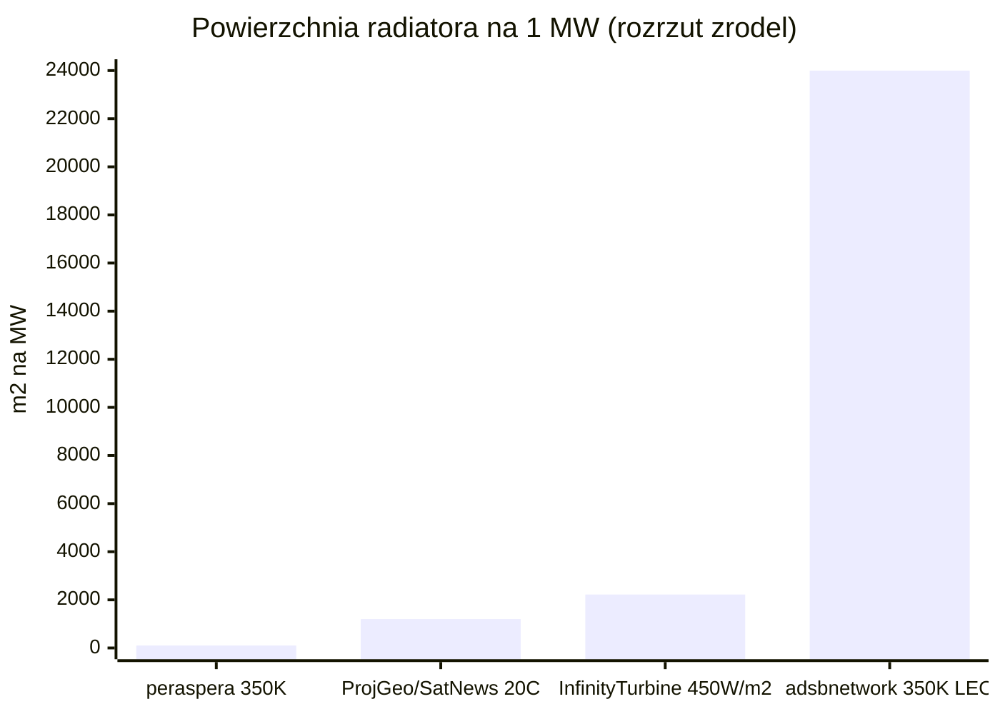
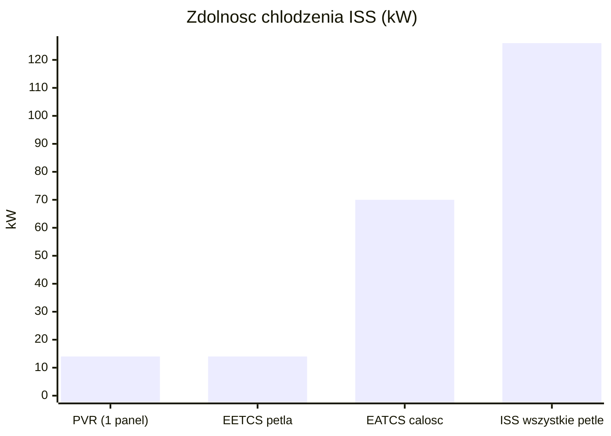
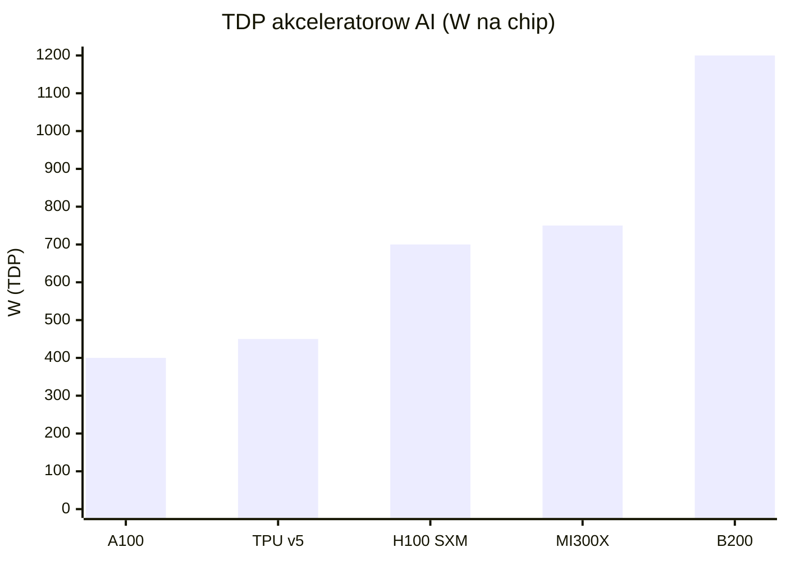
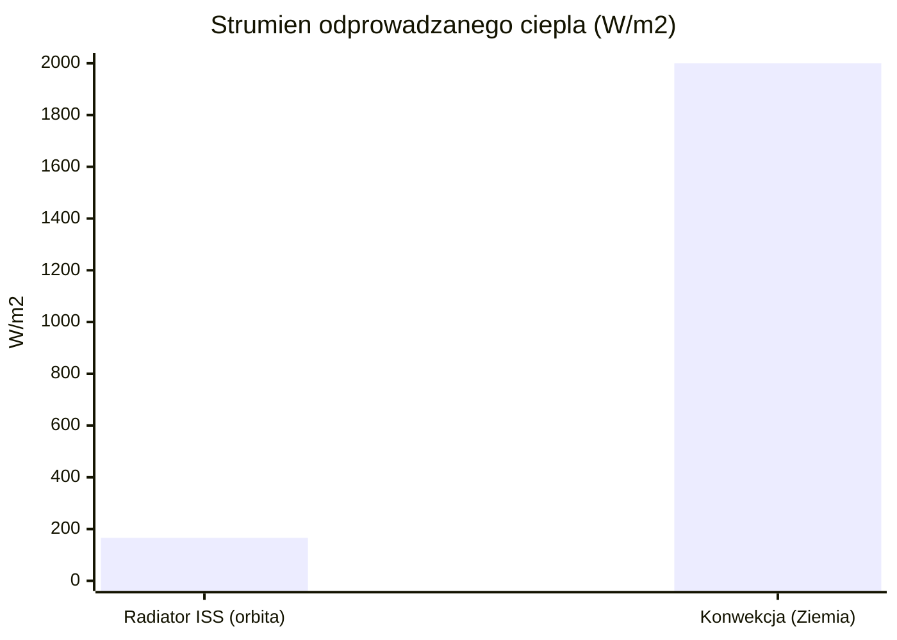

# Chłodzenie i radiacyjne odprowadzanie ciepła

> Notatka raportu "Orbitalne centra danych". Kluczowe źródła: [źródło 1](https://projectgeospatial.org/geospatial-frontiers/the-thermodynamics-of-hype-why-space-wont-save-ais-energy-crisis-yet), [źródło 2](https://ntrs.nasa.gov/api/citations/19930007720/downloads/19930007720.pdf).

## W skrócie

Chłodzenie jest najtwardszym fizycznym ograniczeniem orbitalnych centrów danych i jednocześnie miejscem, gdzie najłatwiej o marketingowy mit "w kosmosie jest zimno, więc chłodzenie jest darmowe". W rzeczywistości próżnia jest izolatorem: nie ma powietrza ani wody, więc jedynym sposobem pozbycia się ciepła jest promieniowanie podczerwone w głąb kosmosu, a tempo tego promieniowania rządzi się prawem Stefana-Boltzmanna (moc rośnie z czwartą potęgą temperatury). Praktyczna konsekwencja dla inwestora: aby odprowadzić zaledwie 1 megawat (MW = milion watów) ciepła odpadowego przy temperaturze bezpiecznej dla chipów, trzeba rozłożyć radiator o powierzchni rzędu 1 200 m², czyli wielkości czterech kortów tenisowych ([Project Geospatial](https://projectgeospatial.org/geospatial-frontiers/the-thermodynamics-of-hype-why-space-wont-save-ais-energy-crisis-yet)). Kto na tym zyskuje: dostawcy lekkich, rozkładanych radiatorów i pętli dwufazowych (np. Starcloud, ESA/Thales). Kto traci lub jest narażony na ryzyko: projekty zakładające skalowanie do gigawatów (GW) na bazie samego dziedzictwa ISS, bo największy lotny system chłodzenia (ISS, ~70-126 kW) trzeba przeskalować o 4-5 rzędów wielkości - a takiego demonstratora w skali MW jeszcze nie ma w kosmosie (NIE UJAWNIONE). Tempo zmian jest powolne i napędzane masą wyniesienia: opłacalność zależy od spadku kosztu startu do okolic 500 USD/kg.

<!-- spolki:related:start -->
## Spółki powiązane

> Notowane spółki produkujące podzespoły/technologie związane z tym tematem. Pełne omówienie: spółki, dla których nisza to >=33% przychodów; skrótowe: zdywersyfikowane konglomeraty. Zob. też [[Spolki/_slownik]] i [[Spolki/_widok-gpw-eu]].

**Producenci kluczowi (>=33% przychodów z niszy - omówienie pełne):**
- [[Spolki/redwire|Redwire Corporation (RDW)]] - Panele ROSA, struktury rozkładane, montaż on-orbit, radiatory Q-Rad
- [[Spolki/vertiv|Vertiv Holdings Co (VRT)]] - Zasilanie i precyzyjne/cieczowe chłodzenie DC

**Pozostali dominujący gracze (nisza to ułamek przychodów - omówienie skrótowe):**
- [[Spolki/northrop-grumman|Northrop Grumman Corporation (NOC)]] - Serwis GEO (MEV/MRV), busy, radiatory, ogniwa
- [[Spolki/airbus|Airbus SE (AIR)]] 🇪🇺 - PV (Sparkwing), optyka (Tesat), busy, serwis (EU)
- [[Spolki/rtx|RTX Corporation (RTX)]] - ADCS (Blue Canyon), termika (Collins Aerospace)
- [[Spolki/eaton|Eaton Corporation plc (ETN)]] - Zasilanie DC (UPS, switchgear) + chłodzenie (Boyd Thermal)
<!-- spolki:related:end -->

<!-- network:watki:start -->
## Powiązane wątki

> Mapa powiązań tematycznych - jak ten wątek łączy się z resztą raportu.

- [[04 - energetyka-kosmiczna-i-fotowoltaika-orbitalna|Energetyka kosmiczna]] - każdy wat mocy obliczeniowej trzeba odprowadzić jako ciepło
- [[03 - fizyka-orbitalna-orbity-i-operacje|Fizyka orbitalna]] - orientacja radiatorów edge-on do Słońca to zagadnienie operacji
- [[06 - promieniowanie-i-elektronika-rad-hard-vs-cots|Promieniowanie i elektronika]] - rosnące TDP akceleratorów AI napędza wymaganą powierzchnię radiatora
- [[08 - niezawodnosc-serwisowanie-i-cykl-zycia-sprzetu|Niezawodność i serwisowanie]] - radiatory rozkładane to element niezawodności i serwisu
- [[09 - ekonomika-i-koszty-calkowite-tco|Ekonomika i TCO]] - setki ton radiatora na MW to realny koszt w rachunku startowym
<!-- network:watki:end -->
## Mechanizm: dlaczego w próżni liczy się tylko promieniowanie

Na Ziemi serwery chłodzi się przez konwekcję - przepływ powietrza lub cieczy zabierający ciepło z gorących powierzchni. W próżni ten mechanizm znika całkowicie. Dokumentacja NASA stawia to jednoznacznie: "in a vacuum environment, convection is no longer available and the only mechanism of rejecting heat is radiation" ([NASA NTRS](https://ntrs.nasa.gov/api/citations/19930007720/downloads/19930007720.pdf)). To samo widać na ISS, gdzie podgrzany amoniak krąży przez wielkie radiatory na zewnątrz stacji i oddaje ciepło "by radiation to space" ([NASA ISS ATCS](https://www.nasa.gov/wp-content/uploads/2021/02/473486main_iss_atcs_overview.pdf)).

Tempo wypromieniowania opisuje prawo Stefana-Boltzmanna: emitowana moc na jednostkę powierzchni jest proporcjonalna do czwartej potęgi temperatury bezwzględnej (w kelwinach, K - skala zaczynająca się od zera absolutnego). NASA zapisuje je jako E = σT⁴, gdzie stała Stefana-Boltzmanna σ wynosi 5,67 (w jednostkach W·m⁻²·K⁻⁴, czyli wat na metr kwadratowy na kelwin do czwartej potęgi) ([NASA NTRS](https://ntrs.nasa.gov/api/citations/19930007720/downloads/19930007720.pdf)). Dla porządku: dokładna wartość CODATA to 5,670374419×10⁻⁸ W·m⁻²·K⁻⁴ (NIE UJAWNIONE w przeglądanych źródłach NASA, podaną tu jako proxy; źródła NASA cytują zaokrąglone 5,67). Implikacja dla inwestora: kluczowa jest temperatura pracy radiatora - im gorętszy radiator, tym dramatycznie mniejszy i lżejszy może być, więc cała ekonomika chłodzenia orbitalnego zależy od tego, jak wysoką temperaturę chipów i pętli akceptujemy.

<abbr title="duża płyta oddająca ciepło do kosmosu przez promieniowanie; im niższa temperatura pracy, tym większy i cięższy musi być.">Radiator</abbr> promieniuje głównie w stronę "głębokiego kosmosu", którego średnia temperatura to około 2,7 K (-270°C). Tak opisuje to white paper Starcloud (d. Lumen Orbit): "radiating primarily towards deep space, which has an average temperature of about 2.7 Kelvin or -270°C" ([Starcloud WP](https://lumenorbit.github.io/wp.pdf)). NASA podkreśla zarazem odwrotną stronę medalu: całkowite wypromieniowane ciepło jest proporcjonalne do powierzchni radiatora, a "the lower the radiation temperature, the larger the radiator area (and thus the radiator mass, for a given design) must be" ([NASA NTRS](https://ntrs.nasa.gov/api/citations/19930007720/downloads/19930007720.pdf)). To jest sedno problemu: chcąc utrzymać chipy chłodne, trzeba olbrzymich, ciężkich powierzchni.

## Powierzchnia i masa radiatorów na 1 MW; stosunek radiator do panela

Najczęściej cytowana liczba bazowa to powierzchnia radiatora na jednostkę odprowadzanej mocy. Project Geospatial podaje ~1 200 m² na 1 MW odprowadzanego ciepła przy temperaturach bezpiecznych dla komercyjnych mikroprocesorów ([Project Geospatial](https://projectgeospatial.org/geospatial-frontiers/the-thermodynamics-of-hype-why-space-wont-save-ais-energy-crisis-yet)). Niezależnie SatNews podaje tę samą wartość 1 200 m²/MW przy stabilnych 20°C, porównując ją do "czterech kortów tenisowych" ([SatNews](https://satnews.com/2026/03/17/the-physics-wall-orbiting-data-centers-face-a-massive-cooling-challenge/)). To zbieżność dwóch wtórnych źródeł na konserwatywnym (niskotemperaturowym) końcu skali.

Liczba spada drastycznie, gdy podniesiemy temperaturę radiatora. Reguła kciuka z peraspera.us mówi o ~0,1 m² na kW, czyli zaledwie ~100 m²/MW, ale przy ~350 K (około 77°C) ([peraspera.us](https://peraspera.us/realities-of-space-based-compute/)). Skrajny przykład w drugą stronę: analiza adsbnetwork podaje aż 24 000 m²/MW "w <abbr title="orbita blisko Ziemi, gdzie radiatory ponoszą dodatkowy &quot;podatek termiczny&quot; od albedo i podczerwieni planety.">LEO</abbr> przy 350 K" ([adsbnetwork](https://www.adsbnetwork.com/mypov/Starcloud/physics.html)) - to wartość odstająca o dwa rzędy wielkości od pozostałych i opatrzona najniższym tierem wiarygodności. InfinityTurbine liczy 222 m² dla 100 kW przy strumieniu 450 W/m² (czyli ~2 220 m²/MW) ([InfinityTurbine](https://www.infinityturbine.com/orbital-data-centers-using-cluster-mesh-supercritical-co2-power-systems-by-infinityturbine.html)). Implikacja dla inwestora: nie istnieje jedna "prawdziwa" liczba m²/MW - rozrzut od ~100 do ~24 000 m²/MW pokazuje, że wynik jest sterowany założeniem temperatury i konfiguracji, a nie twardą stałą; każdy biznesplan trzeba czytać przez pryzmat przyjętej temperatury pracy.

*Rys. 24 - Powierzchnia radiatora potrzebna do odprowadzenia 1 MW ciepła wedlug roznych zrodel; wynik sterowany glownie zalozona temperatura. Dane: peraspera.us, Project Geospatial, SatNews, InfinityTurbine, adsbnetwork (notatka).*

Masa to druga oś problemu. Radiatory ISS (EETCS) mają dwustronną masę właściwą 2,75 kg/m² i pracują w ~300 K ([CORE/EETCS](https://core.ac.uk/download/pdf/36694932.pdf)). NASA wskazuje ~5 kg/m² dla starannie zaprojektowanego radiatora aluminiowego z emisyjnością 0,85 (emisyjność to ułamek od 0 do 1 mówiący, jak skutecznie powierzchnia promieniuje względem ciała doskonale czarnego) ([NASA NTRS](https://ntrs.nasa.gov/api/citations/19930007720/downloads/19930007720.pdf)). Forethought podaje dla całego systemu radiatora z pętlą 2,4-3,6 kg/m² (kompozyt z włókna węglowego plus 50% narzutu na pompy, instalację, płyny), co daje 163-346 W/kg w zależności od konfiguracji i temperatury (25°C vs 45°C) ([Forethought](https://www.forethought.org/research/will-we-really-put-data-centers-in-space)). Bardziej zachowawczo SpaceComputer przyjmuje typowy zakres 5-10 kg/m² dla radiatorów kosmicznych ([SpaceComputer](https://blog.spacecomputer.io/cooling-for-orbital-compute/)).

Przeliczone na megawat, masa układu chłodzenia rozjeżdża się równie mocno. Project Geospatial szacuje całkowitą masę chłodzenia na ~2 640-14 400 kg/MW ([Project Geospatial](https://projectgeospatial.org/geospatial-frontiers/the-thermodynamics-of-hype-why-space-wont-save-ais-energy-crisis-yet)). adsbnetwork twierdzi za to "43 tony minimum na 1 MW" w oparciu o dane ISS, co miałoby stanowić 25% całkowitej masy 1 MW orbitalnego DC ([adsbnetwork](https://www.adsbnetwork.com/mypov/Starcloud/physics.html)). Implikacja dla inwestora: masa radiatorów na 1 MW waha się od ~2,6 t do ~43 t w zależności od źródła i założeń, a ponieważ każdy kilogram trzeba wynieść na orbitę, to właśnie ta liczba decyduje o koszcie kapitałowym - górny koniec zakładałby koszt wyniesienia samego chłodzenia liczony w dziesiątkach milionów dolarów na MW przy dzisiejszych cenach startu.

Co do skali wizji: white paper Starcloud podaje, że dla klastra 5 GW potrzebny byłby radiator o boku 1 km × 1 km ([Starcloud WP](https://lumenorbit.github.io/wp.pdf)), przy czym te same dokumenty twierdzą, że "radiatory muszą być mniejsze niż połowa rozmiaru paneli słonecznych" - stosunek radiator do panela ok. 1/2 ([Starcloud WP](https://lumenorbit.github.io/wp.pdf)). Implikacja: panel zbierający energię jest większy niż radiator ją oddający, co odwraca naiwną intuicję, że to chłodzenie zdominuje geometrię stacji - choć liczba 1/2 pochodzi od firmy promującej technologię i jest claimem optymistycznym.

## Technologie: heat pipes, pętle, układy dwufazowe i radiatory rozkładane

Bazowym, referencyjnym rozwiązaniem jest "heat pipe" (rurka cieplna) - urządzenie całkowicie pasywne, bez ruchomych części, względem którego ocenia się wszystkie inne ([NASA NTRS](https://ntrs.nasa.gov/api/citations/19930007720/downloads/19930007720.pdf)). Działa dzięki parowaniu i skraplaniu czynnika wewnątrz rurki. <abbr title="rozwinięta, pasywna pętla przenosząca ciepło od gorącego sprzętu do zewnętrznego radiatora bez pompy mechanicznej.">Loop Heat Pipe</abbr> (LHP, pętlowa rurka cieplna) rozwija ten pomysł: przenosi ciepło dzięki utajonemu ciepłu parowania od gorącego sprzętu do zimnego radiatora zewnętrznego, jest "totally passive (no mechanical pump)" i używa kapilarnego parownika dającego przepływ dwufazowy ([ESA LHP](https://connectivity.esa.int/projects/high-performance-loop-heat-pipe)). ESA wskazuje LHP jako rozwiązanie dla "large powerful SATCOM" wymagających radiatorów rozkładanych ([ESA LHP](https://connectivity.esa.int/projects/high-performance-loop-heat-pipe)).

Gdy mocy jest więcej, sięga się po pętle z pompą mechaniczną. Mechanically pumped fluid loops (<abbr title="aktywny układ tłoczący płyn pompą, zdolny przenosić ciepło dalej niż heat pipe; preferowany przy dużych mocach.">MPFL</abbr>, pętle płynowe z pompą) działają w trybie jedno- i dwufazowym, transportują ciepło dalej niż heat pipes i są "current technology of choice for high heat flux applications and precision temperature control" w misjach dalekiego kosmosu NASA ([NASA MPFL](https://ntrs.nasa.gov/api/citations/20020013939/downloads/20020013939.pdf)). To one są naturalnym kandydatem do skali MW, bo gęstości mocy chipów AI wymagają precyzyjnej kontroli temperatury.

Radiatory rozkładane (deployable) to sposób na zmieszczenie wielkiej powierzchni w ograniczonej objętości rakiety. Panele rozkładane po starcie dają dodatkowe 10-30 m² powierzchni, łączone z pojazdem przez elastyczne interfejsy heat-pipe ([rfessentials](https://rfessentials.com/rf-knowledge-base/how-do-i-design-the-thermal-management-system-for-an-rf-payload-in-a-satellite/)). Recenzowane badanie pokazało, że nowatorski radiator rozkładany oferował 220% większą zdolność odprowadzania ciepła niż konwencjonalny montowany na korpusie ([Newswise/Elsevier](https://www.newswise.com/pdf_docs/171748902440796_1-s2.0-S277268352400013X-main.pdf)). Praca na konferencji SmallSat opisuje LHP umożliwiające dwufazowy transfer ciepła przez mechanizmy rozkładania i izotermalizację radiatorów integralnych i rozkładanych ([USU SmallSat](https://digitalcommons.usu.edu/smallsat/2024/all2024/203/)).

Na horyzoncie są technologie potencjalnie przełomowe. Liquid Droplet Radiator (LDR, radiator z kroplami cieczy) - badania NASA z lat 80. wskazują, że może być nawet 7× lżejszy od konwencjonalnego, a listopadowe (2025) badanie w Applied Thermal Engineering wykazało odprowadzanie do 450 W/kg ([SpaceComputer](https://blog.spacecomputer.io/cooling-for-orbital-compute/)). InfinityTurbine proponuje "CO2 Cluster Mesh" na nadkrytycznym/transkrytycznym CO2 przy ciśnieniu ~80-200 bar, chwaląc się dużą pojemnością cieplną i kompaktowymi rurociągami ([InfinityTurbine](https://www.infinityturbine.com/orbital-data-centers-using-cluster-mesh-supercritical-co2-power-systems-by-infinityturbine.html)). Implikacja dla inwestora: zdecydowana większość dojrzałych komponentów (heat pipes, LHP, MPFL, radiatory ISS) ma już dziedzictwo lotne tier-primary, natomiast najbardziej "uskrzydlające" liczby (LDR 7×, 450 W/kg, CO2 80-200 bar) pochodzą z badań laboratoryjnych lub źródeł słabszego tieru - to opcjonalność, nie pewnik.

![[assets/y04-1-ksc-03pd2293.jpg]]
*Rys. 25 - Chlodzenie: KENNEDY SPACE CENTER, FLA.  -  A worker at Hangar A&E, Cape Canaveral Air Force . Źródło: NASA, licencja: public domain.*
#grafika #chlodzenie-i-radiacyjne-odprowadzanie-ciepla #radiator #chlodzenie

![[assets/y04-2-ksc-03pd2294.jpg]]
*Rys. 26 - Chlodzenie: KENNEDY SPACE CENTER, FLA.  - Workers at Hangar A&E, Cape Canaveral Air Force St. Źródło: NASA, licencja: public domain.*
#grafika #chlodzenie-i-radiacyjne-odprowadzanie-ciepla #radiator #chlodzenie

## Dziedzictwo ISS: pętle amoniakalne w skali kilowatów, skalowane do MW

ISS to jedyny duży, długo działający w kosmosie układ aktywnego chłodzenia i dlatego stanowi punkt odniesienia. External Active Thermal Control System (EATCS) zaprojektowano na 35 kW odprowadzania ciepła na pętlę, łącznie 70 kW ([NASA ISS ATCS](https://www.nasa.gov/wp-content/uploads/2021/02/473486main_iss_atcs_overview.pdf)). Każdy Photovoltaic Radiator (PVR) odprowadza do 14 kW ([NASA ISS ATCS](https://www.nasa.gov/wp-content/uploads/2021/02/473486main_iss_atcs_overview.pdf)), waży 740,7 kg i po rozłożeniu mierzy 3,12 m × 13,6 m ([NASA ISS ATCS](https://www.nasa.gov/wp-content/uploads/2021/02/473486main_iss_atcs_overview.pdf)). Radiatory EETCS mają łączną powierzchnię odprowadzania ~147 m² i odprowadzają 14 kW jako pumpowana pętla amoniakalna ([CORE/EETCS](https://core.ac.uk/download/pdf/36694932.pdf)).

*Rys. 27 - Maksymalna zdolnosc odprowadzania ciepla podsystemow ISS; punkt odniesienia ledwie ulamek MW. Dane: NASA ISS ATCS, CORE/EETCS, yage.ai (notatka).*

Inne analizy podają zagregowane liczby całej stacji, nieco rozbieżne. SpaceComputer mówi o odprowadzaniu do 70 kW przez 422 m² radiatorów amoniakalnych, co daje w praktyce ~166 W/m² - znacznie poniżej teoretycznego maksimum z powodu nasłonecznienia, obciążenia podczerwienią Ziemi i nieefektywności systemu ([SpaceComputer](https://blog.spacecomputer.io/cooling-for-orbital-compute/)). Z kolei analiza yage.ai cytuje "dokumentację NASA": całkowita zdolność chłodzenia ~126 kW, łączna powierzchnia radiatorów ~645 m², łączna masa radiatorów ~9,7 t ([yage.ai](https://yage.ai/share/space-datacenter-thermal-en-20260421.html)). adsbnetwork wylicza z tego 51 kg/kW masy radiatora ISS ([adsbnetwork](https://www.adsbnetwork.com/mypov/Starcloud/physics.html)). Implikacja: nawet podstawowe parametry ISS są raportowane w widełkach (70 vs 126 kW; 422 vs 645 m²) zależnie od tego, czy liczy się sam EATCS, czy wszystkie pętle - inwestor powinien wymagać doprecyzowania, którą część systemu przytacza dany pitch.

Czynnik roboczy ma swoje ryzyka. EATCS przenosi ładunek 600 funtów (lb) amoniaku w dwóch komorach ([naturalrefrigerationreview](https://naturalrefrigerationreview.com/a-service-call-in-space/)); amoniak wybrano za skrajnie niski punkt zamarzania -77°C ([NASA ISS ATCS](https://www.nasa.gov/wp-content/uploads/2021/02/473486main_iss_atcs_overview.pdf)). Kluczowa luka: NIE UJAWNIONE są jakiekolwiek lotne demonstratory chłodzenia w skali MW - proxy mówi wprost, że największy lotny system to ISS (~70-126 kW), a osiągnięcie GW wymaga skalowania o 4-5 rzędów wielkości. Implikacja dla inwestora: między obecnym dziedzictwem a wizją GW leży nieprzetestowana w locie przepaść technologiczna - to ryzyko wykonawcze, nie tylko fizyczne.

## Gęstość mocy chipów AI a ekstrakcja ciepła bez wody i powietrza

To, co trzeba schłodzić, rośnie szybciej niż łatwość chłodzenia. NVIDIA H100 w wersji SXM ma <abbr title="projektowa moc cieplna układu (np. 700 W dla GPU H100), którą system chłodzenia musi odprowadzić.">TDP</abbr> (Thermal Design Power, projektowa moc cieplna do odprowadzenia) do 700 W ([NVIDIA datasheet](https://www.megware.com/fileadmin/user_upload/LandingPage%20NVIDIA/nvidia-h100-datasheet.pdf)), a wersja PCIe 300-350 W ([NVIDIA datasheet](https://www.megware.com/fileadmin/user_upload/LandingPage%20NVIDIA/nvidia-h100-datasheet.pdf)). Dla porównania: NVIDIA A100 400 W, AMD MI300X 750 W, Google TPU v5 450 W na chip ([DataBank](https://www.databank.com/resources/blogs/colocation-for-ai-workloads-power-cooling-gpu-density-requirements-explained/)). Nowsza NVIDIA B200 Blackwell ma pobierać 1 200 W na sztukę ([qyang](https://qyang.livedoor.blog/archives/13219248.html)).

*Rys. 28 - Projektowa moc cieplna (TDP) na pojedynczy akcelerator; wzrost z 400 W do 1200 W zwieksza wymagana powierzchnie radiatora. Dane: NVIDIA datasheet, DataBank, qyang (notatka).*

W skali szafy (rack) liczby są ogromne. NVIDIA GB200 NVL72 to 120 kW/rack, GB300 NVL72 to 140 kW/rack ([resistancezero](https://resistancezero.com/article-13.html)); pody Google TPU v5 mają działać przy 150 kW/rack ([qyang](https://qyang.livedoor.blog/archives/13219248.html)). Te gęstości na Ziemi wymuszają chłodzenie cieczą, a w próżni - jak przypomina NASA - "the only mechanism of rejecting heat is radiation" ([NASA NTRS](https://ntrs.nasa.gov/api/citations/19930007720/downloads/19930007720.pdf)), bo nie ma ani wody, ani powietrza, tylko przewodzenie do radiatora i wypromieniowanie.

Przeliczenie na powierzchnię radiatora bywa zatrważające. arkspace szacuje, że pojedynczy H100 (~350 W) wymaga ~1,1 m² radiatora, a system DGX H100 z ośmioma GPU ponad 16 m² - więcej niż typowe wymiary korpusu satelity ([arkspace](https://arkspace.me/blog/thermal-wall-orbital-data-center-cooling/)). Implikacja dla inwestora: trend rynkowy idzie pod prąd fizyce orbity - chipy AI z generacji na generację grzeją mocniej (700 W → 1 200 W), więc każdy rok zwłoki w starcie projektu oznacza, że trzeba schłodzić cieplejszy sprzęt; przewaga "darmowego heatsinku w próżni" topnieje wraz ze wzrostem TDP, choć te konkretne przeliczenia m²/GPU pochodzą ze źródeł słabego tieru.

## Orientacja radiatorów: edge-on do Słońca, podczerwień i albedo Ziemi

Radiator nie tylko promieniuje ciepło - również je odbiera z otoczenia, dlatego ustawienie ma znaczenie krytyczne. Wymóg podstawowy: radiatory muszą być ustawione krawędzią do Słońca (edge-on) i osłonięte od Ziemi ([abgoyal](https://abgoyal.com/posts/space-ai-datacenters/)). Powodem jest strumień słoneczny. Bezpośrednie nasłonecznienie to ~1 360-1 367 W/m² ([abgoyal](https://abgoyal.com/posts/space-ai-datacenters/); [MATEC](https://www.matec-conferences.org/articles/matecconf/pdf/2022/18/matecconf_3mce22_02001.pdf)); coracleresearch podaje 1 361 W/m² dla LEO ([coracleresearch](https://www.coracleresearch.com/research/02-starship-refilling/)). Jeśli pełna powierzchnia radiatora "patrzy" w Słońce, pochłania więcej ciepła niż odprowadza.

Na niskiej orbicie (LEO, Low Earth Orbit) dochodzi obciążenie od samej Ziemi. <abbr title="część światła słonecznego odbita od Ziemi (~30%), dodatkowo nagrzewająca radiatory na niskiej orbicie.">Albedo</abbr> Ziemi (odbite światło słoneczne) to ~30% padającego promieniowania słonecznego ([abgoyal](https://abgoyal.com/posts/space-ai-datacenters/)); podczerwień Ziemi (<abbr title="ciepło promieniowane przez samą planetę (~240 W/m²), które obciąża radiatory zwrócone ku Ziemi na niskiej orbicie.">Earth IR</abbr>) to ~240 W/m² ([MATEC](https://www.matec-conferences.org/articles/matecconf/pdf/2022/18/matecconf_3mce22_02001.pdf)), a coracleresearch podaje łącznie albedo plus IR na stronie zwróconej do Ziemi ~240 W/m² ([coracleresearch](https://www.coracleresearch.com/research/02-starship-refilling/)). NASA potwierdza, że w warunkach LEO earthshine i albedo "can be the dominant external heat inputs" ([NASA NTRS 1978](https://ntrs.nasa.gov/api/citations/19780014193/downloads/19780014193.pdf)) i wskazuje, że orientacja płaskich radiatorów w płaszczyźnie orbity minimalizuje wszystkie trzy obciążenia zewnętrzne przy najbardziej prawdopodobnych kątach β ([NASA NTRS 1978](https://ntrs.nasa.gov/api/citations/19780014193/downloads/19780014193.pdf)).

Dokładne właściwości optyczne radiatorów ODC w LEO są NIE UJAWNIONE - jako proxy z dziedzictwa ISS/Space Shuttle: absorpcyjność słoneczna ~0,09-0,14 i emisyjność ~0,84-0,92. Implikacja dla inwestora: efektywne ~166 W/m² ISS (zamiast teoretycznych setek W/m²) to nie błąd projektu, lecz cena za nasłonecznienie i podczerwień Ziemi - projekty w LEO ponoszą trwały "podatek termiczny" od bliskości planety, co preferuje orbity wyższe lub staranne pasywne sterowanie orientacją i jest realnym kosztem inżynieryjnym ukrytym w optymistycznych liczbach m²/MW.

## Kontrowersje

**Kontrowersja A: Czy radiator GW to twardy blocker fizyki, czy handlowy trade-off?**

Strona sceptyczna (blocker): Project Geospatial liczy 1 200 m²/MW i masę chłodzenia ~2 640-14 400 kg/MW ([Project Geospatial](https://projectgeospatial.org/geospatial-frontiers/the-thermodynamics-of-hype-why-space-wont-save-ais-energy-crisis-yet)). chaotropy.com idzie dalej: 1-3 m² na kW, czyli 1-3 mln m² dla gigawata, a własne wyliczenia autora dają "at least 2.2 million m²" dla 1 GW ([chaotropy](https://www.chaotropy.com/why-jeff-bezos-is-probably-wrong-predicting-ai-data-centers-in-space/)).

Strona optymistyczna (trade-off): SpaceComputer twierdzi, że przy skalowaniu satelity klasy Starlink z ~20 kW do ~100 kW radiatory stanowią tylko 10-20% masy i ~7% powierzchni planarnej ([SpaceComputer](https://blog.spacecomputer.io/cooling-for-orbital-compute/)), a dla 1 GW potrzeba "tylko" ~3 950 m² radiatora przy optymistycznych temperaturach, o masie 19 750-39 500 kg przy 5-10 kg/m² ([SpaceComputer](https://blog.spacecomputer.io/cooling-for-orbital-compute/)). Starcloud mówi o radiatorze 1 km × 1 km dla 5 GW ([Starcloud WP](https://lumenorbit.github.io/wp.pdf)). Rozbieżność jest realna i ogromna: ~3 950 m² (SpaceComputer) kontra ~2,2 mln m² (chaotropy) dla 1 GW - różnica niemal trzech rzędów wielkości, wynikająca z założonej temperatury pracy radiatora. To nie spór o fizykę, lecz o to, jak gorące radiatory uda się utrzymać.

**Kontrowersja B: Czy dziedzictwo ISS skaluje się do ODC?**

Strona "nie skaluje się łatwo": maksimum EATCS to 70 kW ([NASA ISS ATCS](https://www.nasa.gov/wp-content/uploads/2021/02/473486main_iss_atcs_overview.pdf)), czyli ułamek megawata. System amoniakalny doświadczył "repeated ammonia leaks" przez ponad 20 lat służby i udokumentowanych awaryjnych napraw EVA (spacerów kosmicznych) ([yage.ai](https://yage.ai/share/space-datacenter-thermal-en-20260421.html)) - co przy skali GW oznaczałoby ekstremalne ryzyko operacyjne.

Strona "heritage jest bazą, nowe technologie pozwalają skalować": dokument NASA o radiatorze reaktora wprost twierdzi, że układ chłodzenia podobny do ISS "provides development benefits since that system has space heritage" ([NASA TM-20220012395](https://ntrs.nasa.gov/api/citations/20220012395/downloads/TM-20220012395.pdf)). Starcloud deklaruje, że "has not found any insurmountable obstacles" ([Starcloud WP](https://lumenorbit.github.io/wp.pdf)). W perspektywie LDR demonstruje 450 W/kg ([SpaceComputer](https://blog.spacecomputer.io/cooling-for-orbital-compute/)). Spór sprowadza się do tego, czy 4-5 rzędów wielkości skalowania to inżynieryjna ciągłość, czy jakościowy skok - obie strony cytują źródła primary, więc rozstrzygnięcie zależy od przyszłych demonstratorów lotnych (na razie NIE UJAWNIONE).

**Kontrowersja C: Czy "trudniej w próżni" jest prawdą absolutną?**

Strona "tak, trudniej niż na Ziemi": systemy konwekcyjne na Ziemi odprowadzają 2 000+ W/m² przy minimalnym narzucie masy, podczas gdy w próżni "there is no fluid medium" ([SpaceComputer](https://blog.spacecomputer.io/cooling-for-orbital-compute/)) - a radiatory ISS dają w praktyce tylko ~166 W/m² ([SpaceComputer](https://blog.spacecomputer.io/cooling-for-orbital-compute/)). GB300 wymaga "mandatory liquid cooling" już przy 140 kW/rack ([resistancezero](https://resistancezero.com/article-13.html)). Różnica wydajności jest realna: ~166 W/m² (orbita) vs 2 000+ W/m² (Ziemia), czyli ponad rząd wielkości na niekorzyść próżni.

*Rys. 29 - Praktyczna wydajnosc odprowadzania ciepla: radiator ISS na orbicie vs systemy konwekcyjne na Ziemi. Dane: SpaceComputer (notatka).*

Strona "zależy od porównania; woda i powietrze nie są darmowe": SiliconAngle podkreśla, że radiatory to urządzenia pasywne o prostszej konstrukcji i mniejszym zużyciu energii niż naziemne systemy chłodzenia ([SiliconAngle](https://siliconangle.com/2026/03/30/space-data-center-startup-starcloud-raises-170m-1-1b-valuation/)). whatthechiphappened akcentuje, że orbita daje próżnię jako heat sink "avoiding evaporative cooling and conserving fresh water" potrzebnej naziemnym DC ([whatthechiphappened](https://news.whatthechiphappened.com/p/semiconductors-next-frontier-starclouds)). Synteza: teza "trudniej w próżni" jest półprawdą - pod względem czystej wydajności na m² faktycznie jest trudniej (166 vs 2 000+ W/m²), ale orbita eliminuje zużycie wody i daje stałe, pasywne chłodzenie radiacyjne; ocena zależy od tego, czy porównujemy wydajność termiczną, czy całkowity koszt operacyjny z wodą i energią pomp.

## Słowniczek pojęć

- **Promieniowanie cieplne (radiacja)** - oddawanie ciepła w postaci podczerwieni; w próżni jedyny możliwy sposób chłodzenia, bo nie ma powietrza ani wody.
- **Prawo Stefana-Boltzmanna (E = σT⁴)** - zasada fizyki mówiąca, że moc wypromieniowana z powierzchni rośnie z czwartą potęgą jej temperatury, więc gorętszy radiator oddaje ciepło dużo skuteczniej.
- **Konwekcja** - chłodzenie przez przepływ powietrza lub cieczy (standard na Ziemi), które w próżni kosmosu w ogóle nie działa.
- **Radiator** - duża płyta oddająca ciepło do kosmosu przez promieniowanie; im niższa temperatura pracy, tym większy i cięższy musi być.
- **Emisyjność** - liczba od 0 do 1 określająca, jak skutecznie powierzchnia promieniuje ciepło w porównaniu z idealnym "ciałem czarnym".
- **Heat pipe (rurka cieplna)** - całkowicie pasywne urządzenie bez ruchomych części, przenoszące ciepło dzięki parowaniu i skraplaniu czynnika wewnątrz rurki.
- **Loop Heat Pipe (LHP, pętlowa rurka cieplna)** - rozwinięta, pasywna pętla przenosząca ciepło od gorącego sprzętu do zewnętrznego radiatora bez pompy mechanicznej.
- **MPFL (pętla płynowa z pompą)** - aktywny układ tłoczący płyn pompą, zdolny przenosić ciepło dalej niż heat pipe; preferowany przy dużych mocach.
- **Układ dwufazowy (two-phase)** - chłodzenie wykorzystujące przemianę cieczy w parę i z powrotem, co pozwala przenieść dużo ciepła przy małym przepływie.
- **Radiator rozkładany (deployable)** - panel składany podczas startu i rozkładany na orbicie, aby zmieścić wielką powierzchnię chłodzącą w ciasnej rakiecie.
- **Earth IR (podczerwień Ziemi)** - ciepło promieniowane przez samą planetę (~240 W/m²), które obciąża radiatory zwrócone ku Ziemi na niskiej orbicie.
- **Albedo** - część światła słonecznego odbita od Ziemi (~30%), dodatkowo nagrzewająca radiatory na niskiej orbicie.
- **Edge-on do Słońca** - ustawienie radiatora krawędzią do Słońca, by pochłaniał jak najmniej promieniowania słonecznego.
- **Gęstość mocy** - ilość ciepła do odprowadzenia z danej powierzchni lub szafy (np. kW na rack); im wyższa, tym trudniejsze chłodzenie.
- **TDP (Thermal Design Power)** - projektowa moc cieplna układu (np. 700 W dla GPU H100), którą system chłodzenia musi odprowadzić.
- **LEO (Low Earth Orbit, niska orbita okołoziemska)** - orbita blisko Ziemi, gdzie radiatory ponoszą dodatkowy "podatek termiczny" od albedo i podczerwieni planety.
