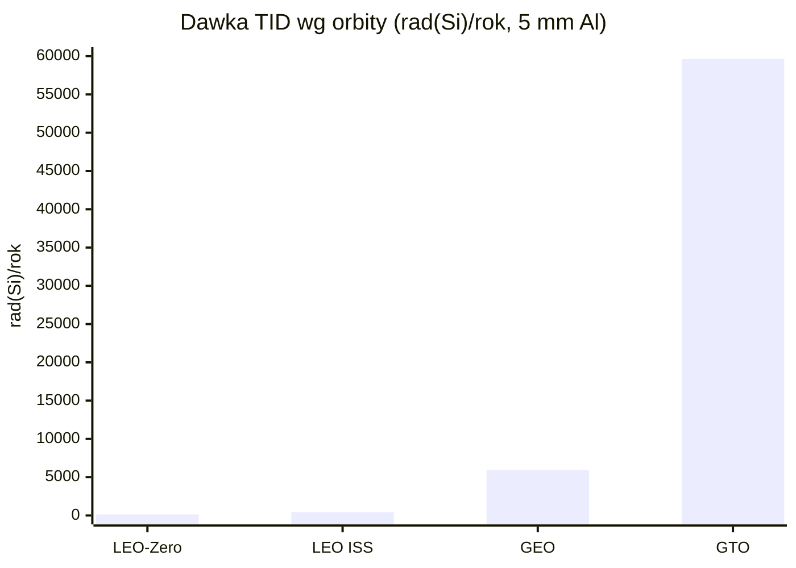
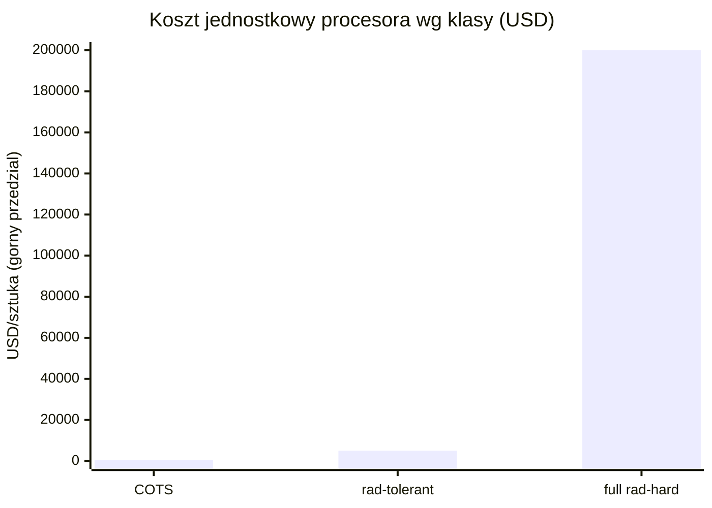
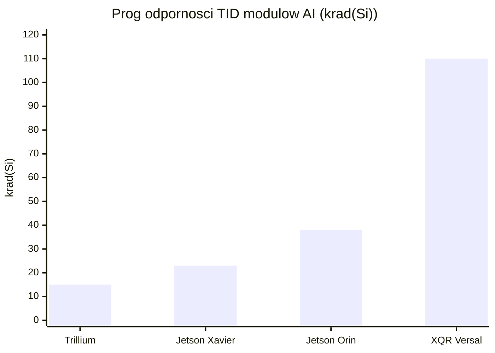
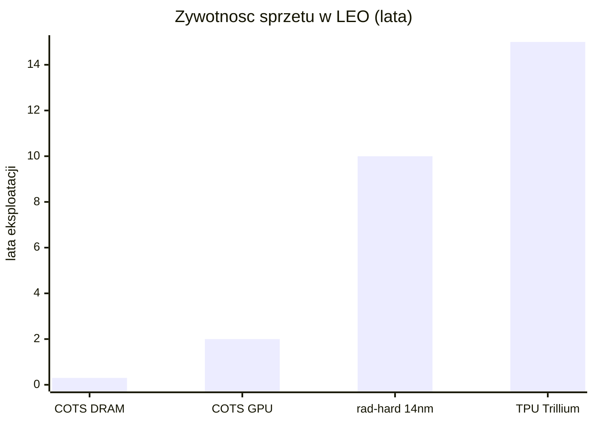

# Promieniowanie i elektronika rad-hard vs COTS

> Notatka raportu "Orbitalne centra danych". Kluczowe źródła: [źródło 1](https://arxiv.org/pdf/2512.09044), [źródło 2](https://indico.cern.ch/event/1137792/contributions/4792483/attachments/2416098/4134406/2022-03_R2E_CERN-KUKA.pdf).

## W skrócie

Sercem każdego pomysłu na centrum danych na orbicie jest pytanie, czy najnowsze, komercyjne czipy AI (jak Nvidia H100) przetrwają w środowisku, gdzie dawka promieniowania jest około 1000 razy wyższa niż na powierzchni Ziemi ([arXiv 2512.09044](https://arxiv.org/pdf/2512.09044)). Inwestor stoi tu przed twardym kompromisem kosztowym: elektronika "utwardzona radiacyjnie" (<abbr title="elektronika utwardzona radiacyjnie na poziomie krzemu, droga i o kilka generacji w tyle za komercyjną, ale bardzo odporna na promieniowanie.">rad-hard</abbr>) jest typowo około 100 razy droższa od zwykłej i jest o kilka generacji technologicznych w tyle ([CERN R2E](https://indico.cern.ch/event/1137792/contributions/4792483/attachments/2416098/4134406/2022-03_R2E_CERN-KUKA.pdf), [NASA Spinoff](https://spinoff.nasa.gov/Cutting-Edge_Computing_Goes_Spaceborne)), więc nie da się jej użyć do poważnych obciążeń AI bez utraty konkurencyjności wobec naziemnych GPU. Wygrywa więc strategia "tanie komercyjne czipy plus redundancja i ekranowanie", którą stosują HPE (657 dni bezbłędnej pracy na ISS), Google (Trillium TPU bez trwałych awarii do 15 krad) i Starcloud (pierwszy H100 w kosmosie) - ale ceną jest krótka żywotność rzędu około 2 lat oraz ryzyko nagłej, niszczącej awarii typu latch-up. Kto zyskuje: dostawcy szybkich GPU i firmy z dobrą architekturą redundancji; kto traci: tradycyjni dostawcy drogiej elektroniki rad-hard, jeśli model <abbr title="tania, najnowsza elektronika komercyjna &quot;z półki&quot;, bez fabrycznej ochrony radiacyjnej.">COTS</abbr> się sprawdzi w skali. Tempo zmian jest gwałtowne - pierwsze loty testowe (Starcloud-1, Suncatcher) odbywają się dopiero w latach 2025-2027, więc twardych, recenzowanych danych o najnowszych GPU wciąż brakuje.

<!-- spolki:related:start -->
## Spółki powiązane

> Notowane spółki produkujące podzespoły/technologie związane z tym tematem. Pełne omówienie: spółki, dla których nisza to >=33% przychodów; skrótowe: zdywersyfikowane konglomeraty. Zob. też [[Spolki/_slownik]] i [[Spolki/_widok-gpw-eu]].

**Pozostali dominujący gracze (nisza to ułamek przychodów - omówienie skrótowe):**
- [[Spolki/nvidia|NVIDIA Corporation (NVDA)]] - Akceleratory GPU (COTS) - ładunek obliczeniowy on-orbit
- [[Spolki/amd|Advanced Micro Devices, Inc. (AMD)]] - Rad-tolerant FPGA/SoC (Versal/Xilinx) + GPU
- [[Spolki/microchip|Microchip Technology Incorporated (MCHP)]] - Rad-hard/rad-tolerant FPGA (RTG4) i mikrokontrolery
- [[Spolki/bae-systems|BAE Systems plc (BA)]] 🇪🇺 - Rad-hard procesory (RAD750/RAD5545); optyka (Ball)
<!-- spolki:related:end -->

<!-- network:watki:start -->
## Powiązane wątki

> Mapa powiązań tematycznych - jak ten wątek łączy się z resztą raportu.

- [[03 - fizyka-orbitalna-orbity-i-operacje|Fizyka orbitalna]] - wybór orbity to wybór środowiska radiacyjnego (TID)
- [[08 - niezawodnosc-serwisowanie-i-cykl-zycia-sprzetu|Niezawodność i serwisowanie]] - dawka skumulowana wyznacza żywotność i MTBF elektroniki
- [[09 - ekonomika-i-koszty-calkowite-tco|Ekonomika i TCO]] - rad-hard vs COTS to kompromis koszt/wydajność wchodzący do TCO
- [[02 - weryfikacja-tez-sceptycznego-artykulu|Weryfikacja tez sceptyka]] - weryfikuje tezę o elektronice rad-hard "kilkaset razy droższej"
- [[15 - bezpieczenstwo-geopolityka-i-realizm-10-letni|Bezpieczeństwo i geopolityka]] - dual-use i kontrola eksportu chipów rad-hard
<!-- network:watki:end -->
## Środowisko radiacyjne: czym właściwie grozi orbita

Aby ocenić ryzyko inwestycyjne, trzeba zrozumieć pięć typów zagrożeń, które niszczą elektronikę w kosmosie. Każdy z nich ma własną jednostkę i własny mechanizm.

**<abbr title="skumulowana dawka jonizująca pochłonięta przez czip przez całą misję, powodująca powolne &quot;starzenie&quot; tranzystorów (mierzona w radach/grejach).">TID</abbr> (Total Ionizing Dose, całkowita dawka jonizująca)** to skumulowana dawka promieniowania pochłonięta przez czip w całym okresie misji, mierzona w radach lub gografach (1 krad = 10 Gy). To powolne "starzenie" - jak rdza, która stopniowo psuje tranzystory. Na niskiej orbicie okołoziemskiej (<abbr title="niska orbita okołoziemska (około 300-650 km) o relatywnie łagodnym środowisku radiacyjnym.">LEO</abbr>, Low Earth Orbit, około 300-650 km) na wysokości ISS NASA podaje dawkę rzędu 200 rad rocznie, głównie od cząstek uwięzionych w pasach Van Allena 🔵 ([NASA NTRS](https://ntrs.nasa.gov/api/citations/20220011775/downloads/Mission_Radiation_Modeling_STI.pdf)). Inne źródło wtórne szacuje dla LEO ISS z osłoną 5 mm aluminium TID na 430 rad(Si)/rok, a dla najczystszej orbity LEO-Zero tylko około 136 rad(Si)/rok 🟠 ([laser2cots](https://www.laser2cots.com/en/article/25.orbit.html)). Dla porównania orbita geostacjonarna (GEO, 36 000 km) daje już około 5930 rad(Si)/rok, a orbita transferowa GTO aż 59 630 rad(Si)/rok 🟠 ([laser2cots](https://www.laser2cots.com/en/article/25.orbit.html)). NASA NEPP podaje to inaczej, jako dawkę 7-letnią: LEO 5-10 krad, MEO (orbita średnia, przez pasy Van Allena) 10-100 krad, a GEO około 50 krad od promieniowania kosmicznego 🔵 ([NASA NEPP](https://nepp.nasa.gov/docuploads/B19AD2D1-FA12-4FD1-B11F2596C29F9475/HighPowerLDGuidelines20061.pdf)). Kluczowa liczba dla inwestora: na orbicie dawka jest około 1000 razy wyższa niż na Ziemi 🔵 ([arXiv 2512.09044](https://arxiv.org/pdf/2512.09044)). Implikacja: wybór orbity to wybór ryzyka - LEO jest relatywnie łagodne, ale przelot przez pasy Van Allena lub start na GEO drastycznie skraca życie sprzętu.

*Rys. 30 - Roczna dawka TID przy osłonie 5 mm aluminium: LEO-Zero 136, LEO ISS 430, GEO 5930, GTO aż 59 630 rad(Si)/rok. Wybór orbity to wybór ryzyka radiacyjnego. Dane: laser2cots.*

**<abbr title="nagłe efekty wywołane uderzeniem pojedynczej cząstki w tranzystor, obejmujące SEU, SEL i SET.">SEE</abbr> (Single-Event Effects, efekty pojedynczego zdarzenia)** to nagłe uderzenie jednej cząstki w tranzystor. Dzielą się na: SEU (Single-Event Upset, "przekręcenie bitu" - błąd danych, odwracalny restartem), SEL (Single-Event Latch-up, zwarcie, które może spalić czip) i SET (Single-Event Transient, krótki impuls zakłócający). Zmierzona stawka SEU na orbicie satelity Alsat-1 to 4,04 × 10⁻⁷ błędów na bit na dzień, przy czym 98,6% z nich to pojedyncze bity 🔵 ([Buchner et al.](https://ui.adsabs.harvard.edu/abs/2011AdSpR..48.1147B/abstract)). Dla porównania utwardzony układ AMD XQR Versal ma stawkę przekłamań w pamięci konfiguracji (CRAM) rzędu 6,5 × 10⁻¹² zdarzeń/bit/dzień na GEO i 3,5 × 10⁻⁹ na LEO 🔵 ([AMD DS946](https://docs.amd.com/r/en-US/ds946-xqr-versal-ai-core)) - czyli o rzędy wielkości lepiej niż surowy COTS. Implikacja: SEU są częste, ale dają się korygować programowo; prawdziwym zabójcą inwestycji jest SEL, który w sekundy zamienia czip w "stop metalu" ([newspaceeconomy](https://newspaceeconomy.ca/2025/11/03/an-analysis-of-radiation-protection-in-the-nvidia-h100-gpu/)).

**<abbr title="obszary wokół Ziemi, gdzie pole magnetyczne uwięziło naładowane cząstki, będące głównym źródłem dawki na niskiej orbicie.">Pasy Van Allena</abbr> i <abbr title="Anomalia Południowoatlantycka, region nad południowym Atlantykiem, gdzie pas radiacyjny schodzi nisko i drastycznie zwiększa strumień cząstek.">SAA</abbr> (South Atlantic Anomaly, Anomalia Południowoatlantycka)** to obszary, gdzie pole magnetyczne Ziemi "schodzi nisko" i koncentruje naładowane cząstki. Satelita LEO przechodzi przez SAA 9 na 15 orbit dziennie 🔵 ([NASA NTRS](https://ntrs.nasa.gov/api/citations/20220011775/downloads/Mission_Radiation_Modeling_STI.pdf)). Strumień protonów rośnie tam od 30 cząstek/(s·cm²) w spokojnych rejonach do ponad 200 000 w SAA i nad biegunami, a elektronów do 1 000 000/(s·cm²) 🔵 ([NASA NTRS](https://ntrs.nasa.gov/api/citations/20220011775/downloads/Mission_Radiation_Modeling_STI.pdf)). Energie protonów LEO mieszczą się w zakresie 0,1-50 MeV, czyli dokładnie tam, gdzie powstają uszkodzenia półprzewodników 🔵 ([NASA NTRS](https://ntrs.nasa.gov/api/citations/20220011775/downloads/Mission_Radiation_Modeling_STI.pdf)). Implikacja: większość rocznej dawki na LEO satelita zbiera w kilkunastominutowych przelotach przez SAA, co teoretycznie pozwala "uśpić" wrażliwe układy w tych oknach.

![[assets/x05-1-van-allen-probes-discov-new-rad-be.jpg]]
*Rys. 31 - Pasy radiacyjne Van Allena - srodowisko promieniowania na orbicie. Źródło: NASA, licencja: public domain.*
#grafika #promieniowanie-i-elektronika-rad-hard-vs-cots #promieniowanie #Van-Allen

**<abbr title="galaktyczne promieniowanie kosmiczne, nieustanny deszcz bardzo energetycznych jonów spoza Układu Słonecznego, którego nie da się rozsądnie wyekranować.">GCR</abbr> (Galactic Cosmic Rays, galaktyczne promieniowanie kosmiczne) i <abbr title="słoneczne zdarzenia cząstkowe, nagłe rozbłyski Słońca dorzucające dodatkową dawkę promieniowania.">SPE</abbr> (Solar Particle Events, słoneczne zdarzenia cząstkowe).** GCR to nieustanny deszcz ciężkich, bardzo energetycznych jonów spoza Układu Słonecznego - na GEO jego strumień to około 3000 cząstek/(s·m²·sr), sześć razy więcej niż na LEO 🔵 ([NASA NTRS](https://ntrs.nasa.gov/api/citations/20220011775/downloads/Mission_Radiation_Modeling_STI.pdf)), co potwierdza źródło wtórne (GCR około 6 razy wyższy na GEO niż LEO) 🟠 ([laser2cots](https://www.laser2cots.com/en/article/25.orbit.html)). SPE to nagłe rozbłyski Słońca - duże zdarzenia zdarzają się średnio 4 razy w roku, a uproszczona metoda NASA dolicza po 30 rad na rozbłysk, czyli dodatkowe 120 rad TID rocznie 🔵 ([NASA NTRS](https://ntrs.nasa.gov/api/citations/20220011775/downloads/Mission_Radiation_Modeling_STI.pdf)). Implikacja: GCR są nie do zatrzymania rozsądną osłoną (zbyt energetyczne), więc na GEO i w deep-space rad-hard staje się praktycznie obowiązkowy.

## COTS kontra rad-hard: koszty, opóźnienie generacyjne, wydajność

Sednem tezy inwestycyjnej jest pytanie, czy da się używać tanich, najnowszych komercyjnych czipów (COTS, Commercial Off-The-Shelf), czy trzeba sięgać po drogie, utwardzone radiacyjnie (rad-hard).

**Najnowsze COTS AI.** Nvidia H100 to czip z 80 miliardami tranzystorów w procesie 4 nm, oferujący około 3958 TFLOPS w formacie FP8 🔴 ([newspaceeconomy](https://newspaceeconomy.ca/2025/11/03/an-analysis-of-radiation-protection-in-the-nvidia-h100-gpu/), [newvib](https://www.newvib.com/tech/anthropic-and-spacex-partnership)). Ma wbudowaną korekcję błędów <abbr title="kod korekcyjny pamięci, który wykrywa i naprawia błędy bitowe (np. wywołane SEU).">ECC</abbr> (Error-Correcting Code) w pamięci HBM3, cache i rejestrach, ale - co kluczowe - nie ma żadnej fizycznej ochrony przed TID ani <abbr title="pasożytnicze zwarcie wywołane cząstką, które bez odcięcia zasilania może w sekundy trwale spalić czip.">SEL</abbr> 🔴 ([newspaceeconomy](https://newspaceeconomy.ca/2025/11/03/an-analysis-of-radiation-protection-in-the-nvidia-h100-gpu/)). Następca, Nvidia B200 (Blackwell), poleci na Starcloud-2 🟠 ([GeekWire](https://www.geekwire.com/2026/orbital-ai-seattle-area-startup-starcloud-hits-1-1b-valuation-to-build-space-based-data-centers/)). Google przetestował swój TPU Trillium v6e w wiązce protonów 67 MeV i nie zaobserwował trwałych awarii aż do 15 krad(Si), choć pamięć HBM wykazywała nieregularności już od 2 krad(Si) 🔵 ([arXiv 2511.19468](https://arxiv.org/abs/2511.19468)). Implikacja: najnowsze TPU/GPU mają zaskakująco dobrą odporność "z fabryki" dzięki małym geometriom i ECC, co podważa założenie, że bez rad-hard nic nie zadziała.

**Mitygacja COTS.** Zamiast utwardzać krzem, stosuje się: ECC (korekcja błędów pamięci), redundancję (kilka kopii danych/obliczeń), watchdog (układ pilnujący i restartujący zawieszony procesor) oraz "latch-up detection" - układ, który wykrywa zwarcie i na kilka sekund odcina zasilanie, czyszcząc je, zanim czip się spali 🔴 ([newspaceeconomy](https://newspaceeconomy.ca/2025/11/03/an-analysis-of-radiation-protection-in-the-nvidia-h100-gpu/)). Po stronie rad-hard standardem jest <abbr title="potrójne powielenie układu z głosowaniem większościowym, kosztem ponad 3x większej powierzchni i poboru mocy.">TMR</abbr> (Triple Modular Redundancy, potrójne powielenie układu z głosowaniem), które jednak wymaga ponad 3 razy większej powierzchni i ponad 3 razy większego poboru mocy 🔴 ([newspaceeconomy](https://newspaceeconomy.ca/2025/11/03/an-analysis-of-radiation-protection-in-the-nvidia-h100-gpu/)). Techniki architektoniczne (ECC, TMR, ochrona latch-up) dają narzut powierzchni od 10% do 300% 🔵 ([arXiv 2605.05615](https://arxiv.org/html/2605.05615v2)). U AMD mechanizm XilSEM daje około 30 razy lepszą ochronę CRAM niż wcześniejsze techniki 🟠 ([ESA SEFUW](https://indico.esa.int/event/531/contributions/10592/attachments/6538/11610/AMD%20XQR%20Versal%20Adaptive%20SoCs%20Enable%20Next-Generation%20Signal%20Processing%20and%20AI%20in%20Space%20-%20SEFUW%20Non-NDA%202025-03-25%20FINAL.pdf)) i osiąga 100% korygowalnych <abbr title="odwracalne &quot;przekręcenie bitu&quot;, czyli błąd danych, który można naprawić restartem.">SEU</abbr> w CRAM bez zdarzeń niekorygowalnych 🟠 ([nextbigfuture](https://www.nextbigfuture.com/2025/11/space-grade-chips-and-hundreds-of-megawatts-of-solar-in-space-exist-today.html)). Implikacja: redundancja kosztuje moc i masę, ale na orbicie energia bywa "darmowa" ze Słońca, więc nadmiarowy COTS może być tańszy całościowo niż rad-hard.

**Weryfikacja tezy "rad-hard kilkaset razy droższy".** Teza jest POTWIERDZONA z zastrzeżeniem zakresu. CERN podaje typową różnicę cen rzędu czynnika około 100 🔵 ([CERN R2E](https://indico.cern.ch/event/1137792/contributions/4792483/attachments/2416098/4134406/2022-03_R2E_CERN-KUKA.pdf)). W ujęciu bezwzględnym: procesor COTS kosztuje 10-500 USD, rad-tolerant/upscreened 500-5000 USD, a pełny rad-hard klasy V od 10 000 do ponad 200 000 USD za sztukę 🟠 ([Hubble](https://hubble.com/community/comparisons/why-radiation-hardening-matters-for-satellite-processors-and-what-it-costs/)). Skrajny przykład: zwykły układ czasowy 555 kosztuje grosze, a jego wersja rad-hard ponad 250 USD 🔴 ([cubesat.market](https://www.cubesat.market/post/how-to-turn-cots-hardware-into-space-grade-rad-hard-in-one-step)). Do tego dochodzi koszt samej certyfikacji COTS pod kosmos: charakteryzacja jednego układu pod SEE to 25-600 tys. USD zależnie od złożoności 🔵 ([CERN R2E](https://indico.cern.ch/event/1137792/contributions/4792483/attachments/2416098/4134406/2022-03_R2E_CERN-KUKA.pdf)). Implikacja: "kilkaset razy" jest prawdą dla prostych układów, ale dla high-endowych <abbr title="reprogramowalny układ logiczny (np. AMD XQR Versal), popularny w wersjach rad-hard dla zastosowań kosmicznych.">FPGA</abbr> rad-hard różnica jest bliższa 100x - inwestor nie powinien przyjmować mnożnika w ciemno.

*Rys. 32 - Górne granice cen jednostkowych: COTS 500 USD, rad-tolerant/upscreened 5000 USD, pełny rad-hard klasy V 200 000 USD. Skala liniowa uwypukla, że rad-hard jest o rzędy wielkości droższy (dolne progi to odpowiednio 10, 500 i 10 000 USD). Dane: Hubble.*

![[assets/x05-2-image26.png]]
*Rys. 33 - Koszt pamieci SRAM rad-hard vs COTS - skala roznicy cenowej. Źródło: UPSat MSc thesis, licencja: akademickie - do uzytku wlasnego.*
#grafika #promieniowanie-i-elektronika-rad-hard-vs-cots #rad-hard #COTS

**Opóźnienie generacyjne node'ów.** Rad-hard używa zwykle starych procesów technologicznych 150-65 nm, podczas gdy komercyjne układy są na 5 nm lub 3 nm 🟠 ([Hubble](https://hubble.com/community/comparisons/why-radiation-hardening-matters-for-satellite-processors-and-what-it-costs/)). NASA potwierdza, że komputery rad-hard "są zwykle o kilka generacji w tyle za aktualnym stanem techniki", a samo utwardzanie "zajmuje 10 lat i miliony dolarów" 🔵 ([NASA Spinoff](https://spinoff.nasa.gov/Cutting-Edge_Computing_Goes_Spaceborne)). Co więcej, utwardzony COTS osiąga tylko około 28-33% oryginalnej wydajności 🟠 ([NSF SHREC](https://www.nsf-shrec.org/sites/default/files/2024-03/Comparative-Analysis-of-Present-and-Future-Space-Processors-with-Device-Metrics.pdf)). Implikacja: to fundamentalny argument za COTS w AI - obciążenia AI wymagają najnowszego krzemu, a rad-hard z definicji go nie dostarcza.

**Przykłady rad-hard/rad-tolerant.** AMD XQR Versal XQRVC1902: TID 100-120 krad(Si), odporność na SEL powyżej 80 MeV·cm²/mg, 133 TOPS INT8, 1968 silników DSP, już używany w satelitach Starlink V2 mini 🔵🟠 ([AMD DS946](https://docs.amd.com/r/en-US/ds946-xqr-versal-ai-core), [nextbigfuture](https://www.nextbigfuture.com/2025/11/space-grade-chips-and-hundreds-of-megawatts-of-solar-in-space-exist-today.html)). Microchip SAMRH71: TID ponad 100 krad(Si), brak SEU do <abbr title="liniowy transfer energii cząstki, miara jej zdolności do wywołania uszkodzeń (jednostka MeV·cm²/mg, próg odporności na SEL/SEU).">LET</abbr> 20 MeV·cm²/mg bez mitygacji systemowej 🟠 ([electronicproducts](https://www.electronicproducts.com/cots-arm-core-mcus-deliver-quick-prototyping-for-space-applications/)). Dla porównania komercyjne moduły Nvidia Jetson w testach ESA: Xavier TID 22-24 krad (zasilany), Orin 37-39 krad (zasilany), oba 50 krad niezasilane; Xavier wolny od SEL poniżej 15 LET, Orin poniżej 30 LET 🟠 ([ESA/escies](https://escies.org/download/webDocumentFile?id=70931)). Implikacja: nawet "zwykłe" moduły AI Nvidia mają przyzwoitą odporność TID rzędu dziesiątek krad, co czyni je realną opcją dla krótkich misji LEO.

*Rys. 34 - Próg odporności TID: TPU Trillium 15 krad(Si) bez twardych awarii, Jetson Xavier 22-24 krad (tu 23), Jetson Orin 37-39 krad (tu 38), rad-hard AMD XQR Versal 100-120 krad (tu 110). Dane: arXiv 2511.19468 (Trillium), ESA/escies (Jetson), AMD DS946 (XQR Versal).*

## Ekranowanie: masa osłony kontra zysk

Ekranowanie (<abbr title="osłona materiałowa (np. 5 mm aluminium) zatrzymująca cząstki, której masa wprost obciąża koszt wynoszenia na orbitę.">shielding</abbr>) zatrzymuje cząstki materiałem, ale każdy gram osłony to gram, który trzeba wynieść na orbitę - więc to wprost koszt. Standardem są 5 mm aluminium, eliminujące cząstki o niskiej energii 🔵 ([NASA NTRS Neuromorphic](https://ntrs.nasa.gov/api/citations/20220011806/downloads/Neuromorphic_RadiationModeling.pdf)). Rozróżnia się dwa podejścia: "box shielding" (osłona całego pudełka, prosta, ale ciężka) i "spot shielding" (punktowa osłona pojedynczego czipa) - do tego drugiego używa się folii tantalowej, materiału o wysokiej liczbie atomowej (high-Z), nakładanej wprost na obudowę czipa 🔵 ([NASA NTRS Neuromorphic](https://ntrs.nasa.gov/api/citations/20220011806/downloads/Neuromorphic_RadiationModeling.pdf)). W projekcie UPenn osłona z około 20 mm mieszanki woda+aluminium wokół każdego węzła daje szacowaną dawkę około 10 Gy (1 krad) rocznie na wysokości 1600 km 🔵 ([arXiv 2512.09044](https://arxiv.org/pdf/2512.09044)). To istotne, bo wcześniejsze testy NASA pokazały, że komercyjne (nieutwardzone) GPU nie ulegały trwałej awarii do dawek 60 Gy (6 krad) 🔵 ([arXiv 2512.09044](https://arxiv.org/pdf/2512.09044)), co potwierdza niezależne badanie (5 GPU testowane do 6 krad, żadna karta nie uległa trwałej awarii) 🟠 ([MDU](https://www.es.mdu.se/pdf_publications/5854.pdf)). Komercyjny dysk SSD Foremay SC199 z ekranowaniem typu Graded-Z obniża dawkę z 10 000 krad do 500 krad 🔴 ([systerra](https://systerra.de)). Blogowe źródło szacuje TID dla LEO 500 km na 10-20 krad rocznie 🔴 ([adsbnetwork](https://www.adsbnetwork.com/mypov/Starcloud/physics.html)). Implikacja: ekranowanie kilkoma mm-cm materiału może sprowadzić dawkę poniżej progu trwałych uszkodzeń COTS GPU na LEO, co jest fizyczną podstawą całej tezy o komercyjnych czipach w kosmosie - ale masa osłony bezpośrednio obniża rentowność wynoszenia.

## Heritage lotny: co już naprawdę poleciało

Dla inwestora najważniejsze są nie modele, lecz fakty z lotu (flight heritage).

**HPE Spaceborne Computer-1 (SBC-1) na ISS.** To kluczowy dowód, że COTS działa w kosmosie. SBC-1 (komercyjny serwer bez utwardzania) pracował na ISS przez 657 dni, osiągnął 1,1 TFLOPS w benchmarku Linpack i nigdy nie zwrócił błędnego wyniku ani nie miał przerwania z winy komputera 🟠 ([ISS National Lab](https://issnationallab.org/upward/hpe-supercomputing-return-space/)). Co znamienne: najdłuższa publicznie prognozowana żywotność SBC-1 wynosiła zaledwie 4 dni, "bo nie zrobiliśmy nic ze sprzętem" - a przetrwał 657 dni dzięki samej mitygacji programowej (spowalnianie i przechodzenie w stan bezpieczny w trudnych warunkach) 🔵🟠 ([NASA Spinoff](https://spinoff.nasa.gov/Cutting-Edge_Computing_Goes_Spaceborne), [ISS National Lab](https://issnationallab.org/upward/hpe-supercomputing-return-space/)). Awaryjność widać w danych: z 20 dysków SSD 9 uległo awarii podczas misji, ale dzięki redundancji nie utracono danych 🟠 ([ISS National Lab](https://issnationallab.org/upward/hpe-supercomputing-return-space/)). Następca SBC-2 ma 2x większą moc i zawiera GPU oraz funkcje AI 🟠 ([ISS National Lab](https://issnationallab.org/upward/hpe-supercomputing-return-space/)). Implikacja: redundancja programowa potrafi rozciągnąć żywotność COTS z dni do lat - to walidacja całego modelu, ale 45% awaryjność SSD pokazuje, że nadmiarowość sprzętu jest obowiązkowa.

**Demo Starcloud z H100 (DO POTWIERDZENIA).** Starcloud-1 wystartował w listopadzie 2025 z pierwszym GPU Nvidia H100 w kosmosie - to satelita o masie 60 kg, wielkości mini-lodówki 🔴🟠 ([starcloud.com](https://www.starcloud.com/starcloud-1), [nextbigfuture](https://www.nextbigfuture.com/2025/11/nvidia-h100-is-in-space-on-starcloud-1.html)). Nominalna misja to 11 miesięcy, po czym satelita zejdzie z orbity 325 km i spłonie 🟠 ([SDxCentral](https://www.sdxcentral.com/news/lumen-orbit-rebrands-to-starcloud-raises-another-10m-for-in-orbit-data-centers/)). W grudniu Starcloud-1 jako pierwszy satelita uruchomił wersję modelu Gemini w kosmosie i jako pierwszy statek wytrenował LLM (model nanoGPT Andreja Karpathy'ego) 🔴 ([starcloud.com](https://www.starcloud.com/starcloud-1)). UWAGA: większość danych o Starcloud pochodzi ze źródeł weak (materiały firmowe, blogi), brakuje recenzowanych wyników radiacyjnych - dlatego te twierdzenia oznaczam jako DO POTWIERDZENIA. Project Suncatcher (Google/Planet) planuje start 2 prototypów na początek 2027 roku, docelowo klaster 81 satelitów w promieniu 1 km na wysokości 650 km, z łączem optycznym 1,6 Tbps 🔵 ([arXiv 2511.19468](https://arxiv.org/abs/2511.19468)). Implikacja: rok 2025-2027 to faza "pierwszych demonstratorów" - inwestor kupuje obietnicę, nie sprawdzoną w wieloletniej eksploatacji technologię.

## Żywotność elektroniki vs dawka skumulowana i MTBF

<abbr title="średni czas między awariami, kluczowa metryka rentowności określająca, jak często trzeba wymieniać sprzęt.">MTBF</abbr> (Mean Time Between Failures, średni czas między awariami) i żywotność to ostateczne metryki rentowności - im krócej żyje czip, tym częściej trzeba go wymieniać/dowozić. NASA JSC dla testów SEE wymaga minimum 10¹⁰ protonów/cm² (przy 200 MeV) lub 10⁶ ciężkich jonów/cm², i przypisuje MTBF 10 lat dla niszczących latch-upów niewidzianych w teście minimalnym 🔵 ([NASA JSC](https://ntrs.nasa.gov/api/citations/20150002993/downloads/20150002993.pdf)). W testach naziemnych karta MSI HD6450 (z GPU AMD) osiągnęła najlepszy wynik 43,1 dnia MTTFI (mean time to functional interrupt) 🟠 ([MDU](https://www.es.mdu.se/pdf_publications/5854.pdf)). Literatura naukowa podaje, że komercyjne GPU w LEO działają typowo tylko około 2 lata, COTS DRAM może paść w ciągu miesięcy, a moduł Jetson Nano przestaje działać po około 2 latach z powodu TID, DD (Displacement Damage) i SEE 🔵 ([arXiv 2605.05615](https://arxiv.org/html/2605.05615v2)). Dla kontrastu konfiguracja rad-hard (projekt 14 nm rad-tolerant) celuje w 10 lat eksploatacji 🔵 ([arXiv 2605.05615](https://arxiv.org/html/2605.05615v2)), a Google szacuje żywotność TPU Trillium na około 15 lat, bo brak twardych awarii do 15 krad (150 Gy) odpowiada około 15 latom na orbicie 🔵 ([arXiv 2512.09044](https://arxiv.org/pdf/2512.09044)). Implikacja: rozpiętość żywotności jest ogromna (miesiące dla DRAM, około 2 lata dla GPU, do 15 lat dla najlepszych TPU/rad-hard) - i to ona decyduje, czy orbitalne DC ma sens ekonomiczny, bo każda wymiana sprzętu wymaga kolejnego startu rakiety.

*Rys. 35 - Szacowana żywotność na orbicie LEO: COTS DRAM rzędu miesięcy (około 0,3 roku), COTS GPU około 2 lata, konfiguracja rad-hard 14 nm 10 lat, TPU Trillium do 15 lat. To żywotność decyduje o ekonomii orbitalnego DC. Dane: arXiv 2605.05615 (LLMSpace), arXiv 2512.09044 (UPenn).*

## Kontrowersje

**Kontrowersja 1: Czy COTS + redundancja wystarcza dla obciążeń AI, czy konieczny jest rad-hard?**

**Strona A - COTS + redundancja wystarcza (dla LEO/NewSpace).** HPE SBC-1 (czysty COTS) pracował 657 dni bez ani jednego błędnego wyniku 🟠 ([ISS National Lab](https://issnationallab.org/upward/hpe-supercomputing-return-space/)). Starcloud-1 z H100 działa w LEO i wytrenował LLM 🔴 ([starcloud.com](https://www.starcloud.com/starcloud-1)). Google Trillium przetrwał 15 krad TID bez twardych awarii 🔵 ([arXiv 2511.19468](https://arxiv.org/abs/2511.19468)). SpaceX Starlink V2 mini używa węzłów Intel Atom i SoC ARM z "programowo definiowaną redundancją zamiast utwardzania sprzętowego" 🔴 ([tempmail.ninja](https://tempmail.ninja/blog/spacex-linux-computers-orbital-fleet)).

**Strona B - COTS bez rad-hard jest niewystarczający dla misji wieloletnich/krytycznych.** H100 nie ma żadnej fizycznej ochrony przed TID/SEL 🔴 ([newspaceeconomy](https://newspaceeconomy.ca/2025/11/03/an-analysis-of-radiation-protection-in-the-nvidia-h100-gpu/)). Komercyjne GPU w LEO żyją typowo tylko około 2 lata 🔵 ([arXiv 2605.05615](https://arxiv.org/html/2605.05615v2)). SEL może w sekundy "stopić czip w żużel", jeśli zasilanie nie zostanie odcięte 🔴 ([newspaceeconomy](https://newspaceeconomy.ca/2025/11/03/an-analysis-of-radiation-protection-in-the-nvidia-h100-gpu/)). Pełny rad-hard pozostaje wymagany dla GEO, obronności i misji flagowych 🟠 ([Hubble](https://hubble.com/community/comparisons/why-radiation-hardening-matters-for-satellite-processors-and-what-it-costs/)). Nie uśredniam: spór jest realny i zależy od orbity (LEO sprzyja COTS, GEO/deep-space wymaga rad-hard) oraz horyzontu misji (krótka demo vs wieloletnia eksploatacja).

**Kontrowersja 2: Rozbieżność danych o żywotności najnowszych GPU pod promieniowaniem**

Dane są realnie rozbieżne. Modelowana awaryjność H100 to 9%/rok 🔴 ([adsbnetwork](https://www.adsbnetwork.com/mypov/Starcloud/physics.html)), ale rzeczywista zmierzona na Starcloud-1 to 5%/rok, czyli lepiej niż model 🔴 ([adsbnetwork](https://www.adsbnetwork.com/mypov/Starcloud/physics.html)). Szacowana żywotność H100 z ekranowaniem to 2-3 lata 🔴 ([adsbnetwork](https://www.adsbnetwork.com/mypov/Starcloud/physics.html)), spójna z literaturową wartością około 2 lat dla COTS GPU w LEO 🔵 ([arXiv 2605.05615](https://arxiv.org/html/2605.05615v2)). Tymczasem nominalna misja Starcloud-1 to tylko 11 miesięcy 🟠 ([SDxCentral](https://www.sdxcentral.com/news/lumen-orbit-rebrands-to-starcloud-raises-another-10m-for-in-orbit-data-centers/)) - czyli za krótka, by zweryfikować te szacunki. Komentarz faktyczny: dane są niepełne i nieporównywalne między orbitami, poziomem ekranowania i definicją "awarii". Starcloud-1 działa krótko i nie publikuje szczegółowych danych radiacyjnych; ADS-B Network to blog analityczny bez dostępu do surowych danych. W literaturze recenzowanej brak publicznych wyników testów H100/B200 pod promieniowaniem - to luka, której inwestor nie powinien lekceważyć.

## Słowniczek pojęć

- **TID (Total Ionizing Dose)** - skumulowana dawka jonizująca pochłonięta przez czip przez całą misję, powodująca powolne "starzenie" tranzystorów (mierzona w radach/grejach).
- **SEE (Single-Event Effects)** - nagłe efekty wywołane uderzeniem pojedynczej cząstki w tranzystor, obejmujące SEU, SEL i SET.
- **SEU (Single-Event Upset)** - odwracalne "przekręcenie bitu", czyli błąd danych, który można naprawić restartem.
- **SEL (Single-Event Latch-up)** - pasożytnicze zwarcie wywołane cząstką, które bez odcięcia zasilania może w sekundy trwale spalić czip.
- **SET (Single-Event Transient)** - krótki, przejściowy impuls zakłócający sygnał wywołany przez cząstkę.
- **rad-hard (radiation-hardened)** - elektronika utwardzona radiacyjnie na poziomie krzemu, droga i o kilka generacji w tyle za komercyjną, ale bardzo odporna na promieniowanie.
- **COTS (Commercial Off-The-Shelf)** - tania, najnowsza elektronika komercyjna "z półki", bez fabrycznej ochrony radiacyjnej.
- **ECC (Error-Correcting Code)** - kod korekcyjny pamięci, który wykrywa i naprawia błędy bitowe (np. wywołane SEU).
- **TMR (Triple Modular Redundancy)** - potrójne powielenie układu z głosowaniem większościowym, kosztem ponad 3x większej powierzchni i poboru mocy.
- **Pasy Van Allena** - obszary wokół Ziemi, gdzie pole magnetyczne uwięziło naładowane cząstki, będące głównym źródłem dawki na niskiej orbicie.
- **SAA (South Atlantic Anomaly)** - Anomalia Południowoatlantycka, region nad południowym Atlantykiem, gdzie pas radiacyjny schodzi nisko i drastycznie zwiększa strumień cząstek.
- **GCR (Galactic Cosmic Rays)** - galaktyczne promieniowanie kosmiczne, nieustanny deszcz bardzo energetycznych jonów spoza Układu Słonecznego, którego nie da się rozsądnie wyekranować.
- **SPE (Solar Particle Events)** - słoneczne zdarzenia cząstkowe, nagłe rozbłyski Słońca dorzucające dodatkową dawkę promieniowania.
- **LEO (Low Earth Orbit)** - niska orbita okołoziemska (około 300-650 km) o relatywnie łagodnym środowisku radiacyjnym.
- **MTBF (Mean Time Between Failures)** - średni czas między awariami, kluczowa metryka rentowności określająca, jak często trzeba wymieniać sprzęt.
- **shielding (ekranowanie)** - osłona materiałowa (np. 5 mm aluminium) zatrzymująca cząstki, której masa wprost obciąża koszt wynoszenia na orbitę.
- **FPGA (Field-Programmable Gate Array)** - reprogramowalny układ logiczny (np. AMD XQR Versal), popularny w wersjach rad-hard dla zastosowań kosmicznych.
- **LET (Linear Energy Transfer)** - liniowy transfer energii cząstki, miara jej zdolności do wywołania uszkodzeń (jednostka MeV·cm²/mg, próg odporności na SEL/SEU).

## Źródła

- 🔵 [NASA NTRS - Mission Radiation Modeling (Alena 2022)](https://ntrs.nasa.gov/api/citations/20220011775/downloads/Mission_Radiation_Modeling_STI.pdf) - środowisko radiacyjne LEO, TID, SAA, GCR, SPE.
- 🔵 [NASA NEPP - High Power Laser Diode Guidelines](https://nepp.nasa.gov/docuploads/B19AD2D1-FA12-4FD1-B11F2596C29F9475/HighPowerLDGuidelines20061.pdf) - dawki 7-letnie LEO/MEO/GEO.
- 🔵 [NASA JSC E-22](https://ntrs.nasa.gov/api/citations/20150002993/downloads/20150002993.pdf) - minimalne wymogi testów SEE, MTBF latch-up.
- 🔵 [NASA NTRS - Neuromorphic Radiation Modeling](https://ntrs.nasa.gov/api/citations/20220011806/downloads/Neuromorphic_RadiationModeling.pdf) - ekranowanie 5 mm Al, tantal spot shielding.
- 🔵 [NASA Spinoff - Cutting-Edge Computing Goes Spaceborne](https://spinoff.nasa.gov/Cutting-Edge_Computing_Goes_Spaceborne) - opóźnienie generacyjne rad-hard, SBC-1.
- 🔵 [arXiv 2511.19468 - Project Suncatcher (Google/Planet)](https://arxiv.org/abs/2511.19468) - testy radiacyjne Trillium TPU, architektura klastra.
- 🔵 [arXiv 2512.09044 - Tethered ODC (UPenn/Bargatin)](https://arxiv.org/pdf/2512.09044) - dawka 1000x, ekranowanie, COTS GPU do 60 Gy.
- 🔵 [arXiv 2605.05615 - LLMSpace](https://arxiv.org/html/2605.05615v2) - żywotność COTS vs rad-hard, narzut ECC/TMR.
- 🔵 [AMD DS946 - XQR Versal AI Core](https://docs.amd.com/r/en-US/ds946-xqr-versal-ai-core) - stawki SEU CRAM, TID, SEL.
- 🔵 [CERN R2E - COTS vs rad-hard](https://indico.cern.ch/event/1137792/contributions/4792483/attachments/2416098/4134406/2022-03_R2E_CERN-KUKA.pdf) - różnica ceny ~100x, koszt charakteryzacji.
- 🔵 [Buchner et al. - Alsat-1 SEU](https://ui.adsabs.harvard.edu/abs/2011AdSpR..48.1147B/abstract) - zmierzona stawka SEU na orbicie.
- 🟠 [laser2cots - Radiation Assessment by Orbit](https://www.laser2cots.com/en/article/25.orbit.html) - porównanie TID/GCR/SPE między orbitami.
- 🟠 [ISS National Lab - HPE Supercomputing Returns from Space](https://issnationallab.org/upward/hpe-supercomputing-return-space/) - dane SBC-1 (657 dni, 1.1 TFLOPS, 9/20 SSD).
- 🟠 [Hubble - Why Radiation Hardening Matters](https://hubble.com/community/comparisons/why-radiation-hardening-matters-for-satellite-processors-and-what-it-costs/) - koszty COTS/rad-tolerant/rad-hard, node.
- 🟠 [ESA/escies - GPU4Space testy](https://escies.org/download/webDocumentFile?id=70931) - Jetson Xavier/Orin TID i SEFI.
- 🟠 [NSF SHREC - Comparative Analysis of Space Processors](https://www.nsf-shrec.org/sites/default/files/2024-03/Comparative-Analysis-of-Present-and-Future-Space-Processors-with-Device-Metrics.pdf) - wydajność po hardeningu 28-33%.
- 🟠 [nextbigfuture - Space-Grade Chips](https://www.nextbigfuture.com/2025/11/space-grade-chips-and-hundreds-of-megawatts-of-solar-in-space-exist-today.html) - XQRVC1902 TOPS, XilSEM, Starlink V2 mini.
- 🟠 [GeekWire - Starcloud $1.1B valuation](https://www.geekwire.com/2026/orbital-ai-seattle-area-startup-starcloud-hits-1-1b-valuation-to-build-space-based-data-centers/) - Starcloud-2 z B200.
- 🟠 [ESA SEFUW - AMD XQR Versal](https://indico.esa.int/event/531/contributions/10592/attachments/6538/11610/AMD%20XQR%20Versal%20Adaptive%20SoCs%20Enable%20Next-Generation%20Signal%20Processing%20and%20AI%20in%20Space%20-%20SEFUW%20Non-NDA%202025-03-25%20FINAL.pdf) - XilSEM 30x ochrona CRAM.
- 🟠 [electronicproducts - SAMRH71 MCU](https://www.electronicproducts.com/cots-arm-core-mcus-deliver-quick-prototyping-for-space-applications/) - rad-hard MCU TID/SEU.
- 🟠 [MDU - GPU radiation test](https://www.es.mdu.se/pdf_publications/5854.pdf) - MTTFI 43.1 dnia, 6 krad bez trwałej awarii.
- 🟠 [SDxCentral - Lumen Orbit/Starcloud](https://www.sdxcentral.com/news/lumen-orbit-rebrands-to-starcloud-raises-another-10m-for-in-orbit-data-centers/) - misja Starcloud-1 11 miesięcy.
- 🟠 [nextbigfuture - H100 on Starcloud-1](https://www.nextbigfuture.com/2025/11/nvidia-h100-is-in-space-on-starcloud-1.html) - masa 60 kg.
- 🔴 [newspaceeconomy - Radiation Protection in H100](https://newspaceeconomy.ca/2025/11/03/an-analysis-of-radiation-protection-in-the-nvidia-h100-gpu/) - brak ochrony TID/SEL, ECC, TMR, latch-up.
- 🔴 [starcloud.com - Starcloud-1](https://www.starcloud.com/starcloud-1) - pierwszy H100, LLM w kosmosie (materiał firmowy).
- 🔴 [adsbnetwork - Starcloud physics](https://www.adsbnetwork.com/mypov/Starcloud/physics.html) - awaryjność GPU 5%/9%, żywotność 2-3 lata (blog).
- 🔴 [newvib - H100 FP8](https://www.newvib.com/tech/anthropic-and-spacex-partnership) - 3958 TFLOPS FP8.
- 🔴 [cubesat.market - rad-hard 555](https://www.cubesat.market/post/how-to-turn-cots-hardware-into-space-grade-rad-hard-in-one-step) - 555 timer $250+.
- 🔴 [tempmail.ninja - SpaceX Linux](https://tempmail.ninja/blog/spacex-linux-computers-orbital-fleet) - Starlink Intel Atom/ARM redundancja.
- 🔴 [systerra - Foremay SC199](https://systerra.de) - SSD Graded-Z 10000 -> 500 krad.

## Dane źródłowe

- `200 rad/rok (LEO ISS TID)` | https://ntrs.nasa.gov/api/citations/20220011775/downloads/Mission_Radiation_Modeling_STI.pdf | primary | "Total dose is now 200 Rads per year, mostly from the trapped particles of the Van Allen belts."
- `430 rad(Si)/rok (LEO ISS, 5mm Al)` | https://www.laser2cots.com/en/article/25.orbit.html | secondary | "Table 3 Calculated DRM TIDs with 5 mm AL shielding ... LEO ISS ... Total TID 430."
- `136 rad(Si)/rok (LEO-Zero)` | https://www.laser2cots.com/en/article/25.orbit.html | secondary | "LEO-Zero: ~136 rad ... TID is based on 1 year in orbit, 5mm AL shielding."
- `5930 rad(Si)/rok (GEO)` | https://www.laser2cots.com/en/article/25.orbit.html | secondary | "GEO: ~5,930 rad ... TID is based on 1 year in orbit, 5mm AL shielding."
- `59630 rad(Si)/rok (GTO)` | https://www.laser2cots.com/en/article/25.orbit.html | secondary | "GTO: ~59,630 rad (Highest among orbits) ... TID is based on 1 year in orbit, 5mm AL shielding."
- `5-10 krad/7 lat (LEO)` | https://nepp.nasa.gov/docuploads/B19AD2D1-FA12-4FD1-B11F2596C29F9475/HighPowerLDGuidelines20061.pdf | primary | "the LEO (Lower Earth Orbit) missions can see background radiation between 5 to 10 Krads accumulating most of that dose during passes through the SAA (South Atlantic Anomaly)."
- `10-100 krad/7 lat (MEO)` | https://nepp.nasa.gov/docuploads/B19AD2D1-FA12-4FD1-B11F2596C29F9475/HighPowerLDGuidelines20061.pdf | primary | "The MEO (Middle Earth Orbit) path passes through the Van Allen Belts resulting in total dose accumulation between 10 to 100 Krads."
- `~50 krad/7 lat (GEO)` | https://nepp.nasa.gov/docuploads/B19AD2D1-FA12-4FD1-B11F2596C29F9475/HighPowerLDGuidelines20061.pdf | primary | "The GEO orbit (Geosynchronous Earth Orbit) environment is dominated by dose from cosmic rays to a level of around 50 Krads due to a travel path above the Van Allen Belts."
- `1000x wyższa dawka niż na Ziemi` | https://arxiv.org/pdf/2512.09044 | primary | "This ionizing radiation dose is approximately 1000 times higher than at Earth's surface"
- `9/15 orbity/dzień przez SAA` | https://ntrs.nasa.gov/api/citations/20220011775/downloads/Mission_Radiation_Modeling_STI.pdf | primary | "It goes through the SAA multiple times a day (9/15 orbits) and gets near the polar regions with their enhanced particle flux."
- `200000 protonów/(s·cm²) w SAA` | https://ntrs.nasa.gov/api/citations/20220011775/downloads/Mission_Radiation_Modeling_STI.pdf | primary | "Trapped protons in LEO orbit range in flux from 30 particles/sec-cm2 in the benign regions to over 200,000 when in the SAA or near the poles."
- `1000000 elektronów/(s·cm²) w SAA` | https://ntrs.nasa.gov/api/citations/20220011775/downloads/Mission_Radiation_Modeling_STI.pdf | primary | "Electrons are more prevalent near the poles and range from 10,000 to 1,000,000, both in the SAA and near the poles."
- `0.1-50 MeV (energia protonów LEO)` | https://ntrs.nasa.gov/api/citations/20220011775/downloads/Mission_Radiation_Modeling_STI.pdf | primary | "The energy ranges from 0.1 Mev to around 50 MeV for protons, which are in the range that produces effects in semiconductors."
- `6x wyższy GCR na GEO niz LEO` | https://www.laser2cots.com/en/article/25.orbit.html | secondary | "GCR Flux ... ~6 times higher than in LEO"
- `3000 cząstek/(s·m²·sr) GCR na GEO` | https://ntrs.nasa.gov/api/citations/20220011775/downloads/Mission_Radiation_Modeling_STI.pdf | primary | "The GCR contribution is about 3000 particles/sec-m2-steradian, which is a factor of six over LEO orbits."
- `4 duze SPE/rok srednio` | https://ntrs.nasa.gov/api/citations/20220011775/downloads/Mission_Radiation_Modeling_STI.pdf | primary | "While major events occur about four times a year, minor events are occurring much more frequently"
- `120 rad/rok od SPE` | https://ntrs.nasa.gov/api/citations/20220011775/downloads/Mission_Radiation_Modeling_STI.pdf | primary | "This document simply adds 30 rad for each solar flare event, which occur four times a year on average. This results in an additional TID of 120 Rads per annum."
- `4.04e-7 SEU/bit/dzień (Alsat-1)` | https://ui.adsabs.harvard.edu/abs/2011AdSpR..48.1147B/abstract | primary | "The in-orbit observations show that the typical SEU rate at Alsat-1's orbit is 4.04 × 10-7 SEU/bit/day"
- `98.6% SEU pojedynczych bitów` | https://ui.adsabs.harvard.edu/abs/2011AdSpR..48.1147B/abstract | primary | "98.6% of these SEUs cause single-bit errors, 1.22% cause double-byte errors"
- `6.5e-12 zdarzeń/bit/dzień (CRAM SEU GEO)` | https://docs.amd.com/r/en-US/ds946-xqr-versal-ai-core | primary | "SEUCRAM ... Single-event upset in configuration RAM ... 6.5 x 10-12 Event/bit/day"
- `3.5e-9 zdarzeń/bit/dzień (CRAM SEU LEO)` | https://docs.amd.com/r/en-US/ds946-xqr-versal-ai-core | primary | "SEUCRAM ... Single-event upset in configuration RAM ... 3.5 x 10-9 Event/bit/day"
- `80 mld tranzystorów (H100)` | https://newspaceeconomy.ca/2025/11/03/an-analysis-of-radiation-protection-in-the-nvidia-h100-gpu/ | weak | "A single H100 GPU contains 80 billion transistors"
- `4 nm (proces H100)` | https://newspaceeconomy.ca/2025/11/03/an-analysis-of-radiation-protection-in-the-nvidia-h100-gpu/ | weak | "The transistors on a chip like the H100 are unimaginably small, manufactured at a 4-nanometer scale."
- `3958 TFLOPS FP8 (H100)` | https://www.newvib.com/tech/anthropic-and-spacex-partnership | weak | "An H100 delivers roughly 3,958 TFLOPS of FP8 tensor performance."
- `Brak ochrony fizycznej TID/SEL (H100)` | https://newspaceeconomy.ca/2025/11/03/an-analysis-of-radiation-protection-in-the-nvidia-h100-gpu/ | weak | "The H100 is in no way 'radiation-hardened' or 'radiation-tolerant.' It lacks any physical protection against the high-energy particles, Total Ionizing Dose (TID), and Single Event Latch-up (SEL) events."
- `B200 na Starcloud-2` | https://www.geekwire.com/2026/orbital-ai-seattle-area-startup-starcloud-hits-1-1b-valuation-to-build-space-based-data-centers/ | secondary | "Its next milestone will be the launch later this year of Starcloud-2, a satellite with 100 times the power generation capacity of the first and featuring Nvidia's Blackwell B200 chip"
- `15 krad(Si) bez twardych awarii (Trillium)` | https://arxiv.org/abs/2511.19468 | primary | "No hard failures attributable to total ionizing dose occurred up to the maximum tested dose of 15 krad(Si) on a single chip"
- `2 krad(Si) nieregularności HBM (Trillium)` | https://arxiv.org/abs/2511.19468 | primary | "the High Bandwidth Memory (HBM) subsystems were the most sensitive component, displaying irregularities only after cumulative exposure of 2 krad(Si)"
- `67 MeV wiązka protonów (Trillium)` | https://arxiv.org/abs/2511.19468 | primary | "Google tested Trillium, the company's v6e Cloud TPU, in a 67 MeV proton beam"
- `750 rad(Si) oczekiwana 5-letnia dawka` | https://arxiv.org/abs/2511.19468 | primary | "nearly three times the expected shielded five-year mission dose of 750 rad(Si)"
- `22-24 krad(Si) TID (Xavier biased)` | https://escies.org/download/webDocumentFile?id=70931 | secondary | "Xavier ... TID Bias Lower limit: 22 Krad ... TID Bias Upper limit: 24 Krad"
- `37-39 krad(Si) TID (Orin biased)` | https://escies.org/download/webDocumentFile?id=70931 | secondary | "Orin ... TID Bias Lower limit: 37 Krad ... TID Bias Upper limit: 39 Krad"
- `50 krad(Si) TID (Orin/Xavier unbiased)` | https://escies.org/download/webDocumentFile?id=70931 | secondary | "TID Unbiased limit: 50 Krad"
- `SEL-free below 15 LET (Xavier), 30 LET (Orin)` | https://escies.org/download/webDocumentFile?id=70931 | secondary | "Xavier ... SEL free below 15 LET ... Orin ... SEL free below 30 LET"
- `$10-500 sztuka (COTS procesor)` | https://hubble.com/community/comparisons/why-radiation-hardening-matters-for-satellite-processors-and-what-it-costs/ | secondary | "A commercial off-the-shelf (COTS) processor runs $10 to $500, depending on capability."
- `$500-5000 sztuka (rad-tolerant)` | https://hubble.com/community/comparisons/why-radiation-hardening-matters-for-satellite-processors-and-what-it-costs/ | secondary | "A radiation-tolerant or upscreened COTS part costs $500 to $5,000."
- `$10000-200000+ sztuka (full rad-hard Class V)` | https://hubble.com/community/comparisons/why-radiation-hardening-matters-for-satellite-processors-and-what-it-costs/ | secondary | "A full radiation hardened, Class V space grade processor costs $10,000 to $200,000 or more per unit."
- `~100x drozszy rad-hard vs COTS` | https://indico.cern.ch/event/1137792/contributions/4792483/attachments/2416098/4134406/2022-03_R2E_CERN-KUKA.pdf | primary | "Price → typical price differences between COTS and rad-hard counter part are factor ~100"
- `$250+ sztuka (rad-hard 555 timer)` | https://www.cubesat.market/post/how-to-turn-cots-hardware-into-space-grade-rad-hard-in-one-step | weak | "take the humble and ubiquitous 555 timer, the terrestrial version costs a few cents and the rad-hard version costs US$250+"
- `25-600 tys. USD koszt testowania SEE COTS` | https://indico.cern.ch/event/1137792/contributions/4792483/attachments/2416098/4134406/2022-03_R2E_CERN-KUKA.pdf | primary | "It is estimated that the full cost of characterizing a COTS device for space ranges between 25 and 600 kUSD, depending on its complexity."
- `150-65 nm (rad-hard) vs 5-3 nm (commercial)` | https://hubble.com/community/comparisons/why-radiation-hardening-matters-for-satellite-processors-and-what-it-costs/ | secondary | "Rad-hard processors typically use older process nodes, often 150nm to 65nm ... Meanwhile, commercial processors sit on 5nm or 3nm processes."
- `kilka generacji za (rad-hard vs COTS)` | https://spinoff.nasa.gov/Cutting-Edge_Computing_Goes_Spaceborne | primary | "radiation-hardened computers 'are usually several generations behind the current state of the art'"
- `10 lat i miliony USD (czas/koszt rad-hard)` | https://spinoff.nasa.gov/Cutting-Edge_Computing_Goes_Spaceborne | primary | "radiation hardening ... takes 10 years and millions of dollars"
- `28-33% wydajnosci COTS po hardeningu` | https://www.nsf-shrec.org/sites/default/files/2024-03/Comparative-Analysis-of-Present-and-Future-Space-Processors-with-Device-Metrics.pdf | secondary | "RadHard processors achieve ~28-33% of original COTS performance (CD)"
- `100-120 krad(Si) TID (AMD XQRVC1902)` | https://docs.amd.com/r/en-US/ds946-xqr-versal-ai-core | primary | "TID ... Total ionizing dose ... 100 ... 120 Krad (Si)"
- `80 MeV·cm²/mg SEL immunity (XQRVC1902)` | https://docs.amd.com/r/en-US/ds946-xqr-versal-ai-core | primary | "SEL ... Single-event latch-up immunity ... 80 MeV-cm2/mg"
- `133 TOPS INT8 (XQRVC1902)` | https://www.nextbigfuture.com/2025/11/space-grade-chips-and-hundreds-of-megawatts-of-solar-in-space-exist-today.html | secondary | "Performance metrics (133 TOPS INT8, 1,968 DSP engines) are unchanged"
- `1968 DSP engines (XQRVC1902)` | https://www.nextbigfuture.com/2025/11/space-grade-chips-and-hundreds-of-megawatts-of-solar-in-space-exist-today.html | secondary | "Performance metrics (133 TOPS INT8, 1,968 DSP engines)"
- `Starlink V2 mini używa AMD XQR Versal` | https://www.nextbigfuture.com/2025/11/space-grade-chips-and-hundreds-of-megawatts-of-solar-in-space-exist-today.html | secondary | "SpaceX has put them into Starlink V2 mini satellites already."
- `>100 krad(Si) TID (Microchip SAMRH71)` | https://www.electronicproducts.com/cots-arm-core-mcus-deliver-quick-prototyping-for-space-applications/ | secondary | "The SAMRH71 radiation-hardened MCU ... Accumulated TID of more than 100 Krad (Si)"
- `20 MeV·cm²/mg SEU LET (SAMRH71)` | https://www.electronicproducts.com/cots-arm-core-mcus-deliver-quick-prototyping-for-space-applications/ | secondary | "No Single Event Upset (SEU) Linear Energy Transfer (LET) up to 20 MeV.cm²/mg, without system mitigation"
- `TMR >3x area/power (rad-hard)` | https://newspaceeconomy.ca/2025/11/03/an-analysis-of-radiation-protection-in-the-nvidia-h100-gpu/ | weak | "It requires more than three times the chip area, consumes more than three times the power"
- `XilSEM 30x lepsza ochrona CRAM` | https://indico.esa.int/event/531/contributions/10592/attachments/6538/11610/AMD%20XQR%20Versal%20Adaptive%20SoCs%20Enable%20Next-Generation%20Signal%20Processing%20and%20AI%20in%20Space%20-%20SEFUW%20Non-NDA%202025-03-25%20FINAL.pdf | secondary | "XiISEM uses the hardwired TMR MicroBlaze processors ... Approx 30 times greater protection than previous techniques"
- `100% correctable SEUs in CRAM (XQR Versal)` | https://www.nextbigfuture.com/2025/11/space-grade-chips-and-hundreds-of-megawatts-of-solar-in-space-exist-today.html | secondary | "XilSEM ... achieving 100% correctable SEUs in CRAM without uncorrectable events"
- `10% do 300% narzut area od ECC/TMR` | https://arxiv.org/html/2605.05615v2 | primary | "architectural techniques-including error-correcting codes (ECCs), triple modular redundancy (TMR), and latch-up protection ... introduce area overheads ranging from 10% to 300%"
- `9/20 SSD failed (HPE SBC-1)` | https://issnationallab.org/upward/hpe-supercomputing-return-space/ | secondary | "out of 20 solid-state disks, 9 failed during the mission. The system had redundant copies of all data, so no data was lost"
- `latch-up power-cycle czyści zwarcie` | https://newspaceeconomy.ca/2025/11/03/an-analysis-of-radiation-protection-in-the-nvidia-h100-gpu/ | weak | "special 'latch-up detection' circuitry ... immediately cuts the power to the chip for a few seconds. This power-cycle 'clears' the short circuit"
- `SEL może spalić chip w sekundy` | https://newspaceeconomy.ca/2025/11/03/an-analysis-of-radiation-protection-in-the-nvidia-h100-gpu/ | weak | "the chip will physically melt itself into slag in a matter of seconds."
- `5 mm Al standardowe ekranowanie` | https://ntrs.nasa.gov/api/citations/20220011806/downloads/Neuromorphic_RadiationModeling.pdf | primary | "Lowering the TID using 5 mm of aluminum shielding is standard practice for space avionics by eliminating low energy particles"
- `tantal spot shielding high-Z` | https://ntrs.nasa.gov/api/citations/20220011806/downloads/Neuromorphic_RadiationModeling.pdf | primary | "Tantalum foil is often used for additional shielding using a high-Z material applied directly to chip packages"
- `~10 Gy/rok (1 krad) @1600 km, 20mm water+Al` | https://arxiv.org/pdf/2512.09044 | primary | "The ~20mm thick water+aluminum shield around each node yields an estimated ionizing radiation dose of ~10 Gray (1 krad) per year at 1600 km based on SPENVIS modeling"
- `60 Gy (6 krad) bez trwałych uszkodzeń COTS GPU` | https://arxiv.org/pdf/2512.09044 | primary | "previous NASA studies of commercial (i.e., not radiation hardened) GPUs showed that none of the GPUs experienced permanent failure at doses up to 60 Gray (6 krad)"
- `10-20 krad/rok TID LEO 500 km` | https://www.adsbnetwork.com/mypov/Starcloud/physics.html | weak | "TID (Total Ionizing Dose) LEO 500 km ... 10-20 krad/an"
- `3900x more sensitive H100 vs RAD750` | https://www.adsbnetwork.com/mypov/Starcloud/physics.html | weak | "GPU H100 (4nm) sensitivity ... ×3 900 vs RAD750"
- `657 dni pracy SBC-1 na ISS` | https://issnationallab.org/upward/hpe-supercomputing-return-space/ | secondary | "Spaceborne Computer-1 (SBC-1), remained on the ISS for more than 1.5 years (657 days)"
- `1.1 TFLOPS osiągnięte przez SBC-1` | https://issnationallab.org/upward/hpe-supercomputing-return-space/ | secondary | "running an impressive 1.1 trillion calculations per second."
- `0 incorrect answers/interrupts (SBC-1)` | https://issnationallab.org/upward/hpe-supercomputing-return-space/ | secondary | "never once got an incorrect answer or had an interrupt due to the computer"
- `4 dni najdluzsza prognozowana zywotnosc SBC-1` | https://spinoff.nasa.gov/Cutting-Edge_Computing_Goes_Spaceborne | primary | "The longest publicly stated life expectancy for Spaceborne-1 was four days, because we did nothing to the hardware at all."
- `GPU + AI w SBC-2` | https://issnationallab.org/upward/hpe-supercomputing-return-space/ | secondary | "SBC-2 ... will also feature twice the processing power and will include graphics processing units and other artificial intelligence and edge processing capabilities"
- `2025-11 start Starcloud-1, 1x H100` | https://www.starcloud.com/starcloud-1 | weak | "Starcloud-1 launched in November 2025 with the first Nvidia H100 GPU in space"
- `60 kg (Starcloud-1)` | https://www.nextbigfuture.com/2025/11/nvidia-h100-is-in-space-on-starcloud-1.html | secondary | "The 60 kg satellite, about the size of a mini-fridge, carries an NVIDIA H100 GPU"
- `11 miesięcy nominalna misja Starcloud-1` | https://www.sdxcentral.com/news/lumen-orbit-rebrands-to-starcloud-raises-another-10m-for-in-orbit-data-centers/ | secondary | "The expected mission lifetime is 11 months, after which the satellite will de-orbit from its 325 km orbit and burn up."
- `5%/rok rzeczywista awaryjność GPU (Starcloud-1)` | https://www.adsbnetwork.com/mypov/Starcloud/physics.html | weak | "GPU failure/yr (Starcloud-1 actual) 5%"
- `9%/rok szacowana awaryjność GPU (model)` | https://www.adsbnetwork.com/mypov/Starcloud/physics.html | weak | "GPU failure/yr (2025 estimate) 9%"
- `2-3 lata szacowana żywotność H100 z ekranowaniem` | https://www.adsbnetwork.com/mypov/Starcloud/physics.html | weak | "GPU lifespan with shielding 2-3 ans"
- `Gemini / nanoGPT pierwszy LLM trenowany w kosmosie` | https://www.starcloud.com/starcloud-1 | weak | "the first spacecraft to train an LLM - the nano GPT model from Andrej Karpathy."
- `2027-Q1 start 2 prototypów Suncatcher` | https://arxiv.org/abs/2511.19468 | primary | "two prototype satellites slated for launch by early 2027"
- `81 satelitów w klastrze 1 km` | https://arxiv.org/abs/2511.19468 | primary | "We illustrate the basic approach to formation flight via a 81-satellite cluster of 1 km radius"
- `650 km wysokość orbity` | https://arxiv.org/abs/2511.19468 | primary | "at an average cluster altitude of 650 kilometers"
- `1.6 Tbps testy łącza optycznego` | https://arxiv.org/abs/2511.19468 | primary | "Early lab tests achieved 800 Gbps per direction (1.6 Tbps total) between two nodes"
- `43.1 dni MTTFI (MSI HD6450)` | https://www.es.mdu.se/pdf_publications/5854.pdf | secondary | "MSI HD6450 employed with AMD's GPU has performed the best and recorded 43.1 days of MTTFI (the mean time to functional interrupt)."
- `6 krad testowane COTS GPU bez trwałych uszkodzeń` | https://www.es.mdu.se/pdf_publications/5854.pdf | secondary | "Top three among five GPUs were chosen to test under the total dose of 6 krad. ... None of the cards failed in a permanent failure"
- `10 lat MTBF (NASA JSC latch-up)` | https://ntrs.nasa.gov/api/citations/20150002993/downloads/20150002993.pdf | primary | "an MTBF of 10 years shall be assigned for errors such as destructive latchups NOT seen in the minimum test"
- `1e10 protonów/cm² (minimum NASA JSC)` | https://ntrs.nasa.gov/api/citations/20150002993/downloads/20150002993.pdf | primary | "200 MeV (+/- 10 MeV) protons to a fluence of 1e10 protons/cm2"
- `1e6 jonów/cm² (minimum NASA JSC heavy ions)` | https://ntrs.nasa.gov/api/citations/20150002993/downloads/20150002993.pdf | primary | "Heavy ions producing Linear Energy Transfer (LETs) of from 1 MeV/(mg/cm2) to 14 MeV/(mg/cm2) ... to a fluence of 1e6 ions/cm2"
- `~2 lata typowa żywotność COTS GPU w LEO` | https://arxiv.org/html/2605.05615v2 | primary | "COTS GPUs ... typically operate for only ~2 years"
- `miesiące - żywotność COTS DRAM w LEO` | https://arxiv.org/html/2605.05615v2 | primary | "COTS DRAM ... may fail within months"
- `~2 lata COTS Jetson Nano w LEO` | https://arxiv.org/html/2605.05615v2 | primary | "COTS ceases operation after ~2 years in orbit due to TID, DD, and SEE"
- `10 lat rad-hard konfiguracja (LLMSpace)` | https://arxiv.org/html/2605.05615v2 | primary | "The rad-hard configuration employs a 14 nm radiation-tolerant design ... targets a 10-year operational lifetime"
- `15 lat szacowana żywotność TPU Trillium przy 15 krad` | https://arxiv.org/pdf/2512.09044 | primary | "full machine learning workloads operated without any hard failures at doses up to 15 krad (150 Gy), which would be achieved after about 15 years on orbit"
- `Foremay SC199 Graded-Z: 10000 krad -> 500 krad` | https://systerra.de | weak | "Graded-Z shielding: 10 000 krad → 500 krad"
- `Starlink Intel Atom/ARM + redundancja swarm` | https://tempmail.ninja/blog/spacex-linux-computers-orbital-fleet | weak | "Starlink V2 Mini satellites utilize Intel Atom-based nodes and ARM-based SoCs ... software-defined redundancy rather than hardware hardening"
