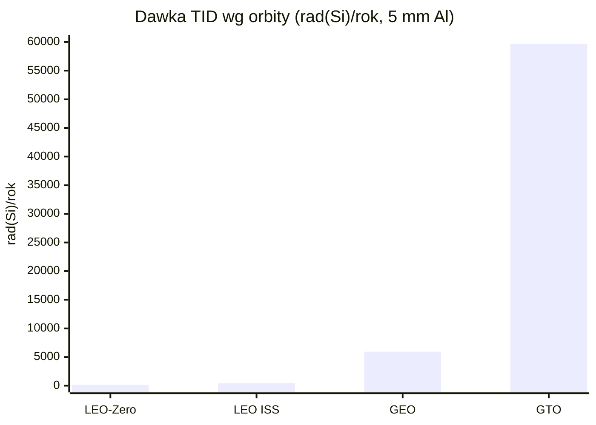
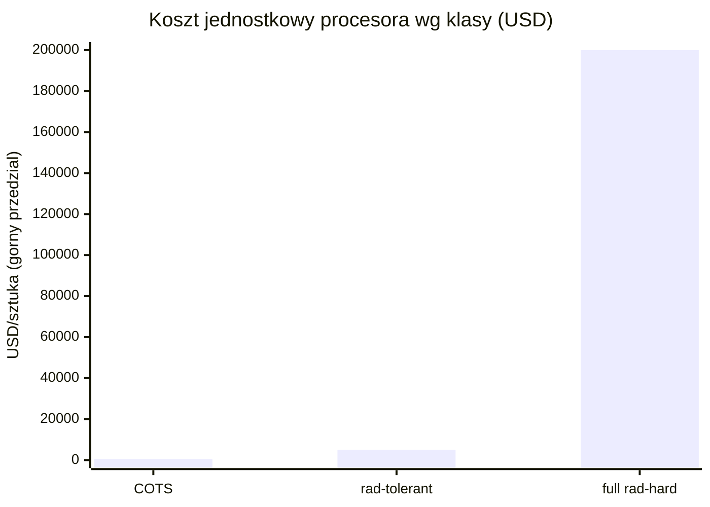
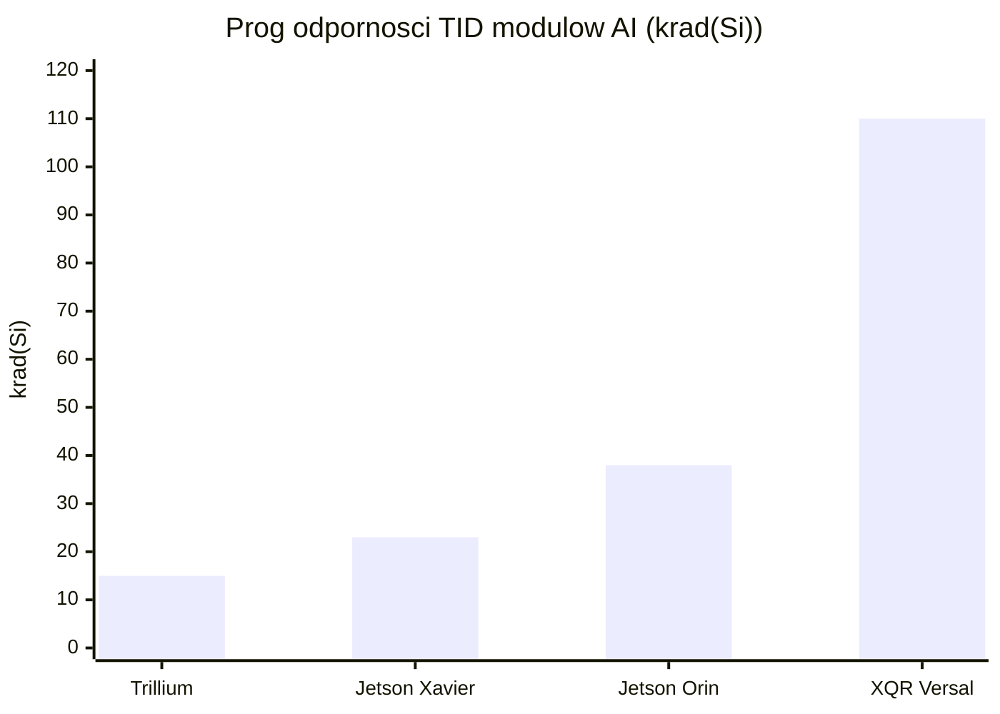
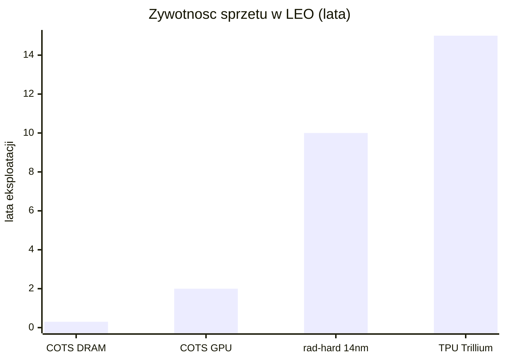

# Promieniowanie i elektronika rad-hard vs COTS

> Notatka raportu "Orbitalne centra danych". Kluczowe źródła: [źródło 1](https://arxiv.org/pdf/2512.09044), [źródło 2](https://indico.cern.ch/event/1137792/contributions/4792483/attachments/2416098/4134406/2022-03_R2E_CERN-KUKA.pdf).

## W skrócie

Sercem każdego pomysłu na centrum danych na orbicie jest pytanie, czy najnowsze, komercyjne czipy AI (jak Nvidia H100) przetrwają w środowisku, gdzie dawka promieniowania jest około 1000 razy wyższa niż na powierzchni Ziemi ([arXiv 2512.09044](https://arxiv.org/pdf/2512.09044)). Inwestor stoi tu przed twardym kompromisem kosztowym: elektronika "utwardzona radiacyjnie" (<abbr title="elektronika utwardzona radiacyjnie na poziomie krzemu, droga i o kilka generacji w tyle za komercyjną, ale bardzo odporna na promieniowanie.">rad-hard</abbr>) jest typowo około 100 razy droższa od zwykłej i jest o kilka generacji technologicznych w tyle ([CERN R2E](https://indico.cern.ch/event/1137792/contributions/4792483/attachments/2416098/4134406/2022-03_R2E_CERN-KUKA.pdf), [NASA Spinoff](https://spinoff.nasa.gov/Cutting-Edge_Computing_Goes_Spaceborne)), więc nie da się jej użyć do poważnych obciążeń AI bez utraty konkurencyjności wobec naziemnych GPU. Wygrywa więc strategia "tanie komercyjne czipy plus redundancja i ekranowanie", którą stosują HPE (657 dni bezbłędnej pracy na ISS), Google (Trillium TPU bez trwałych awarii do 15 krad) i Starcloud (pierwszy H100 w kosmosie) - ale ceną jest krótka żywotność rzędu około 2 lat oraz ryzyko nagłej, niszczącej awarii typu latch-up. Kto zyskuje: dostawcy szybkich GPU i firmy z dobrą architekturą redundancji; kto traci: tradycyjni dostawcy drogiej elektroniki rad-hard, jeśli model <abbr title="tania, najnowsza elektronika komercyjna &quot;z półki&quot;, bez fabrycznej ochrony radiacyjnej.">COTS</abbr> się sprawdzi w skali. Tempo zmian jest gwałtowne - pierwsze loty testowe (Starcloud-1, Suncatcher) odbywają się dopiero w latach 2025-2027, więc twardych, recenzowanych danych o najnowszych GPU wciąż brakuje.

<!-- spolki:related:start -->
## Spółki powiązane

> Notowane spółki produkujące podzespoły/technologie związane z tym tematem. Pełne omówienie: spółki, dla których nisza to >=33% przychodów; skrótowe: zdywersyfikowane konglomeraty. Zob. też [[Spolki/_slownik]] i [[Spolki/_widok-gpw-eu]].

**Pozostali dominujący gracze (nisza to ułamek przychodów - omówienie skrótowe):**
- [[Spolki/nvidia|NVIDIA Corporation (NVDA)]] - Akceleratory GPU (COTS) - ładunek obliczeniowy on-orbit
- [[Spolki/amd|Advanced Micro Devices, Inc. (AMD)]] - Rad-tolerant FPGA/SoC (Versal/Xilinx) + GPU
- [[Spolki/microchip|Microchip Technology Incorporated (MCHP)]] - Rad-hard/rad-tolerant FPGA (RTG4) i mikrokontrolery
- [[Spolki/bae-systems|BAE Systems plc (BA)]] 🇪🇺 - Rad-hard procesory (RAD750/RAD5545); optyka (Ball)
<!-- spolki:related:end -->

<!-- network:watki:start -->
## Powiązane wątki

> Mapa powiązań tematycznych - jak ten wątek łączy się z resztą raportu.

- [[03 - fizyka-orbitalna-orbity-i-operacje|Fizyka orbitalna]] - wybór orbity to wybór środowiska radiacyjnego (TID)
- [[08 - niezawodnosc-serwisowanie-i-cykl-zycia-sprzetu|Niezawodność i serwisowanie]] - dawka skumulowana wyznacza żywotność i MTBF elektroniki
- [[09 - ekonomika-i-koszty-calkowite-tco|Ekonomika i TCO]] - rad-hard vs COTS to kompromis koszt/wydajność wchodzący do TCO
- [[02 - weryfikacja-tez-sceptycznego-artykulu|Weryfikacja tez sceptyka]] - weryfikuje tezę o elektronice rad-hard "kilkaset razy droższej"
- [[15 - bezpieczenstwo-geopolityka-i-realizm-10-letni|Bezpieczeństwo i geopolityka]] - dual-use i kontrola eksportu chipów rad-hard
<!-- network:watki:end -->
## Środowisko radiacyjne: czym właściwie grozi orbita

Aby ocenić ryzyko inwestycyjne, trzeba zrozumieć pięć typów zagrożeń, które niszczą elektronikę w kosmosie. Każdy z nich ma własną jednostkę i własny mechanizm.

**<abbr title="skumulowana dawka jonizująca pochłonięta przez czip przez całą misję, powodująca powolne &quot;starzenie&quot; tranzystorów (mierzona w radach/grejach).">TID</abbr> (Total Ionizing Dose, całkowita dawka jonizująca)** to skumulowana dawka promieniowania pochłonięta przez czip w całym okresie misji, mierzona w radach lub gografach (1 krad = 10 Gy). To powolne "starzenie" - jak rdza, która stopniowo psuje tranzystory. Na niskiej orbicie okołoziemskiej (<abbr title="niska orbita okołoziemska (około 300-650 km) o relatywnie łagodnym środowisku radiacyjnym.">LEO</abbr>, Low Earth Orbit, około 300-650 km) na wysokości ISS NASA podaje dawkę rzędu 200 rad rocznie, głównie od cząstek uwięzionych w pasach Van Allena ([NASA NTRS](https://ntrs.nasa.gov/api/citations/20220011775/downloads/Mission_Radiation_Modeling_STI.pdf)). Inne źródło wtórne szacuje dla LEO ISS z osłoną 5 mm aluminium TID na 430 rad(Si)/rok, a dla najczystszej orbity LEO-Zero tylko około 136 rad(Si)/rok ([laser2cots](https://www.laser2cots.com/en/article/25.orbit.html)). Dla porównania orbita geostacjonarna (GEO, 36 000 km) daje już około 5930 rad(Si)/rok, a orbita transferowa GTO aż 59 630 rad(Si)/rok ([laser2cots](https://www.laser2cots.com/en/article/25.orbit.html)). NASA NEPP podaje to inaczej, jako dawkę 7-letnią: LEO 5-10 krad, MEO (orbita średnia, przez pasy Van Allena) 10-100 krad, a GEO około 50 krad od promieniowania kosmicznego ([NASA NEPP](https://nepp.nasa.gov/docuploads/B19AD2D1-FA12-4FD1-B11F2596C29F9475/HighPowerLDGuidelines20061.pdf)). Kluczowa liczba dla inwestora: na orbicie dawka jest około 1000 razy wyższa niż na Ziemi ([arXiv 2512.09044](https://arxiv.org/pdf/2512.09044)). Implikacja: wybór orbity to wybór ryzyka - LEO jest relatywnie łagodne, ale przelot przez pasy Van Allena lub start na GEO drastycznie skraca życie sprzętu.

*Rys. 30 - Roczna dawka TID przy osłonie 5 mm aluminium: LEO-Zero 136, LEO ISS 430, GEO 5930, GTO aż 59 630 rad(Si)/rok. Wybór orbity to wybór ryzyka radiacyjnego. Dane: laser2cots.*

**<abbr title="nagłe efekty wywołane uderzeniem pojedynczej cząstki w tranzystor, obejmujące SEU, SEL i SET.">SEE</abbr> (Single-Event Effects, efekty pojedynczego zdarzenia)** to nagłe uderzenie jednej cząstki w tranzystor. Dzielą się na: SEU (Single-Event Upset, "przekręcenie bitu" - błąd danych, odwracalny restartem), SEL (Single-Event Latch-up, zwarcie, które może spalić czip) i SET (Single-Event Transient, krótki impuls zakłócający). Zmierzona stawka SEU na orbicie satelity Alsat-1 to 4,04 × 10⁻⁷ błędów na bit na dzień, przy czym 98,6% z nich to pojedyncze bity ([Buchner et al.](https://ui.adsabs.harvard.edu/abs/2011AdSpR..48.1147B/abstract)). Dla porównania utwardzony układ AMD XQR Versal ma stawkę przekłamań w pamięci konfiguracji (CRAM) rzędu 6,5 × 10⁻¹² zdarzeń/bit/dzień na GEO i 3,5 × 10⁻⁹ na LEO ([AMD DS946](https://docs.amd.com/r/en-US/ds946-xqr-versal-ai-core)) - czyli o rzędy wielkości lepiej niż surowy COTS. Implikacja: SEU są częste, ale dają się korygować programowo; prawdziwym zabójcą inwestycji jest SEL, który w sekundy zamienia czip w "stop metalu" ([newspaceeconomy](https://newspaceeconomy.ca/2025/11/03/an-analysis-of-radiation-protection-in-the-nvidia-h100-gpu/)).

**<abbr title="obszary wokół Ziemi, gdzie pole magnetyczne uwięziło naładowane cząstki, będące głównym źródłem dawki na niskiej orbicie.">Pasy Van Allena</abbr> i <abbr title="Anomalia Południowoatlantycka, region nad południowym Atlantykiem, gdzie pas radiacyjny schodzi nisko i drastycznie zwiększa strumień cząstek.">SAA</abbr> (South Atlantic Anomaly, Anomalia Południowoatlantycka)** to obszary, gdzie pole magnetyczne Ziemi "schodzi nisko" i koncentruje naładowane cząstki. Satelita LEO przechodzi przez SAA 9 na 15 orbit dziennie ([NASA NTRS](https://ntrs.nasa.gov/api/citations/20220011775/downloads/Mission_Radiation_Modeling_STI.pdf)). Strumień protonów rośnie tam od 30 cząstek/(s·cm²) w spokojnych rejonach do ponad 200 000 w SAA i nad biegunami, a elektronów do 1 000 000/(s·cm²) ([NASA NTRS](https://ntrs.nasa.gov/api/citations/20220011775/downloads/Mission_Radiation_Modeling_STI.pdf)). Energie protonów LEO mieszczą się w zakresie 0,1-50 MeV, czyli dokładnie tam, gdzie powstają uszkodzenia półprzewodników ([NASA NTRS](https://ntrs.nasa.gov/api/citations/20220011775/downloads/Mission_Radiation_Modeling_STI.pdf)). Implikacja: większość rocznej dawki na LEO satelita zbiera w kilkunastominutowych przelotach przez SAA, co teoretycznie pozwala "uśpić" wrażliwe układy w tych oknach.

![[assets/x05-1-van-allen-probes-discov-new-rad-be.jpg]]
*Rys. 31 - Pasy radiacyjne Van Allena - srodowisko promieniowania na orbicie. Źródło: NASA, licencja: public domain.*
#grafika #promieniowanie-i-elektronika-rad-hard-vs-cots #promieniowanie #Van-Allen

**<abbr title="galaktyczne promieniowanie kosmiczne, nieustanny deszcz bardzo energetycznych jonów spoza Układu Słonecznego, którego nie da się rozsądnie wyekranować.">GCR</abbr> (Galactic Cosmic Rays, galaktyczne promieniowanie kosmiczne) i <abbr title="słoneczne zdarzenia cząstkowe, nagłe rozbłyski Słońca dorzucające dodatkową dawkę promieniowania.">SPE</abbr> (Solar Particle Events, słoneczne zdarzenia cząstkowe).** GCR to nieustanny deszcz ciężkich, bardzo energetycznych jonów spoza Układu Słonecznego - na GEO jego strumień to około 3000 cząstek/(s·m²·sr), sześć razy więcej niż na LEO ([NASA NTRS](https://ntrs.nasa.gov/api/citations/20220011775/downloads/Mission_Radiation_Modeling_STI.pdf)), co potwierdza źródło wtórne (GCR około 6 razy wyższy na GEO niż LEO) ([laser2cots](https://www.laser2cots.com/en/article/25.orbit.html)). SPE to nagłe rozbłyski Słońca - duże zdarzenia zdarzają się średnio 4 razy w roku, a uproszczona metoda NASA dolicza po 30 rad na rozbłysk, czyli dodatkowe 120 rad TID rocznie ([NASA NTRS](https://ntrs.nasa.gov/api/citations/20220011775/downloads/Mission_Radiation_Modeling_STI.pdf)). Implikacja: GCR są nie do zatrzymania rozsądną osłoną (zbyt energetyczne), więc na GEO i w deep-space rad-hard staje się praktycznie obowiązkowy.

## COTS kontra rad-hard: koszty, opóźnienie generacyjne, wydajność

Sednem tezy inwestycyjnej jest pytanie, czy da się używać tanich, najnowszych komercyjnych czipów (COTS, Commercial Off-The-Shelf), czy trzeba sięgać po drogie, utwardzone radiacyjnie (rad-hard).

**Najnowsze COTS AI.** Nvidia H100 to czip z 80 miliardami tranzystorów w procesie 4 nm, oferujący około 3958 TFLOPS w formacie FP8 ([newspaceeconomy](https://newspaceeconomy.ca/2025/11/03/an-analysis-of-radiation-protection-in-the-nvidia-h100-gpu/), [newvib](https://www.newvib.com/tech/anthropic-and-spacex-partnership)). Ma wbudowaną korekcję błędów <abbr title="kod korekcyjny pamięci, który wykrywa i naprawia błędy bitowe (np. wywołane SEU).">ECC</abbr> (Error-Correcting Code) w pamięci HBM3, cache i rejestrach, ale - co kluczowe - nie ma żadnej fizycznej ochrony przed TID ani <abbr title="pasożytnicze zwarcie wywołane cząstką, które bez odcięcia zasilania może w sekundy trwale spalić czip.">SEL</abbr> ([newspaceeconomy](https://newspaceeconomy.ca/2025/11/03/an-analysis-of-radiation-protection-in-the-nvidia-h100-gpu/)). Następca, Nvidia B200 (Blackwell), poleci na Starcloud-2 ([GeekWire](https://www.geekwire.com/2026/orbital-ai-seattle-area-startup-starcloud-hits-1-1b-valuation-to-build-space-based-data-centers/)). Google przetestował swój TPU Trillium v6e w wiązce protonów 67 MeV i nie zaobserwował trwałych awarii aż do 15 krad(Si), choć pamięć HBM wykazywała nieregularności już od 2 krad(Si) ([arXiv 2511.19468](https://arxiv.org/abs/2511.19468)). Implikacja: najnowsze TPU/GPU mają zaskakująco dobrą odporność "z fabryki" dzięki małym geometriom i ECC, co podważa założenie, że bez rad-hard nic nie zadziała.

**Mitygacja COTS.** Zamiast utwardzać krzem, stosuje się: ECC (korekcja błędów pamięci), redundancję (kilka kopii danych/obliczeń), watchdog (układ pilnujący i restartujący zawieszony procesor) oraz "latch-up detection" - układ, który wykrywa zwarcie i na kilka sekund odcina zasilanie, czyszcząc je, zanim czip się spali ([newspaceeconomy](https://newspaceeconomy.ca/2025/11/03/an-analysis-of-radiation-protection-in-the-nvidia-h100-gpu/)). Po stronie rad-hard standardem jest <abbr title="potrójne powielenie układu z głosowaniem większościowym, kosztem ponad 3x większej powierzchni i poboru mocy.">TMR</abbr> (Triple Modular Redundancy, potrójne powielenie układu z głosowaniem), które jednak wymaga ponad 3 razy większej powierzchni i ponad 3 razy większego poboru mocy ([newspaceeconomy](https://newspaceeconomy.ca/2025/11/03/an-analysis-of-radiation-protection-in-the-nvidia-h100-gpu/)). Techniki architektoniczne (ECC, TMR, ochrona latch-up) dają narzut powierzchni od 10% do 300% ([arXiv 2605.05615](https://arxiv.org/html/2605.05615v2)). U AMD mechanizm XilSEM daje około 30 razy lepszą ochronę CRAM niż wcześniejsze techniki ([ESA SEFUW](https://indico.esa.int/event/531/contributions/10592/attachments/6538/11610/AMD%20XQR%20Versal%20Adaptive%20SoCs%20Enable%20Next-Generation%20Signal%20Processing%20and%20AI%20in%20Space%20-%20SEFUW%20Non-NDA%202025-03-25%20FINAL.pdf)) i osiąga 100% korygowalnych <abbr title="odwracalne &quot;przekręcenie bitu&quot;, czyli błąd danych, który można naprawić restartem.">SEU</abbr> w CRAM bez zdarzeń niekorygowalnych ([nextbigfuture](https://www.nextbigfuture.com/2025/11/space-grade-chips-and-hundreds-of-megawatts-of-solar-in-space-exist-today.html)). Implikacja: redundancja kosztuje moc i masę, ale na orbicie energia bywa "darmowa" ze Słońca, więc nadmiarowy COTS może być tańszy całościowo niż rad-hard.

**Weryfikacja tezy "rad-hard kilkaset razy droższy".** Teza jest POTWIERDZONA z zastrzeżeniem zakresu. CERN podaje typową różnicę cen rzędu czynnika około 100 ([CERN R2E](https://indico.cern.ch/event/1137792/contributions/4792483/attachments/2416098/4134406/2022-03_R2E_CERN-KUKA.pdf)). W ujęciu bezwzględnym: procesor COTS kosztuje 10-500 USD, rad-tolerant/upscreened 500-5000 USD, a pełny rad-hard klasy V od 10 000 do ponad 200 000 USD za sztukę ([Hubble](https://hubble.com/community/comparisons/why-radiation-hardening-matters-for-satellite-processors-and-what-it-costs/)). Skrajny przykład: zwykły układ czasowy 555 kosztuje grosze, a jego wersja rad-hard ponad 250 USD ([cubesat.market](https://www.cubesat.market/post/how-to-turn-cots-hardware-into-space-grade-rad-hard-in-one-step)). Do tego dochodzi koszt samej certyfikacji COTS pod kosmos: charakteryzacja jednego układu pod SEE to 25-600 tys. USD zależnie od złożoności ([CERN R2E](https://indico.cern.ch/event/1137792/contributions/4792483/attachments/2416098/4134406/2022-03_R2E_CERN-KUKA.pdf)). Implikacja: "kilkaset razy" jest prawdą dla prostych układów, ale dla high-endowych <abbr title="reprogramowalny układ logiczny (np. AMD XQR Versal), popularny w wersjach rad-hard dla zastosowań kosmicznych.">FPGA</abbr> rad-hard różnica jest bliższa 100x - inwestor nie powinien przyjmować mnożnika w ciemno.

*Rys. 32 - Górne granice cen jednostkowych: COTS 500 USD, rad-tolerant/upscreened 5000 USD, pełny rad-hard klasy V 200 000 USD. Skala liniowa uwypukla, że rad-hard jest o rzędy wielkości droższy (dolne progi to odpowiednio 10, 500 i 10 000 USD). Dane: Hubble.*

![[assets/x05-2-image26.png]]
*Rys. 33 - Koszt pamieci SRAM rad-hard vs COTS - skala roznicy cenowej. Źródło: UPSat MSc thesis, licencja: akademickie - do uzytku wlasnego.*
#grafika #promieniowanie-i-elektronika-rad-hard-vs-cots #rad-hard #COTS

**Opóźnienie generacyjne node'ów.** Rad-hard używa zwykle starych procesów technologicznych 150-65 nm, podczas gdy komercyjne układy są na 5 nm lub 3 nm ([Hubble](https://hubble.com/community/comparisons/why-radiation-hardening-matters-for-satellite-processors-and-what-it-costs/)). NASA potwierdza, że komputery rad-hard "są zwykle o kilka generacji w tyle za aktualnym stanem techniki", a samo utwardzanie "zajmuje 10 lat i miliony dolarów" ([NASA Spinoff](https://spinoff.nasa.gov/Cutting-Edge_Computing_Goes_Spaceborne)). Co więcej, utwardzony COTS osiąga tylko około 28-33% oryginalnej wydajności ([NSF SHREC](https://www.nsf-shrec.org/sites/default/files/2024-03/Comparative-Analysis-of-Present-and-Future-Space-Processors-with-Device-Metrics.pdf)). Implikacja: to fundamentalny argument za COTS w AI - obciążenia AI wymagają najnowszego krzemu, a rad-hard z definicji go nie dostarcza.

**Przykłady rad-hard/rad-tolerant.** AMD XQR Versal XQRVC1902: TID 100-120 krad(Si), odporność na SEL powyżej 80 MeV·cm²/mg, 133 TOPS INT8, 1968 silników DSP, już używany w satelitach Starlink V2 mini ([AMD DS946](https://docs.amd.com/r/en-US/ds946-xqr-versal-ai-core), [nextbigfuture](https://www.nextbigfuture.com/2025/11/space-grade-chips-and-hundreds-of-megawatts-of-solar-in-space-exist-today.html)). Microchip SAMRH71: TID ponad 100 krad(Si), brak SEU do <abbr title="liniowy transfer energii cząstki, miara jej zdolności do wywołania uszkodzeń (jednostka MeV·cm²/mg, próg odporności na SEL/SEU).">LET</abbr> 20 MeV·cm²/mg bez mitygacji systemowej ([electronicproducts](https://www.electronicproducts.com/cots-arm-core-mcus-deliver-quick-prototyping-for-space-applications/)). Dla porównania komercyjne moduły Nvidia Jetson w testach ESA: Xavier TID 22-24 krad (zasilany), Orin 37-39 krad (zasilany), oba 50 krad niezasilane; Xavier wolny od SEL poniżej 15 LET, Orin poniżej 30 LET ([ESA/escies](https://escies.org/download/webDocumentFile?id=70931)). Implikacja: nawet "zwykłe" moduły AI Nvidia mają przyzwoitą odporność TID rzędu dziesiątek krad, co czyni je realną opcją dla krótkich misji LEO.

*Rys. 34 - Próg odporności TID: TPU Trillium 15 krad(Si) bez twardych awarii, Jetson Xavier 22-24 krad (tu 23), Jetson Orin 37-39 krad (tu 38), rad-hard AMD XQR Versal 100-120 krad (tu 110). Dane: arXiv 2511.19468 (Trillium), ESA/escies (Jetson), AMD DS946 (XQR Versal).*

## Ekranowanie: masa osłony kontra zysk

Ekranowanie (<abbr title="osłona materiałowa (np. 5 mm aluminium) zatrzymująca cząstki, której masa wprost obciąża koszt wynoszenia na orbitę.">shielding</abbr>) zatrzymuje cząstki materiałem, ale każdy gram osłony to gram, który trzeba wynieść na orbitę - więc to wprost koszt. Standardem są 5 mm aluminium, eliminujące cząstki o niskiej energii ([NASA NTRS Neuromorphic](https://ntrs.nasa.gov/api/citations/20220011806/downloads/Neuromorphic_RadiationModeling.pdf)). Rozróżnia się dwa podejścia: "box shielding" (osłona całego pudełka, prosta, ale ciężka) i "spot shielding" (punktowa osłona pojedynczego czipa) - do tego drugiego używa się folii tantalowej, materiału o wysokiej liczbie atomowej (high-Z), nakładanej wprost na obudowę czipa ([NASA NTRS Neuromorphic](https://ntrs.nasa.gov/api/citations/20220011806/downloads/Neuromorphic_RadiationModeling.pdf)). W projekcie UPenn osłona z około 20 mm mieszanki woda+aluminium wokół każdego węzła daje szacowaną dawkę około 10 Gy (1 krad) rocznie na wysokości 1600 km ([arXiv 2512.09044](https://arxiv.org/pdf/2512.09044)). To istotne, bo wcześniejsze testy NASA pokazały, że komercyjne (nieutwardzone) GPU nie ulegały trwałej awarii do dawek 60 Gy (6 krad) ([arXiv 2512.09044](https://arxiv.org/pdf/2512.09044)), co potwierdza niezależne badanie (5 GPU testowane do 6 krad, żadna karta nie uległa trwałej awarii) ([MDU](https://www.es.mdu.se/pdf_publications/5854.pdf)). Komercyjny dysk SSD Foremay SC199 z ekranowaniem typu Graded-Z obniża dawkę z 10 000 krad do 500 krad ([systerra](https://systerra.de)). Blogowe źródło szacuje TID dla LEO 500 km na 10-20 krad rocznie ([adsbnetwork](https://www.adsbnetwork.com/mypov/Starcloud/physics.html)). Implikacja: ekranowanie kilkoma mm-cm materiału może sprowadzić dawkę poniżej progu trwałych uszkodzeń COTS GPU na LEO, co jest fizyczną podstawą całej tezy o komercyjnych czipach w kosmosie - ale masa osłony bezpośrednio obniża rentowność wynoszenia.

## Heritage lotny: co już naprawdę poleciało

Dla inwestora najważniejsze są nie modele, lecz fakty z lotu (flight heritage).

**HPE Spaceborne Computer-1 (SBC-1) na ISS.** To kluczowy dowód, że COTS działa w kosmosie. SBC-1 (komercyjny serwer bez utwardzania) pracował na ISS przez 657 dni, osiągnął 1,1 TFLOPS w benchmarku Linpack i nigdy nie zwrócił błędnego wyniku ani nie miał przerwania z winy komputera ([ISS National Lab](https://issnationallab.org/upward/hpe-supercomputing-return-space/)). Co znamienne: najdłuższa publicznie prognozowana żywotność SBC-1 wynosiła zaledwie 4 dni, "bo nie zrobiliśmy nic ze sprzętem" - a przetrwał 657 dni dzięki samej mitygacji programowej (spowalnianie i przechodzenie w stan bezpieczny w trudnych warunkach) ([NASA Spinoff](https://spinoff.nasa.gov/Cutting-Edge_Computing_Goes_Spaceborne), [ISS National Lab](https://issnationallab.org/upward/hpe-supercomputing-return-space/)). Awaryjność widać w danych: z 20 dysków SSD 9 uległo awarii podczas misji, ale dzięki redundancji nie utracono danych ([ISS National Lab](https://issnationallab.org/upward/hpe-supercomputing-return-space/)). Następca SBC-2 ma 2x większą moc i zawiera GPU oraz funkcje AI ([ISS National Lab](https://issnationallab.org/upward/hpe-supercomputing-return-space/)). Implikacja: redundancja programowa potrafi rozciągnąć żywotność COTS z dni do lat - to walidacja całego modelu, ale 45% awaryjność SSD pokazuje, że nadmiarowość sprzętu jest obowiązkowa.

**Demo Starcloud z H100 (DO POTWIERDZENIA).** Starcloud-1 wystartował w listopadzie 2025 z pierwszym GPU Nvidia H100 w kosmosie - to satelita o masie 60 kg, wielkości mini-lodówki ([starcloud.com](https://www.starcloud.com/starcloud-1), [nextbigfuture](https://www.nextbigfuture.com/2025/11/nvidia-h100-is-in-space-on-starcloud-1.html)). Nominalna misja to 11 miesięcy, po czym satelita zejdzie z orbity 325 km i spłonie ([SDxCentral](https://www.sdxcentral.com/news/lumen-orbit-rebrands-to-starcloud-raises-another-10m-for-in-orbit-data-centers/)). W grudniu Starcloud-1 jako pierwszy satelita uruchomił wersję modelu Gemini w kosmosie i jako pierwszy statek wytrenował LLM (model nanoGPT Andreja Karpathy'ego) ([starcloud.com](https://www.starcloud.com/starcloud-1)). UWAGA: większość danych o Starcloud pochodzi ze źródeł weak (materiały firmowe, blogi), brakuje recenzowanych wyników radiacyjnych - dlatego te twierdzenia oznaczam jako DO POTWIERDZENIA. Project Suncatcher (Google/Planet) planuje start 2 prototypów na początek 2027 roku, docelowo klaster 81 satelitów w promieniu 1 km na wysokości 650 km, z łączem optycznym 1,6 Tbps ([arXiv 2511.19468](https://arxiv.org/abs/2511.19468)). Implikacja: rok 2025-2027 to faza "pierwszych demonstratorów" - inwestor kupuje obietnicę, nie sprawdzoną w wieloletniej eksploatacji technologię.

## Żywotność elektroniki vs dawka skumulowana i MTBF

<abbr title="średni czas między awariami, kluczowa metryka rentowności określająca, jak często trzeba wymieniać sprzęt.">MTBF</abbr> (Mean Time Between Failures, średni czas między awariami) i żywotność to ostateczne metryki rentowności - im krócej żyje czip, tym częściej trzeba go wymieniać/dowozić. NASA JSC dla testów SEE wymaga minimum 10¹⁰ protonów/cm² (przy 200 MeV) lub 10⁶ ciężkich jonów/cm², i przypisuje MTBF 10 lat dla niszczących latch-upów niewidzianych w teście minimalnym ([NASA JSC](https://ntrs.nasa.gov/api/citations/20150002993/downloads/20150002993.pdf)). W testach naziemnych karta MSI HD6450 (z GPU AMD) osiągnęła najlepszy wynik 43,1 dnia MTTFI (mean time to functional interrupt) ([MDU](https://www.es.mdu.se/pdf_publications/5854.pdf)). Literatura naukowa podaje, że komercyjne GPU w LEO działają typowo tylko około 2 lata, COTS DRAM może paść w ciągu miesięcy, a moduł Jetson Nano przestaje działać po około 2 latach z powodu TID, DD (Displacement Damage) i SEE ([arXiv 2605.05615](https://arxiv.org/html/2605.05615v2)). Dla kontrastu konfiguracja rad-hard (projekt 14 nm rad-tolerant) celuje w 10 lat eksploatacji ([arXiv 2605.05615](https://arxiv.org/html/2605.05615v2)), a Google szacuje żywotność TPU Trillium na około 15 lat, bo brak twardych awarii do 15 krad (150 Gy) odpowiada około 15 latom na orbicie ([arXiv 2512.09044](https://arxiv.org/pdf/2512.09044)). Implikacja: rozpiętość żywotności jest ogromna (miesiące dla DRAM, około 2 lata dla GPU, do 15 lat dla najlepszych TPU/rad-hard) - i to ona decyduje, czy orbitalne DC ma sens ekonomiczny, bo każda wymiana sprzętu wymaga kolejnego startu rakiety.

*Rys. 35 - Szacowana żywotność na orbicie LEO: COTS DRAM rzędu miesięcy (około 0,3 roku), COTS GPU około 2 lata, konfiguracja rad-hard 14 nm 10 lat, TPU Trillium do 15 lat. To żywotność decyduje o ekonomii orbitalnego DC. Dane: arXiv 2605.05615 (LLMSpace), arXiv 2512.09044 (UPenn).*

## Kontrowersje

**Kontrowersja 1: Czy COTS + redundancja wystarcza dla obciążeń AI, czy konieczny jest rad-hard?**

**Strona A - COTS + redundancja wystarcza (dla LEO/NewSpace).** HPE SBC-1 (czysty COTS) pracował 657 dni bez ani jednego błędnego wyniku ([ISS National Lab](https://issnationallab.org/upward/hpe-supercomputing-return-space/)). Starcloud-1 z H100 działa w LEO i wytrenował LLM ([starcloud.com](https://www.starcloud.com/starcloud-1)). Google Trillium przetrwał 15 krad TID bez twardych awarii ([arXiv 2511.19468](https://arxiv.org/abs/2511.19468)). SpaceX Starlink V2 mini używa węzłów Intel Atom i SoC ARM z "programowo definiowaną redundancją zamiast utwardzania sprzętowego" ([tempmail.ninja](https://tempmail.ninja/blog/spacex-linux-computers-orbital-fleet)).

**Strona B - COTS bez rad-hard jest niewystarczający dla misji wieloletnich/krytycznych.** H100 nie ma żadnej fizycznej ochrony przed TID/SEL ([newspaceeconomy](https://newspaceeconomy.ca/2025/11/03/an-analysis-of-radiation-protection-in-the-nvidia-h100-gpu/)). Komercyjne GPU w LEO żyją typowo tylko około 2 lata ([arXiv 2605.05615](https://arxiv.org/html/2605.05615v2)). SEL może w sekundy "stopić czip w żużel", jeśli zasilanie nie zostanie odcięte ([newspaceeconomy](https://newspaceeconomy.ca/2025/11/03/an-analysis-of-radiation-protection-in-the-nvidia-h100-gpu/)). Pełny rad-hard pozostaje wymagany dla GEO, obronności i misji flagowych ([Hubble](https://hubble.com/community/comparisons/why-radiation-hardening-matters-for-satellite-processors-and-what-it-costs/)). Nie uśredniam: spór jest realny i zależy od orbity (LEO sprzyja COTS, GEO/deep-space wymaga rad-hard) oraz horyzontu misji (krótka demo vs wieloletnia eksploatacja).

**Kontrowersja 2: Rozbieżność danych o żywotności najnowszych GPU pod promieniowaniem**

Dane są realnie rozbieżne. Modelowana awaryjność H100 to 9%/rok ([adsbnetwork](https://www.adsbnetwork.com/mypov/Starcloud/physics.html)), ale rzeczywista zmierzona na Starcloud-1 to 5%/rok, czyli lepiej niż model ([adsbnetwork](https://www.adsbnetwork.com/mypov/Starcloud/physics.html)). Szacowana żywotność H100 z ekranowaniem to 2-3 lata ([adsbnetwork](https://www.adsbnetwork.com/mypov/Starcloud/physics.html)), spójna z literaturową wartością około 2 lat dla COTS GPU w LEO ([arXiv 2605.05615](https://arxiv.org/html/2605.05615v2)). Tymczasem nominalna misja Starcloud-1 to tylko 11 miesięcy ([SDxCentral](https://www.sdxcentral.com/news/lumen-orbit-rebrands-to-starcloud-raises-another-10m-for-in-orbit-data-centers/)) - czyli za krótka, by zweryfikować te szacunki. Komentarz faktyczny: dane są niepełne i nieporównywalne między orbitami, poziomem ekranowania i definicją "awarii". Starcloud-1 działa krótko i nie publikuje szczegółowych danych radiacyjnych; ADS-B Network to blog analityczny bez dostępu do surowych danych. W literaturze recenzowanej brak publicznych wyników testów H100/B200 pod promieniowaniem - to luka, której inwestor nie powinien lekceważyć.

## Słowniczek pojęć

- **TID (Total Ionizing Dose)** - skumulowana dawka jonizująca pochłonięta przez czip przez całą misję, powodująca powolne "starzenie" tranzystorów (mierzona w radach/grejach).
- **SEE (Single-Event Effects)** - nagłe efekty wywołane uderzeniem pojedynczej cząstki w tranzystor, obejmujące SEU, SEL i SET.
- **SEU (Single-Event Upset)** - odwracalne "przekręcenie bitu", czyli błąd danych, który można naprawić restartem.
- **SEL (Single-Event Latch-up)** - pasożytnicze zwarcie wywołane cząstką, które bez odcięcia zasilania może w sekundy trwale spalić czip.
- **SET (Single-Event Transient)** - krótki, przejściowy impuls zakłócający sygnał wywołany przez cząstkę.
- **rad-hard (radiation-hardened)** - elektronika utwardzona radiacyjnie na poziomie krzemu, droga i o kilka generacji w tyle za komercyjną, ale bardzo odporna na promieniowanie.
- **COTS (Commercial Off-The-Shelf)** - tania, najnowsza elektronika komercyjna "z półki", bez fabrycznej ochrony radiacyjnej.
- **ECC (Error-Correcting Code)** - kod korekcyjny pamięci, który wykrywa i naprawia błędy bitowe (np. wywołane SEU).
- **TMR (Triple Modular Redundancy)** - potrójne powielenie układu z głosowaniem większościowym, kosztem ponad 3x większej powierzchni i poboru mocy.
- **Pasy Van Allena** - obszary wokół Ziemi, gdzie pole magnetyczne uwięziło naładowane cząstki, będące głównym źródłem dawki na niskiej orbicie.
- **SAA (South Atlantic Anomaly)** - Anomalia Południowoatlantycka, region nad południowym Atlantykiem, gdzie pas radiacyjny schodzi nisko i drastycznie zwiększa strumień cząstek.
- **GCR (Galactic Cosmic Rays)** - galaktyczne promieniowanie kosmiczne, nieustanny deszcz bardzo energetycznych jonów spoza Układu Słonecznego, którego nie da się rozsądnie wyekranować.
- **SPE (Solar Particle Events)** - słoneczne zdarzenia cząstkowe, nagłe rozbłyski Słońca dorzucające dodatkową dawkę promieniowania.
- **LEO (Low Earth Orbit)** - niska orbita okołoziemska (około 300-650 km) o relatywnie łagodnym środowisku radiacyjnym.
- **MTBF (Mean Time Between Failures)** - średni czas między awariami, kluczowa metryka rentowności określająca, jak często trzeba wymieniać sprzęt.
- **shielding (ekranowanie)** - osłona materiałowa (np. 5 mm aluminium) zatrzymująca cząstki, której masa wprost obciąża koszt wynoszenia na orbitę.
- **FPGA (Field-Programmable Gate Array)** - reprogramowalny układ logiczny (np. AMD XQR Versal), popularny w wersjach rad-hard dla zastosowań kosmicznych.
- **LET (Linear Energy Transfer)** - liniowy transfer energii cząstki, miara jej zdolności do wywołania uszkodzeń (jednostka MeV·cm²/mg, próg odporności na SEL/SEU).
