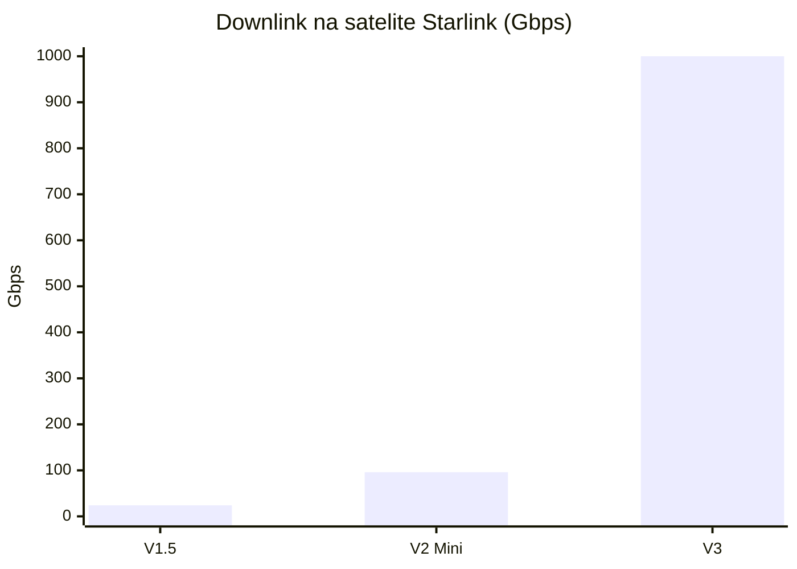
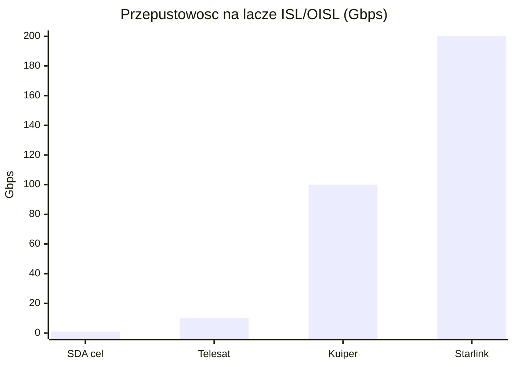
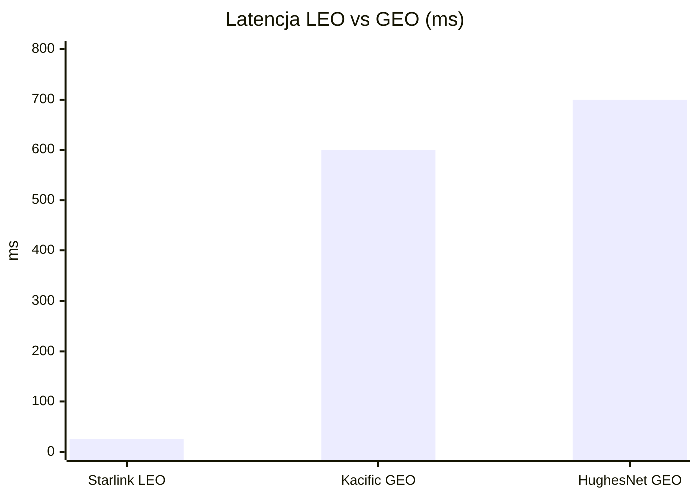
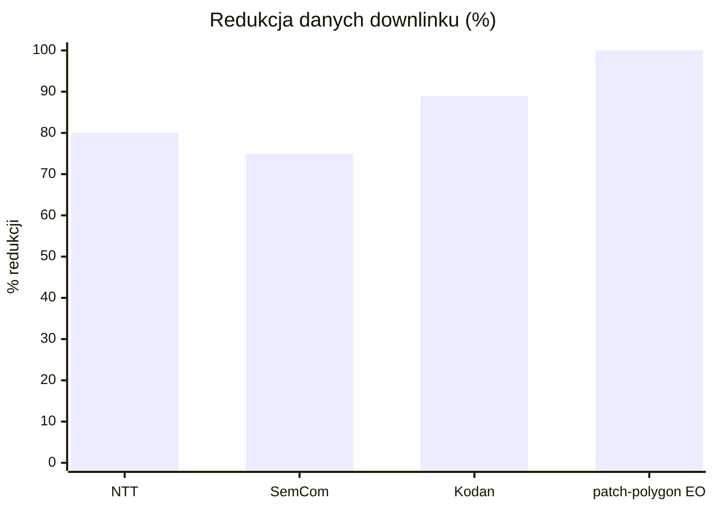

# Łączność: optyczne ISL, downlink i latencja

> Notatka raportu "Orbitalne centra danych". Kluczowe źródła: [źródło 1](https://www.starlink.com/public-files/starlinkProgressReport_2024.pdf), [źródło 2](https://arxiv.org/pdf/2603.01334).

## W skrócie

Łączność to nerw orbitalnego centrum danych: bez sprawnego przesyłu danych między satelitami i do Ziemi cała koncepcja "serwerowni na orbicie" się rozpada. Dobra wiadomość dla inwestora jest taka, że szybkie lasery międzysatelitarne (<abbr title="laserowe łącze optyczne między dwoma satelitami w przestrzeni, zastępujące radio i przesyłające dane &quot;po niebie&quot;.">ISL</abbr>) już działają komercyjnie - Starlink ma ponad 13 000 łączy laserowych po 200 Gbps każde, a satelity V3 mają dawać 1 Tbps downlinku ([SpaceX](https://www.starlink.com/public-files/starlinkProgressReport_2024.pdf)). Zła wiadomość jest taka, że downlink do Ziemi (zwłaszcza wysyłanie danych w górę, czyli uplink) pozostaje wąskim gardłem - asymetria sięga 10:1, a optyczne stacje naziemne padają pod chmurami (tłumienie >100 dB/km, [arXiv](https://arxiv.org/pdf/2603.01334)). Kto zyskuje, a kto traci, zależy więc od typu obciążenia: zadania, które przetwarzają dane lokalnie i odsyłają tylko skompresowany wynik (obserwacja Ziemi, ISR, kompresja semantyczna redukująca objętość o 58,7-99,996%), są ekonomicznie sensowne; trening dużych modeli językowych (LLM), który wymaga ciągłego przesyłu ogromnych zbiorów, pozostaje praktycznie zablokowany przez fizykę łącza i tzw. "data gravity". Tempo zmian jest szybkie (roadmapa do 60 Tbps na jeden start Starship), ale niezależnych pomiarów SLA brak - wiele liczb to deklaracje producentów, nie zweryfikowane wyniki operacyjne.

<!-- spolki:related:start -->
## Spółki powiązane

> Notowane spółki produkujące podzespoły/technologie związane z tym tematem. Pełne omówienie: spółki, dla których nisza to >=33% przychodów; skrótowe: zdywersyfikowane konglomeraty. Zob. też [[Spolki/_slownik]] i [[Spolki/_widok-gpw-eu]].

**Producenci kluczowi (>=33% przychodów z niszy - omówienie pełne):**
- [[Spolki/mynaric|Mynaric AG (MYNA)]] 🇪🇺 `[archiwalna]` - Pure-play terminale laserowe OISL (CONDOR) - WYCOFANA z giełdy, przejęta przez Rocket Lab (2026)

**Pozostali dominujący gracze (nisza to ułamek przychodów - omówienie skrótowe):**
- [[Spolki/bae-systems|BAE Systems plc (BA)]] 🇪🇺 - Rad-hard procesory (RAD750/RAD5545); optyka (Ball)
- [[Spolki/airbus|Airbus SE (AIR)]] 🇪🇺 - PV (Sparkwing), optyka (Tesat), busy, serwis (EU)
- [[Spolki/l3harris|L3Harris Technologies, Inc. (LHX)]] - Terminale laserowe dla obronności (SDA/NRO)
<!-- spolki:related:end -->

<!-- network:watki:start -->
## Powiązane wątki

> Mapa powiązań tematycznych - jak ten wątek łączy się z resztą raportu.

- [[01 - wprowadzenie-definicje-i-architektury|Wprowadzenie i architektury]] - OISL spina satelity w "jeden komputer" - sedno architektury
- [[10 - gracze-i-projekty|Gracze i projekty]] - petabitowa siatka laserowa Starlink jako backbone ODC SpaceX
- [[02 - weryfikacja-tez-sceptycznego-artykulu|Weryfikacja tez sceptyka]] - obala tezy o Starlink i o downlink bottleneck (kompresja semantyczna)
- [[11 - regulacje-prawo-kosmiczne-debris-i-itu|Regulacje i debris]] - pasma RF i koordynacja częstotliwości to domena ITU
- [[15 - bezpieczenstwo-geopolityka-i-realizm-10-letni|Bezpieczeństwo i geopolityka]] - jamming, spoofing i cyber to ryzyka warstwy łączności
<!-- network:watki:end -->
## Optyczne łącza międzysatelitarne (laser ISL) i roadmapy Tbps

Optyczne łącze międzysatelitarne (ISL, Optical Inter-Satellite Link) to wiązka lasera łącząca dwa satelity w przestrzeni - zastępuje radio i pozwala przesyłać dane "po niebie" zamiast przez stacje naziemne. Każdy satelita Starlink ma trzy lasery ISL pracujące z prędkością do 200 Gbps (gigabitów na sekundę), a w całej konstelacji jest ich ponad 13 000, co tworzy globalną "petabitową siatkę laserową" ([SpaceX](https://www.starlink.com/public-files/starlinkProgressReport_2024.pdf)). Liczbę ISL na satelicie niezależnie potwierdza literatura: każdy satelita Starlink ma 3-5 transceiverów ISL ([arXiv](https://arxiv.org/html/2601.10083v1)), a 200 Gbps na łącze pojawia się w tym samym źródle ([arXiv](https://arxiv.org/html/2601.10083v1)). Implikacja dla inwestora: backbone laserowy już istnieje w skali komercyjnej, więc ryzyko "czy to w ogóle działa" jest niskie - lasery ISL są dziś faktem, nie obietnicą.

![[assets/x06-1-x1.png]]
*Rys. 36 - Optyczne lacza miedzysatelitarne (OISL) w konstelacji Suncatcher. Źródło: Google Research / arXiv 2511.19468, licencja: arXiv open access - do uzytku wlasnego.*
#grafika #lacznosc-optyczne-isl-downlink-i-latencja #ISL #Suncatcher

Roadmapa przepustowości jest stroma. Satelita V1.5 miał 24 Gbps, V2 Mini ma 96 Gbps (czterokrotny wzrost), a V3 ma dawać 1 Tbps (terabit, czyli 1000 Gbps) downlinku i 160 Gbps uplinku ([SpaceX](https://www.starlink.com/public-files/starlinkProgressReport_2024.pdf)). Łączny backhaul (przepustowość "do magistrali", <abbr title="łączność falami radiowymi, dojrzała i odporna na chmury, lecz ograniczona pasmem.">RF</abbr> plus laser) V3 to blisko 4 Tbps, a jeden start Starship z satelitami V3 ma dodawać 60 Tbps pojemności do sieci - ponad 20 razy więcej niż start V2 Mini na Falconie 9 ([SpaceX](https://www.starlink.com/public-files/starlinkProgressReport_2024.pdf)). Optymalizacja routingu laserowego zredukowała już opóźnienie w kluczowych rynkach (Afryka) o 20-30 ms ([SpaceX](https://www.starlink.com/public-files/starlinkProgressReport_2024.pdf)). Implikacja: pojemność rośnie wykładniczo wraz z tempem startów Starship, co przekłada wartość konstelacji bezpośrednio na koszt i częstotliwość wynoszenia.

*Rys. 37 - Roadmapa przepustowości downlinku na satelitę: od 24 Gbps (V1.5) przez 96 Gbps (V2 Mini) do 1000 Gbps (V3). Dane: SpaceX Starlink Progress Report 2024.*

Konkurencja celuje niżej, co jest istotne dla wyceny przewagi SpaceX. Amazon Project Kuiper utrzymał 100 Gbps na dystansie blisko 1000 km w testach trwających ponad godzinę ([GeekWire](https://www.geekwire.com/2023/amazon-secret-kuiper-satellites-laser-links/)) i planuje konstelację 3236 satelitów ([GeekWire](https://www.geekwire.com/2023/amazon-secret-kuiper-satellites-laser-links/)). Telesat Lightspeed daje cztery łącza <abbr title="to samo co ISL, czyli optyczne łącze międzysatelitarne; skrót używany m.in. przez Telesat i SDA.">OISL</abbr> po 10 Gbps na satelitę, ma około 200 satelitów Ka-band i łączną pojemność ~10 Tbps ([Telesat](https://www.telesat.com/wp-content/uploads/2023/06/Communications-Security-Features-Whitepaper-Telesat-Lightspeed.pdf)). Standard wojskowy jest jeszcze skromniejszy: amerykańska SDA (Space Development Agency) w Tranche 0 wymaga od OISL zaledwie 250 Mbps (próg) i 1 Gbps (cel) na zasięgu do 5000 km ([SDA](https://imlive.s3.amazonaws.com/Federal%20Government/ID30063299141661607590122820076958924261/Attachment%201%20-%20SDA%20Transport%20Statement%20of%20Work%20(DRAFT).pdf)). Maksymalny zasięg pojedynczego ISL Starlink to 5000 km, a przepustowość maleje z dystansem ([arXiv](https://arxiv.org/html/2601.10083v1)). Implikacja: deklarowane 200 Gbps Starlink to o dwa-trzy rzędy wielkości więcej niż standard SDA i 20 razy więcej niż OISL Telesatu - przewaga technologiczna SpaceX jest realna, ale porównujemy deklaracje z różnych klas misji. Moc elektryczna pojedynczego lasera ISL Starlink jest NIE UJAWNIONA; proxy: cały satelita V2 Mini Optimized waży ~575 kg ([SpaceX](https://www.starlink.com/public-files/starlinkProgressReport_2024.pdf)).

*Rys. 38 - Deklarowana przepustowość pojedynczego łącza laserowego: SDA (cel) 1 Gbps, Telesat 10 Gbps, Kuiper 100 Gbps, Starlink 200 Gbps. Dane: SDA Transport SoW, Telesat Lightspeed, GeekWire, SpaceX.*

## Downlink do Ziemi: RF Ka/V band kontra optyczne stacje naziemne i wpływ chmur

<abbr title="przesył danych z satelity na Ziemię (falami radiowymi lub laserem).">Downlink</abbr> to przesył danych z satelity na Ziemię; może iść falami radiowymi (RF) lub laserem optycznym. Satelita V3 ma 1 Tbps downlinku RF i 160 Gbps uplinku ([SpaceX](https://www.starlink.com/public-files/starlinkProgressReport_2024.pdf)), wobec 96 Gbps downlinku V2 Mini ([SpaceX](https://www.starlink.com/public-files/starlinkProgressReport_2024.pdf)). FCC autoryzowała Starlink Gen2 do pracy w wielu pasmach: Ku- i Ka-band dla łączy użytkownika oraz V-, E- i W-band dla bram naziemnych ([SatNews](https://satnews.com/2026/01/12/fcc-authorizes-7500-additional-starlink-gen2-satellites-for-global-gigabit-coverage/)), a regulator zatwierdził 7500 dodatkowych satelitów Gen2, podnosząc autoryzowaną konstelację do 15 000 ([SatNews](https://satnews.com/2026/01/12/fcc-authorizes-7500-additional-starlink-gen2-satellites-for-global-gigabit-coverage/)). Ka-band (~26-40 GHz) jest tu kluczowy: według Euroconsult ma odpowiadać za 60% przepustowości satelitarnej do 2030 r. ([HzBeat](https://www.hzbeat.com/industry-news/ka-band-vs-ku-band-key-differences-and-applications.html)), ale cierpi na tłumienie deszczowe rzędu 10-20 dB w silnych burzach ([HzBeat](https://www.hzbeat.com/industry-news/ka-band-vs-ku-band-key-differences-and-applications.html)). Implikacja: RF jest dojrzały i odporny na chmury, ale ograniczony pasmem; to bezpieczna, znana technologia downlinku.

Optyka daje dużo większe pasmo, ale ma piętę achillesową - pogodę. NASA szacuje, że łącza optyczne dają 10-100 razy większą przepustowość niż systemy radiowe ([NASA](https://www.nasa.gov/missions/tech-demonstration/laser-communications-relay-demonstration-lcrd-overview/)). Demonstratory potwierdzają potencjał: NASA LCRD downlinkuje optycznie 1,2 Gbps ([NASA](https://www.nasa.gov/missions/tech-demonstration/laser-communications-relay-demonstration-lcrd-overview/)), terminal ILLUMA-T na ISS osiągnął 1,2 Gbps w dół i 155 Mbps w górę ([MIT](https://news.mit.edu/2024/communications-user-terminal-prepares-moon-flyby-1101)), a rekord NASA TBIRD to 200 Gbps laserowego downlinku do odbiornika naziemnego ([Engineering](https://www.engineering.org.cn/engi/EN/10.1016/j.eng.2024.02.004)). Problem: tłumienie optycznego łącza przez chmury może przekraczać 100 dB/km, co znacznie przewyższa margines łącza ([arXiv](https://arxiv.org/pdf/2603.01334)), więc zachmurzenie w linii wzroku można traktować jako powodujące awarię łącza ([arXiv](https://arxiv.org/pdf/2603.01334)). Rozwiązaniem jest "site diversity" - sieć rozproszonych stacji, z których przynajmniej jedna jest bezchmurna: 11 europejskich stacji optycznych daje 99,67% dostępności, a 8 stacji międzykontynentalnych aż 99,971% ([Semantic Scholar](https://pdfs.semanticscholar.org/04d5/3250a76bf60e2940efcfea5803fbb7b2f781.pdf)). Implikacja dla inwestora: optyczny downlink to nie tylko terminal w satelicie, lecz CAPEX na globalną sieć stacji w miejscach o czystym niebie - bez tego optyka zawodzi przy każdej chmurze. Dokładna dostępność optycznego downlinku Starlink (space-to-ground laser) jest NIE UJAWNIONA; proxy: NASA LCRD używa site diversity (Hawaje + Kalifornia), a badania pokazują >99,97% przy 8 stacjach ([SpaceX](https://www.starlink.com/public-files/starlinkProgressReport_2024.pdf)).

## Latencja orbita-Ziemia kontra zastosowania: trening wsadowy vs inference real-time

<abbr title="opóźnienie, czyli czas potrzebny sygnałowi na pokonanie drogi tam i z powrotem.">Latencja</abbr> (opóźnienie) to czas, jaki sygnał potrzebuje na pokonanie drogi tam i z powrotem. LEO (niska orbita) wygrywa z GEO (orbita geostacjonarna) o rząd wielkości. Starlink osiągnął medianę 26 ms w 2024 r. ([SpaceX](https://www.starlink.com/public-files/starlinkProgressReport_2024.pdf)); FCC podaje 25-60 ms na lądzie, z odległymi obszarami sięgającymi 100 ms i więcej ([New America](https://www.newamerica.org/insights/leo-satellites/chapter-iii-connectivity-from-new-horizons-how-leo-satellites-help-bridge-the-digital-divide/)). Sam przelot user-satelita-gateway zajmuje zwykle poniżej 10 ms ([Ookla](https://www.ookla.com/articles/2025-global-satellite-broadband-performance-report)), bo satelity Starlink są na wysokości ~341 mil ([Ookla](https://www.ookla.com/articles/2025-global-satellite-broadband-performance-report)). Dla porównania GEO jest dramatycznie wolniejsze: Kacific zmierzył 599 ms na Filipinach ([Ookla](https://www.ookla.com/articles/2025-global-satellite-broadband-performance-report)), a HughesNet 600-800 ms ([Ookla](https://www.ookla.com/articles/2025-global-satellite-broadband-performance-report)). Latencja LEO jest też zależna od infrastruktury lokalnej: w Kenii spadła z 289 ms do 53 ms po uruchomieniu lokalnego punktu obecności (PoP) ([Ookla](https://www.ookla.com/articles/2025-global-satellite-broadband-performance-report)), a najgorszy zmierzony wynik to 282 ms na Wyspach Marshalla ([Ookla](https://www.ookla.com/articles/2025-global-satellite-broadband-performance-report)). Punkt odniesienia z Ziemi: światłowód ma fizyczne opóźnienie ~5 μs/km ([arXiv](https://arxiv.org/html/2603.20317v1)), co daje 20-30 ms <abbr title="całkowity czas obiegu sygnału w obie strony między nadawcą a odbiorcą.">RTT</abbr> transkontynentalnie w USA ([arXiv](https://arxiv.org/html/2603.20317v1)) i 120-180 ms międzykontynentalnie ([arXiv](https://arxiv.org/html/2603.20317v1)). Implikacja: LEO mieści się w wymaganiach większości interaktywnych aplikacji i jest porównywalne ze światłowodem międzykontynentalnym, ale nie nadaje się do systemów mikrosekundowych (np. HFT).

*Rys. 39 - Mediana latencji LEO (Starlink 26 ms) kontra GEO (Kacific 599 ms, HughesNet 600-800 ms, tu 700 ms) - przewaga o rząd wielkości. Dane: SpaceX Starlink Progress Report 2024, Ookla 2025.*

Tu pojawia się kluczowy podział obciążeń. Trening AI to "batch compute" tolerujący opóźnienia (liczy się przepustowość, nie czas reakcji), a inferencja real-time jest "latency-bound" (każdy milisekund się liczy). Szafa z GPU H100/Blackwell do treningu pobiera 40-140 kW lub więcej, podczas gdy inferencja zwykle 10-30 kW na szafę ([Digital Edge](https://id.digitaledgedc.com/ai-infrastructure/ai-inference-vs-ai-training)). Do 2026 r. inferencja ma stanowić około 2/3 globalnego AI compute, wobec 1/3 w 2023 r. ([Digital Edge](https://id.digitaledgedc.com/ai-infrastructure/ai-inference-vs-ai-training)). Implikacja: trening jest energochłonny, ale tolerancyjny na opóźnienia - teoretycznie pasuje do orbity od strony latencji; problemem jest nie czas, lecz przesył danych i moc. Dokładny próg akceptowalności latencji dla orbitalnego treningu LLM jest NIE UJAWNIONY; proxy: trening to throughput-bound batch compute tolerujący opóźnienia, inferencja jest latency-bound, a LEO daje 20-60 ms ([arXiv](https://arxiv.org/html/2603.20317v1)).

## Weryfikacja tezy "Starlink nie szerokopasmowy" (mylenie terminala last-mile z backbone ISL)

Krąży teza, że "Starlink nie jest szerokopasmowy", więc nie nadaje się do orbitalnego DC. To nieporozumienie wynikające z mylenia dwóch różnych rzeczy: prędkości terminala u końcowego użytkownika (last-mile) z przepustowością magistrali laserowej (backbone ISL). Terminal konsumencki Starlink oferuje 25-220 Mbps pobierania ([New America](https://www.newamerica.org/insights/leo-satellites/chapter-iii-connectivity-from-new-horizons-how-leo-satellites-help-bridge-the-digital-divide/)) i 5-20 Mbps wysyłania ([New America](https://www.newamerica.org/insights/leo-satellites/chapter-iii-connectivity-from-new-horizons-how-leo-satellites-help-bridge-the-digital-divide/)), a benchmark szerokopasmowy FCC to 100/20 Mbps z latencją <100 ms ([New America](https://www.newamerica.org/insights/leo-satellites/chapter-iii-connectivity-from-new-horizons-how-leo-satellites-help-bridge-the-digital-divide/)). Tylko 17,4% użytkowników Starlink stale spełnia benchmark FCC ([New America](https://www.newamerica.org/insights/leo-satellites/chapter-iii-connectivity-from-new-horizons-how-leo-satellites-help-bridge-the-digital-divide/)), a mediana pobierania spadła ze 100 Mbps (koniec 2021) ([ACM](https://dl.acm.org/doi/abs/10.1145/3715335.3735467)) do 66 Mbps (początek 2023) wraz ze wzrostem bazy klientów ([ACM](https://dl.acm.org/doi/abs/10.1145/3715335.3735467)).

To są jednak liczby last-mile dla pojedynczego abonenta - nie mają nic wspólnego z pojemnością magistrali. Backbone to inna skala: ponad 13 000 łączy laserowych po 200 Gbps ([SpaceX](https://www.starlink.com/public-files/starlinkProgressReport_2024.pdf)), a łączna pojemność sieci przekroczyła ostatnio 600 Tbps ([Ookla](https://www.ookla.com/articles/2025-global-satellite-broadband-performance-report)) wobec ~350 Tbps w raporcie 2024 ([PCMag](https://www.pcmag.com/news/spacex-teases-1tbps-of-download-bandwidth-on-v3-starlink-satellites)). Skala bazy: 9,2 mln klientów ([Ookla](https://www.ookla.com/articles/2025-global-satellite-broadband-performance-report)), 97,1% globalnych próbek Speedtest satelitarnych w Q3 2025 ([Ookla](https://www.ookla.com/articles/2025-global-satellite-broadband-performance-report)) i 10 790 wystrzelonych satelitów od 2019 r. ([Ookla](https://www.ookla.com/articles/2025-global-satellite-broadband-performance-report)). Implikacja dla inwestora: teza "Starlink nie szerokopasmowy" jest częściowo trafna dla taniego terminala domowego, ale myląca jako argument przeciw orbitalnemu DC - magistrala laserowa działa na poziomie 600+ Tbps, a wąskie gardło to nie ISL, lecz przepustowość downlinku do Ziemi i jego asymetria. Rzeczywista przeciążona przepustowość per użytkownik w godzinach szczytu jest NIE UJAWNIONA przez SpaceX; proxy: spadek ze 100 do 66 Mbps przy rosnącej bazie ([ACM](https://dl.acm.org/doi/abs/10.1145/3715335.3735467)).

## Bilans transferu: ile danych treningowych w górę/dół vs przetwarzanie lokalne

To sedno ekonomii orbitalnego DC. Łącza LEO są mocno asymetryczne: stosunek downlink:uplink wynosi ~20× (ilustracyjnie) ([arXiv](https://arxiv.org/html/2603.20317v1)), a w praktyce uplink jest jeszcze bardziej ograniczony przez priorytet komend i konserwatywne protokoły - często 10:1 lub więcej ([arXiv](https://arxiv.org/html/2603.20317v1)). Widać to wprost w danych Starlink: V3 ma 1000 Gbps downlinku i tylko 160 Gbps uplinku na satelitę ([SpaceX](https://www.starlink.com/public-files/starlinkProgressReport_2024.pdf)), a V2 Mini 96 Gbps downlinku przy 6,7 Gbps uplinku ([SpaceX](https://www.starlink.com/public-files/starlinkProgressReport_2024.pdf)). Skala danych centrum danych przerasta dostępne pasmo: pojedynczy blok agregacyjny w nowoczesnej sieci DC ma przepustowość ~200 Tb/s, podczas gdy łącza ground-satellite dają tylko dziesiątki do setek Gb/s ([arXiv](https://arxiv.org/html/2605.12681v1)). Implikacja: wysyłanie surowych zbiorów treningowych w górę jest fizycznie nieopłacalne - uplink jest zbyt wąski, a downlink, choć szerszy, też nie dorównuje przepustowości magistrali wewnątrz DC.

Stąd fundamentalna zasada projektowa: przetwarzaj lokalnie na orbicie, odsyłaj tylko wynik. Rzeczywista objętość danych treningowych przesyłanych w górę/dół w orbitalnym DC jest NIE UJAWNIONA dla konkretnego systemu; proxy: ograniczony uplink i wysoka kompresja semantyczna wskazują, że dużych surowych zbiorów treningowych nie przesyła się efektywnie w górę - przetwarza się je lokalnie i downlinkuje wyniki ([arXiv](https://arxiv.org/html/2603.20317v1)). To tłumaczy, dlaczego trening LLM (gdzie dane "ciążą" ku Ziemi, tzw. data gravity, a iteracje są ziemiocentryczne) jest praktycznie zablokowany, a zadania generujące dane na orbicie (obserwacja Ziemi) są naturalne. Kontekst energetyczny: globalne zużycie energii przez centra danych zmierza ku 1050 TWh rocznie ([Digital Edge](https://id.digitaledgedc.com/ai-infrastructure/ai-inference-vs-ai-training)).

## Sieć stacji naziemnych i przepustowość zbiorcza

Stacje naziemne to bramy (gateways) między satelitami a internetem - to fizyczne lejki, przez które dane wracają na Ziemię. Starlink ma ponad 100 stacji naziemnych ([arXiv](https://arxiv.org/html/2601.10083v1)), szacunkowo ~150 ([Ookla](https://www.ookla.com/articles/2025-global-satellite-broadband-performance-report)), a według słabszego źródła ponad 170 (operacyjne, w budowie i zatwierdzone) na początku 2026 r. ([InstallPros](https://installpros.io/starlink-ground-station-backbone-of-satellite-internet/)). Konkurenci budują własne sieci: Amazon Leo planuje około 300 stacji ([Ookla](https://www.ookla.com/articles/2025-global-satellite-broadband-performance-report)), a Telesat Lightspeed 20-30 lokalizacji ([ChinaAerospace](https://www.chinaerospace.com/article/show/758706f0491ce8afa09d2bdd0c5a87fe)) z 127 zamówionymi antenami gateway od Intellian ([ChinaAerospace](https://www.chinaerospace.com/article/show/758706f0491ce8afa09d2bdd0c5a87fe)). Pojemność zbiorcza rośnie szybko: 60 Tbps na jeden start Starship z V3 ([SpaceX](https://www.starlink.com/public-files/starlinkProgressReport_2024.pdf)), a sieć przekroczyła 600 Tbps łącznie ([Ookla](https://www.ookla.com/articles/2025-global-satellite-broadband-performance-report)). Implikacja dla inwestora: liczba i położenie stacji naziemnych to ukryty CAPEX i potencjalne wąskie gardło - downlink jest tak dobry, jak gęsta i bezchmurna sieć bram. Liczba i lokalizacje stacji optycznych Starlink (space-to-ground laser) są NIE UJAWNIONE; proxy: Elon Musk zapowiadał laser space-to-ground >6 Tbps, ale bez szczegółów technicznych ani liczby stacji ([SpaceX](https://www.starlink.com/public-files/starlinkProgressReport_2024.pdf)).

## Kompresja semantyczna i inference on-orbit jako obalenie tezy o downlink bottleneck

Najsilniejszy kontrargument wobec "downlink to zabójca orbitalnego DC" brzmi: nie przesyłaj surowych danych, prześlij ich znaczenie. To kompresja semantyczna i wnioskowanie na orbicie (inference on-orbit) - satelita sam "rozumie", co widzi, i odsyła tylko istotny wynik. Skala redukcji jest dramatyczna. NTT pokazało w eksperymentach na publicznym zbiorze statków, że objętość danych on-orbit spadła o 58,7-80% ([NTT](https://ntt-review.jp/archive/ntttechnical.php?contents=ntr202506fa2.html)). Dla obserwacji Ziemi (EO) tzw. patch-polygons redukują pasmo o 99,69-99,996% ([arXiv](https://arxiv.org/html/2603.20317v1)): surowy batch 10 scen to ~31,46 MB ([arXiv](https://arxiv.org/html/2603.20317v1)), a ładunek patch-polygon tylko 0,001-0,098 MB ([arXiv](https://arxiv.org/html/2603.20317v1)). Rekonstrukcja multi-pass stereo depth-proxy zgniata 306 MB surowych zdjęć do 1,57 MB (99,49% redukcji), nawet przy 11,45% użytecznego pokrycia ([arXiv](https://arxiv.org/html/2603.20317v1)). Efekt czasowy jest namacalny: przy 50 Mbps downlinku batch 10 scen schodzi w 5,03 s jako surowe dane, ale w 0,014 s jako patch-polygons ([arXiv](https://arxiv.org/html/2603.20317v1)). Implikacja: dla danych obserwacyjnych downlink praktycznie przestaje być wąskim gardłem - odsyła się ułamek procenta objętości.

*Rys. 40 - Redukcja objętości downlinku przez przetwarzanie on-orbit: NTT do 80%, SemCom 75%, Kodan 89%, patch-polygons dla obserwacji Ziemi do 99,996%. Dane: NTT Review, Queen's University Belfast, ACM Kodan, arXiv 2603.20317v1.*

Komunikacja semantyczna (SemCom) i federacyjne uczenie potwierdzają trend wieloma niezależnymi liczbami. Semantic communication redukuje narzut komunikacyjny o nawet 60% ([arXiv](https://arxiv.org/html/2605.12681v1)); pełne wdrożenie SemCom daje 75% redukcji pasma, a wyposażenie tylko 10% satelitów w SemCom redukuje pasmo o 50% ([Queen's University Belfast](https://pureadmin.qub.ac.uk/ws/files/645366091/COMSTD.pdf)). Nokia Bell Labs (z KT) raportuje ponad 60% redukcji pasma przy zachowaniu dostępności usługi ([Nokia](https://www.nokia.com/blog/nokia-bell-labs-strengthens-semantic-communications-research-with-kt-collaboration/)). Inny system tnie narzut o nawet 72% i wykonuje do 60% więcej zadań analitycznych ([arXiv](https://arxiv.org/html/2508.13374v1)). System kompresji satelitarnej oszczędza średnio 71,6% objętości downlinku, skraca czas reakcji o 38,4% i poprawia dokładność wnioskowania o 3,8% ([Xu et al.](https://xumengwei.github.io/files/TSC24-SatelliteCompression.pdf)). System Kodan poprawia "gęstość wartości" nasyconego downlinku o 89-97% ([ACM](https://dl.acm.org/doi/pdf/10.1145/3582016.3582043)), a idealny filtr na krawędzi dostarcza ponad 3× więcej wartościowych danych (63% obserwowalnych danych wysokiej wartości) ([ACM](https://dl.acm.org/doi/pdf/10.1145/3582016.3582043)). Wczesne prace (Giuffrida i in., 2014) pokazywały 60-80% redukcji przez selektywną kompresję ([arXiv](https://arxiv.org/html/2601.06706v1)), a prosty 5-watowy akcelerator odrzucający klatki z chmurami eliminuje 60-80% obciążenia downlinku ([SatNews](https://news.satnews.com/2026/02/24/the-fractal-lab-part-iii/)). Implikacja: dla workloadów ISR/EO/batch przetwarzanie na orbicie zmienia ekonomię łącza - downlink przestaje być barierą.

Ale nie dla wszystkiego. Ranking przydatności workloadów (im wyżej, tym lepiej dla orbity) jest jednoznaczny: Space RF signal processing 4,4 pkt; 3D reconstruction i EO preprocessing po 4,2 pkt; nawigacja i timing 3,4 pkt; batch LLM inference tylko 3,2 pkt; LLM training 3,0 pkt; space communications infrastructure 2,8 pkt ([arXiv](https://arxiv.org/html/2603.20317v1)). Powód niskich ocen LLM: dla treningu LLM moc i data gravity czynią go nieopłacalnym - zbiory i pętle iteracji są ziemiocentryczne (NIE UJAWNIONE szczegóły kosztów) ([arXiv](https://arxiv.org/html/2603.20317v1)); batch LLM inference bez taniej energii ma słaby ROI i wymaga wyselekcjonowanych wejść, nie surowych (NIE UJAWNIONE) ([arXiv](https://arxiv.org/html/2603.20317v1)). Federacyjne uczenie łagodzi to częściowo: redukuje pasmo downlinku o 40-60%, ale wymaga częstej synchronizacji międzysatelitarnej przez 100-200 rund treningowych ([arXiv](https://arxiv.org/html/2601.06706v1)). Implikacja dla inwestora: kompresja semantyczna nie obala downlink bottleneck uniwersalnie - obala go dla obserwacji Ziemi i ISR, ale dla treningu LLM bariery są moc i grawitacja danych, których żadna kompresja nie usuwa.

## Kontrowersje

**Czy downlink jest fundamentalnym bottleneckiem (sceptycy) czy ISL+optyka go rozwiązuje (optymiści)**

**Strona sceptyczna (downlink/uplink ogranicza):** średnia prędkość Starlink w USA spadła do 66 Mbps w 2023 r. wraz ze wzrostem bazy ([ACM](https://dl.acm.org/doi/abs/10.1145/3715335.3735467)); tylko 17,4% użytkowników spełnia benchmark FCC ([New America](https://www.newamerica.org/insights/leo-satellites/chapter-iii-connectivity-from-new-horizons-how-leo-satellites-help-bridge-the-digital-divide/)); najwyższe opóźnienie 282 ms na Wyspach Marshalla ([Ookla](https://www.ookla.com/articles/2025-global-satellite-broadband-performance-report)); asymetria downlink:uplink często 10:1 lub więcej ([arXiv](https://arxiv.org/html/2603.20317v1)). Dowody na "twardy" bottleneck z fali 2: segment naziemny odbiera tylko 2% dostępnych obserwacji hiperspektralnych ([ACM](https://dl.acm.org/doi/pdf/10.1145/3582016.3582043)); mniej niż 21% wartościowych danych jest downlinkowane bent-pipe ([ACM](https://dl.acm.org/doi/pdf/10.1145/3582016.3582043)); satelita Sentinel-2 generuje 2,7 TB/dzień, a pięć stacji może pobrać tylko 1 TB/dzień, co daje do 30 dni opóźnienia analityki ([arXiv](https://arxiv.org/html/2508.13374v1)); satelita bywa zmuszony odrzucić wszystko poza 10-20% zebranych zdjęć ([arXiv](https://arxiv.org/html/2503.01756)); nawet z 1/3 transmitowanych danych można pobrać tylko 30,7% ([Dagstuhl](https://drops.dagstuhl.de/storage/01oasics/oasics-vol139-nines2026/OASIcs.NINeS.2026.5/OASIcs.NINeS.2026.5.pdf)); nasycony downlink nie obsłuży 10-100 TB/dzień zbieranych danych ([Xu et al.](https://xumengwei.github.io/files/TSC24-SatelliteCompression.pdf)); CPU odpowiada za 97% blokad, a 6× wzrost konstelacji daje 14× wyższe blokowanie i 13,2-26,4 dnia opóźnień ([arXiv](https://arxiv.org/html/2601.06706v1)); tradycyjne satelity mają "blackouty" komunikacyjne ponad 95% czasu ([LEO Data Centers](https://leodatacenters.com/)).

**Strona optymistyczna (ISL + optyka + kompresja rozwiązują):** V3 ma 1 Tbps downlinku na satelitę ([SpaceX](https://www.starlink.com/public-files/starlinkProgressReport_2024.pdf)) i ~4 Tbps backhaulu RF+laser ([SpaceX](https://www.starlink.com/public-files/starlinkProgressReport_2024.pdf)); ponad 13 000 łączy laserowych ([SpaceX](https://www.starlink.com/public-files/starlinkProgressReport_2024.pdf)); OISL Kuiper 100 Gbps ([GeekWire](https://www.geekwire.com/2023/amazon-secret-kuiper-satellites-laser-links/)); dostępność 8 stacji optycznych 99,971% ([Semantic Scholar](https://pdfs.semanticscholar.org/04d5/3250a76bf60e2940efcfea5803fbb7b2f781.pdf)); a po stronie kompresji redukcja 58,7-99,996% przez inference on-orbit ([arXiv](https://arxiv.org/html/2603.20317v1)) i 60-90% redukcji pasma deklarowane przez operatorów ([LEO Data Centers](https://leodatacenters.com/)). Rozstrzygnięcie: rozbieżność jest realna i zależy od workloadu - dla EO/ISR optymiści mają rację (kompresja obala bottleneck), dla treningu LLM rację mają sceptycy (moc i data gravity, nie pasmo, blokują orbitę). Nie da się uśrednić tych stron, bo mówią o różnych klasach zadań.

**Realne Tbps optyczne w skali operacyjnej; akceptowalność latencji**

**Potwierdzone deklaracje producentów:** Starlink V3 1 Tbps downlinku ([SpaceX](https://www.starlink.com/public-files/starlinkProgressReport_2024.pdf)); ~4 Tbps backhaulu V3 ([SpaceX](https://www.starlink.com/public-files/starlinkProgressReport_2024.pdf)); 60 Tbps na start Starship ([SpaceX](https://www.starlink.com/public-files/starlinkProgressReport_2024.pdf)). **Ostrożność / brak operacyjnej skali:** cel SDA dla OISL to tylko 1 Gbps (objective), próg 250 Mbps ([SDA](https://imlive.s3.amazonaws.com/Federal%20Government/ID30063299141661607590122820076958924261/Attachment%201%20-%20SDA%20Transport%20Statement%20of%20Work%20(DRAFT).pdf)); OISL Telesat Lightspeed 10 Gbps ([Telesat](https://www.telesat.com/wp-content/uploads/2023/06/Communications-Security-Features-Whitepaper-Telesat-Lightspeed.pdf)); rekord laserowego downlinku NASA TBIRD 200 Gbps - czyli demonstrator, nie rutyna ([Engineering](https://www.engineering.org.cn/engi/EN/10.1016/j.eng.2024.02.004)). Rzeczywista, zmierzona przepustowość pojedynczego łącza ISL Starlink w ruchu komercyjnym jest NIE UJAWNIONA; deklaracje to 200 Gbps per ISL, ale brak niezależnych pomiarów SLA ([SpaceX](https://www.starlink.com/public-files/starlinkProgressReport_2024.pdf)). Rozstrzygnięcie: deklarowane Tbps są o 2-3 rzędy wielkości wyższe niż zweryfikowane standardy i demonstratory - rozbieżność jest realna i wynika z różnicy między marketingowymi specyfikacjami a potwierdzonymi pomiarami operacyjnymi.

Akceptowalność latencji: mediana Starlink 26 ms ([SpaceX](https://www.starlink.com/public-files/starlinkProgressReport_2024.pdf)) i typowo 25-60 ms ([New America](https://www.newamerica.org/insights/leo-satellites/chapter-iii-connectivity-from-new-horizons-how-leo-satellites-help-bridge-the-digital-divide/)) kontra GEO 599 ms ([Ookla](https://www.ookla.com/articles/2025-global-satellite-broadband-performance-report)). Po stronie obciążeń: trening 40-140 kW/szafę, inferencja 10-30 kW/szafę ([Digital Edge](https://id.digitaledgedc.com/ai-infrastructure/ai-inference-vs-ai-training)). Próg akceptowalności dla orbitalnego treningu LLM jest NIE UJAWNIONY; proxy: 20-60 ms LEO mieści się w wymogach większości aplikacji interaktywnych, ale nie w mikrosekundowych systemach HFT ([arXiv](https://arxiv.org/html/2603.20317v1)). Rozstrzygnięcie: latencja LEO jest akceptowalna dla większości workloadów (trening tolerancyjny, inferencja zwykle też), spór dotyczy nie latencji jako takiej, lecz przepustowości i ekonomii - brak potwierdzonych rozbieżności co do tego, że LEO bije GEO o rząd wielkości.

## Słowniczek pojęć

- **ISL (Optical Inter-Satellite Link)** - laserowe łącze optyczne między dwoma satelitami w przestrzeni, zastępujące radio i przesyłające dane "po niebie".
- **OISL** - to samo co ISL, czyli optyczne łącze międzysatelitarne; skrót używany m.in. przez Telesat i SDA.
- **Downlink** - przesył danych z satelity na Ziemię (falami radiowymi lub laserem).
- **Uplink** - przesył danych z Ziemi do satelity; w sieciach LEO mocno ograniczony i asymetryczny względem downlinku.
- **Latencja** - opóźnienie, czyli czas potrzebny sygnałowi na pokonanie drogi tam i z powrotem.
- **RTT (Round-Trip Time)** - całkowity czas obiegu sygnału w obie strony między nadawcą a odbiorcą.
- **Gbps / Tbps** - gigabity i terabity na sekundę (1 Tbps = 1000 Gbps); miary przepustowości łącza.
- **Ka-band / V-band / Ku-band** - pasma częstotliwości radiowych używane do łączności satelitarnej (Ka ~26-40 GHz dla bram i użytkowników, V i E dla bram).
- **RF (Radio Frequency)** - łączność falami radiowymi, dojrzała i odporna na chmury, lecz ograniczona pasmem.
- **GEO / LEO** - orbita geostacjonarna (wysoka latencja, ~600 ms) kontra niska orbita okołoziemska (~340 mil, niska latencja ~26 ms).
- **Kompresja semantyczna (SemCom)** - przesyłanie "znaczenia" danych zamiast surowych zbiorów, redukujące objętość downlinku o dziesiątki do ponad 99%.
- **Inference on-orbit** - wnioskowanie (analiza danych przez model AI) wykonywane lokalnie na satelicie, by odsyłać tylko wynik.
- **Site diversity** - sieć rozproszonych stacji naziemnych, z których przynajmniej jedna jest bezchmurna, zapewniająca dostępność optycznego downlinku.
- **Data gravity** - tendencja danych do "przyciągania" obliczeń do miejsca ich składowania, tu utrudniająca trening LLM na orbicie.
- **Backhaul / backbone** - magistrala przepustowości łącząca satelity z resztą sieci (RF plus laser), w odróżnieniu od łącza last-mile użytkownika.
