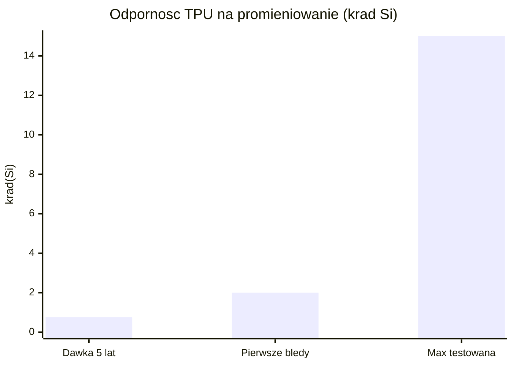
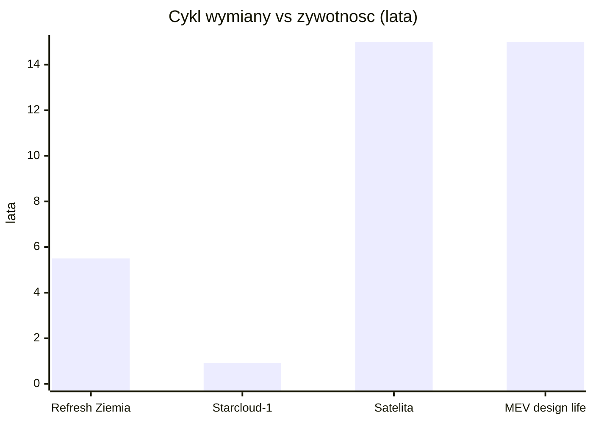
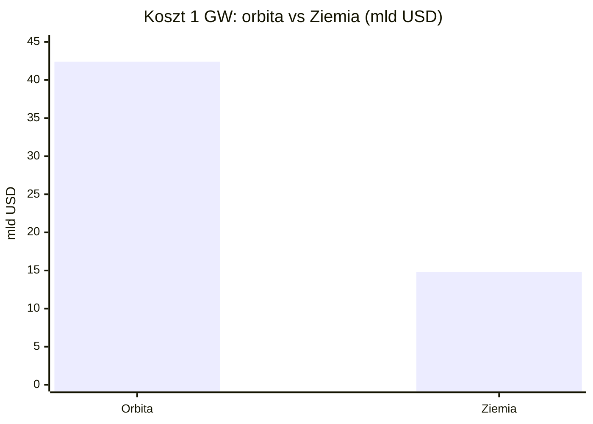

# Niezawodność, serwisowanie i cykl życia sprzętu

> Notatka raportu "Orbitalne centra danych". Kluczowe źródła: [źródło 1](https://www.eoportal.org/satellite-missions/mev-1), [źródło 2](https://forum.nasaspaceflight.com/index.php?topic=39714.100).

## W skrócie

Centrum danych na orbicie to sprzęt, do którego nikt nie przyjedzie z wkrętakiem. Na Ziemi serwerownia wymienia uszkodzony dysk czy kartę graficzną w kilka minut (tzw. hot-swap, czyli wymiana podzespołu bez wyłączania systemu), a całość sprzętu odświeża co 5-6 lat. Na orbicie tego nie ma: działająca robotyczna obsługa satelitów (Northrop Grumman <abbr title="pojazd Northrop Grumman, który dokuje do satelity i przejmuje jego napęd oraz utrzymanie pozycji, przedłużając misję.">MEV</abbr>) dotyczy napędu i utrzymania pozycji satelitów w GEO, a nie wymiany komputerów - więc sprzęt obliczeniowy jest praktycznie "zamrożony" (frozen hardware) na cały czas misji. Dla inwestora oznacza to dwa twarde fakty: niezawodność musi być wbudowana z góry (redundancja, degradacja kontrolowana, pamięć z korekcją błędów), a modernizacja technologiczna polega nie na naprawie, lecz na deorbitacji starego i wystrzeleniu nowego modułu. Cały model ekonomiczny stoi i upada na koszcie wynoszenia: przy obecnych cenach orbitalne 1 GW to szacunkowo 42,4 mld USD wobec 14,8 mld USD na Ziemi 🔵🟠, a optymiści liczą na <200 USD/kg w połowie lat 30. jako punkt zwrotny.

<!-- spolki:related:start -->
## Spółki powiązane

> Notowane spółki produkujące podzespoły/technologie związane z tym tematem. Pełne omówienie: spółki, dla których nisza to >=33% przychodów; skrótowe: zdywersyfikowane konglomeraty. Zob. też [[Spolki/_slownik]] i [[Spolki/_widok-gpw-eu]].

**Producenci kluczowi (>=33% przychodów z niszy - omówienie pełne):**
- [[Spolki/rocket-lab|Rocket Lab Corporation (RKLB)]] - Launch (Electron/Neutron) + Space Systems: bus, ogniwa SolAero, komponenty
- [[Spolki/redwire|Redwire Corporation (RDW)]] - Panele ROSA, struktury rozkładane, montaż on-orbit, radiatory Q-Rad
- [[Spolki/voyager-technologies|Voyager Technologies, Inc. (VOYG)]] - Stacje kosmiczne (Starlab), systemy kosmiczne i obronne
- [[Spolki/mda-space|MDA Space Ltd. (MDA)]] - Robotyka kosmiczna (Canadarm), busy, anteny
- [[Spolki/astroscale|Astroscale Holdings Inc. (186A)]] - Pure-play serwisowanie i usuwanie śmieci (ADR)

**Pozostali dominujący gracze (nisza to ułamek przychodów - omówienie skrótowe):**
- [[Spolki/northrop-grumman|Northrop Grumman Corporation (NOC)]] - Serwis GEO (MEV/MRV), busy, radiatory, ogniwa
- [[Spolki/airbus|Airbus SE (AIR)]] 🇪🇺 - PV (Sparkwing), optyka (Tesat), busy, serwis (EU)
- [[Spolki/lockheed-martin|Lockheed Martin Corporation (LMT)]] - Busy satelitarne, serwisowanie, ULA (launch)
<!-- spolki:related:end -->

<!-- network:watki:start -->
## Powiązane wątki

> Mapa powiązań tematycznych - jak ten wątek łączy się z resztą raportu.

- [[03 - fizyka-orbitalna-orbity-i-operacje|Fizyka orbitalna]] - deorbitacja i wymiana modułów to operacje końca życia
- [[06 - promieniowanie-i-elektronika-rad-hard-vs-cots|Promieniowanie i elektronika]] - żywotność sprzętu zależy od dawki promieniowania i MTBF
- [[09 - ekonomika-i-koszty-calkowite-tco|Ekonomika i TCO]] - cykl odświeżania vs żywotność platformy decyduje o ekonomice
- [[11 - regulacje-prawo-kosmiczne-debris-i-itu|Regulacje i debris]] - EOL i deorbit to wymogi anty-debris
- [[05 - chlodzenie-i-radiacyjne-odprowadzanie-ciepla|Chłodzenie]] - rozkładane radiatory i brak hot-swap to wyzwania niezawodności
<!-- network:watki:end -->
## Brak napraw in-situ a robotyczna obsługa (Northrop Grumman MEV i następcy)

Jedyna działająca komercyjnie technologia "serwisowania" satelitów to misje typu MEV (Mission Extension Vehicle) firmy Northrop Grumman. MEV-1 i MEV-2 to pojazdy o masie odpowiednio 2330 kg i 2875 kg, z 10 kW paneli słonecznych i pełną kontrolą w sześciu stopniach swobody 🟠 ([eoPortal](https://www.eoportal.org/satellite-missions/mev-1)). MEV-1 zadokował do satelity Intelsat 901 w lutym 2020, a MEV-2 do Intelsat 10-02 w kwietniu 2021 🟠 ([eoPortal](https://www.eoportal.org/satellite-missions/mev-1)). Każdy pojazd ma 15-letni projektowany czas życia (design life - okres, na który zaprojektowano sprawne działanie), a pojedyncza usługa przedłużenia misji Intelsata jest planowana na 5 lat 🟠 ([eoPortal](https://www.eoportal.org/satellite-missions/mev-1)). System dokowania jest kompatybilny z około 80% satelitów geostacjonarnych na orbicie 🟠 ([eoPortal](https://www.eoportal.org/satellite-missions/mev-1)).

Kluczowa uwaga: MEV nie naprawia satelity ani nie wymienia w nim podzespołów - dokuje się do niego i przejmuje funkcje napędu oraz utrzymania orientacji (attitude). To "holownik kosmiczny", a nie warsztat. Następca, czyli <abbr title="następca MEV: pojazd instalujący na satelitach małe moduły napędowe (MEP) zamiast jednorazowego dokowania.">MRV</abbr> (Mission Robotic Vehicle) z modułami MEP (Mission Extension Pod), idzie dalej: SpaceLogistics (firma Northrop Grumman) zapowiedziała start MRV w 2024 na rakiecie SpaceX 🟠 ([NASASpaceflight forum](https://forum.nasaspaceflight.com/index.php?topic=39714.100)). MRV o masie 3000 kg ma instalować na satelitach mały moduł napędowy MEP (po ok. 400 kg), przedłużający życie satelity o masie 2000 kg o 6 lat 🟠 ([NASASpaceflight forum](https://forum.nasaspaceflight.com/index.php?topic=39714.100)). Sam MRV jest projektowany na 10 lat na orbicie i ma w tym czasie zainstalować nawet 30 modułów napędowych 🟠 ([NASASpaceflight forum](https://forum.nasaspaceflight.com/index.php?topic=39714.100)).

![[assets/x07-1-northropgrummanroboticarm-1.jpg]]
*Rys. 41 - Mission Robotic Vehicle (Northrop Grumman) - serwisowanie na orbicie. Źródło: Northrop Grumman / SatellitePro ME, licencja: materialy prasowe - do uzytku wlasnego.*
#grafika #niezawodnosc-serwisowanie-i-cykl-zycia-sprzetu #serwisowanie #MRV

Najbardziej ambitna misja serwisowania, która miała demonstrować robotyczną obsługę (w tym tankowanie i wymianę elementów) - NASA <abbr title="anulowana misja NASA, która miała demonstrować robotyczne serwisowanie satelitów, w tym tankowanie i wymianę elementów.">OSAM-1</abbr> - została anulowana. NASA potwierdziła plany skasowania misji serwisowania satelitów wartej 2 mld USD z powodu kosztów i opóźnień 🟠 ([Satellite Today](https://www.satellitetoday.com/government-military/2024/03/04/nasa-cancels-osam-1-mission-citing-cost-and-schedule-issues/)). OSAM-1 był opisywany jako robot przedłużający życie satelitów w kosmosie 🔵 ([NASA GSFC](https://etd.gsfc.nasa.gov/our-work/in-space-servicing/osam/)), ale liczba udanych misji serwisowania in-situ w LEO dla typowych podzespołów obliczeniowych (GPU/dyski) jest **NIE UJAWNIONE** - proxy: MEV/MRV obsługują wyłącznie satelity w GEO (orbita geostacjonarna, ok. 36 000 km) i tylko ich napęd, nie komputery. Implikacja dla inwestora: dzisiejsza "naprawa na orbicie" to inny problem niż serwisowanie serwerowni - nie istnieje sprawdzona droga do wymiany karty obliczeniowej w locie, więc ryzyko technologiczne pozostaje wysokie.

## Cykl odświeżania GPU (~3-5 lat na Ziemi) a nieserwisowalna orbita ("frozen hardware")

Na Ziemi tempo wymiany sprzętu jest dobrze udokumentowane. Najczęstszy odstęp między odświeżeniami serwerów wynosił 5 lat w 2022 wobec 3 lat w 2015 🟠 ([Horizon Technology](https://horizontechnology.com/news/data-center-hardware-refresh-cycles/)). Microsoft (CFO Amy Hood) ogłosił w 2022 wydłużenie żywotności serwerów do 6 lat, a Alphabet (Google) zaoszczędził 3 mld USD w 2023 po przejściu na cykl sześcioletni 🟠 ([Horizon Technology](https://horizontechnology.com/news/data-center-hardware-refresh-cycles/)). Z drugiej strony AWS w 2025 cofnął cykl z 6 do 5 lat i wycofał część serwerów wcześniej, co dało ok. 920 mln USD przyspieszonej amortyzacji 🟠 ([Horizon Technology](https://horizontechnology.com/news/data-center-hardware-refresh-cycles/)). 44% respondentów modernizuje serwery co 3 lata lub częściej 🟠 ([Horizon Technology](https://horizontechnology.com/news/data-center-hardware-refresh-cycles/)). Średni refresh cycle wyłącznie dla GPU jest **NIE UJAWNIONE** publicznie - proxy: ogólny cykl odświeżania serwerów 5-6 lat (Microsoft, Google, AWS) 🟠 ([Horizon Technology](https://horizontechnology.com/news/data-center-hardware-refresh-cycles/)).

Na orbicie sprzęt jest "zamrożony". Demonstrator Starcloud-1 (60 kg, na platformie Astro Digital Corvus-Micro) działa na niskiej orbicie (LEO) na wysokości 325 km, a jego oczekiwany czas pracy to zaledwie 11 miesięcy, po czym wykona kontrolowaną deorbitację i spłonie w atmosferze 🟠 ([Gunter's Space Page](https://space.skyrocket.de/doc_sdat/starcloud-1.htm)). To pokazuje rdzeń problemu: nie ma jak wymienić procesora - można jedynie wystrzelić nowy egzemplarz.

![[assets/x07-2-iss-hp-space-computer-b-l.jpg]]
*Rys. 42 - HPE Spaceborne Computer-2 na ISS - heritage COTS w kosmosie. Źródło: HPE / SatNews, licencja: materialy prasowe - do uzytku wlasnego.*
#grafika #niezawodnosc-serwisowanie-i-cykl-zycia-sprzetu #niezawodnosc #HPE

Dobra wiadomość dotyczy odporności na promieniowanie. Google w projekcie Suncatcher testował układy TPU (Tensor Processing Unit - akcelerator AI Google) i podaje, że oczekiwana dawka osłonięta przez 5 lat misji to 750 rad(Si) (rad to jednostka pochłoniętej dawki promieniowania) 🔵 ([Google Research](https://research.google/blog/exploring-a-space-based-scalable-ai-infrastructure-system-design/)). Układy zaczęły wykazywać nieprawidłowości dopiero przy 2 krad(Si), czyli prawie trzy razy więcej niż dawka pięcioletnia 🔵 ([Google Research](https://research.google/blog/exploring-a-space-based-scalable-ai-infrastructure-system-design/)), a żadnych trwałych awarii nie przypisano dawce <abbr title="skumulowana dawka promieniowania jonizującego pochłonięta przez układ, mierzona w rad(Si).">TID</abbr> (Total Ionizing Dose - skumulowana dawka jonizująca) aż do maksymalnej testowanej dawki 15 krad(Si) na pojedynczym chipie 🔵 ([Google Research](https://research.google/blog/exploring-a-space-based-scalable-ai-infrastructure-system-design/)). Implikacja: nowoczesne układy AI mogą przetrwać na orbicie wystarczająco długo pod względem promieniowania - wąskim gardłem nie jest odporność fizyczna, lecz starzenie technologiczne i brak serwisowania.

*Rys. 43 - Oczekiwana osłonięta dawka w misji 5-letniej (750 rad = 0,75 krad), próg pierwszych nieprawidłowości (2 krad) i maksymalna testowana dawka bez trwałych awarii (15 krad). Dane: Google Research - Project Suncatcher.*

## Redundancja N+1, degradacja kontrolowana, brak hot-swap; zarządzanie awariami nodów

Skoro nie ma jak wymienić sprzętu, niezawodność trzeba zbudować programowo i przez powielanie. Konkretna architektura N+1 (czyli jeden element zapasowy ponad minimum potrzebne do pracy) dla orbitalnego DC jest **NIE UJAWNIONE** w produktach - prace naukowe opisują jedynie zasady ogólne. Według preprintu arXiv techniki takie jak checkpointing (okresowe zapisywanie stanu obliczeń, aby móc wznowić po awarii), selektywna replikacja i adaptacyjna redystrybucja zadań pozwalają tolerować przejściowe błędy i częściowe awarie 🔵 ([arXiv 2603.18601](https://arxiv.org/html/2603.18601)), przy czym sama redundancja statyczna jest niewystarczająca 🔵 ([arXiv 2603.18601](https://arxiv.org/html/2603.18601)). Drugi preprint formułuje to wprost: platformy orbitalne są trudne do serwisowania, więc niezawodność opiera się na redundancji, degradacji kontrolowanej (graceful degradation - system traci wydajność stopniowo zamiast padać całkowicie) i projektowaniu odpornym na promieniowanie, np. pamięć ECC (Error-Correcting Code - automatyczna korekcja błędów) i checkpointing 🔵 ([arXiv 2603.20317](https://arxiv.org/html/2603.20317v1)); konkretna specyfikacja N+1 w produktach pozostaje **NIE UJAWNIONE**.

Sposób radzenia sobie z awariami w podejściu Google to modularność samej konstelacji, a nie naprawa pojedynczego układu. Firma stawia na "modułowy projekt mniejszych, połączonych satelitów" jako fundament skalowalnej infrastruktury AI w kosmosie 🔵 ([Google Research](https://research.google/blog/exploring-a-space-based-scalable-ai-infrastructure-system-design/)). <abbr title="wymiana podzespołu (np. dysku, karty) bez wyłączania całego systemu, niemożliwa na orbicie.">Hot-swap</abbr> modułów jest tu **NIE UJAWNIONE** - proxy: modularność pozwala odłączyć uszkodzonego satelitę z klastra, a nie naprawić go in-situ. Implikacja dla inwestora: model awaryjności przypomina rezygnację z jednego węzła w sieci, a nie tradycyjny serwis - im większa konstelacja, tym mniej bolesna utrata pojedynczej jednostki, ale tym wyższy łączny koszt nadmiarowego sprzętu.

## Starzenie technologiczne (prawo Moore'a) szybsze niż żywotność platformy - problem ekonomiczny

To centralne napięcie całej sekcji. Platforma satelitarna żyje długo: cykl życia satelitów to 5-15 lat, co oznacza, że skompromitowane (uszkodzone lub złamane) węzły mogą pozostać niewykryte przez lata 🔵 ([arXiv 2603.18601](https://arxiv.org/html/2603.18601)). Dla porównania MEV ma 15-letni design life 🟠 ([eoPortal](https://www.eoportal.org/satellite-missions/mev-1)), a misja TPU u Google jest liczona na 5 lat 🔵 ([Google Research](https://research.google/blog/exploring-a-space-based-scalable-ai-infrastructure-system-design/)). Tymczasem na Ziemi sprzęt odświeża się co 5-6 lat 🟠 ([Horizon Technology](https://horizontechnology.com/news/data-center-hardware-refresh-cycles/)), a w segmencie GPU dla AI tempo postępu jest jeszcze szybsze (kolejne generacje co ok. 1-2 lata - branżowy fakt, bez liczby w źródle, więc **NIE UJAWNIONE** w danych).

Skutek: jeśli platforma żyje 5-15 lat, a technologia obliczeniowa starzeje się po 2-3 latach, to długowieczny satelita przez większość swojego życia wozi przestarzały sprzęt. Demonstrator Starcloud-1 rozwiązuje to brutalnie - żyje tylko 11 miesięcy 🟠 ([Gunter's Space Page](https://space.skyrocket.de/doc_sdat/starcloud-1.htm)), czyli krócej niż cykl technologiczny, co czyni go "jednorazowym". Bezpośrednie porównanie starzenia GPU z żywotnością platformy orbitalnej jest **NIE UJAWNIONE** - proxy: 5-6 lat refresh na Ziemi wobec 5-15 lat żywotności satelity 🟠 ([Horizon Technology](https://horizontechnology.com/news/data-center-hardware-refresh-cycles/)). Implikacja: albo budujemy krótko żyjące, często wymieniane moduły (drogo w startach, ale aktualny sprzęt), albo długo żyjące platformy (taniej w startach, ale szybko przestarzałe) - i ta decyzja przesądza o rentowności.

*Rys. 44 - Cykl odświeżania sprzętu na Ziemi (5-6 lat, środek 5,5) wobec żywotności na orbicie: Starcloud-1 (11 miesięcy = 0,92 roku), górna granica żywotności satelity (5-15 lat) i projektowy czas życia MEV (15 lat). Dane: Horizon Technology, Gunter's Space Page, arXiv 2603.18601, eoPortal.*

## Deorbitacja i wymiana całych modułów a upgrade

Regulacje wymuszają krótszy cykl życia. FCC przyjęło zasadę, że satelity w LEO mają deorbitować tak szybko jak to praktyczne, lecz nie później niż 5 lat po zakończeniu misji, zastępując dotychczasową wytyczną 25 lat 🟠 ([Satellite Today](https://www.satellitetoday.com/government-military/2022/09/30/fcc-adopts-5-year-rule-for-deorbiting-satellites/)). Starcloud-1 po 11 miesiącach wykona kontrolowaną deorbitację i spłonie w atmosferze 🟠 ([Gunter's Space Page](https://space.skyrocket.de/doc_sdat/starcloud-1.htm)). To potwierdza model "wymieniamy cały moduł", a nie "modernizujemy in-situ".

Plany budowy dużych orbitalnych DC zakładają jednak montaż i rozbudowę na orbicie. Axiom Space deklaruje rozbudowę sieci ODC (Orbital Data Center) w nadchodzących latach, ze znaczącym zwiększeniem mocy obliczeniowej z kilowatów do megawatów na orbicie 🔵 ([Axiom Space](https://www.axiomspace.com/release/axiom-space-to-launch-orbital-data-center-nodes-to-support-national-security-commercial-international-customers)); konkretna strategia deorbitacji/wymiany modułów ODC jest **NIE UJAWNIONE** - proxy: retargeting modułowego węzła z ISS na swobodnie latający (free-flyer) w LEO. Europejski projekt Thales Alenia Space ASCEND zakłada, że modułowe infrastruktury kosmiczne byłyby montowane na orbicie z użyciem technologii robotycznych z programu EROSS IOD Komisji Europejskiej 🔵 ([Thales Alenia Space](https://www.thalesaleniaspace.com/en/press-releases/thales-alenia-space-reveals-results-ascend-feasibility-study-space-data-centers-0)); plan deorbitacji modułów ASCEND jest **NIE UJAWNIONE**. ASCEND celuje w 1 GW przed 2050 i zakłada, że Europa mogłaby mieć takie centra na orbicie już w 2036 🔵 ([Thales Alenia Space](https://www.thalesaleniaspace.com/en/press-releases/thales-alenia-space-reveals-results-ascend-feasibility-study-space-data-centers-0)). Implikacja: montaż robotyczny na orbicie i modułowość to droga do "podmiany" przestarzałych segmentów, ale na razie są to studia wykonalności, nie działająca praktyka.

## Operacje autonomiczne, uptime / SLA klasy data center (99,99%?)

Centrum danych w kosmosie musi się obsługiwać samo. Łącza z Ziemią są przerywane i opóźnione, więc orbitalne DC (SBDC - Space-Based Data Center) muszą wykonywać wykrywanie, izolację i usuwanie awarii (<abbr title="autonomiczne wykrywanie, izolacja i usuwanie awarii na pokładzie satelity.">FDIR</abbr> - Fault Detection, Isolation and Recovery) oraz zarządzanie obciążeniem autonomicznie na pokładzie 🔵 ([arXiv 2603.18601](https://arxiv.org/html/2603.18601)). Axiom zapowiada wykorzystanie AI/ML i dużych modeli językowych (LLM) do autonomicznego lub pół-autonomicznego podejmowania decyzji przez satelity 🔵 ([Axiom Space](https://www.axiomspace.com/release/axiom-space-to-launch-orbital-data-center-nodes-to-support-national-security-commercial-international-customers)), a węzły mają działać niezależnie od infrastruktury naziemnej 🔵 ([Axiom Space](https://www.axiomspace.com/release/axiom-space-to-launch-orbital-data-center-nodes-to-support-national-security-commercial-international-customers)).

Kluczowa luka: konkretne SLA/uptime dla orbitalnego DC są **NIE UJAWNIONE**. SLA (Service Level Agreement - umowna gwarancja dostępności usługi) klasy 99,99% to benchmark wyłącznie naziemny - dopuszcza tylko 52,56 minuty niedostępności rocznie 🔴 ([Site Monitor](https://site-monitor.pro/what-is-an-uptime-sla-guarantee/)); brak jego orbitalnego odpowiednika. Implikacja dla inwestora: dopóki żaden operator nie opublikuje realnego uptime z orbity, deklaracje "centrum danych klasy enterprise w kosmosie" trzeba traktować jako obietnice, a nie udowodniony parametr.

## Kontrowersje

**Czy brak serwisowania zabija ekonomikę, czy "tanie wynoszenie = wymieniamy moduły"?**

Strona sceptyczna: brak serwisowania w połączeniu z wysokim kosztem startu psuje rachunek. Według analizy TechCrunch orbitalne centrum 1 GW może kosztować 42,4 mld USD 🟠 ([TechCrunch](https://techcrunch.com/2026/02/11/why-the-economics-of-orbital-ai-are-so-brutal/)), a inne zestawienie podaje "3x lukę kosztową": 42,4 mld USD na orbicie wobec 14,8 mld USD na Ziemi dla 1 GW 🔴 ([AskSterling](https://asksterling.ai/sectors/space-data-centers)). Skoro modułów nie da się naprawić, każda awaria oznacza utratę całej (kosztownej) jednostki.

*Rys. 45 - Szacowany koszt centrum danych 1 GW na orbicie wobec naziemnego (luka około 3x). Dane: TechCrunch, AskSterling.*

Strona optymistyczna: gdy starty stanieją, wymiana całych modułów staje się opłacalna, a darmowa energia słoneczna nadrabia resztę. Google szacuje, że ceny mogą spaść poniżej 200 USD/kg w połowie lat 30., a wtedy koszt wyniesienia i eksploatacji orbitalnego DC może być z grubsza porównywalny z kosztami energii równoważnego DC naziemnego 🔵 ([Google Research](https://research.google/blog/exploring-a-space-based-scalable-ai-infrastructure-system-design/)). Starcloud podaje własny próg: Starcloud-3 będzie konkurencyjny kosztowo z DC naziemnymi dopiero, gdy komercyjne koszty startu spadną do ok. 500 USD/kg 🔴 ([Kingy AI](https://kingy.ai/ai/data-centers-in-space-the-sober-case-for-and-against-putting-ai-in-orbit/)). Po stronie energii: Słońce emituje więcej mocy niż 100 bilionów razy całkowita produkcja energii elektrycznej ludzkości 🔵 ([Google Research](https://research.google/blog/exploring-a-space-based-scalable-ai-infrastructure-system-design/)), a panel słoneczny na orbicie może być do 8 razy wydajniejszy niż na Ziemi 🔵 ([Google Research](https://research.google/blog/exploring-a-space-based-scalable-ai-infrastructure-system-design/)); jedno zestawienie podaje nawet 22x tańszą energię na orbicie wobec sieci naziemnej 🔴 ([AskSterling](https://asksterling.ai/sectors/space-data-centers)). Różnice nie uśredniam: rozstrzał założeń o koszcie startu (obecnie wysoki wobec docelowych <200-500 USD/kg) jest tak duży, że obie strony mogą mieć rację w różnych horyzontach czasowych.

**Realny tech-refresh cycle a żywotność platformy; brak danych o uptime DC-class na orbicie**

Strona "platforma żyje za długo": satelity żyją 5-15 lat 🔵 ([arXiv 2603.18601](https://arxiv.org/html/2603.18601)), podczas gdy sprzęt na Ziemi odświeża się co 5-6 lat 🟠 ([Horizon Technology](https://horizontechnology.com/news/data-center-hardware-refresh-cycles/)) - długowieczny satelita wozi więc przestarzały sprzęt. Strona "krótki cykl modułu": demonstrator Starcloud-1 żyje 11 miesięcy 🟠 ([Gunter's Space Page](https://space.skyrocket.de/doc_sdat/starcloud-1.htm)), czyli krócej niż cykl technologiczny, więc po prostu wymienia się cały moduł nowym startem zamiast go modernizować. Co do uptime: brak publicznych SLA/uptime dla orbitalnych DC jest **NIE UJAWNIONE** - proxy to redundancja/modułowość oraz autonomia FDIR 🔵 ([Axiom Space](https://www.axiomspace.com/release/axiom-space-to-launch-orbital-data-center-nodes-to-support-national-security-commercial-international-customers)). Brak potwierdzonych danych o uptime klasy DC na orbicie pozostaje realną luką informacyjną - nie da się tej rozbieżności rozstrzygnąć, bo żadna strona nie dysponuje opublikowanym pomiarem z orbity.

## Słowniczek pojęć

- **Hot-swap** - wymiana podzespołu (np. dysku, karty) bez wyłączania całego systemu, niemożliwa na orbicie.
- **Frozen hardware (sprzęt zamrożony)** - sprzęt obliczeniowy, którego nie da się wymienić ani zmodernizować przez cały czas trwania misji.
- **MEV (Mission Extension Vehicle)** - pojazd Northrop Grumman, który dokuje do satelity i przejmuje jego napęd oraz utrzymanie pozycji, przedłużając misję.
- **MRV (Mission Robotic Vehicle) / MEP (Mission Extension Pod)** - następca MEV: pojazd instalujący na satelitach małe moduły napędowe (MEP) zamiast jednorazowego dokowania.
- **OSAM-1** - anulowana misja NASA, która miała demonstrować robotyczne serwisowanie satelitów, w tym tankowanie i wymianę elementów.
- **Refresh cycle (cykl odświeżania)** - odstęp czasu, po którym centrum danych wymienia sprzęt na nowszy (na Ziemi zwykle 3-6 lat).
- **Design life (projektowy czas życia)** - okres, na który zaprojektowano sprawne działanie urządzenia lub satelity.
- **Redundancja N+1** - architektura niezawodności z jednym elementem zapasowym ponad minimum potrzebne do pracy.
- **Degradacja kontrolowana (graceful degradation)** - tryb, w którym system traci wydajność stopniowo zamiast padać całkowicie.
- **Checkpointing** - okresowe zapisywanie stanu obliczeń, aby móc wznowić pracę po awarii.
- **Pamięć ECC (Error-Correcting Code)** - pamięć z automatyczną korekcją błędów wywołanych m.in. promieniowaniem.
- **TID (Total Ionizing Dose)** - skumulowana dawka promieniowania jonizującego pochłonięta przez układ, mierzona w rad(Si).
- **FDIR (Fault Detection, Isolation and Recovery)** - autonomiczne wykrywanie, izolacja i usuwanie awarii na pokładzie satelity.
- **Uptime / SLA (Service Level Agreement)** - umowna gwarancja dostępności usługi; benchmark 99,99% dopuszcza tylko 52,56 minuty niedostępności rocznie.
- **Deorbitacja** - kontrolowane sprowadzenie satelity z orbity, zwykle zakończone spłonięciem w atmosferze.
- **LEO / GEO** - niska orbita okołoziemska (LEO, setki km) oraz orbita geostacjonarna (GEO, ok. 36 000 km).

## Źródła

- 🔵 [Google Research - Project Suncatcher](https://research.google/blog/exploring-a-space-based-scalable-ai-infrastructure-system-design/) - testy odporności TPU na promieniowanie, koszt startu <200 USD/kg, modułowa architektura, energia słoneczna.
- 🔵 [arXiv 2603.18601 (Naser et al.)](https://arxiv.org/html/2603.18601) - architektura SBDC, redundancja, checkpointing, FDIR, żywotność 5-15 lat.
- 🔵 [arXiv 2603.20317 (Singh)](https://arxiv.org/html/2603.20317v1) - niezawodność przez redundancję, ECC, degradacja kontrolowana.
- 🔵 [Axiom Space - ODC Nodes](https://www.axiomspace.com/release/axiom-space-to-launch-orbital-data-center-nodes-to-support-national-security-commercial-international-customers) - autonomia, skalowanie z kW do MW, brak SLA.
- 🔵 [Thales Alenia Space - ASCEND](https://www.thalesaleniaspace.com/en/press-releases/thales-alenia-space-reveals-results-ascend-feasibility-study-space-data-centers-0) - montaż robotyczny na orbicie, 1 GW przed 2050, pierwsze DC w 2036.
- 🔵 [NASA GSFC - OSAM](https://etd.gsfc.nasa.gov/our-work/in-space-servicing/osam/) - opis robotycznego serwisowania satelitów.
- 🟠 [eoPortal - MEV-1/MEV-2](https://www.eoportal.org/satellite-missions/mev-1) - masy, design life 15 lat, dokowania, kompatybilność z 80% satelitów GEO.
- 🟠 [NASASpaceflight forum - MRV/MEP](https://forum.nasaspaceflight.com/index.php?topic=39714.100) - masa MRV/MEP, przedłużenie o 6 lat, 30 modułów.
- 🟠 [Satellite Today - anulowanie OSAM-1](https://www.satellitetoday.com/government-military/2024/03/04/nasa-cancels-osam-1-mission-citing-cost-and-schedule-issues/) - kasacja misji wartej 2 mld USD.
- 🟠 [Satellite Today - FCC 5-year rule](https://www.satellitetoday.com/government-military/2022/09/30/fcc-adopts-5-year-rule-for-deorbiting-satellites/) - obowiązek deorbitacji w 5 lat.
- 🟠 [Horizon Technology - refresh cycles](https://horizontechnology.com/news/data-center-hardware-refresh-cycles/) - cykle odświeżania serwerów 3-6 lat, oszczędności i amortyzacja.
- 🟠 [Gunter's Space Page - Starcloud-1](https://space.skyrocket.de/doc_sdat/starcloud-1.htm) - 60 kg, 325 km, 11 miesięcy życia, deorbitacja.
- 🟠 [TechCrunch - brutalna ekonomika](https://techcrunch.com/2026/02/11/why-the-economics-of-orbital-ai-are-so-brutal/) - koszt 1 GW orbitalnego 42,4 mld USD.
- 🔴 [AskSterling - space data centers](https://asksterling.ai/sectors/space-data-centers) - luka 3x kosztowa, 22x tańsza energia.
- 🔴 [Kingy AI - sober case](https://kingy.ai/ai/data-centers-in-space-the-sober-case-for-and-against-putting-ai-in-orbit/) - próg 500 USD/kg dla Starcloud-3.
- 🔴 [Site Monitor - uptime SLA](https://site-monitor.pro/what-is-an-uptime-sla-guarantee/) - definicja SLA 99,99% (benchmark naziemny).

## Dane źródłowe

- `2330 kg` | https://www.eoportal.org/satellite-missions/mev-1 | secondary | "MEV-1 and MEV-2 have a mass of 2330 kg and 2875 kg respectively"
- `2875 kg` | https://www.eoportal.org/satellite-missions/mev-1 | secondary | "MEV-1 and MEV-2 have a mass of 2330 kg and 2875 kg respectively"
- `15 years` | https://www.eoportal.org/satellite-missions/mev-1 | secondary | "Each vehicle has a 15-year design life with the ability to perform numerous dockings and undockings during its lifespan"
- `5 years` | https://www.eoportal.org/satellite-missions/mev-1 | secondary | "The current Intelsat mission extension services by MEV-1 and MEV-2 are each planned for a five year period"
- `80 %` | https://www.eoportal.org/satellite-missions/mev-1 | secondary | "The docking system is compatible with approximately 80% of geosynchronous satellites on orbit"
- `10 kW` | https://www.eoportal.org/satellite-missions/mev-1 | secondary | "MEV-1 and MEV-2 have a mass of 2330 kg and 2875 kg respectively, with hybrid chemical and electric propulsion systems, full six degrees of freedom operational control, 10kW solar arrays"
- `2020-02` | https://www.eoportal.org/satellite-missions/mev-1 | secondary | "MEV-1 being successfully docked to Intelsat 901 in February 2020 and MEV-2 to Intelsat 10-02 in April 2021"
- `2021-04` | https://www.eoportal.org/satellite-missions/mev-1 | secondary | "MEV-1 being successfully docked to Intelsat 901 in February 2020 and MEV-2 to Intelsat 10-02 in April 2021"
- `3000 kg` | https://forum.nasaspaceflight.com/index.php?topic=39714.100 | secondary | "The mission in 2024 will launch the MRV - a 3,000 kilogram spacecraft - and three MEPs, each about 400 kilograms"
- `400 kg` | https://forum.nasaspaceflight.com/index.php?topic=39714.100 | secondary | "The mission in 2024 will launch the MRV - a 3,000 kilogram spacecraft - and three MEPs, each about 400 kilograms"
- `6 years` | https://forum.nasaspaceflight.com/index.php?topic=39714.100 | secondary | "The MEPs are propulsion devices designed to extend the service life of a 2,000 kilogram satellite by six years"
- `10 years` | https://forum.nasaspaceflight.com/index.php?topic=39714.100 | secondary | "The MRV is designed to stay in orbit for 10 years"
- `30 pods` | https://forum.nasaspaceflight.com/index.php?topic=39714.100 | secondary | "the company expects to install as many as 30 propulsion pods over the life of the MRV"
- `2024 year` | https://forum.nasaspaceflight.com/index.php?topic=39714.100 | secondary | "SpaceLogistics, a satellite-servicing firm owned by Northrop Grumman, announced Feb. 21 it plans to send to orbit a new servicing vehicle in 2024 on a SpaceX rocket"
- `2 billion USD` | https://www.satellitetoday.com/government-military/2024/03/04/nasa-cancels-osam-1-mission-citing-cost-and-schedule-issues/ | secondary | "NASA has confirmed plans to cancel a $2 billion satellite servicing mission"
- `5 years` | https://horizontechnology.com/news/data-center-hardware-refresh-cycles/ | secondary | "By 2022, the most common time between refreshes was five years, compared with three years in 2015"
- `3 years` | https://horizontechnology.com/news/data-center-hardware-refresh-cycles/ | secondary | "By 2022, the most common time between refreshes was five years, compared with three years in 2015"
- `6 years` | https://horizontechnology.com/news/data-center-hardware-refresh-cycles/ | secondary | "Microsoft CFO Amy Hood announced in 2022 that the firm would extend the life span of its servers to six years"
- `3 billion USD` | https://horizontechnology.com/news/data-center-hardware-refresh-cycles/ | secondary | "Google parent company Alphabet saved $3 billion in 2023 after switching to a six-year lifecycle"
- `5 years` | https://horizontechnology.com/news/data-center-hardware-refresh-cycles/ | secondary | "as of 2025, AWS reverted its server lifecycle from six to five years"
- `920 million USD` | https://horizontechnology.com/news/data-center-hardware-refresh-cycles/ | secondary | "AWS ... retired certain servers early, resulting in around $920 million in accelerated depreciation charges"
- `66 %` | https://horizontechnology.com/news/data-center-hardware-refresh-cycles/ | secondary | "The report found that 66% of respondents experienced an overall security risk-reduction by adopting a two-year refresh cycle"
- `44 %` | https://horizontechnology.com/news/data-center-hardware-refresh-cycles/ | secondary | "44% upgrade their server infrastructure every three years or less"
- `11 months` | https://space.skyrocket.de/doc_sdat/starcloud-1.htm | secondary | "The expected operational lifetime is 11 months, after which the spacecraft will perform a controlled deorbit and disintegrate in the atmosphere"
- `60 kg` | https://space.skyrocket.de/doc_sdat/starcloud-1.htm | secondary | "The 60 kg Starcloud-1 is built on Astro Digital's Corvus-Micro bus"
- `325 km` | https://space.skyrocket.de/doc_sdat/starcloud-1.htm | secondary | "It operates in a low Earth orbit at an altitude of 325 km"
- `750 rad(Si)` | https://research.google/blog/exploring-a-space-based-scalable-ai-infrastructure-system-design/ | primary | "expected (shielded) five year mission dose of 750 rad(Si)"
- `2 krad(Si)` | https://research.google/blog/exploring-a-space-based-scalable-ai-infrastructure-system-design/ | primary | "they only began showing irregularities after a cumulative dose of 2 krad(Si) - nearly three times the expected (shielded) five year mission dose of 750 rad(Si)"
- `15 krad(Si)` | https://research.google/blog/exploring-a-space-based-scalable-ai-infrastructure-system-design/ | primary | "No hard failures were attributable to TID up to the maximum tested dose of 15 krad(Si) on a single chip"
- `5-15 years` | https://arxiv.org/html/2603.18601 | primary | "Satellite lifetimes of 5-15 years means that compromised nodes may persist undetected"
- `5-6 years` | https://horizontechnology.com/news/data-center-hardware-refresh-cycles/ | secondary | "this trend toward repair and reuse will not only further cement the 5-6 year time horizon around hardware refreshes"
- `5 years (FCC LEO)` | https://www.satellitetoday.com/government-military/2022/09/30/fcc-adopts-5-year-rule-for-deorbiting-satellites/ | secondary | "requires satellites in LEO to deorbit as soon as practicable but no later than five years after mission completion"
- `25 years` | https://www.satellitetoday.com/government-military/2022/09/30/fcc-adopts-5-year-rule-for-deorbiting-satellites/ | secondary | "This rule replaces a long-standing 25-year guideline"
- `1 GW` | https://www.thalesaleniaspace.com/en/press-releases/thales-alenia-space-reveals-results-ascend-feasibility-study-space-data-centers-0 | primary | "ASCEND aims to deploy one gigawatt before 2050"
- `2050 year` | https://www.thalesaleniaspace.com/en/press-releases/thales-alenia-space-reveals-results-ascend-feasibility-study-space-data-centers-0 | primary | "ASCEND aims to deploy one gigawatt before 2050"
- `2036 year` | https://www.thalesaleniaspace.com/en/press-releases/thales-alenia-space-reveals-results-ascend-feasibility-study-space-data-centers-0 | primary | "Europe could have these data centres in orbit as soon as 2036"
- `99.99 %` | https://site-monitor.pro/what-is-an-uptime-sla-guarantee/ | weak | "99.99% permits only 52.56 minutes yearly"
- `42.4 billion USD` | https://techcrunch.com/2026/02/11/why-the-economics-of-orbital-ai-are-so-brutal/ | secondary | "a 1 GW orbital data center might cost $42.4 billion"
- `14.8 billion USD` | https://asksterling.ai/sectors/space-data-centers | weak | "3x cost gap: $42.4B orbital vs $14.8B terrestrial for 1 GW"
- `200 USD/kg` | https://research.google/blog/exploring-a-space-based-scalable-ai-infrastructure-system-design/ | primary | "prices may fall to less than $200/kg by the mid-2030s. At that price point, the cost of launching and operating a space-based data center could become roughly comparable to the reported energy costs of an equivalent terrestrial data center"
- `500 USD/kg` | https://kingy.ai/ai/data-centers-in-space-the-sober-case-for-and-against-putting-ai-in-orbit/ | weak | "Starcloud's Starcloud-3 spacecraft will only be cost-competitive with terrestrial data centers if commercial launch costs land around $500/kg"
- `22 x` | https://asksterling.ai/sectors/space-data-centers | weak | "Starcloud ... 22x cheaper energy in orbit vs terrestrial grid power"
- `100 trillion` | https://research.google/blog/exploring-a-space-based-scalable-ai-infrastructure-system-design/ | primary | "The Sun ... emitting more power than 100 trillion times humanity's total electricity production"
- `8 x` | https://research.google/blog/exploring-a-space-based-scalable-ai-infrastructure-system-design/ | primary | "a solar panel can be up to 8 times more productive than on earth"
- `2.5 Gbps` | https://www.axiomspace.com/release/axiom-space-to-launch-orbital-data-center-nodes-to-support-national-security-commercial-international-customers | primary | "These ODC Nodes will feature high-speed, 2.5Gbps-capable optical links ... compatible with the Space Development Agency's (SDA) Tranche 1 optical communications standards"
- `81-sat / 650 km / 1.6 Tbps` | https://research.google/blog/exploring-a-space-based-scalable-ai-infrastructure-system-design/ | primary | "an illustrative 81-satellite constellation configuration in the orbital plane, at a mean cluster altitude of 650 km ... bench-scale demonstrator that successfully achieved 800 Gbps each-way transmission (1.6 Tbps total)"
- `10 sats / 300 kg` | https://introl.com/blog/orbital-data-centers-space-computing-race-2026 | weak | "Kepler Communications launched 10 optical relay satellites ... Each 300-kilogram satellite carries at least four optical terminals, multi-GPU compute modules, and terabytes of storage"
- `21 million USD seed / 88000 sat` | https://introl.com/blog/orbital-data-centers-space-computing-race-2026 | weak | "Starcloud ... $21M seed ... FCC filing for 88,000-satellite orbital constellation"
