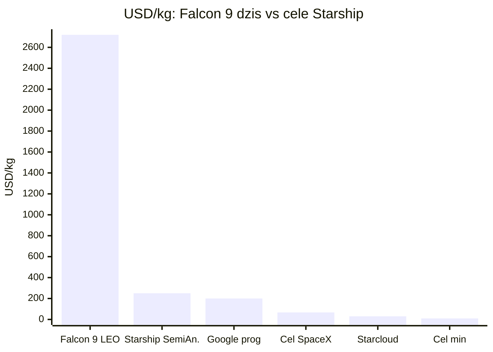
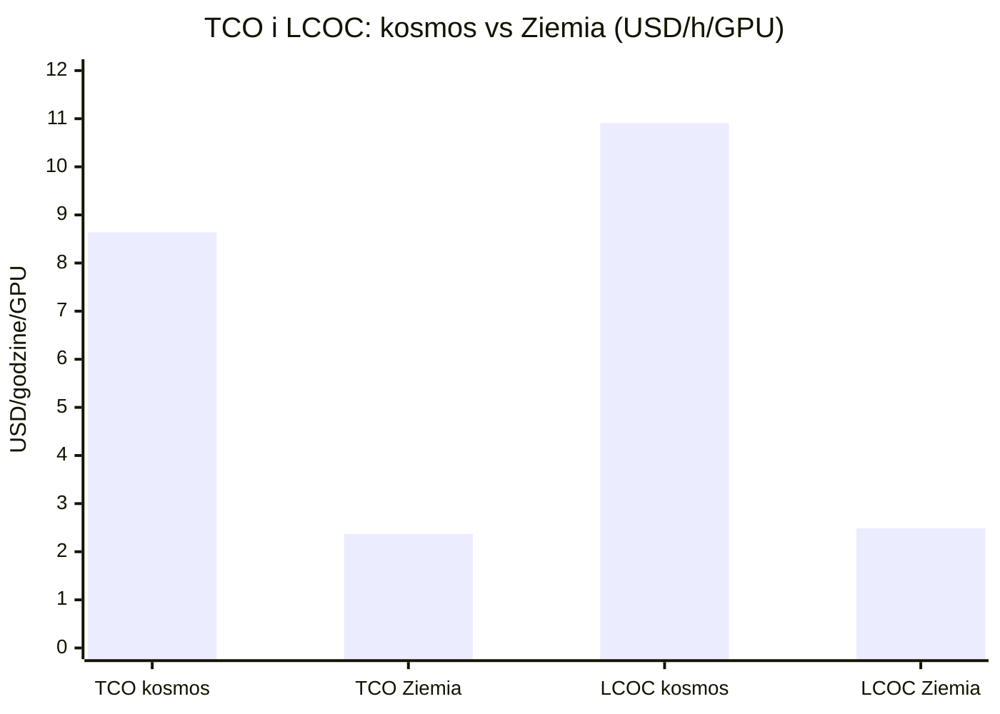
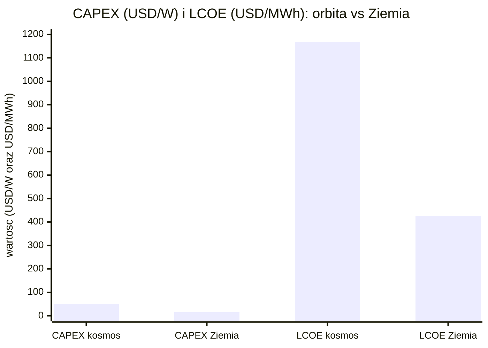
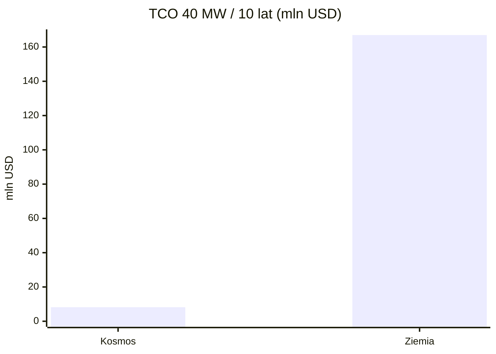

# Ekonomika i koszty całkowite (TCO)

> Notatka raportu "Orbitalne centra danych". Kluczowe źródła: [źródło 1](https://starcloudinc.github.io/wp.pdf), [źródło 2](https://newsletter.semianalysis.com/p/to-boldly-go-the-case-for-space-datacenters).

## W skrócie

To jest serce całego sporu o orbitalne centra danych: czy rachunek ekonomiczny w ogóle się domyka. Dwa obozy podają liczby rozjeżdżające się o rzędy wielkości. Z jednej strony Starcloud (dawniej Lumen Orbit) twierdzi, że 40-megawatowe centrum danych w kosmosie kosztuje przez 10 lat zaledwie 8,2 mln USD wobec 167 mln USD na Ziemi - czyli około 20 razy taniej - przy równoważnym koszcie energii rzędu 0,002 USD/kWh [whitepaper Starcloud](https://starcloudinc.github.io/wp.pdf). Z drugiej strony analityczny serwis SemiAnalysis liczy, że ten sam pomysł w 2026 roku jest ponad 4 razy droższy niż naziemny i osiągnie parytet dopiero około 2040 roku [SemiAnalysis](https://newsletter.semianalysis.com/p/to-boldly-go-the-case-for-space-datacenters). Różnica nie wynika ze złośliwości, tylko z całkowicie odmiennych założeń: koszt wyniesienia na orbitę (od 30 <abbr title="koszt wyniesienia jednego kilograma ładunku na orbitę, kluczowa zmienna całej ekonomiki orbitalnych centrów danych.">USD/kg</abbr> do 2700 USD/kg), żywotność sprzętu (5 czy 10-15 lat), masa osłon i radiatorów oraz koszt kapitału. Dla inwestora kluczowy wniosek brzmi: cały model finansowy stoi i upada na jednej zmiennej - cenie startu rakiety Starship - a ta jest dziś czysto deklaratywna. Kto stawia na tę tezę, robi de facto zakład o tempo obniżki kosztów SpaceX, a nie o sam kosmos.

<!-- spolki:related:start -->
## Spółki powiązane

> Notowane spółki produkujące podzespoły/technologie związane z tym tematem. Pełne omówienie: spółki, dla których nisza to >=33% przychodów; skrótowe: zdywersyfikowane konglomeraty. Zob. też [[Spolki/_slownik]] i [[Spolki/_widok-gpw-eu]].

**Producenci kluczowi (>=33% przychodów z niszy - omówienie pełne):**
- [[Spolki/rocket-lab|Rocket Lab Corporation (RKLB)]] - Launch (Electron/Neutron) + Space Systems: bus, ogniwa SolAero, komponenty

**Pozostali dominujący gracze (nisza to ułamek przychodów - omówienie skrótowe):**
- [[Spolki/lockheed-martin|Lockheed Martin Corporation (LMT)]] - Busy satelitarne, serwisowanie, ULA (launch)
<!-- spolki:related:end -->

<!-- network:watki:start -->
## Powiązane wątki

> Mapa powiązań tematycznych - jak ten wątek łączy się z resztą raportu.

- [[02 - weryfikacja-tez-sceptycznego-artykulu|Weryfikacja tez sceptyka]] - tu rozstrzygają się kosztowe tezy sceptycznego artykułu
- [[03 - fizyka-orbitalna-orbity-i-operacje|Fizyka orbitalna]] - koszt wyniesienia masy na orbitę to punkt wyjścia rachunku
- [[04 - energetyka-kosmiczna-i-fotowoltaika-orbitalna|Energetyka kosmiczna]] - koszt i masa systemu energetycznego to duża część CAPEX
- [[08 - niezawodnosc-serwisowanie-i-cykl-zycia-sprzetu|Niezawodność i serwisowanie]] - żywotność i cykl odświeżania sterują OPEX i amortyzacją
- [[10 - gracze-i-projekty|Gracze i projekty]] - finansowanie i założenia break-even konkretnych graczy
- [[12 - naziemny-bottleneck-energetyczny-i-sieciowy|Naziemny bottleneck]] - punktem odniesienia jest koszt naziemnego DC
<!-- network:watki:end -->
## Aktualny koszt wyniesienia: ile naprawdę kosztuje kilogram na orbicie

Punktem wyjścia jest cena, jaką dziś trzeba zapłacić za wyniesienie kilograma sprzętu. Falcon 9, rakieta wielokrotnego użytku SpaceX, oferuje usługę "<abbr title="wspólny przelot wielu małych ładunków jedną rakietą (jak carpooling), tańszy niż dedykowany start.">rideshare</abbr>" (wspólny przelot wielu małych satelitów jedną rakietą, jak carpooling) w cenie 350 000 USD za 50 kg na orbitę <abbr title="orbita synchroniczna ze Słońcem, na której satelita stale leci nad tą samą linią dnia i nocy, zapewniając niemal ciągłe oświetlenie paneli.">SSO</abbr>, a każdy dodatkowy kilogram kosztuje 7000 USD/kg 🔵 [SpaceX rideshare](https://www.spacex.com/rideshare). SSO (sun-synchronous orbit, orbita synchroniczna ze Słońcem) to orbita, na której satelita zawsze leci nad tą samą linią dnia i nocy - kluczowa dla centrów danych, bo pozwala panelom słonecznym być niemal stale oświetlonym. Historyczna stawka rideshare cytowana w analizach to 5500 USD/kg 🔵 [SpaceX rideshare/satbase](https://www.spacex.com/rideshare) - to właśnie liczba przyjmowana jako "teza bazowa" obecnych kosztów. Implikacja dla inwestora: przy takich cenach wynoszenie samego sprzętu dla poważnego centrum danych to setki milionów dolarów, co czyni dzisiejszą ekonomikę nieopłacalną bez taniej rakiety przyszłości.

Falcon 9 udźwiga 22 800 kg na niską orbitę okołoziemską <abbr title="niska orbita okołoziemska (do około 2000 km), referencyjna dla podawania udźwigu rakiet.">LEO</abbr> (low Earth orbit, do około 2000 km) 🟠 [SpaceNexus](https://spacenexus.us/learn/satellite-launch-cost) i 8300 kg na orbitę transferową GTO 🟠 [SpaceNexus](https://spacenexus.us/learn/satellite-launch-cost). Dedykowany (wyłączny) start Falcon 9 kosztował 67 mln USD w 2025 roku 🟠 [SpaceNexus](https://spacenexus.us/learn/satellite-launch-cost), a od końca lutego 2026 wzrósł do 74 mln USD z poprzednich 70 mln 🟠 [satbase](https://satbase.com/articles/spacex-falcon-9-price-increase-2026) - czyli ceny idą w górę, nie w dół. Przeliczeniowo daje to około 2720 USD/kg na LEO 🟠 [SpaceNexus](https://spacenexus.us/learn/satellite-launch-cost), a inne analizy mówią o 2700 USD/kg na Falcon 9 dziś 🟠 [Introl](https://introl.com/blog/orbital-data-centers-space-computing-race-2026) lub przedziale 1400-1800 USD/kg 🟠 [SemiAnalysis](https://newsletter.semianalysis.com/p/to-boldly-go-the-case-for-space-datacenters). Dokładny udźwig Falcon 9 do SSO jest NIE UJAWNIONE - SpaceX nie publikuje osobnej liczby dla tej orbity, oferując jedynie sloty rideshare 50-300 kg; jako proxy służy 22 800 kg na LEO 🟠 [SpaceNexus](https://spacenexus.us/learn/satellite-launch-cost). Falcon Heavy potrafi zejść do około 1520 USD/kg 🟠 [hyperscalers.news](https://africa.hyperscalers.news/analysis/lumen-orbit-secures-10m-for-ai-data-centers-in-space).

![[assets/x08-1-x4.png]]
*Rys. 46 - Krzywa kosztu USD/kg SpaceX - cena startu determinuje oplacalnosc orbitalnego DC. Źródło: Google Research / arXiv 2511.19468, licencja: arXiv open access - do uzytku wlasnego.*
#grafika #ekonomika-i-koszty-calkowite-tco #koszt #Starship #TCO

## Roadmapa Starship: docelowy koszt i reusability jako warunek brzegowy

Cała obietnica orbitalnych centrów danych opiera się na Starship - gigantycznej, w pełni wielokrotnego użytku rakiecie SpaceX. SpaceX deklaruje, że Starship dostarczy ponad 100 ton (100 000 kg) na LEO w konfiguracji w pełni wielokrotnej 🔵 [SpaceX Updates](https://www.spacex.com/updates), a inne dokumenty mówią o nawet 150 tonach w wersji wielokrotnej i 250 tonach w wersji jednorazowej 🟠 [Starship Report UChicago](https://sseh.uchicago.edu/doc/Starship_Report.pdf). Docelowo SpaceX wyobraża sobie starty co godzinę po 200 ton ładunku 🔵 [SpaceX Updates](https://www.spacex.com/updates), a w dokumencie S-1 (formularz przedrejestracyjny do giełdy) deklaruje cel wynoszenia 100 GW mocy obliczeniowej rocznie w kosmos 🟠 [SemiAnalysis cyt. S-1](https://newsletter.semianalysis.com/p/to-boldly-go-the-case-for-space-datacenters). Udźwig Starship do SSO jest formalnie NIE UJAWNIONE; Starcloud przyjmuje w swoim modelu 100 ton na SSO jako założenie 🔵 [whitepaper Starcloud](https://starcloudinc.github.io/wp.pdf).

Tu zaczyna się największa rozbieżność całego raportu - deklaracje kosztu wyniesienia rozjeżdżają się o dwa rzędy wielkości. Najbardziej optymistyczny cel to 10 USD/kg, ale przy bardzo agresywnych założeniach: rakieta zbudowana za 20 mln USD w 2027 i poleciała 100 razy 🔴 [NextBigFuture](https://www.nextbigfuture.com/2024/01/how-will-spacex-bring-the-cost-to-space-down-to-10-per-kilogram-from-over-1000-per-kilogram.html). SpaceNexus podaje cel SpaceX na 67 USD/kg na LEO 🟠 [SpaceNexus](https://spacenexus.us/learn/satellite-launch-cost), a SemiAnalysis przyjmuje ostrożniejsze 250 USD/kg dla Starship w przyszłości wyobrażonej przez SpaceX 🟠 [SemiAnalysis](https://newsletter.semianalysis.com/p/to-boldly-go-the-case-for-space-datacenters). Starcloud przyjmuje w whitepaperze 30 USD/kg - przy założeniu ceny startu około 5 mln USD przy 100 tonach ładunku 🔵 [whitepaper Starcloud](https://starcloudinc.github.io/wp.pdf). Google Research wskazuje, że próg opłacalności to spadek poniżej 200 USD/kg do połowy lat 2030 🟠 [InfoQ Google Suncatcher](https://www.infoq.com/news/2025/11/google-suncatcher-space/). SpaceX szacuje, że marginalny koszt startu (bez kosztów stałych) może spaść do 10 mln, a nawet 2 mln USD 🟠 [Starship Report](https://sseh.uchicago.edu/doc/Starship_Report.pdf). Implikacja: przy 30 USD/kg model Starcloud się domyka, przy 1400-2700 USD/kg z dzisiejszego Falcon 9 - nie domyka się wcale.

*Rys. 47 - Rozpiętość założeń kosztu wyniesienia: od 2720 USD/kg (Falcon 9 dziś) do 10 USD/kg (cel skrajnie optymistyczny) - ponad 250-krotna różnica napędzająca cały spór. Dane: SpaceNexus, SemiAnalysis, InfoQ/Google, Starcloud, NextBigFuture.*

Warunkiem brzegowym jest <abbr title="zdolność rakiety do wielokrotnych startów, dzięki której zamortyzowany koszt jednego lotu drastycznie spada.">reusability</abbr> (wielokrotny użytek). Przy założonej żywotności 100 lotów, jaką Musk szacuje dla Falcon 9, zamortyzowany koszt rakiety spada o 99% wobec rakiet jednorazowych 🟠 [Starship Report](https://sseh.uchicago.edu/doc/Starship_Report.pdf). Dla porównania konkurencyjny New Glenn od Blue Origin ma pierwszy stopień projektowany na 25 misji 🔵 [Blue Origin Blue Ring](https://www.blueorigin.com/blue-ring). Bez setek udanych, tanich powrotów Starship cała ekonomika się załamuje - to jest gating factor, czyli warunek, bez którego reszta nie ma znaczenia.

## Masa per MW, CAPEX i OPEX: z czego składa się rachunek

Im więcej kilogramów trzeba wynieść na 1 MW mocy IT, tym drożej. Tu szacunki znów się różnią. Blogowa analiza mówi o 100 000 kg/MW 🔴 [spacecomputer.io](https://blog.spacecomputer.io/spacedatacenters/), podczas gdy model Luminix rozbija to na 42 000 kg/MW łącznie: 20 000 kg sprzętu IT (osłoniętych radiacyjnie komercyjnych GPU), 8000 kg paneli z bateriami, 8000 kg radiatorów (paneli odprowadzających ciepło do kosmosu) i 6000 kg struktury z osłonami Whipple'a (warstwowa osłona przed mikrometeorytami) 🔴 [Luminix](https://www.useluminix.com/reports/industry-analysis/data-centers-in-space). Starcloud zakłada gęstość 120 kW na szafę serwerową (rack), co odpowiada systemowi Nvidia GB200 NVL72, dzięki czemu jeden start może rozłożyć około 40 MW mocy 🔵 [whitepaper Starcloud](https://starcloudinc.github.io/wp.pdf). Implikacja: różnica między 42 000 a 100 000 kg/MW mnożona przez koszt startu to setki milionów dolarów różnicy w <abbr title="jednorazowe nakłady inwestycyjne na sprzęt i wdrożenie (np. budowa satelity, koszt startu rakiety).">CAPEX</abbr> - dlatego masa jest tak samo ważna jak cena rakiety.

Komponenty CAPEX w modelu Starcloud dla 40 MW: 5 mln USD na pojedynczy start modułu obliczeniowego z panelami i radiatorami, 2 mln USD na sam panel słoneczny i 1,2 mln USD na osłony radiacyjne (przy 1 kg osłony na kW mocy i koszcie startu 30 USD/kg) 🔵 [whitepaper Starcloud](https://starcloudinc.github.io/wp.pdf). Koszt produkcji ogniw słonecznych przyjęto na 0,03 USD/W z powołaniem na Longi 🔵 [whitepaper Starcloud](https://starcloudinc.github.io/wp.pdf). W modelu Luminix sam sprzęt (osłonion komercyjne GPU) kosztuje 225-450 mln USD, a całkowity koszt sprzętu dla 1 MW to 255-505 mln USD, z kosztem startu 12,6 mln USD przy 300 USD/kg 🔴 [Luminix](https://www.useluminix.com/reports/industry-analysis/data-centers-in-space) - czyli o dwa rzędy wielkości więcej niż całe 8,2 mln USD Starcloud. Po stronie kosztów chłodzenia: panel 1 m x 1 m w temperaturze 20 stopni C wypromieniowuje około 838 W, co daje 633,08 W/m2 netto 🔵 [whitepaper Starcloud](https://starcloudinc.github.io/wp.pdf), a radiatory mają być mniejsze niż połowa powierzchni paneli 🔵 [whitepaper Starcloud](https://starcloudinc.github.io/wp.pdf). Konkurencyjne szacunki mówią jednak o 6000 m2 radiatora na 1 MW 🔴 [leodatacenters](https://leodatacenters.com/) lub - po 5 latach degradacji - wzroście wymaganej powierzchni o około 40% 🔴 [tk.etf.unsa.ba](https://www.tk.etf.unsa.ba/ieee-news/).

<abbr title="bieżące koszty operacyjne ponoszone w trakcie eksploatacji (downlink, obsługa, ubezpieczenie, regulacje).">OPEX</abbr> (koszty operacyjne) to downlink, obsługa i ubezpieczenie. Ubezpieczenie launchowe to typowo 5-15% wartości satelity 🟠 [SpaceNexus](https://spacenexus.us/learn/satellite-launch-cost), koszty regulacyjne (FCC, FAA, ITU, NOAA, ITAR) 200 000-2 000 000 USD 🟠 [SpaceNexus](https://spacenexus.us/learn/satellite-launch-cost), a integracja i testy 500 000-5 000 000 USD 🟠 [SpaceNexus](https://spacenexus.us/learn/satellite-launch-cost). SemiAnalysis ocenia, że koszty operacyjne w kosmosie zdominowane są przez alokowane koszty operacji rzędu 4167 USD/miesiąc, czyli 0,36 USD/godzinę/GPU, spadające docelowo do 0,15 USD/godzinę/GPU do połowy lat 2030 🟠 [SemiAnalysis](https://newsletter.semianalysis.com/p/to-boldly-go-the-case-for-space-datacenters). Konkretny koszt downlinku per GB dla orbitalnych centrów danych jest NIE UJAWNIONE - brak publicznych cenników operatorów, proxy stanowią stawki ground station-as-a-service (KSAT, AWS Ground Station). Starcloud zakłada łączność laserową z konstelacjami Starlink, Kuiper lub Kepler, ale bez podania kosztu 🔵 [whitepaper Starcloud](https://starcloudinc.github.io/wp.pdf).

## Co orbita eliminuje, a czego nie

Orbita fizycznie usuwa kilka pozycji kosztowych dręczących naziemne centra danych. Woda: 40 MW w kosmosie zużywa 0 litrów przez 10 lat, podczas gdy odpowiednik ziemski potrzebuje 1,7 mln ton wody (przy 0,5 L/kWh) 🔵 [whitepaper Starcloud](https://starcloudinc.github.io/wp.pdf). Energia z sieci: w modelu Starcloud koszt energii dla ziemskiego 40 MW to 140 mln USD przez 10 lat przy 0,04 USD/kWh, plus 7 mln USD chłodzenia i 20 mln USD zasilania awaryjnego 🔵 [whitepaper Starcloud](https://starcloudinc.github.io/wp.pdf) - wszystkie te pozycje w kosmosie znikają lub są marginalne. Czas przyłącza do sieci energetycznej, który na kluczowych rynkach wynosi 7-12 lat 🟠 [SemiAnalysis](https://newsletter.semianalysis.com/p/to-boldly-go-the-case-for-space-datacenters), w kosmosie nie istnieje. Energetycznie kosmos wygrywa, bo panele osiągają <abbr title="procent czasu, w którym instalacja (np. panel słoneczny) faktycznie produkuje energię na pełnej mocy.">capacity factor</abbr> (procent czasu pełnej produkcji) ponad 95% na SSO w trybie dawn-dusk 🔴 [Introl](https://introl.com/blog/orbital-data-centers-space-computing-race-2026) wobec 15-25% na Ziemi, przy irradiancji słonecznej 1361 W/m2 🔴 [andrewmccalip](https://andrewmccalip.com/space-datacenters) - efektywnie 5-9 razy więcej energii z tej samej powierzchni 🔴 [Introl](https://introl.com/blog/orbital-data-centers-space-computing-race-2026); Starcloud podaje czynnik 5x i naziemny capacity factor 24% 🔵 [whitepaper Starcloud](https://starcloudinc.github.io/wp.pdf). Implikacja dla inwestora: eliminacja przyłącza i wody to realna przewaga w regionach z deficytem mocy, gdzie naziemne DC czeka latami na zasilanie.

Czego orbita NIE eliminuje: oszczędności podatkowe i gruntowe są NIE UJAWNIONE - żaden publiczny whitepaper ani filing nie podaje kwot; orbita usuwa fizycznie grunt, ale nie uwalnia operatora od jurysdykcji podatkowej.

## Krzywa kosztu vs skala i learning curve

Argument bull case zakłada, że przy skali GW koszt jednostkowy gwałtownie spada. Starcloud twierdzi, że 5 GW mocy można rozłożyć w mniej niż 100 startach Starship 🔵 [whitepaper Starcloud](https://starcloudinc.github.io/wp.pdf), a przy 3 startach dziennie 🔵 [whitepaper Starcloud](https://starcloudinc.github.io/wp.pdf) jeden launcher rozstawi całe 5 GW w 2-3 miesiące 🔵 [whitepaper Starcloud](https://starcloudinc.github.io/wp.pdf). Model Andrew McCalipa zakłada znacznie więcej - około 294 startów na 1 GW i 29,4 mln kg masy na LEO 🔴 [andrewmccalip](https://andrewmccalip.com/space-datacenters), choć inny snapshot kalkulatora daje 222 starty i 22,2 mln kg 🟠 [andrewmccalip](https://andrewmccalip.com/space-datacenters). Różnica między "mniej niż 100" a "294" startów na GW jest sama w sobie sporem o trzykrotność kosztów wyniesienia. Po stronie technologii: cienkowarstwowe ogniwa o gęstości ponad 1000 W/kg 🔵 [whitepaper Starcloud](https://starcloudinc.github.io/wp.pdf), grubości poniżej 25 mikrometrów 🔵 [whitepaper Starcloud](https://starcloudinc.github.io/wp.pdf), z degradacją zaledwie 0,15%/rok 🔵 [whitepaper Starcloud](https://starcloudinc.github.io/wp.pdf) i sprawnością początkową 22% przy fill factor 90% 🔵 [whitepaper Starcloud](https://starcloudinc.github.io/wp.pdf). Równoważny koszt energii przy skali 40 MW Starcloud podaje na 0,002 USD/kWh 🔵 [whitepaper Starcloud](https://starcloudinc.github.io/wp.pdf).

## Finansowanie graczy i założenia break-even

Starcloud (dawniej Lumen Orbit) zebrał 170 mln USD w rundzie Series A w marcu 2026, przy wycenie 1,1 mld USD 🟠 [SatelliteToday](https://www.satellitetoday.com/finance/2026/03/30/starcloud-raises-170m-to-fund-orbital-data-center-plans/), łącznie ponad 200 mln USD 🟠 [SatelliteToday](https://www.satellitetoday.com/finance/2026/03/30/starcloud-raises-170m-to-fund-orbital-data-center-plans/) - runda do potwierdzenia jest potwierdzona przez wtórne źródło i przez Y Combinator, według którego firma została najszybszym jednorożcem w historii YC, 17 miesięcy po demo day 🔵 [Y Combinator](https://www.ycombinator.com/companies/starcloud). Starcloud złożył wniosek do FCC o konstelację do 88 000 satelitów 🔵 [FCC](https://docs.fcc.gov/public/attachments/DOC-419509A1.pdf) na SSO na wysokości 600-850 km 🔵 [FCC](https://docs.fcc.gov/public/attachments/DOC-419509A1.pdf), docelowo 5 GW 🔵 [whitepaper Starcloud](https://starcloudinc.github.io/wp.pdf), z planowanym początkiem komercyjnych lotów Starship dla Starcloud-3 do końca 2028 🟠 [Payload](https://payloadspace.com/starcloud-raises-170m-series-a-at-1-1b-valuation/). Inni gracze: Axiom Space dostał grant do 5,5 mln USD od Texas Space Commission 🔵 [Axiom Space](https://www.axiomspace.com/release/texas-space-commission-fuels-orbital-data-center) i wyniósł pierwsze dwa węzły ODC 11 stycznia 2026 🔵 [Axiom Space](https://www.axiomspace.com/orbital-data-center). NTT i SKY Perfect JSAT założyli Space Compass z planowanym kapitałem 18 mld JPY (początkowo 6 mld JPY), udziały 50/50 🔵 [NTT](https://group.ntt/en/newsrelease/2022/04/26/220426a.html). Google planuje misję testową z Planet Labs w 2027 🟠 [InfoQ](https://www.infoq.com/news/2025/11/google-suncatcher-space/). Konkretne <abbr title="poziom przychodów lub kosztów, przy którym projekt przestaje przynosić straty i zaczyna się zwracać.">break-even</abbr> revenue ani IRR są NIE UJAWNIONE - jedynym proxy są szacunki <abbr title="całkowity koszt posiadania infrastruktury przez cały okres jej życia, obejmujący zakup, wyniesienie, eksploatację i utrzymanie.">TCO</abbr> z whitepaperów.

## Weryfikacja tezy "orbitalne co najmniej 2x droższe niż naziemne"

Teza jest POTWIERDZONA dla ekonomiki opartej na obecnych kosztach Falcon 9 i komercyjnym sprzęcie. SemiAnalysis pokazuje 4,1 mln USD CAPEX w kosmosie wobec 1,4 mln na Ziemi dla klastra 30,5 kW (2,93x) 🟠 [SemiAnalysis](https://newsletter.semianalysis.com/p/to-boldly-go-the-case-for-space-datacenters), TCO 8,64 USD/godzinę/GPU wobec 2,37 (3,6x) 🟠 [SemiAnalysis](https://newsletter.semianalysis.com/p/to-boldly-go-the-case-for-space-datacenters) i <abbr title="zniwelowany koszt obliczeń, czyli uśredniony koszt jednej godziny pracy GPU w całym cyklu życia, podawany w USD/godzinę/GPU.">LCOC</abbr> (levelized cost of compute, zniwelowany koszt obliczeń) 10,91 USD/godzinę/GPU wobec 2,49 (4,4x) 🟠 [SemiAnalysis](https://newsletter.semianalysis.com/p/to-boldly-go-the-case-for-space-datacenters); różnica startuje przy ponad 4x w 2026 i zwęża się do parytetu około 2040 🟠 [SemiAnalysis](https://newsletter.semianalysis.com/p/to-boldly-go-the-case-for-space-datacenters). Luminix mówi o 1,5-3x 🔴 [Luminix](https://www.useluminix.com/reports/industry-analysis/data-centers-in-space), vixra o 2,7-4,4x dla 2 MW przy stawkach Falcon 9 🔴 [vixra](https://vixra.org/pdf/2510.0065v1.pdf), a McCalip o 51,10 USD/W wobec 15,85 USD/W i <abbr title="zniwelowany koszt energii, czyli uśredniony koszt wytworzenia jednej MWh w całym cyklu życia, podawany w USD/MWh.">LCOE</abbr> 1167 USD/MWh wobec 426 USD/MWh 🔴 [andrewmccalip](https://andrewmccalip.com/space-datacenters). Varda Space liczy około 3x drożej na wat 🟠 [Introl](https://introl.com/blog/orbital-data-centers-space-computing-race-2026).

*Rys. 48 - Koszt obliczeń w kosmosie wobec Ziemi w 2026: TCO 8,64 vs 2,37 (3,6x) oraz LCOC 10,91 vs 2,49 (4,4x). Dane: SemiAnalysis.*

*Rys. 49 - Nakłady na wat i zniwelowany koszt energii: CAPEX 51,10 vs 15,85 USD/W oraz LCOE 1167 vs 426 USD/MWh. Dane: andrewmccalip (interaktywny kalkulator).*

Teza jest jednocześnie OBALONA (a ściślej: uzależniona od założeń Starship) dla scenariuszy gwiazdkowych, w których koszt startu spada poniżej 100-200 USD/kg: Starcloud pokazuje 20x niższy TCO dla 40 MW przy 30 USD/kg i 0,002 USD/kWh 🔵 [whitepaper Starcloud](https://starcloudinc.github.io/wp.pdf), vixra przy dojrzałych kosztach Starship liczy 650-950 mln USD wobec 2,1-3,1 mld USD dla 150 MW (oszczędność 65-70%) 🔴 [vixra](https://vixra.org/pdf/2510.0065v1.pdf), a SemiAnalysis przewiduje parytet około 2040 🟠 [SemiAnalysis](https://newsletter.semianalysis.com/p/to-boldly-go-the-case-for-space-datacenters).

## Anatomia rozbieżności modeli: które zmienne tłumaczą rzędy wielkości

Dlaczego trzy poważne modele dają wyniki rozjeżdżające się nawet 100-krotnie? Oto klucz dla inwestora:

- Koszt startu: Starcloud zakłada 30 USD/kg 🔵 [whitepaper Starcloud](https://starcloudinc.github.io/wp.pdf), SemiAnalysis 1400-1800 USD/kg dziś i 250 USD/kg w przyszłości 🟠 [SemiAnalysis](https://newsletter.semianalysis.com/p/to-boldly-go-the-case-for-space-datacenters), McCalip 1000 USD/kg na LEO 🟠 [andrewmccalip](https://andrewmccalip.com/space-datacenters). To pojedyncza zmienna o największej silе - różnica 30 vs 1000 USD/kg to ponad 30x na samym wynoszeniu.
- Żywotność GPU: Starcloud zakłada brak wymiany przez co najmniej 10 lat 🔵 [whitepaper Starcloud](https://starcloudinc.github.io/wp.pdf), SemiAnalysis tylko 5 lat w kosmosie wobec 15 na Ziemi 🟠 [SemiAnalysis](https://newsletter.semianalysis.com/p/to-boldly-go-the-case-for-space-datacenters), a McCalip dodaje 9,0%/rok awaryjności GPU z marżą na awarie +45% 🟠 [andrewmccalip](https://andrewmccalip.com/space-datacenters) (wobec 3-6%/rok na Ziemi 🟠 [SemiAnalysis](https://newsletter.semianalysis.com/p/to-boldly-go-the-case-for-space-datacenters)). Krótsze życie i wyższa awaryjność mogą podwoić lub potroić koszt jednostkowy.
- <abbr title="wskaźnik efektywności energetycznej centrum danych: stosunek całej zużytej energii do energii zużytej na same obliczenia (1,0 = ideał).">PUE</abbr> (power usage effectiveness, ile energii idzie na chłodzenie i obsługę poza samymi obliczeniami): Starcloud deklaruje porównywalny z najlepszymi hyperscale, ale konkretna liczba NIE UJAWNIONE 🔵 [whitepaper Starcloud](https://starcloudinc.github.io/wp.pdf), SemiAnalysis przyjmuje 1,35 🟠 [SemiAnalysis](https://newsletter.semianalysis.com/p/to-boldly-go-the-case-for-space-datacenters), McCalip 1,20 🟠 [andrewmccalip](https://andrewmccalip.com/space-datacenters).
- Masa radiatorów i shielding: Starcloud kapitalizuje shielding na 1,2 mln USD przy 1 kg/kW 🔵 [whitepaper Starcloud](https://starcloudinc.github.io/wp.pdf), McCalip wprost ignoruje wpływ osłon na masę i nie zakłada dedykowanej masy radiatorów 🟠 [andrewmccalip](https://andrewmccalip.com/space-datacenters) - co paradoksalnie zaniża jego masę, mimo wysokiego wyniku LCOE.
- OPEX i koszt kapitału (<abbr title="średni ważony koszt kapitału, czyli oprocentowanie, jakiego inwestorzy oczekują od projektu; wyższy WACC podnosi koszt obliczeń.">WACC</abbr>): SemiAnalysis stosuje WACC 15,0% dla kosmosu (spadający do 10,3% przy parytecie w około 10 lat) wobec 10,3% dla Ziemi 🟠 [SemiAnalysis](https://newsletter.semianalysis.com/p/to-boldly-go-the-case-for-space-datacenters); Starcloud nie podaje WACC, amortyzując wszystko liniowo przez 10 lat 🔵 [whitepaper Starcloud](https://starcloudinc.github.io/wp.pdf). Wyższy koszt kapitału sam w sobie podnosi LCOC o kilkadziesiąt procent.

Który model jest wiarygodny dla jakiego scenariusza? Starcloud (0,002 USD/kWh, 20x taniej) to najlepszy scenariusz przy dojrzałym, tanim Starship i długiej żywotności sprzętu - wiarygodny jako górna granica optymizmu około 2035+. SemiAnalysis (4x drożej dziś, parytet około 2040) to model najbardziej zrównoważony i jawnie modelujący WACC, żywotność i awaryjność - najlepszy dla scenariusza "dziś i najbliższa dekada". McCalip (1167 USD/MWh, czyli około 2,7x droższa energia) to interaktywny kalkulator zależny od suwaków (drugi snapshot daje już 891 USD/MWh wobec 398 USD/MWh ziemskich 🟠 [andrewmccalip](https://andrewmccalip.com/space-datacenters)), użyteczny do testowania wrażliwości, ale nie jako pojedyncza prawda.

## Kontrowersje

**1. Największy spór raportu: czy ekonomika domyka się?**

BULL: Starcloud podaje 8,2 mln USD wobec 167 mln USD dla 40 MW przez 10 lat, czyli około 20x taniej 🔵 [whitepaper Starcloud](https://starcloudinc.github.io/wp.pdf); potwierdza to wtórnie Blocks & Files cytując "20 times less" 🟠 [Blocks & Files](https://www.blocksandfiles.com/architecture/2025/10/23/starcloud-pitches-orbital-datacenters-as-cheaper-cooler-and-cleaner/1597295), a Introl mówi o około 15x taniej i energii około 0,005 USD/kWh 🟠 [Introl](https://introl.com/blog/orbital-data-centers-space-computing-race-2026).

*Rys. 50 - Bilans kosztu 40 MW przez 10 lat według Starcloud: 8,2 mln USD w kosmosie wobec 167 mln USD na Ziemi (około 20x taniej). Dane: whitepaper Starcloud.*

BEAR: SemiAnalysis liczy 8,64 USD/godzinę/GPU w kosmosie wobec 2,37 na Ziemi w 2026 (3,6x drożej) 🟠 [SemiAnalysis](https://newsletter.semianalysis.com/p/to-boldly-go-the-case-for-space-datacenters), a miesięczne zniwelowane koszty kapitałowe centrum są według nich nawet 18x wyższe niż na Ziemi 🟠 [SemiAnalysis](https://newsletter.semianalysis.com/p/to-boldly-go-the-case-for-space-datacenters). Na poziomie inferencji to 590 USD wobec 135 USD za miliard tokenów 🟠 [SemiAnalysis](https://newsletter.semianalysis.com/p/to-boldly-go-the-case-for-space-datacenters). Różnica nie wynika z błędu rachunkowego, lecz z odmiennych założeń o cenie startu, żywotności sprzętu i koszcie kapitału (patrz sekcja o anatomii rozbieżności).

**2. Ogromna rozbieżność prognoz $/kg Starship (marketing vs realizm)**

MARKETING/OPTYMIZM: 10 USD/kg przy 100 powtórnych lotach 🔴 [NextBigFuture](https://www.nextbigfuture.com/2024/01/how-will-spacex-bring-the-cost-to-space-down-to-10-per-kilogram-from-over-1000-per-kilogram.html); 30 USD/kg w modelu Starcloud 🔵 [whitepaper Starcloud](https://starcloudinc.github.io/wp.pdf); 67 USD/kg jako cel SpaceX 🟠 [SpaceNexus](https://spacenexus.us/learn/satellite-launch-cost).

REALIZM/SCEPTYCYZM: 200 USD/kg jako próg opłacalności według Google dopiero w połowie lat 2030 🟠 [InfoQ](https://www.infoq.com/news/2025/11/google-suncatcher-space/); 250 USD/kg w modelu SemiAnalysis dla przyszłego Starship 🟠 [SemiAnalysis](https://newsletter.semianalysis.com/p/to-boldly-go-the-case-for-space-datacenters); 500-1000 USD/kg w scenariuszu bazowym do 2035, "poniżej progu opłacalności" 🔴 [nb1t](https://nb1t.sh/data-centers-in-space/); 1500-2500 USD/kg obecnie, "zaporowe dla obliczeń na dużą skalę" 🔴 [Introl](https://introl.com/blog/orbital-data-center-nodes-launch-space-computing-infrastructure-january-2026). Rozpiętość 10-2500 USD/kg to 250-krotność - cała teza inwestycyjna mieści się w tym przedziale.

**3. Czy "darmowa" energia i chłodzenie kompensują koszt orbity?**

ZA (BULL): równoważny koszt energii 0,002 USD/kWh 🔵 [whitepaper Starcloud](https://starcloudinc.github.io/wp.pdf); zerowe zużycie wody wobec 1,7 mln ton na Ziemi 🔵 [whitepaper Starcloud](https://starcloudinc.github.io/wp.pdf); panele generują ponad 5x więcej energii niż na Ziemi przy capacity factor ponad 95% 🔵 [whitepaper Starcloud](https://starcloudinc.github.io/wp.pdf).

PRZECIW (BEAR): radiatory wymagają około 6000 m2 na 1 MW 🔴 [leodatacenters](https://leodatacenters.com/), a po 5 latach degradacji powierzchnia rośnie o około 40% 🔴 [tk.etf.unsa.ba](https://www.tk.etf.unsa.ba/ieee-news/); masa infrastruktury sięga 100 000 kg/MW, a masa to koszt wyniesienia 🔴 [spacecomputer.io](https://blog.spacecomputer.io/spacedatacenters/); LCOE orbitalne 1167 USD/MWh wobec 426 USD/MWh ziemskiego 🔴 [andrewmccalip](https://andrewmccalip.com/space-datacenters); zniwelowane koszty kapitałowe centrum aż 18x wyższe 🟠 [SemiAnalysis](https://newsletter.semianalysis.com/p/to-boldly-go-the-case-for-space-datacenters). Rzeczywisty koszt lifecycle radiatorów i degradacji ogniw jest NIE UJAWNIONE - brak danych operacyjnych z wieloletniej eksploatacji centrum skali MW.

## Słowniczek pojęć

- **TCO (total cost of ownership)** - całkowity koszt posiadania infrastruktury przez cały okres jej życia, obejmujący zakup, wyniesienie, eksploatację i utrzymanie.
- **CAPEX** - jednorazowe nakłady inwestycyjne na sprzęt i wdrożenie (np. budowa satelity, koszt startu rakiety).
- **OPEX** - bieżące koszty operacyjne ponoszone w trakcie eksploatacji (downlink, obsługa, ubezpieczenie, regulacje).
- **LCOC (levelized cost of compute)** - zniwelowany koszt obliczeń, czyli uśredniony koszt jednej godziny pracy GPU w całym cyklu życia, podawany w USD/godzinę/GPU.
- **LCOE (levelized cost of energy)** - zniwelowany koszt energii, czyli uśredniony koszt wytworzenia jednej MWh w całym cyklu życia, podawany w USD/MWh.
- **PUE (power usage effectiveness)** - wskaźnik efektywności energetycznej centrum danych: stosunek całej zużytej energii do energii zużytej na same obliczenia (1,0 = ideał).
- **WACC (weighted average cost of capital)** - średni ważony koszt kapitału, czyli oprocentowanie, jakiego inwestorzy oczekują od projektu; wyższy WACC podnosi koszt obliczeń.
- **USD/kg** - koszt wyniesienia jednego kilograma ładunku na orbitę, kluczowa zmienna całej ekonomiki orbitalnych centrów danych.
- **reusability (wielokrotny użytek)** - zdolność rakiety do wielokrotnych startów, dzięki której zamortyzowany koszt jednego lotu drastycznie spada.
- **rideshare** - wspólny przelot wielu małych ładunków jedną rakietą (jak carpooling), tańszy niż dedykowany start.
- **learning curve (krzywa uczenia)** - efekt spadku kosztu jednostkowego wraz ze wzrostem skali produkcji i liczby powtórzeń.
- **break-even (próg rentowności)** - poziom przychodów lub kosztów, przy którym projekt przestaje przynosić straty i zaczyna się zwracać.
- **capacity factor (współczynnik wykorzystania mocy)** - procent czasu, w którym instalacja (np. panel słoneczny) faktycznie produkuje energię na pełnej mocy.
- **SSO (sun-synchronous orbit)** - orbita synchroniczna ze Słońcem, na której satelita stale leci nad tą samą linią dnia i nocy, zapewniając niemal ciągłe oświetlenie paneli.
- **LEO (low Earth orbit)** - niska orbita okołoziemska (do około 2000 km), referencyjna dla podawania udźwigu rakiet.

## Źródła

- 🔵 [SpaceX rideshare](https://www.spacex.com/rideshare) - oficjalny cennik rideshare (50 kg za 350k USD, 7000 USD/kg, historyczne 5500 USD/kg).
- 🔵 [SpaceX Updates](https://www.spacex.com/updates) - deklaracje Starship (100-200 ton, 100 GW/rok).
- 🔵 [whitepaper Starcloud](https://starcloudinc.github.io/wp.pdf) - centralny model TCO 40 MW (8,2 mln vs 167 mln, 30 USD/kg, 0,002 USD/kWh).
- 🔵 [FCC Public Notice](https://docs.fcc.gov/public/attachments/DOC-419509A1.pdf) - wniosek o 88 000 satelitów Starcloud, SSO 600-850 km.
- 🔵 [Y Combinator](https://www.ycombinator.com/companies/starcloud) - najszybszy jednorożec YC, 17 miesięcy po demo day.
- 🔵 [Axiom Space ODC](https://www.axiomspace.com/orbital-data-center) i [grant TSC](https://www.axiomspace.com/release/texas-space-commission-fuels-orbital-data-center) - 5,5 mln USD, launch 11.01.2026.
- 🔵 [NTT Space Compass](https://group.ntt/en/newsrelease/2022/04/26/220426a.html) - kapitał 18 mld JPY, JV 50/50.
- 🔵 [Blue Origin Blue Ring](https://www.blueorigin.com/blue-ring) - 25 misji pierwszego stopnia, payload do 4000 kg.
- 🟠 [SemiAnalysis](https://newsletter.semianalysis.com/p/to-boldly-go-the-case-for-space-datacenters) - model bear case (3,6x TCO, 4,4x LCOC, parytet ~2040, WACC 15%).
- 🟠 [SpaceNexus](https://spacenexus.us/learn/satellite-launch-cost) - udźwig i ceny Falcon 9, cel Starship 67 USD/kg.
- 🟠 [satbase](https://satbase.com/articles/spacex-falcon-9-price-increase-2026) - wzrost ceny dedykowanego startu do 74 mln USD.
- 🟠 [SatelliteToday](https://www.satellitetoday.com/finance/2026/03/30/starcloud-raises-170m-to-fund-orbital-data-center-plans/) i [Payload](https://payloadspace.com/starcloud-raises-170m-series-a-at-1-1b-valuation/) - runda Series A 170 mln USD, wycena 1,1 mld.
- 🟠 [Starship Report UChicago](https://sseh.uchicago.edu/doc/Starship_Report.pdf) - udźwig 150/250 ton, marginalny koszt 2-10 mln USD.
- 🟠 [InfoQ Google Suncatcher](https://www.infoq.com/news/2025/11/google-suncatcher-space/) - próg 200 USD/kg, misja 2027.
- 🟠 [Blocks & Files](https://www.blocksandfiles.com/architecture/2025/10/23/starcloud-pitches-orbital-datacenters-as-cheaper-cooler-and-cleaner/1597295) - potwierdzenie "20 times less".
- 🟠 [hyperscalers.news](https://africa.hyperscalers.news/analysis/lumen-orbit-secures-10m-for-ai-data-centers-in-space) - Falcon Heavy 1520 USD/kg, Starship 150 USD/kg.
- 🔴 [andrewmccalip](https://andrewmccalip.com/space-datacenters) - interaktywny kalkulator (LCOE 1167/891 USD/MWh, 51,10 USD/W).
- 🔴 [Luminix](https://www.useluminix.com/reports/industry-analysis/data-centers-in-space) - model masowy 42 000 kg/MW, gap 1,5-3x.
- 🔴 [vixra](https://vixra.org/pdf/2510.0065v1.pdf) - 2,7-4,4x dla 2 MW, oszczędność 65-70% przy dojrzałym Starship.
- 🔴 [Introl](https://introl.com/blog/orbital-data-centers-space-computing-race-2026) i [Introl nodes](https://introl.com/blog/orbital-data-center-nodes-launch-space-computing-infrastructure-january-2026) - 15x taniej (claim), 1500-2500 USD/kg dziś.
- 🔴 [leodatacenters](https://leodatacenters.com/) - 6000 m2 radiatora na 1 MW.
- 🔴 [spacecomputer.io](https://blog.spacecomputer.io/spacedatacenters/) - 100 000 kg/MW infrastruktury.
- 🔴 [NextBigFuture](https://www.nextbigfuture.com/2024/01/how-will-spacex-bring-the-cost-to-space-down-to-10-per-kilogram-from-over-1000-per-kilogram.html) - cel 10 USD/kg.
- 🔴 [nb1t](https://nb1t.sh/data-centers-in-space/) - scenariusz bazowy 500-1000 USD/kg do 2035.
- 🔴 [tk.etf.unsa.ba](https://www.tk.etf.unsa.ba/ieee-news/) - radiatory, wzrost o 40% po 5 latach.

## Dane źródłowe

- `5500 USD/kg` | https://www.spacex.com/rideshare | primary | "its virtually unbeatable rate of $5500 per kilogram."
- `350000 USD/50 kg SSO` | https://www.spacex.com/rideshare | primary | "$350k for 50kg to SSO with additional mass at $7k/kg."
- `7000 USD/kg` | https://www.spacex.com/rideshare | primary | "additional mass at $7k/kg."
- `22800 kg do LEO` | https://spacenexus.us/learn/satellite-launch-cost | secondary | "SpaceX Falcon 9 · Operational · Payload to LEO: 22,800 kg"
- `8300 kg do GTO` | https://spacenexus.us/learn/satellite-launch-cost | secondary | "GTO Capacity: 8,300 kg"
- `67000000 USD start (2025)` | https://spacenexus.us/learn/satellite-launch-cost | secondary | "Dedicated Price: $67M"
- `74000000 USD start (2026)` | https://satbase.com/articles/spacex-falcon-9-price-increase-2026 | secondary | "the new price for a dedicated Falcon 9 launch is $74M, up from $70M."
- `2720 USD/kg LEO` | https://spacenexus.us/learn/satellite-launch-cost | secondary | "Cost/kg LEO: $2,720"
- `2700 USD/kg Falcon 9` | https://introl.com/blog/orbital-data-centers-space-computing-race-2026 | secondary | "approximately $2,700 per kilogram on Falcon 9 today"
- `1400-1800 USD/kg Falcon 9` | https://newsletter.semianalysis.com/p/to-boldly-go-the-case-for-space-datacenters | secondary | "launch costs from ~$1,400-$1,800/kg for Falcon 9 today"
- `1520 USD/kg Falcon Heavy` | https://africa.hyperscalers.news/analysis/lumen-orbit-secures-10m-for-ai-data-centers-in-space | secondary | "costs are closer to $1,520 per kilogram with Falcon Heavy rockets."
- `100 ton LEO Starship` | https://www.spacex.com/updates | primary | "Starship is designed to deliver over 100 metric tons ... to Low Earth Orbit (LEO)."
- `150 ton LEO Starship` | https://sseh.uchicago.edu/doc/Starship_Report.pdf | secondary | "up to 150 metric tons in a reusable configuration"
- `250 ton LEO jednorazowy` | https://sseh.uchicago.edu/doc/Starship_Report.pdf | secondary | "250 metric tons with an expendable booster."
- `200 ton na start` | https://www.spacex.com/updates | primary | "launches every hour carrying 200 tons per flight"
- `100 GW/rok compute` | https://newsletter.semianalysis.com/p/to-boldly-go-the-case-for-space-datacenters | secondary | "Our goal over time is to launch 100 gigawatts of compute to space each year."
- `10 USD/kg cel` | https://www.nextbigfuture.com/2024/01/how-will-spacex-bring-the-cost-to-space-down-to-10-per-kilogram-from-over-1000-per-kilogram.html | weak | "the payload cost would be $10 per kilogram."
- `67 USD/kg target Starship` | https://spacenexus.us/learn/satellite-launch-cost | secondary | "Price/kg LEO: $67 (target)"
- `200 USD/kg próg` | https://www.infoq.com/news/2025/11/google-suncatcher-space/ | secondary | "launch costs below $200 per kilogram by the mid-2030s"
- `250 USD/kg Starship przyszly` | https://newsletter.semianalysis.com/p/to-boldly-go-the-case-for-space-datacenters | secondary | "to only ~$250/kg for Starship in the future envisioned by SpaceX"
- `150 USD/kg Starship` | https://africa.hyperscalers.news/analysis/lumen-orbit-secures-10m-for-ai-data-centers-in-space | secondary | "could potentially bring that down to around $150 per kilogram"
- `30 USD/kg Starcloud` | https://starcloudinc.github.io/wp.pdf | primary | "this translates to approximately $30 per kilogram."
- `5 mln USD start` | https://starcloudinc.github.io/wp.pdf | primary | "a launch price of around $5 million per launch long term."
- `2 mln USD marginalny start` | https://sseh.uchicago.edu/doc/Starship_Report.pdf | secondary | "as low as $2M (without including fixed costs)."
- `100 lotów zywotnosc` | https://sseh.uchicago.edu/doc/Starship_Report.pdf | secondary | "Assuming a 100-flight lifespan ... costs could plummet by a staggering 99%"
- `25 misji New Glenn` | https://www.blueorigin.com/blue-ring | primary | "reusable first stage is designed for 25 missions"
- `100000 kg/MW` | https://blog.spacecomputer.io/spacedatacenters/ | weak | "you're looking at 100,000 kg/MW of deployed infrastructure."
- `42000 kg/MW lacznie` | https://www.useluminix.com/reports/industry-analysis/data-centers-in-space | weak | "Total: 42,000 kg"
- `20000 kg IT compute` | https://www.useluminix.com/reports/industry-analysis/data-centers-in-space | weak | "IT compute (shielded commercial GPUs): 20,000 kg"
- `8000 kg solar+batteries` | https://www.useluminix.com/reports/industry-analysis/data-centers-in-space | weak | "Solar arrays + batteries: 8,000 kg"
- `8000 kg radiators` | https://www.useluminix.com/reports/industry-analysis/data-centers-in-space | weak | "Thermal radiators: 8,000 kg"
- `6000 kg structure/shields` | https://www.useluminix.com/reports/industry-analysis/data-centers-in-space | weak | "Structure, propulsion, Whipple shields: 6,000 kg"
- `120 kW per rack` | https://starcloudinc.github.io/wp.pdf | primary | "a power density of 120 kW per rack, equivalent to the Nvidia GB200 NVL72"
- `40 MW per launch` | https://starcloudinc.github.io/wp.pdf | primary | "one launch can deploy ~40 MW of compute"
- `0.03 USD/W ogniwa` | https://starcloudinc.github.io/wp.pdf | primary | "material cost of solar cells at $0.03 per watt"
- `838 W radiacja 1 m2` | https://starcloudinc.github.io/wp.pdf | primary | "A 1m x 1m black plate kept at 20°C will radiate about 838 watts to deep space"
- `633.08 W/m2 netto` | https://starcloudinc.github.io/wp.pdf | primary | "each square meter of radiator wil net radiate ... = 633.08 W/m2"
- `6000 m2 radiatora/MW` | https://leodatacenters.com/ | weak | "a 1-megawatt facility requires roughly 6,000 square meters"
- `+40 % powierzchnia po 5 latach` | https://www.tk.etf.unsa.ba/ieee-news/ | weak | "after 5 years in space the required area increases by about 40 percent"
- `8200000 USD space 40 MW` | https://starcloudinc.github.io/wp.pdf | primary | "Cost Balance... Space: $8.2m"
- `167000000 USD terrestrial 40 MW` | https://starcloudinc.github.io/wp.pdf | primary | "Cost Balance... Terrestrial: $167m"
- `5000000 USD launch module` | https://starcloudinc.github.io/wp.pdf | primary | "Launch: $5m (single launch of compute module, solar & radiators)"
- `2000000 USD solar array` | https://starcloudinc.github.io/wp.pdf | primary | "$2m cost of solar array"
- `1200000 USD shielding` | https://starcloudinc.github.io/wp.pdf | primary | "Radiation shielding: $1.2m @ 1 kg of shielding per kW"
- `1 kg/kW shielding` | https://starcloudinc.github.io/wp.pdf | primary | "@ 1 kg of shielding per kW of compute"
- `140000000 USD energia ziemska` | https://starcloudinc.github.io/wp.pdf | primary | "Energy (10 years): $140m @ $0.04 per kWh"
- `7000000 USD chlodzenie ziemskie` | https://starcloudinc.github.io/wp.pdf | primary | "Cooling (chiller energy cost): $7m @ 5% of overall power usage"
- `20000000 USD backup power` | https://starcloudinc.github.io/wp.pdf | primary | "Backup power supply: $20m"
- `255000000-505000000 USD hardware 1 MW` | https://www.useluminix.com/reports/industry-analysis/data-centers-in-space | weak | "Total hardware cost $255-505M"
- `12600000 USD launch 1 MW` | https://www.useluminix.com/reports/industry-analysis/data-centers-in-space | weak | "Launch Cost (@$300/kg): $12.6M"
- `5-15 % ubezpieczenie launchowe` | https://spacenexus.us/learn/satellite-launch-cost | secondary | "Launch Insurance: Typically 5-15% of the satellite value."
- `200000-2000000 USD regulacje` | https://spacenexus.us/learn/satellite-launch-cost | secondary | "export control (ITAR) compliance can add $200K-$2M"
- `500000-5000000 USD integracja/testy` | https://spacenexus.us/learn/satellite-launch-cost | secondary | "typically cost $500K-$5M"
- `4167 USD/miesiac ops` | https://newsletter.semianalysis.com/p/to-boldly-go-the-case-for-space-datacenters | secondary | "allocated operations costs, at $4,167 per month"
- `0.36 USD/hr/GPU ops` | https://newsletter.semianalysis.com/p/to-boldly-go-the-case-for-space-datacenters | secondary | "amounting to $0.36/hr/GPU"
- `0.15 USD/hr/GPU ops 2030s` | https://newsletter.semianalysis.com/p/to-boldly-go-the-case-for-space-datacenters | secondary | "dropping as low $0.15/hr/GPU by the mid-2030s"
- `0 L wody space 40 MW` | https://starcloudinc.github.io/wp.pdf | primary | "Water usage: 1.7m tons @ 0.5L/kWh... Not required [space]"
- `1700000 ton wody ziemia` | https://starcloudinc.github.io/wp.pdf | primary | "Water usage: 1.7m tons @ 0.5L/kWh"
- `7-12 lat przylacze` | https://newsletter.semianalysis.com/p/to-boldly-go-the-case-for-space-datacenters | secondary | "Power interconnection timeline: 7-12 years (key markets)"
- `15-25 % capacity factor ziemia` | https://introl.com/blog/orbital-data-centers-space-computing-race-2026 | weak | "Solar panel capacity factor: 15-25% [Terrestrial]"
- `>95 % capacity factor SSO` | https://starcloudinc.github.io/wp.pdf | primary | "the capacity factor of our proposed space-based solar array is greater than 95%"
- `24 % capacity factor ziemia USA` | https://starcloudinc.github.io/wp.pdf | primary | "Terrestrial solar farms in the US achieve a median capacity factor of just 24%"
- `1361 W/m2 irradiance` | https://andrewmccalip.com/space-datacenters | weak | "The sun delivers Gsc=1361 W/m2 (AM0)"
- `5-9 x irradiance` | https://introl.com/blog/orbital-data-centers-space-computing-race-2026 | weak | "Advantage Factor: 5-9x"
- `5 x energia space` | https://starcloudinc.github.io/wp.pdf | primary | "a given solar array in space will generate over 5 times the energy as the same array on Earth"
- `0.002 USD/kWh space` | https://starcloudinc.github.io/wp.pdf | primary | "an equivalent energy cost of ~$0.002/kWh."
- `22 x taniej energia` | https://starcloudinc.github.io/wp.pdf | primary | "Orbital data centers can therefore offer energy 22 times lower cost"
- `0.04 USD/kWh hurt USA` | https://starcloudinc.github.io/wp.pdf | primary | "Energy (10 years) $140m @ $0.04 per kWh"
- `0.005 USD/kWh claim` | https://introl.com/blog/orbital-data-centers-space-computing-race-2026 | secondary | "energy costs near $0.005 per kilowatt-hour, up to 15 times lower"
- `15 x taniej Introl` | https://introl.com/blog/orbital-data-centers-space-computing-race-2026 | secondary | "up to 15 times lower than wholesale terrestrial electricity."
- `0.087 USD/kWh SemiAnalysis` | https://newsletter.semianalysis.com/p/to-boldly-go-the-case-for-space-datacenters | secondary | "we assume an electricity cost of $0.087/kWh"
- `100 startów na 5 GW` | https://starcloudinc.github.io/wp.pdf | primary | "5 GW of compute could be deployed with fewer than 100 launches"
- `2-3 miesiace 5 GW` | https://starcloudinc.github.io/wp.pdf | primary | "one launcher could conceivably launch the entire 5 GW data center in 2-3 months"
- `3 starty dziennie` | https://starcloudinc.github.io/wp.pdf | primary | "designed to launch up to three times per day."
- `294 startów na 1 GW` | https://andrewmccalip.com/space-datacenters | weak | "Starship Launches: ~294"
- `222 startów na 1 GW` | https://andrewmccalip.com/space-datacenters | secondary | "Starship Launches ~222"
- `29.4 mln kg na 1 GW` | https://andrewmccalip.com/space-datacenters | weak | "Mass to LEO: 29.4M kg"
- `22.2 mln kg na 1 GW` | https://andrewmccalip.com/space-datacenters | secondary | "Mass to LEO 22.2M kg"
- `1000 W/kg thin-film` | https://starcloudinc.github.io/wp.pdf | primary | "achieve power densities >1000 W/kg"
- `25 µm grubosc ogniw` | https://starcloudinc.github.io/wp.pdf | primary | "silicon wafers <25μm thickness"
- `0.15 %/rok degradacja` | https://starcloudinc.github.io/wp.pdf | primary | "degradation rates of just 0.15% per year"
- `22 % sprawnosc poczatkowa` | https://starcloudinc.github.io/wp.pdf | primary | "beginning-of-life efficiency of 22% using silicon solar cells"
- `90 % fill factor` | https://starcloudinc.github.io/wp.pdf | primary | "assuming a cell fill factor of 90%"
- `4x4 km solar 5 GW` | https://starcloudinc.github.io/wp.pdf | primary | "A 5 GW data center would require a solar array with dimensions of approximately 4 km by 4 km"
- `170000000 USD Series A` | https://www.satellitetoday.com/finance/2026/03/30/starcloud-raises-170m-to-fund-orbital-data-center-plans/ | secondary | "raised $170 million in a Series A round"
- `1100000000 USD wycena` | https://www.satellitetoday.com/finance/2026/03/30/starcloud-raises-170m-to-fund-orbital-data-center-plans/ | secondary | "values the company at $1.1 billion."
- `>200000000 USD funding lacznie` | https://www.satellitetoday.com/finance/2026/03/30/starcloud-raises-170m-to-fund-orbital-data-center-plans/ | secondary | "It has raised more than $200 million"
- `17 miesiecy jednorozec` | https://www.ycombinator.com/companies/starcloud | primary | "becoming the fastest unicorn in YC history, just 17 months after demo day."
- `88000 satelitów FCC` | https://docs.fcc.gov/public/attachments/DOC-419509A1.pdf | primary | "a constellation of up to 88,000 satellites"
- `600-850 km SSO` | https://docs.fcc.gov/public/attachments/DOC-419509A1.pdf | primary | "sun synchronous orbit at altitudes between 600 km and 850 km."
- `5 GW Starcloud` | https://starcloudinc.github.io/wp.pdf | primary | "5 GW of compute could be deployed with fewer than 100 launches"
- `2028 starty komercyjne Starcloud-3` | https://payloadspace.com/starcloud-raises-170m-series-a-at-1-1b-valuation/ | secondary | "future commercial flights ... which Johnston expects to begin by the end of 2028."
- `5500000 USD grant TSC Axiom` | https://www.axiomspace.com/release/texas-space-commission-fuels-orbital-data-center | primary | "awarded Axiom Space up to $5.5 million"
- `2026-01-11 launch ODC Axiom` | https://www.axiomspace.com/orbital-data-center | primary | "successfully launched to low-Earth orbit on January 11, 2026."
- `18000000000 JPY kapital Space Compass` | https://group.ntt/en/newsrelease/2022/04/26/220426a.html | primary | "Capital: 18 billion yen (planned)"
- `6000000000 JPY kapital poczatkowy` | https://group.ntt/en/newsrelease/2022/04/26/220426a.html | primary | "will be 6 billion yen (including capital reserve)"
- `50/50 % udzialy NTT/JSAT` | https://group.ntt/en/newsrelease/2022/04/26/220426a.html | primary | "Shareholders: NTT 50%, SKY Perfect JSAT 50%"
- `2027 misja Google/Planet` | https://www.infoq.com/news/2025/11/google-suncatcher-space/ | secondary | "Google plans a joint mission with Planet in 2027"
- `4100000 USD CAPEX space 30.5 kW` | https://newsletter.semianalysis.com/p/to-boldly-go-the-case-for-space-datacenters | secondary | "$4.1M for a space deployment"
- `1400000 USD CAPEX ziemia 30.5 kW` | https://newsletter.semianalysis.com/p/to-boldly-go-the-case-for-space-datacenters | secondary | "$1.4M for terrestrial deployments"
- `8.64 USD/hr/GPU TCO space` | https://newsletter.semianalysis.com/p/to-boldly-go-the-case-for-space-datacenters | secondary | "$8.64/hr/GPU for a space-based deployment"
- `2.37 USD/hr/GPU TCO ziemia` | https://newsletter.semianalysis.com/p/to-boldly-go-the-case-for-space-datacenters | secondary | "compared to $2.37/hr/GPU for a terrestrial deployment"
- `10.91 USD/hr/GPU LCOC space` | https://newsletter.semianalysis.com/p/to-boldly-go-the-case-for-space-datacenters | secondary | "LCOC ... of $10.91/hr/GPU for an orbital deployment"
- `2.49 USD/hr/GPU LCOC ziemia` | https://newsletter.semianalysis.com/p/to-boldly-go-the-case-for-space-datacenters | secondary | "compared to $2.49/hr/GPU for a terrestrial deployment."
- `>4 x w 2026, parytet ~2040` | https://newsletter.semianalysis.com/p/to-boldly-go-the-case-for-space-datacenters | secondary | "starts at more than 4x in 2026 before narrowing to parity in ~2040"
- `18 x levelized capital` | https://newsletter.semianalysis.com/p/to-boldly-go-the-case-for-space-datacenters | secondary | "monthly levelized datacenter capital costs are a whopping 18x higher"
- `590 USD/mld tokenów space` | https://newsletter.semianalysis.com/p/to-boldly-go-the-case-for-space-datacenters | secondary | "inference LCOC of $590 per Billion Tokens for a 2026 space datacenter"
- `135 USD/mld tokenów ziemia` | https://newsletter.semianalysis.com/p/to-boldly-go-the-case-for-space-datacenters | secondary | "vs only $135 per Billion tokens for an Earth datacenter"
- `1.5-3 x Luminix` | https://www.useluminix.com/reports/industry-analysis/data-centers-in-space | weak | "The gap is 1.5-3x"
- `2.7-4.4 x 2 MW vixra` | https://vixra.org/pdf/2510.0065v1.pdf | weak | "$71 million orbital at Falcon 9 rates-2.7-4.4 more expensive"
- `650-950 mln USD space 150 MW` | https://vixra.org/pdf/2510.0065v1.pdf | weak | "Orbital (mature Starship costs)... Total: $650-950 million"
- `2100-3100 mln USD ziemia 150 MW` | https://vixra.org/pdf/2510.0065v1.pdf | weak | "Terrestrial... Total: $2.1-3.1 billion"
- `65-70 % oszczednosc vixra` | https://vixra.org/pdf/2510.0065v1.pdf | weak | "Savings: 65-70%"
- `51.10 USD/W space McCalip` | https://andrewmccalip.com/space-datacenters | weak | "Cost per Watt $51.10/W [Orbital Solar]"
- `15.85 USD/W ziemia McCalip` | https://andrewmccalip.com/space-datacenters | weak | "Cost per Watt $15.85/W [Terrestrial]"
- `1167 USD/MWh LCOE space` | https://andrewmccalip.com/space-datacenters | weak | "LCOE $1167/MWh [Orbital Solar]"
- `891 USD/MWh LCOE space (snapshot)` | https://andrewmccalip.com/space-datacenters | secondary | "Orbital Solar ... LCOE $891/MWh"
- `426 USD/MWh LCOE ziemia` | https://andrewmccalip.com/space-datacenters | weak | "LCOE $426/MWh [Terrestrial]"
- `398 USD/MWh LCOE ziemia (snapshot)` | https://andrewmccalip.com/space-datacenters | secondary | "Terrestrial ... LCOE $398/MWh"
- `1000 USD/kg McCalip` | https://andrewmccalip.com/space-datacenters | secondary | "Launch Cost to LEO $1,000/kg"
- `3 x Varda` | https://introl.com/blog/orbital-data-centers-space-computing-race-2026 | secondary | "orbital compute costing roughly 3x more per watt than terrestrial"
- `1500-2500 USD/kg dzis Introl` | https://introl.com/blog/orbital-data-center-nodes-launch-space-computing-infrastructure-january-2026 | weak | "Current: ~$1,500-2,500 [$/kg] - Prohibitive for large-scale compute"
- `500-1000 USD/kg 2035 nb1t` | https://nb1t.sh/data-centers-in-space/ | weak | "Base case: Launch costs decline to $500-1,000/kg by 2035, short of viability threshold"
- `10 lat zywotnosc Starcloud` | https://starcloudinc.github.io/wp.pdf | primary | "should not need retiring for at least 10 years"
- `5 lat zywotnosc space SemiAnalysis` | https://newsletter.semianalysis.com/p/to-boldly-go-the-case-for-space-datacenters | secondary | "a useful life of only 5 years vs the 15 years for Earth-based datacenters"
- `15 lat zywotnosc ziemia` | https://newsletter.semianalysis.com/p/to-boldly-go-the-case-for-space-datacenters | secondary | "vs the 15 years for Earth-based datacenters"
- `9.0 %/rok awaryjnosc GPU McCalip` | https://andrewmccalip.com/space-datacenters | secondary | "GPU Failure Rate 9.0%/yr"
- `3-6 %/rok awaryjnosc GPU ziemia` | https://newsletter.semianalysis.com/p/to-boldly-go-the-case-for-space-datacenters | secondary | "3-6% of GPUs in a cluster annually suffer failures"
- `1.35 PUE SemiAnalysis` | https://newsletter.semianalysis.com/p/to-boldly-go-the-case-for-space-datacenters | secondary | "a Power Usage Effectiveness (PUE) of 1.35"
- `1.20 PUE McCalip` | https://andrewmccalip.com/space-datacenters | secondary | "Power Usage Effectiveness (PUE) 1.20"
- `10.3 % WACC ziemia` | https://newsletter.semianalysis.com/p/to-boldly-go-the-case-for-space-datacenters | secondary | "a flat Weighted Average Cost of Capital (WACC) of 10.3% for terrestrial deployments"
- `15.0 % WACC space` | https://newsletter.semianalysis.com/p/to-boldly-go-the-case-for-space-datacenters | secondary | "an initial WACC of 15.0% for space deployments"
- `20 x taniej Blocks&Files` | https://www.blocksandfiles.com/architecture/2025/10/23/starcloud-pitches-orbital-datacenters-as-cheaper-cooler-and-cleaner/1597295 | secondary | "$8.2 million ... 20 times less"
