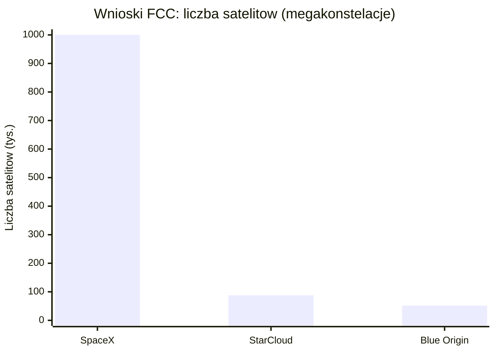
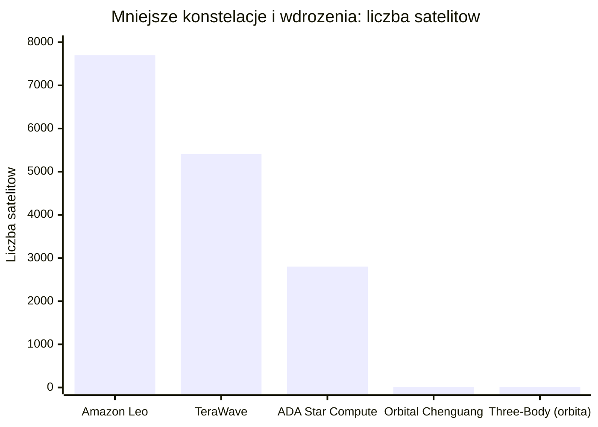
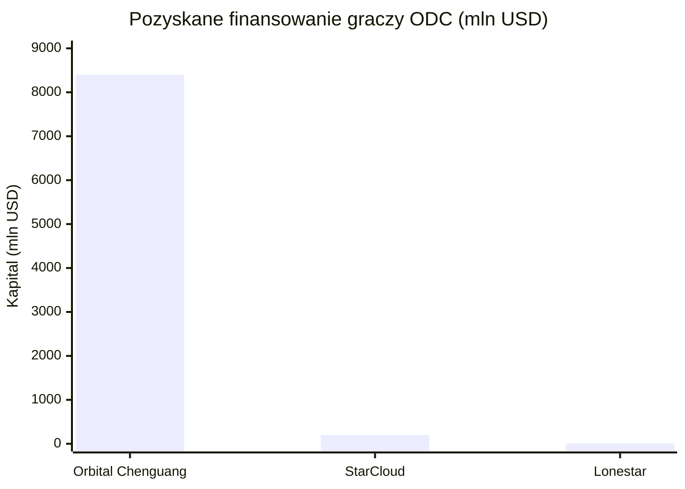
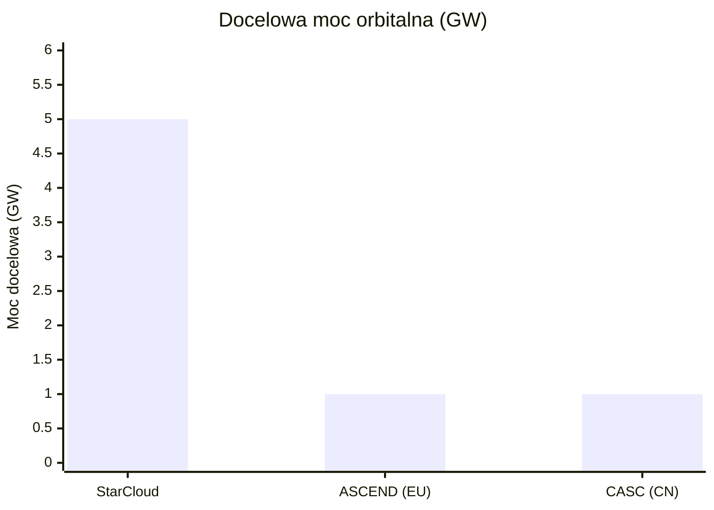

# Gracze i projekty

> Notatka raportu "Orbitalne centra danych". Kluczowe źródła: [źródło 1](https://www.thestar.com.my/tech/tech-news/2026/04/22/exclusive-spacex-says-unproven-ai-space-data-centers-may-not-be-commercially-viable-filing-shows), [źródło 2](https://docs.fcc.gov/public/attachments/DA-26-113A1.pdf).

## W skrócie

Wyścig o centra danych na orbicie ma kilku graczy o bardzo różnym ciężarze gatunkowym. Z jednej strony stoją giganci z miliardami dolarów i własnymi rakietami (SpaceX z wnioskiem o 1 mln satelitów, Blue Origin z 51 600 satelitami "<abbr title="konstelacja do 51 600 satelitów obliczeniowych zgłoszona do FCC przez Blue Origin LLC (nie przez Amazon).">Project Sunrise</abbr>", Google z badawczym <abbr title="badawczy &quot;moonshot&quot; Google'a polegający na umieszczeniu własnych układów TPU (Trillium) na orbicie, z partnerem Planet Labs.">Project Suncatcher</abbr> i Amazon ze swoją siecią Leo), z drugiej - startupy pokazujące działające demonstratory (<abbr title="startup, który jako pierwszy umieścił procesor NVIDIA H100 na orbicie (satelita Starcloud-1).">StarCloud</abbr> z procesorem NVIDIA H100 na orbicie) oraz państwowy program chiński (<abbr title="chińska konstelacja obliczeniowa AI (pierwsze 12 satelitów na orbicie od maja 2025), operowana przez Zhejiang Lab i ADA Space.">Three-Body Computing Constellation</abbr>, już 12 satelitów na orbicie). Dla inwestora kluczowy jest rozdźwięk między PR a realnymi przychodami: SpaceX w prospekcie <abbr title="prospekt emisyjny składany do amerykańskiego nadzoru SEC przed wejściem spółki na giełdę.">S-1</abbr> sam pisze, że jego orbitalne centra danych to "niesprawdzone technologie", które "mogą nigdy nie osiągnąć rentowności" [🟠](https://www.thestar.com.my/tech/tech-news/2026/04/22/exclusive-spacex-says-unproven-ai-space-data-centers-may-not-be-commercially-viable-filing-shows), a osobnych przychodów z orbital compute w S-1 po prostu nie ma. Wygranymi na dziś są dostawcy sprzętu i "kilofów" (NVIDIA, Phison, HPE, Red Hat, dostawcy litografii), a największe ryzyko spoczywa na tych, którzy kupują akcje wyceniane na obietnicach (IPO SpaceX celuje w ~1,75 bln USD przy ~95x przychodów). Tempo zmian jest wysokie - wnioski regulacyjne i pierwsze starty przypadają na lata 2025-2028 - ale technologia pozostaje w fazie eksperymentu.

Wyjaśnienie skrótów używanych w tej notatce: **LEO** = niska orbita okołoziemska (Low Earth Orbit, zwykle 500-2000 km); **MEO** = średnia orbita; **GEO** = orbita geostacjonarna (~35 786 km, satelita "wisi" nad jednym punktem Ziemi); **GW** = gigawat (miliard watów mocy); **MW** = megawat; **kW** = kilowat; **POPS** = peta operacji na sekundę (10^15 operacji/s); **TOPS** = bilion operacji na sekundę; **Gbps/Tbps** = giga-/terabity na sekundę (przepustowość łącza); **GPU/TPU/ASIC** = wyspecjalizowane układy do obliczeń AI; **S-1** = prospekt emisyjny składany do amerykańskiego nadzoru SEC przed wejściem na giełdę; **FCC** = amerykański regulator częstotliwości; **SSO** = orbita synchroniczna ze Słońcem.

<!-- spolki:related:start -->
## Spółki powiązane

> Notowane spółki produkujące podzespoły/technologie związane z tym tematem. Pełne omówienie: spółki, dla których nisza to >=33% przychodów; skrótowe: zdywersyfikowane konglomeraty. Zob. też [[Spolki/_slownik]] i [[Spolki/_widok-gpw-eu]].

**Producenci kluczowi (>=33% przychodów z niszy - omówienie pełne):**
- [[Spolki/rocket-lab|Rocket Lab Corporation (RKLB)]] - Launch (Electron/Neutron) + Space Systems: bus, ogniwa SolAero, komponenty
- [[Spolki/voyager-technologies|Voyager Technologies, Inc. (VOYG)]] - Stacje kosmiczne (Starlab), systemy kosmiczne i obronne

**Pozostali dominujący gracze (nisza to ułamek przychodów - omówienie skrótowe):**
- [[Spolki/nvidia|NVIDIA Corporation (NVDA)]] - Akceleratory GPU (COTS) - ładunek obliczeniowy on-orbit
- [[Spolki/alphabet|Alphabet Inc. (GOOGL)]] - Project Suncatcher (TPU na orbicie)
- [[Spolki/planet-labs|Planet Labs PBC (PL)]] - Partner Google Suncatcher (platformy/obrazowanie)
<!-- spolki:related:end -->

<!-- network:watki:start -->
## Powiązane wątki

> Mapa powiązań tematycznych - jak ten wątek łączy się z resztą raportu.

- [[01 - wprowadzenie-definicje-i-architektury|Wprowadzenie i architektury]] - architektury, które realizują opisani gracze
- [[07 - lacznosc-optyczne-isl-downlink-i-latencja|Łączność optyczna]] - SpaceX wykorzystuje istniejący backbone laserowy Starlink
- [[09 - ekonomika-i-koszty-calkowite-tco|Ekonomika i TCO]] - finansowanie i progi opłacalności poszczególnych projektów
- [[11 - regulacje-prawo-kosmiczne-debris-i-itu|Regulacje i debris]] - wnioski FCC i autoryzacje konstelacji
- [[15 - bezpieczenstwo-geopolityka-i-realizm-10-letni|Bezpieczeństwo i geopolityka]] - wyścig USA-Chiny: prywatni gracze vs państwowe konstelacje
<!-- network:watki:end -->
## SpaceX - od Starlink-as-compute przez wniosek o 1 mln satelitów po pionową integrację (TeraFab, xAI, S-1)

SpaceX jest najbardziej agresywnym graczem pod względem skali deklaracji. 30 stycznia 2026 firma złożyła do FCC wniosek o autoryzację systemu **do 1 000 000 satelitów** działających jako "SpaceX Orbital Data Center system" [🔵](https://docs.fcc.gov/public/attachments/DA-26-113A1.pdf). System ma operować na wysokościach **od 500 do 2000 km** w orbitach o nachyleniu 30 stopni i synchronicznych ze Słońcem [🔵](https://docs.fcc.gov/public/attachments/DA-26-113A1.pdf), z pasmami **18,8-19,3 GHz** (z kosmosu na Ziemię) i **28,6-29,1 GHz** (z Ziemi w kosmos) [🔵](https://cdn.geekwire.com/wp-content/uploads/2026/01/SpaceX-Center.pdf). Wizja stojąca za tą liczbą: wynoszenie miliona ton ładunku rocznie, z mocą 100 kW na tonę, dałoby **100 GW mocy obliczeniowej AI rocznie** [🟠](https://www.datacenterdynamics.com/en/news/spacex-files-for-million-satellite-orbital-ai-data-center-megaconstellation/). Konkretna masa i moc pojedynczego satelity obliczeniowego: NIE UJAWNIONE (proxy: 100 kW na tonę masy) [🟠](https://www.datacenterdynamics.com/en/news/spacex-files-for-million-satellite-orbital-ai-data-center-megaconstellation/). Implikacja dla inwestora: skala jest astronomiczna (sto razy więcej satelitów niż cały dotychczasowy Starlink), ale SpaceX poprosił FCC o zwolnienie z kamieni milowych wdrożenia (zwykle połowa konstelacji w 6 lat), co oznacza brak twardych terminów [🟠](https://www.datacenterdynamics.com/en/news/spacex-files-for-million-satellite-orbital-ai-data-center-megaconstellation/) - liczba "1 mln" jest deklaracją intencji, nie planem realizacji.

W S-1 złożonym **20 maja 2026** SpaceX zapisał cel "wynosić 100 GW compute do kosmosu każdego roku" [🟠](https://newsletter.semianalysis.com/p/to-boldly-go-the-case-for-space-datacenters), co odpowiadałoby ok. jednej piątej rocznej produkcji energii USA (4,4 tys. TWh w 2025) [🟠](https://newsletter.semianalysis.com/p/to-boldly-go-the-case-for-space-datacenters) i wymagałoby **ok. 1 mln ton ładunku na orbitę rocznie** oraz "tysięcy startów rocznie" [🟠](https://vestedfinance.com/blog/us-stocks/inside-spacexs-s-1-decoding-the-three-engine-bet-going-public-as-spcx/). Wdrożenie satelitów obliczeniowych ma ruszyć "tak wcześnie jak w 2028" [🟠](https://vestedfinance.com/blog/us-stocks/inside-spacexs-s-1-decoding-the-three-engine-bet-going-public-as-spcx/). Kluczowy haczyk: S-1 stwierdza wprost, że "satelity obliczeniowe w skali wymagają pełnej wielokrotnej używalności Starship, by były ekonomicznie atrakcyjne" [🟠](https://vestedfinance.com/blog/us-stocks/inside-spacexs-s-1-decoding-the-three-engine-bet-going-public-as-spcx/). Cała narracja pre-IPO opiera się więc na rynku TAM (całkowity adresowalny rynek) deklarowanym w S-1 na **28,5 bln USD**, z czego **26,5 bln USD przypisane do AI** [🟠](https://www.fool.com/investing/2026/06/01/spacex-ipo-5-surprising-facts-just-revealed/). Implikacja: inwestor kupuje obietnicę - osobnej pozycji przychodowej "orbital compute" w S-1 nie ma (NIE UJAWNIONE jako standalone, proxy zero-revenue) [🟠](https://vestedfinance.com/blog/us-stocks/inside-spacexs-s-1-decoding-the-three-engine-bet-going-public-as-spcx/), a analityk Ainvest ocenia, że tylko "10-20% wyceny SpaceX da się obronić biznesami generującymi gotówkę dziś" [🔴](https://www.ainvest.com/news/spacex-28-5-trillion-tam-masterclass-tam-padding-warns-investors-2605/).

**Akwizycja <abbr title="firma AI Elona Muska przejęta przez SpaceX w lutym 2026, element pionowej integracji wokół orbital compute.">xAI</abbr>** to filar tej pionowej integracji. 2 lutego 2026 SpaceX przejął X.AI Holdings Corp. [🔵](https://www.sec.gov/Archives/edgar/data/1181412/000162828026036936/spaceexplorationtechnologi.htm) w transakcji all-stock [🟠](https://www.indmoney.com/blog/us-stocks/spacex-ipo-2026-valuation-elon-musk-net-worth-xai-risks); xAI wyceniono wtedy na **250 mld USD**, a połączony podmiot na **~1,25 bln USD** [🟠](https://journalrecord.com/2026/05/06/spacex-plans-terafab-chip-facility-texas/). Skonsolidowana strata netto SpaceX w 2025 wyniosła **(4,9) mld USD** [🟠](https://vestedfinance.com/blog/us-stocks/inside-spacexs-s-1-decoding-the-three-engine-bet-going-public-as-spcx/), nakłady inwestycyjne na AI sięgnęły **12,7 mld USD** [🟠](https://vestedfinance.com/blog/us-stocks/inside-spacexs-s-1-decoding-the-three-engine-bet-going-public-as-spcx/), a strata operacyjna AI w I kw. 2026 to **(2,47) mld USD** [🟠](https://www.indmoney.com/blog/us-stocks/spacex-ipo-2026-valuation-elon-musk-net-worth-xai-risks). Jedyna twarda umowa przychodowa to kontrakt na compute z Anthropic na **1,25 mld USD miesięcznie** do maja 2029 [🟠](https://vestedfinance.com/blog/us-stocks/inside-spacexs-s-1-decoding-the-three-engine-bet-going-public-as-spcx/), ale dotyczy on naziemnego klastra COLOSSUS, nie orbity - zainteresowanie Anthropic orbital compute to "wyrażone zainteresowanie", nie zobowiązanie [🟠](https://bregg.com/post.php?slug=anthropic-spacex-colossus-orbital-compute).

### SpaceX TeraFab - własna fabryka chipów (proces 14A, Grimes County TX)

<abbr title="planowana przez SpaceX własna fabryka półprzewodników w hrabstwie Grimes (Teksas), mająca zasilać orbitalne centra danych w chipy.">TeraFab</abbr> to plan budowy własnej fabryki półprzewodników, by zasilić orbitalne centra danych w chipy. Dokumenty hrabstwa Grimes (Teksas) podają **55 mld USD** dla początkowych faz i **119 mld USD** dla pełnej rozbudowy [🔵](https://grimescountytx.govoffice.com/vertical/Sites/%7B958238D0-27E6-4F6C-919E-F1D98542C5FD%7D/uploads/SpaceX_-_Grimes_County_-_30_Day_Notice_of_Tax_Abatement_(proposed_for_posting_by_May_4_for_June_3_meeting)(1).pdf). Lokalizacja to **Gibbons Creek Reservoir** [🔵](https://grimescountytx.govoffice.com/vertical/Sites/%7B958238D0-27E6-4F6C-919E-F1D98542C5FD%7D/uploads/SpaceX_-_Grimes_County_-_30_Day_Notice_of_Tax_Abatement_(proposed_for_posting_by_May_4_for_June_3_meeting)(1).pdf), z gruntami **ponad 6000 akrów** [🟠](https://www.statesman.com/business/article/terafab-texas-land-purchases-elon-musk-22287614.php) i strefą reinwestycji **ponad 22 000 akrów** [🟠](https://www.kbtx.com/2026/06/06/grimes-county-officially-releases-spacex-terafab-agreement-documents/). Cel produkcyjny: do **1 terawata sprzętu obliczeniowego rocznie** [🟠](https://www.navasotaexaminer.com/article/3492,grimes-county-commissioners-approve-spacex-reinvestment-zone), startując od **100 tys. waferów miesięcznie** i dochodząc do **1 mln waferów/miesiąc** [🟠](https://newsletter.semianalysis.com/p/to-boldly-go-the-case-for-space-datacenters), przy czym **ok. 80% produkcji** miałoby trafić do satelitów orbitalnych, a 20% do naziemnych DC [🟠](https://www.industrialinfo.com/iirenergy/industry-news/article/products-for-data-centers-lead-to-billions-in-us-spending--357873). Deklarowane terminy Muska: pierwsze wafery w **2027**, masowa produkcja w **2028** [🟠](https://newsletter.semianalysis.com/p/to-boldly-go-the-case-for-space-datacenters).

Technologicznie TeraFab ma używać procesu litograficznego **Intel 14A** [🟠](https://www.kbtx.com/2026/06/06/grimes-county-officially-releases-spacex-terafab-agreement-documents/), ale relacja z Intelem jest na etapie umowy ramowej **bez wiążących zobowiązań** [🟠](https://vestedfinance.com/blog/us-stocks/inside-spacexs-s-1-decoding-the-three-engine-bet-going-public-as-spcx/). CEO ASML potwierdził rozmowy z Muskiem i ocenił, że jest "bardzo poważny" wobec projektu [🟠](https://news.futunn.com/en/post/73758452/musk-is-serious-about-chip-manufacturing-terafab-procured-critical-equipment), kontaktowano też Applied Materials, Tokyo Electron i Lam Research [🟠](https://www.trendforce.com/news/2026/06/12/news-tesla-elon-musk-discusses-terafab-at-asml-conference-project-expected-to-spur-euv-tool-orders/), a Hanmi Semiconductor zadeklarował inwestycję **50 mld KRW** w SpaceX [🟠](https://www.trendforce.com/news/2026/06/12/news-tesla-elon-musk-discusses-terafab-at-asml-conference-project-expected-to-spur-euv-tool-orders/). Konkretna umowa zakupowa na narzędzia EUV od ASML: NIE UJAWNIONE (brak publicznego zamówienia) [🟠](https://www.trendforce.com/news/2026/06/12/news-tesla-elon-musk-discusses-terafab-at-asml-conference-project-expected-to-spur-euv-tool-orders/). Ulgi podatkowe: hrabstwo Grimes uchwaliło **100% abatement** podatku od nieruchomości na 10 lat (2027-2036) głosami **4-1** [🟠](https://www.kbtx.com/2026/06/03/grimes-county-approves-reinvestment-zone-massive-spacex-project-still-considering-tax-breaks/), z roczną płatnością zastępczą **20 mln USD** po 2036 [🟠](https://www.kbtx.com/2026/06/06/grimes-county-officially-releases-spacex-terafab-agreement-documents/) oraz minimalnym wymogiem inwestycji **5 mld USD do 2030** i **1800 miejsc pracy do 2035** [🟠](https://www.kbtx.com/2026/06/06/grimes-county-officially-releases-spacex-terafab-agreement-documents/). Implikacja dla inwestora: skala TeraFab budzi sceptycyzm analityków - Stacy Rasgon z Bernstein szacuje koszt 1 TW chipów rocznie na **5-13 bln USD** [🟠](https://www.morningstar.com/news/marketwatch/20260323398/these-chip-stocks-could-be-winners-as-elon-musk-executes-on-his-terafab-vision) i pisze, że "prawdziwy Terafab wydaje się naciągany", podczas gdy Andrew Percoco z Morgan Stanley nazywa projekt "herkulesowym zadaniem" i wycenia pełny koszt na **35-45 mld USD** [🔴](https://247wallst.com/investing/2026/05/14/elon-musks-119-billion-gambit-the-real-reason-hes-building-the-worlds-largest-chip-plant/) - rozpiętość samych szacunków pokazuje, jak niepewny jest fundament wyceny.

## Google - Project Suncatcher (TPU na orbicie, partner Planet Labs, demo ~2027)

Google podchodzi do tematu jako do "moonshotu" badawczego, nie biznesu. Partnerem jest **Planet Labs**, który zbuduje i obsłuży **2 prototypowe satelity** z celem startu na **początek 2027** [🔵](https://www.planet.com/pulse/planet-to-build-and-operate-advanced-space-platform-for-project-suncatcher-moonshot/). Na orbitę ma trafić **Trillium (Cloud TPU v6e)** - własny układ Google do AI - który w teście wiązką protonów 67 MeV nie wykazał trwałych uszkodzeń do dawki **15 krad(Si)**, co Google określa jako "zaskakująco odporny na promieniowanie" [🔵](https://research.google/blog/exploring-a-space-based-scalable-ai-infrastructure-system-design/). Argument ekonomiczny: panel słoneczny na właściwej orbicie jest **do 8 razy bardziej produktywny** niż na Ziemi [🔵](https://research.google/blog/exploring-a-space-based-scalable-ai-infrastructure-system-design/). Architektura ilustracyjna to klaster **81 satelitów** o promieniu **1 km** na wysokości 650 km [🔵](https://research.google/blog/exploring-a-space-based-scalable-ai-infrastructure-system-design/), z demonstratorem łączności optycznej osiągającym **1,6 Tbps** łącznie [🔵](https://research.google/blog/exploring-a-space-based-scalable-ai-infrastructure-system-design/). Google zakłada spadek kosztu startu poniżej **200 USD/kg do połowy lat 30.** [🔵](https://research.google/blog/exploring-a-space-based-scalable-ai-infrastructure-system-design/). Moc pojedynczego satelity Suncatcher: NIE UJAWNIONE (projekt w fazie badawczej) [🔵](https://research.google/blog/exploring-a-space-based-scalable-ai-infrastructure-system-design/). Implikacja: Google przyznaje, że koncepcja "nie jest wykluczona przez fizykę ani bariery ekonomiczne", ale pozostają wyzwania - zarządzanie ciepłem, łączność z Ziemią i niezawodność na orbicie [🔵](https://research.google/blog/exploring-a-space-based-scalable-ai-infrastructure-system-design/). Dla inwestora to sygnał, że nawet najbogatszy gracz traktuje to jak eksperyment z horyzontem dekady, nie produkt.

## Project Sunrise = Blue Origin LLC (NIE Amazon) - 51 600 satelitów + TeraWave

Częsty mit do sprostowania: "Project Sunrise" nie jest projektem Amazon.com, lecz **Blue Origin LLC** (prywatnej firmy Bezosa). Wniosek FCC złożyła Blue Origin, prosząc o autoryzację systemu **do 51 600 satelitów** na orbitach synchronicznych ze Słońcem na wysokości **500-1800 km**, o nachyleniu 97-104 stopni, po 300-1000 satelitów na płaszczyznę [🔵](https://regmedia.co.uk/2026/03/20/fcc_filing.pdf). Łączność ma opierać się na łączach optycznych przez własny system backhaulowy **<abbr title="własny optyczny system łączności (backhaul) Blue Origin, zgłoszony do FCC jako konstelacja 5408 satelitów o przepustowości do 6 Tbps.">TeraWave</abbr>** [🔵](https://regmedia.co.uk/2026/03/20/fcc_filing.pdf). Masa pojedynczego satelity Sunrise: NIE UJAWNIONE (wniosek FCC nie podaje masy ani mocy) [🔵](https://regmedia.co.uk/2026/03/20/fcc_filing.pdf). Sam TeraWave to osobny wniosek FCC (nr SAT-LOA-20260120-00033) na **5408 satelitów** (5280 w LEO na 520-540 km + 128 w MEO na 8000-24200 km) [🔵](https://cdn.geekwire.com/wp-content/uploads/2026/01/Terawave-Narrative.pdf), z deklarowaną prędkością **do 6 Tbps** [🔵](https://www.blueorigin.com/news/blue-origin-introduces-terawave-space-based-network-for-global-connectivity) i startem wdrożenia w **IV kw. 2027** [🔵](https://www.blueorigin.com/news/blue-origin-introduces-terawave-space-based-network-for-global-connectivity).

Project Sunrise napotkał poważny sprzeciw. **NASA zgłosiła zastrzeżenia** [🟠](https://www.datacenterdynamics.com/en/news/nasa-objects-to-bezos-blue-origins-51600-satellite-project-sunrise-constellation/), wskazując "zauważalny brak planu mitigacji śmieci orbitalnej" [🟠](https://satnews.com/2026/05/05/nasa-objects-to-blue-origins-project-sunrise/) oraz nakładanie się zakresu 500-1800 km z trasami lotów załogowych, co zwiększa ryzyko kolizji [🟠](https://satnews.com/2026/05/05/nasa-objects-to-blue-origins-project-sunrise/). Blue Origin poprosiła też FCC o zwolnienie z wymogów kamieni milowych i obligacji [🔵](https://regmedia.co.uk/2026/03/20/fcc_filing.pdf). Implikacja: nawet gigant z własną rakietą napotyka twardą barierę regulacyjną - sprzeciw NASA to realne ryzyko opóźnienia.

## Amazon Leo / Kuiper - osobny byt (broadband, nie compute)

Amazon to trzeci, osobny podmiot z rodziny Bezosa (Amazon jest oddzielny od prywatnej Blue Origin) [🟠](https://www.geekwire.com/2026/blue-origin-data-center-space-race-project-sunrise/). **Amazon Leo** (dawniej Project Kuiper) to sieć szerokopasmowa z **ponad 3000 satelitów** [🔵](https://www.aboutamazon.com/what-we-do/devices-services/project-kuiper), z autoryzacją FCC na rozbudowę do **ponad 7700 satelitów** [🟠](https://www.geekwire.com/2026/blue-origin-data-center-space-race-project-sunrise/). Kluczowe rozróżnienie: Leo to internet dla niedoinwestowanych regionów, **nie orbitalne centrum danych** - plan własnych orbitalnych centrów obliczeniowych Amazona: NIE UJAWNIONE [🔵](https://www.aboutamazon.com/what-we-do/devices-services/project-kuiper). Amazon musiał ostatnio prosić FCC o 24-miesięczne przedłużenie po niedotrzymaniu harmonogramu startów [🟠](https://www.datacenterdynamics.com/en/news/nasa-objects-to-bezos-blue-origins-51600-satellite-project-sunrise-constellation/). Implikacja: nie należy mylić Leo (działający broadband) z compute na orbicie - to różne biznesy, a potencjalnie nawet konkurenci wobec TeraWave/Sunrise [🟠](https://www.geekwire.com/2026/blue-origin-data-center-space-race-project-sunrise/).

## StarCloud (dawniej Lumen Orbit) - działający demonstrator z NVIDIA H100

StarCloud to czołowy startup z realnym sprzętem na orbicie. Pozyskał rundę **Series A o wartości 170 mln USD**, osiągając wycenę **1,1 mld USD** (status jednorożca) i łącznie **200 mln USD** kapitału - najszybciej po demo day Y Combinator [🟠](https://w.media/starcloud-raises-us-170-million-for-space-based-data-centers/). Rundę poprowadzili **Benchmark i EQT** [🟠](https://w.media/starcloud-raises-us-170-million-for-space-based-data-centers/). Od pre-seedu **3 mln USD** do startu satelity Starcloud-1 minęło zaledwie **21 miesięcy** [🟠](https://w.media/starcloud-raises-us-170-million-for-space-based-data-centers/). W **listopadzie 2025** Starcloud-1 (masa ~130 funtów / ~60 kg, wielkość małej lodówki) umieścił na orbicie procesor **NVIDIA H100** - po raz pierwszy w historii [🟠](https://www.pcmag.com/news/nvidia-gpu-heads-into-orbit-on-a-mission-to-test-data-centers-in-space). Moc Starcloud-1 to skromny **1 kW** [🟠](https://www.pcmag.com/news/nvidia-gpu-heads-into-orbit-on-a-mission-to-test-data-centers-in-space), ale firma deklaruje "100x większą moc GPU niż dotychczasowe operacje kosmiczne" [🟠](https://www.pcmag.com/news/nvidia-gpu-heads-into-orbit-on-a-mission-to-test-data-centers-in-space) i **10x niższe koszty energii** mimo startów rakiet [🟠](https://www.pcmag.com/news/nvidia-gpu-heads-into-orbit-on-a-mission-to-test-data-centers-in-space). Na orbicie wytrenowano też pierwszy model AI (nano-GPT), uruchomiono Gemini i pokazano fine-tuning [🟠](https://w.media/starcloud-raises-us-170-million-for-space-based-data-centers/).

Następny krok - **Starcloud-2** (start w październiku 2026) - ma generować **100x więcej mocy** niż poprzednik i nieść największy komercyjny radiator wysłany w kosmos [🟠](https://w.media/starcloud-raises-us-170-million-for-space-based-data-centers/), z konfiguracją obejmującą układ **NVIDIA Blackwell, sprzęt <abbr title="sprzęt Amazona rozszerzający chmurę AWS poza naziemne centra danych; StarCloud ma jako pierwszy wynieść go w kosmos (Starcloud-2).">AWS Outposts</abbr> oraz układy ASIC do kopania bitcoinów** [🟠](https://payloadspace.com/starcloud-raises-170m-series-a-at-1-1b-valuation/). Starcloud będzie pierwszym, który wyniesie sprzęt **AWS Outposts** w kosmos [🟠](https://www.datacenterdynamics.com/en/news/starcloud-to-launch-aws-outposts-hardware-in-space-aims-to-deploy-fleet-of-88000-satellites/). Firma złożyła wniosek FCC na konstelację **do 88 000 satelitów** [🟠](https://www.datacenterdynamics.com/en/news/starcloud-to-launch-aws-outposts-hardware-in-space-aims-to-deploy-fleet-of-88000-satellites/) i celuje w pierwsze gigawatowe centrum danych w kosmosie, zasilane macierzą słoneczną **4 km kw.** - docelowo **5 GW** mocy orbitalnej [🟠](https://payloadspace.com/starcloud-raises-170m-series-a-at-1-1b-valuation/) (moc całej docelowej konstelacji: NIE UJAWNIONE jako liczba poza tym celem) [🟠](https://www.pcmag.com/news/nvidia-gpu-heads-into-orbit-on-a-mission-to-test-data-centers-in-space). Partnerami są AWS, Google Cloud, NVIDIA i Crusoe [🟠](https://w.media/starcloud-raises-us-170-million-for-space-based-data-centers/); Crusoe planuje wdrożenie na satelicie Starcloud pod koniec 2026 i ograniczoną moc GPU z kosmosu od początku 2027, deklarując się jako "pierwszy publiczny operator chmury w kosmosie" [🟠](https://www.datacenterdynamics.com/en/news/crusoe-to-deploy-in-starcloud-satellite-data-center-in-late-2026-offer-limited-gpu-capacity-in-space-from-2027/). Implikacja: StarCloud jest dowodem, że hardware AI działa na orbicie, ale przeskok od 1 kW (Starcloud-1) do 5 GW to siedem rzędów wielkości - to wciąż obietnica, nie produkt komercyjny.

![[assets/x09-1-starcloud-concept-2.png]]
*Rys. 51 - Wizualizacja orbitalnego DC Starcloud (d. Lumen Orbit). Źródło: Starcloud / Observer, licencja: materialy prasowe - do uzytku wlasnego.*
#grafika #gracze-i-projekty #Starcloud #render

![[assets/x09-2-starcloud-1.jpg]]
*Rys. 52 - Starcloud-1 - demonstrator z NVIDIA H100 na orbicie. Źródło: Starcloud / Financial Express, licencja: materialy prasowe - do uzytku wlasnego.*
#grafika #gracze-i-projekty #Starcloud #demo

Skala deklaracji satelitarnych różni się o pięć rzędów wielkości, dlatego rozdzielamy ją na dwa wykresy: najpierw megakonstelacje "wielkiej trójki", potem mniejsi gracze i realne wdrożenia. Dzięki temu liczby pozostają czytelne mimo ogromnych różnic.

*Rys. 53 - Maksymalna liczba satelitów we wnioskach FCC trzech największych graczy (w tysiącach). Dane: notatka, wnioski FCC SpaceX (1 000 000), StarCloud (88 000), Blue Origin / Project Sunrise (51 600).*

## Chiny - Three-Body Computing Constellation / Zhejiang Lab / ADA Space / Orbital Chenguang / CASC

Chiny mają najbardziej zaawansowane wdrożenie operacyjne, oparte o państwowe wsparcie. **14 maja 2025** rakieta Long March 2D wyniosła z Jiuquan pierwszą partię **12 satelitów** "Three-Body Computing Constellation" [🔵](https://www.ehangzhou.gov.cn/2025-05/15/c_293651.htm). Łączna moc tej partii to **5 POPS** i **30 TB** pamięci [🔵](https://www.ehangzhou.gov.cn/2025-05/15/c_293651.htm), z laserowymi łączami międzysatelitarnymi **do 100 Gbps** [🔵](https://news.cgtn.com/news/2025-05-29/From-Earth-to-orbit-China-s-ambition-to-advance-AI-space-computing-1DKeV4ucN44/index.html) i wydajnością **744 TOPS na satelitę** [🔵](https://news.cgtn.com/news/2026-02-09/Space-based-computing-moves-into-focus-as-costs-begin-to-fall-1KD8hxT2tOM/index.html). Cel docelowy to **1000 POPS** z tysięcy satelitów [🔵](https://www.ehangzhou.gov.cn/2025-05/15/c_293651.htm), a w 2025 planowano rozszerzenie do **ponad 50 satelitów** [🔵](https://www.ehangzhou.gov.cn/2025-05/15/c_293651.htm). Operatorzy: **Zhejiang Lab** (dostarcza moduły AI i łączności) oraz **ADA Space / Guoxing Aerospace** (platforma satelitarna) [🔵](https://news.cgtn.com/news/2025-05-29/From-Earth-to-orbit-China-s-ambition-to-advance-AI-space-computing-1DKeV4ucN44/index.html). Zhejiang Lab założono w 2017 we współpracy rządu prowincji Zhejiang, Uniwersytetu Zhejiang i **Alibaby** [🔵](https://news.cgtn.com/news/2025-05-29/From-Earth-to-orbit-China-s-ambition-to-advance-AI-space-computing-1DKeV4ucN44/index.html). Program "Star Compute" ADA Space ma docelowo **2800 satelitów** z udziałem **54 uczelni i firm** [🔵](https://news.cgtn.com/news/2025-05-29/From-Earth-to-orbit-China-s-ambition-to-advance-AI-space-computing-1DKeV4ucN44/index.html). W styczniu 2026 na orbicie wdrożono model językowy **Qwen3** (pierwszy raz globalnie) [🔵](https://news.cgtn.com/news/2026-02-09/Space-based-computing-moves-into-focus-as-costs-begin-to-fall-1KD8hxT2tOM/index.html).

Obok tego rosnie drugi tor finansowany przez państwo: startup **Orbital Chenguang** zabezpieczył **57,7 mld CNY (8,4 mld USD)** strategicznych linii kredytowych [🟠](https://carboncredits.com/chinas-8-4b-orbital-data-center-push-sets-up-space-based-ai-showdown-with-spacex/), z planem konstelacji **16 satelitów** połączonych laserowo na orbicie SSO **700-800 km** [🟠](https://www.china-in-space.com/p/china-seriously-backs-space-based), z celem gigawatowego centrum danych do **2035** [🟠](https://carboncredits.com/chinas-8-4b-orbital-data-center-push-sets-up-space-based-ai-showdown-with-spacex/). Ważne zastrzeżenie: to "linie kredytowe, nie wydana gotówka" [🟠](https://carboncredits.com/chinas-8-4b-orbital-data-center-push-sets-up-space-based-ai-showdown-with-spacex/), a kwota equity rundy Pre-A1 to NIE UJAWNIONE [🟠](https://www.china-in-space.com/p/china-seriously-backs-space-based). Państwowy gigant **CASC** (China Aerospace Science and Technology Corp.) zapowiedział budowę infrastruktury **1 GW w kosmosie** w ramach 15. planu pięcioletniego (2026-2030) [🟠](https://www.china-in-space.com/p/china-seriously-backs-space-based), choć liczba satelitów potrzebnych do 1 GW to NIE UJAWNIONE [🟠](https://dig.watch/updates/china-moves-toward-data-centres-in-orbit). Implikacja dla inwestora: chiński program ma realne wdrożenie na orbicie i głębokie wsparcie państwowe, ale niezależna zachodnia weryfikacja parametrów (5 POPS/30 TB) jest NIE UJAWNIONE - większość danych pochodzi z mediów państwowych [🟠](https://www.espi.eu/wp-content/uploads/2025/11/SBDCs.pdf).

*Rys. 54 - Pozostałe konstelacje: autoryzacja Amazon Leo (>7700), TeraWave (5408), cel ADA Space "Star Compute" (2800), Orbital Chenguang (16) i pierwsza partia chińskiej Three-Body Computing Constellation już na orbicie (12). Dane: notatka (wnioski FCC, China-in-Space, media państwowe CN).*

*Rys. 55 - Pozyskany kapitał / zabezpieczone finansowanie. Uwaga: Orbital Chenguang to 57,7 mld CNY (8,4 mld USD) linii kredytowych, nie wydana gotówka; StarCloud to łączny kapitał (z rundą Series A 170 mln USD); Lonestar to 6,6 mln USD łącznie. Dane: notatka (Carbon Credits, W.Media, DCD).*

## Mniejsi i sąsiedni gracze - cloud-OEM stack, GEO, Księżyc, Europa

**Axiom Space** buduje Orbital Data Center (<abbr title="centrum danych umieszczone na orbicie okołoziemskiej, prowadzące obliczenia (m.in. AI) bezpośrednio w kosmosie.">ODC</abbr>). Zapowiedział start **2 pierwszych węzłów ODC** w LEO do końca 2025 [🔵](https://www.axiomspace.com/release/axiom-space-to-launch-orbital-data-center-nodes-to-support-national-security-commercial-international-customers), z dotacją **5,5 mln USD** od Texas Space Commission [🔵](https://www.axiomspace.com/release/texas-space-commission-fuels-orbital-data-center), łączami optycznymi **2,5 Gbps** (przez Kepler Communications / Skyloom) z planem **10 Gbps+** [🔵](https://www.axiomspace.com/release/axiom-space-to-launch-orbital-data-center-nodes-to-support-national-security-commercial-international-customers), oraz roadmapem mocy "od kilowatów do megawatów" [🔵](https://www.axiomspace.com/release/axiom-space-to-launch-orbital-data-center-nodes-to-support-national-security-commercial-international-customers) i celem **co najmniej 3 węzłów ODC do 2027** [🔵](https://www.axiomspace.com/release/axiom-space-spacebilt-announce-orbital-data-center-node). Prototyp **AxDCU-1** z **Red Hat** (Red Hat Device Edge) wystartował **24 sierpnia 2025** na ISS [🟠](https://www.datacenterknowledge.com/next-gen-data-centers/iss-data-center-launch-tests-edge-computing-at-400km-above-earth), testując chmurę, AI/ML, fuzję danych i cyberbezpieczeństwo [🔵](https://www.axiomspace.com/release/red-hat-teams-up-with-axiom-space-to-launch-optimize-axiom-spaces-data-center-unit-1-on-orbit). Pamięć masową dostarcza **Phison** (SSD Pascari, ponad **1 PB** łącznie, pojedynczy dysk **122,88 TB**) [🔵](https://www.axiomspace.com/release/axiom-space-spacebilt-announce-orbital-data-center-node), a procesory **Microchip** (PIC64-HPSC) w platformie LiSS o pojemności **500+ TB** [🔵](https://www.axiomspace.com/release/axiom-space-spacebilt-announce-orbital-data-center-node).

Stos cloud-OEM rozszerza też **OrbitsEdge**, który podpisał umowę OEM z **HPE** na hostowanie systemów HPE Edgeline w orbitalnej obudowie SatFrame (5U serwerów 19-calowych) [🔵](https://www.prnewswire.com/news-releases/orbitsedge-announces-oem-agreement-with-hewlett-packard-enterprise-to-deliver-datacenter-grade-computing-power-in-orbit-300968290.html), z umową startową z Vaya Space [🟠](https://www.datacenterdynamics.com/en/news/orbits-edge-signs-launch-agreement-with-vaya-space/). W segmencie GEO działa **NTT <abbr title="joint venture NTT i SKY Perfect JSAT celujące w centrum danych i optyczny przekaźnik danych na orbicie geostacjonarnej.">Space Compass</abbr>** - joint venture NTT i SKY Perfect JSAT (po **50% udziałów**, kapitał **18 mld JPY**) [🔵](https://group.ntt/en/newsrelease/2022/04/26/220426a.html), celujący w centrum danych na orbicie geostacjonarnej; przy **3 lub więcej satelitach GEO** zapewni stałą łączność z LEO i Ziemią [🔵](https://ntt-review.jp/archive/ntttechnical.php?contents=ntr202506fa2.html), z przekaźnikiem optycznym **do 10 Gbps** [🔵](https://space-compass.com/files/Revolutionary%20GEO%20Satellite%20Optical%20Data%20Relay%20Service_White%20Paper.pdf). Pierwszy satelita GEO (Swissto12 HummingSat) ma wystartować w roku fiskalnym FY2028 (do marca 2029) [🟠](https://www.satellitetoday.com/manufacturing/2026/03/23/space-compass-purchases-first-optical-data-relay-satellite-from-swissto12/). Testy NTT pokazały redukcję objętości danych o **58,7-80%** dzięki inferencji na orbicie [🔵](https://ntt-review.jp/archive/ntttechnical.php?contents=ntr202506fa2.html). NTT, Sony i Intel są założycielami <abbr title="inicjatywa NTT (Global Forum z Sony i Intelem) rozwijająca sieci i przetwarzanie oparte o technologie optyczne.">IOWN</abbr> Global Forum [🔵](https://www.ntt-review.jp/archive/ntttechnical.php?contents=ntr202002fa1.html), ale bezpośredni udział Sony w operatorstwie orbitalnym to NIE UJAWNIONE (Sony jest członkiem forum, nie operatorem konstelacji) [🔵](https://group.ntt/en/magazine/blog/iown_grobal_forum/).

Europejski projekt **ASCEND** (Thales Alenia Space, konsorcjum **11 partnerów** w tym Airbus, ArianeGroup, HPE, Orange, DLR) celuje w **1 GW mocy przed 2050** [🔵](https://www.thalesaleniaspace.com/en/press-releases/thales-alenia-space-reveals-results-ascend-feasibility-study-space-data-centers-0) na orbicie **1400 km**, z proof-of-concept w **2031** i pierwszym centrum w **2036** [🟠](https://hellofuture.orange.com/en/lower-emissions-and-reinforced-digital-sovereignty-the-plan-for-datacentres-in-space/), szacując rynek DC na **23 GW do 2030** i zwrot "ponad miliarda EUR" [🔵](https://www.thalesaleniaspace.com/en/press-releases/thales-alenia-space-reveals-results-ascend-feasibility-study-space-data-centers-0). Wreszcie **Lonestar Data Holdings** celuje w księżycowe/cis-lunarne przechowywanie danych: seed **5 mln USD** (2023) [🔵](https://www.prnewswire.com/news-releases/lonestar-data-holdings-inc-successfully-completes-5m-in-oversubscribed-seed-financing-301762600.html), łącznie **6,6 mln USD** [🟠](https://www.datacenterdynamics.com/en/news/lunar-data-center-firm-lonestar-data-raises-66m-swaps-ceo), umowa **120 mln USD** z Sidus Space na **6 satelitów cis-lunar** [🟠](https://www.datacenterdynamics.com/en/news/lunar-data-center-firm-lonestar-data-raises-66m-swaps-ceo) (CEO Stephen Eisele zastąpił Chrisa Stotta). Implikacja: ta warstwa graczy pokazuje, że realne dziś przychody są w łańcuchu dostaw (NVIDIA, Phison, HPE, Red Hat, Microchip, Swissto12) i w niszowych edge/GEO zastosowaniach, nie w gigawatowych centrach AI na orbicie.

*Rys. 56 - Deklarowane cele mocy orbitalnej. StarCloud celuje w 5 GW (macierz słoneczna 4 km kw.), ASCEND w 1 GW przed 2050, a CASC w 1 GW w ramach 15. planu pięcioletniego (2026-2030). Dane: notatka (Payload Space, Thales Alenia Space, China-in-Space).*

## Kontrowersje

**Które projekty są realne, a które to PR/vaporware - i czy "TeraFab" SpaceX istnieje**

**ZA (TeraFab realny w skromnym sensie):** istnieje publiczny wniosek podatkowy hrabstwa Grimes z liczbami 55-119 mld USD i ujawniony w S-1 [🟠](https://www.datacenterdynamics.com/en/news/spacex-secures-100-percent-property-tax-abatement-for-55bn-terafab-project-in-grimes-county-texas/); hrabstwo formalnie uchwaliło strefę reinwestycji i 100% ulgę głosami 4-1 [🟠](https://www.kbtx.com/2026/06/03/grimes-county-approves-reinvestment-zone-massive-spacex-project-still-considering-tax-breaks/); CEO ASML potwierdził, że Musk jest "bardzo poważny" [🟠](https://news.futunn.com/en/post/73758452/musk-is-serious-about-chip-manufacturing-terafab-procured-critical-equipment). **PRZECIW (spekulatywny):** brak ujawnionych umów na sprzęt litograficzny, partnera procesowego ani licencji technologii - "projekt jest zdecydowanie w kolumnie spekulacji" [🟠](https://www.aigist.co/digests/360); relacja z Intelem to umowa ramowa "bez wiążących zobowiązań" [🟠](https://vestedfinance.com/blog/us-stocks/inside-spacexs-s-1-decoding-the-three-engine-bet-going-public-as-spcx/); szacunki kosztu różnią się o rzędy wielkości (5-13 bln USD wg Bernstein vs 35-45 mld USD wg Morgan Stanley) [🔴](https://247wallst.com/investing/2026/05/14/elon-musks-119-billion-gambit-the-real-reason-hes-building-the-worlds-largest-chip-plant/). Nazwa "TeraFab" w oficjalnym komunikacie SpaceX: NIE UJAWNIONE (proxy: wniosek podatkowy i relacje prasowe) [🟠](https://www.aigist.co/digests/360).

Szerzej, czy cała koncepcja orbitalnych DC jest realna: **ZA** - działają demonstratory (Starcloud-1 z H100, Axiom AxDCU-1, chińskie 12 satelitów) [🟠](https://w.media/starcloud-raises-us-170-million-for-space-based-data-centers/) i jest regulacyjne zainteresowanie (wnioski FCC SpaceX na 1 mln satelitów) [🔵](https://docs.fcc.gov/public/attachments/DA-26-113A1.pdf). **PRZECIW** - sam SpaceX w S-1 nazywa orbital compute "niesprawdzonymi technologiami", które "mogą nie osiągnąć rentowności" i działają w "surowym, nieprzewidywalnym środowisku kosmosu" [🟠](https://www.thestar.com.my/tech/tech-news/2026/04/22/exclusive-spacex-says-unproven-ai-space-data-centers-may-not-be-commercially-viable-filing-shows); prominentni krytycy (Sam Altman, Gartner, Jim Chanos) nazwali pomysł kolejno "śmiesznym", "olejem na węża AI" i "szczytem szaleństwa" [🟠](https://www.datacenterdynamics.com/en/news/bezos-backed-blue-origin-files-for-approval-to-put-data-centers-in-space/); analiza JPL/arXiv wskazuje na ciasne warunki konkurencyjności (przy 40 kg/kW benchmark 10-40 tys. USD/kW dopuszcza tylko 250-1000 USD/kg na łączny koszt startu i budowy, zanim doliczy się łączność, operacje i żywotność) [🔵](https://arxiv.org/abs/2604.27197).

**Czy "Project Sunrise" to projekt Amazona**

**PRZECIW (to nie Amazon):** wniosek FCC złożyła **Blue Origin LLC**, nie Amazon.com [🔵](https://regmedia.co.uk/2026/03/20/fcc_filing.pdf), a Amazon jest "oddzielny od prywatnej Blue Origin" [🟠](https://www.geekwire.com/2026/blue-origin-data-center-space-race-project-sunrise/). Osobny system Amazona to Amazon Leo / Project Kuiper - ponad 3000 (autoryzacja do >7700) satelitów broadbandowych, nie compute [🔵](https://www.aboutamazon.com/what-we-do/devices-services/project-kuiper). Brak dowodu, że Amazon.com złożył wniosek "Project Sunrise": NIE UJAWNIONE [🔵](https://regmedia.co.uk/2026/03/20/fcc_filing.pdf). Nie jest jasne, czy Blue Origin (Sunrise/TeraWave) i Amazon (Leo/AWS) będą współpracować czy konkurować [🟠](https://www.geekwire.com/2026/blue-origin-data-center-space-race-project-sunrise/).

**Transparentność i realny status projektów chińskich**

**ZA (realne):** start 12 satelitów potwierdzony niezależnie przez CGTN, Science and Technology Daily i europejskie ESPI [🔵](https://www.stdaily.com/web/English/2026-01/19/content_463559.html); program ma głębokie wsparcie - Zhejiang Lab założony przez rząd prowincji, uniwersytet i Alibabę [🔵](https://news.cgtn.com/news/2025-05-29/From-Earth-to-orbit-China-s-ambition-to-advance-AI-space-computing-1DKeV4ucN44/index.html); ESPI potwierdza wdrożenie pierwszej transzy 12 satelitów AI z Jiuquan 14 maja 2025 [🟠](https://www.espi.eu/wp-content/uploads/2025/11/SBDCs.pdf). **PRZECIW (nieweryfikowalne):** brak niezależnych zachodnich pomiarów wydajności 5 POPS / 30 TB - większość danych pochodzi z mediów państwowych [🟠](https://www.espi.eu/wp-content/uploads/2025/11/SBDCs.pdf); kwota equity rundy Pre-A1 Orbital Chenguang oraz liczba satelitów w planie CASC na 1 GW: NIE UJAWNIONE [🟠](https://www.china-in-space.com/p/china-seriously-backs-space-based); finansowanie Orbital Chenguang to "linie kredytowe, nie wydana gotówka" [🟠](https://carboncredits.com/chinas-8-4b-orbital-data-center-push-sets-up-space-based-ai-showdown-with-spacex/).

## Słowniczek pojęć

- **ODC (Orbital Data Center)** - centrum danych umieszczone na orbicie okołoziemskiej, prowadzące obliczenia (m.in. AI) bezpośrednio w kosmosie.
- **FCC filing** - wniosek do amerykańskiego regulatora częstotliwości (FCC) o autoryzację konstelacji satelitów i przydział pasm radiowych.
- **NGSO** - satelita nie-geostacjonarny (Non-Geostationary Satellite Orbit), czyli krążący po orbicie innej niż stała pozycja nad jednym punktem Ziemi.
- **S-1** - prospekt emisyjny składany do amerykańskiego nadzoru SEC przed wejściem spółki na giełdę.
- **POPS / TOPS** - jednostki wydajności obliczeniowej: peta operacji na sekundę (10^15/s) oraz bilion operacji na sekundę.
- **Project Suncatcher** - badawczy "moonshot" Google'a polegający na umieszczeniu własnych układów TPU (Trillium) na orbicie, z partnerem Planet Labs.
- **Project Sunrise** - konstelacja do 51 600 satelitów obliczeniowych zgłoszona do FCC przez Blue Origin LLC (nie przez Amazon).
- **TeraWave** - własny optyczny system łączności (backhaul) Blue Origin, zgłoszony do FCC jako konstelacja 5408 satelitów o przepustowości do 6 Tbps.
- **TeraFab** - planowana przez SpaceX własna fabryka półprzewodników w hrabstwie Grimes (Teksas), mająca zasilać orbitalne centra danych w chipy.
- **xAI** - firma AI Elona Muska przejęta przez SpaceX w lutym 2026, element pionowej integracji wokół orbital compute.
- **Three-Body Computing Constellation** - chińska konstelacja obliczeniowa AI (pierwsze 12 satelitów na orbicie od maja 2025), operowana przez Zhejiang Lab i ADA Space.
- **StarCloud (dawniej Lumen Orbit)** - startup, który jako pierwszy umieścił procesor NVIDIA H100 na orbicie (satelita Starcloud-1).
- **AWS Outposts** - sprzęt Amazona rozszerzający chmurę AWS poza naziemne centra danych; StarCloud ma jako pierwszy wynieść go w kosmos (Starcloud-2).
- **Space Compass** - joint venture NTT i SKY Perfect JSAT celujące w centrum danych i optyczny przekaźnik danych na orbicie geostacjonarnej.
- **IOWN** - inicjatywa NTT (Global Forum z Sony i Intelem) rozwijająca sieci i przetwarzanie oparte o technologie optyczne.

## Źródła

- [🔵](https://docs.fcc.gov/public/attachments/DA-26-113A1.pdf) FCC Public Notice - wniosek SpaceX na 1 mln satelitów orbitalnych DC (primary).
- [🔵](https://cdn.geekwire.com/wp-content/uploads/2026/01/SpaceX-Center.pdf) Dokument SpaceX FCC - pasma częstotliwości (primary).
- [🟠](https://www.datacenterdynamics.com/en/news/spacex-files-for-million-satellite-orbital-ai-data-center-megaconstellation/) DCD - wizja 100 GW/rok SpaceX (secondary).
- [🔵](https://grimescountytx.govoffice.com/vertical/Sites/%7B958238D0-27E6-4F6C-919E-F1D98542C5FD%7D/uploads/SpaceX_-_Grimes_County_-_30_Day_Notice_of_Tax_Abatement_(proposed_for_posting_by_May_4_for_June_3_meeting)(1).pdf) Dokument hrabstwa Grimes - capex TeraFab 55-119 mld USD (primary).
- [🟠](https://www.kbtx.com/2026/06/06/grimes-county-officially-releases-spacex-terafab-agreement-documents/) KBTX - umowa TeraFab z hrabstwem (secondary).
- [🟠](https://www.statesman.com/business/article/spacex-texas-school-tax-breaks-terafab-22298399.php) Statesman - ulgi szkolne JETI, alternatywne lokalizacje (secondary).
- [🟠](https://newsletter.semianalysis.com/p/to-boldly-go-the-case-for-space-datacenters) SemiAnalysis - cel 1 TW/rok, wafer starts, S-1 (secondary).
- [🟠](https://vestedfinance.com/blog/us-stocks/inside-spacexs-s-1-decoding-the-three-engine-bet-going-public-as-spcx/) Vested Finance - analiza S-1, finanse, Anthropic (secondary).
- [🔵](https://www.sec.gov/Archives/edgar/data/1181412/000162828026036936/spaceexplorationtechnologi.htm) SEC EDGAR - fuzja xAI (primary).
- [🟠](https://journalrecord.com/2026/05/06/spacex-plans-terafab-chip-facility-texas/) Journal Record - wycena 1,25 bln USD (secondary).
- [🟠](https://www.thestar.com.my/tech/tech-news/2026/04/22/exclusive-spacex-says-unproven-ai-space-data-centers-may-not-be-commercially-viable-filing-shows) The Star/Reuters - ostrzeżenia ryzyka S-1 (secondary).
- [🟠](https://www.fool.com/investing/2026/06/01/spacex-ipo-5-surprising-facts-just-revealed/) Motley Fool - TAM 28,5 bln USD (secondary).
- [🟠](https://www.morningstar.com/news/marketwatch/20260323398/these-chip-stocks-could-be-winners-as-elon-musk-executes-on-his-terafab-vision) Morningstar/MarketWatch - szacunek Bernstein 5-13 bln USD (secondary).
- [🔴](https://247wallst.com/investing/2026/05/14/elon-musks-119-billion-gambit-the-real-reason-hes-building-the-worlds-largest-chip-plant/) 247WallSt - szacunek Morgan Stanley 35-45 mld USD (weak).
- [🟠](https://www.trendforce.com/news/2026/06/12/news-tesla-elon-musk-discusses-terafab-at-asml-conference-project-expected-to-spur-euv-tool-orders/) TrendForce - ASML, dostawcy sprzętu, Hanmi (secondary).
- [🟠](https://news.futunn.com/en/post/73758452/musk-is-serious-about-chip-manufacturing-terafab-procured-critical-equipment) Futunn - ocena ASML "very serious" (secondary).
- [🟠](https://www.industrialinfo.com/iirenergy/industry-news/article/products-for-data-centers-lead-to-billions-in-us-spending--357873) Industrial Info - podział 80/20 produkcji chipów (secondary).
- [🟠](https://www.navasotaexaminer.com/article/3492,grimes-county-commissioners-approve-spacex-reinvestment-zone) Navasota Examiner - cel 1 TW compute hardware/rok (secondary).
- [🔴](https://www.ainvest.com/news/spacex-28-5-trillion-tam-masterclass-tam-padding-warns-investors-2605/) Ainvest - 10-20% wyceny broniona gotówką (weak).
- [🟠](https://bregg.com/post.php?slug=anthropic-spacex-colossus-orbital-compute) Bregg - status zobowiązania Anthropic (secondary).
- [🟠](https://www.indmoney.com/blog/us-stocks/spacex-ipo-2026-valuation-elon-musk-net-worth-xai-risks) INDmoney - wycena xAI 250 mld USD, strata Q1 (secondary).
- [🔵](https://www.planet.com/pulse/planet-to-build-and-operate-advanced-space-platform-for-project-suncatcher-moonshot/) Planet Labs - 2 prototypy Suncatcher, 2027 (primary).
- [🔵](https://research.google/blog/exploring-a-space-based-scalable-ai-infrastructure-system-design/) Google Research - Trillium TPU, test radiacyjny, 81-sat klaster (primary).
- [🔵](https://regmedia.co.uk/2026/03/20/fcc_filing.pdf) Wniosek FCC Blue Origin - Project Sunrise 51 600 sat (primary).
- [🔵](https://cdn.geekwire.com/wp-content/uploads/2026/01/Terawave-Narrative.pdf) Wniosek FCC TeraWave - 5408 satelitów (primary).
- [🔵](https://www.blueorigin.com/news/blue-origin-introduces-terawave-space-based-network-for-global-connectivity) Blue Origin - TeraWave 6 Tbps, Q4 2027 (primary).
- [🟠](https://www.datacenterdynamics.com/en/news/nasa-objects-to-bezos-blue-origins-51600-satellite-project-sunrise-constellation/) DCD - sprzeciw NASA, przedłużenie Amazon (secondary).
- [🟠](https://satnews.com/2026/05/05/nasa-objects-to-blue-origins-project-sunrise/) SatNews - szczegóły zastrzeżeń NASA (secondary).
- [🔵](https://www.aboutamazon.com/what-we-do/devices-services/project-kuiper) Amazon - Amazon Leo / Kuiper (primary).
- [🟠](https://www.geekwire.com/2026/blue-origin-data-center-space-race-project-sunrise/) GeekWire - rozdział Amazon vs Blue Origin (secondary).
- [🟠](https://w.media/starcloud-raises-us-170-million-for-space-based-data-centers/) W.Media - StarCloud Series A, finanse (secondary).
- [🟠](https://www.pcmag.com/news/nvidia-gpu-heads-into-orbit-on-a-mission-to-test-data-centers-in-space) PCMag - Starcloud-1 H100, 1 kW (secondary).
- [🟠](https://www.datacenterdynamics.com/en/news/starcloud-to-launch-aws-outposts-hardware-in-space-aims-to-deploy-fleet-of-88000-satellites/) DCD - AWS Outposts, 88 000 satelitów (secondary).
- [🟠](https://payloadspace.com/starcloud-raises-170m-series-a-at-1-1b-valuation/) Payload Space - Starcloud-2 Blackwell, 5 GW (secondary).
- [🟠](https://www.datacenterdynamics.com/en/news/crusoe-to-deploy-in-starcloud-satellite-data-center-in-late-2026-offer-limited-gpu-capacity-in-space-from-2027/) DCD - Crusoe na Starcloud (secondary).
- [🔵](https://www.ehangzhou.gov.cn/2025-05/15/c_293651.htm) eHangzhou.gov - Three-Body 12 sat, 5 POPS/30 TB (primary).
- [🔵](https://news.cgtn.com/news/2025-05-29/From-Earth-to-orbit-China-s-ambition-to-advance-AI-space-computing-1DKeV4ucN44/index.html) CGTN - Star Compute, operatorzy, Alibaba (primary, media państwowe CN).
- [🔵](https://news.cgtn.com/news/2026-02-09/Space-based-computing-moves-into-focus-as-costs-begin-to-fall-1KD8hxT2tOM/index.html) CGTN - 744 TOPS, Qwen3 na orbicie (primary, media państwowe CN).
- [🔵](https://www.stdaily.com/web/English/2026-01/19/content_463559.html) Science and Technology Daily - kontekst 15. planu (primary, media państwowe CN).
- [🟠](https://carboncredits.com/chinas-8-4b-orbital-data-center-push-sets-up-space-based-ai-showdown-with-spacex/) Carbon Credits - Orbital Chenguang 57,7 mld CNY (secondary).
- [🟠](https://www.china-in-space.com/p/china-seriously-backs-space-based) China-in-Space - Orbital Chenguang, CASC, 15. plan (secondary).
- [🟠](https://dig.watch/updates/china-moves-toward-data-centres-in-orbit) Dig.watch - CASC 1 GW (secondary).
- [🟠](https://www.espi.eu/wp-content/uploads/2025/11/SBDCs.pdf) ESPI - niezależny przegląd, brak zachodnich pomiarów (secondary).
- [🔵](https://www.axiomspace.com/release/axiom-space-to-launch-orbital-data-center-nodes-to-support-national-security-commercial-international-customers) Axiom Space - węzły ODC, Kepler (primary).
- [🔵](https://www.axiomspace.com/release/texas-space-commission-fuels-orbital-data-center) Axiom Space - dotacja 5,5 mln USD (primary).
- [🔵](https://www.axiomspace.com/release/red-hat-teams-up-with-axiom-space-to-launch-optimize-axiom-spaces-data-center-unit-1-on-orbit) Axiom/Red Hat - AxDCU-1 (primary).
- [🟠](https://www.datacenterknowledge.com/next-gen-data-centers/iss-data-center-launch-tests-edge-computing-at-400km-above-earth) DCK - start AxDCU-1 24.08.2025 (secondary).
- [🔵](https://www.axiomspace.com/release/axiom-space-spacebilt-announce-orbital-data-center-node) Axiom/SpaceBilt - Phison, Microchip, LiSS, roadmap 2027 (primary).
- [🔵](https://www.prnewswire.com/news-releases/orbitsedge-announces-oem-agreement-with-hewlett-packard-enterprise-to-deliver-datacenter-grade-computing-power-in-orbit-300968290.html) PRNewswire - OrbitsEdge + HPE (primary).
- [🟠](https://www.datacenterdynamics.com/en/news/orbits-edge-signs-launch-agreement-with-vaya-space/) DCD - OrbitsEdge SatFrame, Vaya Space (secondary).
- [🔵](https://group.ntt/en/newsrelease/2022/04/26/220426a.html) NTT - Space Compass JV, kapitał, udziały (primary).
- [🔵](https://ntt-review.jp/archive/ntttechnical.php?contents=ntr202506fa2.html) NTT Review - GEO, 3+ sat, redukcja danych (primary).
- [🔵](https://space-compass.com/files/Revolutionary%20GEO%20Satellite%20Optical%20Data%20Relay%20Service_White%20Paper.pdf) Space Compass - 10 Gbps przekaźnik (primary).
- [🟠](https://www.satellitetoday.com/manufacturing/2026/03/23/space-compass-purchases-first-optical-data-relay-satellite-from-swissto12/) SatelliteToday - Swissto12 HummingSat, FY2028 (secondary).
- [🔵](https://www.ntt-review.jp/archive/ntttechnical.php?contents=ntr202002fa1.html) NTT Review - założyciele IOWN (primary).
- [🔵](https://group.ntt/en/magazine/blog/iown_grobal_forum/) NTT - rola Sony w IOWN (primary).
- [🔵](https://www.thalesaleniaspace.com/en/press-releases/thales-alenia-space-reveals-results-ascend-feasibility-study-space-data-centers-0) Thales Alenia Space - ASCEND 1 GW, konsorcjum (primary).
- [🟠](https://hellofuture.orange.com/en/lower-emissions-and-reinforced-digital-sovereignty-the-plan-for-datacentres-in-space/) Orange - harmonogram ASCEND 2031/2036 (secondary).
- [🔵](https://www.prnewswire.com/news-releases/lonestar-data-holdings-inc-successfully-completes-5m-in-oversubscribed-seed-financing-301762600.html) PRNewswire - Lonestar seed 5 mln USD (primary).
- [🟠](https://www.datacenterdynamics.com/en/news/lunar-data-center-firm-lonestar-data-raises-66m-swaps-ceo) DCD - Lonestar 6,6 mln USD, Sidus Space (secondary).
- [🟠](https://www.datacenterdynamics.com/en/news/lonestar-data-holdings-raises-5m-for-data-centers-on-the-moon) DCD - moduł "wielkości książki" (secondary).
- [🟠](https://www.datacenterdynamics.com/en/news/spacex-secures-100-percent-property-tax-abatement-for-55bn-terafab-project-in-grimes-county-texas/) DCD - ulga podatkowa TeraFab (secondary).
- [🟠](https://www.aigist.co/digests/360) AIgist - TeraFab spekulatywny, brak partnerów (secondary).
- [🔴](https://www.datacenterdynamics.com/en/news/bezos-backed-blue-origin-files-for-approval-to-put-data-centers-in-space/) DCD - krytyka Altman/Gartner/Chanos (secondary).
- [🔵](https://arxiv.org/abs/2604.27197) arXiv/JPL - analiza warunków konkurencyjności (primary).

## Dane źródłowe

- `1 000 000 satelitów (SpaceX maks.)` | https://docs.fcc.gov/public/attachments/DA-26-113A1.pdf | primary | "On January 30, 2026, SpaceX filed an application seeking authority to launch and operate a new NGSO satellite system of up to one million satellites to operate as the 'SpaceX Orbital Data Center system' (System)."
- `500-2000 km (wysokość orbity SpaceX)` | https://docs.fcc.gov/public/attachments/DA-26-113A1.pdf | primary | "The System will operate at altitudes ranging from 500 km to 2,000 km and in 30 degree and sun-synchronous orbit inclinations within orbital shells spanning up to 50 km each."
- `18,8-19,3 GHz (downlink SpaceX)` | https://cdn.geekwire.com/wp-content/uploads/2026/01/SpaceX-Center.pdf | primary | "SpaceX's system will employ spectrum in the 18.8-19.3 GHz (space-to-Earth)"
- `28,6-29,1 GHz (uplink SpaceX)` | https://cdn.geekwire.com/wp-content/uploads/2026/01/SpaceX-Center.pdf | primary | "28.6-29.1 GHz (Earth-to-space) bands"
- `100 kW/t masy (proxy moc satelity SpaceX)` | https://www.datacenterdynamics.com/en/news/spacex-files-for-million-satellite-orbital-ai-data-center-megaconstellation/ | secondary | "launching one million tonnes per year of satellites generating 100kW of computer power per tonne would add 100 gigawatts of AI compute capacity annually, with minimal ongoing operational or maintenance needs."
- `100 GW AI compute/rok (wizja SpaceX)` | https://www.datacenterdynamics.com/en/news/spacex-files-for-million-satellite-orbital-ai-data-center-megaconstellation/ | secondary | "launching one million tonnes per year of satellites generating 100kW of computer power per tonne would add 100 gigawatts of AI compute capacity annually, with minimal ongoing operational or maintenance needs."
- `waiver kamieni milowych FCC (SpaceX)` | https://www.datacenterdynamics.com/en/news/spacex-files-for-million-satellite-orbital-ai-data-center-megaconstellation/ | secondary | "No specific timelines were shared. SpaceX requested a waiver of FCC milestone requirements that usually require half of a constellation to be deployed within six years of authorization and the full system within nine years."
- `100 GW/year compute do kosmosu (S-1)` | https://newsletter.semianalysis.com/p/to-boldly-go-the-case-for-space-datacenters | secondary | "Our goal over time is to launch 100 gigawatts of compute to space each year... We expect space-based compute to massively increase AI compute scale, while also improving token economics."
- `4,4 tys. TWh (produkcja energii USA 2025)` | https://newsletter.semianalysis.com/p/to-boldly-go-the-case-for-space-datacenters | secondary | "the generation resources used to support 100 gigawatts of compute could generate approximately one-fifth of the annual power production in the United States, which was 4.4 thousand terawatt hours in 2025"
- `1 mln ton ładunku/rok (S-1)` | https://vestedfinance.com/blog/us-stocks/inside-spacexs-s-1-decoding-the-three-engine-bet-going-public-as-spcx/ | secondary | "The S-1 estimates this would require 'thousands of launches per year' and 'approximately one million metric tons to orbit annually'"
- `2028 (start wdrażania satelitów obliczeniowych)` | https://vestedfinance.com/blog/us-stocks/inside-spacexs-s-1-decoding-the-three-engine-bet-going-public-as-spcx/ | secondary | "The company plans to begin deploying AI compute satellites in Sun-synchronous orbit 'as early as 2028'"
- `zależność od Starship (S-1)` | https://vestedfinance.com/blog/us-stocks/inside-spacexs-s-1-decoding-the-three-engine-bet-going-public-as-spcx/ | secondary | "AI compute satellites at scale need full Starship reusability to be economically compelling"
- `28,5 bln USD (TAM S-1)` | https://www.fool.com/investing/2026/06/01/spacex-ipo-5-surprising-facts-just-revealed/ | secondary | "In the S-1, SpaceX claims a total addressable market (TAM) of $28.5 trillion"
- `26,5 bln USD (TAM AI)` | https://www.fool.com/investing/2026/06/01/spacex-ipo-5-surprising-facts-just-revealed/ | secondary | "the company expects $26.5 trillion of that TAM to come from AI, leaving only $2 trillion for space launch and Starlink"
- `0 USD (przychody orbital compute - NIE UJAWNIONE standalone)` | https://vestedfinance.com/blog/us-stocks/inside-spacexs-s-1-decoding-the-three-engine-bet-going-public-as-spcx/ | secondary | "The AI segment was formed through the xAI acquisition in February 2026. It includes: Grok... X... COLOSSUS... Terafab"
- `10-20% wyceny broniona gotówką (Ainvest)` | https://www.ainvest.com/news/spacex-28-5-trillion-tam-masterclass-tam-padding-warns-investors-2605/ | weak | "Only 10 to 20% of SpaceX's valuation can be defended by businesses that actually generate cash today."
- `2 lutego 2026 (fuzja xAI)` | https://www.sec.gov/Archives/edgar/data/1181412/000162828026036936/spaceexplorationtechnologi.htm | primary | "X.AI Holdings Corp., which was acquired by SpaceX, effective February 2, 2026 (the 'xAI Merger')"
- `250 mld USD (wycena xAI przed fuzją)` | https://www.indmoney.com/blog/us-stocks/spacex-ipo-2026-valuation-elon-musk-net-worth-xai-risks | secondary | "At the time, SpaceX was valued at $1 trillion and xAI at $250 billion"
- `1,25 bln USD (wycena połączonej spółki)` | https://journalrecord.com/2026/05/06/spacex-plans-terafab-chip-facility-texas/ | secondary | "The combined entity was valued at approximately $1.25 trillion"
- `(4,9) mld USD (strata netto SpaceX 2025)` | https://vestedfinance.com/blog/us-stocks/inside-spacexs-s-1-decoding-the-three-engine-bet-going-public-as-spcx/ | secondary | "2025 Net income (loss)... (4,937)"
- `12,7 mld USD (AI capex 2025)` | https://vestedfinance.com/blog/us-stocks/inside-spacexs-s-1-decoding-the-three-engine-bet-going-public-as-spcx/ | secondary | "AI capex in 2025 was $12.7 billion"
- `(2,47) mld USD (strata operacyjna AI Q1 2026)` | https://www.indmoney.com/blog/us-stocks/spacex-ipo-2026-valuation-elon-musk-net-worth-xai-risks | secondary | "Q1 2026 AI Operating Loss... ($2.47 billion)"
- `1,25 mld USD/mies. (umowa z Anthropic)` | https://vestedfinance.com/blog/us-stocks/inside-spacexs-s-1-decoding-the-three-engine-bet-going-public-as-spcx/ | secondary | "A Cloud Services Agreement with Anthropic signed in May 2026 to provide compute capacity at $1.25 billion per month through May 2029"
- `"expressed interest" (Anthropic orbital)` | https://bregg.com/post.php?slug=anthropic-spacex-colossus-orbital-compute | secondary | "'Expressed interest' is not a committed partnership or a funded project"
- `55 mld USD (TeraFab faza początkowa)` | https://grimescountytx.govoffice.com/vertical/Sites/%7B958238D0-27E6-4F6C-919E-F1D98542C5FD%7D/uploads/SpaceX_-_Grimes_County_-_30_Day_Notice_of_Tax_Abatement_(proposed_for_posting_by_May_4_for_June_3_meeting)(1).pdf | primary | "Estimated capital investment for the initial phases is $55 billion"
- `119 mld USD (TeraFab pełna rozbudowa)` | https://grimescountytx.govoffice.com/vertical/Sites/%7B958238D0-27E6-4F6C-919E-F1D98542C5FD%7D/uploads/SpaceX_-_Grimes_County_-_30_Day_Notice_of_Tax_Abatement_(proposed_for_posting_by_May_4_for_June_3_meeting)(1).pdf | primary | "with an estimated total capital investment (if additional phases are constructed) of $119"
- `6000+ akrów (grunty TeraFab)` | https://www.statesman.com/business/article/terafab-texas-land-purchases-elon-musk-22287614.php | secondary | "Wit Tech LLC... has entered contracts to acquire parcels encompassing more than 6,000 acres near Gibbons Creek Reservoir in Grimes County"
- `22 000+ akrów (strefa reinwestycji)` | https://www.kbtx.com/2026/06/06/grimes-county-officially-releases-spacex-terafab-agreement-documents/ | secondary | "SpaceX's approved reinvestment zone covers more than 22,000 acres surrounding Gibbons Creek Reservoir"
- `1 terawatt/rok (cel TeraFab compute hardware)` | https://www.navasotaexaminer.com/article/3492,grimes-county-commissioners-approve-spacex-reinvestment-zone | secondary | "the long-term goal is to produce up to one terawatt of compute hardware annually"
- `100 tys. -> 1 mln waferów/mies. (TeraFab)` | https://newsletter.semianalysis.com/p/to-boldly-go-the-case-for-space-datacenters | secondary | "starting at 100K wafer starts per month and climbing toward 1M wafer starts per month"
- `80% produkcji chipów dla orbitalnych DC` | https://www.industrialinfo.com/iirenergy/industry-news/article/products-for-data-centers-lead-to-billions-in-us-spending--357873 | secondary | "About 80% of the chip production would be allocated for powering orbital artificial intelligence satellites for space-based data centers, and the remaining for traditional data centers"
- `2027 (pierwsze wafery TeraFab)` | https://newsletter.semianalysis.com/p/to-boldly-go-the-case-for-space-datacenters | secondary | "First wafers are claimed to be out as soon as next year in 2027"
- `2028 (masowa produkcja TeraFab)` | https://newsletter.semianalysis.com/p/to-boldly-go-the-case-for-space-datacenters | secondary | "with mass production in 2028"
- `Intel 14A (proces litograficzny TeraFab)` | https://www.kbtx.com/2026/06/06/grimes-county-officially-releases-spacex-terafab-agreement-documents/ | secondary | "Intel announced it had joined the TeraFab project, with Musk later claiming the fab would use the chipmaker's 14A chip manufacturing process"
- `framework-agreement, no binding commitments (Intel)` | https://vestedfinance.com/blog/us-stocks/inside-spacexs-s-1-decoding-the-three-engine-bet-going-public-as-spcx/ | secondary | "Terafab, a chip-manufacturing initiative with Tesla and Intel, currently at framework-agreement stage with no binding commitments"
- `"very serious" (ocena ASML CEO)` | https://news.futunn.com/en/post/73758452/musk-is-serious-about-chip-manufacturing-terafab-procured-critical-equipment | secondary | "Christophe Fouquet confirmed this week that he has held direct talks with Elon Musk regarding the Terafab project and stated that Musk is 'very serious'"
- `Applied Materials, Tokyo Electron, Lam Research (dostawcy)` | https://www.trendforce.com/news/2026/06/12/news-tesla-elon-musk-discusses-terafab-at-asml-conference-project-expected-to-spur-euv-tool-orders/ | secondary | "Musk's team had reportedly contacted major chip equipment suppliers, including Applied Materials, Tokyo Electron, and Lam Research"
- `50 mld KRW (inwestycja Hanmi w SpaceX)` | https://www.trendforce.com/news/2026/06/12/news-tesla-elon-musk-discusses-terafab-at-asml-conference-project-expected-to-spur-euv-tool-orders/ | secondary | "Hanmi Semiconductor announced on June 12 that it will invest KRW 50 billion in SpaceX"
- `100% abatement, głosowanie 4-1 (Grimes County)` | https://www.kbtx.com/2026/06/03/grimes-county-approves-reinvestment-zone-massive-spacex-project-still-considering-tax-breaks/ | secondary | "Grimes County commissioners voted 4-1 Wednesday to approve both a reinvestment zone designation and a 100% tax abatement for SpaceX's proposed Terafab"
- `10 lat / 2027-2036 (okres abatementu)` | https://www.kbtx.com/2026/06/06/grimes-county-officially-releases-spacex-terafab-agreement-documents/ | secondary | "The county will allow SpaceX a 100% abatement on buildings and equipment for 10 years, beginning in 2027 through 2036"
- `20 mln USD/rok (płatności po 2036)` | https://www.kbtx.com/2026/06/06/grimes-county-officially-releases-spacex-terafab-agreement-documents/ | secondary | "After 2036, Grimes County will begin collecting taxes... but agrees to return anything beyond $20 million each year to SpaceX"
- `5 mld USD do 2030 / 1800 miejsc pracy do 2035` | https://www.kbtx.com/2026/06/06/grimes-county-officially-releases-spacex-terafab-agreement-documents/ | secondary | "SpaceX must invest at least $5 billion by 2030 and create 1,800 jobs by 2035"
- `5-13 bln USD (szacunek Bernstein 1 TW/rok)` | https://www.morningstar.com/news/marketwatch/20260323398/these-chip-stocks-could-be-winners-as-elon-musk-executes-on-his-terafab-vision | secondary | "Bernstein analyst Stacy Rasgon said that could require between $5 trillion and $13 trillion in capital spending on wafers for different types of chips"
- `35-45 mld USD (szacunek Morgan Stanley TeraFab)` | https://247wallst.com/investing/2026/05/14/elon-musks-119-billion-gambit-the-real-reason-hes-building-the-worlds-largest-chip-plant/ | weak | "Morgan Stanley's Andrew Percoco labeled Terafab a 'Herculean task' and pegged the full cost at $35 billion to $45 billion"
- `nazwa TeraFab w oficjalnym komunikacie SpaceX (NIE UJAWNIONE)` | https://www.aigist.co/digests/360 | secondary | "the absence of a disclosed process node partner, equipment supplier agreements, or technology licensing arrangements means this project is firmly in the speculative column."
- `2 prototypy Suncatcher / start ~2027` | https://www.planet.com/pulse/planet-to-build-and-operate-advanced-space-platform-for-project-suncatcher-moonshot/ | primary | "Planet will leverage its expertise with our agile space missions to deploy two prototype satellites for Google, targeting a launch by early 2027."
- `Trillium (v6e Cloud TPU) na orbicie` | https://research.google/blog/exploring-a-space-based-scalable-ai-infrastructure-system-design/ | primary | "We tested Trillium, Google's v6e Cloud TPU, in a 67MeV proton beam to test for impact from total ionizing dose (TID) and single event effects (SEEs)."
- `15 krad(Si) (maks. dawka TID bez uszkodzeń TPU)` | https://research.google/blog/exploring-a-space-based-scalable-ai-infrastructure-system-design/ | primary | "No hard failures were attributable to TID up to the maximum tested dose of 15 krad(Si) on a single chip, indicating that Trillium TPUs are surprisingly radiation-hard for space applications."
- `8x produktywność panelu na orbicie vs Ziemia` | https://research.google/blog/exploring-a-space-based-scalable-ai-infrastructure-system-design/ | primary | "In the right orbit, a solar panel can be up to 8 times more productive than on earth, and produce power nearly continuously."
- `81 satelitów / 1 km promień klastra (Suncatcher)` | https://research.google/blog/exploring-a-space-based-scalable-ai-infrastructure-system-design/ | primary | "we show trajectories... for an illustrative 81-satellite constellation configuration... The cluster radius is R=1 km"
- `1,6 Tbps (demonstrator optyczny Suncatcher)` | https://research.google/blog/exploring-a-space-based-scalable-ai-infrastructure-system-design/ | primary | "successfully achieved 800 Gbps each-way transmission (1.6 Tbps total) using a single transceiver pair."
- `200 USD/kg (koszt startu do poł. lat 30.)` | https://research.google/blog/exploring-a-space-based-scalable-ai-infrastructure-system-design/ | primary | "prices may fall to less than $200/kg by the mid-2030s."
- `51 600 satelitów (Project Sunrise, Blue Origin)` | https://regmedia.co.uk/2026/03/20/fcc_filing.pdf | primary | "This system will consist of up to 51,600 satellites operating in circular, sun-synchronous orbits from 500-1,800 km in altitude, with inclinations between 97 degrees and 104 degrees, with each orbital plane containing approximately 300-1,000 satellites."
- `500-1800 km (orbity Project Sunrise)` | https://regmedia.co.uk/2026/03/20/fcc_filing.pdf | primary | "up to 51,600 satellites operating in circular, sun-synchronous orbits from 500-1,800 km in altitude"
- `Blue Origin LLC (podmiot wnioskujący, NIE Amazon)` | https://regmedia.co.uk/2026/03/20/fcc_filing.pdf | primary | "Blue Origin seeks authority to launch and operate a non-geostationary satellite orbit ('NGSO') constellation to support data centers in space ('Project Sunrise')."
- `5408 satelitów (TeraWave)` | https://cdn.geekwire.com/wp-content/uploads/2026/01/Terawave-Narrative.pdf | primary | "The TeraWave system will be comprised of a total of 5,408 satellites: 5,280 in Low Earth Orbit ('LEO') and 128 in Medium Earth Orbit ('MEO')."
- `520-540 km LEO / 8000-24200 km MEO (TeraWave)` | https://cdn.geekwire.com/wp-content/uploads/2026/01/Terawave-Narrative.pdf | primary | "LEO satellites will be located between 520 and 540 km, while MEO satellites will be located between 8,000 and 24,200 km."
- `6 Tbps (TeraWave)` | https://www.blueorigin.com/news/blue-origin-introduces-terawave-space-based-network-for-global-connectivity | primary | "Blue Origin today announced TeraWave, a satellite communications network designed to deliver symmetrical data speeds of up to 6 Tbps anywhere on Earth."
- `Q4 2027 (start wdrażania TeraWave)` | https://www.blueorigin.com/news/blue-origin-introduces-terawave-space-based-network-for-global-connectivity | primary | "Deployment of the TeraWave constellation will begin in Q4 2027."
- `sprzeciw NASA (Project Sunrise)` | https://www.datacenterdynamics.com/en/news/nasa-objects-to-bezos-blue-origins-51600-satellite-project-sunrise-constellation/ | secondary | "The Blue Origin Project Sunrise constellation requires commensurate transparency, technical rigor, and coordination to ensure long-term safety and sustainability of the space environment."
- `brak planu mitigacji śmieci (NASA)` | https://satnews.com/2026/05/05/nasa-objects-to-blue-origins-project-sunrise/ | secondary | "NASA noted a 'notable absence of an orbital debris mitigation plan' in Blue Origin's application."
- `>3000 satelitów (Amazon Leo)` | https://www.aboutamazon.com/what-we-do/devices-services/project-kuiper | primary | "Amazon Leo is powered by a constellation of more than 3,000 satellites in low Earth orbit"
- `>7700 satelitów (autoryzacja FCC Amazon Leo)` | https://www.geekwire.com/2026/blue-origin-data-center-space-race-project-sunrise/ | secondary | "the FCC gave the go-ahead for Amazon to expand the Leo constellation to more than 7,700 satellites."
- `170 mln USD (StarCloud Series A)` | https://w.media/starcloud-raises-us-170-million-for-space-based-data-centers/ | secondary | "Starcloud (formerly Lumen Orbit)... has raised US$ 170 million in a Series A round, giving the startup a US$ 1.1 billion valuation"
- `1,1 mld USD (wycena StarCloud)` | https://w.media/starcloud-raises-us-170-million-for-space-based-data-centers/ | secondary | "giving the startup a US$ 1.1 billion valuation and making it the fastest company to reach unicorn status"
- `200 mln USD (kapitał StarCloud łącznie)` | https://w.media/starcloud-raises-us-170-million-for-space-based-data-centers/ | secondary | "by raising US$ 200 million in total."
- `3 mln USD pre-seed / 21 miesięcy do startu` | https://w.media/starcloud-raises-us-170-million-for-space-based-data-centers/ | secondary | "With US$ 3 million in pre-seed funding, Starcloud designed, built and launched its first satellite, Starcloud-1, within 21 months."
- `listopad 2025 (start Starcloud-1, H100)` | https://w.media/starcloud-raises-us-170-million-for-space-based-data-centers/ | secondary | "After the satellite launched in November 2025 it had placed an NVIDIA H100 graphics processor in orbit for the first time."
- `130 funtów / ~60 kg (masa Starcloud-1)` | https://www.pcmag.com/news/nvidia-gpu-heads-into-orbit-on-a-mission-to-test-data-centers-in-space | secondary | "the Starcloud-1 satellite, which weighs approximately 130 pounds and is about the size of a small refrigerator."
- `1 kW (moc Starcloud-1)` | https://www.pcmag.com/news/nvidia-gpu-heads-into-orbit-on-a-mission-to-test-data-centers-in-space | secondary | "its power consumption remains at a modest 1 kilowatt, limiting it to running simplified versions of AI models"
- `100x mocniejszy GPU compute (StarCloud)` | https://www.pcmag.com/news/nvidia-gpu-heads-into-orbit-on-a-mission-to-test-data-centers-in-space | secondary | "It promises to 'offer 100x more powerful GPU compute than any previous space-based operation.'"
- `10x niższe koszty energii (StarCloud)` | https://www.pcmag.com/news/nvidia-gpu-heads-into-orbit-on-a-mission-to-test-data-centers-in-space | secondary | "the space-based approach can reduce the energy costs of running a data center by 10 times, even when accounting for the required rocket launches."
- `88 000 satelitów (wniosek FCC StarCloud)` | https://www.datacenterdynamics.com/en/news/starcloud-to-launch-aws-outposts-hardware-in-space-aims-to-deploy-fleet-of-88000-satellites/ | secondary | "Starcloud had submitted a proposal to the FCC for a constellation of up to 88,000 satellites."
- `AWS Outposts na Starcloud-2 (październik 2026)` | https://www.datacenterdynamics.com/en/news/starcloud-to-launch-aws-outposts-hardware-in-space-aims-to-deploy-fleet-of-88000-satellites/ | secondary | "Starcloud will be the first to launch the Amazon Web Services (AWS) Outpost hardware to space on our second satellite launching in October this year"
- `Blackwell + AWS Outposts + ASIC (Starcloud-2)` | https://payloadspace.com/starcloud-raises-170m-series-a-at-1-1b-valuation/ | secondary | "The spacecraft will also feature a Blackwell chip from NVIDIA, as well as AWS Outposts hardware, and some bitcoin-mining circuits known as ASICs."
- `5 GW (docelowa moc orbitalna StarCloud)` | https://payloadspace.com/starcloud-raises-170m-series-a-at-1-1b-valuation/ | secondary | "has pitched deploying a 5GW data center satellite powered by a four sq km solar array."
- `Crusoe late 2026 / GPU od 2027` | https://www.datacenterdynamics.com/en/news/crusoe-to-deploy-in-starcloud-satellite-data-center-in-late-2026-offer-limited-gpu-capacity-in-space-from-2027/ | secondary | "plans to deploy on a Starcloud satellite scheduled to launch in late 2026, and offer limited GPU capacity from space by early 2027."
- `Benchmark, EQT (inwestorzy StarCloud)` | https://w.media/starcloud-raises-us-170-million-for-space-based-data-centers/ | secondary | "the round was led by Benchmark and EQT."
- `12 satelitów (Three-Body, partia 1)` | https://www.ehangzhou.gov.cn/2025-05/15/c_293651.htm | primary | "The newly launched 12 computing satellites are the first batch of the 'Three-Body Computing Constellation,' according to Zhejiang Lab"
- `14 maja 2025 (start Three-Body)` | https://www.ehangzhou.gov.cn/2025-05/15/c_293651.htm | primary | "A Long March 2D carrier rocket carrying a space computing satellite constellation blasts off from the Jiuquan Satellite Launch Center... May 14, 2025."
- `5 POPS / 30 TB (Three-Body partia 1)` | https://www.ehangzhou.gov.cn/2025-05/15/c_293651.htm | primary | "The initial satellites provide a combined computing power of 5 POPS and 30 terabytes of storage capacity."
- `1000 POPS (docelowa moc Three-Body)` | https://www.ehangzhou.gov.cn/2025-05/15/c_293651.htm | primary | "a total computing power of 1,000 peta operations per second (POPS) upon completion."
- `>50 satelitów planowanych w 2025 (Three-Body)` | https://www.ehangzhou.gov.cn/2025-05/15/c_293651.htm | primary | "Zhejiang Lab said it plans to collaborate with partners to deploy a constellation of more than 50 computing satellites this year."
- `100 Gbps (laserowe łącza międzysatelitarne CN)` | https://news.cgtn.com/news/2025-05-29/From-Earth-to-orbit-China-s-ambition-to-advance-AI-space-computing-1DKeV4ucN44/index.html | primary | "Thanks to laser inter-satellite links transmitting up to 100 Gbps, the constellation can process massive volumes of data directly in space"
- `744 TOPS (moc satelity CN)` | https://news.cgtn.com/news/2026-02-09/Space-based-computing-moves-into-focus-as-costs-begin-to-fall-1KD8hxT2tOM/index.html | primary | "Each satellite can perform up to 744 trillion operations per second."
- `2800 satelitów / 54 instytucje (Star Compute)` | https://news.cgtn.com/news/2025-05-29/From-Earth-to-orbit-China-s-ambition-to-advance-AI-space-computing-1DKeV4ucN44/index.html | primary | "ADA Space is joining forces with a cohort of 54 universities, research institutions, and enterprises... which aims to build a 2,800-satellite constellation"
- `Zhejiang Lab + ADA Space/Guoxing (operatorzy)` | https://news.cgtn.com/news/2025-05-29/From-Earth-to-orbit-China-s-ambition-to-advance-AI-space-computing-1DKeV4ucN44/index.html | primary | "The 12 satellites operate on a next-generation intelligent satellite platform developed by ADA Space (also known as Guoxing Aerospace)... modules provided by Zhejiang Lab."
- `Alibaba współzałożyciel Zhejiang Lab` | https://news.cgtn.com/news/2025-05-29/From-Earth-to-orbit-China-s-ambition-to-advance-AI-space-computing-1DKeV4ucN44/index.html | primary | "Zhejiang Lab... established in September 2017 through a collaboration between the Zhejiang provincial government, Zhejiang University, and Alibaba Group."
- `Qwen3 na orbicie (styczeń 2026)` | https://news.cgtn.com/news/2026-02-09/Space-based-computing-moves-into-focus-as-costs-begin-to-fall-1KD8hxT2tOM/index.html | primary | "In January, the company deployed a large language model, Qwen3, in orbit for the first time globally."
- `57,7 mld CNY / 8,4 mld USD (Orbital Chenguang linie kredytowe)` | https://carboncredits.com/chinas-8-4b-orbital-data-center-push-sets-up-space-based-ai-showdown-with-spacex/ | secondary | "China is backing... Orbital Chenguang with about 57.7 billion yuan ($8.4 billion) in credit lines to build space-based data centers"
- `linie kredytowe, nie gotówka (Orbital Chenguang)` | https://carboncredits.com/chinas-8-4b-orbital-data-center-push-sets-up-space-based-ai-showdown-with-spacex/ | secondary | "These are credit lines, not fully deployed cash. But the scale shows strong institutional backing."
- `16 satelitów / 700-800 km SSO (Orbital Chenguang)` | https://www.china-in-space.com/p/china-seriously-backs-space-based | secondary | "eventually establish a sixteen-spacecraft constellation of laser-linked gigawatt-scale data centers in sun-synchronous orbit"
- `2035 (gigawatt-scale DC, Orbital Chenguang)` | https://carboncredits.com/chinas-8-4b-orbital-data-center-push-sets-up-space-based-ai-showdown-with-spacex/ | secondary | "The long-term target is a gigawatt-scale space data center by 2035."
- `1 GW / 2026-2030 (cel CASC 15. plan)` | https://www.china-in-space.com/p/china-seriously-backs-space-based | secondary | "aiming to establish a gigawatt worth of space-based data centers during the 15th Five-Year Plan period (2026-2030)."
- `2 węzły ODC do końca 2025 (Axiom)` | https://www.axiomspace.com/release/axiom-space-to-launch-orbital-data-center-nodes-to-support-national-security-commercial-international-customers | primary | "the upcoming launch of its first two Orbital Data Center (ODC) nodes to low-Earth orbit (LEO), by the end of this year."
- `5,5 mln USD (dotacja Texas Space Commission)` | https://www.axiomspace.com/release/texas-space-commission-fuels-orbital-data-center | primary | "The Texas Space Commission (TSC) has awarded Axiom Space up to $5.5 million through its... (SEARF)"
- `2,5 Gbps (łącza optyczne ODC)` | https://www.axiomspace.com/release/axiom-space-to-launch-orbital-data-center-nodes-to-support-national-security-commercial-international-customers | primary | "These ODC Nodes will feature high-speed, 2.5Gbps-capable optical links to other Kepler Communications optical relay assets"
- `kW -> MW (roadmap mocy Axiom ODC)` | https://www.axiomspace.com/release/axiom-space-to-launch-orbital-data-center-nodes-to-support-national-security-commercial-international-customers | primary | "increasing capacity and capability from kilowatts to megawatts of processing power on-orbit."
- `24 sierpnia 2025 (start AxDCU-1)` | https://www.datacenterknowledge.com/next-gen-data-centers/iss-data-center-launch-tests-edge-computing-at-400km-above-earth | secondary | "On August 24, Axiom Space and Red Hat launched their orbital data center prototype to the International Space Station (ISS)"
- `>=3 węzły ODC do 2027 (Axiom)` | https://www.axiomspace.com/release/axiom-space-spacebilt-announce-orbital-data-center-node | primary | "By 2027, we plan to have at least three ODC nodes, interconnected and interoperable with each other"
- `>1 PB SSD / 122,88 TB dysk (Phison, Axiom)` | https://www.axiomspace.com/release/axiom-space-spacebilt-announce-orbital-data-center-node | primary | "Phison Electronics is supplying Phison Pascari enterprise-grade SSDs that will deliver over one petabyte of storage... 122.88 terabyte SSDs"
- `500+ TB (LiSS, Microchip PIC64-HPSC)` | https://www.axiomspace.com/release/axiom-space-spacebilt-announce-orbital-data-center-node | primary | "The Large in-Space Server (LiSS), a 500+ TB orbital data storage and compute platform... PIC64-HPSC"
- `OrbitsEdge + HPE Edgeline (OEM)` | https://www.prnewswire.com/news-releases/orbitsedge-announces-oem-agreement-with-hewlett-packard-enterprise-to-deliver-datacenter-grade-computing-power-in-orbit-300968290.html | primary | "OrbitsEdge Inc.... signed an original equipment manufacturer (OEM) agreement with Hewlett Packard Enterprise (HPE) to host HPE Edgeline Converged Edge Systems"
- `Space Compass 50/50, 18 mld JPY` | https://group.ntt/en/newsrelease/2022/04/26/220426a.html | primary | "Shareholders: NTT 50%, SKY Perfect JSAT 50%... Capital: 18 billion yen (planned)"
- `>=3 GEO satelity (Space Compass)` | https://ntt-review.jp/archive/ntttechnical.php?contents=ntr202506fa2.html | primary | "By deploying three or more GEO satellites, it will become possible to offer constant connectivity with most LEO satellites and ground stations."
- `10 Gbps (przekaźnik optyczny Space Compass)` | https://space-compass.com/files/Revolutionary%20GEO%20Satellite%20Optical%20Data%20Relay%20Service_White%20Paper.pdf | primary | "Space Compass is fielding a space-based architecture enabling data rates of up to 10 Gbps."
- `58,7-80% redukcja danych (inferencja NTT)` | https://ntt-review.jp/archive/ntttechnical.php?contents=ntr202506fa2.html | primary | "experiments using a publicly available ship dataset showed that on-orbit data volume was reduced by 58.7 to 80%."
- `FY2028 (start pierwszego GEO Swissto12)` | https://www.satellitetoday.com/manufacturing/2026/03/23/space-compass-purchases-first-optical-data-relay-satellite-from-swissto12/ | secondary | "the satellite is set to launch in Japanese fiscal year 2028, which ends in March 2029"
- `NTT, Sony, Intel (założyciele IOWN)` | https://www.ntt-review.jp/archive/ntttechnical.php?contents=ntr202002fa1.html | primary | "The founding members of the IOWN Global Forum... are Intel, Sony, and NTT."
- `1 GW przed 2050 (ASCEND)` | https://www.thalesaleniaspace.com/en/press-releases/thales-alenia-space-reveals-results-ascend-feasibility-study-space-data-centers-0 | primary | "The market for data centers by 2030 is estimated at 23 gigawatts of capacity; ASCEND aims to deploy one gigawatt before 2050."
- `23 GW (rynek DC do 2030, ASCEND)` | https://www.thalesaleniaspace.com/en/press-releases/thales-alenia-space-reveals-results-ascend-feasibility-study-space-data-centers-0 | primary | "The market for data centers by 2030 is estimated at 23 gigawatts of capacity"
- `11 partnerów konsorcjum ASCEND` | https://www.thalesaleniaspace.com/en/press-releases/thales-alenia-space-reveals-results-ascend-feasibility-study-space-data-centers-0 | primary | "a European consortium of partners... (Carbone 4, VITO)... (Orange Business, CloudFerro, Hewlett Packard Enterprise)... (ArianeGroup)... (German space agency DLR, Airbus Defence & Space, and Thales Alenia Space)."
- `2031 PoC / 2036 pierwsze centrum / 1400 km (ASCEND)` | https://hellofuture.orange.com/en/lower-emissions-and-reinforced-digital-sovereignty-the-plan-for-datacentres-in-space/ | secondary | "deployment in 2031 of an architectural proof of concept... deployed by 2036... at an altitude of 1400 km"
- `5 mln USD seed (Lonestar 2023)` | https://www.prnewswire.com/news-releases/lonestar-data-holdings-inc-successfully-completes-5m-in-oversubscribed-seed-financing-301762600.html | primary | "Lonestar Data Holdings Inc.... successfully closed its $5m Seed with this financing round being oversubscribed."
- `6,6 mln USD łącznie (Lonestar)` | https://www.datacenterdynamics.com/en/news/lunar-data-center-firm-lonestar-data-raises-66m-swaps-ceo | secondary | "Lonestar Data Holdings has raised $6.6 million to further its ambitions to deploy data centers in and around the Moon."
- `120 mln USD / 6 satelitów cis-lunar (Lonestar + Sidus)` | https://www.datacenterdynamics.com/en/news/lunar-data-center-firm-lonestar-data-raises-66m-swaps-ceo | secondary | "signing a $120m agreement with satellite designer Sidus Space. The company hopes to deploy six cis-lunar data storage satellites."
- `krytyka Altman/Gartner/Chanos` | https://www.datacenterdynamics.com/en/news/bezos-backed-blue-origin-files-for-approval-to-put-data-centers-in-space/ | secondary | "Sam Altman, analytics firm Gartner, and short seller Jim Chanos, have decried space data centers as 'ridiculous', 'AI Snake Oil,' and 'peak insanity' respectively."
- `250-1000 USD/kg (analiza JPL/arXiv konkurencyjności)` | https://arxiv.org/abs/2604.27197 | primary | "At m_kW ~ 40 kg/kW, a terrestrial infrastructure benchmark of 10-40 k$/kW allows only 250-1000 $/kg for the combined launch and spacecraft-build cost"
- `1,75 bln USD / 75 mld USD raise (IPO SpaceX)` | https://www.thestar.com.my/tech/tech-news/2026/04/22/exclusive-spacex-says-unproven-ai-space-data-centers-may-not-be-commercially-viable-filing-shows | secondary | "SpaceX is targeting a listing in the coming months at a valuation of roughly $1.75 trillion with a $75 billion raise"
- `~95x trailing revenue (wycena IPO)` | https://www.wealthclub.co.uk/news-and-insights/spacex-ipo-is-the-valuation-warranted/ | secondary | "At $1.75 trillion against an estimated ~$18.5 billion in 2025 revenue, SpaceX would trade at ~95x trailing revenue at the IPO price"
- `"may not achieve commercial viability" (S-1)` | https://www.thestar.com.my/tech/tech-news/2026/04/22/exclusive-spacex-says-unproven-ai-space-data-centers-may-not-be-commercially-viable-filing-shows | secondary | "Our initiatives to develop orbital AI compute... are in early stages, involve significant technical complexity and unproven technologies, and may not achieve commercial viability"
