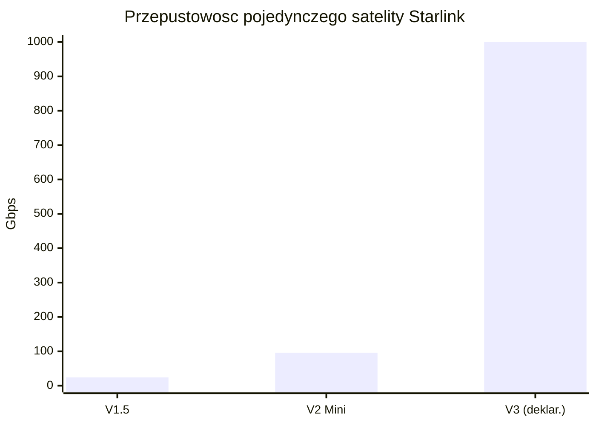
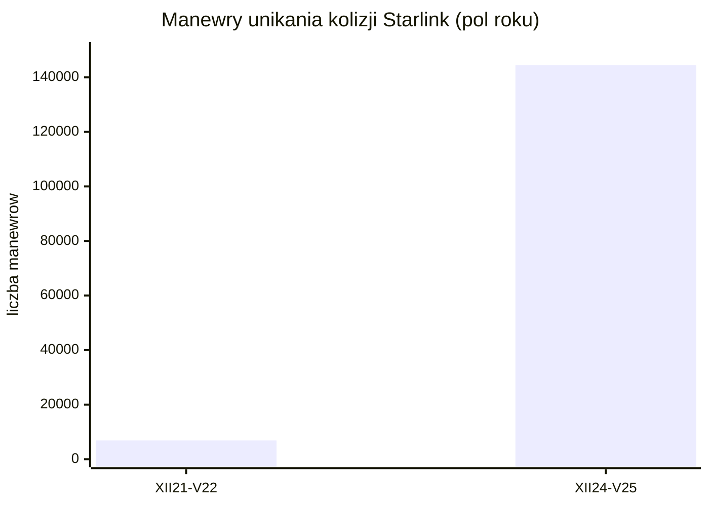
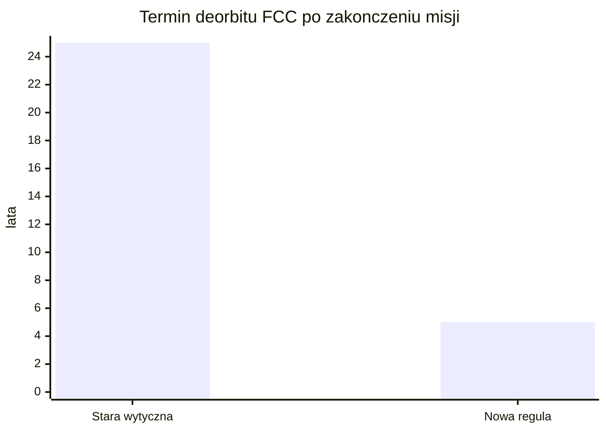
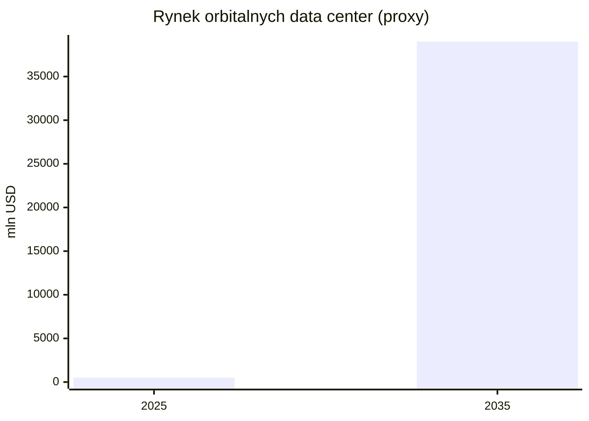

# Regulacje, prawo kosmiczne, debris i ITU

> Notatka raportu "Orbitalne centra danych". Kluczowe źródła: [źródło 1](https://takshashila.org.in/content/publications/20251219-Orbital-Entrenchment.html), [źródło 2](https://docs.fcc.gov/public/attachments/DA-26-113A1.pdf).

## W skrócie

Orbitalne centra danych wjeżdżają na rynek, na którym reguły gry są albo stare (traktaty z lat 1967-1976), albo dopiero powstają (mandat deorbitu, jurysdykcja danych). Dla inwestora oznacza to dwie rzeczy. Po pierwsze, koszt regulacyjny rośnie: krótszy 5-letni termin deorbitu w USA, twardsze wymogi licencyjne <abbr title="amerykański regulator telekomunikacji licencjonujący częstotliwości i satelity.">FCC</abbr>/FAA/NOAA i kontrola eksportu chipów AI (ITAR/EAR) podnoszą kapitał i ryzyko opóźnień. Po drugie, jest realna szansa na produkt: firmy takie jak Starcloud, Lonestar i Axiom sprzedają "suwerenną chmurę" jako dane poza jakąkolwiek jurysdykcją - to potencjalnie unikalna przewaga, ale prawnie wątpliwa (kolizja amerykańskiego <abbr title="ustawa USA (18 U.S.C. § 2713) zmuszająca dostawcę do wydania danych pod jego kontrolą niezależnie od ich fizycznej lokalizacji.">CLOUD Act</abbr> z europejskim <abbr title="unijne rozporządzenie o ochronie danych; jego Art. 48 zakazuje transferu danych na żądanie organu spoza UE bez umowy międzynarodowej.">GDPR</abbr>). Tempo zmian jest szybkie i jednostronne: liczba zgłoszeń satelitów do <abbr title="agenda ONZ koordynująca globalnie widmo radiowe i pozycje orbitalne satelitów.">ITU</abbr> wzrosła 5,5-krotnie w dekadzie 🟠 [Takshashila](https://takshashila.org.in/content/publications/20251219-Orbital-Entrenchment.html), a SpaceX złożyło 30 stycznia 2026 wniosek na konstelację do 1 000 000 satelitów pod compute orbitalne 🔵 [FCC DA-26-113A1](https://docs.fcc.gov/public/attachments/DA-26-113A1.pdf). Kto pierwszy zdobędzie częstotliwości i orbity, ten buduje barierę wejścia; spóźnialscy mogą zostać bez pasma i bez miejsca.

<!-- network:watki:start -->
## Powiązane wątki

> Mapa powiązań tematycznych - jak ten wątek łączy się z resztą raportu.

- [[03 - fizyka-orbitalna-orbity-i-operacje|Fizyka orbitalna]] - zasada 5 lat na deorbit kształtuje operacje na orbicie
- [[07 - lacznosc-optyczne-isl-downlink-i-latencja|Łączność optyczna]] - filing i koordynacja pasm ITU dla łączności
- [[08 - niezawodnosc-serwisowanie-i-cykl-zycia-sprzetu|Niezawodność i serwisowanie]] - EOL i deorbit jako wymóg ograniczania debris
- [[13 - sentyment-spoleczny-i-moratoria-na-centra-danych|Sentyment i moratoria]] - light pollution i "Not In My Sky" astronomów
- [[14 - zrownowazony-rozwoj-i-srodowisko|Środowisko]] - debris jako koszt środowiskowy (Kessler)
- [[15 - bezpieczenstwo-geopolityka-i-realizm-10-letni|Bezpieczeństwo i geopolityka]] - jurysdykcja danych i suwerenność na orbicie
<!-- network:watki:end -->
## Częstotliwości ITU: filing, koordynacja i zatłoczenie pasm

ITU (International Telecommunication Union, agenda ONZ koordynująca globalnie widmo radiowe i pozycje orbitalne) działa na zasadzie "kto pierwszy, ten lepszy" - zgłoszenie (filing) rezerwuje częstotliwości i orbity. Przydzielone częstotliwości trzeba "wprowadzić do użycia" w ciągu 7 lat od daty zgłoszenia, inaczej wygasają 🔵 [ITU FAQ](https://www.itu.int/en/ITU-R/Documents/FAQs%20on%20ITU%20satellite%20Fillings-March%202025.pdf). Dla megakonstelacji obowiązują kamienie milowe: 10% wdrożenia w 2 lata, 50% w 5 lat i 100% w 7 lat od pierwszego zgłoszenia 🔵 [ITU FAQ](https://www.itu.int/en/ITU-R/Documents/FAQs%20on%20ITU%20satellite%20Fillings-March%202025.pdf). Implikacja dla inwestora: operator orbitalnego data center musi udowodnić realny harmonogram startów, bo "papierowe" rezerwacje przepadają - to chroni przed squattingiem widma, ale też zmusza do agresywnego, kapitałochłonnego tempa deploymentu.

Skala zatłoczenia jest bezprecedensowa. W latach 2017-2022 państwa łącznie zgłosiły ponad 1 000 000 satelitów 🟠 [Takshashila](https://takshashila.org.in/content/publications/20251219-Orbital-Entrenchment.html), a tempo zgłoszeń ITU wzrosło 5,5-krotnie w ostatniej dekadzie 🟠 [Takshashila](https://takshashila.org.in/content/publications/20251219-Orbital-Entrenchment.html). Podmioty z USA zgłosiły ponad 70 000 satelitów konkretnie w pasmach Ku/Ka/V 🟠 [Takshashila](https://takshashila.org.in/content/publications/20251219-Orbital-Entrenchment.html), a 52% wszystkich wniosków <abbr title="satelity niegeostacjonarne, krążące blisko Ziemi, w odróżnieniu od stałych pozycji geostacjonarnych.">NGSO</abbr> (non-geostationary, czyli satelity niegeostacjonarne, krążące blisko Ziemi) w latach 2016-2024 celowało w pasma Ka i Ku 🟠 [Takshashila](https://takshashila.org.in/content/publications/20251219-Orbital-Entrenchment.html). Wiele z tych zgłoszeń to czysta spekulacja: największy pojedynczy filing Cinnamon-937 obejmował 337 320 satelitów 🟠 [Ludovika](https://openaccess.ludovika.hu/nke/catalog/download/95/897/2200?inline=1), a z około 450 000 zgłoszeń firmy E-Space nie wystrzelono ani jednego satelity 🟠 [Takshashila](https://takshashila.org.in/content/publications/20251219-Orbital-Entrenchment.html). Implikacja: pasmo jest faktycznie "zaklepywane" szybciej niż używane, co podnosi koszt i ryzyko koordynacji dla każdego nowego gracza.

Pasma, o które toczy się gra: Ka-band to zakres około 26,5-40 GHz (GHz = miliard cykli na sekundę, im wyższa częstotliwość, tym więcej danych, ale gorsza odporność na deszcz), V-band to 40-75 GHz 🟠 [KeepTrack](https://keeptrack.space/space-terms/ka-band). Typowe konstelacje szerokopasmowe latają na około 550 km 🟠 [KeepTrack](https://keeptrack.space/space-terms/ka-band). Coraz większą rolę grają łącza optyczne (laserowe) między satelitami: każdy najnowszy Starlink ma 3 systemy laserowe do 200 Gbps każdy (Gbps = gigabit na sekundę) 🟠 [Aviation Week](https://aviationweek.com/sites/default/files/2025-07/AWST_2025_7-28.pdf), a sieć Starlink miała ponad 13 000 dwukierunkowych łączy laserowych 🟠 [Aviation Week](https://aviationweek.com/sites/default/files/2025-07/AWST_2025_7-28.pdf). Przepustowość pojedynczego satelity rośnie skokowo: V1.5 - 24 Gbps, V2 Mini - 96 Gbps 🟠 [Aviation Week](https://aviationweek.com/sites/default/files/2025-07/AWST_2025_7-28.pdf), a deklarowana dla V3 to nawet 1 Tbps (terabit na sekundę) 🔴 [CompareBroadband](https://comparebroadbandpackages.co.uk/guides/news/starlink-2024-report-details-1tbps-speed-leo-v3-broadband-satellites/). Regulacyjnie istotne jest, że WRC-23 (World Radiocommunication Conference, globalny szczyt ITU dzielący widmo) przyjęło nowe alokacje dla łączy międzysatelitarnych (<abbr title="łącza międzysatelitarne (często laserowe) przesyłające dane bezpośrednio między satelitami.">ISL</abbr>) w pasmach 18,1-18,6; 18,8-20,2 i 27,5-30,0 GHz 🔵 [FCC DA-24-815A1](https://docs.fcc.gov/public/attachments/DA-24-815A1.pdf). Implikacja: łącza laserowe omijają część zatłoczenia radiowego, ale ich downlink i tak musi przejść przez koordynowane pasma. Ile orbitalnych data center ma własny filing ITU - NIE UJAWNIONE; proxy: Lumen Orbit/Starcloud złożyło wnioski do FCC i ITU już w marcu 2024 🟠 [NewSpace](https://www.newspace.im/constellations/lumen-orbit), a Axiom rejestruje się jako payload/stacja, nie jako "data center".

*Rys. 57 - Skokowy wzrost przepustowosci na satelite, az do deklarowanego 1 Tbps dla V3. Dane: Aviation Week (V1.5/V2 Mini), CompareBroadband (V3).*

## Space debris: przyrost platform, ryzyko kolizji, Kessler i deorbit

Środowisko orbitalne jest już zatłoczone. Na luty 2024 NASA śledziła około 31 000 obiektów, w tym około 9 300 czynnych satelitów, z czego około 5 410 to Starlink 🔵 [NASA GSFC](https://svs.gsfc.nasa.gov/5258/). ESA (kwiecień 2026) podaje około 44 870 regularnie śledzonych obiektów o łącznej masie ponad 16 200 ton 🔵 [ESA DISCOSweb](https://sdup.esoc.esa.int/discosweb/statistics/). Model MASTER-8 ESA szacuje 54 000 obiektów większych niż 10 cm, 1,2 mln fragmentów 1-10 cm i 140 mln fragmentów 1 mm-1 cm 🔵 [ESA DISCOSweb](https://sdup.esoc.esa.int/discosweb/statistics/) - drobne odłamki są niewykrywalne, a przy prędkości do 28 000 km/h 🔴 [ClimateCosmos](https://climatecosmos.com/weather-forecast/what-space-junk-might-trigger-kessler-syndrome-explained/) nawet milimetrowy fragment może uszkodzić satelitę. Implikacja: każdy nowy operator wchodzi w przestrzeń, gdzie ryzyko kolizji i koszty unikania już są wysokie.

![[assets/y10-1-iss072e593717.jpg]]
*Rys. 58 - Debris: An Astrobee robotic free-flyer with blue tentacle-like arms. Źródło: NASA, licencja: public domain.*
#grafika #regulacje-prawo-kosmiczne-debris-i-itu #debris #kolizje

![[assets/y10-2-iss072e593598.jpg]]
*Rys. 59 - Debris: Astronaut Suni Williams monitors an Astrobee robotic free-flyer. Źródło: NASA, licencja: public domain.*
#grafika #regulacje-prawo-kosmiczne-debris-i-itu #debris #kolizje

Skalę problemu pokazują manewry unikania kolizji Starlink: z 6 873 (XII 2021-V 2022) do 144 404 (XII 2024-V 2025) 🔵 [arXiv](https://arxiv.org/pdf/2603.23552) - dwudziestokrotny wzrost w trzy lata. Kluczowy fakt dla debaty: 96% indeksu ryzyka środowiskowego <abbr title="niska orbita okołoziemska (około 300-2000 km), gdzie krąży większość megakonstelacji.">LEO</abbr> pochodzi od obiektów nieaktywnych 🔵 [arXiv](https://arxiv.org/pdf/2603.23552), czyli to martwe satelity i odłamki, nie czynne floty, są głównym zagrożeniem. Ruch kumuluje się na 500-600 km, a ryzyko długoterminowe na około 850 km, gdzie obiekty długo nie spadają 🔵 [arXiv](https://arxiv.org/pdf/2603.23552). <abbr title="lawinowy efekt, w którym kolizje generują odłamki wywołujące kolejne kolizje, aż orbita staje się bezużyteczna.">Syndrom Kesslera</abbr> (lawinowy efekt: kolizje generują odłamki, które wywołują kolejne kolizje, aż orbita stanie się bezużyteczna) ma według modelu KESSYM 71% prawdopodobieństwa w ciągu 250 lat, z oczekiwanym kolapsem użytecznego LEO w przedziale 222-258 lat 🟠 [SOA KESSYM](https://www.soa.org/globalassets/assets/files/static-pages/research/arch/2023/arch-2023-2-kessym.pdf); w horyzoncie 100 lat szansa to tylko 1/3 300 🟠 [SOA KESSYM](https://www.soa.org/globalassets/assets/files/static-pages/research/arch/2023/arch-2023-2-kessym.pdf). Implikacja: katastrofa jest odległa, ale koszt operacyjny (manewry, ubezpieczenia) rośnie już teraz.

*Rys. 60 - Dwudziestokrotny wzrost manewrow unikania kolizji Starlink w trzy lata. Dane: arXiv 2603.23552.*

Reguły deorbitu się zaostrzają. FCC przyjęło zasadę "5 lat" - satelity LEO mają zostać sprowadzone z orbity najpóźniej 5 lat po zakończeniu misji 🟠 [SatelliteToday](https://www.satellitetoday.com/government-military/2022/09/30/fcc-adopts-5-year-rule-for-deorbiting-satellites/), zastępując starą wytyczną 25 lat 🟠 [SatelliteToday](https://www.satellitetoday.com/government-military/2022/09/30/fcc-adopts-5-year-rule-for-deorbiting-satellites/); głosowanie było 4-0 🟠 [SatelliteToday](https://www.satellitetoday.com/government-military/2022/09/30/fcc-adopts-5-year-rule-for-deorbiting-satellites/), a reguła obowiązuje wnioski składane od września 2024 🟠 [Viventine](https://www.viventine.com/the-downlink/us-space-regulatory-compliance/). FCC nałożyło już pierwszą grzywnę za naruszenie - 150 000 USD na DISH Network w październiku 2023 🔴 [TS2](http://ts2.tech/en/latest-news-and-developments-in-satellites-2024-2025). NASA wylicza, że skrócenie deorbitu z 25 do 15 lat daje stosunek korzyści do kosztów 20-750, a redukcja niepewności w ryzykownych zbliżeniach ponad 100 🔵 [arXiv](https://arxiv.org/pdf/2603.23552) - implikacja: regulacja deorbitu jest ekonomicznie opłacalna społecznie, więc presja na jej zaostrzanie będzie rosła. Po stronie europejskiej ESA Zero Debris Charter (ogłoszony 16 października 2023) stawia cele: prawdopodobieństwo generowania debris poniżej 1/1000 na obiekt przez całe życie orbitalne, skuteczność oczyszczania LEO/GEO co najmniej 99%, a ryzyko ofiary przy wejściu w atmosferę znacznie poniżej 1/10 000 🔵 [USRA/ESA](https://www.hou.usra.edu/meetings/orbitaldebris2023/pdf/6059.pdf). Liczba sygnatariuszy rosła z 12 państw (maj 2024) 🟠 [AccessPartnership](https://accesspartnership.com/opinion/access-alert-12-countries-sign-zero-debris-charter-pivot-to-space-sustainability/) do 166 sygnatariuszy w 33 krajach, w tym 20 państw (Q1 2025) 🟠 [AEDAE](https://aedae-aeroespacial.org/achievements-in-q1-2025-the-zero-debris-charter-a-growing-global-commitment/). Uwaga inwestorska: Charter to instrument prawnie niewiążący (soft law) 🟠 [BHO Legal](https://www.bho-legal.com/wp-content/uploads/2023/11/BHO-Legal-News_ESA-Space-Debris-Standard_Zero-Debris-Charter.pdf) - czyli zobowiązanie reputacyjne, nie egzekwowalne sankcjami.

*Rys. 61 - Skrocenie wymaganego terminu deorbitu satelitow LEO z 25 do 5 lat. Dane: SatelliteToday (regula FCC 5-year).*

## Prawo kosmiczne: Outer Space Treaty, odpowiedzialność i rejestracja

Fundament to <abbr title="fundament prawa kosmicznego: zakaz przywłaszczania przestrzeni, odpowiedzialność państw i jurysdykcja państwa rejestracji.">Outer Space Treaty</abbr> (OST) z 1967 roku 🔵 [UNOOSA](https://www.unoosa.org/oosa/en/ourwork/spacelaw/treaties/outerspacetreaty.html). Trzy artykuły są kluczowe dla orbitalnych data center. Art. II zakazuje przywłaszczania przestrzeni kosmicznej przez roszczenie suwerenności 🔵 [UNOOSA](https://www.unoosa.org/oosa/en/ourwork/spacelaw/treaties/outerspacetreaty.html) - to teoretyczna podstawa narracji "neutralnej jurysdykcji". Art. VI czyni państwa odpowiedzialnymi międzynarodowo za działalność kosmiczną także podmiotów prywatnych 🔵 [UNOOSA](https://www.unoosa.org/oosa/en/ourwork/spacelaw/treaties/outerspacetreaty.html). Art. VIII jest miażdżący dla idei "bezpaństwowości": państwo rejestracji zachowuje jurysdykcję i kontrolę nad obiektem przez cały czas pobytu w przestrzeni 🔵 [UNOOSA](https://www.unoosa.org/oosa/en/ourwork/spacelaw/treaties/outerspacetreaty.html). Implikacja: satelita nigdy nie jest "niczyj" - zawsze podlega prawu państwa, w którego rejestrze figuruje. OST ma 135 państw-stron, ale 30 z nich nie ma żadnych ustaw o ochronie danych, a kolejne 13 ma tylko projekty 🟠 [RothwellFigg](https://www.rothwellfigg.com/assets/htmldocuments/ICLG__Data_Protection_2019_RothwellFigg_Outer_Space.pdf) - to luka, którą operatorzy mogą wykorzystać do "rejestracji jurysdykcyjnej" w kraju o słabym prawie ochrony danych.

Odpowiedzialność reguluje <abbr title="traktat regulujący odpowiedzialność za szkody: absolutną na Ziemi/w powietrzu i z winy w przestrzeni kosmicznej.">Liability Convention</abbr> z 1972 🔴 [LatestLaws](https://www.latestlaws.com/bare-acts/central-acts-rules/laws/space-laws/united-nations-office-outer-space-affairs-unoosa): absolutna odpowiedzialność za szkody na Ziemi lub samolotom w locie (Art. II) i odpowiedzialność z winy za szkody w przestrzeni kosmicznej (Art. III) 🔵 [UNOOSA](https://www.unoosa.org/documents/pdf/psa/hsti/SpaceLaw/Access_for_All_webinar_SpaceLawandRegulations.pdf). Rejestrację reguluje <abbr title="traktat nakładający na państwo startu obowiązek rejestracji wystrzelonych obiektów kosmicznych.">Registration Convention</abbr> z 1975, w mocy od 1976 🔵 [SWF](https://swfound.org/media/207871/copuos-briefing-book_2024_web.pdf), z 76 państwami-stronami na marzec 2025 🔵 [COPUOS](https://cdn.prod.website-files.com/66dcc6872f6ed23bce1db235/68555ba6936c9b96e98f6e64_COPUOS%20Briefing%20Book_English_Web.pdf). Obowiązek rejestracji spoczywa wyłącznie na "launching State" (państwie startu) 🟠 [Planet4589](https://planet4589.org/space/papers/JJM2018/JJM_published.pdf). Problem praktyczny: rejestracja ładunków była fatalna - 35% (2015), 15% (2016) i 0% (2017) 🟠 [Planet4589](https://planet4589.org/space/papers/JJM2018/JJM_published.pdf). Implikacja: skoro w ogóle nie wiadomo, kto jest właścicielem obiektu, dochodzenie odpowiedzialności po kolizji jest fikcją. Liczba postępowań odszkodowawczych za kolizje satelitarne w przestrzeni - NIE UJAWNIONE; proxy: brak publicznie znanych procesów, odpowiedzialność opiera się na dyplomacji.

## Jurysdykcja danych na orbicie: GDPR kontra CLOUD Act

To serce produktu "suwerennej chmury" i jego największe prawne ryzyko. CLOUD Act (Clarifying Lawful Overseas Use of Data Act) to ustawa USA z 2018 roku, kodyfikowana jako 18 U.S.C. § 2713 🔵 [Cornell Law](https://www.law.cornell.edu/uscode/text/18/2713). Jej istota: dostawca usług musi ujawnić dane będące w jego "possession, custody, or control" niezależnie od tego, czy znajdują się w USA czy poza nimi 🔵 [Cornell Law](https://www.law.cornell.edu/uscode/text/18/2713). Kryterium to kontrola dostawcy, a nie fizyczna lokalizacja danych 🔵 [Cornell Law](https://www.law.cornell.edu/uscode/text/18/2713). Implikacja: amerykański operator orbitalnego data center (np. SpaceX) może być zmuszony wydać dane władzom USA nawet jeśli "fizycznie" są na orbicie. Liczba "qualifying foreign governments" mających specjalne porozumienia była zerowa według Eucrim z 2019 🟠 [Eucrim](https://eucrim.eu/articles/unpacking-cloud-act/). Liczba nakazów CLOUD Act wobec operatorów satelitarnych - NIE UJAWNIONE; proxy: 0 publicznie znanych spraw orbitalnych 🔵 [EDPB/EDPS](https://www.edpb.europa.eu/sites/default/files/files/file2/edpb_edps_joint_response_us_cloudact_annex.pdf).

Po drugiej stronie stoi GDPR. Jego zasięg terytorialny opiera się na Art. 3: przetwarzanie w kontekście działalności jednostki w UE (ust. 1) lub oferowanie usług osobom w UE (ust. 2) 🟠 [GDPR-info](https://gdpr-info.eu/art-3-gdpr/). Decydujący jest Art. 48 GDPR: wyrok sądu lub decyzja organu spoza UE nakazujące transfer danych są wykonalne tylko na podstawie umowy międzynarodowej (np. MLAT) 🔵 [EDPB/EDPS](https://www.edpb.europa.eu/sites/default/files/files/file2/edpb_edps_joint_response_us_cloudact_annex.pdf). Wniosek wspólny EDPB/EDPS jest jednoznaczny: w braku takiej ramy dostawcy podlegający prawu UE nie mogą legalnie oprzeć ujawnienia danych na samym żądaniu CLOUD Act 🔵 [EDPB/EDPS](https://www.edpb.europa.eu/sites/default/files/files/file2/edpb_edps_joint_response_us_cloudact_annex.pdf). Komisja Europejska przyjęła w lipcu 2023 decyzję adekwatności dla EU-US Data Privacy Framework 🔵 [gov.ie](https://assets.gov.ie/305159/fd2c82a0-c651-4df4-95d8-33fa64a60178.pdf), co częściowo łagodzi spór, ale nie eliminuje kolizji przy nakazach organów ścigania. Implikacja inwestorska: dostawca z USA wpada w "legal impossibility" - spełni żądanie USA i złamie GDPR, albo odmówi i złamie prawo USA.

Specyfika LEO pogłębia problem. Satelity LEO okrążają Ziemię w 90-120 minut 🟠 [RS Inc](https://www.rsinc.com/starcloud-orders-starlink-lasers-for-orbital-data-center-network.php), na wysokości 300-2000 km 🟠 [RS Inc](https://www.rsinc.com/starcloud-orders-starlink-lasers-for-orbital-data-center-network.php), z opóźnieniem jednokierunkowym poniżej 50 ms (wobec 500-700 ms dla geostacjonarnych) 🟠 [RS Inc](https://www.rsinc.com/starcloud-orders-starlink-lasers-for-orbital-data-center-network.php). Routing oparty jest na dostępności satelitów i optymalizacji opóźnień, a nie na granicach prawnych 🟠 [LUISS](https://tesi.luiss.it/43496/1/631553_GOETSCH_MARCO%20ANDREA.pdf). Skutek: ani podmiot danych, ani organ nadzorczy, ani nawet sam administrator nie wie, gdzie dane są w danej chwili 🟠 [LUISS](https://tesi.luiss.it/43496/1/631553_GOETSCH_MARCO%20ANDREA.pdf), co łamie wymóg EDPB "know your transfers" z Rekomendacji 01/2020 🟠 [LUISS](https://tesi.luiss.it/43496/1/631553_GOETSCH_MARCO%20ANDREA.pdf). Polityki prywatności Starlink nie wspominają o decyzjach routingu ani lokalizacjach stacji naziemnych 🟠 [LUISS](https://tesi.luiss.it/43496/1/631553_GOETSCH_MARCO%20ANDREA.pdf). Egzekucja jest słaba: brak wyznaczonego EU representative (Art. 27 GDPR) dla Starlink - NIE UJAWNIONE, proxy: praca akademicka wskazuje "no known establishment or Article 27 representative in the Union" 🟠 [LUISS](https://tesi.luiss.it/43496/1/631553_GOETSCH_MARCO%20ANDREA.pdf), a nawet gdy przedstawiciel istnieje, to tylko punkt kontaktowy bez realnej kontroli 🟠 [LUISS](https://tesi.luiss.it/43496/1/631553_GOETSCH_MARCO%20ANDREA.pdf); UE brak narzędzi przymusu wobec podmiotów bez obecności operacyjnej w Unii 🟠 [LUISS](https://tesi.luiss.it/43496/1/631553_GOETSCH_MARCO%20ANDREA.pdf). To rośnie na znaczeniu: ustawy o lokalizacji danych obowiązują już w ponad 40 krajach (2023) i 67 krajach (2025) 🟠 [WTI](https://wti.org/media/filer_public/ae/c9/aec930ce-bb57-4906-805e-063520e76a12/putting_a_price_on_space_francois_francois_wp.pdf).

## Sovereign cloud / arbitraż jurysdykcji danych jako PRODUKT

Trzy firmy aktywnie sprzedają "bezpaństwowość danych" jako USP. Starcloud (założone w 2024, dawne Lumen Orbit) 🔵 [Starcloud](https://www.starcloud.com) oferuje Starcloud-2 jako "premium sovereign cloud computing, fully independent of Earth" 🔵 [Starcloud-2](https://www.starcloud.com/starcloud-2), promując koncept "data haven" poza granicami terytorialnymi państw, bo "Space acts as a neutral jurisdiction" 🟠 [NewSpaceEconomy](https://newspaceeconomy.ca/2025/11/19/starcloud-the-orbital-data-center-company/). Lonestar reklamuje StarVault jako "world's first commercially operational space-based sovereign data storage platform" 🔵 [Lonestar](https://www.lonestar.space) z hasłem "Space Law Enables Data Sovereignty" 🔵 [Lonestar](https://www.lonestar.space). Axiom mówi o "Global Data Independence" i operowaniu "beyond national jurisdictions to support sovereign, borderless data management" 🔵 [Axiom ODC](https://www.axiomspace.com/orbital-data-center), z funkcją "Earth independence" 🔵 [Axiom](https://www.axiomspace.com/in-space-data-security). Implikacja: jest realny popyt (rynek lokalizacji danych w 67 krajach), ale produkt sprzedaje obietnicę, która stoi w sprzeczności z Art. VIII OST (zawsze jest państwo rejestracji) i Art. 48 GDPR.

Skala i tempo finansowania pokazują, że inwestorzy w to wierzą. Starcloud zebrało 21 mln USD seed (11 mln w XII 2024 i 10 mln w II 2025) 🟠 [Future-of-Computing](https://www.future-of-computing.com/starcloud-shaping-the-future-of-space-based-data-centers/), a późniejsza runda dała 170 mln USD przy wycenie 1,1 mld USD 🟠 [WoodenScale](https://www.woodenscale.ai/blogs/starcloud-170m-funding-space-data-centers/). Starcloud-1 (60 kg) wystartował w listopadzie 2025 z pierwszym GPU Nvidia H100 na orbicie 🟠 [WoodenScale](https://www.woodenscale.ai/blogs/starcloud-170m-funding-space-data-centers/), z ambicją 5 GW mocy do 2030 i 10 GW do 2032 🔴 [SpaceDataCenterGuide](https://spacedatacenterguide.com/starcloud-space-data-center/) oraz konstelacją 300 satelitów przekaźnikowych w VLEO 🟠 [FactoriesInSpace](https://www.factoriesinspace.com/lumen-orbit). Lonestar planuje pierwszy komercyjny start StarVault w październiku 2026 🔵 [Lonestar](https://www.lonestar.space), z pojemnością rosnącą z 15 PB (2027) do 400 PB (2032) 🟠 [Businesses.com.au](https://agency.businesses.com.au/business-news/pr-newswire/78235-kio-data-centers-drives-the-future-of-data-security-with-strategic-alliance-with-space-based-data-center-operator-lonestar). Axiom wystrzelił 2 węzły ODC 11 stycznia 2026 (łącza optyczne 2,5 Gbps, maks. 10 Gbps, zgodne z SDA) 🟠 [Introl](https://introl.com/blog/orbital-data-center-nodes-launch-space-computing-infrastructure-january-2026). Najbardziej spektakularny ruch: SpaceX (po przejęciu xAI) złożyło 30 stycznia 2026 wniosek FCC na konstelację do 1 000 000 satelitów na wysokości 500-2000 km 🔵 [FCC DA-26-113A1](https://docs.fcc.gov/public/attachments/DA-26-113A1.pdf), z szacowaną mocą obliczeniową 100 GW rocznie 🟠 [SatelliteToday](https://www.satellitetoday.com/connectivity/2026/02/02/spacex-acquires-xai-to-pursue-orbital-data-center-constellation/). Wycena rynku "sovereign cloud in orbit" - NIE UJAWNIONE; proxy: rynek ODC 500 mln USD (2025) -> 39 mld USD (2035) 🟠 [SalesGlobe](https://www.salesglobe.com/the-data-center-surge-how-is-it-impacting-your-revenue-growth/), a space cloud computing 6,12 mld USD (2025) -> 24,94 mld USD (2035) 🟠 [Cervicorn](https://www.cervicornconsulting.com/space-cloud-computing-market).

*Rys. 62 - Prognozowany wzrost rynku ODC z 0,5 mld do 39 mld USD w dekade. Dane: SalesGlobe.*

Warstwa cyberbezpieczeństwa UE rośnie. ENISA zaklasyfikowała systemy satelitarne jako "high exposure architectures" - szczególnie podatne na kompromitację łańcucha dostaw, ataki DoS i nieautoryzowany dostęp do stacji naziemnych 🟠 [LUISS](https://tesi.luiss.it/43496/1/631553_GOETSCH_MARCO%20ANDREA.pdf). Dyrektywa NIS2 obejmuje teraz "space" jako sektor o wysokim znaczeniu 🔵 [ENISA Space Threat](https://www.enisa.europa.eu/sites/default/files/2025-03/Space_Threat_Landscape_Report_fin.pdf), a ENISA stwierdza wprost, że cyberryzyko jest wyższe dla przestrzeni niż dla sieci naziemnych 🔵 [ENISA LEO](https://www.enisa.europa.eu/sites/default/files/publications/LEO_satcom_cyber_security_assessment_240214.pdf). UNOOSA liczy 17 852 obiektów wprowadzonych na orbitę, z czego 11 331 ze statusem "in orbit" 🔵 [ENISA Space Threat](https://www.enisa.europa.eu/sites/default/files/2025-03/Space_Threat_Landscape_Report_fin.pdf), a prognoza to średnio 2 800 startów rocznie w latach 2023-2032 (8 satelitów dziennie) 🔵 [ENISA Space Threat](https://www.enisa.europa.eu/sites/default/files/2025-03/Space_Threat_Landscape_Report_fin.pdf). Implikacja: "neutralna jurysdykcja" niekoniecznie znaczy "bezpieczna" - regulacja cyberbezpieczeństwa może być wektorem, którym UE dosięgnie operatorów orbitalnych.

## Licencjonowanie: FCC, FAA, NOAA i kontrola eksportu chipów

W USA licencjonowanie jest wielowarstwowe. Częstotliwości i satelity licencjonuje FCC pod 47 CFR Part 25 🟠 [Viventine](https://www.viventine.com/the-downlink/us-space-regulatory-compliance/), warunkując licencję spełnieniem wymogów mitigacji debris pod 47 CFR § 25.114(d)(14) 🟠 [Viventine](https://www.viventine.com/the-downlink/us-space-regulatory-compliance/); operator składa "Schedule S" z parametrami orbitalnymi i częstotliwościami 🟠 [Viventine](https://www.viventine.com/the-downlink/us-space-regulatory-compliance/). Okres komentarzy publicznych to 30 dni 🔴 [SpaceNexus](https://spacenexus.us/blog/fcc-satellite-licensing-guide-2026), a typowy czas rozpatrzenia 6-18 miesięcy 🔴 [SpaceNexus](https://spacenexus.us/blog/fcc-satellite-licensing-guide-2026). Implikacja: nawet idealny wniosek oznacza rok lub dłużej do startu - to ryzyko czasowe dla harmonogramu spalania kapitału. Starty licencjonuje FAA pod Part 450: wydano 14 licencji od marca 2021, a okres przejściowy zakończył się 9 marca 2026 🟠 [Aerotime](https://www.aerotime.aero/articles/faa-streamlines-commercial-space-license-approvals). NOAA licencjonuje teledetekcję (remote sensing) pod 51 U.S.C. § 60101 i 15 CFR Part 960 🔵 [Commerce.gov](https://space.commerce.gov/regulations/commercial-remote-sensing-regulatory-affairs/licensing/), w terminie do 60 dni 🔵 [Commerce.gov](https://space.commerce.gov/regulations/commercial-remote-sensing-regulatory-affairs/licensing/) i bez opłaty za wniosek (0 USD) 🔵 [Commerce.gov](https://space.commerce.gov/regulations/commercial-remote-sensing-regulatory-affairs/faqs/); na 2022 było 44 firm z licencją NOAA 🟠 [AMOSTech](https://amostech.com/TechnicalPapers/2022/Poster/Goehring.pdf).

Kontrola eksportu to specyficzny problem orbitalnych data center - wymagają zaawansowanych chipów AI. Reforma z 2013 przeniosła wiele komercyjnych satelitów z restrykcyjnego ITAR (International Traffic in Arms Regulations) do bardziej liberalnego EAR (Export Administration Regulations) 🔴 [CadRooms](https://blog.cadrooms.com/export-control-compliance-space-tech-hardware-companies-ear-dual-use/). Przedmioty pod EAR klasyfikuje się numerem ECCN z Commerce Control List 🔴 [CadRooms](https://blog.cadrooms.com/export-control-compliance-space-tech-hardware-companies-ear-dual-use/). Konkretne ECCN dla GPU/chipów AI w orbitalnych data center - NIE UJAWNIONE; proxy: GPU klasyfikowane pod 3A090/4A090 (zaawansowane computing chips), wymagane badanie BIS case-by-case 🔴 [CVGStrategy](https://cvgstrategy.com/bis-revises-policies-for-semiconductors/) - BIS ograniczyło eksport półprzewodników do Chin i Makau. Po stronie hardware GlobalFoundries i BAE współpracują nad radiacyjnie utwardzonymi układami 12 nm (RH12) 🔵 [GlobalFoundries](https://gf.com/gf-press-release/globalfoundries-and-bae-systems-collaborate-on-semiconductors-for-space/), z compliance ITAR i EAR 🔵 [GlobalFoundries](https://gf.com/gf-press-release/globalfoundries-and-bae-systems-collaborate-on-semiconductors-for-space/). Implikacja: orbitalne data center oparte na zaawansowanych GPU (jak H100 Starcloud) podlegają tym samym kontrolom eksportu chipów AI co naziemne - "bezpaństwowość danych" nie zwalnia z kontroli eksportu sprzętu.

## Astronomia: light pollution i interferencja radiowa

<abbr title="międzynarodowa unia astronomiczna walcząca z zanieczyszczeniem światłem i interferencją radiową od satelitów.">IAU</abbr> (International Astronomical Union, założona 1919, ponad 13 000 członków z około 80 krajów) 🟠 [MZP/Benvenuti](https://mzp.gov.cz/system/files/2025-03/OPSZP-Benvenuti-20240306.pdf) utworzyła w 2022 Centre for the Protection of the Dark and Quiet Sky (CPS) 🔵 [NAOJ](https://www.nao.ac.jp/contents/about/reports/annual-report-en/annual2023-e.pdf). Problem jasności: satelity Starlink Gen1 mają jasność pozorną 4-5 magnitudo (im niższa liczba, tym jaśniej; około 6 to granica widoczności gołym okiem), widoczne gołym okiem o zmierzchu 🟠 [RS Inc](https://www.rsinc.com/leo-satellites-in-orbit-skyrocket-to-reach-42600-satellites-by-2032.php). Konstrukcje VisorSat z osłonami zredukowały jasność o ponad 50% 🟠 [RS Inc](https://www.rsinc.com/leo-satellites-in-orbit-skyrocket-to-reach-42600-satellites-by-2032.php), co potwierdza NAOJ szacując redukcję odbicia o około 50% 🔵 [NAOJ/PRC](https://prc.nao.ac.jp/freqras/EN_index.html). Mimo to ślady satelitów mogą zanieczyścić do 30% zdjęć zmierzchowych obserwatorium Vera Rubin 🟠 [RS Inc](https://www.rsinc.com/leo-satellites-in-orbit-skyrocket-to-reach-42600-satellites-by-2032.php). Interferencja radiowa jest dotkliwa: Starlink V2-mini emituje do 32 razy więcej niepożądanego promieniowania radiowego niż wcześniejsze modele 🔴 [ForwardPathway](https://www.forwardpathway.us/impact-of-radio-interference-on-radio-astronomy-and-solutions), emisja przy transmisji przekracza 10^4 Jy (jansky, jednostka strumienia radiowego) według NRAO 🟠 [Astrobites](https://astrobites.org/2024/10/01/iau-dark-and-quiet-skies/), a LOFAR wykrył niezamierzone promieniowanie w pasmach 110-188 MHz o intensywności około 200 Jy/beam 🟠 [MZP/Benvenuti](https://mzp.gov.cz/system/files/2025-03/OPSZP-Benvenuti-20240306.pdf). Skrajny przykład: AST SpaceMobile BlueWalker 3 ma antenę wielkości kortu tenisowego (~10 m²) i stał się jednym z najjaśniejszych obiektów na nocnym niebie 🟠 [TheRegister](https://www.theregister.com/2025/04/28/ast_satellites/). Akceptowalny dla IAU próg jasności - NIE UJAWNIONE; proxy: IAU CPS stwierdza, że żadna metoda mitigacji nie obniżyła jeszcze jasności satelity LEO do poziomu rekomendowanego przez astronomów 🟠 [TheRegister](https://www.theregister.com/2025/04/28/ast_satellites/). Implikacja: presja astronomiczna to ryzyko reputacyjne i potencjalne nowe ograniczenia regulacyjne (np. limity jasności w licencjach).

## Kontrowersje

**Czy obecne ramy regulacyjne wystarczają dla megakonstelacji compute?**

Strona "wystarczają / regulator panuje": FCC ma twardy mandat 5-letniego deorbitu z realnym enforcementem (grzywna 150 000 USD dla DISH, X 2023) 🔴 [TS2](http://ts2.tech/en/latest-news-and-developments-in-satellites-2024-2025), a sama reguła przeszła głosowaniem 4-0 🟠 [SatelliteToday](https://www.satellitetoday.com/government-military/2022/09/30/fcc-adopts-5-year-rule-for-deorbiting-satellites/). FCC w praktyce hamuje: przyznało tylko 7 500 z 30 000 wnioskowanych satelitów Starlink, powołując się na obawy o interferencję i bezpieczeństwo środowiska 🔴 [Tekedia](https://www.tekedia.com/elon-musk-seeks-fccs-permission-to-launch-30000-more-satellites-astronomers-sound-alarm/). Strona "nie wystarczają": kluczowe instrumenty są niewiążące - ESA Zero Debris Charter z 166 sygnatariuszami to soft law 🟠 [BHO Legal](https://www.bho-legal.com/wp-content/uploads/2023/11/BHO-Legal-News_ESA-Space-Debris-Standard_Zero-Debris-Charter.pdf); nie istnieje międzynarodowy standard koordynacji manewrów ("Currently there is no internationally standardized system for operators to coordinate maneuver plans") 🔴 [SpaceNexus](https://spacenexus.us/blog/mega-constellation-regulatory-challenges-spectrum-debris-liability); a SpaceX właśnie zawnioskowało o do 1 000 000 satelitów 🔵 [FCC DA-26-113A1](https://docs.fcc.gov/public/attachments/DA-26-113A1.pdf) - skala, której żadne istniejące ramy nie testowały.

**Kto odpowiada za kolizje w przestrzeni kosmicznej?**

Strona "ramy są jasne": Liability Convention rozdziela odpowiedzialność - absolutną za szkody na Ziemi/w powietrzu (Art. II) i z winy w przestrzeni (Art. III) 🔵 [UNOOSA](https://www.unoosa.org/documents/pdf/psa/hsti/SpaceLaw/Access_for_All_webinar_SpaceLawandRegulations.pdf), a Art. VIII OST utrzymuje jurysdykcję państwa rejestracji 🔵 [UNOOSA](https://www.unoosa.org/oosa/en/ourwork/spacelaw/treaties/outerspacetreaty.html). Strona "w praktyce to fikcja": rejestracja ładunków bywała katastrofalna (35% / 15% / 0% w latach 2015-2017) 🟠 [Planet4589](https://planet4589.org/space/papers/JJM2018/JJM_published.pdf), co uniemożliwia identyfikację launching State; brak też precedensów sądowych dla kolizji komercyjnych satelitów w LEO - spory rozwiązuje się dyplomatycznie, nie procesowo (źródło f1_10, sekcja 8.2 🟠 [Planet4589](https://planet4589.org/space/papers/JJM2018/JJM_published.pdf)).

**Spór o akceptowalność przyrostu debris**

Strona "to poważny, narastający problem": 96% indeksu ryzyka LEO to obiekty nieaktywne 🔵 [arXiv](https://arxiv.org/pdf/2603.23552), manewry unikania Starlink wzrosły do 144 404 w pół roku 🔵 [arXiv](https://arxiv.org/pdf/2603.23552), a KESSYM daje 71% prawdopodobieństwa Kessler Syndrome w 250 lat 🟠 [SOA KESSYM](https://www.soa.org/globalassets/assets/files/static-pages/research/arch/2023/arch-2023-2-kessym.pdf). Strona "to nie kryzys (jeszcze)": Komisarz FCC Simington stwierdził "Orbital debris is a problem, but not a crisis. Not yet." 🟠 [SatelliteToday](https://www.satellitetoday.com/government-military/2022/09/30/fcc-adopts-5-year-rule-for-deorbiting-satellites/), a SpaceX podaje, że ponad 95% masy Starlink wyparowuje przy wejściu w atmosferę 🔴 [TS2](http://ts2.tech/en/satellite-internet-revolution-how-spacex-starlink-and-rivals-are-connecting-the-world-from-space-2025-2030-outlook).

**Nierozwiązana jurysdykcja danych na orbicie**

Strona USA (CLOUD Act): dane pod kontrolą dostawcy z USA mogą być żądane niezależnie od lokalizacji 🔵 [Cornell Law](https://www.law.cornell.edu/uscode/text/18/2713), 🟠 [Exoscale](https://www.exoscale.com/blog/cloudact-vs-gdpr/). Strona UE (GDPR): Art. 48 zakazuje ujawnienia bez umowy międzynarodowej, EDPB/EDPS stwierdzają brak podstawy prawnej dla samego CLOUD Act 🔵 [EDPB/EDPS](https://www.edpb.europa.eu/sites/default/files/files/file2/edpb_edps_joint_response_us_cloudact_annex.pdf), a orbitalny routing to "total dislocation" bez kontroli downlinku 🟠 [LUISS](https://tesi.luiss.it/43496/1/631553_GOETSCH_MARCO%20ANDREA.pdf). Konflikt jest nierozwiązany: CLOUD Act wymaga ujawnienia, GDPR/UK GDPR go zakazuje - "legal impossibility" 🔴 [Kiteworks](https://www.kiteworks.com/gdpr-compliance/cloud-act-uk-data-protection-jurisdiction-matters/). Brak potwierdzonego rozstrzygnięcia po sprawdzeniu źródeł - obie strony pozostają w mocy, a spraw orbitalnych jest publicznie 0 🔵 [EDPB/EDPS](https://www.edpb.europa.eu/sites/default/files/files/file2/edpb_edps_joint_response_us_cloudact_annex.pdf).

## Słowniczek pojęć

- **ITU (International Telecommunication Union)** - agenda ONZ koordynująca globalnie widmo radiowe i pozycje orbitalne satelitów.
- **Filing (zgłoszenie ITU)** - rezerwacja częstotliwości i pozycji orbitalnej na zasadzie "kto pierwszy, ten lepszy", wygasająca, jeśli nie zostanie wprowadzona do użycia w terminie.
- **WRC (World Radiocommunication Conference)** - globalny szczyt ITU, na którym dzieli się widmo radiowe i przyjmuje nowe alokacje pasm.
- **NGSO (non-geostationary satellite orbit)** - satelity niegeostacjonarne, krążące blisko Ziemi, w odróżnieniu od stałych pozycji geostacjonarnych.
- **LEO (Low Earth Orbit)** - niska orbita okołoziemska (około 300-2000 km), gdzie krąży większość megakonstelacji.
- **ISL (inter-satellite links)** - łącza międzysatelitarne (często laserowe) przesyłające dane bezpośrednio między satelitami.
- **FCC (Federal Communications Commission)** - amerykański regulator telekomunikacji licencjonujący częstotliwości i satelity.
- **FAA / NOAA** - agencje USA licencjonujące odpowiednio starty rakiet (FAA, Part 450) i teledetekcję satelitarną (NOAA, remote sensing).
- **Space debris** - śmieci kosmiczne: nieaktywne satelity i fragmenty stanowiące główne zagrożenie kolizyjne na orbicie.
- **Syndrom Kesslera** - lawinowy efekt, w którym kolizje generują odłamki wywołujące kolejne kolizje, aż orbita staje się bezużyteczna.
- **Reguła deorbitu (5-year rule)** - wymóg FCC sprowadzenia satelity LEO z orbity najpóźniej 5 lat po zakończeniu misji (dawniej 25 lat).
- **Outer Space Treaty (OST, 1967)** - fundament prawa kosmicznego: zakaz przywłaszczania przestrzeni, odpowiedzialność państw i jurysdykcja państwa rejestracji.
- **Liability Convention (1972)** - traktat regulujący odpowiedzialność za szkody: absolutną na Ziemi/w powietrzu i z winy w przestrzeni kosmicznej.
- **Registration Convention (1975)** - traktat nakładający na państwo startu obowiązek rejestracji wystrzelonych obiektów kosmicznych.
- **CLOUD Act** - ustawa USA (18 U.S.C. § 2713) zmuszająca dostawcę do wydania danych pod jego kontrolą niezależnie od ich fizycznej lokalizacji.
- **GDPR (RODO)** - unijne rozporządzenie o ochronie danych; jego Art. 48 zakazuje transferu danych na żądanie organu spoza UE bez umowy międzynarodowej.
- **Data sovereignty / sovereign cloud** - suwerenność danych: model produktu sprzedawany jako dane poza zasięgiem jakiejkolwiek krajowej jurysdykcji.
- **ITAR / EAR** - amerykańskie reżimy kontroli eksportu: ITAR (uzbrojenie) i bardziej liberalny EAR (towary podwójnego zastosowania, m.in. chipy AI).
- **IAU (International Astronomical Union)** - międzynarodowa unia astronomiczna walcząca z zanieczyszczeniem światłem i interferencją radiową od satelitów.

## Źródła

- 🔵 [ITU Satellite Filings FAQ](https://www.itu.int/en/ITU-R/Documents/FAQs%20on%20ITU%20satellite%20Fillings-March%202025.pdf) - kamienie milowe wdrożenia i 7-letni termin częstotliwości.
- 🟠 [Takshashila Orbital Entrenchment](https://takshashila.org.in/content/publications/20251219-Orbital-Entrenchment.html) - skala zgłoszeń satelitów do ITU/FCC i spekulacja widmem.
- 🟠 [Ludovika](https://openaccess.ludovika.hu/nke/catalog/download/95/897/2200?inline=1) - największy filing Cinnamon-937.
- 🟠 [KeepTrack](https://keeptrack.space/space-terms/ka-band) - definicje pasm Ka/V i wysokości orbit.
- 🟠 [Aviation Week](https://aviationweek.com/sites/default/files/2025-07/AWST_2025_7-28.pdf) - łącza laserowe i przepustowość Starlink.
- 🔴 [CompareBroadband](https://comparebroadbandpackages.co.uk/guides/news/starlink-2024-report-details-1tbps-speed-leo-v3-broadband-satellites/) - deklarowana przepustowość V3.
- 🔵 [FCC DA-24-815A1](https://docs.fcc.gov/public/attachments/DA-24-815A1.pdf) - alokacje ISL z WRC-23.
- 🔵 [FCC DA-26-113A1](https://docs.fcc.gov/public/attachments/DA-26-113A1.pdf) - wniosek SpaceX na konstelację do 1 mln satelitów.
- 🔵 [NASA GSFC](https://svs.gsfc.nasa.gov/5258/) - liczba obiektów i satelitów na orbicie (luty 2024).
- 🔵 [ESA DISCOSweb](https://sdup.esoc.esa.int/discosweb/statistics/) - statystyki debris i masa na orbicie.
- 🔵 [arXiv 2603.23552](https://arxiv.org/pdf/2603.23552) - manewry kolizyjne, indeks ryzyka LEO, benefit-cost deorbitu.
- 🟠 [SOA KESSYM](https://www.soa.org/globalassets/assets/files/static-pages/research/arch/2023/arch-2023-2-kessym.pdf) - prawdopodobieństwo Kessler Syndrome.
- 🟠 [SatelliteToday](https://www.satellitetoday.com/government-military/2022/09/30/fcc-adopts-5-year-rule-for-deorbiting-satellites/) - reguła FCC 5-year i cytat Simingtona.
- 🟠 [Viventine](https://www.viventine.com/the-downlink/us-space-regulatory-compliance/) - licencjonowanie FCC i data wejścia reguły.
- 🔴 [TS2](http://ts2.tech/en/latest-news-and-developments-in-satellites-2024-2025) - grzywna DISH.
- 🔵 [USRA/ESA Zero Debris](https://www.hou.usra.edu/meetings/orbitaldebris2023/pdf/6059.pdf) - cele Zero Debris Charter.
- 🟠 [BHO Legal](https://www.bho-legal.com/wp-content/uploads/2023/11/BHO-Legal-News_ESA-Space-Debris-Standard_Zero-Debris-Charter.pdf) - status niewiążący Charter.
- 🟠 [AccessPartnership](https://accesspartnership.com/opinion/access-alert-12-countries-sign-zero-debris-charter-pivot-to-space-sustainability/) / 🟠 [AEDAE](https://aedae-aeroespacial.org/achievements-in-q1-2025-the-zero-debris-charter-a-growing-global-commitment/) - liczba sygnatariuszy.
- 🔵 [UNOOSA OST](https://www.unoosa.org/oosa/en/ourwork/spacelaw/treaties/outerspacetreaty.html) - Outer Space Treaty, art. II/VI/VIII.
- 🔵 [UNOOSA Liability](https://www.unoosa.org/documents/pdf/psa/hsti/SpaceLaw/Access_for_All_webinar_SpaceLawandRegulations.pdf) - reżimy odpowiedzialności.
- 🔵 [SWF](https://swfound.org/media/207871/copuos-briefing-book_2024_web.pdf) / 🔵 [COPUOS](https://cdn.prod.website-files.com/66dcc6872f6ed23bce1db235/68555ba6936c9b96e98f6e64_COPUOS%20Briefing%20Book_English_Web.pdf) - Registration Convention.
- 🟠 [Planet4589](https://planet4589.org/space/papers/JJM2018/JJM_published.pdf) - launching State i niska rejestracja ładunków.
- 🔵 [Cornell Law 18 USC 2713](https://www.law.cornell.edu/uscode/text/18/2713) - tekst CLOUD Act.
- 🟠 [Exoscale](https://www.exoscale.com/blog/cloudact-vs-gdpr/) - geneza CLOUD Act vs GDPR.
- 🟠 [Eucrim](https://eucrim.eu/articles/unpacking-cloud-act/) - qualifying foreign governments.
- 🟠 [GDPR-info Art.3](https://gdpr-info.eu/art-3-gdpr/) - zasięg terytorialny GDPR.
- 🔵 [EDPB/EDPS](https://www.edpb.europa.eu/sites/default/files/files/file2/edpb_edps_joint_response_us_cloudact_annex.pdf) - Art. 48 GDPR i brak podstawy dla CLOUD Act.
- 🔴 [Kiteworks](https://www.kiteworks.com/gdpr-compliance/cloud-act-uk-data-protection-jurisdiction-matters/) - "legal impossibility".
- 🟠 [LUISS thesis](https://tesi.luiss.it/43496/1/631553_GOETSCH_MARCO%20ANDREA.pdf) - dynamiczny downlink, brak EU representative, ENISA high exposure.
- 🔵 [gov.ie](https://assets.gov.ie/305159/fd2c82a0-c651-4df4-95d8-33fa64a60178.pdf) - decyzja adekwatności EU-US DPF.
- 🟠 [RothwellFigg](https://www.rothwellfigg.com/assets/htmldocuments/ICLG__Data_Protection_2019_RothwellFigg_Outer_Space.pdf) - państwa OST bez prawa ochrony danych.
- 🔵 [Starcloud](https://www.starcloud.com) / 🔵 [Starcloud-2](https://www.starcloud.com/starcloud-2) - sovereign cloud jako produkt.
- 🟠 [NewSpaceEconomy](https://newspaceeconomy.ca/2025/11/19/starcloud-the-orbital-data-center-company/) - "neutral jurisdiction" / data haven.
- 🔵 [Lonestar](https://www.lonestar.space) - StarVault sovereign data storage.
- 🔵 [Axiom ODC](https://www.axiomspace.com/orbital-data-center) / 🔵 [Axiom data security](https://www.axiomspace.com/in-space-data-security) - Global Data Independence / Earth independence.
- 🟠 [Future-of-Computing](https://www.future-of-computing.com/starcloud-shaping-the-future-of-space-based-data-centers/) / 🟠 [WoodenScale](https://www.woodenscale.ai/blogs/starcloud-170m-funding-space-data-centers/) - finansowanie Starcloud.
- 🔴 [SpaceDataCenterGuide](https://spacedatacenterguide.com/starcloud-space-data-center/) / 🟠 [FactoriesInSpace](https://www.factoriesinspace.com/lumen-orbit) - ambicje mocy i konstelacja Starcloud.
- 🟠 [Businesses.com.au](https://agency.businesses.com.au/business-news/pr-newswire/78235-kio-data-centers-drives-the-future-of-data-security-with-strategic-alliance-with-space-based-data-center-operator-lonestar) - pojemność Lonestar.
- 🟠 [Introl](https://introl.com/blog/orbital-data-center-nodes-launch-space-computing-infrastructure-january-2026) - start węzłów Axiom ODC.
- 🟠 [SatelliteToday xAI](https://www.satellitetoday.com/connectivity/2026/02/02/spacex-acquires-xai-to-pursue-orbital-data-center-constellation/) - 100 GW compute SpaceX.
- 🟠 [RS Inc orbital DC](https://www.rsinc.com/starcloud-orders-starlink-lasers-for-orbital-data-center-network.php) - parametry LEO i opóźnienia.
- 🟠 [WTI](https://wti.org/media/filer_public/ae/c9/aec930ce-bb57-4906-805e-063520e76a12/putting_a_price_on_space_francois_francois_wp.pdf) - kraje z lokalizacją danych.
- 🔵 [ENISA Space Threat](https://www.enisa.europa.eu/sites/default/files/2025-03/Space_Threat_Landscape_Report_fin.pdf) / 🔵 [ENISA LEO](https://www.enisa.europa.eu/sites/default/files/publications/LEO_satcom_cyber_security_assessment_240214.pdf) - NIS2, cyberryzyko LEO.
- 🔴 [SpaceNexus licensing](https://spacenexus.us/blog/fcc-satellite-licensing-guide-2026) / 🔴 [SpaceNexus mega](https://spacenexus.us/blog/mega-constellation-regulatory-challenges-spectrum-debris-liability) - czasy FCC, brak koordynacji manewrów.
- 🟠 [Aerotime](https://www.aerotime.aero/articles/faa-streamlines-commercial-space-license-approvals) - FAA Part 450.
- 🔵 [Commerce.gov licensing](https://space.commerce.gov/regulations/commercial-remote-sensing-regulatory-affairs/licensing/) / 🔵 [Commerce.gov FAQ](https://space.commerce.gov/regulations/commercial-remote-sensing-regulatory-affairs/faqs/) - NOAA remote sensing.
- 🟠 [AMOSTech](https://amostech.com/TechnicalPapers/2022/Poster/Goehring.pdf) - liczba firm z licencją NOAA.
- 🔴 [CadRooms](https://blog.cadrooms.com/export-control-compliance-space-tech-hardware-companies-ear-dual-use/) / 🔴 [CVGStrategy](https://cvgstrategy.com/bis-revises-policies-for-semiconductors/) - ITAR/EAR i kontrola chipów.
- 🔵 [GlobalFoundries](https://gf.com/gf-press-release/globalfoundries-and-bae-systems-collaborate-on-semiconductors-for-space/) - rad-hard 12 nm i compliance.
- 🔵 [NAOJ](https://www.nao.ac.jp/contents/about/reports/annual-report-en/annual2023-e.pdf) / 🔵 [NAOJ PRC](https://prc.nao.ac.jp/freqras/EN_index.html) - IAU CPS i redukcja VisorSat.
- 🟠 [MZP/Benvenuti](https://mzp.gov.cz/system/files/2025-03/OPSZP-Benvenuti-20240306.pdf) - IAU, LOFAR UEMR.
- 🟠 [RS Inc astronomy](https://www.rsinc.com/leo-satellites-in-orbit-skyrocket-to-reach-42600-satellites-by-2032.php) - jasność Starlink, Vera Rubin.
- 🔴 [ForwardPathway](https://www.forwardpathway.us/impact-of-radio-interference-on-radio-astronomy-and-solutions) - emisje radiowe V2-mini.
- 🟠 [Astrobites](https://astrobites.org/2024/10/01/iau-dark-and-quiet-skies/) - emisja Starlink w Jy.
- 🟠 [TheRegister](https://www.theregister.com/2025/04/28/ast_satellites/) - BlueWalker 3, próg IAU.
- 🟠 [NewSpace](https://www.newspace.im/constellations/lumen-orbit) - filing Lumen Orbit do FCC/ITU.
- 🟠 [SalesGlobe](https://www.salesglobe.com/the-data-center-surge-how-is-it-impacting-your-revenue-growth/) / 🟠 [Cervicorn](https://www.cervicornconsulting.com/space-cloud-computing-market) - proxy wyceny rynku.
- 🔴 [Tekedia](https://www.tekedia.com/elon-musk-seeks-fccs-permission-to-launch-30000-more-satellites-astronomers-sound-alarm/) - 7 500 z 30 000 satelitów Starlink.
- 🔴 [ClimateCosmos](https://climatecosmos.com/weather-forecast/what-space-junk-might-trigger-kessler-syndrome-explained/) - liczby fragmentów i prędkość debris.

## Dane źródłowe

- `10 %` | https://www.itu.int/en/ITU-R/Documents/FAQs%20on%20ITU%20satellite%20Fillings-March%202025.pdf | primary | "10 per cent constellation deployment within two (2) years of initial filing"
- `50 %` | https://www.itu.int/en/ITU-R/Documents/FAQs%20on%20ITU%20satellite%20Fillings-March%202025.pdf | primary | "50 per cent constellation deployment within five (5) years of initial filing"
- `100 %` | https://www.itu.int/en/ITU-R/Documents/FAQs%20on%20ITU%20satellite%20Fillings-March%202025.pdf | primary | "100 per cent complete constellation deployment within seven (7) years of initial filing"
- `7 lat` | https://www.itu.int/en/ITU-R/Documents/FAQs%20on%20ITU%20satellite%20Fillings-March%202025.pdf | primary | "brought into use within a specified timeframe -- currently seven years from the date of receipt of the request or else their validity expires"
- `>1 000 000 satelitow` | https://takshashila.org.in/content/publications/20251219-Orbital-Entrenchment.html | secondary | "Between 2017 and 2022 alone, countries collectively filed for more than one million satellites"
- `5.5 x` | https://takshashila.org.in/content/publications/20251219-Orbital-Entrenchment.html | secondary | "with such requests escalating by 5.5 times over the past decade"
- `>70 000 satelitow` | https://takshashila.org.in/content/publications/20251219-Orbital-Entrenchment.html | secondary | "US entities have filed for over 70,000 satellites specifically in the Ku, Ka, and V bands"
- `52 %` | https://takshashila.org.in/content/publications/20251219-Orbital-Entrenchment.html | secondary | "52% of all NGSO applications specifically targeted Ka and Ku bands"
- `>450 000 satelitow` | https://takshashila.org.in/content/publications/20251219-Orbital-Entrenchment.html | secondary | "Not a single satellite of the nearly 450,000 filings has been launched"
- `337 320 satelitow` | https://openaccess.ludovika.hu/nke/catalog/download/95/897/2200?inline=1 | secondary | "the largest single filing, Cinnamon-937 involving 337,320 satellites"
- `26.5-40 GHz` | https://keeptrack.space/space-terms/ka-band | secondary | "Ka-band is the slice of the electromagnetic spectrum between roughly 26.5 and 40 GHz"
- `40-75 GHz` | https://keeptrack.space/space-terms/ka-band | secondary | "V-band (50-75 GHz)"
- `550 km` | https://keeptrack.space/space-terms/ka-band | secondary | "Any LEO satellite cluster at around 550 km altitude... is almost certainly part of a Ka-band broadband constellation"
- `24 Gbps` | https://aviationweek.com/sites/default/files/2025-07/AWST_2025_7-28.pdf | secondary | "the 24 Gbps capacity of the preceding V1.5s"
- `96 Gbps` | https://aviationweek.com/sites/default/files/2025-07/AWST_2025_7-28.pdf | secondary | "its latest V2 Mini satellites have a bandwidth of 96 Gbps"
- `3 laser links` | https://aviationweek.com/sites/default/files/2025-07/AWST_2025_7-28.pdf | secondary | "three laser communications systems that operate up to 200 gigabits per second"
- `200 Gbps` | https://aviationweek.com/sites/default/files/2025-07/AWST_2025_7-28.pdf | secondary | "three laser communications systems that operate up to 200 gigabits per second"
- `>13 000 laser links` | https://aviationweek.com/sites/default/files/2025-07/AWST_2025_7-28.pdf | secondary | "its mesh network had more than 13,000 bidirectional laser links"
- `1 Tbps` | https://comparebroadbandpackages.co.uk/guides/news/starlink-2024-report-details-1tbps-speed-leo-v3-broadband-satellites/ | weak | "Maximum throughput of 1 Tbps per satellite"
- `18.1-18.6; 18.8-20.2; 27.5-30.0 GHz` | https://docs.fcc.gov/public/attachments/DA-24-815A1.pdf | primary | "WRC-23 ultimately adopted inter-satellite service allocations in the 18 GHz and other bands"
- `5 lat` | https://www.satellitetoday.com/government-military/2022/09/30/fcc-adopts-5-year-rule-for-deorbiting-satellites/ | secondary | "requires satellites in LEO to deorbit 'as soon as practicable but no later than five years after mission completion'"
- `25 lat` | https://www.satellitetoday.com/government-military/2022/09/30/fcc-adopts-5-year-rule-for-deorbiting-satellites/ | secondary | "This rule replaces a long-standing 25-year guideline"
- `Sept 2024` | https://www.viventine.com/the-downlink/us-space-regulatory-compliance/ | secondary | "effective for new applications filed on or after September 29, 2024"
- `4-0 glosowanie` | https://www.satellitetoday.com/government-military/2022/09/30/fcc-adopts-5-year-rule-for-deorbiting-satellites/ | secondary | "Commissioners voted 4-0 to adopt the draft rule"
- `$150 000` | http://ts2.tech/en/latest-news-and-developments-in-satellites-2024-2025 | weak | "the FCC issued its first-ever fine for orbital debris non-compliance, penalizing DISH Network... the $150k fine"
- `Oct 2023` | http://ts2.tech/en/latest-news-and-developments-in-satellites-2024-2025 | weak | "in October 2023, the FCC issued its first-ever fine for orbital debris non-compliance"
- `<1/1000` | https://www.hou.usra.edu/meetings/orbitaldebris2023/pdf/6059.pdf | primary | "the probability of space debris generation through collisions and break-ups should remain below 1 in 1000 per object"
- `>=99 %` | https://www.hou.usra.edu/meetings/orbitaldebris2023/pdf/6059.pdf | primary | "the timely clearance of low Earth orbit and geostationary Earth orbit regions should be achieved with a probability of success of at least 99% after end of mission"
- `<1/10 000` | https://www.hou.usra.edu/meetings/orbitaldebris2023/pdf/6059.pdf | primary | "the casualty risk from re-entering objects should remain significantly lower than 1 in 10 000"
- `16 Oct 2023` | https://indico.esa.int/event/450/contributions/8991/attachments/5690/9446/CSID_ZDC_Verspieren.pdf | primary | "Zero Debris Charter completed on 16 October 2023"
- `12 krajow` | https://accesspartnership.com/opinion/access-alert-12-countries-sign-zero-debris-charter-pivot-to-space-sustainability/ | secondary | "Austria, Belgium, Cyprus, Estonia, Germany, Lithuania, Poland, Portugal, Romania, Slovakia, Sweden, and the United Kingdom"
- `166 sygnatariuszy` | https://aedae-aeroespacial.org/achievements-in-q1-2025-the-zero-debris-charter-a-growing-global-commitment/ | secondary | "bringing the total to 166 across 33 countries, including 20 states"
- `20 panstw` | https://aedae-aeroespacial.org/achievements-in-q1-2025-the-zero-debris-charter-a-growing-global-commitment/ | secondary | "166 across 33 countries, including 20 states"
- `non-legally binding` | https://www.bho-legal.com/wp-content/uploads/2023/11/BHO-Legal-News_ESA-Space-Debris-Standard_Zero-Debris-Charter.pdf | secondary | "The Charter is a non-legally binding instrument"
- `~31 000 obiektow` | https://svs.gsfc.nasa.gov/5258/ | primary | "approximately 31,000 orange dots, each representing a trackable object"
- `~9 300 satelitow` | https://svs.gsfc.nasa.gov/5258/ | primary | "around 9,300 active (currently operational) satellites"
- `~5 410 Starlink` | https://svs.gsfc.nasa.gov/5258/ | primary | "Active Starlink satellites as of February 2024 (approximately 5,410 satellites)"
- `44 870 obiektow` | https://sdup.esoc.esa.int/discosweb/statistics/ | primary | "Number of space objects regularly tracked... About 44870"
- `>16 200 ton` | https://sdup.esoc.esa.int/discosweb/statistics/ | primary | "Total mass of all space objects in Earth orbit: More than 16200 tonnes"
- `54 000 obiektow >10 cm` | https://sdup.esoc.esa.int/discosweb/statistics/ | primary | "54000 space objects greater than 10 cm"
- `1.2 mln obiektow 1-10 cm` | https://sdup.esoc.esa.int/discosweb/statistics/ | primary | "1.2 million space debris objects from greater than 1 cm to 10 cm"
- `140 mln obiektow 1mm-1cm` | https://sdup.esoc.esa.int/discosweb/statistics/ | primary | "140 million space debris objects from greater than 1 mm to 1 cm"
- `144 404 manewrow` | https://arxiv.org/pdf/2603.23552 | primary | "Starlink collision-avoidance maneuvers rose from 6,873 in Dec 2021-May 2022 to 144,404 in Dec 2024-May 2025"
- `6 873 manewrow` | https://arxiv.org/pdf/2603.23552 | primary | "rose from 6,873 in Dec 2021-May 2022"
- `96 %` | https://arxiv.org/pdf/2603.23552 | primary | "96% of the LEO environmental index is associated with inactive objects"
- `500-600 km` | https://arxiv.org/pdf/2603.23552 | primary | "the traffic peak near 500-600 km, which drives conjunction workload"
- `~850 km` | https://arxiv.org/pdf/2603.23552 | primary | "the persistence-driven risk peak near ~850 km"
- `20-750 benefit-cost` | https://arxiv.org/pdf/2603.23552 | primary | "NASA studies indicate benefit-cost ratios of 20-750 for shortening disposal timelines from 25 to 15 years"
- `>100 benefit-cost` | https://arxiv.org/pdf/2603.23552 | primary | "greater than 100 for targeted uncertainty reduction in high-risk conjunctions"
- `71 % w 250 lat` | https://www.soa.org/globalassets/assets/files/static-pages/research/arch/2023/arch-2023-2-kessym.pdf | secondary | "a 71% likelihood within 250 years"
- `222-258 lat` | https://www.soa.org/globalassets/assets/files/static-pages/research/arch/2023/arch-2023-2-kessym.pdf | secondary | "the collapse of the usable LEO environment is likely within a range of 222-258 years"
- `1/3 300 w 100 lat` | https://www.soa.org/globalassets/assets/files/static-pages/research/arch/2023/arch-2023-2-kessym.pdf | secondary | "approximately 1 in 3,300 chance of the KS onset within 100 years"
- `28 000 km/h` | https://climatecosmos.com/weather-forecast/what-space-junk-might-trigger-kessler-syndrome-explained/ | weak | "These objects travel at up to 28,000 kilometers per hour"
- `1967` | https://www.unoosa.org/oosa/en/ourwork/spacelaw/treaties/outerspacetreaty.html | primary | "the twenty-seventh day of January, one thousand nine hundred and sixty-seven"
- `Art. II OST` | https://www.unoosa.org/oosa/en/ourwork/spacelaw/treaties/outerspacetreaty.html | primary | "Outer space... is not subject to national appropriation by claim of sovereignty"
- `Art. VI OST` | https://www.unoosa.org/oosa/en/ourwork/spacelaw/treaties/outerspacetreaty.html | primary | "States Parties... shall bear international responsibility for national activities in outer space"
- `Art. VIII OST` | https://www.unoosa.org/oosa/en/ourwork/spacelaw/treaties/outerspacetreaty.html | primary | "shall retain jurisdiction and control over such object... while in outer space"
- `135 panstw OST` | https://www.rothwellfigg.com/assets/htmldocuments/ICLG__Data_Protection_2019_RothwellFigg_Outer_Space.pdf | secondary | "of the 135 countries that are parties to the Outer Space Treaty"
- `30 panstw bez prawa danych` | https://www.rothwellfigg.com/assets/htmldocuments/ICLG__Data_Protection_2019_RothwellFigg_Outer_Space.pdf | secondary | "30 countries appear to have no national data protection laws"
- `13 panstw projekt prawa` | https://www.rothwellfigg.com/assets/htmldocuments/ICLG__Data_Protection_2019_RothwellFigg_Outer_Space.pdf | secondary | "an additional 13 only have draft data protection legislation"
- `1972 Liability` | https://www.latestlaws.com/bare-acts/central-acts-rules/laws/space-laws/united-nations-office-outer-space-affairs-unoosa | weak | "The Liability Convention of 1972 establishes the standards of liability for damage caused by space objects"
- `Art. II Liability` | https://www.unoosa.org/documents/pdf/psa/hsti/SpaceLaw/Access_for_All_webinar_SpaceLawandRegulations.pdf | primary | "Absolute liability (Liability Convention Art.II)"
- `Art. III Liability` | https://www.unoosa.org/documents/pdf/psa/hsti/SpaceLaw/Access_for_All_webinar_SpaceLawandRegulations.pdf | primary | "Fault liability (Liability Convention Art.III)"
- `1976 Registration` | https://swfound.org/media/207871/copuos-briefing-book_2024_web.pdf | primary | "Registration Convention') entered into force in 1976"
- `76 panstw Registration` | https://cdn.prod.website-files.com/66dcc6872f6ed23bce1db235/68555ba6936c9b96e98f6e64_COPUOS%20Briefing%20Book_English_Web.pdf | primary | "As of March 2025, there are 76 States parties to this treaty"
- `35%; 15%; 0% rejestracja` | https://planet4589.org/space/papers/JJM2018/JJM_published.pdf | secondary | "only 35%, 15% and 0th respectively for these years had been registered"
- `2018 CLOUD Act` | https://www.law.cornell.edu/uscode/text/18/2713 | primary | "(Added Pub. L. 115-141... Mar. 23, 2018, 132 Stat. 1214.)"
- `18 U.S.C. 2713` | https://www.law.cornell.edu/uscode/text/18/2713 | primary | "within such provider's possession, custody, or control, regardless of whether such communication... is located within or outside of the United States"
- `0 qualifying govts` | https://eucrim.eu/articles/unpacking-cloud-act/ | secondary | "To date, there are zero such qualifying governments"
- `Art. 3 GDPR` | https://gdpr-info.eu/art-3-gdpr/ | secondary | "This Regulation applies to the processing of personal data in the context of the activities of an establishment of a controller or a processor in the Union"
- `Art. 48 GDPR` | https://www.edpb.europa.eu/sites/default/files/files/file2/edpb_edps_joint_response_us_cloudact_annex.pdf | primary | "may only be recognised or enforceable... if based on an international agreement, such as a MLAT"
- `0 podstawy dla CLOUD Act` | https://www.edpb.europa.eu/sites/default/files/files/file2/edpb_edps_joint_response_us_cloudact_annex.pdf | primary | "service providers subject to EU law cannot legally base the disclosure and transfer of personal data to the US on such requests"
- `July 2023 adequacy` | https://assets.gov.ie/305159/fd2c82a0-c651-4df4-95d8-33fa64a60178.pdf | primary | "In July 2023 the European Commission adopted an adequacy decision for the EU-US Data Privacy Framework"
- `90-120 min` | https://www.rsinc.com/starcloud-orders-starlink-lasers-for-orbital-data-center-network.php | secondary | "LEO satellites circle the globe in approximately 90 to 120 minutes"
- `<50 ms LEO` | https://www.rsinc.com/starcloud-orders-starlink-lasers-for-orbital-data-center-network.php | secondary | "single-trip latency for LEO satellites consistently falls below 50 milliseconds"
- `500-700 ms GEO` | https://www.rsinc.com/starcloud-orders-starlink-lasers-for-orbital-data-center-network.php | secondary | "geostationary satellites average between 500 and 700 milliseconds"
- `40 krajow lokalizacja (2023)` | https://wti.org/media/filer_public/ae/c9/aec930ce-bb57-4906-805e-063520e76a12/putting_a_price_on_space_francois_francois_wp.pdf | secondary | "100 such measures were in place in over 40 countries"
- `67 krajow lokalizacja (2025)` | https://wti.org/media/filer_public/ae/c9/aec930ce-bb57-4906-805e-063520e76a12/putting_a_price_on_space_francois_francois_wp.pdf | secondary | "and 67 countries by 2025"
- `2024 Starcloud zalozenie` | https://www.starcloud.com | primary | "Starcloud was founded in 2024 by Philip Johnston (CEO)..."
- `$21 000 000 seed` | https://www.future-of-computing.com/starcloud-shaping-the-future-of-space-based-data-centers/ | secondary | "Starcloud raised $21 million between December 2024 ($11 million) and February 2025 ($10 million)"
- `$1 100 000 000 wycena` | https://www.woodenscale.ai/blogs/starcloud-170m-funding-space-data-centers/ | secondary | "Starcloud Raises $170M at $1.1B Valuation to Build Data Centers in Space"
- `1 GPU H100 Starcloud-1` | https://www.woodenscale.ai/blogs/starcloud-170m-funding-space-data-centers/ | secondary | "Starcloud launched Starcloud-1 in November 2025 with the first Nvidia H100 GPU in orbit"
- `5 GW do 2030` | https://spacedatacenterguide.com/starcloud-space-data-center/ | weak | "an ambition of 5 GW of solar power stations by 2030 and 10 GW by 2032"
- `10 GW do 2032` | https://spacedatacenterguide.com/starcloud-space-data-center/ | weak | "5 GW of solar power stations by 2030 and 10 GW by 2032"
- `300 konstelacja Starcloud` | https://www.factoriesinspace.com/lumen-orbit | secondary | "planned 300-bird constellation will fly in VLEO"
- `Oct 2026 StarVault` | https://www.lonestar.space | primary | "taking capacity reservations for the first StarVault launching October 2026"
- `15 PB 2027` | https://agency.businesses.com.au/business-news/pr-newswire/78235-kio-data-centers-drives-the-future-of-data-security-with-strategic-alliance-with-space-based-data-center-operator-lonestar | secondary | "Capacity is set to grow from 15 PB in 2027 to 400 PB by 2032"
- `400 PB 2032` | https://agency.businesses.com.au/business-news/pr-newswire/78235-kio-data-centers-drives-the-future-of-data-security-with-strategic-alliance-with-space-based-data-center-operator-lonestar | secondary | "from 15 PB in 2027 to 400 PB by 2032"
- `2 wezly Axiom 11.01.2026` | https://introl.com/blog/orbital-data-center-nodes-launch-space-computing-infrastructure-january-2026 | secondary | "Axiom Space launched the first two orbital data center nodes on January 11, 2026"
- `2.5 Gbps Axiom` | https://introl.com/blog/orbital-data-center-nodes-launch-space-computing-infrastructure-january-2026 | secondary | "Optical link speed 2.5 Gbps; Maximum throughput 10 Gbps (SDA-compatible)"
- `10 Gbps Axiom` | https://introl.com/blog/orbital-data-center-nodes-launch-space-computing-infrastructure-january-2026 | secondary | "Maximum throughput 10 Gbps (SDA-compatible)"
- `1 000 000 satelitow SpaceX` | https://docs.fcc.gov/public/attachments/DA-26-113A1.pdf | primary | "On January 30, 2026, SpaceX filed an application seeking authority to launch and operate a new NGSO satellite system of up to one million satellites"
- `500-2000 km SpaceX` | https://docs.fcc.gov/public/attachments/DA-26-113A1.pdf | primary | "altitudes ranging from 500km to 2,000km and in 30degree and sun-synchronous orbit inclinations"
- `100 GW compute SpaceX` | https://www.satellitetoday.com/connectivity/2026/02/02/spacex-acquires-xai-to-pursue-orbital-data-center-constellation/ | secondary | "would result in 100 gigawatts of AI compute capacity annually"
- `47 CFR Part 25` | https://www.viventine.com/the-downlink/us-space-regulatory-compliance/ | secondary | "FCC satellite licensing operates under 47 CFR Part 25"
- `47 CFR 25.114(d)(14)` | https://www.viventine.com/the-downlink/us-space-regulatory-compliance/ | secondary | "orbital debris mitigation requirements under 47 CFR Section 25.114(d)(14)"
- `30 dni komentarze FCC` | https://spacenexus.us/blog/fcc-satellite-licensing-guide-2026 | weak | "Public notice period: 30 days for comments and petitions"
- `6-18 miesiecy FCC` | https://spacenexus.us/blog/fcc-satellite-licensing-guide-2026 | weak | "Typical timeline is 6-18 months, depending on complexity"
- `14 Part 450 licenses` | https://www.aerotime.aero/articles/faa-streamlines-commercial-space-license-approvals | secondary | "issued 14 Part 450 licenses since the rule took effect in March 2021"
- `March 9 2026` | https://www.aerotime.aero/articles/faa-streamlines-commercial-space-license-approvals | secondary | "That transition period ended on March 9, 2026"
- `51 U.S.C. 60101` | https://space.commerce.gov/regulations/commercial-remote-sensing-regulatory-affairs/licensing/ | primary | "Pursuant to the National and Commercial Space Programs Act... 51 U.S.C. 60101, et seq"
- `15 CFR Part 960` | https://space.commerce.gov/regulations/commercial-remote-sensing-regulatory-affairs/licensing/ | primary | "the regulations 15 CFR Part 960 concerning the licensing of private remote sensing space systems"
- `60 dni NOAA` | https://space.commerce.gov/regulations/commercial-remote-sensing-regulatory-affairs/licensing/ | primary | "NOAA has up to 60 days to make a determination for the issuance of a license"
- `0 USD oplata NOAA` | https://space.commerce.gov/regulations/commercial-remote-sensing-regulatory-affairs/faqs/ | primary | "Is there a filing or license maintenance fee? No."
- `44 firm NOAA` | https://amostech.com/TechnicalPapers/2022/Poster/Goehring.pdf | secondary | "44 commercial companies hold NOAA remote sensing licenses"
- `2013 ITAR->EAR` | https://blog.cadrooms.com/export-control-compliance-space-tech-hardware-companies-ear-dual-use/ | weak | "In 2013, the U.S. government reformed export controls and transferred many commercial satellites... to the EAR"
- `12 nm RH12` | https://gf.com/gf-press-release/globalfoundries-and-bae-systems-collaborate-on-semiconductors-for-space/ | primary | "radiation-hardened 12 nanometer integrated circuits"
- `ITAR + EAR GF` | https://gf.com/gf-press-release/globalfoundries-and-bae-systems-collaborate-on-semiconductors-for-space/ | primary | "GF complies with ITAR and EAR export controls"
- `3A090/4A090 GPU` | https://cvgstrategy.com/bis-revises-policies-for-semiconductors/ | weak | "to limit semiconductor and advanced computing commodities to China and Macau"
- `2022 IAU CPS` | https://www.nao.ac.jp/contents/about/reports/annual-report-en/annual2023-e.pdf | primary | "the International Astronomical Union established the Centre for the Protection of the Dark and Quiet Sky... in 2022"
- `13 000+ czlonkow IAU` | https://mzp.gov.cz/system/files/2025-03/OPSZP-Benvenuti-20240306.pdf | secondary | "more than 13,000 individual Members from about 80 Countries"
- `80 krajow IAU` | https://mzp.gov.cz/system/files/2025-03/OPSZP-Benvenuti-20240306.pdf | secondary | "more than 13,000 individual Members from about 80 Countries"
- `4-5 magnitudo Starlink` | https://www.rsinc.com/leo-satellites-in-orbit-skyrocket-to-reach-42600-satellites-by-2032.php | secondary | "The Starlink Gen1 satellites, with an apparent magnitude between 4 and 5, remain visible to the naked eye"
- `>50 % redukcja VisorSat` | https://www.rsinc.com/leo-satellites-in-orbit-skyrocket-to-reach-42600-satellites-by-2032.php | secondary | "VisorSat... achieved brightness reductions by more than 50% compared to earlier models"
- `~50 % redukcja NAOJ` | https://prc.nao.ac.jp/freqras/EN_index.html | primary | "Visorsat with a sunshade reduces sunlight reflection by approximately half"
- `30 % zdjec Vera Rubin` | https://www.rsinc.com/leo-satellites-in-orbit-skyrocket-to-reach-42600-satellites-by-2032.php | secondary | "satellite trails could contaminate up to 30% of twilight images"
- `32 x emisje V2-mini` | https://www.forwardpathway.us/impact-of-radio-interference-on-radio-astronomy-and-solutions | weak | "radio wave leakage from Starlink V2-mini satellites is up to 32 times higher than that of earlier models"
- `>10^4 Jy` | https://astrobites.org/2024/10/01/iau-dark-and-quiet-skies/ | secondary | "NRAO also finds Starlink emission to be >10^4 Jy when transmitting"
- `110-188 MHz` | https://mzp.gov.cz/system/files/2025-03/OPSZP-Benvenuti-20240306.pdf | secondary | "LOFAR detected UEMR radiation between 110 and 188 MHz"
- `~200 Jy/beam` | https://mzp.gov.cz/system/files/2025-03/OPSZP-Benvenuti-20240306.pdf | secondary | "Intenses ~200 Jy/beam"
- `~10 m2 BlueWalker 3` | https://www.theregister.com/2025/04/28/ast_satellites/ | secondary | "a massive antenna about the size of a tennis court... one of the brightest objects in the night sky"
- `17 852 obiektow UNOOSA` | https://www.enisa.europa.eu/sites/default/files/2025-03/Space_Threat_Landscape_Report_fin.pdf | primary | "UNOOSA Index of Objects Launched into Outer Space counts a total of 17,852 objects"
- `11 331 in orbit` | https://www.enisa.europa.eu/sites/default/files/2025-03/Space_Threat_Landscape_Report_fin.pdf | primary | "11,331 are currently registered having an 'in orbit' status"
- `2 800 startow rocznie` | https://www.enisa.europa.eu/sites/default/files/2025-03/Space_Threat_Landscape_Report_fin.pdf | primary | "an average 2,800 satellite launches annually between 2023 and 2032"
- `8 satelitow dziennie` | https://www.enisa.europa.eu/sites/default/files/2025-03/Space_Threat_Landscape_Report_fin.pdf | primary | "the equivalent of 8 satellites per day"
- `NIS2 space` | https://www.enisa.europa.eu/sites/default/files/2025-03/Space_Threat_Landscape_Report_fin.pdf | primary | "the NIS2 directive now encompasses space as a sector of high criticality"
- `cyberryzyko wyzsze LEO` | https://www.enisa.europa.eu/sites/default/files/publications/LEO_satcom_cyber_security_assessment_240214.pdf | primary | "the comparison reveals that the cyber risk is higher for space"
- `7 500 z 30 000 Starlink` | https://www.tekedia.com/elon-musk-seeks-fccs-permission-to-launch-30000-more-satellites-astronomers-sound-alarm/ | weak | "FCC przyznalo tylko 7 500 z 30 000 satelitow Starlink"
- `>95 % masy wyparowuje` | http://ts2.tech/en/satellite-internet-revolution-how-spacex-starlink-and-rivals-are-connecting-the-world-from-space-2025-2030-outlook | weak | "SpaceX: >95% masy Starlink wyparowuje przy wejsciu"
- `>36 500 fragmentow >10cm` | https://climatecosmos.com/weather-forecast/what-space-junk-might-trigger-kessler-syndrome-explained/ | weak | "as of January 2024, there are around 36,500 pieces of debris larger than 10 cm"
- `$500 mln ODC 2025` | https://www.salesglobe.com/the-data-center-surge-how-is-it-impacting-your-revenue-growth/ | secondary | "The in-orbit data center market, valued at $500 million in 2025, is projected to reach $39 billion by 2035"
- `$39 mld ODC 2035` | https://www.salesglobe.com/the-data-center-surge-how-is-it-impacting-your-revenue-growth/ | secondary | "projected to reach $39 billion by 2035"
- `$6.12 mld space cloud 2025` | https://www.cervicornconsulting.com/space-cloud-computing-market | secondary | "space cloud computing market size was valued at USD 6.12 billion in 2025"
- `$24.94 mld space cloud 2035` | https://www.cervicornconsulting.com/space-cloud-computing-market | secondary | "expected to be worth around USD 24.94 billion by 2035"
