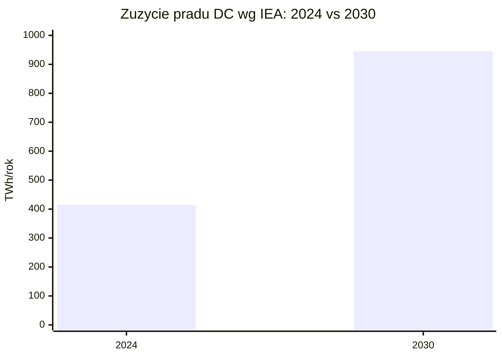
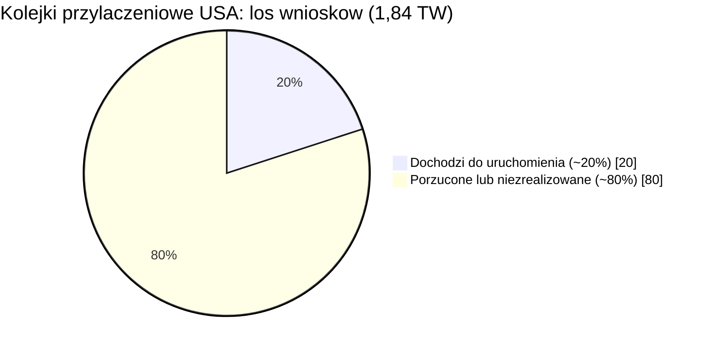
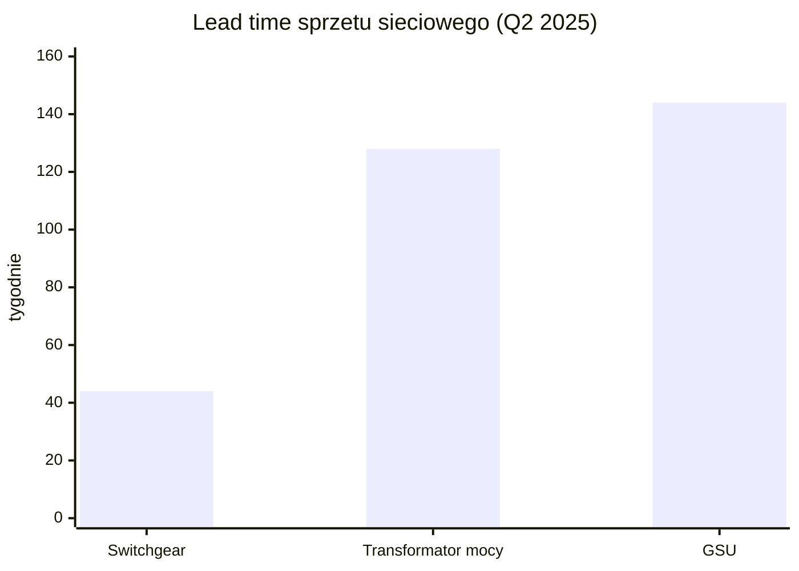
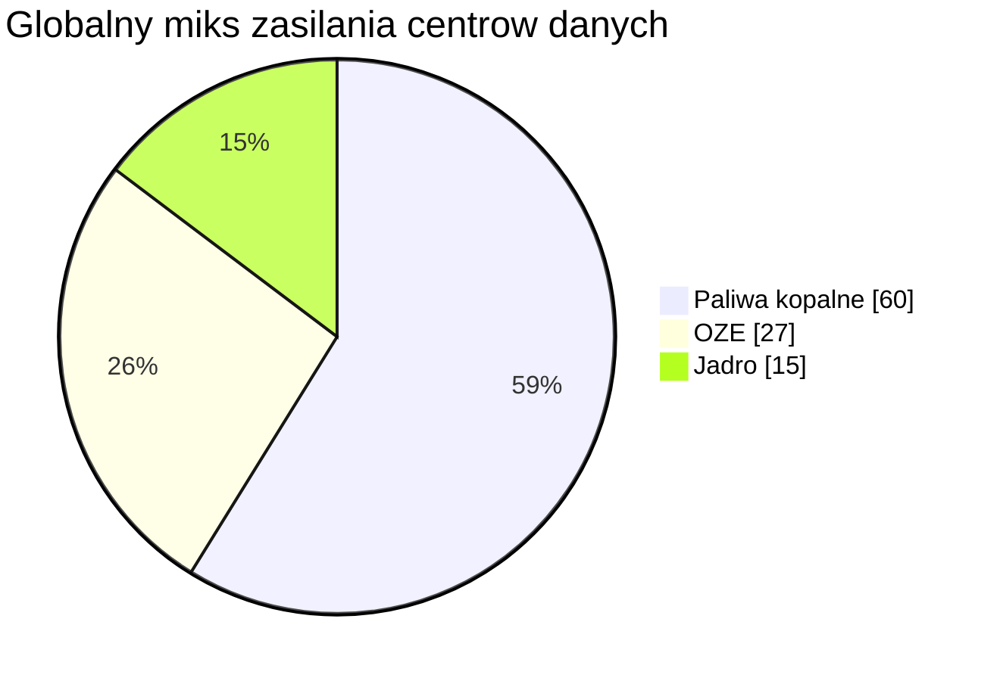

# Naziemny bottleneck energetyczny i sieciowy

> Notatka raportu "Orbitalne centra danych". Kluczowe źródła: [źródło 1](https://www.iea.org/reports/energy-and-ai/energy-demand-from-ai), [źródło 2](https://www.allianz.com/content/dam/onemarketing/azcom/Allianz_com/economic-research/publications/specials/en/2026/may/2026-05-12-ai-energy-AZ.pdf).

## W skrócie

Naziemne centra danych (<abbr title="obiekt z serwerami liczącymi i przechowującymi dane.">DC</abbr>, data center - obiekt z serwerami liczącymi i przechowującymi dane) zderzają się z trzema twardymi ścianami fizycznymi: prądu, sieci przesyłowej i wody. Według IEA zużycie prądu przez DC ma podwoić się z 415 TWh w 2024 r. (1 TWh = miliard kilowatogodzin) do 945 TWh w 2030 r. [źródło](https://www.iea.org/reports/energy-and-ai/energy-demand-from-ai), a w amerykańskich kolejkach przyłączeniowych czeka już 1,84 TW mocy (1 TW = 1000 GW), z czego do uruchomienia dochodzi tylko ~20% [źródło](https://www.allianz.com/content/dam/onemarketing/azcom/Allianz_com/economic-research/publications/specials/en/2026/may/2026-05-12-ai-energy-AZ.pdf). Dla inwestora to wąskie gardło jest jednocześnie zagrożeniem (opóźnienia, kary, kary umowne) i okazją (dostawcy transformatorów, gazu, jądra/SMR oraz - w tezie spekulacyjnej - operatorzy orbity). Tempo zmian jest bardzo szybkie po stronie popytu (ok. 15%/rok), ale powolne po stronie infrastruktury (transformatory 128 tygodni, linie przesyłowe 7-11 lat na samo permitting). Kto kontroluje moc i sprzęt sieciowy, ten dyktuje warunki - reszta czeka w kolejce lub przepłaca.

<!-- spolki:related:start -->
## Spółki powiązane

> Notowane spółki produkujące podzespoły/technologie związane z tym tematem. Pełne omówienie: spółki, dla których nisza to >=33% przychodów; skrótowe: zdywersyfikowane konglomeraty. Zob. też [[Spolki/_slownik]] i [[Spolki/_widok-gpw-eu]].

**Producenci kluczowi (>=33% przychodów z niszy - omówienie pełne):**
- [[Spolki/bloom-energy|Bloom Energy Corporation (BE)]] - Ogniwa paliwowe SOFC dla centrów danych
- [[Spolki/ge-vernova|GE Vernova Inc. (GEV)]] - Turbiny gazowe i infrastruktura sieciowa dla DC
- [[Spolki/vertiv|Vertiv Holdings Co (VRT)]] - Zasilanie i precyzyjne/cieczowe chłodzenie DC
- [[Spolki/constellation-energy|Constellation Energy Corporation (CEG)]] - Największy operator floty jądrowej w USA (PPA z hyperskalerami)
- [[Spolki/oklo|Oklo Inc. (OKLO)]] - Mikroreaktory (SMR/fission) na potrzeby DC
- [[Spolki/talen-energy|Talen Energy Corporation (TLN)]] - Energia jądrowa (Susquehanna), sąsiedztwo z DC
- [[Spolki/siemens-energy|Siemens Energy AG (ENR)]] 🇪🇺 - Turbiny gazowe i technologie sieciowe (EU)

**Pozostali dominujący gracze (nisza to ułamek przychodów - omówienie skrótowe):**
- [[Spolki/eaton|Eaton Corporation plc (ETN)]] - Zasilanie DC (UPS, switchgear) + chłodzenie (Boyd Thermal)
- [[Spolki/schneider-electric|Schneider Electric SE (SU)]] 🇪🇺 - Zasilanie i chłodzenie DC (EcoStruxure, Motivair)
<!-- spolki:related:end -->

<!-- network:watki:start -->
## Powiązane wątki

> Mapa powiązań tematycznych - jak ten wątek łączy się z resztą raportu.

- [[01 - wprowadzenie-definicje-i-architektury|Wprowadzenie i architektury]] - to jest popytowa motywacja całej dziedziny ODC
- [[04 - energetyka-kosmiczna-i-fotowoltaika-orbitalna|Energetyka kosmiczna]] - orbita ma omijać niedobór mocy i kolejki przyłączeniowe
- [[09 - ekonomika-i-koszty-calkowite-tco|Ekonomika i TCO]] - koszt naziemnego DC to benchmark dla wariantu orbitalnego
- [[13 - sentyment-spoleczny-i-moratoria-na-centra-danych|Sentyment i moratoria]] - protesty i moratoria pogłębiają naziemne wąskie gardła
- [[14 - zrownowazony-rozwoj-i-srodowisko|Środowisko]] - woda chłodząca i grunt jako lokalne ograniczenia środowiskowe
<!-- network:watki:end -->
## Zapotrzebowanie DC na moc i prognozy AI compute

Punktem odniesienia jest raport IEA "Energy and AI". 🔵 IEA podaje, że dziś DC zużywają ok. 415 TWh/rok, czyli ok. 1,5% globalnego zużycia prądu w 2024 r. [źródło](https://www.iea.org/reports/energy-and-ai/energy-demand-from-ai). W scenariuszu bazowym ma to wzrosnąć do ok. 945 TWh do 2030 r., tj. niespełna 3% globalnego zużycia [źródło](https://www.iea.org/reports/energy-and-ai/energy-demand-from-ai). 🔵 Wzrost wynosi ok. 15%/rok w latach 2024-2030 - ponad czterokrotnie szybciej niż całe pozostałe zużycie prądu - po tym jak przez ostatnie pięć lat rósł 12%/rok [źródło](https://www.iea.org/reports/energy-and-ai/energy-demand-from-ai). Motorem jest AI: 🔵 zużycie przez "accelerated servers" (serwery z akceleratorami, czyli kartami GPU/ASIC do uczenia maszynowego) ma rosnąć 30%/rok, podczas gdy serwery konwencjonalne tylko 9%/rok, a accelerated servers odpowiadają za prawie połowę przyrostu netto zużycia DC [źródło](https://www.iea.org/reports/energy-and-ai/energy-demand-from-ai). Implikacja dla inwestora: popyt na moc jest napędzany jednym czynnikiem (<abbr title="moc obliczeniowa serwerów z akceleratorami (GPU/ASIC) używana do uczenia maszynowego.">AI compute</abbr>), więc cała teza opiera się na trwałości boomu AI.

*Rys. 63 - Zużycie prądu przez centra danych podwaja się z 415 TWh (2024) do 945 TWh (2030) w scenariuszu bazowym IEA. Dane: IEA - Energy and AI.*

![[assets/y11-1-arc-2012-acd12-0020-006.jpg]]
*Rys. 64 - Naziemne DC: ARC-2012-ACD12-0020-006. Źródło: NASA, licencja: public domain.*
#grafika #naziemny-bottleneck-energetyczny-i-sieciowy #dc-naziemne #compute

![[assets/y11-2-gsfc-20171208-archive-e001019.jpg]]
*Rys. 65 - Naziemne DC: New NASA 3D Animation Shows Seven Days of Simulated Earth Weather. Źródło: NASA, licencja: public domain.*
#grafika #naziemny-bottleneck-energetyczny-i-sieciowy #dc-naziemne #compute

Inne źródła idą dalej. 🔵 Dokument regulacyjny SpaceX złożony do FCC (amerykański regulator telekomunikacji) prognozuje ponad podwojenie globalnego popytu DC do 2035 r. - do ok. 1200-1700 TWh, do 4% światowego zużycia [źródło](https://cdn.geekwire.com/wp-content/uploads/2026/01/SpaceX-Center.pdf). 🟠 Analiza Introl podaje ścieżkę 460 TWh (2024) -> 1000 TWh (2030) -> 1300 TWh (2035) [źródło](https://introl.com/blog/nuclear-power-ai-data-centers-microsoft-google-amazon-2025), a 🟠 Luminix - 700 TWh w 2025 r. rosnące do 3500 TWh w 2050 r. [źródło](https://www.useluminix.com/reports/equity-analysis/company-analysis-nano-nuclear-energy-nne-micro-reactors-for-the-ai-data-center-era/source/1). Rozrzut prognoz (od 945 TWh do 1700 TWh na 2030/2035) sam w sobie jest ryzykiem - inwestor nie powinien traktować żadnej liczby jako pewnika.

Kluczowa asymetria czasowa: 🔵 IEA wskazuje, że DC można uruchomić w 2-3 lata, ale szerszy system energetyczny wymaga dłuższych terminów na planowanie i budowę [źródło](https://www.iea.org/reports/energy-and-ai/energy-demand-from-ai). To źródło całego bottlenecku - moc obliczeniowa rośnie szybciej niż infrastruktura, która ją zasili.

### Hyperscaler PPA / kontrakty mocy

<abbr title="długoterminowa umowa zakupu energii bezpośrednio od producenta.">PPA</abbr> (Power Purchase Agreement - długoterminowa umowa zakupu energii bezpośrednio od producenta) to główne narzędzie hyperscalerów (operatorów chmury skali globalnej) do zabezpieczania mocy. 🟠 Microsoft ma zakontraktowane ~10 500 MW, Amazon (AWS) ~8000+ MW, Google ~6000 MW OZE + 500 MW jądra do 2030 r., a Meta wystawiła zapytanie (RFP) na 1-4 GW jądra [źródło](https://www.lambdafin.com/articles/nuclear-vs-natural-gas-ai-datacenters). 🟠 Według innego zestawienia Microsoft prześcignął Amazon jako największy nabywca czystej energii z 40 GW zakontraktowanymi pod koniec 2025 r. [źródło](https://ibinterviewquestions.com/guides/energy-investment-banking/data-center-power-boom-ai-demand-hyperscaler), a AWS ma >20 GW OZE [źródło](https://enkiai.com/ai-market-intelligence/data-center-energy-top-operators/). Skala zakupów jest tak duża, że zmienia rynek: 🟠 w 2024 r. Big Tech odpowiadał za 43% wszystkich kontraktów PPA na czystą energię na świecie, a ceny PPA wzrosły o 35% w samym 2024 r., głównie przez zakupy hyperscalerów [źródło](https://www.greenfueljournal.com/post/ai-data-center-energy-demand-how-its-driving-the-global-renewable-energy-boom-2026). Implikacja: popyt DC podbija ceny energii dla wszystkich - to ryzyko regulacyjne i reputacyjne, bo rosną rachunki gospodarstw domowych. Świeże transakcje: 🟠 Google podpisał z Clearway trzy 20-letnie PPA na 1,17 GW [źródło](https://enkiai.com/ai-market-intelligence/data-center-energy-top-operators/) oraz z TotalEnergies na 1 GW solaru w Teksasie [źródło](https://enkiai.com/ai-market-intelligence/data-center-energy-top-operators/).

## Kolejki przyłączeniowe i ograniczenia sieci

<abbr title="lista projektów czekających na zgodę operatora sieci na podłączenie do sieci.">Interconnection queue</abbr> (kolejka przyłączeniowa) to lista projektów czekających na zgodę operatora sieci na podłączenie - i to tu boom najpierw się dławi. 🟠 W kolejkach amerykańskich ISO (Independent System Operator - niezależny operator systemu przesyłowego) czeka ponad 2600 GW mocy wytwórczej i magazynowej, a mediana czasu od wejścia do kolejki do uruchomienia komercyjnego wydłużyła się do ok. 5 lat [źródło](https://www.lambdafin.com/articles/nuclear-vs-natural-gas-ai-datacenters). 🟠 Allianz Research podaje, że aktywne wnioski o przyłączenie sięgają 1,84 TW - więcej niż cała zainstalowana moc wytwórcza USA - przy czym tylko ~20% wniosków dochodzi do uruchomienia, reszta jest porzucana przez spekulację, rosnące koszty i opóźnienia [źródło](https://www.allianz.com/content/dam/onemarketing/azcom/Allianz_com/economic-research/publications/specials/en/2026/may/2026-05-12-ai-energy-AZ.pdf). 🟠 W hotspotach jak Northern Virginia czas oczekiwania sięga 7 lat [źródło](https://www.allianz.com/content/dam/onemarketing/azcom/Allianz_com/economic-research/publications/specials/en/2026/may/2026-05-12-ai-energy-AZ.pdf). Implikacja: deklarowane GW w kolejkach to mocno zawyżona miara - inwestor powinien dyskontować je o ~80%.

*Rys. 66 - Z 1,84 TW aktywnych wniosków o przyłączenie w USA tylko ok. 20% dochodzi do uruchomienia komercyjnego, reszta jest porzucana. Dane: Allianz Research - AI energy.*

Skala niezbędnej rozbudowy sieci jest historycznie bezprecedensowa. 🟠 DOE (Departament Energii USA) szacuje, że do 2050 r. system przesyłowy musi urosnąć 2,1-2,6x w scenariuszu najtańszym i do 3,3x w scenariuszu wysokiego popytu [źródło](https://www.allianz.com/content/dam/onemarketing/azcom/Allianz_com/economic-research/publications/specials/en/2026/may/2026-05-12-ai-energy-AZ.pdf). 🟠 To oznaczałoby budowę ok. 8000 km linii wysokiego napięcia rocznie, podczas gdy ostatnio tempo wynosiło znacznie poniżej 1000 km rocznie [źródło](https://www.allianz.com/content/dam/onemarketing/azcom/Allianz_com/economic-research/publications/specials/en/2026/may/2026-05-12-ai-energy-AZ.pdf). Realny dystans między potrzebą a tempem to ośmiokrotność - to jest sedno strukturalnego argumentu.

Teksas jest skrajnym przykładem. 🟠 ERCOT (operator sieci Teksasu) śledzi ~410 GW wniosków o przyłączenie dużych odbiorców, z czego ~87% to centra danych, co stanowi 60-krotny wzrost w pięć lat (z ~6,7 GW w 2025 do ~410 GW w 2030) [źródło](https://www.keentelengineering.com/ercot-interconnection-surge-ai-load). 🟠 Historyczna skuteczność jest niska: spośród mocy, która złożyła wnioski w latach 2000-2019, tylko 13% osiągnęło uruchomienie komercyjne do końca 2024 r. [źródło](https://www.hanwhadatacenters.com/blog/data-center-grid-limitations-the-power-bottleneck/). 🟠 IEA szacuje, że ograniczenia sieci mogą opóźnić ok. 20% globalnej mocy DC planowanej do 2030 r. [źródło](https://albertalawreview.com/index.php/ALR/article/download/2877/2810/3259). Implikacja: jedna piąta planowanych projektów ma wbudowane ryzyko poślizgu - to bezpośrednie ryzyko dla wycen operatorów DC opartych na pełnym pipeline.

## Brak transformatorów i switchgear: lead times

<abbr title="urządzenie zmieniające napięcie między siecią a obiektem (GSU to transformator podwyższający napięcie z generatora).">Transformator</abbr> (urządzenie zmieniające napięcie między siecią a obiektem) i switchgear (rozdzielnica - aparatura łączeniowo-zabezpieczająca) to fizyczne komponenty, których brakuje. 🟠 POWER magazine (za Wood Mackenzie) podaje, że popyt na transformatory mocy wzrósł o 119% od 2019 r., na transformatory rozdzielcze o 34%, na GSU (generator step-up units - transformatory podwyższające napięcie z generatora) aż o 274%, a na transformatory stacyjne o 116% [źródło](https://www.powermag.com/transformers-in-2026-shortage-scramble-or-self-inflicted-crisis/). 🟠 Skutkiem jest deficyt rzędu 30% dla transformatorów mocy i 10% dla rozdzielczych [źródło](https://www.powermag.com/transformers-in-2026-shortage-scramble-or-self-inflicted-crisis/). <abbr title="czas od złożenia zamówienia do dostawy komponentu.">Lead time</abbr> (czas od zamówienia do dostawy) jest dramatyczny: 🟠 transformatory mocy ok. 128 tygodni (ok. 2,5 roku), GSU 144 tygodnie, switchgear 44 tygodnie w II kw. 2025 r. [źródło](https://www.powermag.com/transformers-in-2026-shortage-scramble-or-self-inflicted-crisis/). 🟠 Ceny jednostkowe wzrosły o 77% dla transformatorów mocy i 45% dla GSU [źródło](https://www.powermag.com/transformers-in-2026-shortage-scramble-or-self-inflicted-crisis/). Implikacja: dla DC transformator potrafi zdominować harmonogram - 🟠 przy lead time 24-48 miesięcy "może zdominować cały harmonogram" projektu [źródło](https://build.inc/insights/data-center-transformer-procurement-2026).

*Rys. 67 - Czas od zamówienia do dostawy: switchgear 44 tygodnie, transformatory mocy 128 tygodni, GSU 144 tygodnie. Dane: POWER magazine (za Wood Mackenzie).*

Problem jest strukturalny i pogłębiony przez starzejący się park. 🟠 Ok. 55% transformatorów rozdzielczych w użyciu ma ponad 33 lata, a ok. 40 milionów sztuk jest już po przewidywanym okresie żywotności [źródło](https://www.powermag.com/transformers-in-2026-shortage-scramble-or-self-inflicted-crisis/). 🟠 Tylko 20% dużych transformatorów jest produkowanych w USA krajowo, a lead time sięga 3 lat [źródło](https://northfieldtransformers.com/blog/data-center-expansion-reshaping-transformer-demand/). Sytuacja różni się regionalnie: 🟠 w Europie lead time LPT (large power transformer) wynosi 48-60 miesięcy, a w APAC ok. 12 miesięcy [źródło](https://berlin.cwiemeevents.com/articles/new-normal-component-suppliers). Implikacja: lokalizacja DC zaczyna zależeć od dostępności sprzętu sieciowego, nie tylko od taniej energii - to przewaga rynków azjatyckich.

## Woda chłodząca: zużycie, spory lokalne, susze

Chłodzenie to ukryty koszt DC. 🔵 Według preprintu arXiv/IEEE ok. 58% prądu zużywanego przez naziemne DC idzie na systemy chłodzenia, a nie na samo liczenie [źródło](https://arxiv.org/html/2605.12681v1). To właśnie ta liczba jest głównym argumentem zwolenników orbity (próżnia chłodzi pasywnie). Zużycie wody jest duże: 🟠 typowe DC o mocy 100 MW może zużywać do 2 milionów litrów wody dziennie, tyle co 6500 gospodarstw domowych [źródło](https://energy.policyplatform.news/environment/growth-data-centers-water-worries-persist). 🟠 HARC szacuje 793 galony wody na MWh, co daje ok. 49 mld galonów rocznie do końca 2025 r. i do 399 mld galonów rocznie do 2030 r. w samym Teksasie (ok. 6,6% zużycia wody w stanie) [źródło](https://www.nixonpeabody.com/insights/articles/2025/09/05/water-use-in-us-data-centers-legal-and-regulatory-risks). Implikacja: woda to rosnące ryzyko regulacyjne i konfliktowe, bo dotyka lokalnych społeczności bezpośrednio.

Lokalizacja pogarsza problem. 🟠 Ponad dwie trzecie nowych DC zbudowanych od 2022 r. powstaje na obszarach dotkniętych suszą [źródło](https://energy.policyplatform.news/environment/growth-data-centers-water-worries-persist). Pojawiają się limity i spory: 🟠 w Chandler (Arizona) zużycie wody przez DC jest ograniczone do 115 galonów dziennie na 1000 stóp kwadratowych [źródło](https://energy.policyplatform.news/environment/growth-data-centers-water-worries-persist), a kompleks Project Blue w Tucson ma zużywać do 2000 acre-feet rocznie (ok. 6% zasobów wody odzyskiwanej Tucson Water) [źródło](https://energy.policyplatform.news/environment/growth-data-centers-water-worries-persist). Konkretny przykład Mety: 🟠 kampus Eagle Mountain w Utah pobrał ponad 35 mln galonów w 2024 r. - ponad dwukrotnie więcej niż w 2021 r. - i zużył ponad 1 mln MWh prądu, prawie pięć razy więcej niż trzy lata wcześniej [źródło](https://greatsaltlakenews.org/latest-news/salt-lake-tribune/can-utah-become-a-data-center-hub-without-draining-its-water-supply). Implikacja: konflikty o wodę mogą blokować lub opóźniać projekty w najbardziej atrakcyjnych (tanich, słonecznych) lokalizacjach.

Punktem odniesienia "zero wody" jest Microsoft Project Natick (eksperyment z podwodnym DC): 🔵 osiągnął WUE (Water Usage Effectiveness - efektywność wykorzystania wody) równe dokładnie 0, wobec naziemnych DC zużywających do 4,8 litra wody na kWh [źródło](https://natick.research.microsoft.com/). Implikacja: rozwiązania bezwodne (podwodne, orbitalne) mają realną przewagę środowiskową - ale Natick wciąż jest na etapie badań.

## Energia: baseload, powrót do gazu/jądra, SMR dla DC

<abbr title="stałe, niezależne od pogody zasilanie, którego potrzebuje AI.">Baseload</abbr> (moc podstawowa - stałe, niezależne od pogody zasilanie) jest tym, czego AI potrzebuje, a OZE same go nie dają. 🟠 Globalny miks zasilania DC to nadal prawie 60% paliwa kopalne, 27% OZE i 15% jądro [źródło](https://aimultiple.com/ai-energy-consumption), przy czym 🟠 koszty energii to 40-60% kosztów operacyjnych DC AI [źródło](https://www.meta-intelligence.tech/en/insight-ai-energy). Implikacja: energia jest dominującą pozycją kosztową - każda przewaga w cenie/MWh wprost przekłada się na marżę.

*Rys. 68 - Miks zasilania DC pozostaje zdominowany przez paliwa kopalne (ok. 60%), OZE ok. 27%, jądro ok. 15%. Dane: AIMultiple - AI energy consumption.*

Gaz ziemny wraca jako szybkie źródło baseload. 🟠 Gaz dostarcza 40%+ prądu DC i kosztuje ok. 1290 USD/kW mocy wobec 6417-12681 USD/kW dla jądra [źródło](https://introl.com/blog/nuclear-power-ai-data-centers-microsoft-google-amazon-2025). Ale i tu jest wąskie gardło: 🟠 deweloperzy stawiający na gaz jako prime power mierzą się z 7-letnimi zaległościami w dostawach turbin na niektórych rynkach [źródło](https://www.adlittle.com/en/insights/viewpoints/data-centers-go-orbital). Talen Energy ilustruje skalę: 🟠 wygenerował 40 TWh w 2025 r. (+10% r/r) i zintegrował 2,8 GW efektywnych <abbr title="blok gazowo-parowy o wysokiej sprawności.">CCGT</abbr> (combined-cycle gas turbine - blok gazowo-parowy) [źródło](https://intellectia.ai/stock/TLN/earnings/transcript-FY2025Q4-2026-02-26).

Jądro i <abbr title="mały reaktor modułowy o mocy 10-300 MW.">SMR</abbr> (Small Modular Reactor - mały reaktor modułowy, 10-300 MW) to długoterminowy zakład hyperscalerów. 🟠 Microsoft zakontraktował restart Three Mile Island (835-837 MW) przez Constellation za ok. 1,6 mld USD na 20 lat (uruchomienie ok. 2028) [źródło](https://plisio.net/stocks/oklo); 🟠 Google podpisał 500 MW SMR z Kairos Power w październiku 2024 r. [źródło](https://introl.com/blog/nuclear-power-ai-data-centers-microsoft-google-amazon-2025); 🟠 AWS przejął 960 MW DC zasilane z elektrowni Susquehanna od Talen Energy [źródło](https://www.datacenterdynamics.com/en/analysis/nuclear-power-smr-us/), a Amazon zainwestował 500 mln USD w X-energy (320 MW startowo, do 960 MW) [źródło](https://www.useluminix.com/reports/equity-analysis/company-analysis-nano-nuclear-energy-nne-micro-reactors-for-the-ai-data-center-era/source/1). Skala niedoboru jest jednak ogromna: 🟠 Goldman Sachs prognozuje potrzebę 85-90 GW nowego jądra do 2030 r., z czego globalnie dostępne jest mniej niż 10% [źródło](https://introl.com/blog/nuclear-power-ai-data-centers-microsoft-google-amazon-2025). 🟠 Pipeline SMR urósł do 47 GW (Q1 2025, +42%), z DC odpowiadającymi za 39% [źródło](https://www.useluminix.com/reports/equity-analysis/company-analysis-nano-nuclear-energy-nne-micro-reactors-for-the-ai-data-center-era/source/1), a warunkowe umowy odbioru z SMR urosły z 25 GW (koniec 2024) do 45 GW [źródło](https://stefanus.ai/hyperscaler-capital-expenditure-the-infrastructure-arms-race-behind-the-ai-economy-2026-2030/). Kluczowy haczyk czasowy: 🟠 komercyjne wdrożenie SMR nie jest spodziewane przed 2030-2032 [źródło](https://marketintelo.com/report/ai-data-center-power-infrastructure-market). Implikacja dla inwestora: SMR to opcja na drugą połowę dekady, nie rozwiązanie dzisiejszego deficytu - rynek SMR dla DC wyceniany jest na 6,8 mld USD (2025) z prognozą 40,2 mld USD do 2034 r. (CAGR 22,3%) [źródło](https://marketintelo.com/report/nuclear-small-modular-reactor-smr-for-data-center-power-market).

## Ziemia, lokalizacja, czas budowy (permitting) jako bottleneck

<abbr title="proces uzyskiwania pozwoleń administracyjnych na budowę.">Permitting</abbr> (uzyskiwanie pozwoleń administracyjnych) to często najwolniejszy element. 🟠 Bessemer (BVP) podaje, że między marcem 2024 a 2025 r. 16 projektów DC zostało opóźnionych lub odrzuconych z powodu ograniczeń pozwoleń, McKinsey szacuje ponad 5 mld USD rocznie na samo skomplikowane permitting infrastrukturalne, a ponad 1,5 biliona USD kapitału infrastrukturalnego "tkwi" w pipeline pozwoleń [źródło](https://www.bvp.com/atlas/roadmap-the-ai-data-center-stack). 🟠 W rynkach jak Northern Virginia, Dublin czy Singapur proces ciągnie się 2-3 lata [źródło](https://www.datacenters.com/news/data-center-construction-in-2025-permitting-power-and-pitfalls-to-avoid), a 🟠 budowa regionalnych linii przesyłowych zajmuje 7-11 lat na samo permitting [źródło](https://www.hanwhadatacenters.com/blog/data-center-grid-limitations-the-power-bottleneck/). Implikacja: czas-do-rynku jest mierzony w latach - to premiuje graczy z już zabezpieczonymi działkami i przyłączami.

Całkowity czas budowy DC jest długi, ale skracalny. 🟠 Tradycyjna budowa to 24-48 miesięcy od greenfield do uruchomienia [źródło](https://researchintelo.com/report/ai-hyperscale-data-center-infrastructure-market), a rozwiązania prefabrykowane potrafią skompresować to do 12-18 miesięcy [źródło](https://researchintelo.com/report/ai-hyperscale-data-center-infrastructure-market). Skala kapitału jest astronomiczna: 🟠 w 2024 r. Amazon, Microsoft, Google i Meta wydały łącznie ponad 200 mld USD capex (+62% r/r), a w 2026 r. capex hyperscalerów ma przekroczyć 600 mld USD, z czego ok. 75% (ok. 450 mld USD) bezpośrednio na infrastrukturę AI [źródło](https://ibinterviewquestions.com/guides/energy-investment-banking/data-center-power-boom-ai-demand-hyperscaler). 🟠 Na koniec 2025 r. globalny pipeline DC przekroczył 241 GW (+159% od początku roku) [źródło](https://ibinterviewquestions.com/guides/energy-investment-banking/data-center-power-boom-ai-demand-hyperscaler). 🟠 DC Byte zauważa, że w 2024 r. popyt na moc wzrósł o 30%, ale tempo nowej budowy już za nim nie nadąża, a użytkownicy rezerwują przestrzeń 3-4 lata z wyprzedzeniem [źródło](https://www.dcbyte.com/news-blogs/global-data-centre-gridlock/). Implikacja: rynek jest "pre-leased" na lata naprzód - dobre dla przychodów operatorów, ale sygnalizuje, że podaż jest realnym ograniczeniem.

## Kontrowersje

**A. Czy ziemski bottleneck jest strukturalny czy przejściowy?**

To kluczowe pytanie dla całej tezy orbitalnej - jeśli bottleneck jest przejściowy, droga orbita traci sens.

Strona "strukturalny": 🟠 budowa linii przesyłowych to 7-11 lat na permitting [źródło](https://www.hanwhadatacenters.com/blog/data-center-grid-limitations-the-power-bottleneck/), 🟠 lead time transformatorów 128 tygodni [źródło](https://www.powermag.com/transformers-in-2026-shortage-scramble-or-self-inflicted-crisis/), 🟠 tylko 13% historycznych wniosków doszło do uruchomienia [źródło](https://www.hanwhadatacenters.com/blog/data-center-grid-limitations-the-power-bottleneck/), a 🟠 DC Byte wprost: "To nie cykl rynkowy. To ograniczenie strukturalne" [źródło](https://www.dcbyte.com/news-blogs/global-data-centre-gridlock/).

Strona "przejściowy": 🟠 lead time transformatorów mocy w II kw. spadł o 10 tygodni (do średnio 128 tygodni) [źródło](https://www.woodmac.com/news/opinion/mind-the-gap-tackling-supply-chain-challenges-in-the-electric-td-sector/), 🟠 ogłoszono prawie 1,8 mld USD ekspansji produkcji w Ameryce Północnej [źródło](https://www.powermag.com/transformers-in-2026-shortage-scramble-or-self-inflicted-crisis/), 🟠 ERCOT przechodzi na Batch Study Framework skracający cykle restudy [źródło](https://www.keentelengineering.com/ercot-interconnection-surge-ai-load), 🟠 najostrzejszy niedobór ma się utrzymać "tylko" do 2028-2029, gdy nowa moc i przesył wejdą do eksploatacji [źródło](https://www.hanwhadatacenters.com/blog/data-center-grid-limitations-the-power-bottleneck/), a 🟠 niektórzy brokerzy twierdzą, że "nie ma realnego niedoboru", a kryzys wynika z błędów zakupowych [źródło](https://www.powermag.com/transformers-in-2026-shortage-scramble-or-self-inflicted-crisis/). Nie ma konsensusu - obie strony cytują tę samą liczbę 128 tygodni, różniąc się jej interpretacją (trend rosnący vs. spadek o 10 tygodni).

**B. Czy orbita rozwiązuje bottleneck, czy przenosi go w downlink i infrastrukturę naziemną?**

Strona "orbita rozwiązuje": 🔵 w orbitach słonecznosynchronicznych panele odbierają słońce do ponad 99% czasu [źródło](https://cdn.geekwire.com/wp-content/uploads/2026/01/SpaceX-Center.pdf); 🔵 chłodzenie radiacyjne w próżni jest pasywne i bezwodne [źródło](https://cdn.geekwire.com/wp-content/uploads/2026/01/SpaceX-Center.pdf), co omija 58% energii naziemnej idącej na chłodzenie [źródło](https://arxiv.org/html/2605.12681v1); 🔵 SpaceX twierdzi, że 1 mln ton satelitów rocznie (100 kW compute/tonę) dodawałby 100 GW mocy AI rocznie [źródło](https://cdn.geekwire.com/wp-content/uploads/2026/01/SpaceX-Center.pdf); 🟠 wg Fierce satelitarne DC mają działać przy 10x niższych kosztach energii [źródło](https://www.fierce-network.com/cloud/space-data-centers-starcloud-spacex-and-project-suncatcher-explained).

Strona "orbita przenosi bottleneck": 🔵 sieci naziemnych DC osiągają ok. 200 Tb/s na blok agregacji, a łącza ground-satellite tylko dziesiątki-setki Gb/s [źródło](https://arxiv.org/html/2605.12681v1) - przepaść 3-4 rzędów wielkości w downlinku; 🟠 koszt orbity to 51,10 USD/W vs 15,85 USD/W naziemnie i <abbr title="uśredniony koszt wytworzenia jednostki energii w całym cyklu życia instalacji (USD/MWh).">LCOE</abbr> 1167 USD/MWh vs 426 USD/MWh [źródło](https://andrewmccalip.com/space-datacenters); 🔵 NASA OTPS ocenia, że LCOE energii kosmicznej jest 12-31x wyższe niż projekcje naziemne na 2050 r. [źródło](https://www.nasa.gov/wp-content/uploads/2024/01/otps-sbsp-report-final-tagged-approved-1-8-24-tagged-v2.pdf), a launch to 71-77% kosztów [źródło](https://www.nasa.gov/wp-content/uploads/2024/01/otps-sbsp-report-final-tagged-approved-1-8-24-tagged-v2.pdf); 🔵 dostarczenie masy wymaga 2321-3960 startów [źródło](https://www.nasa.gov/wp-content/uploads/2024/01/otps-sbsp-report-final-tagged-approved-1-8-24-tagged-v2.pdf). Wniosek: orbita eliminuje wodę i kolejki przyłączeniowe, ale tworzy nowy bottleneck w przepustowości downlinku i koszcie startów - to nie zniknięcie, lecz przesunięcie problemu.

**C. Czy Microsoft Project Natick udowadnia przewagę alternatyw naziemnych?**

🔵 Natick osiągnął awaryjność serwerów 1/8 grupy kontrolnej na lądzie, PUE 1,07, WUE 0, wdrożenie w <90 dni, przy 240 kW mocy i 864 serwerach [źródło](https://natick.research.microsoft.com/). To pokazuje, że bezwodne, szybko wdrażalne DC są możliwe bez wychodzenia na orbitę. Jednak 🔵 Microsoft sam zaznacza, że "Project Natick jest na etapie badań" i wciąż jest za wcześnie, by ocenić adopcję komercyjną [źródło](https://natick.research.microsoft.com/). Brak potwierdzonych rozbieżności liczbowych - jedyne źródło to oficjalny blog Microsoft, więc kontrowersja dotyczy interpretacji (Natick jako dowód alternatyw vs. wciąż eksperyment), nie sprzecznych danych.

## Słowniczek pojęć

- **DC (data center)** - obiekt z serwerami liczącymi i przechowującymi dane.
- **TWh / GW / TW** - jednostki energii i mocy: 1 TWh to miliard kilowatogodzin, 1 TW to 1000 GW.
- **AI compute** - moc obliczeniowa serwerów z akceleratorami (GPU/ASIC) używana do uczenia maszynowego.
- **Hyperscaler** - operator chmury skali globalnej (np. Microsoft, Amazon, Google, Meta).
- **PPA (Power Purchase Agreement)** - długoterminowa umowa zakupu energii bezpośrednio od producenta.
- **Interconnection queue (kolejka przyłączeniowa)** - lista projektów czekających na zgodę operatora sieci na podłączenie do sieci.
- **ISO / ERCOT** - niezależny operator systemu przesyłowego; ERCOT to operator sieci Teksasu.
- **Transformator** - urządzenie zmieniające napięcie między siecią a obiektem (GSU to transformator podwyższający napięcie z generatora).
- **Switchgear (rozdzielnica)** - aparatura łączeniowo-zabezpieczająca w stacji elektroenergetycznej.
- **Lead time** - czas od złożenia zamówienia do dostawy komponentu.
- **Permitting** - proces uzyskiwania pozwoleń administracyjnych na budowę.
- **PUE / WUE** - efektywność wykorzystania energii (PUE) i wody (WUE) przez centrum danych; im bliżej 1 (PUE) lub 0 (WUE), tym lepiej.
- **Baseload (moc podstawowa)** - stałe, niezależne od pogody zasilanie, którego potrzebuje AI.
- **CCGT (combined-cycle gas turbine)** - blok gazowo-parowy o wysokiej sprawności.
- **SMR (Small Modular Reactor)** - mały reaktor modułowy o mocy 10-300 MW.
- **LCOE** - uśredniony koszt wytworzenia jednostki energii w całym cyklu życia instalacji (USD/MWh).
- **Capex** - nakłady inwestycyjne (np. na budowę i wyposażenie centrów danych).

## Źródła

- [IEA - Energy and AI](https://www.iea.org/reports/energy-and-ai/energy-demand-from-ai) 🔵 - prognozy zużycia prądu DC, CAGR, asymetria czasowa.
- [SpaceX FCC filing](https://cdn.geekwire.com/wp-content/uploads/2026/01/SpaceX-Center.pdf) 🔵 - prognoza popytu DC do 2035, parametry konstelacji orbitalnej.
- [arXiv/IEEE - orbital data centers](https://arxiv.org/html/2605.12681v1) 🔵 - 58% energii na chłodzenie, przepustowości ISL i downlink.
- [NASA OTPS - SBSP report](https://www.nasa.gov/wp-content/uploads/2024/01/otps-sbsp-report-final-tagged-approved-1-8-24-tagged-v2.pdf) 🔵 - LCOE kosmos vs naziemnie, koszt launchu.
- [Microsoft Project Natick](https://natick.research.microsoft.com/) 🔵 - WUE 0, PUE 1,07, awaryjność, status badawczy.
- [Allianz Research - AI energy](https://www.allianz.com/content/dam/onemarketing/azcom/Allianz_com/economic-research/publications/specials/en/2026/may/2026-05-12-ai-energy-AZ.pdf) 🟠 - kolejki 1,84 TW, rozbudowa przesyłu DOE.
- [POWER magazine - transformers 2026](https://www.powermag.com/transformers-in-2026-shortage-scramble-or-self-inflicted-crisis/) 🟠 - lead times, deficyty, ceny transformatorów.
- [Lambda Finance - nuclear vs gas](https://www.lambdafin.com/articles/nuclear-vs-natural-gas-ai-datacenters) 🟠 - PPA hyperscalerów, kolejki 2600 GW.
- [Keentel - ERCOT interconnection](https://www.keentelengineering.com/ercot-interconnection-surge-ai-load) 🟠 - 410 GW, 87% DC, 60x wzrost.
- [Hanwha - grid limitations](https://www.hanwhadatacenters.com/blog/data-center-grid-limitations-the-power-bottleneck/) 🟠 - 13% skuteczności, 7-11 lat przesył.
- [Nixon Peabody - water use](https://www.nixonpeabody.com/insights/articles/2025/09/05/water-use-in-us-data-centers-legal-and-regulatory-risks) 🟠 - 793 gal/MWh, Teksas 399 mld gal.
- [Energy Policy Platform - water worries](https://energy.policyplatform.news/environment/growth-data-centers-water-worries-persist) 🟠 - 2 mln l/dzień, susze, limity.
- [Great Salt Lake News - Utah](https://greatsaltlakenews.org/latest-news/salt-lake-tribune/can-utah-become-a-data-center-hub-without-draining-its-water-supply) 🟠 - Meta Eagle Mountain, Novva.
- [Introl - nuclear power AI DC](https://introl.com/blog/nuclear-power-ai-data-centers-microsoft-google-amazon-2025) 🟠 - gaz, jądro, koszty/kW, Goldman 85-90 GW.
- [BVP - AI data center stack](https://www.bvp.com/atlas/roadmap-the-ai-data-center-stack) 🟠 - permitting, 1,5 bln USD w pipeline.
- [DC Byte - gridlock](https://www.dcbyte.com/news-blogs/global-data-centre-gridlock/) 🟠 - "ograniczenie strukturalne", pre-leasing 3-4 lata.
- [Wood Mackenzie - T&D supply chain](https://www.woodmac.com/news/opinion/mind-the-gap-tackling-supply-chain-challenges-in-the-electric-td-sector/) 🟠 - spadek lead time o 10 tygodni.
- [Andrew McCalip - space datacenters](https://andrewmccalip.com/space-datacenters) 🟠 - LCOE orbital vs terrestrial.
- [Microsoft największy nabywca - IB guide](https://ibinterviewquestions.com/guides/energy-investment-banking/data-center-power-boom-ai-demand-hyperscaler) 🟠 - capex, 241 GW pipeline.

## Dane źródłowe

- `415 TWh/rok` | https://www.iea.org/reports/energy-and-ai/energy-demand-from-ai | primary | "Today, electricity consumption from data centres is estimated to amount to around 415 terawatt hours (TWh), or about 1.5% of global electricity consumption in 2024."
- `945 TWh/rok` | https://www.iea.org/reports/energy-and-ai/energy-demand-from-ai | primary | "global electricity consumption for data centres is projected to double to reach around 945 TWh by 2030 in the Base Case, representing just under 3% of total global electricity consumption in 2030."
- `15 %/rok` | https://www.iea.org/reports/energy-and-ai/energy-demand-from-ai | primary | "From 2024 to 2030, data centre electricity consumption grows by around 15% per year, more than four times faster than the growth of total electricity consumption from all other sectors."
- `12 %/rok` | https://www.iea.org/reports/energy-and-ai/energy-demand-from-ai | primary | "It has grown at 12% per year over the last five years."
- `30 %/rok` | https://www.iea.org/reports/energy-and-ai/energy-demand-from-ai | primary | "Electricity consumption in accelerated servers, which is mainly driven by AI adoption, is projected to grow by 30% annually in the Base Case."
- `9 %/rok` | https://www.iea.org/reports/energy-and-ai/energy-demand-from-ai | primary | "conventional server electricity consumption growth is slower at 9% per year"
- `~50 % net increase` | https://www.iea.org/reports/energy-and-ai/energy-demand-from-ai | primary | "Accelerated servers account for almost half of the net increase in global data centre electricity consumption, while conventional servers account for only around 20%."
- `1200-1700 TWh/rok` | https://cdn.geekwire.com/wp-content/uploads/2026/01/SpaceX-Center.pdf | primary | "Global electricity demand for data centers is projected to more than double by 2035 driven by growth in AI - reaching approximately 1,200-1,700 Terawatt hours and accounting for up to 4% of total worldwide electricity consumption."
- `460 TWh/rok` | https://introl.com/blog/nuclear-power-ai-data-centers-microsoft-google-amazon-2025 | secondary | "Current generation global electricity for data centers: 460 TWh (2024) -> 1,000 TWh (2030) -> 1,300 TWh (2035)"
- `700 TWh/rok` | https://www.useluminix.com/reports/equity-analysis/company-analysis-nano-nuclear-energy-nne-micro-reactors-for-the-ai-data-center-era/source/1 | secondary | "Global data center demand hits 700 TWh in 2025, rising to 3,500 TWh by 2050"
- `2-3 lata` | https://www.iea.org/reports/energy-and-ai/energy-demand-from-ai | primary | "a data centre can be operational in two to three years, the broader energy system requires longer lead times to schedule and build infrastructure, which often requires extensive planning, long build times and high upfront investment."
- `~10,500 MW` | https://www.lambdafin.com/articles/nuclear-vs-natural-gas-ai-datacenters | secondary | "Microsoft: ~10,500 MW under contract or PPA"
- `~8,000 MW` | https://www.lambdafin.com/articles/nuclear-vs-natural-gas-ai-datacenters | secondary | "Amazon (AWS): ~8,000+ MW disclosed campuses"
- `~6,000 MW` | https://www.lambdafin.com/articles/nuclear-vs-natural-gas-ai-datacenters | secondary | "Google: ~6,000 MW renewable + 500 MW nuclear by 2030"
- `1-4 GW` | https://www.lambdafin.com/articles/nuclear-vs-natural-gas-ai-datacenters | secondary | "Meta: RFP for 1-4 GW nuclear (Dec 2024)"
- `40 GW` | https://ibinterviewquestions.com/guides/energy-investment-banking/data-center-power-boom-ai-demand-hyperscaler | secondary | "Microsoft has surpassed Amazon as the world's largest clean power buyer, with 40 GW contracted as of late 2025."
- `>20 GW` | https://enkiai.com/ai-market-intelligence/data-center-energy-top-operators/ | secondary | "AWS has established itself as the world's largest corporate buyer of renewable energy, with over 20 GW contracted."
- `43 % global clean PPAs` | https://www.greenfueljournal.com/post/ai-data-center-energy-demand-how-its-driving-the-global-renewable-energy-boom-2026 | secondary | "In 2024, Big Tech companies accounted for 43% of all clean energy PPAs signed globally."
- `35 %` | https://www.greenfueljournal.com/post/ai-data-center-energy-demand-how-its-driving-the-global-renewable-energy-boom-2026 | secondary | "PPA prices rose 35% in 2024 alone, driven almost entirely by hyperscaler procurement."
- `1.17 GW` | https://enkiai.com/ai-market-intelligence/data-center-energy-top-operators/ | secondary | "Google signed a trio of 20-year PPAs with Clearway Energy Group in early 2026 covering 1.17 gigawatts of carbon-free energy projects"
- `1 GW` | https://enkiai.com/ai-market-intelligence/data-center-energy-top-operators/ | secondary | "TotalEnergies signed two PPAs with Google in February 2026 for 1 GW of Texas solar capacity"
- `>2,600 GW` | https://www.lambdafin.com/articles/nuclear-vs-natural-gas-ai-datacenters | secondary | "ISO interconnection queues now contain more than 2,600 GW of pending generation and storage"
- `~5 lat` | https://www.lambdafin.com/articles/nuclear-vs-natural-gas-ai-datacenters | secondary | "median time from queue entry to commercial operation has lengthened to roughly 5 years"
- `1.84 TW` | https://www.allianz.com/content/dam/onemarketing/azcom/Allianz_com/economic-research/publications/specials/en/2026/may/2026-05-12-ai-energy-AZ.pdf | secondary | "nationally active interconnection requests now stand at 1.84 TW, exceeding total US installed generating capacity"
- `~20 %` | https://www.allianz.com/content/dam/onemarketing/azcom/Allianz_com/economic-research/publications/specials/en/2026/may/2026-05-12-ai-energy-AZ.pdf | secondary | "only around 20% of requests ultimately reach commercial operation, with the remainder abandoned due to speculative filings, rising costs and mounting delays"
- `7 lat` | https://www.allianz.com/content/dam/onemarketing/azcom/Allianz_com/economic-research/publications/specials/en/2026/may/2026-05-12-ai-energy-AZ.pdf | secondary | "hotspots like Northern Virginia reporting waiting times of up to seven years"
- `2.1-2.6x` | https://www.allianz.com/content/dam/onemarketing/azcom/Allianz_com/economic-research/publications/specials/en/2026/may/2026-05-12-ai-energy-AZ.pdf | secondary | "DOE estimates that in a lowest-cost scenario the total transmission system would increase by 2.1-2.6 times until 2050 and up to 3.3 times in a high demand case"
- `8,000 km/rok` | https://www.allianz.com/content/dam/onemarketing/azcom/Allianz_com/economic-research/publications/specials/en/2026/may/2026-05-12-ai-energy-AZ.pdf | secondary | "This would imply building around 8000 km of high voltage transmission lines per year, a pace that appears far beyond current construction rates, which have averaged well below 1,000 km annually in recent years."
- `410 GW` | https://www.keentelengineering.com/ercot-interconnection-surge-ai-load | secondary | "ERCOT is tracking: ~410 GW of large load interconnection requests"
- `87 %` | https://www.keentelengineering.com/ercot-interconnection-surge-ai-load | secondary | "~87% are data centers"
- `60x` | https://www.keentelengineering.com/ercot-interconnection-surge-ai-load | secondary | "2025 -> ~6.7 GW; 2030 -> ~410 GW ... This is a 60x increase in just five years."
- `13 %` | https://www.hanwhadatacenters.com/blog/data-center-grid-limitations-the-power-bottleneck/ | secondary | "of all capacity that submitted interconnection requests between 2000 and 2019, only 13% had reached commercial operation by the end of 2024"
- `7-11 lat` | https://www.hanwhadatacenters.com/blog/data-center-grid-limitations-the-power-bottleneck/ | secondary | "Building regional transmission lines currently takes seven to eleven years just for permitting, according to industry analyses."
- `2028-2029 lata` | https://www.hanwhadatacenters.com/blog/data-center-grid-limitations-the-power-bottleneck/ | secondary | "the most acute supply-demand imbalance will persist through at least 2028 or 2029"
- `~20 % capacity delayed` | https://albertalawreview.com/index.php/ALR/article/download/2877/2810/3259 | secondary | "The IEA's analysis suggests that such grid constraints could delay around 20% of the global data centre capacity planned for construction by 2030."
- `119 % wzrostu` | https://www.powermag.com/transformers-in-2026-shortage-scramble-or-self-inflicted-crisis/ | secondary | "power-transformer demand has risen 119% since 2019"
- `34 % wzrostu` | https://www.powermag.com/transformers-in-2026-shortage-scramble-or-self-inflicted-crisis/ | secondary | "distribution-transformer demand is up 34%"
- `274 % wzrostu` | https://www.powermag.com/transformers-in-2026-shortage-scramble-or-self-inflicted-crisis/ | secondary | "demand for generator step-up units has grown 274%"
- `116 % wzrostu` | https://www.powermag.com/transformers-in-2026-shortage-scramble-or-self-inflicted-crisis/ | secondary | "substation power transformers are up 116%"
- `30 % deficyt` | https://www.powermag.com/transformers-in-2026-shortage-scramble-or-self-inflicted-crisis/ | secondary | "estimated 30% shortfall for power transformers and 10% for distribution units across the national fleet"
- `128 tygodni` | https://www.powermag.com/transformers-in-2026-shortage-scramble-or-self-inflicted-crisis/ | secondary | "power transformers averaging 128 weeks"
- `144 tygodni` | https://www.powermag.com/transformers-in-2026-shortage-scramble-or-self-inflicted-crisis/ | secondary | "GSUs 144 weeks in WoodMac's second quarter 2025 survey"
- `77 % wzrostu ceny` | https://www.powermag.com/transformers-in-2026-shortage-scramble-or-self-inflicted-crisis/ | secondary | "unit prices have increased 77% for power transformers and 45% for GSUs"
- `44 tygodni` | https://www.powermag.com/transformers-in-2026-shortage-scramble-or-self-inflicted-crisis/ | secondary | "switchgear averaged 44 weeks in Q2 2025"
- `55 % transformatorow >33 lata` | https://www.powermag.com/transformers-in-2026-shortage-scramble-or-self-inflicted-crisis/ | secondary | "roughly 55% of in-service distribution transformers are more than 33 years old"
- `40 milionow sztuk` | https://www.powermag.com/transformers-in-2026-shortage-scramble-or-self-inflicted-crisis/ | secondary | "more than half of U.S. distribution transformers - roughly 40 million units - are already beyond their expected service life"
- `24-48 miesiecy` | https://build.inc/insights/data-center-transformer-procurement-2026 | secondary | "If a transformer lead time is 24 to 48 months, it can dominate the schedule."
- `2-3 lata (transformatory)` | https://northfieldtransformers.com/blog/data-center-expansion-reshaping-transformer-demand/ | secondary | "lead times for large transformers have increased to up to 3 years, while only 20% of large transformers are manufactured domestically"
- `48-60 miesiecy` | https://berlin.cwiemeevents.com/articles/new-normal-component-suppliers | secondary | "LPT lead times in Europe currently range from 48 to 60 months"
- `12 miesiecy` | https://berlin.cwiemeevents.com/articles/new-normal-component-suppliers | secondary | "APAC ... shortest lead times, averaging around 12 months for LPTs"
- `58 % energii DC` | https://arxiv.org/html/2605.12681v1 | primary | "Approximately 58% of the electricity consumed by ground data center facilities is currently used for cooling systems rather than functional computing."
- `2 mln litrow/dzien` | https://energy.policyplatform.news/environment/growth-data-centers-water-worries-persist | secondary | "a typical 100-megawatt data center can use up to 2 million liters of water daily, roughly equivalent to the consumption of 6,500 households"
- `793 galony/MWh` | https://www.nixonpeabody.com/insights/articles/2025/09/05/water-use-in-us-data-centers-legal-and-regulatory-risks | secondary | "HARC finding that data centers can consume 793 gallons of water on average for every megawatt per hour (MWh)"
- `49 mld galonow/rok` | https://www.nixonpeabody.com/insights/articles/2025/09/05/water-use-in-us-data-centers-legal-and-regulatory-risks | secondary | "resulting in estimated use of 49 billion gallons of water by the end of 2025"
- `399 mld galonow/rok` | https://www.nixonpeabody.com/insights/articles/2025/09/05/water-use-in-us-data-centers-legal-and-regulatory-risks | secondary | "up to 399 billion gallons annually by 2030 or approximately 6.6% of the state's total water use"
- `>2/3 nowych DC` | https://energy.policyplatform.news/environment/growth-data-centers-water-worries-persist | secondary | "over two-thirds of new data centers built since 2022 are in drought-stressed areas"
- `115 galonow/dzien/1000 ft2` | https://energy.policyplatform.news/environment/growth-data-centers-water-worries-persist | secondary | "In Arizona, Chandler caps data center water use at 115 gallons per day per 1,000 square feet"
- `2,000 acre-feet/rok` | https://energy.policyplatform.news/environment/growth-data-centers-water-worries-persist | secondary | "Tucson's draft Project Blue AI complex is projected to consume up to 2,000 acre-feet annually, about 6% of Tucson Water's reclaimed resource capacity"
- `>35 mln galonow/rok` | https://greatsaltlakenews.org/latest-news/salt-lake-tribune/can-utah-become-a-data-center-hub-without-draining-its-water-supply | secondary | "the Eagle Mountain campus withdrew more than 35 million gallons in 2024 - more than double the amount of water it used in 2021"
- `1 mln MWh/rok` | https://greatsaltlakenews.org/latest-news/salt-lake-tribune/can-utah-become-a-data-center-hub-without-draining-its-water-supply | secondary | "It also used more than 1 million megawatt-hours of electricity, nearly five times more energy than it tapped three years before."
- `0 WUE` | https://natick.research.microsoft.com/ | primary | "Natick datacenters consume no water for cooling or any other purpose."
- `4.8 l/kWh` | https://natick.research.microsoft.com/ | primary | "land datacenters which consume up to 4.8 liters of water per kilowatt-hour"
- `60 % miks (kopalne)` | https://aimultiple.com/ai-energy-consumption | secondary | "Power supply mix for data centers (global): Fossil fuels: Nearly 60%"
- `27 % miks (OZE)` | https://aimultiple.com/ai-energy-consumption | secondary | "Renewables: 27%"
- `15 % miks (jadro)` | https://aimultiple.com/ai-energy-consumption | secondary | "Nuclear: 15%"
- `40-60 % OPEX` | https://www.meta-intelligence.tech/en/insight-ai-energy | secondary | "power costs account for 40-60% of total operational costs"
- `40+ % (gaz)` | https://introl.com/blog/nuclear-power-ai-data-centers-microsoft-google-amazon-2025 | secondary | "natural gas provides 40%+"
- `$1,290 /kW (gaz)` | https://introl.com/blog/nuclear-power-ai-data-centers-microsoft-google-amazon-2025 | secondary | "Nuclear costs $6,417-$12,681/kW vs $1,290/kW for natural gas"
- `7 lat (turbiny gazowe)` | https://www.adlittle.com/en/insights/viewpoints/data-centers-go-orbital | secondary | "developers pursuing natural gas prime power are facing turbine procurement backlogs of seven years in some markets"
- `2.8 GW CCGT` | https://intellectia.ai/stock/TLN/earnings/transcript-FY2025Q4-2026-02-26 | secondary | "Acquired and integrated 2.8 gigawatts of efficient CCGTs"
- `40 TWh/rok (Talen)` | https://intellectia.ai/stock/TLN/earnings/transcript-FY2025Q4-2026-02-26 | secondary | "Generated 40 terawatt hours in 2025, a 10% increase from 2024"
- `835 MW` | https://introl.com/blog/nuclear-power-ai-data-centers-microsoft-google-amazon-2025 | secondary | "Microsoft's 20-year, 835MW AI data center PPA"
- `~$1.6 mld USD` | https://plisio.net/stocks/oklo | secondary | "Microsoft announced its Three Mile Island restart through Constellation in September 2024, contracting 835 megawatts for roughly $1.6 billion over twenty years."
- `500 MW (Kairos)` | https://introl.com/blog/nuclear-power-ai-data-centers-microsoft-google-amazon-2025 | secondary | "Google signed a 500 MW SMR power purchase agreement with Kairos Power in October 2024"
- `960 MW (Susquehanna)` | https://www.datacenterdynamics.com/en/analysis/nuclear-power-smr-us/ | secondary | "AWS signed an agreement with Talen Energy to acquire a 960MW data center powered by the Susquehanna nuclear power plant"
- `85-90 GW` | https://introl.com/blog/nuclear-power-ai-data-centers-microsoft-google-amazon-2025 | secondary | "Goldman Sachs forecasts 85-90GW new nuclear needed by 2030; less than 10% available globally"
- `47 GW (pipeline SMR)` | https://www.useluminix.com/reports/equity-analysis/company-analysis-nano-nuclear-energy-nne-micro-reactors-for-the-ai-data-center-era/source/1 | secondary | "Wood Mackenzie: SMR pipeline surges 42% to 47 GW (Q1 2025)"
- `39 % share` | https://www.useluminix.com/reports/equity-analysis/company-analysis-nano-nuclear-energy-nne-micro-reactors-for-the-ai-data-center-era/source/1 | secondary | "data centers now 39% share"
- `45 GW (offtake)` | https://stefanus.ai/hyperscaler-capital-expenditure-the-infrastructure-arms-race-behind-the-ai-economy-2026-2030/ | secondary | "pipeline of conditional power offtake agreements between data center operators and small modular reactor projects had grown from 25 gigawatts at end-2024 to 45 gigawatts"
- `2030-2032 lata` | https://marketintelo.com/report/ai-data-center-power-infrastructure-market | secondary | "commercial SMR deployment is not broadly expected before 2030-2032"
- `$6.8 mld USD` | https://marketintelo.com/report/nuclear-small-modular-reactor-smr-for-data-center-power-market | secondary | "The global nuclear small modular reactor (SMR) for data center power market was valued at $6.8 billion in 2025"
- `$40.2 mld USD` | https://marketintelo.com/report/nuclear-small-modular-reactor-smr-for-data-center-power-market | secondary | "is projected to expand to $40.2 billion by 2034"
- `22.3 % CAGR` | https://marketintelo.com/report/nuclear-small-modular-reactor-smr-for-data-center-power-market | secondary | "advancing at a remarkable compound annual growth rate (CAGR) of 22.3% over the forecast period 2026-2034"
- `$500 mln (X-energy)` | https://www.useluminix.com/reports/equity-analysis/company-analysis-nano-nuclear-energy-nne-micro-reactors-for-the-ai-data-center-era/source/1 | secondary | "Amazon's $500M X-energy investment enables 320 MW initial Xe-100 modules expandable to 960 MW"
- `16 projektow` | https://www.bvp.com/atlas/roadmap-the-ai-data-center-stack | secondary | "Between March 2024 and 2025, 16 data center developments were delayed or denied due to permitting restrictions"
- `$5 mld USD/rok` | https://www.bvp.com/atlas/roadmap-the-ai-data-center-stack | secondary | "McKinsey estimates that over $5 billion is spent annually on complex infrastructure permitting"
- `>$1.5 bln USD` | https://www.bvp.com/atlas/roadmap-the-ai-data-center-stack | secondary | "Over $1.5 trillion of infrastructure capital is currently stuck in the permitting pipeline."
- `2-3 lata (permitting)` | https://www.datacenters.com/news/data-center-construction-in-2025-permitting-power-and-pitfalls-to-avoid | secondary | "in markets like Northern Virginia, Dublin, and Singapore, the process can stretch into two to three years"
- `24-48 miesiecy (budowa)` | https://researchintelo.com/report/ai-hyperscale-data-center-infrastructure-market | secondary | "Traditional data center construction requires 24-48 months from greenfield to operational"
- `12-18 miesiecy (prefab)` | https://researchintelo.com/report/ai-hyperscale-data-center-infrastructure-market | secondary | "prefabricated data hall solutions ... can compress this to 12-18 months"
- `30 % (popyt 2024)` | https://www.dcbyte.com/news-blogs/global-data-centre-gridlock/ | secondary | "In 2024, demand for capacity rose by 30%, but the pace of new construction is no longer keeping up."
- `3-4 lata (pre-lease)` | https://www.dcbyte.com/news-blogs/global-data-centre-gridlock/ | secondary | "In some cases, end users are reserving space three to four years in advance to ensure delivery"
- `>241 GW pipeline` | https://ibinterviewquestions.com/guides/energy-investment-banking/data-center-power-boom-ai-demand-hyperscaler | secondary | "at the end of 2025 over 241 GW of data center capacity in the global development pipeline (a 159% increase from the start of that year)"
- `$200+ mld USD capex` | https://ibinterviewquestions.com/guides/energy-investment-banking/data-center-power-boom-ai-demand-hyperscaler | secondary | "In 2024, Amazon, Microsoft, Google, and Meta collectively spent over $200 billion on capital expenditures, a 62% year-over-year increase"
- `$600+ mld USD capex` | https://ibinterviewquestions.com/guides/energy-investment-banking/data-center-power-boom-ai-demand-hyperscaler | secondary | "Hyperscaler capex is forecast to exceed $600 billion in 2026"
- `75 %` | https://ibinterviewquestions.com/guides/energy-investment-banking/data-center-power-boom-ai-demand-hyperscaler | secondary | "roughly 75% (approximately $450 billion) directly tied to AI infrastructure"
- `10 tygodni (spadek)` | https://www.woodmac.com/news/opinion/mind-the-gap-tackling-supply-chain-challenges-in-the-electric-td-sector/ | secondary | "Power transformer lead times also eased in Q2, falling by 10 weeks to an average of 128 weeks"
- `$1.8 mld USD` | https://www.powermag.com/transformers-in-2026-shortage-scramble-or-self-inflicted-crisis/ | secondary | "nearly $1.8 billion in announced North American manufacturing expansions"
- `>99 % czasu slonca` | https://cdn.geekwire.com/wp-content/uploads/2026/01/SpaceX-Center.pdf | primary | "up to more than 99% of the time for high-altitude, sun-synchronous orbits"
- `100 GW/rok` | https://cdn.geekwire.com/wp-content/uploads/2026/01/SpaceX-Center.pdf | primary | "launching 1 million tonnes per year of satellites generating 100 kW of compute power per tonne would add 100 gigawatts of AI compute capacity annually"
- `10x nizsze koszty energii` | https://www.fierce-network.com/cloud/space-data-centers-starcloud-spacex-and-project-suncatcher-explained | secondary | "satellite data centers will be able to operate with 10x lower energy costs than terrestrial data centers"
- `0 wody (orbita)` | https://cdn.geekwire.com/wp-content/uploads/2026/01/SpaceX-Center.pdf | primary | "radiative cooling enables passive heat dissipation into the vacuum of space"
- `200 Tb/s` | https://arxiv.org/html/2605.12681v1 | primary | "data throughput of a single aggregation block in modern data center networks has reached approximately 200 Tb/s"
- `dziesiatki-setki Gb/s` | https://arxiv.org/html/2605.12681v1 | primary | "existing ground-satellite access links typically provide capacities of only tens to hundreds of Gb/s"
- `400 Gbps` | https://arxiv.org/html/2605.12681v1 | primary | "ISL links can achieve data rates of up to 400 Gbps"
- `$51.10 /W` | https://andrewmccalip.com/space-datacenters | secondary | "Orbital Solar ... Cost per Watt $51.10/W"
- `$15.85 /W` | https://andrewmccalip.com/space-datacenters | secondary | "Terrestrial ... Cost per Watt $15.85/W"
- `$1,167 /MWh` | https://andrewmccalip.com/space-datacenters | secondary | "Orbital ... LCOE $1167/MWh"
- `$426 /MWh` | https://andrewmccalip.com/space-datacenters | secondary | "Terrestrial ... LCOE $426/MWh"
- `12-31x drozsze` | https://www.nasa.gov/wp-content/uploads/2024/01/otps-sbsp-report-final-tagged-approved-1-8-24-tagged-v2.pdf | primary | "RD1 LCOE and RD2 LCOE are 12-31 and 32-80 times higher, respectively, than the 2050 projections for terrestrial alternatives"
- `71-77 % kosztow (launch)` | https://www.nasa.gov/wp-content/uploads/2024/01/otps-sbsp-report-final-tagged-approved-1-8-24-tagged-v2.pdf | primary | "Launch is the largest cost driver (71% of RD1 and 77% of RD2)"
- `2,321-3,960 startow` | https://www.nasa.gov/wp-content/uploads/2024/01/otps-sbsp-report-final-tagged-approved-1-8-24-tagged-v2.pdf | primary | "2,321 launches are required to deliver 5.9Mkg of mass for RD1 and 3,960 are needed to deliver 10Mkg of mass for RD2"
- `1/8 failure rate` | https://natick.research.microsoft.com/ | primary | "The servers in Natick Northern Isles showed a failure rate of 1/8th that of our land-based control group."
- `1.07 PUE` | https://natick.research.microsoft.com/ | primary | "operating with a highly efficient PUE ... of 1.07"
- `<90 dni` | https://natick.research.microsoft.com/ | primary | "Able to deploy a datacenter at scale from start to finish in no more than 90 days."
- `240 kW` | https://natick.research.microsoft.com/ | primary | "Electrical Power Consumption: 240 KW."
- `864 serwery` | https://natick.research.microsoft.com/ | primary | "Payload: 12 racks containing 864 standard Microsoft datacenter servers"
- `"structural constraint"` | https://www.dcbyte.com/news-blogs/global-data-centre-gridlock/ | secondary | "This is not a market cycle. It is a structural constraint."
- `6x committed supply` | https://www.dcbyte.com/news-blogs/global-data-centre-gridlock/ | secondary | "The volume of committed supply ... has grown more than sixfold since 2019."
