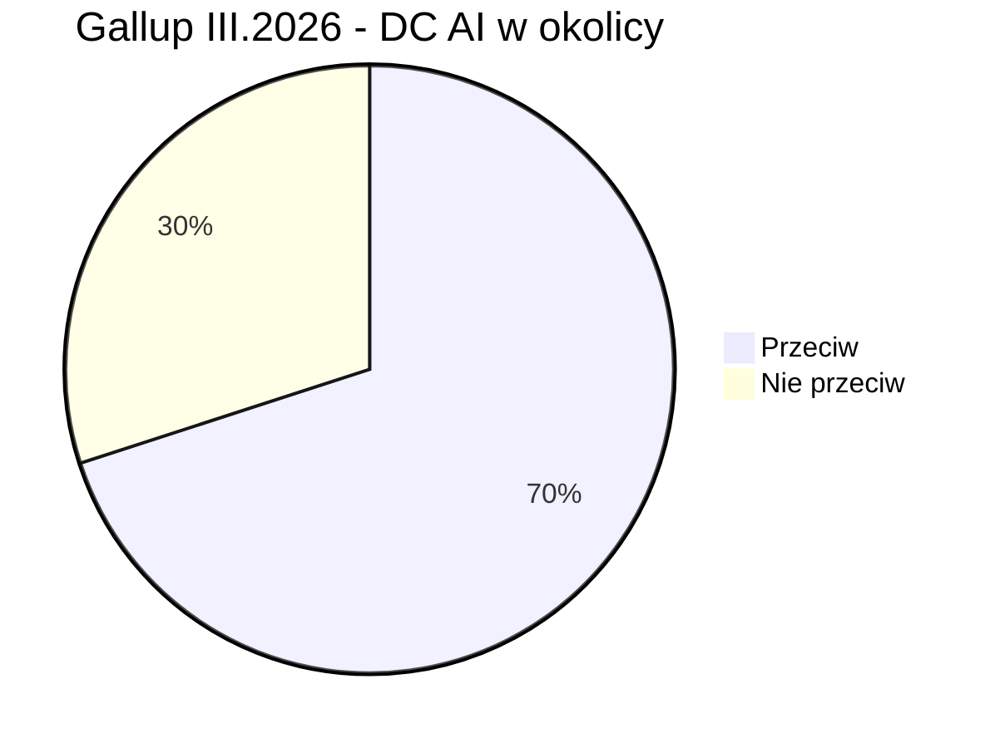
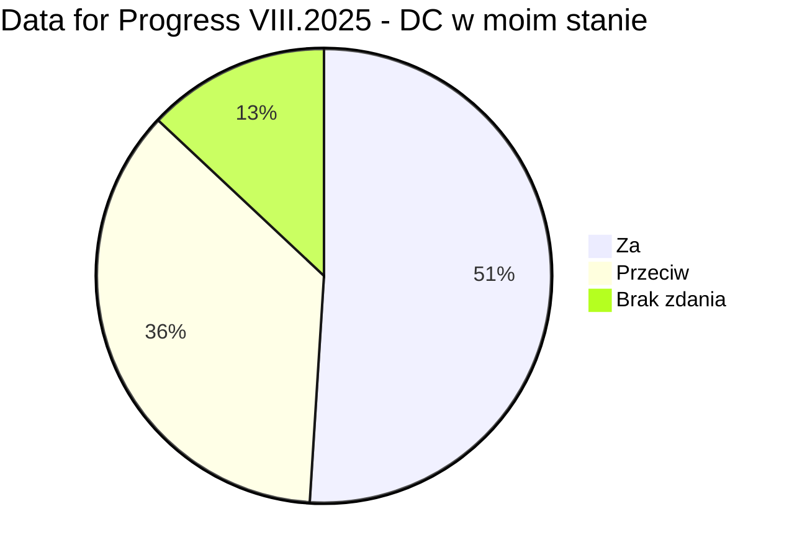
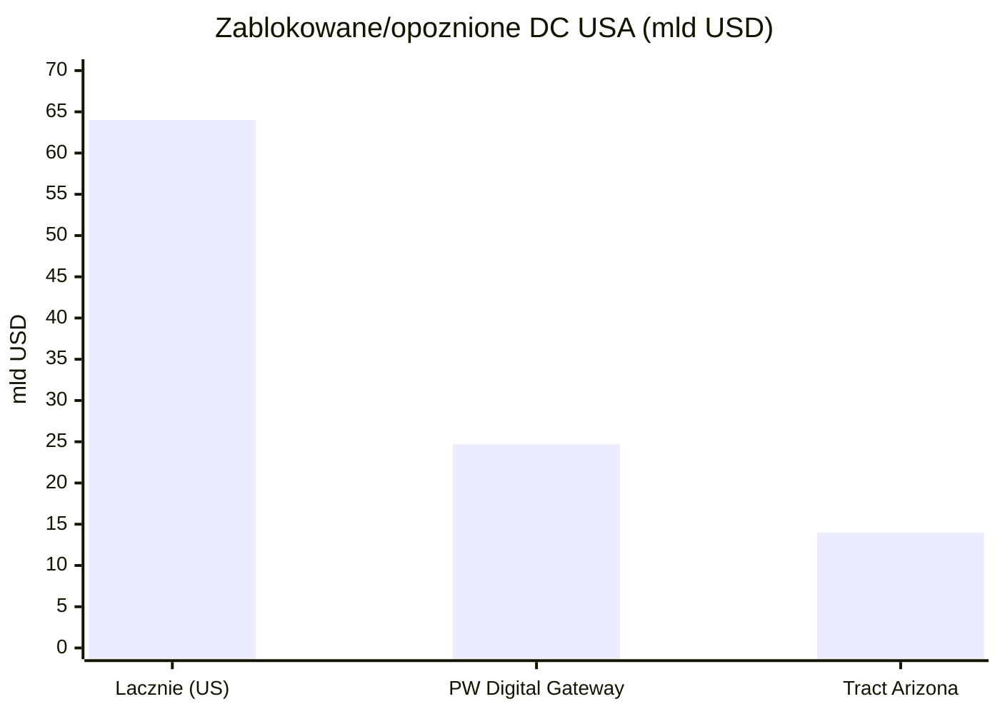
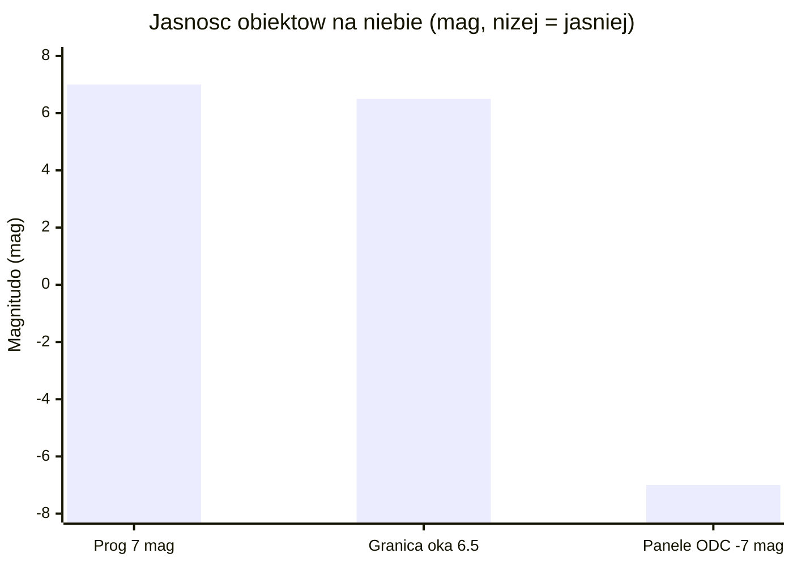

# Sentyment społeczny i moratoria na centra danych

> Notatka raportu "Orbitalne centra danych". Kluczowe źródła: [źródło 1](https://www.datacenterwatch.org/report), [źródło 2](https://www.rockinst.org/blog/updates-on-the-cloud-more-moratoriums-on-data-centers/).

## W skrócie

Naziemne centra danych (DC - obiekty pełne serwerów do obliczeń AI i chmury) napotykają coraz twardszy opór społeczny i regulacyjny: w USA opozycja lokalna zablokowała lub opóźniła projekty warte 64 mld USD 🟠 [Data Center Watch](https://www.datacenterwatch.org/report), 14 stanów rozważa moratoria (czasowe wstrzymanie budowy) 🟠 [Rockefeller Institute](https://www.rockinst.org/blog/updates-on-the-cloud-more-moratoriums-on-data-centers/), a sondaż Gallup z marca 2026 pokazał, że 71% Amerykanów nie chce takiego obiektu w sąsiedztwie 🟠 [the-decoder](https://the-decoder.com/americans-would-rather-live-next-to-a-nuclear-plant-than-an-ai-data-center-gallup-poll-finds/). Dla inwestora ważne są dwie sprzeczne siły: opór lokalnie podnosi koszty i ryzyko opóźnień (kto traci - hyperscalerzy i deweloperzy DC; kto zyskuje - operatorzy alternatyw, w tym narracja "kosmosu"), ale globalny popyt na energię rośnie tak szybko (485 -> 950 TWh do 2030) 🔵 [IEA](https://www.iea.org/reports/key-questions-on-energy-and-ai/executive-summary), że sektor nie zwalnia. Kluczowy haczyk dla wątku orbitalnego: ucieczka na orbitę nie likwiduje oporu - tworzy nowy front, bo astronomowie (<abbr title="Międzynarodowa Unia Astronomiczna, główna światowa organizacja astronomów (jej CPS zajmuje się ochroną nieba).">IAU</abbr>, <abbr title="Amerykańskie Towarzystwo Astronomiczne (ok. 7700 członków), aktywne w sprzeciwie wobec megakonstelacji.">AAS</abbr>, ESO, RAS) ostro protestują przeciw planom milionów jasnych satelitów. Tempo zmian jest szybkie: legislacja stanowa, wnioski do FCC i preprint Marcy'ego z 2026 r. pojawiły się w ciągu kilkunastu miesięcy.

<!-- network:watki:start -->
## Powiązane wątki

> Mapa powiązań tematycznych - jak ten wątek łączy się z resztą raportu.

- [[12 - naziemny-bottleneck-energetyczny-i-sieciowy|Naziemny bottleneck]] - moratoria i protesty to część naziemnego bottlenecku
- [[11 - regulacje-prawo-kosmiczne-debris-i-itu|Regulacje i debris]] - light pollution łączy sentyment z regulacją astronomiczną
- [[14 - zrownowazony-rozwoj-i-srodowisko|Środowisko]] - presja ESG i argumenty środowiskowe napędzają sentyment
- [[10 - gracze-i-projekty|Gracze i projekty]] - narracja "data centers in space" jako PR graczy
<!-- network:watki:end -->
## Moratoria i ograniczenia naziemne

Opór wobec naziemnych DC przeszedł w 2026 r. z fazy protestów do fazy prawa. Według Rockefeller Institute na czerwiec 2026 r. 14 stanów USA rozważa lub rozważało moratorium na centra danych 🟠 [Rockefeller Institute](https://www.rockinst.org/blog/updates-on-the-cloud-more-moratoriums-on-data-centers/). W pierwszych sześciu tygodniach 2026 r. w ponad 30 stanach złożono ponad 300 projektów ustaw dotyczących DC - to przesunięcie od zachęt podatkowych ku nadzorowi regulacyjnemu 🟠 [MultiState](https://www.multistate.us/insider/2026/2/20/state-data-center-legislation-in-2026-tackles-energy-and-tax-issues).

Uwaga terminologiczna: "<abbr title="jednostka mocy elektrycznej obiektu; ustawy często ustalają próg w MW, powyżej którego DC podlega zakazowi.">MW</abbr>" (megawat) to miara mocy elektrycznej obiektu - większość ustaw ustawia próg w MW, powyżej którego DC podlega zakazowi. Najostrzejsze przykłady: Georgia (HB 1059) blokuje zezwolenia do grudnia 2028 r. 🟠, Oklahoma (SB 1488) wstrzymuje DC >=100 MW do 1 listopada 2029 r. 🟠, Vermont (S 205) zakazuje "AI data centers" >=100 MW do 2030 r. 🟠, a Virginia (HB 1515) blokuje obiekty >=1 MW do lipca 2028 r. lub do opróżnienia kolejki przyłączeniowej 🟠 [Rockefeller Institute](https://www.rockinst.org/blog/updates-on-the-cloud-more-moratoriums-on-data-centers/). Część prób utknęła: Maine (LD 307, moratorium na DC >20 MW do listopada 2027 r.) zostało zawetowane przez gubernatora, a New York (AB 10141/SB 9144, roczne moratorium na DC >=20 MW) przeszło legislaturę, ale czeka na decyzję gubernator Hochul 🟠 [Rockefeller Institute](https://www.rockinst.org/blog/updates-on-the-cloud-more-moratoriums-on-data-centers/). Implikacja dla inwestora: ryzyko legislacyjne jest realne, ale rozdrobnione i często niedokończone - to raczej podnoszenie kosztu i czasu projektu niż twardy zakaz.

W Europie ograniczenia są starsze i twardsze. Amsterdam zdecydował, że nie wyda zgody na żadne nowe DC ani ich rozbudowę w gminie, a do sprawy wróci dopiero w 2030 r. 🟠 [NL Times](https://nltimes.nl/2025/04/18/amsterdam-allowing-data-centers-municipality). W Irlandii operator sieci EirGrid już w 2022 r. nałożył moratorium na nowe DC w Dublinie do 2028 r. 🟠 [PublicPolicy.ie](https://publicpolicy.ie/papers/data-centres-in-ireland/) - kontekst jest dramatyczny: w 2023 r. centra danych zużyły 21% całej zmierzonej energii elektrycznej w Irlandii, o 20% więcej rok do roku 🟠 [PublicPolicy.ie](https://publicpolicy.ie/papers/data-centres-in-ireland/). Wcześniejszym precedensem był Singapur, który wprowadził prawie trzyletnią przerwę w zezwoleniach (2019-2022) 🔴 [MindStudio](https://www.mindstudio.ai/blog/data-center-moratorium-compute-paradox). Implikacja: dojrzałe rynki potrafią twardo zatrzymać podaż mocy, co bezpośrednio wspiera narrację "wynieśmy obliczenia gdzie indziej".

## Sondaż Gallup III.2026 i inne badania opinii

Najmocniejszym sygnałem nastrojów jest sondaż Gallup z marca 2026 r.: siedmiu na dziesięciu Amerykanów (70%) sprzeciwia się budowie centrum danych AI w swojej okolicy, w tym 48% "mocno" 🔵 [Gallup](https://www.gallup.com/topic/artificial-intelligence.aspx). Relacja branżowa podaje 71% sprzeciwu (48% mocno) i dorzuca uderzające porównanie - tylko 53% Amerykanów sprzeciwia się elektrowni jądrowej w sąsiedztwie, czyli ludzie wolą sąsiada-reaktor niż sąsiada-DC 🟠 [the-decoder](https://the-decoder.com/americans-would-rather-live-next-to-a-nuclear-plant-than-an-ai-data-center-gallup-poll-finds/). Opór ma wymiar polityczny i geograficzny: 56% Demokratów "mocno się sprzeciwia" wobec 39% Republikanów, a regionalnie najsilniejszy jest na Środkowym Zachodzie (76%) i Południu (75%) 🟠 [the-decoder](https://the-decoder.com/americans-would-rather-live-next-to-a-nuclear-plant-than-an-ai-data-center-gallup-poll-finds/).

*Rys. 69 - Stosunek Amerykanów do budowy centrum danych AI w sąsiedztwie (sondaż Gallup, III.2026). Dane: Gallup.*

Obraz nie jest jednak jednoznacznie wrogi. Sondaż Data for Progress z sierpnia 2025 r. (próba ważona N=1179) pokazał, że tylko 36% respondentów sprzeciwia się nowym DC w swoim stanie, a 51% je popiera 🔵 [Data for Progress](https://www.filesforprogress.org/datasets/2025/8/dfp_data_centers_tabs.pdf). Rozbieżność wynika z framingu pytania ("w moim stanie" vs "w mojej okolicy"). Implikacja dla inwestora: efekt <abbr title="postawa akceptacji idei (np. AI), ale sprzeciwu wobec jej realizacji we własnym sąsiedztwie.">NIMBY</abbr> ("Not In My Backyard" - akceptuję ideę, byle nie u mnie) jest realny i to on, a nie ogólna niechęć do AI, napędza blokady lokalne.

*Rys. 70 - Stosunek do nowych centrów danych w swoim stanie (Data for Progress, VIII.2025, N=1179; "brak zdania" jako dopełnienie do 100%). Dane: Data for Progress.*

## Opór lokalny: woda, energia, hałas, protesty, presja ESG

Skala blokad jest mierzalna. Data Center Watch szacuje 64 mld USD projektów w USA zablokowanych lub opóźnionych przez rosnącą, ponadpartyjną opozycję 🟠 [Data Center Watch](https://www.datacenterwatch.org/report); zidentyfikowano co najmniej 142 grupy aktywistów w 24 stanach oraz ponad 23 petycje z ponad 31 000 podpisów od 2022 r. 🟠 [Data Center Watch](https://www.datacenterwatch.org/report). Heatmap Pro naliczył 25 anulowanych projektów w 2025 r. - czterokrotnie więcej niż w 2024 r. - z czego 21 padło w drugiej połowie roku 🟠 [Heatmap](https://heatmap.news/politics/data-center-cancellations-2025). Konkretne kwoty: projekt Tract w Arizonie o wartości 14 mld USD wycofano po naciskach mieszkańców, a PW Digital Gateway (QTS/Compass) za 24,7 mld USD utknął w co najmniej trzech procesach sądowych 🟠 [Data Center Watch](https://www.datacenterwatch.org/report). Frekwencja na spotkaniach mówi sama za siebie: ponad 500 osób na radzie Warrenton w Wirginii (ok. 130 zabrało głos, w tym aktor Robert Duvall) i ponad 350 mieszkańców przeciw projektowi Ranalli Lysander (300 MW) w stanie Nowy Jork 🟠 [Data Center Watch](https://www.datacenterwatch.org/report) 🟠 [Rockefeller Institute](https://www.rockinst.org/blog/updates-on-the-cloud-more-moratoriums-on-data-centers/).

*Rys. 71 - Wartość zablokowanych lub opóźnionych projektów DC w USA: suma oraz dwa największe pojedyncze przypadki. Dane: Data Center Watch.*

Trzy fizyczne osie konfliktu to woda, energia i hałas. Średniej wielkości DC może zużyć do ok. 110 mln galonów wody rocznie na chłodzenie - tyle, ile rocznie ok. 1000 gospodarstw domowych 🟠 [Public Power](https://www.publicpower.org/periodical/article/strategies-address-water-use-emerge-wake-community-opposition-data-centers). Po stronie energii: globalne zużycie energii elektrycznej przez DC wzrosło o 17% w 2025 r., a w samych obiektach AI aż o 50% 🔵 [IEA](https://www.iea.org/reports/key-questions-on-energy-and-ai/executive-summary). IEA prognozuje podwojenie z 485 TWh (2025) do 950 TWh (2030), co da ok. 3% globalnego zapotrzebowania na prąd 🔵 [IEA](https://www.iea.org/reports/key-questions-on-energy-and-ai/executive-summary). Obrazowo: jedna zaawansowana szafa serwerowa AI do 2027 r. będzie mieć szczytowe zapotrzebowanie mocy jak 65 gospodarstw domowych 🔵 [IEA](https://www.iea.org/reports/key-questions-on-energy-and-ai/executive-summary). Nakłady pięciu największych firm technologicznych przekroczyły 400 mld USD w 2025 r. i mają wzrosnąć o kolejne 75% w 2026 r. 🔵 [IEA](https://www.iea.org/reports/key-questions-on-energy-and-ai/executive-summary). Implikacja: to właśnie ta skala zużycia wody i energii daje paliwo protestom - i jednocześnie czyni "darmowe słońce na orbicie i brak wody do chłodzenia" atrakcyjną opowieścią.

Presja <abbr title="kryteria oceny firmy pod kątem środowiska, spraw społecznych i ładu korporacyjnego (environmental, social, governance).">ESG</abbr> (kryteria środowiskowe, społeczne i ładu korporacyjnego) zaostrza problem PR-owo. Microsoft deklaruje cel carbon-negative, water-positive i zero-waste do 2030 r. 🟠 [Urban Land](https://urbanland.uli.org/resilience-and-sustainability/nuclear-power-makes-a-comeback-as-data-centers-adapt-to-rising-power-demands), Amazon - 100% energii odnawialnej do 2025 r. i net-zero do 2040 r. 🟠 [Urban Land](https://urbanland.uli.org/resilience-and-sustainability/nuclear-power-makes-a-comeback-as-data-centers-adapt-to-rising-power-demands), a Google - całodobowo bezemisyjną energię i uzupełnianie 120% zużytej wody do 2030 r. 🔴 [GartSolutions](https://gartsolutions.com/green-clouds-how-to-slash-carbon-emissions-with-cloud-computing-strategies/). Te deklaracje zderzają się z danymi: w 2023 r. 42% wody Microsoftu pochodziło z obszarów "water stress", a w 2024 r. 15% poboru świeżej wody Google'a z regionów "high water scarcity" 🔵 [arXiv 2512.03077](https://arxiv.org/html/2512.03077v2). Implikacja dla inwestora: rozjazd między celami a faktami to dokładnie ten obszar, w którym pojawia się ryzyko zarzutu greenwashingu - i w którym narracja kosmiczna może być wykorzystana jako tarcza wizerunkowa.

## Narracja "data centers in space": PR/greenwashing czy realny pivot

Argument za realnym pivotem jest poparty oficjalnymi projektami. Europejski projekt ASCEND (Thales Alenia Space / ESA) celuje w 1 GW mocy obliczeniowej w kosmosie do 2050 r. i podkreśla zerowe zużycie wody do chłodzenia w próżni 🔵 [ASCEND](https://ascend-horizon.eu/). Google w preprincie Project Suncatcher proponuje "kosmiczne centra danych ML" z układami TPU, wskazując, że panele na pewnych orbitach dostają do 8x więcej energii słonecznej rocznie niż panel na Ziemi w średnich szerokościach 🔵 [arXiv 2511.19468](https://arxiv.org/pdf/2511.19468); próg opłacalności to spadek kosztu wynoszenia na niską orbitę (LEO) do 200 USD/kg 🔵 [arXiv 2511.19468](https://arxiv.org/pdf/2511.19468). Skala wniosków do amerykańskiego regulatora FCC jest ogromna: SpaceX złożył wniosek o do 1 mln satelitów "orbital data-center" z deklarowanymi 100 GW mocy AI rocznie 🔵 [FCC DA-26-113A1](https://docs.fcc.gov/public/attachments/DA-26-113A1.pdf), Blue Origin o 51 600 satelitów ("Project Sunrise") 🔵 [FCC DOC-420864A1](https://docs.fcc.gov/public/attachments/DOC-420864A1.pdf), a startup Starcloud (dawniej Lumen Orbit) o do 88 000 satelitów 🔵 [FCC DOC-419509A1](https://docs.fcc.gov/public/attachments/DOC-419509A1.pdf). Starcloud zebrał łącznie 21 mln USD finansowania seed 🔴 [everywhere.vc](https://ideas.everywhere.vc/p/lumen-orbit-is-now-starcloudand-it), ma <abbr title="niewiążąca deklaracja współpracy między stronami (memorandum of understanding).">MOU</abbr> (listy intencyjne) na ponad 30 mln USD 🟠 [DCD](https://www.datacenterdynamics.com/en/news/lumen-orbit-raises-24m-for-space-data-centers/) i planuje kompleks 5 GW z panelami ok. 4 km na 4 km 🟠 [IDC Nova](https://www.idcnova.com/html/1/59/153/4523.html).

Argument za greenwashingiem/PR jest równie konkretny. Brak peer-reviewed audytu cyklu życia (LCA) dla komercyjnego orbitalnego DC - to jest NIE UJAWNIONE, istnieją tylko studia wykonalności i koncepcje. Sam ASCEND zastrzega, że korzyść klimatyczna wymaga wynoszenia rakietą o 10x mniejszej emisyjności niż dzisiejsze - warunek, który analiza Carbone 4 określa jako wymagający "prawdziwego wyczynu" europejskiego sektora kosmicznego 🔵 [ASCEND](https://ascend-horizon.eu/). Cytowane przez CEO Starcloud porównanie "zamiast 140 mln USD za prąd zapłać 10 mln USD za start i panele" pochodzi ze słabego źródła i nie jest niezależnie zweryfikowane 🔴 [Manifold](https://manifold.markets/HenriThunberg/5-multiple-serious-efforts-to-put-a). Implikacja dla inwestora: deklaracje mocy (1 GW, 100 GW) i liczby satelitów są realnymi sygnałami popytu/intencji, ale przepaść między koncepcją a działającym, opłacalnym i klimatycznie korzystnym obiektem jest na ten moment niezamknięta dowodami.

## Astronomowie i "Not In My Sky": zanieczyszczenie świetlne

Najpoważniejszym dotąd frontem oporu wobec kosmosu jest astronomia. Już dla planowanych ponad 100 000 satelitów LEO raport AAS SATCON1 stwierdza, że "żadna kombinacja środków łagodzących nie wyeliminuje w pełni wpływu" śladów satelitów na naziemną astronomię optyczną 🔵 [AAS SATCON1](https://aas.org/sites/default/files/2020-08/SATCON1-Report.pdf). ESO przeanalizowało 18 konstelacji o łącznie ponad 26 000 satelitów i oszacowało, że 30-50% ekspozycji obserwatorium Vera C. Rubin o zmierzchu i świcie byłoby "severely affected", a do 3% długich ekspozycji VLT/ELT - zniszczonych 🔵 [ESO](https://www.eso.org/public/news/eso2004/). <abbr title="logarytmiczna skala jasności obiektu; niższa wartość oznacza obiekt jaśniejszy (granica widoczności gołym okiem to ok. 6-7 mag).">Magnituda</abbr> (mag) to logarytmiczna skala jasności, gdzie niższa wartość oznacza obiekt jaśniejszy; granicą widoczności gołym okiem jest ok. 6-7 mag. Stąd próg: AAS, ESO i IAU CPS rekomendują jasność <=7 mag 🔵 [AAS SATCON1](https://aas.org/sites/default/files/2020-08/SATCON1-Report.pdf) 🔵 [IAU CPS techdoc102](https://noirlab.edu/public/media/archives/techdocs/pdf/techdoc102.pdf).

![[assets/y12-1-pia21423.jpg]]
*Rys. 72 - Astronomia: Surface of TRAPPIST-1f. Źródło: NASA, licencja: public domain.*
#grafika #sentyment-spoleczny-i-moratoria-na-centra-danych #astronomia #slady-satelitow

Próg 7 mag wszedł już do prawa: francuska ustawa kosmiczna (FSOA) wymaga, by każdy satelita megakonstelacji projektowano z celem jasności >=7 mag, a proponowany unijny EU Space Act wprowadza próg <7 mag z podejściem skalowanym do wielkości floty 🔵 [UNOOSA CRP22](https://www.unoosa.org/res/oosadoc/data/documents/2026/aac_105c_12026crp/aac_105c_12026crp_22rev_1_0_html/AC105_C1_2026_CRP22Rev01E.pdf). Przekroczenie tego progu daje prawie dziesięciokrotną utratę danych z powodu artefaktów kalibracji 🔵 [UNOOSA CRP22](https://www.unoosa.org/res/oosadoc/data/documents/2026/aac_105c_12026crp/aac_105c_12026crp_22rev_1_0_html/AC105_C1_2026_CRP22Rev01E.pdf). SpaceX próbował łagodzić problem: testy ponad 300 satelitów na ok. 350 km zamiast 550 km dały ok. 60% redukcji obrazów Rubin z oświetlonym satelitą 🟠 [PCMag](https://www.pcmag.com/news/spacex-lowering-starlink-satellite-orbits-reduces-impact-on-astronomy), co potwierdza UNOOSA (do 40% mniej smug na obraz dla 350 km vs 550 km) 🔵 [UNOOSA CRP22](https://www.unoosa.org/res/oosadoc/data/documents/2026/aac_105c_12026crp/aac_105c_12026crp_22rev_1_0_html/AC105_C1_2026_CRP22Rev01E.pdf). Implikacja: istnieje gotowa ścieżka regulacyjna (próg jasności, niższe orbity), którą państwa mogą nałożyć na orbitalne DC - czyli to samo ryzyko regulacyjne, przed którym sektor uciekał na Ziemi, czeka go na orbicie.

Reakcja środowiska na wnioski o orbitalne DC była natychmiastowa i ostra. RAS, ESO i IAU złożyły komentarze sprzeciwiające się planom SpaceX i Reflect Orbital, ostrzegając, że "ponad milion wyjątkowo jasnych satelitów" trwale zniszczy dziedzictwo nocnego nieba 🟠 [RAS](https://ras.ac.uk/news-and-press/news/spacex-and-reflect-orbital-plans-would-permanently-scar-night-sky); średnio każdy obraz z VLT traciłby 10% danych 🟠 [RAS](https://ras.ac.uk/news-and-press/news/spacex-and-reflect-orbital-plans-would-permanently-scar-night-sky). AAS (ok. 7700 członków) złożyło petycję o odmowę zezwolenia, nazywając konstelację "bezprecedensowym zagrożeniem dla wizualnej integralności nocnego nieba", i mobilizowało członków do komentarzy w FCC 🟠 [Satellite Today](https://www.satellitetoday.com/connectivity/2026/03/11/amazons-petition-to-deny-spacex-orbital-data-constellation-draws-criticism-from-brendan-carr/) 🟠 [PCMag](https://www.pcmag.com/news/spacexs-plan-for-1-million-satellites-faces-light-pollution-backlash). Wniosek SpaceX zwiększyłby liczbę satelitów na orbicie - obecnie ok. 14 500 - około 70-krotnie 🟠 [PCMag](https://www.pcmag.com/news/spacexs-plan-for-1-million-satellites-faces-light-pollution-backlash). Astronomowie podkreślają, że to "całkowite odwrócenie" ostatnich lat postępu z przyciemnianiem Starlinków 🟠 [Yahoo](https://www.yahoo.com/news/articles/spacex-plan-1-million-orbiting-100000799.html). Uwaga: nie istnieje zorganizowany ruch obywatelski o nazwie <abbr title="hasłowe określenie oporu astronomów wobec satelitów; w notatce zaznaczono, że nie jest to zorganizowany ruch oddolny, lecz sprzeciw instytucjonalny.">"Not In My Sky"</abbr> - to opór instytucjonalny środowiska naukowego, nie oddolny ruch typu NIMBY.

![[assets/y12-2-pia26662.jpg]]
*Rys. 73 - Astronomia: DSOC's Table Mountain Facility Uplink Laser - Infrared vs. Visible Light. Źródło: NASA, licencja: public domain.*
#grafika #sentyment-spoleczny-i-moratoria-na-centra-danych #astronomia #slady-satelitow

## Kilometrowe panele jako obiekty -5 do -7 mag

Nowy, najostrzejszy front otworzył preprint Marcy'ego z 2026 r. Wytworzenie 5 GW wymaga paneli o powierzchni 15 km2, czyli macierzy 4 km na 4 km (przy strumieniu słonecznym 1361 W/m2 i sprawności 25%) 🔵 [arXiv 2603.28829](https://arxiv.org/pdf/2603.28829). Taki panel na niskiej orbicie ma rozmiar kątowy ok. 0,4 stopnia - porównywalny z tarczą Księżyca 🔵 [arXiv 2603.28829](https://arxiv.org/pdf/2603.28829), i ma 140 000 razy większą powierzchnię przekroju niż dzisiejszy satelita Starlink (panele Starlink to ok. 105 m2) 🔵 [arXiv 2603.28829](https://arxiv.org/pdf/2603.28829). Odbite światło słoneczne sprawiłoby, że obiekt świeciłby z jasnością g od -5 do -7 mag, czyli ok. 100 razy jaśniej niż najjaśniejsze gwiazdy (to ok. 1/20 jasności Księżyca w kwadrze) 🔵 [arXiv 2603.28829](https://arxiv.org/pdf/2603.28829).

*Rys. 74 - Porównanie jasności: regulacyjny próg 7 mag i granica widoczności gołym okiem (ok. 6-7 mag) wobec paneli orbitalnych DC (-5 do -7 mag). Dane: arXiv 2603.28829, IAU CPS techdoc102.*

Mechanizm zakłócenia jest konkretny. Orbity sun-synchronous (przebiegające nad biegunami) na ok. 500-550 km sprawiają, że obiekty są widoczne ok. 90 min po zachodzie i 90 min przed wschodem słońca, łącznie co najmniej ok. 6 godzin na dobę, okrążając Ziemię co 90 min 🔵 [arXiv 2603.28829](https://arxiv.org/pdf/2603.28829). Dziesiątki takich struktur utworzyłyby na niebie łańcuch obiektów przemysłowych z północy na południe, blokując gwiazdy, planety i obiekty głębokiego nieba na czas od kilku sekund do minut 🔵 [arXiv 2603.28829](https://arxiv.org/pdf/2603.28829). Wniosek SpaceX do FCC potwierdza orbity 500-2000 km i inklinacje 30 stopni oraz sun-synchronous 🔵 [FCC DA-26-113A1](https://docs.fcc.gov/public/attachments/DA-26-113A1.pdf), Starcloud 600-850 km 🔵 [FCC DOC-419509A1](https://docs.fcc.gov/public/attachments/DOC-419509A1.pdf), Blue Origin 500-1800 km 🔵 [FCC DOC-420864A1](https://docs.fcc.gov/public/attachments/DOC-420864A1.pdf). Implikacja dla inwestora: w odróżnieniu od Starlinków (które nocą są w cieniu Ziemi), te obiekty na wysokich inklinacjach byłyby w pełni oświetlone nawet o północy 🟠 [Yahoo](https://www.yahoo.com/news/articles/spacex-plan-1-million-orbiting-100000799.html) - co czyni argument astronomów trudnym do zbycia i tworzy ryzyko regulacyjne dla całej klasy aktywów.

## Akceptacja publiczna przetwarzania danych w kosmosie

Bezpośredni sondaż akceptacji publicznej dla "orbitalnych centrów danych" lub "przetwarzania danych w kosmosie" jest NIE UJAWNIONE - po przeszukaniu nie znaleziono publicznie dostępnego badania zadającego wprost takie pytanie. Najbliższe proxy to 70% Amerykanów przeciw naziemnym DC AI 🔵 [Gallup](https://www.gallup.com/topic/artificial-intelligence.aspx). Drugie proxy działa w odwrotną stronę: Starlink obsługuje ponad 600 000 lokalizacji w USA 🔵 [IAU CPS](https://cps.iau.org/news/nsf-and-spacex-sign-agreement-to-mitigate-impact-of-starlink-satellites-on-ground-based-astronomy/), co pokazuje, że masowa infrastruktura kosmiczna potrafi zyskać akceptację użytkową, gdy daje wymierną korzyść. Implikacja: brak danych o akceptacji orbitalnych DC to samo w sobie ryzyko - inwestor nie ma jak wycenić reakcji opinii publicznej, a precedens astronomiczny sugeruje, że "kosmos" nie jest neutralny społecznie.

## Kontrowersje

**1. Czy presja społeczna realnie wypycha DC z Ziemi, czy to czynnik marginalny?**

Strona A (presja realnie blokuje/opóźnia): 64 mld USD projektów w USA zablokowanych lub opóźnionych 🟠 [Data Center Watch](https://www.datacenterwatch.org/report); 25 anulowanych projektów w 2025 r., czterokrotnie więcej niż w 2024 r. 🟠 [Heatmap](https://heatmap.news/politics/data-center-cancellations-2025); 14 stanów z moratoriami lub ich rozważaniem 🟠 [Rockefeller Institute](https://www.rockinst.org/blog/updates-on-the-cloud-more-moratoriums-on-data-centers/); całkowity zakaz w Amsterdamie 🟠 [NL Times](https://nltimes.nl/2025/04/18/amsterdam-allowing-data-centers-municipality) i moratorium w Dublinie do 2028 r. 🟠 [PublicPolicy.ie](https://publicpolicy.ie/papers/data-centres-in-ireland/).

Strona B (globalnie marginalny wobec popytu): globalne zużycie energii DC rośnie z 485 do 950 TWh w latach 2025-2030 🔵 [IEA](https://www.iea.org/reports/key-questions-on-energy-and-ai/executive-summary); zużycie AI DC wzrosło o 50% w samym 2025 r. 🔵 [IEA](https://www.iea.org/reports/key-questions-on-energy-and-ai/executive-summary); nakłady pięciu gigantów >400 mld USD w 2025 r. i +75% w 2026 r. 🔵 [IEA](https://www.iea.org/reports/key-questions-on-energy-and-ai/executive-summary); na czerwiec 2026 r. większość projektów ustaw ma status "Introduced", Maine zawetowane, Nowy Jork czeka - liczba trwale obowiązujących stanowych moratoriów jest bliska zeru 🟠 [Rockefeller Institute](https://www.rockinst.org/blog/updates-on-the-cloud-more-moratoriums-on-data-centers/). Synteza ze źródeł: teza "presja nie ma znaczenia" jest obalona lokalnie (64 mld USD, 25 anulowań), ale potwierdzona globalnie - opór podnosi koszt i czas, lecz nie zatrzymuje sektora.

**2. Czy orbita to ucieczka od oporu, czy nowy front konfliktu?**

Strona A (orbita jako realny pivot/ucieczka): ASCEND celuje w 1 GW w kosmosie do 2050 r. 🔵 [ASCEND](https://ascend-horizon.eu/); Google Project Suncatcher to oficjalny research z TPU w kosmosie i 8x więcej energii słonecznej niż na Ziemi 🔵 [arXiv 2511.19468](https://arxiv.org/pdf/2511.19468); SpaceX złożył do FCC wniosek na 1 mln satelitów i 100 GW AI rocznie 🔵 [arXiv 2603.28829](https://arxiv.org/pdf/2603.28829); Starcloud 21 mln USD seed 🔴 [everywhere.vc](https://ideas.everywhere.vc/p/lumen-orbit-is-now-starcloudand-it).

Strona B (orbita to nowy front): dla 100 000+ satelitów LEO "żadna kombinacja środków łagodzących nie wyeliminuje wpływu" na astronomię 🔵 [AAS SATCON1](https://aas.org/sites/default/files/2020-08/SATCON1-Report.pdf); panele orbitalnych DC mają 140 000 razy większą powierzchnię niż Starlink 🔵 [arXiv 2603.28829](https://arxiv.org/pdf/2603.28829) i jasność g do -7 mag, 100x jaśniej niż najjaśniejsze gwiazdy 🔵 [arXiv 2603.28829](https://arxiv.org/pdf/2603.28829); na LEO jest już ponad 1 mln fragmentów gruzu 1-10 cm 🔵 [arXiv 2603.28829](https://arxiv.org/pdf/2603.28829), z prędkościami względnymi ok. 10 km/s (uderzenie 1 kg = ok. 5x10^7 J) 🔵 [arXiv 2603.28829](https://arxiv.org/pdf/2603.28829); RAS/ESO/IAU i AAS formalnie sprzeciwiają się planom 🟠 [RAS](https://ras.ac.uk/news-and-press/news/spacex-and-reflect-orbital-plans-would-permanently-scar-night-sky). Synteza: orbita nie eliminuje oporu - przenosi go z mieszkańców i samorządów na środowisko naukowe i regulatorów jasności/debris, a próg 7 mag jest już w prawie francuskim i projekcie EU Space Act 🔵 [UNOOSA CRP22](https://www.unoosa.org/res/oosadoc/data/documents/2026/aac_105c_12026crp/aac_105c_12026crp_22rev_1_0_html/AC105_C1_2026_CRP22Rev01E.pdf).

## Słowniczek pojęć

- **Moratorium** - czasowe, prawnie nałożone wstrzymanie budowy lub wydawania zezwoleń na centra danych.
- **Centrum danych (DC)** - obiekt pełen serwerów do obliczeń AI i chmury, zużywający duże ilości energii i wody.
- **NIMBY ("Not In My Backyard")** - postawa akceptacji idei (np. AI), ale sprzeciwu wobec jej realizacji we własnym sąsiedztwie.
- **MW (megawat)** - jednostka mocy elektrycznej obiektu; ustawy często ustalają próg w MW, powyżej którego DC podlega zakazowi.
- **ESG** - kryteria oceny firmy pod kątem środowiska, spraw społecznych i ładu korporacyjnego (environmental, social, governance).
- **Greenwashing** - tworzenie fałszywego wrażenia ekologiczności, gdy rzeczywiste działania mu przeczą.
- **Audyt cyklu życia (LCA)** - analiza pełnego śladu środowiskowego produktu lub obiektu od produkcji po wycofanie z użycia.
- **MOU (list intencyjny)** - niewiążąca deklaracja współpracy między stronami (memorandum of understanding).
- **Magnituda (mag)** - logarytmiczna skala jasności obiektu; niższa wartość oznacza obiekt jaśniejszy (granica widoczności gołym okiem to ok. 6-7 mag).
- **Orbita LEO** - niska orbita okołoziemska (kilkaset km nad Ziemią), gdzie ma działać większość planowanych konstelacji.
- **Orbita sun-synchronous (SSO)** - orbita biegunowa zsynchronizowana ze Słońcem, na której obiekty pozostają oświetlone o świcie i zmierzchu.
- **Zanieczyszczenie świetlne** - rozjaśnianie nocnego nieba przez sztuczne źródła światła, tu: odbite światło z satelitów zakłócające astronomię.
- **Okultacja** - przesłonięcie obiektu astronomicznego przez inne ciało przechodzące na linii obserwacji (tu: gwiazd i planet przez panele).
- **IAU** - Międzynarodowa Unia Astronomiczna, główna światowa organizacja astronomów (jej CPS zajmuje się ochroną nieba).
- **AAS** - Amerykańskie Towarzystwo Astronomiczne (ok. 7700 członków), aktywne w sprzeciwie wobec megakonstelacji.
- **"Not In My Sky"** - hasłowe określenie oporu astronomów wobec satelitów; w notatce zaznaczono, że nie jest to zorganizowany ruch oddolny, lecz sprzeciw instytucjonalny.
