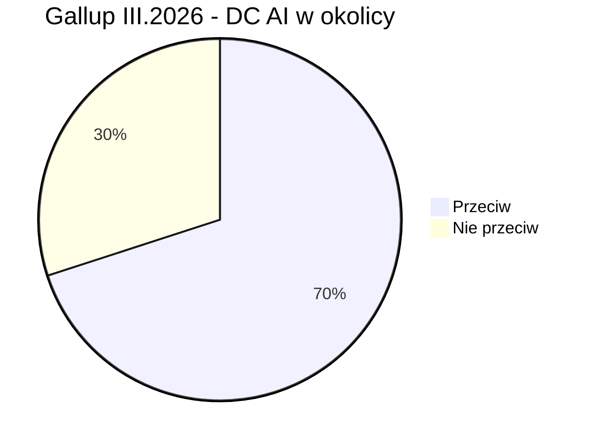
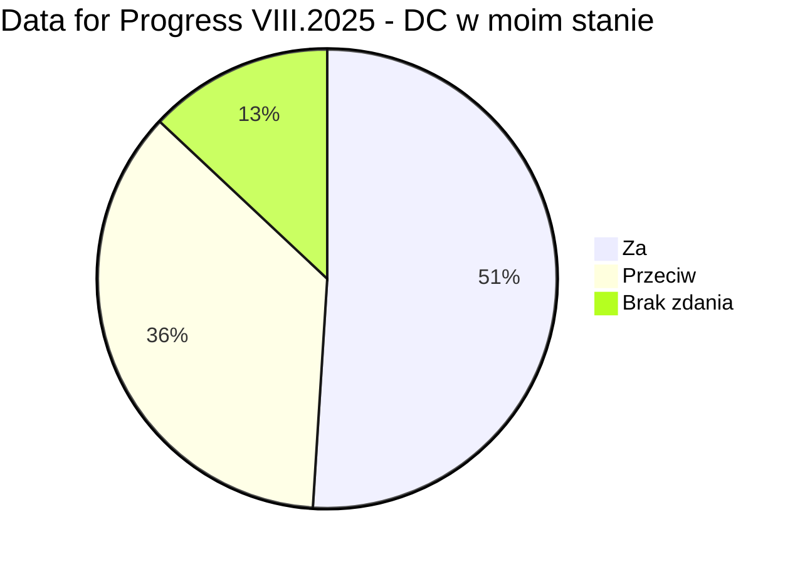
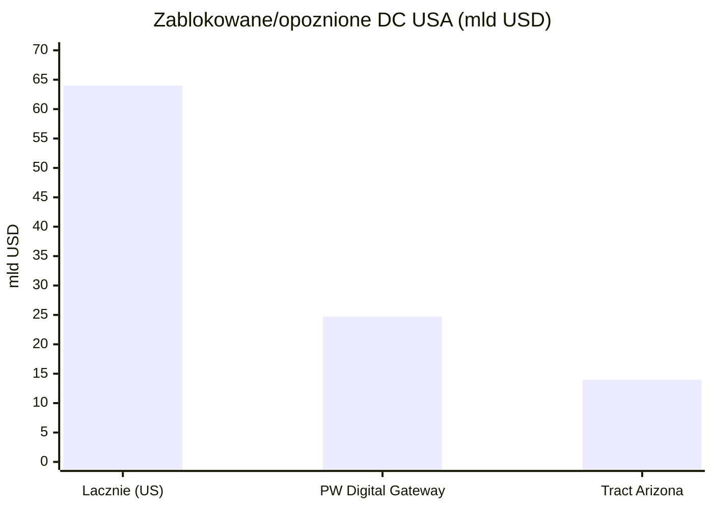
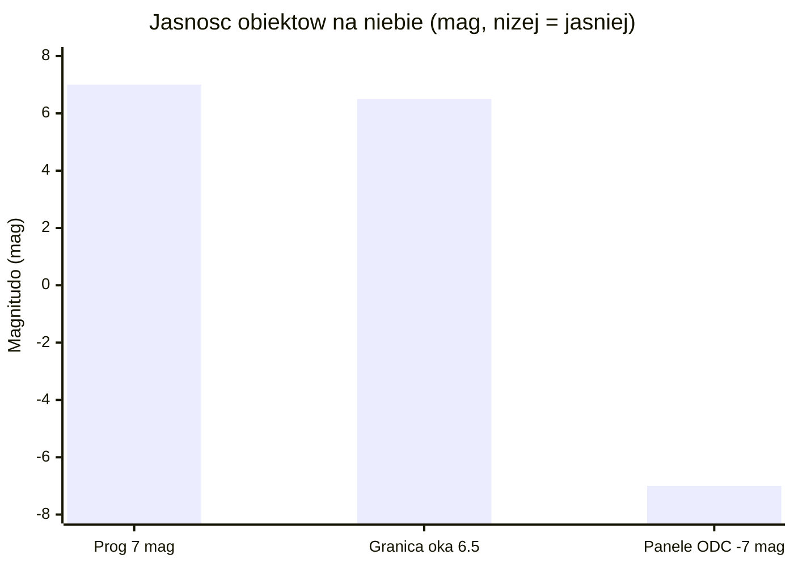

# Sentyment społeczny i moratoria na centra danych

> Notatka raportu "Orbitalne centra danych". Kluczowe źródła: [źródło 1](https://www.datacenterwatch.org/report), [źródło 2](https://www.rockinst.org/blog/updates-on-the-cloud-more-moratoriums-on-data-centers/).

## W skrócie

Naziemne centra danych (DC - obiekty pełne serwerów do obliczeń AI i chmury) napotykają coraz twardszy opór społeczny i regulacyjny: w USA opozycja lokalna zablokowała lub opóźniła projekty warte 64 mld USD 🟠 [Data Center Watch](https://www.datacenterwatch.org/report), 14 stanów rozważa moratoria (czasowe wstrzymanie budowy) 🟠 [Rockefeller Institute](https://www.rockinst.org/blog/updates-on-the-cloud-more-moratoriums-on-data-centers/), a sondaż Gallup z marca 2026 pokazał, że 71% Amerykanów nie chce takiego obiektu w sąsiedztwie 🟠 [the-decoder](https://the-decoder.com/americans-would-rather-live-next-to-a-nuclear-plant-than-an-ai-data-center-gallup-poll-finds/). Dla inwestora ważne są dwie sprzeczne siły: opór lokalnie podnosi koszty i ryzyko opóźnień (kto traci - hyperscalerzy i deweloperzy DC; kto zyskuje - operatorzy alternatyw, w tym narracja "kosmosu"), ale globalny popyt na energię rośnie tak szybko (485 -> 950 TWh do 2030) 🔵 [IEA](https://www.iea.org/reports/key-questions-on-energy-and-ai/executive-summary), że sektor nie zwalnia. Kluczowy haczyk dla wątku orbitalnego: ucieczka na orbitę nie likwiduje oporu - tworzy nowy front, bo astronomowie (<abbr title="Międzynarodowa Unia Astronomiczna, główna światowa organizacja astronomów (jej CPS zajmuje się ochroną nieba).">IAU</abbr>, <abbr title="Amerykańskie Towarzystwo Astronomiczne (ok. 7700 członków), aktywne w sprzeciwie wobec megakonstelacji.">AAS</abbr>, ESO, RAS) ostro protestują przeciw planom milionów jasnych satelitów. Tempo zmian jest szybkie: legislacja stanowa, wnioski do FCC i preprint Marcy'ego z 2026 r. pojawiły się w ciągu kilkunastu miesięcy.

<!-- network:watki:start -->
## Powiązane wątki

> Mapa powiązań tematycznych - jak ten wątek łączy się z resztą raportu.

- [[12 - naziemny-bottleneck-energetyczny-i-sieciowy|Naziemny bottleneck]] - moratoria i protesty to część naziemnego bottlenecku
- [[11 - regulacje-prawo-kosmiczne-debris-i-itu|Regulacje i debris]] - light pollution łączy sentyment z regulacją astronomiczną
- [[14 - zrownowazony-rozwoj-i-srodowisko|Środowisko]] - presja ESG i argumenty środowiskowe napędzają sentyment
- [[10 - gracze-i-projekty|Gracze i projekty]] - narracja "data centers in space" jako PR graczy
<!-- network:watki:end -->
## Moratoria i ograniczenia naziemne

Opór wobec naziemnych DC przeszedł w 2026 r. z fazy protestów do fazy prawa. Według Rockefeller Institute na czerwiec 2026 r. 14 stanów USA rozważa lub rozważało moratorium na centra danych 🟠 [Rockefeller Institute](https://www.rockinst.org/blog/updates-on-the-cloud-more-moratoriums-on-data-centers/). W pierwszych sześciu tygodniach 2026 r. w ponad 30 stanach złożono ponad 300 projektów ustaw dotyczących DC - to przesunięcie od zachęt podatkowych ku nadzorowi regulacyjnemu 🟠 [MultiState](https://www.multistate.us/insider/2026/2/20/state-data-center-legislation-in-2026-tackles-energy-and-tax-issues).

Uwaga terminologiczna: "<abbr title="jednostka mocy elektrycznej obiektu; ustawy często ustalają próg w MW, powyżej którego DC podlega zakazowi.">MW</abbr>" (megawat) to miara mocy elektrycznej obiektu - większość ustaw ustawia próg w MW, powyżej którego DC podlega zakazowi. Najostrzejsze przykłady: Georgia (HB 1059) blokuje zezwolenia do grudnia 2028 r. 🟠, Oklahoma (SB 1488) wstrzymuje DC >=100 MW do 1 listopada 2029 r. 🟠, Vermont (S 205) zakazuje "AI data centers" >=100 MW do 2030 r. 🟠, a Virginia (HB 1515) blokuje obiekty >=1 MW do lipca 2028 r. lub do opróżnienia kolejki przyłączeniowej 🟠 [Rockefeller Institute](https://www.rockinst.org/blog/updates-on-the-cloud-more-moratoriums-on-data-centers/). Część prób utknęła: Maine (LD 307, moratorium na DC >20 MW do listopada 2027 r.) zostało zawetowane przez gubernatora, a New York (AB 10141/SB 9144, roczne moratorium na DC >=20 MW) przeszło legislaturę, ale czeka na decyzję gubernator Hochul 🟠 [Rockefeller Institute](https://www.rockinst.org/blog/updates-on-the-cloud-more-moratoriums-on-data-centers/). Implikacja dla inwestora: ryzyko legislacyjne jest realne, ale rozdrobnione i często niedokończone - to raczej podnoszenie kosztu i czasu projektu niż twardy zakaz.

W Europie ograniczenia są starsze i twardsze. Amsterdam zdecydował, że nie wyda zgody na żadne nowe DC ani ich rozbudowę w gminie, a do sprawy wróci dopiero w 2030 r. 🟠 [NL Times](https://nltimes.nl/2025/04/18/amsterdam-allowing-data-centers-municipality). W Irlandii operator sieci EirGrid już w 2022 r. nałożył moratorium na nowe DC w Dublinie do 2028 r. 🟠 [PublicPolicy.ie](https://publicpolicy.ie/papers/data-centres-in-ireland/) - kontekst jest dramatyczny: w 2023 r. centra danych zużyły 21% całej zmierzonej energii elektrycznej w Irlandii, o 20% więcej rok do roku 🟠 [PublicPolicy.ie](https://publicpolicy.ie/papers/data-centres-in-ireland/). Wcześniejszym precedensem był Singapur, który wprowadził prawie trzyletnią przerwę w zezwoleniach (2019-2022) 🔴 [MindStudio](https://www.mindstudio.ai/blog/data-center-moratorium-compute-paradox). Implikacja: dojrzałe rynki potrafią twardo zatrzymać podaż mocy, co bezpośrednio wspiera narrację "wynieśmy obliczenia gdzie indziej".

## Sondaż Gallup III.2026 i inne badania opinii

Najmocniejszym sygnałem nastrojów jest sondaż Gallup z marca 2026 r.: siedmiu na dziesięciu Amerykanów (70%) sprzeciwia się budowie centrum danych AI w swojej okolicy, w tym 48% "mocno" 🔵 [Gallup](https://www.gallup.com/topic/artificial-intelligence.aspx). Relacja branżowa podaje 71% sprzeciwu (48% mocno) i dorzuca uderzające porównanie - tylko 53% Amerykanów sprzeciwia się elektrowni jądrowej w sąsiedztwie, czyli ludzie wolą sąsiada-reaktor niż sąsiada-DC 🟠 [the-decoder](https://the-decoder.com/americans-would-rather-live-next-to-a-nuclear-plant-than-an-ai-data-center-gallup-poll-finds/). Opór ma wymiar polityczny i geograficzny: 56% Demokratów "mocno się sprzeciwia" wobec 39% Republikanów, a regionalnie najsilniejszy jest na Środkowym Zachodzie (76%) i Południu (75%) 🟠 [the-decoder](https://the-decoder.com/americans-would-rather-live-next-to-a-nuclear-plant-than-an-ai-data-center-gallup-poll-finds/).

*Rys. 69 - Stosunek Amerykanów do budowy centrum danych AI w sąsiedztwie (sondaż Gallup, III.2026). Dane: Gallup.*

Obraz nie jest jednak jednoznacznie wrogi. Sondaż Data for Progress z sierpnia 2025 r. (próba ważona N=1179) pokazał, że tylko 36% respondentów sprzeciwia się nowym DC w swoim stanie, a 51% je popiera 🔵 [Data for Progress](https://www.filesforprogress.org/datasets/2025/8/dfp_data_centers_tabs.pdf). Rozbieżność wynika z framingu pytania ("w moim stanie" vs "w mojej okolicy"). Implikacja dla inwestora: efekt <abbr title="postawa akceptacji idei (np. AI), ale sprzeciwu wobec jej realizacji we własnym sąsiedztwie.">NIMBY</abbr> ("Not In My Backyard" - akceptuję ideę, byle nie u mnie) jest realny i to on, a nie ogólna niechęć do AI, napędza blokady lokalne.

*Rys. 70 - Stosunek do nowych centrów danych w swoim stanie (Data for Progress, VIII.2025, N=1179; "brak zdania" jako dopełnienie do 100%). Dane: Data for Progress.*

## Opór lokalny: woda, energia, hałas, protesty, presja ESG

Skala blokad jest mierzalna. Data Center Watch szacuje 64 mld USD projektów w USA zablokowanych lub opóźnionych przez rosnącą, ponadpartyjną opozycję 🟠 [Data Center Watch](https://www.datacenterwatch.org/report); zidentyfikowano co najmniej 142 grupy aktywistów w 24 stanach oraz ponad 23 petycje z ponad 31 000 podpisów od 2022 r. 🟠 [Data Center Watch](https://www.datacenterwatch.org/report). Heatmap Pro naliczył 25 anulowanych projektów w 2025 r. - czterokrotnie więcej niż w 2024 r. - z czego 21 padło w drugiej połowie roku 🟠 [Heatmap](https://heatmap.news/politics/data-center-cancellations-2025). Konkretne kwoty: projekt Tract w Arizonie o wartości 14 mld USD wycofano po naciskach mieszkańców, a PW Digital Gateway (QTS/Compass) za 24,7 mld USD utknął w co najmniej trzech procesach sądowych 🟠 [Data Center Watch](https://www.datacenterwatch.org/report). Frekwencja na spotkaniach mówi sama za siebie: ponad 500 osób na radzie Warrenton w Wirginii (ok. 130 zabrało głos, w tym aktor Robert Duvall) i ponad 350 mieszkańców przeciw projektowi Ranalli Lysander (300 MW) w stanie Nowy Jork 🟠 [Data Center Watch](https://www.datacenterwatch.org/report) 🟠 [Rockefeller Institute](https://www.rockinst.org/blog/updates-on-the-cloud-more-moratoriums-on-data-centers/).

*Rys. 71 - Wartość zablokowanych lub opóźnionych projektów DC w USA: suma oraz dwa największe pojedyncze przypadki. Dane: Data Center Watch.*

Trzy fizyczne osie konfliktu to woda, energia i hałas. Średniej wielkości DC może zużyć do ok. 110 mln galonów wody rocznie na chłodzenie - tyle, ile rocznie ok. 1000 gospodarstw domowych 🟠 [Public Power](https://www.publicpower.org/periodical/article/strategies-address-water-use-emerge-wake-community-opposition-data-centers). Po stronie energii: globalne zużycie energii elektrycznej przez DC wzrosło o 17% w 2025 r., a w samych obiektach AI aż o 50% 🔵 [IEA](https://www.iea.org/reports/key-questions-on-energy-and-ai/executive-summary). IEA prognozuje podwojenie z 485 TWh (2025) do 950 TWh (2030), co da ok. 3% globalnego zapotrzebowania na prąd 🔵 [IEA](https://www.iea.org/reports/key-questions-on-energy-and-ai/executive-summary). Obrazowo: jedna zaawansowana szafa serwerowa AI do 2027 r. będzie mieć szczytowe zapotrzebowanie mocy jak 65 gospodarstw domowych 🔵 [IEA](https://www.iea.org/reports/key-questions-on-energy-and-ai/executive-summary). Nakłady pięciu największych firm technologicznych przekroczyły 400 mld USD w 2025 r. i mają wzrosnąć o kolejne 75% w 2026 r. 🔵 [IEA](https://www.iea.org/reports/key-questions-on-energy-and-ai/executive-summary). Implikacja: to właśnie ta skala zużycia wody i energii daje paliwo protestom - i jednocześnie czyni "darmowe słońce na orbicie i brak wody do chłodzenia" atrakcyjną opowieścią.

Presja <abbr title="kryteria oceny firmy pod kątem środowiska, spraw społecznych i ładu korporacyjnego (environmental, social, governance).">ESG</abbr> (kryteria środowiskowe, społeczne i ładu korporacyjnego) zaostrza problem PR-owo. Microsoft deklaruje cel carbon-negative, water-positive i zero-waste do 2030 r. 🟠 [Urban Land](https://urbanland.uli.org/resilience-and-sustainability/nuclear-power-makes-a-comeback-as-data-centers-adapt-to-rising-power-demands), Amazon - 100% energii odnawialnej do 2025 r. i net-zero do 2040 r. 🟠 [Urban Land](https://urbanland.uli.org/resilience-and-sustainability/nuclear-power-makes-a-comeback-as-data-centers-adapt-to-rising-power-demands), a Google - całodobowo bezemisyjną energię i uzupełnianie 120% zużytej wody do 2030 r. 🔴 [GartSolutions](https://gartsolutions.com/green-clouds-how-to-slash-carbon-emissions-with-cloud-computing-strategies/). Te deklaracje zderzają się z danymi: w 2023 r. 42% wody Microsoftu pochodziło z obszarów "water stress", a w 2024 r. 15% poboru świeżej wody Google'a z regionów "high water scarcity" 🔵 [arXiv 2512.03077](https://arxiv.org/html/2512.03077v2). Implikacja dla inwestora: rozjazd między celami a faktami to dokładnie ten obszar, w którym pojawia się ryzyko zarzutu greenwashingu - i w którym narracja kosmiczna może być wykorzystana jako tarcza wizerunkowa.

## Narracja "data centers in space": PR/greenwashing czy realny pivot

Argument za realnym pivotem jest poparty oficjalnymi projektami. Europejski projekt ASCEND (Thales Alenia Space / ESA) celuje w 1 GW mocy obliczeniowej w kosmosie do 2050 r. i podkreśla zerowe zużycie wody do chłodzenia w próżni 🔵 [ASCEND](https://ascend-horizon.eu/). Google w preprincie Project Suncatcher proponuje "kosmiczne centra danych ML" z układami TPU, wskazując, że panele na pewnych orbitach dostają do 8x więcej energii słonecznej rocznie niż panel na Ziemi w średnich szerokościach 🔵 [arXiv 2511.19468](https://arxiv.org/pdf/2511.19468); próg opłacalności to spadek kosztu wynoszenia na niską orbitę (LEO) do 200 USD/kg 🔵 [arXiv 2511.19468](https://arxiv.org/pdf/2511.19468). Skala wniosków do amerykańskiego regulatora FCC jest ogromna: SpaceX złożył wniosek o do 1 mln satelitów "orbital data-center" z deklarowanymi 100 GW mocy AI rocznie 🔵 [FCC DA-26-113A1](https://docs.fcc.gov/public/attachments/DA-26-113A1.pdf), Blue Origin o 51 600 satelitów ("Project Sunrise") 🔵 [FCC DOC-420864A1](https://docs.fcc.gov/public/attachments/DOC-420864A1.pdf), a startup Starcloud (dawniej Lumen Orbit) o do 88 000 satelitów 🔵 [FCC DOC-419509A1](https://docs.fcc.gov/public/attachments/DOC-419509A1.pdf). Starcloud zebrał łącznie 21 mln USD finansowania seed 🔴 [everywhere.vc](https://ideas.everywhere.vc/p/lumen-orbit-is-now-starcloudand-it), ma <abbr title="niewiążąca deklaracja współpracy między stronami (memorandum of understanding).">MOU</abbr> (listy intencyjne) na ponad 30 mln USD 🟠 [DCD](https://www.datacenterdynamics.com/en/news/lumen-orbit-raises-24m-for-space-data-centers/) i planuje kompleks 5 GW z panelami ok. 4 km na 4 km 🟠 [IDC Nova](https://www.idcnova.com/html/1/59/153/4523.html).

Argument za greenwashingiem/PR jest równie konkretny. Brak peer-reviewed audytu cyklu życia (LCA) dla komercyjnego orbitalnego DC - to jest NIE UJAWNIONE, istnieją tylko studia wykonalności i koncepcje. Sam ASCEND zastrzega, że korzyść klimatyczna wymaga wynoszenia rakietą o 10x mniejszej emisyjności niż dzisiejsze - warunek, który analiza Carbone 4 określa jako wymagający "prawdziwego wyczynu" europejskiego sektora kosmicznego 🔵 [ASCEND](https://ascend-horizon.eu/). Cytowane przez CEO Starcloud porównanie "zamiast 140 mln USD za prąd zapłać 10 mln USD za start i panele" pochodzi ze słabego źródła i nie jest niezależnie zweryfikowane 🔴 [Manifold](https://manifold.markets/HenriThunberg/5-multiple-serious-efforts-to-put-a). Implikacja dla inwestora: deklaracje mocy (1 GW, 100 GW) i liczby satelitów są realnymi sygnałami popytu/intencji, ale przepaść między koncepcją a działającym, opłacalnym i klimatycznie korzystnym obiektem jest na ten moment niezamknięta dowodami.

## Astronomowie i "Not In My Sky": zanieczyszczenie świetlne

Najpoważniejszym dotąd frontem oporu wobec kosmosu jest astronomia. Już dla planowanych ponad 100 000 satelitów LEO raport AAS SATCON1 stwierdza, że "żadna kombinacja środków łagodzących nie wyeliminuje w pełni wpływu" śladów satelitów na naziemną astronomię optyczną 🔵 [AAS SATCON1](https://aas.org/sites/default/files/2020-08/SATCON1-Report.pdf). ESO przeanalizowało 18 konstelacji o łącznie ponad 26 000 satelitów i oszacowało, że 30-50% ekspozycji obserwatorium Vera C. Rubin o zmierzchu i świcie byłoby "severely affected", a do 3% długich ekspozycji VLT/ELT - zniszczonych 🔵 [ESO](https://www.eso.org/public/news/eso2004/). <abbr title="logarytmiczna skala jasności obiektu; niższa wartość oznacza obiekt jaśniejszy (granica widoczności gołym okiem to ok. 6-7 mag).">Magnituda</abbr> (mag) to logarytmiczna skala jasności, gdzie niższa wartość oznacza obiekt jaśniejszy; granicą widoczności gołym okiem jest ok. 6-7 mag. Stąd próg: AAS, ESO i IAU CPS rekomendują jasność <=7 mag 🔵 [AAS SATCON1](https://aas.org/sites/default/files/2020-08/SATCON1-Report.pdf) 🔵 [IAU CPS techdoc102](https://noirlab.edu/public/media/archives/techdocs/pdf/techdoc102.pdf).

![[assets/y12-1-pia21423.jpg]]
*Rys. 72 - Astronomia: Surface of TRAPPIST-1f. Źródło: NASA, licencja: public domain.*
#grafika #sentyment-spoleczny-i-moratoria-na-centra-danych #astronomia #slady-satelitow

Próg 7 mag wszedł już do prawa: francuska ustawa kosmiczna (FSOA) wymaga, by każdy satelita megakonstelacji projektowano z celem jasności >=7 mag, a proponowany unijny EU Space Act wprowadza próg <7 mag z podejściem skalowanym do wielkości floty 🔵 [UNOOSA CRP22](https://www.unoosa.org/res/oosadoc/data/documents/2026/aac_105c_12026crp/aac_105c_12026crp_22rev_1_0_html/AC105_C1_2026_CRP22Rev01E.pdf). Przekroczenie tego progu daje prawie dziesięciokrotną utratę danych z powodu artefaktów kalibracji 🔵 [UNOOSA CRP22](https://www.unoosa.org/res/oosadoc/data/documents/2026/aac_105c_12026crp/aac_105c_12026crp_22rev_1_0_html/AC105_C1_2026_CRP22Rev01E.pdf). SpaceX próbował łagodzić problem: testy ponad 300 satelitów na ok. 350 km zamiast 550 km dały ok. 60% redukcji obrazów Rubin z oświetlonym satelitą 🟠 [PCMag](https://www.pcmag.com/news/spacex-lowering-starlink-satellite-orbits-reduces-impact-on-astronomy), co potwierdza UNOOSA (do 40% mniej smug na obraz dla 350 km vs 550 km) 🔵 [UNOOSA CRP22](https://www.unoosa.org/res/oosadoc/data/documents/2026/aac_105c_12026crp/aac_105c_12026crp_22rev_1_0_html/AC105_C1_2026_CRP22Rev01E.pdf). Implikacja: istnieje gotowa ścieżka regulacyjna (próg jasności, niższe orbity), którą państwa mogą nałożyć na orbitalne DC - czyli to samo ryzyko regulacyjne, przed którym sektor uciekał na Ziemi, czeka go na orbicie.

Reakcja środowiska na wnioski o orbitalne DC była natychmiastowa i ostra. RAS, ESO i IAU złożyły komentarze sprzeciwiające się planom SpaceX i Reflect Orbital, ostrzegając, że "ponad milion wyjątkowo jasnych satelitów" trwale zniszczy dziedzictwo nocnego nieba 🟠 [RAS](https://ras.ac.uk/news-and-press/news/spacex-and-reflect-orbital-plans-would-permanently-scar-night-sky); średnio każdy obraz z VLT traciłby 10% danych 🟠 [RAS](https://ras.ac.uk/news-and-press/news/spacex-and-reflect-orbital-plans-would-permanently-scar-night-sky). AAS (ok. 7700 członków) złożyło petycję o odmowę zezwolenia, nazywając konstelację "bezprecedensowym zagrożeniem dla wizualnej integralności nocnego nieba", i mobilizowało członków do komentarzy w FCC 🟠 [Satellite Today](https://www.satellitetoday.com/connectivity/2026/03/11/amazons-petition-to-deny-spacex-orbital-data-constellation-draws-criticism-from-brendan-carr/) 🟠 [PCMag](https://www.pcmag.com/news/spacexs-plan-for-1-million-satellites-faces-light-pollution-backlash). Wniosek SpaceX zwiększyłby liczbę satelitów na orbicie - obecnie ok. 14 500 - około 70-krotnie 🟠 [PCMag](https://www.pcmag.com/news/spacexs-plan-for-1-million-satellites-faces-light-pollution-backlash). Astronomowie podkreślają, że to "całkowite odwrócenie" ostatnich lat postępu z przyciemnianiem Starlinków 🟠 [Yahoo](https://www.yahoo.com/news/articles/spacex-plan-1-million-orbiting-100000799.html). Uwaga: nie istnieje zorganizowany ruch obywatelski o nazwie <abbr title="hasłowe określenie oporu astronomów wobec satelitów; w notatce zaznaczono, że nie jest to zorganizowany ruch oddolny, lecz sprzeciw instytucjonalny.">"Not In My Sky"</abbr> - to opór instytucjonalny środowiska naukowego, nie oddolny ruch typu NIMBY.

![[assets/y12-2-pia26662.jpg]]
*Rys. 73 - Astronomia: DSOC's Table Mountain Facility Uplink Laser - Infrared vs. Visible Light. Źródło: NASA, licencja: public domain.*
#grafika #sentyment-spoleczny-i-moratoria-na-centra-danych #astronomia #slady-satelitow

## Kilometrowe panele jako obiekty -5 do -7 mag

Nowy, najostrzejszy front otworzył preprint Marcy'ego z 2026 r. Wytworzenie 5 GW wymaga paneli o powierzchni 15 km2, czyli macierzy 4 km na 4 km (przy strumieniu słonecznym 1361 W/m2 i sprawności 25%) 🔵 [arXiv 2603.28829](https://arxiv.org/pdf/2603.28829). Taki panel na niskiej orbicie ma rozmiar kątowy ok. 0,4 stopnia - porównywalny z tarczą Księżyca 🔵 [arXiv 2603.28829](https://arxiv.org/pdf/2603.28829), i ma 140 000 razy większą powierzchnię przekroju niż dzisiejszy satelita Starlink (panele Starlink to ok. 105 m2) 🔵 [arXiv 2603.28829](https://arxiv.org/pdf/2603.28829). Odbite światło słoneczne sprawiłoby, że obiekt świeciłby z jasnością g od -5 do -7 mag, czyli ok. 100 razy jaśniej niż najjaśniejsze gwiazdy (to ok. 1/20 jasności Księżyca w kwadrze) 🔵 [arXiv 2603.28829](https://arxiv.org/pdf/2603.28829).

*Rys. 74 - Porównanie jasności: regulacyjny próg 7 mag i granica widoczności gołym okiem (ok. 6-7 mag) wobec paneli orbitalnych DC (-5 do -7 mag). Dane: arXiv 2603.28829, IAU CPS techdoc102.*

Mechanizm zakłócenia jest konkretny. Orbity sun-synchronous (przebiegające nad biegunami) na ok. 500-550 km sprawiają, że obiekty są widoczne ok. 90 min po zachodzie i 90 min przed wschodem słońca, łącznie co najmniej ok. 6 godzin na dobę, okrążając Ziemię co 90 min 🔵 [arXiv 2603.28829](https://arxiv.org/pdf/2603.28829). Dziesiątki takich struktur utworzyłyby na niebie łańcuch obiektów przemysłowych z północy na południe, blokując gwiazdy, planety i obiekty głębokiego nieba na czas od kilku sekund do minut 🔵 [arXiv 2603.28829](https://arxiv.org/pdf/2603.28829). Wniosek SpaceX do FCC potwierdza orbity 500-2000 km i inklinacje 30 stopni oraz sun-synchronous 🔵 [FCC DA-26-113A1](https://docs.fcc.gov/public/attachments/DA-26-113A1.pdf), Starcloud 600-850 km 🔵 [FCC DOC-419509A1](https://docs.fcc.gov/public/attachments/DOC-419509A1.pdf), Blue Origin 500-1800 km 🔵 [FCC DOC-420864A1](https://docs.fcc.gov/public/attachments/DOC-420864A1.pdf). Implikacja dla inwestora: w odróżnieniu od Starlinków (które nocą są w cieniu Ziemi), te obiekty na wysokich inklinacjach byłyby w pełni oświetlone nawet o północy 🟠 [Yahoo](https://www.yahoo.com/news/articles/spacex-plan-1-million-orbiting-100000799.html) - co czyni argument astronomów trudnym do zbycia i tworzy ryzyko regulacyjne dla całej klasy aktywów.

## Akceptacja publiczna przetwarzania danych w kosmosie

Bezpośredni sondaż akceptacji publicznej dla "orbitalnych centrów danych" lub "przetwarzania danych w kosmosie" jest NIE UJAWNIONE - po przeszukaniu nie znaleziono publicznie dostępnego badania zadającego wprost takie pytanie. Najbliższe proxy to 70% Amerykanów przeciw naziemnym DC AI 🔵 [Gallup](https://www.gallup.com/topic/artificial-intelligence.aspx). Drugie proxy działa w odwrotną stronę: Starlink obsługuje ponad 600 000 lokalizacji w USA 🔵 [IAU CPS](https://cps.iau.org/news/nsf-and-spacex-sign-agreement-to-mitigate-impact-of-starlink-satellites-on-ground-based-astronomy/), co pokazuje, że masowa infrastruktura kosmiczna potrafi zyskać akceptację użytkową, gdy daje wymierną korzyść. Implikacja: brak danych o akceptacji orbitalnych DC to samo w sobie ryzyko - inwestor nie ma jak wycenić reakcji opinii publicznej, a precedens astronomiczny sugeruje, że "kosmos" nie jest neutralny społecznie.

## Kontrowersje

**1. Czy presja społeczna realnie wypycha DC z Ziemi, czy to czynnik marginalny?**

Strona A (presja realnie blokuje/opóźnia): 64 mld USD projektów w USA zablokowanych lub opóźnionych 🟠 [Data Center Watch](https://www.datacenterwatch.org/report); 25 anulowanych projektów w 2025 r., czterokrotnie więcej niż w 2024 r. 🟠 [Heatmap](https://heatmap.news/politics/data-center-cancellations-2025); 14 stanów z moratoriami lub ich rozważaniem 🟠 [Rockefeller Institute](https://www.rockinst.org/blog/updates-on-the-cloud-more-moratoriums-on-data-centers/); całkowity zakaz w Amsterdamie 🟠 [NL Times](https://nltimes.nl/2025/04/18/amsterdam-allowing-data-centers-municipality) i moratorium w Dublinie do 2028 r. 🟠 [PublicPolicy.ie](https://publicpolicy.ie/papers/data-centres-in-ireland/).

Strona B (globalnie marginalny wobec popytu): globalne zużycie energii DC rośnie z 485 do 950 TWh w latach 2025-2030 🔵 [IEA](https://www.iea.org/reports/key-questions-on-energy-and-ai/executive-summary); zużycie AI DC wzrosło o 50% w samym 2025 r. 🔵 [IEA](https://www.iea.org/reports/key-questions-on-energy-and-ai/executive-summary); nakłady pięciu gigantów >400 mld USD w 2025 r. i +75% w 2026 r. 🔵 [IEA](https://www.iea.org/reports/key-questions-on-energy-and-ai/executive-summary); na czerwiec 2026 r. większość projektów ustaw ma status "Introduced", Maine zawetowane, Nowy Jork czeka - liczba trwale obowiązujących stanowych moratoriów jest bliska zeru 🟠 [Rockefeller Institute](https://www.rockinst.org/blog/updates-on-the-cloud-more-moratoriums-on-data-centers/). Synteza ze źródeł: teza "presja nie ma znaczenia" jest obalona lokalnie (64 mld USD, 25 anulowań), ale potwierdzona globalnie - opór podnosi koszt i czas, lecz nie zatrzymuje sektora.

**2. Czy orbita to ucieczka od oporu, czy nowy front konfliktu?**

Strona A (orbita jako realny pivot/ucieczka): ASCEND celuje w 1 GW w kosmosie do 2050 r. 🔵 [ASCEND](https://ascend-horizon.eu/); Google Project Suncatcher to oficjalny research z TPU w kosmosie i 8x więcej energii słonecznej niż na Ziemi 🔵 [arXiv 2511.19468](https://arxiv.org/pdf/2511.19468); SpaceX złożył do FCC wniosek na 1 mln satelitów i 100 GW AI rocznie 🔵 [arXiv 2603.28829](https://arxiv.org/pdf/2603.28829); Starcloud 21 mln USD seed 🔴 [everywhere.vc](https://ideas.everywhere.vc/p/lumen-orbit-is-now-starcloudand-it).

Strona B (orbita to nowy front): dla 100 000+ satelitów LEO "żadna kombinacja środków łagodzących nie wyeliminuje wpływu" na astronomię 🔵 [AAS SATCON1](https://aas.org/sites/default/files/2020-08/SATCON1-Report.pdf); panele orbitalnych DC mają 140 000 razy większą powierzchnię niż Starlink 🔵 [arXiv 2603.28829](https://arxiv.org/pdf/2603.28829) i jasność g do -7 mag, 100x jaśniej niż najjaśniejsze gwiazdy 🔵 [arXiv 2603.28829](https://arxiv.org/pdf/2603.28829); na LEO jest już ponad 1 mln fragmentów gruzu 1-10 cm 🔵 [arXiv 2603.28829](https://arxiv.org/pdf/2603.28829), z prędkościami względnymi ok. 10 km/s (uderzenie 1 kg = ok. 5x10^7 J) 🔵 [arXiv 2603.28829](https://arxiv.org/pdf/2603.28829); RAS/ESO/IAU i AAS formalnie sprzeciwiają się planom 🟠 [RAS](https://ras.ac.uk/news-and-press/news/spacex-and-reflect-orbital-plans-would-permanently-scar-night-sky). Synteza: orbita nie eliminuje oporu - przenosi go z mieszkańców i samorządów na środowisko naukowe i regulatorów jasności/debris, a próg 7 mag jest już w prawie francuskim i projekcie EU Space Act 🔵 [UNOOSA CRP22](https://www.unoosa.org/res/oosadoc/data/documents/2026/aac_105c_12026crp/aac_105c_12026crp_22rev_1_0_html/AC105_C1_2026_CRP22Rev01E.pdf).

## Słowniczek pojęć

- **Moratorium** - czasowe, prawnie nałożone wstrzymanie budowy lub wydawania zezwoleń na centra danych.
- **Centrum danych (DC)** - obiekt pełen serwerów do obliczeń AI i chmury, zużywający duże ilości energii i wody.
- **NIMBY ("Not In My Backyard")** - postawa akceptacji idei (np. AI), ale sprzeciwu wobec jej realizacji we własnym sąsiedztwie.
- **MW (megawat)** - jednostka mocy elektrycznej obiektu; ustawy często ustalają próg w MW, powyżej którego DC podlega zakazowi.
- **ESG** - kryteria oceny firmy pod kątem środowiska, spraw społecznych i ładu korporacyjnego (environmental, social, governance).
- **Greenwashing** - tworzenie fałszywego wrażenia ekologiczności, gdy rzeczywiste działania mu przeczą.
- **Audyt cyklu życia (LCA)** - analiza pełnego śladu środowiskowego produktu lub obiektu od produkcji po wycofanie z użycia.
- **MOU (list intencyjny)** - niewiążąca deklaracja współpracy między stronami (memorandum of understanding).
- **Magnituda (mag)** - logarytmiczna skala jasności obiektu; niższa wartość oznacza obiekt jaśniejszy (granica widoczności gołym okiem to ok. 6-7 mag).
- **Orbita LEO** - niska orbita okołoziemska (kilkaset km nad Ziemią), gdzie ma działać większość planowanych konstelacji.
- **Orbita sun-synchronous (SSO)** - orbita biegunowa zsynchronizowana ze Słońcem, na której obiekty pozostają oświetlone o świcie i zmierzchu.
- **Zanieczyszczenie świetlne** - rozjaśnianie nocnego nieba przez sztuczne źródła światła, tu: odbite światło z satelitów zakłócające astronomię.
- **Okultacja** - przesłonięcie obiektu astronomicznego przez inne ciało przechodzące na linii obserwacji (tu: gwiazd i planet przez panele).
- **IAU** - Międzynarodowa Unia Astronomiczna, główna światowa organizacja astronomów (jej CPS zajmuje się ochroną nieba).
- **AAS** - Amerykańskie Towarzystwo Astronomiczne (ok. 7700 członków), aktywne w sprzeciwie wobec megakonstelacji.
- **"Not In My Sky"** - hasłowe określenie oporu astronomów wobec satelitów; w notatce zaznaczono, że nie jest to zorganizowany ruch oddolny, lecz sprzeciw instytucjonalny.

## Źródła

- 🔵 [Gallup - Artificial Intelligence](https://www.gallup.com/topic/artificial-intelligence.aspx) - sondaż III.2026, 70% przeciw naziemnym DC AI.
- 🔵 [IEA - Key Questions on Energy and AI](https://www.iea.org/reports/key-questions-on-energy-and-ai/executive-summary) - zużycie energii DC 485->950 TWh, capex >400 mld USD.
- 🔵 [Data for Progress (PDF)](https://www.filesforprogress.org/datasets/2025/8/dfp_data_centers_tabs.pdf) - sondaż VIII.2025, 36% przeciw / 51% za.
- 🔵 [arXiv 2603.28829 - Marcy, wpływ orbitalnych DC](https://arxiv.org/pdf/2603.28829) - jasność -5 do -7 mag, panele 15 km2, debris.
- 🔵 [arXiv 2511.19468 - Google Project Suncatcher](https://arxiv.org/pdf/2511.19468) - TPU w kosmosie, 8x słońca, próg 200 USD/kg.
- 🔵 [AAS SATCON1 Report (PDF)](https://aas.org/sites/default/files/2020-08/SATCON1-Report.pdf) - 100 000+ LEOsats, brak pełnej mitygacji.
- 🔵 [ESO - press release eso2004](https://www.eso.org/public/news/eso2004/) - 26 000 satelitów, wpływ na Rubin/VLT.
- 🔵 [IAU CPS techdoc102 (NOIRLab PDF)](https://noirlab.edu/public/media/archives/techdocs/pdf/techdoc102.pdf) - formuła progu jasności 7 mag.
- 🔵 [UNOOSA CRP22 (PDF)](https://www.unoosa.org/res/oosadoc/data/documents/2026/aac_105c_12026crp/aac_105c_12026crp_22rev_1_0_html/AC105_C1_2026_CRP22Rev01E.pdf) - prawne progi 7 mag (FSOA, EU Space Act).
- 🔵 [FCC DA-26-113A1 (PDF)](https://docs.fcc.gov/public/attachments/DA-26-113A1.pdf) - wniosek SpaceX 1 mln satelitów.
- 🔵 [FCC DOC-419509A1 (PDF)](https://docs.fcc.gov/public/attachments/DOC-419509A1.pdf) - wniosek Starcloud 88 000 satelitów.
- 🔵 [FCC DOC-420864A1 (PDF)](https://docs.fcc.gov/public/attachments/DOC-420864A1.pdf) - wniosek Blue Origin 51 600 satelitów.
- 🔵 [ASCEND Horizon](https://ascend-horizon.eu/) - projekt UE, 1 GW do 2050, warunek launchera 10x.
- 🔵 [IAU CPS / NSF-SpaceX agreement](https://cps.iau.org/news/nsf-and-spacex-sign-agreement-to-mitigate-impact-of-starlink-satellites-on-ground-based-astronomy/) - 600 000+ lokalizacji Starlink.
- 🔵 [arXiv 2512.03077 - Irresponsible AI](https://arxiv.org/html/2512.03077v2) - woda Microsoft/Google z obszarów stresu wodnego.
- 🟠 [Data Center Watch - report](https://www.datacenterwatch.org/report) - 64 mld USD blokad, 142 grupy, petycje.
- 🟠 [Heatmap - cancellations 2025](https://heatmap.news/politics/data-center-cancellations-2025) - 25 anulowanych projektów.
- 🟠 [Rockefeller Institute - moratoriums](https://www.rockinst.org/blog/updates-on-the-cloud-more-moratoriums-on-data-centers/) - 14 stanów, ustawy stanowe.
- 🟠 [MultiState - state DC legislation 2026](https://www.multistate.us/insider/2026/2/20/state-data-center-legislation-in-2026-tackles-energy-and-tax-issues) - 300+ projektów ustaw.
- 🟠 [the-decoder - Gallup poll](https://the-decoder.com/americans-would-rather-live-next-to-a-nuclear-plant-than-an-ai-data-center-gallup-poll-finds/) - 71% sprzeciw, podział partyjny/regionalny.
- 🟠 [NL Times - Amsterdam moratorium](https://nltimes.nl/2025/04/18/amsterdam-allowing-data-centers-municipality) - zakaz nowych DC.
- 🟠 [PublicPolicy.ie - data centres in Ireland](https://publicpolicy.ie/papers/data-centres-in-ireland/) - Dublin do 2028, 21% energii.
- 🟠 [Public Power - water use](https://www.publicpower.org/periodical/article/strategies-address-water-use-emerge-wake-community-opposition-data-centers) - 110 mln galonów wody.
- 🟠 [Urban Land - hyperscaler ESG](https://urbanland.uli.org/resilience-and-sustainability/nuclear-power-makes-a-comeback-as-data-centers-adapt-to-rising-power-demands) - cele Microsoft/Amazon.
- 🟠 [DataCenterDynamics - Lumen/Starcloud](https://www.datacenterdynamics.com/en/news/lumen-orbit-raises-24m-for-space-data-centers/) - MOU 30 mln USD, satelita 60 kg.
- 🟠 [IDC Nova - Starcloud 5 GW](https://www.idcnova.com/html/1/59/153/4523.html) - kompleks 5 GW, panele 4 km.
- 🟠 [PCMag - 350 km test](https://www.pcmag.com/news/spacex-lowering-starlink-satellite-orbits-reduces-impact-on-astronomy) - 60% redukcja obrazów Rubin.
- 🟠 [PCMag - 1 mln satelitów backlash](https://www.pcmag.com/news/spacexs-plan-for-1-million-satellites-faces-light-pollution-backlash) - 14 500 satelitów, 70x, 7700 członków AAS.
- 🟠 [RAS - SpaceX/Reflect Orbital](https://ras.ac.uk/news-and-press/news/spacex-and-reflect-orbital-plans-would-permanently-scar-night-sky) - formalny sprzeciw, 10% strat VLT.
- 🟠 [Satellite Today - AAS petition](https://www.satellitetoday.com/connectivity/2026/03/11/amazons-petition-to-deny-spacex-orbital-data-constellation-draws-criticism-from-brendan-carr/) - petycja AAS o odmowę.
- 🟠 [Yahoo - 1 mln satelitów](https://www.yahoo.com/news/articles/spacex-plan-1-million-orbiting-100000799.html) - oświetlenie o północy, "complete reversal".
- 🔴 [MindStudio - Singapore moratorium](https://www.mindstudio.ai/blog/data-center-moratorium-compute-paradox) - przerwa 2019-2022.
- 🔴 [everywhere.vc - Starcloud funding](https://ideas.everywhere.vc/p/lumen-orbit-is-now-starcloudand-it) - 21 mln USD seed.
- 🔴 [Manifold - Lumen CEO quote](https://manifold.markets/HenriThunberg/5-multiple-serious-efforts-to-put-a) - 140 mln vs 10 mln USD.
- 🔴 [GartSolutions - Google water](https://gartsolutions.com/green-clouds-how-to-slash-carbon-emissions-with-cloud-computing-strategies/) - cele Google 120% wody.

## Dane źródłowe

- `14 stanów` | https://www.rockinst.org/blog/updates-on-the-cloud-more-moratoriums-on-data-centers/ | secondary | "As of June 2026, 14 states have considered or are considering a moratorium on data centers, meaning a temporary pause on their construction."
- `300+ projektów ustaw` | https://www.multistate.us/insider/2026/2/20/state-data-center-legislation-in-2026-tackles-energy-and-tax-issues | secondary | "In 2026, more than 300 state data center legislation bills have been filed across 30+ states in just six weeks..."
- `Georgia HB 1059 do XII.2028` | https://www.rockinst.org/blog/updates-on-the-cloud-more-moratoriums-on-data-centers/ | secondary | "Georgia (HB 1059): Prohibits local governments from permitting data centers until December 2028."
- `Maine LD 307 >20 MW, weto` | https://www.rockinst.org/blog/updates-on-the-cloud-more-moratoriums-on-data-centers/ | secondary | "Maine (LD 307): Moratorium on data centers until November 2027. 20 Megawatts (MW). Vetoed."
- `New York AB 10141/SB 9144 >=20 MW` | https://www.rockinst.org/blog/updates-on-the-cloud-more-moratoriums-on-data-centers/ | secondary | "New York (AB 10141/ SB 9144): A one-year moratorium on new data centers... Passed by the Legislature; awaiting response from Governor Hochul."
- `Oklahoma SB 1488 >=100 MW do XI.2029` | https://www.rockinst.org/blog/updates-on-the-cloud-more-moratoriums-on-data-centers/ | secondary | "Oklahoma (SB 1488): Prohibits data center construction until November 2029. 100 MW."
- `Vermont S 205 >=100 MW do 2030` | https://www.rockinst.org/blog/updates-on-the-cloud-more-moratoriums-on-data-centers/ | secondary | "Vermont (S 205): Requires an impact study and creates a moratorium on the siting and construction of AI data centers until 2030. 100 MW."
- `Virginia HB 1515 >=1 MW do VII.2028` | https://www.rockinst.org/blog/updates-on-the-cloud-more-moratoriums-on-data-centers/ | secondary | "Virginia (HB 1515): Moratorium on new data centers until all interconnection requests are fulfilled or until July 2028. 1 MW."
- `Amsterdam zakaz, review 2030` | https://nltimes.nl/2025/04/18/amsterdam-allowing-data-centers-municipality | secondary | "Amsterdam has decided to allow no more data centers or any expansions of data centers in the municipality... look into the options for more data centers again in 2030."
- `Dublin moratorium do 2028` | https://publicpolicy.ie/papers/data-centres-in-ireland/ | secondary | "EirGrid, went one step further and issued a moratorium on the development of new data centres specifically in Dublin until 2028."
- `21% energii Irlandii (2023)` | https://publicpolicy.ie/papers/data-centres-in-ireland/ | secondary | "In 2023, data centres in Ireland used 21% of total metered electricity consumption, which is a 20% increase from its 2022 figure of 18%."
- `Singapur pauza 2019-2022` | https://www.mindstudio.ai/blog/data-center-moratorium-compute-paradox | weak | "Singapore - enacted a nearly three-year pause on new data center permits from 2019 to 2022."
- `70% przeciw AI DC w okolicy` | https://www.gallup.com/topic/artificial-intelligence.aspx | primary | "Seven in 10 Americans oppose the construction of an AI data center in their local area, including 48% strongly opposed."
- `71% sprzeciw / 48% mocno` | https://the-decoder.com/americans-would-rather-live-next-to-a-nuclear-plant-than-an-ai-data-center-gallup-poll-finds/ | secondary | "A new Gallup poll finds 71 percent of respondents oppose building AI data centers near their homes, 48 percent 'strongly.'"
- `53% przeciw elektrowni jądrowej` | https://the-decoder.com/americans-would-rather-live-next-to-a-nuclear-plant-than-an-ai-data-center-gallup-poll-finds/ | secondary | "Only 53 percent object to a nearby nuclear plant, a figure that has never topped 63 percent since 2001."
- `56% Demokraci / 39% Republikanie` | https://the-decoder.com/americans-would-rather-live-next-to-a-nuclear-plant-than-an-ai-data-center-gallup-poll-finds/ | secondary | "Democrats are far more likely to be 'strongly opposed' (56 percent) than Republicans (39 percent)."
- `76% Midwest / 75% South` | https://the-decoder.com/americans-would-rather-live-next-to-a-nuclear-plant-than-an-ai-data-center-gallup-poll-finds/ | secondary | "Resistance runs strongest in the Midwest (76 percent) and South (75 percent)."
- `36% przeciw / 51% za (N=1179)` | https://www.filesforprogress.org/datasets/2025/8/dfp_data_centers_tabs.pdf | primary | "OPPOSE (TOTAL) 36 ... SUPPORT (TOTAL) 51 ... Weighted N 1,179."
- `64 mld USD zablokowanych/opóźnionych` | https://www.datacenterwatch.org/report | secondary | "$64 billion in US data center projects have been blocked or delayed by a growing wave of local, bipartisan opposition."
- `25 anulowanych w 2025 (4x)` | https://heatmap.news/politics/data-center-cancellations-2025 | secondary | "25 data centers were scrubbed last year after local pushback - four times as many as 2024."
- `21 z 25 w II połowie roku` | https://heatmap.news/politics/data-center-cancellations-2025 | secondary | "Of the 25 data center projects canceled due to local opposition last year, 21 were terminated in the second half of 2025."
- `142 grupy aktywistów / 24 stany` | https://www.datacenterwatch.org/report | secondary | "Data Center Watch identified at least 142 activist groups operating across 24 states campaigning against new developments."
- `31000+ podpisów / 23 petycje` | https://www.datacenterwatch.org/report | secondary | "Data Center Watch has identified more than 23 petitions with more than 31,000 signatures since 2022."
- `500+ osób / 130 mówców Warrenton` | https://www.datacenterwatch.org/report | secondary | "Over 500 people attending a Town Council meeting and nearly 130 speakers expressing opposition, including Oscar-winner Robert Duvall."
- `350+ mieszkańców Lysander (300 MW)` | https://www.rockinst.org/blog/updates-on-the-cloud-more-moratoriums-on-data-centers/ | secondary | "more than 350 residents attended and shared their opposition to the proposed Ranalli Lysander Data Center, which is expected to have a 300 MW capacity."
- `14 mld USD Tract Arizona wycofany` | https://www.datacenterwatch.org/report | secondary | "1 - Goodyear and Buckeye, Arizona. $14 billion. Tract. - Blocked (Withdrawn by the developer)."
- `24,7 mld USD PW Digital Gateway` | https://www.datacenterwatch.org/report | secondary | "7 - Prince William, Virginia. $24.7 billion. QTS & Compass Data Centers. - Delayed... being contested in court through at least three lawsuits."
- `110 mln galonów wody/rok (~1000 gospodarstw)` | https://www.publicpower.org/periodical/article/strategies-address-water-use-emerge-wake-community-opposition-data-centers | secondary | "A medium-sized data center can consume up to roughly 110 million gallons of water per year for cooling purposes, equivalent to the annual water usage of approximately 1,000 households..."
- `17% wzrost zużycia energii DC 2025` | https://www.iea.org/reports/key-questions-on-energy-and-ai/executive-summary | primary | "The global electricity demand of data centres... grew by 17% in 2025, in line with IEA projections."
- `50% wzrost AI DC 2025` | https://www.iea.org/reports/key-questions-on-energy-and-ai/executive-summary | primary | "Electricity consumption from AI-focused data centres grew even faster, surging 50% in 2025."
- `485 TWh (2025)` | https://www.iea.org/reports/key-questions-on-energy-and-ai/executive-summary | primary | "electricity consumption from data centres roughly doubling from 485 TWh in 2025 to 950 TWh in 2030."
- `950 TWh (2030)` | https://www.iea.org/reports/key-questions-on-energy-and-ai/executive-summary | primary | "...roughly doubling from 485 TWh in 2025 to 950 TWh in 2030."
- `3% globalnego zapotrzebowania (2030)` | https://www.iea.org/reports/key-questions-on-energy-and-ai/executive-summary | primary | "accounting for around 3% of global electricity demand by that date."
- `65 gospodarstw = 1 szafa AI (2027)` | https://www.iea.org/reports/key-questions-on-energy-and-ai/executive-summary | primary | "by 2027 it could have peak power demand equivalent to that of 65 households."
- `400+ mld USD capex (2025)` | https://www.iea.org/reports/key-questions-on-energy-and-ai/executive-summary | primary | "their capital expenditure exceeded USD 400 billion in 2025."
- `+75% capex (2026)` | https://www.iea.org/reports/key-questions-on-energy-and-ai/executive-summary | primary | "and is expected to jump by another 75% in 2026."
- `Microsoft carbon-negative/water-positive 2030` | https://urbanland.uli.org/resilience-and-sustainability/nuclear-power-makes-a-comeback-as-data-centers-adapt-to-rising-power-demands | secondary | "Microsoft strives to be carbon-negative, water-positive, and zero-waste before 2030."
- `Amazon net-zero 2040 / 100% OZE 2025` | https://urbanland.uli.org/resilience-and-sustainability/nuclear-power-makes-a-comeback-as-data-centers-adapt-to-rising-power-demands | secondary | "Amazon aims to reach net zero emissions by 2040... source 100% renewable energy for its operations... with completion expected in 2025."
- `Google 120% wody do 2030` | https://gartsolutions.com/green-clouds-how-to-slash-carbon-emissions-with-cloud-computing-strategies/ | weak | "Google also has a goal to replenish 120% of the water consumed in its data centers and facilities."
- `42% wody Microsoft z water stress (2023)` | https://arxiv.org/html/2512.03077v2 | primary | "In 2023, Microsoft reported that 42% of its water consumption came from areas with 'water stress'."
- `15% wody Google z high water scarcity (2024)` | https://arxiv.org/html/2512.03077v2 | primary | "Google stated that 15% of its freshwater withdrawal occurred in regions with 'high water scarcity'."
- `1 GW w kosmosie do 2050 (ASCEND)` | https://ascend-horizon.eu/ | primary | "ASCEND preliminary conclusion drives to a paradigm change for space application..." (Thales: 1 GW by 2050)
- `launcher 10x mniej emisyjny (ASCEND/Carbone 4)` | https://ascend-horizon.eu/ | primary | "...to succeed in offering the lowest carbon launcher of the world."
- `8x więcej słońca na orbicie` | https://arxiv.org/pdf/2511.19468 | primary | "...receive up to 8× more solar energy per year than a panel located on Earth at mid-latitude..."
- `200 USD/kg próg LEO` | https://arxiv.org/pdf/2511.19468 | primary | "if LEO launch prices drop to $200/kg... the cost of launch amortized over spacecraft lifetime could be roughly comparable to data center energy costs."
- `1 mln satelitów SpaceX (FCC)` | https://docs.fcc.gov/public/attachments/DA-26-113A1.pdf | primary | "an application by Space Exploration Holdings, LLC (SpaceX) for a new non-geostationary orbit (NGSO) system of up to one million satellites."
- `100 GW AI rocznie (SpaceX)` | https://arxiv.org/pdf/2603.28829 | primary | "SpaceX has filed with the FCC for one million solar-powered 'orbital data-center' satellites, specifying 100 GW of AI computing capacity per year"
- `SpaceX 500-2000 km, 30 stopni/SSO` | https://docs.fcc.gov/public/attachments/DA-26-113A1.pdf | primary | "The System will operate at altitudes ranging from 500 km to 2,000 km and in 30 degree and sun-synchronous orbit inclinations..."
- `88000 satelitów Starcloud (FCC)` | https://docs.fcc.gov/public/attachments/DOC-419509A1.pdf | primary | "Starcloud, Inc. requests authority to deploy and operate a constellation of up to 88,000 satellites to operate as a distributed datacenter in space."
- `Starcloud 600-850 km SSO` | https://docs.fcc.gov/public/attachments/DOC-419509A1.pdf | primary | "Starcloud proposes to operate these satellites in sun synchronous orbit at altitudes between 600 km and 850 km."
- `51600 satelitów Blue Origin (FCC)` | https://docs.fcc.gov/public/attachments/DOC-420864A1.pdf | primary | "Blue Origin requests authority to deploy and operate a constellation of up to 51,600 satellites ('Project Sunrise') to operate as a data center in space."
- `Blue Origin 500-1800 km SSO` | https://docs.fcc.gov/public/attachments/DOC-420864A1.pdf | primary | "Blue Origin proposes to operate the satellites in circular, sun-synchronous orbit at altitudes between 500 km and 1,800 km"
- `21 mln USD seed Starcloud` | https://ideas.everywhere.vc/p/lumen-orbit-is-now-starcloudand-it | weak | "...bringing its total seed funding to $21 million."
- `30+ mln USD MOU Starcloud` | https://www.datacenterdynamics.com/en/news/lumen-orbit-raises-24m-for-space-data-centers/ | secondary | "We have several MoUs... for more than $30 million, and we have a paying customer flying with us on our first demonstrator."
- `5 GW kompleks Starcloud, panele 4 km` | https://www.idcnova.com/html/1/59/153/4523.html | secondary | "plans to build a massive 5-gigawatt orbital data center complex with solar and cooling panels measuring roughly 4 kilometers in both width and height."
- `140 mln vs 10 mln USD (CEO)` | https://manifold.markets/HenriThunberg/5-multiple-serious-efforts-to-put-a | weak | "'Instead of paying $140 million for electricity, you can pay $10 million for a launch and solar,' Johnston said."
- `100000+ LEOsats, brak pełnej mitygacji` | https://aas.org/sites/default/files/2020-08/SATCON1-Report.pdf | primary | "If the 100,000 or more LEOsats proposed... are deployed, no combination of mitigations can fully avoid the impacts of the satellite trails..."
- `26000+ satelitów / 18 konstelacji (ESO)` | https://www.eso.org/public/news/eso2004/ | primary | "...18 representative satellite constellations under development by SpaceX, Amazon, OneWeb and others, together amounting to over 26 thousand satellites."
- `30-50% ekspozycji Rubin severely affected` | https://www.eso.org/public/news/eso2004/ | primary | "up to 30% to 50% of exposures with the US National Science Foundation's Vera C. Rubin Observatory... would be 'severely affected'."
- `3% długich ekspozycji VLT/ELT zniszczonych` | https://www.eso.org/public/news/eso2004/ | primary | "up to 3% of which could be ruined during twilight."
- `7 mag limit jasności (IAU CPS)` | https://noirlab.edu/public/media/archives/techdocs/pdf/techdoc102.pdf | primary | "Vmag > 7.0 if SatAltitude <= 550 km, Vmag > 7.0 + 2.5 x log10(SatAltitude / 550 km) if SatAltitude > 550 km"
- `7 mag FSOA Francja` | https://www.unoosa.org/res/oosadoc/data/documents/2026/aac_105c_12026crp/aac_105c_12026crp_22rev_1_0_html/AC105_C1_2026_CRP22Rev01E.pdf | primary | "each satellite of a megaconstellation must be designed... with the objective of achieving an apparent magnitude greater than or equal to 7..."
- `<7 mag EU Space Act` | https://www.unoosa.org/res/oosadoc/data/documents/2026/aac_105c_12026crp/aac_105c_12026crp_22rev_1_0_html/AC105_C1_2026_CRP22Rev01E.pdf | primary | "A requirement for spacecraft to remain below the 7th magnitude brightness"
- `10x utrata danych powyżej 7 mag` | https://www.unoosa.org/res/oosadoc/data/documents/2026/aac_105c_12026crp/aac_105c_12026crp_22rev_1_0_html/AC105_C1_2026_CRP22Rev01E.pdf | primary | "Sunlight streaks from satellites exceeding that brightness limit... produce an almost tenfold loss in data..."
- `40% mniej smug dla 350 km vs 550 km` | https://www.unoosa.org/res/oosadoc/data/documents/2026/aac_105c_12026crp/aac_105c_12026crp_22rev_1_0_html/AC105_C1_2026_CRP22Rev01E.pdf | primary | "lower orbits in the range of 350 km had lower impacts in terms of the number of streaks per image by up to 40% compared to those at 550 km."
- `60% redukcja obrazów Rubin (350 vs 550 km)` | https://www.pcmag.com/news/spacex-lowering-starlink-satellite-orbits-reduces-impact-on-astronomy | secondary | "nearly a 60% reduction in Vera Rubin Observatory images containing an illuminated satellite when operating equivalent constellations at 350 km vs. 550 km."
- `15 km2 paneli dla 5 GW` | https://arxiv.org/pdf/2603.28829 | primary | "yielding a required area of 15 km2, assuming a typical 25 percent efficiency."
- `4x4 km macierz dla 5 GW` | https://arxiv.org/pdf/2603.28829 | primary | "Generating 5 GW would require solar arrays 4 x 4 kilometers in size."
- `0.4 stopnia rozmiar kątowy (jak Księżyc)` | https://arxiv.org/pdf/2603.28829 | primary | "A 4 x 4 km array in low earth orbit would span about 0.4 degrees, comparable to the Moon"
- `-5 do -7 mag g jasność panelu` | https://arxiv.org/pdf/2603.28829 | primary | "reflected sunlight would make it shine at magnitude g = -5 to -7 mag, 100 times brighter than the brightest stars."
- `100x jaśniej niż najjaśniejsze gwiazdy` | https://arxiv.org/pdf/2603.28829 | primary | "...100 times brighter than the brightest stars."
- `140000x większy przekrój niż Starlink` | https://arxiv.org/pdf/2603.28829 | primary | "the proposed 15 km2 solar panels will have 140000 greater cross-sectional area than today's satellites."
- `105 m2 panele Starlink` | https://arxiv.org/pdf/2603.28829 | primary | "Most current satellites in LEO, such as Starlink, have solar panels with an area of only 105 m2."
- `~6 h widoczności dobowo` | https://arxiv.org/pdf/2603.28829 | primary | "The kilometer-sized data centers in Sun-synchronous orbits will be above the horizon for all observers during at least ~6 hours every day"
- `90 min okres orbitalny` | https://arxiv.org/pdf/2603.28829 | primary | "as they orbit the Earth every 90 minutes."
- `550 km wysokość SSO ODC` | https://arxiv.org/pdf/2603.28829 | primary | "the computational facilities will reside in Sun-synchronous orbits at ~550 km altitude (LEO)."
- `1+ mln fragmentów gruzu 1-10 cm` | https://arxiv.org/pdf/2603.28829 | primary | "More than 1 million debris objects, 1-10 cm in size, already occupy low-Earth orbit (ESA 2025)."
- `10 km/s prędkość względna gruzu` | https://arxiv.org/pdf/2603.28829 | primary | "producing relative speeds of about 10 km s-1. A 1 kg impactor at that speed would deliver about 5 x 10^7 J."
- `14500 satelitów obecnie / 70x wzrost` | https://www.pcmag.com/news/spacexs-plan-for-1-million-satellites-faces-light-pollution-backlash | secondary | "it would increase the number of satellites in Earth's orbit-currently at 14,500-by about 70x."
- `7700 członków AAS` | https://www.pcmag.com/news/spacexs-plan-for-1-million-satellites-faces-light-pollution-backlash | secondary | "the American Astronomical Society, which has about 7,700 members, published a post... how to submit a comment to the FCC..."
- `petycja AAS o odmowę` | https://www.satellitetoday.com/connectivity/2026/03/11/amazons-petition-to-deny-spacex-orbital-data-constellation-draws-criticism-from-brendan-carr/ | secondary | "the American Astronomical Society also submitted a petition to deny, calling the planned constellation 'an unprecedented threat to the visual integrity of the night sky.'"
- `10% strat VLT na obraz` | https://ras.ac.uk/news-and-press/news/spacex-and-reflect-orbital-plans-would-permanently-scar-night-sky | secondary | "each image with the European Southern Observatory's Very Large Telescope would lose 10% of data due to satellite trails."
- `RAS/ESO/IAU formalny sprzeciw` | https://ras.ac.uk/news-and-press/news/spacex-and-reflect-orbital-plans-would-permanently-scar-night-sky | secondary | "the RAS, European Southern Observatory and International Astronomical Union have submitted comments opposing the plans."
- `ODC oświetlone o północy` | https://www.yahoo.com/news/articles/spacex-plan-1-million-orbiting-100000799.html | secondary | "the data centers will be in high-inclination orbits and will be fully illuminated by sunlight even as seen from the ground at midnight."
- `600000+ lokalizacji Starlink USA` | https://cps.iau.org/news/nsf-and-spacex-sign-agreement-to-mitigate-impact-of-starlink-satellites-on-ground-based-astronomy/ | primary | "Starlink network, which provides high-speed internet to more than 600,000 locations in the United States."
