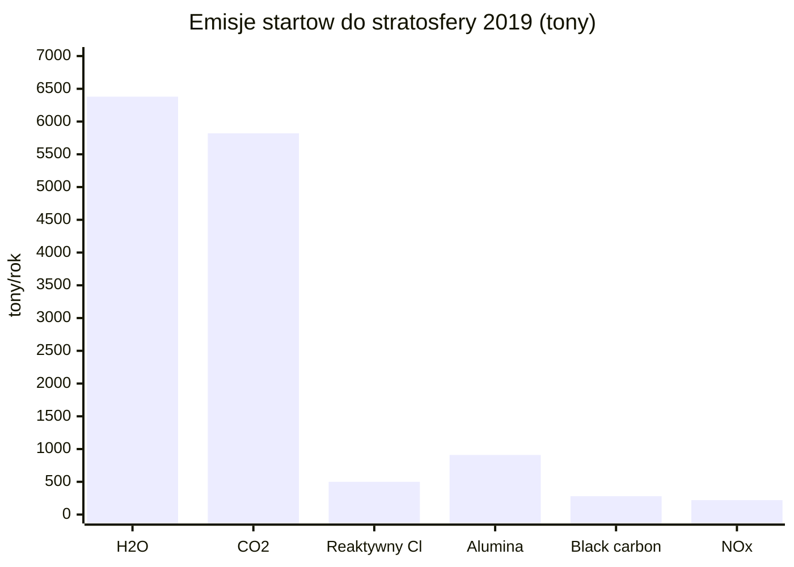
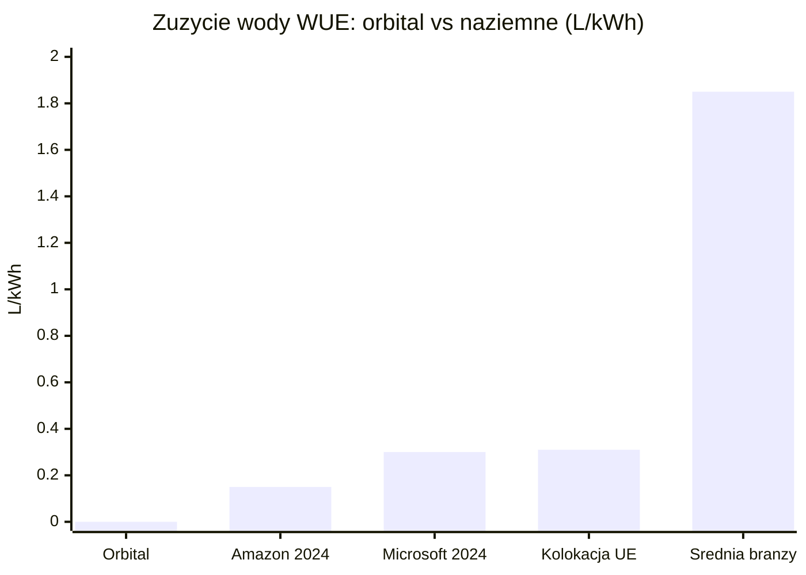
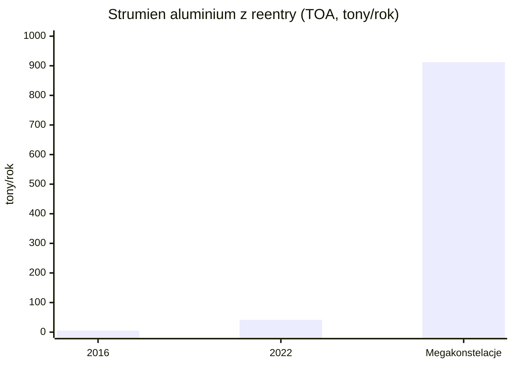
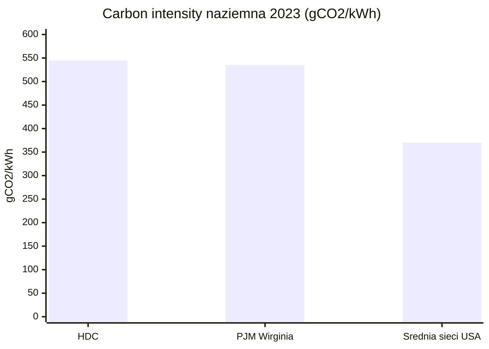

# Zrównoważony rozwój i środowisko

> Notatka raportu "Orbitalne centra danych". Kluczowe źródła: [źródło 1](https://arxiv.org/html/2504.15291v1), [źródło 2](https://csl.noaa.gov/news/2025/427_0428.html).

## W skrócie

Argument środowiskowy jest dwustronnym ostrzem i to czyni go ryzykiem inwestycyjnym, a nie czystą zaletą. Firmy budujące orbitalne centra danych (Starcloud, Thales Alenia Space/ASCEND) sprzedają inwestorom narrację o energii słonecznej dostępnej 24/7, zerowym zużyciu wody i braku konkurencji o grunt - i te punkty mają oparcie w deklaracjach oraz w danych o rosnącej presji wodnej naziemnych centrów danych. Po stronie kosztów stoją jednak twarde, recenzowane dane: starty rakiet wstrzykują do stratosfery setki ton sadzy i tlenku glinu (910 ton aluminy w 2019 r.) [🔵](https://arxiv.org/html/2504.15291v1), a spalanie modułów przy powrocie do atmosfery (reentry) może do 2040 r. deponować 10 000 ton aluminy rocznie w scenariuszu 60 000 satelitów [🔵](https://csl.noaa.gov/news/2025/427_0428.html). Kluczowa luka dla inwestora: nie istnieje publiczne, pełne <abbr title="rachunek wszystkich emisji produktu od wydobycia surowców po koniec życia (&quot;od kołyski do grobu&quot;).">LCA</abbr> orbitalnego centrum danych z jedną granicą systemową - dlatego twierdzenie "korzystne dla klimatu" pozostaje NIEZWERYFIKOWANE, a regulacyjne ryzyko ozonowe i debris jest realne i rosnące. Kto zyskuje: dostawcy "czystych" rakiet i operatorzy w regionach z deficytem wody/energii; kto traci: projekty oparte na rakietach węglowodorowych przy zaostrzeniu przepisów o emisjach stratosferycznych.

<!-- network:watki:start -->
## Powiązane wątki

> Mapa powiązań tematycznych - jak ten wątek łączy się z resztą raportu.

- [[12 - naziemny-bottleneck-energetyczny-i-sieciowy|Naziemny bottleneck]] - woda, grunt i energia to wspólna oś środowiskowa
- [[11 - regulacje-prawo-kosmiczne-debris-i-itu|Regulacje i debris]] - debris i Kessler jako środowiskowy koszt orbity
- [[13 - sentyment-spoleczny-i-moratoria-na-centra-danych|Sentyment i moratoria]] - argument ESG spina środowisko z akceptacją społeczną
- [[04 - energetyka-kosmiczna-i-fotowoltaika-orbitalna|Energetyka kosmiczna]] - carbon intensity solar orbital vs naziemny miks
- [[03 - fizyka-orbitalna-orbity-i-operacje|Fizyka orbitalna]] - reentry i burn-up przy deorbitacji modułów
<!-- network:watki:end -->
## Emisje startów rakietowych: CO2, sadza, alumina, ozon

Podstawowy inwentarz emisji pochodzi z recenzowanej pracy Brown et al. (Earth and Space Science / arXiv, narzędzie ORACLE). Starty rakiet w 2019 r. wyemitowały do stratosfery (warstwy atmosfery ~12-50 km, kluczowej dla ochronnej powłoki ozonowej): 5 820 ton CO2, 6 380 ton pary wodnej (H2O), 280 ton black carbon (sadzy - drobnych cząstek węgla z niepełnego spalania), 220 ton tlenków azotu, 500 ton reaktywnego chloru oraz 910 ton aluminy (Al2O3, tlenku glinu) [🔵 Brown et al.](https://arxiv.org/html/2504.15291v1). Sama liczba CO2 jest niewielka wobec globalnej gospodarki, ale problemem jest miejsce wstrzyknięcia i rodzaj cząstek.

*Rys. 75 - Inwentarz emisji startów rakietowych wstrzykniętych do stratosfery w 2019 r. (sadza i alumina mają nieproporcjonalny wpływ klimatyczno-ozonowy mimo małej masy). Dane: Brown et al. / ORACLE (arXiv 2504.15291).*

![[assets/y13-1-ksc-20180516-ph-kls01-0024.jpg]]
*Rys. 76 - Srodowisko: Flame Deflector Complete at Launch Complex 39B. Źródło: NASA, licencja: public domain.*
#grafika #zrownowazony-rozwoj-i-srodowisko #emisje #start

![[assets/y13-2-ksc-20180516-ph-kls01-0007.jpg]]
*Rys. 77 - Srodowisko: Flame Deflector Complete at Launch Complex 39B. Źródło: NASA, licencja: public domain.*
#grafika #zrownowazony-rozwoj-i-srodowisko #emisje #start

Najważniejszy parametr: sadza rakietowa jest do 500 razy bardziej efektywna w ogrzewaniu atmosfery niż sadza z powierzchni Ziemi i lotnictwa [🔵 Brown et al.](https://arxiv.org/html/2504.15291v1), bo trafia bezpośrednio do stratosfery, gdzie utrzymuje się długo (szacowana persistencja 1,4-3,8 roku) [🔴 GreenLaunch](https://greenlaunch.space/feeds/blog/rocket-launch-co2-emissions-comparison). Modelowanie wskazuje, że roczna kadencja 1 000 startów węglowodorowych mogłaby w ciągu dekady wywołać wymuszenie radiacyjne (radiative forcing - dodatkowe ocieplenie netto mierzone w mW/m2) porównywalne z całym globalnym lotnictwem poddźwiękowym, dokładając 7,9 mW/m2 i podwajając efekt obecnych rakiet w trzy lata [🔵 Brown et al.](https://arxiv.org/html/2504.15291v1).

Wpływ na ozon (mierzony w jednostkach Dobsona, <abbr title="miara grubości warstwy ozonu w pionowej kolumnie atmosfery.">DU</abbr> - grubości warstwy ozonu): rakiety wodorowe wielokrotnego użytku mogą zwiększyć stratosferyczną parę wodną o ~10% i obniżyć globalną kolumnę ozonu o 1,4-1,5 DU [🔵 Brown et al.](https://arxiv.org/html/2504.15291v1). Przy kadencjach startów potrzebnych do rozmieszczenia ponad 100 000 satelitów do 2050 r. straty ozonu mogłyby sięgnąć 6% obecnego rocznego globalnego ubytku [🔵 Brown et al.](https://arxiv.org/html/2504.15291v1). Słabsze źródło branżowe podaje scenariusz 10 Gg/rok sadzy dający ocieplenie stratosfery do 1,5 K i utratę ozonu 16 DU (4%) na półkuli północnej [🔴 GreenLaunch](https://greenlaunch.space/feeds/blog/rocket-launch-co2-emissions-comparison).

Per pojedynczy start (źródła słabe): FAA szacuje 387 ton CO2e na start Falcon 9 (z 23 226 ton dla 60 startów), a Starship ~3 491 ton CO2e na start (z 83 794 ton dla 24 startów) [🔴 GreenLaunch](https://greenlaunch.space/feeds/blog/rocket-launch-co2-emissions-comparison). Implikacja dla inwestora: model biznesowy oparty na masowych startach metanowych/kerozynowych niesie ekspozycję na przyszłą regulację emisji stratosferycznych; intensywność emisji przeliczona na kWh dostarczonej mocy obliczeniowej jest tu NIE UJAWNIONE (brak jednolitego współczynnika; dostępne tylko emisje całkowite na start).

## Lifecycle / embodied carbon: platforma orbitalna vs naziemne DC

Analiza cyklu życia (LCA - rachunek emisji "od kołyski do grobu") konstelacji według ORACLE pokazuje, że produkcja rakiet i spalanie paliwa podczas startów odpowiadają za 72,6% emisji cyklu życia [🔵 Brown et al.](https://arxiv.org/html/2504.15291v1). To przesuwa cały ciężar środowiskowy na fazę wynoszenia, nie operacji. Dźwignią jest wielokrotny użytek: rakiety wielorazowe (Falcon 9, Starship) mają 95,4% niższe emisje produkcji niż jednorazowe [🔵 Brown et al.](https://arxiv.org/html/2504.15291v1).

Strona promotorów: studium ASCEND (Thales Alenia Space, Horizon Europe) stwierdza, że taka infrastruktura wymagałaby opracowania rakiety 10 razy mniej emisyjnej w całym cyklu życia [🟠 Thales Alenia Space](https://www.thalesaleniaspace.com/en/press-releases/thales-alenia-space-reveals-results-ascend-feasibility-study-space-data-centers-0). ASCEND celuje w 1 GW orbitalnej mocy przed 2050 r. wobec szacowanego europejskiego rynku centrów danych 23 GW do 2030 r. [🟠 Thales Alenia Space](https://www.thalesaleniaspace.com/en/press-releases/thales-alenia-space-reveals-results-ascend-feasibility-study-space-data-centers-0). Implikacja: korzyść klimatyczna jest warunkowa - zależy od rakiety, której jeszcze nie ma.

Strona kosztowa Starcloud (whitepaper, tier weak): firma porównuje klaster 40 MW przez 10 lat - bilans kosztowy 8,2 mln USD w kosmosie vs 167 mln USD na Ziemi [🔴 Starcloud](https://starcloudinc.github.io/wp.pdf), przy założeniu kosztu startu 30 USD/kg (vs aktualne ~1 520 USD/kg na Falcon Heavy [🟠 DCD](https://www.datacenterdynamics.com/en/news/lumen-orbit-rebrands-to-starcloud-raises-another-10m-for-in-orbit-data-centers/)). Starcloud zakłada, że jeden start Starship wynosi ~40 MW mocy obliczeniowej (przy 120 kW/szafę) i że 5 GW dałoby się rozmieścić w mniej niż 100 startach [🔴 Starcloud](https://starcloudinc.github.io/wp.pdf). Sceptyczna analiza kontruje, że 40 MW wymaga nie jednego, lecz do 22 startów [🔴 angadh.com](https://angadh.com/space-data-centers-1). Implikacja: założenie 30 USD/kg jest ~50x niższe od obecnej rzeczywistości, więc cały bilans embodied carbon i kosztu zależy od jeszcze nieudowodnionej dźwigni cenowej. Wskaźnik kg CO2e/kg masy na orbitę dla konkretnego orbitalnego DC jest NIE UJAWNIONE (publiczne LCA dotyczą konstelacji Starlink/Kuiper, nie centrów danych).

## Brak zużycia wody i gruntu na orbicie

To najmocniejszy punkt narracji środowiskowej. ASCEND deklaruje, że orbitalne centra danych nie wymagają wody do chłodzenia - przewaga w czasach narastających susz [🟠 Thales Alenia Space](https://www.thalesaleniaspace.com/en/press-releases/thales-alenia-space-reveals-results-ascend-feasibility-study-space-data-centers-0). Starcloud podaje 0 L/kWh w kosmosie wobec 1,7 mln ton wody dla klastra 40 MW na lądzie przez 10 lat [🔴 Starcloud](https://starcloudinc.github.io/wp.pdf).

Kontekst naziemny (<abbr title="wskaźnik zużycia wody przez centrum danych w litrach na kWh.">WUE</abbr> - Water Usage Effectiveness, litry wody na kWh): branżowa średnia ~1,8-1,9 L/kWh [🔴 Moduledge](https://www.moduledge.com/blog/ai-water-usage), ale najlepsi operatorzy są znacznie niżej. Według raportu EUDCA State of European Data Centres 2025 europejska kolokacja ma średnio 0,31 L/kWh, Microsoft globalnie 0,3 L/kWh, a Amazon 0,15 L/kWh w 2024 r. [🟠 EUDCA](https://www.eudca.org/documents/content/QTzQPdQhSCiocHnjwshAXwoe8?download=0). Implikacja dla inwestora: przewaga "zero wody" jest realna względem złych obiektów na pustyni, ale wobec najlepszej naziemnej kolokacji (0,15-0,31 L/kWh) różnica jest mniejsza niż sugeruje średnia branżowa - argument ma wartość głównie tam, gdzie woda jest deficytem regulacyjnym. Oszczędność gruntu w m2/MW dla orbitalnego DC jest NIE UJAWNIONE; możliwe proxy to gęstość mocy naziemnego hiperskalera ~1 600 W/m2.

*Rys. 78 - Wskaźnik zużycia wody (WUE): przewaga "zero wody" jest realna wobec średniej branżowej, ale niewielka wobec najlepszej naziemnej kolokacji. Dane: Starcloud/ASCEND, EUDCA 2025, Moduledge.*

## Zanieczyszczenie z reentry / burn-up przy deorbitacji modułów

To najsłabiej wyceniany koszt środowiskowy, oparty na mocnych źródłach primary. Spalenie typowego satelity 250 kg generuje ~30 kg nanocząstek tlenku glinu, mogących utrzymywać się dekady [🔵 Ferreira et al., GRL](https://agupubs.onlinelibrary.wiley.com/doi/10.1029/2024GL109280). Strumień aluminium na szczycie atmosfery (TOA) z satelitów wzrósł z 5,36 ton w 2016 r. (3,8% nadwyżki nad źródłami naturalnymi) do 41,7 ton w 2022 r. (nadwyżka 29,5%); związków tlenku glinu - z 2,13 do 16,6 ton, ośmiokrotny wzrost [🔵 Ferreira et al.](https://agupubs.onlinelibrary.wiley.com/doi/10.1029/2024GL109280). W scenariuszu megakonstelacji byłoby to 362,7 ton związków Al2O3 rocznie i 912 ton TOA aluminium rocznie (nadwyżka 646% nad naturalnym) [🔵 Ferreira et al.](https://agupubs.onlinelibrary.wiley.com/doi/10.1029/2024GL109280). Cząstki te mogą zajmować do 30 lat zanim opadną z mezosfery do warstwy ozonowej [🔵 Ferreira et al.](https://agupubs.onlinelibrary.wiley.com/doi/10.1029/2024GL109280).

*Rys. 79 - Strumień aluminium na szczycie atmosfery (TOA) z reentry satelitów - wzrost z 2016 r. do scenariusza megakonstelacji (nadwyżka 646% nad źródłami naturalnymi). Dane: Ferreira et al., GRL 2024.*

Dowód obecności: badanie Murphy et al. (PNAS 2023) wykazało, że ~10% stratosferycznych cząstek kwasu siarkowego >120 nm zawiera aluminium i inne pierwiastki z reentry, wykryto >20 pierwiastków w proporcjach zgodnych ze stopami statków kosmicznych, a planowane wzrosty mogą podnieść ten udział do 50% [🔵 Murphy et al.](https://newspaceeconomy.ca/wp-content/uploads/2023/10/murphy-et-al-2023-metals-from-spacecraft-reentry-in-stratospheric-aerosol-particles.pdf). Analiza MIT szacuje antropogeniczny strumień Al z reentry na ~161% strumienia meteorytowego [🟠 MIT](https://dspace.mit.edu/server/api/core/bitstreams/54a15014-cc6d-4c1f-965e-e0b7d6759075/content). NOAA prognozuje, że przy 60 000 satelitów LEO do 2040 r. (satelita spalany co 1-2 dni) deponowane będzie 10 000 ton aluminy rocznie, co mogłoby ogrzać części mezosfery nawet o 1,5 stopnia Celsjusza i wpłynąć na ozon [🔵 NOAA](https://csl.noaa.gov/news/2025/427_0428.html). Już w 2024 r. powracało 1 200 nienaruszonych obiektów [🔵 ESA SER](https://www.sdo.esoc.esa.int/environment_report/Space_Environment_Report_latest.pdf), średnio ponad 3 razy dziennie [🟠 UN-SPIDER](https://www.un-spider.org/news-and-events/news/esa-space-environment-report-2025). Implikacja: orbitalne DC z założenia "spalają się w atmosferze" przy końcu życia (Starcloud-1 spłonie po deorbitacji z 325 km), więc duże moduły są aktywnym wkładem w to zanieczyszczenie - ryzyko regulacyjne i reputacyjne. Skład gazowy (NOx, Cl, HCl) z deorbitacji dużych modułów (>100 t) jest NIE UJAWNIONE.

## Carbon intensity: solar orbital vs naziemny mix vs PPA OZE

Punkt odniesienia naziemny (recenzowane dane Harvard/Guidi et al.): amerykańskie centra danych o wysokiej gęstości (HDC) mają carbon intensity ważoną energią ~545 gCO2/kWh, o ~48% powyżej średniej krajowej sieci USA 370 gCO2/kWh w 2023 r. [🔵 Guidi et al.](https://arxiv.org/html/2606.05420v1). ~54% energii przypisanej HDC pochodzi z paliw kopalnych, 20,9% z atomu, 25,3% z OZE; w PJM (Wirginia, stolica centrów danych) intensity wynosi ~535 gCO2/kWh [🔵 Guidi et al.](https://arxiv.org/html/2606.05420v1).

*Rys. 80 - Intensywność emisji amerykańskich centrów danych o wysokiej gęstości (HDC) wobec sieci - benchmark, który orbital ma rzekomo pobić, choć jego rzeczywista carbon intensity pozostaje nieujawniona. Dane: Guidi et al. (Harvard / arXiv).*

Strona orbitalna (Starcloud, tier weak): capacity factor (procent czasu pracy na pełnej mocy) tablicy słonecznej na orbicie >95% bez cyklu dzień/noc, vs mediana 24% farm słonecznych w USA i <10% w Europie Północnej; irradiancja w kosmosie ~40% wyższa niż na powierzchni [🔴 Starcloud](https://starcloudinc.github.io/wp.pdf). Starcloud deklaruje koszt energii ~0,002 USD/kWh, czyli 22 razy taniej niż dzisiejsze ceny [🔴 Starcloud](https://starcloudinc.github.io/wp.pdf). Kluczowy haczyk dla inwestora: to koszt, nie emisja - rzeczywista carbon intensity orbitalnego DC (gCO2/kWh obciążenia) jest NIE UJAWNIONE, podobnie jak porównanie z PPA OZE 100% przy tej samej granicy systemowej.

Kontekst globalny: centra danych zużyły ~415 TWh w 2024 r. (nieco ponad 1% globalnego popytu na prąd, 0,5% emisji CO2) z prognozą 945 TWh do 2030 r. [🟠 Carbon Brief](https://www.carbonbrief.org/ai-five-charts-that-put-data-centre-energy-use-and-emissions-into-context/); emisje sektora to 180 Mt CO2 w 2024 r. z prognozą 300 Mt do 2035 r. [🔵 IEA via arXiv](https://arxiv.org/pdf/2509.07218). Implikacja: rynek docelowy rośnie szybko, ale orbitalny argument "czystszej energii" pozostaje niepoparty pełnym LCA per kWh.

## Debris jako koszt środowiskowy (Kessler)

<abbr title="kaskada kolizji, w której odłamki rodzą kolejne odłamki, mogąca uczynić orbitę bezużyteczną.">Syndrom Kesslera</abbr> (kaskada kolizji, w której odłamki rodzą kolejne odłamki, czyniąc orbitę bezużyteczną) jest dokumentowanym, nie teoretycznym ryzykiem. Sieci śledzą ~40 000 obiektów, w tym 11 000 aktywnych satelitów; ESA szacuje ponad 1,2 mln odłamków >1 cm i ponad 50 000 (szac. 54 000) >10 cm [🟠 UN-SPIDER/ESA](https://www.un-spider.org/news-and-events/news/esa-space-environment-report-2025). W samym 2024 r. zdarzenia fragmentacji wygenerowały co najmniej 3 000 nowych odłamków [🟠 Mexico Business](https://mexicobusiness.news/aerospace/news/esa-warns-space-debris-could-make-orbits-unusable).

Regulacja zaostrza się: poprzednia zasada IADC dawała 25 lat na deorbitację [🔵 UNOOSA](https://www.unoosa.org/res/oosadoc/data/documents/2025/aac_105c_12025crp/aac_105c_12025crp_10_0_html/AC105_C1_2025_CRP10E.pdf), a nowa reguła FCC skraca to do 5 lat dla LEO [🔵 FCC](https://www.fcc.gov/document/fcc-adopts-new-5-year-rule-deorbiting-satellites-0). Zgodność: ~90% rakiet LEO spełnia starą 25-letnią regułę, ale tylko ~80% nową 5-letnią [🟠 Mexico Business](https://mexicobusiness.news/aerospace/news/esa-warns-space-debris-could-make-orbits-unusable). Implikacja: krótsze okno deorbitacji oznacza więcej kontrolowanych reentry (więcej aluminy w atmosferze - sprzeczność celów), a operator dużego orbitalnego DC musi planować end-of-life i ponosić koszt zgodności. Prawdopodobieństwo kolizji dla konkretnego projektu (Starcloud/ASCEND) jest NIE UJAWNIONE - brak publicznych raportów ODAR/DRAMA.

## Kontrowersje

**Czy bilans środowiskowy jest korzystny czy negatywny?**

Strona KORZYŚCI (tier weak/secondary): Starcloud wskazuje 0 L/kWh wody, capacity factor >95% i koszt 0,002 USD/kWh przy energii słonecznej 24/7 [🔴 Starcloud](https://starcloudinc.github.io/wp.pdf); ASCEND twierdzi, że potrzebna rakieta byłaby 10x mniej emisyjna w cyklu życia [🟠 Thales Alenia Space](https://www.thalesaleniaspace.com/en/press-releases/thales-alenia-space-reveals-results-ascend-feasibility-study-space-data-centers-0). Strona KOSZTÓW (tier primary): starty 5 820 t CO2/rok + 280 t sadzy + 910 t aluminy do stratosfery (2019) [🔵 Brown et al.](https://arxiv.org/html/2504.15291v1); reentry 16,6 t Al2O3 w 2022, do 362,7 t/rok w scenariuszu megakonstelacji [🔵 Ferreira et al.](https://agupubs.onlinelibrary.wiley.com/doi/10.1029/2024GL109280); a naziemny benchmark, który orbital ma rzekomo pobić, to 545 gCO2/kWh [🔵 Guidi et al.](https://arxiv.org/html/2606.05420v1). Rdzeń sporu (potwierdzony brak rozbieżności co do faktu luki): porównanie nie jest bezpośrednie - Starcloud porównuje koszt 0,002 USD/kWh, nie emisję; Harvard mierzy naziemną intensity, ale bez uwzględnienia startów. Nie istnieje wspólne LCA z jedną granicą systemową - werdykt: NIEZWERYFIKOWANE.

**Rozbieżność badań nad wpływem startów na ozon i brak konsensusu metodologii LCA**

Tu są realne, potwierdzone rozbieżności wyników (różne modele, scenariusze emisji sadzy i granice systemowe):
- Maloney et al. (2022): 5-15 DU utraty ozonu przy 10 Gg sadzy/rok, z możliwie cięższą dziurą antarktyczną [🔵 ETH/Brown](https://www.research-collection.ethz.ch/bitstream/handle/20.500.11850/702020/EarthandSpaceScience-2024-Brown-WorldwideRocketLaunchEmissions2019AnInventoryforUseinGlobalModels.pdf).
- Ross et al. (2010): 1% spadek tropikalny, 6% polarny przy znacznie niższych 0,6 Gg sadzy/rok [🔵 ETH/Brown](https://www.research-collection.ethz.ch/bitstream/handle/20.500.11850/702020/EarthandSpaceScience-2024-Brown-WorldwideRocketLaunchEmissions2019AnInventoryforUseinGlobalModels.pdf).
- Dallas et al. (2020): "globalne straty ozonu rzędu kilku procent" [🔵 ResearchGate](https://www.researchgate.net/publication/338876748_The_environmental_impact_of_emissions_from_space_launches_A_comprehensive_review).
- Ryan et al. (2022): dekada boomu turystyki kosmicznej może zniweczyć cały postęp odbudowy ozonu od Protokołu Montrealskiego [🔵 ResearchGate](https://www.researchgate.net/publication/338876748_The_environmental_impact_of_emissions_from_space_launches_A_comprehensive_review).
- Ferreira et al. (2024): opóźnienie nawet 30 lat między wstrzyknięciem Al2O3 a skutkami ozonowymi [🔵 GRL](https://agupubs.onlinelibrary.wiley.com/doi/10.1029/2024GL109280).

Konsensus metodologiczny jest NIE UJAWNIONE - badania używają różnych modeli i scenariuszy. Co do LCA: ASCEND nie opublikował pełnego arkusza LCA [🟠 ASCEND](https://ascend-horizon.eu/objectives/), a otwarte narzędzie ORACLE objęło 10 rakiet i 15 megakonstelacji, pokazując dominację emisji startów (72,6%) [🔵 Brown et al.](https://arxiv.org/html/2504.15291v1). Analogiczny rozkład widać dla obiektów astronomicznych: 84% emisji z misji kosmicznych, 16% z naziemnych obserwatoriów (1,3 MtCO2e w 2022) [🔵 arXiv](https://arxiv.org/html/2507.14510). Wniosek inwestorski: brak jednolitej metodologii LCA to nie detal akademicki, lecz luka, którą regulator lub krytyk może wypełnić niekorzystnie dla projektu.

## Słowniczek pojęć

- **LCA (Life Cycle Assessment)** - rachunek wszystkich emisji produktu od wydobycia surowców po koniec życia ("od kołyski do grobu").
- **Embodied carbon** - emisje "wbudowane" w wytworzenie i wyniesienie sprzętu, w odróżnieniu od emisji z bieżącej eksploatacji.
- **Carbon intensity (intensywność emisji)** - ilość CO2 przypadająca na jednostkę zużytej energii, zwykle w gCO2/kWh.
- **gCO2e/kWh** - gramy ekwiwalentu CO2 na kilowatogodzinę; miara śladu węglowego dostarczonej energii.
- **Black carbon (sadza)** - drobne cząstki węgla z niepełnego spalania, silnie pochłaniające ciepło, zwłaszcza w stratosferze.
- **Alumina / Al2O3 (tlenek glinu)** - pył powstający przy spalaniu paliwa rakietowego i przy spłonięciu satelitów w atmosferze, szkodliwy dla ozonu.
- **Reentry** - powrót obiektu kosmicznego w atmosferę, podczas którego zwykle spala się on, uwalniając cząstki.
- **Deorbitacja** - celowe sprowadzenie satelity z orbity, by spłonął lub bezpiecznie spadł na koniec życia.
- **Burn-up** - spalenie obiektu na skutek tarcia o atmosferę przy powrocie z orbity.
- **Stratosfera** - warstwa atmosfery ~12-50 km, zawierająca ochronną powłokę ozonową.
- **Mezosfera** - warstwa atmosfery powyżej stratosfery (~50-85 km), gdzie najpierw osadzają się cząstki z reentry.
- **Ozon (warstwa ozonowa)** - powłoka stratosfery pochłaniająca szkodliwe promieniowanie UV, wrażliwa na chlor i tlenek glinu.
- **DU (jednostka Dobsona)** - miara grubości warstwy ozonu w pionowej kolumnie atmosfery.
- **Radiative forcing (wymuszenie radiacyjne)** - dodatkowe ocieplenie netto atmosfery, mierzone w mW/m2.
- **WUE (Water Usage Effectiveness)** - wskaźnik zużycia wody przez centrum danych w litrach na kWh.
- **Capacity factor (współczynnik wykorzystania)** - procent czasu, w którym instalacja pracuje na pełnej mocy.
- **Syndrom Kesslera** - kaskada kolizji, w której odłamki rodzą kolejne odłamki, mogąca uczynić orbitę bezużyteczną.
- **Debris (odłamki orbitalne)** - nieczynne satelity, części rakiet i fragmenty kolizji krążące wokół Ziemi.

## Źródła

- [🔵 Brown et al. / ORACLE (Earth and Space Science / arXiv)](https://arxiv.org/html/2504.15291v1) - inwentarz emisji startów 2019, forcing radiacyjny, LCA konstelacji, wpływ na ozon.
- [🔵 Ferreira et al., Geophysical Research Letters 2024](https://agupubs.onlinelibrary.wiley.com/doi/10.1029/2024GL109280) - tlenek glinu z reentry satelitów, scenariusz megakonstelacji.
- [🔵 Murphy et al., PNAS 2023](https://newspaceeconomy.ca/wp-content/uploads/2023/10/murphy-et-al-2023-metals-from-spacecraft-reentry-in-stratospheric-aerosol-particles.pdf) - metale z reentry w cząstkach stratosferycznych.
- [🔵 NOAA CSL 2025](https://csl.noaa.gov/news/2025/427_0428.html) - 10 000 t aluminy/rok do 2040, ogrzanie mezosfery.
- [🔵 Guidi et al. (Harvard / arXiv)](https://arxiv.org/html/2606.05420v1) - carbon intensity i mix energetyczny amerykańskich HDC.
- [🔵 ESA Space Environment Report 2025](https://www.sdo.esoc.esa.int/environment_report/Space_Environment_Report_latest.pdf) - 1 200 reentry w 2024, populacja debris.
- [🔵 ETH/Brown (inwentarz emisji)](https://www.research-collection.ethz.ch/bitstream/handle/20.500.11850/702020/EarthandSpaceScience-2024-Brown-WorldwideRocketLaunchEmissions2019AnInventoryforUseinGlobalModels.pdf) - scenariusze sadzy i ozonu (Maloney, Ross).
- [🔵 IEA via arXiv](https://arxiv.org/pdf/2509.07218) - 180 Mt CO2 emisji centrów danych 2024, 300 Mt do 2035.
- [🔵 FCC](https://www.fcc.gov/document/fcc-adopts-new-5-year-rule-deorbiting-satellites-0) - reguła 5-letniej deorbitacji.
- [🔵 UNOOSA](https://www.unoosa.org/res/oosadoc/data/documents/2025/aac_105c_12025crp/aac_105c_12025crp_10_0_html/AC105_C1_2025_CRP10E.pdf) - wytyczne mitygacji debris.
- [🔵 ResearchGate (przegląd Dallas/Ryan)](https://www.researchgate.net/publication/338876748_The_environmental_impact_of_emissions_from_space_launches_A_comprehensive_review) - przegląd wpływu emisji startów.
- [🔵 arXiv (obiekty astronomiczne)](https://arxiv.org/html/2507.14510) - rozkład emisji 84% kosmos / 16% naziemne.
- [🟠 Thales Alenia Space / ASCEND](https://www.thalesaleniaspace.com/en/press-releases/thales-alenia-space-reveals-results-ascend-feasibility-study-space-data-centers-0) - zero wody, 10x mniej emisyjna rakieta, 1 GW do 2050.
- [🟠 ASCEND Horizon](https://ascend-horizon.eu/objectives/) - cele studium, brak pełnego LCA.
- [🟠 EUDCA State of European Data Centres 2025](https://www.eudca.org/documents/content/QTzQPdQhSCiocHnjwshAXwoe8?download=0) - WUE kolokacji, Microsoft, Amazon.
- [🟠 Carbon Brief](https://www.carbonbrief.org/ai-five-charts-that-put-data-centre-energy-use-and-emissions-into-context/) - globalne zużycie energii centrów danych.
- [🟠 UN-SPIDER (ESA SER 2025)](https://www.un-spider.org/news-and-events/news/esa-space-environment-report-2025) - populacja debris, częstotliwość reentry.
- [🟠 Mexico Business](https://mexicobusiness.news/aerospace/news/esa-warns-space-debris-could-make-orbits-unusable) - zgodność z regułami deorbitacji, fragmentacje.
- [🟠 MIT](https://dspace.mit.edu/server/api/core/bitstreams/54a15014-cc6d-4c1f-965e-e0b7d6759075/content) - strumień Al z reentry vs meteoryczny.
- [🟠 Data Center Dynamics](https://www.datacenterdynamics.com/en/news/lumen-orbit-rebrands-to-starcloud-raises-another-10m-for-in-orbit-data-centers/) - koszt 1 520 USD/kg Falcon Heavy.
- [🔴 Starcloud whitepaper](https://starcloudinc.github.io/wp.pdf) - bilans kosztowy, woda, capacity factor, koszt energii.
- [🔴 GreenLaunch](https://greenlaunch.space/feeds/blog/rocket-launch-co2-emissions-comparison) - emisje per start Falcon 9 / Starship, scenariusz sadzy.
- [🔴 Moduledge](https://www.moduledge.com/blog/ai-water-usage) - branżowa średnia WUE.
- [🔴 angadh.com](https://angadh.com/space-data-centers-1) - sceptyczna analiza liczby startów.

## Dane źródłowe

- `5 820 ton CO2` | https://arxiv.org/html/2504.15291v1 | primary | "Rocket launches in 2019 emitted 5,820 tonnes of CO2, 6,380 tonnes of H2O, 280 tonnes of black carbon, 220 tonnes of nitrogen oxides, 500 tonnes of reactive chlorine, and 910 tonnes of alumina into the stratosphere..."
- `6 380 ton H2O` | https://arxiv.org/html/2504.15291v1 | primary | "...6,380 tonnes of H2O, 280 tonnes of black carbon..."
- `280 ton black carbon` | https://arxiv.org/html/2504.15291v1 | primary | "...280 tonnes of black carbon, 220 tonnes of nitrogen oxides, 500 tonnes of reactive chlorine, and 910 tonnes of alumina into the stratosphere..."
- `910 ton aluminy` | https://arxiv.org/html/2504.15291v1 | primary | "...910 tonnes of alumina into the stratosphere..."
- `500 ton reaktywnego chloru` | https://arxiv.org/html/2504.15291v1 | primary | "...500 tonnes of reactive chlorine..."
- `500x efektywność ocieplenia BC` | https://arxiv.org/html/2504.15291v1 | primary | "Additionally, rocket emissions of black carbon are up to 500 times more efficient at warming the atmosphere than surface and aviation sources..."
- `1 000 startów/rok` | https://arxiv.org/html/2504.15291v1 | primary | "Modeling suggests that an annual launch cadence of 1,000 hydrocarbon rocket launches could result in radiative forcing levels comparable to those from global subsonic aviation within a decade."
- `7,9 mW/m2 forcingu` | https://arxiv.org/html/2504.15291v1 | primary | "...with sustained launches potentially contributing an additional 7.9 mW m-2 to global radiative forcing, doubling the effect of contemporary rockets in just three years."
- `387 ton CO2e/start Falcon 9` | https://greenlaunch.space/feeds/blog/rocket-launch-co2-emissions-comparison | weak | "The FAA estimates 387 tonnes CO2e per Falcon 9 launch, based on 23,226 tonnes for 60 launches."
- `3 491 ton CO2e/start Starship` | https://greenlaunch.space/feeds/blog/rocket-launch-co2-emissions-comparison | weak | "...approximately 3,491 tonnes CO2e per launch based on 83,794 tonnes for 24 launches."
- `16 DU (4%) utraty ozonu` | https://greenlaunch.space/feeds/blog/rocket-launch-co2-emissions-comparison | weak | "...researchers modeled a 10 Gg/year black carbon emission scenario that would cause stratospheric warming of up to 1.5 K and ozone losses of 16 Dobson Units (4%) in the Northern Hemisphere."
- `1,4-3,8 lata persistencji sadzy` | https://greenlaunch.space/feeds/blog/rocket-launch-co2-emissions-comparison | weak | "Stratospheric soot from kerosene rockets has warming efficiency almost 500x greater than surface black carbon, according to peer-reviewed atmospheric modeling."
- `1,4-1,5 DU spadku ozonu (rakiety wodorowe)` | https://arxiv.org/html/2504.15291v1 | primary | "...hydrogen-fueled reusable rockets could increase global stratospheric water vapor by approximately 10%, enhance polar mesospheric cloud fractions by 20%, and reduce the globally averaged ozone column by 1.4-1.5 Dobson Units."
- `6% globalnych strat ozonu` | https://arxiv.org/html/2504.15291v1 | primary | "Projections indicate that increased launch rates, necessary to deploy over 100,000 satellites by 2050, could lead to stratospheric ozone losses equivalent to 6% of current annual global ozone depletion levels."
- `10 Gg/rok scenariusz BC` | https://www.research-collection.ethz.ch/bitstream/handle/20.500.11850/702020/EarthandSpaceScience-2024-Brown-WorldwideRocketLaunchEmissions2019AnInventoryforUseinGlobalModels.pdf | primary | "...a constant annual black carbon emission of 10 Gg yr-1 was injected into the stratosphere... year-round ozone loss of 5-15 DU in the Northern Hemisphere..."
- `0,6 Gg/rok BC -> 1% trop., 6% polar` | https://www.research-collection.ethz.ch/bitstream/handle/20.500.11850/702020/EarthandSpaceScience-2024-Brown-WorldwideRocketLaunchEmissions2019AnInventoryforUseinGlobalModels.pdf | primary | "Simulations with stratospheric black carbon emission of 0.6 Gg yr-1 show a 1% depletion in tropical stratospheric ozone and 6% in polar stratospheric ozone (Ross et al., 2010)."
- `72,6% emisji LCA z produkcji+startu` | https://arxiv.org/html/2504.15291v1 | primary | "...the production of launch vehicles and propellant combustion during launch events contribute most significantly to overall GHG emissions, accounting for 72.6% of life cycle emissions."
- `95,4% niższe emisje produkcji (wielorazowe)` | https://arxiv.org/html/2504.15291v1 | primary | "...reusable vehicles like Falcon-9 and Starship demonstrate 95.4% lower production emissions compared to non-reusable alternatives..."
- `10x mniej emisyjna rakieta (ASCEND)` | https://www.thalesaleniaspace.com/en/press-releases/thales-alenia-space-reveals-results-ascend-feasibility-study-space-data-centers-0 | secondary | "...such space infrastructures would require the development of a launcher ten times less emissive over its entire lifecycle."
- `1 GW ASCEND do 2050` | https://www.thalesaleniaspace.com/en/press-releases/thales-alenia-space-reveals-results-ascend-feasibility-study-space-data-centers-0 | secondary | "ASCEND aims to deploy 1GW before 2050."
- `23 GW rynek DC Europa 2030` | https://www.thalesaleniaspace.com/en/press-releases/thales-alenia-space-reveals-results-ascend-feasibility-study-space-data-centers-0 | secondary | "The market for data centers by 2030 is estimated at 23 gigawatts of capacity..."
- `8,2 mln USD klaster 40 MW kosmos` | https://starcloudinc.github.io/wp.pdf | weak | "Table 1. Cost comparison of a single 40 MW cluster operated for 10 years in space vs on land... Cost Balance... $8.2 m"
- `167 mln USD klaster 40 MW ląd` | https://starcloudinc.github.io/wp.pdf | weak | "...Cost Balance... $167 m"
- `5 GW skala Starcloud` | https://starcloudinc.github.io/wp.pdf | weak | "It is, therefore, conceivable that 5 GW of compute could be deployed with fewer than 100 launches..."
- `4x4 km tablica słoneczna 5 GW` | https://starcloudinc.github.io/wp.pdf | weak | "A 5GW data center would require a solar array with dimensions of approximately 4km by 4km..."
- `30 USD/kg koszt startu (Starcloud)` | https://starcloudinc.github.io/wp.pdf | weak | "...this translates to approximately $30 per kilogram."
- `1 520 USD/kg Falcon Heavy` | https://www.datacenterdynamics.com/en/news/lumen-orbit-rebrands-to-starcloud-raises-another-10m-for-in-orbit-data-centers/ | secondary | "...costs are currently around $1,520/kg on the Falcon Heavy."
- `40 MW na start Starship` | https://starcloudinc.github.io/wp.pdf | weak | "Assuming a power density of 120 kW per rack... one launch can deploy ~40 MW of compute..."
- `22 startów do 40 MW (sceptyk)` | https://angadh.com/space-data-centers-1 | weak | "My analysis finds that this is infeasible in a single launch but requires a total of upto 22 launches."
- `0 L/kWh wody (ASCEND)` | https://www.thalesaleniaspace.com/en/press-releases/thales-alenia-space-reveals-results-ascend-feasibility-study-space-data-centers-0 | secondary | "Moreover, space data centers would not require water to cool them, a key advantage in times of increasing drought."
- `1,7 mln ton wody klaster 40 MW ląd` | https://starcloudinc.github.io/wp.pdf | weak | "Water usage... 1.7 m tons @ $0.5 L/kWh"
- `0 L/kWh wody kosmos (Starcloud)` | https://starcloudinc.github.io/wp.pdf | weak | "Water usage... Not required"
- `1,8-1,9 L/kWh średni WUE branża` | https://www.moduledge.com/blog/ai-water-usage | weak | "A WUE of zero means no water is used; the industry average is approximately 1.8 L/kWh."
- `0,31 L/kWh WUE kolokacja Europa` | https://www.eudca.org/documents/content/QTzQPdQhSCiocHnjwshAXwoe8?download=0 | secondary | "...colocation facilities in Europe reported an average WUE of 0.31 l/kWh..."
- `0,3 L/kWh WUE Microsoft 2024` | https://www.eudca.org/documents/content/QTzQPdQhSCiocHnjwshAXwoe8?download=0 | secondary | "Microsoft in 2024 reported a global average of 0.3 l per kWh WUE..."
- `0,15 L/kWh WUE Amazon 2024` | https://www.eudca.org/documents/content/QTzQPdQhSCiocHnjwshAXwoe8?download=0 | secondary | "Amazon reported a global WUE of 0.15l/kWh in 2024..."
- `30 kg tlenku glinu z satelity 250 kg` | https://agupubs.onlinelibrary.wiley.com/doi/10.1029/2024GL109280 | primary | "We find that the demise of a typical 250-kg satellite can generate around 30 kg of aluminum oxide nanoparticles, which may endure for decades in the atmosphere."
- `41,7 ton TOA aluminium 2022` | https://agupubs.onlinelibrary.wiley.com/doi/10.1029/2024GL109280 | primary | "...from 5.36 metric tons in 2016 (3.8% in excess of natural sources) to 41.7 metric tons in 2022 (excess of 29.5%)."
- `16,6 ton Al2O3 z satelitów 2022` | https://agupubs.onlinelibrary.wiley.com/doi/10.1029/2024GL109280 | primary | "...an eight-fold increase in aluminum oxide compounds originated from satellites took place in the last couple of years, from 2.13 metric tons in 2016 to 16.6 metric tons in 2022."
- `362,7 ton Al2O3/rok megakonstelacje` | https://agupubs.onlinelibrary.wiley.com/doi/10.1029/2024GL109280 | primary | "The future mega-constellations scenario of increased reentry rates would yield 362.7 metric tons per year of aluminum oxide compounds."
- `646% nadwyżka Al megakonstelacje` | https://agupubs.onlinelibrary.wiley.com/doi/10.1029/2024GL109280 | primary | "...would lead to 912.0 metric tons per year of TOA aluminum from satellites only (excess of 646%)."
- `30 lat opadanie cząstek` | https://agupubs.onlinelibrary.wiley.com/doi/10.1029/2024GL109280 | primary | "...these reentry byproducts may take up to 30 years to settle from the top of the mesosphere into the stratospheric ozone layer."
- `10% cząstek z aluminium z reentry` | https://newspaceeconomy.ca/wp-content/uploads/2023/10/murphy-et-al-2023-metals-from-spacecraft-reentry-in-stratospheric-aerosol-particles.pdf | primary | "About 10% of stratospheric sulfuric acid particles larger than 120 nm in diameter contain aluminum and other elements from spacecraft reentry."
- `20+ pierwiastków z reentry` | https://newspaceeconomy.ca/wp-content/uploads/2023/10/murphy-et-al-2023-metals-from-spacecraft-reentry-in-stratospheric-aerosol-particles.pdf | primary | "Over 20 elements from reentry were detected and were present in ratios consistent with alloys used in spacecraft."
- `50% cząstek z metalami (przyszłość)` | https://newspaceeconomy.ca/wp-content/uploads/2023/10/murphy-et-al-2023-metals-from-spacecraft-reentry-in-stratospheric-aerosol-particles.pdf | primary | "Planned increases in the number of low earth orbit satellites within the next few decades could cause up to half of stratospheric sulfuric acid particles to contain metals from reentry."
- `161% strumień Al reentry vs meteoryczny` | https://dspace.mit.edu/server/api/core/bitstreams/54a15014-cc6d-4c1f-965e-e0b7d6759075/content | secondary | "Schulz and Glassmeier found that anthropogenic aluminum emissions from reentries are approximately 161% of the meteoric aluminum flux."
- `10 000 ton aluminy/rok do 2040` | https://csl.noaa.gov/news/2025/427_0428.html | primary | "...a satellite would burn up in the atmosphere every one to two days, depositing 10,000 metric tons of alumina in the upper atmosphere."
- `1,5 stopnia C ogrzanie mezosfery` | https://csl.noaa.gov/news/2025/427_0428.html | primary | "...much alumina could alter polar vortex speeds, heat up parts of the mesosphere by as much as 1.5 degrees Celsius, and impact the ozone layer."
- `1 200 intact reentries 2024` | https://www.sdo.esoc.esa.int/environment_report/Space_Environment_Report_latest.pdf | primary | "...with 1200 intact objects re-entering in 2024."
- `>3 reentry dziennie` | https://www.un-spider.org/news-and-events/news/esa-space-environment-report-2025 | secondary | "Intact satellites or rocket bodies are now re-entering the Earth atmosphere on average more than three times a day."
- `545 gCO2/kWh HDC` | https://arxiv.org/html/2606.05420v1 | primary | "The HDC electricity-weighted average carbon intensity was approximately 545 gCO2/kWh, about 48% above the contemporaneous US national grid-average carbon intensity of 370 gCO2/kWh in 2023."
- `370 gCO2/kWh sieć USA 2023` | https://arxiv.org/html/2606.05420v1 | primary | "...the contemporaneous US national grid-average carbon intensity of 370 gCO2/kWh in 2023."
- `53,9% paliwa kopalne HDC` | https://arxiv.org/html/2606.05420v1 | primary | "Approximately 54% of the electricity attributed to HDCs is supplied by fossil-fuel generation, 20.9% by nuclear generation, and 25.3% by renewable generation."
- `25,3% OZE HDC` | https://arxiv.org/html/2606.05420v1 | primary | "...20.9% by nuclear generation, and 25.3% by renewable generation."
- `535 gCO2/kWh PJM Wirginia` | https://arxiv.org/html/2606.05420v1 | primary | "Under eGRID2023, PJM's attributed carbon intensity is approximately 535 gCO2/kWh, above the US national average."
- `95% capacity factor solar orbital` | https://starcloudinc.github.io/wp.pdf | weak | "...the capacity factor of our proposed space-based solar array is greater than 95%, with no day/night cycle..."
- `24% mediana capacity factor solar USA` | https://starcloudinc.github.io/wp.pdf | weak | "Terrestrial solar farms in the US achieve a median capacity factor of just 24%..."
- `<10% capacity factor solar Europa Pn.` | https://starcloudinc.github.io/wp.pdf | weak | "...solar projects in temperate regions such as northern Europe typically achieve capacity factors under 10%."
- `~40% wyższa irradiancja w kosmosie` | https://starcloudinc.github.io/wp.pdf | weak | "...the peak power generation will be ~40% higher than terrestrial solar farms as the atmosphere attenuates and scatters solar radiation..."
- `0,002 USD/kWh energia orbitalna` | https://starcloudinc.github.io/wp.pdf | weak | "...we will be able to offer an equivalent energy cost of ~$0.002/kWh."
- `22x tańsza energia orbitalna` | https://starcloudinc.github.io/wp.pdf | weak | "Orbital data centers can therefore offer energy 22 times lower cost than today's energy prices."
- `415 TWh zużycie DC 2024` | https://www.carbonbrief.org/ai-five-charts-that-put-data-centre-energy-use-and-emissions-into-context/ | secondary | "Data centres currently account for just over 1% of global electricity demand and 0.5% of CO2 emissions, according to IEA data."
- `945 TWh prognoza DC 2030` | https://www.carbonbrief.org/ai-five-charts-that-put-data-centre-energy-use-and-emissions-into-context/ | secondary | "...agency estimates that data-centre emissions will reach 1% of CO2 emissions by 2030 in its central scenario..."
- `180 Mt CO2 emisje DC 2024` | https://arxiv.org/pdf/2509.07218 | primary | "According to the IEA report, carbon emissions from the electricity use of global data centers reached 180 million tonnes (Mt) in 2024..."
- `300 Mt CO2 prognoza 2035` | https://arxiv.org/pdf/2509.07218 | primary | "...and are projected to rise to 300 Mt by 2035..."
- `40 000 śledzonych obiektów` | https://www.un-spider.org/news-and-events/news/esa-space-environment-report-2025 | secondary | "...space surveillance networks track about 40,000 objects, including 11,000 active satellites."
- `54 000 obiektów >10 cm` | https://www.un-spider.org/news-and-events/news/esa-space-environment-report-2025 | secondary | "...over 1.2 million debris objects larger than 1 cm in orbit, with more than 50,000 exceeding 10 cm in size."
- `1 200 000 obiektów >1 cm` | https://www.un-spider.org/news-and-events/news/esa-space-environment-report-2025 | secondary | "According to ESA, there are now over 1.2 million debris objects larger than 1 cm in orbit..."
- `11 000 aktywnych satelitów` | https://www.un-spider.org/news-and-events/news/esa-space-environment-report-2025 | secondary | "...including 11,000 active satellites."
- `25 lat poprzednia reguła deorbitacji` | https://www.unoosa.org/res/oosadoc/data/documents/2025/aac_105c_12025crp/aac_105c_12025crp_10_0_html/AC105_C1_2025_CRP10E.pdf | primary | "One of the core principles of the space debris mitigation guidelines is to remove objects from the LEO and GEO protected regions..."
- `5 lat nowa reguła FCC` | https://www.fcc.gov/document/fcc-adopts-new-5-year-rule-deorbiting-satellites-0 | primary | "FCC Adopts New '5-Year Rule' for Deorbiting Satellites to Address Growing Risk of Orbital Debris"
- `90% rakiet zgodnych z regułą 25 lat` | https://mexicobusiness.news/aerospace/news/esa-warns-space-debris-could-make-orbits-unusable | secondary | "ESA reports that about 90% of rocket bodies in low-Earth orbit now comply with the previous 25-year reentry rule..."
- `80% rakiet zgodnych z regułą 5 lat` | https://mexicobusiness.news/aerospace/news/esa-warns-space-debris-could-make-orbits-unusable | secondary | "...around 80% meet the new five-year standard introduced by ESA in 2023."
- `3 000 nowych debris z fragmentacji 2024` | https://mexicobusiness.news/aerospace/news/esa-warns-space-debris-could-make-orbits-unusable | secondary | "In 2024 alone, at least 3,000 new debris objects were generated due to fragmentation events."
- `1,3 MtCO2e obiekty astronomiczne 2022 (84%/16%)` | https://arxiv.org/html/2507.14510 | primary | "...annual greenhouse gas emissions of astronomical facilities reached a value of 1.3 MtCO2e yr-1 in 2022, of which 84% stem from space missions and 16% from ground-based observatories."
- `ORACLE: 10 rakiet, 15 konstelacji` | https://arxiv.org/html/2504.15291v1 | primary | "...developing a comprehensive open-source life cycle assessment (LCA) methodology, applied to 10 launch vehicles and 15 megaconstellations."
- `Dallas et al. 2020: globalne straty ozonu kilka procent` | https://www.researchgate.net/publication/338876748_The_environmental_impact_of_emissions_from_space_launches_A_comprehensive_review | primary | "...a large increase in the number of rocket launches could result in global ozone losses on the order of several percent (Dallas et al., 2020)."
- `ASCEND brak pełnego LCA` | https://ascend-horizon.eu/objectives/ | secondary | "The ASCEND feasibility study's main purpose is to evaluate the influence of data centres on the European global energy use and to identify way forward to decrease associated greenhouse gases footprint by locating future data centres in orbit."
