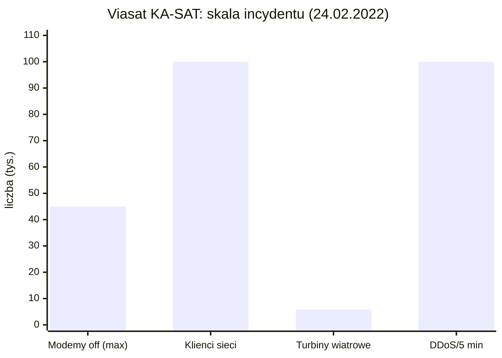
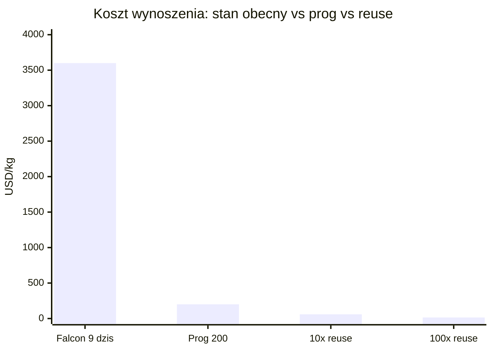
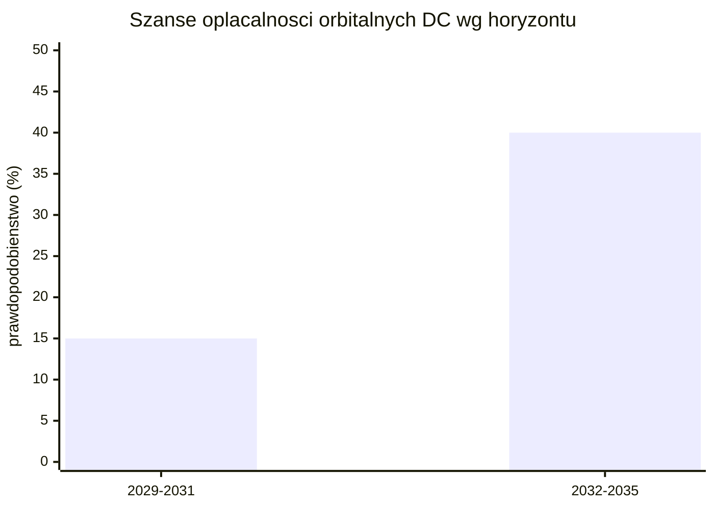
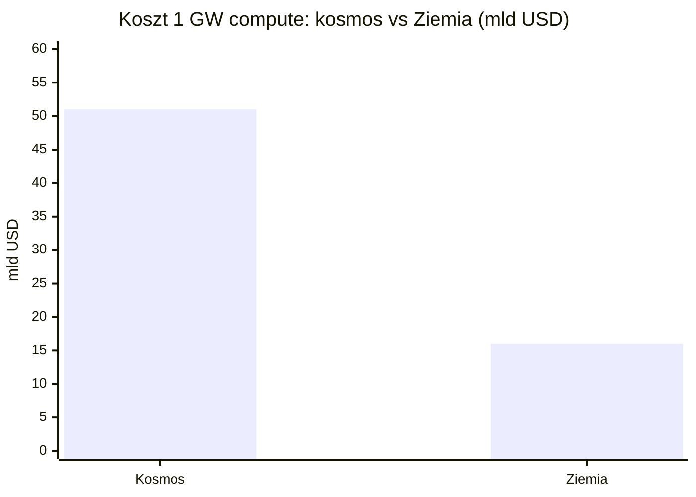

# Bezpieczeństwo, geopolityka i realizm 10-letni

> Notatka raportu "Orbitalne centra danych". Kluczowe źródła: [źródło 1](https://www.swfound.org/publications-and-reports/2025-global-counterspace-capabilities-report), [źródło 2](https://www.csis.org/analysis/space-threat-assessment-2025).

## W skrócie

Orbitalne centra danych obiecują "suwerenną chmurę poza zasięgiem granic", ale ta sama orbita wystawia je na zupełnie nowe wektory ataku: 12 krajów rozwija dziś zdolności antysatelitarne (counterspace), a w jednym roku odnotowano ponad 10 000 zdarzeń zakłóceń satelitarnych. Precedens ataku na sieć <abbr title="sieć satelitarna, której cyberatak z 24 lutego 2022 zbrickował 40 000-45 000 modemów - sztandarowy precedens podatności segmentu naziemnego.">Viasat KA-SAT</abbr> (24 lutego 2022) pokazał, że pojedynczy cyberatak zbrickował 40 000-45 000 modemów i wyłączył zdalny monitoring 5800 turbin wiatrowych - to realne ryzyko, nie hipoteza. Dla inwestora kluczowe są dwie liczby: koszt umieszczenia 1 GW mocy obliczeniowej w kosmosie szacowany jest na 51 mld USD wobec 16 mld USD na Ziemi (3,2x drożej), a niezależni analitycy dają orbitalnym DC poniżej 15% szans na opłacalność w skali do 2029-2031 i 30-40% do 2032-2035. Toczy się przy tym wyścig USA-Chiny: prywatne firmy amerykańskie (SpaceX, Starcloud, Google) składają wnioski FCC na konstelacje rzędu setek tysięcy satelitów, podczas gdy Chiny państwowo wdrażają konstelacje Guowang (13 000) i Qianfan (15 000) oraz pierwszą orbitalną konstelację AI compute Three-Body. Kto wygra, zależy nie od fizyki (TPU już przetrwały 15 krad(Si) radiacji), lecz od tego, czy Starship zbije koszt wynoszenia do ok. 200 USD/kg do połowy lat 2030.

<!-- spolki:related:start -->
## Spółki powiązane (kontekst obronny)

> Temat dotyczy bezpieczeństwa i geopolityki, nie produkcji konkretnego podzespołu - dlatego zamiast "dominujących producentów niszy" wskazujemy notowane spółki o materialnej ekspozycji obronnej/counterspace. Pełne omówienie każdej znajduje się pod jej tematem macierzystym.

- [[Spolki/northrop-grumman|Northrop Grumman (NOC)]] - serwis i operacje on-orbit (MEV/MRV), zob. [[08 - niezawodnosc-serwisowanie-i-cykl-zycia-sprzetu#Brak napraw in-situ a robotyczna obsługa (Northrop Grumman MEV i następcy)]]
- [[Spolki/lockheed-martin|Lockheed Martin (LMT)]] - busy satelitarne i programy rządowe USA, zob. [[03 - fizyka-orbitalna-orbity-i-operacje]]
- [[Spolki/l3harris|L3Harris (LHX)]] - terminale laserowe dla obronności (SDA/NRO), zob. [[07 - lacznosc-optyczne-isl-downlink-i-latencja#Optyczne łącza międzysatelitarne (laser ISL) i roadmapy Tbps]]
- [[Spolki/bae-systems|BAE Systems (BA)]] 🇪🇺 - rad-hard elektronika dla misji krytycznych, zob. [[06 - promieniowanie-i-elektronika-rad-hard-vs-cots#Heritage lotny: co już naprawdę poleciało]]

Zob. też indeks: [[Spolki/_slownik]], [[Spolki/_widok-gpw-eu]].
<!-- spolki:related:end -->

<!-- network:watki:start -->
## Powiązane wątki

> Mapa powiązań tematycznych - jak ten wątek łączy się z resztą raportu.

- [[06 - promieniowanie-i-elektronika-rad-hard-vs-cots|Promieniowanie i elektronika]] - dual-use elektroniki i kontrola eksportu chipów
- [[07 - lacznosc-optyczne-isl-downlink-i-latencja|Łączność optyczna]] - jamming, spoofing i cyber w warstwie łączności
- [[08 - niezawodnosc-serwisowanie-i-cykl-zycia-sprzetu|Niezawodność i serwisowanie]] - resilience orbity vs Ziemia to też niezawodność
- [[10 - gracze-i-projekty|Gracze i projekty]] - wyścig USA-Chiny i timeline demonstratorów
- [[11 - regulacje-prawo-kosmiczne-debris-i-itu|Regulacje i debris]] - data sovereignty i jurysdykcja danych
<!-- network:watki:end -->
## Podatność: ASAT, counterspace, jamming, spoofing, cyber

Orbitalne centrum danych to satelita - a satelity są dziś celem militarnym. 🔵 Raport Secure World Foundation 2025 (Global <abbr title="cały arsenał środków (kinetycznych i niekinetycznych) służących do neutralizacji satelitów przeciwnika.">Counterspace</abbr> Capabilities) ocenia zdolności antysatelitarne rozwijane przez 12 krajów w pięciu kategoriach: direct-ascent (rakiety wystrzeliwane z Ziemi), co-orbital (satelity-zabójcy manewrujące na orbicie), walka elektroniczna (EW), broń energetyczna (directed energy) i cyber [źródło](https://www.swfound.org/publications-and-reports/2025-global-counterspace-capabilities-report). Termin "counterspace" oznacza cały arsenał środków do neutralizacji satelitów przeciwnika. Implikacja dla inwestora: aktywo o wartości miliardów USD na orbicie LEO (low Earth orbit, niska orbita okołoziemska) jest celem w doktrynie wojskowej co najmniej tuzina państw - to ryzyko, którego centrum naziemne za płotem i z ochroną nie ma.

Dobra wiadomość: w okresie raportowanym 🟠 CSIS Space Threat Assessment 2025 stwierdza, że żaden kraj nie testował ani nie użył kinetycznej broni antysatelitarnej DA-ASAT (direct-ascent anti-satellite - rakiety fizycznie rozbijającej satelitę) [źródło](https://www.csis.org/analysis/space-threat-assessment-2025). Realne, codzienne zagrożenie to nie spektakularne strzelanie do satelitów, lecz zakłócenia: 🟠 raport SWF 2025 dokumentuje ponad 10 000 zdarzeń interference (zakłóceń sygnału) w ciągu roku [źródło](https://news.satnews.com/2025/05/05/satellites-face-growing-security-risks-from-russia-and-china-with-10000-incidents-per-year/). <abbr title="zagłuszanie sygnału satelitarnego poprzez zalewanie odbiornika szumem radiowym.">Jamming</abbr> (zagłuszanie - zalewanie odbiornika szumem) i spoofing (podszywanie - podawanie fałszywego sygnału) są tanie, deniowalne i nie tworzą śmieci. Implikacja: orbitalny DC zależy całkowicie od łącza radiowego/laserowego do Ziemi - przeciwnik nie musi go niszczyć, wystarczy odciąć od danych.

Pozostaje ryzyko śmieci kosmicznych jako efektu ubocznego testów ASAT. 🔵 SWF naliczyła 6851 skatalogowanych, śledzonych fragmentów debris powstałych z testów USA, Rosji, Chin i Indii, z czego 2920 wciąż krąży po orbicie [źródło](https://www.swfound.org/publications-and-reports/2025-global-counterspace-capabilities-report). Dla wielkopowierzchniowego orbitalnego DC (panele słoneczne 4x4 km) to istotne ryzyko kolizyjne. Implikacja: ubezpieczenie i koszt unikania kolizji wchodzą do modelu jako stała pozycja, której centra naziemne nie znają.

Cyberataki są trudne do zliczenia - 🟠 CSIS przyznaje, że coraz trudniej śledzić rok do roku liczbę cyberataków na systemy kosmiczne (liczba NIE UJAWNIONE) [źródło](https://www.csis.org/analysis/space-threat-assessment-2025). Jako proxy: baza ERCI wymienia 5 ataków wymierzonych konkretnie w sektor kosmiczny w 2024 (tyle samo co w 2023), przy ok. 720 incydentach we wszystkich sektorach, z których 57% dotyczyło infrastruktury krytycznej [źródło](https://industrialcyber.co/reports/csis-2025-space-threat-assessment-cyberattacks-on-space-systems-persist-tracking-harder-amid-infrastructure-threats/).

### Precedens Viasat KA-SAT (24 lutego 2022)

To najważniejszy case study dla każdego, kto twierdzi, że orbita jest bezpieczna. 🔵 Według samego Viasata o godz. 0302 UTC 24 lutego 2022 wykryto wysoki wolumen złośliwego ruchu z modemów SurfBeam2; do 0415 UTC duże liczby modemów w całej Europie zaczęły wypadać z sieci [źródło](https://www.viasat.com/perspectives/corporate/2022/ka-sat-network-cyber-attack-overview/). 🟠 Atak wyłączył 40 000-45 000 modemów, z których tysiące nigdy nie wróciły do działania, w sieci obsługującej ponad 100 000 klientów w Europie i na Bliskim Wschodzie [źródło](https://therecord.media/viasat-hack-was-two-incidents-and-resulted-in-sanctions). 🟠 Skutek uboczny: 5800 turbin wiatrowych Enercon w Niemczech i Europie Środkowej utraciło zdalny monitoring [źródło](https://reference-global.com/download/article/10.2478/bsaft-2025-0007.pdf). 🟠 W szczycie serwery Viasata dostały ponad 100 000 żądań DDoS w pięć minut [źródło](https://cyberscoop.com/viasat-ka-sat-hack-black-hat/). Implikacja dla inwestora: atakujący nie dotknął ani jednego satelity fizycznie - sparaliżował segment naziemny i łącza. Orbitalny DC dziedziczy dokładnie tę samą powierzchnię ataku, bo bez stacji naziemnych i bezpiecznych łączy jest bezużyteczny.

*Rys. 81 - Skala precedensu Viasat KA-SAT: do 45 tys. zbrickowanych modemów, ponad 100 tys. klientów dotkniętych, 5800 turbin wiatrowych bez monitoringu i ponad 100 tys. żądań DDoS w 5 minut - bez fizycznego dotknięcia satelity. Dane: The Record, reference-global/BSAFT 2025, CyberScoop (notatka).*

Realność zagrożenia dla konstelacji LEO potwierdza Starlink: 🔵 SWF odnotowuje raporty o przerwach w działaniu Starlinka spowodowanych rosyjskim jammingiem (liczba zniszczonych satelitów: NIE UJAWNIONE - środki są niekinetyczne) [źródło](https://www.swfound.org/publications-and-reports/2025-global-counterspace-capabilities-report). Rosyjskie satelity Cosmos 2581/2582 manewrowały w formacji, zbliżając się na 100 m (5 marca 2025), a Cosmos 2583 przeszedł na 0,5 km od tej pary (7 marca 2025) - 🟠 to demonstracja zdolności rendezvous, czyli zbliżania się do cudzych satelitów [źródło](https://industrialcyber.co/reports/csis-2025-space-threat-assessment-cyberattacks-on-space-systems-persist-tracking-harder-amid-infrastructure-threats/).

## Data sovereignty i jurysdykcja: gdzie "mieszkają" dane

Suwerenność danych (data sovereignty) to zasada, że dane podlegają prawu kraju, w którym fizycznie się znajdują. Na orbicie ta zasada się rozpada. 🟠 Reżim prawny kształtuje Traktat o Przestrzeni Kosmicznej z 1967 r., który traktuje kosmos jako global commons (dobro wspólne) i przypisuje kontrolę krajowi wynoszącemu lub rejestrującemu statek - a nie krajowi pochodzenia danych [źródło](https://www.dataversity.net/articles/legal-issues-for-data-professionals-data-centers-in-space/). 🟠 Gdy dane są przetwarzane, kopiowane lub przechowywane na satelicie, sądy mogą stanąć przed pytaniem, czy "computing w kosmosie" w ogóle podlega ziemskim licencjom - jednoznaczna jurysdykcja: NIE UJAWNIONE [źródło](https://www.dataversity.net/articles/legal-issues-for-data-professionals-data-centers-in-space/). Ten sam artykuł wskazuje aż 5 potencjalnych jurysdykcji dla jednego przypadku: kraj startu, kraj rejestracji, kraj operatora stacji naziemnej, lokalizacja użytkownika oraz sama przestrzeń kosmiczna (niepodlegająca żadnej suwerenności).

<abbr title="legalny przechwyt, czyli prawo organów ścigania do dostępu do danych.">Lawful intercept</abbr> (legalny przechwyt - prawo organów ścigania do dostępu do danych) staje się ambiwalentny. 🟠 Analiza prawnicza z Hongkongu stwierdza, że gdy dane fizycznie rezydują na orbicie, poza suwerennością przestrzeni powietrznej i jurysdykcją terytorialną, egzekwowanie prawa staje się niejednoznaczne [źródło](https://www.hk-lawyer.org/content/when-space-borne-data-centres-meet-cross-border-and-vertical-jurisdiction-where-does-hong-kong-s-legal-framework-end-and-space-begin). Dla operatorów to obosieczny miecz: globalna ramowa regulacja data-localization dla danych orbitalnych - NIE UJAWNIONE (nie istnieje). 🟠 Podobnie nie istnieje wiążący mechanizm ograniczający, ile satelitów może zająć daną powłokę orbitalną [źródło](https://www.powermag.com/solar-power-satellites-and-orbital-data-centers-international-space-law-implications/). Skala wyzwania regulacyjnego: 🔴 Starcloud złożył w FCC wniosek na konstelację do 88 000 satelitów [źródło](https://montecarlocap.com/portfolio-company-news-starcloud-raises-170m-series-a/). Implikacja: brak ram prawnych to jednocześnie marketingowa zaleta ("dane poza zasięgiem obcego nakazu") i ryzyko regulacyjne, które może zatrzymać wdrożenie.

## Wyścig USA-Chiny: prywatni gracze vs państwowe konstelacje

To rdzeń geopolityki orbitalnego compute. Skala startów dzieli świat: 🔵 raport USCC (komisja Kongresu USA) podaje 2272 satelity USA wystrzelone w 2024 wobec 270 chińskich [źródło](https://www.uscc.gov/sites/default/files/2025-11/Chapter_7--The_Final_Frontier_Chinas_Ambitions_to_Dominate_Space.pdf). Ale Chiny nadrabiają planami państwowych mega-konstelacji: 🔵 Guowang (China Satnet) celuje w 13 000 satelitów dla telekomunikacji i potencjalnie zastosowań wojskowych, Qianfan (Thousand Sails) planuje 15 000 dla zagranicznych telekomów, Hongqing Technology zgłosił do ITU trzecią mega-konstelację 10 000 satelitów, a mniejsi gracze Geespace (6000) i GalaxySpace (1000) [źródło](https://www.uscc.gov/sites/default/files/2025-11/Chapter_7--The_Final_Frontier_Chinas_Ambitions_to_Dominate_Space.pdf). Wdrożenie napotyka problemy jakościowe: 🔴 13 z 90 satelitów Qianfan wykazało anomalie, np. nieosiągnięcie docelowej orbity [źródło](https://www.bing.com/ck/a?!=&fclid=071a214e-0cce-6457-14b5-34b20d096596&hsh=4&ntb=1&p=3758c2c89721b6e7be259a749dff6a27c91bc14a23b535aca7a54eef5a94f6d6JmltdHM9MTc0ODU2MzIwMA&ptn=3&u=a1aHR0cHM6Ly9pbnNpZGV0ZWxlY29tLmNvbS9jaGluZXNlLXN0YXJsaW5rLWNvbXBldGl0b3JzLWluLTIwMjUv&ver=2). 🟠 Pierwsze 648 satelitów Qianfan wdrożono w latach 2024-2025 [źródło](https://en.poc.hk/china-space-computing).

Chiny prowadzą jednak w dedykowanym orbitalnym AI compute. 🟠 Konstelacja Three-Body Computing Constellation firmy ADA Space wystrzeliła pierwsze 12 satelitów w maju 2025, każdy z łączami optycznymi 100 Gbps (gigabitów na sekundę) i akceleratorami AI o mocy 744 TOPS (tera-operacji na sekundę - bilionów operacji na sekundę), z docelem 2800-satelitarnego rozproszonego superkomputera w LEO [źródło](https://evodefence.uk/briefing-orbital-compute-march2026). 🟠 ADA Space dostała linię kredytową 5 mld CNY (ok. 730,85 mln USD) z Banku Chin - sygnał państwowego wsparcia [źródło](https://www.china-in-space.com/p/chinas-space-enterprises-quietly). 🔵 Guoxing Aerospace wdrożył w maju 2025 12-satelitarną konstelację obliczeniową, a już we wrześniu 2024 raportował pierwszą orbitalną walidację inferencji LLM (dużego modelu językowego) [źródło](https://arxiv.org/html/2605.16849v1). Implikacja dla inwestora: Chiny realizują orbitalny AI compute jako projekt państwowy z tanim finansowaniem - amerykańscy prywatni gracze konkurują z bilansem skarbu państwa, nie z firmą.

Po stronie USA gra jest prywatna i większa rozmiarem wniosków: 🔵 SpaceX złożył w FCC wniosek na system Orbital Data Center do 1 000 000 satelitów, na wysokościach 500-2000 km, w powłokach orbitalnych do 50 km szerokości [źródło](https://docs.fcc.gov/public/attachments/DA-26-113A1.pdf). 🟠 SpaceX szacuje 100 GW rocznego przyrostu mocy AI compute przy wynoszeniu 1 mln ton satelitów rocznie (100 kW compute na tonę) [źródło](https://www.satellitetoday.com/connectivity/2026/02/02/spacex-acquires-xai-to-pursue-orbital-data-center-constellation/). 🔵 Google (Project Suncatcher) projektuje klaster 81 satelitów o promieniu 1 km z prototypami (2 satelity) planowanymi na początek 2027 [źródło](https://arxiv.org/html/2511.19468). 🔴 Starcloud zgłosił do 88 000 satelitów [źródło](https://montecarlocap.com/portfolio-company-news-starcloud-raises-170m-series-a/).

## Dual-use: orbitalne compute dla obronności i wywiadu (edge ISR)

<abbr title="technologia o podwójnym, cywilno-wojskowym zastosowaniu.">Dual-use</abbr> oznacza technologię cywilno-wojskową. Tu leży najtwardszy, najszybszy popyt. <abbr title="Intelligence, Surveillance, Reconnaissance, czyli rozpoznanie, obserwacja i wywiad.">ISR</abbr> to Intelligence, Surveillance, Reconnaissance (rozpoznanie i obserwacja); "edge AI" oznacza przetwarzanie danych przy sensorze, na orbicie, zamiast odsyłania surowych danych na Ziemię. 🔴 Według analizy branżowej DARPA i inne agencje mają skierować ponad 2,8 mld USD wydatków rządowych w ekosystem orbital computing w latach 2025-2030 [źródło](https://marketintelo.com/report/orbital-data-center-space-based-ai-computing-market). Konkretna, klasyfikowana wielkość kontraktów DoD: NIE UJAWNIONE (brak publicznych danych).

Wartość militarna jest mierzalna w dwóch wymiarach. Opóźnienie: 🔴 relay przez stację naziemną dodaje 500-600 ms round-trip, a inferencja on-orbit eliminuje tę pętlę, dając sub-50 ms przy sensorze [źródło](https://www.edgeorbital.io/2026/04/22/edge-ai-satellites-how-on-orbit-processing-is-reshaping-defense-isr-in-2026/). Przepustowość: 🔴 pojedyncza scena SAR (radar z syntetyczną aperturą) to 500 MB do kilku GB surowych danych, a po przetworzeniu on-orbit wynik bywa poniżej 1 KB - kompresja ponad 99% [źródło](https://www.edgeorbital.io/2026/04/22/edge-ai-satellites-how-on-orbit-processing-is-reshaping-defense-isr-in-2026/). Implikacja: dla wojska orbitalny compute opłaca się już dziś (szybsza decyzja, mniejsze zużycie łącza), nawet zanim opłaci się komercyjnie - to "kotwica" popytu odporna na cenę energii. Konkretne wdrożenia: 🔴 włoski rząd finansuje pierwsze 25 satelitów IRIDE HEO z edge computing (2025), a amerykańska SDA Missile Tracking Layer Tranche 1 to ok. 50 satelitów [źródło](https://unibap.com/news/defense-in-the-foreground/).

![[assets/y14-1-ksc-2009-1936.jpg]]
*Rys. 82 - Bezpieczenstwo: KSC-2009-1936. Źródło: NASA, licencja: public domain.*
#grafika #bezpieczenstwo-geopolityka-i-realizm-10-letni #bezpieczenstwo #dual-use

![[assets/y14-2-05pd0386.jpg]]
*Rys. 83 - Bezpieczenstwo: KSC-05pd-0386. Źródło: NASA, licencja: public domain.*
#grafika #bezpieczenstwo-geopolityka-i-realizm-10-letni #bezpieczenstwo #dual-use

Zależność od launch providerów jest jednak strategicznym wąskim gardłem: cały zachodni ekosystem orbital compute zależy faktycznie od SpaceX/Starship (patrz sekcja timeline), co tworzy ryzyko pojedynczego dostawcy także dla zastosowań obronnych.

## Resilience: bardziej czy mniej odporne niż naziemne?

Argumenty za odpornością orbitalną opierają się na fizyce energii i chłodzenia. 🔵 Według white paper Starcloud panel słoneczny w kosmosie generuje ponad 5x więcej energii niż ten sam panel na Ziemi, przy capacity factor (współczynniku wykorzystania mocy) powyżej 95% wobec poniżej 50% na Ziemi [źródło](https://starcloudinc.github.io/wp.pdf). 🔵 Starcloud deklaruje równoważny koszt energii ok. 0,002 USD/kWh, żywot DC bez wymiany przez co najmniej 10 lat oraz 0 litrów wody do chłodzenia (radiacyjne radiatory zamiast wieży chłodniczej) [źródło](https://starcloudinc.github.io/wp.pdf). Implikacja: orbitalny DC jest odporny na to, co dręczy naziemne - brak wody, brak nocy, brak sieci energetycznej do podłączenia.

Argumenty przeciw to radiacja i debris. 🔵 Google szacuje dawkę radiacyjną ok. 150 rad(Si)/rok na orbicie heliosynchronicznej (SSO) przy ekranowaniu 10 mm aluminium, wymagając od chipów przetrwania 5-letniej dawki <abbr title="total ionizing dose, skumulowana dawka promieniowania jonizującego, którą musi przetrwać elektronika satelity.">TID</abbr> (total ionizing dose - skumulowanej dawki jonizującej) ok. 750 rad(Si) [źródło](https://arxiv.org/html/2511.19468). Dobra wiadomość dla narracji: 🔵 testowane TPU V6e Trillium działały poprawnie do maksymalnej testowej dawki 15 000 rad(Si) na chip, czyli 20x ponad wymóg misji [źródło](https://arxiv.org/html/2511.19468). Słabsze ogniwo to pamięć: 🔵 HBM (high bandwidth memory) zaczynała wykazywać nieregularności po dawce 2000 rad(Si), choć ryzyko niewykrywalnego błędu (UECC) szacowane jest na 1 na 10 milionów inferencji [źródło](https://arxiv.org/html/2511.19468). Plus ryzyko śmieci: 🔵 6851 fragmentów z testów ASAT jako stałe tło kolizyjne [źródło](https://www.swfound.org/publications-and-reports/2025-global-counterspace-capabilities-report). Werdykt: odporność na zagrożenia naziemne (woda, sieć, lokalizacja) rośnie, ale pojawiają się ryzyka, których na Ziemi nie ma (radiacja, debris, brak fizycznego serwisu).

## Timeline demonstratorów i zależność od Starship

Demonstratory już latają. 🔵 W listopadzie 2025 Starcloud wystrzelił Starcloud-1 z GPU NVIDIA H100 [źródło](https://arxiv.org/html/2605.16849v1), a 🔴 w grudniu 2025 raportował pomyślny orbitalny trening modelu AI [źródło](https://enkiai.com/data-center/space-ai-data-centers-top-10-signals-to-watch-in-2025/). 🟠 Misja Starcloud-2 (klaster GPU) ma być w pełni operacyjna na orbicie SSO w 2026 [źródło](https://www.factoriesinspace.com/lumen-orbit). 🔵 Google planuje 2 prototypowe satelity Suncatcher (z Planet Labs) na początek 2027 [źródło](https://arxiv.org/html/2511.19468).

Cała ekonomia zależy od jednej zmiennej: kosztu wynoszenia. 🔵 Obecny koszt Falcon 9 (reusable) to 3600 USD/kg, a próg opłacalności cytowany przez SpaceX i Google to 200 USD/kg [źródło](https://arxiv.org/html/2511.19468). 🔵 Google szacuje, że LEO może osiągnąć ok. 200 USD/kg do połowy lat 2030, ale wymaga to wyniesienia ok. 370 000 ton dodatkowej masy, czyli ok. 1800 startów Starship - ok. 180 startów rocznie [źródło](https://arxiv.org/html/2511.19468). 🔵 Przy 10x reuse koszt mógłby spaść do ok. 60 USD/kg, a przy ambitnym celu 100x reuse do ok. 15 USD/kg [źródło](https://arxiv.org/html/2511.19468). 🟠 Starcloud zakłada koszt 500 USD/kg dla Starcloud-3 (platforma 200 kW, ok. 3 tony) i koszt energii ok. 0,05 USD/kWh, a komercyjny dostęp do Starship przewiduje na 2028-2029 [źródło](https://mezha.net/eng/bukvy/starcloud_secures_-170m/). Implikacja: bez ok. 180 startów Starship rocznie cała narracja gigawatowa się nie zamyka - to jest pojedynczy punkt, na którym stoi lub upada inwestycja w sektorze.

*Rys. 84 - Obecny koszt Falcon 9 (reusable) 3600 USD/kg wobec progu opłacalności 200 USD/kg; przy 10x reuse ok. 60 USD/kg, przy 100x reuse ok. 15 USD/kg. Dopóki launch nie spadnie do ok. 200 USD/kg, orbita jest droższa od Ziemi. Dane: arXiv 2511.19468 / Google Project Suncatcher (notatka).*

## TRL i scenariusze bull/base/bear

<abbr title="Technology Readiness Level, 9-stopniowa skala NASA mierząca dojrzałość technologii od badań podstawowych do operacji.">TRL</abbr> (Technology Readiness Level - poziom gotowości technologii) to skala NASA. 🔵 TRL ma 9 poziomów (1 - badania podstawowe, 9 - testy, start, operacje), a integracja z systemem lotnym wymaga zwykle TRL 6 lub wyżej [źródło](https://ntrs.nasa.gov/api/citations/20205003605/downloads/%20SP-20205003605%20TRA%20BP%20Guide%20FINAL.pdf). 🔴 Demonstratory orbitalnych DC szacowane są na TRL 6-7 w fazie 2025-2027, TRL 7-8 w 2027-2031, TRL 8-9 w 2031-2036 [źródło](https://vixra.org/pdf/2510.0065v1.pdf). Dojrzałość komponentów jest jednak wyższa niż sugeruje sceptyk: 🔵 TPU Trillium przetrwały 5-letnią misyjną dawkę TID bez trwałych uszkodzeń, demonstrator Google osiągnął 1,6 Tbps bidirectional na łączu optycznym (wobec wymaganych ok. 10 Tbps per link), a osobny demonstrator ISI - 800 Gb/s [źródło](https://arxiv.org/html/2511.19468) [źródło](https://arxiv.org/html/2604.07760v1).

Scenariusze rynkowe (perspektywa inwestora):

- BULL: 🟠 BIS Research projektuje rynek in-orbit DC na 39 090,5 mln USD w 2035 (z 1776,7 mln w 2029), przy CAGR 67,40% [źródło](https://bisresearch.com/industry-report/in-orbit-data-centers-market.html). 🔴 Luminix wskazuje rynek "overflow training capacity" dla głodnych mocy hyperscalerów wart 10-50 mld USD/rok do 2030 [źródło](https://www.useluminix.com/reports/industry-analysis/data-centers-in-space).
- BASE: 🔴 prawdopodobieństwo osiągnięcia ok. 39 mld USD rynku do 2035 oceniane jest na 50-60%, z konserwatywnym scenariuszem ok. 20 mld i optymistycznym ok. 50 mld USD [źródło](https://vixra.org/pdf/2510.0065v1.pdf).
- BEAR: 🔴 Luminix daje poniżej 15% szans na opłacalność w skali do 2029-2031 i 30-40% do 2032-2035 (i to tylko jeśli spełnią się trzy warunki jednocześnie) [źródło](https://www.useluminix.com/reports/industry-analysis/data-centers-in-space). 🔴 Scenariusz "naziemne alternatywy poprawiają się szybciej" (atom, OZE, efektywność) ma 30% prawdopodobieństwa, a "bariery regulacyjne" 25% [źródło](https://vixra.org/pdf/2510.0065v1.pdf).

*Rys. 85 - Niezależny analityk Luminix daje orbitalnym DC poniżej 15% szans na opłacalność do 2029-2031 i 30-40% (górna granica 40%) do 2032-2035. Dane: Luminix - data centers in space (notatka).*

Co falsyfikuje narrację: kluczowy jest test cenowy energii. 🔵 Obecny koszt energii naziemnych DC w USA to ok. 570-3000 USD/kW/rok, a "launched power price" przy 200 USD/kg wynosi 810-7500 USD/kW/rok - przy obecnych cenach launchu konstelacja typu Starlink v2 to aż 14 700 USD/kW/rok [źródło](https://arxiv.org/html/2511.19468). Innymi słowy: dopóki launch nie spadnie do ok. 200 USD/kg, orbita jest droższa od Ziemi - to jest twardy próg falsyfikacji. Plus: 🔵 <abbr title="Power Usage Effectiveness, miara efektywności energetycznej centrum danych (im bliżej 1,0, tym lepiej).">PUE</abbr> (Power Usage Effectiveness - efektywność wykorzystania energii, im bliżej 1,0 tym lepiej) naziemnych DC to 1,09-1,4, a orbitalnych szacowany 🔴 na 1,0-1,1 [źródło](https://arxiv.org/html/2511.19468) [źródło](https://www.useluminix.com/reports/industry-analysis/data-centers-in-space). Opóźnienie: 🔴 LEO 340-550 km dodaje 4,6-7,4 ms round-trip, ale ok. 75% workloadów AI toleruje 5-20 ms [źródło](https://www.useluminix.com/reports/industry-analysis/data-centers-in-space). Kamienie milowe do obserwacji: pełna operacyjność Starcloud-2 (2026), prototypy Suncatcher (2027), komercyjny Starship (2028-2029), demonstrator ASCEND 50 kW (2031), próg 200 USD/kg (ok. 2035), docelowy 1 GW ASCEND (2050).

## Kontrowersje

**1. Czy orbita zwiększa czy zmniejsza bezpieczeństwo danych? Realność zagrożenia ASAT**

Strona "za" (izolacja fizyczna, niezależność): 🟠 Starcloud-2 reklamowany jest jako bezpieczne globalne przechowywanie danych i suwerenna chmura "w pełni niezależna od Ziemi" - 100% niezależności od sieci naziemnych [źródło](https://www.factoriesinspace.com/lumen-orbit). 🔴 Starcloud deklaruje też 10x niższe CO2 w cyklu życia DC wobec zasilania naziemnego [źródło](https://www.kukarella.com/news/starcloud-aims-for-orbit-data-centers-in-space-p1760565602). Argument: dane na orbicie są fizycznie poza zasięgiem włamywacza, klęski żywiołowej czy lokalnego nakazu.

Strona "przeciw" (nowe wektory ataku, zależność od RF/laser): 🟠 atak Viasat zbrickował 40 000-45 000 modemów i dotknął ponad 100 000 klientów - bez tknięcia satelity [źródło](https://therecord.media/viasat-hack-was-two-incidents-and-resulted-in-sanctions). 🔵 12 krajów rozwija counterspace [źródło](https://www.swfound.org/publications-and-reports/2025-global-counterspace-capabilities-report). Niuans, który warto zachować zamiast uśredniać: 🔵 SWF podkreśla, że stosowane są wyłącznie środki niekinetyczne - liczba fizycznych ataków na satelity komercyjne pozostaje NIE UJAWNIONE (brak publicznych danych). Wniosek: orbita zmienia, a nie eliminuje powierzchnię ataku - znika włamanie fizyczne i ryzyko lokalne, ale pojawia się jamming, cyberatak na łącze i ryzyko ASAT/debris.

**2. Czy GW-class realne do ~2035?**

Strona "za" (proponenci): 🔵 Starcloud projektuje DC 5 GW (panele słoneczne ok. 4x4 km) i oczekuje popytu na multi-GW klastry od 2027 dla treningu największych LLM [źródło](https://starcloudinc.github.io/wp.pdf). 🔵 Europejski projekt ASCEND kreśli ścieżkę od demonstratorów 50 kW do 1 GW orbitalnych obiektów do połowy wieku (2050), gdzie 🔵 IEEE Spectrum szacuje, że 1 GW orbitalne DC wymagałoby ok. 4300 satelitów [źródło](https://arxiv.org/html/2605.08239v1). 🔴 ASCEND zakłada proof of concept 50 kW w 2031 i 1 GW w 2050 [źródło](https://vixra.org/pdf/2510.0065v1.pdf).

Strona "przeciw" (sceptycy): 🟠 umieszczenie 1 GW compute w kosmosie szacowane jest na 51 mld USD wobec 16 mld USD na Ziemi - czyli ok. 3,2x drożej [źródło](https://www.china-in-space.com/p/chinas-space-enterprises-quietly). 🔴 Luminix daje poniżej 15% szans na opłacalność w skali do 2029-2031 i 30-40% do 2032-2035 [źródło](https://www.useluminix.com/reports/industry-analysis/data-centers-in-space). 🔴 Nawet konserwatywne projekcje dają Starship w przedziale 100-300 USD/kg do 2029-2031 (jeśli osiągnie 10-20 reuse) - powyżej progu 200 USD/kg dla niższej granicy [źródło](https://www.useluminix.com/reports/industry-analysis/data-centers-in-space). Sceptyczna teza "min. 10 lat nie będzie dochodowe" jest tu częściowo potwierdzona: do 2035 GW-class jest możliwy technicznie (demonstratory ASCEND, harmonogram Starcloud), ale ekonomicznie zależy od progu 200 USD/kg, którego nikt jeszcze nie osiągnął. Zauważalna rozbieżność: ASCEND celuje w 1 GW dopiero na 2050, podczas gdy Starcloud mówi o multi-GW już od 2027 - obie liczby zachowano bez uśredniania.

*Rys. 86 - Umieszczenie 1 GW mocy obliczeniowej w kosmosie szacowane na 51 mld USD wobec 16 mld USD na Ziemi (ok. 3,2x drożej). Dane: china-in-space (notatka).*

## Słowniczek pojęć

- **ASAT / DA-ASAT** - broń antysatelitarna; DA-ASAT (direct-ascent) to rakieta wystrzeliwana z Ziemi, która fizycznie rozbija satelitę.
- **Counterspace** - cały arsenał środków (kinetycznych i niekinetycznych) służących do neutralizacji satelitów przeciwnika.
- **Jamming** - zagłuszanie sygnału satelitarnego poprzez zalewanie odbiornika szumem radiowym.
- **Spoofing** - podszywanie się pod nadawcę przez podawanie odbiornikowi fałszywego sygnału.
- **Dual-use** - technologia o podwójnym, cywilno-wojskowym zastosowaniu.
- **ISR** - Intelligence, Surveillance, Reconnaissance, czyli rozpoznanie, obserwacja i wywiad.
- **Edge AI / edge computing** - przetwarzanie danych bezpośrednio przy sensorze na orbicie, zamiast odsyłania surowych danych na Ziemię.
- **Data sovereignty** - suwerenność danych, czyli zasada, że dane podlegają prawu kraju, w którym fizycznie się znajdują.
- **Lawful intercept** - legalny przechwyt, czyli prawo organów ścigania do dostępu do danych.
- **Resilience** - odporność systemu (naziemnego lub orbitalnego) na zakłócenia i zagrożenia.
- **TRL** - Technology Readiness Level, 9-stopniowa skala NASA mierząca dojrzałość technologii od badań podstawowych do operacji.
- **LEO / SSO** - LEO to niska orbita okołoziemska (low Earth orbit), SSO to orbita heliosynchroniczna (sun-synchronous orbit).
- **TID** - total ionizing dose, skumulowana dawka promieniowania jonizującego, którą musi przetrwać elektronika satelity.
- **PUE** - Power Usage Effectiveness, miara efektywności energetycznej centrum danych (im bliżej 1,0, tym lepiej).
- **Scenariusze bull / base / bear** - optymistyczny, bazowy i pesymistyczny wariant prognozy rynkowej dla inwestora.
- **Viasat KA-SAT** - sieć satelitarna, której cyberatak z 24 lutego 2022 zbrickował 40 000-45 000 modemów - sztandarowy precedens podatności segmentu naziemnego.
