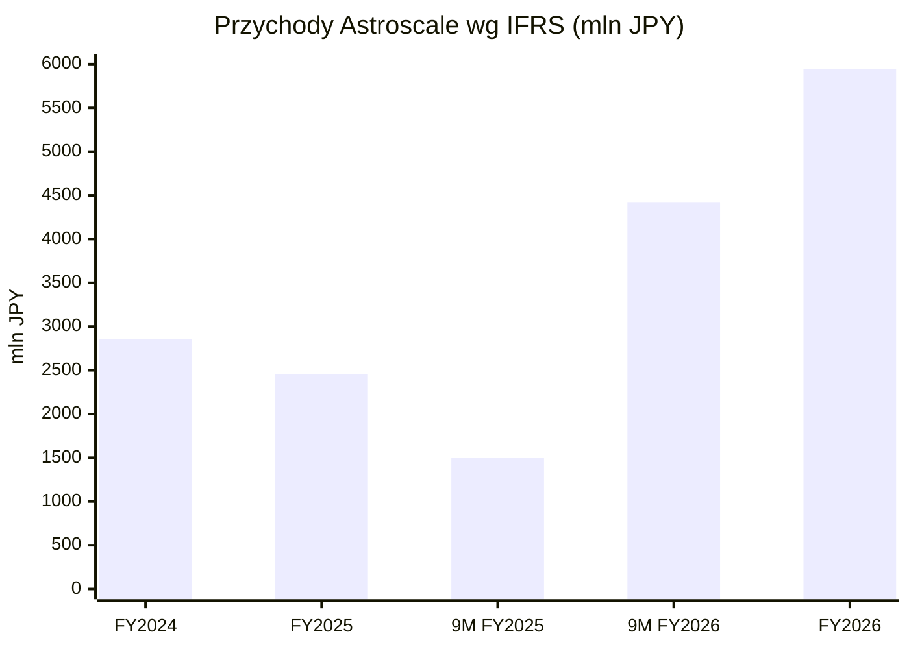
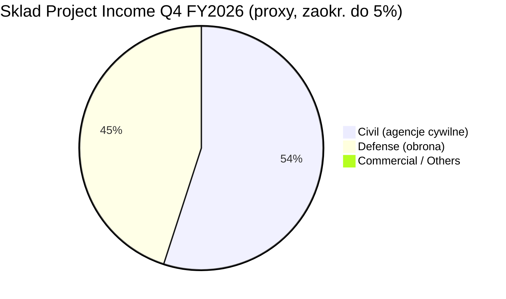
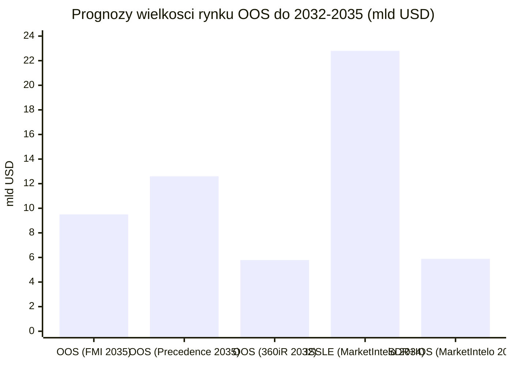
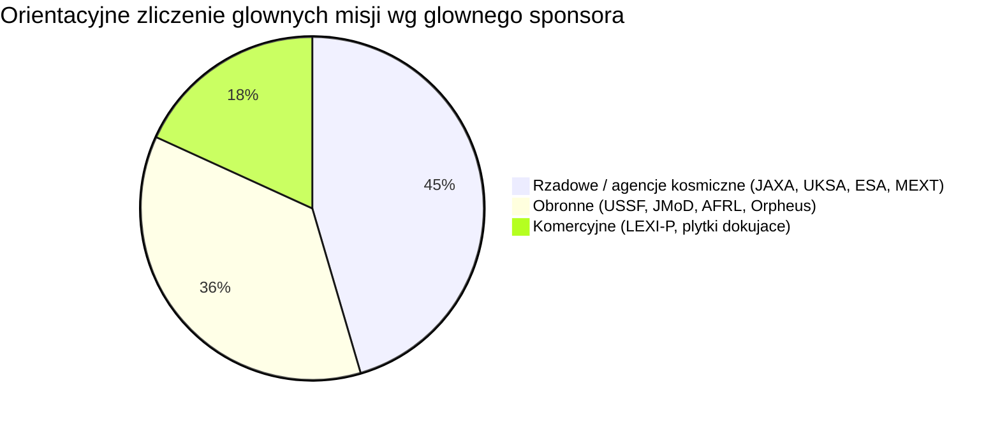

# Astroscale (186A)

<!-- spolki:temat:niezawodnosc-serwisowanie-i-cykl-zycia-sprzetu:start -->
## W kontekscie: Niezawodność, serwisowanie i cykl życia sprzętu

**Czym jest spółka.** Astroscale Holdings to założony w 2013 r. przez Nobu Okadę japoński operator usług on-orbit servicing (OOS), czyli serwisowania satelitów już znajdujących się na orbicie. Spółka jest pierwszym notowanym na giełdzie "pure-play" w tej niszy - zadebiutowała na rynku TSE Growth w Tokio 5 czerwca 2024 r. po cenie IPO JPY 850 (🔵 Astroscale IR, FY2025 prezentacja). Jej model to "gospodarka cyrkularna w kosmosie" rozpisana na pięć czasowników: Reduce (mniej śmieci), Reuse (przedłużanie życia), Repair (naprawy), Refuel (tankowanie) i Remove (usuwanie). W praktyce sprowadza się to do pięciu linii usług: usuwanie satelitów na końcu życia (EOL, End-of-Life), aktywne usuwanie nieprzygotowanych śmieci [[_slownik#ADR|ADR]] (Active Debris Removal), przedłużanie życia satelitów GEO ([[_slownik#life extension|life extension]]), inspekcja obiektów z bliska (ISSA) oraz tankowanie na orbicie (refueling).

**Dlaczego to jest sednem tematu niezawodności i cyklu życia.** Satelita to klasyczny przykład "frozen hardware" - sprzętu, którego po wystrzeleniu nie da się dotknąć, naprawić ani wymienić w nim podzespołu. Gdy skończy się paliwo do utrzymania pozycji ([[_slownik#station-keeping|station-keeping]]), gdy zabraknie [[_slownik#delta-V|delta-V]] na manewry, albo gdy obiekt po prostu umrze, jedynym wyjściem klasycznie była wymiana całego satelity za setki milionów dolarów. To właśnie ten problem rozwija wątek [[08 - niezawodnosc-serwisowanie-i-cykl-zycia-sprzetu#Brak napraw in-situ a robotyczna obsługa (Northrop Grumman MEV i następcy)]]: skoro nie ma napraw in-situ, jedyną drogą jest przyłapanie obiektu robotycznie z zewnątrz. Astroscale buduje pojazdy serwisowe, które dolatują do celu (operacje Rendezvous, Proximity Operations & Docking, RPO), dokują i albo przejmują jego utrzymanie pozycji ([[_slownik#life extension|life extension]], analogicznie do [[_slownik#MEV|MEV]] Northrop Grummana), albo ściągają go z orbity ([[_slownik#deorbitacja|deorbitacja]]).

**Astroscale atakuje też ekonomiczny rdzeń problemu cyklu życia.** Wymiana całego satelity jest droga i powolna; serwisowanie ma według raportów rynkowych obniżyć CAPEX (nakłady inwestycyjne) operatorów rzędu 30-50% wobec budowy nowego, choć szacunek dotyczy wybranych scenariuszy (głównie drogich satelitów GEO) i nie ma jednego, twardego źródła branżowego (🟠 raporty rynkowe cytowane w F1). To jest dokładnie napięcie z wątku [[08 - niezawodnosc-serwisowanie-i-cykl-zycia-sprzetu#Deorbitacja i wymiana całych modułów a upgrade]] - czy taniej dopalić życie staremu obiektowi, czy zastąpić go nowszym. Druga strona tego samego medalu to wątek [[08 - niezawodnosc-serwisowanie-i-cykl-zycia-sprzetu#Starzenie technologiczne (prawo Moore'a) szybsze niż żywotność platformy - problem ekonomiczny]]: przedłużanie życia ma sens dopóki "stary" obiekt nie jest już technologicznie przestarzały - dla części dużych satelitów telekomunikacyjnych GEO ([[_slownik#GEO|GEO]], orbita geostacjonarna) ten rachunek może się spinać, jeśli ich ładunek użyteczny nadal generuje przychody.

> **Dla inwestora:** Astroscale jest czystą ekspozycją na hipotezę, że orbita stanie się serwisowalna. Im dłuższa żywotność platformy ma realną wartość (GEO, drogie satelity), tym mocniejszy popyt na life extension; im taniej i częściej wymienia się sprzęt (tanie konstelacje LEO), tym bardziej wartość przesuwa się ku usuwaniu śmieci i deorbitacji. To dwie różne dynamiki popytu w jednym portfelu.
<!-- spolki:temat:niezawodnosc-serwisowanie-i-cykl-zycia-sprzetu:end -->

<!-- spolki:grafiki:start -->
## Materiały spółki

> Grafiki z materiałów spółki / IR (prawa właściciela, użycie redakcyjne). Pełny rejestr: `Spolki/assets/_licencje.json`.

*Serwisant ELSA-M - wizualizacja satelity do usuwania wielu satelitów klientów. Źródło: images.ctfassets.net; licencja: materiały spółki / IR - prawa właściciela, użycie redakcyjne.*

*Płyta dokująca Astroscale - produkt do przygotowania satelitów pod serwis orbitalny. Źródło: images.ctfassets.net; licencja: materiały spółki / IR - prawa właściciela, użycie redakcyjne.*

*Zdjęcie śmieci kosmicznych (górny stopień rakiety) wykonane przez ADRAS-J podczas fly-around. Źródło: images.ctfassets.net; licencja: materiały spółki / IR - prawa właściciela, użycie redakcyjne.*

<!-- spolki:grafiki:end -->

<!-- spolki:ekspozycja:start -->
## Ekspozycja na temat w liczbach

**Udział tematu w sprzedaży: ~100%.** Astroscale raportuje JEDEN segment - On-Orbit Servicing - więc cała działalność spółki to ten temat. To nie jest konglomerat z marginalną ekspozycją; tu temat niezawodności i cyklu życia sprzętu jest całą firmą (🔵 Astroscale FY2025 wyniki skonsolidowane, IFRS).

**Skala i dynamika - silne odbicie przychodów po słabym roku.** Astroscale ma rok obrotowy (FY, fiscal year) kończący się 30 kwietnia, więc np. FY2026 obejmuje okres maj 2025 - kwiecień 2026, a "9M FY2026" to maj 2025 - styczeń 2026. Po spadkowym FY2025 (przychody JPY 2 457,0 mln, czyli -13,9% r/r) FY2026 pokazał silne odbicie: za pełny rok przychody wyniosły JPY 5 940 mln, czyli +141,8% r/r (górna granica wcześniejszego guidance), przy stracie operacyjnej JPY 9 975 mln i stracie netto JPY 6 697 mln (🔵 Astroscale FY2026 Full-year Results, IFRS, czerwiec 2026; EDINET). Sam przebieg odbicia widać już po 9M FY2026, gdy przychody wyniosły JPY 4 416,0 mln, czyli +194,5% r/r wobec JPY 1 499,3 mln rok wcześniej (🔵 Astroscale FY2026 Q3 wyniki, IFRS, marzec 2026). Co istotne dla cyklu życia sprzętu: zysk brutto za 9M FY2026 wyszedł na lekki plus (JPY 60,8 mln) po stracie brutto JPY 3 982,2 mln rok wcześniej. 9M FY2026 pokazał zatem przejście marży brutto lekko powyżej zera, ale przy nadal głębokiej stracie operacyjnej (JPY 9 975 mln za pełny FY2026) nie jest to jeszcze dowód trwałej rentowności.

*Rys. - Załamanie w FY2025 i silne odbicie w FY2026 (przychód pełnoroczny JPY 5 940 mln, +141,8% r/r). Dane: 🔵 Astroscale wyniki IFRS FY2025, FY2026 Q3 i FY2026 Full-year.*

**Miara zarządcza Project Income.** Spółka steruje biznesem przez Project Income (przychód IFRS powiększony o dotacje rządowe ściśle przypisane do projektów). Ta miara rośnie szybciej i stabilniej niż surowy przychód: JPY 4 667 mln (FY2024) -> JPY 6 088 mln (FY2025) -> JPY 8 349 mln w 9M FY2026 (+125,1% r/r) -> JPY 11 506 mln za pełny FY2026 (+89,0% r/r) (🔵 Astroscale FY2026 Full-year Results, IFRS, 12 czerwca 2026). Guidance FY2026 zakładał JPY 11 000-13 000 mln Project Income przy przychodzie IFRS JPY 5 000-6 000 mln i stracie operacyjnej JPY 9 300-10 300 mln; faktyczny przychód IFRS za pełny FY2026 wyniósł JPY 5 940 mln (górna część przedziału), Project Income JPY 11 506 mln (dolna część przedziału), a strata operacyjna JPY 9 975 mln (nieco powyżej dolnej granicy guidance) (🔵 Astroscale FY2026 Q3 prezentacja; FY2026 Full-year Results, 12 czerwca 2026). Z Project Income FY2026 dotacje rządowe (government subsidy income) stanowiły JPY 5 566 mln (+53,3% r/r), czyli niemal tyle samo co cały przychód IFRS - to obrazuje, jak duża część działalności jest finansowana grantami, a nie sprzedażą usług. Zysk brutto za pełny FY2026 wyniósł JPY 19 mln (dodatni po raz pierwszy, wobec straty brutto JPY 3 880 mln w FY2025), a strata operacyjna spadła z JPY 18 755 mln (FY2025) do JPY 9 975 mln (🔵 Astroscale FY2026 Full-year Results, IFRS, 12 czerwca 2026).

**Struktura wg typu klienta.** Oficjalne rozbicie przychodu IFRS ani Project Income na kategorie klientów: NIE UJAWNIONE - Astroscale raportuje jeden segment (On-Orbit Services) bez podziału geograficznego/klientowego (🔵 Astroscale FY2026 Full-year Results, sekcja Segment Information). Proxy z materiałów zarządczych: wykres składu Project Income (zaokrąglony do 5%) za Q4 FY2026 (luty-kwiecień 2026) pokazuje ok. 45% Defense, ok. 55% Civil i ~0% Commercial/Others; w całym FY2026 udział komercyjny był marginalny (bliski 0%) (🔵 Astroscale FY2026 Full-year Results Presentation, str. 22). To miara zarządcza, nie oficjalne rozbicie przychodu IFRS, i bez pełnorocznej sumy.

*Rys. - Skład Project Income w Q4 FY2026 (luty-kwiecień 2026) wg typu klienta; proxy zarządcze zaokrąglone do 5%, nie oficjalne rozbicie przychodu IFRS, brak pełnorocznej sumy. Dane: 🔵 Astroscale FY2026 Full-year Results Presentation, str. 22.*

> **Dla inwestora:** rozjazd między Project Income (JPY 11,5 mld) a przychodem IFRS (JPY 5,9 mld) za pełny FY2026 pokazuje, jak mocno biznes jest dziś napędzany dotacjami rządowymi (JPY 5,6 mld dotacji) przypisanymi do konkretnych misji, a nie powtarzalną sprzedażą usług. To jest sednem ryzyka modelu: dziedzina ma ~100% udziału w firmie, ale jej przychody są wczesne, głównie rządowo-obronne (proxy Q4 FY2026: ~45% Defense, ~55% Civil, ~0% Commercial), a udział komercyjny jest wciąż bliski zera.

**Backlog i gotówka.** Łączna wartość JPY 41,1 mld to suma [[_slownik#backlog|backlogu]] skontraktowanego (ok. JPY 27,1 mld na 31 października 2025) oraz oczekiwanych, potwierdzonych ale jeszcze nieskontraktowanych kontraktów - nie jest to czysty backlog na jedną datę (🟠 Quartr Q2 FY2026). Warto rozdzielać te dwie kategorie: tylko część skontraktowana jest wiążąca. Gotówka i ekwiwalenty: JPY 21,3 mld w szczycie (kwiecień 2025) -> JPY 13,9 mld na koniec stycznia 2026 (Q3 FY2026) -> JPY 10 022 mln na koniec roku obrotowego (30 kwietnia 2026) (🔵 Astroscale FY2026 Full-year Results, 12 czerwca 2026). Cash flow pozostaje głęboko ujemny: za pełny FY2026 spalanie operacyjne wyniosło -JPY 12 486 mln, a inwestycyjne -JPY 6 927 mln (łącznie -JPY 19 413 mln), wobec operacyjnego -JPY 9 945 mln za 9M FY2026.

**Finansowanie strategiczne i runway.** W maju 2026 spółka ogłosiła finansowanie strategiczne (obligacje zamienne + akcje) o wartości ok. JPY 30,6 mld, ogłoszone 19 maja 2026 i zamknięte 5 czerwca 2026; spółka komunikuje wzrost gotówki o ok. JPY 30 mld (przed kosztami transakcyjnymi) (🔵 Astroscale FY2026 Full-year Results, 12 czerwca 2026). Liczba miesięcy runway: NIE UJAWNIONE bezpośrednio. Proxy: post-finansowaniowa baza gotówkowa to ok. JPY 40 mld (JPY 10 mld na koniec FY2026 + ok. JPY 30 mld z emisji), co przy utrzymanym rocznym spalaniu rzędu JPY 20 mld daje ok. 24 miesiące teoretycznego runway. Na FY2027 spółka prognozuje stratę operacyjną JPY 9,0-9,9 mld i kontynuację inwestycji w zespół, R&D i rozbudowę produkcji, więc realne spalanie pozostanie wysokie (🔵 Astroscale FY2026 Full-year Results, 12 czerwca 2026).
<!-- spolki:ekspozycja:end -->

<!-- spolki:umowy:start -->
## Kluczowe umowy/wdrozenia - co znacza

Portfel Astroscale należy do najszerszych w branży wśród publicznie znanych graczy i jest rozrzucony po trzech kontynentach oraz dwóch reżimach orbity ([[_slownik#LEO|LEO]] i [[_slownik#GEO|GEO]]). Warto rozdzielić dwa typy kontraktów: usuwanie/deorbitacja (LEO/ADR/EOL) oraz przedłużanie życia i tankowanie (GEO/refueling). To rozróżnienie jest bezpośrednim odbiciem dylematu z wątku [[08 - niezawodnosc-serwisowanie-i-cykl-zycia-sprzetu#Deorbitacja i wymiana całych modułów a upgrade]].

**Linia usuwania i deorbitacji (LEO / ADR / EOL):**
- **ELSA-d** - prywatna demonstracja; pierwsze komercyjne przechwycenie i zwolnienie obiektu, zakończona sukcesem. Wartość NIE UJAWNIONA. To dowód działania RPO z obiektem przygotowanym (🔵 Astroscale IR).
- **ELSA-M** - klient UKSA / ESA / Eutelsat OneWeb; EOL usunięcie satelity OneWeb. Łączna wartość projektu (fazy 2-4) ok. EUR 31,6 mln (~JPY 4,7 mld), z czego Faza 4 to EUR 13,95 mln (~JPY 2,0 mld). Pierwotnie planowany na FY2026/FY2027, jednak po podpisaniu 13 marca 2026 umowy launchowej z Isar Aerospace (rakieta Spectrum) start przesunięto na FY2028 (🔵 Astroscale FY2026 Full-year Results, 12 czerwca 2026; Astroscale / Isar Aerospace, 16 marca 2026). Pierwsza komercyjna misja usuwania; przychody rozpoznawane wraz z postępem projektu.
- **ADRAS-J** - klient JAXA (CRD2 Phase I); to misja inspekcyjna (RPO) górnego stopnia rakiety H-IIA, nie misja deorbitacji. Start luty 2024, część inspekcyjna zakończona. Wartość JPY 1,9 mld. Faktyczne usunięcie (deorbitację) tego samego obiektu ma wykonać dopiero ADRAS-J2 (CRD2 Phase II). Pierwsze na świecie zbliżenie do nieprzygotowanego obiektu (🔵 Astroscale FY2026 Full-year Results, 12 czerwca 2026; JAXA/Astroscale, strona misji ADRAS-J).
- **ADRAS-J2** - JAXA (CRD2 Phase II); usunięcie tego samego obiektu za JPY 12,0 mld netto (bez podatku), odpowiednik JPY 13,2 mld z podatkiem (~USD 82 mln), start przesunięty na FY2028 (🔵 Astroscale FY2026 Full-year Results, 12 czerwca 2026; press release, sierpień 2024).
- **COSMIC** - UK Space Agency; ADR dwóch brytyjskich satelitów, kolejna faza GBP 1,95 mln, start ~FY2027/28 (🔵 Astroscale press release, wrzesień 2024).
- **ISSA-J1** - MEXT (Japonia), SBIR; inspekcja 2 dużych satelitów (ALOS/ADEOS-II), do JPY 6,31 mld, start wiosna 2027 (PSLV, Indie) (🔵 Astroscale press release).

**Linia przedłużania życia i tankowania (GEO / refueling):**
- **LEXI-P** - klient komercyjny (nieujawniony, potencjalnie rządowy); [[_slownik#life extension|life extension]] na GEO, wstępny term sheet ~USD 121 mln, start opóźniony do FY2027, negocjacje i testy naziemne postępują zgodnie z planem. Przychody oczekiwane od FY2027 wzwyż. Potencjalnie pierwszy duży komercyjny kontrakt life extension spółki (🔵 Astroscale FY2026 Q3; FY2026 Full-year Results, 12 czerwca 2026).
- **APS-R / Provisioner** - U.S. Space Force; tankowanie hydrazyny satelitów USSF na GEO. Łączna wartość projektu USD 41,2 mln (~JPY 5,7 mld; obejmuje kontrakt USSF USD 25,5 mln plus wkład własny Astroscale). Start przesunięty na FY2027 (wcześniej zapowiadany na lato 2026) (🔵 Astroscale FY2026 Full-year Results, 12 czerwca 2026; press release, kwiecień 2025).
- **REFLEX-J** - Cabinet Office / JST (K Program); demonstracja tankowania chemicznego na LEO, do JPY 10,8 mld, demonstracja ok. 2029 (🔵 Astroscale press release, wrzesień 2025).
- **JMoD - kontrakty obronne** - japońskie Ministerstwo Obrony; dwa kontrakty: większy na "Responsive Space System Demonstration Satellite Prototype" za JPY 7,27 mld z podatkiem (ok. JPY 6,6 mld bez podatku; okres marzec 2025 - marzec 2028) oraz mniejszy na mechanizm chwytający (gripping mechanism) za ok. JPY 1,0 mld bez podatku (ok. JPY 1,1 mld z podatkiem; okres grudzień 2025 - marzec 2028). Razem kontrakty JMoD to ok. JPY 8,3-8,4 mld z podatkiem; oba w rozwoju (🔵 Astroscale FY2026 Full-year Results, 12 czerwca 2026; press releases, luty 2025 i styczeń 2026).
- **Orpheus** (UK/US, defense RPO), **AFRL** (U.S. Air Force, autonomiczne RPO, USD 8,7 mln), **studia NASA/ESA/Cambrian Works** (repair & refurbishment, LEX, USD 0,12 mln+) - fazy badawczo-koncepcyjne (🔵 Astroscale IR).

**Płytki dokujące - cichy fundament cyklu życia.** Astroscale buduje ekosystem magnetycznych płytek dokujących montowanych na satelitach klientów; według IR na orbicie jest już ponad 1 000 satelitów zgodnych z tym interfejsem, głównie z konstelacji OneWeb (🔵 Astroscale IR). Każdy taki obiekt to potencjalny przyszły klient usługi EOL - jest to jednak proxy techniczne (instalowana baza interfejsu), a nie zakontraktowany backlog ani gwarantowany udział rynkowy; nie pokazano konwersji tych płytek na kontrakty ani wyłączności serwisowej. To rozwiązuje brak ustandaryzowanych interfejsów serwisowych, który jest wąskim gardłem całej branży - wątek pokrewny [[08 - niezawodnosc-serwisowanie-i-cykl-zycia-sprzetu#Redundancja N+1, degradacja kontrolowana, brak hot-swap; zarządzanie awariami nodów]], bo bez fizycznego punktu zaczepienia robot nie ma jak przejąć obiektu. W FY2026 spółka podpisała umowy sprzedaży płytek m.in. z Xona Space Systems.

> **Dla inwestora:** kontrakty Astroscale dzielą się na "twarde dziś, ale rządowo-demonstracyjne" (ADRAS-J2 JPY 13,2 mld, APS-R USD 25,5 mln, ISSA-J1 do JPY 6,31 mld) oraz "duże, ale jeszcze niepodpisane lub opóźnione" (LEXI-P ~USD 121 mln). Konwersja tej drugiej kategorii w wiążące, powtarzalne usługi komercyjne jest kluczowym mechanizmem, od którego zależy wyjście ze straty.
<!-- spolki:umowy:end -->

<!-- spolki:pozycja:start -->
## Pozycja rynkowa i udzialy

**Rynek docelowy.** Globalny rynek on-orbit servicing szacowany jest na USD 2,8-4,7 mld w 2025 r. i ma urosnąć do USD 5,8-22,8 mld do 2032-2035 r., przy CAGR 10,4-19,8% w zależności od źródła i definicji (🟠 Future Market Insights, Precedence Research, MarketIntelo, 360iResearch, czerwiec 2026). Konkretnie: Future Market Insights podaje USD 3,10 mld (2025) -> USD 9,50 mld (2035, CAGR 11,7%); Precedence Research USD 4,67 mld -> USD 12,60 mld (2035, CAGR 10,43%); 360iResearch USD 2,79 mld -> USD 5,79 mld (2032, CAGR 11,0%). Szersze ujęcie MarketIntelo (z refuelingiem, life-extension, repair & assembly, ADR i on-orbit manufacturing) daje USD 4,70 mld (2025) -> USD 22,8 mld (2034, CAGR 17,8%). Węższy segment usuwania śmieci + in-orbit servicing rośnie z USD 1,10 mld do USD 5,89 mld (2034, CAGR 19,8%) (🟠 MarketIntelo).

*Rys. - Rozstrzał prognoz wielkości rynku OOS i podsegmentów na 2032-2035 - liczby orientacyjne, różne definicje rynku. Dane: 🟠 Future Market Insights, Precedence Research, 360iResearch, MarketIntelo (czerwiec 2026).*

**Gdzie Astroscale ma najmocniej udokumentowaną pozycję.** Wśród publicznie znanych misji spółka ma jedno z najszerszych flight heritage w komercyjnym OOS: ELSA-d (przechwycenie obiektu przygotowanego), ADRAS-J (zbliżenie do obiektu nieprzygotowanego), w toku ELSA-M i ISSA-J1. To pokrywa szerokie spektrum trudności RPO. Według spółki Astroscale jest jednym z liderów ADR i regionu Azja-Pacyfik, z międzynarodową obecnością: spółki/oddziały operacyjne w Japonii, UK (Harwell), USA (Denver) i Francji (Tuluza), uzupełnione o aktywność projektową/partnerską w Izraelu i Singapurze (forma obecności w tych dwóch krajach nie jest w pełni doprecyzowana). Daje to dostęp do kontraktów JAXA, UKSA, ESA i US DoD jednocześnie (🔵 Astroscale FY2025 prezentacja). Model jest "full-stack": od inspekcji, przez EOL/ADR, po life extension i tankowanie - relacje z 5 głównymi agencjami kosmicznymi i 5 agencjami obronnymi.

**Czego NIE wiemy.** Konkretny udział Astroscale w rynku OOS w procentach - NIE UJAWNIONE. Spółka jest pure-play z najszerszym portfelem misji, ale rynek jest tak wczesny i fragmentaryczny, że twardego udziału nie da się podać. Proxy: ponad 1 000 satelitów z płytkami dokującymi na orbicie to mierzalna przewaga w przyszłym popycie EOL.

> **Dla inwestora:** pozycja Astroscale to "najszersze portfolio i flight heritage", a nie udokumentowany udział rynkowy. W komercyjnym GEO life extension liderem realnych przychodów jest Northrop Grumman (>USD 100 mln skumulowanych z [[_slownik#MEV|MEV]]); Astroscale wciąż dowodzi modelu, a nie zbiera z niego powtarzalnych przychodów.
<!-- spolki:pozycja:end -->

<!-- spolki:konkurencja:start -->
## Mechanika konkurencji - na osiach

Rynek OOS konsoliduje się wokół 4-6 globalnych graczy pełnoserwisowych. Astroscale konkuruje na trzech osiach: typ usługi (ADR/EOL vs life extension vs tankowanie), reżim orbity (LEO vs GEO) oraz dojrzałość komercyjna (demonstrator vs działająca usługa).

| Gracz | Siedziba | Specjalizacja | Twarda pozycja |
|---|---|---|---|
| **Northrop Grumman / SpaceLogistics** | USA | GEO life extension (MEV-1, MEV-2, MRV, MEP) | Komercyjny lider GEO; >USD 100 mln skumulowanych przychodów z MEV, in-orbit servicing szac. >USD 180 mln/rok (2025); matka NOC: backlog USD 95,7 mld, guidance sprzedaży 2026 USD 43,5-44,0 mld |
| **Astroscale** | Japonia | ADR, EOL, LEX, ISSA, refueling | Najszersze portfolio misji; lider ADR i Azji-Pacyfiku |
| **ClearSpace** | Szwajcaria | ADR (ClearSpace-1, PRELUDE) | Główny partner ESA; kontrakt ClearSpace-1 EUR 86,2 mln (całkowity koszt misji ~EUR 100 mln); Seria A EUR 26,7 mln |
| **Starfish Space** | USA | Otter servicing vehicle, LEO life extension | Series B USD 110 mln (kwiecień 2026), łącznie >USD 150 mln VC; kontrakty z US Space Force / SDA >USD 107 mln (m.in. USD 54,5 mln SSC, USD 52,5 mln SDA, wcześniej USD 37,5 mln STRATFI) |
| **Orbit Fab** | USA | Infrastruktura tankowania (GRIP/RAFTI) | Lider depotów paliwa; współpraca z Astroscale (LEXI, APS-R) |
| **D-Orbit** | Włochy | Transport in-orbit (ION Carrier) | >16 misji; mocna pozycja w LEO |
| **Infinite Orbits** | Francja | GEO life extension (Endurance) | Kontrakt z SES |

**Oś dojrzałości - tu Astroscale jest goniącym, nie liderem.** Najtwardsza przewaga konkurencji to działające komercyjnie misje GEO Northrop Grummana: MEV-1 i MEV-2 fizycznie przedłużają życie satelitom Intelsat od lat, generując >USD 100 mln skumulowanych przychodów ([[_slownik#MEV|MEV]], [[_slownik#life extension|life extension]]). To rozwija wątek [[08 - niezawodnosc-serwisowanie-i-cykl-zycia-sprzetu#Brak napraw in-situ a robotyczna obsługa (Northrop Grumman MEV i następcy)]]. Astroscale w life extension dopiero negocjuje pierwszy duży kontrakt (LEXI-P ~USD 121 mln, opóźniony do FY2027).

**Oś typu usługi.** W ADR i EOL Astroscale ma najgłębsze portfolio i jedyne flight heritage zbliżenia do nieprzygotowanego obiektu (ADRAS-J). ClearSpace (główny partner ESA; kontrakt ClearSpace-1 EUR 86,2 mln przy całkowitym koszcie misji ~EUR 100 mln, Seria A EUR 26,7 mln, nowy projekt PRELUDE ogłoszony w styczniu 2026) konkuruje głównie w europejskim ADR; Starfish Space (Series B USD 110 mln z kwietnia 2026, łącznie >USD 150 mln kapitału VC, kontrakty z US Space Force / SDA >USD 107 mln) rośnie w LEO life extension. W tankowaniu Orbit Fab jest nie tyle rywalem, co partnerem Astroscale (LEXI, APS-R) - rynek dopiero wytwarza interfejsy (🔵 ClearSpace/ESA; Starfish Space, 7 kwietnia 2026).

**Oś zasobów finansowych.** Tu Astroscale jest najsłabsza wobec koncernów obronnych: Northrop Grumman (matka SpaceLogistics: kapitalizacja ~USD 96 mld, backlog USD 95,7 mld, guidance sprzedaży 2026 USD 43,5-44,0 mld), a także potencjalnie Maxar/MDA/Airbus/Thales, mają bilanse rzędu wielokrotności kapitalizacji Astroscale i mogą dłużej finansować nierentowną fazę. Astroscale za pełny FY2026 wciąż pali gotówkę (-JPY 12 486 mln operacyjnie) przy gotówce JPY 10 022 mln na koniec roku, podbitej w czerwcu 2026 emisją CB + akcji o ok. JPY 30 mld (🔵 Astroscale FY2026 Full-year Results, 12 czerwca 2026; 🟠 MarketIntelo/ResearchIntelo, czerwiec 2026).

> **Dla inwestora:** Astroscale wygrywa szerokością portfela i heritage w ADR/inspekcji, ale przegrywa na osi "działająca komercyjna usługa GEO" (Northrop Grumman) i na osi siły bilansu (koncerny obronne). Konwersja LEXI-P i udane starty ELSA-M oraz ADRAS-J2 to dokładnie te punkty, w których spółka próbuje domknąć lukę dojrzałości.
<!-- spolki:konkurencja:end -->

<!-- spolki:przekroj:start -->
## Koncentracja odbiorcow i ryzyka z mechanizmem

**Koncentracja klientów jest wysoka i głównie rządowa.** Gros przychodów i Project Income Astroscale pochodzi od kilku agencji: JAXA (ADRAS-J, ADRAS-J2), UKSA/ESA (ELSA-M, COSMIC), U.S. Space Force (APS-R), MEXT (ISSA-J1), japońskie Ministerstwo Obrony (JMoD, łącznie ok. JPY 8,3-8,4 mld z podatkiem) oraz OneWeb (płytki dokujące, ELSA-M). Pojedyncze duże projekty - ELSA-M, ADRAS-J2 (JPY 13,2 mld), LEXI-P (~USD 121 mln) - mają na tyle duży ciężar, że opóźnienie jednego przesuwa wyniki całej spółki.

*Rys. - Orientacyjne zliczenie głównych misji według głównego sponsora (kategorie mogą się nakładać - np. ELSA-M łączy komponent agencyjny i komercyjny, LEXI-P jest potencjalnie rządowy - nie odzwierciedla to struktury finansowania ani przychodów). Dane: 🔵 Astroscale IR (zliczenie misji z F1).*

**Ryzyka z mechanizmem:**

- **Zależność od budżetów rządowych i obronnych.** Mechanizm: większość finansowania projektowego (Project Income) i znacząca część przychodów IFRS to granty i kontrakty demonstracyjne agencji; zmiana priorytetów budżetowych JAXA, UKSA czy US Space Force może zamrozić lub opóźnić łączną wartość JPY 41,1 mld (backlog skontraktowany + oczekiwane kontrakty), z czego tylko część (ok. JPY 27,1 mld) jest faktycznie skontraktowana. Skutek: przychody i Project Income spadają zanim usługi komercyjne dojrzeją.
- **Pre-profit i spalanie gotówki.** Mechanizm: spółka generuje już przychody (JPY 5 940 mln za FY2026), ale jest daleka od dodatniego cash flow (-JPY 12 486 mln operacyjnie za pełny FY2026, łącznie z inwestycyjnym -JPY 19 413 mln) przy gotówce JPY 10 022 mln na koniec FY2026, która spadła z JPY 21,3 mld w kwietniu 2025. Skutek: groźba kolejnych emisji akcji i rozwodnienia - co już się materializuje: w maju/czerwcu 2026 spółka pozyskała ok. JPY 30 mld z obligacji zamiennych i emisji akcji, podbijając bazę gotówkową do ok. JPY 40 mld. Liczba akcji rosła wraz z kolejnymi emisjami od IPO na TSE w czerwcu 2024.
- **Ryzyko technologiczne pierwszych misji komercyjnych.** Mechanizm: ELSA-M, ADRAS-J2 i LEXI-P to debiuty operacyjne na orbicie; w środowisku "frozen hardware" awarii nie da się naprawić ani zrobić hot-swap (wątek [[08 - niezawodnosc-serwisowanie-i-cykl-zycia-sprzetu#Redundancja N+1, degradacja kontrolowana, brak hot-swap; zarządzanie awariami nodów]]), a manewry zbliżeniowe konsumują [[_slownik#delta-V|delta-V]] i nie mają drugiej szansy. Skutek: nieudany start lub dokowanie może opóźnić cały strumień przychodów i podważyć heritage, na którym opiera się przewaga.
- **Długie cykle realizacji.** Mechanizm: misje satelitarne trwają 2-5 lat, łatwo o przesunięcia startów (LEXI-P już opóźniony do FY2027) i wzrost kosztów. Skutek: rozjazd między backlogiem a rozpoznanym przychodem.
- **Ryzyko walutowe.** Mechanizm: przychody w USD, EUR i GBP, koszty głównie w JPY; wahania kursów uderzają w marżę.
- **Konkurencja z działającą usługą GEO.** Mechanizm: Northrop Grumman ma już komercyjne misje MEV; jeśli klienci GEO wybiorą sprawdzonego dostawcę, Astroscale traci najbardziej dochodowy segment life extension.
- **Brak ram prawnych dla ADR/serwisowania.** Mechanizm: odpowiedzialność za uszkodzenia podczas usuwania śmieci lub dokowania pozostaje prawnie niejasna; skutek to potencjalne koszty i wstrzymanie misji.

> **Dla inwestora:** istota ryzyka Astroscale to złożenie pre-profit (przed powtarzalnymi przychodami komercyjnymi) + koncentracja rządowa + technologiczne "jeden strzał". Dziedzina ma ~100% udziału w firmie, więc nie ma dywersyfikacji, która zamortyzowałaby pojedyncze niepowodzenie misji lub cięcie budżetu agencji. Post-finansowaniowy bufor gotówkowy (ok. JPY 40 mld po emisji z czerwca 2026) wobec rocznego spalania rzędu JPY 20 mld daje ok. 24 miesiące teoretycznego runway - to realny horyzont, w którym muszą dojrzeć usługi komercyjne.
<!-- spolki:przekroj:end -->

<!-- network:peers:start -->
## Powiązane spółki

> Inne notowane spółki z raportu dzielące z tą firmą co najmniej jeden wątek tematyczny (wspólny rynek, technologia lub łańcuch wartości).

- [[Spolki/airbus|Airbus SE (AIR)]] - PV (Sparkwing), optyka (Tesat), busy, serwis (EU)  
  *Wspólne wątki: Niezawodność i serwisowanie.*
- [[Spolki/lockheed-martin|Lockheed Martin Corporation (LMT)]] - Busy satelitarne, serwisowanie, ULA (launch)  
  *Wspólne wątki: Niezawodność i serwisowanie.*
- [[Spolki/mda-space|MDA Space Ltd. (MDA)]] - Robotyka kosmiczna (Canadarm), busy, anteny  
  *Wspólne wątki: Niezawodność i serwisowanie.*
- [[Spolki/northrop-grumman|Northrop Grumman Corporation (NOC)]] - Serwis GEO (MEV/MRV), busy, radiatory, ogniwa  
  *Wspólne wątki: Niezawodność i serwisowanie.*
- [[Spolki/redwire|Redwire Corporation (RDW)]] - Panele ROSA, struktury rozkładane, montaż on-orbit, radiatory Q-Rad  
  *Wspólne wątki: Niezawodność i serwisowanie.*
- [[Spolki/rocket-lab|Rocket Lab Corporation (RKLB)]] - Launch (Electron/Neutron) + Space Systems: bus, ogniwa SolAero, komponenty  
  *Wspólne wątki: Niezawodność i serwisowanie.*
- [[Spolki/voyager-technologies|Voyager Technologies, Inc. (VOYG)]] - Stacje kosmiczne (Starlab), systemy kosmiczne i obronne  
  *Wspólne wątki: Niezawodność i serwisowanie.*
<!-- network:peers:end -->

<!-- spolki:slownik:start -->
## Slowniczek

Hasła ogólne linkowane do wspólnego słownika vaultu: [[_slownik#ADR|ADR]], [[_slownik#life extension|life extension]], [[_slownik#MEV|MEV]], [[_slownik#delta-V|delta-V]], [[_slownik#deorbitacja|deorbitacja]], [[_slownik#station-keeping|station-keeping]], [[_slownik#backlog|backlog]], [[_slownik#LEO|LEO]], [[_slownik#GEO|GEO]], [[_slownik#in-space assembly|in-space assembly]].

Lokalne skróty użyte w notatce:
- **OOS (on-orbit servicing)** - serwisowanie satelitów już znajdujących się na orbicie; parasolowa kategoria obejmująca EOL, ADR, life extension i tankowanie.
- **RPO (Rendezvous, Proximity Operations & Docking)** - manewry zbliżenia, operacje w bliskim sąsiedztwie i dokowanie do obiektu docelowego; rdzeń techniczny wszystkich usług Astroscale.
- **EOL (End-of-Life)** - usuwanie z orbity satelity przygotowanego do serwisowania (np. z płytką dokującą).
- **ISSA (In-Situ Space Situational Awareness)** - inspekcja satelitów i śmieci z bliskiej odległości.
- **Project Income** - miara zarządcza (non-IFRS): przychód IFRS powiększony o dotacje rządowe przypisane do projektów.
- **Płytka dokująca** - magnetyczny interfejs montowany na satelicie klienta, dający przyszłemu pojazdowi serwisowemu punkt zaczepienia.
<!-- spolki:slownik:end -->

<!-- spolki:zrodla:start -->

<!-- spolki:zrodla:end -->
