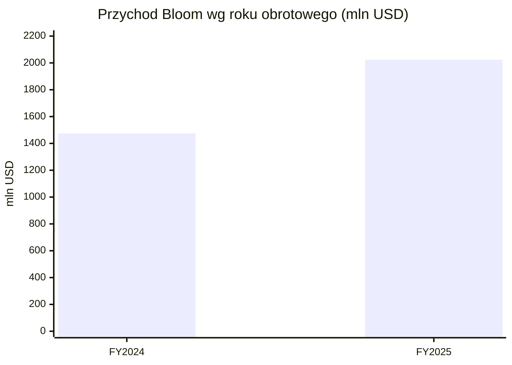
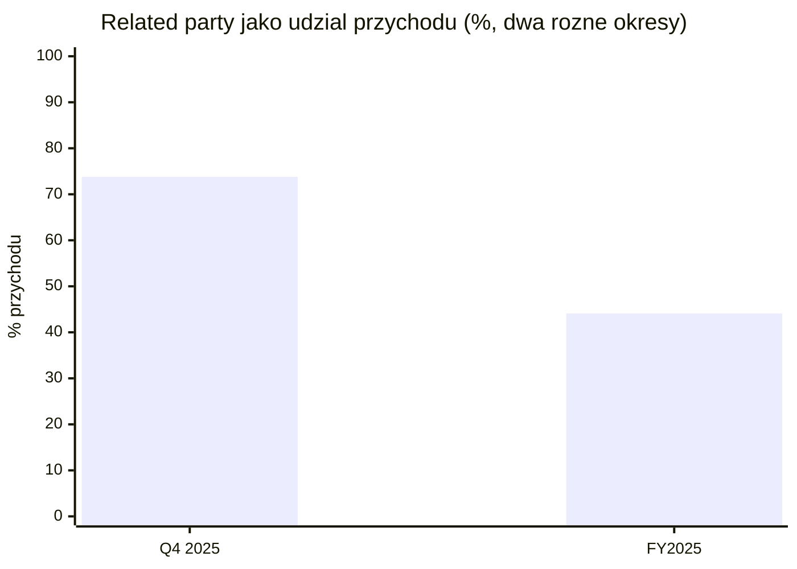
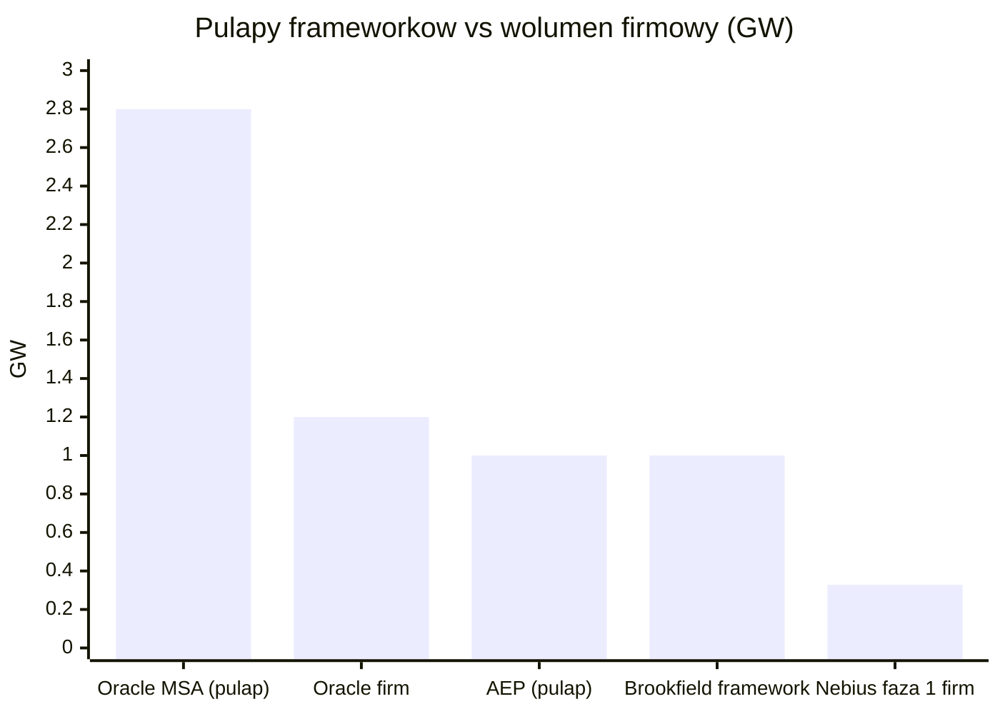
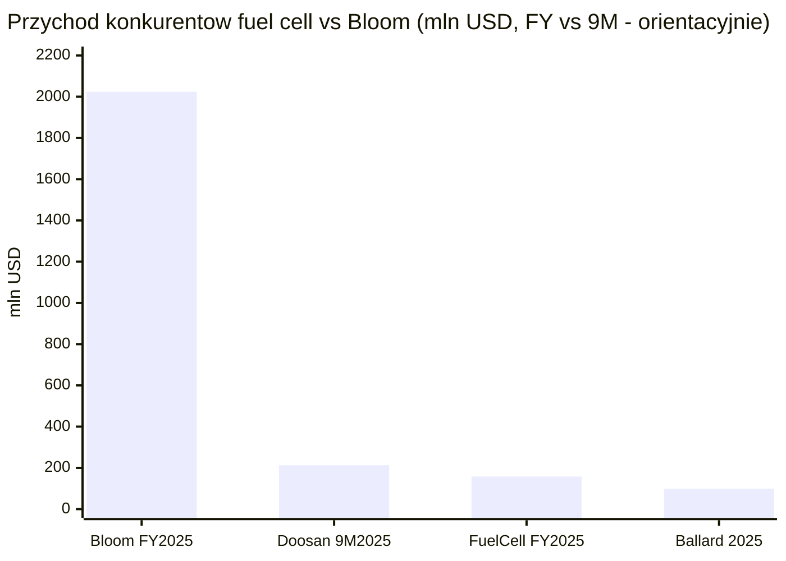
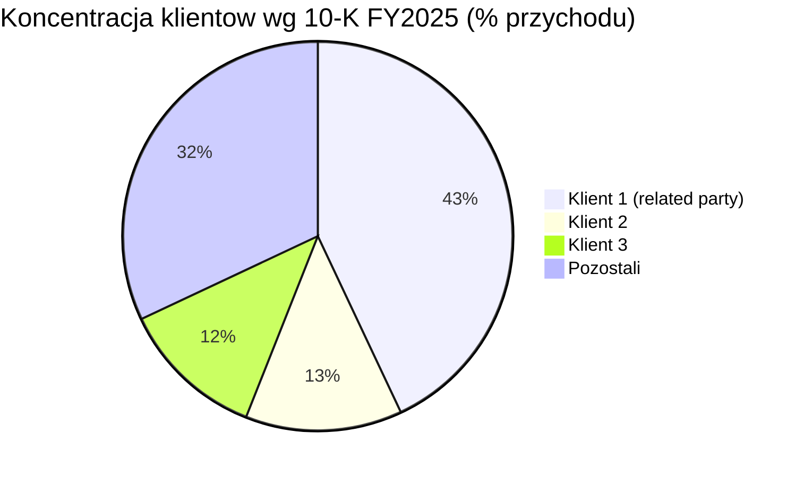

# Bloom Energy (BE)

<!-- spolki:temat:naziemny-bottleneck-energetyczny-i-sieciowy:start -->
## W kontekscie: Naziemny bottleneck energetyczny i sieciowy

**Czym jest spółka.** Bloom Energy projektuje i produkuje stacjonarne ogniwa paliwowe [[_slownik#SOFC|SOFC]] (Solid Oxide Fuel Cell - ogniwo paliwowe ze stałym, ceramicznym elektrolitem tlenkowym) pod marką Bloom Energy Server. Ogniwo to urządzenie, w którym paliwo (gaz ziemny, biogaz lub wodór) reaguje elektrochemicznie z tlenem i wytwarza prąd **bez spalania**, w wysokiej temperaturze (600-1000 stopni C). To daje wyższą sprawność i niższe emisje niż klasyczne generatory (strona produktowa Bloom Energy). Spółka wywodzi się z technologii rozwijanej pierwotnie dla NASA (konwersja CO2 na O2 na potrzeby misji marsjańskiej); założył ją KR Sridhar, a firma działa od 2001 r. (10-K FY2024, Impact Report 2025).

**Dlaczego to ważne dla centrów danych.** Sednem dzisiejszego wyścigu o moc dla AI nie jest najtańsza energia, lecz [[_slownik#time-to-power|time-to-power]] - czas od decyzji do realnego prądu. Nowe przyłącze do sieci w USA więźnie w wieloletnich kolejkach przyłączeniowych i wieloletnich dostawach transformatorów, co rozwija wątek [[12 - naziemny-bottleneck-energetyczny-i-sieciowy#Kolejki przyłączeniowe i ograniczenia sieci]] oraz [[12 - naziemny-bottleneck-energetyczny-i-sieciowy#Brak transformatorów i switchgear: lead times]]. Energy Server stawiany onsite (za licznikiem) pozwala ten korek obejść: Bloom deklaruje dla data center wdrożenie w **90 dni**, dostępność na poziomie **99,999%** (tzw. five nines, czyli ok. 5 minut przestoju rocznie; nie mylić z [[_slownik#baseload|baseloadem]], który oznacza moc ciągłą 24/7) i skalowalność rzędu 20-500 MW (strona Bloom dla data center). Dla [[_slownik#hyperscaler|hyperscaler]]ów i operatorów chmury GPU, którzy potrzebują mocy „teraz, a nie po wieloletnim oczekiwaniu", to bezpośrednia odpowiedź na bottleneck opisany w [[12 - naziemny-bottleneck-energetyczny-i-sieciowy#Zapotrzebowanie DC na moc i prognozy AI compute]].

**Gdzie Bloom plasuje się wśród źródeł baseload.** Energy Server konkuruje z gazowym [[_slownik#baseload|baseloadem]] i alternatywami opisanymi w [[12 - naziemny-bottleneck-energetyczny-i-sieciowy#Energia: baseload, powrót do gazu/jądra, SMR dla DC]]. Bloom podaje, że jego SOFC zużywają o **15-20% mniej paliwa** niż turbiny gazowe (Utility Dive, 30 paź 2025), a wobec fotowoltaiki z magazynem przewaga jest przestrzenna - według 10-K solar wymaga ok. **125x więcej miejsca** na tę samą moc, co czyni go nierealnym dla zagęszczonego kampusu DC (10-K FY2024).

> **Dla inwestora:** przewaga Bloom jest funkcją kryzysu sieciowego - im dłuższe kolejki przyłączeniowe i lead-time transformatorów, tym cenniejszy „szybki" megawat onsite. Popyt jest więc mniej wrażliwy na cenę energii, a bardziej na samą dostępność mocy w terminie.
<!-- spolki:temat:naziemny-bottleneck-energetyczny-i-sieciowy:end -->

<!-- spolki:grafiki:start -->
## Materiały spółki

> Grafiki z materiałów spółki / IR (prawa właściciela, użycie redakcyjne). Pełny rejestr: `Spolki/assets/_licencje.json`.

*Serwer energetyczny Bloom Energy Server ES5 - produktowe ujęcie urządzenia. Źródło: www.bloomenergy.com; licencja: materiały spółki / IR - prawa właściciela, użycie redakcyjne.*

*Instalacja Bloom Energy Server o mocy 10 MW w centrum danych Apple Maiden. Źródło: www.bloomenergy.com; licencja: materiały spółki / IR - prawa właściciela, użycie redakcyjne.*

*Instalacja Bloom Energy Server ES5 w obiekcie AT&T w San Jose. Źródło: www.bloomenergy.com; licencja: materiały spółki / IR - prawa właściciela, użycie redakcyjne.*

<!-- spolki:grafiki:end -->

<!-- spolki:ekspozycja:start -->
## Ekspozycja na temat w liczbach

**Skala i dynamika.** Przychód FY2025 (rok zakończony 31 grudnia 2025) wyniósł **2 024,0 mln USD, +37,3% r/r** (z 1 473,9 mln USD), co spółka określa jako rekord napędzany „znaczącym wzrostem z branży data center AI" (Q4/FY2025 earnings release, 5 lutego 2026). Sam Q4 2025 to **777,7 mln USD, +35,9% r/r** (vs 572,4 mln USD). Motorem jest linia produktowa (sprzedaż Energy Serverów): **product revenue 1 531,3 mln USD, +41,1% r/r** i **75,7% całego przychodu** FY2025 (Q4/FY2025 earnings release). Nowszy odczyt potwierdza przyspieszenie: Q1 2026 przyniósł **751,1 mln USD przychodu, +130,4% r/r** (w tym product revenue 653,3 mln USD, +208,4% r/r), a spółka podniosła guidance FY2026 do **3,4-3,8 mld USD** (z wcześniejszych 3,1-3,3 mld USD), przy non-GAAP gross margin ~34% i non-GAAP operating income 600-750 mln USD (Q1 2026 earnings release, 28 kwietnia 2026).

*Rys. - Trajektoria przychodu rocznego; FY2025 to +37,3% r/r. Dane: Bloom Q4/FY2025 earnings release.*

**Ile z tego to data centers? NIE UJAWNIONE wprost.** Bloom ma **jeden raportowany segment operacyjny** i dzieli przychód jedynie na cztery linie: Product, Installation, Service, Electricity - bez osobnej alokacji do data center (Q4/FY2025 earnings release). Dostępne proxy to przychód od podmiotów powiązanych ([[_slownik#related party|related party]]): **892,0 mln USD = 44,1% przychodu FY2025**, a w samym Q4 2025 aż **574,2 mln USD = 73,8% przychodu kwartalnego** (Q4/FY2025 earnings release); w Q1 2026 było to **373,3 mln USD = 49,7% przychodu** (Q1 2026 earnings release / 10-Q Q1 2026, 28 kwietnia 2026). Uwaga interpretacyjna: ta liczba nie jest tożsama z „przychodem z data center". Kluczowy niuans składu: **SK ecoplant przestał być podmiotem powiązanym 10 lipca 2025** (udział spadł do 5,8%, potem 2,9% na 30 września 2025 i 2,5% na 31 grudnia 2025), więc od H2 2025 pozycja related party niemal w całości pochodzi z Fund JVs z Brookfieldem (AI factories) - w Q3 2025 cały related party revenue **288,0 mln USD** (255,7 mln product + 32,3 mln installation) pochodził z Fund JVs z Brookfieldem (10-Q Q3 2025 Note 12; 10-K FY2025).

*Rys. - Udział podmiotów powiązanych w przychodzie w Q4 2025 i w całym FY2025 (dwa różne okresy, nie części jednej całości). Wzrost udziału related party pokazuje koncentrację przychodu, ale nie pozwala wydzielić części DC/AI (pozycja zawiera też koreańskiego partnera SK ecoplant). Dane: Bloom Q4/FY2025 earnings release.*

**Backlog.** [[_slownik#backlog|Backlog]] całkowity to ~**20 mld USD** (stan na 5 lutego 2026), w tym product backlog ~**6 mld USD** (5 lutego 2026) z dynamiką ~**2,5x r/r**; backlog serwisowy podawano na 9,6 mld USD (prezentacja luty 2025 - dane starsze, z innego okresu, więc nie uzgadniają się bezpośrednio z aktualnym total backlogiem; nowszej dezagregacji brak) (Q4/FY2025 earnings release; prezentacja inwestorska). Backlog to metryka zarządcza, szersza niż [[_slownik#RPO|RPO]]. Twarde RPO (niespełnione zobowiązania umowne) z 10-K FY2025 jest znacznie niższe: **394,4 mln USD** dla sprzedaży produktu i instalacji (rozpoznanie w ciągu **1-2 lat**, zgodnie z harmonogramami wdrożeń klientów) oraz **25,0 mln USD** dla umów serwisowych / deferred service (rozpoznanie w okresie pozostałego kontraktu, **1-26 lat**) (10-K FY2025, Note - Revenue Recognition, 31 grudnia 2025). Rozbieżność backlog (~20 mld USD) vs RPO (~419 mln USD) wynika z tego, że duża część zamówień ramowych nie spełnia jeszcze definicji wiążącego zobowiązania w rozumieniu rachunkowości przychodu; product backlog ~6 mld USD traktujemy więc jako wskaźnik potencjału, nie twardego zobowiązania.

> **Dla inwestora:** ekspozycja na temat jest realna, ale „ukryta" w jednej linii product revenue i w pozycji related party. Brak osobnego segmentu DC oznacza, że inwestor nie ma czystego licznika na to, jak duża część biznesu zależy od jednego, cyklicznego popytu (budowa AI data center).
<!-- spolki:ekspozycja:end -->

<!-- spolki:umowy:start -->
## Kluczowe umowy/wdrozenia - co znacza

Bloom buduje ekspozycję na DC przez kilka dużych ram kontraktowych. Kluczowa dystynkcja: [[_slownik#MSA|MSA]] (master service agreement) i [[_slownik#MOU|MOU]]/framework ustalają warunki i pułap, ale dopiero kolejne zamówienia są wiążącym wolumenem - „GW w nagłówku" to górny limit, nie gwarantowany odbiór.

- **Oracle (umowa pierwotnie lipiec 2025, rozszerzenie 13 kwietnia 2026):** master service agreement do **2,8 GW**, z czego **1,2 GW** „contracted and deploying" (zakontraktowane i w trakcie wdrażania), a pozostałe ~1,6 GW to intencja w ramach MSA; Bloom ma być primary oraz secondary power source dla AI data center Oracle, z targetem wdrożenia w 90 dni; wdrożenia trwają i są kontynuowane w 2027 (Bloom IR, 13 kwietnia 2026). W ramach tej współpracy Oracle ogłosił (kwiecień 2026) **Project Jupiter** - kampus AI o mocy **2,45 GW** zasilany „w 100% Bloom" (zastępujący turbiny i diesle); wartość kontraktu NIE UJAWNIONA (Motley Fool earnings transcript, 28 kwietnia 2026).
- **Brookfield Asset Management (13 października 2025):** strategiczne partnerstwo do **5 mld USD**; Bloom jako preferowany dostawca onsite power dla „AI factories" Brookfield (kwota i rola potwierdzone w komunikacie Bloom). Dane „framework do 1 GW" oraz „pierwszy projekt 55 MW przy ~140 mln USD" pochodzą ze źródła wtórnego i nie zostały potwierdzone w komunikacie IR, więc traktujemy je ostrożnie (Bloom IR; Dow Jones via Morningstar).
- **American Electric Power / AEP (listopad 2024):** umowa dostawcza do **1 GW**; pierwsze zamówienie **100 MW** dla AI data centers, z kolejnymi w 2025 (Bloom IR).
- **Equinix (20 lutego 2025):** rozszerzenie 10-letniej współpracy (start: 1 MW pilot w 2015) o ponad **100 MW** w **19 data center IBX** (~75 MW operacyjne, ~30 MW w budowie). Wartość NIE UJAWNIONA (Bloom IR).
- **Nebius (20 maja 2026):** Master Fuel Cell Capacity Agreement na **328 MW** mocy zainstalowanej (faza 1), struktura 3-fazowa po 10 lat każda; wartość **do 2,6 mld USD** opłat serwisowych wg dokumentu 6-K Nebius; pierwszy projekt operacyjny w 2026 (Nebius IR; Nebius 6-K). To nowy kontrakt po Q1 2026.
- **CoreWeave ([[_slownik#neo-cloud|neo-cloud]]):** wdrożenie ogniw Bloom w data center Volo (Illinois) do obsługi chmury AI (commissioning Q3 2025) (prasa branżowa).
- **Intel (maj 2024):** power capacity agreement dla HPC data center w Santa Clara, opisywany jako największy fuel-cell-powered HPC DC w Dolinie Krzemowej; dokładna moc NIE UJAWNIONA (Bloom IR).

Jako proxy łącznej skali DC część źródeł branżowych (BofA via TipRanks) podaje, że Bloom wdrożył ponad **400 MW** w samych data center do połowy 2025 r.; liczba ta nie jest potwierdzona w oryginalnym artykule DCD, więc traktujemy ją jako niezweryfikowany szacunek analityka (prasa/analitycy, niska pewność).

*Rys. - Pułapy MSA/framework (Oracle 2,8 GW, AEP 1 GW, Brookfield 1 GW) wobec części już firmowo zakontraktowanej (Oracle 1,2 GW, Nebius faza 1 0,328 GW); pułapy to górne limity, nie gwarantowany odbiór. Dane: Bloom IR (Oracle, AEP, Nebius), Dow Jones/Morningstar (Brookfield).*

> **Dla inwestora:** „2,8 GW Oracle" i „1 GW AEP" to różne kategorie pewności - twarde jest 1,2 GW Oracle plus startowe 100 MW AEP plus 328 MW Nebius (faza 1), reszta to opcje warunkowe. Materializacja tych pułapów decyduje o tym, czy ~6 mld USD product backlogu zamieni się w przychód. Wg zarządu więcej niż połowa obecnego backlogu DC przypisana jest klientom innym niż Oracle (hyperscalerzy, neo-cloudy, colocation) (Motley Fool earnings transcript, 28 kwietnia 2026).
<!-- spolki:umowy:end -->

<!-- spolki:pozycja:start -->
## Pozycja rynkowa i udzialy

Bloom określa się w 10-K FY2024 jako światowy lider stacjonarnych ogniw paliwowych wg udziału rynkowego, choć bez podania konkretnej liczby (10-K FY2024). Szacunki zewnętrzne wskazują na silną pozycję Bloom, ale udział mocno zależy od definicji rynku:

| Definicja rynku | Udział Bloom | Okres | Źródło |
|---|---|---|---|
| Prime power stationary fuel cells | ponad **18%** (z płatnego raportu, brak publicznego potwierdzenia - niska pewność) | 2025 | GM Insights |
| North American stationary SOFC shipments | ~**60%** | 2025 | Mordor Intelligence |
| Global fuel cell for data center market | **20-24%** | 2025 | Future Market Insights |
| Global SOFC market - top 3 producentów (Bloom w grupie liderów) | top 3 ~**87-88%** | 2024/2025 | QYResearch / Intel Market Research |

Twardym faktem zamiast szacunku jest zainstalowana baza: ponad **1,5 GW** Energy Serverów w ponad **1 200 lokalizacjach** (stan Q3/Q4 2025) - to namacalna miara skali wdrożeniowej i bariery doświadczenia (Q3 2025 earnings release / About Bloom). Liczba „9 krajów" pochodzi ze źródła wtórnego (nie z oficjalnych komunikatów Bloom), więc traktujemy ją ostrożnie (prasa branżowa).

Bariery wejścia są przede wszystkim własnościowo-technologiczne. Na 31 grudnia 2025 Bloom miał **380 aktywnych patentów utility US** oraz **183 wnioski US**, a także **252 aktywne patenty międzynarodowe** i **416 wniosków międzynarodowych** (10-K FY2025). Skumulowane wydatki R&D przekroczyły **1,2 mld USD**, w zespole R&D pracuje 59 doktorów, a globalne zatrudnienie to **2 214 FTE** na koniec FY2025 (1 752 USA, 395 Indie, 67 inne) (10-K FY2025; prezentacja luty 2026). Zdolność produkcyjna wynosi dziś ~**1 GW/rok** z planem wzrostu do **2 GW** do końca 2026 r. (inwestycja ~100 mln USD; fabryki skalowalne do 5 GW) (Utility Dive, 30 paź 2025; prezentacja luty 2026).

> **Dla inwestora:** dominacja Bloom jest jakościowo niekwestionowana (lider, ~60% północnoamerykańskich dostaw fuel cell do DC), ale rozstrzał szacunków (18% vs 20-24% vs 60%) pokazuje, że „udział rynkowy" zależy od tego, jak wąsko zdefiniujemy rynek - twardszą kotwicą jest baza ponad 1,5 GW i portfel patentowy.
<!-- spolki:pozycja:end -->

<!-- spolki:konkurencja:start -->
## Mechanika konkurencji - na osiach

Bloom konkuruje na dwóch frontach: z innymi ogniwami paliwowymi oraz z alternatywnymi źródłami mocy dla DC.

**Inne ogniwa paliwowe.** Najbliższy notowany rywal to **FuelCell Energy (FCEL)** - technologia MCFC (węglany stopione) z integracją wychwytu CO2, robiący pivot na data center. Skala jest jednak ułamkiem Bloom: przychód FY2025 **158,2 mln USD (+41% r/r)** wobec 2 024,0 mln USD Bloom oraz strata operacyjna (192,3) mln USD - spółka wciąż nierentowna; podawany backlog ~1,19 mld USD nie pojawia się w cytowanym źródle, więc wymaga osobnego potwierdzenia (prasa o wynikach FCEL). **Ballard Power (BLDP)**, technologia PEM, miał przychód ~**99,4 mln USD** (2025) i ~8-11% rynku DC fuel cell; PEM startuje szybko, ale ma niższą sprawność od SOFC i obciążenie kosztem platyny (GM Insights/FMI). **Doosan Fuel Cell / HyAxiom** (PAFC + SOFC) z przychodem 9M2025 ~**213 mln USD** dominuje w Korei/Japonii (~12-16% rynku DC fuel cell) (FMI/GM Insights). **Plug Power (PLUG)** ma ~15-18% rynku DC fuel cell, ale głównie w edge/telecom; PEM jest zwykle słabiej dopasowany do długotrwałego prime power baseload niż SOFC, m.in. ze względu na niższą sprawność i obciążenie kosztem platyny (FMI). **Ceres Power** i **Mitsubishi/Kyocera** to gracze niszowi/regionalni o mniejszej, niekwantyfikowanej tu bazie.

*Rys. - Skala przychodu Bloom wobec głównych rywali fuel cell; uwaga: Doosan to 9M2025, pozostali FY2025, więc okresy nie są w pełni porównywalne (porównanie orientacyjne). Dane: Bloom Q4/FY2025; GM Insights, FMI, prasa o wynikach FCEL.*

**Alternatywne źródła mocy.** Tu konkurencja toczy się na osiach time-to-power, emisji i kosztu:
- **Turbiny gazowe / silniki** (GE Vernova, Siemens Energy, Wärtsilä, Cummins) - niższy capex w części konfiguracji i szybki start, ale dłuższe pozwolenia, wyższe emisje NOx/SOx/CO2 i niższa sprawność niż SOFC (10-K FY2024). Bloom deklaruje zużycie paliwa o 15-20% niższe niż turbiny (Utility Dive). Twarde dane emisyjne z datasheetu Energy Server 6.5 (praca na gazie ziemnym): **CO2 679-833 lbs/MWh** (308-378 kg/MWh), **NOx 0,003 lbs/MWh**, **CO 0,013 lbs/MWh**, **VOC 0,01 lbs/MWh**, SOx pomijalne; sprawność elektryczna **53-65% (LHV net AC)**, brak zużycia wody w normalnej pracy, hałas <65 dBA z 3 m (Bloom Energy Server 6.5 datasheet, luty 2026). W komunikacie AEP Bloom podaje o **34% niższe CO2** niż wypierane krańcowe źródła generacji w PJM oraz praktyczną eliminację SOx i NOx (Bloom IR, 14 listopada 2024). Dla biogazu Bloom deklaruje carbon-neutral (directed biogas), a dla wodoru zero emisji bezpośrednich - dokładne współczynniki dla biogazu i wodoru pozostają NIE UJAWNIONE (Bloom podaje je na żądanie) (datasheet; technical note).
- **[[_slownik#BESS|BESS]]** (Tesla Megapack, Fluence, CATL) - tańszy backup i smoothing, błyskawiczne wdrożenie, ale typowo 4h zapasu, więc **komplement, nie substytut** dla mocy ciągłej 24/7 (capex 250-330 USD/kWh dla systemu 100 MWh / 4h) (prasa/analitycy).
- **[[_slownik#SMR|SMR]]** (NuScale, Oklo, Kairos) - zeroemisyjny baseload, ale pierwsze wdrożenia dopiero po 2030 i długa certyfikacja - rozwija to wątek [[12 - naziemny-bottleneck-energetyczny-i-sieciowy#Energia: baseload, powrót do gazu/jądra, SMR dla DC]].
- **Fotowoltaika + magazyn** - niski LCOE, ale intermitencja (brak 24/7) i wymóg ~125x większej powierzchni niż Bloom (10-K FY2024).

> **Dla inwestora:** Bloom ma deklarowaną przewagę time-to-power (90 dni) i niższe emisje vs wybrane generatory oraz niezależność od sieci, a nie najniższy koszt (przewaga kosztowa nie jest tezą notatki) - to atut, dopóki sieci są zatkane. Słabsze punkty to zależność od gazu ziemnego i wyższy upfront capex niż BESS w zastosowaniach wyłącznie backup. Główni rywale fuel cell są dziś o rząd wielkości mniejsi przychodowo.
<!-- spolki:konkurencja:end -->

<!-- spolki:przekroj:start -->
## Koncentracja odbiorcow i ryzyka z mechanizmem

**Koncentracja odbiorców jest ekstremalna i to główne ryzyko strukturalne.** Wg 10-K FY2025 trzech klientów (pierwszy to podmiot powiązany) odpowiadało za **43%, 13% i 12% przychodu (łącznie 68%)** - to wzrost wobec 23%, 16% i 14% (łącznie 53%) w FY2024 (10-K FY2025). W samym Q4 2025 [[_slownik#related party|related party]] revenue sięgnęło **73,8% przychodu** kwartalnego, a w Q1 2026 **49,7%** (Q4/FY2025 earnings release; Q1 2026 earnings release). Mechanizm: utrata lub opóźnienie jednego dużego kontraktu (Brookfield, Oracle, AEP) ma bezpośredni, materialny wpływ na przychód i backlog. Po tym, jak **SK ecoplant przestał być podmiotem powiązanym 10 lipca 2025** (udział spadł do 2,5% na 31 grudnia 2025), pozycja related party od H2 2025 niemal w całości przechodzi przez struktury finansujące Brookfielda (AI data centers) - ryzyko jest więc tyleż popytowe, co zależne od decyzji inwestycyjnych pojedynczych partnerów. Bloom raportuje też equity in loss of unconsolidated affiliates (Fund JVs) **40,4 mln USD za FY2025** i **17,0 mln USD w Q1 2026** (10-K FY2025; 10-Q Q1 2026).

*Rys. - Trzej najwięksi klienci = 68% przychodu (FY2025), wobec 53% w FY2024; w samym Q4 2025 pozycja related party to 73,8%. Dane: Bloom 10-K FY2025 / Q4/FY2025 earnings release.*

Pozostałe ryzyka z mechanizmem:

- **Single-source / limited-source suppliers.** 10-K wskazuje „sole or limited source suppliers" dla kluczowych komponentów SOFC (m.in. separator plates); problem dostawcy może wstrzymać produkcję i uderzyć w time-to-market oraz marże. Wtórne źródła chińskie wskazują CCTC jako kluczowego dostawcę separator plates - traktowane jako proxy, nie potwierdzenie (10-K FY2024; Xueqiu).
- **Execution risk / skalowanie produkcji.** Podwojenie mocy z 1 GW do 2 GW do końca 2026 wymaga ~100 mln USD+ capex; opóźnienie oznacza utratę zamówień AI DC (Utility Dive, 30 paź 2025).
- **Długi cykl sprzedaży i instalacji.** 10-K mówi o „lengthy sales and installation cycle" i anulacjach rzędu **5-10%** backlogu w danym okresie - co bezpośrednio przesuwa timing przychodu i cash flow (10-K FY2024). Czynnikiem łagodzącym jest serwis: zarząd podaje **100% service attach rate** (każda sprzedaż produktu wiąże się z umową serwisową), a średni czas trwania umów DC to **10-15 lat** - to powtarzalny strumień przychodu, choć z rocznym prawem rozwiązania przez klienta (Motley Fool earnings transcript, 28 kwietnia 2026; 10-K FY2025).
- **Regulacje / podatki / cła.** Zmiany w ITC (Investment Tax Credit, federalna ulga inwestycyjna USA), IRA, OBBBA (nowy 30% ITC dla fuel cell property, lipiec 2025), cła na komponenty i regulacje w Korei mogą zmienić ekonomikę projektów i marże (10-K FY2024; earnings releases).
- **Rozwodnienie / zadłużenie.** Convertible senior notes na **2,5 mld USD** (październik 2025), [[_slownik#warrant|warrant]] dla Oracle na **3,53 mln akcji po 113,28 USD** (~400 mln USD), SBC 139,4 mln USD w FY2025 i recourse debt **2,61 mld USD** zwiększają potencjalną liczbę akcji i koszt obsługi długu (Q4/FY2025 earnings release; prasa).
- **Cykl AI.** Bloom jawnie wymienia ryzyko „any actual or perceived slowdown in the adoption of AI" prowadzące do wolniejszej ekspansji DC i spadku popytu na onsite power (Q4/FY2025 earnings release).
- **Gaz ziemny vs cele ESG.** Energy Servery działają głównie na gazie; krytyka śladu węglowego doprowadziła do zerwania kontraktu z Amazonem na 3 data center w Oregonie w 2024 r. - „hydrogen-ready" pozostaje deklaracją techniczną (prasa branżowa).

Strukturalnie Bloom pozostaje nierentowny na poziomie GAAP: **strata netto przypisana akcjonariuszom FY2025 to (88,4) mln USD** (vs (29,2) mln USD w FY2024), przy skumulowanym deficycie **(3 987,0) mln USD** - choć adjusted EBITDA (skorygowany wynik EBITDA, czyli zysk przed odsetkami, podatkami i amortyzacją; metryka [[_slownik#GAAP|non-GAAP]]) urosło do 271,6 mln USD, a przepływy operacyjne były dodatnie drugi rok z rzędu (113,9 mln USD) (Q4/FY2025 earnings release).

> **Dla inwestora:** prawie 3/4 przychodu Q4 2025 przeszło przez podmioty powiązane (73,8% to agregat related party, bez publicznego rozbicia na Brookfield/SK ecoplant/JV) - to koncentracja, która czyni przychód wrażliwym na decyzje kilku partnerów. Cała teza „szybkiego megawata" działa, dopóki kolejki sieciowe są długie; gdy turbiny/silniki wrócą do krótszych terminów, główna przewaga czasowa Bloom słabnie.
<!-- spolki:przekroj:end -->

<!-- network:peers:start -->
## Powiązane spółki

> Inne notowane spółki z raportu dzielące z tą firmą co najmniej jeden wątek tematyczny (wspólny rynek, technologia lub łańcuch wartości).

- [[Spolki/constellation-energy|Constellation Energy Corporation (CEG)]] - Największy operator floty jądrowej w USA (PPA z hyperskalerami)  
  *Wspólne wątki: Naziemny bottleneck.*
- [[Spolki/eaton|Eaton Corporation plc (ETN)]] - Zasilanie DC (UPS, switchgear) + chłodzenie (Boyd Thermal)  
  *Wspólne wątki: Naziemny bottleneck.*
- [[Spolki/ge-vernova|GE Vernova Inc. (GEV)]] - Turbiny gazowe i infrastruktura sieciowa dla DC  
  *Wspólne wątki: Naziemny bottleneck.*
- [[Spolki/oklo|Oklo Inc. (OKLO)]] - Mikroreaktory (SMR/fission) na potrzeby DC  
  *Wspólne wątki: Naziemny bottleneck.*
- [[Spolki/schneider-electric|Schneider Electric SE (SU)]] - Zasilanie i chłodzenie DC (EcoStruxure, Motivair)  
  *Wspólne wątki: Naziemny bottleneck.*
- [[Spolki/siemens-energy|Siemens Energy AG (ENR)]] - Turbiny gazowe i technologie sieciowe (EU)  
  *Wspólne wątki: Naziemny bottleneck.*
- [[Spolki/talen-energy|Talen Energy Corporation (TLN)]] - Energia jądrowa (Susquehanna), sąsiedztwo z DC  
  *Wspólne wątki: Naziemny bottleneck.*
- [[Spolki/vertiv|Vertiv Holdings Co (VRT)]] - Zasilanie i precyzyjne/cieczowe chłodzenie DC  
  *Wspólne wątki: Naziemny bottleneck.*
<!-- network:peers:end -->

<!-- spolki:slownik:start -->
## Slowniczek

Terminy techniczne linkowane są do wspólnego pliku [[_slownik]] (m.in. [[_slownik#SOFC|SOFC]], [[_slownik#baseload|baseload]], [[_slownik#time-to-power|time-to-power]], [[_slownik#backlog|backlog]], [[_slownik#RPO|RPO]], [[_slownik#related party|related party]], [[_slownik#PPA|PPA]], [[_slownik#MSA|MSA]], [[_slownik#MOU|MOU]], [[_slownik#hyperscaler|hyperscaler]], [[_slownik#neo-cloud|neo-cloud]], [[_slownik#BESS|BESS]], [[_slownik#SMR|SMR]], [[_slownik#warrant|warrant]], [[_slownik#GAAP|GAAP / non-GAAP]]). Poniżej lokalne, spółkowo-specyficzne pojęcia:

- **Bloom Energy Server / Bloom Box** - modułowa platforma SOFC o mocy od setek kW do setek MW (wersja ES-5000: typowo 100 kW - 1 MW+); produkty od 2025 gotowe do pracy z 800 V DC.
- **Hot box** - hermetyczna, gorąca komora ze stosem ogniw, serce Energy Servera.
- **Related party revenue** - przychód od podmiotów powiązanych (Brookfield, SK ecoplant, JV); raportowany osobno.
- **ITC / IRA / OBBBA** - federalna ulga inwestycyjna USA / ustawa klimatyczna 2022 (rozszerzyła ITC dla fuel cells) / ustawa lipiec 2025 z nowym 30% ITC dla fuel cell property.
- **Five nines (99,999%)** - dostępność zasilania na poziomie ok. 5 minut przestoju rocznie.
- **800 V DC ready** - system gotowy do bezpośredniego zasilania DC prądem stałym 800 V, omijając straty konwersji AC/DC.
<!-- spolki:slownik:end -->

<!-- spolki:zrodla:start -->

<!-- spolki:zrodla:end -->
