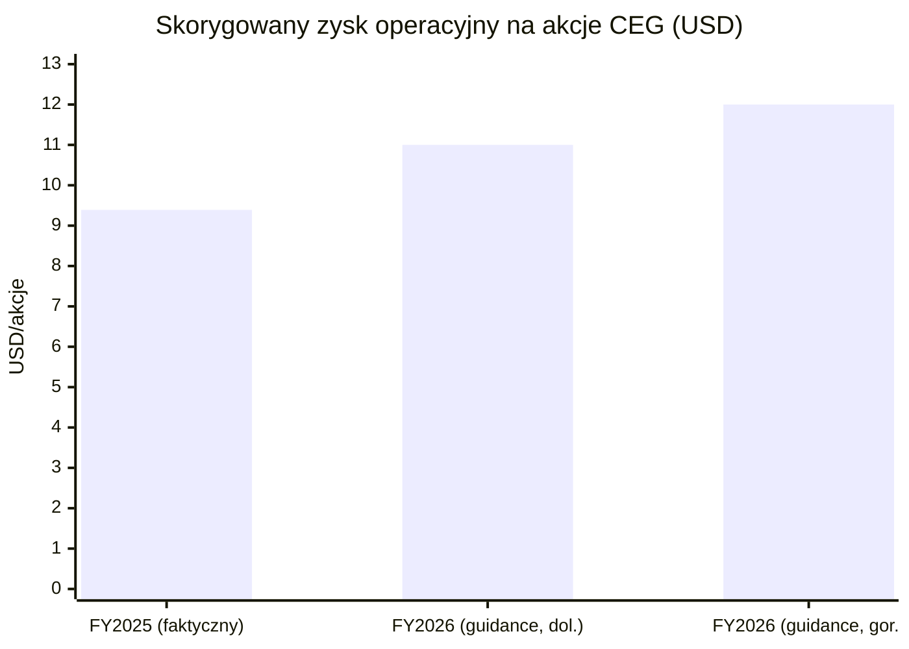
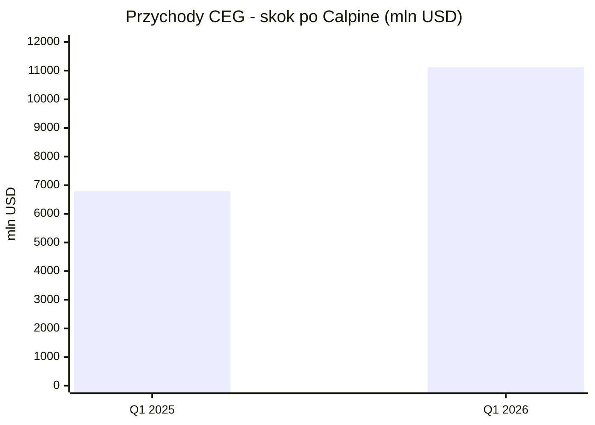
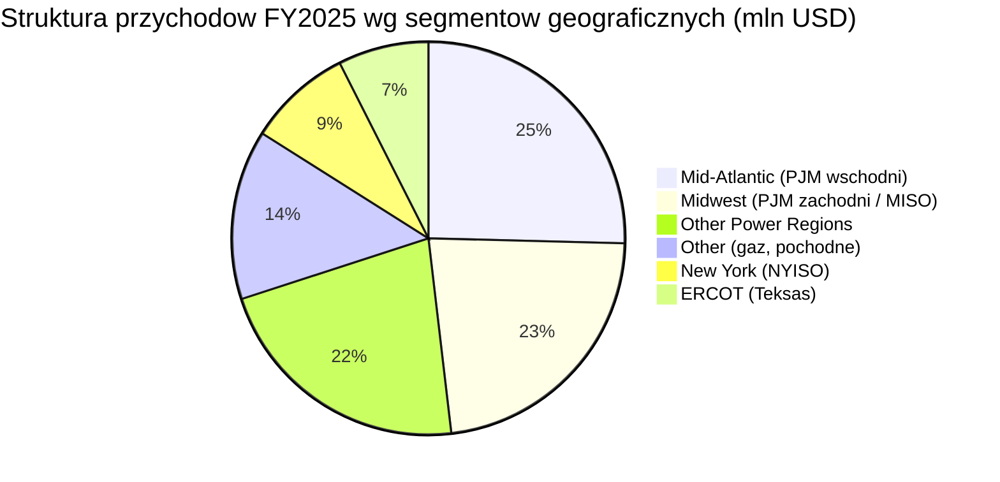
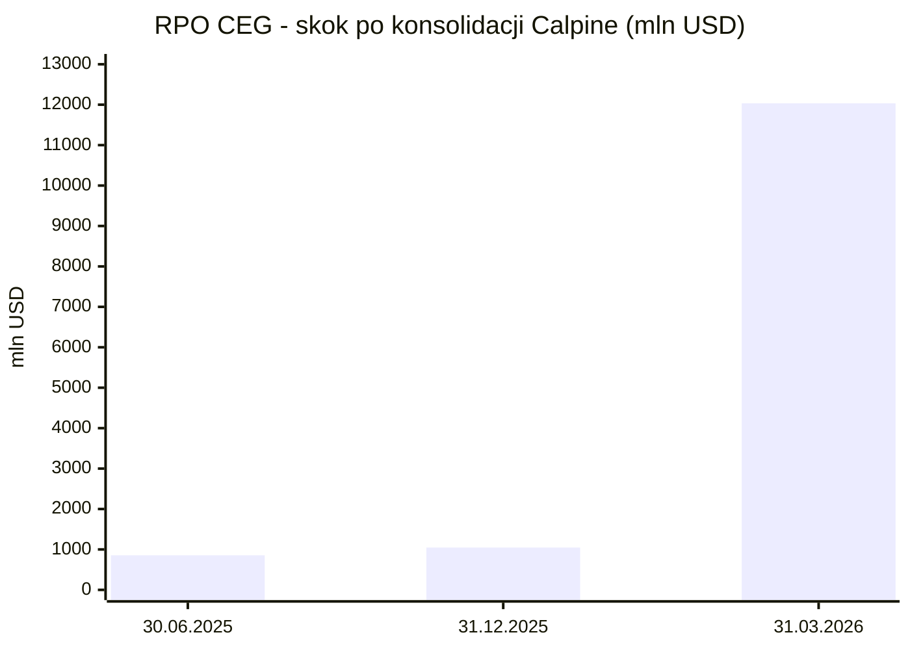
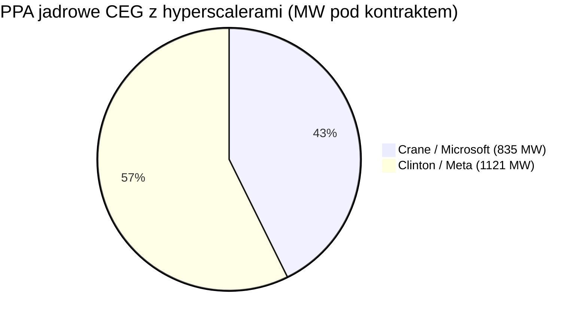
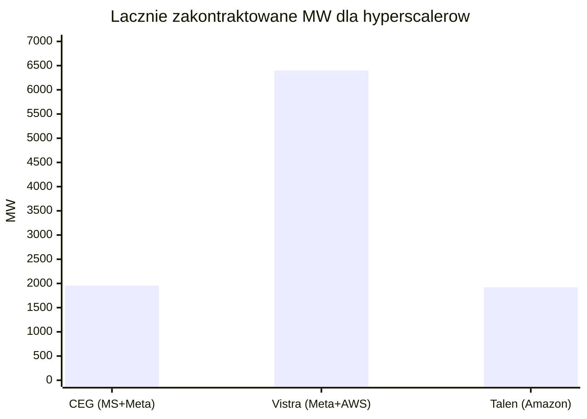

# Constellation Energy (CEG)

<!-- spolki:temat:naziemny-bottleneck-energetyczny-i-sieciowy:start -->
## W kontekscie: Naziemny bottleneck energetyczny i sieciowy

**Czym jest spółka.** Constellation Energy (NASDAQ: CEG) to z siedzibą w Baltimore producent energii elektrycznej, który po zamknięciu przejęcia Calpine 7 stycznia 2026 r. określa się jako największy prywatny producent energii na świecie i największy producent czystej energii w USA (🔵 CEG IR, 7.01.2026). Po Calpine flota liczy ok. 55 GW mocy zainstalowanej - jądrowej, gazowej, geotermalnej, wodnej, wiatrowej i solarnej (🔵 CEG IR, 2026), a sama część jądrowa to ok. 22 GW przed Calpine (🔵 CEG IR, 2026). To czyni CEG zupełnie innym graczem niż dostawcy sprzętu w temacie naziemnego bottlenecku: CEG nie produkuje ani chłodzenia, ani turbin - jest właścicielem i operatorem [[_slownik#baseload|baseload]], który ten prąd dostarcza.

**Dlaczego to ważne dla centrów danych.** Wąskim gardłem budowy mocy obliczeniowej AI nie jest dziś sam serwer, lecz dostęp do energii i do sieci - to rozwija wątek [[12 - naziemny-bottleneck-energetyczny-i-sieciowy#Zapotrzebowanie DC na moc i prognozy AI compute]]. Nowe przyłącze do sieci w USA wikła się w wieloletnie [[12 - naziemny-bottleneck-energetyczny-i-sieciowy#Kolejki przyłączeniowe i ograniczenia sieci]], a [[_slownik#hyperscaler|hyperscalery]] szukają stabilnego, bezemisyjnego źródła, które już stoi i pracuje. CEG sprzedaje dokładnie to: istniejącą flotę jądrową pracującą jako [[_slownik#baseload|baseload]] (z wysokim capacity factor) i [[_slownik#capex|capex]] już dawno poniesionym, z 20-letnimi [[_slownik#PPA|PPA]] na wybranych aktywach (Crane i Clinton). To wpisuje się w szerszy zwrot opisany w [[12 - naziemny-bottleneck-energetyczny-i-sieciowy#Energia: baseload, powrót do gazu/jądra, SMR dla DC]].

**Na czym polega mechanizm.** CEG monetyzuje trzy aktywa naraz: (1) restart i przedłużenie eksploatacji reaktorów jądrowych pod kontrakt z hyperscalerem, (2) gazowe aktywa Calpine na rynkach typu ERCOT, oferowane jako "powered land" obok działki centrum danych, oraz (3) platformę handlowo-detaliczną obsługującą rocznie ok. 275 mln MWh energii dla klientów w 40 stanach, przy czym z usług CEG korzysta ponad 80% firm z listy Fortune 100 (to udział firm, nie udział w sprzedaży) (🔵 CEG IR, 2026). Flota jądrowa pracowała w FY2025 ze współczynnikiem wykorzystania 94,7% (🔵 CEG, FY2025) - to świadczy o tym, że moc jest realnie dostępna, a nie tylko na papierze.

> **Dla inwestora:** przewaga CEG to nie szybkość budowy (jak u dostawców ogniw czy turbin), lecz fakt, że bezemisyjna moc baseload już istnieje i jest zakontraktowana na dwie dekady. Wartość rośnie wraz z długością kolejek przyłączeniowych i presją klimatyczną hyperscalerów - ale jest też zakładnikiem ryzyka regulacyjnego ko-lokacji i ryzyka wykonawczego restartu.
<!-- spolki:temat:naziemny-bottleneck-energetyczny-i-sieciowy:end -->

<!-- spolki:grafiki:start -->
## Materiały spółki

> Grafiki z materiałów spółki / IR (prawa właściciela, użycie redakcyjne). Pełny rejestr: `Spolki/assets/_licencje.json`.

*Wydarzenie prasowe w Crane Clean Energy Center (Three Mile Island) z udziałem sekretarza energii USA. Źródło: www.constellationenergy.com; licencja: materiały spółki / IR - prawa właściciela, użycie redakcyjne.*

*Crane Clean Energy Center - elektrownia jądrowa w trakcie restartu. Źródło: www.constellationenergy.com; licencja: materiały spółki / IR - prawa właściciela, użycie redakcyjne.*

*Calvert Cliffs Clean Energy Center - elektrownia jądrowa w Maryland. Źródło: www.constellationenergy.com; licencja: materiały spółki / IR - prawa właściciela, użycie redakcyjne.*

<!-- spolki:grafiki:end -->

<!-- spolki:ekspozycja:start -->
## Ekspozycja na temat w liczbach

**Skala i dynamika.** Przychody ze sprzedaży FY2025 (12 miesięcy do 31.12.2025, sprzed Calpine) wyniosły 25 533 mln USD (+8,3% r/r), przy zysku netto przypadającym akcjonariuszom 2 319 mln USD (-38,1% r/r, GAAP - obciążony niekorzystnym wynikiem portfela PTC i wycenami) oraz skorygowanym (non-GAAP) zysku operacyjnym na akcję 9,39 USD (+8,3% r/r); GAAP EPS (podstawowy i rozwodniony) za FY2025 wyniósł 7,40 USD (🔵 CEG, 10-K, 31.12.2025). Po włączeniu Calpine Q1 2026 (do 31.03.2026) pokazuje skokowy efekt skali: przychody 11 122 mln USD (+63,8% r/r), zysk netto 1 590 mln USD, GAAP EPS 4,49 USD (wzrost z 0,38 USD w Q1 2025), skorygowany zysk operacyjny na akcję 2,74 USD (+28,0% r/r vs 2,14 USD) (🔵 CEG, 10-Q, 31.03.2026). Aktywa ogółem urosły do 96 911 mln USD (+69,2% vs 57 249 mln USD na 31.12.2025), kapitał własny do 33 483 mln USD (+130,6% vs 14 517 mln USD), a dług długoterminowy (część długoterminowa) do 16 994 mln USD (+134,5% vs 7 250 mln USD) - głównie z przejęcia i długu Calpine (🔵 CEG, 10-Q, 31.03.2026). Skalę samego przejęcia obrazuje wartość firmy (goodwill), która wzrosła z 420 mln USD do 11 527 mln USD na 31.03.2026 r. - tj. o ok. 11,1 mld USD przypisane konsolidacji Calpine (🔵 CEG, 10-Q, 31.03.2026). Łączny dług długoterminowy na 31.03.2026 rozkładał się na ok. 12,4 mld USD w Constellation Energy Generation i ok. 5,0 mld USD w Calpine; krótkoterminowe zadłużenie sięgało ok. 5,1 mld USD (🔵 CEG, 10-Q, 31.03.2026). Sam Calpine w 2025 r. (standalone) wniósł przychody ok. 14,3 mld USD, zysk netto ok. 1 973 mln USD, aktywa ok. 20,3 mld USD i dług ok. 12,5 mld USD - co tłumaczy skokowy efekt konsolidacji (🔵 CEG, 8-K/A, 2026).

**Guidance i cel wzrostu.** Na konferencji wynikowej 11.05.2026 r. spółka potwierdziła prognozę skorygowanego zysku operacyjnego na akcję FY2026 w przedziale 11,00-12,00 USD (na bazie ok. 361 mln średnio rozwodnionych akcji) oraz cel wzrostu bazowego EPS o ponad 20% w okresie 2026-2029 (🔵 CEG, Q1 2026, 11.05.2026). Zarząd wskazał prognozę wolnych przepływów pieniężnych ok. 8,4 mld USD łącznie za lata 2026-2027 oraz 11,5-13,0 mld USD za 2028-2029, a także ok. 195 mln MWh bezemisyjnej generacji baseload oczekiwane w 2029 r. (🔵 CEG, Q1 2026, 11.05.2026). Własnej, zagregowanej prognozy Adjusted EBITDA dla całej grupy spółka nie publikuje (NIE UJAWNIONE); konsensus analityków szacował Adjusted EBITDA Q1 2026 na ok. 2,0 mld USD (🟠 konsensus/TIKR, 2026). W Q1 2026 flota jądrowa wyprodukowała ok. 40 mln MWh przy capacity factor 92,3%, a bloki gazowe (CCGT/kogeneracja) ok. 23 mln MWh przy 47,1%; w ciągu kwartału CEG odkupiła ok. 1,2 mln akcji za ok. 335 mln USD (🔵 CEG, Q1 2026, 11.05.2026).

*Rys. - FY2025 faktyczny 9,39 USD vs potwierdzony przedział guidance FY2026 11,00-12,00 USD (cel wzrostu bazowego EPS >20% 2026-2029). Dane: 🔵 CEG, FY2025 / Q1 2026 (11.05.2026).*

*Rys. - Przychody kwartalne; Q1 2026 obejmuje już Calpine (11 122 mln USD, +63,8% r/r vs 6 788 mln USD w Q1 2025). Dane: 🔵 CEG, Q1 2026.*

**Ile z tego to centra danych? NIE UJAWNIONE.** CEG raportuje pięć segmentów geograficznych plus kategorię Other, a nie dedykowany segment "data center". W FY2025 przychody rozkładały się: Mid-Atlantic 6 487 mln USD (~25,4%), Midwest 5 804 mln USD (~22,7%), Other Power Regions 5 583 mln USD (~21,9%), New York 2 190 mln USD (~8,6%), ERCOT 1 904 mln USD (~7,5%), Other 3 565 mln USD (~14,0%) (🔵 CEG, FY2025). Przychody związane z centrami danych są rozproszone między te segmenty (sprzedaż hurtowa z PPA, usługi detaliczne, "powered land", gaz) i spółka ich nie wyodrębnia.

*Rys. - Segmenty są geograficzne, nie produktowe; brak osobnej linii "centra danych". Dane: 🔵 CEG, FY2025.*

**Proxy ekspozycji.** Twardych wolumenów kontraktowych jest jednak sporo: PPA z Microsoft i Meta (Crane + Clinton) to ~1 956 MW, umowy "powered land" z CyrusOne (Freestone + Thad Hill) ~780 MW podpisanych plus 380 MW ekskluzywnie, a w kolejce PJM CEG zgłosiła ok. 5 000 MW nowych zasobów (uprate jądrowe, nowe bloki gazowe, magazyny) (🔵 CEG, Q1 2026). [[_slownik#RPO|RPO]] przed Calpine było tu mało użyteczne: większość umów ma zmienne wolumeny i ceny i nie wchodziła do RPO. Wg 10-Q na 30 czerwca 2025 r. RPO wynosiło zaledwie 855 mln USD, a na koniec roku (31.12.2025, jeszcze sprzed zamknięcia Calpine) 1 047 mln USD (🔵 CEG, 10-K, 31.12.2025). **Po włączeniu Calpine RPO skokowo wzrosło do 12 034 mln USD na 31 marca 2026 r.** (🔵 CEG, 10-Q, 31.03.2026) - czyli ponad czternastokrotnie vs odczyt z połowy 2025 r. Skok pokazuje, że portfel Calpine wniósł istotną pulę zakontraktowanych, wyegzekwowalnych zobowiązań (m.in. wieloletnie umowy tollingowe i gazowe), których wcześniej w RPO CEG nie było. Rozbicie 12 034 mln USD na lata pozostaje w przypisach dimensionalnych 10-Q (szczegółowy harmonogram per rok: NIE UJAWNIONE w danych zbiorczych).

*Rys. - Remaining Performance Obligations: dwa pierwsze odczyty sprzed Calpine, ostatni (12 034 mln USD) już po konsolidacji. Dane: 🔵 CEG, 10-Q/10-K (30.06.2025, 31.12.2025, 31.03.2026).*

> **Dla inwestora:** ekspozycja CEG na centra danych jest realna i rosnąca, ale nierozpoznawalna procentowo - spółka nie podaje udziału. Skok RPO z ~855 mln USD (06.2025) do 12,0 mld USD (03.2026) odzwierciedla głównie konsolidację Calpine, a nie samych umów DC; niskie RPO sprzed przejęcia wynikało z formuły kontraktów (zmienne ceny/wolumeny), nie z braku popytu. Wszelkie procenty z mediów to szacunki analityków, nie dane sprawozdawcze.
<!-- spolki:ekspozycja:end -->

<!-- spolki:umowy:start -->
## Kluczowe umowy/wdrozenia - co znacza

Filarem ekspozycji są dwa restarty/przedłużenia jądrowe pod [[_slownik#PPA|PPA]] z [[_slownik#hyperscaler|hyperscalerami]], uzupełnione gazowymi aktywami "powered land" z Calpine.

- **Crane Clean Energy Center** (dawny Three Mile Island Unit 1, Pensylwania): ok. 835 MW (🔵 CEG, 2024). 20-letni PPA z Microsoft na całą produkcję, podpisany we wrześniu 2024 r. (🔵 CEG, 09.2024). Nakłady ok. 1,6 mld USD; pierwotny termin uruchomienia 2028 r., przyspieszony do 2027 r. - zarząd na call Q1 2026 (11.05.2026) podtrzymał plan startu reaktora w 2027 r. (🔵 CEG, Q1 2026). Finansowanie wspiera pożyczka do 1,0 mld USD zamknięta przez DOE/LPO w listopadzie 2025 r. (Energy Dominance Financing Program); szczegółowe warunki spłaty pozostają w dokumentacji DOE i nie są potwierdzone w komunikacie CEG (🔵 CEG/DOE, 11.2025). Kluczowy krok przyłączeniowy został domknięty: do 5.06.2026 r. FERC zatwierdziła wniosek CEG o wycofanie bloków Eddystone ze statusu Capacity Resource i transfer ich praw przyłączeniowych (Capacity Interconnection Rights) do Crane - co ogranicza ryzyko, że pełna moc trafi do sieci dopiero po 2031 r. (🟠 ANS/Nuclear Newswire, 06.2026). Pozostałe warunki: zgoda NRC, przegląd bezpieczeństwa i środowiskowy (NRC uznała, że pełny EIS nie jest wymagany), pozwolenia stanowe.
- **Clinton Clean Energy Center** (Illinois): ok. 1 121 MW plus uprate +30 MW (🔵 CEG, 2025). 20-letni PPA z Meta na całą produkcję, dostawy od czerwca 2027 r. (🔵 CEG, 2025). Zastępuje wygasający w 2027 r. stanowy program ZEC i przedłuża eksploatację do 2047 r. W grudniu 2025 r. NRC zatwierdziła 20-letnie przedłużenie licencji dla Clinton (do 2047) oraz dla Dresden (bloki do 2049/2051); związane z tym inwestycje w relicensing i modernizacje to ponad 370 mln USD (🔵 CEG/NRC, 12.2025).
- **Freestone Energy Center** (Teksas, z Calpine): umowa na 380 MW z CyrusOne na nowe centrum danych plus ekskluzywna umowa na fazę 2 (kolejne 380 MW); PUCT zatwierdziła net metering, podstacja ma zostać zasilona w Q4 2026 (🔵 CEG, Q1 2026).
- **Thad Hill Energy Center** (Teksas, z Calpine): wcześniejsze umowy Calpine/CyrusOne na 400 MW (🔵 CEG, 2026). Łącznie w Teksasie podpisano "powered land" na 780 MW z opcją kolejnych 380 MW.

Wspólny mianownik PPA z Microsoft i Meta to model "front-of-the-meter" - energia trafia do sieci, a hyperscaler kupuje ją w modelu detalicznym. To redukuje ryzyko regulacyjne związane z bezpośrednią ko-lokacją, ale nie eliminuje go (zob. sekcję ryzyk i [[12 - naziemny-bottleneck-energetyczny-i-sieciowy#Energia: baseload, powrót do gazu/jądra, SMR dla DC]]).

> **Dla inwestora:** 20-letnie PPA zamieniają zmienne ceny hurtowe na widoczny, długoterminowy strumień, który zarazem finansuje restart aktywów - to zmienia profil aktywa jądrowego z cyklicznego na quasi-kontraktowy. Twardość zależy jednak od wykonania restartu w terminie i utrzymania ram regulacyjnych.
<!-- spolki:umowy:end -->

<!-- spolki:pozycja:start -->
## Pozycja rynkowa i udzialy

CEG jest największą amerykańską flotą jądrową: ok. 22 GW mocy jądrowej przed Calpine, z produkcją w ok. 90% bezemisyjną (🔵 CEG, 2026). Połączona flota po Calpine dostarcza ok. 10% czystej energii w USA i ma moc wystarczającą do zasilenia równoważnego 27 mln gospodarstw domowych (te dane odnoszą się do całej floty ~55 GW, nie samej części jądrowej) (🔵 CEG, 2026). Po Calpine łączna moc to ok. 55 GW w portfelu jądrowo-gazowo-geotermalno-OZE (z czego ok. 26 GW gazu wniosła Calpine, obok flagowego kompleksu geotermalnego The Geysers w Kalifornii), a baza klientów detalicznych/biznesowych to ok. 2,5 mln kont - co czyni CEG największym konkurencyjnym sprzedawcą detalicznym energii w USA (🔵 CEG, 2026). Po stronie sprzedaży gazu platforma obsługuje ok. 800 Bcf gazu ziemnego rocznie obok ok. 275 mln MWh energii elektrycznej (🔵 CEG, Q1 2026).

**Dywestycje regulacyjne (LS Power i DOJ).** Warunkiem zgody FERC/DOJ na przejęcie Calpine były wymuszone dywestycje. W marcu 2026 r. CEG ogłosiła sprzedaż ok. 4,4 GW mocy gazowej w PJM (zakłady Bethlehem, York 1, York 2, Hay Road, Edge Moor w Delaware i Pensylwanii) na rzecz LS Power za ok. 5,0 mld USD (ok. 1 142 USD/kW przed korektami), z zamknięciem planowanym na 2026 r. (🟠 prasa branżowa / CEG, 03.2026). To największa pojedyncza transza pakietu uzgodnionego z DOJ; wcześniej w 2026 r. CEG zbyła mniejszościowy udział w 385 MW Gregory CCGT (Teksas), a pozostającym do zbycia aktywem był 606 MW Jack Fusco Energy Center (Teksas) (🟠 prasa branżowa, 2026). Po tych dywestycjach łączna moc floty obniża się z ok. 55 GW do ok. 50-51 GW (🟠 prasa branżowa, 2026; 🔵 CEG, 2026).

*Rys. - Dwa reaktory pod 20-letnimi PPA, razem ~1 956 MW (bez uprate Clinton +30 MW). Dane: 🔵 CEG, 2024-2026.*

Pozycję wzmacniają trzy czynniki strukturalne. Po pierwsze, dywersyfikacja geograficzna i paliwowa: obecność w PJM, ERCOT, NYISO, MISO i CAISO, z silną ekspozycją na Teksas i Kalifornię po Calpine - czyli rynki, gdzie powstają największe ośrodki budowy centrów danych (🔵 CEG, 2026). Po drugie, Nuclear Production Tax Credit (PTC) z Inflation Reduction Act: dla istniejącej energii jądrowej obowiązuje sektorowy PTC (sekcja 45U), a dla nowej bezemisyjnej generacji - technologicznie neutralny PTC 45Y; kredyty są indeksowane inflacyjnie i wzmacniają marże jądrowe (🔵 CEG, FY2025). Po trzecie, świeże aktywa: Pastoria Solar (Kalifornia, 105 MW solar + 80 MW / 320 MWh bateria, 15-letnia umowa z PG&E, uruchomiony w kwietniu 2026 r.) i Pin Oak Creek (Teksas, 460 MW nowoczesna gazowa elektrownia szczytowa w ERCOT, ruch komercyjny od kwietnia 2026 r.) (🔵 CEG, Q1 2026).

> **Dla inwestora:** pozycja CEG opiera się na barierze, której konkurenci nie odtworzą szybko - istniejąca, licencjonowana flota jądrowa o skali 22 GW. Nowy reaktor to dekada i miliardy [[_slownik#capex|capex]]; CEG sprzedaje moc, która już jest i ma capacity factor 94,7%.
<!-- spolki:pozycja:end -->

<!-- spolki:konkurencja:start -->
## Mechanika konkurencji - na osiach

CEG konkuruje o kontrakty na zasilanie centrów danych z innymi właścicielami floty - głównie na trzech osiach: skala i rodzaj mocy (jądrowa vs gazowa), wielkość zakontraktowanych wolumenów dla hyperscalerów oraz dostęp do rynków o wysokim popycie (PJM, ERCOT). Dane konkurentów pochodzą ze źródeł WTÓRNYCH (prasa, raporty zarządu), nie z dokumentów SEC/IR CEG.

| Firma | Ticker | Kluczowe liczby | Ekspozycja na centra danych | Źródło |
|---|---|---|---|---|
| Vistra | VST | ~43,7-44 GW; FY2025 przychody 17,7 mld USD, zysk netto 944 mln USD; 6,4 GW jądrowe | 20-letnie PPA z Meta ~2,6 GW (jądro PJM); PPA z AWS ~3,8 GW (Comanche Peak); przejęcia Lotus 2,6 GW i Cogentrix 5,5 GW | 🟠 |
| Talen Energy | TLN | ~10,7 GW, głównie PJM; 2,5 GW Susquehanna | Pionier ko-lokacji: kampus Cumulus sprzedany AWS za 650 mln USD; rozszerzona umowa z Amazon na 1 920 MW do 2042 r. (~18 mld USD przychodu); eksploracja SMR | 🟠 |
| NextEra Energy | NEE | ~70 GW; plan CapEx 120 mld USD 2025-2028; backlog NEER ~30 GW | Cel 15-30 GW nowej generacji dla hubów DC do 2035 r.; restart 615 MW Duane Arnold z Google; umowy z Meta na 2,5 GW; 20 GW pipeline gazowego | 🟠 |
| NRG Energy | NRG | ~25 GW po LS Power (12 mld USD); FY2025 skorygowany EPS 8,24 USD | 445 MW podpisanych umów DC; pipeline 5,4 GW; projekty gazowe w Teksasie | 🟠 |
| Duke Energy | DUK | ~50 GW regulowanej i handlowej mocy | Obsługa dużych obciążeń DC w Karolinie Płn. i Wirginii; własne taryfy DC | 🟠 |

*Rys. - Same potwierdzone jądrowe PPA z hyperscalerami; Vistra łączy Meta ~2,6 GW i AWS ~3,8 GW. Dane: 🔵 CEG (2024-2026), 🟠 prasa (Vistra, Talen).*

Oś jądrowa: CEG (22 GW jądra) wyprzedza Vistrę (6,4 GW) i Talen (2,5 GW Susquehanna) skalą floty, ale Talen wyznaczył wzorzec agresywnej ko-lokacji "behind-the-meter", a Vistra ma najwyższe zakontraktowane wolumeny hyperscalerowe. Oś gazowo-szczytowa: tu CEG dopiero rozbudowuje ekspozycję (Pin Oak Creek 460 MW oraz znaczna flota gazowa przejęta z Calpine w ramach ~55 GW łącznego portfela), podczas gdy NRG i NextEra mają duże pipeline gazowe (odpowiednio 5,4 GW i 20 GW). Na osi [[_slownik#SMR|SMR]] gracze tacy jak Talen, Oklo (umowa niebindingowa ze Switch do 12 GW) czy NuScale dopiero budują opcjonalność na lata 30. - dla CEG to bardziej obrona przed nową podażą baseload niż bieżąca konkurencja.

> **Dla inwestora:** CEG wygrywa skalą istniejącego, bezemisyjnego baseload, ale przegrywa z Talenem na elastyczności modelu ko-lokacji i z gazowymi konkurentami na czasie uruchamiania nowej mocy szczytowej. To różne osie - inwestor powinien rozdzielać "kto ma najwięcej czystej mocy dziś" od "kto najszybciej dostawi nowy megawat".
<!-- spolki:konkurencja:end -->

<!-- spolki:przekroj:start -->
## Koncentracja odbiorcow i ryzyka z mechanizmem

**Koncentracja odbiorców.** Najbardziej widoczne przyszłe przepływy CEG związane z centrami danych koncentrują się na trzech kontrahentach: Microsoft (Crane), Meta (Clinton) i CyrusOne (Freestone/Thad Hill). Dokładnego procentu udziału tych klientów w przychodach spółka nie ujawnia - CEG wskazuje "customer concentration" jako istotne ryzyko, ale bez liczby w publicznych wyciągach (🔵 CEG, 2026). Mechanizm: jeśli któryś z kontrahentów obniży plany inwestycyjne w centra danych lub zmieni regulamin zakupu energii, CEG musiałaby ponownie sprzedać dużą blokę mocy - przy potencjalnie niższych premiach cenowych.

**Regulacyjna niepewność FERC/PJM ws. ko-lokacji.** To kluczowe ryzyko mechanizmowe, bezpośrednio powiązane z [[12 - naziemny-bottleneck-energetyczny-i-sieciowy#Kolejki przyłączeniowe i ograniczenia sieci]]. W USA brak jednolitych zasad dla "fully isolated co-located load" (centrum danych podłączone wprost do elektrowni). FERC odrzuciła w listopadzie 2024 r. zmienioną umowę o przyłączenie dla kampusu Amazon/Talen, tworząc precedens (🟠 prasa, 11.2024). CEG złożyła w listopadzie 2024 r. skargę do FERC przeciwko PJM, domagając się jasnych zasad; FERC wydała show-cause order 20.02.2025 r. (Docket EL25-49-000) (🟠 prasa, 2025). Następnie 18.12.2025 r. FERC wydała finalny Co-Location Order, uznając taryfę PJM za "unjust and unreasonable" i nakazując utworzenie trzech nowych usług transmisyjnych dla ko-lokacji, z terminami PJM compliance filings na styczeń-luty 2026 r. (🟠 prasa branżowa, 18.12.2025). Po Co-Location Order PJM złożył wymagany raport informacyjny (do 19.01.2026 r.) i zaproponował m.in. nowy próg MW dla bilansowania obciążenia generacją za licznikiem (BTMG) oraz wzmocnienie mechanizmu rezerwowego (Reliability Backstop). 10.04.2026 r. PJM zaproponował jednorazowe, dwufazowe Reliability Backstop Procurement na ok. 14,9 GW nowych zasobów dla centrów danych i innych dużych obciążeń, a 19.05.2026 r. zarząd PJM ogłosił, że aukcję rezerwową chce przeprowadzić we wrześniu 2026 r. (🟠 FERC/Utility Dive, 2026). Do czasu pełnego wdrożenia nowe umowy mogą wymagać modelu front-of-the-meter, co zwiększa koszty transmisyjne i opóźnienia.

**Ryzyko wykonawcze restartu Crane.** Restart reaktora wymaga zgody NRC, odnowienia licencji, zakupu paliwa, remontu turbin i przyłączenia do sieci PJM ([[_slownik#grid interconnection|grid interconnection]]). Każde opóźnienie odsuwa start przychodów z PPA. Nakłady ~1,6 mld USD, pożyczka DOE 1 mld USD (🔵 CEG/DOE, 2026). Trzeba odróżnić trzy momenty: restart reaktora, rozpoczęcie ruchu komercyjnego oraz pełne dostarczanie mocy do odbiorcy przez sieć. Plan bazowy CEG dla restartu to 2027 r.; data 2031 r. to pesymistyczny scenariusz wynikający z pierwotnego okna przyłączeniowego PJM, a nie ustalony harmonogram (🟠 analizy). To ryzyko właśnie się zmniejszyło: do 5.06.2026 r. FERC zatwierdziła wniosek CEG o transfer praw przyłączeniowych (Capacity Interconnection Rights) z zamykanej elektrowni Eddystone do Crane, co przybliża możliwość dostarczenia pełnej mocy do sieci wraz z restartem reaktora (🟠 ANS/Nuclear Newswire, 06.2026) - co ponownie odsyła do [[12 - naziemny-bottleneck-energetyczny-i-sieciowy#Kolejki przyłączeniowe i ograniczenia sieci]].

**Dostawy uranu i sankcje.** Paliwo jądrowe wymaga wzbogaconego uranu. Prohibiting Russian Uranium Imports Act wszedł w życie w 2024 r. (waivery możliwe do 2028 r.) (🟠 prasa/EIA). Rosja odpowiadała za ok. 24% usług wzbogacania uranu (SWU) importowanych przez USA w 2023 r. (🟠 EIA); całkowite odcięcie lub wzrost cen wzbogacania podniósłby koszty paliwa i obniżył marże PPA. Szczegóły kontraktów paliwowych CEG nie są publiczne (NIE UJAWNIONE).

**Taryfy i koszty infrastruktury.** Cła na stal, aluminium, miedź, transformatory i sprzęt elektryczny mogą podnieść [[_slownik#capex|capex]] nowych inwestycji - analizy prasowe szacują wzrost capex centrów danych i powiązanej infrastruktury o 1-2% (🟠 prasa). To dotyka też dostępności sprzętu, co rozwija [[12 - naziemny-bottleneck-energetyczny-i-sieciowy#Brak transformatorów i switchgear: lead times]]. CEG jest zarazem kupującym sprzęt i sprzedającym energię, więc wyższe koszty inwestycyjne opóźniają realizację projektów ko-lokacyjnych.

**Inne ryzyka operacyjne.** Zima 2026 (Winter Storm Fern) podniosła koszty obsługi obciążenia w Q1 2026 (🔵 CEG, Q1 2026). Wygasanie programu ZEC dla Clinton (do połowy 2027 r.) jest zastępowane PPA z Meta, ale podobne umowy trzeba zawierać dla innych aktywów (🔵 CEG, 2025). Wzrost podaży gazowej i jądrowej mocy w PJM/ERCOT może obniżać premie cenowe w nowych PPA.

> **Dla inwestora:** w tej tezie główne ryzyka to wykonanie i regulacje - terminowy restart Crane oraz ramy FERC/PJM dla ko-lokacji; ryzyko popytu AI pozostaje osobnym, niezależnym czynnikiem. Oba pierwsze przekładają się wprost na moment i pewność rozpoznania przychodów z 20-letnich PPA.
<!-- spolki:przekroj:end -->

<!-- network:peers:start -->
## Powiązane spółki

> Inne notowane spółki z raportu dzielące z tą firmą co najmniej jeden wątek tematyczny (wspólny rynek, technologia lub łańcuch wartości).

- [[Spolki/bloom-energy|Bloom Energy Corporation (BE)]] - Ogniwa paliwowe SOFC dla centrów danych  
  *Wspólne wątki: Naziemny bottleneck.*
- [[Spolki/eaton|Eaton Corporation plc (ETN)]] - Zasilanie DC (UPS, switchgear) + chłodzenie (Boyd Thermal)  
  *Wspólne wątki: Naziemny bottleneck.*
- [[Spolki/ge-vernova|GE Vernova Inc. (GEV)]] - Turbiny gazowe i infrastruktura sieciowa dla DC  
  *Wspólne wątki: Naziemny bottleneck.*
- [[Spolki/oklo|Oklo Inc. (OKLO)]] - Mikroreaktory (SMR/fission) na potrzeby DC  
  *Wspólne wątki: Naziemny bottleneck.*
- [[Spolki/schneider-electric|Schneider Electric SE (SU)]] - Zasilanie i chłodzenie DC (EcoStruxure, Motivair)  
  *Wspólne wątki: Naziemny bottleneck.*
- [[Spolki/siemens-energy|Siemens Energy AG (ENR)]] - Turbiny gazowe i technologie sieciowe (EU)  
  *Wspólne wątki: Naziemny bottleneck.*
- [[Spolki/talen-energy|Talen Energy Corporation (TLN)]] - Energia jądrowa (Susquehanna), sąsiedztwo z DC  
  *Wspólne wątki: Naziemny bottleneck.*
- [[Spolki/vertiv|Vertiv Holdings Co (VRT)]] - Zasilanie i precyzyjne/cieczowe chłodzenie DC  
  *Wspólne wątki: Naziemny bottleneck.*
<!-- network:peers:end -->

<!-- spolki:slownik:start -->
## Slowniczek

- **baseload** - moc podstawowa: źródło pracujące ciągle, z wysokim współczynnikiem wykorzystania (flota jądrowa CEG: 94,7% w FY2025).
- **PPA** - Power Purchase Agreement: długoterminowa umowa sprzedaży energii po ustalonych warunkach (tu 20-letnie z Microsoft i Meta).
- **SMR** - Small Modular Reactor: mały modułowy reaktor jądrowy; opcjonalność dla DC na lata 30. (Oklo, NuScale).
- **hyperscaler** - giganci chmury (Microsoft, Meta, Amazon, Google) - główni odbiorcy mocy dla AI.
- **grid interconnection** - przyłączenie źródła/odbioru do sieci przesyłowej; wieloletnie kolejki to kluczowy bottleneck.
- **capex** - nakłady inwestycyjne (np. ~1,6 mld USD na restart Crane).
- **RPO** - Remaining Performance Obligations: formalne, wyegzekwowalne zobowiązania z umów (CEG: 855 mln USD na 30.06.2025, 1 047 mln USD na 31.12.2025 sprzed Calpine, 12 034 mln USD na 31.03.2026 po konsolidacji Calpine) - węższe niż realna ekspozycja kontraktowa.
- **PTC (Nuclear Production Tax Credit)** - kredyt podatkowy od wyprodukowanej energii jądrowej z Inflation Reduction Act: dla istniejących reaktorów sekcja 45U, dla nowej bezemisyjnej generacji technologicznie neutralny 45Y; indeksowany inflacyjnie.
<!-- spolki:slownik:end -->

<!-- spolki:zrodla:start -->
## Zrodla

- 🔵 Constellation Energy - komunikat o zamknięciu przejęcia Calpine (7.01.2026): https://www.constellationenergy.com/newsroom.html
- 🔵 Constellation Energy - wyniki FY2025 (przychody, segmenty, RNF, PTC, capacity factor): https://investors.constellationenergy.com/
- 🔵 Constellation Energy - wyniki Q1 2026 (przychody, EPS, bilans, Freestone, Pastoria, Pin Oak Creek, kolejka PJM): https://investors.constellationenergy.com/
- 🔵 Constellation Energy - 10-Q na 30.06.2025 (RPO): https://investors.constellationenergy.com/
- 🔵 Constellation Energy - call wynikowy Q1 2026 (guidance 11-12 USD, cel +20% EPS 2026-2029, FCF, produkcja jądrowa/gazowa, buyback, plan restartu Crane 2027): https://www.fool.com/earnings/call-transcripts/2026/05/11/constellation-ceg-q1-2026-earnings-transcript/
- 🔵 Constellation Energy - komunikat o sprzedaży 4,4 GW gazu do LS Power za 5 mld USD (FERC/DOJ, 03.2026): https://www.constellationenergy.com/news/2026/03/constellation-announces-agreement-to-sell-pjm-generation-assets-to-ls-power-as-part-of-ferc-us-doj-resolution-of-calpine-transaction.html
- 🔵 Constellation Energy - komunikat o zamknięciu przejęcia Calpine (55 GW, 10% czystej energii USA, 2,5 mln klientów, 7.01.2026): https://www.constellationenergy.com/news/2026/01/constellation-completes-calpine-transaction-powering-americas-clean-energy-future.html
- 🟠 ANS / Nuclear Newswire - restart Crane 2027 i transfer praw przyłączeniowych Eddystone -> Crane (FERC waiver zatwierdzony do 06.2026): https://www.ans.org/news/2026-04-03/article-7905/constellation-seeks-ferc-help-with-crane-restart/
- 🟠 FERC / Utility Dive - PJM Reliability Backstop Procurement 14,9 GW i aukcja rezerwowa wrzesień 2026: https://www.utilitydive.com/news/pjm-backstop-capacity-procurement-data-centers-ferc/817286/
- 🟠 PowerMag / Power Engineering - dywestycja 4,4 GW do LS Power, pozostałe aktywa DOJ (Gregory, Jack Fusco): https://www.powermag.com/constellation-to-sell-4-4-gw-of-pjm-gas-power-assets-to-ls-power-for-5b-in-regulatory-divestiture/
- 🟠 TIKR - konsensus Adjusted EBITDA Q1 2026 (~2,0 mld USD): https://www.tikr.com/blog/constellation-energy-q1-2026-earnings-revenue-doubles-on-calpine-eps-guidance-affirmed
- 🔵 Constellation Energy - 10-K FY2025 / SEC EDGAR (RPO 1 047 mln USD na 31.12.2025, GAAP EPS 7,40 USD, bilans sprzed Calpine: aktywa 57 249 mln USD, kapitał własny 14 517 mln USD, dług dł. 7 250 mln USD; CIK 0001868275, złożony 24.02.2026): https://www.sec.gov/cgi-bin/browse-edgar?action=getcompany&CIK=0001868275&type=10-K
- 🔵 Constellation Energy - 10-Q Q1 2026 / SEC EDGAR (RPO 12 034 mln USD i goodwill 11 527 mln USD na 31.03.2026, zysk netto Q1 1 590 mln USD, bilans po Calpine; CIK 0001868275, złożony 11.05.2026): https://www.sec.gov/cgi-bin/browse-edgar?action=getcompany&CIK=0001868275&type=10-Q
- 🔵 Constellation Energy + Microsoft - PPA Crane / Three Mile Island Unit 1 (09.2024): https://www.constellationenergy.com/newsroom.html
- 🔵 Constellation Energy + Meta - PPA Clinton (2025): https://www.constellationenergy.com/newsroom.html
- 🔵 Constellation Energy / DOE - gwarancja pożyczki dla Crane: https://www.constellationenergy.com/newsroom.html
- 🟠 Prasa branżowa - sprawa FERC/PJM ws. ko-lokacji (Amazon/Talen, show-cause order 20.02.2025, FERC Co-Location Order 18.12.2025): źródła wtórne 2024-2025
- 🟠 Prasa branżowa / raporty zarządu - dane konkurentów (Vistra, Talen, NextEra, NRG, Duke)
- 🟠 EIA - struktura importu uranu do USA (2023): https://www.eia.gov/
<!-- spolki:zrodla:end -->
