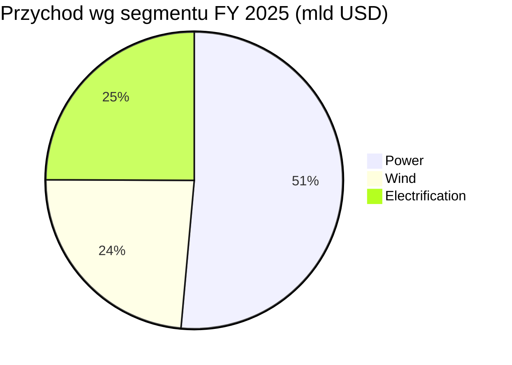
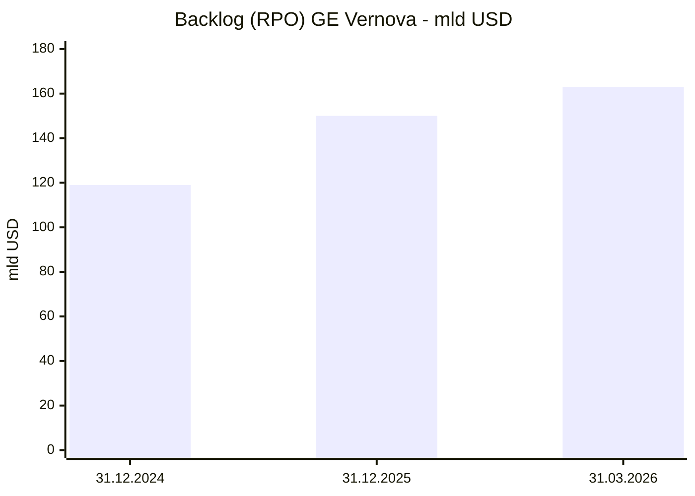

# GE Vernova (GEV)

<!-- spolki:temat:naziemny-bottleneck-energetyczny-i-sieciowy:start -->
## W kontekscie: Naziemny bottleneck energetyczny i sieciowy

**Czym jest spółka.** GE Vernova to wydzielona 2 kwietnia 2024 r. z General Electric "energetyczna połowa" dawnego konglomeratu - dostawca sprzętu i usług dla wytwarzania oraz przesyłu energii (spółka nie jest operatorem wytwarzającym prąd na własny rachunek). Spółka raportuje trzy segmenty: **Power** (turbiny gazowe heavy-duty 7HA/9HA, aeroderywatywne LM2500/LM6000, usługi serwisowe, jądro BWRX-300), **Electrification** (rozdzielnie, transformatory, [[_slownik#switchgear|switchgear]], HVDC, mikrogridy, oprogramowanie gridowe) oraz **Wind** (turbiny wiatrowe). Park zainstalowanych turbin gazowych GE Vernova to **~7 000 sztuk** (moc ~800 GW wymaga bezpośredniego cytatu z SEC/IR i jest podawana ostrożnie), a **~25% światowej energii elektrycznej** jest wytwarzane z użyciem technologii GE Vernova - cała technologia (gaz, wiatr, jądro, hydro, grid), nie sam park turbin gazowych (GE Vernova Annual Report 2024/2025 / 10-K).

**Dlaczego to jest sedno bottlenecku energetycznego dla AI.** Centra danych pod AI potrzebują dużej, ciągłej mocy ([[_slownik#baseload|baseload]]) szybciej, niż sieć potrafi ją dostarczyć - a to jest dokładnie domena GE Vernova na dwóch poziomach stosu wartości. Po pierwsze, **wytwarzanie**: turbina [[_slownik#CCGT|CCGT]] w układzie kombinowanym (7HA, 290-430 MW na jednostkę, sprawność do 64%+) jest dziś podstawowym, sprawdzonym źródłem dla wielkich kampusów, co rozwija wątek [[12 - naziemny-bottleneck-energetyczny-i-sieciowy#Energia: baseload, powrót do gazu/jądra, SMR dla DC]]. Po drugie, **przyłączenie do sieci** ([[_slownik#grid interconnection|grid interconnection]]): segment Electrification dostarcza rozdzielnie, transformatory i HVDC (high-voltage direct current; tu DC = direct current, prąd stały), czyli fizyczne elementy podłączenia DC (DC = data center, centrum danych), których brak jest jednym z głównych korków - patrz [[12 - naziemny-bottleneck-energetyczny-i-sieciowy#Brak transformatorów i switchgear: lead times]] oraz [[12 - naziemny-bottleneck-energetyczny-i-sieciowy#Kolejki przyłączeniowe i ograniczenia sieci]].

**Gdzie GE Vernova NIE gra.** Spółka nie oferuje chłodzenia szaf serwerowych ani fizycznej infrastruktury wnętrza DC jako osobnej linii - to domena Vertiv, Schneider czy Eaton (/GE Vernova 10-K / rynek). GE Vernova dostarcza warstwę wyżej: energię i podłączenie do sieci. W ogniwach paliwowych dla DC spółka też nie jest liderem - tu prym wiedzie Bloom Energy (Introl).

> **Dla inwestora:** ekspozycja GE Vernova na temat DC to nie osobna nisza, lecz najszybciej rosnący popyt w jej core'owych segmentach Power i Electrification. Spółka sprzedaje dwa najtwardsze "korki" bottlenecku - moc baseload i podłączenie do sieci - co czyni popyt funkcją tempa budowy DC, a nie ceny pojedynczego megawata.
<!-- spolki:temat:naziemny-bottleneck-energetyczny-i-sieciowy:end -->

<!-- spolki:grafiki:start -->
## Materiały spółki

> Grafiki z materiałów spółki / IR (prawa właściciela, użycie redakcyjne). Pełny rejestr: `Spolki/assets/_licencje.json`.

*1 |  |  | Turbina gazowa **7HA** - flagowy produkt Heavy-Duty dla dużych kampusów DC; pokazuje konfigurację i dane techniczne (290-430 MW, do 50% H2-ready). Źródło: materiały spółki / IR; licencja: materiały spółki / IR - prawa właściciela, użycie redakcyjne.*

*2 |  |  | Turbina gazowa **9HA** - najwydajniejsza H-class, serce najwydajniejszej elektrowni CCGT na świecie. Źródło: materiały spółki / IR; licencja: materiały spółki / IR - prawa właściciela, użycie redakcyjne.*

<!-- spolki:grafiki:end -->

<!-- spolki:ekspozycja:start -->
## Ekspozycja na temat w liczbach

**Skala spółki.** Przychód FY 2025 (rok do 31.12.2025, opublikowany 28.01.2026): **38,1 mld USD (+9% GAAP, +9% organicznie r/r)**; Q4 2025: **11,0 mld USD (+4% GAAP r/r)**. (GAAP = wynik wg standardów rachunkowości; "organicznie" = z wyłączeniem akwizycji, zbyć i efektu kursowego.) Zysk netto FY 2025: **4,9 mld USD** - przy czym **2,9 mld USD to jednorazowa korzyść podatkowa** z release valuation allowance (rozwiązanie odpisu na aktywa podatkowe - efekt księgowy, nie gotówkowy), więc bazowa rentowność jest istotnie niższa. Adjusted EBITDA margin (skorygowana marża operacyjna przed amortyzacją, z wyłączeniem pozycji jednorazowych) urosła z **5,8% (FY 2024) do 8,4% (FY 2025)**. Spółka jest w pozycji net cash: gotówka **8,8 mld USD na 31.12.2025** (vs 8,2 mld USD na 31.12.2024) przy niewielkim całkowitym długu bez leasingu (rzędu 0,1 mld USD - wartość wymaga weryfikacji w 10-K/10-Q) (8-K Q4 2025; 10-K 2024).

**Najnowszy kwartał (Q1 2026, okres 1.01-31.03.2026, ogłoszony 22.04.2026).** Przychód całkowity **9,339 mld USD (+16% GAAP, +7% organicznie r/r)**, w podziale segmentowym: Power **4,971 mld USD (+12% GAAP, +10% organicznie)**, Electrification **3,000 mld USD (+61% GAAP, +29% organicznie - efekt konsolidacji Prolec GE)** oraz Wind **1,400 mld USD (-25% organicznie)**. Marże segment EBITDA wyraźnie poprawiły się r/r: Power **16,3% (+470 bps)**, Electrification **17,8% (+670 bps GAAP)**, przy stracie Wind **382 mln USD (marża -26,7%)**. Zamówienia całkowite **18,3 mld USD (+71% organicznie)**. Free Cash Flow w samym Q1 2026 wyniósł **4,791 mld USD (>4x r/r)** - więcej niż w całym FY 2025 (3,7 mld USD); gotówka na koniec kwartału urosła do **10,2 mld USD** (vs 8,8 mld USD na 31.12.2025) (8-K Q1 2026, 22.04.2026 / transkrypt Q1 2026). Spółka **podniosła guidance FY 2026** 22.04.2026: przychód do **44,5-45,5 mld USD** (z 44,0-45,0), Adjusted EBITDA margin do **12-14%** (z 11-13%) i FCF do **6,5-7,5 mld USD** (z 5,0-5,5); dla Power segment EBITDA margin do 17-19%, dla Electrification przychód 14,0-14,5 mld USD i marża 18-20%, strata Wind ok. 400 mln USD (8-K Q1 2026).

*Rys. - przychody segmentowe pokazane przed eliminacjami; suma 38,5 mld USD przewyższa raportowany total 38,1 mld o ok. 0,5 mld USD sprzedaży międzysegmentowej (487 mln USD). Power i Electrification (~77% przychodu) to segmenty niosące ekspozycję na DC; Wind kurczy się. Dane: GE Vernova 8-K Q4 2025.*

**Ile z tego to centra danych? NIE UJAWNIONE oficjalnie.** GE Vernova nie raportuje segmentu "Data Center" ani osobnej linii przychodowej. Dostępne proxy: CEO Scott Strazik wskazał, że Big Tech może stanowić **~25% bazy klientów w 2026 r.** (vs 10% w 2025 i "negligible" w 2024) - to mix klientów, NIE % przychodów (Bloomberg / Energy Central, 21.01.2026). Według Quartr centra danych to **20-25% [[_slownik#backlog|backlogu]]** całej spółki (Quartr, Q1 2026). W Power ok. **20% z ~100 GW zakontraktowanych/zarezerwowanych slotów (czyli ~20 GW)** to wolumen jawnie wspierający centra danych - udział w kontraktach/slotach, nie w przychodach (transkrypt Q1 2026). W Q1 2026 zamówienia equipment w Electrification specjalnie na DC wyniosły **2,4 mld USD - więcej niż wszystkie zamówienia DC w całym FY 2025** (8-K Q1 2026 / transkrypt Q1 2026). Spółka wskazuje też rosnący entitlement: wcześniej **200-300 mln USD przychodu Electrification na 1 GW DC**, obecnie "probably already higher" (transkrypt Q1 2026).

**Dynamika - tu widać popyt związany m.in. z AI/DC.** (Liczby poniżej są segmentowe, nie wyłącznie DC/AI.) Zamówienia segmentu Power urosły **+52% organicznie**, a Electrification **+21% organicznie** w FY 2025 (8-K Q4 2025). Marża EBITDA Power wzrosła o **+220 bps (bps = punkt bazowy = 0,01 pkt proc.) do 14,7%**, Electrification o **+590 bps do 14,9%**. Łączny [[_slownik#backlog|backlog]] (RPO, Remaining Performance Obligations - wartość zakontraktowanych, jeszcze nie rozpoznanych przychodów) skoczył z ok. **119,0 do 150,0 mld USD** na 31.12.2025, czyli o ok. **+31 mld USD / +26%**, a sam backlog turbin gazowych z rezerwacjami slotów urósł do **83 GW** (z 62 GW na koniec Q3 2025). Najnowszy odczyt (Q1 2026): backlog RPO ok. **163 mld USD (+13 mld USD kw/kw, w tym ~5 mld USD z Prolec GE)**, backlog equipment **76 mld USD (+67% r/r)**, a backlog turbin gazowych ok. **100 GW** (44 GW firm equipment backlog + 56 GW slot reservations), z celem co najmniej 110 GW na koniec 2026 (8-K Q1 2026 / transkrypt Q1 2026).

*Rys. - Backlog wzrósł o ok. 31 mld USD (+26%) w 2025 r. i dalej do ok. 163 mld USD na 31.03.2026 (+13 mld kw/kw, w tym ~5 mld z Prolec GE); marża w backlogu equipment poprawiła się o 6 pkt proc. Dane: GE Vernova 8-K Q4 2025 i 8-K Q1 2026, 10-K 2024.*

> **Dla inwestora:** brak osobnego segmentu DC oznacza, że inwestor nie widzi twardego % przychodów z tematu - ma jedynie proxy (25% klientów, 20-25% backlogu). Mechanizm jest jednak czytelny: ekspansja DC napędza zamówienia i marże w Power oraz Electrification, a rosnący [[_slownik#backlog|backlog]] przekłada się na widoczność przychodów na lata naprzód.
<!-- spolki:ekspozycja:end -->

<!-- spolki:umowy:start -->
## Kluczowe umowy/wdrozenia - co znacza

Ekspozycja GE Vernova na DC materializuje się w konkretnych projektach na trzech poziomach: wielkie elektrownie [[_slownik#CCGT|CCGT]], szybkie jednostki aeroderywatywne i przyszłe jądro.

- **Chevron + Engine No. 1 + GE Vernova (styczeń 2025):** docelowo do **4 GW** mocy, oparte na **7 turbinach 7HA zarezerwowanych w ramach slot reservation agreement** (rezerwacja slotów produkcyjnych, nie pełne zamówienie); same 7 turbin 7HA odpowiada ok. 2-3 GW, a docelowe ~4 GW zakłada układ kombinowany i etapowanie. Koncepcja "power foundries" dedykowanych DC w USA, in-service do końca 2027 (komunikat Chevron / Business Wire). Pokazuje model dostawy energii bezpośrednio pod kampus, omijając kolejkę przyłączeniową.
- **NRG Energy + GE Vernova + Kiewit (luty 2025):** **5,4 GW** nowych elektrowni [[_slownik#CCGT|CCGT]] w ERCOT (rynek energii Teksasu) i PJM (rynek wsch. USA); dwie 7HA zabezpieczone w ramach **slot reservation agreement**, pierwszy blok 1,2 GW w 2029 (NRG IR / Business Wire). To wieloletni pipeline - obrazuje [[_slownik#time-to-power|time-to-power]] rzędu lat dla wielkiej generacji.
- **Crusoe - 29 turbin LM2500XPRESS (lipiec 2025):** łącznie **~1 GW** dla AI data centers (10 szt. w grudniu 2024 + 19 szt. w czerwcu 2025) (GE Vernova / Crusoe). Jednostki aeroderywatywne (35 MW, start w 5 min) to odpowiedź na potrzebę szybkiego, behind-the-meter zasilania, gdy sieci nie ma.
- **AWS Strategic Framework Agreement (marzec 2025):** turnkey substation solutions, współpraca przy onshore wind i eksploracja generacji dla DC w Ameryce Płn., Europie i Azji (GE Vernova / AWS). Bezpośrednie powiązanie z [[_slownik#hyperscaler|hyperscalerem]].
- **Duke Energy - 11 turbin 7HA (kwiecień 2025):** dodatkowe 11 szt. do istniejących 8, dla projektów w 6 stanach USA (/Turbomachinery / komunikat Duke).
- **BWRX-300 SMR - OPG Darlington (Ontario):** docelowo **4 reaktory x ~300 MWe = ~1,2 GW**; pierwsza komercyjna instalacja [[_slownik#SMR|SMR]] (Unit 1) planowana na **koniec 2029 r.** (oficjalny cel OPG/GEH). Projekt ma licencję budowlaną CNSC (kwiecień 2025) i final provincial approval (maj 2025), jest w fazie budowy: wykopy Unit 1 na **87% ukończenia** (stan marzec 2026), ułożenie basemat planowane latem 2026 - przy czym IAEA wciąż nie odnotowała "startu budowy" (brak wlanego betonu na marzec 2026), co pozostawia first-of-a-kind construction risk. Projekt TVA Clinch River (Tennessee) jest w fazie licencjonowania - licencja budowlana NRC spodziewana "as soon as 2026" / H2 2026 (/GE Vernova / OPG / CEDAR Project / transkrypt Q1 2026).
- **Inne inicjatywy SMR:** wsparcie w ramach porozumienia USA-Japonia do **40 mld USD** dla GE Vernova Hitachi na budowę SMR w USA (Tennessee, Alabama) (kwiecień 2026); Generic Design Agreement z OSGE w **Polsce** (luty 2026) oraz MOU GE Vernova-Hitachi na rozwój SMR w Azji Południowo-Wschodniej (kwiecień 2026) (transkrypt Q1 2026 / GreenStocks Research / TEPA).

> **Dla inwestora:** umowy dzielą się na trzy horyzonty pewności i czasu - aeroderywatywne (Crusoe, ~1 GW, dostawy już trwają), CCGT (Chevron 4 GW do 2027, NRG 5,4 GW do 2029+) oraz jądro (BWRX-300 dopiero od 2029). Im dalej w przyszłość, tym większa skala, ale i dłuższy [[_slownik#time-to-power|time-to-power]] oraz ryzyko regulacyjne.
<!-- spolki:umowy:end -->

<!-- spolki:pozycja:start -->
## Pozycja rynkowa i udzialy

GE Vernova jest jednym z 3-5 globalnych liderów turbin gazowych, ale konkretne udziały różnią się zależnie od definicji rynku (heavy-duty vs wszystkie turbiny, wg sztuk vs wg MW) i bywają wzajemnie sprzeczne. Najtwardsze są dane o zainstalowanej bazie, które spółka podaje w dokumentach SEC/IR.

Uwaga: poniższe udziały pochodzą z różnych baz (definicja rynku, miara, rok, region) i nie są wprost porównywalne. Najbliższa jednolitej tabeli (jedno źródło, jeden rok) jest Precedence Research 2025 dla całego rynku turbin gazowych: **GE Vernova 28,1%, Siemens Energy 24,1%, MHI 18,4%, Baker Hughes 9,6%, Ansaldo 7,3%, Solar Turbines 6,0%** (Precedence Research, 2025) - ale to model rynkowy obejmujący wszystkie typy turbin gazowych, nie heavy-duty. W wąskim segmencie heavy-duty >100 MW GE Vernova to jeden z **3 OEM-ów (GEV, Siemens, MHI) skupiających ~90% rynku** (IEEFA, październik 2025).
- **Heavy-duty gas turbines, globalnie, 2025:** udział GE Vernova **>14,5%** wg sztuk/wartości (GM Insights, 2025). Inne źródła rozjeżdżają się: Fact.MR przypisuje Siemensowi ~17%, Precedence Research podaje ~28,1% dla GEV na rynku all gas turbines, a Mordor Intelligence szacuje, że GEV razem z Siemensem trzymają ~70% rynku industrial gas turbines - bazy i definicje są różne.
- **Aeroderywatywne 30-60 MW (ostatnie ~5 lat):** GE Vernova + Baker Hughes razem **63%** (GE Vernova lider), wobec Siemens 10%, UEC 8%, MHI 5% (market analysis; brak potwierdzenia w źródle pierwotnym).
- **Turbiny gazowe w USA:** ~**50%** (blog cytujący Goldman Sachs, kwiecień 2025 - dane słabe).
- **Zainstalowana baza:** **~7 000 turbin** (moc ~800 GW podawana ostrożnie, wymaga cytatu z SEC/IR) (GE Vernova Form 10 / 10-K / IR, 2024/2025).
- **Udział technologii GEV w światowej produkcji energii:** **~25%** (cała technologia, nie sam park gazowy) (Annual Report 2024/2025).

**Skala produkcji jako bariera.** GE Vernova zwiększa zdolność produkcyjną do **20 GW znormalizowanej rocznej produkcji do połowy 2026 r.** i **24 GW do 2028 r.** (transkrypt Q4 2025 / Q1 2026; wcześniejsze "70-80 units/rok" nie ma bezpośredniego potwierdzenia w aktualnych celach). Planuje **~11 mld USD capex + R&D do 2028** (podniesione z wcześniejszych ~9 mld) i zapowiedziała ~600 mln USD inwestycji w USA rozłożonych na **2 lata** (nie w samym 2025) (8-K Q1/Q4 2025, transkrypt Q4 2025). [[_slownik#capex|Capex]] tej skali jest barierą wejścia: poza zainstalowaną bazą i usługami LTSA (które stanowią >60% backlogu) konkurencja musi też zbudować moce produkcyjne.

**Dynamika rezerwacji slotów turbin gazowych (Q1 2026).** Połączony backlog + slot reservations urósł do **100 GW** (+17 GW kw/kw z 83 GW na koniec Q4 2025), z czego **44 GW to firm equipment backlog** (+4 GW kw/kw), a **56 GW to slot reservation agreements** (+13 GW kw/kw) - czyli ponad połowa to wciąż rezerwacje, które można odroczyć lub anulować. W samym Q1 2026 podpisano **21 GW nowych umów** (19 GW SRA + 2 GW bezpośrednich zamówień), skonwertowano **6 GW SRA na twarde zamówienia**, a wysyłki wyniosły **4 GW (25 turbin, +32% r/r)**; cel na koniec 2026 to co najmniej 110 GW combined, a na Q2 2026 dodatkowe 10-15 GW nowych kontraktów. CEO wskazał, że nowe ceny w 2026 r. są o **10-20 punktów proc. wyższe** niż backlog z Q4 2025 (w USD/kW). Pozostała wolna zdolność na lata 2029-2030 to już tylko ok. **10 GW łącznie** (8-K Q1 2026 / transkrypt Q1 2026).

> **Dla inwestora:** przewaga GE Vernova jest najlepiej mierzalna nie przez sporne udziały rynkowe, lecz przez zainstalowaną bazę (~7 000 turbin, ~800 GW) i wynikający z niej powtarzalny, wysokomarżowy przychód serwisowy. To utrudnia klientowi zmianę dostawcy i stabilizuje [[_slownik#backlog|backlog]].
<!-- spolki:pozycja:end -->

<!-- spolki:konkurencja:start -->
## Mechanika konkurencji - na osiach

GE Vernova konkuruje na czterech osiach: wydajność turbiny, [[_slownik#time-to-power|time-to-power]], heritage/zdolność produkcyjna oraz gotowość na dekarbonizację (H2-ready, CCS). Główni rywale różnią się tym, gdzie naciskają.

| Konkurent | Notowany | Na czym konkuruje | Twarde liczby | Źródło |
|---|---|---|---|---|
| **Siemens Energy** | ENR.DE | HL-class, H2-ready (SGT-800 certyfikacja TUV), serwis globalny | **194 turbiny w FY 2025** (vs 100 w 2024), backlog 138 mld EUR, ~17% global share | Fact.MR / Siemens Energy |
| **Mitsubishi Power (MHI)** | 7011.T | J-series air-cooled, M501JAC, silna Azja | 35% global share by MW w 2023 (historyczne) | MatrixBCG / MHI |
| **Solar Turbines (Caterpillar)** | CAT | Aeroderywatywne i przemysłowe, mniejsze jednostki i backup | część koncernu CAT | Fact.MR / Reanin |
| **Baker Hughes** | BKR | Aeroderywatywne (12,5-132 MW) | GEV + BKR = 63% rynku aeroderywatywnego | market analysis |
| **Wärtsilä** | WRT1V.HE | Modułowe silniki/elektrownie, fuel-flexible, szybki start (konkurencja w gazowej generacji dla DC, nie wprost w heavy-duty turbines) | obecna w top 5 dostawców gazowej generacji | GM Insights |

**Osie konkurencji z liczbami:**
- **Wydajność:** GE Vernova 7HA/9HA osiąga **64%+** w cyklu kombinowanym, na poziomie HL-class Siemensa - to oś, na której GEV gra technologią, nie ceną.
- **Cena (capex):** tu przewagę mają Wärtsilä, Solar Turbines i Ansaldo, często konkurujące niższym [[_slownik#capex|capex]] na jednostkę.
- **Heritage / time-to-market:** GE Vernova i Baker Hughes dominują w aeroderywatywnych dzięki dziedzictwu GE Aviation (LM2500 wywodzi się z silnika lotniczego); Siemens z kolei szybciej skaluje produkcję (194 szt. w 2025 vs 100 w 2024).
- **Dekarbonizacja:** GE Vernova oferuje turbiny 50% H2-capable (zdolne spalać do 50% wodoru w mieszance) z drogą do 100% i CCS-ready (przygotowane pod wychwyt CO2, carbon capture and storage), ale Siemens jest liderem certyfikacji H2-ready.

**Sąsiednie fronty (gdzie GEV gra słabiej lub wcale):** w [[_slownik#SMR|SMR]] rywalami są NuScale, Kairos Power (umowa z Google na 500 MW), TerraPower, X-energy, Rolls-Royce SMR i Westinghouse; w ogniwach paliwowych dla DC liderem jest Bloom Energy (SOFC - stałotlenkowe ogniwa paliwowe, solid oxide fuel cells; >400 MW dostarczone do DC), a GE Vernova nie konkuruje. W elektryfikacji/grid rywalami są Hitachi Energy (lider HVDC), Siemens Energy, Schneider Electric, ABB i Mitsubishi Electric (GE Vernova 10-K / rynek).

> **Dla inwestora:** kluczowa presja konkurencyjna to przyspieszające skalowanie Siemensa (niemal podwojenie wolumenu turbin r/r) - przy popycie przekraczającym podaż liczy się, kto szybciej dostarczy. Drugi wektor to substytucja: ogniwa SOFC (Bloom) i silniki tłokowe mogą przejmować mniejsze i backup DC, gdzie turbina HA jest przewymiarowana.
<!-- spolki:konkurencja:end -->

<!-- spolki:przekroj:start -->
## Koncentracja odbiorcow i ryzyka z mechanizmem

**Koncentracja odbiorców.** GE Vernova nie ujawnia w 10-K klientów dających >10% przychodów, więc ryzyko koncentracji jest realne, ale niewymierne (10-K 2024). Jakościowo widać szybki wzrost udziału [[_slownik#hyperscaler|hyperskalerów]]: Big Tech z "negligible" w 2024, przez 10% w 2025, do **~25% bazy klientów w 2026** (Bloomberg, 21.01.2026). Spadek capex-u Big Tech lub zmiana strategii DC uderzyłaby wprost w zamówienia Power i Electrification.

**Ryzyka z mechanizmem:**

- **Łańcuch dostaw i produkcja na granicy.** Zamówienia Power +52% r/r przy backlogu turbin 100 GW (na Q1 2026) oznaczają, że produkcja goni popyt; lead time nowych turbin GEV to ok. **3 lata** (directionally), a branżowo - przy presji łańcucha dostaw - nawet do 5 lat, przy czym pozostała wolna zdolność na 2029-2030 to już tylko ~10 GW (transkrypt Q1 2026 / Mordor Intelligence). Mechanizm: niewykonanie planu rozbudowy mocy (20 GW do połowy 2026, 24 GW do 2028) = utrata zamówień na rzecz Siemensa; opóźnienia łopatek, transformatorów czy półprzewodników podnoszą koszt i tną marżę. To bezpośrednio łączy się z [[12 - naziemny-bottleneck-energetyczny-i-sieciowy#Brak transformatorów i switchgear: lead times]].
- **Cła i inflacja.** Pierwotny guidance na 2025 zakładał wpływ **300-400 mln USD** (netto działań łagodzących), dotykający ~25% direct spend, najmocniej z Chin (8-K Q1 2025); rzeczywisty wpływ netto za 2025 wyniósł ok. **250 mln USD** wg CFO (transkrypt Q1 2026). Mechanizm: presja na marżę EBITDA przy przychodzie ~38 mld USD.
- **Cykl technologiczny - jądro odległe.** [[_slownik#SMR|SMR]] BWRX-300 daje pierwsze przychody dopiero ok. 2029 r.; do tego czasu to inwestycja R&D bez zwrotu. Wymaga licencji regulatorów jądrowych (NRC w USA, CNSC w Kanadzie, ONR w Wielkiej Brytanii) - opóźnienia regulacyjne wydłużają time-to-revenue (/GE Vernova IR / NEI).
- **Substytucja w energetyce DC.** Bloom Energy oferuje 90-dniowe wdrożenie SOFC, a Goldman Sachs szacuje 8-20 GW ogniw dla DC do 2030 r. (Introl / Goldman Sachs). Mechanizm: przyspieszenie adopcji SOFC ogranicza popyt na turbiny w mniejszych i backup DC.
- **Regulacje grid interconnection.** Decyzje regulatorów (np. tymczasowe odrzucenie przez FERC dealu AWS-Susquehanna) mogą opóźniać przyłączenia konkretnych projektów DC i przesuwać popyt między rozwiązaniami gridowymi (prasa); brak jednak danych o anulowanych z tego tytułu zamówieniach GEV - wątek [[12 - naziemny-bottleneck-energetyczny-i-sieciowy#Kolejki przyłączeniowe i ograniczenia sieci]].
- **Kapitał i Wind.** Akwizycja pozostałych 50% Prolec GE za **5,275 mld USD** (zamknięcie 02.02.2026) to wypływ gotówki, ale daje synergie w transformatorach; buyback 8,2 mln akcji w 2025 (śr. 406 USD/akcję, czyli ok. 3,3 mld USD), autoryzacja podniesiona do 10 mld USD. Segment Wind ciąży: strata EBITDA wyniosła ok. **600 mln USD w 2025** (powyżej oczekiwań ~400 mln), a guidance na 2026 to ok. 400 mln; przychód spada (8-K Q4 2025 / transkrypt Q4 2025).

> **Dla inwestora:** w obecnym opisie największy nacisk pada na ryzyka podażowe - to wykonanie planu rozbudowy mocy i łańcuch dostaw decydują, czy backlog 150 mld USD zamieni się w przychód z marżą. Ryzyka popytowe (cykliczność energetyki, koncentracja na jednym typie klienta - Big Tech) pozostają istotne, choć trudniej wymierne niż ryzyko egzekucji.
<!-- spolki:przekroj:end -->

<!-- network:peers:start -->
## Powiązane spółki

> Inne notowane spółki z raportu dzielące z tą firmą co najmniej jeden wątek tematyczny (wspólny rynek, technologia lub łańcuch wartości).

- [[Spolki/bloom-energy|Bloom Energy Corporation (BE)]] - Ogniwa paliwowe SOFC dla centrów danych  
  *Wspólne wątki: Naziemny bottleneck.*
- [[Spolki/constellation-energy|Constellation Energy Corporation (CEG)]] - Największy operator floty jądrowej w USA (PPA z hyperskalerami)  
  *Wspólne wątki: Naziemny bottleneck.*
- [[Spolki/eaton|Eaton Corporation plc (ETN)]] - Zasilanie DC (UPS, switchgear) + chłodzenie (Boyd Thermal)  
  *Wspólne wątki: Naziemny bottleneck.*
- [[Spolki/oklo|Oklo Inc. (OKLO)]] - Mikroreaktory (SMR/fission) na potrzeby DC  
  *Wspólne wątki: Naziemny bottleneck.*
- [[Spolki/schneider-electric|Schneider Electric SE (SU)]] - Zasilanie i chłodzenie DC (EcoStruxure, Motivair)  
  *Wspólne wątki: Naziemny bottleneck.*
- [[Spolki/siemens-energy|Siemens Energy AG (ENR)]] - Turbiny gazowe i technologie sieciowe (EU)  
  *Wspólne wątki: Naziemny bottleneck.*
- [[Spolki/talen-energy|Talen Energy Corporation (TLN)]] - Energia jądrowa (Susquehanna), sąsiedztwo z DC  
  *Wspólne wątki: Naziemny bottleneck.*
- [[Spolki/vertiv|Vertiv Holdings Co (VRT)]] - Zasilanie i precyzyjne/cieczowe chłodzenie DC  
  *Wspólne wątki: Naziemny bottleneck.*
<!-- network:peers:end -->

<!-- spolki:slownik:start -->
## Slowniczek

Hasła ogólne w centralnym słowniku: [[_slownik#CCGT|CCGT]], [[_slownik#baseload|baseload]], [[_slownik#grid interconnection|grid interconnection]], [[_slownik#capex|capex]], [[_slownik#time-to-power|time-to-power]], [[_slownik#backlog|backlog]], [[_slownik#hyperscaler|hyperscaler]], [[_slownik#SMR|SMR]], [[_slownik#switchgear|switchgear]], [[_slownik#RPO|RPO]].

Lokalne pojęcia użyte w notatce:
- **7HA / 9HA** - turbiny gazowe heavy-duty H-class GE Vernova; 290-430 MW na jednostkę, sprawność do 64%+ w cyklu kombinowanym, do 50% H2-ready.
- **LM2500XPRESS** - turbina aeroderywatywna (z dziedzictwa GE Aviation), 35 MW, 95% fabrycznie zmontowana, start w 5 min - do szybkich, behind-the-meter wdrożeń.
- **BWRX-300** - reaktor SMR typu wrzącego (BWR) ~300 MWe, joint venture z Hitachi (GEH); pierwsza instalacja OPG Darlington planowana na 2029 r.
- **LTSA (Long-Term Service Agreement)** - długoterminowa umowa serwisowa generująca powtarzalny przychód; usługi to >60% backlogu GEV.
- **Slot reservation agreement** - rezerwacja mocy produkcyjnej na przyszłe dostawy turbin; wiąże klienta z terminem, nie będąc jeszcze pełnym zamówieniem.
- **Behind-the-meter (BTM) / front-of-the-meter** - generacja przy obiekcie DC za licznikiem vs energia kupowana z sieci publicznej.
<!-- spolki:slownik:end -->

<!-- spolki:zrodla:start -->

### Pierwotne (SEC / GE Vernova IR)
- GE Vernova 8-K Q1 2026 - earnings release (22.04.2026) - https://fortune.com/company-assets/15211/quartr/earnings-release-8-k-ebc20-2026-04-22-10-07-23.pdf
- GE Vernova 8-K Q4/FY 2025 (28.01.2026) - https://s203.q4cdn.com/220048624/files/doc_downloads/2026/GEV-4Q-2025-Form-8-K-01-28-2026.pdf
- GE Vernova 8-K Q1 2025 (23.04.2025) - https://s203.q4cdn.com/220048624/files/doc_downloads/2025/04/GE-Vernova-1Q-25-8-K-FINAL.pdf
- GE Vernova 10-K 2024 (last10k) - https://last10k.com/sec-filings/gev/0001996810-25-000011.htm
- GE Vernova Form 10 (15.02.2024) - https://s203.q4cdn.com/220048624/files/doc_downloads/2024/03/GEV-Form-10-and-ex-99-1-information-statement-as-filed-2-15-2024.pdf
- GE Vernova - Gas Power for Data Centers - https://www.gevernova.com/gas-power/industries/data-centers
- GE Vernova Annual Report 2024 - https://www.gevernova.com/investors/annual-report
- GE Vernova + Crusoe (22.07.2025) - https://www.crusoe.ai/resources/newsroom/ge-vernova-and-crusoe-announce-major-29-unit-gas-turbine-deal
- Chevron power solutions for US data centers (28.01.2025) - https://www.chevron.com/newsroom/2025/q1/power-solutions-for-us-data-centers
- NRG + GE Vernova + Kiewit 5,4 GW (26.02.2025) - https://investors.nrg.com/news-releases/news-release-details/nrg-energy-ge-vernova-and-kiewit-accelerating-new-generation
- GE Vernova + AWS SFA (04.03.2025) - https://www.certrec.com/news/ge-vernova-and-aws-expand-collaboration-to-address-accelerating-global-energy-demand-through-strategic-framework-agreement/

### Wtórne (prasa / analitycy)
- Bloomberg / Energy Central - mix klientów GEV (21.01.2026) - https://www.energycentral.com/energy-biz/post/news-ai-boom-shifts-the-mix-of-ge-vernova-s-customers-ceo-says-8r9QenK4LZevUnf
- Quartr - GE Vernova Q1 2026 - https://quartr.com/companies/ge-vernova-inc_16637
- GM Insights - Heavy Duty Gas Turbine Market - https://www.gminsights.com/industry-analysis/heavy-duty-gas-turbine-market
- Fact.MR - Gas Turbine Market 2026 - https://www.factmr.com/report/gas-turbine-market
- Introl - Fuel Cells for AI Data Center Power - https://introl.com/blog/fuel-cells-data-center-power-dark-horse-7-billion
- Turbomachinery Magazine - GE Vernova Q4 2025 - https://www.turbomachinerymag.com/view/ge-vernova-s-power-electrification-segments-grow-in-2025-as-demand-rises
- Data Center Dynamics - NRG 5,4 GW - https://www.datacenterdynamics.com/en/news/nrg-partners-with-ge-vernova-to-develop-54gw-of-gas-generation-for-us-data-center-market/
- Motley Fool - transkrypt GE Vernova Q1 2026 earnings call (22.04.2026) - https://www.fool.com/earnings/call-transcripts/2026/04/22/ge-vernova-gev-q1-2026-earnings-transcript/
- lastbastion - GE Vernova Q4 2025 earnings (30.01.2026) - https://lastbastion.com/2026/01/30/ge-vernova-q42025-earnings/
- PRNewswire - Duke Energy + GE Vernova gas turbines (24.04.2025) - https://www.prnewswire.com/news-releases/duke-energy-and-ge-vernova-announce-significant-arrangement-for-gas-turbines-and-associated-equipment-302437600.html
- Precedence Research - Gas Turbine Market 2025 - https://www.precedenceresearch.com/gas-turbine-market
- Mordor Intelligence - Industrial Gas Turbine Market (2025) - https://www.mordorintelligence.com/industry-reports/industrial-gas-turbine-market
- IEEFA - Global gas turbine shortages (październik 2025) - https://ieefa.org/sites/default/files/2025-10/IEEFA%20Report_Global%20gas%20turbine%20shortages%20add%20to%20LNG%20challenges%20in%20Vietnam%20and%20the%20Philippines_October2025.pdf
- GreenStocks Research - Listed SMR companies / BWRX-300 (2026) - https://greenstocksresearch.com/8-listed-companies-developing-small-modular-reactors/
- CEDAR Project - SMRs in Canada, March 2026 - https://cedar-project.org/wp-content/uploads/2026/03/SMRs-in-Canada-March-2026.pdf
- Durham Region - OPG Darlington update (2026) - https://pub-durhamregion.escribemeetings.com/filestream.ashx?DocumentId=8632
- TEPA - GE Vernova/Hitachi SMR MOU SE Asia (17.04.2026) - http://www.tepa108.org.tw/EpaperHtm/20260417101441.htm

### Słabe (blogi / fora)
- JRo's Notes - GE Vernova Q1 2025 (cytuje Goldman Sachs ~50% share US) - https://lastbastion.com/2025/05/19/jros-notes-ge-vernova-q12025-earnings/
<!-- spolki:zrodla:end -->

## Notatki wlasne

(sekcja poza zarzadzaniem skilla - miejsce na reczne notatki uzytkownika)
