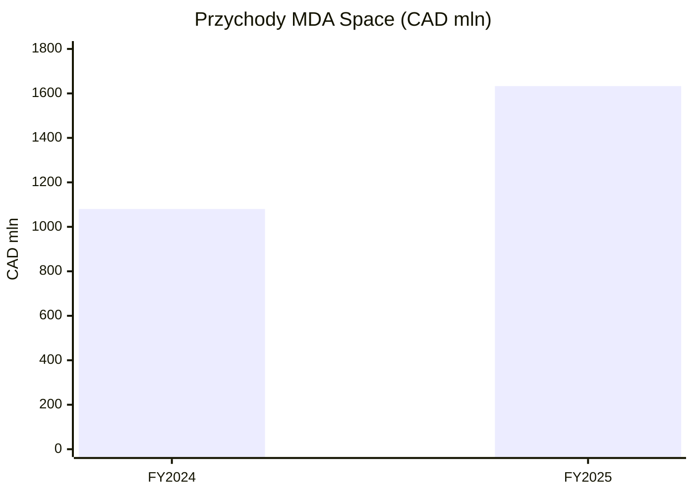
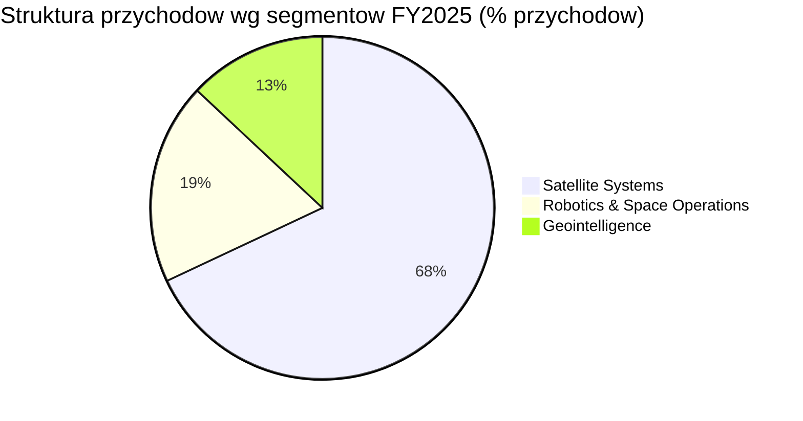
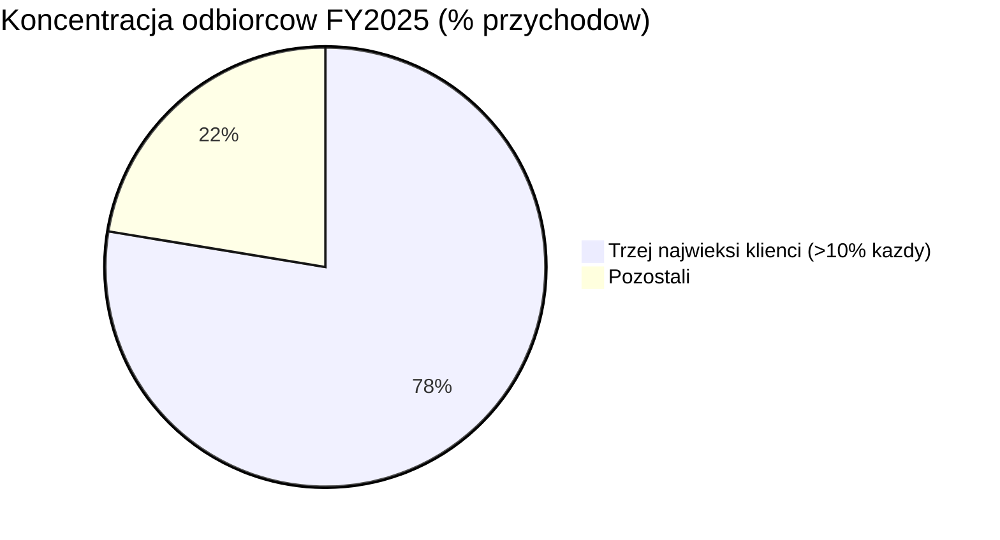
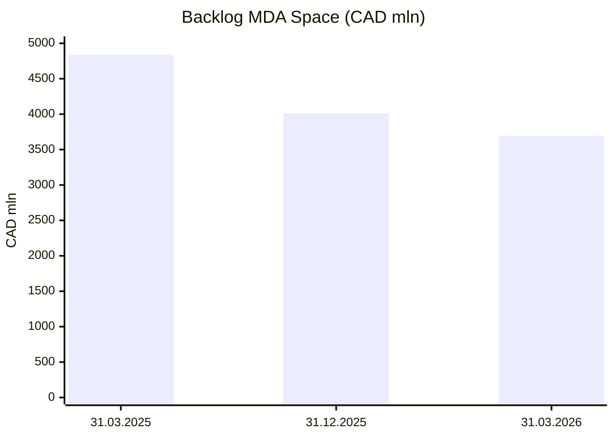

# MDA Space (MDA)

<!-- spolki:temat:fizyka-orbitalna-orbity-i-operacje:start -->
## W kontekscie: Fizyka orbitalna, orbity i operacje

**Czym jest spółka.** MDA Space Ltd. (TSX: MDA) to kanadyjski producent i integrator systemów kosmicznych z ponad 55-letnim dziedzictwem (twórca Canadarm od 1981 r., ponad 450 misji; raport roczny 2025). Spółka jest niemal w 100% eksponowana na sektor kosmiczny i raportuje trzy obszary biznesowe: **Satellite Systems** (68% przychodów FY2025), **Robotics & Space Operations** (19%) oraz **Geointelligence** (13%) (raport roczny 2025, dane na 31 grudnia 2025). W kontekście fizyki orbitalnej i operacji najistotniejszy jest największy segment, Satellite Systems: to on buduje [[_slownik#bus satelitarny|busy satelitarne]], anteny aktywne oraz podsystemy zasilania i sterowania - przy czym to napęd utrzymuje satelitę na właściwej orbicie (station-keeping), ADCS odpowiada za orientację, a zasilanie wspiera pracę całej platformy.

**Co spółka faktycznie dostarcza dla operacji orbitalnych.** Flagową platformą jest **MDA AURORA™** - cyfrowy, programowalny [[_slownik#bus satelitarny|bus satelitarny]] przeznaczony do dużych konstelacji [[_slownik#LEO|LEO]]. To na tej platformie integrowane są podsystemy odpowiadające za fizykę lotu: kontrola orientacji (ADCS - sensory i koła reakcyjne), napęd do [[_slownik#station-keeping|station-keeping]] oraz struktury rozkładane (anteny, panele). W dostępnych materiałach spółka nie wydziela jednak sprzedaży tych komponentów (ADCS, koła reakcyjne, star trackery) jako osobnej linii komercyjnej - są one integralną częścią dostarczanych satelitów i platform, a spółka nie ujawnia ich sprzedaży zewnętrznej (research F1, sekcja 7). To rozwija wątek różnic między orbitami i wymaganiami na utrzymanie szyku, omawiany w [[03 - fizyka-orbitalna-orbity-i-operacje#Trade-off orbit: LEO vs SSO dawn-dusk vs MEO vs GEO]] oraz w kontekście napędu i paliwa w [[03 - fizyka-orbitalna-orbity-i-operacje#Opór atmosferyczny (drag), station-keeping, napęd i paliwo]].

**Skala produkcji jako bariera.** MDA Space uruchomiła nową halę produkcyjną satelitów w Montrealu (185 tys. stóp kwadratowych, ukończona w niespełna 2 lata), docelowo zdolną wytwarzać do dwóch satelitów dziennie, czyli **do 400 satelitów rocznie**, oraz linię montażu anten aktywnych dla platformy AURORA (MDA Space, inauguracja 8 maja 2026; BetaKit, 11 maja 2026). Ramp jest stopniowy: w 2026 r. "a few dozen satellites" (wypracowywanie procesów), w 2027 r. "couple hundred satellites and more", a pełna produkcja w 2028 r. (transkrypt konferencji Q2 2025). Hala obsługuje m.in. konstelacje Telesat Lightspeed (198 satelitów) i Globalstar next-gen (50+), z potencjałem 4-6 klientów konstelacyjnych (Quartr / Jefferies Space Virtual Summit 2026). Ta skala jest istotna dla fizyki konstelacji: utrzymanie [[03 - fizyka-orbitalna-orbity-i-operacje#Formation flying / utrzymanie szyku konstelacji|szyku setek satelitów]] wymaga seryjnej, powtarzalnej produkcji platform z powtarzalnymi, kwalifikowanymi parametrami napędowymi i orientacyjnymi.

> **Dla inwestora:** ekspozycja MDA Space na "fizykę orbitalną" jest pośrednia, ale dominująca przychodowo - 68% sprzedaży FY2025 (CAD 1 109,5 mln) idzie przez Satellite Systems, który dostarcza busy, anteny i podsystemy utrzymujące satelity na orbicie. Nie jest to jednak ekspozycja na "orbitalne centra danych" - takiej linii produktowej ani kontraktu spółka NIE UJAWNIA.
<!-- spolki:temat:fizyka-orbitalna-orbity-i-operacje:end -->

<!-- spolki:grafiki:start -->
## Materiały spółki

> Grafiki z materiałów spółki / IR (prawa właściciela, użycie redakcyjne). Pełny rejestr: `Spolki/assets/_licencje.json`.

*URL pliku (jpg/png). Źródło: materiały spółki / IR; licencja: materiały spółki / IR - prawa właściciela, użycie redakcyjne.*

*URL pliku (jpg). Źródło: materiały spółki / IR; licencja: materiały spółki / IR - prawa właściciela, użycie redakcyjne.*

*URL pliku (png). Źródło: materiały spółki / IR; licencja: materiały spółki / IR - prawa właściciela, użycie redakcyjne.*

<!-- spolki:grafiki:end -->

<!-- spolki:temat:niezawodnosc-serwisowanie-i-cykl-zycia-sprzetu:start -->
## W kontekscie: Niezawodność, serwisowanie i cykl życia sprzętu

**Dziedzictwo robotyki jako rdzeń tematu.** To w tym temacie MDA Space ma silną pozycję opartą na heritage i kontraktach rządowych. Segment **Robotics & Space Operations** (CAD 309,3 mln, 19% przychodów FY2025, +10,5% r/r; raport roczny 2025) bezpośrednio odpowiada na serwisowanie on-orbit, [[_slownik#in-space assembly|in-space assembly]] i przedłużanie życia sprzętu orbitalnego. Spółka określa się jako "world leader in space robotics" i opiera tę pozycję na twardym dziedzictwie: Canadarm2 i Mobile Servicing System działają na Międzynarodowej Stacji Kosmicznej (ISS) od 2001 r. (ponad 25 lat), Dextre dołączył później, w 2008 r. (ok. 18 lat); spółka podaje ponad 4 mln godzin inżynieryjnego wsparcia operacji robotycznych on-orbit oraz ponad 90 misji wahadłowca kosmicznego z udziałem Canadarm1 (prezentacja inwestorska Q1 2026, maj 2026).

**Robotyka serwisowa - od Orbital Express do Canadarm3.** Heritage MDA w obsłudze sprzętu na orbicie jest wyróżniający się: w 2007 r. manipulator OEDMS w misji Orbital Express (DARPA) wykonał pierwszą autonomiczną wymianę modułu ORU i przechwycenie satelity na orbicie (NASA, raport "On-Orbit Satellite Servicing Study", maj 2011). Flagowym kontraktem jest dziś **Canadarm3** dla księżycowej stacji NASA Gateway (program Artemis) - trzecia generacja ramienia z AI i machine vision, system "human-rated", o wartości kontraktu CSA na fazy C/D wycenianej na ok. CAD 1 mld (SatNews, 30 czerwca 2024, powołuje się na komunikat spółki). Z Canadarm3 spółka wyprowadza komercyjną, modułową linię **MDA SKYMAKER™** (ramiona od 1 m do ponad 15 m), dostarczaną m.in. do komercyjnej stacji **Starlab** (joint venture z Voyager, Airbus, Mitsubishi; udział od maja 2024, warunki finansowe nieujawnione; MDA Space, 29 maja 2024). To bezpośrednio rozwija problem [[08 - niezawodnosc-serwisowanie-i-cykl-zycia-sprzetu#Brak napraw in-situ a robotyczna obsługa (Northrop Grumman MEV i następcy)|robotycznej obsługi orbitalnej]] oraz [[08 - niezawodnosc-serwisowanie-i-cykl-zycia-sprzetu#Deorbitacja i wymiana całych modułów a upgrade|wymiany całych modułów]].

**Dlaczego to ważne dla cyklu życia sprzętu na orbicie.** Sprzęt orbitalny jest trudno serwisowalny - naprawy, tankowanie i wymiana modułów wymagają zaprojektowanych interfejsów oraz systemów robotycznych/autonomicznych. Tu kompetencja MDA Space w autonomicznej robotyce ([[_slownik#life extension|life extension]], montaż konstrukcji) jest dokładnie tym, co odpowiada na napięcie między szybkim [[08 - niezawodnosc-serwisowanie-i-cykl-zycia-sprzetu#Cykl odświeżania GPU (~3-5 lat na Ziemi) a nieserwisowalna orbita ("frozen hardware")|cyklem odświeżania sprzętu na Ziemi a "zamrożoną" orbitą]] oraz [[08 - niezawodnosc-serwisowanie-i-cykl-zycia-sprzetu#Starzenie technologiczne (prawo Moore'a) szybsze niż żywotność platformy - problem ekonomiczny|szybszym starzeniem technologicznym niż żywotność platformy]].

> **Dla inwestora:** robotyka serwisowa to dla MDA Space rdzeniowa, ale mniejsza linia - 19% przychodów wobec 68% w Satellite Systems. Jej znaczenie jest jakościowe: stanowi trudną do skopiowania barierę (ponad 4 mln godzin operacji on-orbit, systemy human-rated), a przyszły wzrost zależy od materializacji programów rządowych (Gateway) i komercyjnych (Starlab).
<!-- spolki:temat:niezawodnosc-serwisowanie-i-cykl-zycia-sprzetu:end -->

<!-- spolki:ekspozycja:start -->
## Ekspozycja na temat w liczbach

**Skala i dynamika.** Przychody FY2025 (zakończony 31 grudnia 2025) wyniosły **CAD 1 633,2 mln, wzrost +51,2% r/r** (FY2024: CAD 1 080,1 mln); Adjusted EBITDA CAD 323,9 mln (+49,2% r/r), marża 19,8%; marża brutto 25,1% (vs 26,1% w FY2024), gross profit CAD 409,7 mln; zysk netto CAD 108,5 mln (+36,6% r/r) (komunikat Q4/FY2025, 4 marca 2026). Ostatni raportowany kwartał Q1 2026 (zakończony 31 marca 2026): przychody **CAD 464,1 mln (+32,2% r/r)**, marża brutto 24,8% (vs 22,7% w Q1 2025), gross profit CAD 115,2 mln (+44,5% r/r), Adjusted EBITDA CAD 90,6 mln (+32,1% r/r, marża 19,5%), zysk netto CAD 29,6 mln (-10,0% r/r) (komunikat Q1 2026, 7 maja 2026).

*Rys. - Trajektoria przychodów rocznych, wzrost +51,2% r/r. Dane: MDA Space IR (komunikat Q4/FY2025).*

**Struktura segmentowa - gdzie siedzi temat.** Ekspozycja na fizykę orbitalną i busy idzie głównie przez Satellite Systems (CAD 1 109,5 mln, 68%, +85,5% r/r FY2025), a na niezawodność/serwisowanie przez Robotics & Space Operations (CAD 309,3 mln, 19%, +10,5% r/r). Geointelligence (CAD 214,4 mln, 13%, +6,1% r/r) zawiera naziemną infrastrukturę odbioru i przetwarzania danych (ponad 70 stacji naziemnych w ponad 25 krajach) (komunikat Q4/FY2025, 4 marca 2026). W Q1 2026: Satellite Systems CAD 313,1 mln (+41,0% r/r), Robotics & Space Operations CAD 91,6 mln (+18,5% r/r), Geointelligence CAD 59,4 mln (+14,9% r/r) (komunikat Q1 2026, 7 maja 2026).

*Rys. - Trzy obszary biznesowe MDA Space; busy/anteny w Satellite Systems, robotyka serwisowa w Robotics & Space Operations. Dane: MDA Space raport roczny 2025.*

**Dynamika segmentu związanego z robotyką.** Robotics & Space Operations: FY2025 CAD 309,3 mln vs FY2024 CAD 279,8 mln (+10,5% r/r); Q1 2026 CAD 91,6 mln vs Q1 2025 CAD 77,3 mln (+18,5% r/r) - przyśpieszenie kwartalne (komunikat Q1 2026 i raport roczny 2025).

**Backlog ([[_slownik#RPO|RPO]]).** Pozostałe zobowiązania wykonawcze na 31 marca 2026: **CAD 3 692,7 mln** (vs CAD 4 838,4 mln na 31 marca 2025) (komunikat Q1 2026, 7 maja 2026). Na koniec FY2025: CAD 4 012,9 mln, wobec CAD 4 385,5 mln na koniec FY2024 - backlog netto spadł. Potwierdza to teraz order intake: order bookings FY2025 CAD 1 200,1 mln (w tym backlog adjustment +CAD 60,5 mln z SatixFy) wobec CAD 1 633,2 mln przychodu dają book-to-bill ~0,73x; w Q1 2026 order bookings CAD 143,9 mln wobec CAD 464,1 mln przychodu, czyli book-to-bill ~0,31x - konwersja w przychód wyraźnie przewyższa nowe zamówienia (komunikat Q4/FY2025 i Q1 2026; book-to-bill obliczenie własne na danych spółki). Spółka nie rozdziela backlogu na segmenty w dostarczonych materiałach - rozbicie [[_slownik#backlog|backlogu]] per segment NIE UJAWNIONO (poglądowo: struktura przychodów FY2025 to Satellite Systems ~68%, Robotics & Space Operations ~19%, Geointelligence ~13%, ale nie jest to backlog) (komunikat Q4/FY2025).

**Orbitalne centra danych.** Brak ujawnionej bezpośredniej ekspozycji na orbitalne/kosmiczne centra danych - spółka nie raportuje takiego segmentu, produktu ani kontraktu, więc tej ekspozycji nie da się skwantyfikować (brak ujawnienia nie dowodzi zerowej ekspozycji pośredniej) (research F1). MDA Space bywa wymieniana jako potencjalny dostawca busów/podsystemów w raportach rynkowych o tym rynku (MarketIntelo), ale to odnosi się do ogólnej zdolności produkcji satelitów, nie do dedykowanego produktu DC.

> **Dla inwestora:** temat robotyki/serwisowania (19% przychodów) rośnie wolniej rocznie (+10,5% FY2025) niż cała spółka (+51,2%), bo motorem wzrostu jest Satellite Systems (busy/anteny dla konstelacji). Q1 2026 pokazuje jednak przyśpieszenie segmentu robotyki do +18,5% r/r - warto śledzić, czy to początek odbicia napędzanego Canadarm3/Starlab.
<!-- spolki:ekspozycja:end -->

<!-- spolki:umowy:start -->
## Kluczowe umowy/wdrozenia - co znacza

Portfel kontraktów MDA Space w temacie dzieli się na rządowe (heritage, najtwardsze) i komercyjne (opcjonalne wzrostowe).

- **Canadarm3 / NASA Gateway (CSA, program Artemis).** Kontrakt na fazy C/D (projekt, budowa, integracja, testy) o wartości **CAD 1 mld** (ok. USD 730 mln) od Canadian Space Agency, czerwiec 2024; poprzedzony fazą B za CAD 269 mln (marzec 2022). Potencjalna łączna wartość programu to ~**CAD 1,8 mld**, z 15 latami obsługi i wsparcia; pozostała wartość C/D wynosiła mniej niż CAD 900 mln (stan na maj 2025) (MDA Space MD&A 2025; Canadian Defence Review, 27 czerwca 2024; Robotics & Automation News, 15 maja 2025). Harmonogram: kontrakt C/D do marca 2030, dostawa na Gateway "no earlier than 2029"; w Q1 2026 zespoły budują i testują modele inżynieryjne (Canadian Space Agency, aktualizacja kwiecień 2026; komunikat Q1 2026). Wpływ cięć budżetu Gateway: kontrakt jest z CSA, nie NASA, i nie odnotowano w nim zmian po propozycji budżetowej USA na FY2026; CEO podkreśla komercyjne i alternatywne księżycowe zastosowania ramienia, gdyby Gateway anulowano (MDA Space market update, 2 maja 2025). To największy wskazany w notatce realizowany kontrakt robotyczny MDA - kotwica segmentu Robotics & Space Operations na kolejne lata i baza dla komercyjnej linii SKYMAKER. Rozwija wątek [[08 - niezawodnosc-serwisowanie-i-cykl-zycia-sprzetu#Operacje autonomiczne, uptime / SLA klasy data center (99,99%?)|operacji autonomicznych]].
- **MDA SKYMAKER™ dla Starlab.** Komercyjna linia robotyki kosmicznej zaprezentowana 8 kwietnia 2024 (ramiona od 1 m do ponad 15 m, modułowa, oparta na Canadarm). Wejście do joint venture Starlab Space (Voyager, Airbus, Mitsubishi) w maju 2024 jako strategiczny partner i współwłaściciel (warunki finansowe oraz wartość udziału kapitałowego NIE UJAWNIONE); dostawa pełnego zakresu SKYMAKER - zewnętrzne systemy robotyczne, interfejsy i operacje misyjne (MDA Space, 8 kwietnia i 29 maja 2024; MD&A 2025). Pierwsza sprzedaż komercyjna Canadarm3/SKYMAKER to Axiom Space (32, a docelowo łącznie 94 zewnętrznych interfejsów ładunkowych); MDA jest też w zespole Lunar Dawn ubiegającym się o kontrakt NASA Lunar Terrain Vehicle o potencjale do USD 4,6 mld (SpaceQ, 8 kwietnia 2024; Space Explored, 23 kwietnia 2025). Komercyjne przełożenie [[_slownik#in-space assembly|in-space assembly]] na rynek prywatnych stacji.
- **OSAM-1 / SPIDER (NASA, via Maxar, 2020).** Kontrakty na robotykę dla misji robotycznego serwisowania, montażu i produkcji w kosmosie (MDA Space, 17 listopada 2020). Misja OSAM-1 została później anulowana po stronie NASA - sygnał ryzyka programów rządowych.
- **ISS - serwisowanie (heritage).** Canadarm2, Dextre, Mobile Servicing System; umowa na serwisowanie ISS przedłużona o CAD 250 mln (strona MDA Space). Ponad 25 lat ciągłych operacji to fundament wiarygodności [[_slownik#life extension|life extension]].
- **MDA CHORUS™ VDOP (Geointelligence).** Przetwarzanie sygnału radarowego na pokładzie satelity i dystrybucja danych bezpośrednio do statków (satellite-to-ship); ponad 70 stacji naziemnych, archiwum ok. 90 mld km² zobrazowań (MDA Space, 28 maja 2024).
- **Globalstar - konstelacja Next Generation LEO (AURORA).** Kontrakt o wartości ok. **CAD 1,1 mld** na ponad 50 satelitów AURORA, złożony z ATP (~CAD 350 mln) oraz głównej fazy (~CAD 750 mln dodanej do backlogu w Q1 2025). Kontrakt jest realizowany: w Q1 2026 satelity pierwszej partii przekazano na Florydę do startu, a CDR konstelacji next-gen zakończono; opóźnienia 9 satelitów z Q3 2025 wynikały z dostawców, nie z terminacji (MDA Space MD&A 2025 i komunikat Q1 2026; Satellite Today, 14 listopada 2025). Bezpośrednia ekspozycja segmentu Satellite Systems na konstelacje [[_slownik#LEO|LEO]].
- **EchoStar - terminacja kontraktu (ryzyko zmaterializowane).** Kontrakt na ponad 100 satelitów AURORA D2D o wartości ok. **USD 1,3 mld (raportowane też jako CAD 1,8 mld)** został przez EchoStar wypowiedziany "for convenience" 8 września 2025 w związku ze sprzedażą spektrum do SpaceX. Kontrakt usunięto z backlogu (pro-forma backlog po Q3 2025 z EchoStar wynosił ~CAD 4,6 mld, po terminacji CAD 4 392,8 mln); MDA otrzymała pełną płatność terminacyjną, a rozliczenie zwiększyło przychody Satellite Systems w Q4 2025 (MDA Space MD&A 2025 i komunikat 8 września 2025). Konkretny przykład ryzyka kontraktów fixed-price/"convenience" omawianego w sekcji ryzyk.

> **Dla inwestora:** twardy filar to kontrakty rządowe (Canadarm3 ~CAD 1 mld, potencjalnie ~CAD 1,8 mld z 15-letnią obsługą; ISS +CAD 250 mln) - przewidywalne, ale narażone na decyzje budżetowe agencji (jak anulowanie OSAM-1). Komercyjne konstelacje to obosieczna ekspozycja: Globalstar (~CAD 1,1 mld) jest realizowany, ale terminacja EchoStar (~USD 1,3 mld) we wrześniu 2025 pokazała, jak szybko duży kontrakt "for convenience" może wypaść z backlogu. Starlab/SKYMAKER to opcja wzrostowa o nieujawnionej dotąd wartości - potencjał, nie twarde zobowiązanie.
<!-- spolki:umowy:end -->

<!-- spolki:pozycja:start -->
## Pozycja rynkowa i udzialy

**Udział rynkowy w niszy.** Konkretny udział MDA Space w segmencie ISAM / robotyki kosmicznej / serwisowania on-orbit: **NIE UJAWNIONO** - spółka nie podaje takich wskaźników, a publiczne dane segmentowe konkurentów są fragmentaryczne, więc twardego procentu nie da się odpowiedzialnie wyliczyć.

**Rozmiar rynku (kontekst, szacunki analityków).** Brak jednolitej, audytowanej definicji rynku ISAM/robotyki kosmicznej - szacunki różnią się zależnie od zakresu, więc należy je traktować jako zakres, nie pojedynczą liczbę. Reprezentatywne prognozy: in-space manufacturing, servicing and transportation USD 2,09 mld (2025) -> USD 5,0 mld (2034), CAGR 9,11% (Business Research Insights, maj 2026); space robotics USD 6,13 mld (2026) -> USD 12,80 mld (2034), CAGR 9,63% (Fortune Business Insights); in-space manufacturing service USD 3,625 mld (2025) -> USD 11,667 mld (2035), CAGR 12,4% (Precedence Research, 1 kwietnia 2026); space robotics autonomy software USD 3,8 mld (2025) -> USD 11,6 mld (2034), CAGR 13,2% (Dataintelo, 30 września 2025). Uwaga: to szacunki WTÓRNE z modeli analitycznych, brak oficjalnego źródła sektorowego (NASA/ESA nie publikują rozmiaru rynku ISAM).

**Pozycja oparta na dziedzictwie (proxy zamiast udziału).** MDA Space opiera pozycję na twardych liczbach heritage, nie na deklarowanym share: ponad 55 lat działalności, ponad 450 misji, twórca Canadarm od 1981 r.; ponad 4 mln godzin wsparcia operacji robotycznych on-orbit, ponad 90 misji wahadłowca; systemy Canadarm2/Canadarm3 "human-rated"; MDA Space Robotics Centre of Excellence w Brampton (200 tys. stóp kwadratowych), pierwsze komercyjne centrum kontroli misji robotycznych (raport roczny 2025, AIF 2024, prezentacja inwestorska Q1 2026).

**Kondycja bilansu jako element pozycji.** Na 31 marca 2026 spółka miała gotówkę CAD 544,0 mln, dług długoterminowy CAD 244,7 mln, czyli pozycję net cash CAD 299,3 mln (net debt / Adjusted TTM EBITDA: -0,9x) i całkowitą płynność CAD 1,2 mld (komunikat Q1 2026). IPO w USA w marcu 2026 przyniosło 341 mln USD brutto łącznie (podstawowa transza ~300 mln USD przy zamknięciu 16 marca 2026, plus opcja over-allotment wykonana 20 marca 2026) (komunikat Q1 2026, komunikaty IPO MDA Space).

> **Dla inwestora:** "lider robotyki kosmicznej" to tu pozycja jakościowa poparta heritage, nie zmierzonym udziałem rynkowym - brak twardego procentu jest sygnałem, że rynek ISAM jest jeszcze wczesny i rozdrobniony. Silny bilans (net cash, płynność CAD 1,2 mld) daje zdolność finansowania kapitałochłonnych programów (CAPEX FY2025 ponad CAD 290 mln).
<!-- spolki:pozycja:end -->

<!-- spolki:konkurencja:start -->
## Mechanika konkurencji - na osiach

MDA Space konkuruje na trzech osiach: **dziedzictwo i orbita docelowa** (GEO life-extension vs LEO debris/serwis), **skala finansowa** oraz **autonomia/software**. Pozycję spółki definiuje przewaga w robotyce z dziedzictwem rządowym, ale presja cenowa może rosnąć ze strony młodszych firm w LEO. Uwaga metodologiczna: dane MDA podano w CAD, a konkurentów w USD - wartości nie są wprost porównywalne (kurs USD/CAD ok. 1,37 w 2026 r.; przeliczenie orientacyjne).

| Konkurent | Na czym konkuruje | Liczby |
|---|---|---|
| **Northrop Grumman SpaceLogistics** | Heritage, GEO [[_slownik#life extension|life-extension]] ([[_slownik#MEV|MEV]]-1/2 zadokowane do Intelsat), skala finansowa | Szacowane przychody z serwisowania on-orbit ponad 180 mln USD rocznie w 2025; MRV start planowany na 2026 (MarketIntelo/Robotics.press) |
| **Starfish Space** | Szybkość wdrożenia, cena, elastyczność [[_slownik#LEO|LEO]], kontrakty rządowe USA | Ponad 107 mln USD dla wymienionych umów rządowych w 2026 (54,5 mln Space Force + 52,5 mln SDA deorbit); ponad 150 mln USD finansowania (GeekWire / komunikaty spółki) |
| **Astroscale** | Debris removal, compliance regulacyjny, partnerstwa ESA/OneWeb | ADRAS-J2: 81,9 mln USD; szacowany potencjał 121-215 mln USD za misję life-extension (Electronics Weekly / Kratos) |
| **True Anomaly** | Autonomia, obronność USA, software | Series D 650 mln USD (kwiecień 2026); łącznie 1 mld USD kapitału; wycena 2,2 mld USD (MarketIntelo) |
| **Maxar / SSL** | Heritage, integracja systemów, [[_slownik#bus satelitarny|bus satelitarny]] | OSAM-1 anulowany; pozostaje konkurentem w produkcji busów (/research F1) |
| **Redwire (NYSE: RDW)** | In-space manufacturing, struktury rozkładane (Archinaut) | Brak szczegółowych danych o przychodach z ISAM - NIE UJAWNIONE (research F1) |
| **Airbus D&S / Thales Alenia** | Skala, integracja systemów, rynek europejski | Brak publicznych danych segmentowych dla ISAM - NIE UJAWNIONE |

**Mechanika.** Northrop Grumman to bezpośredni rywal w przedłużaniu życia satelitów [[_slownik#GEO|GEO]] z przewagą first-mover (operacyjne MEV) i skalą matki (ok. 44 mld USD sprzedaży rocznie - to kontekst rynkowy, nie liczba MDA). Starfish, Astroscale i True Anomaly atakują tańsze, szybsze nisze [[_slownik#LEO|LEO]] (debris removal, deorbitacja, autonomia), gdzie presja cenowa może rosnąć (brak twardych danych o marżach/cenach misji do porównania). MDA Space różnicuje się dziedzictwem human-rated i programami rządowymi (Canadarm3), ale w komercyjnym LEO mierzy się z dobrze finansowanymi start-upami.

> **Dla inwestora:** przewaga MDA Space (heritage, human-rating, ponad 4 mln godzin on-orbit) jest realna w segmencie rządowym i przy stacjach kosmicznych. Wektor podgryzania: młodsze, dobrze dokapitalizowane firmy LEO (Starfish ponad 107 mln USD wymienionych kontraktów, True Anomaly wycena 2,2 mld USD) mogą naciskać na ceny i marże tam, gdzie nie liczy się dziedzictwo, lecz szybkość i koszt.
<!-- spolki:konkurencja:end -->

<!-- spolki:przekroj:start -->
## Koncentracja odbiorcow i ryzyka z mechanizmem

**Koncentracja odbiorców - najtwardszy konkret.** W FY2025 **trzech klientów** odpowiadało za ponad 10% przychodów każdy, łącznie **77,6% całkowitych przychodów** (FY2024: 63,6%) - koncentracja rośnie (nota do sprawozdania finansowego 2025, SEDAR+).

*Rys. - Trzej klienci dają 77,6% przychodów FY2025 (wzrost z 63,6% w FY2024). Dane: MDA Space, nota do sprawozdania finansowego 2025 (SEDAR+).*

**Mechanizm:** utrata lub opóźnienie jednego dużego kontraktu oznacza znaczący spadek przychodów i backlogu. Przy 77,6% w trzech rękach pojedyncze zdarzenie kontraktowe ma wpływ materialny. Ryzyko to już się zmaterializowało: 8 września 2025 EchoStar wypowiedział "for convenience" kontrakt na ponad 100 satelitów AURORA D2D o wartości ok. USD 1,3 mld (raportowane też jako CAD 1,8 mld), usuwając go z backlogu - pro-forma backlog po Q3 2025 wynosił z EchoStar ~CAD 4,6 mld, po terminacji CAD 4 392,8 mln (MDA Space MD&A 2025, komunikat 8 września 2025). MDA otrzymała pełną płatność terminacyjną, ale przykład pokazuje, że nawet duży komercyjny backlog nie jest gwarantowany.

*Rys. - Spadek backlogu po terminacji EchoStar i przy book-to-bill poniżej 1x. Dane: MDA Space IR (komunikaty Q1 2026, Q4/FY2025).*

**Pozostałe ryzyka z mechanizmem (z dokumentów spółki):**

- **Kontrakty fixed-price.** Duża część umów to firm fixed price - ryzyko przekroczenia kosztów i rozwiązania kontraktu przez klienta ("default" lub "convenience"); przekroczenie kosztów uderza wprost w marżę (AIF 2024).
- **Single/limited-source dostawcy.** Zakłócenia łańcucha dostaw przekładają się na opóźnienia produkcji i wyższe koszty materiałów, obniżając marżę (AIF 2024).
- **Taryfy i kontrole eksportowe.** Ryzyko ceł USA-Kanada, retorsji i kontroli eksportu podnosi koszty komponentów i utrudnia eksport; w Q1 2026 spółka monitoruje wpływ taryf, ale nie uwzględnia go w wytycznych (AIF 2024, komunikat Q1 2026).
- **Cykl technologiczny / CAPEX.** Konieczność ciągłych inwestycji obniża FCF: R&D net FY2025 CAD 38,1 mln, łączne inwestycje kapitałowe FY2025 ponad CAD 290 mln (zakupy PPE CAD 175,3 mln + nabycie/rozwój wartości niematerialnych CAD 100,1 mln); wytyczne CAPEX 2026 CAD 225-275 mln, kierowane na rozbudowę hali w Montrealu i rozwój chipów (raport roczny 2025, komunikat Q4/FY2025 i Q1 2026).
- **Rozwodnienie kapitału i amortyzacja po SatixFy.** Przejęcie SatixFy (zamknięte 2 lipca 2025) o wartości equity ~USD 280 mln po go-shop (łączna konsyderacja gotówkowa z długiem ~USD 269 mln wg spółki) częściowo finansowane akcjami; SatixFy włączono do segmentu Satellite Systems dla wertykalnej integracji chipów ASIC (digital beamformery) dla platformy AURORA. Ważona średnia liczba akcji rozwodnionych Q1 2026: 132 699 391 (vs 127 589 192 w Q1 2025); zysk netto Q1 2026 spadł -10,0% r/r głównie przez wyższą amortyzację wartości niematerialnych po SatixFy - CAD 30,5 mln w Q1 2026 vs CAD 11,6 mln w Q1 2025 (komunikat Q1 2026, MD&A 2025; Satellite Today, 2 lipca 2025).
- **Awaria RADARSAT-2.** Utrata lub awaria satelity miałaby materialny negatywny wpływ na wyniki Geointelligence (AIF 2024).
- **Vendor financing.** Część komercyjnych klientów konstelacji jest silnie zadłużona lub niedofinansowana i może nie wypełnić zobowiązań płatniczych (AIF 2024).
- **Konkurencja w ISAM.** Nowe firmy (Starfish, Astroscale, True Anomaly) mogą naciskać na ceny i marże, szczególnie w LEO (raporty rynkowe).

> **Dla inwestora:** kluczowe ryzyko ma tu konkret - 77,6% przychodów FY2025 pochodzi od trzech klientów, a koncentracja rośnie (z 63,6% rok wcześniej). W połączeniu z dominacją kontraktów fixed-price oznacza to, że pojedyncze opóźnienie lub przekroczenie kosztów na dużym kontrakcie może istotnie uderzyć zarówno w przychód, jak i w marżę.
<!-- spolki:przekroj:end -->

<!-- network:peers:start -->
## Powiązane spółki

> Inne notowane spółki z raportu dzielące z tą firmą co najmniej jeden wątek tematyczny (wspólny rynek, technologia lub łańcuch wartości).

- [[Spolki/airbus|Airbus SE (AIR)]] - PV (Sparkwing), optyka (Tesat), busy, serwis (EU)  
  *Wspólne wątki: Fizyka orbitalna; Niezawodność i serwisowanie.*
- [[Spolki/lockheed-martin|Lockheed Martin Corporation (LMT)]] - Busy satelitarne, serwisowanie, ULA (launch)  
  *Wspólne wątki: Fizyka orbitalna; Niezawodność i serwisowanie.*
- [[Spolki/northrop-grumman|Northrop Grumman Corporation (NOC)]] - Serwis GEO (MEV/MRV), busy, radiatory, ogniwa  
  *Wspólne wątki: Fizyka orbitalna; Niezawodność i serwisowanie.*
- [[Spolki/redwire|Redwire Corporation (RDW)]] - Panele ROSA, struktury rozkładane, montaż on-orbit, radiatory Q-Rad  
  *Wspólne wątki: Fizyka orbitalna; Niezawodność i serwisowanie.*
- [[Spolki/rocket-lab|Rocket Lab Corporation (RKLB)]] - Launch (Electron/Neutron) + Space Systems: bus, ogniwa SolAero, komponenty  
  *Wspólne wątki: Fizyka orbitalna; Niezawodność i serwisowanie.*
- [[Spolki/voyager-technologies|Voyager Technologies, Inc. (VOYG)]] - Stacje kosmiczne (Starlab), systemy kosmiczne i obronne  
  *Wspólne wątki: Fizyka orbitalna; Niezawodność i serwisowanie.*
- [[Spolki/astroscale|Astroscale Holdings Inc. (186A)]] - Pure-play serwisowanie i usuwanie śmieci (ADR)  
  *Wspólne wątki: Niezawodność i serwisowanie.*
- [[Spolki/rtx|RTX Corporation (RTX)]] - ADCS (Blue Canyon), termika (Collins Aerospace)  
  *Wspólne wątki: Fizyka orbitalna.*
<!-- network:peers:end -->

<!-- spolki:slownik:start -->
## Slowniczek

Notatka korzysta z haseł globalnego słownika ([[_slownik]]). Najważniejsze w kontekście MDA Space:

- [[_slownik#bus satelitarny|bus satelitarny]] - platforma zasilająca, sterująca, termiczna i komunikacyjna, na której montuje się ładunek użytkowy; rdzeń segmentu Satellite Systems (MDA AURORA™).
- [[_slownik#in-space assembly|in-space assembly]] - montaż konstrukcji bezpośrednio na orbicie; domena linii SKYMAKER.
- [[_slownik#life extension|life extension]] - przedłużanie życia satelity przez robotyczną obsługę (tankowanie, naprawa, dokowanie).
- [[_slownik#station-keeping|station-keeping]] - utrzymywanie satelity na zadanej orbicie mimo perturbacji (drag, grawitacja).
- [[_slownik#LEO|LEO]] / [[_slownik#GEO|GEO]] - niska orbita okołoziemska / orbita geostacjonarna; różne reżimy serwisowania.
- [[_slownik#MEV|MEV]] - Mission Extension Vehicle, pojazd przedłużający życie satelity przez zadokowanie (technologia Northrop Grumman).
- [[_slownik#backlog|backlog]] / [[_slownik#RPO|RPO]] - wartość niezrealizowanych zobowiązań wykonawczych z podpisanych kontraktów.
<!-- spolki:slownik:end -->

<!-- spolki:zrodla:start -->

<!-- spolki:zrodla:end -->
