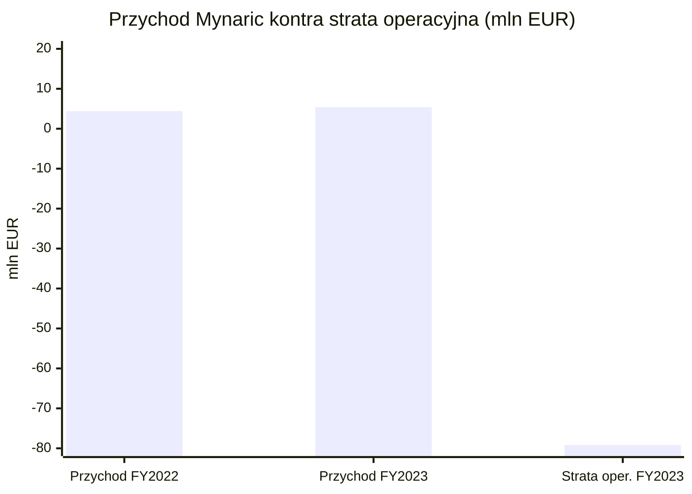
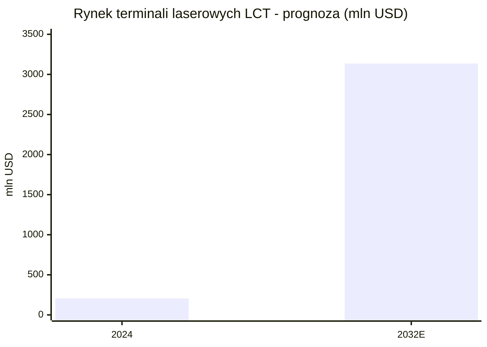
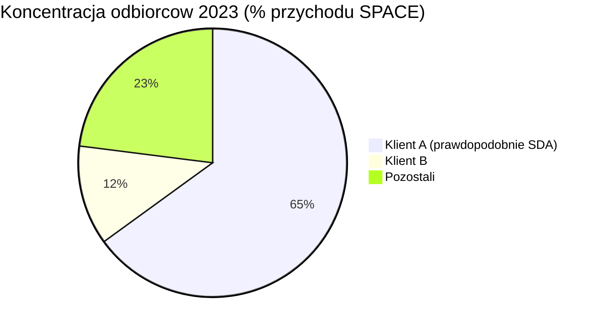

# Mynaric (MYNA)

<!-- spolki:temat:lacznosc-optyczne-isl-downlink-i-latencja:start -->
## W kontekscie: Łączność: optyczne ISL, downlink i latencja

**Czym jest spółka.** Mynaric AG to niemiecka spółka akcyjna (AG) założona w 2009 r. przez byłych naukowców niemieckiej agencji kosmicznej DLR, była notowana do czerwca 2025 r. jednocześnie na Nasdaq jako MYNA oraz we Frankfurcie jako M0YN (po restrukturyzacji StaRUG delisted). To ekspozycja europejska na temat, choć większość przychodów i kontraktów ma korzenie amerykańskie. Mynaric jest dostawcą czystej gry (pure-play) w jednej, wąskiej niszy: produkuje **terminale laserowe** rodziny CONDOR (kosmos) oraz HAWK (lotnictwo/grunt), czyli fizyczne urządzenia, które realizują [[_slownik#OISL|OISL]] - optyczne łącza międzysatelitarne - oraz [[_slownik#downlink|downlink]] optyczny z orbity na Ziemię. Spółka nie buduje satelitów ani centrów danych; dostarcza warstwę transmisji, dzięki której konstelacje na [[_slownik#LEO|LEO]] (w tym potencjalne "orbitalne centra danych") mogą wymieniać dane między sobą i z naziemnymi stacjami.

**Dlaczego to ważne dla tematu.** W debacie o orbitalnych centrach danych wąskim gardłem jest przepustowość połączeń: ile danych konstelacja zdoła przesłać między węzłami i sprowadzić na Ziemię. Dla ISL o bardzo wysokiej przepustowości laser ma przewagę szerokości pasma i kierunkowości nad łączami radiowymi (RF), dlatego rolę magistrali coraz częściej przejmuje laser. Terminal CONDOR Mk3 oferuje przepustowość na łącze od 313 Mbps do 2,5 Gbps w zależności od konfiguracji (wartość 10 Gbps to roadmapa, nie obecna specyfikacja) i zasięg ponad 6 500 km (SatNow / Mynaric product page, specyfikacja produktowa). To dokładnie wątek rozwijany w [[07 - lacznosc-optyczne-isl-downlink-i-latencja#Optyczne łącza międzysatelitarne (laser ISL) i roadmapy Tbps]] - laserowy ISL jako budulec szkieletu konstelacji o przepustowości zmierzającej ku Tbps. Drugą nogą produktu jest stacja naziemna (Optical Ground Station / GATE) do downlinku optycznego, którą SDA wybrała do demonstracji w 2025 r. oraz program HydRON ESA (Annual Report 2023, s. 12). To z kolei materia z [[07 - lacznosc-optyczne-isl-downlink-i-latencja#Downlink do Ziemi: RF Ka/V band kontra optyczne stacje naziemne i wpływ chmur]].

**Pozycja w łańcuchu.** Mynaric był jedynym notowanym pure-play producentem terminali OISL (po delistingu pozostaje pure-play operacyjnie, ale nie jako walor giełdowy); konkurenci to albo dywizje koncernów (Tesat w Airbusie, SA Photonics w CACI), albo gracze zintegrowani pionowo, którzy terminali nie sprzedają na zewnątrz (SpaceX/Starlink). Ta substytucja własnymi terminałami przez wielkie konstelacje to bezpośrednio teza z [[07 - lacznosc-optyczne-isl-downlink-i-latencja#Weryfikacja tezy "Starlink nie szerokopasmowy" (mylenie terminala last-mile z backbone ISL)]] - Starlink ma masowo wdrożone laserowe ISL, ale jako rozwiązanie zamknięte.

> **Dla inwestora:** Mynaric to nie operator danych, lecz dostawca "rur światłowodowych w kosmosie". Jego los jest funkcją tego, czy laserowy backbone konstelacji stanie się standardem - oraz czy spółka zdoła go produkować masowo i tanio, zanim zrobią to sami operatorzy.
<!-- spolki:temat:lacznosc-optyczne-isl-downlink-i-latencja:end -->

<!-- spolki:grafiki:start -->
## Materiały spółki

> Grafiki z materiałów spółki / IR (prawa właściciela, użycie redakcyjne). Pełny rejestr: `Spolki/assets/_licencje.json`.

*1 |  | Strona produktowa Mynaric (products/space) | Render / zdjęcie terminala CONDOR Mk3 w konfiguracji satelitarnej | JPG. Źródło: mynaric.com; licencja: materiały spółki / IR - prawa właściciela, użycie redakcyjne.*

*2 |  | Strona produktowa Mynaric | Porównanie wizualne terminala CONDOR Mk3 | JPG. Źródło: mynaric.com; licencja: materiały spółki / IR - prawa właściciela, użycie redakcyjne.*

*3 |  | Strona produktowa Mynaric | Porównanie wizualne terminala CONDOR Mk2 | JPG. Źródło: mynaric.com; licencja: materiały spółki / IR - prawa właściciela, użycie redakcyjne.*

<!-- spolki:grafiki:end -->

<!-- spolki:ekspozycja:start -->
## Ekspozycja na temat w liczbach

**Czysta ekspozycja, ale mikroskopijna skala.** Optyczna łączność satelitarna to nie linia poboczna, lecz całość biznesu Mynaric. W ostatnim pełnym, zaudytowanym roku obrotowym (FY2023, zakończonym 31 grudnia 2023 r.) **100% raportowanego przychodu pochodziło z segmentu SPACE**, obejmującego terminale kosmiczne CONDOR i naziemne stacje optyczne; segment lotniczy AIR (terminal HAWK) wygenerował 0 EUR przychodu (Annual Report 2023, s. 14). Rok wcześniej (2022) SPACE odpowiadał za 68,7% sprzedaży (3,038 mln EUR), a AIR za 31,3% (1,384 mln EUR). Sam segment SPACE urósł rok do roku o **+77,4%** (z 3,038 do 5,390 mln EUR) (Annual Report 2023, s. 14, 17).

Problem nie polega na czystości ekspozycji, lecz na jej rozmiarze: cały przychód FY2023 to zaledwie **5,390 mln EUR** (+21,9% r/r wobec 4,422 mln EUR w 2022), przy stracie operacyjnej **(79,163) mln EUR** i stracie netto **(93,528) mln EUR** (Annual Report 2023, s. 14, 16). Marża operacyjna wynosi ok. **-1 469%** (obliczenie własne: -79,163 / 5,390, na danych Annual Report 2023); marża brutto nie jest ujawniana przez spółkę (NIE UJAWNIONA). To spółka na bardzo wczesnym etapie: przychód mniejszy niż roczny koszt materiałów (16,792 mln EUR, +8,7% r/r), przy 301 etatach średniorocznie (Annual Report 2023, s. 15).

*Rys. - Skala przychodu (5,4 mln EUR) wobec straty operacyjnej (79 mln EUR) w FY2023. Dane: Annual Report 2023.*

**Backlog kontra realizacja - rozjazd.** Wartość niespełnionych zobowiązań kontraktowych (RPO, w ujęciu [[_slownik#backlog|backlog]] wartościowym) wyniosła na koniec 2023 r. **204,997 mln EUR (+183% r/r** wobec 72,455 mln EUR w 2022), z czego 101,499 mln EUR miało zostać rozpoznane w ciągu 12 miesięcy (Annual Report 2023, s. 18). Backlog liczony w sztukach terminali na 31 grudnia 2024 r. to **787 szt.** (Mynaric IR, 3 stycznia 2025) - obniżone z wcześniejszego przedziału 800-1 000 szt. Mimo bogatego portfela zamówień realizacja gwałtownie się rozjechała: prognoza przychodu 2024 spadła z pierwotnych **50-70 mln EUR** (czerwiec 2024) przez **16-24 mln EUR** (20 sierpnia 2024) do **14,1 mln EUR** (Mynaric IR, 3 stycznia 2025), przy stracie operacyjnej 2024 w przedziale **(55)-(50) mln EUR**. Wartość 14,1 mln EUR to najnowsza dostępna prognoza (guidance z 3 stycznia 2025), a nie audytowany przychód FY2024 - raport roczny 2024 nie został opublikowany z powodu restrukturyzacji (NIE UJAWNIONE). To spadek prognozy przychodu o ok. 65-72% w ciągu pół roku.

> **Dla inwestora:** ekspozycja na temat jest tu maksymalna (ok. 100% optyki), ale to obosieczne - nie ma drugiej nogi, która łagodziłaby ryzyko rampingu produkcji. Rozjazd "backlog 205 mln EUR kontra przychód 5,4 mln EUR" pokazuje, że problemem nie jest popyt, lecz zdolność dostarczenia.
<!-- spolki:ekspozycja:end -->

<!-- spolki:umowy:start -->
## Kluczowe umowy/wdrozenia - co znacza

Portfel kontraktów Mynaric jest mocno zorientowany na amerykański program obronny [[_slownik#SDA|SDA]] (Space Development Agency), budujący proliferowaną konstelację PWSA na [[_slownik#LEO|LEO]]. To źródło zarówno przewagi (heritage, zgodność ze standardem SDA OCT), jak i ryzyka koncentracji.

- **Northrop Grumman - SDA Tranche 2 Transport Layer-Beta:** ok. 25 mln USD, ogłoszony listopad 2023, dostawy 2024-2026 (Annual Report 2023, s. 12).
- **Northrop Grumman - SDA Tranche 2 Transport Layer-Alpha:** ok. 33 mln USD, grudzień 2023, dostawy 2024-2026 (Annual Report 2023, s. 12).
- **RTX / Raytheon - SDA Tranche 1 Tracking Layer:** 21 szt. CONDOR Mk3, sierpień 2023, dostawy w 2024 (Potomac Officers Club, 23 sierpnia 2023).
- **Rocket Lab - SDA Tranche 2 Transport Layer:** ok. 15 mln USD, maj 2024 (selekcja podwykonawców ogłoszona 7 maja 2024), dostawy 2025-2026, integracja z platformą Pioneer (Rocket Lab, 7 maja 2024; Investing.com, 20 czerwca 2024).
- **Loft Federal - SDA NExT (Experimental Testbed):** wartość NIE UJAWNIONA, CONDOR Mk3, dostawy głównie H1 2024 (Annual Report 2023, s. 12).
- **York Space Systems - SDA Tranche 1 Transport Layer:** wartość NIE UJAWNIONA, klient w backlogu (/ Mynaric preliminary results, 20 czerwca 2024; Satellite Today, 20 sierpnia 2024).
- **Nieujawniony klient USA:** 24 mln USD, styczeń 2023, CONDOR Mk3 (Annual Report 2023, s. 12).
- **Nieujawniony klient USA (powtarzający), ok. 30 mln USD,** listopad 2023, CONDOR Mk3 (Annual Report 2023, s. 12).
- **Nieujawniony klient USA (istniejący), ok. 6 mln USD,** listopad 2023, CONDOR Mk3 - osobny kontrakt ogłoszony tego samego miesiąca (Annual Report 2023, s. 12).
- **SpaceLink - CONDOR Mk3 (kontrakt zakończony/niewykonalny):** pierwsza partia + opcje do 20 szt., wrzesień 2021, komercyjny klient konstelacji MEO/LEO; SpaceLink zakończył działalność w 2022 r. i naruszył płatności, co zmusiło Mynaric do odpisu ok. 1,5 mln EUR na linię MEO - kontrakt nie jest aktywnym elementem portfela (PRNewswire, 9 września 2021; Kratos / Constellations, 2022).
- **DARPA Space-BACN (Faza 2)** oraz **ESA HydRON Element 2/3:** wartości NIE UJAWNIONE; Element 3 z datą marzec 2026 (SpaceDaily, 4 kwietnia 2024; ESA CSC, 4 marca 2026).

Heritage lotny pozostaje słabo udokumentowany twardą liczbą: spółka **nie podaje audytowanej liczby terminali na orbicie**. CEO na konferencji 20 czerwca 2024 r. stwierdził jedynie, że pierwsze dostawy CONDOR Mk3 ruszyły pod koniec Q1 2024, a wcześniejsze generacje (Mk1/Mk2) służyły w demonstracjach DARPA Blackjack i programach Telesat (FY2023 earnings call transcript; Pareto Securities, lipiec 2021). Liczba "flight-proven" jednostek to NIE UJAWNIONE.

> **Dla inwestora:** kontrakty SDA są dowodem popytu i zgodności z wymaganiami integratorów (Northrop, RTX, Rocket Lab) oraz ze standardem OCT, ale nie dowodem sprawnej produkcji seryjnej. Ale ich realizacja rozkłada się na lata 2024-2026, a opóźnienia programów rządowych przesuwają moment rozpoznania przychodu, co bezpośrednio uderza w cash flow spółki bez bufora gotówki.
<!-- spolki:umowy:end -->

<!-- spolki:pozycja:start -->
## Pozycja rynkowa i udzialy

**Lider w wąsko zdefiniowanej niszy rządowej.** Mynaric konsekwentnie pozycjonuje się jako lider udziału w terminalach optycznych zamawianych przez SDA. CEO (Mustafa Veziroglu) na konferencji wynikowej stwierdził: "Within the SDA, we estimate we have the largest market share of optical terminals" (FY2023 earnings call transcript, 20 czerwca 2024). Raport roczny doprecyzowuje, że ocena ta opiera się na "publicznie znanych zamówieniach SDA w przeliczeniu na liczbę terminali do dostarczenia" (Annual Report 2023, s. 14). Szersze, ale bardziej miękkie stwierdzenie z podsumowania konferencji Jefferies mówi o "ponad 50% udziału w bieżących rządowych wdrożeniach terminali satelitarnych" (Quartr / Jefferies Virtual Space Summit, 25 czerwca 2024) - traktować orientacyjnie, bo to summary, nie raport.

**Flagowy produkt - CONDOR Mk3.** Terminal do LEO zaprojektowany pod produkcję seryjną: przepustowość 313 Mbps do 2,5 Gbps (docelowo do 10 Gbps), zasięg ponad 6 500 km, apertura 80 mm, moc nadawania 4 W (end-of-life), zgodność ze standardem SDA OCT Tranche 0/1 (SatNow; Mynaric product page). To produkt rozwijający bezpośrednio roadmapę z [[07 - lacznosc-optyczne-isl-downlink-i-latencja#Optyczne łącza międzysatelitarne (laser ISL) i roadmapy Tbps]].

**Wielkość rynku (szacunki analityków, WTÓRNE - rozjazd metodologiczny).** Rynek terminali laserowych (LCT) szacowano na 206 mln USD w 2024 r. z prognozą 3 135 mln USD w 2032 r. (CAGR 48,7%, Grand Research Store, 2024). Szerszy rynek optycznej komunikacji satelitarnej to 620 mln USD w 2025 r. z prognozą 1,56 mld USD w 2030 r. (CAGR 20,4%, MarketsandMarkets, 2025) lub - w innej definicji - 2,93 mld USD w 2024 r. z prognozą 12,33 mld USD w 2033 r. (CAGR 13,7%, SkyQuest, 2024). Top-3 producentów LCT ma ponad 28% udziału w rynku według wartości (definicja udziału - przychodowy, globalny rynek LCT, rok bazowy 2024; nie wskazano, czy Mynaric jest w tej trójce) (Grand Research Store, 2024).

*Rys. - Prognozowany wzrost rynku LCT (CAGR 48,7%). Dane: Grand Research Store, 2024 (szacunek analityczny).*

> **Dla inwestora:** Mynaric jest liderem w bardzo wąskiej kategorii (terminale optyczne SDA), a nie w szerokim rynku komunikacji satelitarnej. Rozjazd szacunków rynku (od 0,2 mld do prawie 3 mld USD zależnie od definicji) oznacza, że "lider" trzeba czytać jakościowo - to pierwszeństwo w niszy, która sama dopiero powstaje.
<!-- spolki:pozycja:end -->

<!-- spolki:konkurencja:start -->
## Mechanika konkurencji - na osiach

Mynaric konkuruje na trzech głównych osiach (częściowo nakładających się): heritage/certyfikacja instytucjonalna, skala i koszt produkcji seryjnej oraz substytucja przez integrację pionową dużych konstelacji.

| Konkurent | Status | Oś konkurencji | Liczby / komentarz |
|---|---|---|---|
| **TESAT-Spacecom** (Airbus) | w grupie notowanej | heritage, certyfikacja ESA/EUMETSAT | doświadczony dostawca LCT dla GEO i misji instytucjonalnych; mniej nastawiony na masową produkcję LEO (MarketsandMarkets) |
| **SA Photonics (CACI International)** | notowany (CACI) | segment rządowy USA, integracja obronna | przejęty przez CACI; bezpośredni rywal w SDA (Quartr) |
| **SpaceX (Starlink)** | prywatny | skala, cena, integracja pionowa | największy operator OISL; produkuje terminale na własny użytek i NIE sprzedaje ich zewnętrznie - główna groźba substytucyjna (MarketsandMarkets / Quartr) |
| **L3Harris** | notowany | heritage, kontrakty obronne | oferuje własne/partnerowane terminale; nabył 7,2% udziału w Mynaric za ok. 11,2 mln EUR (lipiec 2022) (Janes, 12 lipca 2022) |
| **Thales Alenia Space** | notowany (Thales) | systemy całościowe, ESA | profilowany jako lider rynku optycznej komunikacji satelitarnej (MarketsandMarkets) |
| **Ball / BAE / Northrop / General Atomics** | notowani / dostawcy rządowi | heritage, integracja platform | własne lub partnerowane terminale optyczne (raporty rynkowe) |
| **Skyloom, BridgeComm, Space Micro, ATLAS** | prywatni / mniejsi | cena, nisza, time-to-market | startupy / SME w LCT i stacjach naziemnych (MarketsandMarkets) |
| **Mitsubishi Electric / NEC / Sony Space Comms** | notowani (Japonia) | wydajność, programy azjatyckie | JAXA demonstrowała OISL 1,8 Gbps w październiku 2024 (Knowledge Sourcing) |

**Oś 1 - heritage kontra masowa produkcja.** Tesat i Thales mają głębszy heritage instytucjonalny (GEO, ESA), ale są mniej nastawione na seryjną produkcję terminali LEO. Tu Mynaric próbuje wygrać skalą: nowa fabryka w Monachium o powierzchni ok. 120 000 stóp kwadratowych, z deklarowaną w analizach zdolnością do 2 000 szt./rok (/ FY2023 earnings call transcript, s. 3; Quartr). Problem w tym, że deklarowana zdolność rozjeżdża się z realizacją (patrz ryzyka).

**Oś 2 - integracja pionowa (substytucja).** Najpoważniejszą groźbą nie jest inny dostawca, lecz to, że najwięksi operatorzy konstelacji budują terminale sami. SpaceX wdraża własne laserowe ISL w Starlink na masową skalę i nie sprzedaje ich na rynku. To dokładnie zagadnienie z [[07 - lacznosc-optyczne-isl-downlink-i-latencja#Weryfikacja tezy "Starlink nie szerokopasmowy" (mylenie terminala last-mile z backbone ISL)]] - skala własnej produkcji największego gracza wyznacza sufit dostępnego rynku dla niezależnych dostawców.

**Oś 3 - bariery regulacyjne.** Niemiecki zakaz eksportu terminali do Chin (2020) ogranicza konkurencję ze strony chińskich graczy, ale jednocześnie zawęża bazę klientów Mynaric (Annual Report 2021, ryzyko eksportowe).

> **Dla inwestora:** w niszy LCT przewaga Mynaric (jedyny pure-play, zgodność z SDA OCT, fabryka pod serię) jest realna wobec dywizji koncernów, ale krucha wobec integracji pionowej - jeśli operacja "zrób sam" stanie się normą dla dużych konstelacji, dostępny rynek dla niezależnego dostawcy się kurczy niezależnie od jakości produktu.
<!-- spolki:konkurencja:end -->

<!-- spolki:przekroj:start -->
## Koncentracja odbiorcow i ryzyka z mechanizmem

**Skrajna koncentracja klientów.** W 2023 r. jeden anonimizowany Klient A odpowiadał za **65% przychodu** segmentu SPACE (z 0% rok wcześniej), Klient B za 12% (z 1%), a pozostali za 23% (Annual Report 2023, s. 18). Klient A to najprawdopodobniej kontrakt rządowy / SDA.

*Rys. - Jeden klient daje 65% przychodu. Dane: Annual Report 2023, s. 18.*

To prowadzi do mechanizmów ryzyka, które w przypadku Mynaric nie były teoretyczne - zmaterializowały się w upadek korporacyjny:

- **Koncentracja klientów.** Utrata lub przesunięcie jednego kontraktu SDA mogłaby obniżyć przychód o ponad połowę i zmniejszyć backlog (Annual Report 2023, s. 18). Mechanizm: brak dywersyfikacji = brak amortyzatora.
- **Single-source na komponentach.** Spółka pozyskiwała część krytycznych komponentów od jednego dostawcy; w 2024 r. ich niedobory opóźniły dostawy CONDOR Mk3 i były głównym powodem obniżenia prognozy przychodu 2024 o ok. 65% (z 50-70 do 14,1 mln EUR); ok. 2,6 mln EUR przychodu przesunięto z Q4 2024 na Q1 2025 (Annual Report 2023, ryzyka; Mynaric IR, 3 stycznia 2025; Satellite Today, 20 sierpnia 2024). Mechanizm: brak komponentu zatrzymuje całą linię.
- **Niska wydajność produkcji (yields).** "Lower than expected production yields" CONDOR Mk3 obniżyły realizację backlogu i utrzymały stratę operacyjną na poziomie 50-55 mln EUR (Mynaric IR, 20 sierpnia 2024). Mechanizm: produkt sprzedany, ale niewytworzony, to przychód odroczony i koszt poniesiony.
- **Płynność i finansowanie.** Gotówka była niestabilna: 23,989 mln EUR na 31 grudnia 2023, 2,5 mln EUR na 17 maja 2024 i 6,3 mln EUR na 16 sierpnia 2024 (odbicie po dokapitalizowaniu), przy pożyczkach 68,247 mln EUR na koniec 2023 r. (Annual Report 2023; Satellite Today, 20 sierpnia 2024). Mechanizm: spółka deficytowa, która spala gotówkę przy przychodzie 5 mln EUR i stracie 79 mln EUR, jest skazana na ciągłe dokapitalizowanie.
- **Materializacja - delisting i wyzerowanie akcjonariuszy.** Restrukturyzacja StaRUG stała się prawnie wiążąca 25 czerwca 2025 r.: anulowano wszystkie dotychczasowe akcje (delisting z Nasdaq i Frankfurtu), wierzyciele przejęli 100% spółki, a 105,5 mln USD zabezpieczonego długu zamieniono na kapitał, dodając 50 mln EUR nowego finansowania od byłych wierzycieli (Candlewood Partners, 10 czerwca 2025). 11 marca 2025 r. Rocket Lab ogłosił niewiążący zamiar przejęcia Mynaric za ok. 75 mln USD + earnout do 75 mln USD, warunkowany zakończeniem restrukturyzacji (Rocket Lab, 11 marca 2025); transakcję ostatecznie zamknięto 14 kwietnia 2026 r. za ok. 155,3 mln USD (gotówka + ok. 2,3 mln akcji RKLB), czyli powyżej pierwotnie uzgodnionej kwoty (Satellite Today, 14 kwietnia 2026). Mechanizm: wartość dla wcześniejszych akcjonariuszy spadła do zera; walor "MYNA" w dawnym sensie przestał istnieć.
- **Ryzyko adopcji rynku.** Rynek LCT jest wciąż "nascent", bez historycznych benchmarków; komercyjne konstelacje mogą nie pozyskać finansowania (Annual Report 2023, ryzyka). Mechanizm: jeśli laser pozostanie niszą, popyt na terminale będzie znacznie niższy od zakładanego.
- **Długi cykl sprzedaży.** Od zamówienia do rozpoznania przychodu często ponad 12 miesięcy; RPO rozpoznawane przez 12-24+ miesięcy (Annual Report 2023, s. 13, 18). Mechanizm: niska przewidywalność cash flow przy braku bufora.

Wątek bilansu transferu danych i tego, ile przetwarzania musi pozostać na orbicie, rozwija [[07 - lacznosc-optyczne-isl-downlink-i-latencja#Bilans transferu: ile danych treningowych w górę/dół vs przetwarzanie lokalne]] - to on określa, jak duży będzie docelowy popyt na terminale downlinku.

> **Dla inwestora:** historia Mynaric to studium przypadku, jak czysta ekspozycja na wczesny temat (ok. 100% optyki) w połączeniu z koncentracją klientów, single-source i brakiem gotówki prowadzi do utraty wartości dla akcjonariuszy mimo rosnącego backlogu. Ekspozycja na temat była maksymalna; problemem był mechanizm finansowania ramp-upu.
<!-- spolki:przekroj:end -->

<!-- network:peers:start -->
## Powiązane spółki

> Inne notowane spółki z raportu dzielące z tą firmą co najmniej jeden wątek tematyczny (wspólny rynek, technologia lub łańcuch wartości).

- [[Spolki/airbus|Airbus SE (AIR)]] - PV (Sparkwing), optyka (Tesat), busy, serwis (EU)  
  *Wspólne wątki: Łączność optyczna.*
- [[Spolki/bae-systems|BAE Systems plc (BA)]] - Rad-hard procesory (RAD750/RAD5545); optyka (Ball)  
  *Wspólne wątki: Łączność optyczna.*
- [[Spolki/l3harris|L3Harris Technologies, Inc. (LHX)]] - Terminale laserowe dla obronności (SDA/NRO)  
  *Wspólne wątki: Łączność optyczna.*
<!-- network:peers:end -->

<!-- spolki:slownik:start -->
## Slowniczek

Hasła ogólne (linkowane do wspólnego słownika vaultu): [[_slownik#OISL|OISL]], [[_slownik#downlink|downlink]], [[_slownik#LEO|LEO]], [[_slownik#SDA|SDA]], [[_slownik#backlog|backlog]].

Hasła lokalne (specyficzne dla Mynaric):

- **CONDOR** - rodzina terminali laserowych Mynaric do zastosowań kosmicznych (LEO/MEO); Mk3 to generacja pod produkcję seryjną.
- **HAWK** - terminal laserowy Mynaric do zastosowań lotniczych i naziemnych (air-to-air, air-to-ground, ground-to-ground); linia AIR strategicznie wstrzymana.
- **GATE / Optical Ground Station** - naziemna stacja odbierająca sygnał laserowy z satelitów (downlink optyczny).
- **SDA OCT** - standard Optical Communications Terminal definiowany przez Space Development Agency, którego zgodność jest warunkiem udziału w programie PWSA.
- **StaRUG** - niemieckie postępowanie restrukturyzacyjne (German Corporate Stabilization and Restructuring Act), w ramach którego Mynaric zamieniło dług na kapitał i usunęło dotychczasowych akcjonariuszy.
- **RPO** - Remaining Performance Obligations; wartość zakontraktowanych, jeszcze niewykonanych zobowiązań (tu raportowana jako backlog wartościowy).

Proponowane nowe hasła do słownika globalnego: SDA OCT, StaRUG (oba specyficzne, ale powtarzalne w temacie łączności optycznej / spółek niemieckich).
<!-- spolki:slownik:end -->

<!-- spolki:zrodla:start -->

<!-- spolki:zrodla:end -->
