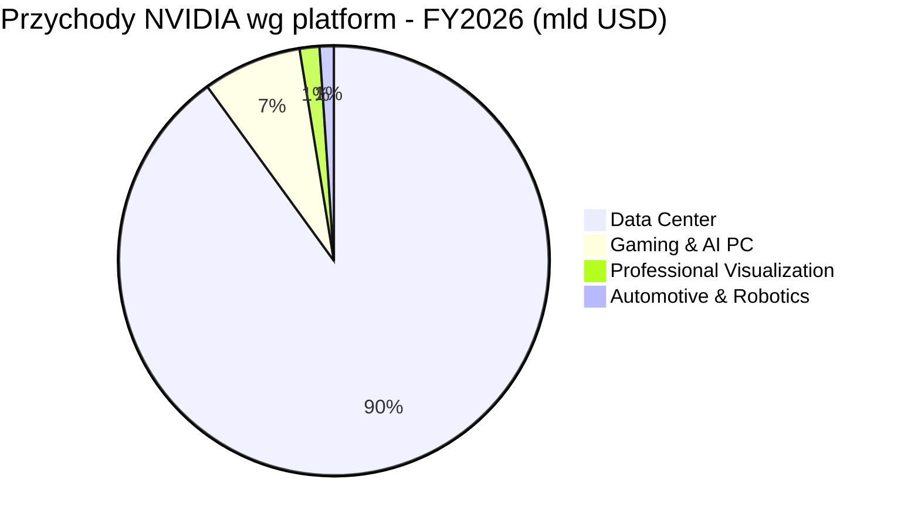

# NVIDIA (NVDA)

<!-- spolki:temat:promieniowanie-i-elektronika-rad-hard-vs-cots:start -->
## W kontekscie: Promieniowanie i elektronika rad-hard vs COTS

NVIDIA nie produkuje ani jednego układu odpornego na promieniowanie. Spółka wprost nie oferuje procesorów rad-hard, odpornych na promieniowanie FPGA/MCU ani pamięci klasy space-grade, a jej udział w segmencie "rad-hard electronics" wynosi zero (🔵 NVIDIA Space Computing, 16.03.2026). Mimo to stała się de facto standardem ładunku obliczeniowego na orbicie - operatorzy konstelacji sięgają nie po dedykowaną elektronikę kosmiczną, lecz po komercyjne, dostępne z półki (COTS) akceleratory AI, te same które napędzają naziemne centra danych. Powód jest prozaiczny: rad-hardowy procesor jest o kilka rzędów wielkości słabszy wydajnościowo od współczesnego GPU, a integratorzy chcą przenieść na orbitę ten sam, dojrzały stack CUDA zamiast budować go od zera (🔵 NVIDIA Space Computing, 16.03.2026; 🟠 Kepler Communications, 16.03.2026). To jest właśnie napięcie, które rozwija wątek [[06 - promieniowanie-i-elektronika-rad-hard-vs-cots#COTS kontra rad-hard: koszty, opóźnienie generacyjne, wydajność]].

Portfolio NVIDIA wykorzystywane on-orbit przez integratorów jest komercyjne, nie zakwalifikowane do kosmosu. Kompaktowy moduł Jetson Orin trafia do satelitów, payloadów i CubeSatów; platforma edge IGX Thor adresuje zastosowania krytyczne (secure boot, bezpieczeństwo funkcjonalne); do przetwarzania na orbicie i na ziemi dochodzą układy klasy data-center pokroju H100 i nowszych Blackwellów oraz zapowiedziany w marcu 2026 moduł Space-1 Vera Rubin do inferencji AI na orbicie - z deklaracją do 25x większej mocy obliczeniowej AI niż H100, ale z dostępnością określoną jedynie jako "później" (🔵 NVIDIA Space Computing, 16.03.2026). Pierwsze realne wdrożenie pokazuje skalę zjawiska: Kepler Communications umieścił 40 modułów Jetson Orin na 10 satelitach (🟠 Kepler Communications, 16.03.2026) - liczba wielkościowo pomijalna przy rocznych przychodach spółki.

Mechanizm ryzyka technicznego jest tu wprost finansowy. Skoro moduły są COTS, a nie rad-hard, w niskiej orbicie (LEO) narażone są na SEU (pojedyncze przerzuty bitów), TID (skumulowaną dawkę jonizującą) oraz latch-up, a próżnia odbiera konwekcję jako drogę odprowadzania ciepła. To wymusza ekranowanie, redundancję i kwalifikację misyjną, które podnoszą masę, koszt i czas wdrożenia (🔵 NVIDIA Space Computing, 16.03.2026; 🟠 Kepler, 16.03.2026; 🟠 AMD Space). Konsekwencje dla żywotności sprzętu w warunkach skumulowanej dawki rozwija [[06 - promieniowanie-i-elektronika-rad-hard-vs-cots#Żywotność elektroniki vs dawka skumulowana i MTBF]], a samo środowisko zagrożeń opisuje [[06 - promieniowanie-i-elektronika-rad-hard-vs-cots#Środowisko radiacyjne: czym właściwie grozi orbita]].

> **Dla inwestora:** NVIDIA wchodzi na orbitę z elektroniką niezaprojektowaną do promieniowania - to nie jest linia rad-hard, lecz transfer komercyjnego stacku AI. Ekspozycja kosmiczna jest dziś marginalna i nie jest osobno raportowana.
<!-- spolki:temat:promieniowanie-i-elektronika-rad-hard-vs-cots:end -->

<!-- spolki:grafiki:start -->
## Materiały spółki

> Grafiki z materiałów spółki / IR (prawa właściciela, użycie redakcyjne). Pełny rejestr: `Spolki/assets/_licencje.json`.

*H100 Tensor Core GPU (produktowy og-image). Źródło: www.nvidia.com; licencja: materiały spółki / IR - prawa właściciela, użycie redakcyjne.*

*Jetson Orin (produktowy og-image). Źródło: www.nvidia.com; licencja: materiały spółki / IR - prawa właściciela, użycie redakcyjne.*

*NVIDIA Space Computing / orbital data centers (grafika z komunikatu). Źródło: iprsoftwaremedia.com; licencja: materiały spółki / IR - prawa właściciela, użycie redakcyjne.*

<!-- spolki:grafiki:end -->

<!-- spolki:temat:gracze-i-projekty:start -->
## W kontekscie: Gracze i projekty

W krajobrazie projektów orbitalnego computingu NVIDIA występuje nie jako operator konstelacji, lecz jako dostawca ładunku obliczeniowego, którego sprzęt pojawia się w cudzych projektach. Najwyraźniej widać to u demonstratora StarCloud (dawniej Lumen Orbit), który uruchomił działający na orbicie układ oparty o NVIDIA H100, a roadmapa NVIDIA prowadzi przez Blackwelle (B200) ku modułowi Space-1 Vera Rubin (🔵 NVIDIA Space Computing, 16.03.2026). To pozycjonuje NVIDIA po stronie COTS w sporze architektonicznym z podejściem własnego krzemu - kontekst gracza StarCloud rozwija [[10 - gracze-i-projekty#StarCloud (dawniej Lumen Orbit) - działający demonstrator z NVIDIA H100]].

Kontrapunktem jest Google z Project Suncatcher, który zamiast COTS GPU stawia na własne TPU na orbicie, z partnerstwem Planet Labs i demonstracją zapowiadaną około 2027 roku - to przykład gracza, który omija ekosystem NVIDIA, projektując akcelerator pod własne potrzeby; wątek prowadzi [[10 - gracze-i-projekty#Google - Project Suncatcher (TPU na orbicie, partner Planet Labs, demo ~2027)]]. Po stronie integratorów sprzętu NVIDIA pozostaje natomiast standardem przyjmowanym przez kolejnych operatorów, co widać szerzej w przeglądzie [[10 - gracze-i-projekty#Mniejsi i sąsiedni gracze - cloud-OEM stack, GEO, Księżyc, Europa]].

> **Dla inwestora:** orbitalny computing jest dla NVIDIA opcją wzrostową, nie linią przychodów - spółka dostarcza komponenty do projektów innych podmiotów, a główny rywal architektoniczny (Google TPU) nie kupuje jej GPU.
<!-- spolki:temat:gracze-i-projekty:end -->

<!-- spolki:pozycja:start -->
## Pozycja rynkowa

Skala biznesu NVIDIA pokazuje, jak marginalna jest dziś orbita. W roku obrotowym FY2026 (zakończonym 25.01.2026) spółka wykazała przychód 215,9 mld USD (+65% r/r), zysk netto GAAP 120,1 mld USD i marżę brutto GAAP 71,1% (🔵 NVIDIA Q4 & FY2026 earnings, 25.02.2026). Sam Q4 FY2026 (zakończony 25.01.2026) przyniósł 68,1 mld USD przychodu (+73% r/r) (🔵 NVIDIA, 25.02.2026). Rdzeniem jest platforma Data Center: 193,7 mld USD (+68% r/r), czyli około 90% przychodów (🔵 NVIDIA, 25.02.2026). Pozostałe platformy to Gaming & AI PC 16,0 mld USD, Professional Visualization 3,2 mld USD oraz Automotive & Robotics 2,3 mld USD (🔵 NVIDIA, 25.02.2026).

Na tym tle sprzedaż "do kosmosu" jest praktycznie nieobserwowalna. NVIDIA nie wydziela przychodów z segmentu orbitalnego - mieszczą się one w Data Center, a konkretne wdrożenia rzędu 40 modułów Jetson Orin u Keplera są wielkościowo pomijalne przy 215,9 mld USD rocznych przychodów (🟠 Kepler, 16.03.2026; 🔵 NVIDIA, 25.02.2026). Udział orbity w sprzedaży należy więc traktować jako około 0% i NIE UJAWNIONE jako osobna pozycja. Przewaga NVIDIA jest natomiast jednoznaczna w warstwie wyżej: dominacja w akceleratorach AI i ekosystem CUDA czynią ją de facto standardem ładunku obliczeniowego, który operatorzy chcą przenieść na orbitę.

*Rys. - struktura przychodów NVIDIA wg platform rynkowych, FY2026. Orbita nie jest osobną pozycją (mieści się w Data Center). Dane: 🔵 NVIDIA Q4 & FY2026 earnings, 25.02.2026.*

Głównymi rywalami w niszy kosmicznego computingu są AMD/Xilinx z rad-tolerantnymi FPGA i SoC (np. Versal XQR, Kintex UltraScale+), tradycyjnie obecnymi w payloadach satelitarnych (🟠 AMD Space), oraz Hewlett Packard Enterprise z platformą Spaceborne Computer-2 na ISS (🟠 Emergen Research / HPE). Odrębną klasą konkurencji architektonicznej jest Google z własnym TPU (Project Suncatcher), który celuje w to samo zastosowanie z pominięciem GPU NVIDIA.
<!-- spolki:pozycja:end -->

<!-- spolki:przekroj:start -->
## Ryzyka

Pierwsze ryzyko jest techniczne i wprost wynika z natury COTS. Moduły NVIDIA nie są rad-hard, więc na orbicie narażone są na SEU, TID i latch-up, a brak konwekcji w próżni utrudnia chłodzenie - co wymusza ekranowanie, redundancję i kwalifikację misyjną podnoszące masę, koszt oraz czas wdrożenia (🔵 NVIDIA Space Computing, 16.03.2026; 🟠 AMD Space). Mechanizm finansowy: im więcej osłon i redundancji potrzeba, tym słabsza przewaga kosztowo-wydajnościowa COTS względem dedykowanej elektroniki, a żywotność sprzętu on-orbit pod skumulowaną dawką pozostaje otwartą zmienną.

Drugie ryzyko to regulacje eksportowe i koncentracja geopolityczna. Zaawansowane akceleratory AI są objęte amerykańskimi ograniczeniami eksportowymi - przypadek H20 do Chin kosztował 4,5 mld USD odpisu w Q1 FY2026 (🔵 NVIDIA Q1 FY2026). Rozszerzenie restrykcji na systemy kosmiczne lub utrata dostępu do zaawansowanych node'ów TSMC mogłyby zablokować dostawy dla konstelacji orbitalnych. Trzecim wymiarem jest konkurencja: AMD/Xilinx po stronie rad-tolerant FPGA oraz Google TPU jako alternatywna architektura akceleratora, która z definicji nie generuje przychodu dla NVIDIA.

> **Dla inwestora:** ekspozycja orbitalna jest dziś nieistotna dla przychodów, więc materializacja tych ryzyk w niszy kosmicznej nie zmienia wyniku spółki - znaczenie ma jedynie jako wczesny sygnał o adopcji COTS na orbicie i o granicach ekosystemu CUDA wobec własnego krzemu hyperscalerów.
<!-- spolki:przekroj:end -->

<!-- network:peers:start -->
## Powiązane spółki

> Inne notowane spółki z raportu dzielące z tą firmą co najmniej jeden wątek tematyczny (wspólny rynek, technologia lub łańcuch wartości).

- [[Spolki/amd|Advanced Micro Devices, Inc. (AMD)]] - Rad-tolerant FPGA/SoC (Versal/Xilinx) + GPU  
  *Wspólne wątki: Promieniowanie i elektronika.*
- [[Spolki/alphabet|Alphabet Inc. (GOOGL)]] - Project Suncatcher (TPU na orbicie)  
  *Wspólne wątki: Gracze i projekty.*
- [[Spolki/bae-systems|BAE Systems plc (BA)]] - Rad-hard procesory (RAD750/RAD5545); optyka (Ball)  
  *Wspólne wątki: Promieniowanie i elektronika.*
- [[Spolki/microchip|Microchip Technology Incorporated (MCHP)]] - Rad-hard/rad-tolerant FPGA (RTG4) i mikrokontrolery  
  *Wspólne wątki: Promieniowanie i elektronika.*
- [[Spolki/planet-labs|Planet Labs PBC (PL)]] - Partner Google Suncatcher (platformy/obrazowanie)  
  *Wspólne wątki: Gracze i projekty.*
- [[Spolki/rocket-lab|Rocket Lab Corporation (RKLB)]] - Launch (Electron/Neutron) + Space Systems: bus, ogniwa SolAero, komponenty  
  *Wspólne wątki: Gracze i projekty.*
- [[Spolki/voyager-technologies|Voyager Technologies, Inc. (VOYG)]] - Stacje kosmiczne (Starlab), systemy kosmiczne i obronne  
  *Wspólne wątki: Gracze i projekty.*
<!-- network:peers:end -->

<!-- spolki:zrodla:start -->

<!-- spolki:zrodla:end -->
