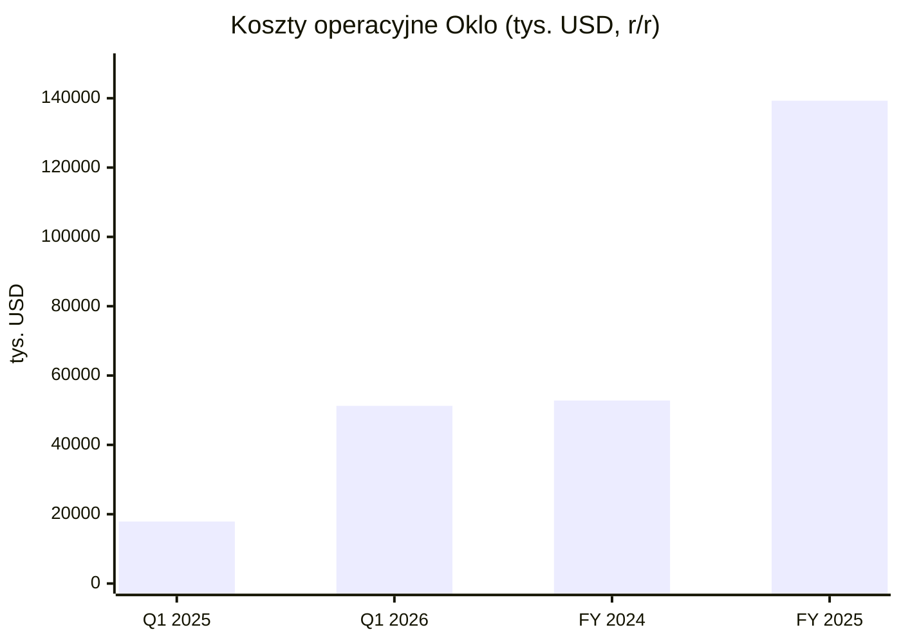
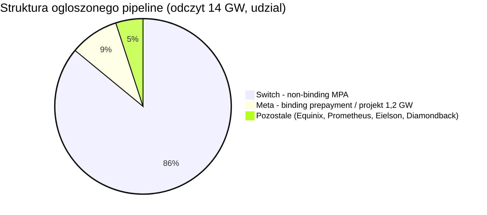
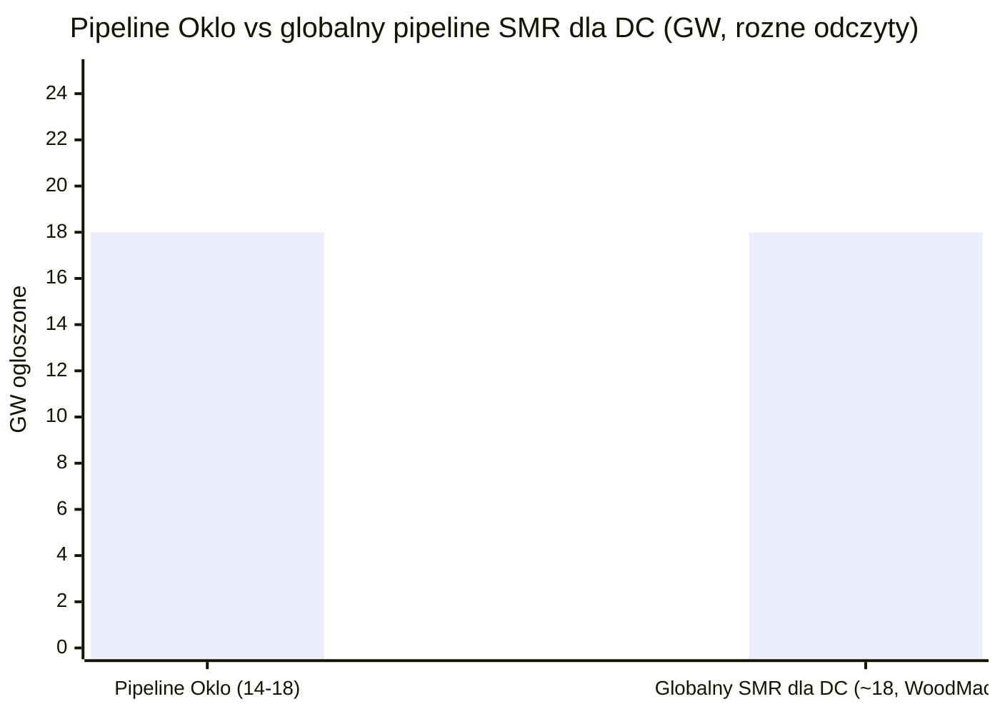
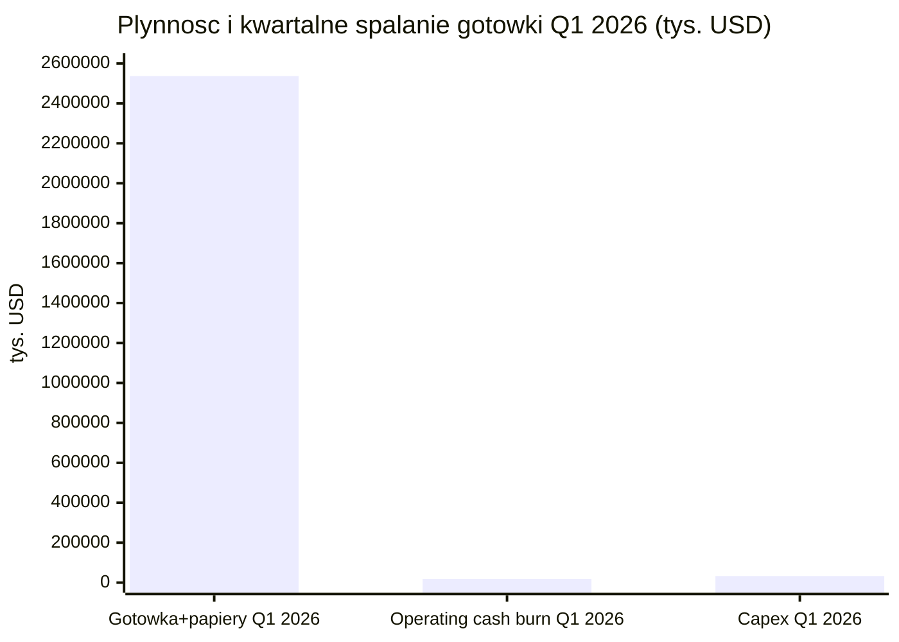

# Oklo (OKLO)

<!-- spolki:temat:naziemny-bottleneck-energetyczny-i-sieciowy:start -->
## W kontekscie: Naziemny bottleneck energetyczny i sieciowy

**Czym jest spółka.** Oklo to amerykańska spółka rozwijająca zaawansowane mikroreaktory jądrowe pod marką Aurora powerhouse. Aurora to szybki reaktor rozszczepieniowy (fast fission) na paliwie metalowym, chłodzony ciekłym sodem, o mocy 15-75 MWe, docelowo skalowany do 100 MWe i więcej (🔵 Oklo 10-K 2025, Item 1. Business). Konstrukcja czerpie z dziedzictwa reaktora doświadczalnego EBR-II, który w Idaho National Laboratory pracował przez 30 lat (1964-1994), produkował ~20 MWe i demonstrował recykling paliwa (🔵 Oklo 10-K 2025). W odróżnieniu od klasycznych dużych reaktorów wodnych Aurora ma zajmować zaledwie kilka akrów i wymagać przeładunku paliwa raz na dekadę lub rzadziej, co ma obniżać koszty eksploatacji i utrzymania (O&M - operation & maintenance); skala tej obniżki nie jest tu policzona (🔵 Oklo IR, strona produktu).

**Dlaczego to ważne dla centrów danych.** W naziemnym wyścigu o moc dla AI wąskim gardłem nie jest dziś sama cena energii, lecz dostępność stabilnej mocy podstawowej z pominięciem zatkanej sieci. Nowe przyłącze sieciowe w USA to dziś wieloletnie kolejki interkonekcyjne, a do tego wieloletnie czasy dostaw transformatorów i rozdzielnic - mechanikę tę rozwija [[12 - naziemny-bottleneck-energetyczny-i-sieciowy#Kolejki przyłączeniowe i ograniczenia sieci]] oraz [[12 - naziemny-bottleneck-energetyczny-i-sieciowy#Brak transformatorów i switchgear: lead times]]. W tej luce energetyka jądrowa wraca jako źródło [[_slownik#baseload|baseload]] - ciągłej, sterowalnej mocy podstawowej działającej niezależnie od pogody. Wątek powrotu do gazu i jądra oraz [[_slownik#SMR|SMR]] dla data center to bezpośrednio [[12 - naziemny-bottleneck-energetyczny-i-sieciowy#Energia: baseload, powrót do gazu/jądra, SMR dla DC]], a kompaktowy footprint Aurory odpowiada na ograniczenie z [[12 - naziemny-bottleneck-energetyczny-i-sieciowy#Ziemia, lokalizacja, czas budowy (permitting) jako bottleneck]].

**Model biznesowy jest tu kluczowy.** Oklo nie sprzedaje reaktorów - buduje je, posiada i obsługuje (build-own-operate), a klientowi sprzedaje wyłącznie energię i ciepło w modelu [[_slownik#PPA|PPA]] (power purchase agreement), tak jak robi to deweloper farmy wiatrowej (🔵 Oklo 10-K 2025, Item 1. Business). Klient nie ponosi [[_slownik#capex|capex]] z góry, a Oklo zatrzymuje aktywo i strumień przychodów na 20-40 lat. Docelowymi odbiorcami są data center AI i [[_slownik#hyperscaler|hyperscalery]], bazy wojskowe, przemysł, społeczności off-grid oraz utility (🔵 Oklo 10-K 2025).

> **Dla inwestora:** Oklo to spółka NOTOWANA (NYSE: OKLO), ale w pełni PRE-REWENUE - na koniec Q1 2026 (31 marca 2026) nie miała ani jednego skonstruowanego reaktora, ani jednej wiążącej umowy na dostawę energii (🔵 Oklo 10-K 2025, Risk Factors). Cała teza opiera się na przyszłej konwersji deklarowanego pipeline na realny prąd, a nie na bieżącej sprzedaży.
<!-- spolki:temat:naziemny-bottleneck-energetyczny-i-sieciowy:end -->

<!-- spolki:grafiki:start -->
## Materiały spółki

> Grafiki z materiałów spółki / IR (prawa właściciela, użycie redakcyjne). Pełny rejestr: `Spolki/assets/_licencje.json`.

*1 | ` | Oklo Inc. - strona produktu / IR (oklo.com/energy) | Rendering Aurora powerhouse - wizualizacja elektrowni (powerhouse product line, data center / community power) | PNG. Źródło: s203.q4cdn.com; licencja: materiały spółki / IR - prawa właściciela, użycie redakcyjne.*

*2 | ` | Oklo Inc. - press release „Oklo Breaks Ground on First Aurora Powerhouse” (wrzesień 2025) | Zdjęcie z uroczystości rozpoczęcia budowy pierwszej elektrowni Aurora-INL w Idaho National Laborator. Źródło: oklo.com; licencja: materiały spółki / IR - prawa właściciela, użycie redakcyjne.*

*4 | ` | Oklo Inc. - strona technologiczna (oklo.com/technology) | Wykres eksperymentu BOP-302R na reaktorze EBR-II - demonstruje bezpieczne zachowanie przy utracie chłodzenia | PNG. Źródło: s203.q4cdn.com; licencja: materiały spółki / IR - prawa właściciela, użycie redakcyjne.*

<!-- spolki:grafiki:end -->

<!-- spolki:ekspozycja:start -->
## Ekspozycja na temat w liczbach

**Spółka pre-rewenue - to trzeba powiedzieć wprost.** Oklo nie generuje żadnego przychodu komercyjnego. W rachunku wyników za Q1 2026 (okres zakończony 31 marca 2026) oraz za pełny FY 2025 (rok zakończony 31 grudnia 2025) nie ma w ogóle wiersza przychodów - są tylko koszty operacyjne (🔵 Oklo 10-Q Q1 2026 oraz 10-K 2025, Statements of Operations). Przychód ze sprzedaży energii i usług wynosi 0 USD (🔵 Oklo 10-Q Q1 2026). W efekcie pytanie "ile procent sprzedaży zależy od data center" jest formalnie NIE DOTYCZY / NIE UJAWNIONE - bo sprzedaży nie ma w ogóle (🔵 Oklo 10-K/10-Q).

**Mimo to data center to deklarowany rdzeń przyszłego modelu.** Większość ogłoszonego pipeline mocy dotyczy data center, głównie przez Switch i Meta, choć w portfelu są też odbiorcy spoza DC (Eielson, Diamondback, TVA) (🔵 Oklo 10-K 2025). To nie poboczna linia, lecz główny kanał przyszłej sprzedaży energii. Drugą nogą jest recykling paliwa i produkcja izotopów (Atomic Alchemy), wycenione w bilansie jako IPR&D na 27 500 tys. USD, również o zerowym przychodzie w FY 2025 (🔵 Oklo 10-K 2025).

**Skala kosztów szybko rośnie - to ekspozycja na fazę inwestycyjną.** Całkowite koszty operacyjne w Q1 2026 to 51 249 tys. USD wobec 17 874 tys. USD w Q1 2025 (+187% r/r), na co złożyły się R&D 27 049 tys. USD (+245% r/r) i G&A 24 200 tys. USD (+141% r/r) (🔵 Oklo 10-Q Q1 2026). Strata netto za Q1 2026 wyniosła (33 065) tys. USD wobec (9 810) tys. USD rok wcześniej, przy EPS (0,19) USD (🔵 Oklo 10-Q Q1 2026). W skali pełnego roku FY 2025 koszty operacyjne sięgnęły 139 294 tys. USD (+164% r/r), a strata netto (105 663) tys. USD przy EPS (0,72) USD (🔵 Oklo 10-K 2025).

*Rys. - Silny wzrost kosztów R&D i G&A w fazie przedkomercyjnej; spółka spala kapitał, nie generując przychodu. Dane: 🔵 Oklo 10-Q Q1 2026 i 10-K 2025.*

**Backlog i RPO formalnie nie istnieją.** Oklo nie raportuje [[_slownik#backlog|backlogu]] ani [[_slownik#RPO|RPO]], bo nie ma wiążących kontraktów generujących przychód - wszystkie umowy to LOI, MOU lub framework (🔵 Oklo 10-K/10-Q). Jako proxy spółka komunikuje pipeline klientów rzędu ~14-18 GW (~18 GW po doliczeniu non-binding umów na ~4 750 MW ogłoszonych w Q3 2025), w przeważającej części non-binding; starszy odczyt 14 GW jest wciąż cytowany w prasie (🟠 Oklo Q3 2025 presentation + Power Engineering / WNISR + prasa). Z tego ~12 GW przypada na jedną umowę ramową ze Switch, czyli ~67% pipeline przy odczycie 18 GW (~86% przy odczycie 14 GW) (🔵 Oklo press release + obliczenia).

> **Dla inwestora:** "~14-18 GW pipeline" i "0 USD przychodu" opisują tę samą spółkę - pierwsza liczba to deklarowany potencjał, druga to twarda rzeczywistość rachunku wyników. Konwersja non-binding LOI na wiążące [[_slownik#offtake|offtake]] PPA to centralna zmienna całej historii.
<!-- spolki:ekspozycja:end -->

<!-- spolki:umowy:start -->
## Kluczowe umowy/wdrozenia - co znacza

**Najważniejszy niuans: prawie wszystko jest jeszcze niewiążące.** Oklo sama pisze w 10-K 2025: "We have not yet constructed any powerhouses or entered into any binding power purchase agreement with any customer to operate a plant or deliver electricity or heat" (🔵 Oklo 10-K 2025, Risk Factors). Jedynym publicznie znanym elementem wiążącym po stronie energii jest binding prepayment z Meta (umowa z 9 stycznia 2026 wspierająca campus do 1,2 GW w Ohio), przy czym kwota przedpłaty nie została ujawniona (NIE UJAWNIONE) (🔵 Oklo press release, 9 stycznia 2026).

Mapa kluczowych umów (typ rozstrzyga o ich wartości):

- **Switch, Ltd. (grudzień 2024):** non-binding Master Power Agreement do 12 GW do 2044 r. To framework - poszczególne wiążące PPA mają być finalizowane po osiągnięciu kamieni milowych (🔵 Oklo 10-K 2025 + press release). Według Oklo największa ogłoszona umowa w historii corporate clean power, ale wciąż ramowa.
- **Meta Platforms (ogłoszenie 9 stycznia 2026):** umowa wspierająca campus do 1,2 GW na 206 akrach w Pike County, Ohio (teren dawniej należący do DOE), zawierająca mechanizm przedpłaty Meta za energię (binding prepayment na zakup paliwa i finansowanie wczesnej fazy projektu); kwota przedpłaty NIE UJAWNIONA (🔵 Oklo press release, 9 stycznia 2026). Pre-construction i charakteryzacja terenu mają ruszyć w 2026 r., pierwsza faza ma wejść online już w 2030 r., a pełne 1,2 GW celowane jest na 2034 r.; liczba reaktorów nie została oficjalnie podana ("multiple Aurora powerhouses") (🔵 Oklo press release, 9 stycznia 2026). To najtwardszy element po stronie energii - wiążąca przedpłata na rozwój projektu, choć jest to przedpłata na projekt, a nie wiążący offtake PPA na odbiór energii.
- **Equinix (LOI luty 2024):** non-binding LOI na 500 MW, potencjalnie 20-letni PPA, z prepayment 25 mln USD raportowanym w Q3 2024 (🔵 Oklo 10-K 2025, Exhibit 10.19; 🟠 kwota prepayment - prasa).
- **Diamondback E&P (2024/2025):** non-binding LOI na 50 MW (🔵 Oklo 10-K 2025 + prasa).
- **Prometheus Hyperscale (2024/2025):** non-binding LOI na 100 MW (🔵 Oklo 10-K 2025 + prasa).
- **Eielson Air Force Base (Notice of Intent to Award, czerwiec 2025):** mikroreaktor 5 MW, 30-letni firm-fixed-price PPA - Oklo jako "intended awardee" wyłoniony przez Defense Logistics Agency Energy w imieniu US Air Force/DoD; finalny kontrakt warunkowany licencją NRC, uruchomienie celowane wstępnie na ~2030 (wcześniejsza próba z 2023 r. została wstrzymana, to ponowne podejście) (🔵 Oklo press release, 11 czerwca 2025; 🟠 Air & Space Forces Magazine / World Nuclear News, czerwiec 2025).
- **Tennessee Valley Authority (2025):** wstępne rozmowy / MOU wokół recyklingu paliwa i potencjalnej sprzedaży energii (🔵 Oklo 10-K 2025).

**Po stronie łańcucha dostaw umowy są już wiążące i to ważny sygnał wykonawczy.** Oklo podpisała binding contract z Siemens Energy na system konwersji mocy (turbina parowa SST-600 + generator SGen-100A) dla Aurora-INL oraz Master Services Agreement z Kiewit Nuclear Solutions jako głównym wykonawcą budowlanym (🔵 Oklo press release, 2025). Doszła też współpraca technologiczna z Vertiv nad zintegrowanymi systemami zasilania i chłodzenia dla "AI factories" (🟠 prasa branżowa, lipiec 2025).

*Rys. - 86% deklarowanego pipeline to jedna umowa ramowa (Switch); część wiążąca to ułamek całości. Dane: 🔵 Oklo press release + obliczenia własne; 🟠 prasa.*

> **Dla inwestora:** różnica między [[_slownik#PPA|PPA]] wiążącym a LOI/MPA jest tu fundamentalna - 12 GW Switch to deklaracja intencji, a nie zobowiązanie do odbioru. Publicznie najmocniej zaawansowane projekty to ok. 1,205 GW (Meta 1,2 GW + Eielson 5 MW), ale i tu nie ma jeszcze wiążącego offtake PPA: Meta to przedpłata na projekt, Eielson to Notice of Intent to Award warunkowany licencją NRC; reszta to framework (🔵 Oklo press releases; 🟠 analiza prasowa).
<!-- spolki:umowy:end -->

<!-- spolki:pozycja:start -->
## Pozycja rynkowa i udzialy

**Formalnego udziału w sprzedaży brak - spółka nie ma przychodu.** Oklo nie raportuje udziału rynkowego, bo nie generuje revenue (🔵 Oklo 10-K/10-Q). Pozycję można mierzyć jedynie po deklarowanej mocy umów ramowych, gdzie Oklo wyróżnia się skalą ogłoszonego pipeline.

W ramach niszy [[_slownik#SMR|SMR]] dla data center pipeline Oklo na poziomie ~14-18 GW należy do największych deklarowanych w branży. Wcześniejsze proxy "~60-65% globalnej pojemności SMR dla DC" opierało się na szacunku >22 GW, który był odczytem ogólnego pipeline SMR (Wood Mackenzie, marzec 2024), a nie wyłącznie data center - nie da się go rzetelnie przeliczyć na udział DC bez ujednoliconej definicji; nowszy odczyt Wood Mackenzie (maj 2025) podaje cały pipeline SMR na ~47 GW, z czego data center stanowi ~39% (~18 GW) (🟠 Wood Mackenzie + Oklo IR + obliczenie własne). Umowa ze Switch na 12 GW jest opisywana (według Oklo) jako największa pojedyncza umowa w historii corporate clean power (🔵 Oklo press release).

**Atuty regulacyjne i heritage budują realną pozycję, mimo braku przychodów.** Oklo przeszła w lipcu 2025 r. pomyślnie pre-application readiness assessment NRC dla Fazy 1 COLA Aurora-INL (brak istotnych luk blokujących przyjęcie wniosku), a następnie NRC przyjęła do przeglądu wniosek Combined License Application dla Aurora-INL - pierwszy w historii wniosek COL dla zaawansowanej technologii fission przyjęty przez NRC (🔵 Oklo press release, 17 lipca 2025; 🟠 GAIN/INL + WNN). W 2019 r. spółka otrzymała od DOE Site Use Permit dla INL - pierwszą komercyjną zaawansowaną fission na terenie DOE (🔵 Oklo 10-K 2025 + rejestry NRC). W ramach DOE Reactor Pilot Program wybrano 3 projekty (2 Oklo + 1 Atomic Alchemy), a Aurora-INL jest na ścieżce autoryzacji DOE, co może przyspieszyć [[_slownik#grid interconnection|wdrożenie]] z pominięciem dłuższego procesu NRC; cel programu to osiągnięcie krytyczności poza laboratoriami narodowymi do 4 lipca 2026 (🔵 Oklo 10-K 2025 + press release; 🟠 ANS). DOE przyznało też 5 ton HALEU z INL na pierwszy rdzeń Aurora-INL (🔵 Oklo 10-K 2025). Wedle PitchBook spółka ma proxy 41 dokumentów patentowych w 13 rodzinach (🟠 PitchBook, marzec 2026).

**Ekonomika wciąż jest celem, nie faktem.** Deklarowany target capex to ~3 000-4 000 USD/kW dla wczesnych jednostek (dla wersji 15 MWe prasa szacuje ~70 mln USD, czyli ~4 667 USD/kW) (🟠 Thunder Said Energy / OilPrice, 2024/2025). Szacunki LCOE są niespójne między źródłami i jednostkami mocy: prezentacja Oklo z sierpnia 2024 podawała ~40-90 USD/MWh, inne źródła ~40-60 USD/MWh "w skali" oraz 80-130 USD/MWh dla mniejszej mocy (15-75 MWe) - to wszystko szacunki zewnętrzne i wewnętrzne, nie potwierdzone wdrożeniami, bez jednego oficjalnego targetu Oklo (🟠 Oklo presentation / Thunder Said Energy / MarketIntelo / Softwareseni / Introl / Energy Central). Uruchomienie pierwszej Aurory w INL celowane jest obecnie na 2028 r. (zarząd określa to jako "ambitny cel" obciążony ryzykiem łańcucha dostaw, budowy i złożoności projektowej; wcześniejszy zakres late 2027 / early 2028 został zawężony do 2028) (🔵 Oklo 10-Q Q1 2026 + 10-K 2025; 🟠 prasa Q4 2025).

*Rys. - Oklo należy do największych deklarowanych pipeline SMR dla DC, ale udział procentowy zależy od definicji i daty źródła, a pipeline jest w przewadze niewiążący. Dane: 🟠 Wood Mackenzie (maj 2025) + Oklo IR + obliczenie własne.*

> **Dla inwestora:** według przytoczonych szacunków Oklo ma jeden z największych deklarowanych pipeline, ale jednocześnie pozostaje z tyłu w konwersji do wiążących umów - przewaga skali pipeline jest realna tylko, jeśli LOI zamienią się w prąd.
<!-- spolki:pozycja:end -->

<!-- spolki:konkurencja:start -->
## Mechanika konkurencji - na osiach

Nisza to małe modułowe reaktory (SMR) i zaawansowane reaktory dostarczające energii oraz ciepła do data center i naziemnej infrastruktury przemysłowej. Oklo konkuruje na kilku różnych osiach jednocześnie, a na żadnej nie jest jednoznacznym liderem.

**Główni rywale (z brief: NuScale, X-energy, TerraPower, Nano Nuclear) i pozostali:**

- **NuScale Power (NYSE: SMR):** lekkowodny PWR VOYGR, 77 MWe/moduł, do 924 MWe (12 modułów). Według przytoczonych materiałów jedyny SMR z pełną certyfikacją projektu NRC w USA (stan na dane źródłowe 2024/2025) - to przewaga regulacyjna nad Oklo. Umowy obejmują Standard Power ~2 GW i framework ENTRA1/TVA do 6 GW, ale brak wiążących DC PPA; model sprzedaży modułów, nie build-own-operate jak Oklo (🟠 NuScale IR / Utility Dive).
- **TerraPower:** szybki reaktor Natrium chłodzony sodem z magazynem ciepła w stopionych solach, 345 MWe base / 500+ MWe peak; backing Bill Gates, Berkshire Hathaway Energy, DOE ARDP ~2 mld USD. Ma jedną z najtwardszych opisanych tu umów DC - wiążącą umowę z Meta na 8 jednostek / 2,76 GW (binding) - oraz MOU z Sabey Data Centers. Atut: load-following i paliwo LEU (mniejsze ryzyko niż HALEU Oklo) (🟠 TerraPower / NEI Magazine).
- **X-energy (prywatna, IPO 2026):** wysokotemperaturowy reaktor gazowy HTGR Xe-100 na paliwie TRISO, 80 MWe/moduł, do 960 MWe; backing Amazon, KHNP, Doosan, DOE. Największy ogłoszony target deployment: Amazon 5 GW do 2039, plus Energy Northwest i Dominion. Własna produkcja paliwa TRISO-X, ale wczesny etap NRC (🟠 Amazon press / Introl).
- **Nano Nuclear (NASDAQ: NNE):** mikroreaktory <20 MWe (kategoria 1-20 MWe). Nisza edge / remote / defense - nie bezpośrednia konkurencja dla GW-scale DC, lecz rywal w samej kategorii mikroreaktorów (🟠 prasa branżowa).
- **Kairos Power (prywatna):** KP-FHR molten-salt na pebble TRISO, ~140 MWe; pierwszy corporate SMR PPA z Google (500 MW do 2035) plus TVA Hermes 2 (🟠 Google blog / Kairos).
- **GE Vernova / Hitachi (BWRX-300):** lekkowodny BWR SMR 300 MWe; najdalej regulacyjnie na Zachodzie - licencja budowy w Darlington w Kanadzie, plus TVA Clinch River grant 400 mln USD (🟠 prasa).
- **Constellation Energy (NASDAQ: CEG):** nie SMR, lecz restart istniejącego dużego reaktora Three Mile Island-1 (835 MW) dla Microsoft, 20-letni PPA ~1,6 mld USD - najszybsza ścieżka do jądra dla DC (do 2028), bo bez budowy first-of-a-kind (🟠 World Nuclear Industry Status Report).

**Kto wygrywa na której osi:**

| Oś | Lider | Mechanizm |
|---|---|---|
| Cena / LCOE | TerraPower (target 50-60 USD/MWh nth plant) | magazyn ciepła + paliwo LEU obniża ryzyko kosztowe |
| Time-to-power dla DC | Constellation (restart TMI do 2028) | brak budowy first-of-a-kind |
| Heritage / certyfikacja NRC | NuScale (pełna design certification) | jedyny SMR z certyfikacją w USA |
| Skala pipeline dla DC | Oklo (~14-18 GW ogłoszone) | największy pipeline, ale niska konwersja do binding |
| Binding contracts dla DC | TerraPower (Meta 2,76 GW) | wiążąca umowa z hyperscalerem |
| Bezpieczeństwo dostaw paliwa | TerraPower / NuScale (LEU) | Oklo zależne od HALEU / recycled fuel / plutonu |

> **Dla inwestora:** Oklo prowadzi tam, gdzie liczy się deklarowana skala (pipeline) i unikalny model build-own-operate, ale przegrywa na osiach najtwardszych dziś dla rynku - certyfikacji NRC (NuScale), wiążących umów (TerraPower) i czasu do mocy (Constellation). Ryzyko paliwowe (HALEU) jest jej specyficznym minusem względem rywali na LEU.
<!-- spolki:konkurencja:end -->

<!-- spolki:przekroj:start -->
## Koncentracja odbiorcow i ryzyka z mechanizmem

**Koncentracja pipeline jest skrajna.** Switch odpowiada za ~67-86% ogłoszonego pipeline w zależności od odczytu (~12/18 GW lub ~12/14 GW) (🔵 obliczenie na podstawie Oklo press release). Gdyby ta jedna umowa ramowa nie skonwertowała się na wiążące PPA, deklarowany potencjał spółki kurczy się drastycznie - a jest to umowa non-binding (🔵 Oklo 10-K 2025 + obliczenia).

**Ryzyko nr 1: brak przychodów i wiążących umów (mechanizm).** Spółka ma 0 binding PPA na energię poza prepaymentem Meta (🔵 Oklo 10-K 2025, Risk Factors). Mechanizm: dopóki LOI/MOU nie zamienią się w wiążące [[_slownik#offtake|offtake]], nie ma żadnego strumienia przychodów, a każde wycofanie klienta opóźnia revenue i uderza w reputację. Co najmniej 12 GW (Switch), a prawdopodobnie większość pipeline poza prepaymentem Meta, ma charakter niewiążący (🔵 obliczenia).

**Ryzyko nr 2: regulacyjne i paliwowe (NRC, HALEU).** First commercial deployment celowany jest na 2028 r., a wniosek COLA dla Aurora-INL został przyjęty do przeglądu NRC w lipcu 2025 r., ale przegląd i autoryzacja DOE mogą się opóźnić, a spółka nie ma żadnego doświadczenia w budowie i eksploatacji komercyjnej elektrowni jądrowej (🔵 Oklo 10-K 2025 + press release, lipiec 2025, Risk Factors). Do tego dochodzi wąskie gardło paliwa: HALEU nie jest dostępne w skali komercyjnej, a krajowa zdolność produkcyjna w USA pozostaje znikoma - obecnie HALEU produkuje w USA tylko zakład Centrus w Piketon (Ohio) i to w bardzo ograniczonych ilościach, poniżej 1 tony rocznie (🔵 Oklo 10-K 2025; 🟠 Centrus / Introl, 2026). Po stronie zaopatrzenia Oklo i Centrus badają joint venture dla usług dekonwersji HALEU w zakładzie Piketon (kolokowanym z planowanym campusem 1,2 GW Meta w Ohio), a Centrus planuje rozbudowę do 12 ton HALEU rocznie i w styczniu 2026 r. otrzymał od DOE task order na HALEU o wartości ~900 mln USD (🟠 Centrus 8-K + Industrial Info, 2026). Alternatywna strategia plutonowa wymaga autoryzacji DOE, certyfikacji i transportu o nieujawnionym koszcie i terminie (🔵 Oklo 10-K 2025). Mechanizm: brak paliwa lub opóźnienie licencji = brak pierwszego rdzenia = przesunięcie całego harmonogramu przychodów.

**Ryzyko nr 3: wykonanie i koszty first-of-a-kind.** Pierwsza elektrownia poniesie dodatkowe koszty testów paliwa i rdzenia, a spółka sama ostrzega, że FOAK przekroczy target kosztowy (🔵 Oklo 10-K 2025). Aurora-INL zależy od long-lead components od ograniczonej liczby wysoce wyspecjalizowanych dostawców (Siemens Energy, Kiewit, Amentum, Centrus) - opóźnienie któregokolwiek przesuwa revenue (🔵 Oklo 10-K 2025, Risk Factors). Centrum recyklingu paliwa w Tennessee to dodatkowe do 1,68 mld USD inwestycji z produkcją dopiero od początku lat 2030 (🔵 Oklo Q3 2025 presentation / 10-K 2025).

**Ryzyko nr 4: rozwodnienie kapitału.** Budowa floty reaktorów oraz fabryk paliwa wymaga miliardów USD [[_slownik#capex|capex]]. Na koniec Q1 2026 (31 marca 2026) płynność wynosiła 2 536,9 mln USD, na co składały się gotówka i ekwiwalenty 1 594,1 mln USD oraz papiery dłużne (marketable securities) 942,8 mln USD (🔵 Oklo 10-Q Q1 2026, 12 maja 2026). Przy kwartalnym operacyjnym burn 17,9 mln USD i capex 32,8 mln USD w Q1 2026 sama gotówka starcza operacyjnie na wiele kwartałów; zarząd deklaruje, że dostępna płynność sfinansuje działalność przez co najmniej rok od daty złożenia 10-Q (🔵 Oklo 10-Q Q1 2026). To capex, a nie bieżący burn, jest ograniczeniem - pełna budowa floty wymaga znacznie większego kapitału (🔵 Oklo 10-K/10-Q). W Q1 2026 spółka pozyskała 1 181,9 mln USD z programu ATM (łączne financing Q1 2026 ~1,2 mld USD), zwiększając liczbę akcji ze 160,5 mln (Q4 2025) do 173,9 mln (Q1 2026) (🔵 Oklo 10-Q Q1 2026). Grudniowy shelf registration sięga 3,5 mld USD plus ATM do 1,5 mld USD - to zapowiedź dalszego rozwodnienia (🔵 Oklo 10-K 2025). Skumulowany deficyt to (273 837) tys. USD na koniec Q1 2026 (🔵 Oklo 10-Q Q1 2026).

*Rys. - Poduszka 2,54 mld USD vs kwartalny burn operacyjny 17,9 mln USD i capex 32,8 mln USD; runway jest długi operacyjnie, ale pełna budowa floty wymaga znacznie większego kapitału. Dane: 🔵 Oklo 10-Q Q1 2026.*

**Ryzyko nr 5: konkurencja z gazem i ryzyko popytu AI.** Turbiny gazowe mają krótszy time-to-market (1-2 lata) i niższy capex (~1 290 USD/kW wobec 6 417-12 681 USD/kW dla jądra), a EIA odnotowuje ~252 GW propozycji gazowych dla AI (🟠 Introl / prasa). Mechanizm rozwija [[12 - naziemny-bottleneck-energetyczny-i-sieciowy#Energia: baseload, powrót do gazu/jądra, SMR dla DC]]. Gdyby popyt AI rozczarował, klienci DC mogą ograniczyć zapotrzebowanie na moc (🔵 Oklo 10-K 2025, Risk Factors). Dochodzi ryzyko percepcji publicznej energii jądrowej blokującej permitting, co łączy się z [[12 - naziemny-bottleneck-energetyczny-i-sieciowy#Ziemia, lokalizacja, czas budowy (permitting) jako bottleneck]].

> **Dla inwestora:** ryzyka Oklo nie są niezależne - opóźnienie NRC lub paliwa wydłuża fazę spalania kapitału, co wymusza kolejne emisje akcji (rozwodnienie), a brak wiążących PPA pozbawia spółkę zabezpieczenia przychodowego. To kaskada typowa dla [[_slownik#de-SPAC|de-SPAC]] pre-rewenue (Oklo weszła na NYSE przez SPAC w 2024 r.).
<!-- spolki:przekroj:end -->

<!-- network:peers:start -->
## Powiązane spółki

> Inne notowane spółki z raportu dzielące z tą firmą co najmniej jeden wątek tematyczny (wspólny rynek, technologia lub łańcuch wartości).

- [[Spolki/bloom-energy|Bloom Energy Corporation (BE)]] - Ogniwa paliwowe SOFC dla centrów danych  
  *Wspólne wątki: Naziemny bottleneck.*
- [[Spolki/constellation-energy|Constellation Energy Corporation (CEG)]] - Największy operator floty jądrowej w USA (PPA z hyperskalerami)  
  *Wspólne wątki: Naziemny bottleneck.*
- [[Spolki/eaton|Eaton Corporation plc (ETN)]] - Zasilanie DC (UPS, switchgear) + chłodzenie (Boyd Thermal)  
  *Wspólne wątki: Naziemny bottleneck.*
- [[Spolki/ge-vernova|GE Vernova Inc. (GEV)]] - Turbiny gazowe i infrastruktura sieciowa dla DC  
  *Wspólne wątki: Naziemny bottleneck.*
- [[Spolki/schneider-electric|Schneider Electric SE (SU)]] - Zasilanie i chłodzenie DC (EcoStruxure, Motivair)  
  *Wspólne wątki: Naziemny bottleneck.*
- [[Spolki/siemens-energy|Siemens Energy AG (ENR)]] - Turbiny gazowe i technologie sieciowe (EU)  
  *Wspólne wątki: Naziemny bottleneck.*
- [[Spolki/talen-energy|Talen Energy Corporation (TLN)]] - Energia jądrowa (Susquehanna), sąsiedztwo z DC  
  *Wspólne wątki: Naziemny bottleneck.*
- [[Spolki/vertiv|Vertiv Holdings Co (VRT)]] - Zasilanie i precyzyjne/cieczowe chłodzenie DC  
  *Wspólne wątki: Naziemny bottleneck.*
<!-- network:peers:end -->

<!-- spolki:slownik:start -->
## Slowniczek

- **SMR** - mały modułowy reaktor jądrowy, fabrycznie produkowany, zwykle <300 MWe/moduł; Aurora to mikroreaktor 15-75 MWe.
- **baseload** - moc podstawowa, ciągła i sterowalna, działająca niezależnie od pogody; przewaga jądra nad OZE w zasilaniu DC.
- **PPA** - Power Purchase Agreement, długoterminowa umowa kupna energii (20-40 lat); de-riskuje projekt dla dewelopera.
- **offtake** - zobowiązanie odbioru wolumenu energii; wiążący offtake to twardy kontrakt, w odróżnieniu od LOI/MOU.
- **de-SPAC** - wejście na giełdę przez fuzję ze spółką SPAC; Oklo trafiła na NYSE tą drogą w 2024 r.
- **grid interconnection** - przyłączenie do sieci; wieloletnie kolejki interkonekcyjne są jednym z głównych wąskich gardeł dla DC.
- **capex** - nakłady inwestycyjne; budowa floty reaktorów i fabryk paliwa Oklo to wydatek liczony w miliardach USD.
- **hyperscaler** - gigant chmury (Meta, Microsoft, Google, Amazon); kluczowy docelowy klient Oklo.
- **backlog / RPO** - portfel zamówień / formalne, wyegzekwowalne zobowiązania z umów; Oklo ich nie raportuje, bo nie ma wiążącego revenue.

Pojęcia specyficzne dla tej spółki (poza listą słownika tematycznego): Aurora powerhouse (flagowy mikroreaktor), HALEU (uran wzbogacony 5-20%, paliwo zaawansowanych reaktorów), COLA (połączona licencja NRC na budowę i eksploatację), build-own-operate (model, w którym Oklo posiada i obsługuje reaktor, sprzedając tylko energię), fast fission (rozszczepienie szybkimi neutronami, pozwala wykorzystać zużyte paliwo), DOE RPP (Reactor Pilot Program przyspieszający autoryzację), IPR&D (wartość badań w toku - projekty izotopowe Atomic Alchemy).
<!-- spolki:slownik:end -->

<!-- spolki:zrodla:start -->
## Zrodla

- 🔵 Oklo Inc. - Form 10-Q Q1 2026 (złożony 12 maja 2026; finanse, płynność, segmenty, risk factors) - https://www.sec.gov/Archives/edgar/data/1849056/000162828026034095/oklo-20260331.htm
- 🔵 Oklo Inc. - Form 10-K FY 2025 (złożony 17 marca 2026; business, umowy, ryzyka, subsequent events) - https://d18rn0p25nwr6d.cloudfront.net/CIK-0001849056/124c18b4-060a-48e8-89d9-a97e63a16f73.pdf
- 🔵 Oklo Inc. - SEC EDGAR index FY 2025 - https://www.sec.gov/Archives/edgar/data/1849056/000162828025014490/0001628280-25-014490-index.htm
- 🔵 Oklo Inc. - Investor Relations / wyniki kwartalne - https://oklo.com/investors/financials/quarterly-results/default.aspx
- 🔵 Oklo Inc. - strona technologii i produktu Aurora (footprint, refueling, EBR-II heritage) - https://oklo.com/technology
- 🟠 Introl / Jared Watkins - analiza pipeline SMR dla DC i porównanie z gazem - https://introl.com/blog
- 🟠 MarketIntelo / Softwareseni - szacunki target LCOE Aurora - (raporty branżowe)
- 🟠 PitchBook - proxy liczby patentów (41 dokumentów / 13 rodzin, marzec 2026) - https://pitchbook.com
- 🟠 NuScale / TerraPower / X-energy / Kairos / GE Vernova / Constellation - dane konkurencyjne z IR i prasy branżowej (NEI Magazine, Utility Dive, World Nuclear Industry Status Report, Amazon/Google press)
- 🟠 Prasa branżowa - Vertiv collaboration, Meta Ohio harmonogram faz, Equinix prepayment 25 mln USD
- 🔵 Oklo Inc. - press release "Oklo, Meta Announce Agreement in Support of 1.2 GW Nuclear Energy Development in Southern Ohio" (9 stycznia 2026; binding prepayment, fazy 2030/2034, Pike County) - https://oklo.com/newsroom/news-details/2026/Oklo-Meta-Announce-Agreement-in-Support-of-1-2-GW-Nuclear-Energy-Development-in-Southern-Ohio/default.aspx
- 🔵 Oklo Inc. - press release "Oklo Selected as Intended Awardee ... Eielson Air Force Base" (11 czerwca 2025; 5 MW, 30-letni PPA, NOITA) - https://oklo.com/newsroom/news-details/2025/Oklo-Selected-as-Intended-Awardee-to-Provide-Clean-Reliable-Power-to-Eielson-Air-Force-Base-in-Alaska/default.aspx
- 🔵 Oklo Inc. - press release "Oklo Advances Licensing with Completion of NRC Readiness Assessment" (17 lipca 2025; Faza 1 COLA Aurora-INL) - https://oklo.com/newsroom/news-details/2025/Oklo-Advances-Licensing-with-Completion-of-NRC-Readiness-Assessment/default.aspx
- 🟠 GAIN / INL - "Oklo's Combined License Application Accepted by NRC for Review" (pierwszy COL dla advanced fission przyjęty przez NRC) - https://gain.inl.gov/regulatory-update-oklos-combined-license-application-accepted-by-nrc-for-review/
- 🟠 Air & Space Forces Magazine / World Nuclear News - Eielson 5 MW, harmonogram ~2030 (czerwiec 2025) - https://www.airandspaceforces.com/air-force-microreactor-eielson-alaska/
- 🟠 Centrus Energy 8-K + Industrial Info / ANS - HALEU: JV dekonwersji Piketon z Oklo, 12 t/rok, DOE task order ~900 mln USD (styczeń-kwiecień 2026); cel DOE RPP krytyczność do 4 lipca 2026 - https://www.industrialinfo.com/news/article/oklo-centrus-energy-explore-advanced-nuclear-fuel-joint-venture--354645
- 🟠 Thunder Said Energy / OilPrice - target capex ~3 000-4 000 USD/kW, ~70 mln USD dla 15 MWe, LCOE ~40-60 USD/MWh - https://thundersaidenergy.com/downloads/oklo-fast-reactor-technology/
<!-- spolki:zrodla:end -->
