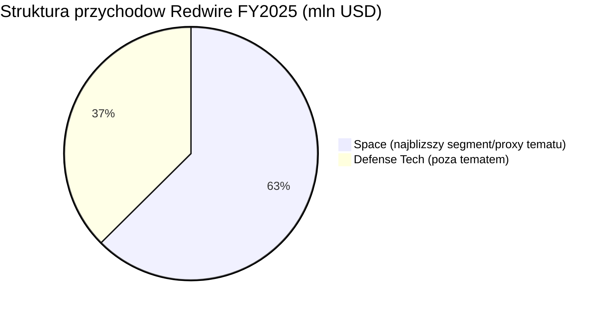
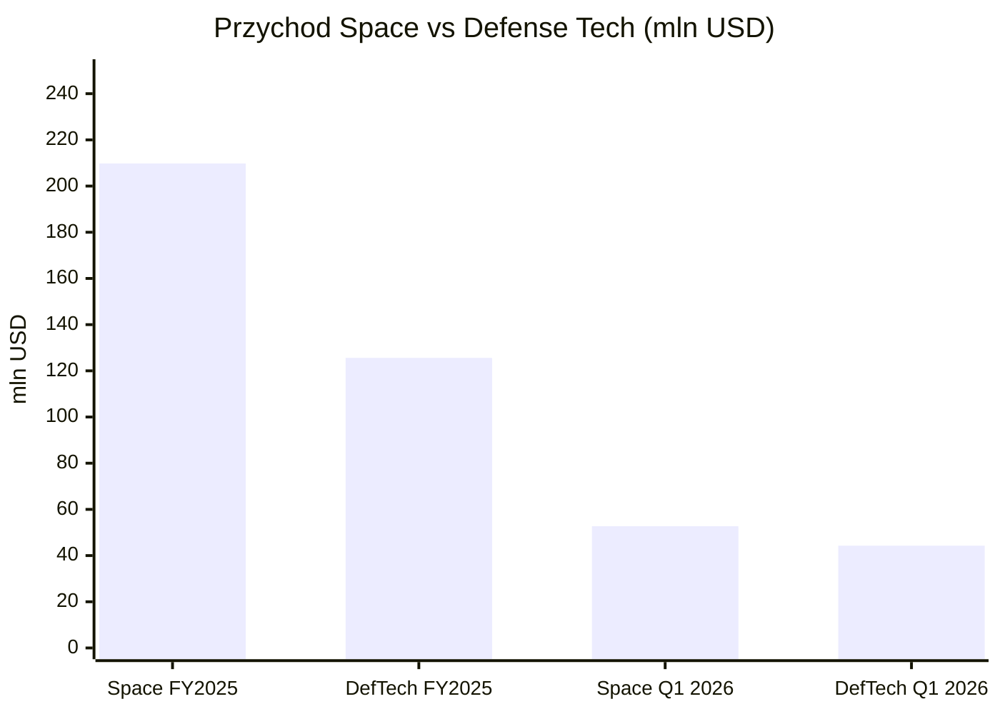
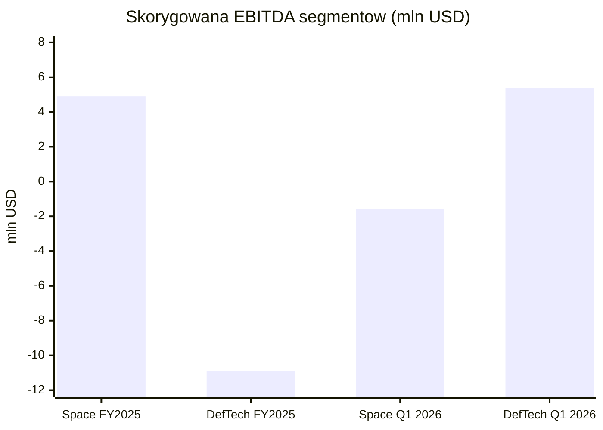

# Redwire (RDW)

<!-- spolki:temat:fizyka-orbitalna-orbity-i-operacje:start -->
## W kontekscie: Fizyka orbitalna, orbity i operacje

**Czym jest spółka.** Redwire Corporation to amerykański dostawca infrastruktury kosmicznej (de-SPAC z 2021 r.), który po przejęciu Edge Autonomy (zamknięcie 13 czerwca 2025 r.) raportuje od 1 grudnia 2025 r. dwa segmenty: **Space** i **Defense Tech** (10-K 2025, 27.02.2026). W obszarze fizyki orbitalnej Redwire dostarcza zarówno całe platformy satelitarne, czyli [[_slownik#bus satelitarny|busy satelitarne]] z systemami sterowania orientacją (ADCS - attitude determination and control system, system określania i kontroli orientacji), jak i pojedyncze podsystemy oraz komponenty infrastrukturalne. Rodzina platform obejmuje SabreSat i Phantom dla bardzo niskiej orbity (VLEO), Hammerhead i Thresher dla [[_slownik#LEO|LEO]] oraz Mako dla MEO/GEO (10-K 2025, 27.02.2026).

**Dlaczego to ważne dla orbitalnych centrów danych.** Centrum danych na orbicie to nie pojedynczy satelita, lecz duża, rozciągnięta struktura złożona z modułów mocy, radiatorów i węzłów obliczeniowych - a tych nie da się wynieść w jednym locie ze względu na ograniczenie średnicy owiewki rakiety (fairing). Dlatego liczy się zdolność montażu na orbicie i precyzyjnego utrzymania szyku. Redwire wnosi tu udokumentowany heritage lotny: na misji ESA PROBA-3 (start późny 2024 r., kamienie milowe Q1 2025) jego platforma Hammerhead realizowała lot w szyku z precyzją poniżej 1 mm na dystansie 150 m (transkrypt earnings call Q1 2025). To kompetencja wprost przekładalna na [[_slownik#in-space assembly|in-space assembly]] i operacje zbliżeniowe (RPO - rendezvous and proximity operations, czyli operacje spotkaniowe i zbliżeniowe na orbicie) potrzebne do budowy i obsługi rozproszonej infrastruktury orbitalnej. Wątek operacyjny rozwija notatka tematyczna w sekcjach [[03 - fizyka-orbitalna-orbity-i-operacje#Formation flying / utrzymanie szyku konstelacji]] oraz [[03 - fizyka-orbitalna-orbity-i-operacje#Montaż on-orbit / in-space assembly vs wynoszenie gotowych modułów, ograniczenie fairingu]].

> **Dla inwestora:** ekspozycja Redwire na ten temat jest pośrednia - to dostawca "klocków" (busów, mechanizmów dokujących, struktur), a nie operator centrum danych. Wartość jest funkcją tego, czy rynek dużych struktur orbitalnych ruszy; sam Redwire nie raportuje przychodu z tej niszy odrębnie.
<!-- spolki:temat:fizyka-orbitalna-orbity-i-operacje:end -->

<!-- spolki:grafiki:start -->
## Materiały spółki

> Grafiki z materiałów spółki / IR (prawa właściciela, użycie redakcyjne). Pełny rejestr: `Spolki/assets/_licencje.json`.

*1 |  | Strona produktowa / newsroom Redwire (ROSA) | Rozwijany panel ROSA podczas testu na ISS w 2017 r. - ilustruje energię/fotowoltaikę orbitalną oraz struktury rozkladane. Źródło: rdw.com; licencja: materiały spółki / IR - prawa właściciela, użycie redakcyjne.*

*2 |  | Strona produktowa Redwire (product-archive/power) | Dostawa skrzydeł iROSA (3 i 4) do NASA/Boeing - ilustruje kluczowy program zasilania ISS. Źródło: rdw.com; licencja: materiały spółki / IR - prawa właściciela, użycie redakcyjne.*

*3 |  | Newsroom Redwire (OSAM-2 / Archinaut) | Render misji OSAM-2/Archinaut - druk 3D i montaż struktur na orbicie (on-orbit manufacturing / in-space assembly). Źródło: rdw.com; licencja: materiały spółki / IR - prawa właściciela, użycie redakcyjne.*

<!-- spolki:grafiki:end -->

<!-- spolki:temat:energetyka-kosmiczna-i-fotowoltaika-orbitalna:start -->
## W kontekscie: Energetyka kosmiczna i fotowoltaika orbitalna

**Flagowa technologia.** Najlepiej udokumentowanym obszarem ekspozycji Redwire w tej notatce jest rodzina rozkładanych paneli słonecznych [[_slownik#ROSA|ROSA]] (Roll-Out Solar Array) wraz z wariantami iROSA, ELSA, Mega-ROSA i FACT. ROSA to skrzydło fotowoltaiczne zwijane jak roleta, które rozwija się bez silnika dzięki energii sprężystej kompozytowych wysięgników, co eliminuje sztywne, ciężkie panele harmonijkowe. Najbardziej okazałym wdrożeniem jest iROSA dla Międzynarodowej Stacji Kosmicznej: program objął sześć paneli, których pełen montaż podniósł generację mocy ISS do łącznie ponad 250 kW, czyli o ponad 30% (NASA STMD). Pierwsza para została wyniesiona w czerwcu 2021 r., a komplet sześciu paneli zamontowano do czerwca 2023 r.; do stycznia 2025 r. Redwire wyprodukował łącznie osiem skrzydeł iROSA, z których **sześć jest już zainstalowanych na ISS** (2021-2023), a siódme i ósme - dostarczone w styczniu 2025 r. - oczekują na lot SpaceX Cargo Dragon i spacer kosmiczny w 2026 r. (NASA planuje montaż na kanałach 2A i 3B; NASA via Aviation Week, 06.01.2026). Każde skrzydło daje ponad 20 kW, więc komplet ośmiu to ponad 160 kW (Redwire press release 28.06.2023; Redwire press release 13.01.2025).

**Dlaczego to ważne dla orbitalnych centrów danych.** Centrum obliczeniowe na orbicie potrzebuje mocy rzędu megawatów, a panele dostarczające taką moc muszą mieć ekstremalnie korzystny stosunek mocy do masy i upakowania w owiewce. ROSA odpowiada wprost na ten problem: jest lekka i gęsto upakowana przy starcie. Ogniwa kosmiczne to zwykle [[_slownik#multi-junction|multi-junction]] na bazie [[_slownik#GaAs|GaAs]], których sprawność (rzędu ok. 28-32%) jest wyższa niż typowego krzemu naziemnego (ok. 15-22%), co dodatkowo poprawia bilans mocy do masy. Redwire dostarcza także panele dla lunarnego Gateway (para ROSA, 60 kW; testy 2025, start planowany 2027, NASA/Maxar; Fast Company/NASA), dla misji DART (2 panele, 6,6 kW BOL, czyli beginning of life - moc na początku życia misji; Redwire newsroom) oraz - co istotne dla wątku skalowania - pierwszą komercyjną sprzedaż ELSA do firmy Moog o wartości **12,8 mln USD** (zamówienie ogłoszone w Q1 2026; press release Q1 2026, 06.05.2026). Mechanikę przewagi insolacji i przeliczeń mocowych rozwija notatka w sekcjach [[04 - energetyka-kosmiczna-i-fotowoltaika-orbitalna#Sprawność ogniw kosmicznych vs krzem naziemny]] oraz [[04 - energetyka-kosmiczna-i-fotowoltaika-orbitalna#Gęstość masowa: W/kg, masa/m2 i przeliczenie "200 MW"]].

> **Dla inwestora:** ROSA to obszar, w którym Redwire ma realny heritage i pozycję dostawcy dla NASA/Boeinga. Ale firma nie ujawnia, ile przychodu pochodzi z linii "power", więc nie da się oddzielić tej przewagi liczbowo od reszty segmentu Space.
<!-- spolki:temat:energetyka-kosmiczna-i-fotowoltaika-orbitalna:end -->

<!-- spolki:temat:chlodzenie-i-radiacyjne-odprowadzanie-ciepla:start -->
## W kontekscie: Chłodzenie i radiacyjne odprowadzanie ciepła

**Co oferuje spółka.** W próżni kosmicznej nie ma powietrza ani wody, więc choć wewnątrz systemu ciepło można transportować przewodzeniem, heat pipes czy pętlami cieczowymi, ostateczną drogą oddania go na zewnątrz jest promieniowanie podczerwone z powierzchni radiatora. Redwire rozwija tu rozkładany [[_slownik#radiator|radiator]] **Q-Rad** (deployable radiator), uzupełniony o FlexCool, heat pipes oraz technologie magazynowania ciepła Q-Store/Q-Cache (materiały zmiennofazowe, PCM) i thermal switches (10-K 2025, 27.02.2026). Q-Rad został wybrany w programie NASA Tipping Point w 2022 r. i pozostaje na poziomie dojrzałości TRL 5-6 (RS Inc.). TRL (Technology Readiness Level) to dziewięciostopniowa skala dojrzałości technologii NASA; poziom 5-6 oznacza walidację/demonstrację w warunkach zbliżonych do docelowych, czyli wciąż fazę demonstracji, a nie masowej produkcji - dla inwestora to technologia przedkomercyjna.

**Dlaczego to ważne dla orbitalnych centrów danych.** Gęstość mocy chipów AI jest tak duża, że odprowadzenie ich ciepła bez wody i powietrza staje się fizycznym wąskim gardłem każdego orbitalnego data center (DC) - radiator musi mieć wielką powierzchnię, a jednocześnie złożyć się do owiewki. Rozkładany radiator typu Q-Rad celuje w taki problem, rozwijając powierzchnię promieniującą dopiero na orbicie, ale pozostaje technologią demonstracyjną (TRL 5-6), bez ujawnionych danych o powierzchni na MW, masie czy testach orbitalnych. To ten sam paradygmat "zwinięte przy starcie, rozłożone w kosmosie", który napędza przewagę ROSA, tyle że po stronie ciepła zamiast mocy. Mechanizm i skalowanie powierzchni radiatorów rozwijają sekcje [[05 - chlodzenie-i-radiacyjne-odprowadzanie-ciepla#Mechanizm: dlaczego w próżni liczy się tylko promieniowanie]], [[05 - chlodzenie-i-radiacyjne-odprowadzanie-ciepla#Technologie: heat pipes, pętle, układy dwufazowe i radiatory rozkładane]] oraz [[05 - chlodzenie-i-radiacyjne-odprowadzanie-ciepla#Gęstość mocy chipów AI a ekstrakcja ciepła bez wody i powietrza]].

> **Dla inwestora:** Q-Rad jest technologią obiecującą, ale wczesną (TRL 5-6) i finansowaną grantowo - to opcja na przyszły rynek, nie linia generująca dziś istotny, ujawniony przychód.
<!-- spolki:temat:chlodzenie-i-radiacyjne-odprowadzanie-ciepla:end -->

<!-- spolki:temat:niezawodnosc-serwisowanie-i-cykl-zycia-sprzetu:start -->
## W kontekscie: Niezawodność, serwisowanie i cykl życia sprzętu

**Co oferuje spółka.** Sprzęt na orbicie jest praktycznie nieserwisowalny ręką ludzką, więc o jego cyklu życia decydują albo robotyka, albo produkcja i montaż struktur bezpośrednio w kosmosie. Redwire działa na obu frontach: rozwija ramię robotyczne STAARK, maszynę druku 3D w kosmosie ESAMM (Extended Structure Additive Manufacturing Machine), program OSAM-2/Archinaut oraz mechanizm dokujący [[_slownik#IBDM|IBDM]] (International Berthing and Docking Mechanism), który pozwala łączyć moduły na orbicie - kluczowy element wymiany i rozbudowy struktur (10-K 2025, 27.02.2026). Heritage OSAM-2: kontrakt NASA o wartości 73,7 mln USD, przegląd CDR zaliczony w 2022 r.; projekt anulowano w 2023 r., ale Redwire zachował własność intelektualną (NASA OSAM-2).

**Dlaczego to ważne dla orbitalnych centrów danych.** Cykl odświeżania procesorów AI na Ziemi to około 3-5 lat, podczas gdy platforma orbitalna ma żyć znacznie dłużej - powstaje problem "zamrożonego sprzętu", który starzeje się szybciej, niż zwraca się jego wyniesienie. Tu rozwiązaniem jest [[_slownik#life extension|life extension]] i wymiana całych modułów zamiast naprawy podzespołów. IBDM i robotyka montażowa Redwire to budulec takiej architektury wymienialnych bloków. Świeży dowód popytu to dwa odrębne kontrakty na IBDM: "ośmiocyfrowa" umowa od The Exploration Company na dwa egzemplarze dla statku Nyx (Q4 2025; transkrypt earnings call Q4 2025) oraz wcześniejsza umowa Thales Alenia Space na cztery systemy dokujące dla modułu Lunar I-Hab (Q1 2025; transkrypt earnings call Q1 2025). Notatka nie scala ich już w jeden kontrakt. Wątek rozwijają sekcje [[08 - niezawodnosc-serwisowanie-i-cykl-zycia-sprzetu#Brak napraw in-situ a robotyczna obsługa (Northrop Grumman MEV i następcy)]], [[08 - niezawodnosc-serwisowanie-i-cykl-zycia-sprzetu#Cykl odświeżania GPU (~3-5 lat na Ziemi) a nieserwisowalna orbita ("frozen hardware")]] oraz [[08 - niezawodnosc-serwisowanie-i-cykl-zycia-sprzetu#Deorbitacja i wymiana całych modułów a upgrade]].

> **Dla inwestora:** robotyka i montaż on-orbit to obszar o dużym potencjale, ale obarczony historią anulowanych programów (OSAM-2). Wartość zależy od tego, czy klienci rządowi i komercyjni przejdą od demonstratorów do operacyjnych wdrożeń.
<!-- spolki:temat:niezawodnosc-serwisowanie-i-cykl-zycia-sprzetu:end -->

<!-- spolki:ekspozycja:start -->
## Ekspozycja na temat w liczbach

**Skala i dynamika.** Przychód całkowity Redwire wyniósł **335,4 mln USD w FY2025** (+10,3% r/r wobec 304,1 mln USD w FY2024) i **97,0 mln USD w Q1 2026** (+57,9% r/r wobec 61,4 mln USD w Q1 2025; press release Q4/FY2025 i Q1 2026). Skokowy wzrost kwartalny to przede wszystkim efekt akwizycji Edge Autonomy, która zasiliła segment Defense Tech - to kluczowa uwaga przy czytaniu struktury firmy. Bezpośredni wkład samego Edge Autonomy do przychodu po przejęciu wyniósł **107,1 mln USD w FY2025** (rozpoznane od 13.06.2025) oraz **36,4 mln USD w Q1 2026** (10-Q Q1 2026, press release Q4/FY2025, 25.02.2026). Dla porównania pro forma (jakby Edge konsolidowano od 1.01.2024) przychód Q1 2025 wyniósłby **96,8 mln USD** przy stracie netto -10,1 mln USD - czyli realny wzrost r/r po oczyszczeniu o akwizycję jest marginalny (10-Q Q1 2026, pro forma).

**Akwizycja Edge Autonomy zmieniła strukturę.** Tematy orbitalne (energia, ADCS, chłodzenie, OSAM, struktury) mieszczą się w segmencie **Space**, natomiast Defense Tech (drony Stalker/Penguin, gimbale EO/IR, czyli electro-optical/infrared - elektrooptyczne/podczerwone) pochodzi głównie z przejętego Edge Autonomy i do tematu nie należy. Defense Tech w FY2025 dał 125,6 mln USD (+157,6% r/r wobec 48,8 mln USD w FY2024) wobec 209,8 mln USD w segmencie Space (-17,8% r/r; 10-K 2025 + press release). W Q1 2026 Space wzrósł tylko o 1,0% r/r (52,1 mln USD do 52,7 mln USD), a Defense Tech aż o 378,3% (9,3 mln USD do 44,3 mln USD; press release Q1 2026). Rentowność segmentów jest jednak rozbieżna z dynamiką przychodu: skorygowana EBITDA segmentów w FY2025 wyniosła **+4,9 mln USD dla Space** i **-10,9 mln USD dla Defense Tech**, a w Q1 2026 odwróciła się na **-1,6 mln USD dla Space** i **+5,4 mln USD dla Defense Tech** (press release Q4/FY2025 i Q1 2026).

*Rys. - Akwizycja Edge Autonomy podniosła udział Defense Tech do ~37% przychodu FY2025; temat orbitalny mieści się w segmencie Space (~63%). Dane: Redwire 10-K 2025 i press release Q4/FY2025.*

**Przesunięcie struktury kwartał do kwartału.** W ujęciu kwartalnym Space spadł do ~54,3% przychodu (52,7 / 97,0 mln USD), a Defense Tech urósł do ~45,7% (44,3 / 97,0 mln USD; obliczenia na podstawie press release Q1 2026). To pokazuje, jak szybko przejęcie rozwadnia wagę tematu kosmicznego.

*Rys. - Space (temat) maleje r/r, Defense Tech rośnie skokowo po Edge Autonomy. Dane: Redwire 10-K 2025 i press release Q1 2026.*

*Rys. - Rentowność segmentów odwraca się: w FY2025 zysk dawał Space (przy stratnym Defense Tech), a w Q1 2026 to Defense Tech jest dodatni, podczas gdy Space wpada w niewielką stratę EBITDA. Dane: Redwire press release Q4/FY2025 i Q1 2026.*

**Ile z tego to ściśle temat orbitalnych DC? NIE UJAWNIONE.** Redwire nie raportuje osobno linii "space data center", "power", "thermal", "ADCS" ani "OSAM" - wszystkie one są zagregowane w segmencie Space. Najlepsze dostępne proxy to udział samego segmentu Space: **62,6% przychodu FY2025** i **54,3% w Q1 2026** (obliczenia własne na podstawie 10-K/press release). Temat mieści się w tym segmencie jako jego podzbiór, ale jego udział w przychodzie pozostaje nieujawniony.

> **Dla inwestora:** po przejęciu Edge Autonomy ekspozycja "czysto kosmiczna" Redwire spadła poniżej dwóch trzecich przychodu i dalej maleje. Czytając tę spółkę jako grę na orbitalne DC trzeba pamiętać, że 45,7% sprzedaży Q1 2026 robi już dział obronny spoza tematu.
<!-- spolki:ekspozycja:end -->

<!-- spolki:umowy:start -->
## Kluczowe umowy/wdrozenia - co znacza

Portfel kontraktów Redwire pokazuje, że firma jest dostawcą komponentów i platform dla dużych programów rządowych i agencyjnych, a nie operatorem usług. Najważniejsze pozycje:

- **iROSA dla ISS** (NASA/Boeing): program objął 6 paneli, których pełen montaż (zakończony do czerwca 2023 r.) podniósł generację mocy ISS do ponad 250 kW, czyli o ponad 30%; do stycznia 2025 r. wyprodukowano łącznie 8 skrzydeł (NASA STMD, Redwire press release 13.01.2025). To referencyjne wdrożenie technologii ROSA na działającej infrastrukturze.
- **Andromeda IDIQ**: pułap (ceiling) **1,8 mld USD** na zaawansowane statki kosmiczne dla nieujawnionego klienta bezpieczeństwa narodowego, Q1 2026 (press release Q1 2026); zarząd zapowiedział plan zwiększenia pułapu do ponad 6 mld USD (transkrypt earnings call Q1 2026). To umowa typu IDIQ - górny limit, nie gwarantowane zlecenie - więc jej realna wartość zależy od przyszłych zamówień cząstkowych (task orders).
- **DARPA Otter (VLEO)**: faza 2 o wartości **44 mln USD** na platformie SabreSat, Q4 2025 (press release Q4/FY2025).
- **IBDM (dwa odrębne kontrakty)**: "ośmiocyfrowa" umowa od The Exploration Company na 2 mechanizmy dla statku Nyx (Q4 2025; transkrypt earnings call Q4 2025) oraz umowa Thales Alenia Space na 4 systemy dokujące dla modułu Lunar I-Hab (Q1 2025; transkrypt earnings call Q1 2025).
- **ELSA dla Moog**: **12,8 mln USD**, pierwsza komercyjna sprzedaż ELSA, Q1 2026 (press release Q1 2026).
- **Gateway PPE**: para ROSA, 60 kW (NASA/Maxar), testy 2025, start 2027 (Fast Company/NASA).
- **Q-Rad**: kontrakt NASA Tipping Point, wybór 2022, TRL 5-6 (RS Inc.); **wartość grantu NIE UJAWNIONA** (ani press release, ani 10-K/10-Q nie podają kwoty). Uwaga: nagrody NASA Tipping Point 2023 w wysokości **12,9 mln USD** dotyczyły odrębnego projektu Redwire **Mason** (lunar surface construction), nie Q-Rad (Redwire press release 04.06.2025).

**Backlog wzrósł o 21,1% kw/kw.** Łączny zakontraktowany [[_slownik#backlog|backlog]] osiągnął **498,1 mln USD na 31.03.2026** (Space 359,7 mln USD, Defense Tech 138,4 mln USD) wobec **411,2 mln USD na 31.12.2025** (Space 299,8 mln USD, Defense Tech 111,4 mln USD), czyli +21,1% kw/kw (press release Q1 2026 i Q4/FY2025). Cały raportowany backlog to "contracted backlog", który spółka definiuje jako wartość firm funded executed contracts - całość 498,1 mln USD jest więc funded; osobnej kategorii "unfunded backlog" obecne raporty (Q1 2026, FY2025) nie ujawniają (10-Q Q1 2026, Note - Backlog). Kwartalny [[_slownik#book-to-bill|book-to-bill]] sięgnął **1,92x w Q1 2026** (vs 0,92x w Q1 2025; LTM 1,54x), a w skali roku wyniósł **1,32x w FY2025** (vs 0,76x w FY2024; Q4 2025 1,52x), co oznacza, że przyznawane kontrakty wyraźnie przewyższają rozpoznawane przychody (press release Q1 2026 i Q4/FY2025). Sam Space backlog urósł z 264,0 mln USD (31.12.2024) do 359,7 mln USD (31.03.2026), czyli o 36,2% w 15 miesięcy, mimo spadku przychodu Space w FY2025.

> **Dla inwestora:** rozejście się spadającego przychodu Space i rosnącego backlogu Space może sugerować problem po stronie realizacji (korekty kosztów, opóźnienia kontraktów rządowych), a nie popytu, ale wniosek ten wymaga potwierdzenia w komentarzu zarządu i strukturze backlogu (funded vs unfunded). Andromeda IDIQ (1,8 mld USD pułapu) to potencjał, nie twarde zobowiązanie - waga zależy od konwersji na zamówienia.
<!-- spolki:umowy:end -->

<!-- spolki:pozycja:start -->
## Pozycja rynkowa i udzialy

Redwire pozycjonuje się jako wyspecjalizowany dostawca podsystemów i platform kosmicznych z bogatym heritage lotnym. W panelach rozkładanych [[_slownik#ROSA|ROSA]] firma ma silne referencje w wybranych flagowych programach NASA - technologia zasila ISS (sześć iROSA, ponad 250 kW łącznej generacji stacji), poleciała na DART, jest budowana dla lunarnego Gateway (60 kW) i znalazła pierwszego komercyjnego nabywcę wariantu ELSA (Moog, 12,8 mln USD; press release Q1 2026, Redwire newsroom). Heritage formation flying potwierdziła misja PROBA-3 z precyzją poniżej 1 mm na 150 m (transkrypt Q1 2025).

**Udziały rynkowe ilościowo: NIE UJAWNIONE.** Spółka nie raportuje procentowego udziału rynkowego w żadnym z czterech tematów (ROSA, deployables, ADCS, thermal); jedyny przytaczany przez nią wskaźnik to **100% skuteczności on-orbit** rozwiązań ROSA (ISS, DART, planowane Gateway/Axiom), ale to miara niezawodności, a nie udziału rynkowego (Axiom Space press release, 25.09.2025). Same rynki docelowe szacują wyłącznie zewnętrzni analitycy: rynek "aerospace solar array" rośnie wg HTF Market Intelligence z CAGR ~12,5% (Redwire wymieniany jako key player; HTF Market Intelligence, 20.02.2026), a szerszy rynek in-space manufacturing / ISAM wyceniany jest bardzo rozbieżnie - od ~6,3 mld USD w 2025 r. rosnącego do ~46,8 mld USD w 2036 r. przy CAGR 20% (Future Market Insights, 21.05.2026) po wąziej definiowany "in-space manufacturing service market" rzędu ~3,6 mln USD w 2025 r. i ~11,7 mld USD w 2035 r. (Precedence Research, 01.04.2026). Tak duża rozpiętość definicji i prognoz oznacza, że twardego udziału Redwire nadal nie da się policzyć.

> **Dla inwestora:** przewaga Redwire jest najbardziej namacalna w wąskiej niszy rozkładanych paneli (ROSA), gdzie ma referencje lotne, a najsłabiej skwantyfikowana w pozostałych tematach (radiatory, robotyka), które są na wcześniejszym etapie dojrzałości. Estymaty wielkości rynku ISAM pochodzą wyłącznie ze źródeł wtórnych i różnią się o rząd wielkości, więc nie nadają się do twardej wyceny ekspozycji.
<!-- spolki:pozycja:end -->

<!-- spolki:konkurencja:start -->
## Mechanika konkurencji - na osiach

Redwire konkuruje na kilku osiach jednocześnie, bo działa jako dostawca wielu różnych podsystemów. Głównymi rywalami w obszarze infrastruktury kosmicznej są Rocket Lab, Northrop Grumman i Airbus, choć plik F1 nie podaje ich liczbowych udziałów rynkowych ani porównań finansowych - poniższa tabela opisuje osie rywalizacji jakościowo.

| Konkurent | Oś rywalizacji | Komentarz |
|-----------|----------------|-----------|
| **Rocket Lab** | platformy/busy satelitarne, integracja pionowa | Konkuruje o kontrakty na statki i komponenty kosmiczne; szczegółów liczbowych F1 nie podaje (NIE UJAWNIONE). |
| **Northrop Grumman** | serwisowanie on-orbit, robotyka, struktury | Pionier robotycznej obsługi satelitów (MEV i następcy); rywal w obszarze [[_slownik#life extension|life extension]] i dużych struktur. |
| **Airbus** | duże struktury kosmiczne, panele, platformy | Globalny integrator z własnymi rozwiązaniami mocy i struktur; rywal w segmencie agencyjnym/komercyjnym. |

**Na czym Redwire wygrywa.** Główną przewagą jest dywersyfikacja portfela podsystemów połączona z heritage lotnym konkretnych produktów - zwłaszcza silne referencje w rozkładanych panelach ROSA na ISS, DART i Gateway. To przewaga produktowa w wąskiej niszy, a nie skalowa.

> **Dla inwestora:** rywale (Rocket Lab, Northrop, Airbus) są więksi i lepiej skapitalizowani, więc Redwire broni się specjalizacją produktową, nie skalą. Brak liczbowych udziałów rynkowych w źródłach (NIE UJAWNIONE) utrudnia ocenę, jak trwała jest ta przewaga.
<!-- spolki:konkurencja:end -->

<!-- spolki:przekroj:start -->
## Koncentracja odbiorcow i ryzyka z mechanizmem

**Koncentracja odbiorców.** Spółka podaje w raportach SEC udział klientów przekraczających 10% przychodu, choć tylko pod anonimowymi oznaczeniami (Customer B/D/E) - pełne nazwy pozostają NIE UJAWNIONE. W **Q1 2026** dwóch klientów przekroczyło próg: Customer D z **17,0 mln USD (17,5% przychodu)** i Customer E z **13,2 mln USD (13,7%)**; w porównawczym Q1 2025 Customer D odpowiadał aż za **22,9%**, a Customer B za 10,2% (10-Q Q1 2026, SEC). W skali roku koncentracja jest jeszcze wyższa: w FY2024 dwaj najwięksi klienci stanowili odpowiednio około **10% i 35%** całkowitych przychodów (10-K 2024, SEC). Z listy kontraktów wynika silna zależność od klientów rządowych i agencyjnych USA oraz ESA - NASA (iROSA, Gateway, OSAM-2, Q-Rad, biotech), DARPA (Otter 44 mln USD), klient bezpieczeństwa narodowego (Andromeda IDIQ, 1,8 mld USD pułapu) i ESA (PROBA-3). To skupienie na budżetach rządowych jest samo w sobie czynnikiem ryzyka. Udział kontraktów rządowych USA też potwierdzają dane SEC: w Q2 2025 sprzedaż do klientów civil space i national security wyniosła **30,4 mln USD z 61,8 mln USD, czyli 49,2%** przychodu kwartału, a za pierwsze półrocze 2025 r. **68,0 mln USD z 123,2 mln USD, czyli 55,2%** (10-Q Q2 2025, SEC). Dla Q1 2026 precyzyjny procentowy udział kontraktów rządowych pozostaje NIE UJAWNIONY.

**Ryzyka z mechanizmem.**

- **Rentowność (najważniejsze).** Redwire generuje dużą stratę netto względem skali przychodów: -226,6 mln USD przy 335,4 mln USD przychodu FY2025 (vs -114,3 mln USD w FY2024), w tym ponad 130 mln USD kosztów jednorazowych (press release Q4/FY2025). Marża brutto GAAP wyniosła zaledwie **5,2% w FY2025** (17,3 mln USD zysku brutto na 335,4 mln USD przychodu), strata operacyjna **-229,7 mln USD** (press release Q4/FY2025, 10-K 2025). Także skorygowana EBITDA, oczyszczająca wynik z pozycji jednorazowych, była ujemna: **-50,3 mln USD w FY2025** (vs -0,8 mln USD w FY2024) i **-9,2 mln USD w Q1 2026** (vs -2,3 mln USD w Q1 2025; press release Q4/FY2025 i Q1 2026). W Q1 2026 strata operacyjna wyniosła -69,7 mln USD, a netto -76,5 mln USD (EPS -0,40 USD), przy czym ponad 44 mln USD to koszty jednorazowe, głównie **42,5 mln USD przyspieszonego vestingu jednostek motywacyjnych Edge Autonomy** (press release Q1 2026). Mechanizm: niskie marże na programach rozwojowych w połączeniu z niekorzystnymi korektami kosztów EAC oznaczają, że wzrost przychodu nie przekłada się na zysk - każdy poślizg na kontrakcie typu fixed-price (stała cena, w którym ryzyko przekroczenia kosztów spoczywa głównie na wykonawcy) uderza w wynik.
- **Poprawa marży, ale od niskiego poziomu.** Marża brutto skoczyła do **26,6% w Q1 2026** z 14,7% w Q1 2025 i 9,6% w Q4 2025 (press release Q1 2026, Q4/FY2025). To pozytywny sygnał, ale jednokwartalny i w dużej mierze napędzony zmianą miksu po przejęciu Defense Tech.
- **Integracja przejęcia Edge Autonomy.** Akwizycja zamknięta 13 czerwca 2025 r. radykalnie zmieniła strukturę firmy i dołożyła ryzyko integracyjne. Mechanizm: jeśli synergie się nie zmaterializują lub integracja pochłonie zarządczą uwagę, ucierpieć może rdzenny segment Space, który i tak skurczył się o 17,8% w FY2025.
- **Płynność i dług.** Gotówka i jej ekwiwalenty wyniosły **144,5 mln USD** (a wraz z restricted cash całkowita pozycja gotówkowa to 145,2 mln USD), łączna płynność **175,2 mln USD**, a dług długoterminowy netto **83,4 mln USD** (łączny dług short- + long-term ~88,2 mln USD) na 31.03.2026 (press release Q1 2026 / 10-Q). W lutym 2026 r. firma refinansowała kredyt JPMorgan (90 mln USD term loan + 30 mln USD revolver, termin 31.05.2029), a w Q4 2025 spłaciła 105,5 mln USD długu z programu ATM (oszczędności odsetkowe >17 mln USD rocznie). Przy utrzymujących się stratach netto bufor płynności jest czynnikiem do monitorowania.
- **Koncentracja na budżetach rządowych.** Opóźnienia kontraktów rządowych USA były wprost wskazane jako przyczyna spadku przychodu Space w FY2025 - mechanizm bezpośrednio łączy decyzje budżetowe z przychodem firmy.

> **Dla inwestora:** sednem ryzyka jest rentowność - Redwire rośnie przychodowo i backlogowo (book-to-bill 1,92x w Q1 2026), ale pali gotówkę przy marży brutto rzędu jednocyfrowej w skali roku. Do tego dochodzi ryzyko integracji świeżego, dużego przejęcia i zależność od cyklu budżetów rządowych.
<!-- spolki:przekroj:end -->

<!-- network:peers:start -->
## Powiązane spółki

> Inne notowane spółki z raportu dzielące z tą firmą co najmniej jeden wątek tematyczny (wspólny rynek, technologia lub łańcuch wartości).

- [[Spolki/airbus|Airbus SE (AIR)]] - PV (Sparkwing), optyka (Tesat), busy, serwis (EU)  
  *Wspólne wątki: Fizyka orbitalna; Energetyka kosmiczna; Chłodzenie; Niezawodność i serwisowanie.*
- [[Spolki/northrop-grumman|Northrop Grumman Corporation (NOC)]] - Serwis GEO (MEV/MRV), busy, radiatory, ogniwa  
  *Wspólne wątki: Fizyka orbitalna; Energetyka kosmiczna; Chłodzenie; Niezawodność i serwisowanie.*
- [[Spolki/rocket-lab|Rocket Lab Corporation (RKLB)]] - Launch (Electron/Neutron) + Space Systems: bus, ogniwa SolAero, komponenty  
  *Wspólne wątki: Fizyka orbitalna; Energetyka kosmiczna; Niezawodność i serwisowanie.*
- [[Spolki/lockheed-martin|Lockheed Martin Corporation (LMT)]] - Busy satelitarne, serwisowanie, ULA (launch)  
  *Wspólne wątki: Fizyka orbitalna; Niezawodność i serwisowanie.*
- [[Spolki/mda-space|MDA Space Ltd. (MDA)]] - Robotyka kosmiczna (Canadarm), busy, anteny  
  *Wspólne wątki: Fizyka orbitalna; Niezawodność i serwisowanie.*
- [[Spolki/rtx|RTX Corporation (RTX)]] - ADCS (Blue Canyon), termika (Collins Aerospace)  
  *Wspólne wątki: Fizyka orbitalna; Chłodzenie.*
- [[Spolki/voyager-technologies|Voyager Technologies, Inc. (VOYG)]] - Stacje kosmiczne (Starlab), systemy kosmiczne i obronne  
  *Wspólne wątki: Fizyka orbitalna; Niezawodność i serwisowanie.*
- [[Spolki/astroscale|Astroscale Holdings Inc. (186A)]] - Pure-play serwisowanie i usuwanie śmieci (ADR)  
  *Wspólne wątki: Niezawodność i serwisowanie.*
- [[Spolki/eaton|Eaton Corporation plc (ETN)]] - Zasilanie DC (UPS, switchgear) + chłodzenie (Boyd Thermal)  
  *Wspólne wątki: Chłodzenie.*
- [[Spolki/vertiv|Vertiv Holdings Co (VRT)]] - Zasilanie i precyzyjne/cieczowe chłodzenie DC  
  *Wspólne wątki: Chłodzenie.*
<!-- network:peers:end -->

<!-- spolki:slownik:start -->
## Slowniczek

Terminy techniczne użyte w notatce linkowano do wspólnego słownika vaultu ([[_slownik#ROSA|ROSA]], [[_slownik#in-space assembly|in-space assembly]], [[_slownik#radiator|radiator]], [[_slownik#life extension|life extension]], [[_slownik#bus satelitarny|bus satelitarny]], [[_slownik#backlog|backlog]], [[_slownik#GaAs|GaAs]], [[_slownik#multi-junction|multi-junction]], [[_slownik#LEO|LEO]]). Lokalne hasła dodatkowe:

- **ROSA / iROSA / ELSA** - rodzina rozkładanych (zwijanych) paneli słonecznych Redwire; iROSA to wariant dla ISS, ELSA to niskoprofilowy wariant komercyjny.
- **Q-Rad** - rozkładany radiator Redwire oddający ciepło przez promieniowanie podczerwone (TRL 5-6).
- **IBDM** - International Berthing and Docking Mechanism; mechanizm dokujący do łączenia modułów na orbicie.
- **OSAM / Archinaut** - on-orbit servicing, assembly and manufacturing; produkcja i montaż struktur bezpośrednio w kosmosie.
- **EAC** - Estimated Cost at Completion; szacunek kosztu całkowitego kontraktu, którego korekty wprost wpływają na rozpoznawany wynik.
- **de-SPAC** - wejście na giełdę przez fuzję ze spółką akwizycyjną (SPAC); Redwire zadebiutował tak w 2021 r.
- **VLEO / MEO / GEO** - bardzo niska / średnia / geostacjonarna orbita okołoziemska.
- **ADCS** - attitude determination and control system; system określania i kontroli orientacji satelity.
- **RPO** - rendezvous and proximity operations; operacje spotkaniowe i zbliżeniowe na orbicie.
- **TRL** - Technology Readiness Level; dziewięciostopniowa skala dojrzałości technologii NASA (5-6 = walidacja/demonstracja w warunkach zbliżonych do docelowych).
- **BOL** - beginning of life; moc na początku życia misji (panele słoneczne degradują w czasie).
- **fixed-price** - kontrakt o stałej cenie, w którym ryzyko przekroczenia kosztów spoczywa głównie na wykonawcy.
<!-- spolki:slownik:end -->

<!-- spolki:zrodla:start -->

<!-- spolki:zrodla:end -->
