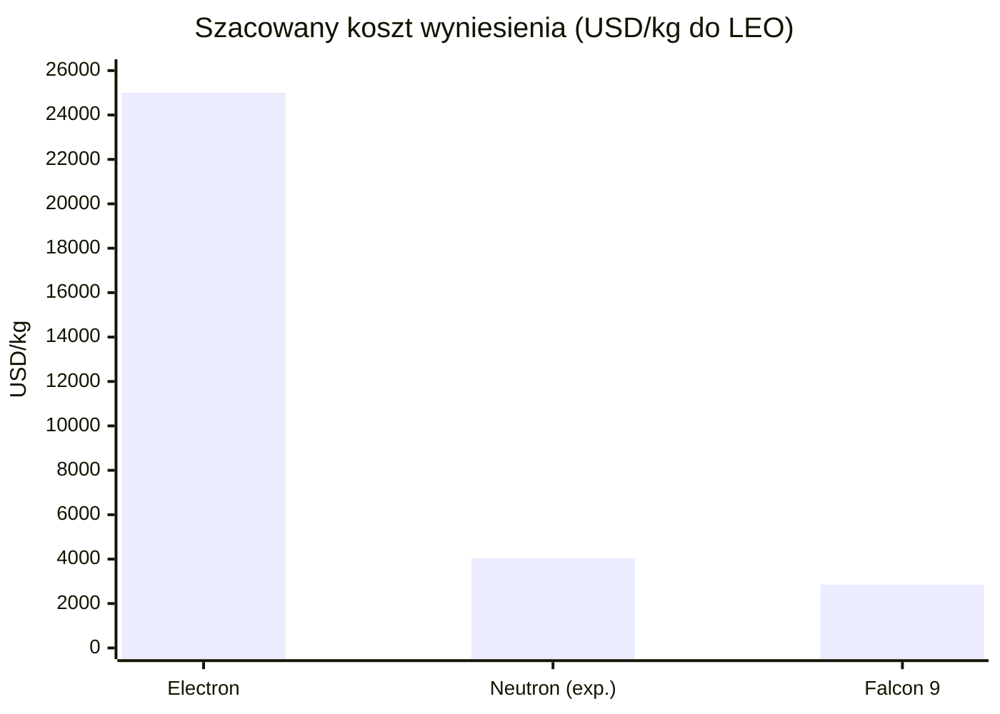
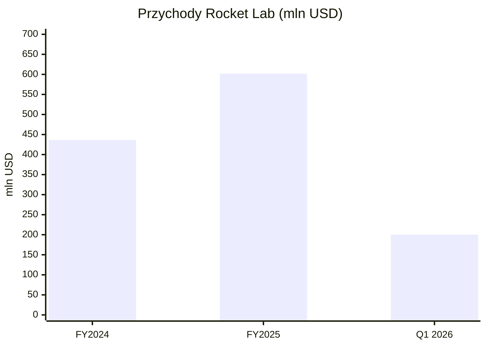
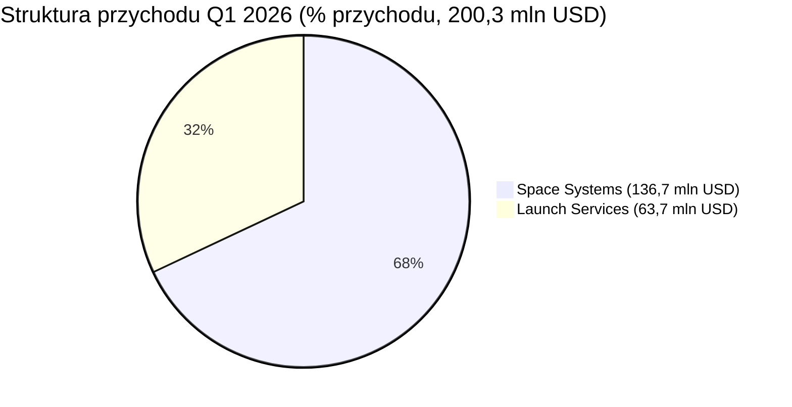
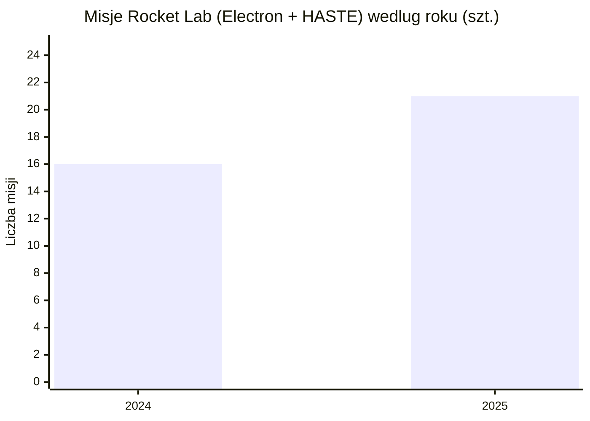
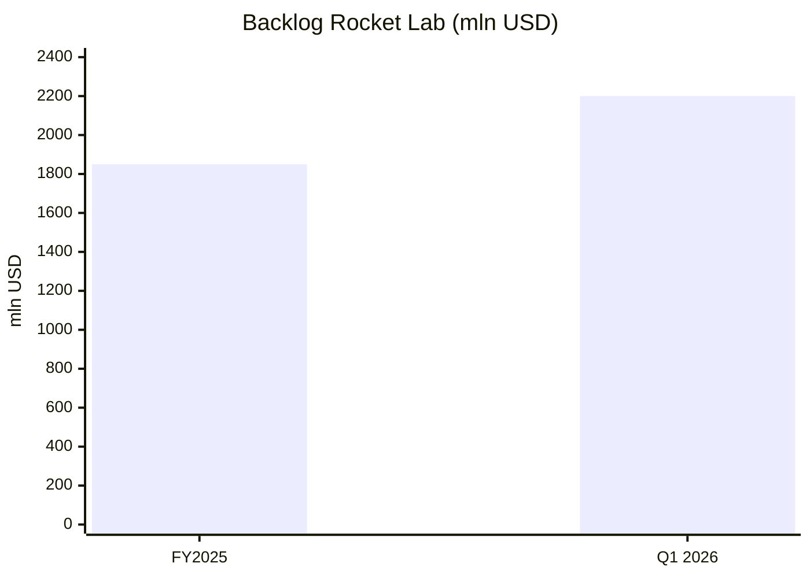
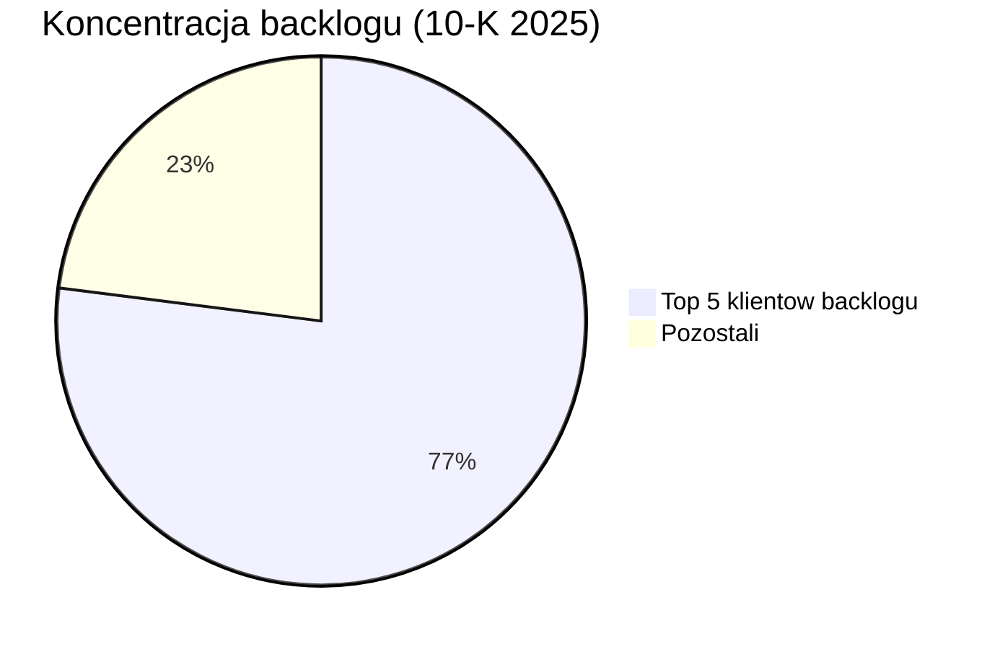

# Rocket Lab (RKLB)

<!-- spolki:temat:fizyka-orbitalna-orbity-i-operacje:start -->
## W kontekscie: Fizyka orbitalna, orbity i operacje

**Czym jest spółka w tym kontekście.** Rocket Lab to wertykalnie zintegrowana firma kosmiczna z dwoma segmentami: **Launch Services** (starty rakiet) oraz **Space Systems** (satelity, podzespoły, optyka, oprogramowanie, panele słoneczne). To właśnie Space Systems czyni z niej istotnego gracza dla tematu orbitalnych centrów danych: jeśli ktoś chce postawić na orbicie konstelację modułów obliczeniowych, potrzebuje [[_slownik#bus satelitarny|busa satelitarnego]] (platformy, która utrzymuje moduł przy życiu - zasila, chłodzi, orientuje i podtrzymuje łączność) oraz całego zestawu podzespołów do sterowania położeniem. Rocket Lab dostarcza jedno i drugie z własnej produkcji.

**Co konkretnie buduje.** Spółka oferuje rodzinę platform: Photon (200-300 kg, [[_slownik#LEO|LEO]]), Pioneer (payload do 120 kg, misje re-entry i dynamic operations), Explorer (duża delta-V, głęboki kosmos - użyty w misji ESCAPADE na Marsa), Lightning (~3 kW, żywotność >12 lat na LEO, baza kontraktów obronnych) oraz Flatellite - nową platformę zaprojektowaną wprost pod duże konstelacje LEO, ogłoszoną w 2025 r. (🔵 Rocket Lab 10-K 2025; product pages, dostęp 16.06.2026). Architektura Flatellite (płaski, sztaplowalny satelita pod masową produkcję i gęste upakowanie w fairingu) jest dokładnie tym kierunkiem, który rozwija wątek [[03 - fizyka-orbitalna-orbity-i-operacje#Montaż on-orbit / in-space assembly vs wynoszenie gotowych modułów, ograniczenie fairingu]] oraz [[03 - fizyka-orbitalna-orbity-i-operacje#Skalowanie mocy do MW-GW: liczba modułów na 1 MW, gęstość upakowania]].

**ADCS i podzespoły sterowania położeniem.** Po przejęciu Sinclair Interplanetary Rocket Lab produkuje komponenty [[_slownik#ADCS|ADCS]] (Attitude Determination and Control System - układ wyznaczania i kontroli orientacji satelity): [[_slownik#koło reakcyjne|koła reakcyjne]] (reaction wheels - obracają satelitą bez zużycia paliwa, wykorzystując zachowanie momentu pędu) oraz [[_slownik#star tracker|star trackery]] (kamery rozpoznające układ gwiazd, które dają satelicie precyzyjną orientację). Dla orbitalnego centrum danych precyzyjne ADCS jest warunkiem brzegowym: panele muszą stale celować w Słońce, radiatory w zimną przestrzeń, a anteny/łącza optyczne w punkty odbioru. Bez sprawnego utrzymania orientacji nie ma ani zasilania, ani chłodzenia, ani [[_slownik#downlink|downlinku]]. To łączy się z wątkiem [[03 - fizyka-orbitalna-orbity-i-operacje#Formation flying / utrzymanie szyku konstelacji]] - przy gęstych konstelacjach utrzymanie szyku zależy od jakości ADCS i [[_slownik#station-keeping|station-keepingu]].

> **Dla inwestora:** ekspozycja Rocket Lab na orbitalne centra danych jest dziś przede wszystkim ekspozycją na produkcję komponentów i platform, a nie na samą operację obliczeniową. Spółka sprzedaje "łopaty w gorączce złota" - busy, ADCS, panele - niezależnie od tego, który operator wygra wyścig o orbitalny compute.
<!-- spolki:temat:fizyka-orbitalna-orbity-i-operacje:end -->

<!-- spolki:grafiki:start -->
## Materiały spółki

> Grafiki z materiałów spółki / IR (prawa właściciela, użycie redakcyjne). Pełny rejestr: `Spolki/assets/_licencje.json`.

*
*
*. To nie jest poboczny komunikat: spółka deklaruje, że posiada największą zainstalowaną produkcyjnie zdolność wytwarzania paneli kosmicznych typu [[_slownik#GaAs|GaAs]]/Ge w USA i jest jedynym w pełni wertykalnie zintegrowanym dostawcą energii kosmicznej (🔵 Rocket Lab PR, 26.02.2026). Dziedzictwo tej linii to przejęcie SolAero.

**Dlaczego dwie technologie ogniw.** Tradycyjne ogniwa kosmiczne to struktury [[_slownik#multi-junction|wielozłączowe]] na bazie [[_slownik#GaAs|arsenku galu]] (GaAs) i germanu - bardzo sprawne (rozwija to wątek [[04 - energetyka-kosmiczna-i-fotowoltaika-orbitalna#Sprawność ogniw kosmicznych vs krzem naziemny]]), ale uzależniające od krytycznych minerałów o ograniczonej podaży i ryzyku geopolitycznym. Argument Rocket Lab za krzemem: tańszy, lżejszy, modułowy i łatwiejszy do masowej produkcji - czyli właśnie te cechy, które są potrzebne, gdy trzeba zasilić nie jeden satelita, lecz orbitalne centrum danych liczone w setkach MW lub GW (🔵 Rocket Lab PR, 26.02.2026). Spółka oferuje też panele hybrydowe, łączące ogniwa wysokosprawne z krzemowymi. To bezpośrednio adresuje [[04 - energetyka-kosmiczna-i-fotowoltaika-orbitalna#Gęstość masowa: W/kg, masa/m2 i przeliczenie "200 MW"]] oraz [[04 - energetyka-kosmiczna-i-fotowoltaika-orbitalna#Power beaming i "energia jako usługa": kto walczy o ten rynek]].

**Powiązanie z fizyką ogniw - twarde sprawności BOL.** Dla ogniw wielozłączowych GaAs/Ge linii SolAero spółka ujawnia konkretne sprawności [[_slownik#BOL|BOL]] (Begin of Life - sprawność na początku życia, przed degradacją radiacyjną): IMM-β (5-junction InGaP/GaAs, inverted metamorphic) **33,3% BOL**, IMM-α **32,0% BOL**, ZTJ-Ω (triple-junction, optymalizowane LEO) **30,2% BOL**, Z4J (quad-junction, podłoże Ge) **30,0% BOL** (🔵 Rocket Lab PR 08.03.2022; 🔵/🟠 SolAero/PV Magazine). W 2026 r. spółka deklaruje, że najnowsze ogniwa i CIC osiągają sprawność "do 34%" (🔵 Rocket Lab Solar Solutions product page, 2026). Dla porównania - to klucz do oceny przewagi krzemu vs GaAs w warunkach orbitalnych, patrz [[04 - energetyka-kosmiczna-i-fotowoltaika-orbitalna#Degradacja PV od promieniowania: BOL vs EOL]]. Natomiast sprawność BOL i parametr W/kg **nowych krzemowych paneli** ogłoszonych 26.02.2026 pozostają **NIE UJAWNIONE** (komunikat jest jakościowy: "low cost per watt", "mass-manufacturable, lightweight", bez twardych liczb) (🔵 Rocket Lab PR, 26.02.2026). Sam parametr W/kg standardowych paneli Rocket Lab/SolAero także jest **NIE UJAWNIONY** w specyfikacjach spółki; jako proxy technologiczne: panel ExoTerra z ogniwami SolAero ZTJ osiąga ~140 W/kg na małych satelitach, a array deep-space NASA EESP z ogniwami SolAero IMM ok. 9,52 W/kg na poziomie całego array z mechanizmami (🟠 ExoTerra brochure; 🟠 NASA NTRS - oba to proxy, nie produkty Rocket Lab). Rocket Lab nie buduje też klasycznego [[_slownik#ROSA|ROSA]] (Roll-Out Solar Array) jako produktu flagowego - to technologia Redwire; pozycjonowanie obu graczy różni się architekturą rozkładania paneli.

> **Dla inwestora:** to jest najczystsza ekspozycja Rocket Lab na orbitalne centra danych - spółka chce być dostawcą energii dla tej infrastruktury. Mechanizm wartości: każdy 1 GW mocy elektrycznej dla ładunku obliczeniowego wymaga co najmniej 1 GW mocy paneli, a po stratach i degradacji prawdopodobnie więcej, a Rocket Lab pozycjonuje się jako jedyny zintegrowany dostawca w USA z dwiema komplementarnymi technologiami ogniw, co zabezpiecza łańcuch dostaw przed ryzykiem minerałów krytycznych.
<!-- spolki:temat:energetyka-kosmiczna-i-fotowoltaika-orbitalna:end -->

<!-- spolki:temat:niezawodnosc-serwisowanie-i-cykl-zycia-sprzetu:start -->
## W kontekscie: Niezawodność, serwisowanie i cykl życia sprzętu

**Heritage jako waluta niezawodności.** Rocket Lab buduje przewagę na udokumentowanym dziedzictwie lotnym (flight heritage) ponad 1700 misji komponentów wyniesionych w przestrzeń (🔵/🟠 Rocket Lab; F1 sekcja 5). W kontekście orbitalnego centrum danych to istotne, bo sprzęt na orbicie jest praktycznie nieserwisowalny - nie ma [[_slownik#MEV|MEV]]-a dla pojedynczej karty obliczeniowej i nie ma hot-swapu. To rozwija wątek [[08 - niezawodnosc-serwisowanie-i-cykl-zycia-sprzetu#Brak napraw in-situ a robotyczna obsługa (Northrop Grumman MEV i następcy)]] oraz [[08 - niezawodnosc-serwisowanie-i-cykl-zycia-sprzetu#Redundancja N+1, degradacja kontrolowana, brak hot-swap; zarządzanie awariami nodów]]. Komponent z heritage liczonym w setkach lotów to mniejsze ryzyko "frozen hardware" - sprzętu zamrożonego na orbicie bez możliwości naprawy.

**Platforma Lightning jako wzorzec żywotności.** Lightning ma deklarowaną żywotność **>12 lat na LEO** (🔵 Rocket Lab 10-K 2025) - to długo jak na satelitę, ale jednocześnie obnaża fundamentalny problem orbitalnego compute: cykl odświeżania GPU na Ziemi to ~3-5 lat, a platforma żyje >12 lat. Starzenie technologiczne biegnie szybciej niż żywotność platformy - przy cyklu odświeżania GPU ~3-5 lat i żywotności >12 lat sprzęt obliczeniowy przejdzie ok. 2-4 cykle odświeżania, zanim platforma wyjdzie z użycia. To napięcie ekonomiczne rozwija wątek [[08 - niezawodnosc-serwisowanie-i-cykl-zycia-sprzetu#Starzenie technologiczne (prawo Moore'a) szybsze niż żywotność platformy - problem ekonomiczny]].

**Rozszerzenie o robotykę.** Rocket Lab ogłosiło przejęcie Motiv Space Systems 7 maja 2026 r. (definitive agreement), a transakcję zamknięto 26 maja 2026 r., rozszerzając możliwości manipulatorów (ramion robotycznych) kosmicznych (🔵 Rocket Lab Q1 2026 Earnings Release, 07.05.2026; Rocket Lab PR, 26.05.2026). To kierunek w stronę robotycznej obsługi orbitalnej - wymiany modułów, montażu - co bezpośrednio dotyka [[08 - niezawodnosc-serwisowanie-i-cykl-zycia-sprzetu#Deorbitacja i wymiana całych modułów a upgrade]]. Konkretne SLA czy parametry uptime klasy data center (99,99%) dla platform Rocket Lab: **NIE UJAWNIONE** w F1 - to nie jest dziś produkt sprzedawany z gwarancją dostępności jak naziemne DC.

> **Dla inwestora:** wartość Rocket Lab w wymiarze niezawodności to heritage i wertykalna kontrola jakości, nie gwarancje SLA. Mechanizm: prime contractorzy (SDA, MDA) płacą premię za komponenty o udokumentowanej niezawodności, bo awaria na orbicie jest niemożliwa do naprawy i kosztuje cały payload.
<!-- spolki:temat:niezawodnosc-serwisowanie-i-cykl-zycia-sprzetu:end -->

<!-- spolki:temat:ekonomika-i-koszty-calkowite-tco:start -->
## W kontekscie: Ekonomika i koszty całkowite (TCO)

**Rola w równaniu kosztu wyniesienia.** Koszt postawienia orbitalnego centrum danych zaczyna się od kosztu wyniesienia masy na orbitę - to rozwija wątek [[09 - ekonomika-i-koszty-calkowite-tco#Aktualny koszt wyniesienia: ile naprawdę kosztuje kilogram na orbicie]]. Rocket Lab ma w tym dwie role. Electron to mała rakieta nośna (payload ~300 kg do LEO), według spółki najczęściej startująca orbitalna mała rakieta na świecie, z **21 misjami (Electron + HASTE) w 2025 r. - rekord roczny, w górę z 16 w 2024 r.** (🔵 Rocket Lab Q4 2025 Earnings Release, 26.02.2026). Electron nie jest jednak narzędziem do budowy gigawatowego compute - jego ładunek jest za mały. Tę rolę ma przejąć Neutron.

**Neutron - warunek brzegowy ekonomiki.** Neutron to rakieta średnia (medium-lift), pozycjonowana jako konkurent Falcona 9, przeznaczona do konstelacji i misji narodowych. Pierwszy lot został opóźniony do **Q4 2026** po awarii testu zbiornika stopnia pierwszego (🔵 F1 sekcja 2). Bez Neutrona Rocket Lab nie ma własnego nośnika do masowego, taniego wynoszenia dużych konstelacji - a zdolność do tanich, częstych startów jest jedną z kluczowych zmiennych weryfikujących tezę, czy orbitalne centrum danych jest "co najmniej 2x droższe niż naziemne", co rozwija wątek [[09 - ekonomika-i-koszty-calkowite-tco#Weryfikacja tezy "orbitalne co najmniej 2x droższe niż naziemne"]] oraz [[09 - ekonomika-i-koszty-calkowite-tco#Krzywa kosztu vs skala i learning curve]].

**Ceny za kg i koszt startu - twarde szacunki (źródła wtórne).** Spółka nie publikuje cennika, ale dane rynkowe pozwalają oszacować rząd wielkości. Electron: rynkowa cena startu **~7,5 mln USD** za ~300 kg do LEO, co przekłada się na **~25 000 USD/kg** (🟠 Orbital Radar 22.05.2026; 🟠 Space Nexus 18.02.2026). W Q1 2026 średni przychód na start Electron wyniósł ~9,3 mln USD (vs 7,1 mln USD w Q1 2025), a szacowany koszt startu ~5,4 mln USD (vs 5,7 mln USD w Q1 2025) (🟠 The Tech Marketer, 08.05.2026). Neutron ma mieć docelową cenę startu **50-55 mln USD** przy ~13 000 kg do LEO w trybie ekspendowalnym (**~3 850-4 230 USD/kg**) i ~8 000 kg w trybie reusable (~6 250-6 900 USD/kg) (🟠 Interesting Engineering 27.08.2024; 🟠 Space Nexus 2026). Dla porównania Falcon 9: ~67 mln USD za start przy ~22 800 kg do LEO, czyli **~2 700-3 000 USD/kg** (🟠 Space Nexus/Orbital Radar 2026); deklarowanym celem Rocket Lab jest, by Neutron "matchował" Falcona 9 na poziomie kosztu/kg (🟠 cytat Adama Spice'a). To centralna zmienna modelu TCO orbitalnego DC (patrz [[09 - ekonomika-i-koszty-calkowite-tco#Masa per MW, CAPEX i OPEX: z czego składa się rachunek]]). To, co F1 dostarcza twardo, to dynamika marży: marża brutto GAAP rośnie z 26,6% (FY2024) przez 34,4% (FY2025) do 38,2% (Q1 2026), a marża non-GAAP do ~44% (🔵 Rocket Lab IR, Q1 2026 z 07.05.2026). Wertykalna integracja (produkcja podzespołów we własnym łańcuchu) może być jednym z mechanizmów tej poprawy marży i obniżenia kosztu jednostkowego, obok miksu kontraktów i efektu skali.

*Rys. - Electron jako mała rakieta ma wysoki koszt/kg; Neutron ma zbliżyć Rocket Lab do poziomu Falcona 9 (wartości środkowe z widełek). Dane: 🟠 Orbital Radar / Space Nexus / Interesting Engineering (2024-2026) - szacunki wtórne, nie cennik IR.*

> **Dla inwestora:** dla tematu TCO Rocket Lab jest jednocześnie dostawcą rakiety (strona kosztu wyniesienia) i komponentów (strona kosztu satelity). Ryzyko mechanizmu: opóźnienie Neutrona (już przesunięty na Q4 2026) odsuwa moment, w którym Rocket Lab może realnie obniżać koszt wynoszenia dużych konstelacji i konkurować z SpaceX o ten segment.
<!-- spolki:temat:ekonomika-i-koszty-calkowite-tco:end -->

<!-- spolki:temat:gracze-i-projekty:start -->
## W kontekscie: Gracze i projekty

**Wyróżniająca pozycja: notowany operator regularnych startów z pionową integracją Space Systems.** Wśród pure-play spółek kosmicznych omawianych w raporcie Rocket Lab jest podmiotem publicznie notowanym (po [[_slownik#de-SPAC|de-SPAC]]), który łączy operacyjny, regularny program startowy (Electron) z głęboko zintegrowanym segmentem produkcji satelitów i komponentów. To odróżnia ją od SpaceX (prywatna) i od czystych producentów komponentów. W mapie graczy z [[10 - gracze-i-projekty#SpaceX - od Starlink-as-compute przez wniosek o 1 mln satelitów po pionową integrację (TeraFab, xAI, S-1)]] Rocket Lab jest najbliższym notowanym odpowiednikiem modelu pionowo zintegrowanego.

**Pozycja merchant supplier.** Rocket Lab pozycjonuje się jako preferowany dostawca podzespołów także dla konkurencyjnych prime contractorów - przy kontrakcie SDA Tracking Layer Tranche 3 spółka wskazuje, że oprócz wartości głównej (816 mln USD) może uzyskać dodatkowe zamówienia jako dostawca komponentów dla innych wykonawców programu, podnosząc całkowity "capture" do ok. 1 mld USD (🔵 Rocket Lab PR, 19.12.2025). Ten model dostawcy-dla-wszystkich daje ekspozycję na rynek niezależnie od tego, który operator orbitalnego compute wygra - co łączy się z [[10 - gracze-i-projekty#Mniejsi i sąsiedni gracze - cloud-OEM stack, GEO, Księżyc, Europa]].

**Akwizycje jako budowa stacku.** Rdzeń strategii to ciąg przejęć budujących pionową integrację: SolAero (panele słoneczne - największa linia w USA), Sinclair Interplanetary (ADCS), Planetary Systems Corporation (systemy separacji), Geost i Optical Support (optyka, sensory IR), Mynaric (łącza optyczne / [[_slownik#OISL|OISL]]), Motiv (manipulatory). To różni Rocket Lab od mniejszych graczy startupowych - zamiast jednej technologii ma cały łańcuch.

> **Dla inwestora:** wśród notowanych pure-play spółek kosmicznych omawianych w raporcie Rocket Lab oferuje jedną z najszerszych ekspozycji na orbitalną infrastrukturę przez pionową integrację. Mechanizm ryzyka: ta sama szerokość oznacza ciągłe zapotrzebowanie na kapitał (akwizycje + Neutron) przy wciąż ujemnym wyniku netto, więc pozycja zależy od dalszego dostępu do finansowania.
<!-- spolki:temat:gracze-i-projekty:end -->

<!-- spolki:ekspozycja:start -->
## Ekspozycja na temat w liczbach

**Skala i dynamika.** Rocket Lab zamknęło **Q1 2026 (zakończony 31.03.2026) przychodem 200,3 mln USD (+63,5% r/r)** (🔵 Rocket Lab Q1 2026 Earnings Release, 07.05.2026). FY2025 to **601,8 mln USD (+38% r/r)**, a FY2024 to 436,2 mln USD (+78% r/r) (🔵 Rocket Lab IR). Backlog na koniec Q1 2026 osiągnął rekordowe **2,20 mld USD (+20,2% k/k, +108% r/r)**, w górę z 1,85 mld USD na koniec FY2025; spółka oczekuje, że **~36% bieżącego backlogu** przekształci się w przychód w ciągu 12 miesięcy (🔵 Rocket Lab Q1 2026 Earnings Release / earnings call, 07.05.2026). Sam wskaźnik **book-to-bill** pozostaje **NIE UJAWNIONY** przez spółkę; proxy z przyrostu backlogu (~350 mln USD) i przychodu Q1 (200,3 mln USD) implikuje ok. 2,7x (🟠 obliczenie na danych pierwotnych).

*Rys. - Trajektoria przychodów; Q1 2026 to pojedynczy kwartał (200,3 mln USD), nie rok. Dane: 🔵 Rocket Lab IR (Q1 2026 z 07.05.2026; FY2024/FY2025).*

**Struktura segmentowa - Space Systems to rdzeń.** W Q1 2026 Space Systems dał **136,7 mln USD (~68% przychodu)**, a Launch Services **63,7 mln USD (~32%)** (🔵 Rocket Lab 10-Q Q1 2026); wartości segmentowe są zaokrąglone i sumują się do ~200,4 mln USD wobec łącznego przychodu 200,3 mln USD. To odwraca intuicję, że Rocket Lab to "firma rakietowa": rdzeniem jest produkcja satelitów i komponentów, czyli dokładnie to, co zasila temat orbitalnych centrów danych.

*Rys. - Space Systems jest dominującym segmentem; Launch to ~jedna trzecia. Dane: 🔵 Rocket Lab 10-Q Q1 2026.*

**Ile z tego to wprost orbitalne centra danych? NIE UJAWNIONE.** Rocket Lab nie rozbija przychodu ani backlogu na ekspozycję "orbital data center". Proxy: linia paneli słonecznych (SolAero) i platformy konstelacyjne (Flatellite, Lightning) to części Space Systems, ale spółka nie podaje ich osobnego udziału. Sam komunikat o krzemowych panelach pod gigawatowe orbitalne DC (26.02.2026) jest dziś deklaracją produktową, nie zaksięgowanym strumieniem przychodu. To długoterminowy, opcjonalny kierunek, który może zwiększyć popyt na produkty spółki (🔵 F1 sekcja 7).

**Backlog wg segmentów (Q1 2026):** Space Systems ~1,30 mld USD (~58,5%), Launch Services ~0,92 mld USD (~41,5%) (🔵 Rocket Lab 10-Q Q1 2026 / earnings call); suma wartości zaokrąglonych (~2,22 mld USD) różni się od podawanego łącznego backlogu 2,20 mld USD wskutek zaokrągleń. Mimo dynamiki spółka wciąż notuje stratę netto GAAP: 45,0 mln USD w Q1 2026 (EPS -0,07 USD) (🔵 Rocket Lab Q1 2026 Earnings Release, 07.05.2026) oraz ~198,2 mln USD za FY2025 (🟠 dane wtórne), z powodu intensywnych inwestycji w Neutron i akwizycje.

**Płynność i przepływy Q1 2026.** Operacyjny cash flow GAAP wyniósł -50,3 mln USD, capex 27,1 mln USD, więc non-GAAP free cash flow to **-77,4 mln USD** (🔵 Rocket Lab Q1 2026 Earnings Release). Na koniec Q1 2026 gotówka i jej ekwiwalenty to **1 205,5 mln USD**, papiery wartościowe (bieżące + długoterminowe) **271,3 mln USD**, restricted cash 5,5 mln USD; spółka deklaruje całkowitą płynność **ponad 2,0 mld USD** (gotówka, papiery, restricted cash oraz dostępne instrumenty z konwertowalnych obligacji i ATM) (🔵 Rocket Lab Q1 2026 Earnings Release / earnings call, 07.05.2026). Konkretny **runway** (liczba kwartałów przy bieżącym burn) pozostaje **NIE UJAWNIONY**; proxy z prostego dzielenia (cash + restricted 1 211 mln USD / non-GAAP FCF -77,4 mln USD/kw.) daje ok. 15-16 kwartałów (🟠 obliczenie na danych pierwotnych).

> **Dla inwestora:** ekspozycja na orbitalne centra danych jest realna, ale rozproszona wewnątrz Space Systems i niewyodrębniona liczbowo. Twarde jest co innego: ~68% przychodu pochodzi z produkcji satelitów i komponentów, więc to ten segment, nie starty, jest dziś silnikiem wzrostu i nośnikiem opcji "orbital compute".
<!-- spolki:ekspozycja:end -->

<!-- spolki:umowy:start -->
## Kluczowe umowy/wdrozenia - co znacza

Portfel kontraktów Rocket Lab jest silnie obronno-rządowy, co ma dwie strony: stabilność wieloletnich programów i jednoczesna koncentracja na kilku zleceniodawcach.

| Kontrakt | Wartość / zakres | Klient / program | Co znaczy |
|---|---|---|---|
| SDA Tracking Layer Tranche 3 | **816 mln USD** (806 mln + opcje ~10,5 mln) | U.S. Space Development Agency | 18 satelitów na platformie Lightning z sensorami Phoenix/StarLite; największy pojedynczy kontrakt spółki; pierwsze satelity nie wcześniej niż 2029 r.; potencjalny "capture" do ~1 mld USD jako dostawca podzespołów (🔵 PR 19.12.2025; 🟠 Payload Space 22.12.2025) |
| SDA Transport Layer Beta Tranche 2 | **515 mln USD** | U.S. Space Development Agency | 18 satelitów komunikacyjnych; terminale OISL Mynaric CONDOR Mk3 jako baseline; CDR zakończony 01.2025, pierwszy launch (ILC) planowany na 09.2026 (🔵 Rocket Lab; 🟠 PhotonCap/AInvest 2026) |
| MACH-TB 2.0 (HASTE block buy) | **190 mln USD** (20 startów) | TRMC / Department of War (zespół Kratos, kontrakt główny do 1,45 mld USD) | 20-startowy block buy HASTE ogłoszony 03.2026; HASTE to obecnie prawie 1/3 backlogu launchowego (🔵 Rocket Lab earnings call Q1 2026; 🟠 Kratos PR 06.01.2025) |
| Anduril HASTE | **30 mln USD** | Anduril (finansowanie wewnętrzne) | 3 dedykowane starty HASTE z LC-2 w Virginii, Mach 5+, pierwszy start w ciągu 12 mies.; ogłoszony 07.05.2026 (🔵 Rocket Lab Q1 2026 Earnings Release; 🟠 Airforce Technology 08.05.2026) |
| Heimdall GEO | **90 mln USD** | U.S. Space Force Space Systems Command | 2 satelity GEO na platformie Lightning z ładunkiem Heimdall (Space Domain Awareness), projekt + produkcja + 5 lat operacji; ogłoszony 21.05.2026 (🔵 Rocket Lab PR 21.05.2026) |
| Globalstar / MDA | **143 mln USD** | Globalstar / MDA | Produkcja satelitów/komponentów na platformie Lightning (🔵 F1 sekcja 3) |
| OneWeb | panele słoneczne (wartość NIE UJAWNIONA) | OneWeb / Airbus / Eutelsat | 200 paneli dla 100 satelitów OneWeb LEO (substraty kompozytowe, ogniwa, zespoły PV; produkcja w Albuquerque); wcześniejsza flota >450 shipsetów SolAero (🟠 Satellite Today 12.03.2025) |
| Golden Dome / Space Based Interceptor | wybór wraz z Raytheon (wartość NIE UJAWNIONA) | U.S. Missile Defense Agency | Faza wczesna; wykorzystuje kompetencje optyczne Geost (🔵 F1 sekcja 3) |
| Motiv Space Systems | przejęcie (ogłoszone 07.05.2026, zamknięte 26.05.2026) | - | Rozszerzenie zdolności manipulatorów kosmicznych (🔵 Rocket Lab Q1 2026 Earnings Release; PR 26.05.2026) |
| CHIPS Act | **23,9 mln USD** | U.S. Department of Commerce | Rozbudowa produkcji półprzewodników w Albuquerque (🔵 F1 sekcja 3) |

**Interpretacja.** Dwa kontrakty SDA (816 + 515 = 1,33 mld USD) to kwota zbliżona do całego backlogu segmentu Space Systems (~1,30 mld USD) i ok. 60% łącznego backlogu Q1 2026 (2,20 mld USD). Tranche 3 jest explicite oparty na platformie Lightning (🔵 PR 19.12.2025); platforma Transport Layer Beta Tranche 2 nie jest w F1 jednoznacznie wskazana, więc krytyczność Lightning dla bieżących wyników opieramy na potwierdzonym kontrakcie Tranche 3. Umowa z OneWeb na panele słoneczne to bezpośrednie potwierdzenie, że linia SolAero generuje realny popyt konstelacyjny - czyli dokładnie ten typ klienta (duża konstelacja LEO), który byłby też odbiorcą energii dla orbitalnego compute.

> **Dla inwestora:** portfel jest twardy (rządowy, wieloletni), ale klientowo skoncentrowany. Mechanizm: dwa kontrakty SDA o łącznej wartości 1,33 mld USD pochodzą od jednego typu zleceniodawcy (SDA), a co najmniej Tranche 3 (816 mln USD) jest oparty na platformie Lightning, więc opóźnienie programu lub zmiana priorytetu budżetowego uderza w istotną część backlogu jednocześnie.
<!-- spolki:umowy:end -->

<!-- spolki:pozycja:start -->
## Pozycja rynkowa i udzialy

**Pozycja w startach małych satelitów.** Electron jest, według spółki, najczęściej startującą orbitalną małą rakietą na świecie. W 2025 r. spółka wykonała **21 misji (Electron + HASTE) - rekord roczny, w górę z 16 startów w 2024 r.** (🔵 Rocket Lab Q4 2025 Earnings Release, 26.02.2026). W Q1 2026 spółka wykonała 6 orbitalnych startów Electron (vs 5 w Q1 2025) (🔵 Rocket Lab Q1 2026 Earnings Release). HASTE (suborbitalna platforma testowa dla systemów hipersonicznych) ma według spółki 100% skuteczności misji (bez podanego mianownika - liczby udanych/wszystkich misji ani okresu - w F1) oraz kontrakty m.in. z DIU (🔵 F1 sekcja 2). Sama spółka nie podaje udziału rynkowego procentowo (pozycja opisywana jakościowo - "najczęściej startująca"), ale szacunki analityków wskazują **~10,2% globalnego rynku małych rakiet nośnych (small launch vehicles) w 2024 r.** (🟠 AInvest 22.12.2025 - szacunek wtórny, nie dane IR); inny raport rynkowy przypisuje Rocket Lab największą liczbę dedykowanych małych misji orbitalnych zrealizowanych globalnie w 2025 r. (🟠 Dataintelo).

*Rys. - Skala operacyjna: 16 startów w 2024 r. i rekordowe 21 misji (Electron + HASTE) w 2025 r. Dane: 🔵 Rocket Lab Q4 2025 Earnings Release, 26.02.2026.*

*Rys. - Rekordowy backlog 2,20 mld USD na koniec Q1 2026 wobec 1,85 mld USD na koniec FY2025. Dane: 🔵 Rocket Lab 10-Q Q1 2026 i IR.*

**Pozycja w panelach słonecznych.** Rocket Lab deklaruje największą zainstalowaną produkcyjnie zdolność wytwarzania kosmicznych paneli GaAs/Ge w USA i bycie jedynym w pełni wertykalnie zintegrowanym dostawcą energii kosmicznej (🔵 Rocket Lab PR, 26.02.2026). Sprawności ogniw są ujawnione (33,3% BOL dla IMM-β, do 34% w najnowszej generacji 2026 - patrz sekcja energetyczna), ale liczbowy udział w rynku paneli kosmicznych (% lub MW/rok): **NIE UJAWNIONE**.

**Heritage i szybkość.** Ponad 1700 misji komponentów wyniesionych w przestrzeń oraz tempo dostawy - przykładowo misja ESCAPADE od koncepcji do gotowości startowej w ~3,5 roku (🔵/🟠 F1 sekcja 5). Pozycja preferowanego dostawcy/merchant supplier dla innych prime contractorów jest podawana jako jakościowa przewaga, nie liczbowy udział.

> **Dla inwestora:** Rocket Lab opisuje swoją pozycję głównie jakościowo ("najczęściej startująca", "największa linia paneli w USA"), bez twardych udziałów procentowych w F1. To sygnał do ostrożności: silna pozycja w niszy małych startów i paneli jest deklarowana przez spółkę, ale niekwantyfikowana udziałami rynkowymi, a wielkość rynku orbitalnych DC pozostaje przyszła, nie bieżąca.
<!-- spolki:pozycja:end -->

<!-- spolki:konkurencja:start -->
## Mechanika konkurencji - na osiach

Rocket Lab konkuruje równolegle na dwóch rynkach, na różnych osiach.

**Launch Services - oś nośności i ceny.**

| Konkurent | Platforma | Oś konkurencji |
|---|---|---|
| **SpaceX** | Falcon 9, Falcon Heavy, Starship | Lider rynku; reusability, lider kosztowy (Falcon 9 ~2 700-3 000 USD/kg do LEO wg benchmarków wtórnych), ride-share; bezpośredni rywal Neutrona, który celuje w ~3 850-4 230 USD/kg (exp.) (🟠 Space Nexus/Orbital Radar 2026) |
| **Blue Origin** | New Glenn | Średnia/ciężka rakieta; rosnąca konkurencja w segmencie narodowym |
| **Northrop Grumman** | Antares, Pegasus | Misje rządowe i komercyjne |
| **Arianespace** | Vega | Europejska mała rakieta nośna |
| **Firefly Aerospace** | Alpha | Mała rakieta nośna - bezpośredni rywal Electrona |
| **Relativity Space** | Terran R (w rozwoju) | Druk 3D konstrukcji |
| **ISAR Aerospace** | Spectrum | Europejski startup |

**Space Systems / komponenty - oś integracji i heritage.**

| Konkurent | Obszar konkurencji |
|---|---|
| **Redwire** | Komponenty satelitarne, platformy, panele (m.in. ROSA) |
| **Terran Orbital** | Satelity, platformy |
| **Lockheed Martin / Boeing / Northrop Grumman** | Tradycyjni prime contractorzy w programach narodowych |
| **L3Harris / Raytheon** | Systemy optyczne, sensory, payloady |
| **AST SpaceMobile** | Konstelacje (inny model; konkurencja o kapitał inwestycyjny) |

**Gdzie Rocket Lab wygrywa.** Główne osie przewagi to wertykalna integracja (kontrola łańcucha dostaw od ogniwa po gotowy satelitę), heritage >1700 misji oraz szybkość dostawy (ESCAPADE w ~3,5 roku). Te osie działają najsilniej w segmencie komponentów i mniejszych satelitów. W startach ciężkich Rocket Lab dopiero wchodzi (Neutron, pierwszy lot Q4 2026) i mierzy się z dojrzałym, tańszym SpaceX.

**Gdzie ją podgryzają.** SpaceX wywiera presję cenową na usługi launchowe i komponenty (🔵 F1 sekcja 6, ryzyko 5). W małych startach naciska Firefly. W panelach i komponentach - Redwire. Porównanie kosztu/kg jest dla Rocket Lab niekorzystne na poziomie małej rakiety (Electron ~25 000 USD/kg vs Falcon 9 ~2 700-3 000 USD/kg), a dopiero Neutron ma zbliżyć spółkę do poziomu Falcona 9 (~3 850-4 230 USD/kg exp.; deklarowany cel: zmatchować Falcona 9) (🟠 Orbital Radar/Space Nexus/Interesting Engineering 2024-2026 - szacunki wtórne). Electron i Falcon 9 grają jednak w różnych klasach masy, więc bezpośrednie porównanie cenowe jest miarodajne dopiero dla Neutrona.

> **Dla inwestora:** Rocket Lab konkuruje przewagą integracji i heritage tam, gdzie liczy się niezawodność i czas (komponenty, programy obronne), a nie tam, gdzie liczy się najniższa cena/kg (ciężkie starty - domena SpaceX). Mechanizm ryzyka: dopóki Neutron nie lata, w segmencie dużych konstelacji Rocket Lab jest dostawcą satelitów, a nie ich tanim przewoźnikiem.
<!-- spolki:konkurencja:end -->

<!-- spolki:przekroj:start -->
## Koncentracja odbiorcow i ryzyka z mechanizmem

**Koncentracja odbiorców - twarde liczby z 10-K.** Według 10-K 2025 pięciu największych klientów odpowiadało za **ok. 49% przychodów**, a pięciu największych klientów backlogu za **ok. 77% backlogu** (🔵 Rocket Lab 10-K 2025; F1 sekcja 6). To wysoka koncentracja, w dodatku zdominowana przez zleceniodawców rządowych USA (Space Force, SDA, MDA, NASA).

*Rys. - 77% backlogu skupione na pięciu klientach; głównie programy rządowe USA. Dane: 🔵 Rocket Lab 10-K 2025.*

**Ryzyka z mechanizmem.**

- **Koncentracja klientów (49% przychodu / 77% backlogu na top 5).** Mechanizm: utrata lub opóźnienie jednego dużego kontraktu (np. SDA) bezpośrednio uderza w przychód i backlog, bo nie ma rozproszenia bazy odbiorców (🔵 10-K 2025).
- **Zależność od budżetów rządowych i obronnych.** Mechanizm: duża część kontraktów pochodzi od Space Force, SDA, MDA, NASA - zmiana priorytetów budżetowych lub zamrożenie funduszy opóźnia realizację i odsuwa rozpoznanie przychodu (🔵 F1 sekcja 6).
- **Program Neutron.** Mechanizm: opóźnienia (pierwszy lot już przesunięty na Q4 2026 po awarii testu zbiornika) i dodatkowe koszty rozwoju pogarszają wynik i osłabiają zdolność konkurowania o większe kontrakty launchowe - to wprost wpływa na marżę i tempo dojścia do rentowności (🔵 F1 sekcja 2, 6).
- **Konkurencja cenowa (SpaceX).** Mechanizm: SpaceX może wymuszać niższe ceny usług launchowych i komponentów, ściskając marżę Rocket Lab dokładnie w segmencie, w którym spółka dopiero buduje pozycję (Neutron) (🔵 F1 sekcja 6).
- **Historia strat i głód kapitału.** Mechanizm: strata netto (~198,2 mln USD FY2025) i ujemny free cash flow (~-321,8 mln USD FY2025: -165,5 mln USD operacyjny CF minus 156,3 mln USD capex, 🔵 Rocket Lab 10-K 2025) oznaczają, że dalszy wzrost może wymagać emisji kapitału (rozwodnienie) lub długu. Bufor: gotówka + bieżące papiery wartościowe ~1,02 mld USD (gotówka + wszystkie papiery ~1,10 mld USD) na koniec FY2025, total liabilities/kapitał ~0,35x; dług finansowy netto/kapitał ~0,1x (🔵 Rocket Lab 10-K 2025).
- **Łańcuch dostaw GaAs/Ge i minerały krytyczne.** Mechanizm: tradycyjne ogniwa zależą od krytycznych minerałów o ograniczonej podaży i ryzyku geopolitycznym; nowe ogniwa krzemowe mają to zmniejszyć, ale ich skalowanie wymaga czasu (🔵 F1 sekcja 6, ryzyko 6).
- **Integracja akwizycji.** Mechanizm: przejęcia (Geost, Optical Support, Mynaric, Motiv) wymagają udanej integracji operacyjnej i kulturowej; nieudana integracja podnosi koszty i opóźnia synergie (🔵 F1 sekcja 6).

> **Dla inwestora:** dwa ryzyka spinają się w jeden mechanizm - wysoka koncentracja (77% backlogu na 5 klientach rządowych) spotyka się z głodem kapitału (strata + ujemny FCF + capex Neutrona). Dopóki spółka nie osiągnie rentowności, jej zdolność do absorbowania szoku (opóźnienie SDA lub Neutrona) zależy od dostępu do finansowania.
<!-- spolki:przekroj:end -->

<!-- network:peers:start -->
## Powiązane spółki

> Inne notowane spółki z raportu dzielące z tą firmą co najmniej jeden wątek tematyczny (wspólny rynek, technologia lub łańcuch wartości).

- [[Spolki/airbus|Airbus SE (AIR)]] - PV (Sparkwing), optyka (Tesat), busy, serwis (EU)  
  *Wspólne wątki: Fizyka orbitalna; Energetyka kosmiczna; Niezawodność i serwisowanie.*
- [[Spolki/lockheed-martin|Lockheed Martin Corporation (LMT)]] - Busy satelitarne, serwisowanie, ULA (launch)  
  *Wspólne wątki: Fizyka orbitalna; Niezawodność i serwisowanie; Ekonomika i TCO.*
- [[Spolki/northrop-grumman|Northrop Grumman Corporation (NOC)]] - Serwis GEO (MEV/MRV), busy, radiatory, ogniwa  
  *Wspólne wątki: Fizyka orbitalna; Energetyka kosmiczna; Niezawodność i serwisowanie.*
- [[Spolki/redwire|Redwire Corporation (RDW)]] - Panele ROSA, struktury rozkładane, montaż on-orbit, radiatory Q-Rad  
  *Wspólne wątki: Fizyka orbitalna; Energetyka kosmiczna; Niezawodność i serwisowanie.*
- [[Spolki/voyager-technologies|Voyager Technologies, Inc. (VOYG)]] - Stacje kosmiczne (Starlab), systemy kosmiczne i obronne  
  *Wspólne wątki: Fizyka orbitalna; Niezawodność i serwisowanie; Gracze i projekty.*
- [[Spolki/mda-space|MDA Space Ltd. (MDA)]] - Robotyka kosmiczna (Canadarm), busy, anteny  
  *Wspólne wątki: Fizyka orbitalna; Niezawodność i serwisowanie.*
- [[Spolki/alphabet|Alphabet Inc. (GOOGL)]] - Project Suncatcher (TPU na orbicie)  
  *Wspólne wątki: Gracze i projekty.*
- [[Spolki/astroscale|Astroscale Holdings Inc. (186A)]] - Pure-play serwisowanie i usuwanie śmieci (ADR)  
  *Wspólne wątki: Niezawodność i serwisowanie.*
- [[Spolki/nvidia|NVIDIA Corporation (NVDA)]] - Akceleratory GPU (COTS) - ładunek obliczeniowy on-orbit  
  *Wspólne wątki: Gracze i projekty.*
- [[Spolki/planet-labs|Planet Labs PBC (PL)]] - Partner Google Suncatcher (platformy/obrazowanie)  
  *Wspólne wątki: Gracze i projekty.*
- [[Spolki/rtx|RTX Corporation (RTX)]] - ADCS (Blue Canyon), termika (Collins Aerospace)  
  *Wspólne wątki: Fizyka orbitalna.*
<!-- network:peers:end -->

<!-- spolki:slownik:start -->
## Slowniczek

Hasła ogólne (orbity, technologie, finanse) są zdefiniowane w pliku `_slownik`. Poniżej terminy lokalne dla Rocket Lab i odesłania:

- **Space Systems** - segment Rocket Lab obejmujący satelity, busy, komponenty (ADCS, panele), optykę i oprogramowanie; ~68% przychodu w Q1 2026.
- **Launch Services** - segment startów rakietowych (Electron, HASTE, przyszły Neutron); ~32% przychodu w Q1 2026.
- **Electron** - mała rakieta nośna (~300 kg do LEO, cena ~7,5 mln USD/start, ~25 000 USD/kg); 21 misji (Electron + HASTE) w 2025 r., 16 startów w 2024 r., 6 orbitalnych startów w Q1 2026.
- **Neutron** - rakieta średnia w rozwoju, rywal Falcona 9; docelowa cena 50-55 mln USD (~3 850-4 230 USD/kg exp., ~13 t do LEO); pierwszy lot oczekiwany Q4 2026.
- **HASTE** - suborbitalna platforma testowa dla systemów hipersonicznych.
- **Photon / Pioneer / Explorer / Lightning / Flatellite** - rodzina platform satelitarnych Rocket Lab; Flatellite pod duże konstelacje LEO.
- **SolAero / Sinclair / Geost / Mynaric / Motiv** - kluczowe akwizycje budujące pionową integrację (panele, ADCS, optyka, łącza optyczne, manipulatory).
- **SDA / MDA** - U.S. Space Development Agency / Missile Defense Agency - główni zleceniodawcy rządowi.
- Odesłania do `_slownik`: [[_slownik#bus satelitarny|bus satelitarny]], [[_slownik#ADCS|ADCS]], [[_slownik#koło reakcyjne|koło reakcyjne]], [[_slownik#star tracker|star tracker]], [[_slownik#GaAs|GaAs]], [[_slownik#multi-junction|multi-junction]], [[_slownik#ROSA|ROSA]], [[_slownik#backlog|backlog]], [[_slownik#hyperscaler|hyperscaler]], [[_slownik#de-SPAC|de-SPAC]], [[_slownik#LEO|LEO]], [[_slownik#OISL|OISL]], [[_slownik#station-keeping|station-keeping]], [[_slownik#downlink|downlink]], [[_slownik#BOL|BOL]].
<!-- spolki:slownik:end -->

<!-- spolki:zrodla:start -->

<!-- spolki:zrodla:end -->
