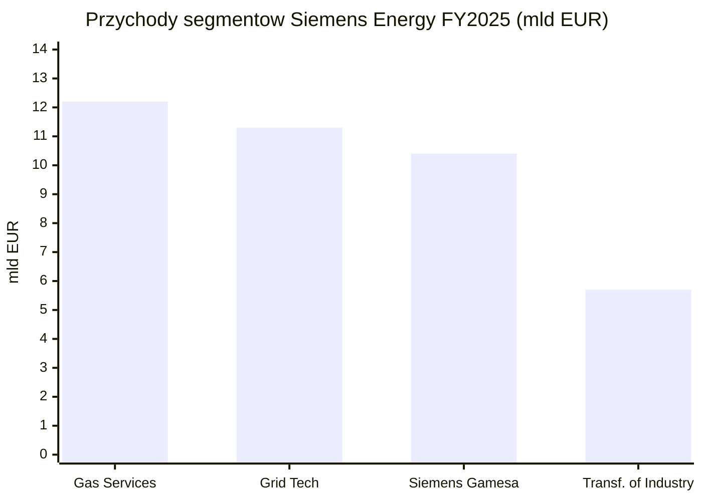
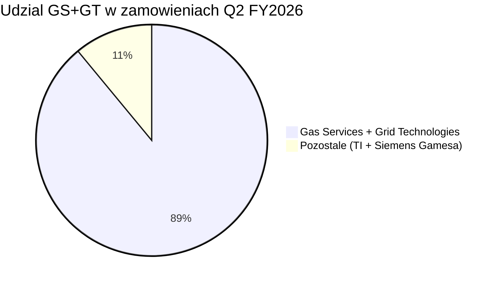
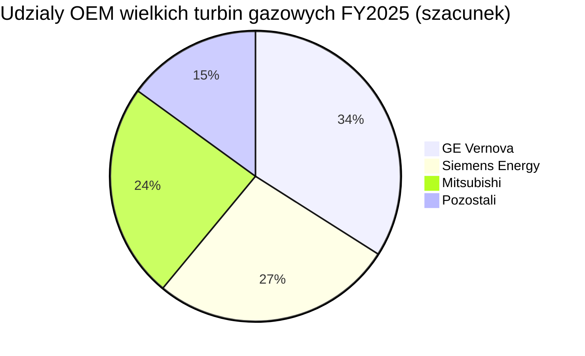

# Siemens Energy (ENR)

<!-- spolki:temat:naziemny-bottleneck-energetyczny-i-sieciowy:start -->
## W kontekscie: Naziemny bottleneck energetyczny i sieciowy

**Czym jest spółka.** Siemens Energy AG to wydzielony w 2020 r. ze Siemensa koncern dostarczający fizyczną infrastrukturę wytwarzania i przesyłu energii. Działa w czterech segmentach: **Gas Services (GS)** - turbiny gazowe i parowe, generatory oraz serwis floty; **Grid Technologies (GT)** - transformatory, rozdzielnice ([[_slownik#switchgear|switchgear]]), połączenia [[_slownik#grid interconnection|HVDC i grid interconnection]]; **Transformation of Industry (TI)** - sprężarki, elektrolizery, ogniwa paliwowe; oraz **Siemens Gamesa (SG)** - turbiny wiatrowe. Jeśli Bloom Energy sprzedaje „szybki megawat za licznikiem", to Siemens Energy dostarcza całą resztę łańcucha: od wielkoskalowej turbiny gazowej w cyklu kombinowanym ([[_slownik#CCGT|CCGT]]) jako źródła [[_slownik#baseload|baseload]], przez generator i system sterowania, aż po transformator i rozdzielnicę łączące kampus AI z siecią. Notowana na Deutsche Boerse (Xetra/Frankfurt, ticker ENR), z ekspozycją głównie europejsko-globalną, choć rdzeń popytu na AI bije dziś w USA.

**Dlaczego to ważne dla centrów danych (data center, DC).** Wąskim gardłem rozbudowy mocy dla AI nie jest dziś sama energia, lecz **sprzęt, który ją wytworzy i przesyła** - w wielkich turbinach gazowych Siemens Energy jest jednym z trzech kluczowych producentów oryginalnego sprzętu (OEM, original equipment manufacturer), a w infrastrukturze sieciowej należy do ważnych globalnych dostawców. Rynek wielkich turbin gazowych (>100 MW) to oligopol, w którym GE Vernova, Mitsubishi i Siemens Energy odpowiadają za ~90% zamówień od 2015 r. (🟠 IEEFA, paź 2025). Po drugiej stronie łańcucha leży deficyt transformatorów i rozdzielnic z wieloletnimi lead time'ami oraz zatkane kolejki przyłączeniowe - co rozwija wątek [[12 - naziemny-bottleneck-energetyczny-i-sieciowy#Brak transformatorów i switchgear: lead times]] oraz [[12 - naziemny-bottleneck-energetyczny-i-sieciowy#Kolejki przyłączeniowe i ograniczenia sieci]]. Zarząd wprost wiąże rekordowy wzrost zamówień z „gwałtownym wzrostem liczby centrów danych wspierających sztuczną inteligencję" (🔵 list do akcjonariuszy Q2 FY2026).

**Mechanizm, który warto zrozumieć:** popyt jest tak wysoki, że ograniczeniem stała się **moc produkcyjna, nie zapotrzebowanie**. W 2024 r. padło ~80 GW zamówień na turbiny gazowe wobec ~30 GW rocznej zdolności produkcyjnej całej trójki OEM, a od 2027 r. zamówienia mają przekroczyć 100 GW/rok (🟠 IEEFA, paź 2025). To odwraca logikę typowego cyklu inwestycyjnego: kto ma sloty produkcyjne i [[_slownik#backlog|backlog]], ten ma silniejszą pozycję negocjacyjną i większą selektywność zamówień. Wątek źródła [[_slownik#baseload|baseload]] dla DC rozwija [[12 - naziemny-bottleneck-energetyczny-i-sieciowy#Energia: baseload, powrót do gazu/jądra, SMR dla DC]].

> **Dla inwestora:** ekspozycja Siemens Energy na temat jest pośrednia, ale strukturalna - spółka nie sprzedaje „rozwiązań DC", lecz turbiny i sprzęt sieciowy, na które popyt napędza właśnie AI. W warunkach, gdy bottleneckiem jest produkcja, a nie popyt, kluczowy staje się backlog i tempo rozbudowy mocy, nie cena jednostkowa.
<!-- spolki:temat:naziemny-bottleneck-energetyczny-i-sieciowy:end -->

<!-- spolki:grafiki:start -->
## Materiały spółki

> Grafiki z materiałów spółki / IR (prawa właściciela, użycie redakcyjne). Pełny rejestr: `Spolki/assets/_licencje.json`.

*Turbina gazowa SGT-400 - pakiet przemysłowy. Źródło: assets.siemens-energy.com; licencja: materiały spółki / IR - prawa właściciela, użycie redakcyjne.*

*Elektrolizer PEM Silyzer - montaż stosu ogniw. Źródło: assets.siemens-energy.com; licencja: materiały spółki / IR - prawa właściciela, użycie redakcyjne.*

*Stacja konwerterowa HVDC - rozwiązanie Back-to-Back. Źródło: assets.siemens-energy.com; licencja: materiały spółki / IR - prawa właściciela, użycie redakcyjne.*

<!-- spolki:grafiki:end -->

<!-- spolki:ekspozycja:start -->
## Ekspozycja na temat w liczbach

**Skala i dynamika.** Rok obrotowy Siemens Energy kończy się 30 września. Za FY2025 (zakończony 30 wrz 2025) przychód wyniósł **39,1 mld EUR (39 077 mln)**, zamówienia **58,9 mld EUR (+17%)**, a [[_slownik#backlog|backlog]] **138 mld EUR**; zysk przed pozycjami specjalnymi skoczył ~6x do **2,36 mld EUR (marża 6,0%)** (🔵 Annual Report 2025, audytowany). Najnowszy raportowany kwartał, **Q2 FY2026 (zakończony 31 mar 2026)**, przyspieszył jeszcze bardziej: przychód **10 294 mln EUR (+8,9% porównywalnie)**, zamówienia **17 749 mln EUR (+29,5% porównywalnie)**, backlog **154 mld EUR**, zysk przed pozycjami specjalnymi **1 164 mln EUR (marża 11,3%)**, zysk netto **835 mln EUR**, a [[_slownik#book-to-bill|book-to-bill]] **1,72x** (🔵 Earnings Release Q2 FY2026, 12 maja 2026, nieaudytowany). Wolne przepływy pieniężne przed opodatkowaniem wyniosły **1 975 mln EUR w Q2** i **4 844 mln EUR w H1 FY2026** (FCF po opodatkowaniu odpowiednio 1 716 mln i 4 523 mln EUR) (🔵 Earnings Release Q2 FY2026). Przy okazji wyników H1 zarząd podniósł guidance na FY2026: porównywalny wzrost przychodu do **14-16%** (z 11-13%), marża zysku przed pozycjami specjalnymi **10-12%** (z 9-11%), zysk netto **~4 mld EUR** (z 3-4 mld EUR) oraz wolne przepływy pieniężne przed opodatkowaniem **~8 mld EUR** (z 4-5 mld EUR) (🔵 Earnings Release Q2 FY2026).

**Per segment (Q2 FY2026, mln EUR; marża = zysk przed pozycjami specjalnymi).** Twardy obraz tego, gdzie bije popyt na DC (🔵 Earnings Release Q2 FY2026):

| Segment | Zamówienia | Przychód | Marża | Backlog | Book-to-bill |
|---|---|---|---|---|---|
| **Gas Services** | 8 869 | 3 478 | 15,9% | 66 mld | 2,55x |
| **Grid Technologies** | 6 996 | 3 067 | 17,1% | 49 mld | 2,28x |
| **Transformation of Industry** | 1 254 | 1 422 | 12,0% | 8 mld | 0,88x |
| **Siemens Gamesa** | 846 | 2 526 | -1,7% | 33 mld | 0,33x |

Guidance per segment na FY2026 (zaktualizowany): Gas Services - porównywalny wzrost przychodu 16-18%, marża 14-16%; Grid Technologies podniesiony do 25-27% wzrostu i marży 18-20% (z 19-21% wzrostu i 16-18% marży); Transformation of Industry 5-7% wzrostu i marża 11-13%; Siemens Gamesa 3-5% wzrostu (z 1-3%) i marża „na poziomie break-even" (🔵 Earnings Release Q2 FY2026).

*Rys. - Cztery segmenty FY2025; GS i GT to rdzeń ekspozycji na DC, SG (wiatr) to obciążenie. Suma segmentów (39,6 mld EUR) przewyższa przychód grupy (39,1 mld EUR) o eliminacje i uzgodnienia konsolidacyjne (transakcje między segmentami oraz pozycje centralne). Dane: 🔵 Siemens Energy Annual Report 2025.*

**Ile z tego to centra danych? NIE UJAWNIONE wprost** - Siemens Energy nie raportuje osobnej linii „przychód z DC". Ekspozycję trzeba proxować przez segmenty. Dwa kluczowe to **Gas Services (12,2 mld EUR, 31% przychodu grupy) i Grid Technologies (11,3 mld EUR, 29%)** - razem **23,5 mld EUR, czyli ~60% przychodu grupy** (🔵 Annual Report 2025). To one wytwarzają turbiny i sprzęt sieciowy dla DC. W ujęciu zamówień ich dominacja jest jeszcze wyraźniejsza.

*Rys. - W Q2 FY2026 GS (8 869 mln EUR) i GT (6 996 mln EUR) wygenerowały 15 865 mln EUR zamówień z 17 749 mln EUR grupy, czyli ~89%. Dane: 🔵 Earnings Release Q2 FY2026.*

**Twardy sygnał z zamówień.** W Q2 FY2026 [[_slownik#book-to-bill|book-to-bill]] wyniósł **2,55x dla GS i 2,28x dla GT** (🔵 Q2 FY2026) - czyli oba segmenty zakontraktowały ponad dwukrotność tego, co zafakturowały, budując bufor backlogu na lata. Zarząd przypisał rekord zamówień GS „głównie popytowi z USA w powiązaniu z centrami danych oraz zamówieniom z Europy (np. Polska)", a wzrost transformatorów w GT „głównie popytowi z USA" (🔵 Q2 FY2026).

**Ile to data center.** Sam zarząd ujawnił, że **ponad 25% portfela zamówień segmentu Gas Services jest związane z zasilaniem centrów danych**; CEO Christian Bruch potwierdził, że „ponad jedna czwarta zamówień turbinowych pochodzi od klientów DC" (🟠 ad-hoc-news / Bloomberg, lut 2026). Przeliczenie na moc: w FY2025 GS pozyskał rekordowe zamówienia turbinowe, a w pierwszych sześciu tygodniach FY2026 zakontraktował **8 GW** nowych turbin gazowych (🟠 stocksfoundry / Bloomberg, gru 2025); przy ~25% udziale DC daje to rząd kilku GW mocy turbinowej rocznie powiązanej z DC. Niezależny broker szacuje **~25% zamówień turbinowych Siemens Energy w FY2025 jako związane z DC** (🟠 Zhongtai Securities / Futunn, 6 lut 2026) - implikuje to ~1 mld EUR rocznego przychodu z nowych jednostek GS bezpośrednio powiązanego z DC, przed sprzętem sieciowym i serwisem. To szacunki, nie guidance spółki; dokładna liczba EUR/GW per DC pozostaje **NIE UJAWNIONA** wprost.

> **Dla inwestora:** brak osobnej linii „DC" oznacza, że ekspozycja jest realna, ale niemierzalna wprost - inwestor patrzy na proxy (udział GS+GT, book-to-bill, komentarz zarządu o USA). Strukturalnie ~60% przychodu i ~90% zamówień (Q2 FY2026) przechodzi przez segmenty bezpośrednio karmione popytem na AI compute.
<!-- spolki:ekspozycja:end -->

<!-- spolki:umowy:start -->
## Kluczowe umowy/wdrozenia - co znacza

Siemens Energy nie ujawnia wartości większości pojedynczych kontraktów DC, ale ujawnione wdrożenia pokazują, w jaki sposób spółka wchodzi w ten rynek - jako dostawca „wyspy energetycznej", nie operator.

- **Eaton (czerwiec 2025):** wspólnie zaprojektowana modułowa elektrownia gazowa **500 MW** dla centrów danych, oparta na wielu jednostkach **SGT-800**; Eaton dostarcza [[_slownik#switchgear|switchgear]], UPS, szyny prądowe i oprogramowanie (🟠 Data Center Dynamics). To rozwiązanie off-grid/za licznikiem - omija kolejkę przyłączeniową, co rozwija wątek [[12 - naziemny-bottleneck-energetyczny-i-sieciowy#Kolejki przyłączeniowe i ograniczenia sieci]]. Wartość NIE UJAWNIONA.
- **Babcock & Wilcox / Applied Digital (sty 2026):** dostawa zespołów turbina parowa + generator dla czterech gazowych bloków po **300 MW** zasilających amerykańskie DC, cel 1 GW online do końca 2028 r. (🟠 IndexBox). Wartość NIE UJAWNIONA. Uwaga: link źródłowy IndexBox jest obecnie niedostępny (404); szczegóły (data, zakres mocy, rola Siemens Energy) wymagają potwierdzenia z raportu B&W (projekt Applied Digital w Dakocie Północnej).
- **Xcel Energy (paź 2025):** **dziesięć turbin SGT6-5000F** na ~**2,08 GW** mocy dyspozycyjnej (🟠 IndexBox). Wartość NIE UJAWNIONA.
- **Rolls-Royce SMR (28 lut 2025):** wyłączne partnerstwo na dostawę turbin parowych, generatorów i systemów pomocniczych dla małych reaktorów modułowych ([[_slownik#SMR|SMR]]) Generacji 3+ (zakres 20-1 900 MW) (🔵 Siemens Energy press release, 28 lut 2025; podsumowanie 🟠 Turbomachinery Int., 20 kwi 2026). Opcja na przyszłe źródło [[_slownik#baseload|baseload]] dla DC - patrz [[12 - naziemny-bottleneck-energetyczny-i-sieciowy#Energia: baseload, powrót do gazu/jądra, SMR dla DC]].

**Inwestycja w moc produkcyjną (3 lut 2026):** Siemens Energy ogłosił **1 mld USD inwestycji w produkcję w USA** i utworzenie **ponad 1 500 wykwalifikowanych miejsc pracy**, skoncentrowanych na turbinach gazowych i technologiach sieciowych, wprost wiążąc inwestycję z popytem na DC i elektryfikację (🔵 Siemens Energy press release US, 3 lut 2026). Zakres lokalizacji (🔵 press release; 🟠 power-eng, 3 lut 2026):

- **Karolina Płn. (Charlotte, Winston-Salem, Raleigh):** wznowienie produkcji turbin gazowych klasy F w Charlotte, rozbudowa produkcji i serwisu wielkich transformatorów, części turbinowe oraz inżynieria/B+R - **~500 miejsc pracy**.
- **Missisipi (rejon Richland):** nowa fabryka wysokonapięciowych rozdzielnic ([[_slownik#switchgear|switchgear]]) z centrum szkoleniowym - **do 300 miejsc pracy**.
- **Floryda (Tampa, Orlando):** rozbudowa produkcji łopatek i kierownic turbin (Tampa), B+R i laboratorium cyfrowych technologii sieciowych z NVIDIA oraz przeniesienie zmodernizowanej siedziby USA do Lake Nona (Orlando).
- **Alabama (Fort Payne):** komponenty miedziane i izolacyjne do generatorów - **~120 miejsc pracy**.
- **Nowy Jork (Painted Post) i Teksas (Houston):** modernizacja produkcji i serwisu sprzętu sprężarkowego dla rurociągów.

Harmonogram szczegółowy (daty uruchomienia poszczególnych fabryk) **NIE UJAWNIONY** - spółka podała jedynie, że plany zostały sfinalizowane na 3 lut 2026 (🔵 press release).

**Moc produkcyjna wielkich turbin (>100 MW).** Rozbudowa ma zwiększyć globalną zdolność o **~20%**. W ujęciu jednostkowym: z **~35 turbin/rok w FY2024-2025 do ~50 turbin/rok w FY2027**, a restart klasy F w Charlotte ma dodać **kolejne 6-8 jednostek** ponad ~50 wcześniej zapowiedzianych (Berlin). W ujęciu mocy: z **~25 GW** w pierwotnym planie na FY2027 do **„up to and beyond 30 GW" do 2030 r.** (🟠 stocksfoundry/Bloomberg, gru 2025; 🟠 E&E News / power-eng, lut 2026). Dla turbin średnich plan zakłada wzrost do ~100 jednostek (z ~50 w FY2024).

**Lead time / wypełnienie mocy.** Popyt strukturalnie wyprzedza podaż: spółka zakontraktowała **8 GW w pierwszych sześciu tygodniach FY2026**, a moce produkcyjne wielkich turbin są **wyprzedane do 2028 r.** - zarząd rezerwuje już sloty dostaw na **2029 r. i później** (🟠 stocksfoundry/Bloomberg, gru 2025). To implikuje efektywny lead time rzędu trzech lat dla nowych zamówień turbinowych. Lead time'y dla transformatorów i switchgear pozostają wieloletnie (🟠 IEEFA), konkretne wartości w miesiącach **NIE UJAWNIONE** przez spółkę.

> **Dla inwestora:** charakterystyczny dla Siemens Energy model to dostawa kompletnej wyspy energetycznej (turbina + generator + sterowanie + przyłącze), często w partnerstwie (Eaton). Brak ujawnionych wartości oznacza, że twardą metryką pozostaje agregat backlogu, nie pojedyncze kontrakty. Inwestycja 1 mld USD w USA to sygnał, że spółka traktuje [[_slownik#capex|capex]] na moc produkcyjną jako odpowiedź na bottleneck podażowy.
<!-- spolki:umowy:end -->

<!-- spolki:pozycja:start -->
## Pozycja rynkowa i udzialy

Pozycja Siemens Energy jest najsilniejsza tam, gdzie temat boli najbardziej - w wielkich turbinach gazowych i w sprzęcie sieciowym.

- **Wielkie turbiny gazowe (>100 MW):** oligopol trzech graczy. GE Vernova, Mitsubishi i Siemens Energy odpowiadają za **~90% zamówień od 2015 r.** (🟠 IEEFA, paź 2025).
- **Udziały OEM FY2025 (szacunek brokera):** **GE Vernova 34%, Siemens Energy 27%, Mitsubishi 24%** (🟠 Zhongtai Securities / Futunn, 6 lut 2026).
- **Szerszy rynek turbin gazowych:** Siemens Energy ~**17%** udziału, **194 turbiny sprzedane w FY2025** - prawie dwukrotnie więcej niż 100 jednostek w FY2024 (🟠 Fact.MR, 25 maja 2026).
- **Serwis floty:** przychód serwisowy to ~**66% sprzedaży segmentu GS** (🔵 Annual Report 2025) - długoterminowe umowy serwisowe i części zamienne tworzą rekurencyjny strumień, który rośnie wraz z instalowaną bazą.

*Rys. - Oligopol trójki OEM; udziały szacunkowe, nie audytowane. Dane: 🟠 Zhongtai Securities / Futunn.*

**Przewaga technologiczna.** Flagowa **SGT5-9000HL** (do 593 MW) jest rekordzistą Guinnessa pod względem sprawności bloku w cyklu kombinowanym (Keadby 2, **64,18%** zweryfikowane w maju 2024) a turbiny klasy HL oferują dziś do 30% współspalania wodoru z mapą drogową do 100% (🔵 HL-class Fact Sheet). Spółka może dostarczyć całą wyspę energetyczną - turbinę gazową, parową, generator, sterowanie (Omnivise T3000) i przyłącze sieciowe - w jednym pakiecie, redukując ryzyko interfejsów dla deweloperów DC (🔵 materiały produktowe).

> **Dla inwestora:** w niszy wielkich turbin Siemens Energy jest jednym z trzech graczy zdolnych w ogóle realizować zamówienia tej skali - to wysoka bariera wejścia oparta na wieloletnio budowanej flocie referencyjnej, certyfikacji i mocy produkcyjnej, nie na cenie. W [[_slownik#grid interconnection|grid interconnection]] i transformatorach rywalizuje z Hitachi Energy i ABB o ten sam zatkany rynek (patrz [[12 - naziemny-bottleneck-energetyczny-i-sieciowy#Brak transformatorów i switchgear: lead times]]).
<!-- spolki:pozycja:end -->

<!-- spolki:konkurencja:start -->
## Mechanika konkurencji - na osiach

Siemens Energy konkuruje na dwóch frontach łańcucha DC: o wytwarzanie (turbiny) i o sieć (transformatory, HVDC, [[_slownik#switchgear|switchgear]]).

**Turbiny gazowe - oligopol trójki:**

| Konkurent | Na czym konkuruje | Pozycja (liczby) |
|---|---|---|
| **GE Vernova (GEV)** | Największy rywal globalny; flota klasy HA, silne pozycjonowanie w USA pod DC | ~34% udziału OEM FY2025 (🟠 Futunn); ~55 GW backlogu gazowego (🟠 IEEFA) |
| **Mitsubishi (MHI)** | Turbiny klasy J chłodzone powietrzem; silny w Azji i na Bliskim Wschodzie | ~24% udziału OEM FY2025 (🟠 Futunn) |
| **Siemens Energy** | Pełna wyspa energetyczna, rekord sprawności CCGT (64,18%) | ~27% udziału OEM FY2025; 194 turbiny FY2025 (🟠 Futunn / Fact.MR) |
| **Ansaldo / BHEL / Solar Turbines (Caterpillar)** | Gracze regionalni i mniejsze turbiny dystrybuowane | Udziały NIE UJAWNIONE |

**Sieć i infrastruktura elektryczna:**

| Konkurent | Na czym konkuruje |
|---|---|
| **Hitachi Energy** | Globalny lider HVDC i transformatorów - główny rywal w przyłączach DC do sieci |
| **Schneider Electric** | Dystrybucja mocy w DC, UPS, switchgear, oprogramowanie |
| **Eaton** | Partner przy 500 MW modułowej elektrowni, jednocześnie rywal w elektrycznym balance-of-plant |
| **ABB** | HVDC, automatyka sieciowa, transformatory |

**Dynamika konkurencji - oś czasu i mocy produkcyjnej.** Kluczowa oś rywalizacji to nie cena, lecz **zdolność dostarczenia**: ~80 GW zamówień turbinowych w 2024 r. wobec ~30 GW rocznej produkcji trójki OEM, z prognozą >100 GW/rok od 2027 r. (🟠 IEEFA). Stąd wyścig na [[_slownik#capex|capex]] produkcyjny: Siemens Energy planuje **+20% globalnej zdolności wielkich turbin** (z ~35 do ~50 jednostek/rok w FY2027, z ~25 do ponad 30 GW do 2030 r.) i rozbudowę footprintu w USA w ramach inwestycji 1 mld USD (🟠 stocksfoundry/Bloomberg, gru 2025; 🟠 power-eng, lut 2026). Mimo to moce są wyprzedane do 2028 r., a sloty rezerwowane są już na 2029 r. (🟠 stocksfoundry, gru 2025). Druga oś to flota referencyjna i sprawność - rekord 64,18% SGT5-9000HL przekłada się na niższy całkowity koszt posiadania (TCO) paliwowy dla operatora baseload.

> **Dla inwestora:** w obecnym cyklu wygrywa nie ten, kto tnie cenę, lecz ten, kto ma sloty produkcyjne i backlog - dlatego rywalizacja przeniosła się na inwestycje w moc wytwórczą. Partner-rywal Eaton pokazuje, że granice konkurencji w warstwie elektrycznej są płynne.
<!-- spolki:konkurencja:end -->

<!-- spolki:przekroj:start -->
## Koncentracja odbiorcow i ryzyka z mechanizmem

**Koncentracja geograficzna.** Siemens Energy nie ujawnia koncentracji pojedynczych klientów, ale ujawnia regionalną: region **Ameryk to ~37% zamówień FY2025 (21,8 mld EUR)**, a **same USA ~29% (17,0 mld EUR)** (🔵 Annual Report 2025). USA to rynek, gdzie deficyt mocy dla DC jest szczególnie widoczny - wpływy zamówień z USA więcej niż podwoiły się r/r w Q2 FY2026 (🔵 Q2 FY2026). To koncentruje ekspozycję na temat właśnie tam, gdzie bottleneck jest szczególnie wyraźny.

**Ryzyka z mechanizmem.** Wszystkie liczby z FY2025 Annual Report (sekcja ryzyk, raport zarządu) uzupełnione komentarzem Q2.

- **Spuścizna wiatru (Siemens Gamesa).** Mechanizm: wady jakościowe platformy onshore i aktualizacje gwarancyjne generują straty i pochłaniają zysk rdzennych segmentów. Kwantyfikacja: **Siemens Gamesa straciła 1,36 mld EUR przed pozycjami specjalnymi w FY2025** (🔵 Annual Report 2025). W Q2 FY2026 strata zawęziła się do **-44 mln EUR (marża -1,7%)** z -249 mln EUR rok wcześniej, głównie dzięki poprawie produktywności i efektywności kosztowej; pojawiły się pierwsze zamówienia na platformę SG 7.0 (następca 5.X) (🔵 Q2 FY2026). Backlog SG to 33 mld EUR, ale book-to-bill spadł do 0,33x (🔵 Q2 FY2026). Zarząd po raz pierwszy podniósł guidance segmentu, zakładając na FY2026 porównywalny wzrost przychodu **3-5%** i marżę **„na poziomie break-even"** (🔵 Earnings Release Q2 FY2026) - sygnał, że ścieżka do wyjścia z czerwieni jest celowana na FY2026, choć segment wciąż pod kreską H1. Zwężenie strat SG było jednym z głównych czynników skokowego wzrostu FCF grupy. To pokazuje, że nawet przy boomie GS/GT jeden segment potrafił rozchwiać wynik grupy, ale jego ciężar maleje.
- **Łańcuch dostaw i moc produkcyjna.** Mechanizm: ograniczenia mocy, niedobory materiałów, wydłużone lead time'y i ryzyko niewypłacalności dostawców tworzą wąskie gardła produkcyjne i kompresję marży. Kwantyfikacja: spółka dodała **„moc produkcyjną" jako nowy istotny temat ryzyka w FY2025** (🔵 Annual Report 2025); marża nowych jednostek GS w Q2 FY2026 była już ściśnięta miksem (15,9% wobec 16,1% rok wcześniej) mimo wyższego wolumenu (🔵 Q2 FY2026). Bezpośrednio łączy się z [[12 - naziemny-bottleneck-energetyczny-i-sieciowy#Brak transformatorów i switchgear: lead times]].
- **Cła i polityka handlowa.** Mechanizm: bariery handlowe i napięcia geopolityczne podnoszą koszty wejściowe i opóźniają projekty. Kwantyfikacja: zarząd wskazał (maj 2025), że bezpośredni wpływ ceł na zysk w H2 FY2025 to kwota „w wysokich dziesiątkach milionów euro" (do ~100 mln EUR) (🟠 Renewables Now); raport roczny odnotowuje negatywny wpływ ceł na GS, GT i SG (🔵 Annual Report 2025).
- **Cykliczność / plateau popytu DC.** Mechanizm: spowolnienie inwestycji [[_slownik#hyperscaler|hyperscalerów]] lub niepewność makro mogą obniżyć popyt. Kwantyfikacja: raport roczny wprost flaguje ryzyko, że „rynki mogą zostać dotknięte zmniejszonym popytem na moc ze strony centrów danych, szczególnie jeśli hyperscalerzy ograniczą inwestycje w infrastrukturę energetyczną" (🔵 Annual Report 2025). To bezpośrednie ostrzeżenie, że teza DC jest cykliczna - rozwija je [[12 - naziemny-bottleneck-energetyczny-i-sieciowy#Zapotrzebowanie DC na moc i prognozy AI compute]].
- **Wykonanie projektów (>100 mln EUR).** Mechanizm: przekroczenia kosztów, defaulty partnerów, wyzwania placowe. Wskaźnik: standardowy proces zatwierdzania ofert i organizacja project-excellence, ale długoterminowe kontrakty offshore SG wymagają klauzul indeksacji i podziału ryzyka wobec inflacji kosztów (🔵 Annual Report 2025).
- **Ryzyko finansowe.** Mechanizm: obniżka ratingu podniosłaby koszty gwarancji i finansowania. Wskaźnik: rating poprawił się do **S&P BBB** (z BBB- na FY2025) i **Moody's Baa1** (z Baa2) wg stanu na HY2026; nowa zakontraktowana linia gwarancyjna **9 mld EUR** łagodzi to ryzyko, a bilans wspiera skorygowana gotówka netto, która wzrosła do **~7,55 mld EUR** na koniec Q2 FY2026 (z +4,79 mld EUR na koniec FY2025) (🔵 Half-year Financial Report 2026; 🔵 Annual Report 2025).

> **Dla inwestora:** najważniejszy mechanizm ryzyka to napięcie między popytem a zdolnością - ten sam bottleneck podażowy, który dziś napędza marże, jutro może je ścisnąć, jeśli ramp produkcji pogorszy miks (sygnał już widoczny w GS Q2 FY2026). Drugie to cykliczność: spółka sama ostrzega przed plateau inwestycji hyperscalerów. Trzecie - „ogon" Siemens Gamesa, który potrafi zjeść zysk rdzenia.
<!-- spolki:przekroj:end -->

<!-- network:peers:start -->
## Powiązane spółki

> Inne notowane spółki z raportu dzielące z tą firmą co najmniej jeden wątek tematyczny (wspólny rynek, technologia lub łańcuch wartości).

- [[Spolki/bloom-energy|Bloom Energy Corporation (BE)]] - Ogniwa paliwowe SOFC dla centrów danych  
  *Wspólne wątki: Naziemny bottleneck.*
- [[Spolki/constellation-energy|Constellation Energy Corporation (CEG)]] - Największy operator floty jądrowej w USA (PPA z hyperskalerami)  
  *Wspólne wątki: Naziemny bottleneck.*
- [[Spolki/eaton|Eaton Corporation plc (ETN)]] - Zasilanie DC (UPS, switchgear) + chłodzenie (Boyd Thermal)  
  *Wspólne wątki: Naziemny bottleneck.*
- [[Spolki/ge-vernova|GE Vernova Inc. (GEV)]] - Turbiny gazowe i infrastruktura sieciowa dla DC  
  *Wspólne wątki: Naziemny bottleneck.*
- [[Spolki/oklo|Oklo Inc. (OKLO)]] - Mikroreaktory (SMR/fission) na potrzeby DC  
  *Wspólne wątki: Naziemny bottleneck.*
- [[Spolki/schneider-electric|Schneider Electric SE (SU)]] - Zasilanie i chłodzenie DC (EcoStruxure, Motivair)  
  *Wspólne wątki: Naziemny bottleneck.*
- [[Spolki/talen-energy|Talen Energy Corporation (TLN)]] - Energia jądrowa (Susquehanna), sąsiedztwo z DC  
  *Wspólne wątki: Naziemny bottleneck.*
- [[Spolki/vertiv|Vertiv Holdings Co (VRT)]] - Zasilanie i precyzyjne/cieczowe chłodzenie DC  
  *Wspólne wątki: Naziemny bottleneck.*
<!-- network:peers:end -->

<!-- spolki:slownik:start -->
## Slowniczek

Terminy techniczne tej notatki linkowane są do wspólnego [[_slownik|słownika vaultu]]. Kluczowe dla Siemens Energy:

- **CCGT** - turbina gazowa w cyklu kombinowanym (z odzyskiem ciepła w turbinie parowej); sprawność ~60%+, skala elektrowni. Flagowa SGT5-9000HL osiąga rekordowe 64,18%.
- **baseload** - moc podstawowa, ciągła; turbiny gazowe i SMR jako źródło stałego zasilania DC.
- **switchgear** - rozdzielnica; aparatura łączeniowa i zabezpieczająca w przyłączu/substacji.
- **grid interconnection** - przyłączenie do sieci przesyłowej (transformatory, HVDC); element zatkanej kolejki.
- **time-to-power** - czas od decyzji do uzyskania dostępnej mocy (kluczowy dla deweloperów DC ścigających się z kolejką przyłączeniową).
- **TCO** - całkowity koszt posiadania (w tym paliwo, gdzie liczy się sprawność turbiny); odrębne pojęcie od time-to-power.
- **backlog** - portfel zamówień (138 mld EUR FY2025, 154 mld EUR Q2 FY2026).
- **book-to-bill** - stosunek zamówień do przychodu; >1 oznacza narastanie backlogu.
- **capex** - nakłady inwestycyjne, tu m.in. na rozbudowę mocy produkcyjnej turbin.
- **hyperscaler** - giganci chmury (Microsoft, Google, Amazon, Oracle) - główne źródło popytu na DC.
- **SMR** - mały reaktor modułowy; Siemens Energy dostarcza „wyspę konwencjonalną" (turbiny/generatory) dla Rolls-Royce SMR.
<!-- spolki:slownik:end -->

<!-- spolki:zrodla:start -->

<!-- spolki:zrodla:end -->

## Notatki wlasne

(sekcja poza zarzadzaniem skilla - miejsce na reczne notatki uzytkownika)
