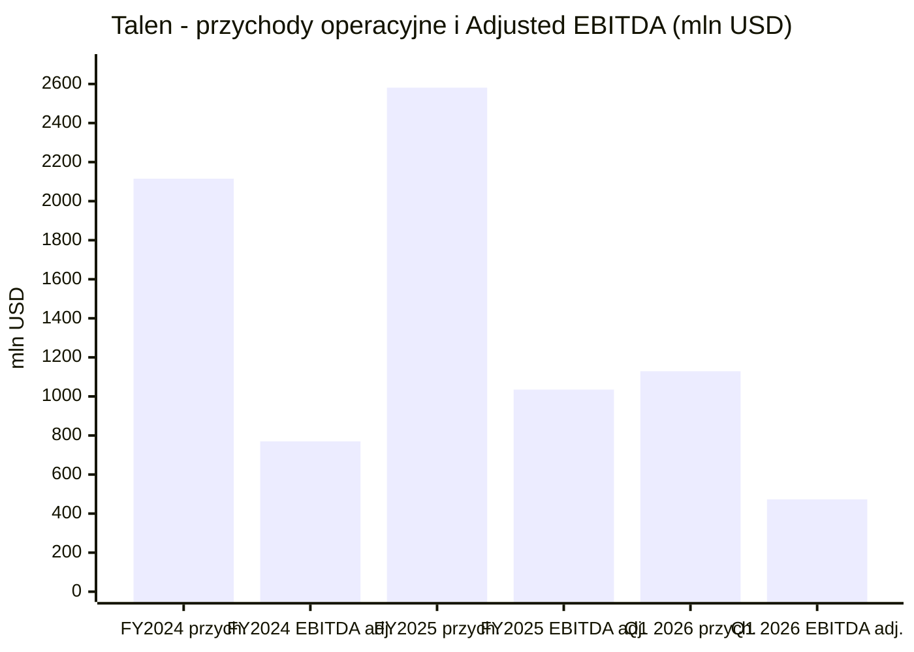
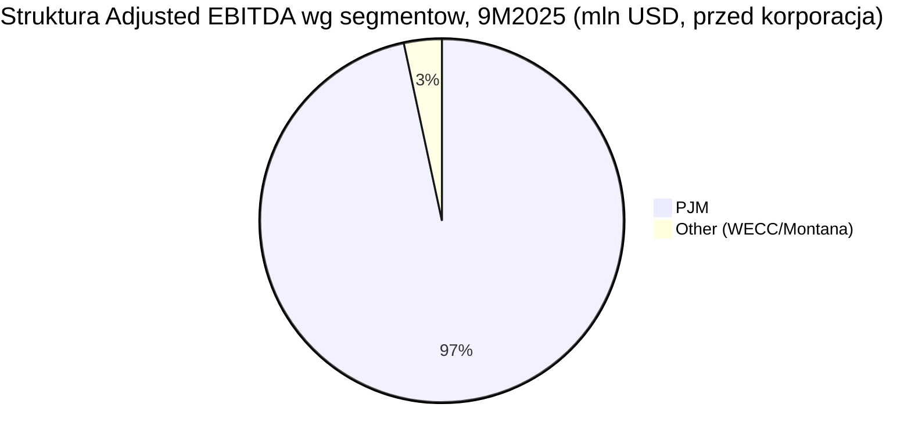
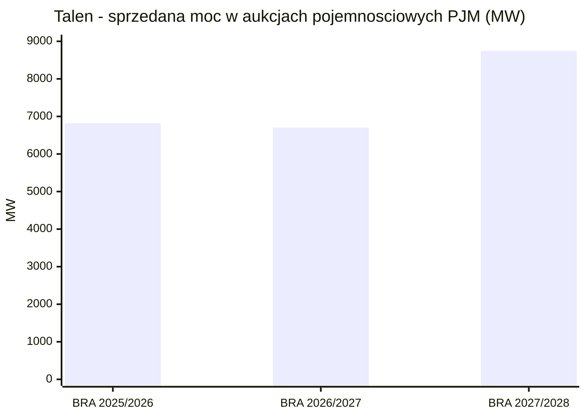

# Talen Energy (TLN)

<!-- spolki:temat:naziemny-bottleneck-energetyczny-i-sieciowy:start -->
## W kontekscie: Naziemny bottleneck energetyczny i sieciowy

**Czym jest spółka.** Talen Energy to niezależny producent energii (IPP - independent power producer) działający głównie na rynku PJM, czyli w organizacji koordynującej hurtowy obrót energią w 13 stanach USA plus Dystrykt Kolumbii. Sercem floty jest elektrownia jądrowa Susquehanna w Salem Township w Pensylwanii - dwa bloki wrzące (BWR) o łącznej mocy brutto 2,5 GW, z czego Talen kontroluje 90%, czyli ok. 2,2 GW netto (🔵 talenenergy.com/powering-data, bez daty). To szósta co do wielkości elektrownia jądrowa w USA, z licencjami pracy do 2042 (Unit 1) i 2044 (Unit 2) oraz trwającymi pracami nad 20-letnim przedłużeniem. Wokół tego rdzenia spółka prowadzi flotę gazową i węglową w PJM oraz nieliczne aktywa w WECC (Montana).

**Dlaczego to ważne dla centrów danych.** Talen jest przykładem spółki z istniejącą mocą jądrową atrakcyjną dla DC: dysponuje dużą, działającą, niskoemisyjną mocą [[_slownik#baseload|baseload]] w lokalizacji już przyłączonej do sieci, czyli z pominięciem wieloletniej kolejki przyłączeniowej dla zupełnie nowego źródła. Susquehanna pracuje w trybie 24/7 z [[_slownik#baseload|baseload]] i wykazuje all-in cost poniżej 24 USD/MWh (2023, cytat z 10-K za 🟠 Utility Dive), do tego korzysta z federalnego Nuclear PTC (kredytu podatkowego za produkcję energii jądrowej) do 15 USD/MWh. Spółka opisuje siebie jako twórcę "world's first 24x7 carbon-free, co-located data center campus" zasilanego z reaktora jądrowego (🔵 talenenergy.com/powering-data). To bezpośrednio rozwija wątek [[12 - naziemny-bottleneck-energetyczny-i-sieciowy#Energia: baseload, powrót do gazu/jądra, SMR dla DC]] oraz [[12 - naziemny-bottleneck-energetyczny-i-sieciowy#Kolejki przyłączeniowe i ograniczenia sieci]].

**Ale jest haczyk, o którym łatwo zapomnieć:** model "za licznikiem" (behind-the-meter, BTM - bezpośrednie zasilanie obiektu z pominięciem publicznej sieci przesyłowej), w którym energia płynie do [[_slownik#hyperscaler|hyperscalera]] z pominięciem sieci publicznej, nie przeszedł przez regulatora. W listopadzie 2024 FERC odrzucił zmianę umowy przyłączeniowej (ISA), która miała pozwolić zwiększyć ko-lokowane obciążenie z 300 MW do 480 MW - z obawy przed przerzucaniem kosztów sieci (do ~140 mln USD/rok) na pozostałych odbiorców (🟠 Utility Dive, Data Center Dynamics). Talen zaskarżył tę decyzję - 28 stycznia 2025 złożył apelację do Sądu Apelacyjnego dla Piątego Okręgu, a równolegle FERC ruszył z szerszym uregulowaniem ko-lokacji (zlecenie dla PJM z 18 grudnia 2025 oraz ANOPR, docket RM26-4) (🟠 Data Center Frontier; 🟠 Utility Dive). Odrzucenie ISA wymusiło restrukturyzację kontraktu na model "przed licznikiem" (front-of-the-meter, FTM), w którym za transmisję odpowiada PPL Electric Utilities, a Talen traci część korzyści BTM (szybsze przyłączenie, brak opłat sieciowych). Wątek [[_slownik#grid interconnection|grid interconnection]] i regulacji wybrzmiewa też w [[12 - naziemny-bottleneck-energetyczny-i-sieciowy#Ziemia, lokalizacja, czas budowy (permitting) jako bottleneck]].

> **Dla inwestora:** Talen monetyzuje istniejący atut (gotowa moc jądrowa przy hubie DC w Pensylwanii), a nie buduje nowy. Przewaga jest funkcją bottlenecku sieciowego - im dłuższe kolejki przyłączeniowe i trudniejszy dostęp do [[_slownik#baseload|baseloadu]], tym cenniejszy działający reaktor. Ale ścieżka regulacyjna (FERC, model BTM vs FTM) jest tu kluczowym i niedomkniętym ryzykiem.
<!-- spolki:temat:naziemny-bottleneck-energetyczny-i-sieciowy:end -->

<!-- spolki:grafiki:start -->
## Materiały spółki

> Grafiki z materiałów spółki / IR (prawa właściciela, użycie redakcyjne). Pełny rejestr: `Spolki/assets/_licencje.json`.

*1. **Kampus Cumulus Data przy Susquehanna - wizualizacja. Źródło: media.datacenterdynamics.com; licencja: materiały spółki / IR - prawa właściciela, użycie redakcyjne.*

*2. **Susquehanna Steam Electric Station - zdjecie. Źródło: www.rtoinsider.com; licencja: materiały spółki / IR - prawa właściciela, użycie redakcyjne.*

<!-- spolki:grafiki:end -->

<!-- spolki:ekspozycja:start -->
## Ekspozycja na temat w liczbach

**Skala i dynamika finansowa.** Za FY2024 (zakończony 31 grudnia 2024) Talen wykazał przychody operacyjne 2 115 mln USD, w tym 192 mln USD capacity revenues i 1 881 mln USD energy and other revenues (te dwie główne pozycje nie sumują się do 2 115; pozostałe ok. 42 mln USD to inne kategorie przychodu) oraz Adjusted EBITDA (non-GAAP) 770 mln USD i Adjusted Free Cash Flow 283 mln USD (🔵 IR FY2024 earnings release). GAAP Net Income przypisany akcjonariuszom wyniósł 998 mln USD, na co wpłynął m.in. zysk ze sprzedaży kampusu AWS. Za pełny rok 2025 (zakończony 31 grudnia 2025, raport z 26 lutego 2026) Talen wykazał przychody operacyjne 2 581 mln USD (w tym 2 141 mln USD energy and other revenues i 485 mln USD capacity revenues; pozycje nie sumują się dokładnie do 2 581), Adjusted EBITDA 1 035 mln USD (+265 mln USD r/r) i Adjusted FCF 524 mln USD (+241 mln USD r/r), przy generacji 39,9 TWh; zaraportowano przy tym GAAP Net Loss przypisany akcjonariuszom -219 mln USD (🔵 Talen IR/GlobeNewswire, FY2025 earnings release, 26 lutego 2026). Q4 2025 dał Adjusted EBITDA 382 mln USD i Adjusted FCF 292 mln USD (🔵 IR FY2025 earnings release). Najnowszy raportowany kwartał (Q1 2026, zakończony 31 marca 2026, raport z 5 maja 2026) pokazuje dalsze przyspieszenie: przychody operacyjne 1 129 mln USD, Adjusted EBITDA 473 mln USD (Adjusted EBITDA ponad podwojony r/r), Adjusted FCF 350 mln USD (FCF poczwórzony r/r), GAAP Net Income 63 mln USD, przy generacji 15,6 TWh i capacity factorze 55,1% - efekt głównie zamkniętych w Q4 2025 akwizycji Freedom i Guernsey (🔵 Talen IR, Q1 2026 earnings release, 5 maja 2026; 🟠 StockTitan, 5-6 maja 2026). Wcześniejszy kwartał Q3 2025 (zakończony 30 września 2025) pokazał przychody operacyjne 812 mln USD (+24,9% r/r), Adjusted EBITDA 363 mln USD (+57,8% r/r) i Adjusted FCF 223 mln USD (🔵 IR 8-K Q3 2025). Motorem są głównie wyższe capacity revenues z aukcji PJM oraz wyższe energy and other revenues.

**Guidance FY2026.** Talen potwierdził (w Q1 2026) widełki Adjusted EBITDA 1 750-2 050 mln USD oraz Adjusted FCF 980-1 180 mln USD na 2026; guidance nie obejmuje jeszcze wpływu akwizycji Cornerstone (🔵 Talen IR, Q1 2026 earnings release, 5 maja 2026). Spółka komunikuje też cel Adjusted FCF powyżej 40 USD/akcję do 2028 (🟠 StockTitan, 15 czerwca 2026).

*Rys. - Skala finansowa Talen: lata obrotowe 2024 i 2025 oraz najnowszy kwartał Q1 2026. Dane: 🔵 Talen IR (FY2024 earnings release; FY2025 earnings release z 26 lutego 2026; Q1 2026 earnings release z 5 maja 2026).*

**Ile z tego to data center? NIE UJAWNIONE wprost.** Talen nie wydziela osobnego segmentu "data center", "Cumulus" ani "digital infrastructure" - przychody z kontraktów DC są wtopione w linię "Energy and other revenues" oraz w skonsolidowane Adjusted EBITDA (🔵 10-Q Q3 2025). Spółka raportuje dwa segmenty operacyjne: PJM i Other. Za 9M2025 segment PJM dał 1 760 mln USD przychodów i 689 mln USD Adjusted EBITDA, segment Other tylko 116 mln USD i 24 mln USD (🔵 10-Q Q3 2025, Note 18). PJM to zatem niemal cały biznes.

*Rys. - Segment PJM (z Susquehanna) generuje 96,6% segmentowego Adjusted EBITDA; "Other" jest marginalny. Korporacyjne koszty/eliminacje -60 mln USD ujęto osobno. Dane: 🔵 Talen 10-Q Q3 2025, Note 18.*

**Proxy na udział DC.** Bezpośredni dzisiejszy udział data center w przychodach jest niski - szacunek roboczy poniżej 5-10% (niezweryfikowany; brak osobnego ujawnienia segmentowego, wartość wyprowadzona z poniższych pozycji przychodu). "Digital revenue + Nuclear PTC" spadły w Q3 2025 r/r o 92 mln USD (z czego sam Nuclear PTC to 67 mln USD w Q3 2024), a "Other revenue from customers" za 9M2025 wyniosło 0 mln USD wobec 91 mln USD w 9M2024 - to efekt sprzedaży kampusu Cumulus i tego, że [[_slownik#PPA|PPA]] z AWS dopiero się rampuje (🔵 10-Q Q3 2025). Perspektywicznie jednak [[_slownik#offtake|offtake]] z AWS ma realny ciężar: ~18 mld USD przez 17 lat to średnio ~1,06 mld USD/rok w całym okresie kontraktu (🟠 Utility Dive; obliczenie orientacyjne). Uwaga: to średnia z całego okresu, a nie run-rate po pełnej rampie - run-rate przy mocy 1 920 MW od ok. 2032 będzie wyższy niż wczesnolatowy, a niższy w fazie rampy, więc średnia nie jest wprost docelowym poziomem rocznym. Orientacyjnie ~1,06 mld USD odpowiada ok. 41% przychodów względem bazy FY2025 (2 581 mln USD) i ok. 50% względem FY2024 (2 115 mln USD). Implikowana cena kontraktu AWS to ok. 68,90 USD/MWh (z ~18 mld USD przy do 1 920 MW przez 17 lat), znacząco powyżej all-in cost Susquehanna ok. 27 USD/MWh w 2025 - to skala marży, jaką PPA wnosi dla Talen (🟠 POWER Magazine, czerwiec 2025; 🟠 EnkiAI). Udział Amazona w całkowitych przychodach Talen na koniec FY2025 pozostaje niski, bo PPA dopiero się rampuje, a precyzyjna miara koncentracji odbiorcy: NIE UJAWNIONE (Talen nie raportuje rozbicia przychodów na pojedynczych klientów).

**Uwaga na [[_slownik#backlog|backlog]].** Talen nie podaje tradycyjnego [[_slownik#backlog|backlogu]] DC. Raportowane "Future Performance Obligations" dotyczą wyłącznie capacity revenues (głównie PJM BRA): Q4 2025 - 163 mln USD, 2026 - 733 mln USD, 2027 - 328 mln USD, 2028+ - 0 mln USD (🔵 10-Q Q3 2025, Note 3). Pozorna sprzeczność z tabelą aukcji (gdzie rok planistyczny 2027/2028 daje ~1 067 mln USD) wynika z różnicy konwencji: FPO ujmuje zakontraktowane zobowiązania w latach kalendarzowych według stanu na datę raportu (30 września 2025), podczas gdy rok planistyczny PJM biegnie od czerwca do maja, a wyniki aukcji BRA 2027/2028 (ogłoszone w grudniu 2025) były po cutoffie tego 10-Q i dlatego nie weszły jeszcze do tabeli FPO. Co istotne, te liczby NIE obejmują długoterminowego [[_slownik#PPA|PPA]] z AWS (do 1 920 MW do 2042), który jest ujmowany w "Energy and other revenues" i nie wchodzi do tej tabeli.

> **Dla inwestora:** dzisiejsza ekspozycja na DC jest mała i wręcz malejąca (po sprzedaży Cumulus), ale to obraz przed rampą. Cały ciężar tematu DC w Talen jest w przyszłości - w [[_slownik#PPA|PPA]] z AWS, który nie pokazuje się jeszcze ani w przychodach, ani w raportowanych "Future Performance Obligations".
<!-- spolki:ekspozycja:end -->

<!-- spolki:umowy:start -->
## Kluczowe umowy/wdrozenia - co znacza

**AWS PPA to dziś flagowy kontrakt - i sedno tezy DC.** W czerwcu 2025 Talen rozszerzył umowę z Amazon Web Services na dostawę do 1 920 MW energii jądrowej z Susquehanna do 2042; kontrakt 17-letni, szacowana wartość ~18 mld USD, implikowana cena ok. 68,90 USD/MWh, z rampą 840-1 200 MW do 2029 i 1 680-1 920 MW do 2032 (pełny zakontraktowany wolumen najpóźniej w 2032) (🟠 Utility Dive; 🟠 POWER Magazine, czerwiec 2025; 🟠 DCD). Strukturę potwierdza sama spółka: kontrakt jest w modelu front-of-the-meter, transmisją zajmuje się PPL Electric Utilities - co jest bezpośrednim następstwem odrzucenia BTM ISA przez FERC (🔵 talenenergy.com/powering-data). Amazon ma planować ok. 20 mld USD nakładów na centra danych w Pensylwanii (🟠 Utility Dive).

**Wcześniejsza transakcja założycielska - sprzedaż kampusu Cumulus.** W marcu 2024 Talen sprzedał AWS kampus data center Cumulus o mocy 960 MW za 650 mln USD (350 mln USD przy zamknięciu + 300 mln USD escrow), na działce 1 200 akrów, oddzielając wcześniejszą kopalnię kryptowalut Nautilus (🔵 IR news release). To zdarzenie jednorazowe - zysk poprawił FY2024, ale się nie powtarza, co tłumaczy spadek "digital revenue" w 2025.

**Zabezpieczanie dodatkowej mocy pod duże obciążenia (akwizycje gazowe).** Aby zwiększyć flotę pod popyt DC i dużych odbiorców, Talen przejął ok. 2,8 GW CCGT w PJM - Freedom i Guernsey - za 3,8 mld USD gotówki; transakcję zamknięto 25 listopada 2025 (🔵 IR FY2025 earnings release, 26 lutego 2026; 🔵 10-Q Q3 2025, Note 17). Doszła też akwizycja Cornerstone (2 451 MW gazu w PJM: Lawrenceburg 1 120 MW w Indianie, Waterford 875 MW i Darby 456 MW w Ohio) od Energy Capital Partners za 3,45 mld USD (ok. 2,55 mld USD gotówki + ok. 900 mln USD akcjami, tj. 2 399 998 akcji); podpisana 15 stycznia 2026 i zamknięta 15 czerwca 2026 (🔵 Talen IR, 8-K z 15 czerwca 2026; 🟠 StockTitan; 🟠 Utility Dive). Spółka wyceniła Cornerstone na ok. 6,6x 2027E Adjusted EBITDA i wskazuje akrecję Adjusted FCF/akcję ponad 15% rocznie do 2030 (🟠 StockTitan). Osobno działają umowy niezawodnościowe RMR (Reliability-Must-Run) dla Brandon Shores i H.A. Wagner: łącznie 180 mln USD/rok (145 mln + 35 mln) do 31 maja 2029 - utrzymują w ruchu moc w regionie istotnym dla DC (🔵 IR Q1 2025).

| Kontrakt / wydarzenie | Skala | Wartość | Źródło |
|---|---|---|---|
| AWS PPA (czerwiec 2025) | do 1 920 MW, do 2042 | ~18 mld USD (17 lat); ~68,90 USD/MWh | 🟠 Utility Dive / POWER Magazine |
| Sprzedaż kampusu Cumulus (marzec 2024) | 960 MW, 1 200 akrów | 650 mln USD | 🔵 IR news release |
| Akwizycja Freedom + Guernsey (zamkn. 25 lis 2025) | ~2,8 GW CCGT | 3,8 mld USD gotówki | 🔵 IR FY2025 |
| Akwizycja Cornerstone (zamkn. 15 cze 2026) | 2 451 MW gazu | 3,45 mld USD (2,55 mld gotówka + 0,9 mld akcje) | 🔵 IR 8-K / 🟠 StockTitan |
| RMR Brandon Shores + H.A. Wagner | utrzymanie mocy do 2029 | 180 mln USD/rok | 🔵 IR Q1 2025 |

> **Dla inwestora:** Talen dokonał zwrotu od "sprzedaży kampusu DC" (jednorazowa gotówka) do "sprzedaży energii do kampusu DC" (wieloletni strumień [[_slownik#PPA|PPA]]). Ten drugi model jest trwalszy, ale uzależniony od jednego [[_slownik#hyperscaler|hyperscalera]] i od regulatora, który już raz zablokował preferowaną strukturę.
<!-- spolki:umowy:end -->

<!-- spolki:pozycja:start -->
## Pozycja rynkowa i udzialy

**Flagowy atut: Susquehanna.** Moc brutto 2,5 GW (2 bloki BWR), udział Talen 90% (2,2 GW netto), szósta największa elektrownia jądrowa w USA, licencje do 2042/2044 z pracami nad 20-letnim przedłużeniem. All-in cost poniżej 24 USD/MWh (2023), produkcja ponad 18 TWh przy 90% udziale (2023), plus Nuclear PTC (kredyt podatkowy za produkcję jądrową) do 15 USD/MWh (🔵 talenenergy.com/powering-data; dane kosztowe i produkcyjne za 🟠 Utility Dive jako cytat z 10-K). Łączna produkcja całej floty w FY2024 to 36,3 TWh, z czego 50% to generacja bezemisyjna (🔵 IR FY2024). Uwaga: produkcja Susquehanna ponad 18 TWh dotyczy 2023, a 36,3 TWh całej floty FY2024 - to różne lata, więc zestawienie obu jako udziału jest jedynie orientacyjne.

**Udział w rynku DC power: NIE UJAWNIONY.** Nie istnieje twarda miara udziału w wąskim rynku "zasilanie DC z reaktora". W wąskiej niszy "bezpośrednie zasilanie DC z reaktora jądrowego" Talen był pierwszym graczem w USA (first-mover). Miarą skali ekspozycji na PJM i rynek capacity (a nie udziału w rynku zasilania DC) są aukcje pojemnościowe PJM, gdzie wolumeny i ceny rosną:

| Aukcja PJM BRA | Wolumen Talen | Cena (USD/MW-dzień) | Przychód pojemnościowy/rok |
|---|---|---|---|
| 2025/2026 | 6 820 MW | 269,92 | ~670 mln USD |
| 2026/2027 | 6 702 MW | 329,17 | ~805 mln USD |
| 2027/2028 | 8 745 MW | 333,44 | ~1 067 mln USD |

*(🔵 Talen IR - komunikaty o wynikach aukcji PJM BRA.)*

*Rys. - Wolumen mocy sprzedanej przez Talen w kolejnych aukcjach PJM; rosnące ceny (270 -> 333 USD/MW-dzień) podnoszą przychody pojemnościowe. Dane: 🔵 Talen IR.*

**Flota i moc po Cornerstone.** Po zamknięciu Cornerstone (15 czerwca 2026) Talen operuje flotą ok. 15,6 GW (15 559 MW pro forma), w tym ok. 2,2 GW jądra (Susquehanna, udział Talen) oraz nowo dodane 2 451 MW gazu w zachodnim PJM; wcześniej Freedom i Guernsey dodały ok. 2,8 GW gazu (zamknięcie 25 listopada 2025) (🔵 Talen IR, 8-K z 15 czerwca 2026; 🟠 StockTitan).

W całym PJM (szczytowe zapotrzebowanie prognozowane na ~157 GW dla roku 2026/2027) udział Talen w aukcjach capacity to kilka procent (orientacyjnie ok. 8,7 GW zakontraktowanych w BRA 2027/2028 wobec ~135-150 GW całkowitej cleared capacity, czyli rząd 6%; udział liczony względem cleared capacity, nie zainstalowanej mocy Talen). Bariery wejścia, które chronią pozycję: licencje NRC i działający reaktor z horyzontem do lat 2040+, gotowa infrastruktura przyłączeniowa i woda chłodząca, lokalizacja w PJM (Pensylwania jako hub DC), know-how negocjacji BTM/FTM z FERC/PJM oraz skala floty gazowej (~15,6 GW łącznej mocy po zamknięciu akwizycji), pozwalająca oferować moc "grid-supported".

> **Dla inwestora:** pozycja Talen w temacie DC opiera się na unikatowym aktywie (Susquehanna) i statusie first-movera, a nie na udziale rynkowym mierzalnym liczbą. Bieżąca skala finansowa jest zaś napędzana głównie przez rosnące ceny capacity w PJM - to dwa różne źródła wartości.
<!-- spolki:pozycja:end -->

<!-- spolki:konkurencja:start -->
## Mechanika konkurencji - na osiach

Konkurencja toczy się o to samo: zakontraktować [[_slownik#hyperscaler|hyperscalera]] na wieloletni [[_slownik#baseload|baseload]], najlepiej jądrowy lub gazowy. Talen ma jednego klienta (Amazon) i jeden flagowy reaktor; więksi rywale mają szerszą flotę i więcej umów.

- **Constellation Energy (CEG)** - największy operator jądrowy w USA (~22 GW jądra przed Calpine, ~55-60 GW total po Calpine). Umowy: Microsoft (restart Three Mile Island / Crane CEC, 835 MW, 20 lat) oraz Meta (Clinton, 1 121 MW + 30 MW uprate, 20 lat). Oś: skala jądrowa, relacje z [[_slownik#hyperscaler|hyperscalerami]], capacity factor floty >94% (🟠 Yahoo Finance, USeluminix).
- **Vistra Corp (VST)** - portfel hybrydowy ~41-44 GW total, w tym ~6,4 GW jądra; retail z 5 mln klientów. Umowy: Meta (Perry/Davis-Besse/Beaver Valley, 2 176 MW + 433 MW uprates = 2,6 GW, 20 lat) i AWS (Comanche Peak do 1 200 MW). Oś: mix gaz+jądro, retail, szybkość (🟠 USeluminix, POWER Magazine).
- **NRG Energy (NRG)** - ~25 GW total, głównie gaz, po akwizycji od LS Power. 445 MW zakontraktowane + pipeline 6,4 GW gazu dla DC. Oś: szybkość dostawy mocy gazowej, "bring-your-own-power" w ERCOT/PJM (🟠 USeluminix).

Tło dopełniają PSEG (~3,8 GW jądra, regulowane plany DC w NJ) i NextEra (Google: restart Duane Arnold, ~600-630 MW), a także deweloperzy [[_slownik#SMR|SMR]] (TerraPower, Oklo, X-energy, NuScale) - na razie bez istotnych przychodów.

| Oś konkurencji | Talen | Constellation | Vistra | NRG |
|---|---|---|---|---|
| Cena / koszt | jądro all-in <24 USD/MWh | skala obniża koszt; restart TMI ~1,6 mld USD | gaz tańszy krótkoterminowo + jądro z uprate | gaz, szybka dostawa |
| Niezawodność | Susquehanna - wysoki capacity factor, 24/7 [[_slownik#baseload|baseload]] (brak ujawnionej metryki "top-decile") | capacity factor floty >94% | mieszany: gaz szczytowy + jądro baseload | gaz, szybka dyspozycyjność |
| Heritage / lokalizacja | pierwszy ko-lokowany DC+jądro w USA | największy operator jądrowy USA | 4 reaktory w PJM, retail | silna pozycja ERCOT/PJM |
| Time-to-market | Susquehanna już działa; pełna rampa do 2032 | TMI restart 2027-2028, Clinton 2027 | Perry/Davis-Besse od 2026 | gaz: najkrótszy lead time |

*Uwaga: poza all-in cost Talena (<24 USD/MWh) komórki kosztu i szybkości to oceny jakościowe i orientacyjne, bez ujednoliconych widełek cen i lead time'ów - traktować jako kierunkowe, nie jako twarde porównanie liczbowe.*

> **Dla inwestora:** Talen wygrywa unikatowością i statusem first-movera w niszy jądro+DC, ale konkurenci o większej skali ([[_slownik#offtake|offtake]] z Microsoftem, Metą, AWS na wielu reaktorach) mogą przebijać ceny i oferować większy wolumen. Mechanizm presji: dłuższe [[_slownik#PPA|PPA]] mogą być zawierane po niższych cenach, a model jądro+DC przestaje być wyjątkowy w miarę upowszechniania.
<!-- spolki:konkurencja:end -->

<!-- spolki:przekroj:start -->
## Koncentracja odbiorcow i ryzyka z mechanizmem

**Koncentracja na jednym kliencie DC.** Amazon/AWS jest de facto jedynym dużym klientem data center Talen. Przyszłe przepływy z tematu DC są więc silnie skupione na jednym [[_slownik#offtake|offtake]]. Mechanizm: utrata Amazona, opóźnienia w budowie DC, spowolnienie AI/ML lub zmiana struktury umowy mogłyby obniżyć oczekiwane ~18 mld USD z kontraktu [[_slownik#PPA|PPA]] (🟠 Utility Dive). Brak dywersyfikacji klientów DC zwiększa wrażliwość całej tezy.

**Ryzyko regulacyjne (FERC/PJM) - już zmaterializowane raz.** 1 listopada 2024 FERC odrzucił BTM ISA, blokując rozszerzenie ko-lokowanego obciążenia z 300 MW do 480 MW; powodem była obawa o przerzucanie kosztów sieci (do ~140 mln USD/rok) na innych odbiorców oraz kwestie niezawodności (🟠 Utility Dive, DCD, Davis Graham). Po odrzuceniu wniosku o rehearing Talen zaskarżył decyzję - 28 stycznia 2025 złożył apelację do Sądu Apelacyjnego dla Piątego Okręgu (Fifth Circuit Court of Appeals) (🟠 Data Center Frontier; 🟠 ANS). Równolegle FERC ruszył z ogólnokrajowym uregulowaniem ko-lokacji: 18 grudnia 2025 wydał zlecenie nakazujące PJM stworzyć nowe zasady dla ko-lokowanych obciążeń (trzy nowe usługi przesyłowe: interim non-firm, firm contract demand, non-firm contract demand) oraz zrewidować reguły generacji za licznikiem; PJM ma 60 dni na propozycje w trybie paper hearing, a do 19 stycznia 2026 złożyć raport o propozycjach Critical Issue Fast Path (CIFP) (🟠 Utility Dive, 18-19 grudnia 2025; 🟠 Akerman). Tłem jest ANOPR ws. przyłączania dużych obciążeń (>20 MW) do sieci międzystanowej, zainicjowany na wniosek Sekretarza Energii z 23 października 2025 (docket RM26-4) (🟠 Utility Dive / FERC; 🟠 Womble Bond Dickinson). Mechanizm: zakwestionowanie modelu BTM wymusiło przejście na FTM, co wymaga rozbudowy transmisji i odbiera część korzyści (szybkie przyłączenie, brak opłat sieciowych). Wpływ na rampę AWS PPA: kontrakt już działa w modelu FTM przez PPL Electric Utilities, więc dostawy nie są zależne od rozstrzygnięcia apelacji BTM, ale ostateczny kształt reguł CIFP/ANOPR pozostaje czynnikiem ryzyka dla tempa rozbudowy ko-lokowanego obciążenia - kontekst rozwija [[12 - naziemny-bottleneck-energetyczny-i-sieciowy#Kolejki przyłączeniowe i ograniczenia sieci]].

**Ryzyko cyklu technologicznego (SMR i uprates).** 19 marca 2026 Talen i X-energy podpisały list intencyjny (LOI) na ocenę wdrożenia reaktorów SMR Xe-100 w Pensylwanii i szerzej w PJM - obejmuje studia wykonalności, ocenę lokalizacji oraz potencjalną konwersję sites kopalnianych/gazowych na jądro; to wciąż wczesny etap, bez ujawnionych twardych terminów ani celów MW (🟠 World Nuclear News / NucNet, marzec 2026). Talen wraz z Amazonem deklaruje też zamiar rozbudowy mocy Susquehanna przez uprate'y, z intencją dodania net-new energy do PJM, ale konkretny zakres MW i harmonogram uprate'ów: NIE UJAWNIONE (uprate wymaga zgód NRC) (🟠 World Nuclear News, 2026). [[_slownik#SMR|SMR]] są wczesnie w komercjalizacji (pierwsze wdrożenia w USA ~2030-2035). Mechanizm: opóźnienia lub wzrost kosztów uprates/SMR mogą opóźnić pełną rampę 1 920 MW do 2032+.

**Ryzyko rynku energii i hedgingu.** Talen to w dużej mierze merchant generator w PJM - ceny energii i capacity są zmienne. Hedging: 100% oczekiwanej generacji na 2025, ~60% na 2026, ~25-33% na 2027 (🔵 dane spółki z materiałów IR). Wysokie ceny aukcji (269-333 USD/MW-dzień) są korzystne, ale mogą się odwrócić. Mechanizm: spadek cen PJM obniżyłby EBITDA segmentu PJM, w którym dziś jest 96,6% segmentowego Adjusted EBITDA (9M2025).

**Ryzyko bilansu i rozwodnienia (M&A).** Akwizycje Freedom/Guernsey (3,8 mld USD gotówki, zamknięte 25 listopada 2025) i Cornerstone (3,45 mld USD, w tym ok. 2,55 mld USD gotówki i ok. 900 mln USD akcjami - 2 399 998 akcji - podpisana 15 stycznia 2026, zamknięta 15 czerwca 2026) finansowane są m.in. emisją obligacji (🔵 IR FY2025; 🟠 StockTitan; 🟠 Utility Dive). 17 kwietnia 2026 Talen Energy Supply wycenił 4 mld USD senior notes w private placement: 1,5 mld USD obligacji 6,125% z terminem 2031 i 2,5 mld USD obligacji 6,375% z terminem 2033 (zamknięcie ~29 kwietnia 2026); wpływy przeznaczono na sfinansowanie Cornerstone (2 451 MW) oraz pełny wykup obligacji 8,625% senior secured due 2030 (1,2 mld USD) - co obniża roczne koszty odsetkowe o ponad 40 mln USD i dodaje blisko 1 USD/akcję do FCF (🟠 StockTitan / TipRanks, 17 kwietnia 2026). Net leverage ratio wynosił 3,1x na 31 marca 2026 (na bazie forecastu 2026, z wyłączeniem długu Cornerstone), przy targecie net leverage <3,5x net debt/Adjusted EBITDA i deklaracji osiągnięcia <3,5x do końca 2026 (🟠 StockTitan; 🔵 IR FY2025/Q1 2026). Total available liquidity to ~2,1 mld USD na 20 lutego 2026 (1,2 mld USD gotówki + 0,9 mld USD dostępnego revolvera) (🔵 IR FY2025 earnings release). Liczba akcji spadła z ~59 mln (koniec 2023) do ~45,7 mln (Q3 2025) dzięki buybackom, a emisja ~2,4 mln akcji na Cornerstone częściowo to odwraca. Mechanizm: rosnący dług i rozwodnienie obciążają bilans; realizacja targetu leverage zależy od EBITDA.

**Ryzyko dostaw paliwa i ESG.** Paliwo jądrowe jest w pełni skontraktowane do 2027, prawie w pełni do 2028 i >70% do 2029 (🔵 FY2024 earnings release); koncentracja światowych dostawców uranu i usług konwersji (Rosja, Kazachstan) tworzy ryzyko łańcucha dostaw. Pozostałe aktywa węglowe (Brandon Shores, H.A. Wagner, Brunner Island, Colstrip) podlegają regulacjom EPA, z odpowiednimi ARO - przyspieszone wycofywanie węgla mogłoby obniżyć przepływy z aktywów konwencjonalnych.

> **Dla inwestora:** profil ryzyka Talen jest skoncentrowany w dwóch punktach - jeden klient DC (Amazon) i jeden regulator (FERC), który już raz zablokował preferowaną strukturę. Do tego dochodzi typowe dla merchant IPP ryzyko cen energii oraz lewarowany bilans po fali akwizycji gazowych.
<!-- spolki:przekroj:end -->

<!-- network:peers:start -->
## Powiązane spółki

> Inne notowane spółki z raportu dzielące z tą firmą co najmniej jeden wątek tematyczny (wspólny rynek, technologia lub łańcuch wartości).

- [[Spolki/bloom-energy|Bloom Energy Corporation (BE)]] - Ogniwa paliwowe SOFC dla centrów danych  
  *Wspólne wątki: Naziemny bottleneck.*
- [[Spolki/constellation-energy|Constellation Energy Corporation (CEG)]] - Największy operator floty jądrowej w USA (PPA z hyperskalerami)  
  *Wspólne wątki: Naziemny bottleneck.*
- [[Spolki/eaton|Eaton Corporation plc (ETN)]] - Zasilanie DC (UPS, switchgear) + chłodzenie (Boyd Thermal)  
  *Wspólne wątki: Naziemny bottleneck.*
- [[Spolki/ge-vernova|GE Vernova Inc. (GEV)]] - Turbiny gazowe i infrastruktura sieciowa dla DC  
  *Wspólne wątki: Naziemny bottleneck.*
- [[Spolki/oklo|Oklo Inc. (OKLO)]] - Mikroreaktory (SMR/fission) na potrzeby DC  
  *Wspólne wątki: Naziemny bottleneck.*
- [[Spolki/schneider-electric|Schneider Electric SE (SU)]] - Zasilanie i chłodzenie DC (EcoStruxure, Motivair)  
  *Wspólne wątki: Naziemny bottleneck.*
- [[Spolki/siemens-energy|Siemens Energy AG (ENR)]] - Turbiny gazowe i technologie sieciowe (EU)  
  *Wspólne wątki: Naziemny bottleneck.*
- [[Spolki/vertiv|Vertiv Holdings Co (VRT)]] - Zasilanie i precyzyjne/cieczowe chłodzenie DC  
  *Wspólne wątki: Naziemny bottleneck.*
<!-- network:peers:end -->

<!-- spolki:slownik:start -->
## Slowniczek

Część terminów technicznych linkowana jest do wspólnego [[_slownik|słownika vaultu]]; nie wszystkie skróty są jednak rozwinięte przy pierwszym użyciu (np. PJM, FERC, ISA, WECC, NRC, CCGT, BRA, GAAP, EBITDA, FCF, ARO - ich rozwinięcie to kierunek do uzupełnienia). Najważniejsze lokalne pojęcia:

- **[[_slownik#baseload|baseload]]** - moc podstawowa, dostarczana w sposób ciągły 24/7; jądro Susquehanna to klasyczne źródło baseload.
- **[[_slownik#PPA|PPA]]** - długoterminowa umowa kupna energii (zwykle 10-20 lat) po ustalonych warunkach; tu PPA z AWS do 2042.
- **[[_slownik#offtake|offtake]]** - zobowiązanie odbioru ustalonego wolumenu energii przez klienta; sednem tezy DC Talen jest offtake od jednego hyperscalera.
- **[[_slownik#hyperscaler|hyperscaler]]** - gigant chmury obliczeniowej (tu Amazon/AWS).
- **behind-the-meter (BTM) / front-of-the-meter (FTM)** - dwa modele przyłączenia: BTM to zasilanie obiektu bezpośrednio od źródła, z pominięciem pełnego przyłącza i opłat sieciowych; FTM to dostawa przez publiczną sieć przesyłową (tu transmisją zajmuje się PPL Electric Utilities). To modele przyłączenia, a nie typ odbiorcy.
- **[[_slownik#grid interconnection|grid interconnection]]** - przyłączenie do sieci przesyłowej; kolejki i ograniczenia tworzą naziemny bottleneck.
- **[[_slownik#SMR|SMR]]** - mały modułowy reaktor (we wczesnej komercjalizacji).
- **Nuclear PTC** - federalny kredyt podatkowy za produkcję energii jądrowej (do 15 USD/MWh); to instrument podatkowy, nie technologia, i nie należy go mylić z SMR.
- **[[_slownik#capex|capex]]** - nakłady inwestycyjne; tu m.in. akwizycje gazowe i potencjalne uprates/SMR.
- **[[_slownik#backlog|backlog]]** - portfel zakontraktowanych zobowiązań; Talen raportuje tylko "Future Performance Obligations" dla capacity (bez AWS PPA).

Jednostka ceny capacity w aukcjach PJM to USD/MW-dzień (cena za 1 MW zakontraktowanej mocy za każdą dobę roku planistycznego). Pozostałe pojęcia specyficzne dla Talen (PJM, BTM/FTM, FERC, ISA, RMR, capacity factor, spark spread) wyjaśniono przy pierwszym użyciu w treści notatki.
<!-- spolki:slownik:end -->

<!-- spolki:zrodla:start -->
## Zrodla

- 🔵 Talen Energy - FY2024 earnings release (przychody, EBITDA, generacja) - https://ir.talenenergy.com/node/8356/pdf
- 🔵 Talen Energy - 8-K Q3 2025 (przychody, EBITDA, FCF, liquidity) - https://ir.talenenergy.com/static-files/11bfe1be-2926-4f21-b4a3-ab5854094b89
- 🔵 Talen Energy - 10-Q Q3 2025 (segmenty Note 18, Future Performance Obligations Note 3, akwizycje Note 17) - https://ir.talenenergy.com/static-files/826c1e66-b882-48e8-acda-84b8033ab2ac
- 🔵 Talen Energy - 8-K/10-Q Q1 2025 (gotówka, dług, leverage, RMR) - https://ir.talenenergy.com/node/8561/html
- 🔵 Talen Energy - "Powering Data" (Susquehanna 2,5 GW, 90%, licencje, PTC, model BTM/FTM) - https://www.talenenergy.com/powering-data/
- 🔵 Talen Energy - sprzedaż kampusu Cumulus Data (960 MW, 650 mln USD) - https://ir.talenenergy.com/news-releases/news-release-details/talen-energy-announces-sale-zero-carbon-data-center-campus
- 🔵 Talen Energy - wyniki aukcji PJM BRA 2026/2027 - https://talenenergy.gcs-web.com/news-releases/news-release-details/talen-energy-reports-pjm-auction-results-20262027-planning-year
- 🔵 Talen Energy - wyniki aukcji PJM BRA 2025/2026 - https://ir.talenenergy.com/node/7766/pdf
- 🔵 Talen Energy - wyniki aukcji PJM BRA 2027/2028 - https://ir.talenenergy.com/node/9016/pdf
- 🟠 Utility Dive - AWS PPA 1 920 MW, ~18 mld USD, koszt jądra <24 USD/MWh, FERC cost-shift - https://www.utilitydive.com/news/talen-amazon-aws-susquehanna-nuclear-data-centert/750440/
- 🟠 Data Center Dynamics - ko-lokacja a regulacje (BTM/FTM, FERC) - https://www.datacenterdynamics.com/en/analysis/colocation-meets-regulation/
- 🟠 Davis Graham - federalne ramy regulacyjne dla zasilania DC - https://davisgraham.com/news-events/from-rejection-to-national-rulemaking-the-federal-regulatory-framework-for-data-center-power-is-taking-shape/
- 🟠 USeluminix - przegląd flot i strategii DC (Vistra, NRG, Constellation, PSEG) - https://www.useluminix.com/reports/market-research/vistra-company-overview-power-generation-fleet-ai-data-center-strategy-and-market-position-2026/source/4
- 🟠 Yahoo Finance - capacity factor floty Constellation - https://finance.yahoo.com/news/talen-energy-corp-tln-q4-050500441.html
- 🟠 POWER Magazine - umowy Meta (Vistra/Oklo/TerraPower) - https://www.powermag.com/meta-locks-in-up-to-6-6-gw-of-nuclear-power-through-deals-with-vistra-oklo-and-terrapower/
- 🟠 ANS - NextEra/Google restart Duane Arnold - https://www.ans.org/news/2025-10-28/article-7501/nextera-and-google-ink-a-deal-to-restart-duane-arnold/
- 🔵 Talen Energy - FY2025 / Q4 2025 earnings release (przychody 2 581 mln USD, Adj. EBITDA 1 035 mln USD, Adj. FCF 524 mln USD, generacja 39,9 TWh, liquidity 2,1 mld USD; 26 lutego 2026) - https://www.globenewswire.com/news-release/2026/02/26/3246096/0/en/Talen-Energy-Reports-Fourth-Quarter-and-Full-Year-2025-Results.html
- 🔵 Talen Energy - Q1 2026 earnings release (przychody 1 129 mln USD, Adj. EBITDA 473 mln USD, Adj. FCF 350 mln USD, generacja 15,6 TWh, capacity factor 55,1%, guidance FY2026; 5 maja 2026) - https://ir.talenenergy.com/news-releases/news-release-details/talen-energy-reports-fourth-quarter-and-full-year-2025-results
- 🟠 StockTitan - Talen Q1 2026 wyniki i guidance; emisja 4 mld USD senior notes (6,125% 2031 + 6,375% 2033), net leverage 3,1x; zamknięcie Cornerstone 15 czerwca 2026 - https://www.stocktitan.net/news/TLN/talen-energy-reports-first-quarter-2026-results-reaffirms-2026-ifiux9jegmsw.html
- 🟠 StockTitan - zamknięcie akwizycji Cornerstone (15 czerwca 2026; 3,45 mld USD, 2,55 mld gotówki + 2 399 998 akcji, 2 451 MW, flota pro forma ~15,6 GW) - https://www.stocktitan.net/sec-filings/TLN/8-k-talen-energy-corp-reports-material-event-7291c9964680.html
- 🟠 Utility Dive - akwizycja Cornerstone (2 451 MW gazu w PJM, 3,45 mld USD; 16 stycznia 2026) - https://www.utilitydive.com/news/talen-in-deal-to-buy-26-gw-of-gas-plants-in-pjm-for-35b/809826/
- 🟠 POWER Magazine - AWS PPA ~18 mld USD, implikowana cena ~68,90 USD/MWh, all-in cost ~27 USD/MWh (2025) - https://www.powermag.com/talen-amazon-launch-18b-nuclear-ppa-a-grid-connected-ipp-model-for-the-data-center-era/
- 🟠 EnkiAI - 17-letni AWS PPA, implikowana cena ~68,90 USD/MWh - https://enkiai.com/nuclear/aws-data-center-talen-energy/
- 🟠 Data Center Frontier - status apelacji FERC Talen (Fifth Circuit, 28 stycznia 2025) - https://www.datacenterfrontier.com/energy/article/55264293/talen-energy-continues-behind-the-meter-power-fight-for-aws-data-center-campus
- 🟠 ANS / Nuclear Newswire - odrzucenie ISA Talen-Amazon przez FERC (1 listopada 2024) - https://www.ans.org/news/article-6534/ferc-rejects-interconnection-deal-for-talenamazon-data-centers/
- 🟠 Utility Dive - zlecenie FERC dla PJM ws. ko-lokacji dużych obciążeń (18 grudnia 2025) - https://www.utilitydive.com/news/ferc-pjm-colocation-data-center/808368/
- 🟠 Akerman LLP - FERC nakazuje PJM nowe zasady dla ko-lokacji i BTM (grudzień 2025) - https://www.akerman.com/en/perspectives/ferc-directs-pjm-to-establish-new-rules-and-guidelines-for-co-located-load-and-behind-the-meter-generation.html
- 🟠 FERC - Interconnection of Large Loads (ANOPR, docket RM26-4) - https://www.ferc.gov/rm26-4
- 🟠 World Nuclear News - LOI X-energy/Talen ws. SMR Xe-100 (marzec 2026) i intencja uprate'ów Susquehanna - https://www.world-nuclear-news.org/articles/x-energy-talen-to-assess-deployment-of-multiple-smr-plants
- 🟠 NucNet - X-energy i Talen oceniają projekty SMR w PJM (3 stycznia 2026 / marzec 2026) - https://www.nucnet.org/news/x-energy-and-talen-to-explore-smr-projects-in-us-power-market-3-1-2026
<!-- spolki:zrodla:end -->
