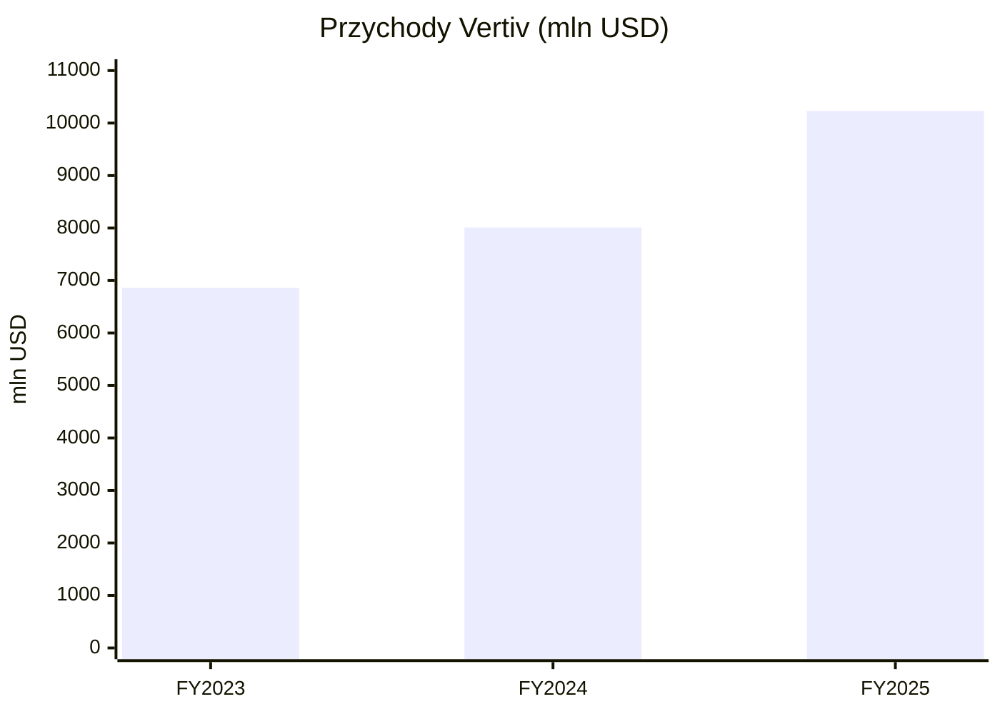
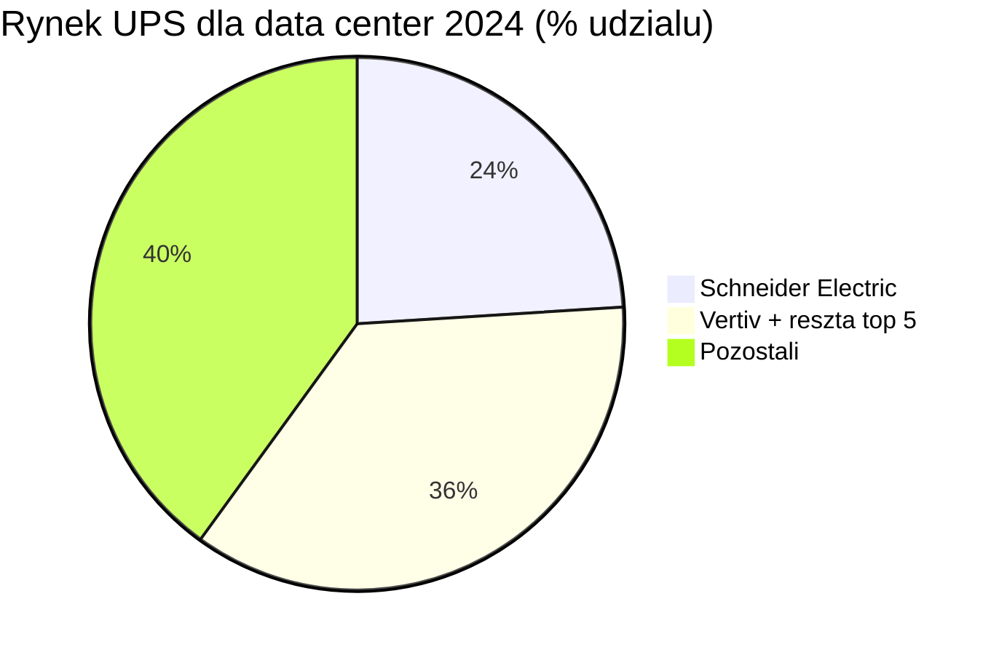
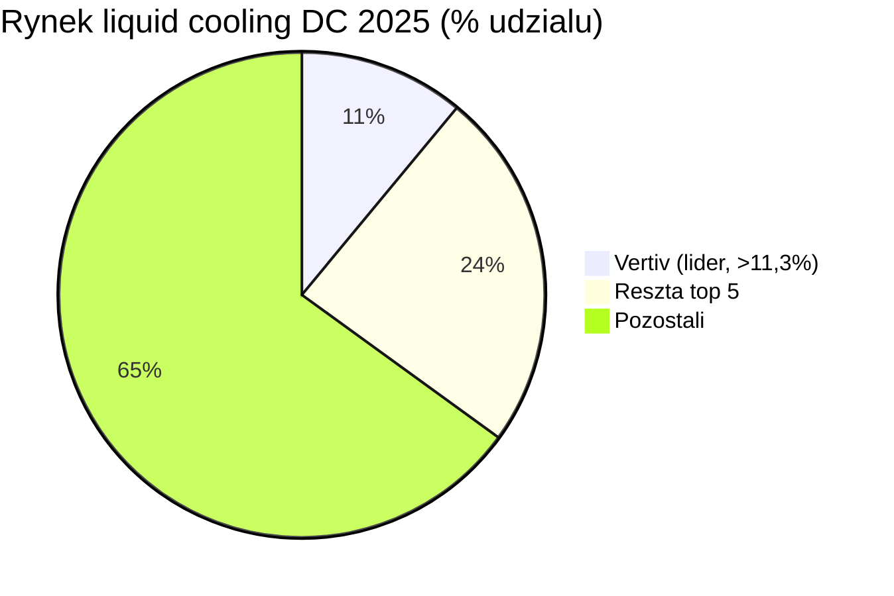

# Vertiv (VRT)

<!-- spolki:temat:naziemny-bottleneck-energetyczny-i-sieciowy:start -->
## W kontekscie: Naziemny bottleneck energetyczny i sieciowy

**Czym jest spółka.** Vertiv Holdings Co to globalny dostawca krytycznej infrastruktury cyfrowej dla centrów danych - sprzętu, który stoi pomiędzy gniazdkiem zasilającym a procesorem i utrzymuje obiekt przy życiu. W tym temacie chodzi o połowę zasilającą tej układanki: zasilacze awaryjne [[_slownik#UPS|UPS]] (urządzenie z baterią zapewniające ciągłość prądu w razie zaniku sieci), rozdzielnie [[_slownik#switchgear|switchgear]] (zestaw aparatury rozdzielającej i zabezpieczającej przepływ energii), szynoprzewody busbar, rozdzielnice rackowe (PDU) oraz całe prefabrykowane moduły zasilania. Vertiv produkuje pełny tor zasilania od strony obiektu (facility power) aż do szafy serwerowej - to, co firma w swoich materiałach nazywa łańcuchem "grid-to-chip".

**Dlaczego to ważne w obecnym wąskim gardle.** Wyścig o moc dla AI często rozbija się nie tylko o cenę prądu, ale też o czas dostępu do mocy. Nowe przyłącze do sieci w USA potrafi zająć lata (kolejki przyłączeniowe, wieloletnie dostawy transformatorów i switchgear), co rozwija wątek [[12 - naziemny-bottleneck-energetyczny-i-sieciowy#Kolejki przyłączeniowe i ograniczenia sieci]] oraz [[12 - naziemny-bottleneck-energetyczny-i-sieciowy#Brak transformatorów i switchgear: lead times]]. Vertiv ma ekspozycję na część tego wąskiego gardła - sam jest jednym z dostawców switchgear, których brakuje, i w 2024 r. podwoił zdolności produkcyjne dla switchgear, busbar i rozwiązań zintegrowanych (po przejęciu E&I Engineering z 2021 r.), otwierając nowe fabryki w Pune w Indiach, Pelzer w Karolinie Południowej i Londonderry w Irlandii Północnej (🔵 SEC 10-K 2024, 18.02.2025). Może to skracać czas wdrożenia po stronie obiektu nawet wtedy, gdy samo przyłącze do sieci jest zatkane (o ile - spółka nie ujawnia konkretnego skrócenia lead-time'u).

**Nowe obszary energii dla DC.** Wąskie gardło sieciowe popycha operatorów ku generacji "za licznikiem", a Vertiv dołożył do oferty kilka inicjatyw: prefabrykowany system zasilania awaryjnego Vertiv Power Module H2 na ogniwach paliwowych PEM (350-3 000 kW netto, współpraca z Ballard Power Systems), integrator power-train Vertiv PowerNexus (oszczędność miejsca do 30%), magazyny DynaFlex BESS, a także rozwojowe współprace z Oklo (zaawansowana energia jądrowa, [[_slownik#SMR|SMR]]) i Caterpillar/Solar Turbines (turbiny gazowe w układzie CCHP) - co dotyka wątku [[12 - naziemny-bottleneck-energetyczny-i-sieciowy#Energia: baseload, powrót do gazu/jądra, SMR dla DC]] (🔵 broszura Vertiv, maj 2025; komunikaty prasowe). Te obszary są jednak wczesne i według szacunku autora stanowią poniżej 5% przychodów - spółka nie ujawnia osobnej linii "new energy", więc to szacunek niepotwierdzony w źródłach, oparty na braku materialnego udziału tych produktów w raportach segmentowych (szacunek autora, niepotwierdzony).

> **Dla inwestora:** ekspozycja Vertiv na temat jest niemal kierunkowa - im dłuższe kolejki przyłączeniowe i dłuższe lead-time'y na switchgear/transformatory, tym cenniejszy staje się dostawca, który ten sprzęt produkuje i potrafi zintegrować w gotowy moduł. Popyt jest mniej wrażliwy na cenę, a bardziej na dostępność i czas wdrożenia.
<!-- spolki:temat:naziemny-bottleneck-energetyczny-i-sieciowy:end -->

<!-- spolki:grafiki:start -->
## Materiały spółki

> Grafiki z materiałów spółki / IR (prawa właściciela, użycie redakcyjne). Pełny rejestr: `Spolki/assets/_licencje.json`.

*1. **Vertiv™ CoolChip CDU 121 - produktowy rendering jednostki CDU. Źródło: www.vertiv.com; licencja: materiały spółki / IR - prawa właściciela, użycie redakcyjne.*

*2. **Vertiv™ CoolLoop Trim Cooler - kampania produktowa. Źródło: www.vertiv.com; licencja: materiały spółki / IR - prawa właściciela, użycie redakcyjne.*

<!-- spolki:grafiki:end -->

<!-- spolki:temat:chlodzenie-i-radiacyjne-odprowadzanie-ciepla:start -->
## W kontekscie: Chłodzenie i radiacyjne odprowadzanie ciepła

**Czym jest spółka w tym temacie.** Druga połowa stacku Vertiv to zarządzanie ciepłem (thermal management) - i to właśnie tu leży historyczne dziedzictwo firmy. Vertiv wywodzi się z Liebert Corporation (1965), pioniera precyzyjnego klimatyzowania pomieszczeń komputerowych. [[_slownik#precision cooling|Precision cooling]] (chłodzenie precyzyjne, utrzymujące ściśle kontrolowaną temperaturę i wilgotność w serwerowni, w odróżnieniu od zwykłej klimatyzacji komfortu) pod marką Liebert to do dziś rdzeń oferty: chillery, free cooling, wymienniki ciepła. To kompetencja "odprowadzania ciepła" w warunkach naziemnych - analogiczna problemowo do orbitalnego odprowadzania ciepła, choć technologicznie odmienna (na Ziemi mamy do dyspozycji powietrze i wodę, w próżni zostaje samo promieniowanie, co rozwija [[05 - chlodzenie-i-radiacyjne-odprowadzanie-ciepla#Mechanizm: dlaczego w próżni liczy się tylko promieniowanie]]).

**Dlaczego chłodzenie cieczowe jest teraz kluczowe.** Gęstość mocy szaf AI wzrosła do 60-130 kW na szafę - platformy NVIDIA GB200 i GB300 NVL72, docelowo zmierzając ku 1 MW+ (🔵 prezentacja inwestorska Vertiv 2024). Przy najwyższych gęstościach chłodzenie powietrzem staje się trudne lub nieefektywne i konieczne jest [[_slownik#liquid cooling|liquid cooling]] (chłodzenie cieczą, która ma wielokrotnie wyższą pojemność cieplną niż powietrze) - bezpośrednio na chipach (direct-to-chip cold plates) albo przez zanurzenie (immersion). To dokładnie problem opisany w [[05 - chlodzenie-i-radiacyjne-odprowadzanie-ciepla#Gęstość mocy chipów AI a ekstrakcja ciepła bez wody i powietrza]]. Vertiv odpowiada portfolio CoolChip CDU (jednostki dystrybucji cieczy chłodzącej - Coolant Distribution Unit), rear-door heat exchangers (RDHx), CoolCenter immersion i free-coolingowym CoolLoop Trim Cooler. Flagowy CoolChip CDU 2300 oferuje 2 300 kW pojemności chłodniczej i obsługuje 2x NVIDIA GB200 NVL72 (🔵 prezentacja inwestorska Vertiv 2024; strona produktu). Przejęcie CoolTera w grudniu 2023 r. wzmocniło portfel patentowy i kompetencje w liquid cooling.

**Woda i lokalizacja.** Chłodzenie cieczowe zamyka też obieg wody - temat sporów lokalnych i susz, który dotyka [[05 - chlodzenie-i-radiacyjne-odprowadzanie-ciepla#Technologie: heat pipes, pętle, układy dwufazowe i radiatory rozkładane]] po stronie technologii pętli oraz wątek wodny opisany w [[12 - naziemny-bottleneck-energetyczny-i-sieciowy#Woda chłodząca: zużycie, spory lokalne, susze]]. Rozwiązania trim-cooler i free-cooling Vertiv mają tu zmniejszać zużycie wody i poprawiać PUE.

> **Dla inwestora:** przejście rynku z chłodzenia powietrznego na cieczowe to dla Vertiv zarazem szansa i ryzyko - flagowy CoolChip i marka Liebert dają przewagę, ale tempo adaptacji jest szybkie i opóźnienie w produktach mogłoby oznaczać utratę udziału na rzecz wyspecjalizowanych graczy liquid cooling.
<!-- spolki:temat:chlodzenie-i-radiacyjne-odprowadzanie-ciepla:end -->

<!-- spolki:ekspozycja:start -->
## Ekspozycja na temat w liczbach

**Skala i dynamika.** FY 2024 (zakończony 31.12.2024): przychód **8 011,8 mln USD (+16,7% r/r)** z 6 863,2 mln USD, zysk operacyjny GAAP **1 367,4 mln USD (+56,8%)**, marża operacyjna GAAP **17,1%** (+440 pb), zysk netto GAAP **495,8 mln USD (+7,7%)**, EPS rozwodniony **1,28 USD** (🔵 SEC 10-K 2024, 18.02.2025). FY 2025 (zakończony 31.12.2025) zamknął się przychodem **10 229,9 mln USD** i skorygowanym EPS **4,20 USD**, powyżej wcześniejszego guidance 10 160-10 240 mln USD / 4,07-4,13 USD; marża operacyjna skorygowana FY 2025 wyniosła **20,4% (+100 pb r/r)** przy skorygowanym zysku operacyjnym **2 089,7 mln USD (+35% r/r)** (🔵 earnings release Q4 2025, 11.02.2026). Najnowszy raportowany kwartał Q4 2025 (zakończony 31.12.2025) przyniósł przychód **2 880,0 mln USD (+23% r/r, +19% organicznie)**, zamówienia organiczne **+25,2% r/r** oraz wzrost rozwodnionego EPS **+200%** (skorygowany EPS +37%); marża operacyjna skorygowana Q4 2025 sięgnęła **23,2% (+170 pb r/r)** przy skorygowanym zysku operacyjnym **668,1 mln USD (+33% r/r)**, a marża operacyjna GAAP wyniosła **20,1%** (🔵 earnings release Q4 2025, 11.02.2026). Dla porównania Q3 2025 (zakończony 30.09.2025): przychód **2 675,8 mln USD (+29,0% r/r)**, organicznie +28,4%, zysk operacyjny skorygowany **595,6 mln USD (+42,9%)**, marża operacyjna skorygowana **22,3%** (+220 pb), zysk netto GAAP **398,5 mln USD (+125,6%)**, EPS skorygowany **1,24 USD (+63%)** (🔵 earnings release Q3 2025, 22.10.2025).

*Rys. - Trajektoria przychodów; FY2025 to wynik faktyczny 10 229,9 mln USD. Dane: 🔵 Vertiv 10-K 2024 i earnings Q4 2025.*

**Ile z tego to temat? Brak osobnego segmentu.** Vertiv raportuje wyłącznie segmenty geograficzne (Americas, APAC, EMEA) i podział produkty/usługi - nie wydziela osobnej linii "power" ani "cooling". W Q3 2025 sprzedaż regionalna to Americas 1 712,4 mln USD (64%), APAC 519,8 mln USD (19%), EMEA 443,6 mln USD (17%) (🔵 earnings Q3 2025); w całym FY 2025 region Americas stanowił **62%** sprzedaży (🔵 Vertiv Annual Report 2025). W całym FY 2025 produkty stanowiły **8 207,0 mln USD**, a usługi/części **2 022,9 mln USD** przychodu; w samym Q4 2025 produkty to **2 309,4 mln USD**, a usługi/części **570,6 mln USD** (🔵 earnings release Q4 2025, 11.02.2026). Udział samej naziemnej infrastruktury DC nie jest ujawniany jako osobny procent przychodu, lecz raport roczny 2025 podaje, że segment Data Centers stanowi **~85%** przychodów (zaokrąglone) (🔵 Vertiv Annual Report 2025). Udział samego liquid cooling to natomiast **NIE UJAWNIONE** - spółka nie raportuje osobnej linii liquid cooling ani jego procentowego udziału w sprzedaży lub backlogu (🔵 earnings release Q4 2025; Annual Report 2025). Proxy rynkowe: globalny rynek chłodzenia cieczowego DC szacowany na **4,8 mld USD w 2025 r.**, a Vertiv wymieniany jako lider z udziałem **>11,3%** (top 5 łącznie ~35%) - co implikuje rząd wielkości ~0,5 mld USD, ale jest to proxy rynkowe, nie zadeklarowany przychód spółki (🟠 GMInsights, Data Center Liquid Cooling Market, styczeń 2026, dane 2025). Dynamicznie: według Dell'Oro przychody z Direct Liquid Cooling rosły **+85% r/r** w Q3 2025, a cały rynek liquid cooling był na kursie do ponad 2,0 mld USD rocznie (🟠 Dell'Oro Group, grudzień 2025, dane Q3 2025).

**Backlog i jakość zamówień.** [[_slownik#backlog|Backlog]] na koniec Q4 2025 wzrósł do **15,0 mld USD (+109% r/r; +57% sekwencyjnie z Q3 2025)**, a [[_slownik#book-to-bill|book-to-bill]] sięgnął ~**2,9x** - czyli spółka zapisała ok. 2,9 raza więcej zamówień niż zrealizowała w przychodach, co gwałtownie powiększa backlog; większość backlogu jest uznawana za wiążącą i ma być realizowana w ciągu **12-18 miesięcy** (🔵 earnings release Q4 2025, 11.02.2026; Annual Report 2025, sekcja Backlog). Dla porównania na koniec Q3 2025 backlog wynosił **9,5 mld USD (+30% r/r; +12% sekwencyjnie z Q2 2025)** przy book-to-bill ~**1,4x** (ok. 40% więcej zamówień niż przychodu) (🔵 earnings release Q3 2025). Bilans jest mocny: na koniec Q4 2025 gotówka **1 728,4 mln USD**, dług długoterminowy netto **2 892,1 mln USD**, a dźwignia netto **~0,5x** (spadek z 1,0x na koniec 2024) (🔵 earnings release Q4 2025). Pod presją ekspansji mocy produkcyjnych spółka zapowiada wzrost nakładów inwestycyjnych (CapEx) do **3-4% sprzedaży w 2026 r.** (historycznie 2-3%) (🔵 earnings call Q4 2025, 11.02.2026).

> **Dla inwestora:** backlog 15,0 mld USD przy book-to-bill ~2,9x (Q4 2025) daje wysoką widoczność przyszłych przychodów, ale brak osobnego segmentu "data center" oznacza, że dokładny udział tematu w sprzedaży trzeba szacować proxy - spółka go nie ujawnia.
<!-- spolki:ekspozycja:end -->

<!-- spolki:umowy:start -->
## Kluczowe umowy/wdrozenia - co znacza

Vertiv nie ujawnia wartości pojedynczych kontraktów (w odróżnieniu od wielkości backlogu), więc poniższe wdrożenia mają charakter referencyjny i jakościowy:

- **NVIDIA (referencyjne projekty):** Vertiv jest partnerem w ekosystemie AI dostarczającym referencyjne architektury power i cooling dla platform GB200 i GB300 NVL72 (gęstość 60-130 kW/szafę). To nie jest klasyczny kontrakt na kwotę, lecz pozycja w ekosystemie - tam, gdzie NVIDIA definiuje gęstość, Vertiv dostarcza odprowadzanie ciepła i zasilanie (🔵 earnings release Q1 2025). Wartość: **NIE UJAWNIONE**.
- **iGenius (Włochy):** kompletne rozwiązanie infrastruktury AI dla włoskiej firmy AI, z zaawansowanym chłodzeniem i zasilaniem dla high-density computing (🔵 earnings call Q1 2025). Wartość: **NIE UJAWNIONE**.
- **Compass Datacenters:** współpraca przy skalowalnych, prefabrykowanych centrach danych (🔵 prezentacja inwestorska 2024). Wartość: **NIE UJAWNIONE**.
- **Przejęcie PurgeRite (ogłoszone 03.11.2025, ukończone 04.12.2025):** cena zakupu ok. **1,0 mld USD** gotówki plus dodatkowo **do 250 mln USD** earn-out zależnego od wyników 2026 r., co odpowiada wielokrotności **~10x oczekiwane EBITDA 2026 r.** wraz z synergiami; transakcja ma być akretywna dla marży segmentu Services. PurgeRite to mechaniczne płukanie, odpowietrzanie i filtracja płynów chłodzących dla DC, czyli usługi wprost wspierające liquid cooling (🔵 komunikat Vertiv, 03.11.2025; prezentacja wyników Q4 2025, 11.02.2026).
- **Przejęcie Great Lakes Data Racks & Cabinets (ogłoszone 17.07.2025, ukończone 20.08.2025):** cena ok. **200 mln USD** przy wielokrotności **~11,5x oczekiwane EBITDA 2026 r.** wraz z synergiami; rozszerza portfolio racków, szaf i rozwiązań white space dla AI/edge/hyperscale (🔵 komunikat Vertiv, 17.07.2025).
- **Przejęcie Waylay NV (26.08.2025):** platforma hiperautomatyzacji i generatywnej AI do monitorowania i sterowania zasilaniem oraz chłodzeniem; warunki finansowe **NIE UJAWNIONE** (🔵 komunikat Vertiv, 26.08.2025).
- **Łączne wydatki na akwizycje (cash flow FY 2025):** **1 184,8 mln USD** netto, w tym **989,1 mln USD** w samym Q4 2025 (głównie zamknięcie PurgeRite) (🔵 earnings release Q4 2025, 11.02.2026). Konkretny wpływ przychodowy poszczególnych akwizycji w 2026 r.: **NIE UJAWNIONE**.

Wymowa tych wdrożeń jest taka, że Vertiv sprzedaje nie pojedyncze pudełka, lecz zintegrowany [[_slownik#capex|capex]] infrastruktury - moduł zasilania plus chłodzenia plus serwis - co podnosi wartość kontraktu na klienta i wiąże odbiorcę przez cykl życia obiektu.

> **Dla inwestora:** brak ujawnianych wartości pojedynczych umów to świadoma polityka spółki - sygnałem do śledzenia jest agregat (backlog 15,0 mld USD, book-to-bill ~2,9x w Q4 2025), a nie pojedyncze ogłoszenia. To utrudnia ocenę koncentracji na konkretnym kliencie.
<!-- spolki:umowy:end -->

<!-- spolki:pozycja:start -->
## Pozycja rynkowa i udzialy

Vertiv deklaruje pozycję #1 w wybranych kategoriach obu nóg swojego stacku. W zarządzaniu ciepłem (thermal management) firma wskazuje pozycję **#1** za raportem Dell'Oro (Worldwide Data Center Physical Infrastructure 2025) - co spółka potwierdza w raporcie rocznym 2025 (🟠 Dell'Oro Group, cyt. w Vertiv Annual Report 2025; wcześniejszy komunikat Dell'Oro 12.03.2024). W rozdzielniach, dystrybucji i UPS-ach 3-fazowych powyżej 250 kVA oraz infrastrukturze dystrybucji zasilania (busway, RPP, STS, 3-phase PDU) Vertiv wskazuje również **#1** za danymi Omdia (UPS Hardware Market Tracker 2025 dla >250 kVA oraz Omdia Ultimate Power Study, grudzień 2025) (🟠 Omdia, cyt. w Vertiv Annual Report 2025). Uwaga: liderstwo w power dotyczy wąsko zdefiniowanej kategorii (switching/UPS >250 kVA), a nie całego rynku UPS dla DC, gdzie Vertiv nie jest liderem (patrz niżej). W globalnym rynku UPS dla centrów danych Vertiv plasuje się w top 5; liderem jest tu Schneider Electric z ~24,3% rynku w 2024 r., a top 5 (Eaton, Schneider, Vertiv, ABB, Delta) łącznie kontroluje ~60% (🟠 GMInsights, Data Center UPS Market 2025, dane 2024). W chłodzeniu cieczowym (liquid cooling) Vertiv jest wymieniany jako **lider rynku z udziałem >11,3%** w 2025 r. (top 5 łącznie ~35%) (🟠 GMInsights, Data Center Liquid Cooling Market, styczeń 2026, dane 2025). W szerokim rynku Data Center Physical Infrastructure (DCPI) Vertiv i Schneider Electric byli w Q1 2025 praktycznie ex aequo - różnica udziału globalnego wynosiła zaledwie **0,1 pkt proc.** (🟠 Dell'Oro Group, lipiec 2025, dane Q1 2025). W rynku infrastruktury zasilania dla AI data center udział Vertiv szacowany jest na ~9% w 2025 r. (🟠 Alora Advisory 2032 Outlook).

*Rys. - Schneider liderem UPS DC; Vertiv w top 5, top 5 razem ~60%. Dane: 🟠 GMInsights 2025.*

*Rys. - Vertiv lider liquid cooling DC z udziałem >11,3% (top 5 razem ~35%); rynek ~4,8 mld USD w 2025 r. Dane: 🟠 GMInsights, styczeń 2026.*

Skala operacyjna podpiera tę pozycję: ~4 000 inżynierów serwisowych, 310+ centrów serwisowych, ok. 23 fabryki (liczba ze starszej prezentacji 2024; w 2025-2026 spółka dynamicznie rozbudowuje sieć produkcyjną, m.in. nowy obiekt w Johor w Malezji i rozbudowy w USA i Meksyku, więc aktualna liczba jest prawdopodobnie wyższa), działalność w 130+ krajach (🔵 prezentacja inwestorska 2024; 🟠 komunikaty Vertiv 2025-2026). Bariery wejścia to skala produkcyjno-serwisowa, certyfikacje (UL, CE, cULus, RoHS), globalna sieć partnerów, długoletnie relacje z [[_slownik#hyperscaler|hyperscalerami]], colo i telekomami oraz portfel patentowy (m.in. po CoolTera) (🔵 10-K; komunikaty prasowe).

> **Dla inwestora:** deklarowane liderstwo (#1 w thermal i #1 w wąsko zdefiniowanej kategorii switching/UPS >250 kVA) plus pełny stack power+cooling pozwala Vertiv sprzedawać zintegrowane rozwiązania - przewaga jest w integracji i skali serwisowej, nie w pojedynczym produkcie. W całym rynku UPS dla DC firma nie jest jednak liderem - tu dominuje Schneider.
<!-- spolki:pozycja:end -->

<!-- spolki:konkurencja:start -->
## Mechanika konkurencji - na osiach

Vertiv konkuruje na dwóch frontach: power (zasilanie/UPS/switchgear) i cooling (precision/liquid), a w każdym przeciw innemu zestawowi rywali.

**Power - zasilanie i dystrybucja:**

| Konkurent | Główne produkty | Oś konkurencji | Liczby / uwagi | Źródło |
|---|---|---|---|---|
| **Schneider Electric** | EcoStruxure, Galaxy VXL UPS, APC, Motivair (cooling, przejęte VI.2024 za 850 mln USD) | Portfel, skala globalna, efektywność | #1 w UPS DC z ~24,3% rynku 2024 | 🟠 GMInsights 2025 |
| **Eaton** | UPS, switchgear, PDU, EnergyAware | Niezawodność, integracja z siecią, medium voltage | w top 5 UPS; mocny w power distribution | 🟠 MarketsandMarkets 2025 |
| **ABB** | PowerValue UPS, MV switchgear, elektryfikacja | Automatyka, przemysł, integracja HV | ~10% rynku AI DC power infrastructure (szacunek) | 🟠 Alora Advisory 2026 |

**Cooling - precyzyjne i cieczowe:**

| Konkurent | Główne produkty | Oś konkurencji | Liczby / uwagi | Źródło |
|---|---|---|---|---|
| **Stulz** | Precyzyjne klimatyzowanie DC, chłodzenie cieczowe | Wydajność chłodzenia, niemiecka jakość | Mocny w Europie i Azji; wymieniany jako lider cooling | 🟠 raporty rynkowe |
| **nVent** | Infrastruktura rack, thermal, cooling-power coupling | Gęstość, modularność | Konkuruje w warstwie cooling-power integration | 🟠 Alora Advisory 2026 |
| **CoolIT, Asetek, Iceotope, Submer, GRC** | Direct-to-chip, immersion | Specjalizacja w cieczy, szybkość wdrożeń | Pure-play liquid cooling; rosnący udział w AI DC | 🟠 branża/analitycy |

Mechanizm jest taki, że Schneider, Eaton i ABB inwestują w liquid cooling i high-density power (Schneider kupił Motivair właśnie po to), więc presja idzie z dwóch stron jednocześnie: dużych konglomeratów elektroenergetycznych w power oraz wyspecjalizowanych pure-playów w liquid cooling. Vertiv broni się tempem - w Q3 2025 rośnie organicznie +28% wobec szacowanego wzrostu rynku ~15-20%, co sugeruje potencjalne zdobywanie udziału (jeśli szacunek tempa rynku jest porównywalny), a nie utratę (🔵 earnings call Q3 2025).

> **Dla inwestora:** spadek udziału rynkowego obniżyłby tempo wzrostu przychodów - kluczowy do śledzenia jest wzrost organiczny względem rynku. Dopóki Vertiv rośnie szybciej niż rynek, broni przewagi mimo wejścia Schneidera (Motivair) i pure-playów w liquid cooling.
<!-- spolki:konkurencja:end -->

<!-- spolki:przekroj:start -->
## Koncentracja odbiorcow i ryzyka z mechanizmem

**Koncentracja odbiorców.** Vertiv w 10-K za 2024 r. wprost podaje, że **żaden pojedynczy klient nie odpowiadał za ponad 10% całkowitej sprzedaży netto** w żadnym z przedstawionych okresów; ta sama zasada obowiązuje w raporcie rocznym za 2025 r. - spółka nie ujawnia nazw ani procentów największych klientów (🔵 SEC 10-K 2024, 18.02.2025; Vertiv Annual Report 2025). Udział samych hyperscalerów w sprzedaży to natomiast **NIE UJAWNIONE**. Proxy wskazuje na silną koncentrację geograficzną i projektową: segment Data Centers stanowi ~85% przychodów, region Americas 62% sprzedaży w FY 2025, a popyt jest skupiony w dużych projektach AI dla hyperscalerów i colo - top 10 dostawców chmury w segmencie DCPI rosło ponad **+30% r/r** wg Dell'Oro (🔵 Vertiv Annual Report 2025; 🟠 Dell'Oro Group, dane Q3 2025). Sama spółka w 10-K wskazuje na ryzyko "mniej korzystnych warunków umownych z dużymi klientami" - duzi odbiorcy mogą wywierać presję cenową, anulować lub zmieniać zamówienia oraz wydłużać cykle sprzedaży.

**Ryzyka z mechanizmem:**

- **Łańcuch dostaw / single-source.** 10-K wprost wskazuje, że część materiałów i komponentów pochodzi od dostawców jednoźródłowych (single-source) ze względu na technologię, dostępność, cenę i jakość; awaria lub zamknięcie takiego dostawcy opóźnia produkcję i podbija koszty. Lista i % obrotu: **NIE UJAWNIONE** (🔵 10-K 2024, Item 1A).
- **Taryfy / konflikty handlowe.** Nowe taryfy USA i odwetowe taryfy zagraniczne podnoszą koszt materiałów i gotowych produktów; jeśli nie zostaną przerzucone na klientów, obniżają marżę. W Q1 2025 taryfy obniżyły guidance marży FY 2025 o ~100 pb względem scenariusza bazowego, jednak marża operacyjna skorygowana i tak rosła mimo "wpływu taryf" - do 22,3% (+220 pb r/r) w Q3 2025 i do 23,2% (+170 pb r/r) w Q4 2025. Zarząd (CFO) zapowiedział, że spodziewa się **materialnego zniwelowania niekorzystnego wpływu taryf na marżę już od Q1 2026**; konkretna kwota kosztu taryf w raportowanym kwartale pozostaje **NIE UJAWNIONE** (🔵 10-K 2024; earnings Q1, Q3 i Q4 2025; earnings call Q4 2025, 11.02.2026).
- **Cykl technologiczny.** Szybki wzrost gęstości szaf (AI 60-130 kW, docelowo 1 MW+) wymusza przejście na liquid cooling; opóźnienie w adaptacji produktów grozi utratą udziału. Vertiv zwiększył nakłady na rozwój produktów (engineering/R&D wg materiałów spółki - dokładna definicja i linia GAAP do potwierdzenia w 10-K) z ~200 mln USD w 2023 do 350+ mln USD w 2024 i przejął CoolTera (XII.2023), by się przed tym zabezpieczyć (🔵 prezentacja inwestorska 2024; 10-K).
- **Konkurencja / presja cenowa.** Schneider, Eaton, ABB i Stulz inwestują w liquid cooling i high-density power; presja cenowa mogłaby obniżyć wzrost (mechanizm opisany w sekcji konkurencji).
- **Ryzyko wykonawcze backlogu.** Backlog 15,0 mld USD (koniec Q4 2025) oznacza widoczność, ale i ryzyko - zamówienia mogą być opóźnione, anulowane lub poddane presji kosztowej; 10-K osobno zaznacza ryzyko realizacji backlogu (🔵 10-K; earnings Q4 2025).
- **Zadłużenie / stopy.** Dług długoterminowy 2 928,2 mln USD na koniec 2024 (Term Loan 6,19%); podwyżki stóp zwiększają koszt obsługi. W Q3 2025 odsetki netto spadły do 22,8 mln USD dzięki restrukturyzacji długu, a leverage netto do 0,5x (🔵 10-K 2024; Q3 2025).

> **Dla inwestora:** najtwardszy mechanizm ryzyka to splot koncentracji na hyperscalerach (popyt zależny od decyzji capex kilku gigantów AI) z łańcuchem dostaw single-source - jeśli jeden duży klient wstrzyma program albo zawiedzie kluczowy dostawca, efekt przełoży się na przychód i marżę szybciej niż sugeruje wielkość backlogu.
<!-- spolki:przekroj:end -->

<!-- network:peers:start -->
## Powiązane spółki

> Inne notowane spółki z raportu dzielące z tą firmą co najmniej jeden wątek tematyczny (wspólny rynek, technologia lub łańcuch wartości).

- [[Spolki/eaton|Eaton Corporation plc (ETN)]] - Zasilanie DC (UPS, switchgear) + chłodzenie (Boyd Thermal)  
  *Wspólne wątki: Naziemny bottleneck; Chłodzenie.*
- [[Spolki/airbus|Airbus SE (AIR)]] - PV (Sparkwing), optyka (Tesat), busy, serwis (EU)  
  *Wspólne wątki: Chłodzenie.*
- [[Spolki/bloom-energy|Bloom Energy Corporation (BE)]] - Ogniwa paliwowe SOFC dla centrów danych  
  *Wspólne wątki: Naziemny bottleneck.*
- [[Spolki/constellation-energy|Constellation Energy Corporation (CEG)]] - Największy operator floty jądrowej w USA (PPA z hyperskalerami)  
  *Wspólne wątki: Naziemny bottleneck.*
- [[Spolki/ge-vernova|GE Vernova Inc. (GEV)]] - Turbiny gazowe i infrastruktura sieciowa dla DC  
  *Wspólne wątki: Naziemny bottleneck.*
- [[Spolki/northrop-grumman|Northrop Grumman Corporation (NOC)]] - Serwis GEO (MEV/MRV), busy, radiatory, ogniwa  
  *Wspólne wątki: Chłodzenie.*
- [[Spolki/oklo|Oklo Inc. (OKLO)]] - Mikroreaktory (SMR/fission) na potrzeby DC  
  *Wspólne wątki: Naziemny bottleneck.*
- [[Spolki/rtx|RTX Corporation (RTX)]] - ADCS (Blue Canyon), termika (Collins Aerospace)  
  *Wspólne wątki: Chłodzenie.*
- [[Spolki/redwire|Redwire Corporation (RDW)]] - Panele ROSA, struktury rozkładane, montaż on-orbit, radiatory Q-Rad  
  *Wspólne wątki: Chłodzenie.*
- [[Spolki/schneider-electric|Schneider Electric SE (SU)]] - Zasilanie i chłodzenie DC (EcoStruxure, Motivair)  
  *Wspólne wątki: Naziemny bottleneck.*
- [[Spolki/siemens-energy|Siemens Energy AG (ENR)]] - Turbiny gazowe i technologie sieciowe (EU)  
  *Wspólne wątki: Naziemny bottleneck.*
- [[Spolki/talen-energy|Talen Energy Corporation (TLN)]] - Energia jądrowa (Susquehanna), sąsiedztwo z DC  
  *Wspólne wątki: Naziemny bottleneck.*
<!-- network:peers:end -->

<!-- spolki:slownik:start -->
## Slowniczek

- **UPS** - zasilacz awaryjny z baterią, zapewniający ciągłość prądu w razie zaniku sieci.
- **Switchgear / rozdzielnia** - zestaw aparatury elektrycznej rozdzielającej, sterującej i zabezpieczającej przepływ energii w obiekcie; jeden z elementów o długich lead-time'ach.
- **Precision cooling** - chłodzenie precyzyjne, utrzymujące ściśle kontrolowaną temperaturę i wilgotność w serwerowni; rdzeń marki Liebert.
- **Liquid cooling** - chłodzenie cieczą (direct-to-chip lub immersion); konieczne przy wysokiej gęstości mocy AI, gdy powietrze nie wystarcza.
- **CDU (Coolant Distribution Unit)** - jednostka dystrybucji cieczy chłodzącej w układach direct-to-chip i RDHx.
- **Backlog** - wartość złożonych, niezrealizowanych jeszcze zamówień; wyższy = lepsza widoczność przyszłych przychodów.
- **Book-to-bill** - stosunek nowych zamówień do przychodu w okresie; >1 oznacza rosnący backlog.
- **Capex** - nakłady inwestycyjne; tu w znaczeniu wydatków operatorów DC na infrastrukturę dostarczaną przez Vertiv.
- **Hyperscaler** - gigant chmury (Microsoft, Google, Amazon, Oracle) budujący centra danych na ogromną skalę.

Terminy lokalne (poza listą słownika): **PDU** - rozdzielnica rackowa dystrybuująca zasilanie do serwerów; **busbar/szynoprzewód** - szyna przewodząca prąd między rozdzielnicą a szafami; **direct-to-chip** - chłodzenie cieczą bezpośrednio na chipach przez cold plates; **immersion** - zanurzenie serwerów w cieczy dielektrycznej; **RDHx** - rear-door heat exchanger, wymiennik w drzwiach szafy; **PUE** - współczynnik efektywności energetycznej DC; **leverage netto** - dług netto do EBITDA.
<!-- spolki:slownik:end -->

<!-- spolki:zrodla:start -->
## Zrodla

- 🔵 Vertiv - SEC 10-K 2024 (finanse, segmenty, ryzyka, single-source, dług) - https://www.sec.gov/Archives/edgar/data/1674101/000162828025005905/vrt-20241231.htm
- 🔵 Vertiv - earnings release Q4 2025 (FY2025 przychód 10 229,9 mln USD, EPS skor. 4,20 USD, backlog 15,0 mld USD, book-to-bill ~2,9x, bilans) - https://investors.vertiv.com/news/news-details/2026/Vertiv-Reports-Strong-Fourth-Quarter-with-Organic-Orders-Growth-of-252-and-Diluted-EPS-Growth-of-200-Adjusted-Diluted-EPS-37/default.aspx
- 🔵 Vertiv - earnings release Q3 2025 (przychód, marże, backlog 9,5 mld USD, book-to-bill ~1,4x) - https://investors.vertiv.com/news/news-details/2025/Vertiv-Reports-Strong-Third-Quarter-Results-including-Organic-Orders-60-Diluted-EPS-122-Adjusted-EPS-63-Raises-2025-Guidance/default.aspx
- 🔵 Vertiv - earnings release Q4 2024 - https://last10k.com/sec-filings/vrt/0001628280-25-005905.htm
- 🔵 Vertiv - Annual Report 2025 (segment Data Centers ~85%, Americas 62%, #1 thermal wg Dell'Oro, #1 UPS >250 kVA wg Omdia, backlog realizowany 12-18 mies., brak klienta >10%) - https://s205.q4cdn.com/554782763/files/doc_financials/2025/ar/Vertiv-2025-Annual-Report.pdf
- 🔵 Vertiv - earnings call Q4 2025 transcript (CapEx 3-4% sprzedaży 2026, oczekiwane zniwelowanie taryf od Q1 2026, lifecycle services +25% r/r) - https://www.fool.com/earnings/call-transcripts/2026/02/11/vertiv-vrt-q4-2025-earnings-call-transcript/
- 🔵 Vertiv - prezentacja wyników Q4 2025 (ukończenie PurgeRite 04.12.2025, slajd 7) - https://s205.q4cdn.com/554782763/files/doc_financials/2025/q4/Vertiv_Fourth-Quarter-2025-Results-Presentation.pdf
- 🔵 Vertiv - komunikat o przejęciu PurgeRite (~1,0 mld USD + do 250 mln USD earn-out, ~10x EBITDA, liquid cooling services), 03.11.2025 - https://www.morningstar.com/news/pr-newswire/20251103cl13139/vertiv-announces-intent-to-acquire-purgerite-a-leading-provider-of-specialized-fluid-management-services-to-expand-liquid-cooling-services-portfolio
- 🔵 Vertiv - komunikat o przejęciu Great Lakes Data Racks & Cabinets (~200 mln USD, ~11,5x EBITDA), 17.07.2025; zakończenie - https://www.prnewswire.com/news-releases/vertiv-to-acquire-custom-rack-solutions-manufacturer-302507825.html ; https://investors.vertiv.com/news/news-details/2025/Vertiv-Completes-Acquisition-of-Great-Lakes-Data-Racks--Cabinets/default.aspx
- 🔵 Vertiv - komunikat o przejęciu Waylay NV (generatywna AI do monitorowania zasilania/chłodzenia, warunki nieujawnione), 26.08.2025 - https://investors.vertiv.com/news/news-details/2025/Vertiv-Acquires-Generative-AI-Software-Leader-Waylay-NV-to-Enhance-Critical-Digital-Infrastructure-Operational-Intelligence-Optimization-and-Services/default.aspx
- 🟠 Dell'Oro Group - Worldwide Data Center Physical Infrastructure (Vertiv #1 thermal), komunikat 12.03.2024 - https://www.delloro.com/news/record-year-for-data-center-physical-infrastructure-market-with-16-percent-growth-for-2023/
- 🔵 Vertiv - 2024 Investor Event Presentation (#1 thermal, #1 power switching/UPS, mapa portfolio, gęstość AI) - https://s205.q4cdn.com/554782763/files/doc_presentation/Vertiv-2024-Investor-Event-Presentation.pdf
- 🔵 Vertiv - broszura Power Module H2 (PEM fuel cell, 350-3 000 kW) - https://www.vertiv.com/48eb63/globalassets/products/facilities-enclosures-and-racks/integrated-solutions/power-module-h2-zero-emission-backup-power/vertiv-power-module-hydrogen-_20250506.pdf
- 🔵 Vertiv - e-book Data Center Power Train (grid-to-chip) - https://www.vertiv.com/493dc7/globalassets/shared/vertiv-datacenterpowertrain-eb-en-na-sl-80203-web-small.pdf
- 🟠 GMInsights - Data Center UPS Market (udziały, Schneider ~24,3%, top 5 ~60%, dane 2024) - https://www.gminsights.com/industry-analysis/data-center-UPS-market
- 🟠 GMInsights - Data Center Liquid Cooling Market (rynek ~4,8 mld USD 2025, Vertiv lider >11,3%, top 5 ~35%), styczeń 2026 - https://www.gminsights.com/industry-analysis/data-center-liquid-cooling-market
- 🟠 Dell'Oro Group - DCPI grew 17% Y/Y in 1Q 2025 (Schneider/Vertiv ex aequo, różnica 0,1 pkt proc.) - https://www.delloro.com/news/data-center-physical-infrastructure-grew-17-percent-y-y-in-1q-2025-driven-by-ai-buildout/
- 🟠 Dell'Oro Group - DCPI expands 18% Y/Y in 3Q 2025 (Direct Liquid Cooling +85% r/r, top 10 cloud +30% r/r) - https://www.delloro.com/news/data-center-physical-infrastructure-market-expands-18-percent-y-y-in-3q-2025/
- 🟠 Alora Advisory - Global AI Data Center Power Infrastructure Market Outlook 2032 (udział Vertiv ~9%, ABB ~10%) - publikacja analityczna
- 🟠 MarketsandMarkets - rynek UPS / power distribution 2025 (pozycja Eaton) - https://www.marketsandmarkets.com/
- 🟠 Dell'Oro Group / Omdia - cytowane w prezentacji Vertiv jako źródła pozycji #1 (thermal; power switching/UPS >250 kVA)
<!-- spolki:zrodla:end -->
