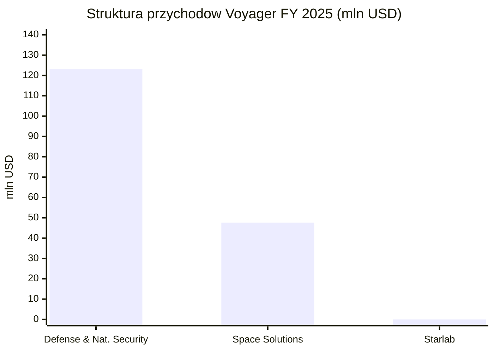
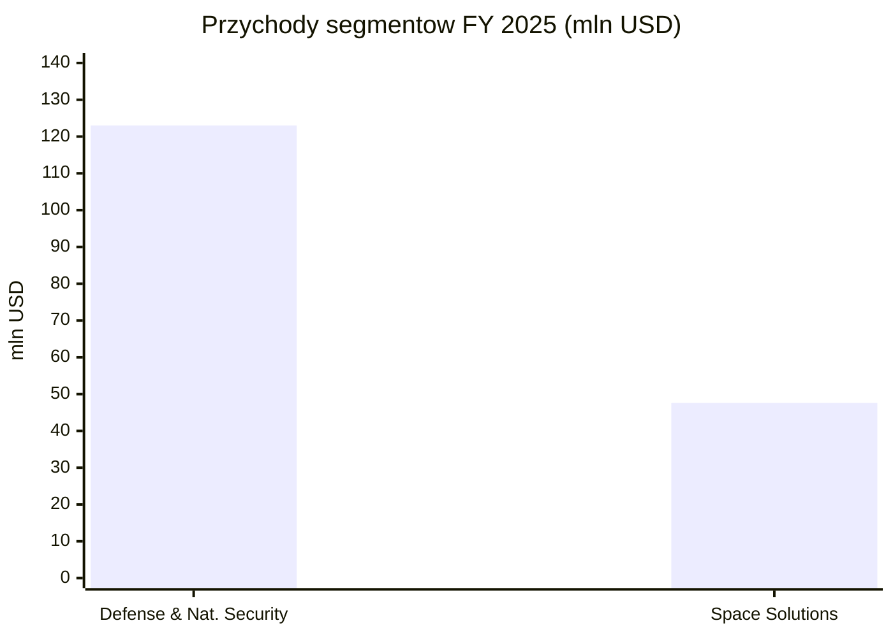
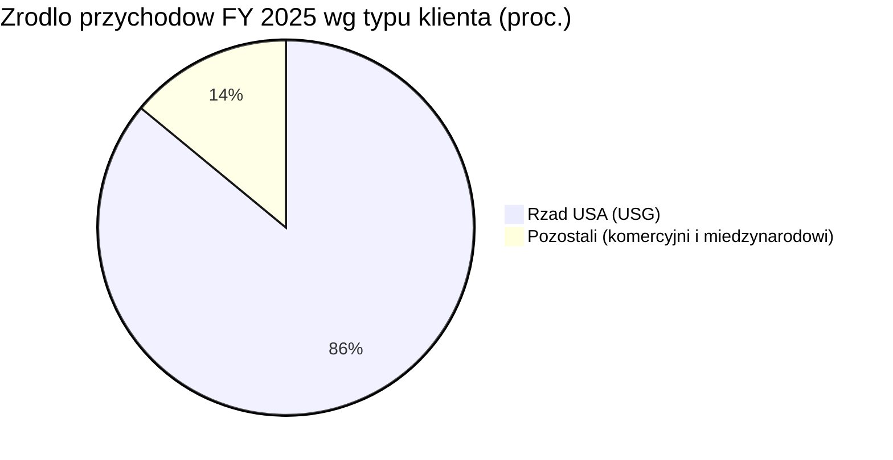

# Voyager Technologies (VOYG)

<!-- spolki:temat:fizyka-orbitalna-orbity-i-operacje:start -->
## W kontekscie: Fizyka orbitalna, orbity i operacje

**Czym jest spółka.** Voyager Technologies to amerykański, pionowo zintegrowany dostawca technologii kosmicznych i obronnych, który wszedł na NYSE w czerwcu 2025 r. (IPO: 14 200 645 akcji po 31 USD, ok. 440 mln USD brutto; netto ok. 402,3 mln USD wg komunikatu o zamknięciu oferty, przy czym 10-K wykazuje wpływy z IPO netto od kosztów subemisji w wysokości 409,4 mln USD - 🔵 komunikat o zamknięciu IPO oraz 10-K z 10 marca 2026). Firma zbudowała się przez 12 akwizycji od 2019 r. (m.in. Nanoracks, Altius, Space Micro, ZIN Technologies, ExoTerra, LEOcloud - 🔵 10-K, Item 1 Business). W FY 2025 raportowała trzy segmenty: Defense and National Security, Space Solutions oraz Starlab Space Stations; od Q1 2026 spółka połączyła dwa pierwsze w jeden segment Defense and Space Technologies i raportuje już tylko dwa segmenty (Defense and Space Technologies oraz Starlab Space Stations), przez co Space Solutions nie jest dalej wykazywane oddzielnie (🔵 earnings release Q1 2026, 4 maj 2026). W kontekście fizyki orbitalnej najistotniejszym aktywem jest **Starlab** - komercyjna stacja kosmiczna projektowana jako następca Międzynarodowej Stacji Kosmicznej (ISS) po jej planowanej deorbitacji, z startem przewidzianym na 2029 r. (🔵 10-K, Item 1 Business).

**Dlaczego to ważne dla orbitalnych centrów danych.** Starlab to obiekt klasy stacji na [[_slownik#LEO|LEO]] (niska orbita okołoziemska, ~200-2 000 km), a więc na tej samej orbicie, na której dziś operuje ISS i większość nowych konstelacji. Stacja na LEO daje to, czego pojedynczy satelita nie ma: dużą, obsługiwaną przez ludzi platformę z zasilaniem, chłodzeniem, miejscem na ładunki i regularnym dostępem logistycznym. To czyni ją naturalnym kandydatem na hosting infrastruktury obliczeniowej dużej skali - co rozwija wątek [[03 - fizyka-orbitalna-orbity-i-operacje#Skalowanie mocy do MW-GW: liczba modułów na 1 MW, gęstość upakowania]].

Sposób budowy Starlab odróżnia Voyager od części konkurencji. Część architektur orbitalnych zakłada [[_slownik#in-space assembly|in-space assembly]] - montaż modułów dopiero na orbicie, by obejść ograniczenie średnicy owiewki (fairingu) rakiety. Starlab w obecnym projekcie ma być wynoszony jako duży moduł na ciężkiej rakiecie (SpaceX Starship wskazany jako nośnik), co minimalizuje liczbę krytycznych operacji montażowych na orbicie - to wprost dotyka kompromisu opisanego w [[03 - fizyka-orbitalna-orbity-i-operacje#Montaż on-orbit / in-space assembly vs wynoszenie gotowych modułów, ograniczenie fairingu]]. Każda stacja na LEO musi też mierzyć się z oporem atmosferycznym i utrzymaniem orbity, co wiąże się z napędem i paliwem - kontekst rozwinięty w [[03 - fizyka-orbitalna-orbity-i-operacje#Opór atmosferyczny (drag), station-keeping, napęd i paliwo]].

> **Dla inwestora:** Starlab to opcja, nie dzisiejszy przychód - na 31 grudnia 2025 r. segment Starlab Space Stations wykazał **0 USD przychodów** (🔵 earnings release Q4 2025, TABLE 1). Środki NASA na rozwój płyną w ramach Space Act Agreement i są traktowane jako granty, nie sprzedaż. Wartość tego aktywa to przyszły potencjał uzależniony od startu w 2029 r., a nie bieżący strumień pieniędzy.

Voyager wnosi też kompetencje czysto orbitalno-operacyjne z przejętych spółek. ExoTerra dostarcza silnik Halo typu [[_slownik#bus satelitarny|Hall-effect]] (model Halo 8: masa 0,83 kg, ciąg 4-30 mN, Isp 700-1500 s; mN to milinewton - jednostka ciągu, Isp to impuls właściwy w sekundach; starszy Halo miał masę 0,65 kg i ciąg 4-33 mN; heritage na DARPA Blackjack, 21 modułów dla York Space Systems / SDA Transport Layer - 🔵 press release ExoTerra/Voyager, paź 2025; 🟠 strona produktu ExoTerra), co jest dokładnie tym rodzajem napędu, który służy do [[_slownik#station-keeping|station-keeping]] i korekt orbity. Altius wniósł standardy interfejsów do dokowania i serwisowania - DogTag (ponad 500 szt. na satelitach OneWeb) oraz MagTag (🟠/🔵 Factories in Space; NASA SOA 2025).
<!-- spolki:temat:fizyka-orbitalna-orbity-i-operacje:end -->

<!-- spolki:grafiki:start -->
## Materiały spółki

> Grafiki z materiałów spółki / IR (prawa właściciela, użycie redakcyjne). Pełny rejestr: `Spolki/assets/_licencje.json`.

*1. **Space Edge™ na ISS - ilustracja produktu. Źródło: materiały spółki / IR; licencja: materiały spółki / IR - prawa właściciela, użycie redakcyjne.*

*2. **Bishop Airlock - overview / ilustracja główna. Źródło: materiały spółki / IR; licencja: materiały spółki / IR - prawa właściciela, użycie redakcyjne.*

*3. **Bishop Airlock - schemat satellite deployment. Źródło: materiały spółki / IR; licencja: materiały spółki / IR - prawa właściciela, użycie redakcyjne.*

<!-- spolki:grafiki:end -->

<!-- spolki:temat:niezawodnosc-serwisowanie-i-cykl-zycia-sprzetu:start -->
## W kontekscie: Niezawodność, serwisowanie i cykl życia sprzętu

**Platforma długiego życia kontra mrożony sprzęt.** Centralny problem orbitalnego centrum danych to fakt, że na orbicie nie ma napraw in-situ ani wymiany kart na żywo (hot-swap), a sprzęt obliczeniowy starzeje się szybciej, niż żyje platforma kosmiczna. To napięcie jest sednem wątku [[08 - niezawodnosc-serwisowanie-i-cykl-zycia-sprzetu#Cykl odświeżania GPU (~3-5 lat na Ziemi) a nieserwisowalna orbita ("frozen hardware")]]. Voyager podchodzi do tego z dwóch stron: po pierwsze, Starlab jako stacja obsługiwana przez ludzi i z dostępem logistycznym daje (przynajmniej teoretycznie) możliwość wymiany całych modułów ładunkowych, co wpisuje się w [[08 - niezawodnosc-serwisowanie-i-cykl-zycia-sprzetu#Deorbitacja i wymiana całych modułów a upgrade]]; po drugie, przez Altius firma rozwija technologie robotycznej obsługi i dokowania, które są warunkiem brzegowym [[_slownik#life extension|life extension]] satelitów - kontekst opisany w [[08 - niezawodnosc-serwisowanie-i-cykl-zycia-sprzetu#Brak napraw in-situ a robotyczna obsługa (Northrop Grumman MEV i następcy)]].

**Heritage jako bariera niezawodnościowa.** Voyager opiera narrację na dziedzictwie lotnym: marketingowo deklaruje ponad 35 lat dziedzictwa kosmicznego w przejętych podmiotach, ponad 1 400 misji zarządzanych na ISS i ponad 2 000 udanych misji (🔵/🟠 strona IR i press releases). Bishop Airlock - pierwszy stały komercyjny moduł na ISS od 2020 r., o ok. 5× większej pojemności niż śluzy rządowe (🔵 strona produktu VOYG) - jest konkretnym przykładem zdolności operowania trwałym sprzętem na ISS. To buduje pozycję w obszarze niezawodności klasy misji, choć nie przekłada się jeszcze na deklarowane SLA klasy data center.

> **Dla inwestora:** flagowy produkt obliczeniowy Voyager - Space Edge - to dziś niskomocowa platforma wielkości pudełka po butach, wdrożona na ISS 14 września 2025 r. (🔵 press release VOYG, 15 wrz 2025). Spółka chwali się 30-krotnym przyspieszeniem przetwarzania na orbicie wobec tradycyjnego downlinku do naziemnego DC, ale nie publikuje parametrów niezawodności (uptime, redundancja N+1, deklarowane SLA) ani specyfikacji sprzętu (CPU/GPU, TOPS, moc w watach, pamięć, storage, wymiary poza opisem "low-power"/"shoebox-sized"): te pozycje są **NIE UJAWNIONE**, co potwierdza także prasa branżowa (🟠 The Register, 12 maj 2026). Dla inwestora oznacza to, że teza o "centrum danych w kosmosie" pozostaje na etapie demonstratora, nie produktu o gwarantowanej dostępności.

Sprzętowo Voyager dysponuje też liniami związanymi z orientacją i nawigacją: Vantage (kamery, star trackery, sun sensory) z dziedzictwem GEO, z cenami VantageCam 104-130 tys. USD i VantageStar 128-250 tys. USD oraz zgodnością NDAA 2021 dla sourcingu krajowego (🔵 strona produktu VOYG). To komponenty, które decydują o precyzji utrzymania orientacji platformy przez cały cykl życia - element niezawodności, którego nie widać w bilansie, ale który determinuje żywotność misji.
<!-- spolki:temat:niezawodnosc-serwisowanie-i-cykl-zycia-sprzetu:end -->

<!-- spolki:temat:gracze-i-projekty:start -->
## W kontekscie: Gracze i projekty

**Pozycja jako kandydat na operatora infrastruktury orbitalnej.** W krajobrazie graczy ścigających się o obliczenia na orbicie Voyager zajmuje miejsce odmienne od czysto-software'owych start-upów GPU. Nie buduje (na razie) satelitów napakowanych kartami H100; buduje platformę - Starlab - która może stać się hostem dla cudzej i własnej infrastruktury obliczeniowej. To plasuje go bliżej operatorów stacji niż dostawców mocy obliczeniowej, co warto czytać równolegle z mapą graczy w [[10 - gracze-i-projekty#Mniejsi i sąsiedni gracze - cloud-OEM stack, GEO, Księżyc, Europa]].

Bezpośrednim rywalem o tę samą rolę "następcy ISS" jest **Axiom Space**, który również rozwija moduły obliczeniowe na ISS i własną przyszłą stację. To najbliższy lustrzany konkurent Voyager pod względem heritage ISS i ambicji stacyjnych. Z drugiej strony spektrum stoją gracze masowi - StarCloud (dawniej Lumen Orbit) z orbitalnym demonstratorem (1 satelita) na NVIDIA H100 oraz Kepler Communications z siecią obliczeniową na orbicie - którzy iterują szybciej, ale bez kosmicznego track recordu Voyager. Szersze tło tej rywalizacji, w tym wejście [[_slownik#hyperscaler|hyperscalerów]], opisuje [[10 - gracze-i-projekty#StarCloud (dawniej Lumen Orbit) - działający demonstrator z NVIDIA H100]] oraz wątek o Google [[10 - gracze-i-projekty#Google - Project Suncatcher (TPU na orbicie, partner Planet Labs, demo ~2027)]].

**Partnerstwa jako waluta.** Voyager zbudował sieć partnerstw obejmującą m.in. NASA (ISS, Starlab), Airbus, Mitsubishi, MDA Space, Palantir, Northrop Grumman, Red Hat, Hilton i The Ohio State University (🔵 10-K i press releases). Dla warstwy obliczeniowej kluczowe jest partnerstwo z **Red Hat**: w maju 2026 r. ogłoszono wdrożenie Red Hat Enterprise Linux 10.1 oraz UBI na Space Edge (🔵 press release VOYG, 11 maj 2026), co przybliża platformę do standardowego, korporacyjnego stosu chmurowego. Historyczne partnerstwa LEOcloud sprzed przejęcia obejmowały Microsoft (Azure Space), Sierra Space i Axiom (🟠 Factories in Space), co pokazuje, że Space Edge od początku celował w model "multi-cloud region in space".

W warstwie stacyjnej krąg partnerów Starlab dalej się poszerza: 20 listopada 2025 r. JV pozyskało strategiczną inwestycję od Janus Henderson, a 12 stycznia 2026 r. Mitsubishi Corporation dołączyło jako duży klient stacji (🔵 Starlab Space - press release Janus Henderson, 20 lis 2025; 🔵 Voyager - press release Mitsubishi, 12 sty 2026). Dokładne procenty udziałów partnerów po kolejnych transzach pozostają jednak **NIE UJAWNIONE**: prospekt S-1 z maja 2025 r. wskazywał szacunkowo Voyager 67%, Airbus 30,5%, Palantir 1%, Mitsubishi 0,8% i MDA 0,8% (🟠 Washington Technology, 19 maj 2025), lecz 10-K na 31 gru 2025 r. podaje już tylko udział Voyager 61,9%, a kwot inwestycji Janus Henderson i Mitsubishi spółka nie ujawniła.

> **Dla inwestora:** Starlab jako potencjalny hosting compute to opcja drugiego rzędu - najpierw musi powstać i polecieć (start 2029, koszt budowy 2,8-3,3 mld USD wg 🔵 10-K / 🟠 Washington Technology). Dopiero stacja w eksploatacji może oferować moc, chłodzenie i wolumen dla infrastruktury obliczeniowej. Do tego czasu pozycja Voyager w "gracze i projekty" opiera się na heritage i partnerstwach, nie na działającej orbitalnej fabryce obliczeń.
<!-- spolki:temat:gracze-i-projekty:end -->

<!-- spolki:ekspozycja:start -->
## Ekspozycja na temat w liczbach

**Skala i dynamika.** W FY 2025 (rok zakończony 31 grudnia 2025; 🔵 earnings release, 9 mar 2026) Voyager osiągnął przychody **166,4 mln USD (+15% r/r)**, a w samym Q4 2025 **46,7 mln USD (+24% r/r)**. Po wyłączeniu efektu wygaszania (wind-down) wieloletniego kontraktu NASA w segmencie Space Solutions wzrost wyniósłby +27% r/r (FY) i +46% r/r (Q4) - reszta portfela rosłaby więc szybciej, niż pokazuje to liczba zbiorcza (🔵 earnings release Q4 2025). Spółka pozostaje głęboko nierentowna: skonsolidowana strata netto FY 2025 to **(112,3) mln USD**, a strata przypadająca na akcjonariuszy zwykłych **(116,1) mln USD** (na której oparta jest strata na akcję (2,89) USD; 🔵 10-K, Consolidated Statements of Operations), skonsolidowany Adjusted EBITDA **(69,9) mln USD**, a wolny przepływ pieniężny (FCF) **(155,2) mln USD** (🔵 earnings release Q4 2025, TABLE 2 i TABLE 3).

**Reakcja rynku po debiucie (kontekst faktograficzny, nie wycena).** W dniu wyceny IPO (10 cze 2025) kapitalizacja w pełni rozwodniona była rzędu ok. **1,9 mld USD**, a po pierwszym dniu notowań (11 cze 2025, kurs zamknięcia 56,48 USD) wycena rynkowa sięgnęła ok. **3,8 mld USD** (🟠 Morningstar / Reuters, 11-12 cze 2025; 🟠 Renaissance Capital, 10 cze 2025). Późniejsze punkty: kapitalizacja ok. **2,31 mld USD** na 30 cze 2025 (EV ok. 2,63 mld USD) i ok. **1,56 mld USD** na 31 gru 2025 (🟠 Yahoo Finance; 🟠 stockanalysis.com). Agregatory różnie traktują dług i liczbę akcji w pełni rozwodnionych po emisji obligacji zamiennych z listopada 2025, więc te wartości należy czytać jako punkty orientacyjne z danego dnia, a nie spójny szereg czasowy.

**Nowszy kwartał (Q1 2026).** Po dacie wyników rocznych spółka opublikowała wyniki Q1 2026 (🔵 earnings release Q1 2026, 4 maj 2026): przychody **35,2 mln USD (+2,1% r/r)**, strata netto przypadająca na Voyager **(44,0) mln USD**, strata na akcję **(0,75) USD** (Adjusted EPS **(0,61) USD**), Adjusted EBITDA **(33,3) mln USD**, free cash flow **(66,8) mln USD** (net cash used in operating activities (39,7) mln USD, zakupy PPE 51,1 mln USD pomniejszone o grant funding 24,0 mln USD), backlog **275,3 mln USD (+54% r/r)**, bookings **45,2 mln USD** (book-to-bill **1,3**), gotówka **429,4 mln USD** i płynność łączna **641,4 mln USD** (w tym 212 mln USD dostępnego kredytu obrotowego). W ujęciu segmentowym przychód Defense and Space Technologies to 35,2 mln USD po eliminacjach międzysegmentowych (0,9 mln USD; brutto segmentu 36,2 mln USD), a Starlab Space Stations 0 USD (🔵 earnings release Q1 2026, TABLE 1). Spółka podniosła guidance przychodów na 2026 r. do **230-255 mln USD (+38-53% r/r)** (z 225-255 mln USD), z gross margin w okolicy mid-teens, CapEx bez Starlab **60-70 mln USD** i IRAD ok. **20% przychodu** (🔵 earnings presentation Q1 2026, slajd 11). Od tego kwartału obowiązuje też nowa struktura dwóch segmentów (Defense and Space Technologies oraz Starlab Space Stations).

*Rys. - Dwa filary przychodów; Starlab nie generuje jeszcze sprzedaży. Suma słupków (123,0 + 47,6 = 170,6 mln USD) jest wyższa od przychodu skonsolidowanego 166,4 mln USD o eliminacje miedzysegmentowe (4,1) mln USD (drobne różnice z zaokrągleń). Dane: 🔵 Voyager earnings release Q4 2025, TABLE 1.*

**Ile z tego to orbitalne centra danych? NIE UJAWNIONE wprost.** Voyager nie raportuje przychodów ze Space Edge ani z orbitalnych centrów danych osobno. Najlepsze proxy to cały segment **Space Solutions: 47,6 mln USD, czyli 28,6% przychodów FY 2025** (🔵 earnings release Q4 2025) - w nim mieszczą się propulsja, systemy GNC (guidance, navigation and control - prowadzenie, nawigacja i sterowanie), komunikacja, Bishop Airlock, zarządzanie misjami oraz - od kwietnia 2025 r. - Space Edge / LEOcloud. Wewnątrz tego segmentu Space Edge to nowa, nieraportowana linia; przejęcie LEOcloud opisano jako "for an immaterial amount of cash consideration" (🔵 10-Q Q2 2025). Zewnętrzny, niepotwierdzony przez spółkę szacunek wartości akwizycji LEOcloud na 325 mln USD pochodzi z multiples.vc i stoi w sprzeczności z oficjalnym opisem transakcji jako "for an immaterial amount of cash consideration" w 10-Q Q2 2025; należy go traktować jako spekulację rynkową (🔴 - traktować ostrożnie).

*Rys. - Rdzeń biznesu to obronność (123,0 mln USD; 73,9 proc. przychodu skonsolidowanego), Space Solutions to 47,6 mln USD (28,6 proc.). Udziały te sumują się do 102,5 proc., bo dopiero eliminacje miedzysegmentowe (4,1) mln USD (-2,5 proc.) sprowadzają sumę do 100 proc. przychodu skonsolidowanego 166,4 mln USD. Dane: 🔵 Voyager earnings release Q4 2025, TABLE 1.*

**Dynamika niszy.** Segment Space Solutions - dom dla orbitalnych centrów danych - skurczył się o **36% r/r w FY 2025** i **29% r/r w Q4 2025** (🔵 earnings release Q4 2025), głównie przez planowane zakończenie wieloletniej usługi NASA. To paradoks ekspozycji: linia tematyczna - orbitalne centra danych (orbital data centers, ODC) - jest emergentna i rosnąca, ale siedzi w segmencie, który jako całość się kurczy.

> **Dla inwestora:** ekspozycja Voyager na orbitalne centra danych jest dziś poboczna i emergentna - mieści się w segmencie Space Solutions, który odpowiada za 28,6% przychodów FY 2025 i dodatkowo spada r/r. Twardego strumienia pieniędzy z ODC po prostu nie ma; jest demonstrator na ISS i obietnica przyszłej linii ("unlocking new revenue streams"). Rdzeń przychodów (73,9%) to obronność i bezpieczeństwo narodowe, nie kosmiczne obliczenia.
<!-- spolki:ekspozycja:end -->

<!-- spolki:umowy:start -->
## Kluczowe umowy/wdrozenia - co znacza

- **Space Edge na ISS (wrzesień 2025):** wdrożenie - według spółki pierwszej - "multi-cloud region in space" 14 września 2025 r.; spółka deklaruje 30× szybsze przetwarzanie na orbicie niż downlink do naziemnego DC (🔵 press release VOYG, 15 wrz 2025). To dowód działania, nie kontrakt komercyjny - przychód z tej linii pozostaje NIE UJAWNIONY.
- **Red Hat (maj 2026):** wdrożenie RHEL 10.1, Podman i Ansible na Space Edge (🔵 press release VOYG, 11 maj 2026). Znaczenie: przeniesienie standardowego, korporacyjnego stosu chmurowego na orbitę obniża barierę adopcji dla klientów enterprise.
- **ISS National Lab / CASIS:** demonstracja Space Edge na ISS dzięki wsparciu Center for the Advancement of Science in Space (🟠 SpaceNews via Factories in Space, maj 2024).
- **AFRL Regional Network - Mid-Atlantic (2024):** grant na multi-cloud edge computing w kosmosie (🟠 Factories in Space). Wskazuje na obronnego/rządowego sponsora wczesnej fazy ODC.
- **Bishop Airlock (od 2020):** pierwszy stały komercyjny moduł na ISS, ok. 5× większa pojemność niż śluzy rządowe (🔵 strona produktu VOYG) - dowód operacyjnej zdolności hostowania ładunków.
- **ExoTerra Halo (przejęcie paź 2025):** silnik Hall-effect z heritage DARPA Blackjack, 21 modułów dla York / SDA Transport Layer (🔵 press release; 🟠 ExoTerra). Wzmacnia [[_slownik#bus satelitarny|bus satelitarny]] i zdolności napędowe.
- **Altius (DogTag/MagTag/Bulldog):** standardy dokowania i serwisowania, ponad 500 DogTagów na satelitach OneWeb (🟠/🔵 Factories in Space; NASA SOA 2025) - fundament przyszłego on-orbit servicing.

**Backlog.** Łączny [[_slownik#backlog|backlog]] na 31 grudnia 2025 r. to **265,6 mln USD (+33% r/r)**, w tym funded backlog 146,1 mln USD i unfunded (opcje, ID/IQ) 119,5 mln USD (🔵 earnings release Q4 2025). To rekordowy poziom, ale jego struktura jest silnie skoncentrowana na kliencie rządowym (patrz: koncentracja odbiorców).

> **Dla inwestora:** żadna z umów ODC nie ma ujawnionej wartości ani modelu przychodowego - są to demonstratory i granty, nie kontrakty offtake. Twardy backlog (265,6 mln USD) napędza obronność i Bishop, a nie orbitalne centra danych. Umowy obliczeniowe to dziś sygnał kierunku, nie strumień pieniędzy.
<!-- spolki:umowy:end -->

<!-- spolki:pozycja:start -->
## Pozycja rynkowa i udzialy

**Udział rynkowy: NIE UJAWNIONY.** Voyager nie podaje swojego udziału w rynku orbitalnych centrów danych. Sam rynek jest wczesny i niespójnie definiowany przez analityków, co widać po rozrzucie szacunków:

| Definicja rynku | 2025 | 2030+ | CAGR | Źródło |
|---|---:|---:|---:|---|
| Space-based data center | 1,28 mld USD | 3,81 mld USD (2034) | 12,96% | 🟠 Fortune Business Insights, maj 2026 |
| Orbital data center | 1,8 mld USD | 12,6 mld USD (2034) | 24,1% | 🟠 Dataintelo, wrz 2025 |
| Edge computing in space | 3,8 mld USD | 18,6 mld USD (2034) | - | 🟠 Dataintelo, wrz 2025 |

Rozjazd 1,28-3,8 mld USD na rok 2025 sam w sobie jest komunikatem: to rynek na etapie definiowania, gdzie liczby zależą od tego, co się do nich wlicza. Według Dataintelo top 5 graczy ODC (Microsoft, AWS, Northrop Grumman, Lockheed Martin, Thales) trzyma łącznie **52,7%** rynku w 2025 r. (🟠 Dataintelo) - co istotne, Voyager nie figuruje w tej piątce, co potwierdza jego status pretendenta, nie lidera w samej niszy ODC.

**Twardy fakt zamiast szacunku.** Pozycję Voyager najlepiej oddaje skala operacyjna i heritage: 800 pracowników na koniec 2025 r. (wzrost z ok. 500 na początku roku), 12 akwizycji od 2019 r., szósty patent związany z Bishop/Starlab ogłoszony w lutym 2026 r. (🔵 10-K; 🟠 Yahoo Finance, 13 lut 2026). To pozycja zintegrowanego operatora infrastruktury, a nie wyspecjalizowanego dostawcy mocy obliczeniowej.

> **Dla inwestora:** w samym rynku ODC Voyager jest pretendentem bez ujawnionego udziału, spoza analitycznego top 5. Jego realna pozycja siły leży gdzie indziej - w obronności i w roli potencjalnego następcy ISS (Starlab) - a nie w dzisiejszych obliczeniach na orbicie.
<!-- spolki:pozycja:end -->

<!-- spolki:konkurencja:start -->
## Mechanika konkurencji - na osiach

Voyager konkuruje na trzech osiach: heritage/time-to-market, model produktu (premium mission-critical vs masowy compute-as-a-service) oraz wydajność platformy.

| Konkurent | Status 2025/2026 | Na czym konkuruje | Liczby / funding |
|---|---|---|---|
| **Axiom Space** | Operacyjny; ODC nodes na ISS + przyszła stacja | Stacja kosmiczna, węzły ODC, łącza optyczne 2,5-10+ Gbps | Szac. revenue 318 mln USD, funding 480 mln USD, wycena ~1 mld USD, 904 prac. (🟠 Compworth) |
| **Kepler Communications** | Operacyjny (10 sat) + drugi tranche | On-orbit compute przez optyczne łącza międzysatelitarne, multi-GPU | Funding 233+ mln USD; 100 Gbps w 2. tranche (🟠 Introl, luty 2026) |
| **StarCloud (d. Lumen Orbit)** | Demonstrator orbitalny (1 sat) | Satelity GPU (NVIDIA H100), plan 88 000 satelitów | 21 mln USD seed; StarCloud-2 plan. paź 2026 (🟠 Introl) |
| **Northrop Grumman** | Operacyjny | Robotyczna obsługa orbitalna (MEV), wielki integrator obronny | W top 5 ODC wg 🟠 Dataintelo |
| **Airbus** | Operacyjny | Wielki europejski integrator kosmiczny; partner i rywal | NIE UJAWNIONE w F1 |
| **Thales Alenia Space (ASCEND)** | Faza studiów (Phase A-B) | Europejski ODC; 50 kW proof-of-concept plan. 2031, 1 GW do 2050 | 🟠 Vixra paper, paź 2025 |
| **SpaceX / xAI** | Wniosek regulacyjny (FCC filing) | Deklarowana potencjalna skala do 1 000 000 satelitów data-center | Wycena połączonego podmiotu ~1,25 bln USD (🟠 Introl); nie jest to wycena samego projektu ODC |

*Uwaga: liczby finansowe konkurentów (revenue, funding, wyceny, liczba satelitów) pochodzą z portali analitycznych (🟠 Compworth, Introl) i są niezależnymi szacunkami stron trzecich, niepotwierdzonymi w raportach IR/SEC tych spółek.*

**Oś ceny i modelu.** Kepler i StarCloud celują w masowy compute-as-a-service; Voyager startuje od premium, mission-critical, klienta obronnego. To dwie różne strategie wejścia - Voyager nie konkuruje (na razie) ceną za FLOPS.

**Oś wydajności.** Space Edge to niskomocowa platforma wielkości pudełka; StarCloud i Kepler stawiają na GPU klasy H100 i wyższe FLOPS. Na czystej mocy obliczeniowej Voyager dziś nie wygrywa.

**Oś heritage i time-to-market.** Tu Voyager i Axiom mają najsilniejsze dziedzictwo ISS; StarCloud i OrbitsEdge iterują szybciej w warstwie software/commercial, ale bez kosmicznego track recordu. To jedyna oś, na której przewaga Voyager jest dziś wyraźna.

> **Dla inwestora:** Voyager wygrywa heritage i zaufaniem klienta rządowego, a przegrywa (lub jeszcze nie gra) na czystej wydajności obliczeniowej i masowym modelu cenowym. Jego konkurencyjność w ODC zależy od tego, czy heritage stacyjne (Starlab) zdąży zamienić się w realną platformę, zanim gracze GPU zdominują wolumen.
<!-- spolki:konkurencja:end -->

<!-- spolki:przekroj:start -->
## Koncentracja odbiorcow i ryzyka z mechanizmem

**Koncentracja na rządzie USA jest skrajnie wysoka.** W FY 2025 **86,0% przychodów** pochodziło od rządu USA (USG), wobec 83,9% w FY 2024 (czyli zależność rośnie), a NASA była największym pojedynczym klientem (25,6% w 2024 r.); dodatkowo **86,3% funded backlog** na koniec 2025 r. pochodzi od jednego klienta - USG (🔵 10-K, Item 1A Risk Factors, 10 mar 2026; 🟠 Washington Technology, 19 maj 2025). Dokładny udział NASA w przychodach FY 2025 pozostaje **NIE UJAWNIONE** (spółka podaje tylko zbiorczy udział USG).

*Rys. - Niemal cały przychód zależy od jednego typu klienta. Dane: 🔵 Voyager 10-K (FY 2025), Risk Factors.*

Mechanizm ryzyka jest bezpośredni: zmiana priorytetów, shutdown lub redukcja budżetu NASA/DoD uderza wprost w przychody i backlog, bez bufora komercyjnego. Ponieważ to ten sam klient finansuje rozwój Starlab przez Space Act Agreement, decyzja budżetowa Waszyngtonu może jednocześnie ściąć i bieżący przychód, i przyszłą opcję stacyjną.

**Pozostałe ryzyka z mechanizmem.**
- **Wykonanie i kapitałochłonność Starlab.** Koszt budowy 2,8-3,3 mld USD, start 2029, przewidywana żywotność 30 lat, brak przychodów do startu (🔵 10-K FY 2025, Item 1 Business, 10 mar 2026; 🟠 Washington Technology). Udział Voyager w spółce JV Starlab to **61,9%** na 31 gru 2025 r.; wkład Voyager do JV to "certain contracts, intellectual property and 11,5 mln USD w gotówce" (🔵 10-K FY 2025). Każdy z partnerów JV jest zobowiązany dołożyć do **10,0 mln USD**, jeśli saldo gotówki JV spadnie poniżej 10,0 mln USD i nie będzie dostępnego finansowania zewnętrznego (🔵 10-K FY 2025). Finansowanie zewnętrzne pod Starlab obejmuje: grant NASA Commercial LEO Destinations (CLD) Phase I o łącznej wartości **217,5 mln USD**, z którego do Q1 2026 odebrano inception-to-date **207,0 mln USD**, więc pozostaje ok. **10,5 mln USD** (🔵 earnings presentation Q1 2026, slajd 9, 5 maj 2026); wkład Airbus do **80,0 mln USD** w ramach "funded grant programs specifically for Starlab" oraz **15,0 mln USD** od Texas Space Commission w 2025 r. (🔵 10-K FY 2025). NASA CLD **Phase II (usługi crew/cargo) nie została jeszcze przyznana** - spółka zamierza konkurować, ale "there can be no assurance that Starlab will be selected for CDFF Phase II" (🔵 10-K FY 2025, Risk Factors); zarząd w callu Q1 2026 sygnalizował, że kolejna faza NASA jest dopiero na etapie information-request, o niepewnej strukturze i czasie (🟠 TipRanks, 8 maj 2026). Pro-rata przy 61,9% udziału i koszcie 2,8-3,3 mld USD daje teoretyczne obciążenie Voyager rzędu ~1,73-2,04 mld USD, ale rzeczywista kwota będzie zależeć od grantów, wkładów partnerów i project finance - capex Starlab przypadający na Voyager pozostaje **NIE UJAWNIONE** (spółka raportuje CapEx wyłącznie bez Starlab: 60-70 mln USD w 2026). Kontrakt startowy ze SpaceX dotyczy pojedynczego startu Starshipem, ale jego cena, data i klauzule pozostają **NIE UJAWNIONE** (🔵 10-K FY 2025). Opóźnienie lub niepowodzenie oznacza odpisy, konieczność dodatkowego kapitału i rozwodnienie akcjonariuszy.
- **Wind-down NASA w Space Solutions.** Segment spadł o 36% r/r; gdyby nie wzrost Defense (+59% r/r FY), cała spółka byłaby w recesji przychodowej (🔵 earnings release Q4 2025).
- **Rentowność po IPO / burn rate.** FY 2025: FCF (155,2) mln USD, środki netto zużyte w działalności operacyjnej (60,9) mln USD; spółka wprost ostrzega, że będzie ponosić straty przez kolejne lata (🔵 earnings release Q4 2025, TABLE 3). Bufor: gotówka 491,3 mln USD i płynność łączna 704,7 mln USD na 31 gru 2025, ale po stronie pasywów obligacje zamienne o nominale 435 mln USD (emisja z listopada 2025, z opcją dodatkowych 65 mln USD) i wartości księgowej netto 447,6 mln USD na 31 gru 2025 (🔵 komunikat o emisji / earnings release / 10-K).
- **Single-source / ograniczeni dostawcy.** Kompozyty, IMU, struktury, sieć naziemna - awaria dostawcy oznacza opóźnienia, wyższe koszty i niższą marżę (🔵 10-K, Risk Factors).
- **Rozwodnienie i struktura akcji.** Obligacje zamienne o nominale 435 mln USD (wartość księgowa netto 447,6 mln USD), RSA, opcje; klasa B Dylana Taylora daje kontrolę głosów (🔵 10-K; 10-Q Q3 2025). To ryzyko ładu korporacyjnego i przyszłego rozwodnienia.
- **Regulacje i eksport.** ITAR, EAR, spektrum FCC, cła na komponenty międzynarodowe (🔵 10-K, Risk Factors).
- **Ryzyko technologiczne ODC.** Space Edge jest wczesnym produktem bez skalowalnego modelu przychodowego, w obliczu hyperscalerów (Microsoft, AWS, Google) i graczy GPU (StarCloud, Kepler) - 🟠 Dataintelo, Introl, Fortune Business Insights.

> **Dla inwestora:** profil ryzyka Voyager jest zdominowany przez jeden klucz - zależność od finansowania rządu USA (86% przychodów, 86,3% funded backlog, NASA jako sponsor Starlab). Niemal każda ścieżka ryzyka (wind-down, Starlab, burn rate) prowadzi z powrotem do decyzji budżetowych USG. To koncentracja, której nie da się zdywersyfikować przez wzrost komercyjny w krótkim terminie.
<!-- spolki:przekroj:end -->

<!-- network:peers:start -->
## Powiązane spółki

> Inne notowane spółki z raportu dzielące z tą firmą co najmniej jeden wątek tematyczny (wspólny rynek, technologia lub łańcuch wartości).

- [[Spolki/rocket-lab|Rocket Lab Corporation (RKLB)]] - Launch (Electron/Neutron) + Space Systems: bus, ogniwa SolAero, komponenty  
  *Wspólne wątki: Fizyka orbitalna; Niezawodność i serwisowanie; Gracze i projekty.*
- [[Spolki/airbus|Airbus SE (AIR)]] - PV (Sparkwing), optyka (Tesat), busy, serwis (EU)  
  *Wspólne wątki: Fizyka orbitalna; Niezawodność i serwisowanie.*
- [[Spolki/lockheed-martin|Lockheed Martin Corporation (LMT)]] - Busy satelitarne, serwisowanie, ULA (launch)  
  *Wspólne wątki: Fizyka orbitalna; Niezawodność i serwisowanie.*
- [[Spolki/mda-space|MDA Space Ltd. (MDA)]] - Robotyka kosmiczna (Canadarm), busy, anteny  
  *Wspólne wątki: Fizyka orbitalna; Niezawodność i serwisowanie.*
- [[Spolki/northrop-grumman|Northrop Grumman Corporation (NOC)]] - Serwis GEO (MEV/MRV), busy, radiatory, ogniwa  
  *Wspólne wątki: Fizyka orbitalna; Niezawodność i serwisowanie.*
- [[Spolki/redwire|Redwire Corporation (RDW)]] - Panele ROSA, struktury rozkładane, montaż on-orbit, radiatory Q-Rad  
  *Wspólne wątki: Fizyka orbitalna; Niezawodność i serwisowanie.*
- [[Spolki/alphabet|Alphabet Inc. (GOOGL)]] - Project Suncatcher (TPU na orbicie)  
  *Wspólne wątki: Gracze i projekty.*
- [[Spolki/astroscale|Astroscale Holdings Inc. (186A)]] - Pure-play serwisowanie i usuwanie śmieci (ADR)  
  *Wspólne wątki: Niezawodność i serwisowanie.*
- [[Spolki/nvidia|NVIDIA Corporation (NVDA)]] - Akceleratory GPU (COTS) - ładunek obliczeniowy on-orbit  
  *Wspólne wątki: Gracze i projekty.*
- [[Spolki/planet-labs|Planet Labs PBC (PL)]] - Partner Google Suncatcher (platformy/obrazowanie)  
  *Wspólne wątki: Gracze i projekty.*
- [[Spolki/rtx|RTX Corporation (RTX)]] - ADCS (Blue Canyon), termika (Collins Aerospace)  
  *Wspólne wątki: Fizyka orbitalna.*
<!-- network:peers:end -->

<!-- spolki:slownik:start -->
## Slowniczek

Hasła ogólne odsyłają do wspólnego słownika vaultu: [[_slownik#in-space assembly|in-space assembly]], [[_slownik#bus satelitarny|bus satelitarny]], [[_slownik#life extension|life extension]], [[_slownik#backlog|backlog]], [[_slownik#de-SPAC|de-SPAC]], [[_slownik#LEO|LEO]], [[_slownik#hyperscaler|hyperscaler]], [[_slownik#station-keeping|station-keeping]].

Lokalne hasła specyficzne dla Voyager:
- **Space Edge** - "space-hardened, managed cloud infrastructure" Voyager; według spółki pierwsza multi-cloud region w kosmosie, wdrożona na ISS we wrześniu 2025 r. Pochodzi z przejętej spółki LEOcloud.
- **Starlab** - komercyjna stacja kosmiczna projektowana jako następca ISS; start planowany na 2029 r., koszt budowy 2,8-3,3 mld USD; osobny segment raportowy (Starlab Space Stations) bez przychodów na 31 gru 2025.
- **Bishop Airlock** - pierwszy stały komercyjny moduł (śluza) na ISS od 2020 r., ok. 5× większa pojemność niż śluzy rządowe.
- **Space Act Agreement** - umowa, w ramach której Voyager otrzymuje środki NASA na rozwój Starlab; granty, nie przychody.
- **DogTag / MagTag** - standardy interfejsów Altius do łapania, dokowania i serwisowania satelitów na orbicie.
<!-- spolki:slownik:end -->

<!-- spolki:zrodla:start -->

<!-- spolki:zrodla:end -->
